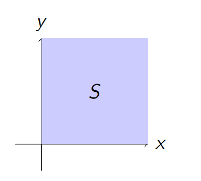
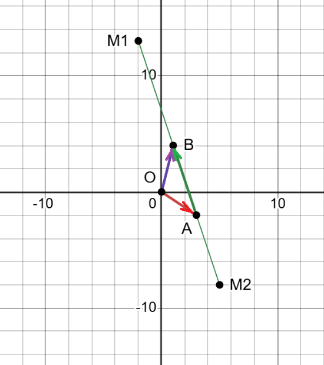



[Quiz](https://notebooklm.google.com/notebook/67a07b43-1cdf-4f8a-9ef7-0b35db695200?artifactId=70cc1a33-58ca-47bb-ad86-55bfecf31c1b) | [Flashcards](https://notebooklm.google.com/notebook/67a07b43-1cdf-4f8a-9ef7-0b35db695200?artifactId=0d043f0b-fe79-4a1c-bb8b-0752364c692b)

#### **1. Summary**
##### **1.1 Introduction to Vectors**
A **vector** is a fundamental mathematical object that possesses both *magnitude* (or length) and *direction*. It's distinct from a **scalar**, which is a simple numerical value (like temperature or speed) that has magnitude but no direction. Think of a vector as an instruction to travel a certain distance in a specific direction.

Vectors can be represented in several ways:

###### **1.1.1 Geometric Representation**
As a directed line segment, or an arrow, in space. The arrow's length represents the magnitude, and the direction it points represents its direction. A key property is that a vector is *independent of its starting position*; two arrows with the same length and direction represent the same vector, regardless of where they are in space. This makes them "free-floating" instructions.

<!-- DIAGRAM HERE -->

###### **1.1.2 Algebraic Representation**
As an ordered list of numbers, called **components**. For instance, in a 2D plane (denoted $\mathbb{R}^2$), a vector is represented by two components $(x, y)$, and in 3D space ($\mathbb{R}^3$), by three components $(x, y, z)$. These components correspond to the vector's projection onto the coordinate axes. By convention in linear algebra, vectors are often written as **column vectors**:
$$ \vec{v} = \begin{pmatrix} x \\ y \end{pmatrix} $$
A **row vector** is written as $(x, y)$. The two are not interchangeable, but one can be converted to the other using the *transpose* operation: $\begin{pmatrix} x \\ y \end{pmatrix}^T = (x, y)$.

###### **1.1.3 Vector Notation**
Vectors can be denoted by bold lowercase letters (e.g., **v**), a letter with an arrow above it (e.g., $\vec{v}$), or by their start and end points (e.g., $\vec{AB}$, representing the vector from point A to point B). Points are denoted by capital letters (e.g., A, B). Scalars are denoted by regular lowercase letters (e.g., c, k, $\alpha$).

##### **1.2 Basic Vector Operations**
Standard arithmetic operations are defined for vectors, allowing them to be manipulated algebraically.

###### **1.2.1 Vector Addition**
To add two vectors, you add their corresponding components. Geometrically, this is represented by the *tip-to-tail method*: place the tail of the second vector at the tip of the first. The resulting vector (the sum) goes from the tail of the first vector to the tip of the second, forming a triangle.
$$ \vec{u} + \vec{v} = \begin{pmatrix} u_1 \\ u_2 \end{pmatrix} + \begin{pmatrix} v_1 \\ v_2 \end{pmatrix} = \begin{pmatrix} u_1 + v_1 \\ u_2 + v_2 \end{pmatrix} $$
<!-- DIAGRAM HERE -->

###### **1.2.2 Scalar Multiplication**
To multiply a vector by a scalar, you multiply each of its components by that scalar. This operation *scales* the vector, changing its magnitude. If the scalar is positive, the direction remains the same. If negative, the direction is reversed. A scalar of 2 doubles the vector's length; a scalar of -0.5 halves its length and flips its direction.
$$ c\vec{v} = c\begin{pmatrix} v_1 \\ v_2 \end{pmatrix} = \begin{pmatrix} cv_1 \\ cv_2 \end{pmatrix} $$

###### **1.2.3 Vector Subtraction**
Subtraction is defined as adding the negative of a vector. That is, $\vec{u} - \vec{v}$ is the same as $\vec{u} + (-1)\vec{v}$. Geometrically, the vector $\vec{u} - \vec{v}$ is the vector that points from the tip of $\vec{v}$ to the tip of $\vec{u}$.
$$ \vec{u} - \vec{v} = \begin{pmatrix} u_1 \\ u_2 \end{pmatrix} - \begin{pmatrix} v_1 \\ v_2 \end{pmatrix} = \begin{pmatrix} u_1 - v_1 \\ u_2 - v_2 \end{pmatrix} $$

##### **1.3 Vector Magnitude and Normalization**

###### **1.3.1 Norm of a Vector**
The **norm** (or magnitude/length) of a vector is a non-negative scalar value representing its length. It is calculated using the Pythagorean theorem on its components. The norm of a vector $\vec{v}$ is denoted as $||\vec{v}||$.
$$ ||\vec{v}|| = \sqrt{v_1^2 + v_2^2 + \dots + v_n^2} $$

###### **1.3.2 Unit Vectors**
A **unit vector** is any vector with a norm of 1. It is useful for representing a pure direction without any magnitude. To **normalize** a non-zero vector (i.e., to find the unit vector in its direction), you divide the vector by its own norm.
$$ \hat{u} = \frac{\vec{v}}{||\vec{v}||} $$

###### **1.3.3 Standard Unit Vectors**
In Cartesian coordinate systems, there are special unit vectors that point along the axes. In $\mathbb{R}^3$, these are:

*   $\vec{i} = \begin{pmatrix} 1 \\ 0 \\ 0 \end{pmatrix}$ (along the x-axis)
*   $\vec{j} = \begin{pmatrix} 0 \\ 1 \\ 0 \end{pmatrix}$ (along the y-axis)
*   $\vec{k} = \begin{pmatrix} 0 \\ 0 \\ 1 \end{pmatrix}$ (along the z-axis)
Any vector in $\mathbb{R}^3$ can be written as a sum of these: $\begin{pmatrix} a \\ b \\ c \end{pmatrix} = a\vec{i} + b\vec{j} + c\vec{k}$.

###### **1.3.4 Distance Between Points**
The straight-line distance between two points, say $P$ and $Q$, can be found by first calculating the vector $\vec{PQ}$ that connects them ($\vec{PQ} = Q - P$) and then finding the norm of that vector.
$$ d(P, Q) = ||\vec{PQ}|| = ||Q - P|| = \sqrt{(q_1-p_1)^2 + (q_2-p_2)^2 + \dots} $$

##### **1.4 Vector Spaces and Subspaces**

###### **1.4.1 Vector Space**
A **vector space** is a collection of objects (called vectors) for which two operations are defined: vector addition and scalar multiplication. For a set to be considered a vector space, it must satisfy a set of ten rules, known as axioms. These axioms ensure that vectors behave in a consistent and predictable manner.

Let **u**, **v**, and **w** be vectors in a vector space V, and let c and d be scalars. The ten axioms are as follows:

*   **Axioms of Vector Addition:**
    1.  **Closure under Addition**: For any two vectors **u** and **v** in V, their sum **u** + **v** is also in V.
    2.  **Commutativity of Addition**: For any two vectors **u** and **v** in V, **u** + **v** = **v** + **u**.
    3.  **Associativity of Addition**: For any vectors **u**, **v**, and **w** in V, (**u** + **v**) + **w** = **u** + (**v** + **w**).
    4.  **Existence of a Zero Vector**: There is a unique vector in V, called the **zero vector** (denoted as **0**), such that for any vector **u** in V, **u** + **0** = **u**.
    5.  **Existence of an Additive Inverse**: For every vector **u** in V, there is a corresponding vector -**u** in V, known as the **additive inverse**, such that **u** + (-**u**) = **0**.
*   **Axioms of Scalar Multiplication:**
    6.  **Closure under Scalar Multiplication**: For any vector **u** in V and any scalar c, the product c**u** is also in V.
    7.  **Distributivity of Scalar Multiplication over Vector Addition**: For any scalar c and any vectors **u** and **v** in V, c(**u** + **v**) = c**u** + c**v**.
    8.  **Distributivity of Scalar Multiplication over Scalar Addition**: For any scalars c and d and any vector **u** in V, (c + d)**u** = c**u** + d**u**.
    9.  **Associativity of Scalar Multiplication**: For any scalars c and d and any vector **u** in V, (cd)**u** = c(d**u**).
    10. **Scalar Multiplication Identity**: For any vector **u** in V, 1**u** = **u**, where 1 is the multiplicative identity.
*   **Examples of Vector Spaces**:
    *   **ℝⁿ**: The set of all n-dimensional vectors with real number components is the most common example of a vector space.
    *   **Pₙ**: The set of all polynomials of degree at most *n*. For instance, 3x² - x + 5 is a vector in P₂.
    *   The set of all continuous functions.
*   **Non-Example**: The set of all vectors in the first quadrant of ℝ² (where x ≥ 0, y ≥ 0) is *not* a vector space. This is because it fails the axiom of closure under scalar multiplication. If you multiply a vector in the first quadrant by a negative scalar (like -1), the resulting vector will be in the third quadrant, which is outside of the original set.

###### **1.4.2 Subspace**
A **subspace** is a subset of a larger vector space that is itself a vector space. To verify if a subset is a subspace, a simplified test called the **Subspace Test** is used. A subset $H$ is a subspace if it meets three conditions:

1.  It contains the **zero vector**.
2.  It is **closed under addition** (if $\vec{u}$ and $\vec{v}$ are in $H$, then $\vec{u} + \vec{v}$ must also be in $H$).
3.  It is **closed under scalar multiplication** (if $\vec{u}$ is in $H$ and $c$ is any scalar, then $c\vec{u}$ must also be in $H$).
*   **Key Examples of Subspaces**:
    *   Any line or plane passing through the origin in $\mathbb{R}^3$ is a subspace of $\mathbb{R}^3$.
    *   The **null space** of a matrix A, which is the set of all solutions to the homogeneous equation $A\vec{x} = \vec{0}$, is always a subspace.

###### **1.4.3 Centroid of a Triangle**
For a triangle with vertices at points A, B, and C, the **centroid** (or center of mass) is the unique point G such that the vectors from G to each vertex sum to the zero vector: $\vec{GA} + \vec{GB} + \vec{GC} = \vec{0}$. The position vector of the centroid is the average of the position vectors of its vertices: $\vec{OG} = \frac{1}{3}(\vec{OA} + \vec{OB} + \vec{OC})$. The centroid is always located inside the triangle.

##### **1.5 Linear Combinations, Span, and Basis**

###### **1.5.1 Linear Combination and Span**
A **linear combination** is a new vector formed by adding together scalar multiples of other vectors. For example, $\vec{w} = c_1\vec{v}_1 + c_2\vec{v}_2$ is a linear combination of $\vec{v}_1$ and $\vec{v}_2$. The **span** of a set of vectors is the set of *all possible* linear combinations that can be formed from them. The span of a set of vectors always forms a vector space (or a subspace). For instance, the span of two non-collinear vectors in $\mathbb{R}^3$ is a plane passing through the origin.
<!-- DIAGRAM HERE -->

###### **1.5.2 Linear Independence**
A set of vectors is **linearly independent** if no vector in the set can be written as a linear combination of the others. This means that none of the vectors are redundant; each one contributes a unique direction. The only way to form the zero vector from a linear combination of linearly independent vectors is if all the scalar coefficients are zero (the *trivial solution*).

###### **1.5.3 Linear Dependence**
A set of vectors is **linearly dependent** if at least one vector can be expressed as a linear combination of the others. This indicates redundancy in the set. Geometrically, two vectors are linearly dependent if they lie on the same line, and three vectors are linearly dependent if they lie on the same plane.

###### **1.5.4 Basis and Dimension**
A **basis** of a vector space is a set of vectors that is both *linearly independent* and *spans the entire space*. A basis provides a minimal set of "building blocks" for the space. While a vector space can have many different bases, the number of vectors in every basis for that space is always the same. This unique number is called the **dimension** of the vector space. For example, the dimension of $\mathbb{R}^3$ is 3, because a standard basis for it is the set of three vectors: $\{\vec{i}, \vec{j}, \vec{k}\}$.

#### **2. Definitions**

*   **Vector**: A mathematical object that has both magnitude (length) and direction.
*   **Scalar**: A quantity that is fully described by a magnitude alone (a single number).
*   **Norm**: The length or magnitude of a vector, denoted by $||\vec{v}||$.
*   **Unit Vector**: A vector with a norm of 1, often used to represent direction.
*   **Standard Unit Vectors**: The vectors $\vec{i}, \vec{j}, \vec{k}$ that form the basis for the Cartesian coordinate system.
*   **Vector Space**: A collection of vectors and a field of scalars that satisfy a set of ten axioms, defining a consistent system for vector addition and scalar multiplication.
*   **Subspace**: A subset of a vector space that is itself a vector space under the same operations.
*   **Null Space**: The set of all vectors $\vec{x}$ that are solutions to the homogeneous equation $A\vec{x} = \vec{0}$. The null space of a matrix is always a subspace.
*   **Centroid**: The point in a triangle where the medians intersect; its position vector is the average of the vertices' position vectors.
*   **Linear Combination**: A sum of vectors, each multiplied by a scalar coefficient.
*   **Span**: The set of all possible linear combinations of a given set of vectors. The span of a set of vectors is always a subspace.
*   **Linearly Independent**: A set of vectors where no vector can be written as a linear combination of the others.
*   **Linearly Dependent**: A set of vectors where at least one vector can be written as a linear combination of the others.
*   **Basis**: A set of vectors that is both linearly independent and spans the vector space. It is a minimal generating set for the space.
*   **Dimension**: The number of vectors in any basis for a vector space.

#### **3. Formulas**
*   **Vector Addition**: $$ \vec{u} + \vec{v} = \begin{pmatrix} u_1 + v_1 \\ u_2 + v_2 \end{pmatrix} $$
*   **Scalar Multiplication**: $$ c\vec{v} = \begin{pmatrix} cv_1 \\ cv_2 \end{pmatrix} $$
*   **Vector Subtraction**: $$ \vec{u} - \vec{v} = \begin{pmatrix} u_1 - v_1 \\ u_2 - v_2 \end{pmatrix} $$
*   **Norm of a Vector in $\mathbb{R}^n$**: $$ ||\vec{v}|| = \sqrt{v_1^2 + v_2^2 + \dots + v_n^2} $$
*   **Distance between Points P and Q**: $d(P, Q) = ||Q - P||$
*   **Normalization (Unit Vector)**: $$ \hat{u} = \frac{\vec{v}}{||\vec{v}||} $$
*   **Midpoint of a Segment**: $$ \vec{OM} = \frac{1}{2}(\vec{OB} + \vec{OC}) $$
*   **Position Vector of Centroid G**: $$ \vec{OG} = \frac{1}{3}(\vec{OA} + \vec{OB} + \vec{OC}) $$
*   **Linear Independence Condition**: $c_1\vec{v_1} + c_2\vec{v_2} + \dots + c_n\vec{v_n} = \vec{0}$ has only the trivial solution ($c_1=c_2=\dots=c_n=0$).
*   **Condition for Basis in $\mathbb{R}^n$ using Determinant**: The vectors $\{\vec{v_1}, \dots, \vec{v_n}\}$ form a basis if $det([\vec{v_1} \dots \vec{v_n}]) \neq 0$.
*   **Projection of vector $\vec{a}$ onto vector $\vec{b}$**: $$ \text{proj}_{\vec{b}}\vec{a} = \frac{\vec{a} \cdot \vec{b}}{||\vec{b}||^2} \vec{b} $$
*   **Reflection of vector $\vec{a}$ over a line defined by vector $\vec{b}$**: $$ \text{ref}_{\vec{b}}\vec{a} = 2 \cdot \text{proj}_{\vec{b}}\vec{a} - \vec{a} $$

#### **4. Examples**
##### **4.1. Express a Vector as a Linear Combination** (Lecture 1, Example)
Determine if the vector $w = \begin{pmatrix} 7 \\ 2 \end{pmatrix}$ can be expressed as a linear combination of $u = \begin{pmatrix} 1 \\ 2 \end{pmatrix}$ and $v = \begin{pmatrix} 3 \\ 1 \end{pmatrix}$.

Click to see the solution

1.  **Set up the equation:** We need to find scalars $c_1$ and $c_2$ such that $c_1u + c_2v = w$.
    *   $c_1 \begin{pmatrix} 1 \\ 2 \end{pmatrix} + c_2 \begin{pmatrix} 3 \\ 1 \end{pmatrix} = \begin{pmatrix} 7 \\ 2 \end{pmatrix}$
2.  **Convert to a system of linear equations:**
    *   $1c_1 + 3c_2 = 7$
    *   $2c_1 + 1c_2 = 2$
3.  **Solve the system:**
    *   From the second equation, $c_2 = 2 - 2c_1$.
    *   Substitute this into the first equation: $c_1 + 3(2 - 2c_1) = 7$.
    *   $c_1 + 6 - 6c_1 = 7 \Rightarrow -5c_1 = 1 \Rightarrow c_1 = -1/5$.
    *   Substitute $c_1$ back to find $c_2$: $c_2 = 2 - 2(-1/5) = 2 + 2/5 = 12/5$.
4.  **Conclusion:** Since we found a solution for $c_1$ and $c_2$, the vector w can be expressed as a linear combination of u and v.

**Answer:** Yes, $w = -\frac{1}{5}u + \frac{12}{5}v$.

##### **4.2. Determine Linear Dependence** (Lecture 1, Example)
Determine if the set of vectors $v_1 = \begin{bmatrix} 1 \\ 2 \end{bmatrix}$, $v_2 = \begin{bmatrix} 3 \\ 4 \end{bmatrix}$, $v_3 = \begin{bmatrix} 5 \\ 6 \end{bmatrix}$ is linearly dependent.

Click to see the solution

1.  **Set up the equation for linear dependence:** We need to check if there exist scalars $\alpha_1, \alpha_2, \alpha_3$, not all zero, such that $\alpha_1v_1 + \alpha_2v_2 + \alpha_3v_3 = \mathbf{0}$.
    *   $\alpha_1 \begin{bmatrix} 1 \\ 2 \end{bmatrix} + \alpha_2 \begin{bmatrix} 3 \\ 4 \end{bmatrix} + \alpha_3 \begin{bmatrix} 5 \\ 6 \end{bmatrix} = \begin{bmatrix} 0 \\ 0 \end{bmatrix}$
2.  **Convert to a system of linear equations:**
    *   $1\alpha_1 + 3\alpha_2 + 5\alpha_3 = 0$
    *   $2\alpha_1 + 4\alpha_2 + 6\alpha_3 = 0$
3.  **Solve the system:** We can find a non-trivial solution. For instance, if we let $\alpha_3 = 1$:
    *   $\alpha_1 + 3\alpha_2 = -5$
    *   $2\alpha_1 + 4\alpha_2 = -6 \Rightarrow \alpha_1 + 2\alpha_2 = -3$
    *   Subtracting the two equations gives: $(\alpha_1 + 3\alpha_2) - (\alpha_1 + 2\alpha_2) = -5 - (-3) \Rightarrow \alpha_2 = -2$.
    *   Substituting back: $\alpha_1 + 3(-2) = -5 \Rightarrow \alpha_1 = 1$.
4.  **Conclusion:** We found a non-trivial solution ($\alpha_1 = 1, \alpha_2 = -2, \alpha_3 = 1$).

**Answer:** The set is **linearly dependent**.

##### **4.3. Determine Linear Independence** (Lecture 1, Example)
Determine if the set of vectors $v_1 = \begin{bmatrix} 1 \\ 0 \end{bmatrix}$, $v_2 = \begin{bmatrix} 0 \\ 1 \end{bmatrix}$ is linearly independent.

Click to see the solution

1.  **Set up the equation for linear independence:** We check if the only solution to $\alpha_1v_1 + \alpha_2v_2 = \mathbf{0}$ is the trivial solution ($\alpha_1 = 0, \alpha_2 = 0$).
    *   $\alpha_1 \begin{bmatrix} 1 \\ 0 \end{bmatrix} + \alpha_2 \begin{bmatrix} 0 \\ 1 \end{bmatrix} = \begin{bmatrix} 0 \\ 0 \end{bmatrix}$
2.  **Combine the vectors:**
    *   $\begin{bmatrix} \alpha_1 \\ \alpha_2 \end{bmatrix} = \begin{bmatrix} 0 \\ 0 \end{bmatrix}$
3.  **Solve for the scalars:** This directly implies that $\alpha_1 = 0$ and $\alpha_2 = 0$.
4.  **Conclusion:** The only solution is the trivial solution.

**Answer:** The set is **linearly independent**.

##### **4.4. Determine Linear Independence in R²** (Lecture 1, Linear Independence Example)
Determine if the vectors $v_1 = \begin{pmatrix} 1 \\ 2 \end{pmatrix}$ and $v_2 = \begin{pmatrix} 2 \\ 4 \end{pmatrix}$ in $\mathbb{R}^2$ are linearly independent.

Click to see the solution

1.  **Set up the equation for linear independence:** We need to find if there is a non-trivial solution for the scalars $c_1, c_2$ in the equation $c_1v_1 + c_2v_2 = \mathbf{0}$.
    *   $c_1 \begin{pmatrix} 1 \\ 2 \end{pmatrix} + c_2 \begin{pmatrix} 2 \\ 4 \end{pmatrix} = \begin{pmatrix} 0 \\ 0 \end{pmatrix}$
2.  **Convert to a system of linear equations:**
    *   $c_1 + 2c_2 = 0$
    *   $2c_1 + 4c_2 = 0$
3.  **Solve the system:** The second equation is simply two times the first equation. This means there are infinitely many solutions. We can find a non-trivial solution.
    *   For example, let $c_2 = -1$. Then from the first equation, $c_1 + 2(-1) = 0 \Rightarrow c_1 = 2$.
4.  **Conclusion:** We found a non-trivial solution ($c_1 = 2, c_2 = -1$). The vectors are scalar multiples of each other ($v_2 = 2v_1$).

**Answer:** The vectors are **linearly dependent**.

##### **4.5. Determine Linear Independence in R³** (Lecture 1, Linear Independence Example)
Determine if the standard basis vectors $v_1 = \begin{pmatrix} 1 \\ 0 \\ 0 \end{pmatrix}$, $v_2 = \begin{pmatrix} 0 \\ 1 \\ 0 \end{pmatrix}$, and $v_3 = \begin{pmatrix} 0 \\ 0 \\ 1 \end{pmatrix}$ in $\mathbb{R}^3$ are linearly independent.

Click to see the solution

1.  **Set up the equation for linear independence:** We check if the only solution to $c_1v_1 + c_2v_2 + c_3v_3 = \mathbf{0}$ is the trivial solution ($c_1=c_2=c_3=0$).
    *   $c_1 \begin{pmatrix} 1 \\ 0 \\ 0 \end{pmatrix} + c_2 \begin{pmatrix} 0 \\ 1 \\ 0 \end{pmatrix} + c_3 \begin{pmatrix} 0 \\ 0 \\ 1 \end{pmatrix} = \begin{pmatrix} 0 \\ 0 \\ 0 \end{pmatrix}$
2.  **Combine the vectors:**
    *   $\begin{pmatrix} c_1 \\ c_2 \\ c_3 \end{pmatrix} = \begin{pmatrix} 0 \\ 0 \\ 0 \end{pmatrix}$
3.  **Solve for the scalars:** This directly implies that $c_1 = 0$, $c_2 = 0$, and $c_3 = 0$.
4.  **Conclusion:** Since the only solution is the trivial one, the vectors are linearly independent.

**Answer:** The vectors are **linearly independent**.

##### **4.6. Describe the Span of a Set of Vectors** (Lecture 1, Example)
In $\mathbb{R}^3$, what is the Span of the set of vectors $\left\{ \begin{bmatrix} 1 \\ 0 \\ 0 \end{bmatrix}, \begin{bmatrix} 0 \\ 1 \\ 0 \end{bmatrix} \right\}$?

Click to see the solution

1.  **Definition of Span:** The span of a set of vectors is the set of all possible linear combinations of those vectors.
2.  **Form a general linear combination:** Let the vectors be $v_1$ and $v_2$. Any vector in the span can be written as $c_1v_1 + c_2v_2$ for some scalars $c_1, c_2 \in \mathbb{R}$.
    *   $c_1 \begin{bmatrix} 1 \\ 0 \\ 0 \end{bmatrix} + c_2 \begin{bmatrix} 0 \\ 1 \\ 0 \end{bmatrix} = \begin{bmatrix} c_1 \\ c_2 \\ 0 \end{bmatrix}$
3.  **Interpret the result:** The resulting vectors can have any value for the first two components (the x and y components) but the third component (the z component) is always 0.
4.  **Geometric Interpretation:** The set of all vectors of the form $(a, b, 0)$ constitutes the xy-plane in a 3-dimensional coordinate system.

**Answer:** The span is the **xy-plane**, which consists of all vectors of the form $\begin{bmatrix} a \\ b \\ 0 \end{bmatrix}$.

##### **4.7. Check for a Subspace of R²** (Lecture 1, Example 1)
Determine if the set $H = \left\{ \begin{bmatrix} t \\ 2t \end{bmatrix} | t \in \mathbb{R} \right\}$, which represents the line y = 2x, is a subspace of $\mathbb{R}^2$.

Click to see the solution

1.  **Check for the Zero Vector:** We must verify if the zero vector $\begin{bmatrix} 0 \\ 0 \end{bmatrix}$ is in H.
    *   If we let $t=0$, we get $\begin{bmatrix} 0 \\ 2(0) \end{bmatrix} = \begin{bmatrix} 0 \\ 0 \end{bmatrix}$. The zero vector is in H.
2.  **Check for Closure under Addition:** Let $u = \begin{bmatrix} t_1 \\ 2t_1 \end{bmatrix}$ and $v = \begin{bmatrix} t_2 \\ 2t_2 \end{bmatrix}$ be two arbitrary vectors in H. We must check if their sum $u+v$ is also in H.
    *   $u + v = \begin{bmatrix} t_1 + t_2 \\ 2t_1 + 2t_2 \end{bmatrix} = \begin{bmatrix} t_1 + t_2 \\ 2(t_1 + t_2) \end{bmatrix}$.
    *   This resulting vector has the form $\begin{bmatrix} t' \\ 2t' \end{bmatrix}$ where $t' = t_1 + t_2$. So, it is in H.
3.  **Check for Closure under Scalar Multiplication:** Let $u = \begin{bmatrix} t \\ 2t \end{bmatrix}$ be a vector in H and $\alpha$ be a scalar. We must check if $\alpha u$ is in H.
    *   $\alpha u = \alpha \begin{bmatrix} t \\ 2t \end{bmatrix} = \begin{bmatrix} \alpha t \\ \alpha (2t) \end{bmatrix} = \begin{bmatrix} \alpha t \\ 2(\alpha t) \end{bmatrix}$.
    *   This resulting vector has the form $\begin{bmatrix} t' \\ 2t' \end{bmatrix}$ where $t' = \alpha t$. So, it is in H.

**Answer:** All three conditions are met. H **is a subspace** of $\mathbb{R}^2$.

##### **4.8. Check for a Subspace of R²** (Lecture 1, Example 2)
Determine if the set $K = \left\{ \begin{bmatrix} t \\ 2t + 1 \end{bmatrix} | t \in \mathbb{R} \right\}$, which represents the line y = 2x + 1, is a subspace of $\mathbb{R}^2$.

Click to see the solution

1.  **Check for the Zero Vector:** We must verify if the zero vector $\begin{bmatrix} 0 \\ 0 \end{bmatrix}$ is in K.
    *   For the vector to be $\begin{bmatrix} 0 \\ 0 \end{bmatrix}$, we would need $t=0$ for the first component.
    *   However, if we substitute $t=0$ into the second component, we get $2(0) + 1 = 1$.
    *   This means the vector in K for $t=0$ is $\begin{bmatrix} 0 \\ 1 \end{bmatrix}$, not $\begin{bmatrix} 0 \\ 0 \end{bmatrix}$.
    *   It is impossible to find a value of t for which $\begin{bmatrix} t \\ 2t + 1 \end{bmatrix} = \begin{bmatrix} 0 \\ 0 \end{bmatrix}$.
2.  **Conclusion:** The set does not contain the zero vector. Therefore, it cannot be a subspace.

**Answer:** K fails the first condition. It **is not a subspace**.

##### **4.9. Prove the Null Space is a Subspace** (Lecture 1, Example 3)
Let H be the set of all solutions to a homogeneous system $A\mathbf{x} = \mathbf{0}$. Prove that H is a subspace of $\mathbb{R}^n$.

Click to see the solution

1.  **Check for the Zero Vector:** We need to check if the zero vector $\mathbf{0}$ is in H.
    *   $A\mathbf{0} = \mathbf{0}$. This is always true for any matrix A. So, the zero vector is a solution and is in H.
2.  **Check for Closure under Addition:** Let $\mathbf{u}$ and $\mathbf{v}$ be two vectors in H. This means $A\mathbf{u} = \mathbf{0}$ and $A\mathbf{v} = \mathbf{0}$. We must check if their sum $\mathbf{u}+\mathbf{v}$ is in H.
    *   $A(\mathbf{u} + \mathbf{v}) = A\mathbf{u} + A\mathbf{v}$ (by the distributive property of matrix multiplication).
    *   $A\mathbf{u} + A\mathbf{v} = \mathbf{0} + \mathbf{0} = \mathbf{0}$.
    *   Since $A(\mathbf{u} + \mathbf{v}) = \mathbf{0}$, the sum is in H.
3.  **Check for Closure under Scalar Multiplication:** Let $\mathbf{u}$ be in H ($A\mathbf{u} = \mathbf{0}$) and let $\alpha$ be a scalar. We must check if $\alpha\mathbf{u}$ is in H.
    *   $A(\alpha\mathbf{u}) = \alpha(A\mathbf{u})$ (by the properties of matrix multiplication).
    *   $\alpha(A\mathbf{u}) = \alpha\mathbf{0} = \mathbf{0}$.
    *   Since $A(\alpha\mathbf{u}) = \mathbf{0}$, the scalar multiple is in H.

**Answer:** All three conditions are satisfied. The solution set of any homogeneous system (also known as the **null space** of A) is always a subspace.

##### **4.10. Calculate the Norm of a Vector** (Lecture 1, Example)
Calculate the norm (or magnitude) of the vector $\vec{v} = \begin{bmatrix} 2 \\ 3 \\ 1 \end{bmatrix}$.

Click to see the solution

1.  **Recall the formula for the norm:** The norm of a vector $v = (v_1, v_2, \dots, v_n)$ is given by $||\vec{v}|| = \sqrt{v_1^2 + v_2^2 + \dots + v_n^2}$.
2.  **Apply the formula:**
    *   $||\vec{v}|| = \sqrt{2^2 + 3^2 + 1^2}$.
3.  **Calculate the result:**
    *   $||\vec{v}|| = \sqrt{4 + 9 + 1} = \sqrt{14}$.

**Answer:** The norm of the vector is **$\sqrt{14}$**.

##### **4.11. Calculate the Distance Between Points** (Lecture 1, Example)
Calculate the distance between the points $P = (1, 2, 0)$ and $Q = (3, 5, 4)$ in $\mathbb{R}^3$.

Click to see the solution

1.  **Understand the concept:** The distance between two points P and Q is the norm (length) of the vector connecting them, which can be found by $P-Q$ or $Q-P$. The distance is denoted as $||P-Q||$.
2.  **Recall the distance formula:** For points $P=(p_1, p_2, p_3)$ and $Q=(q_1, q_2, q_3)$, the distance is $\sqrt{(q_1-p_1)^2 + (q_2-p_2)^2 + (q_3-p_3)^2}$.
3.  **Apply the formula:**
    *   Distance = $\sqrt{(3-1)^2 + (5-2)^2 + (4-0)^2}$.
4.  **Calculate the result:**
    *   Distance = $\sqrt{2^2 + 3^2 + 4^2} = \sqrt{4 + 9 + 16} = \sqrt{29}$.

**Answer:** The distance between P and Q is **$\sqrt{29}$**.

##### **4.12. Find a Unit Vector** (Lecture 1, Example)
Find the unit vector $\vec{u}$ that has the same direction as the vector $\vec{v} = \begin{bmatrix} 2 \\ 3 \\ 1 \end{bmatrix}$.

Click to see the solution

1.  **Recall the definition of a unit vector:** A unit vector has a norm (length) of 1. To find the unit vector in the direction of a given vector $\vec{v}$, we must divide the vector by its own norm.
    *   $\vec{u} = \frac{1}{||\vec{v}||} \vec{v}$.
2.  **Calculate the norm of $\vec{v}$:**
    *   $||\vec{v}|| = \sqrt{2^2 + 3^2 + 1^2} = \sqrt{4 + 9 + 1} = \sqrt{14}$.
3.  **Divide the vector by its norm:**
    *   $\vec{u} = \frac{1}{\sqrt{14}} \begin{bmatrix} 2 \\ 3 \\ 1 \end{bmatrix}$.
4.  **Write the resulting vector:**
    *   $\vec{u} = \begin{bmatrix} 2/\sqrt{14} \\ 3/\sqrt{14} \\ 1/\sqrt{14} \end{bmatrix}$.
5.  **Verification (Optional):** Check that the norm of $\vec{u}$ is 1.
    *   $||\vec{u}|| = \sqrt{(\frac{2}{\sqrt{14}})^2 + (\frac{3}{\sqrt{14}})^2 + (\frac{1}{\sqrt{14}})^2} = \sqrt{\frac{4}{14} + \frac{9}{14} + \frac{1}{14}} = \sqrt{\frac{14}{14}} = \sqrt{1} = 1$.

**Answer:** The unit vector is $\vec{u} = \begin{bmatrix} 2/\sqrt{14} \\ 3/\sqrt{14} \\ 1/\sqrt{14} \end{bmatrix}$.

##### **4.13. Finding Unknown Coordinates of a Vector** (Tutorial 1, Question 1)
Determine the unknown coordinate in each case if $\vec{AB} \cong \vec{CD}$.

*   A(3, 5), B(4, 6), C(−2, 5), D(x, y)
*   A(−1, 1), B(3, 5), C(x, y), D(2x, 1)

Click to see the solution

Two vectors are congruent (or equivalent) if they have the same components (same magnitude and direction). The components of a vector from point P1 to P2 are found by (P2 - P1).

1.  **First case:**
    *   **Compute $\vec{AB}$:** $\vec{AB} = B - A = (4-3, 6-5) = (1, 1)$.
    *   **Compute $\vec{CD}$:** $\vec{CD} = D - C = (x - (-2), y - 5) = (x+2, y-5)$.
    *   **Set components equal:** For the vectors to be congruent, their components must be equal.
        *   $x + 2 = 1 \implies x = -1$.
        *   $y - 5 = 1 \implies y = 6$.
    *   **Answer:** $D = (-1, 6)$.
2.  **Second case:**
    *   **Compute $\vec{AB}$:** $\vec{AB} = B - A = (3 - (-1), 5 - 1) = (4, 4)$.
    *   **Compute $\vec{CD}$:** $\vec{CD} = D - C = (2x - x, 1 - y) = (x, 1-y)$.
    *   **Set components equal:**
        *   $x = 4$.
        *   $1 - y = 4 \implies y = -3$.
    *   **Answer:** $C = (4, -3)$.

##### **4.14. Calculating Triangle Properties from Coordinates** (Tutorial 1, Question 2)
Consider three points $A(-1, 0, 0)$, $B(2, 0, \sqrt{7})$, and $C(3, \sqrt{2}, \sqrt{7})$ as three vertices of a triangle ABC. Compute:

*   The perimeter of this triangle
*   Compute the midsegment AM

Click to see the solution

1.  **Part 1: Compute the perimeter:**
    *   The perimeter is the sum of the lengths of the three sides: $||\vec{AB}|| + ||\vec{BC}|| + ||\vec{AC}||$.
    *   **Length of AB:** $||\vec{AB}|| = ||B-A|| = ||(2 - (-1), 0-0, \sqrt{7}-0)|| = ||(3, 0, \sqrt{7})||$.
        *   $\sqrt{3^2 + 0^2 + (\sqrt{7})^2} = \sqrt{9 + 0 + 7} = \sqrt{16} = 4$.
    *   **Length of BC:** $||\vec{BC}|| = ||C-B|| = ||(3-2, \sqrt{2}-0, \sqrt{7}-\sqrt{7})|| = ||(1, \sqrt{2}, 0)||$.
        *   $\sqrt{1^2 + (\sqrt{2})^2 + 0^2} = \sqrt{1 + 2 + 0} = \sqrt{3}$.
    *   **Length of AC:** $||\vec{AC}|| = ||C-A|| = ||(3 - (-1), \sqrt{2}-0, \sqrt{7}-0)|| = ||(4, \sqrt{2}, \sqrt{7})||$.
        *   $\sqrt{4^2 + (\sqrt{2})^2 + (\sqrt{7})^2} = \sqrt{16 + 2 + 7} = \sqrt{25} = 5$.
    *   **Perimeter:** $4 + \sqrt{3} + 5 = 9 + \sqrt{3}$.
2.  **Part 2: Compute the midsegment AM:**
    *   First, find the coordinates of the midpoint M of the segment BC.
        *   $M = \left( \frac{B_x+C_x}{2}, \frac{B_y+C_y}{2}, \frac{B_z+C_z}{2} \right) = \left( \frac{2+3}{2}, \frac{0+\sqrt{2}}{2}, \frac{\sqrt{7}+\sqrt{7}}{2} \right) = \left( \frac{5}{2}, \frac{\sqrt{2}}{2}, \sqrt{7} \right)$.
    *   The midsegment AM is the vector from point A to point M.
        *   $\vec{AM} = M - A = \left( \frac{5}{2} - (-1), \frac{\sqrt{2}}{2} - 0, \sqrt{7} - 0 \right) = \left( \frac{7}{2}, \frac{\sqrt{2}}{2}, \sqrt{7} \right)$.

**Answer:**
*   The perimeter is **$9 + \sqrt{3}$**.
*   The midsegment vector is **$\vec{AM} = \left( \frac{7}{2}, \frac{\sqrt{2}}{2}, \sqrt{7} \right)$**.

##### **4.15. Performing Vector Operations** (Tutorial 1, Question 3)
Let $\vec{u} = (4, -3)$ and let $\vec{v}$ be the vector represented by $\vec{AB}$, where $A(2, -1)$ and $B(-1, 3)$.

*   Find a point D such that $\vec{AD}$ is a representative for $\vec{u} + \vec{v}$.
*   Find a scalar c such that $\vec{u} + c\vec{v} = (1, 1)$.
*   Compute $||\vec{u} - 2\vec{v}||$.

Click to see the solution

1.  **First, compute the vector $\vec{v}$:**
    *   $\vec{v} = \vec{AB} = B - A = (-1 - 2, 3 - (-1)) = (-3, 4)$.
2.  **Part 1: Find point D:**
    *   Calculate the sum vector: $\vec{w} = \vec{u} + \vec{v} = (4, -3) + (-3, 4) = (1, 1)$.
    *   We need to find a point $D(x, y)$ such that $\vec{AD} = \vec{w}$.
    *   $\vec{AD} = D - A = (x-2, y - (-1)) = (x-2, y+1)$.
    *   Set the components equal: $(x-2, y+1) = (1, 1)$.
    *   This gives $x-2=1 \implies x=3$ and $y+1=1 \implies y=0$.
    *   **Answer:** $D = (3, 0)$.
3.  **Part 2: Find scalar c:**
    *   Set up the equation: $\vec{u} + c\vec{v} = (1, 1)$.
    *   $(4, -3) + c(-3, 4) = (1, 1)$.
    *   $(4 - 3c, -3 + 4c) = (1, 1)$.
    *   This gives a system of two equations:
        *   $4 - 3c = 1 \implies 3 = 3c \implies c = 1$.
        *   $-3 + 4c = 1 \implies 4c = 4 \implies c = 1$.
    *   **Answer:** $c = 1$.
4.  **Part 3: Compute the norm:**
    *   First, calculate the vector $\vec{z} = \vec{u} - 2\vec{v}$.
    *   $\vec{z} = (4, -3) - 2(-3, 4) = (4, -3) - (-6, 8) = (4 - (-6), -3 - 8) = (10, -11)$.
    *   Now compute the norm of $\vec{z}$: $||\vec{z}|| = \sqrt{10^2 + (-11)^2} = \sqrt{100 + 121} = \sqrt{221}$.
    *   **Answer:** $||\vec{u} - 2\vec{v}|| = \sqrt{221}$.

##### **4.16. Showing Linear Dependence and Independence** (Tutorial 1, Question 4)
Show that:

*   $\vec{u} = (1, 2)$ and $\vec{v} = (3, 6)$ are linearly dependent.
*   $\vec{u} = (1, 2)$ and $\vec{v} = (-1, 2)$ are linearly independent.
*   $\vec{u} = (1, 2)$, $\vec{v} = (1, 0)$, $\vec{w} = (0, 1)$ are linearly dependent.

Click to see the solution

1.  **Part 1: $\vec{u} = (1, 2)$ and $\vec{v} = (3, 6)$**
    *   Two vectors are linearly dependent if one is a scalar multiple of the other.
    *   We can see that $\vec{v} = 3 \times \vec{u}$, since $3 \times (1, 2) = (3, 6)$.
    *   Because a non-zero scalar multiple exists, the vectors are **linearly dependent**.
2.  **Part 2: $\vec{u} = (1, 2)$ and $\vec{v} = (-1, 2)$**
    *   We check if the only solution to $c_1\vec{u} + c_2\vec{v} = \mathbf{0}$ is the trivial solution ($c_1=c_2=0$).
    *   $c_1(1, 2) + c_2(-1, 2) = (0, 0)$.
    *   This gives the system:
        *   $c_1 - c_2 = 0 \implies c_1 = c_2$.
        *   $2c_1 + 2c_2 = 0$.
    *   Substitute $c_1=c_2$ into the second equation: $2c_1 + 2c_1 = 0 \implies 4c_1 = 0 \implies c_1 = 0$.
    *   Since $c_1=c_2$, then $c_2$ must also be 0. The only solution is the trivial one.
    *   Therefore, the vectors are **linearly independent**.
3.  **Part 3: $\vec{u} = (1, 2)$, $\vec{v} = (1, 0)$, $\vec{w} = (0, 1)$**
    *   A set of $m$ vectors in $\mathbb{R}^n$ is always linearly dependent if $m > n$. Here we have 3 vectors in $\mathbb{R}^2$, so they must be linearly dependent.
    *   Alternatively, we can find a non-trivial linear combination that equals the zero vector. We can express $\vec{u}$ in terms of the standard basis vectors $\vec{v}$ and $\vec{w}$:
    *   $\vec{u} = (1, 2) = 1 \cdot (1, 0) + 2 \cdot (0, 1) = 1\vec{v} + 2\vec{w}$.
    *   Rearranging gives: $1\vec{u} - 1\vec{v} - 2\vec{w} = \mathbf{0}$.
    *   This is a non-trivial combination (the scalars are 1, -1, -2), so the vectors are **linearly dependent**.

##### **4.17. Proving a Set of Polynomials is a Vector Space** (Tutorial 1, Question 5)
Prove that $P_n$, the set of all polynomials of degree at most $n$, is a vector space under standard polynomial addition and scalar multiplication. How about the set of continuous functions?

Click to see the solution

To prove that $P_n$ is a vector space, we can show it is a subspace of the vector space of all functions. We need to check three conditions.

1.  **Condition 1: Contains the Zero Vector**
    *   The zero vector in this context is the zero polynomial, $p(x) = 0$.
    *   The degree of the zero polynomial is typically defined as $-\infty$, which is less than or equal to n. Therefore, the zero polynomial is in $P_n$.
2.  **Condition 2: Closure under Addition**
    *   Let $p(x)$ and $q(x)$ be two polynomials in $P_n$. This means $\text{deg}(p) \le n$ and $\text{deg}(q) \le n$.
    *   The degree of their sum is given by $\text{deg}(p+q) \le \max(\text{deg}(p), \text{deg}(q))$.
    *   Since both degrees are at most $n$, their maximum is also at most $n$. Thus, $p(x) + q(x)$ is also in $P_n$.
3.  **Condition 3: Closure under Scalar Multiplication**
    *   Let $p(x)$ be a polynomial in $P_n$ and let $\alpha$ be any real scalar.
    *   If $\alpha \neq 0$, then $\text{deg}(\alpha p) = \text{deg}(p) \le n$.
    *   If $\alpha = 0$, then $\alpha p(x)$ is the zero polynomial, which is in $P_n$.
    *   Thus, $\alpha p(x)$ is in $P_n$.

**Conclusion:** Since all three conditions are satisfied, $P_n$ is a vector space.

**How about the set of continuous functions?**
Yes, the set of all continuous functions on a given interval is also a vector space.

1.  The zero function, $f(x)=0$, is continuous.
2.  The sum of any two continuous functions is also a continuous function.
3.  A scalar multiple of a continuous function is also a continuous function.

##### **4.18. Showing a Set is Not a Vector Space** (Tutorial 1, Question 6)
The set $S = \left\{ \begin{bmatrix} x \\ y \end{bmatrix} \in \mathbb{R}^2 | x \ge 0, y \ge 0 \right\}$ (The first quadrant). Show that S does not define a vector space.

Click to see the solution

To show that S is not a vector space, we only need to find one vector space axiom that it fails. Let's check the closure axioms.

1.  **Check Closure under Scalar Multiplication:**
    *   A set is closed under scalar multiplication if for any vector $\vec{v}$ in the set and any scalar $c$, the vector $c\vec{v}$ is also in the set.
    *   Let's choose a vector that is clearly in S, for example, $\vec{v} = \begin{bmatrix} 1 \\ 1 \end{bmatrix}$ (since $1 \ge 0$).
    *   Now, let's choose a negative scalar, for example, $c = -1$.
    *   Compute the product: $c\vec{v} = (-1) \begin{bmatrix} 1 \\ 1 \end{bmatrix} = \begin{bmatrix} -1 \\ -1 \end{bmatrix}$.
    *   The resulting vector $\begin{bmatrix} -1 \\ -1 \end{bmatrix}$ is not in S because its components are not greater than or equal to 0.
2.  **Conclusion:** The set S is not closed under scalar multiplication.

**Answer:** Since S violates at least one of the vector space axioms, it is **not a vector space**.

##### **4.19. Computing a Vector Projection** (Tutorial 1, Question 7)
Consider the following figure and compute the vector a' in terms of the vectors a and b.

Click to see the solution

1.  **Identify the relationship:** The vector $\vec{a'}$ shown in the diagram is the **orthogonal projection** of vector $\vec{a}$ onto the line defined by vector $\vec{b}$.
2.  **Recall the formula for vector projection:** The projection of a vector $\vec{a}$ onto a non-zero vector $\vec{b}$ is given by the formula:
    *   $\text{proj}_{\vec{b}}\vec{a} = \left( \frac{\vec{a} \cdot \vec{b}}{||\vec{b}||^2} \right) \vec{b}$
3.  **Break down the formula:**
    *   $\vec{a} \cdot \vec{b}$ is the dot product of the two vectors.
    *   $||\vec{b}||^2$ is the square of the magnitude (norm) of vector $\vec{b}$. Note that $||\vec{b}||^2 = \vec{b} \cdot \vec{b}$.
    *   The entire fraction is a scalar quantity that scales the vector $\vec{b}$.

**Answer:** The vector $\vec{a'}$ is given by the formula $\vec{a'} = \left( \frac{\vec{a} \cdot \vec{b}}{||\vec{b}||^2} \right) \vec{b}$.

##### **4.20. Computing a Vector Reflection** (Tutorial 1, Question 8)
Consider the following figure and compute the vector a" in terms of the vectors a and b.

Click to see the solution

1.  **Identify the relationship:** The vector $\vec{a''}$ is the reflection of the vector $\vec{a}$ across the line containing the vector $\vec{b}$. The vector $\vec{a'}$ is the projection of $\vec{a}$ onto $\vec{b}$.
2.  **Analyze the geometry:** From the diagram (specifically the dashed parallelogram), we can see that the vector from the tip of $\vec{a}$ to the tip of $\vec{a'}$ is the same as the vector from the tip of $\vec{a'}$ to the tip of $\vec{a''}$. Let's call this vector $\vec{d}$.
    *   $\vec{a} + \vec{d} = \vec{a'}$  so $\vec{d} = \vec{a'} - \vec{a}$.
    *   Also, $\vec{a'} + \vec{d} = \vec{a''}$.
3.  **Formulate an equation for $\vec{a''}$:**
    *   Substitute the first equation into the second: $\vec{a''} = \vec{a'} + (\vec{a'} - \vec{a}) = 2\vec{a'} - \vec{a}$.
4.  **Use the projection formula from the previous question:** We know that $\vec{a'} = \text{proj}_{\vec{b}}\vec{a} = \left( \frac{\vec{a} \cdot \vec{b}}{||\vec{b}||^2} \right) \vec{b}$.
5.  **Substitute to get the final formula:**
    *   $\vec{a''} = 2 \left( \frac{\vec{a} \cdot \vec{b}}{||\vec{b}||^2} \right) \vec{b} - \vec{a}$.

**Answer:** The vector $\vec{a''}$ is given by the formula $\vec{a''} = 2 \cdot \text{proj}_{\vec{b}}\vec{a} - \vec{a}$, which is $2 \left( \frac{\vec{a} \cdot \vec{b}}{||\vec{b}||^2} \right) \vec{b} - \vec{a}$.

##### **4.21. Finding a Point on a Line Segment** (Lab 1, Example 1)
Points $A(3, -2)$ and $B(1, 4)$ are given. The point M is on the line AB in the way that $|AM| = 3|AB|$. Find coordinates of the point M, if:

1.  The points M and B are on the same side from A.
2.  The points M and B are on different sides from A.

Click to see the solution

Let $\vec{a}$ be the position vector for point A, and $\vec{b}$ for B, etc. We are given the relationship between the magnitudes of the vectors $\vec{AM}$ and $\vec{AB}$.

1.  **Case 1: M and B are on the same side from A.**
    *   This implies that the vectors $\vec{AM}$ and $\vec{AB}$ have the same direction.
    *   Therefore, the vector relationship is $\vec{AM} = 3\vec{AB}$.
    *   Let M have coordinates $(x, y)$. Then $\vec{m} - \vec{a} = 3(\vec{b} - \vec{a})$.
    *   $\vec{m} = \vec{a} + 3\vec{b} - 3\vec{a} = 3\vec{b} - 2\vec{a}$.
    *   Calculate the coordinates:
        *   $x = 3(1) - 2(3) = 3 - 6 = -3$.
        *   $y = 3(4) - 2(-2) = 12 + 4 = 16$.
    *   **Answer:** $M_1 = (-3, 16)$.
2.  **Case 2: M and B are on different sides from A.**
    *   This implies that the vectors $\vec{AM}$ and $\vec{AB}$ have opposite directions.
    *   Therefore, the vector relationship is $\vec{AM} = -3\vec{AB}$.
    *   $\vec{m} - \vec{a} = -3(\vec{b} - \vec{a})$.
    *   $\vec{m} = \vec{a} - 3\vec{b} + 3\vec{a} = 4\vec{a} - 3\vec{b}$.
    *   Calculate the coordinates:
        *   $x = 4(3) - 3(1) = 12 - 3 = 9$.
        *   $y = 4(-2) - 3(4) = -8 - 12 = -20$.
    *   **Answer:** $M_2 = (9, -20)$.

##### **4.22. Finding the Centroid of a Triangle** (Lab 1, Example 2)
In the plane of the triangle ABC, find the point G such that $\vec{GA} + \vec{GB} + \vec{GC} = \mathbf{0}$. Are there such points outside of the triangle?

Click to see the solution

1.  **Set up the vector equation:** Let the position vectors of the points be $\vec{a}$, $\vec{b}$, $\vec{c}$, and $\vec{g}$.
    *   The equation is $(\vec{a} - \vec{g}) + (\vec{b} - \vec{g}) + (\vec{c} - \vec{g}) = \mathbf{0}$.
2.  **Solve for the position vector of G, $\vec{g}$:**
    *   $\vec{a} + \vec{b} + \vec{c} - 3\vec{g} = \mathbf{0}$.
    *   $3\vec{g} = \vec{a} + \vec{b} + \vec{c}$.
    *   $\vec{g} = \frac{\vec{a} + \vec{b} + \vec{c}}{3}$.
3.  **Interpret the result:** The coordinates of point G are the average of the coordinates of the vertices A, B, and C. This is the definition of the **centroid** (or center of mass) of the triangle.
4.  **Location of the point:** The centroid of a triangle is always located inside the triangle.

**Answer:** The point G is the centroid of the triangle. There are no such points outside of the triangle.

##### **4.23. Checking if a Set of Vectors is a Basis** (Lab 1, Example 3a)
Check if the following set of vectors is a basis. Explain your answer:
$\left\{ \begin{bmatrix} 1 \\ 0 \end{bmatrix} + \begin{bmatrix} 0 \\ 2 \end{bmatrix} \right\}$

Click to see the solution

1.  **Simplify the set:** First, perform the vector addition.
    *   $\begin{bmatrix} 1 \\ 0 \end{bmatrix} + \begin{bmatrix} 0 \\ 2 \end{bmatrix} = \begin{bmatrix} 1 \\ 2 \end{bmatrix}$.
    *   The set is $\left\{ \begin{bmatrix} 1 \\ 2 \end{bmatrix} \right\}$.
2.  **Recall the definition of a basis:** A basis for a vector space must satisfy two conditions:
    *   The vectors must be linearly independent.
    *   The vectors must span the entire vector space.
3.  **Analyze the set for the vector space $\mathbb{R}^2$:**
    *   **Spanning:** The span of a single vector is a line. A single vector cannot span the entire 2-dimensional plane $\mathbb{R}^2$.
    *   **Conclusion:** The set fails the spanning condition.

**Answer:** The set is **not a basis** for $\mathbb{R}^2$ because it contains only one vector, which is not enough to span a 2-dimensional space.

##### **4.24. Checking if a Set of Vectors is a Basis** (Lab 1, Example 3b)
Check if the following set of vectors is a basis. Explain your answer:
$\left\{ \begin{bmatrix} 1 \\ 0 \end{bmatrix}, \begin{bmatrix} 0 \\ 2 \end{bmatrix} \right\}$

Click to see the solution

1.  **Recall the definition of a basis for $\mathbb{R}^2$:** A basis for $\mathbb{R}^2$ must contain exactly two linearly independent vectors.
2.  **Check for linear independence:** We need to see if the only solution to $c_1\begin{bmatrix} 1 \\ 0 \end{bmatrix} + c_2\begin{bmatrix} 0 \\ 2 \end{bmatrix} = \begin{bmatrix} 0 \\ 0 \end{bmatrix}$ is the trivial solution ($c_1=c_2=0$).
    *   $\begin{bmatrix} c_1 \\ 2c_2 \end{bmatrix} = \begin{bmatrix} 0 \\ 0 \end{bmatrix}$.
    *   This implies $c_1 = 0$ and $2c_2 = 0$, which means $c_2 = 0$.
    *   Since the only solution is the trivial one, the vectors are linearly independent.
3.  **Check the number of vectors:** The set contains two vectors, which is the correct number for a basis of $\mathbb{R}^2$.
4.  **Conclusion:** The set consists of two linearly independent vectors in $\mathbb{R}^2$.

**Answer:** The set **is a basis** for $\mathbb{R}^2$.

##### **4.25. Checking if a Set of Vectors is a Basis** (Lab 1, Example 3c)
Check if the following set of vectors is a basis. Explain your answer:
$\left\{ \begin{bmatrix} 1 \\ 2 \\ 3 \end{bmatrix} \right\}$

Click to see the solution

1.  **Recall the definition of a basis for $\mathbb{R}^3$:** A basis for $\mathbb{R}^3$ must contain exactly three linearly independent vectors.
2.  **Analyze the set:** The given set contains only one vector.
3.  **Check the spanning condition:** The span of a single vector is a line passing through the origin. A single vector cannot span the entire 3-dimensional space $\mathbb{R}^3$.
4.  **Conclusion:** The set does not have enough vectors to span the space.

**Answer:** The set is **not a basis** for $\mathbb{R}^3$.

##### **4.26. Checking if a Set of Vectors is a Basis** (Lab 1, Example 3d)
Check if the following set of vectors is a basis. Explain your answer:
$\left\{ \begin{bmatrix} 1 \\ 0 \\ 0 \end{bmatrix}, \begin{bmatrix} 0 \\ 2 \\ 0 \end{bmatrix}, \begin{bmatrix} 0 \\ 0 \\ 3 \end{bmatrix} \right\}$

Click to see the solution

1.  **Recall the definition of a basis for $\mathbb{R}^3$:** A basis for $\mathbb{R}^3$ must contain exactly three linearly independent vectors.
2.  **Check for linear independence:** We check if the only solution to $c_1\begin{bmatrix} 1 \\ 0 \\ 0 \end{bmatrix} + c_2\begin{bmatrix} 0 \\ 2 \\ 0 \end{bmatrix} + c_3\begin{bmatrix} 0 \\ 0 \\ 3 \end{bmatrix} = \begin{bmatrix} 0 \\ 0 \\ 0 \end{bmatrix}$ is the trivial solution.
    *   $\begin{bmatrix} c_1 \\ 2c_2 \\ 3c_3 \end{bmatrix} = \begin{bmatrix} 0 \\ 0 \\ 0 \end{bmatrix}$.
    *   This implies $c_1 = 0$, $2c_2 = 0 \implies c_2=0$, and $3c_3 = 0 \implies c_3=0$.
    *   The only solution is the trivial one, so the vectors are linearly independent.
3.  **Check the number of vectors:** The set contains three vectors, which is the dimension of $\mathbb{R}^3$.
4.  **Conclusion:** The set consists of three linearly independent vectors in $\mathbb{R}^3$.

**Answer:** The set **is a basis** for $\mathbb{R}^3$.

##### **4.27. Checking if a Set of Vectors is a Basis** (Lab 1, Example 3e)
Check if the following set of vectors is a basis. Explain your answer:
$\left\{ \begin{bmatrix} 1 \\ 0 \\ 0 \end{bmatrix}, \begin{bmatrix} 0 \\ 2 \\ 0 \end{bmatrix} \right\}$

Click to see the solution

1.  **Recall the definition of a basis for $\mathbb{R}^3$:** A basis for $\mathbb{R}^3$ must contain exactly three linearly independent vectors.
2.  **Analyze the set:** The given set contains only two vectors.
3.  **Check the spanning condition:** The span of these two vectors is the set of all vectors of the form $\begin{bmatrix} c_1 \\ 2c_2 \\ 0 \end{bmatrix}$. This forms the xy-plane but cannot represent any vector with a non-zero z-component. Therefore, the set does not span $\mathbb{R}^3$.
4.  **Conclusion:** The set does not have enough vectors to span the space.

**Answer:** The set is **not a basis** for $\mathbb{R}^3$.

##### **4.28. Checking if a Set of Vectors is a Basis** (Lab 1, Example 3f)
Check if the following set of vectors is a basis. Explain your answer:
$\left\{ \begin{bmatrix} 1 \\ 2 \\ 1 \end{bmatrix}, \begin{bmatrix} 3 \\ 1 \\ 4 \end{bmatrix}, \begin{bmatrix} 5 \\ 5 \\ 6 \end{bmatrix} \right\}$

Click to see the solution

1.  **Recall the definition of a basis for $\mathbb{R}^3$:** A basis for $\mathbb{R}^3$ must contain exactly three linearly independent vectors. We have the correct number of vectors, so we must check for linear independence.
2.  **Check for linear independence:** We set up the equation $c_1v_1 + c_2v_2 + c_3v_3 = \mathbf{0}$ and solve for the scalars. This is equivalent to solving the matrix equation $A\mathbf{c} = \mathbf{0}$, where the vectors are the columns of matrix A. The vectors are linearly independent if and only if the determinant of A is non-zero.
    *   $A = \begin{bmatrix} 1 & 3 & 5 \\ 2 & 1 & 5 \\ 1 & 4 & 6 \end{bmatrix}$
3.  **Calculate the determinant of A:**
    *   det(A) = $1(1 \cdot 6 - 5 \cdot 4) - 3(2 \cdot 6 - 5 \cdot 1) + 5(2 \cdot 4 - 1 \cdot 1)$
    *   = $1(6 - 20) - 3(12 - 5) + 5(8 - 1)$
    *   = $1(-14) - 3(7) + 5(7)$
    *   = $-14 - 21 + 35 = 0$.
4.  **Conclusion:** Since the determinant is 0, the matrix is singular, which means there are non-trivial solutions to the system. Therefore, the vectors are linearly dependent.

**Answer:** The set is **not a basis** for $\mathbb{R}^3$ because the vectors are linearly dependent.

##### **4.29. Finding an Unknown Vector Component from its Norm** (Homework 1, Task 1)
Three vectors are given: $\mathbf{a} = \begin{bmatrix} 2 \\ x \end{bmatrix}$, $\mathbf{b} = \begin{bmatrix} 1 \\ 1 \end{bmatrix}$, $\mathbf{c} = \begin{bmatrix} x \\ 3 \end{bmatrix}$. Find x such that $\mathbf{v} = \mathbf{a} - \mathbf{b} + \mathbf{c}$ and $||\mathbf{v}|| = \sqrt{13}$.

Click to see the solution

1.  **Calculate the vector $\mathbf{v}$ in terms of x:**
    *   $\mathbf{v} = \mathbf{a} - \mathbf{b} + \mathbf{c} = \begin{bmatrix} 2 \\ x \end{bmatrix} - \begin{bmatrix} 1 \\ 1 \end{bmatrix} + \begin{bmatrix} x \\ 3 \end{bmatrix}$
    *   $\mathbf{v} = \begin{bmatrix} 2 - 1 + x \\ x - 1 + 3 \end{bmatrix} = \begin{bmatrix} 1 + x \\ x + 2 \end{bmatrix}$
2.  **Calculate the squared norm of $\mathbf{v}$:**
    *   $||\mathbf{v}||^2 = (1+x)^2 + (x+2)^2$
3.  **Set up the equation using the given norm:**
    *   We are given $||\mathbf{v}|| = \sqrt{13}$, so $||\mathbf{v}||^2 = 13$.
    *   $(1+x)^2 + (x+2)^2 = 13$
4.  **Solve the quadratic equation for x:**
    *   Expand the terms: $(1 + 2x + x^2) + (x^2 + 4x + 4) = 13$
    *   Combine like terms: $2x^2 + 6x + 5 = 13$
    *   Set the equation to zero: $2x^2 + 6x - 8 = 0$
    *   Divide by 2: $x^2 + 3x - 4 = 0$
    *   Factor the equation: $(x+4)(x-1) = 0$
5.  **Find the possible values for x:**
    *   The solutions are $x = 1$ and $x = -4$.

**Answer:** $x = \{1, -4\}$.

##### **4.30. Finding Conditions for a Basis in R³** (Homework 1, Task 2)
Find such that $x$ that $\mathbf{a} = \begin{bmatrix} 1 \\ x \\ 3 \end{bmatrix}$, $\mathbf{b} = \begin{bmatrix} 2 \\ 1 \\ 1 \end{bmatrix}$, $\mathbf{c} = \begin{bmatrix} 3 \\ 2 \\ 4 \end{bmatrix}$ form a basis in $\mathbb{R}^3$.

Click to see the solution

1.  **Recall the conditions for a basis in $\mathbb{R}^3$:** A set of three vectors in $\mathbb{R}^3$ forms a basis if and only if the vectors are linearly independent.
2.  **Use the determinant to check for linear independence:** The vectors are linearly independent if the determinant of the matrix formed by these vectors is non-zero. Let's form the matrix A with the vectors as columns.
    *   $A = \begin{bmatrix} 1 & 2 & 3 \\ x & 1 & 2 \\ 3 & 1 & 4 \end{bmatrix}$
3.  **Calculate the determinant of A:**
    *   $\text{det}(A) = 1(1 \cdot 4 - 2 \cdot 1) - 2(x \cdot 4 - 2 \cdot 3) + 3(x \cdot 1 - 1 \cdot 3)$
    *   $= 1(4 - 2) - 2(4x - 6) + 3(x - 3)$
    *   $= 2 - 8x + 12 + 3x - 9$
    *   $= -5x + 5$
4.  **Set the condition for a basis:** For the vectors to form a basis, the determinant must not be zero.
    *   $-5x + 5 \neq 0$
    *   $5 \neq 5x$
    *   $x \neq 1$

**Answer:** The vectors form a basis for all real numbers $x$ such that $x \neq 1$.

##### **4.31. Computing Vector Projection and Reflection** (Homework 1, Question 7)
Suppose $\mathbf{a} = (2, 2, -1)$ and $\mathbf{b} = (0, 4, 3)$. Compute the projection of $\mathbf{a}$ on $\mathbf{b}$ (the vector $\mathbf{a}'$) and the reflection of $\mathbf{a}$ over $\mathbf{b}$ (the vector $\mathbf{a}''$).

Click to see the solution

1.  **Step 1: Compute the projection $\mathbf{a}'$**
    *   **Recall the projection formula:** $\mathbf{a}' = \text{proj}_{\mathbf{b}}\mathbf{a} = \left( \frac{\mathbf{a} \cdot \mathbf{b}}{||\mathbf{b}||^2} \right) \mathbf{b}$.
    *   **Calculate the dot product $\mathbf{a} \cdot \mathbf{b}$:**
        *   $\mathbf{a} \cdot \mathbf{b} = (2)(0) + (2)(4) + (-1)(3) = 0 + 8 - 3 = 5$.
    *   **Calculate the squared norm $||\mathbf{b}||^2$:**
        *   $||\mathbf{b}||^2 = 0^2 + 4^2 + 3^2 = 0 + 16 + 9 = 25$.
    *   **Calculate the projection vector:**
        *   $\mathbf{a}' = \left( \frac{5}{25} \right) \mathbf{b} = \frac{1}{5} (0, 4, 3) = \left(0, \frac{4}{5}, \frac{3}{5}\right)$.
2.  **Step 2: Compute the reflection $\mathbf{a}''$**
    *   **Recall the reflection formula:** The reflection is given by $\mathbf{a}'' = 2\mathbf{a}' - \mathbf{a}$.
    *   **Substitute the known vectors:**
        *   $\mathbf{a}'' = 2\left(0, \frac{4}{5}, \frac{3}{5}\right) - (2, 2, -1)$.
    *   **Perform the vector arithmetic:**
        *   $\mathbf{a}'' = \left(0, \frac{8}{5}, \frac{6}{5}\right) - (2, 2, -1)$.
        *   $\mathbf{a}'' = \left(0 - 2, \frac{8}{5} - \frac{10}{5}, \frac{6}{5} - (-\frac{5}{5})\right)$.
        *   $\mathbf{a}'' = \left(-2, -\frac{2}{5}, \frac{11}{5}\right)$.

**Answer:**

*   The projection is $\mathbf{a}' = \left(0, \frac{4}{5}, \frac{3}{5}\right)$.
*   The reflection is $\mathbf{a}'' = \left(-2, -\frac{2}{5}, \frac{11}{5}\right)$.

