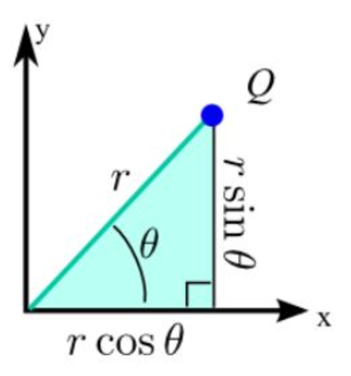
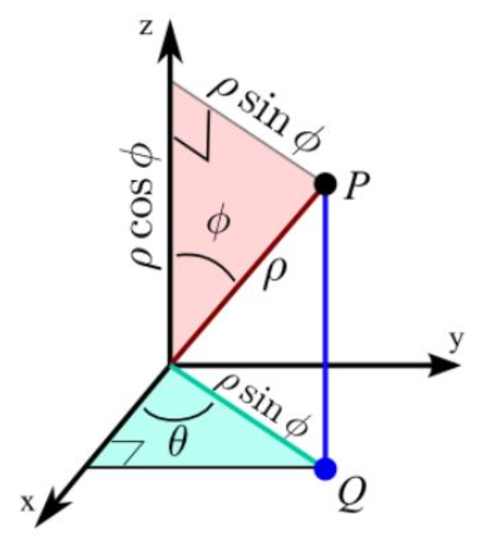

#### **1. Summary**
##### **1.1 Polar Coordinates**
**Polar coordinates** provide an alternative way to describe points in a plane using a distance and an angle, rather than horizontal and vertical displacements. While **Cartesian coordinates** use $(x, y)$ to specify a point's location, **polar coordinates** use $(r, \theta)$ where $r$ is the distance from the origin (called the **pole**) and $\theta$ is the angle measured counterclockwise from the positive $x$-axis (called the **polar axis**).

{width=50%}

Think of polar coordinates as giving directions: "Walk 5 meters at a 30-degree angle northeast from here." This is often more natural than saying "Walk 4.33 meters east and 2.5 meters north."

###### **1.1.1 Conversion Between Coordinate Systems**
To convert between Cartesian and polar coordinates, we use the following relationships:

**From Polar to Cartesian:**

$$ x = r \cos \theta $$
$$ y = r \sin \theta $$

These formulas come from basic trigonometry: if you draw a right triangle with hypotenuse $r$ at angle $\theta$, the horizontal leg is $r \cos \theta$ and the vertical leg is $r \sin \theta$.

**From Cartesian to Polar:**

$$ r = \sqrt{x^2 + y^2} $$
$$ \tan \theta = \frac{y}{x} $$

The first formula uses the Pythagorean theorem, and the second uses the definition of tangent. However, when finding $\theta$, you must consider which quadrant the point is in to get the correct angle.

###### **1.1.2 Converting Equations**
To convert a **Cartesian equation** to **polar form**, substitute $x = r \cos \theta$ and $y = r \sin \theta$ and simplify. The goal is an equation with only $r$ and $\theta$ as variables.

For example:

- The vertical line $x = 5$ becomes $r \cos \theta = 5$, or $r = 5 \sec \theta$
- The circle $x^2 + y^2 = 16$ becomes $r^2 = 16$, or simply $r = 4$
- The line $y = x$ becomes $r \sin \theta = r \cos \theta$, which simplifies to $\tan \theta = 1$, giving $\theta = \frac{\pi}{4}$

Some equations become much simpler in polar form (like circles centered at the origin), while others become more complex.

##### **1.2 Spherical Coordinates**
Just as polar coordinates extend Cartesian coordinates in 2D, **spherical coordinates** extend them to 3D space. While 3D Cartesian coordinates use $(x, y, z)$, spherical coordinates use $(\rho, \theta, \varphi)$ where:

- $\rho$ (rho) is the distance from the origin to the point
- $\theta$ (theta) is the azimuthal angle in the $xy$-plane from the positive $x$-axis (same as in 2D polar)
- $\varphi$ (phi) is the polar angle measured down from the positive $z$-axis

{width=50%}

Spherical coordinates are particularly useful when dealing with problems that have **spherical symmetry**, such as gravitational fields around planets, sound waves radiating from a point source, or navigation using latitude and longitude.

###### **1.2.1 Conversion Formulas for Spherical Coordinates**
**From Spherical to Cartesian:**

$$ x = \rho \sin \varphi \cos \theta $$
$$ y = \rho \sin \varphi \sin \theta $$
$$ z = \rho \cos \varphi $$

These formulas capture the 3D geometry: $\rho \sin \varphi$ gives the radius of the circle in the $xy$-plane, which is then split into $x$ and $y$ components using $\cos \theta$ and $\sin \theta$.

**From Cartesian to Spherical:**

$$ \rho = \sqrt{x^2 + y^2 + z^2} $$
$$ \theta = \arctan\left(\frac{y}{x}\right) \quad \text{(mind the quadrant)} $$
$$ \varphi = \arccos\left(\frac{z}{\rho}\right) $$

Standard ranges are: $\rho \geq 0$, $0 \leq \theta < 2\pi$, and $0 \leq \varphi \leq \pi$.

##### **1.3 Conic Sections**
**Conic sections** are curves obtained by intersecting a plane with a double cone. These include circles, ellipses, parabolas, and hyperbolas. They appear throughout mathematics, physics, and engineering—from planetary orbits to satellite dishes to architectural arches.

###### **1.3.1 Focus-Directrix Definition**
All conic sections (except circles) can be defined using a unified approach: A **conic section** is the set of all points $P$ such that the ratio of:

$$\frac{\text{Distance from } P \text{ to a fixed point (focus)}}{\text{Distance from } P \text{ to a fixed line (directrix)}} = e$$

where $e$ is called the **eccentricity**. This single parameter determines the type of conic:

- $e = 0$: **Circle** (special case where focus and center coincide)
- $0 < e < 1$: **Ellipse** (including circles)
- $e = 1$: **Parabola**
- $e > 1$: **Hyperbola**

The eccentricity measures how "stretched" the conic is. A circle has perfect symmetry ($e = 0$), while a parabola is the boundary case ($e = 1$), and hyperbolas are "open" curves ($e > 1$).

###### **1.3.2 Ellipses**
An **ellipse** is a closed curve where the sum of distances from any point on the curve to two fixed points (called **foci**) is constant. In standard form centered at the origin with horizontal major axis:

$$\frac{x^2}{a^2} + \frac{y^2}{b^2} = 1 \quad (a > b > 0)$$

For this ellipse:

- **Semi-major axis**: $a$ (half the longest diameter)
- **Semi-minor axis**: $b$ (half the shortest diameter)
- **Eccentricity**: $e = \sqrt{1 - \frac{b^2}{a^2}}$
- **Foci**: Located at $(\pm ae, 0) = (\pm c, 0)$ where $c = ae = \sqrt{a^2 - b^2}$
- **Directrices**: Vertical lines at $x = \pm \frac{a}{e}$

The closer $b$ is to $a$, the more circular the ellipse (smaller $e$). If $b = a$, we have a perfect circle with $e = 0$.

###### **1.3.3 Hyperbolas**
A **hyperbola** consists of two separate branches where the *difference* of distances from any point on the curve to two foci is constant. In standard form with horizontal transverse axis:

$$\frac{x^2}{a^2} - \frac{y^2}{b^2} = 1$$

For this hyperbola:

- **Vertices**: Located at $(\pm a, 0)$
- **Eccentricity**: $e = \sqrt{1 + \frac{b^2}{a^2}} > 1$
- **Foci**: Located at $(\pm ae, 0) = (\pm c, 0)$ where $c = ae = \sqrt{a^2 + b^2}$
- **Directrices**: Vertical lines at $x = \pm \frac{a}{e}$
- **Asymptotes**: Lines $y = \pm \frac{b}{a}x$ that the branches approach

Note that for hyperbolas, $c^2 = a^2 + b^2$ (with a plus sign), unlike ellipses where $c^2 = a^2 - b^2$ (with a minus sign).

###### **1.3.4 Parabolas**
A **parabola** is the set of points equidistant from a focus and a directrix. For a parabola opening to the right:

$$y^2 = 4px \quad (p > 0)$$

Properties:

- **Focus**: Located at $(p, 0)$
- **Directrix**: Vertical line $x = -p$
- **Eccentricity**: $e = 1$ (always)
- **Vertex**: At the origin $(0, 0)$

The parameter $p$ is the distance from the vertex to the focus (and also from the vertex to the directrix).

##### **1.4 Conic Sections in Polar Form**
When a conic section has one focus at the origin, it can be expressed elegantly in polar coordinates. This form is especially useful in astronomy and physics.

###### **1.4.1 General Polar Equation**
The general polar form for a conic with focus at the origin is:

$$r = \frac{ed}{1 \pm e \cos \theta} \quad \text{(vertical directrix)}$$

or

$$r = \frac{ed}{1 \pm e \sin \theta} \quad \text{(horizontal directrix)}$$

where:

- $e$ is the eccentricity
- $d$ is the perpendicular distance from the focus to the directrix
- The sign determines whether the directrix is to the right/above (+) or left/below (-) of the focus

###### **1.4.2 Converting Between Forms**
**Cartesian to Polar:** To convert an ellipse or hyperbola in standard Cartesian form to polar form:

1. Identify the parameters $a$, $b$, and calculate $e$
2. Find a focus location and shift coordinates so the focus is at the origin
3. Determine $d$ (distance from focus to directrix)
4. Apply the general polar formula with appropriate sign

**Polar to Cartesian:** To convert from polar to Cartesian:

1. Multiply both sides by the denominator
2. Substitute $x = r \cos \theta$, $y = r \sin \theta$, and $r = \sqrt{x^2 + y^2}$
3. Isolate any square root terms
4. Square both sides (if necessary)
5. Rearrange and complete the square to get standard form

#### **2. Definitions**
*   **Polar Coordinates**: A coordinate system that represents a point in the plane by $(r, \theta)$, where $r$ is the distance from the origin and $\theta$ is the angle from the positive $x$-axis.
*   **Pole**: The origin in the polar coordinate system.
*   **Polar Axis**: The positive $x$-axis in the polar coordinate system, from which angles are measured.
*   **Spherical Coordinates**: A 3D coordinate system that represents a point as $(\rho, \theta, \varphi)$, where $\rho$ is the distance from the origin, $\theta$ is the azimuthal angle in the $xy$-plane, and $\varphi$ is the polar angle from the positive $z$-axis.
*   **Conic Section**: A curve obtained by intersecting a plane with a double cone, including circles, ellipses, parabolas, and hyperbolas.
*   **Eccentricity**: A parameter $e$ that determines the type of conic section: $e = 0$ for circles, $0 < e < 1$ for ellipses, $e = 1$ for parabolas, and $e > 1$ for hyperbolas.
*   **Focus (Foci)**: A fixed point (or points) used in the geometric definition of a conic section.
*   **Directrix**: A fixed line used in the focus-directrix definition of a conic section.
*   **Ellipse**: A conic section with eccentricity $0 < e < 1$, appearing as a closed oval curve where the sum of distances from any point to two foci is constant.
*   **Hyperbola**: A conic section with eccentricity $e > 1$, consisting of two separate branches where the difference of distances from any point to two foci is constant.
*   **Parabola**: A conic section with eccentricity $e = 1$, where every point is equidistant from a focus and a directrix.
*   **Semi-major Axis**: For an ellipse, half the length of the longest diameter, denoted $a$.
*   **Semi-minor Axis**: For an ellipse, half the length of the shortest diameter, denoted $b$.
*   **Vertex (Vertices)**: The points where a conic section intersects its axis of symmetry.
*   **Asymptotes**: Lines that a hyperbola's branches approach but never touch.

#### **3. Formulas**
*   **Polar to Cartesian Conversion**: $x = r \cos \theta$, $y = r \sin \theta$
*   **Cartesian to Polar Conversion**: $r = \sqrt{x^2 + y^2}$, $\tan \theta = \frac{y}{x}$
*   **Spherical to Cartesian Conversion**: $x = \rho \sin \varphi \cos \theta$, $y = \rho \sin \varphi \sin \theta$, $z = \rho \cos \varphi$
*   **Cartesian to Spherical Conversion**: $\rho = \sqrt{x^2 + y^2 + z^2}$, $\theta = \arctan\left(\frac{y}{x}\right)$, $\varphi = \arccos\left(\frac{z}{\rho}\right)$
*   **Ellipse Eccentricity**: $e = \sqrt{1 - \frac{b^2}{a^2}} = \frac{c}{a}$ where $c = \sqrt{a^2 - b^2}$
*   **Hyperbola Eccentricity**: $e = \sqrt{1 + \frac{b^2}{a^2}} = \frac{c}{a}$ where $c = \sqrt{a^2 + b^2}$
*   **Ellipse Standard Form**: $\frac{x^2}{a^2} + \frac{y^2}{b^2} = 1$ (horizontal major axis, $a > b$)
*   **Hyperbola Standard Form**: $\frac{x^2}{a^2} - \frac{y^2}{b^2} = 1$ (horizontal transverse axis)
*   **Parabola Standard Forms**: $y^2 = 4px$ (right-opening), $x^2 = 4py$ (upward-opening)
*   **Ellipse Foci**: $(\pm ae, 0) = (\pm c, 0)$ for horizontal major axis
*   **Ellipse Directrices**: $x = \pm \frac{a}{e}$ for horizontal major axis
*   **Hyperbola Foci**: $(\pm ae, 0) = (\pm c, 0)$ for horizontal transverse axis
*   **Hyperbola Directrices**: $x = \pm \frac{a}{e}$ for horizontal transverse axis
*   **Hyperbola Asymptotes**: $y = \pm \frac{b}{a}x$ for standard form $\frac{x^2}{a^2} - \frac{y^2}{b^2} = 1$
*   **Parabola Focus**: $(p, 0)$ for $y^2 = 4px$
*   **Parabola Directrix**: $x = -p$ for $y^2 = 4px$
*   **Conic in Polar Form (Vertical Directrix)**: $r = \frac{ed}{1 \pm e \cos \theta}$
*   **Conic in Polar Form (Horizontal Directrix)**: $r = \frac{ed}{1 \pm e \sin \theta}$
*   **Line Through Two Points in Polar**: $r[r_2 \sin(\theta - \theta_2) - r_1 \sin(\theta - \theta_1)] = r_1 r_2 \sin(\theta_2 - \theta_1)$
*   **Line Through Two Points in Polar (Alternative)**: $\frac{1}{r} \sin(\theta_2 - \theta_1) = \frac{1}{r_2} \sin(\theta - \theta_1) - \frac{1}{r_1} \sin(\theta - \theta_2)$

#### **4. Examples**
##### **4.1. Convert $x = 5$ to Polar Form** (Lab 12, Problem 1)
Convert the Cartesian equation $x = 5$ into polar form. Simplify your answer as much as possible.

Click to see the solution

**Key Concept:** Substitute $x = r \cos \theta$ and simplify.

1.  **Substitute the conversion formula:**
    $$x = 5 \implies r \cos \theta = 5$$
2.  **Solve for $r$:**
    $$r = \frac{5}{\cos \theta} = 5 \sec \theta$$

**Answer:** $r = 5 \sec \theta$

##### **4.2. Convert $y = -3$ to Polar Form** (Lab 12, Problem 2)
Convert the Cartesian equation $y = -3$ into polar form.

Click to see the solution

1.  **Substitute the conversion formula:**
    $$y = -3 \implies r \sin \theta = -3$$
2.  **Solve for $r$:**
    $$r = \frac{-3}{\sin \theta} = -3 \csc \theta$$

**Answer:** $r = -3 \csc \theta$

##### **4.3. Convert $y = x$ to Polar Form** (Lab 12, Problem 3)
Convert the Cartesian equation $y = x$ into polar form.

Click to see the solution

1.  **Substitute the conversion formulas:**
    $$y = x \implies r \sin \theta = r \cos \theta$$
2.  **Divide both sides by $r \cos \theta$ (assuming $r \neq 0$):**
    $$\frac{\sin \theta}{\cos \theta} = 1$$
    $$\tan \theta = 1$$
3.  **Solve for $\theta$:**
    $$\theta = \frac{\pi}{4} \text{ or } \theta = \frac{5\pi}{4}$$

**Answer:** $\theta = \frac{\pi}{4}$ or $\theta = \frac{5\pi}{4}$ (These represent the same line through the origin)

##### **4.4. Convert $y = 7x$ to Polar Form** (Lab 12, Problem 4)
Convert the Cartesian equation $y = 7x$ into polar form.

Click to see the solution

1.  **Substitute the conversion formulas:**
    $$y = 7x \implies r \sin \theta = 7r \cos \theta$$
2.  **Divide by $r \cos \theta$:**
    $$\tan \theta = 7$$
3.  **Solve for $\theta$:**
    $$\theta = \arctan(7)$$

**Answer:** $\theta = \arctan(7)$ (plus $\pi$ for the opposite direction)

##### **4.5. Convert $x^2 + y^2 = 16$ to Polar Form** (Lab 12, Problem 5)
Convert the Cartesian equation $x^2 + y^2 = 16$ into polar form.

Click to see the solution

**Key Concept:** Use the identity $r^2 = x^2 + y^2$.

1.  **Apply the identity:**
    $$x^2 + y^2 = 16 \implies r^2 = 16$$
2.  **Take the positive square root:**
    $$r = 4$$

**Answer:** $r = 4$ (This represents a circle of radius 4 centered at the origin)

##### **4.6. Convert $x^2 + y^2 = 2x$ to Polar Form** (Lab 12, Problem 6)
Convert the Cartesian equation $x^2 + y^2 = 2x$ into polar form.

Click to see the solution

1.  **Substitute conversion formulas:**
    $$x^2 + y^2 = 2x \implies r^2 = 2r \cos \theta$$
2.  **Rearrange:**
    $$r^2 - 2r \cos \theta = 0$$
    $$r(r - 2 \cos \theta) = 0$$
3.  **Solve (excluding $r = 0$):**
    $$r = 2 \cos \theta$$

**Answer:** $r = 2 \cos \theta$ (This represents a circle)

##### **4.7. Convert $x^2 + y^2 = 9y$ to Polar Form** (Lab 12, Problem 7)
Convert the Cartesian equation $x^2 + y^2 = 9y$ into polar form.

Click to see the solution

1.  **Substitute conversion formulas:**
    $$x^2 + y^2 = 9y \implies r^2 = 9r \sin \theta$$
2.  **Rearrange:**
    $$r^2 - 9r \sin \theta = 0$$
    $$r(r - 9 \sin \theta) = 0$$
3.  **Solve (excluding $r = 0$):**
    $$r = 9 \sin \theta$$

**Answer:** $r = 9 \sin \theta$

##### **4.8. Convert $xy = 1$ to Polar Form** (Lab 12, Problem 8)
Convert the Cartesian equation $xy = 1$ into polar form.

Click to see the solution

1.  **Substitute conversion formulas:**
    $$xy = 1 \implies (r \cos \theta)(r \sin \theta) = 1$$
    $$r^2 \cos \theta \sin \theta = 1$$
2.  **Use the double angle identity $\sin 2\theta = 2\sin \theta \cos \theta$:**
    $$\frac{r^2 \sin 2\theta}{2} = 1$$
    $$r^2 \sin 2\theta = 2$$
3.  **Solve for $r^2$:**
    $$r^2 = \frac{2}{\sin 2\theta} = 2 \csc 2\theta$$

**Answer:** $r^2 = 2 \csc 2\theta$

##### **4.9. Convert $y = x^2$ to Polar Form** (Lab 12, Problem 9)
Convert the Cartesian equation $y = x^2$ into polar form.

Click to see the solution

1.  **Substitute conversion formulas:**
    $$y = x^2 \implies r \sin \theta = (r \cos \theta)^2$$
    $$r \sin \theta = r^2 \cos^2 \theta$$
2.  **Divide by $r$ (assuming $r \neq 0$):**
    $$\sin \theta = r \cos^2 \theta$$
3.  **Solve for $r$:**
    $$r = \frac{\sin \theta}{\cos^2 \theta} = \tan \theta \sec \theta$$

**Answer:** $r = \tan \theta \sec \theta$

##### **4.10. Convert $x^2 - y^2 = 4$ to Polar Form** (Lab 12, Problem 10)
Convert the Cartesian equation $x^2 - y^2 = 4$ into polar form using the identity $\cos^2 \theta - \sin^2 \theta = \cos 2\theta$.

Click to see the solution

1.  **Substitute conversion formulas:**
    $$(r \cos \theta)^2 - (r \sin \theta)^2 = 4$$
    $$r^2(\cos^2 \theta - \sin^2 \theta) = 4$$
2.  **Use the double angle identity:**
    $$r^2 \cos 2\theta = 4$$
3.  **Solve for $r^2$:**
    $$r^2 = \frac{4}{\cos 2\theta} = 4 \sec 2\theta$$

**Answer:** $r^2 = 4 \sec 2\theta$

##### **4.11. Convert $(x^2 + y^2)^2 = x^2 - y^2$ to Polar Form** (Lab 12, Problem 11)
Convert the Cartesian equation $(x^2 + y^2)^2 = x^2 - y^2$ into polar form.

Click to see the solution

1.  **Substitute conversion formulas:**
    $$(r^2)^2 = r^2 \cos^2 \theta - r^2 \sin^2 \theta$$
    $$r^4 = r^2(\cos^2 \theta - \sin^2 \theta)$$
2.  **Use the double angle identity:**
    $$r^4 = r^2 \cos 2\theta$$
3.  **Rearrange:**
    $$r^2(r^2 - \cos 2\theta) = 0$$
4.  **Solve (excluding $r = 0$):**
    $$r^2 = \cos 2\theta$$

**Answer:** $r^2 = \cos 2\theta$

##### **4.12. Convert $y = \sqrt{3}x$ to Polar Form** (Lab 12, Problem 12)
Convert the Cartesian equation $y = \sqrt{3}x$ into polar form by thinking about the specific angle $\theta$ that satisfies this equation.

Click to see the solution

1.  **Substitute conversion formulas:**
    $$y = \sqrt{3}x \implies r \sin \theta = \sqrt{3}r \cos \theta$$
2.  **Divide by $r \cos \theta$:**
    $$\tan \theta = \sqrt{3}$$
3.  **Recognize the special angle:**
    $$\theta = \frac{\pi}{3}$$

**Answer:** $\theta = \frac{\pi}{3}$ (plus $\pi$ for the opposite ray)

##### **4.13. Convert $x = 0$ to Polar Form** (Lab 12, Problem 13)
Convert the Cartesian equation $x = 0$ into polar form.

Click to see the solution

1.  **Substitute the conversion formula:**
    $$x = 0 \implies r \cos \theta = 0$$
2.  **Solve for $\cos \theta$:**
    $$\cos \theta = 0$$
3.  **Find the angles:**
    $$\theta = \frac{\pi}{2} \text{ or } \theta = \frac{3\pi}{2}$$

**Answer:** $\theta = \frac{\pi}{2}$ or $\theta = \frac{3\pi}{2}$ (representing the $y$-axis)

##### **4.14. Convert $x^2 + (y - 2)^2 = 4$ to Polar Form** (Lab 12, Problem 14)
Convert the Cartesian equation $x^2 + (y - 2)^2 = 4$ into polar form. Hint: Expand the equation first.

Click to see the solution

1.  **Expand the equation:**
    $$x^2 + y^2 - 4y + 4 = 4$$
    $$x^2 + y^2 - 4y = 0$$
2.  **Substitute conversion formulas:**
    $$r^2 - 4r \sin \theta = 0$$
3.  **Factor:**
    $$r(r - 4 \sin \theta) = 0$$
4.  **Solve (excluding $r = 0$):**
    $$r = 4 \sin \theta$$

**Answer:** $r = 4 \sin \theta$

##### **4.15. Convert $y^2 = 8x$ to Polar Form** (Lab 12, Problem 15)
Convert the right-opening parabola $y^2 = 8x$ to polar form with focus at the origin.

Click to see the solution

**Key Concept:** A parabola $y^2 = 4px$ has focus at $(p, 0)$ and directrix $x = -p$.

1.  **Identify the parameters:**
    $$y^2 = 8x \implies 4p = 8 \implies p = 2$$
    
    Focus is at $(2, 0)$ and directrix is $x = -2$.
2.  **Shift coordinates so focus is at origin:**
    Let $X = x - 2, Y = y$. Then $y^2 = 8x$ becomes $Y^2 = 8(X + 2)$.
3.  **For a parabola with $e = 1$ and directrix distance $d = 2p = 4$:**
    $$r = \frac{ed}{1 - e \cos \theta} = \frac{1 \cdot 4}{1 - 1 \cdot \cos \theta}$$

**Answer:** $r = \frac{4}{1 - \cos \theta}$ where $e = 1, d = 4$, **Parabola**

##### **4.16. Convert $3x^2 + 4y^2 = 12$ to Polar Form** (Lab 12, Problem 16)
Convert the ellipse $3x^2 + 4y^2 = 12$ to polar form with focus at the origin.

Click to see the solution

1.  **Write in standard form:**
    $$\frac{x^2}{4} + \frac{y^2}{3} = 1$$
    
    Here $a = 2, b = \sqrt{3}$.
2.  **Calculate eccentricity:**
    $$c^2 = a^2 - b^2 = 4 - 3 = 1 \implies c = 1$$
    $$e = \frac{c}{a} = \frac{1}{2}$$
3.  **Find the right focus and directrix:**
    - Right focus: $(1, 0)$
    - Directrix: $x = \frac{a}{e} = \frac{2}{1/2} = 4$
    - Distance $d = 4 - 1 = 3$
4.  **Shift to place focus at origin using $(X, Y) = (x - 1, y)$:**
    $$r = \frac{ed}{1 + e \cos \theta} = \frac{\frac{1}{2} \cdot 3}{1 + \frac{1}{2} \cos \theta}$$
5.  **Simplify:**
    $$r = \frac{3/2}{1 + \frac{1}{2} \cos \theta} = \frac{3}{2 + \cos \theta}$$

**Answer:** $r = \frac{3}{2 + \cos \theta}$ where $e = \frac{1}{2}, d = 3$, **Ellipse**

##### **4.17. Convert $4x^2 - 9y^2 = 36$ to Polar Form** (Lab 12, Problem 17)
Convert the hyperbola $4x^2 - 9y^2 = 36$ to polar form with focus at the origin.

Click to see the solution

1.  **Write in standard form:**
    $$\frac{x^2}{9} - \frac{y^2}{4} = 1$$
    
    Here $a = 3, b = 2$.
2.  **Calculate eccentricity:**
    $$c^2 = a^2 + b^2 = 9 + 4 = 13 \implies c = \sqrt{13}$$
    $$e = \frac{c}{a} = \frac{\sqrt{13}}{3}$$
3.  **Find the right focus and directrix:**
    - Right focus: $(\sqrt{13}, 0)$
    - Directrix: $x = \frac{a}{e} = \frac{3}{\sqrt{13}/3} = \frac{9}{\sqrt{13}}$
    - Distance: $d = \frac{9}{\sqrt{13}} - \sqrt{13} = \frac{9 - 13}{\sqrt{13}} = \frac{4}{\sqrt{13}}$
4.  **Polar form with focus at origin:**
    $$r = \frac{ed}{1 + e \cos \theta} = \frac{\frac{\sqrt{13}}{3} \cdot \frac{4}{\sqrt{13}}}{1 + \frac{\sqrt{13}}{3} \cos \theta}$$
5.  **Simplify:**
    $$r = \frac{4/3}{1 + \frac{\sqrt{13}}{3} \cos \theta} = \frac{4}{3 + \sqrt{13} \cos \theta}$$

**Answer:** $r = \frac{4}{3 + \sqrt{13} \cos \theta}$ where $e = \frac{\sqrt{13}}{3}, d = \frac{4}{\sqrt{13}}$, **Hyperbola**

##### **4.18. Convert $x^2 = -12y$ to Polar Form** (Lab 12, Problem 18)
Convert the downward-opening parabola $x^2 = -12y$ to polar form with focus at the origin.

Click to see the solution

1.  **Identify the parameters:**
    $$x^2 = -4py \implies 4p = 12 \implies p = 3$$
    
    Focus is at $(0, -3)$ and directrix is $y = 3$.
2.  **Shift coordinates so focus is at origin:**
    Use $(X, Y) = (x, y + 3)$. Then $x^2 = -12y$ becomes $X^2 = -12(Y - 3)$.
3.  **For a downward-opening parabola with $e = 1$ and $d = 2p = 6$:**
    $$r = \frac{ed}{1 + e \sin \theta} = \frac{1 \cdot 6}{1 + 1 \cdot \sin \theta}$$

**Answer:** $r = \frac{6}{1 + \sin \theta}$ where $e = 1, d = 6$, **Parabola**

##### **4.19. Convert $9x^2 + 16y^2 = 144$ to Polar Form** (Lab 12, Problem 19)
Convert the ellipse $9x^2 + 16y^2 = 144$ to polar form with focus at the origin.

Click to see the solution

1.  **Write in standard form:**
    $$\frac{x^2}{16} + \frac{y^2}{9} = 1$$
    
    Here $a = 4, b = 3$.
2.  **Calculate eccentricity:**
    $$c^2 = a^2 - b^2 = 16 - 9 = 7 \implies c = \sqrt{7}$$
    $$e = \frac{c}{a} = \frac{\sqrt{7}}{4}$$
3.  **Find the right focus and directrix:**
    - Right focus: $(\sqrt{7}, 0)$
    - Directrix: $x = \frac{a}{e} = \frac{4}{\sqrt{7}/4} = \frac{16}{\sqrt{7}}$
    - Distance: $d = \frac{16}{\sqrt{7}} - \sqrt{7} = \frac{16 - 7}{\sqrt{7}} = \frac{9}{\sqrt{7}}$
4.  **Polar form with focus at origin:**
    $$r = \frac{ed}{1 + e \cos \theta} = \frac{\frac{\sqrt{7}}{4} \cdot \frac{9}{\sqrt{7}}}{1 + \frac{\sqrt{7}}{4} \cos \theta}$$
5.  **Simplify:**
    $$r = \frac{9/4}{1 + \frac{\sqrt{7}}{4} \cos \theta} = \frac{9}{4 + \sqrt{7} \cos \theta}$$

**Answer:** $r = \frac{9}{4 + \sqrt{7} \cos \theta}$ where $e = \frac{\sqrt{7}}{4}, d = \frac{9}{\sqrt{7}}$, **Ellipse**

##### **4.20. Convert $r = \frac{4}{1+\cos \theta}$ to Cartesian Form** (Lab 12, Problem 20)
Convert the polar equation $r = \frac{4}{1+\cos \theta}$ back to Cartesian form and identify the conic.

Click to see the solution

1.  **Multiply both sides by the denominator:**
    $$r(1 + \cos \theta) = 4$$
    $$r + r \cos \theta = 4$$
2.  **Substitute $r = \sqrt{x^2 + y^2}$ and $r \cos \theta = x$:**
    $$\sqrt{x^2 + y^2} + x = 4$$
3.  **Isolate the radical:**
    $$\sqrt{x^2 + y^2} = 4 - x$$
4.  **Square both sides:**
    $$x^2 + y^2 = 16 - 8x + x^2$$
5.  **Simplify:**
    $$y^2 = 16 - 8x$$
    $$y^2 = -8(x - 2)$$

**Answer:** $y^2 = -8(x - 2)$, which is a **parabola** opening to the left.

##### **4.21. Identify Conic from $r = \frac{6}{2-3 \sin \theta}$** (Lab 12, Problem 21)
Identify the eccentricity $e$, distance to directrix $d$, and the conic type for $r = \frac{6}{2-3 \sin \theta}$.

Click to see the solution

1.  **Rewrite in standard form:**
    $$r = \frac{6}{2-3 \sin \theta} = \frac{3}{1 - \frac{3}{2} \sin \theta}$$
2.  **Compare with $r = \frac{ed}{1 - e \sin \theta}$:**
    $$ed = 3 \text{ and } e = \frac{3}{2}$$
3.  **Solve for $d$:**
    $$d = \frac{3}{e} = \frac{3}{3/2} = 2$$

**Answer:** $e = \frac{3}{2}$, $d = 2$, and since $e > 1$, this is a **hyperbola**.

##### **4.22. Identify Conic from $r = \frac{3}{1-2 \cos \theta}$** (Lab 12, Problem 22)
Identify the eccentricity $e$, distance to directrix $d$, and the conic type for $r = \frac{3}{1-2 \cos \theta}$.

Click to see the solution

1.  **Compare with $r = \frac{ed}{1 - e \cos \theta}$:**
    $$ed = 3 \text{ and } e = 2$$
2.  **Solve for $d$:**
    $$d = \frac{3}{2}$$

**Answer:** $e = 2$, $d = \frac{3}{2}$, and since $e > 1$, this is a **hyperbola**.

##### **4.23. Line Through Two Points in Polar Coordinates** (Lab 12, Problem 23)
Find the equation of a straight line passing through two given points $P_1(r_1, \theta_1)$ and $P_2(r_2, \theta_2)$ in polar coordinates.

Click to see the solution

**Key Concept:** Start from the Cartesian line equation and convert to polar.

1.  **Cartesian line through two points:**
    $$\frac{x - x_2}{x_2 - x_1} = \frac{y - y_2}{y_2 - y_1}$$
2.  **Substitute polar to Cartesian conversions:**
    - $x = r \cos \theta, y = r \sin \theta$
    - $x_1 = r_1 \cos \theta_1, y_1 = r_1 \sin \theta_1$
    - $x_2 = r_2 \cos \theta_2, y_2 = r_2 \sin \theta_2$
3.  **This gives:**
    $$\frac{r \cos \theta - r_2 \cos \theta_2}{r_2 \cos \theta_2 - r_1 \cos \theta_1} = \frac{r \sin \theta - r_2 \sin \theta_2}{r_2 \sin \theta_2 - r_1 \sin \theta_1}$$
4.  **Cross-multiply and expand:**
    $$(r \cos \theta - r_2 \cos \theta_2)(r_2 \sin \theta_2 - r_1 \sin \theta_1) = (r \sin \theta - r_2 \sin \theta_2)(r_2 \cos \theta_2 - r_1 \cos \theta_1)$$
5.  **After algebraic manipulation and using trigonometric identities:**
    $$\sin(\theta_2 - \theta) = \cos \theta \sin \theta_2 - \sin \theta \cos \theta_2$$
    
    We obtain:

**Answer:** 
$$r[r_1 \sin(\theta - \theta_1) + r_2 \sin(\theta_2 - \theta)] = r_1r_2 \sin(\theta_2 - \theta_1)$$

**Alternative form:**
$$\frac{1}{r} \sin(\theta_2 - \theta_1) = \frac{1}{r_2} \sin(\theta - \theta_1) - \frac{1}{r_1} \sin(\theta - \theta_2)$$

Or:
$$r = \frac{r_1r_2 \sin(\theta_2 - \theta_1)}{r_1 \sin(\theta - \theta_1) - r_2 \sin(\theta - \theta_2)}$$

##### **4.24. Example: Line Through $P_1(2, \frac{\pi}{6})$ and $P_2(3, \frac{\pi}{3})$** (Lab 12, Problem 23 Example)
Find the equation of the line through points $P_1(2, \frac{\pi}{6})$ and $P_2(3, \frac{\pi}{3})$, and verify it passes through $(\frac{6}{3\sqrt{3}-2}, \frac{\pi}{2})$.

Click to see the solution

1.  **Apply the formula:**
    $$r \left[ 2 \sin \left(\theta - \frac{\pi}{6}\right) + 3 \sin \left(\frac{\pi}{3} - \theta\right) \right] = 2 \cdot 3 \cdot \sin \left(\frac{\pi}{3} - \frac{\pi}{6}\right)$$
2.  **Simplify the right side:**
    $$r \left[ 2 \sin \left(\theta - \frac{\pi}{6}\right) + 3 \sin \left(\frac{\pi}{3} - \theta\right) \right] = 6 \sin \left(\frac{\pi}{6}\right)$$
    $$r \left[ 2 \sin \left(\theta - \frac{\pi}{6}\right) + 3 \sin \left(\frac{\pi}{3} - \theta\right) \right] = 6 \cdot \frac{1}{2} = 3$$
3.  **Verify the point $(\frac{6}{3\sqrt{3}-2}, \frac{\pi}{2})$:**
    Substitute $\theta = \frac{\pi}{2}$:
    $$r \left[ 2 \sin \left(\frac{\pi}{2} - \frac{\pi}{6}\right) + 3 \sin \left(\frac{\pi}{3} - \frac{\pi}{2}\right) \right] = 3$$
    $$r \left[ 2 \cdot \frac{\sqrt{3}}{2} + 3 \cdot \left(-\frac{1}{2}\right) \right] = 3$$
    $$r \left[ \sqrt{3} - \frac{3}{2} \right] = 3$$
    $$r = \frac{3}{\sqrt{3} - \frac{3}{2}} = \frac{6}{2\sqrt{3} - 3} = \frac{6}{3\sqrt{3} - 2}$$ ✓

**Answer:** $r \left[ 2 \sin \left(\theta - \frac{\pi}{6}\right) + 3 \sin \left(\frac{\pi}{3} - \theta\right) \right] = 3$

##### **4.25. Perpendicular Line Through a Point** (Lab 12, Problem 24)
Find the equation of a straight line perpendicular to a line through points $P_1(r_1, \theta_1)$ and $P_2(r_2, \theta_2)$, passing through point $P_0(r_0, \theta_0)$.

Click to see the solution

**Key Concept:** Use perpendicular slope relationship and convert to polar.

1.  **The slope of the given line in Cartesian coordinates:**
    $$m = \frac{y_2 - y_1}{x_2 - x_1} = \frac{r_2 \sin \theta_2 - r_1 \sin \theta_1}{r_2 \cos \theta_2 - r_1 \cos \theta_1}$$
2.  **The perpendicular slope:**
    $$m_{\perp} = -\frac{1}{m} = -\frac{r_2 \cos \theta_2 - r_1 \cos \theta_1}{r_2 \sin \theta_2 - r_1 \sin \theta_1}$$
3.  **Point-slope form through $(x_0, y_0) = (r_0 \cos \theta_0, r_0 \sin \theta_0)$:**
    $$y - r_0 \sin \theta_0 = m_{\perp}(x - r_0 \cos \theta_0)$$
4.  **Substitute polar coordinates and simplify:**
    $$r \sin \theta - r_0 \sin \theta_0 = -\frac{r_2 \cos \theta_2 - r_1 \cos \theta_1}{r_2 \sin \theta_2 - r_1 \sin \theta_1} (r \cos \theta - r_0 \cos \theta_0)$$
5.  **Cross-multiply and use trigonometric identities:**
    Using $\cos A \cos B + \sin A \sin B = \cos(A - B)$, we obtain:

**Answer:** 
$$r[r_2 \cos(\theta - \theta_2) - r_1 \cos(\theta - \theta_1)] = r_0[r_2 \cos(\theta_0 - \theta_2) - r_1 \cos(\theta_0 - \theta_1)]$$

##### **4.26. Example: Perpendicular Line** (Lab 12, Problem 24 Example)
Find the equation of the line perpendicular to the line through $P_1(2, \frac{\pi}{6})$ and $P_2(3, \frac{\pi}{3})$, passing through $P_0(1, \frac{\pi}{4})$.

Click to see the solution

1.  **Apply the formula:**
    $$r \left[ 2 \cos \left(\theta - \frac{\pi}{6}\right) - 3 \cos \left(\theta - \frac{\pi}{3}\right) \right] = 1 \cdot \left[ 2 \cos \left(\frac{\pi}{4} - \frac{\pi}{6}\right) - 3 \cos \left(\frac{\pi}{4} - \frac{\pi}{3}\right) \right]$$
2.  **Calculate the right-hand side:**
    $$2 \cos \left(\frac{\pi}{12}\right) - 3 \cos \left(-\frac{\pi}{12}\right)$$
    
    Since $\cos(-x) = \cos(x)$:
    $$= 2 \cos \left(\frac{\pi}{12}\right) - 3 \cos \left(\frac{\pi}{12}\right) = -\cos \left(\frac{\pi}{12}\right)$$

**Answer:** $r \left[ 2 \cos \left(\theta - \frac{\pi}{6}\right) - 3 \cos \left(\theta - \frac{\pi}{3}\right) \right] = -\cos \left(\frac{\pi}{12}\right)$

##### **4.27. Convert $(-3, 3)$ from Cartesian to Polar** (Lecture 10, Example 1)
Convert the Cartesian coordinates $(-3, 3)$ to polar coordinates.

Click to see the solution

1.  **Calculate $r$:**
    $$r = \sqrt{x^2 + y^2} = \sqrt{(-3)^2 + 3^2} = \sqrt{9 + 9} = \sqrt{18} = 3\sqrt{2}$$
2.  **Calculate $\tan \theta$:**
    $$\tan \theta = \frac{y}{x} = \frac{3}{-3} = -1$$
3.  **Determine the quadrant:**
    The point $(-3, 3)$ is in Quadrant II, so:
    $$\theta = \pi - \frac{\pi}{4} = \frac{3\pi}{4}$$

**Answer:** $(3\sqrt{2}, \frac{3\pi}{4})$

##### **4.28. Convert $(4, \frac{2\pi}{3})$ from Polar to Cartesian** (Lecture 10, Example 2)
Convert the polar coordinates $(4, \frac{2\pi}{3})$ to Cartesian coordinates.

Click to see the solution

1.  **Calculate $x$:**
    $$x = r \cos \theta = 4 \cos\left(\frac{2\pi}{3}\right) = 4 \cdot \left(-\frac{1}{2}\right) = -2$$
2.  **Calculate $y$:**
    $$y = r \sin \theta = 4 \sin\left(\frac{2\pi}{3}\right) = 4 \cdot \frac{\sqrt{3}}{2} = 2\sqrt{3}$$

**Answer:** $(-2, 2\sqrt{3})$

##### **4.29. Convert $(4, \frac{\pi}{3}, \frac{2\pi}{3})$ from Spherical to Cartesian** (Lecture 10, Example 12)
Convert the spherical coordinates $(\rho, \theta, \varphi) = (4, \frac{\pi}{3}, \frac{2\pi}{3})$ to Cartesian coordinates.

Click to see the solution

1.  **Calculate $x$:**
    $$x = \rho \sin \varphi \cos \theta = 4 \cdot \sin\left(\frac{2\pi}{3}\right) \cdot \cos\left(\frac{\pi}{3}\right)$$
    $$= 4 \cdot \frac{\sqrt{3}}{2} \cdot \frac{1}{2} = \sqrt{3}$$
2.  **Calculate $y$:**
    $$y = \rho \sin \varphi \sin \theta = 4 \cdot \sin\left(\frac{2\pi}{3}\right) \cdot \sin\left(\frac{\pi}{3}\right)$$
    $$= 4 \cdot \frac{\sqrt{3}}{2} \cdot \frac{\sqrt{3}}{2} = 3$$
3.  **Calculate $z$:**
    $$z = \rho \cos \varphi = 4 \cdot \cos\left(\frac{2\pi}{3}\right) = 4 \cdot \left(-\frac{1}{2}\right) = -2$$

**Answer:** $(\sqrt{3}, 3, -2)$

##### **4.30. Convert $(1, 1, \sqrt{2})$ from Cartesian to Spherical** (Lecture 10, Example 13)
Convert the Cartesian coordinates $(x, y, z) = (1, 1, \sqrt{2})$ to spherical coordinates.

Click to see the solution

1.  **Calculate $\rho$:**
    $$\rho = \sqrt{x^2 + y^2 + z^2} = \sqrt{1^2 + 1^2 + (\sqrt{2})^2} = \sqrt{1 + 1 + 2} = \sqrt{4} = 2$$
2.  **Calculate $\theta$:**
    $$\theta = \arctan\left(\frac{y}{x}\right) = \arctan\left(\frac{1}{1}\right) = \arctan(1) = \frac{\pi}{4}$$
    
    (Since $x > 0$ and $y > 0$, we're in the first quadrant)
3.  **Calculate $\varphi$:**
    $$\varphi = \arccos\left(\frac{z}{\rho}\right) = \arccos\left(\frac{\sqrt{2}}{2}\right) = \frac{\pi}{4}$$

**Answer:** $(2, \frac{\pi}{4}, \frac{\pi}{4})$

##### **4.31. Find Foci and Directrices of $\frac{x^2}{16} + \frac{y^2}{9} = 1$** (Lecture 10, Example 17-18)
Find the foci, eccentricity, and directrices for the ellipse $\frac{x^2}{16} + \frac{y^2}{9} = 1$.

Click to see the solution

1.  **Identify parameters:**
    $$a^2 = 16 \implies a = 4$$
    $$b^2 = 9 \implies b = 3$$
2.  **Calculate eccentricity:**
    $$e = \sqrt{1 - \frac{b^2}{a^2}} = \sqrt{1 - \frac{9}{16}} = \sqrt{\frac{7}{16}} = \frac{\sqrt{7}}{4}$$
3.  **Find foci:**
    $$\text{Foci: } (\pm ae, 0) = \left(\pm 4 \cdot \frac{\sqrt{7}}{4}, 0\right) = (\pm \sqrt{7}, 0)$$
4.  **Find directrices:**
    $$x = \pm \frac{a}{e} = \pm \frac{4}{\sqrt{7}/4} = \pm \frac{16}{\sqrt{7}} = \pm \frac{16\sqrt{7}}{7}$$

**Answer:** 

- Eccentricity: $e = \frac{\sqrt{7}}{4}$
- Foci: $(\pm \sqrt{7}, 0)$
- Directrices: $x = \pm \frac{16\sqrt{7}}{7}$

##### **4.32. Find Foci and Directrices of $\frac{x^2}{16} - \frac{y^2}{9} = 1$** (Lecture 10, Example 20-21)
Find the foci, eccentricity, and directrices for the hyperbola $\frac{x^2}{16} - \frac{y^2}{9} = 1$.

Click to see the solution

1.  **Identify parameters:**
    $$a^2 = 16 \implies a = 4$$
    $$b^2 = 9 \implies b = 3$$
2.  **Calculate eccentricity:**
    $$e = \sqrt{1 + \frac{b^2}{a^2}} = \sqrt{1 + \frac{9}{16}} = \sqrt{\frac{25}{16}} = \frac{5}{4}$$
3.  **Find foci:**
    $$\text{Foci: } (\pm ae, 0) = \left(\pm 4 \cdot \frac{5}{4}, 0\right) = (\pm 5, 0)$$
4.  **Find directrices:**
    $$x = \pm \frac{a}{e} = \pm \frac{4}{5/4} = \pm \frac{16}{5}$$

**Answer:** 

- Eccentricity: $e = \frac{5}{4}$
- Foci: $(\pm 5, 0)$
- Directrices: $x = \pm \frac{16}{5}$

##### **4.33. Identify Conic from $r = \frac{6}{2 + 4 \sin \theta}$** (Lecture 10, Example 29-30)
Analyze $r = \frac{6}{2 + 4 \sin \theta}$. Identify the type, eccentricity, and directrix.

Click to see the solution

1.  **Rewrite in standard form:**
    $$r = \frac{6}{2 + 4 \sin \theta} = \frac{3}{1 + 2 \sin \theta}$$
2.  **Compare with $r = \frac{ed}{1 + e \sin \theta}$:**
    $$e = 2 \quad \text{(eccentricity)}$$
    $$ed = 3 \implies 2d = 3 \implies d = \frac{3}{2}$$
3.  **Determine type:**
    Since $e = 2 > 1$, this is a **hyperbola**.
4.  **Directrix:**
    The form $1 + e \sin \theta$ indicates a horizontal directrix above the focus at $y = \frac{3}{2}$.

**Answer:** **Hyperbola** with eccentricity $e = 2$ and directrix $y = \frac{3}{2}$

##### **4.34. Find Polar Equation of Parabola with Directrix $x = -4$** (Lecture 10, Example 31)
Find the polar equation of a parabola with focus at the origin and directrix $x = -4$.

Click to see the solution

**Key Concept:** For a parabola, $e = 1$. The directrix $x = -4$ means $d = 4$ (distance to directrix).

1.  **Use the form $r = \frac{ed}{1 + e \cos \theta}$:**
    Since the directrix is vertical to the left of the focus, use the positive sign.
2.  **Substitute values:**
    $$r = \frac{(1)(4)}{1 + (1) \cos \theta} = \frac{4}{1 + \cos \theta}$$

**Answer:** $r = \frac{4}{1 + \cos \theta}$

##### **4.35. Find Polar Equation of Ellipse with $e = \frac{1}{2}$, Directrix $y = 6$** (Lecture 10, Example 32-33)
Find the polar equation of an ellipse with eccentricity $e = \frac{1}{2}$ and directrix $y = 6$.

Click to see the solution

1.  **Identify parameters:**
    $$e = \frac{1}{2}, \quad d = 6$$
2.  **Use the form $r = \frac{ed}{1 + e \sin \theta}$:**
    The directrix is horizontal above the origin, so use positive sign with $\sin \theta$.
3.  **Substitute values:**
    $$r = \frac{(\frac{1}{2})(6)}{1 + (\frac{1}{2}) \sin \theta} = \frac{3}{1 + \frac{1}{2} \sin \theta}$$
4.  **Clear the fraction in denominator:**
    $$r = \frac{6}{2 + \sin \theta}$$

**Answer:** $r = \frac{6}{2 + \sin \theta}$

##### **4.36. Find Vertices of $r = \frac{12}{4 + 8 \cos \theta}$** (Lecture 10, Example 34)
Find the vertices of the conic $r = \frac{12}{4 + 8 \cos \theta}$.

Click to see the solution

1.  **Rewrite in standard form:**
    $$r = \frac{12}{4 + 8 \cos \theta} = \frac{3}{1 + 2 \cos \theta}$$
2.  **Identify as hyperbola:**
    Since $e = 2 > 1$, this is a hyperbola.
3.  **Find vertices at $\theta = 0$ and $\theta = \pi$:**
    - At $\theta = 0$: $r = \frac{3}{1 + 2 \cos 0} = \frac{3}{1 + 2} = \frac{3}{3} = 1$
    - At $\theta = \pi$: $r = \frac{3}{1 + 2 \cos \pi} = \frac{3}{1 - 2} = \frac{3}{-1} = -3$
4.  **Interpret the negative $r$:**
    The point $(-3, \pi)$ is equivalent to $(3, 0)$ (move 3 units in opposite direction).

**Answer:** Vertices are at $(1, 0)$ and $(3, 0)$

##### **4.37. Convert $r = \frac{4}{2 - 2 \cos \theta}$ to Cartesian Form** (Lecture 10, Example 35)
Convert the polar equation $r = \frac{4}{2 - 2 \cos \theta}$ to Cartesian form.

Click to see the solution

1.  **Simplify:**
    $$r = \frac{4}{2 - 2 \cos \theta} = \frac{2}{1 - \cos \theta}$$
2.  **Multiply both sides by the denominator:**
    $$r(1 - \cos \theta) = 2$$
    $$r - r \cos \theta = 2$$
3.  **Substitute $r = \sqrt{x^2 + y^2}$ and $r \cos \theta = x$:**
    $$\sqrt{x^2 + y^2} - x = 2$$
4.  **Isolate the radical:**
    $$\sqrt{x^2 + y^2} = x + 2$$
5.  **Square both sides:**
    $$x^2 + y^2 = (x + 2)^2$$
    $$x^2 + y^2 = x^2 + 4x + 4$$
6.  **Simplify:**
    $$y^2 = 4x + 4$$
    $$y^2 = 4(x + 1)$$

**Answer:** $y^2 = 4(x + 1)$, which is a parabola opening to the right with vertex at $(-1, 0)$.

##### **4.37. Simson Line Problem** (Tutorial 10, Problem 3)
Triangle $ABC$ is formed by points with vector angles $\alpha, \beta, \gamma$ which lie on the circle $r = 2a \cos \theta$. The sides are segments of straight lines. Show that the feet of the perpendiculars from the origin to these straight lines lie on the straight line $2a \cos \alpha \cos \beta \cos \gamma = r \cos(\theta - \alpha - \beta - \gamma)$.

Click to see the solution

**Key Concept:** This problem demonstrates the **Simson line** in polar coordinates.

1.  **Mark the vertices:**
    The vertices in polar form are:

    - $A(2a \cos \alpha, \alpha)$
    - $B(2a \cos \beta, \beta)$
    - $C(2a \cos \gamma, \gamma)$
2.  **Find equation of line $AB$:**
    Using the line formula and simplification with trigonometric identities:
    $$r_{AB} = \frac{2a \cos \alpha \cos \beta}{\cos(\theta - (\alpha + \beta))}$$
    
    Similarly:
    $$r_{BC} = \frac{2a \cos \beta \cos \gamma}{\cos(\theta - (\beta + \gamma))}$$
    $$r_{AC} = \frac{2a \cos \alpha \cos \gamma}{\cos(\theta - (\alpha + \gamma))}$$
3.  **Find angular coordinates of perpendiculars:**
    Convert to rectangular form and find slopes:
    $$\tan \phi_{AB} = -\cot(\alpha + \beta)$$
    
    Therefore, the perpendicular has:
    $$\tan \psi_{AB} = \tan(\alpha + \beta)$$
    
    So $\psi_{AB} = \alpha + \beta$ is the angle of the perpendicular from origin to line $AB$.
4.  **Find feet of perpendiculars:**
    Substituting the angles $\psi_{AB}, \psi_{BC}, \psi_{AC}$ into the corresponding line equations:

    - $P(2a \cos \alpha \cos \beta, \alpha + \beta)$
    - $Q(2a \cos \beta \cos \gamma, \beta + \gamma)$
    - $R(2a \cos \alpha \cos \gamma, \alpha + \gamma)$
5.  **Show these points are collinear:**
    Using the line formula through points $P$ and $R$:
    $$r_{PR} = \frac{2a \cos \alpha \cos \beta \cdot 2a \cos \alpha \cos \gamma \sin(\gamma - \beta)}{2a \cos \alpha \cos \beta \sin(\theta - \alpha - \beta) - 2a \cos \alpha \cos \gamma \sin(\theta - \alpha - \gamma)}$$
    
    After simplification:
    $$r_{PR} = \frac{2a \cos \alpha \cos \beta \cos \gamma}{\cos(\theta - \alpha - \beta - \gamma)}$$

**Answer:** The feet of perpendiculars lie on the **Simson line**:
$$r = \frac{2a \cos \alpha \cos \beta \cos \gamma}{\cos(\theta - \alpha - \beta - \gamma)}$$

**Note:** The Simson line is a classical result in geometry: given a triangle and a point on its circumcircle, the three closest points (feet of perpendiculars) from that point to the triangle's sides are collinear.

##### **4.38. Convert $r = \frac{6}{3 + 2 \cos \theta}$ to Cartesian (Ellipse)** (Lecture 10, Example 41-45)
Convert the polar equation $r = \frac{6}{3 + 2 \cos \theta}$ to Cartesian form.

Click to see the solution

1.  **Rewrite in standard form:**
    $$r = \frac{6}{3 + 2 \cos \theta} = \frac{2}{1 + \frac{2}{3} \cos \theta}$$
    
    Here $e = \frac{2}{3}$ (ellipse), $ed = 2$, so $d = 3$.
2.  **Multiply by denominator:**
    $$r(3 + 2 \cos \theta) = 6$$
    $$3r + 2r \cos \theta = 6$$
3.  **Substitute $r \cos \theta = x$ and $r = \sqrt{x^2 + y^2}$:**
    $$3\sqrt{x^2 + y^2} + 2x = 6$$
4.  **Isolate the radical:**
    $$3\sqrt{x^2 + y^2} = 6 - 2x$$
    $$\sqrt{x^2 + y^2} = 2 - \frac{2}{3}x$$
5.  **Square both sides:**
    $$x^2 + y^2 = \left(2 - \frac{2}{3}x\right)^2 = 4 - \frac{8}{3}x + \frac{4}{9}x^2$$
6.  **Rearrange:**
    $$x^2 - \frac{4}{9}x^2 + y^2 + \frac{8}{3}x - 4 = 0$$
    $$\frac{5}{9}x^2 + y^2 + \frac{8}{3}x - 4 = 0$$
7.  **Multiply by 9 and complete the square:**
    $$5x^2 + 9y^2 + 24x - 36 = 0$$
    $$5\left(x^2 + \frac{24}{5}x\right) + 9y^2 = 36$$
    $$5\left(x + \frac{12}{5}\right)^2 + 9y^2 = 36 + 5 \cdot \frac{144}{25} = \frac{324}{5}$$
8.  **Standard form:**
    $$\frac{(x + \frac{12}{5})^2}{\frac{324}{25}} + \frac{y^2}{\frac{324}{45}} = 1$$

**Answer:** Ellipse centered at $(-2.4, 0)$ with $a \approx 3.6$, $b \approx 2.68$

##### **4.39. Convert $r = \frac{4}{1 + 2 \cos \theta}$ to Cartesian (Hyperbola)** (Lecture 10, Example 46-49)
Convert the polar equation $r = \frac{4}{1 + 2 \cos \theta}$ to Cartesian form.

Click to see the solution

1.  **Identify parameters:**
    $e = 2$ (hyperbola), $ed = 4$, so $d = 2$.
2.  **Multiply by denominator:**
    $$r(1 + 2 \cos \theta) = 4$$
    $$r + 2r \cos \theta = 4$$
3.  **Substitute:**
    $$\sqrt{x^2 + y^2} + 2x = 4$$
4.  **Isolate and square:**
    $$\sqrt{x^2 + y^2} = 4 - 2x$$
    $$x^2 + y^2 = 16 - 16x + 4x^2$$
5.  **Rearrange:**
    $$-3x^2 + 16x + y^2 = 16$$
6.  **Complete the square:**
    $$-3\left(x^2 - \frac{16}{3}x\right) + y^2 = 16$$
    $$-3\left(x - \frac{8}{3}\right)^2 + y^2 = 16 - 3 \cdot \frac{64}{9} = -\frac{16}{3}$$
7.  **Standard form:**
    $$\frac{(x - \frac{8}{3})^2}{(\frac{4}{3})^2} - \frac{y^2}{(\frac{4}{\sqrt{3}})^2} = 1$$

**Answer:** Hyperbola centered at $(\frac{8}{3}, 0)$

##### **4.40. Convert Ellipse $\frac{x^2}{25} + \frac{y^2}{16} = 1$ to Polar** (Lecture 10, Example 50-52)
Convert the ellipse $\frac{x^2}{25} + \frac{y^2}{16} = 1$ to polar form with right focus at the origin.

Click to see the solution

1.  **Find parameters:**
    $$a = 5, \quad b = 4, \quad c = \sqrt{25 - 16} = 3$$
    $$e = \frac{c}{a} = \frac{3}{5} = 0.6$$
2.  **Right focus is at $(3, 0)$:**
    Shift coordinates: $X = x - 3, Y = y$.
3.  **Use the formula $r = \frac{a(1 - e^2)}{1 + e \cos \theta}$:**
    $$a(1 - e^2) = 5(1 - 0.36) = 5(0.64) = 3.2$$
4.  **Polar form:**
    $$r = \frac{3.2}{1 + 0.6 \cos \theta}$$

**Answer:** $r = \frac{3.2}{1 + 0.6 \cos \theta}$ or $r = \frac{16}{5 + 3 \cos \theta}$

##### **4.42. Practice: Convert $(2\sqrt{3}, -2)$ to Polar** (Lecture 10, Practice 1)
Convert the Cartesian coordinates $(2\sqrt{3}, -2)$ to polar coordinates.

Click to see the solution

1.  **Calculate $r$:**
    $$r = \sqrt{(2\sqrt{3})^2 + (-2)^2} = \sqrt{12 + 4} = \sqrt{16} = 4$$
2.  **Calculate $\tan \theta$:**
    $$\tan \theta = \frac{-2}{2\sqrt{3}} = -\frac{1}{\sqrt{3}}$$
3.  **Determine quadrant:**
    Point is in Quadrant IV (positive $x$, negative $y$):
    $$\theta = -\frac{\pi}{6} \text{ or } \theta = \frac{11\pi}{6}$$

**Answer:** $(4, -\frac{\pi}{6})$ or $(4, \frac{11\pi}{6})$

##### **4.43. Practice: Convert $(5, \frac{7\pi}{6})$ to Cartesian** (Lecture 10, Practice 2)
Convert the polar coordinates $(5, \frac{7\pi}{6})$ to Cartesian coordinates.

Click to see the solution

1.  **Calculate $x$:**
    $$x = 5 \cos\left(\frac{7\pi}{6}\right) = 5 \cdot \left(-\frac{\sqrt{3}}{2}\right) = -\frac{5\sqrt{3}}{2}$$
2.  **Calculate $y$:**
    $$y = 5 \sin\left(\frac{7\pi}{6}\right) = 5 \cdot \left(-\frac{1}{2}\right) = -\frac{5}{2}$$

**Answer:** $\left(-\frac{5\sqrt{3}}{2}, -\frac{5}{2}\right)$

##### **4.44. Practice: Identify $r = \frac{8}{4 - 2 \cos \theta}$** (Lecture 10, Practice 3)
Identify the type of conic for $r = \frac{8}{4 - 2 \cos \theta}$.

Click to see the solution

1.  **Rewrite in standard form:**
    $$r = \frac{8}{4 - 2 \cos \theta} = \frac{4}{2 - \cos \theta} = \frac{2}{1 - \frac{1}{2} \cos \theta}$$
2.  **Identify eccentricity:**
    $$e = \frac{1}{2} < 1$$

**Answer:** **Ellipse** with eccentricity $e = \frac{1}{2}$

##### **4.45. Practice: Polar Equation with $e = 0.8$, Directrix $x = 5$** (Lecture 10, Practice 4)
Find the polar equation of an ellipse with eccentricity $e = 0.8$ and directrix $x = 5$.

Click to see the solution

1.  **Parameters:**
    $$e = 0.8 = \frac{4}{5}, \quad d = 5$$
2.  **Use form $r = \frac{ed}{1 + e \cos \theta}$:**
    $$r = \frac{0.8 \cdot 5}{1 + 0.8 \cos \theta} = \frac{4}{1 + 0.8 \cos \theta}$$
3.  **Clear decimal:**
    $$r = \frac{20}{5 + 4 \cos \theta}$$

**Answer:** $r = \frac{20}{5 + 4 \cos \theta}$

