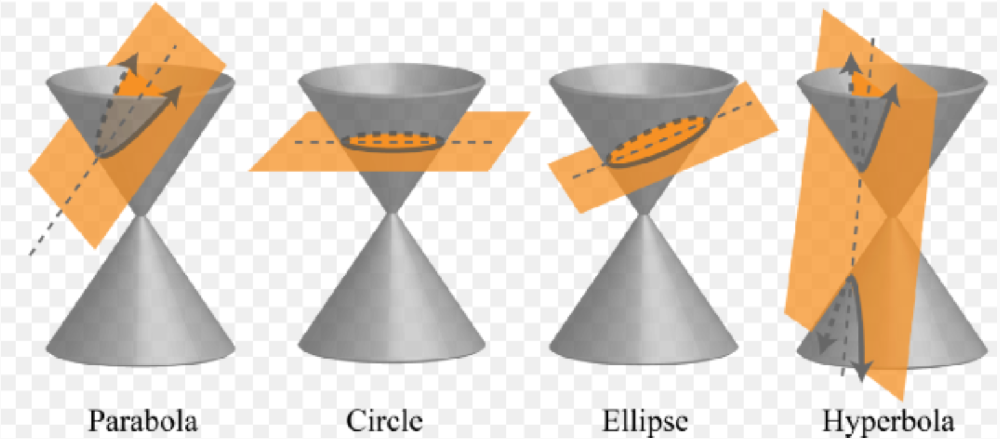
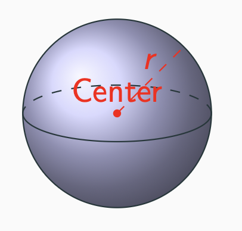
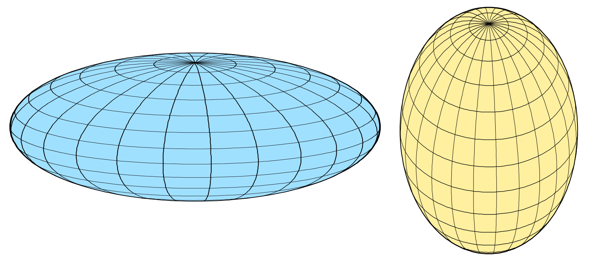
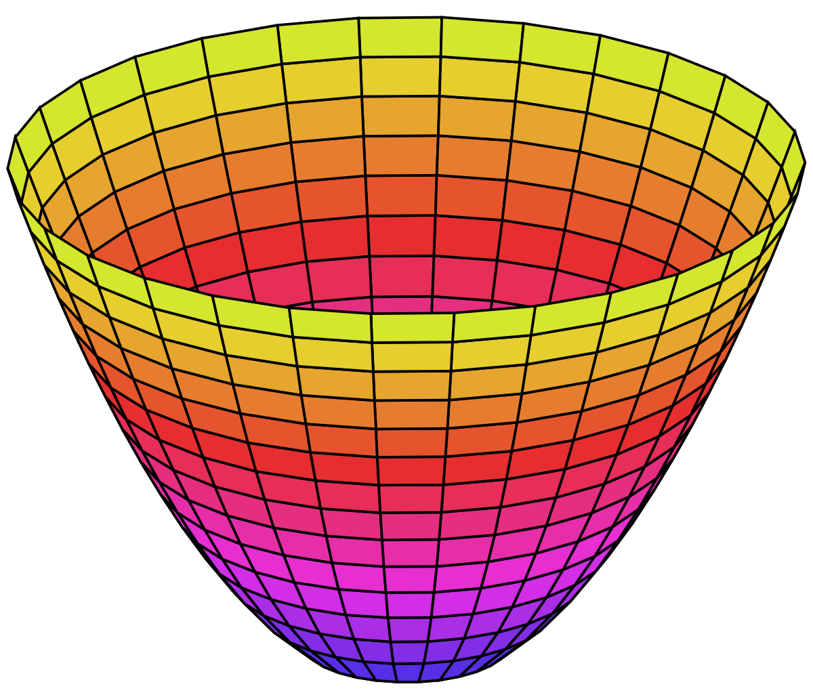
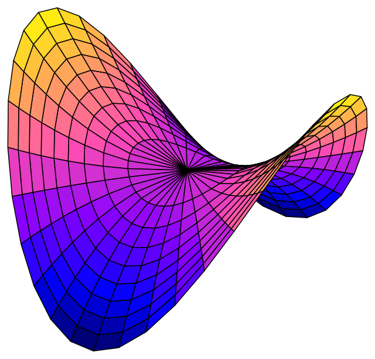
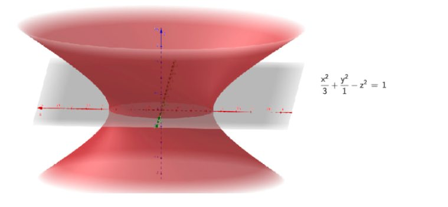
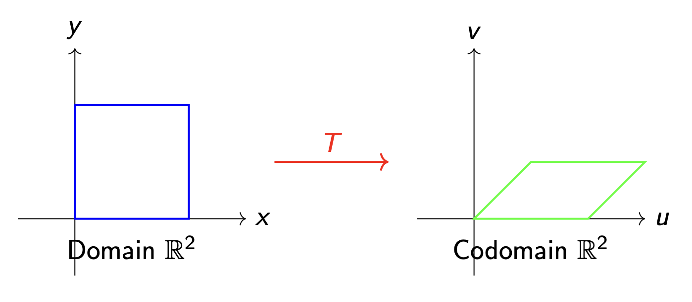

#### **1. Summary**
##### **1.1 Second Order Surfaces in 3D (Quadrics)**
**Quadric surfaces** are three-dimensional analogues of conic sections. Just as conic sections (circles, ellipses, parabolas, and hyperbolas) are defined by second-degree polynomial equations in 2D, quadric surfaces are defined by second-degree polynomial equations in three variables $x$, $y$, and $z$.

###### **1.1.1 From 2D Conics to 3D Surfaces**
The transition from 2D curves to 3D surfaces follows a natural principle: we extend curves by **rotating** them around one of their axes of symmetry.

{width=60%}

The correspondence between 2D conics and their 3D extensions:

*   **Circle → Sphere**: A circle rotated around any diameter creates a sphere
*   **Ellipse → Ellipsoid**: An ellipse rotated around one of its axes creates an ellipsoid
*   **Parabola → Paraboloid**: A parabola rotated around its axis of symmetry creates a paraboloid
*   **Hyperbola → Hyperboloid**: A hyperbola rotated around its axis creates a hyperboloid

###### **1.1.2 Types of Quadric Surfaces**
**Sphere**

{width=60%}

A **sphere** is the set of all points in space equidistant from a fixed point called the center.

*   **Standard equation**: $x^2 + y^2 + z^2 = r^2$ (centered at origin with radius $r$)
*   **General equation**: $(x - a)^2 + (y - b)^2 + (z - c)^2 = r^2$ (centered at $(a, b, c)$)
*   **Expanded form**: $x^2 + y^2 + z^2 + Dx + Ey + Fz + G = 0$

**Ellipsoid**

{width=60%}

An **ellipsoid** is a "stretched" sphere where the scaling factors along each axis may differ.

*   **Standard equation**: $\frac{x^2}{a^2} + \frac{y^2}{b^2} + \frac{z^2}{c^2} = 1$
*   When $a = b = c$, the ellipsoid becomes a sphere
*   The parameters $a$, $b$, and $c$ are the **semi-axes** along the $x$, $y$, and $z$ directions respectively

**Elliptic Paraboloid**

{width=60%}

An **elliptic paraboloid** is a bowl-shaped surface (like satellite dishes and headlight reflectors).

*   **Standard equation**: $z = \frac{x^2}{a^2} + \frac{y^2}{b^2}$
*   Cross-sections parallel to the $xy$-plane are ellipses
*   Cross-sections parallel to the $xz$-plane or $yz$-plane are parabolas
*   The vertex is at the origin, and the surface opens upward (or downward if $z$ is negative)

**Hyperbolic Paraboloid**

{width=60%}

A **hyperbolic paraboloid** is a saddle-shaped surface.

*   **Standard equation**: $z = \frac{x^2}{a^2} - \frac{y^2}{b^2}$
*   Cross-sections parallel to the $xy$-plane are hyperbolas
*   Cross-sections parallel to the $xz$-plane are upward-opening parabolas
*   Cross-sections parallel to the $yz$-plane are downward-opening parabolas

**Hyperboloid of One Sheet**

{width=60%}

A **hyperboloid of one sheet** resembles an hourglass or cooling tower shape — a single connected surface.

*   **Standard equation**: $\frac{x^2}{a^2} + \frac{y^2}{b^2} - \frac{z^2}{c^2} = 1$
*   Cross-sections parallel to the $xy$-plane are ellipses
*   The surface is connected and extends infinitely

**Hyperboloid of Two Sheets**

{width=60%}

A **hyperboloid of two sheets** consists of two separate bowl-shaped surfaces facing away from each other.

*   **Standard equation**: $\frac{x^2}{a^2} + \frac{y^2}{b^2} - \frac{z^2}{c^2} = -1$
*   Or equivalently: $\frac{z^2}{c^2} - \frac{x^2}{a^2} - \frac{y^2}{b^2} = 1$
*   The two sheets are separated by a gap

**Cone**

A **cone** is a surface formed by all lines passing through a fixed point (vertex) and intersecting a curve (the directrix).

*   **Circular cone equation**: $\frac{x^2}{a^2} + \frac{y^2}{a^2} = \frac{z^2}{c^2}$
*   Cross-sections parallel to the $xy$-plane are circles
*   The vertex is at the origin
*   A cone has two nappes: upper ($z \geq 0$) and lower ($z \leq 0$)

###### **1.1.3 Identifying Quadric Surfaces**
To identify a quadric surface from a general equation:

1.  **Complete the square** for each variable if necessary
2.  **Rearrange** to standard form
3.  **Compare** with standard equations to identify the type

Key identification rules:

*   **All positive terms, equals constant**: Ellipsoid (or sphere if coefficients are equal)
*   **Two positive, one negative, equals positive constant**: Hyperboloid of one sheet
*   **Two positive, one negative, equals negative constant**: Hyperboloid of two sheets
*   **Two squared terms equal to a linear term**: Paraboloid (elliptic or hyperbolic)

###### **1.1.4 Real-World Applications**
*   **Sphere**: Planets, balls, bubbles
*   **Ellipsoid**: Earth's shape (geoid), some sports balls
*   **Paraboloid**: Satellite dishes, headlights, telescope mirrors
*   **Hyperboloid**: Cooling towers, nuclear reactor structures, architecture

##### **1.2 Linear Transformations**
###### **1.2.1 Definition of Linear Transformation**
A **linear transformation** is a special type of function between vector spaces that preserves the fundamental operations of vector addition and scalar multiplication.

{width=60%}

**Formal Definition**: A function $T : \mathbb{R}^m \to \mathbb{R}^n$ is a **linear transformation** if for all vectors $\mathbf{u}, \mathbf{v} \in \mathbb{R}^m$ and all scalars $c \in \mathbb{R}$:

1.  **Additivity**: $T(\mathbf{u} + \mathbf{v}) = T(\mathbf{u}) + T(\mathbf{v})$
2.  **Homogeneity**: $T(c\mathbf{u}) = cT(\mathbf{u})$

**Equivalent Condition**: $T$ is linear if and only if for all $\mathbf{u}, \mathbf{v} \in \mathbb{R}^m$ and $a, b \in \mathbb{R}$:
$$T(a\mathbf{u} + b\mathbf{v}) = aT(\mathbf{u}) + bT(\mathbf{v})$$

This means linear transformations **preserve linear combinations**.

###### **1.2.2 Properties of Linear Transformations**
If $T : \mathbb{R}^m \to \mathbb{R}^n$ is a linear transformation, then:

*   $T(\mathbf{0}) = \mathbf{0}$ — the zero vector always maps to the zero vector
*   $T(c_1\mathbf{v}_1 + c_2\mathbf{v}_2 + \cdots + c_k\mathbf{v}_k) = c_1T(\mathbf{v}_1) + c_2T(\mathbf{v}_2) + \cdots + c_kT(\mathbf{v}_k)$

**Important**: If $T(\mathbf{0}) \neq \mathbf{0}$, then $T$ is **NOT** a linear transformation!

###### **1.2.3 Verifying Linearity**
To check if a transformation is linear, you can:

1.  **Method 1**: Verify both additivity and homogeneity properties directly
2.  **Method 2**: Check if $T(a\mathbf{u} + b\mathbf{v}) = aT(\mathbf{u}) + bT(\mathbf{v})$ for arbitrary vectors and scalars
3.  **Quick Test**: If $T(\mathbf{0}) \neq \mathbf{0}$, then $T$ is NOT linear

**Common non-linear patterns**:

*   Adding a constant vector: $T(\vec{x}) = \vec{x} + \vec{c}$ (translation)
*   Products of variables: $T(x, y) = xy$
*   Non-linear functions: $T(x) = x^2$, $T(x) = \sin(x)$

##### **1.3 Matrix Representation**
###### **1.3.1 The Standard Matrix**
Every linear transformation $T : \mathbb{R}^m \to \mathbb{R}^n$ can be represented by a unique $n \times m$ matrix $A$ such that:
$$T(\mathbf{x}) = A\mathbf{x}$$

**Constructing the Standard Matrix**: The standard matrix $A$ of $T$ is constructed by applying $T$ to each standard basis vector and using the results as columns:
$$A = \begin{bmatrix} T(\mathbf{e}_1) & T(\mathbf{e}_2) & \cdots & T(\mathbf{e}_m) \end{bmatrix}$$

where $\mathbf{e}_1, \mathbf{e}_2, \ldots, \mathbf{e}_m$ are the standard basis vectors of $\mathbb{R}^m$.

For example, in $\mathbb{R}^2$:

*   $\mathbf{e}_1 = \begin{pmatrix} 1 \\ 0 \end{pmatrix}$
*   $\mathbf{e}_2 = \begin{pmatrix} 0 \\ 1 \end{pmatrix}$

In $\mathbb{R}^3$:

*   $\mathbf{e}_1 = \begin{pmatrix} 1 \\ 0 \\ 0 \end{pmatrix}$, $\mathbf{e}_2 = \begin{pmatrix} 0 \\ 1 \\ 0 \end{pmatrix}$, $\mathbf{e}_3 = \begin{pmatrix} 0 \\ 0 \\ 1 \end{pmatrix}$

###### **1.3.2 Common Linear Transformations in $\mathbb{R}^2$**

**Rotation by angle $\theta$ counterclockwise**:
$$R = \begin{bmatrix} \cos \theta & -\sin \theta \\ \sin \theta & \cos \theta \end{bmatrix}$$

**Scaling**:
$$S = \begin{bmatrix} s_x & 0 \\ 0 & s_y \end{bmatrix}$$

where $s_x$ and $s_y$ are scaling factors in the $x$ and $y$ directions.

**Reflection about the x-axis**:
$$\begin{bmatrix} 1 & 0 \\ 0 & -1 \end{bmatrix}$$

**Reflection about the y-axis**:
$$\begin{bmatrix} -1 & 0 \\ 0 & 1 \end{bmatrix}$$

**Reflection about the line $y = x$**:
$$\begin{bmatrix} 0 & 1 \\ 1 & 0 \end{bmatrix}$$

**Horizontal Shear**:
$$\begin{bmatrix} 1 & k \\ 0 & 1 \end{bmatrix}$$

**Projection onto the x-axis**:
$$\begin{bmatrix} 1 & 0 \\ 0 & 0 \end{bmatrix}$$

###### **1.3.3 Projection Transformations**
A **projection** transformation maps vectors onto a subspace (like a line or plane).

**Projection onto the xy-plane in $\mathbb{R}^3$**:
$$A = \begin{bmatrix} 1 & 0 & 0 \\ 0 & 1 & 0 \\ 0 & 0 & 0 \end{bmatrix}, \quad T\begin{pmatrix} x \\ y \\ z \end{pmatrix} = \begin{bmatrix} x \\ y \\ 0 \end{bmatrix}$$

Properties of projection transformations:

*   **Idempotent**: Applying the projection twice gives the same result as applying it once: $T(T(\vec{v})) = T(\vec{v})$
*   **Not invertible**: Many vectors map to the same projection, so no inverse exists
*   **Rank**: Equals the dimension of the subspace projected onto
*   **Nullity**: Equals the dimension "lost" in the projection

##### **1.4 Composition of Transformations**
###### **1.4.1 Composing Linear Transformations**
If $T : \mathbb{R}^m \to \mathbb{R}^n$ and $S : \mathbb{R}^n \to \mathbb{R}^p$ are linear transformations with matrices $A$ and $B$ respectively, then the **composition** $S \circ T$ is also a linear transformation:
$$(S \circ T)(\mathbf{x}) = S(T(\mathbf{x})) = B(A\mathbf{x}) = (BA)\mathbf{x}$$

**Key insight**: The matrix of the composition is the **product** of the individual matrices, in reverse order.

**Important**: Order matters! In general, $BA \neq AB$.

*   $S \circ T$ means: first apply $T$, then apply $S$ — matrix is $BA$
*   $T \circ S$ means: first apply $S$, then apply $T$ — matrix is $AB$

##### **1.5 Kernel and Image**
###### **1.5.1 The Kernel (Null Space)**
The **kernel** (or **null space**) of a linear transformation $T$ is the set of all vectors that get mapped to the zero vector:
$$\ker(T) = \{ \mathbf{v} \in \mathbb{R}^m \mid T(\mathbf{v}) = \mathbf{0} \}$$

Properties:

*   The kernel is a **subspace** of the domain $\mathbb{R}^m$
*   Vectors in the kernel contain **no information** in the output
*   The dimension of the kernel is called the **nullity**: $\text{nullity}(T) = \dim(\ker(T))$

###### **1.5.2 The Image (Range)**
The **image** (or **range**) of a linear transformation $T$ is the set of all possible outputs:
$$\text{im}(T) = \{ T(\mathbf{v}) \mid \mathbf{v} \in \mathbb{R}^m \}$$

Properties:

*   The image is a **subspace** of the codomain $\mathbb{R}^n$
*   It represents all vectors we can "reach" using $T$
*   The dimension of the image is called the **rank**: $\text{rank}(T) = \dim(\text{im}(T))$
*   The image equals the **column space** of the transformation matrix

###### **1.5.3 The Rank-Nullity Theorem**
For any linear transformation $T : \mathbb{R}^m \to \mathbb{R}^n$:
$$\dim(\ker(T)) + \dim(\text{im}(T)) = \dim(\text{Domain})$$

Or equivalently:
$$\text{nullity}(T) + \text{rank}(T) = m$$

**Interpretation**: The dimension of the domain is **partitioned** into:

1.  The dimension "collapsed" to zero (nullity) — information lost
2.  The dimension "preserved" in the output (rank) — information kept

**Applications**:

*   If $\text{nullity}(T) > 0$, the equation $T(\mathbf{x}) = \mathbf{b}$ has either **zero** or **infinitely many** solutions
*   $T$ is **one-to-one (injective)** if and only if $\text{nullity}(T) = 0$
*   $T$ is **onto (surjective)** $\mathbb{R}^n$ if and only if $\text{rank}(T) = n$

##### **1.6 Inverse Transformations**
###### **1.6.1 When is a Transformation Invertible?**
A linear transformation $T : \mathbb{R}^n \to \mathbb{R}^n$ is **invertible** if there exists a transformation $T^{-1}$ such that:
$$T^{-1}(T(\mathbf{x})) = \mathbf{x} \text{ and } T(T^{-1}(\mathbf{y})) = \mathbf{y}$$

Conditions for invertibility:

*   The transformation must be from $\mathbb{R}^n$ to $\mathbb{R}^n$ (same dimension)
*   The matrix must be **square**
*   The determinant must be **non-zero**: $\det(A) \neq 0$
*   The transformation must be **bijective** (both injective and surjective)

**For a $2 \times 2$ matrix** $A = \begin{bmatrix} a & b \\ c & d \end{bmatrix}$:
$$A^{-1} = \frac{1}{\det(A)} \begin{bmatrix} d & -b \\ -c & a \end{bmatrix} = \frac{1}{ad - bc} \begin{bmatrix} d & -b \\ -c & a \end{bmatrix}$$

##### **1.7 Applications**
###### **1.7.1 Computer Graphics**
Linear transformations are fundamental in computer graphics:

*   **Rotation, scaling, and translation** of objects
*   **3D to 2D projection** for rendering
*   **Image transformations** and manipulations

To apply multiple transformations to an object, multiply the matrices in reverse order of application, then apply the resulting matrix to all vertices.

###### **1.7.2 Data Science and Machine Learning**
*   **Principal Component Analysis (PCA)**: Projects data onto principal directions
*   **Linear regression transformations**
*   **Feature scaling and normalization**

###### **1.7.3 Physics and Engineering**
*   **Coordinate system transformations**
*   **Stress-strain relationships**
*   **Electrical circuit analysis**

#### **2. Definitions**
*   **Quadric Surface**: A three-dimensional surface defined by a second-degree polynomial equation in $x$, $y$, and $z$.
*   **Sphere**: The set of all points in space equidistant from a fixed center point.
*   **Ellipsoid**: A quadric surface where all cross-sections are ellipses (or circles); a "stretched" sphere.
*   **Elliptic Paraboloid**: A bowl-shaped quadric surface with elliptical cross-sections parallel to the base plane.
*   **Hyperbolic Paraboloid**: A saddle-shaped quadric surface with hyperbolic cross-sections.
*   **Hyperboloid of One Sheet**: A connected quadric surface resembling an hourglass shape.
*   **Hyperboloid of Two Sheets**: A quadric surface consisting of two separate components.
*   **Cone**: A surface formed by all lines passing through a fixed vertex and intersecting a base curve.
*   **Linear Transformation**: A function $T : \mathbb{R}^m \to \mathbb{R}^n$ that preserves vector addition and scalar multiplication.
*   **Standard Matrix**: The unique matrix $A$ representing a linear transformation such that $T(\mathbf{x}) = A\mathbf{x}$.
*   **Standard Basis Vectors**: The unit vectors $\mathbf{e}_1, \mathbf{e}_2, \ldots, \mathbf{e}_n$ with 1 in one position and 0 elsewhere.
*   **Kernel (Null Space)**: The set of all vectors mapped to zero by a linear transformation: $\ker(T) = \{\mathbf{v} : T(\mathbf{v}) = \mathbf{0}\}$.
*   **Image (Range)**: The set of all possible outputs of a linear transformation: $\text{im}(T) = \{T(\mathbf{v}) : \mathbf{v} \in \text{domain}\}$.
*   **Nullity**: The dimension of the kernel of a linear transformation.
*   **Rank**: The dimension of the image of a linear transformation.
*   **Composition**: The application of one transformation followed by another; $(S \circ T)(\mathbf{x}) = S(T(\mathbf{x}))$.
*   **Invertible Transformation**: A transformation with an inverse; requires $\det(A) \neq 0$ for matrix representation.
*   **Projection**: A transformation that maps vectors onto a subspace, characterized by being idempotent ($T^2 = T$).

#### **3. Formulas**
*   **Sphere (centered at origin)**: $x^2 + y^2 + z^2 = r^2$
*   **Sphere (general center)**: $(x - a)^2 + (y - b)^2 + (z - c)^2 = r^2$
*   **Ellipsoid**: $\frac{x^2}{a^2} + \frac{y^2}{b^2} + \frac{z^2}{c^2} = 1$
*   **Elliptic Paraboloid**: $z = \frac{x^2}{a^2} + \frac{y^2}{b^2}$
*   **Hyperbolic Paraboloid**: $z = \frac{x^2}{a^2} - \frac{y^2}{b^2}$
*   **Hyperboloid of One Sheet**: $\frac{x^2}{a^2} + \frac{y^2}{b^2} - \frac{z^2}{c^2} = 1$
*   **Hyperboloid of Two Sheets**: $\frac{x^2}{a^2} + \frac{y^2}{b^2} - \frac{z^2}{c^2} = -1$
*   **Circular Cone**: $\frac{x^2}{a^2} + \frac{y^2}{a^2} = \frac{z^2}{c^2}$
*   **Standard Matrix Construction**: $A = \begin{bmatrix} T(\mathbf{e}_1) & T(\mathbf{e}_2) & \cdots & T(\mathbf{e}_m) \end{bmatrix}$
*   **Rotation Matrix (2D, counterclockwise by $\theta$)**: $R = \begin{bmatrix} \cos \theta & -\sin \theta \\ \sin \theta & \cos \theta \end{bmatrix}$
*   **Scaling Matrix (2D)**: $S = \begin{bmatrix} s_x & 0 \\ 0 & s_y \end{bmatrix}$
*   **Reflection about x-axis**: $\begin{bmatrix} 1 & 0 \\ 0 & -1 \end{bmatrix}$
*   **Reflection about y-axis**: $\begin{bmatrix} -1 & 0 \\ 0 & 1 \end{bmatrix}$
*   **Reflection about $y = x$**: $\begin{bmatrix} 0 & 1 \\ 1 & 0 \end{bmatrix}$
*   **Shear Matrix (horizontal)**: $\begin{bmatrix} 1 & k \\ 0 & 1 \end{bmatrix}$
*   **Projection onto xy-plane**: $\begin{bmatrix} 1 & 0 & 0 \\ 0 & 1 & 0 \\ 0 & 0 & 0 \end{bmatrix}$
*   **Projection onto x-axis (2D)**: $\begin{bmatrix} 1 & 0 \\ 0 & 0 \end{bmatrix}$
*   **Composition of Transformations**: $(S \circ T)(\mathbf{x}) = (BA)\mathbf{x}$ where $T$ has matrix $A$ and $S$ has matrix $B$
*   **Rank-Nullity Theorem**: $\text{nullity}(T) + \text{rank}(T) = \dim(\text{Domain})$
*   **2×2 Matrix Inverse**: $A^{-1} = \frac{1}{ad-bc}\begin{bmatrix} d & -b \\ -c & a \end{bmatrix}$ for $A = \begin{bmatrix} a & b \\ c & d \end{bmatrix}$
*   **Perpendicular Distance from Point to Plane**: $d = \frac{|ax_0 + by_0 + cz_0 + d|}{\sqrt{a^2 + b^2 + c^2}}$ for plane $ax + by + cz + d = 0$

#### **4. Examples**
##### **4.1. Identify Quadric Surface Type** (Lab 13, Problem 1a)
Write the standard equation and determine the type of quadric surface: $x^2 - y^2 + 4y + z = 4$

Click to see the solution

**Key Concept:** Complete the square to transform the equation into standard form.

1.  **Rearrange and complete the square for $y$:**
    $$x^2 - y^2 + 4y + z = 4$$
    $$x^2 - (y^2 - 4y) + z = 4$$
    $$x^2 - (y^2 - 4y + 4) + 4 + z = 4$$
    $$x^2 - (y - 2)^2 + z = 0$$
2.  **Solve for $z$:**
    $$z = (y - 2)^2 - x^2$$
3.  **Identify the surface:** This is a difference of squares equal to a linear term in $z$.

**Answer:** Standard form: $z = (y - 2)^2 - x^2$. This is a **Hyperbolic Paraboloid**.

##### **4.2. Identify Quadric Surface Type** (Lab 13, Problem 1b)
Write the standard equation and determine the type of quadric surface: $z^2 = 3x^2 + 4y^2 - 12$

Click to see the solution

**Key Concept:** Rearrange to standard form and identify the sign pattern.

1.  **Rearrange the equation:**
    $$z^2 - 3x^2 - 4y^2 = -12$$
2.  **Divide by $-12$ to get $1$ on the right:**
    $$\frac{z^2}{-12} - \frac{3x^2}{-12} - \frac{4y^2}{-12} = 1$$
    $$\frac{x^2}{4} + \frac{y^2}{3} - \frac{z^2}{12} = 1$$
3.  **Identify:** Two positive squared terms and one negative squared term equal to $+1$.

**Answer:** Standard form: $\frac{x^2}{4} + \frac{y^2}{3} - \frac{z^2}{12} = 1$. This is a **Hyperboloid of One Sheet**.

##### **4.3. Identify Quadric Surface Type** (Lab 13, Problem 1c)
Write the standard equation and determine the type of quadric surface: $z = x^2 + y^2 + 1$

Click to see the solution

**Key Concept:** Recognize the sum of squares pattern.

1.  **Rearrange:**
    $$z - 1 = x^2 + y^2$$
2.  **Identify:** This is a sum of two squared terms equal to a linear term. The vertex is shifted to $(0, 0, 1)$.

**Answer:** Standard form: $z - 1 = x^2 + y^2$. This is an **Elliptic Paraboloid** (specifically, a circular paraboloid since the coefficients are equal).

##### **4.4. Identify Quadric Surface Type** (Lab 13, Problem 1d)
Write the standard equation and determine the type of quadric surface: $x^2 + y^2 - 4z^2 + 4x - 6y - 8z = 13$

Click to see the solution

**Key Concept:** Complete the square for all three variables.

1.  **Group terms and complete the square:**
    $$(x^2 + 4x) + (y^2 - 6y) - 4(z^2 + 2z) = 13$$
2.  **Complete each square:**
    *   $(x^2 + 4x + 4) - 4 = (x + 2)^2 - 4$
    *   $(y^2 - 6y + 9) - 9 = (y - 3)^2 - 9$
    *   $-4(z^2 + 2z + 1) + 4 = -4(z + 1)^2 + 4$
3.  **Substitute back:**
    $$(x + 2)^2 - 4 + (y - 3)^2 - 9 - 4(z + 1)^2 + 4 = 13$$
    $$(x + 2)^2 + (y - 3)^2 - 4(z + 1)^2 = 22$$
4.  **Divide by 22:**
    $$\frac{(x + 2)^2}{22} + \frac{(y - 3)^2}{22} - \frac{(z + 1)^2}{22/4} = 1$$
    $$\frac{(x + 2)^2}{22} + \frac{(y - 3)^2}{22} - \frac{(z + 1)^2}{11/2} = 1$$

**Answer:** Standard form: $\frac{(x+2)^2}{22} + \frac{(y-3)^2}{22} - \frac{(z+1)^2}{11/2} = 1$. This is a **Hyperboloid of One Sheet** centered at $(-2, 3, -1)$.

##### **4.5. Identify Quadric Surface Type** (Lab 13, Problem 1e)
Write the standard equation and determine the type of quadric surface: $4x^2 + 9y^2 + 36z^2 = 36$

Click to see the solution

**Key Concept:** Divide to get 1 on the right side.

1.  **Divide both sides by 36:**
    $$\frac{4x^2}{36} + \frac{9y^2}{36} + \frac{36z^2}{36} = 1$$
    $$\frac{x^2}{9} + \frac{y^2}{4} + \frac{z^2}{1} = 1$$
2.  **Identify:** All positive squared terms equal to 1.

**Answer:** Standard form: $\frac{x^2}{9} + \frac{y^2}{4} + z^2 = 1$. This is an **Ellipsoid** with semi-axes $a = 3$, $b = 2$, $c = 1$.

##### **4.6. Identify Quadric Surface Type** (Lab 13, Problem 1f)
Write the standard equation and determine the type of quadric surface: $4 - 4y^2 - z^2 = x$

Click to see the solution

**Key Concept:** Recognize the paraboloid pattern.

1.  **Rearrange:**
    $$-x = 4y^2 + z^2 - 4$$
    $$\frac{-x + 4}{4} = y^2 + \frac{z^2}{4}$$
    
    Or equivalently:
    $$y^2 + \frac{z^2}{4} = 1 - \frac{x}{4}$$
2.  **Identify:** Sum of squared terms equal to a linear expression — this is a paraboloid opening in the negative $x$ direction.

**Answer:** Standard form: $\frac{y^2}{1} + \frac{z^2}{4} = 1 - \frac{x}{4}$. This is an **Elliptic Paraboloid**.

##### **4.7. Find Equation of a Sphere Through Two Points** (Lab 13, Problem 2)
Find the equation of the sphere which passes through the points $(2, 7, -4)$ and $(4, 5, -1)$ and has its center on the line joining these two points as diameter.

Click to see the solution

**Key Concept:** If the line joining two points is a diameter, then the center is the midpoint, and the radius is half the distance between the points.

1.  **Find the center (midpoint of the diameter):**
    $$\text{Center} = \left( \frac{2+4}{2}, \frac{7+5}{2}, \frac{-4+(-1)}{2} \right) = \left( 3, 6, -\frac{5}{2} \right)$$
2.  **Find the radius (half the distance between points):**
    $$\text{Distance} = \sqrt{(4-2)^2 + (5-7)^2 + (-1-(-4))^2} = \sqrt{4 + 4 + 9} = \sqrt{17}$$
    $$r = \frac{\sqrt{17}}{2}$$
3.  **Write the standard equation:**
    $$(x - 3)^2 + (y - 6)^2 + \left(z + \frac{5}{2}\right)^2 = \frac{17}{4}$$
4.  **Expand to general form (optional):**
    $$x^2 + y^2 + z^2 - 6x - 12y + 5z + 9 + 36 + \frac{25}{4} - \frac{17}{4} = 0$$
    $$x^2 + y^2 + z^2 - 6x - 12y + 5z + 47 = 0$$

**Answer:** $(x - 3)^2 + (y - 6)^2 + (z + \frac{5}{2})^2 = \frac{17}{4}$ or $x^2 + y^2 + z^2 - 6x - 12y + 5z + 47 = 0$

##### **4.8. Tangent Plane to a Sphere** (Lab 13, Problem 3)
Show that the plane $4x - 3y + 6z - 35 = 0$ is a tangent plane to the sphere $x^2 + y^2 + z^2 - y - 2z - 14 = 0$ and find the point of contact.

Click to see the solution

**Key Concept:** A plane is tangent to a sphere if and only if the perpendicular distance from the center to the plane equals the radius.

1.  **Find the center and radius of the sphere:**
    
    Rewrite: $x^2 + (y^2 - y) + (z^2 - 2z) = 14$
    
    Complete the squares:
    $$x^2 + \left(y - \frac{1}{2}\right)^2 - \frac{1}{4} + (z - 1)^2 - 1 = 14$$
    $$x^2 + \left(y - \frac{1}{2}\right)^2 + (z - 1)^2 = 14 + \frac{1}{4} + 1 = \frac{61}{4}$$
    
    Center: $\left(0, \frac{1}{2}, 1\right)$, Radius: $r = \sqrt{\frac{61}{4}} = \frac{\sqrt{61}}{2}$
2.  **Calculate perpendicular distance from center to plane:**
    
    Using the distance formula for point $(0, \frac{1}{2}, 1)$ to plane $4x - 3y + 6z - 35 = 0$:
    $$d = \frac{|4(0) - 3(\frac{1}{2}) + 6(1) - 35|}{\sqrt{16 + 9 + 36}} = \frac{|0 - 1.5 + 6 - 35|}{\sqrt{61}} = \frac{|-30.5|}{\sqrt{61}} = \frac{30.5}{\sqrt{61}}$$
    $$d = \frac{61/2}{\sqrt{61}} = \frac{\sqrt{61}}{2} = r$$
    
    Since $d = r$, the plane is tangent to the sphere. ✓
3.  **Find the point of contact:**
    
    The point of contact lies on the line from the center perpendicular to the plane.
    
    Direction of normal to plane: $(4, -3, 6)$
    
    Parametric equations from center $(0, \frac{1}{2}, 1)$:
    $$\frac{x - 0}{4} = \frac{y - \frac{1}{2}}{-3} = \frac{z - 1}{6} = t$$
    
    Point on line: $(4t, -3t + \frac{1}{2}, 6t + 1)$
4.  **Find $t$ where this point lies on the plane:**
    $$4(4t) - 3(-3t + \frac{1}{2}) + 6(6t + 1) - 35 = 0$$
    $$16t + 9t - \frac{3}{2} + 36t + 6 - 35 = 0$$
    $$61t - \frac{61}{2} = 0$$
    $$t = \frac{1}{2}$$
5.  **Calculate the point of contact:**
    $$x = 4 \cdot \frac{1}{2} = 2$$
    $$y = -3 \cdot \frac{1}{2} + \frac{1}{2} = -1$$
    $$z = 6 \cdot \frac{1}{2} + 1 = 4$$

**Answer:** The plane is tangent to the sphere. The point of contact is $(2, -1, 4)$.

##### **4.9. Find Equation of a Cone** (Lab 13, Problem 4)
Find the equation of the cone with its vertex at $(1, 1, 1)$ and which passes through the curve $x^2 + y^2 = 4$, $z = 2$.

Click to see the solution

**Key Concept:** A cone is generated by lines (generators) passing through the vertex and intersecting a given curve (directrix).

1.  **Set up the generator line:**
    
    Let $V = (1, 1, 1)$ be the vertex and $P$ be any point on the cone surface.
    
    The parametric equation of line $VP$:
    $$\frac{x - 1}{l} = \frac{y - 1}{m} = \frac{z - 1}{n}$$
2.  **Find where the generator intersects plane $z = 2$:**
    
    When $z = 2$: $\frac{z - 1}{n} = \frac{1}{n}$
    
    So: $x = 1 + \frac{l}{n}$ and $y = 1 + \frac{m}{n}$
3.  **Apply the condition that this point lies on circle $x^2 + y^2 = 4$:**
    $$\left(1 + \frac{l}{n}\right)^2 + \left(1 + \frac{m}{n}\right)^2 = 4$$
    $$(n + l)^2 + (n + m)^2 = 4n^2$$
4.  **Eliminate parameters using the line equation:**
    
    From the parametric equations: $\frac{l}{n} = \frac{x-1}{z-1}$ and $\frac{m}{n} = \frac{y-1}{z-1}$
    
    Substituting:
    $$\left(1 + \frac{x-1}{z-1}\right)^2 + \left(1 + \frac{y-1}{z-1}\right)^2 = 4$$
    $$\left(\frac{z-1+x-1}{z-1}\right)^2 + \left(\frac{z-1+y-1}{z-1}\right)^2 = 4$$
    $$(x + z - 2)^2 + (y + z - 2)^2 = 4(z - 1)^2$$

**Answer:** $(x + z - 2)^2 + (y + z - 2)^2 = 4(z - 1)^2$

##### **4.10. Find Equation of Right Circular Cone** (Lab 13, Problem 5)
Find the equation of the right circular cone whose vertex is at the origin, whose axis is the line $\frac{x}{1} = \frac{y}{2} = \frac{z}{3}$, and which has a vertical angle of $60°$.

Click to see the solution

**Key Concept:** For a right circular cone, every point on the surface makes the same angle (half the vertical angle) with the axis.

1.  **Find direction cosines of the axis:**
    
    Direction ratios: $(1, 2, 3)$
    
    Magnitude: $\sqrt{1^2 + 2^2 + 3^2} = \sqrt{14}$
    
    Direction cosines: $\left(\frac{1}{\sqrt{14}}, \frac{2}{\sqrt{14}}, \frac{3}{\sqrt{14}}\right)$
2.  **Set up the cone condition:**
    
    Let $P(x, y, z)$ be any point on the cone surface.
    
    Let $L$ be the foot of perpendicular from $P$ to the axis.
    
    The half-angle is $\frac{60°}{2} = 30°$.
    
    From trigonometry: $\frac{OL}{OP} = \cos 30° = \frac{\sqrt{3}}{2}$
3.  **Calculate $OP$ and $OL$:**
    
    $OP = \sqrt{x^2 + y^2 + z^2}$
    
    $OL$ = Projection of $\vec{OP}$ onto axis direction:
    $$OL = x \cdot \frac{1}{\sqrt{14}} + y \cdot \frac{2}{\sqrt{14}} + z \cdot \frac{3}{\sqrt{14}} = \frac{x + 2y + 3z}{\sqrt{14}}$$
4.  **Apply the angle condition:**
    $$\frac{OL}{OP} = \frac{\sqrt{3}}{2}$$
    $$\frac{(x + 2y + 3z)/\sqrt{14}}{\sqrt{x^2 + y^2 + z^2}} = \frac{\sqrt{3}}{2}$$
    $$\frac{2(x + 2y + 3z)}{\sqrt{14}} = \sqrt{3}\sqrt{x^2 + y^2 + z^2}$$
5.  **Square both sides:**
    $$\frac{4(x + 2y + 3z)^2}{14} = 3(x^2 + y^2 + z^2)$$
    $$4(x + 2y + 3z)^2 = 42(x^2 + y^2 + z^2)$$
6.  **Expand and simplify:**
    $$4(x^2 + 4y^2 + 9z^2 + 4xy + 12yz + 6zx) = 42x^2 + 42y^2 + 42z^2$$
    $$4x^2 + 16y^2 + 36z^2 + 16xy + 48yz + 24zx = 42x^2 + 42y^2 + 42z^2$$
    $$0 = 38x^2 + 26y^2 + 6z^2 - 16xy - 48yz - 24zx$$

**Answer:** $19x^2 + 13y^2 + 3z^2 - 8xy - 24yz - 12zx = 0$

##### **4.11. Apply Linear Transformation Using Given Values** (Lab 13, Problem 1 - Linear Transformations)
Let $T : \mathbb{R}^3 \to \mathbb{R}^4$ be a linear transformation such that
$T\begin{pmatrix} 1 \\ 3 \\ 1 \end{pmatrix} = \begin{pmatrix} 4 \\ 4 \\ 0 \\ -2 \end{pmatrix}$ and $T\begin{pmatrix} 4 \\ 0 \\ 5 \end{pmatrix} = \begin{pmatrix} 4 \\ 5 \\ -1 \\ 5 \end{pmatrix}$.

Find $T\begin{pmatrix} -7 \\ 3 \\ -9 \end{pmatrix}$.

Click to see the solution

**Key Concept:** Linear transformations preserve linear combinations. If we can express the input as a linear combination of vectors whose images we know, we can find the output.

1.  **Express $\begin{pmatrix} -7 \\ 3 \\ -9 \end{pmatrix}$ as a linear combination:**
    
    We need to find $a, b$ such that:
    $$\begin{pmatrix} -7 \\ 3 \\ -9 \end{pmatrix} = a\begin{pmatrix} 1 \\ 3 \\ 1 \end{pmatrix} + b\begin{pmatrix} 4 \\ 0 \\ 5 \end{pmatrix}$$
2.  **Solve the system:**
    *   $a + 4b = -7$
    *   $3a + 0b = 3 \Rightarrow a = 1$
    *   $a + 5b = -9$
    
    From $a = 1$: $1 + 4b = -7 \Rightarrow b = -2$
    
    Verify: $1 + 5(-2) = 1 - 10 = -9$ ✓
    
    So: $\begin{pmatrix} -7 \\ 3 \\ -9 \end{pmatrix} = 1 \cdot \begin{pmatrix} 1 \\ 3 \\ 1 \end{pmatrix} + (-2) \cdot \begin{pmatrix} 4 \\ 0 \\ 5 \end{pmatrix}$
3.  **Apply linearity:**
    $$T\begin{pmatrix} -7 \\ 3 \\ -9 \end{pmatrix} = T\begin{pmatrix} 1 \\ 3 \\ 1 \end{pmatrix} - 2T\begin{pmatrix} 4 \\ 0 \\ 5 \end{pmatrix}$$
    $$= \begin{pmatrix} 4 \\ 4 \\ 0 \\ -2 \end{pmatrix} - 2\begin{pmatrix} 4 \\ 5 \\ -1 \\ 5 \end{pmatrix}$$
    $$= \begin{pmatrix} 4 - 8 \\ 4 - 10 \\ 0 - (-2) \\ -2 - 10 \end{pmatrix} = \begin{pmatrix} -4 \\ -6 \\ 2 \\ -12 \end{pmatrix}$$

**Answer:** $T\begin{pmatrix} -7 \\ 3 \\ -9 \end{pmatrix} = \begin{pmatrix} -4 \\ -6 \\ 2 \\ -12 \end{pmatrix}$

##### **4.12. Verify Matrix Transformation** (Lab 13, Problem 2 - Linear Transformations)
Is the following $T : \mathbb{R}^3 \to \mathbb{R}^4$ a matrix transformation?
$$T\left(\begin{bmatrix} a \\ b \\ c \end{bmatrix}\right) = \begin{bmatrix} a + b \\ b + c \\ a - c \\ c - b \end{bmatrix}$$

Click to see the solution

**Key Concept:** A transformation is a matrix transformation if there exists a matrix $A$ such that $T(\mathbf{x}) = A\mathbf{x}$.

1.  **Try to find the matrix:**
    
    We need $A$ such that:
    $$A\begin{bmatrix} a \\ b \\ c \end{bmatrix} = \begin{bmatrix} a + b \\ b + c \\ a - c \\ c - b \end{bmatrix}$$
2.  **Construct $A$ by analyzing each output component:**
    *   Row 1: $a + b + 0c \Rightarrow [1, 1, 0]$
    *   Row 2: $0a + b + c \Rightarrow [0, 1, 1]$
    *   Row 3: $a + 0b - c \Rightarrow [1, 0, -1]$
    *   Row 4: $0a - b + c \Rightarrow [0, -1, 1]$
3.  **The matrix is:**
    $$A = \begin{bmatrix} 1 & 1 & 0 \\ 0 & 1 & 1 \\ 1 & 0 & -1 \\ 0 & -1 & 1 \end{bmatrix}$$
4.  **Verify:**
    $$\begin{bmatrix} 1 & 1 & 0 \\ 0 & 1 & 1 \\ 1 & 0 & -1 \\ 0 & -1 & 1 \end{bmatrix}\begin{bmatrix} a \\ b \\ c \end{bmatrix} = \begin{bmatrix} a + b \\ b + c \\ a - c \\ c - b \end{bmatrix} = T\left(\begin{bmatrix} a \\ b \\ c \end{bmatrix}\right)$$ ✓

**Answer:** Yes, $T$ is a matrix transformation with matrix $A = \begin{bmatrix} 1 & 1 & 0 \\ 0 & 1 & 1 \\ 1 & 0 & -1 \\ 0 & -1 & 1 \end{bmatrix}$.

##### **4.13. Check if Translation is Linear** (Lab 13, Problem 3 - Linear Transformations)
Consider $T : \mathbb{R}^2 \to \mathbb{R}^2$ defined by $T(\vec{x}) = \vec{x} + \begin{bmatrix} 1 \\ -1 \end{bmatrix}$ for all $\vec{x} \in \mathbb{R}^2$. Is $T$ a linear transformation?

Click to see the solution

**Key Concept:** A linear transformation must map the zero vector to the zero vector: $T(\mathbf{0}) = \mathbf{0}$.

1.  **Check $T(\mathbf{0})$:**
    $$T\left(\begin{bmatrix} 0 \\ 0 \end{bmatrix}\right) = \begin{bmatrix} 0 \\ 0 \end{bmatrix} + \begin{bmatrix} 1 \\ -1 \end{bmatrix} = \begin{bmatrix} 1 \\ -1 \end{bmatrix}$$
2.  **Compare to required condition:**
    $$T(\mathbf{0}) = \begin{bmatrix} 1 \\ -1 \end{bmatrix} \neq \begin{bmatrix} 0 \\ 0 \end{bmatrix}$$
3.  **Conclusion:** This violates the fundamental property $T(\mathbf{0}) = \mathbf{0}$.

**Answer:** No, $T$ is **NOT** a linear transformation. Translation (adding a constant vector) is never linear unless the translation vector is zero.

##### **4.14. Check if Product is Linear** (Lab 13, Problem 4 - Linear Transformations)
Let $T : \mathbb{R}^2 \to \mathbb{R}^2$ be a transformation defined by $T\left(\begin{bmatrix} x \\ y \end{bmatrix}\right) = \begin{bmatrix} xy \\ x + y \end{bmatrix}$. Is $T$ a linear transformation?

Click to see the solution

**Key Concept:** If $T$ were linear, we could find a matrix $A$ such that $T(\mathbf{x}) = A\mathbf{x}$.

1.  **Find the candidate matrix by applying $T$ to standard basis vectors:**
    $$T(\mathbf{e}_1) = T\begin{pmatrix} 1 \\ 0 \end{pmatrix} = \begin{bmatrix} 1 \cdot 0 \\ 1 + 0 \end{bmatrix} = \begin{bmatrix} 0 \\ 1 \end{bmatrix}$$
    $$T(\mathbf{e}_2) = T\begin{pmatrix} 0 \\ 1 \end{pmatrix} = \begin{bmatrix} 0 \cdot 1 \\ 0 + 1 \end{bmatrix} = \begin{bmatrix} 0 \\ 1 \end{bmatrix}$$
    
    Candidate matrix: $A = \begin{bmatrix} 0 & 0 \\ 1 & 1 \end{bmatrix}$
2.  **Verify if $A\mathbf{x} = T(\mathbf{x})$ for all $\mathbf{x}$:**
    $$A\begin{bmatrix} x \\ y \end{bmatrix} = \begin{bmatrix} 0 & 0 \\ 1 & 1 \end{bmatrix}\begin{bmatrix} x \\ y \end{bmatrix} = \begin{bmatrix} 0 \\ x + y \end{bmatrix}$$
    
    But:
    $$T\left(\begin{bmatrix} x \\ y \end{bmatrix}\right) = \begin{bmatrix} xy \\ x + y \end{bmatrix}$$
3.  **Compare:**
    $$\begin{bmatrix} 0 \\ x + y \end{bmatrix} \neq \begin{bmatrix} xy \\ x + y \end{bmatrix}$$
    
    The first components don't match (unless $xy = 0$).

**Answer:** No, $T$ is **NOT** a linear transformation. The product $xy$ is a non-linear operation.

##### **4.15. Composition of 2D Transformations** (Lab 13, Problem 5 - Linear Transformations)
A unit square centered at the origin has initial vertices $V_1 = (-0.5, -0.5)$, $V_2 = (0.5, -0.5)$, $V_3 = (0.5, 0.5)$, $V_4 = (-0.5, 0.5)$. Apply a composition of 2D linear transformations: rotate by 30° counterclockwise, then scale to side length 4 units.

Click to see the solution

**Key Concept:** For composition, multiply matrices in reverse order of application. To scale a unit square to side length 4, use scaling factor 4.

1.  **Rotation matrix (30° counterclockwise):**
    $$R = \begin{bmatrix} \cos 30° & -\sin 30° \\ \sin 30° & \cos 30° \end{bmatrix} = \begin{bmatrix} \frac{\sqrt{3}}{2} & -\frac{1}{2} \\ \frac{1}{2} & \frac{\sqrt{3}}{2} \end{bmatrix}$$
2.  **Scaling matrix (factor 4):**
    $$S = \begin{bmatrix} 4 & 0 \\ 0 & 4 \end{bmatrix}$$
3.  **Composite transformation (scale after rotate):**
    $$M = S \cdot R = \begin{bmatrix} 4 & 0 \\ 0 & 4 \end{bmatrix}\begin{bmatrix} \frac{\sqrt{3}}{2} & -\frac{1}{2} \\ \frac{1}{2} & \frac{\sqrt{3}}{2} \end{bmatrix} = \begin{bmatrix} 2\sqrt{3} & -2 \\ 2 & 2\sqrt{3} \end{bmatrix}$$
4.  **Apply to each vertex:**
    
    **$V_1 = (-0.5, -0.5)$:**
    $$V'_1 = \begin{bmatrix} 2\sqrt{3} & -2 \\ 2 & 2\sqrt{3} \end{bmatrix}\begin{bmatrix} -0.5 \\ -0.5 \end{bmatrix} = \begin{bmatrix} -\sqrt{3} + 1 \\ -1 - \sqrt{3} \end{bmatrix}$$
    
    **$V_2 = (0.5, -0.5)$:**
    $$V'_2 = \begin{bmatrix} 2\sqrt{3} & -2 \\ 2 & 2\sqrt{3} \end{bmatrix}\begin{bmatrix} 0.5 \\ -0.5 \end{bmatrix} = \begin{bmatrix} \sqrt{3} + 1 \\ 1 - \sqrt{3} \end{bmatrix}$$
    
    **$V_3 = (0.5, 0.5)$:**
    $$V'_3 = \begin{bmatrix} 2\sqrt{3} & -2 \\ 2 & 2\sqrt{3} \end{bmatrix}\begin{bmatrix} 0.5 \\ 0.5 \end{bmatrix} = \begin{bmatrix} \sqrt{3} - 1 \\ 1 + \sqrt{3} \end{bmatrix}$$
    
    **$V_4 = (-0.5, 0.5)$:**
    $$V'_4 = \begin{bmatrix} 2\sqrt{3} & -2 \\ 2 & 2\sqrt{3} \end{bmatrix}\begin{bmatrix} -0.5 \\ 0.5 \end{bmatrix} = \begin{bmatrix} -\sqrt{3} - 1 \\ -1 + \sqrt{3} \end{bmatrix}$$

**Answer:** The composite matrix is $M = \begin{bmatrix} 2\sqrt{3} & -2 \\ 2 & 2\sqrt{3} \end{bmatrix}$.

Final vertices:

*   $V'_1 = (-\sqrt{3} + 1, -1 - \sqrt{3})$
*   $V'_2 = (\sqrt{3} + 1, 1 - \sqrt{3})$
*   $V'_3 = (\sqrt{3} - 1, 1 + \sqrt{3})$
*   $V'_4 = (-\sqrt{3} - 1, -1 + \sqrt{3})$

##### **4.16. Verify Linearity of Transformations** (Tutorial 13, Problem 1)
Determine whether the following functions are linear transformations:

a) $T : \mathbb{R}^2 \to \mathbb{R}^2$ defined by $T(x, y) = (2x + y, x - y)$

b) $T : \mathbb{R}^2 \to \mathbb{R}$ defined by $T(x, y) = xy$

c) $T : \mathbb{R}^3 \to \mathbb{R}^2$ defined by $T(x, y, z) = (x + z, y - z)$

Click to see the solution

**Key Concept:** Check if $T(a\mathbf{u} + b\mathbf{v}) = aT(\mathbf{u}) + bT(\mathbf{v})$ for all vectors and scalars.

**(a) $T(x, y) = (2x + y, x - y)$**

Let $\mathbf{u} = (x_1, y_1)$ and $\mathbf{v} = (x_2, y_2)$.

$$T(a\mathbf{u} + b\mathbf{v}) = T(ax_1 + bx_2, ay_1 + by_2)$$
$$= (2(ax_1 + bx_2) + (ay_1 + by_2), (ax_1 + bx_2) - (ay_1 + by_2))$$
$$= (2ax_1 + 2bx_2 + ay_1 + by_2, ax_1 + bx_2 - ay_1 - by_2)$$
$$= a(2x_1 + y_1, x_1 - y_1) + b(2x_2 + y_2, x_2 - y_2)$$
$$= aT(\mathbf{u}) + bT(\mathbf{v})$$

**Answer (a):** Yes, $T$ **IS** linear.

**(b) $T(x, y) = xy$**

Quick counterexample:
$$T(1, 1) = 1 \cdot 1 = 1$$
$$T(2 \cdot 1, 2 \cdot 1) = T(2, 2) = 2 \cdot 2 = 4$$
$$2 \cdot T(1, 1) = 2 \cdot 1 = 2$$

Since $T(2, 2) = 4 \neq 2 = 2T(1, 1)$, homogeneity fails.

**Answer (b):** No, $T$ is **NOT** linear.

**(c) $T(x, y, z) = (x + z, y - z)$**

This is a linear combination of coordinates with no constant terms or products.

Standard matrix: $A = \begin{bmatrix} 1 & 0 & 1 \\ 0 & 1 & -1 \end{bmatrix}$

**Answer (c):** Yes, $T$ **IS** linear.

##### **4.17. Find Standard Matrix** (Tutorial 13, Problem 2)
Find the standard matrix representation for each linear transformation:

a) $T : \mathbb{R}^2 \to \mathbb{R}^3$ defined by $T(x, y) = (2x, x + y, 3y)$

b) $T : \mathbb{R}^3 \to \mathbb{R}^2$ defined by $T(x, y, z) = (x + 2y - z, 3x - y + 2z)$

c) Rotation by $45°$ counterclockwise in $\mathbb{R}^2$

Click to see the solution

**Key Concept:** $A = [T(\mathbf{e}_1) \mid T(\mathbf{e}_2) \mid \cdots]$

**(a) $T(x, y) = (2x, x + y, 3y)$**

$$T(\mathbf{e}_1) = T(1, 0) = (2, 1, 0)$$
$$T(\mathbf{e}_2) = T(0, 1) = (0, 1, 3)$$

**Answer (a):** $A = \begin{bmatrix} 2 & 0 \\ 1 & 1 \\ 0 & 3 \end{bmatrix}$

**(b) $T(x, y, z) = (x + 2y - z, 3x - y + 2z)$**

$$T(\mathbf{e}_1) = T(1, 0, 0) = (1, 3)$$
$$T(\mathbf{e}_2) = T(0, 1, 0) = (2, -1)$$
$$T(\mathbf{e}_3) = T(0, 0, 1) = (-1, 2)$$

**Answer (b):** $A = \begin{bmatrix} 1 & 2 & -1 \\ 3 & -1 & 2 \end{bmatrix}$

**(c) Rotation by $45°$ counterclockwise**

$$T(\mathbf{e}_1) = (\cos 45°, \sin 45°) = \left(\frac{\sqrt{2}}{2}, \frac{\sqrt{2}}{2}\right)$$
$$T(\mathbf{e}_2) = (-\sin 45°, \cos 45°) = \left(-\frac{\sqrt{2}}{2}, \frac{\sqrt{2}}{2}\right)$$

**Answer (c):** $A = \begin{bmatrix} \frac{\sqrt{2}}{2} & -\frac{\sqrt{2}}{2} \\ \frac{\sqrt{2}}{2} & \frac{\sqrt{2}}{2} \end{bmatrix}$

##### **4.18. Composition of Transformations** (Tutorial 13, Problem 3)
Let $T : \mathbb{R}^2 \to \mathbb{R}^2$ be rotation by $90°$ counterclockwise, and $S : \mathbb{R}^2 \to \mathbb{R}^2$ be reflection about the x-axis.

a) Find the standard matrices for $T$ and $S$

b) Find the matrix for $S \circ T$ (apply $T$ then $S$)

c) Find the matrix for $T \circ S$ (apply $S$ then $T$)

d) Are these compositions the same?

Click to see the solution

**(a) Standard matrices:**

Rotation 90° counterclockwise:
$$A = \begin{bmatrix} \cos 90° & -\sin 90° \\ \sin 90° & \cos 90° \end{bmatrix} = \begin{bmatrix} 0 & -1 \\ 1 & 0 \end{bmatrix}$$

Reflection about x-axis:
$$B = \begin{bmatrix} 1 & 0 \\ 0 & -1 \end{bmatrix}$$

**(b) $S \circ T$ (rotate then reflect):**

Matrix: $BA$ (second transformation's matrix goes first)
$$BA = \begin{bmatrix} 1 & 0 \\ 0 & -1 \end{bmatrix}\begin{bmatrix} 0 & -1 \\ 1 & 0 \end{bmatrix} = \begin{bmatrix} 0 & -1 \\ -1 & 0 \end{bmatrix}$$

**(c) $T \circ S$ (reflect then rotate):**

Matrix: $AB$
$$AB = \begin{bmatrix} 0 & -1 \\ 1 & 0 \end{bmatrix}\begin{bmatrix} 1 & 0 \\ 0 & -1 \end{bmatrix} = \begin{bmatrix} 0 & 1 \\ 1 & 0 \end{bmatrix}$$

**(d) Comparison:**

$$BA = \begin{bmatrix} 0 & -1 \\ -1 & 0 \end{bmatrix} \neq \begin{bmatrix} 0 & 1 \\ 1 & 0 \end{bmatrix} = AB$$

**Answer:** No, $S \circ T \neq T \circ S$. **Composition order matters!**

##### **4.19. Find Kernel and Range** (Tutorial 13, Problem 4)
For the linear transformation $T : \mathbb{R}^3 \to \mathbb{R}^2$ with matrix:
$$A = \begin{bmatrix} 1 & 2 & -1 \\ 2 & 4 & -2 \end{bmatrix}$$

a) Find the kernel of $T$

b) Find the range of $T$

c) Verify the Rank-Nullity Theorem

Click to see the solution

**(a) Kernel:** Solve $A\mathbf{x} = \mathbf{0}$

$$\begin{bmatrix} 1 & 2 & -1 \\ 2 & 4 & -2 \end{bmatrix}\begin{bmatrix} x \\ y \\ z \end{bmatrix} = \begin{bmatrix} 0 \\ 0 \end{bmatrix}$$

Row reduce:
$$\begin{bmatrix} 1 & 2 & -1 \\ 2 & 4 & -2 \end{bmatrix} \xrightarrow{R_2 - 2R_1} \begin{bmatrix} 1 & 2 & -1 \\ 0 & 0 & 0 \end{bmatrix}$$

One equation: $x + 2y - z = 0$, so $x = z - 2y$

Kernel vectors:
$$\begin{bmatrix} z - 2y \\ y \\ z \end{bmatrix} = y\begin{bmatrix} -2 \\ 1 \\ 0 \end{bmatrix} + z\begin{bmatrix} 1 \\ 0 \\ 1 \end{bmatrix}$$

**Basis for $\ker(T)$:** $\left\{\begin{bmatrix} -2 \\ 1 \\ 0 \end{bmatrix}, \begin{bmatrix} 1 \\ 0 \\ 1 \end{bmatrix}\right\}$, or equivalently $\left\{\begin{bmatrix} 1 \\ 0 \\ 1 \end{bmatrix}, \begin{bmatrix} 0 \\ 1 \\ 2 \end{bmatrix}\right\}$

$\dim(\ker(T)) = 2$

**(b) Range:** Column space of $A$

Columns: $\begin{bmatrix} 1 \\ 2 \end{bmatrix}$, $\begin{bmatrix} 2 \\ 4 \end{bmatrix}$, $\begin{bmatrix} -1 \\ -2 \end{bmatrix}$

Note: $\begin{bmatrix} 2 \\ 4 \end{bmatrix} = 2\begin{bmatrix} 1 \\ 2 \end{bmatrix}$ and $\begin{bmatrix} -1 \\ -2 \end{bmatrix} = -1\begin{bmatrix} 1 \\ 2 \end{bmatrix}$

All columns are multiples of $\begin{bmatrix} 1 \\ 2 \end{bmatrix}$.

**Basis for $\text{range}(T)$:** $\left\{\begin{bmatrix} 1 \\ 2 \end{bmatrix}\right\}$

$\dim(\text{range}(T)) = 1$

**(c) Rank-Nullity Theorem:**

$$\dim(\text{Domain}) = \dim(\ker(T)) + \dim(\text{range}(T))$$
$$\dim(\mathbb{R}^3) = 2 + 1$$
$$3 = 3$$ ✓

**Answer:** Kernel basis: $\left\{\begin{bmatrix} 1 \\ 0 \\ 1 \end{bmatrix}, \begin{bmatrix} 0 \\ 1 \\ 2 \end{bmatrix}\right\}$, Range basis: $\left\{\begin{bmatrix} 1 \\ 2 \end{bmatrix}\right\}$, and $2 + 1 = 3$ verifies the theorem.

##### **4.20. Inverse Transformations** (Tutorial 13, Problem 5)
Determine which of the following linear transformations are invertible, and find the inverse when it exists:

a) $T : \mathbb{R}^2 \to \mathbb{R}^2$ with matrix $A = \begin{bmatrix} 2 & 1 \\ 1 & 3 \end{bmatrix}$

b) $T : \mathbb{R}^3 \to \mathbb{R}^2$ with matrix $A = \begin{bmatrix} 1 & 0 & 1 \\ 0 & 1 & 1 \end{bmatrix}$

c) $T : \mathbb{R}^2 \to \mathbb{R}^2$ projection onto x-axis

Click to see the solution

**(a) $A = \begin{bmatrix} 2 & 1 \\ 1 & 3 \end{bmatrix}$**

$$\det(A) = 2 \cdot 3 - 1 \cdot 1 = 6 - 1 = 5 \neq 0$$

**Invertible!**

$$A^{-1} = \frac{1}{5}\begin{bmatrix} 3 & -1 \\ -1 & 2 \end{bmatrix}$$

**(b) $A = \begin{bmatrix} 1 & 0 & 1 \\ 0 & 1 & 1 \end{bmatrix}$**

This is a $2 \times 3$ matrix (not square).

**Not invertible** — a transformation from $\mathbb{R}^3$ to $\mathbb{R}^2$ cannot be bijective (it "loses" a dimension).

**(c) Projection onto x-axis**

$$A = \begin{bmatrix} 1 & 0 \\ 0 & 0 \end{bmatrix}$$

$$\det(A) = 1 \cdot 0 - 0 \cdot 0 = 0$$

**Not invertible** — many vectors map to the same projection:

*   $T(1, 1) = (1, 0)$
*   $T(1, 2) = (1, 0)$
*   $T(1, 100) = (1, 0)$

The transformation is not one-to-one.

**Answer:**

a) Invertible, $A^{-1} = \frac{1}{5}\begin{bmatrix} 3 & -1 \\ -1 & 2 \end{bmatrix}$

b) Not invertible (not square)

c) Not invertible ($\det = 0$, not one-to-one)

##### **4.21. Computer Graphics Application** (Tutorial 13, Problem 6)
A triangle has vertices at $(1, 1)$, $(3, 1)$, and $(2, 3)$. Apply the following transformations:

a) Rotate $90°$ counterclockwise

b) Then scale by factor 2 in x-direction and 3 in y-direction

c) Find the final positions of all vertices

Click to see the solution

**Key Concept:** Build the composite transformation matrix, then apply to each vertex.

1.  **Rotation matrix (90° counterclockwise):**
    $$R = \begin{bmatrix} 0 & -1 \\ 1 & 0 \end{bmatrix}$$
2.  **Scaling matrix:**
    $$S = \begin{bmatrix} 2 & 0 \\ 0 & 3 \end{bmatrix}$$
3.  **Composite transformation (scale after rotate):**
    $$M = SR = \begin{bmatrix} 2 & 0 \\ 0 & 3 \end{bmatrix}\begin{bmatrix} 0 & -1 \\ 1 & 0 \end{bmatrix} = \begin{bmatrix} 0 & -2 \\ 3 & 0 \end{bmatrix}$$
4.  **Apply to vertices:**
    
    **Vertex $(1, 1)$:**
    $$\begin{bmatrix} 0 & -2 \\ 3 & 0 \end{bmatrix}\begin{bmatrix} 1 \\ 1 \end{bmatrix} = \begin{bmatrix} -2 \\ 3 \end{bmatrix}$$
    
    **Vertex $(3, 1)$:**
    $$\begin{bmatrix} 0 & -2 \\ 3 & 0 \end{bmatrix}\begin{bmatrix} 3 \\ 1 \end{bmatrix} = \begin{bmatrix} -2 \\ 9 \end{bmatrix}$$
    
    **Vertex $(2, 3)$:**
    $$\begin{bmatrix} 0 & -2 \\ 3 & 0 \end{bmatrix}\begin{bmatrix} 2 \\ 3 \end{bmatrix} = \begin{bmatrix} -6 \\ 6 \end{bmatrix}$$

**Answer:** Final vertices: $(-2, 3)$, $(-2, 9)$, $(-6, 6)$

##### **4.22. Reflection Matrix** (Tutorial 13, Practice Problem 1)
Find the matrix for reflection about the line $y = x$ in $\mathbb{R}^2$.

Click to see the solution

**Key Concept:** Apply the reflection to standard basis vectors.

1.  **Reflect $\mathbf{e}_1 = (1, 0)$ about $y = x$:**
    
    Reflection swaps coordinates: $(1, 0) \to (0, 1)$
2.  **Reflect $\mathbf{e}_2 = (0, 1)$ about $y = x$:**
    
    $(0, 1) \to (1, 0)$
3.  **Form the matrix:**
    $$A = \begin{bmatrix} 0 & 1 \\ 1 & 0 \end{bmatrix}$$

**Answer:** $\begin{bmatrix} 0 & 1 \\ 1 & 0 \end{bmatrix}$

##### **4.23. Non-Linearity of Translation** (Tutorial 13, Practice Problem 2)
Show that $T : \mathbb{R}^2 \to \mathbb{R}^2$ defined by $T(x, y) = (x + 1, y - 1)$ is NOT linear.

Click to see the solution

**Key Concept:** Check if $T(\mathbf{0}) = \mathbf{0}$.

$$T(0, 0) = (0 + 1, 0 - 1) = (1, -1) \neq (0, 0)$$

**Answer:** $T$ is NOT linear because $T(0, 0) = (1, -1) \neq (0, 0)$.

##### **4.24. Apply Matrix Transformation** (Tutorial 13, Practice Problem 3)
For $T : \mathbb{R}^3 \to \mathbb{R}^3$ with matrix $\begin{bmatrix} 1 & 2 & 0 \\ 0 & 1 & 1 \\ 1 & 0 & 1 \end{bmatrix}$, find $T(1, -1, 2)$.

Click to see the solution

$$T\begin{pmatrix} 1 \\ -1 \\ 2 \end{pmatrix} = \begin{bmatrix} 1 & 2 & 0 \\ 0 & 1 & 1 \\ 1 & 0 & 1 \end{bmatrix}\begin{bmatrix} 1 \\ -1 \\ 2 \end{bmatrix}$$

$$= \begin{bmatrix} 1(1) + 2(-1) + 0(2) \\ 0(1) + 1(-1) + 1(2) \\ 1(1) + 0(-1) + 1(2) \end{bmatrix} = \begin{bmatrix} 1 - 2 + 0 \\ 0 - 1 + 2 \\ 1 + 0 + 2 \end{bmatrix} = \begin{bmatrix} -1 \\ 1 \\ 3 \end{bmatrix}$$

**Answer:** $\begin{bmatrix} -1 \\ 1 \\ 3 \end{bmatrix}$

##### **4.25. Scaling Transformation** (Tutorial 13, Practice Problem 4)
Determine if the transformation that doubles all coordinates is linear.

Click to see the solution

**Key Concept:** $T(x, y, z) = (2x, 2y, 2z)$ — check the linearity conditions.

The transformation can be written as: $T(\mathbf{v}) = 2\mathbf{v}$

For any vectors $\mathbf{u}, \mathbf{v}$ and scalars $a, b$:
$$T(a\mathbf{u} + b\mathbf{v}) = 2(a\mathbf{u} + b\mathbf{v}) = 2a\mathbf{u} + 2b\mathbf{v} = a(2\mathbf{u}) + b(2\mathbf{v}) = aT(\mathbf{u}) + bT(\mathbf{v})$$

Matrix representation: $A = 2I = \begin{bmatrix} 2 & 0 & 0 \\ 0 & 2 & 0 \\ 0 & 0 & 2 \end{bmatrix}$

**Answer:** Yes, $T(x, y, z) = (2x, 2y, 2z)$ is linear.

