#### **1. Summary**
##### **1.1 Floating-Point Instructions in RISC-V**
RISC-V extends its instruction set architecture with dedicated support for **floating-point operations**. This is essential for scientific computing, graphics, signal processing, and any application requiring real numbers with decimal precision. Unlike integers, floating-point numbers can represent very large or very small values using the IEEE 754 standard.

###### **1.1.1 Floating-Point Registers**
RISC-V provides **32 dedicated floating-point registers**, separate from the integer registers. These are named `f0` through `f31`. Each floating-point register can hold either a **single-precision** (32-bit) or **double-precision** (64-bit) floating-point number.

The floating-point registers have **ABI (Application Binary Interface) names** that indicate their conventional usage:

| Register | ABI Name | Purpose |
|:---------|:---------|:--------|
| f0-f7 | ft0-ft7 | Temporary registers (caller-saved) |
| f8-f9 | fs0-fs1 | Saved registers (callee-saved) |
| f10-f11 | fa0-fa1 | Function arguments / return values |
| f12-f17 | fa2-fa7 | Function arguments |
| f18-f27 | fs2-fs11 | Saved registers (callee-saved) |
| f28-f31 | ft8-ft11 | Temporary registers (caller-saved) |

**Key point:** Register `f10` (also known as `fa0`) is used for passing the first floating-point argument to functions and for returning floating-point results.

###### **1.1.2 RISC-V Architecture Layout with Floating-Point Unit**
The RISC-V processor architecture includes a separate floating-point unit alongside the integer unit:

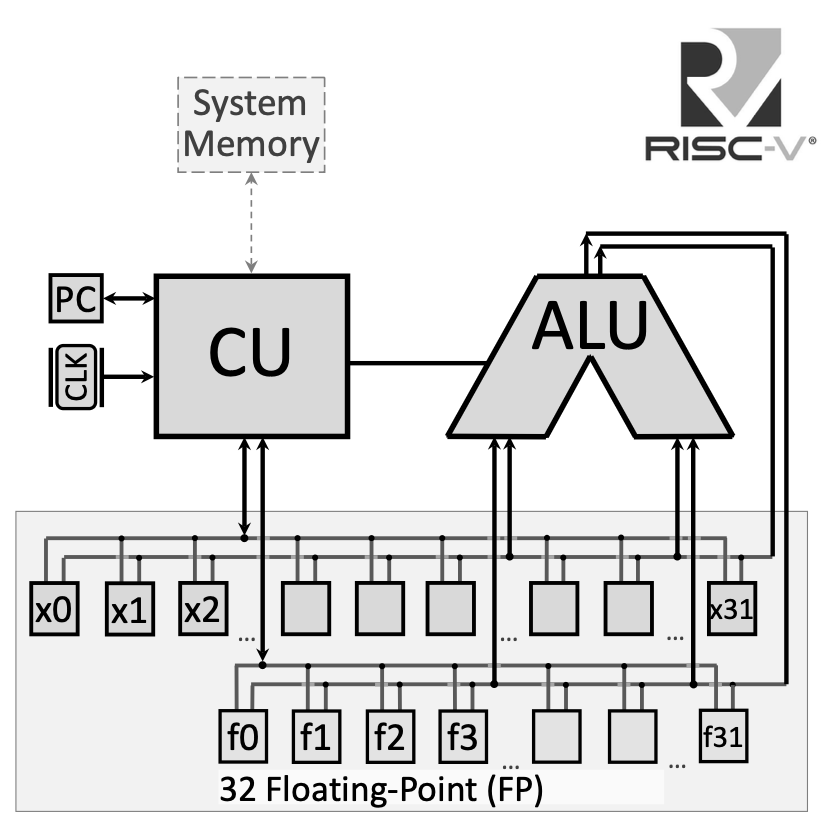{width=80%}

The floating-point registers connect to a dedicated bus for handling floating-point operations, separate from the integer register file. This allows the processor to execute floating-point and integer operations in parallel in more advanced implementations.

###### **1.1.3 Floating-Point Arithmetic Instructions**
RISC-V provides arithmetic operations for both single-precision (`.s` suffix) and double-precision (`.d` suffix) floating-point numbers:

{width=80%}

**Single-Precision Operations:**

*   **`fadd.s fd, fs1, fs2`**: Floating-point addition — $fd = fs1 + fs2$
*   **`fsub.s fd, fs1, fs2`**: Floating-point subtraction — $fd = fs1 - fs2$
*   **`fmul.s fd, fs1, fs2`**: Floating-point multiplication — $fd = fs1 \times fs2$
*   **`fdiv.s fd, fs1, fs2`**: Floating-point division — $fd = fs1 / fs2$
*   **`fsqrt.s fd, fs1`**: Square root — $fd = \sqrt{fs1}$

**Double-Precision Operations:**

*   **`fadd.d fd, fs1, fs2`**: Double-precision addition — $fd = fs1 + fs2$
*   **`fsub.d fd, fs1, fs2`**: Double-precision subtraction — $fd = fs1 - fs2$
*   **`fmul.d fd, fs1, fs2`**: Double-precision multiplication — $fd = fs1 \times fs2$
*   **`fdiv.d fd, fs1, fs2`**: Double-precision division — $fd = fs1 / fs2$
*   **`fsqrt.d fd, fs1`**: Double-precision square root — $fd = \sqrt{fs1}$

###### **1.1.4 Floating-Point Comparison Instructions**
Comparison instructions write their result to an **integer register** (not a floating-point register), setting it to 1 if the condition is true, or 0 if false:

**Single-Precision Comparisons:**

*   **`feq.s rd, fs1, fs2`**: Set if equal — $rd = 1$ if $fs1 == fs2$, else $rd = 0$
*   **`flt.s rd, fs1, fs2`**: Set if less than — $rd = 1$ if $fs1 < fs2$, else $rd = 0$
*   **`fle.s rd, fs1, fs2`**: Set if less or equal — $rd = 1$ if $fs1 \le fs2$, else $rd = 0$

**Double-Precision Comparisons:**

*   **`feq.d rd, fs1, fs2`**: Double-precision equality check
*   **`flt.d rd, fs1, fs2`**: Double-precision less than
*   **`fle.d rd, fs1, fs2`**: Double-precision less or equal

###### **1.1.5 Floating-Point Data Transfer Instructions**
To move data between memory and floating-point registers:

*   **`flw fd, offset(rs)`**: Load single-precision float from memory — $fd = \text{Memory}[rs + offset]$
*   **`fld fd, offset(rs)`**: Load double-precision float from memory — $fd = \text{Memory}[rs + offset]$
*   **`fsw fs, offset(rs)`**: Store single-precision float to memory — $\text{Memory}[rs + offset] = fs$
*   **`fsd fs, offset(rs)`**: Store double-precision float to memory — $\text{Memory}[rs + offset] = fs$

###### **1.1.6 Floating-Point Move Instructions**
To copy values between floating-point registers:

*   **`fmv.s fd, fs`**: Copy single-precision value from `fs` to `fd`
*   **`fmv.d fd, fs`**: Copy double-precision value from `fs` to `fd`

###### **1.1.7 System Calls for Floating-Point I/O**
RISC-V system calls provide input/output for floating-point values:

| Code (a7) | Service | Arguments/Returns |
|:----------|:--------|:------------------|
| 2 | Print float | `fa0` contains float value to print |
| 3 | Print double | `fa0` contains double value to print |
| 6 | Read float | Reads float, stores in `fa0` |
| 7 | Read double | Reads double, stores in `fa0` |

**Important:** Note that floating-point I/O uses register `fa0` (which is `f10`), not the integer register `a0`.

##### **1.2 High-Level Program Translation into Machine Code**
Understanding how high-level code becomes executable machine code is fundamental to computer architecture. This process involves multiple transformation stages, each serving a specific purpose.

###### **1.2.1 The Translation Pipeline**
The complete translation from a high-level program (like C/C++) to executable machine code involves four main stages:

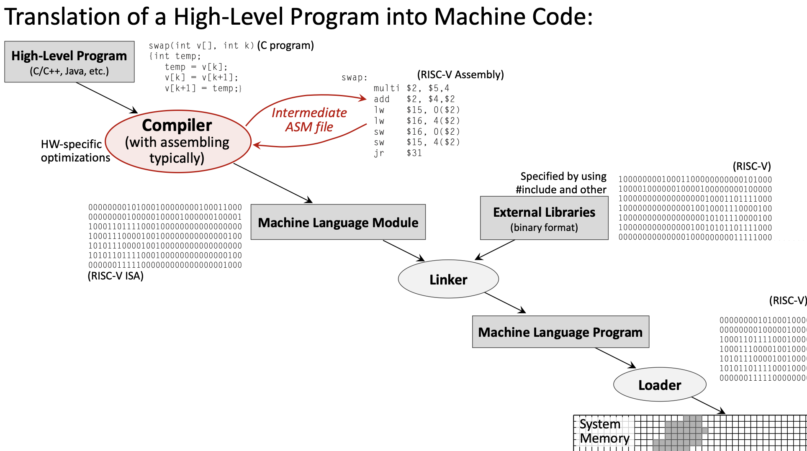{width=80%}

1.  **High-Level Program** (e.g., C code) → 
2.  **Compiler** → **Assembly Language Program** → 
3.  **Assembler** → **Machine Language Module** (Object file) → 
4.  **Linker** → **Executable Program** → 
5.  **Loader** → **Program in Memory**

###### **1.2.2 The Compiler**
The **compiler** transforms high-level source code into assembly language. This is where most optimization happens.

**Key responsibilities:**

*   Translate high-level constructs (loops, conditionals, functions) into assembly
*   Apply hardware-specific optimizations
*   Manage register allocation
*   Generate efficient code based on optimization level settings (e.g., `-O0`, `-O2`, `-O3`)

Example transformation:

```c
// High-Level C Code
float f2c(float fahr) {
    return ((5.0f/9.0f) * (fahr - 32.0f));
}
```

Becomes assembly:

```assembly
f2c:
    flw f0, const5, t0    # f0 = 5.0f
    flw f1, const9, t0    # f1 = 9.0f
    fdiv.s f0, f0, f1     # f0 = 5.0f/9.0f
    flw f1, const32, t0   # f1 = 32.0f
    fsub.s f10, f10, f1   # f10 = fahr - 32.0f
    fmul.s f10, f0, f10   # f10 = (5.0f/9.0f) * (fahr - 32.0f)
    ret
```

###### **1.2.3 The Assembler**
The **assembler** translates assembly language into machine language (binary object files).

**Key responsibilities:**

*   Convert mnemonics to binary opcodes
*   Resolve local labels to addresses
*   Generate relocation information for the linker
*   Create symbol tables

The assembler produces **object files** (.o files) containing:

*   Machine code (binary instructions)
*   Data sections
*   Symbol table (for linking)
*   Relocation information

###### **1.2.4 The Linker**
The **linker** combines multiple object files and external libraries into a single executable.

**Key responsibilities:**

*   Resolve external references (functions/variables defined in other files)
*   Combine code and data sections from multiple object files
*   Link with external libraries (standard library, math library, etc.)
*   Assign final memory addresses

###### **1.2.5 The Loader**
The **loader** is part of the operating system that loads the executable into memory for execution.

**Key responsibilities:**

*   Allocate memory for the program
*   Load code and data segments
*   Set up the stack and heap
*   Initialize the Program Counter to the program's entry point

###### **1.2.6 Hardware Dependency**
The translation stages differ in their hardware dependency:

*   **Hardware-Independent:** High-level source code (portable across platforms)
*   **Hardware-Dependent:** Assembly, object code, and executables (specific to RISC-V, x86, ARM, etc.)

This separation is why the same C program can be compiled for different processor architectures.

##### **1.3 RISC-V Instruction Encoding**
Every RISC-V instruction is encoded as exactly **32 bits**. Different instruction types use different bit field layouts to encode their operands.

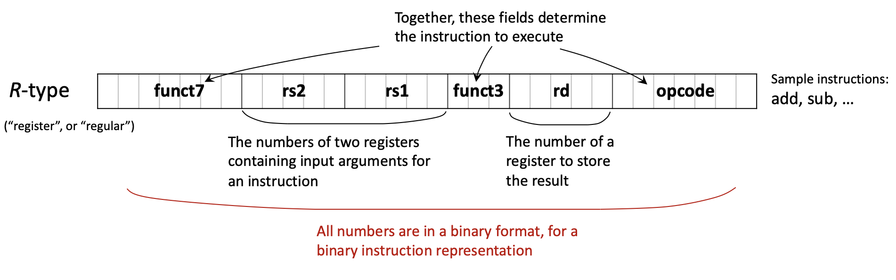{width=80%}

###### **1.3.1 Main Instruction Formats**
RISC-V uses six primary instruction formats:

**R-type (Register):** For operations using only registers

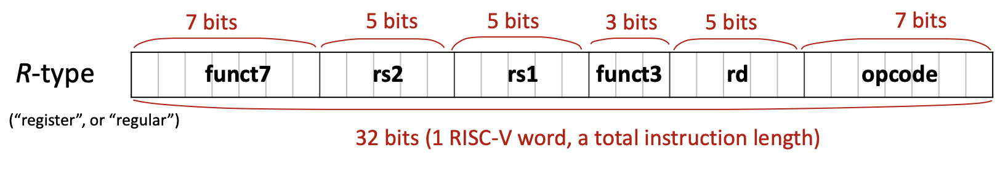{width=80%}

| funct7 (7) | rs2 (5) | rs1 (5) | funct3 (3) | rd (5) | opcode (7) |
|:-----------|:--------|:--------|:-----------|:-------|:-----------|

*   Used for: `add`, `sub`, `and`, `or`, `sll`, `srl`, etc.
*   All operands are registers

**I-type (Immediate):** For operations with immediate values and loads

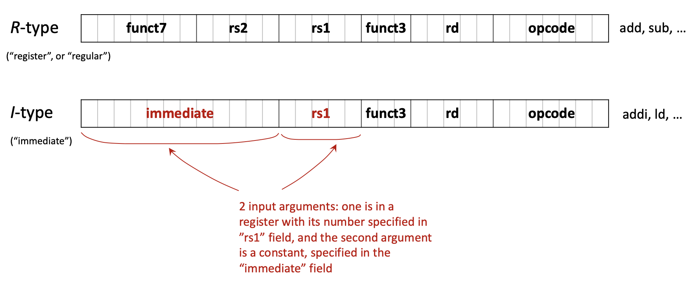{width=80%}

| imm[11:0] (12) | rs1 (5) | funct3 (3) | rd (5) | opcode (7) |
|:---------------|:--------|:-----------|:-------|:-----------|

*   Used for: `addi`, `andi`, `ori`, `ld`, `lw`, `jalr`, etc.
*   12-bit signed immediate value

**S-type (Store):** For store instructions

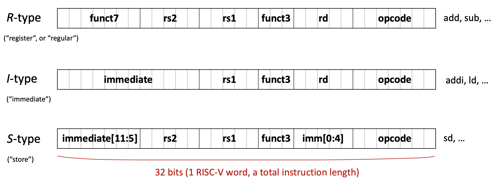{width=80%}

| imm[11:5] (7) | rs2 (5) | rs1 (5) | funct3 (3) | imm[4:0] (5) | opcode (7) |
|:--------------|:--------|:--------|:-----------|:-------------|:-----------|

*   Used for: `sw`, `sd`, `sb`, etc.
*   Immediate is split across two fields

**B-type (Branch):** For conditional branches

| imm[12\|10:5] (7) | rs2 (5) | rs1 (5) | funct3 (3) | imm[4:1\|11] (5) | opcode (7) |
|:------------------|:--------|:--------|:-----------|:-----------------|:-----------|

*   Used for: `beq`, `bne`, `blt`, `bge`, etc.
*   Immediate encodes branch offset (shifted)

**U-type (Upper immediate):** For large immediates

| imm[31:12] (20) | rd (5) | opcode (7) |
|:----------------|:-------|:-----------|

*   Used for: `lui`, `auipc`
*   20-bit immediate placed in upper bits

**J-type (Jump):** For unconditional jumps

| imm[20\|10:1\|11\|19:12] (20) | rd (5) | opcode (7) |
|:------------------------------|:-------|:-----------|

*   Used for: `jal`
*   20-bit immediate for jump offset

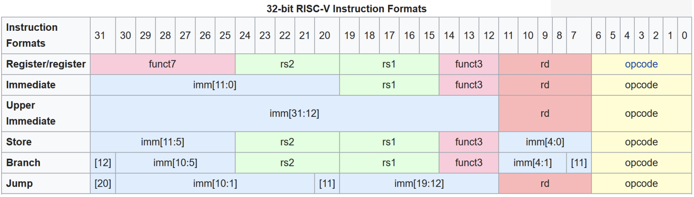{width=80%}

###### **1.3.2 Example: Translating C to Binary**
Let's trace the translation of `A[30] = h + A[30] + 1` where `h` is in register `x21` and the base address of array `A` is in `x18`.

**Step 1: Assign registers**

*   `h` → `x21`
*   Base address of `A` → `x18`
*   Temporary → `x5`

**Step 2: Write assembly**

```assembly
ld x5, 240(x18)    # Load A[30] (offset = 30 × 8 = 240 bytes for doubleword)
add x5, x21, x5    # x5 = h + A[30]
addi x5, x5, 1     # x5 = h + A[30] + 1
sd x5, 240(x18)    # Store result back to A[30]
```

**Step 3: Identify instruction types**

*   `ld` → I-type
*   `add` → R-type
*   `addi` → I-type
*   `sd` → S-type

**Step 4: Encode to binary (example for `ld x5, 240(x18)`)**

*   Opcode for `ld`: 0000011 (3 in decimal)
*   rd: 00101 (5 in decimal)
*   funct3 for doubleword: 011
*   rs1: 10010 (18 in decimal)
*   immediate: 000011110000 (240 in binary)

Final binary: `000011110000 10010 011 00101 0000011`

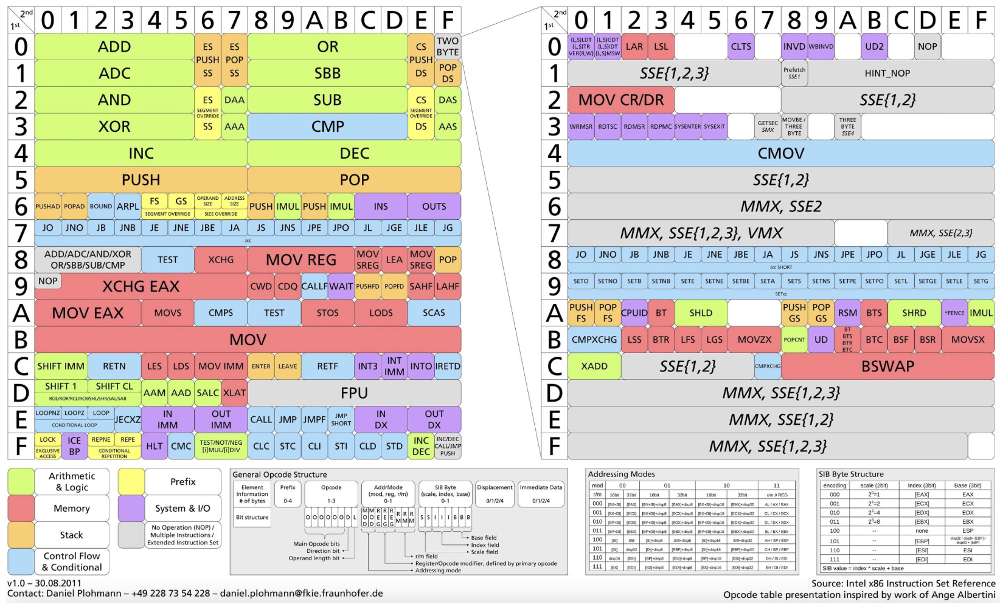{width=80%}

##### **1.4 Single-Cycle Processor Implementation**
A **single-cycle processor** executes each instruction in exactly one clock cycle. While simple to understand, this design has limitations that motivate more advanced implementations like pipelining.

###### **1.4.1 Recap: RISC-V Architecture**

{width=80%}

**Key characteristics:**

*   **Architecture type:** RISC (Reduced Instruction Set Computer)
*   **Memory type:** Load-Store (only load/store instructions access memory)
*   **Standard:** Open Architecture
*   **Address space:** 32 or 64 bits
*   **Instruction size:** Fixed 32 bits
*   **Registers:** 32 general-purpose (x0-x31) + 32 floating-point (f0-f31)
*   **Special register:** PC (Program Counter)

###### **1.4.2 The Program Counter (PC)**
The **Program Counter** is a special-purpose register that holds the address of the **next instruction** to be executed. Understanding the PC is crucial for understanding how programs flow.

**Key facts about PC:**

*   Contains a memory address pointing to the next instruction
*   Automatically incremented by 4 after each instruction (since all RISC-V instructions are 4 bytes)
*   Modified by branch and jump instructions to change program flow

###### **1.4.3 Harvard vs. Von Neumann Architecture**
Two fundamental memory architectures exist:

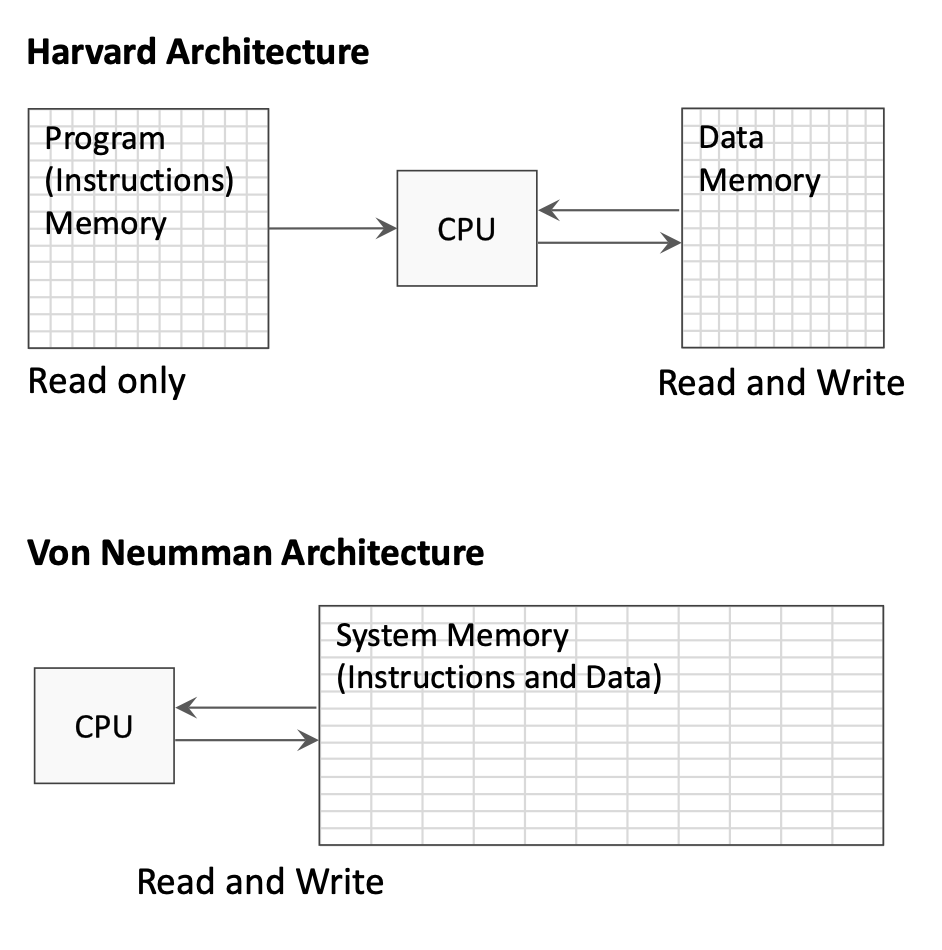{width=80%}

**Harvard Architecture:**

*   Separate memory spaces for instructions and data
*   Instruction memory is read-only during execution
*   Data memory allows both read and write
*   Allows simultaneous instruction fetch and data access

**Von Neumann Architecture:**

*   Single unified memory for both instructions and data
*   Simpler design but can create memory access bottleneck
*   Instructions and data share the same bus

The single-cycle processor diagrams typically show separate instruction and data memories (Harvard style) for clarity.

###### **1.4.4 Instruction Execution Stages**
Every instruction goes through a sequence of stages. In a single-cycle processor, all stages complete in one clock cycle:

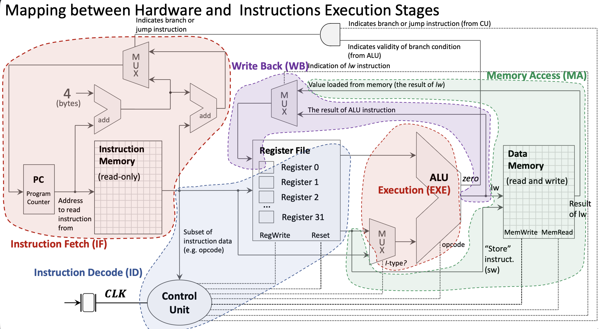{width=80%}

**1. Instruction Fetch (IF):**

*   PC sends address to Instruction Memory
*   Instruction Memory returns the 32-bit instruction
*   PC is incremented by 4 in parallel

**2. Instruction Decode (ID):**

*   Instruction bits are distributed to appropriate components
*   Register file reads source registers (rs1, rs2)
*   Control Unit decodes opcode and generates control signals
*   Immediate value is extracted and sign-extended

**3. Execution (EXE):**

*   ALU performs the operation specified by the instruction
*   For R-type: operates on two register values
*   For I-type: operates on register value and immediate
*   MUX selects between register and immediate for second ALU input

**4. Memory Access (MA):**

*   Only used by load/store instructions
*   `lw`/`ld`: Read data from Data Memory
*   `sw`/`sd`: Write data to Data Memory
*   Other instructions bypass this stage

**5. Write Back (WB):**

*   Result written back to destination register in Register File
*   Source can be ALU result or value loaded from memory
*   MUX selects the appropriate source

###### **1.4.5 Control Unit**
The **Control Unit (CU)** decodes the opcode and generates control signals that configure the datapath:

*   **ALU control:** What operation the ALU should perform
*   **ALUSrc:** Select register value or immediate for ALU input
*   **MemRead/MemWrite:** Enable reading/writing Data Memory
*   **RegWrite:** Enable writing to Register File
*   **MemtoReg:** Select ALU result or memory value for write-back
*   **Branch:** Indicates a branch instruction

###### **1.4.6 Branch Instruction Implementation**
Branch instructions require special handling:

{width=80%}

**Branch address calculation:**

*   Immediate value is extracted and shifted (branch offsets are multiples of 2)
*   Branch target = PC + (immediate × 2)

**Branch condition evaluation:**

*   ALU computes rs1 - rs2
*   "Zero" output indicates if rs1 equals rs2
*   AND gate combines "Branch" control signal with condition result

**PC update:**

*   MUX selects between PC+4 (sequential) and branch target
*   Selection controlled by branch condition result

###### **1.4.7 Memory Access Instructions**
Load and store instructions access the Data Memory:

**Store Word (`sw`):**

1.  ALU calculates address: rs1 + offset
2.  Value from rs2 goes to Data Memory write port
3.  MemWrite signal enables the write

**Load Word (`lw`):**

1.  ALU calculates address: rs1 + offset
2.  MemRead signal enables reading from Data Memory
3.  MUX selects memory value (instead of ALU result) for write-back
4.  Value written to destination register

###### **1.4.8 Complete Single-Cycle Datapath**

{width=80%}

The complete datapath includes:

*   **PC:** Holds address of current instruction
*   **Instruction Memory:** Stores program instructions
*   **Register File:** 32 integer registers with 2 read ports and 1 write port
*   **ALU:** Performs arithmetic and logical operations
*   **Data Memory:** Stores program data
*   **Control Unit:** Generates control signals
*   **Multiplexers:** Select between alternative data paths
*   **Adders:** Compute PC+4 and branch targets

###### **1.4.9 Clocking and Synchronization**
All state elements (PC, Register File, Memories) are synchronized by the **clock signal**:

*   **Rising edge:** State elements capture new values
*   **Clock period:** Must be long enough for slowest instruction to complete
*   **Reset signal:** Initializes PC to starting address

The single-cycle design's limitation: clock period is determined by the slowest instruction (typically load), making faster instructions wait unnecessarily.

##### **1.5 Introduction to Pipelining**
**Pipelining** is a fundamental technique that improves processor throughput by overlapping instruction execution.

###### **1.5.1 The Pipelining Concept**

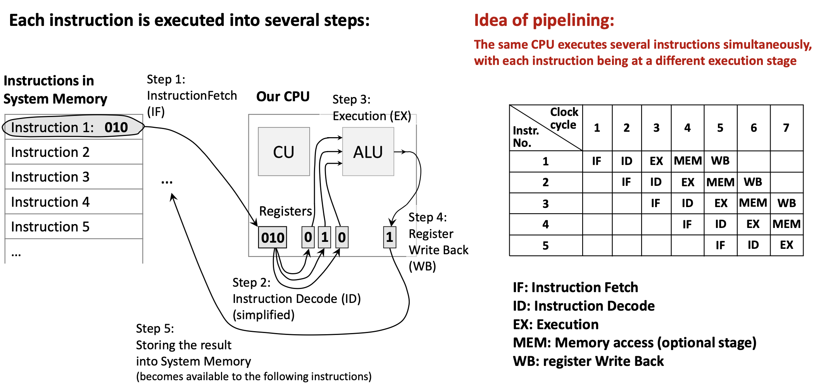{width=80%}

**Analogy:** Think of an assembly line in a factory. While one car is being painted, another is being assembled, and a third is having its engine installed. No car finishes faster, but more cars are completed per unit time.

**In a processor:**

*   Each instruction still takes multiple stages (IF, ID, EXE, MEM, WB)
*   But different instructions occupy different stages simultaneously
*   When Instruction 1 is in ID stage, Instruction 2 can be in IF stage
*   Ideally, throughput increases by factor of pipeline depth

**Benefits:**

*   Higher instruction throughput (more instructions per second)
*   Better utilization of hardware components

**Challenges:**

*   **Data hazards:** Instruction needs data from previous instruction not yet available
*   **Control hazards:** Branch instructions disrupt the pipeline flow
*   **Structural hazards:** Hardware resource conflicts

Pipelining doesn't reduce latency (time for one instruction) but dramatically increases throughput (instructions per second).

#### **2. Definitions**
*   **Floating-Point Number**: A number representation that can express very large or very small values using a sign, mantissa (significand), and exponent, following the IEEE 754 standard.
*   **Single-Precision**: A 32-bit floating-point format providing approximately 7 decimal digits of precision.
*   **Double-Precision**: A 64-bit floating-point format providing approximately 15-16 decimal digits of precision.
*   **Floating-Point Register**: One of 32 dedicated registers (f0-f31) in RISC-V used exclusively for floating-point operations.
*   **Compiler**: A program that translates high-level source code (like C) into assembly language, applying optimizations for the target hardware.
*   **Assembler**: A program that translates assembly language mnemonics into binary machine code (object files).
*   **Linker**: A program that combines multiple object files and libraries into a single executable program, resolving external references.
*   **Loader**: An operating system component that loads an executable program into memory and prepares it for execution.
*   **Object File**: The binary output of an assembler containing machine code, data, symbol tables, and relocation information.
*   **Opcode**: The portion of a machine instruction that specifies the operation to be performed.
*   **Instruction Format**: The layout of bit fields within a machine instruction (e.g., R-type, I-type, S-type).
*   **R-type Instruction**: A RISC-V instruction format where all operands are registers, used for arithmetic and logical operations.
*   **I-type Instruction**: A RISC-V instruction format with a 12-bit immediate value, used for immediate operations and loads.
*   **S-type Instruction**: A RISC-V instruction format used for store operations, with the immediate value split across two fields.
*   **Program Counter (PC)**: A special register containing the memory address of the next instruction to be executed.
*   **Single-Cycle Processor**: A processor design where each instruction completes in exactly one clock cycle.
*   **Datapath**: The collection of hardware components (registers, ALU, memory, etc.) through which data flows during instruction execution.
*   **Control Unit (CU)**: The processor component that decodes instructions and generates control signals to coordinate the datapath.
*   **ALU (Arithmetic Logic Unit)**: The processor component that performs arithmetic and logical operations.
*   **Instruction Fetch (IF)**: The stage where the processor reads an instruction from memory using the PC address.
*   **Instruction Decode (ID)**: The stage where the instruction is interpreted and operands are read from registers.
*   **Execution (EXE)**: The stage where the ALU performs the operation specified by the instruction.
*   **Memory Access (MA)**: The stage where load/store instructions read from or write to data memory.
*   **Write Back (WB)**: The stage where the result is written to the destination register.
*   **Harvard Architecture**: A computer architecture with separate memory spaces for instructions and data.
*   **Von Neumann Architecture**: A computer architecture with a single unified memory for both instructions and data.
*   **Multiplexer (MUX)**: A circuit that selects one of several input signals based on a control signal and forwards it to the output.
*   **Pipelining**: A technique where multiple instructions are overlapped in execution, with each instruction in a different stage simultaneously.
*   **Throughput**: The number of instructions completed per unit time.
*   **Latency**: The time required to complete a single instruction from start to finish.

#### **3. Examples**
##### **3.1. Fahrenheit to Celsius Conversion** (Lab 13, Example 1)
Write a RISC-V program using floating-point instructions to convert temperature from Fahrenheit to Celsius using the formula:
$$°C = (°F - 32.0) \times \frac{5.0}{9.0}$$

<details>
<summary>Click to see the solution</summary>

**Key Concept:** Use floating-point arithmetic instructions to perform the conversion. Constants must be stored in memory and loaded into floating-point registers.

**The function:**

```assembly
.data:
const5:  .float 5.0      # Allocate float constant 5.0
const9:  .float 9.0      # Allocate float constant 9.0
const32: .float 32.0     # Allocate float constant 32.0

.text
f2c:                     # Function to convert Fahrenheit to Celsius
    flw f0, const5, t0   # f0 = 5.0f (t0 used as temp for address)
    flw f1, const9, t0   # f1 = 9.0f
    fdiv.s f0, f0, f1    # f0 = 5.0f / 9.0f
    flw f1, const32, t0  # f1 = 32.0f
    fsub.s f10, f10, f1  # f10 = fahr - 32.0f (input in f10)
    fmul.s f10, f0, f10  # f10 = (5.0f/9.0f) * (fahr - 32.0f)
    ret                  # Return (result in f10)
```

**Complete program with main:**

```assembly
.data:
const5:  .float 5.0
const9:  .float 9.0
const32: .float 32.0

.text
main:
    li a7, 6             # System call code to read a float
    ecall                # Execute system call (input stored in fa0)
    fmv.s f10, fa0       # Move input to f10 (Note: f10 IS fa0, so this is redundant!)
    call f2c             # Call conversion function
    li a7, 2             # System call code to print a float
    ecall                # Print result (fa0 = f10 already contains result)
    li a7, 10            # System call code to exit
    ecall                # Exit program

f2c:
    flw f0, const5, t0
    flw f1, const9, t0
    fdiv.s f0, f0, f1
    flw f1, const32, t0
    fsub.s f10, f10, f1
    fmul.s f10, f0, f10
    ret
```

**Discussion Question:** Why is `fmv.s f10, fa0` redundant?

**Answer:** Because `f10` and `fa0` are the same register! The ABI name `fa0` is just an alias for register `f10`. So copying from `fa0` to `f10` does nothing.

**Step-by-step explanation:**

1.  **Read input:** System call 6 reads a float from user into `fa0` (which is `f10`)
2.  **Call function:** `f2c` expects argument in `f10`, which already contains the input
3.  **Inside f2c:**
    *   Load constants 5.0, 9.0, and 32.0 from memory
    *   Compute `5.0 / 9.0` and store in `f0`
    *   Subtract 32.0 from input temperature
    *   Multiply by `5.0/9.0` to get Celsius
4.  **Print result:** System call 2 prints the float in `fa0` (which is the result in `f10`)

**Answer:** For input 212°F, the program outputs 100.0 (the boiling point of water in Celsius).

</details>

##### **3.2. Sphere Surface Area and Volume** (Lab 13, Task 1)
Write a RISC-V program to compute the surface area and volume of a sphere using the formulas:
$$\text{surfaceArea} = 4.0 \times \pi \times r^2$$
$$\text{volume} = \frac{4.0}{3.0} \times \pi \times r^3$$

Hint: Assume $\pi = 3.14159$

<details>
<summary>Click to see the solution</summary>

**Key Concept:** Use floating-point multiplication to compute powers ($r^2 = r \times r$, $r^3 = r \times r \times r$) and combine with constants.

```assembly
.data
pi:      .float 3.14159
four:    .float 4.0
three:   .float 3.0
sa_msg:  .asciiz "Surface Area: "
vol_msg: .asciiz "\nVolume: "
prompt:  .asciiz "Enter radius: "

.text
main:
    # Print prompt
    li a7, 4
    la a0, prompt
    ecall
    
    # Read radius from user
    li a7, 6
    ecall
    fmv.s f10, fa0           # f10 = radius
    
    # Load constants
    flw f0, pi, t0           # f0 = pi
    flw f1, four, t0         # f1 = 4.0
    flw f2, three, t0        # f2 = 3.0
    
    # Calculate r^2
    fmul.s f3, f10, f10      # f3 = r * r = r^2
    
    # Calculate r^3
    fmul.s f4, f3, f10       # f4 = r^2 * r = r^3
    
    # Calculate surface area: 4.0 * pi * r^2
    fmul.s f5, f1, f0        # f5 = 4.0 * pi
    fmul.s f5, f5, f3        # f5 = 4.0 * pi * r^2 (surface area)
    
    # Calculate volume: (4.0/3.0) * pi * r^3
    fdiv.s f6, f1, f2        # f6 = 4.0 / 3.0
    fmul.s f6, f6, f0        # f6 = (4.0/3.0) * pi
    fmul.s f6, f6, f4        # f6 = (4.0/3.0) * pi * r^3 (volume)
    
    # Print surface area
    li a7, 4
    la a0, sa_msg
    ecall
    
    li a7, 2
    fmv.s fa0, f5            # Move surface area to fa0 for printing
    ecall
    
    # Print volume
    li a7, 4
    la a0, vol_msg
    ecall
    
    li a7, 2
    fmv.s fa0, f6            # Move volume to fa0 for printing
    ecall
    
    # Exit
    li a7, 10
    ecall
```

**Step-by-step:**

1.  **Read radius** into `f10`
2.  **Load constants**: $\pi$, 4.0, and 3.0
3.  **Compute $r^2$**: Multiply radius by itself
4.  **Compute $r^3$**: Multiply $r^2$ by radius
5.  **Surface area**: $4.0 \times \pi \times r^2$
6.  **Volume**: $(4.0 / 3.0) \times \pi \times r^3$
7.  **Print results** using system calls

**Answer:** For radius = 5.0:

- Surface Area ≈ 314.159
- Volume ≈ 523.599

</details>

##### **3.3. Calculate Function f(x)** (Lab 13, Optional Task)
Write a program to calculate the following expression:
$$f(x) = \frac{e^2}{\pi} \cdot x$$

Hint: Assume $\pi = 3.14159$ and $e = 2.71828$

<details>
<summary>Click to see the solution</summary>

**Key Concept:** Pre-compute $e^2$ as a constant or compute it at runtime, then divide by $\pi$ and multiply by $x$.

```assembly
.data
pi:      .float 3.14159
e:       .float 2.71828
prompt:  .asciiz "Enter x: "
result:  .asciiz "f(x) = "

.text
main:
    # Print prompt
    li a7, 4
    la a0, prompt
    ecall
    
    # Read x from user
    li a7, 6
    ecall
    fmv.s f10, fa0           # f10 = x
    
    # Load constants
    flw f0, e, t0            # f0 = e
    flw f1, pi, t0           # f1 = pi
    
    # Calculate e^2
    fmul.s f2, f0, f0        # f2 = e * e = e^2
    
    # Calculate e^2 / pi
    fdiv.s f3, f2, f1        # f3 = e^2 / pi
    
    # Calculate f(x) = (e^2 / pi) * x
    fmul.s f4, f3, f10       # f4 = (e^2 / pi) * x
    
    # Print result message
    li a7, 4
    la a0, result
    ecall
    
    # Print result value
    li a7, 2
    fmv.s fa0, f4
    ecall
    
    # Exit
    li a7, 10
    ecall
```

**Step-by-step:**

1.  **Read input** $x$ from user
2.  **Load constants** $e$ and $\pi$
3.  **Compute $e^2$**: `fmul.s f2, f0, f0`
4.  **Compute $e^2 / \pi$**: `fdiv.s f3, f2, f1`
5.  **Compute result**: Multiply by $x$

**Answer:** For $x = 1.0$:

- $e^2 \approx 7.389$
- $e^2 / \pi \approx 2.351$
- $f(1.0) \approx 2.351$

</details>

##### **3.4. Translate C Expression to RISC-V** (Lecture 13, Example)
Translate the C expression `A[30] = h + A[30] + 1` into RISC-V assembly and then into binary machine code.

Assume:

- Variable `h` is assigned to register `x21`
- Base address of array `A` is in register `x18`
- Array `A` contains 64-bit doublewords

<details>
<summary>Click to see the solution</summary>

**Key Concept:** Break down the expression into basic operations: load from memory, add values, store back to memory.

**Step 1: Write the assembly code**

```assembly
ld x5, 240(x18)    # Load A[30] into x5 (offset = 30 × 8 = 240)
add x5, x21, x5    # x5 = h + A[30]
addi x5, x5, 1     # x5 = h + A[30] + 1
sd x5, 240(x18)    # Store result back to A[30]
```

**Step 2: Identify instruction types**

| Instruction | Type | Format |
|:------------|:-----|:-------|
| `ld x5, 240(x18)` | I-type | immediate \| rs1 \| funct3 \| rd \| opcode |
| `add x5, x21, x5` | R-type | funct7 \| rs2 \| rs1 \| funct3 \| rd \| opcode |
| `addi x5, x5, 1` | I-type | immediate \| rs1 \| funct3 \| rd \| opcode |
| `sd x5, 240(x18)` | S-type | imm[11:5] \| rs2 \| rs1 \| funct3 \| imm[4:0] \| opcode |

**Step 3: Encode `ld x5, 240(x18)` to binary**

*   Opcode for `ld`: 0000011 (3)
*   rd = x5: 00101 (5)
*   funct3 for doubleword: 011 (3)
*   rs1 = x18: 10010 (18)
*   immediate = 240: 000011110000

Binary: `000011110000 10010 011 00101 0000011`

**Step 4: Encode `add x5, x21, x5` to binary**

*   Opcode for R-type: 0110011 (51)
*   rd = x5: 00101
*   funct3 for add: 000
*   rs1 = x21: 10101 (21)
*   rs2 = x5: 00101 (5)
*   funct7 for add: 0000000

Binary: `0000000 00101 10101 000 00101 0110011`

**Step 5: Encode `addi x5, x5, 1` to binary**

*   Opcode for I-type: 0010011 (19)
*   rd = x5: 00101
*   funct3 for addi: 000
*   rs1 = x5: 00101
*   immediate = 1: 000000000001

Binary: `000000000001 00101 000 00101 0010011`

**Step 6: Encode `sd x5, 240(x18)` to binary**

*   Opcode for S-type: 0100011 (35)
*   funct3 for doubleword: 011
*   rs1 = x18: 10010
*   rs2 = x5: 00101
*   immediate = 240 split: imm[11:5] = 0000111, imm[4:0] = 10000

Binary: `0000111 00101 10010 011 10000 0100011`

**Answer:** The complete binary encoding:

```
ld x5, 240(x18):   000011110000 10010 011 00101 0000011
add x5, x21, x5:   0000000 00101 10101 000 00101 0110011
addi x5, x5, 1:    000000000001 00101 000 00101 0010011
sd x5, 240(x18):   0000111 00101 10010 011 10000 0100011
```

</details>

##### **3.5. Identify Instruction Stages** (Lecture 13, Exercise)
For each of the following instructions, identify which execution stages are used:

a) `add x5, x6, x7`
b) `lw x5, 0(x6)`
c) `sw x5, 0(x6)`
d) `beq x5, x6, label`

<details>
<summary>Click to see the solution</summary>

**Key Concept:** Different instructions use different subsets of the five stages (IF, ID, EXE, MA, WB).

**(a) `add x5, x6, x7`** (R-type arithmetic)

| Stage | Used? | Activity |
|:------|:------|:---------|
| IF | ✓ | Fetch instruction from memory |
| ID | ✓ | Read x6 and x7 from register file |
| EXE | ✓ | ALU computes x6 + x7 |
| MA | ✗ | No memory access needed |
| WB | ✓ | Write result to x5 |

**(b) `lw x5, 0(x6)`** (Load word)

| Stage | Used? | Activity |
|:------|:------|:---------|
| IF | ✓ | Fetch instruction |
| ID | ✓ | Read x6 (base address) |
| EXE | ✓ | ALU computes address: x6 + 0 |
| MA | ✓ | Read data from memory at computed address |
| WB | ✓ | Write loaded value to x5 |

**(c) `sw x5, 0(x6)`** (Store word)

| Stage | Used? | Activity |
|:------|:------|:---------|
| IF | ✓ | Fetch instruction |
| ID | ✓ | Read x5 (value) and x6 (address) |
| EXE | ✓ | ALU computes address: x6 + 0 |
| MA | ✓ | Write x5 value to memory |
| WB | ✗ | No register to write |

**(d) `beq x5, x6, label`** (Branch)

| Stage | Used? | Activity |
|:------|:------|:---------|
| IF | ✓ | Fetch instruction |
| ID | ✓ | Read x5 and x6; decode branch target |
| EXE | ✓ | ALU compares x5 and x6 (subtraction) |
| MA | ✗ | No memory access |
| WB | ✗ | No register to write |

**Answer:**

- `add`: IF, ID, EXE, WB
- `lw`: IF, ID, EXE, MA, WB (uses all stages)
- `sw`: IF, ID, EXE, MA
- `beq`: IF, ID, EXE

</details>

##### **3.6. Trace Pipeline Execution** (Lecture 13, Example)
Show how the following sequence of instructions would execute in a 5-stage pipeline over time:

```assembly
add x1, x2, x3
sub x4, x5, x6
and x7, x8, x9
or x10, x11, x12
```

<details>
<summary>Click to see the solution</summary>

**Key Concept:** In a pipeline, each instruction progresses through stages one at a time, while new instructions enter behind it.

**Pipeline execution diagram:**

| Clock Cycle | 1 | 2 | 3 | 4 | 5 | 6 | 7 | 8 |
|:------------|:--|:--|:--|:--|:--|:--|:--|:--|
| `add` | IF | ID | EX | MA | WB | | | |
| `sub` | | IF | ID | EX | MA | WB | | |
| `and` | | | IF | ID | EX | MA | WB | |
| `or` | | | | IF | ID | EX | MA | WB |

**Explanation by clock cycle:**

*   **Cycle 1:** `add` enters IF stage
*   **Cycle 2:** `add` moves to ID; `sub` enters IF
*   **Cycle 3:** `add` in EX; `sub` in ID; `and` enters IF
*   **Cycle 4:** `add` in MA; `sub` in EX; `and` in ID; `or` enters IF
*   **Cycle 5:** `add` completes (WB); `sub` in MA; `and` in EX; `or` in ID
*   **Cycle 6:** `sub` completes; `and` in MA; `or` in EX
*   **Cycle 7:** `and` completes; `or` in MA
*   **Cycle 8:** `or` completes

**Throughput analysis:**

*   Without pipelining: 4 instructions × 5 cycles = 20 cycles
*   With pipelining: 8 cycles (4 cycles to fill + 4 instructions)
*   Speedup: 20/8 = 2.5x (approaches 5x for longer sequences)

**Answer:** All 4 instructions complete in 8 clock cycles. Once the pipeline is full (cycle 4), one instruction completes every cycle.

</details>

##### **3.7. Single-Cycle vs Pipelined Performance** (Lecture 13, Problem)
A single-cycle processor has the following stage delays:

- IF: 200 ps
- ID: 100 ps
- EX: 200 ps
- MA: 200 ps
- WB: 100 ps

Calculate:

a) The clock period for a single-cycle implementation
b) The clock period for a pipelined implementation
c) The speedup for executing 100 instructions

<details>
<summary>Click to see the solution</summary>

**Key Concept:** Single-cycle must wait for slowest instruction; pipelined clock is limited by slowest stage.

**(a) Single-cycle clock period:**

The clock must be long enough for any instruction to complete all stages:
$$T_{single} = IF + ID + EX + MA + WB = 200 + 100 + 200 + 200 + 100 = 800 \text{ ps}$$

**(b) Pipelined clock period:**

The clock is limited by the slowest stage:
$$T_{pipelined} = \max(IF, ID, EX, MA, WB) = \max(200, 100, 200, 200, 100) = 200 \text{ ps}$$

**(c) Speedup for 100 instructions:**

**Single-cycle time:**
$$\text{Time}_{single} = 100 \times 800 \text{ ps} = 80,000 \text{ ps}$$

**Pipelined time:**
First instruction takes 5 cycles, then one instruction completes each cycle:
$$\text{Time}_{pipelined} = (5 + 99) \times 200 \text{ ps} = 104 \times 200 = 20,800 \text{ ps}$$

**Speedup:**
$$\text{Speedup} = \frac{80,000}{20,800} \approx 3.85$$

**Answer:**

- Single-cycle period: 800 ps
- Pipelined period: 200 ps
- Speedup: ~3.85x (approaches 4x = 800/200 for large instruction counts)

</details>

