

[Quiz](https://notebooklm.google.com/notebook/10ea61f7-7eb6-46b2-9183-d13f960171e9?artifactId=b24c1665-498a-4a90-9a61-b8ffc92c5b59) | [Flashcards](https://notebooklm.google.com/notebook/10ea61f7-7eb6-46b2-9183-d13f960171e9?artifactId=9b7f69ab-b0ba-4ebd-82aa-8690316ed710)

#### **1. Summary**

##### **1.1 SystemVerilog: A Hardware Description Language (HDL)**

A **Hardware Description Language (HDL)** is a specialized computer language used to describe the structure and behavior of electronic circuits, particularly digital logic circuits. Instead of writing software that runs on a processor, with an HDL you are describing the physical hardware itself—how logic gates are connected and how they should behave. SystemVerilog is a modern and powerful HDL used in the design and verification of digital chips.

##### **1.2 Designing a 2-to-1 Multiplexer**

###### **1.2.1 The Logic Circuit**

A **Multiplexer (Mux)** is a fundamental digital circuit that selects one of several input signals and forwards the selected input to a single output line. The selection is directed by a separate set of digital inputs known as select lines.

A 2-to-1 multiplexer has:

- Two data inputs, let's call them `i1` and `i2`.
- One select line, `s`.
- One output, `q`.

The behavior is simple:

- If the select line `s` is 0, the output `q` is equal to the input `i1`.
- If the select line `s` is 1, the output `q` is equal to the input `i2`.

This logic can be built using basic logic gates: two AND gates, one OR gate, and one NOT gate.

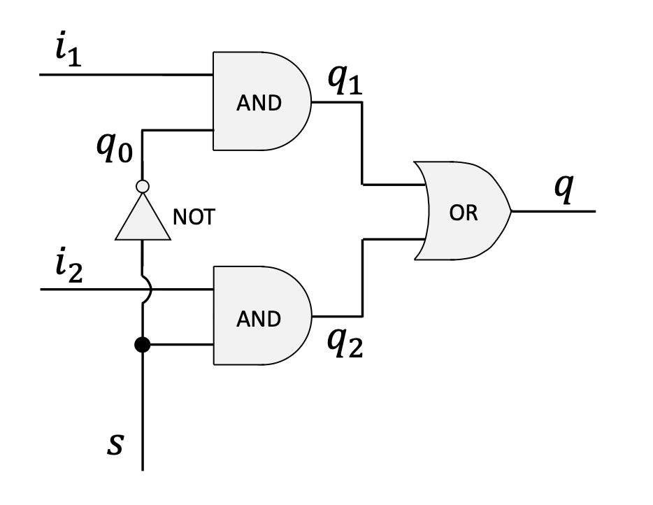{width=80%}

###### **1.2.2 Implementation in Verilog**

We can describe this hardware module using SystemVerilog. The code below defines the structure and connections of the multiplexer.

```verilog
// 1. Module Definition: Declares a new hardware module named 'mux'.
//    The parentheses list all external connection points (pins):
//    three inputs (i1, i2, s) and one output (q).
module mux (i1, i2, s, q);

  // 2. Pin Direction Declaration: Specifies which pins are inputs
  //    and which are outputs.
  input  i1, i2, s;
  output q;

  // 3. Internal Wires: Declares internal wires to connect the
  //    logic gates. These are not visible from outside the module.
  wire q0, q1, q2;

  // 4. Gate Instantiation: Describes the logic gates and their
  //    connections. For Verilog primitives, the output pin is
  //    always listed first.
  
  // A NOT gate to invert the select signal 's'. Output is 'q0'.
  not(q0, s);
  
  // An AND gate combining input 'i1' and the inverted select 'q0'.
  // Output is 'q1'.
  and(q1, i1, q0);
  
  // An AND gate combining input 'i2' and the original select 's'.
  // Output is 'q2'.
  and(q2, i2, s);
  
  // An OR gate to combine the outputs of the two AND gates.
  // The final result is the module's output 'q'.
  or(q, q1, q2);

// 5. End of Module Definition
endmodule
```

###### **1.2.3 Syntax Variations for Pin Declaration**

SystemVerilog allows a more modern and compact syntax for declaring module pins, where the direction is specified directly in the port list. The following declaration is equivalent to the one above.

```verilog
module mux (
  input  i1,
  input  i2,
  input  s,
  output q
);
  // ... module logic ...
endmodule
```

##### **1.3 Verilog Operators and Continuous Assignment**

###### **1.3.1 Verilog Operators**

Instead of instantiating primitive gates, we can describe logic using operators, similar to programming languages. Some common bitwise operators include:

- `~`: Bitwise NOT (negation)
- `&`: Bitwise AND
- `|`: Bitwise OR
- `^`: Bitwise XOR
- `?:`: Conditional (ternary) operator

###### **1.3.2 Continuous Assignment with `assign`**

The **`assign`** keyword is used for *continuous assignment*. It creates a direct combinatorial link between the inputs on the right side and the output on the left. Whenever any input value on the right side changes, the expression is immediately re-evaluated, and the output is updated. This is a powerful way to describe stateless, combinational logic.

For example, `and(q1, i1, q0);` can be rewritten as:

```verilog
assign q1 = i1 & q0;
```
This directly describes the hardware's behavior without explicitly naming the gate.

##### **1.4 Alternative Multiplexer Implementations**

Using `assign` statements, the multiplexer can be implemented more concisely.

- **Implementation with intermediate wires:**
```verilog
module mux (i1, i2, s, q);
  input  i1, i2, s;
  output q;
  wire   q0, q1, q2;

  assign q0 = ~s;
  assign q1 = i1 & q0;
  assign q2 = i2 & s;
  assign q  = q1 | q2;
endmodule
```

- **Compact implementation:** The logic can be combined into a single line.
```verilog
module mux (i1, i2, s, q);
  input  i1, i2, s;
  output q;

  assign q = (i1 & ~s) | (i2 & s);
endmodule
```

##### **1.5 Procedural Blocks with `always_comb`**

###### **1.5.1 The `always_comb` Block**

A **procedural block** is another way to describe hardware behavior. The `always_comb` block is specifically designed for describing combinational logic. The synthesis tool understands that the code inside this block should execute whenever any of the input signals change.

- Variables assigned inside an `always` block must be of a variable type, like `logic`. The `output` pin `q` is declared as `output logic q;`.
- The logic is placed between `begin` and `end`.

```verilog
module mux (i1, i2, s, q);
  input  i1, i2, s;
  output logic q; // 'q' must be a variable type

  always_comb
  begin
    q = (i1 & ~s) | (i2 & s);
  end
endmodule
```

###### **1.5.2 Blocking Assignments**

Inside an `always_comb` block, we use **blocking assignments**, indicated by the `=` operator. This means statements are executed sequentially, one after the other. The execution of the next line is "blocked" until the current one is complete. This is the standard practice for modeling combinational logic.

##### **1.6 Conditional Logic in `always_comb` Blocks**

Procedural blocks allow for more abstract, higher-level descriptions using conditional statements.

###### **1.6.1 The `if-else` Statement**

The multiplexer's behavior is naturally described by an `if-else` statement.

```verilog
always_comb
begin
  if (s == 0)
    q = i1;
  else
    q = i2;
end
```

###### **1.6.2 The `case` Statement**

A `case` statement is another way to express the same logic, which is often cleaner when there are multiple conditions.

```verilog
always_comb
begin
  case (s)
    0: q = i1;
    1: q = i2;
  endcase
end
```
###### **1.6.3 Important Note on Completeness**

When modeling combinational logic inside an `always_comb` block, you must specify an output for **all possible input conditions**. If a condition is left out (e.g., an `if` without an `else`), the synthesis tool will infer that the output should hold its previous value. To achieve this, it creates a **latch**, which is a memory element. This is usually an error when designing purely combinational logic, so always ensure your `if-else` or `case` statements are complete.

##### **1.7 Visualizing Hardware with RTL Viewer**

Tools like Intel Quartus Prime include an **RTL (Register-Transfer Level) Viewer**. After writing SystemVerilog code, this tool can be used to generate and display a schematic of the hardware you have described. This is extremely useful for verifying that the synthesized circuit matches your design intent. Regardless of whether you used gate primitives, `assign` statements, or `always_comb` with `if`/`case`, the final synthesized circuit for the 2-to-1 multiplexer will be logically identical.

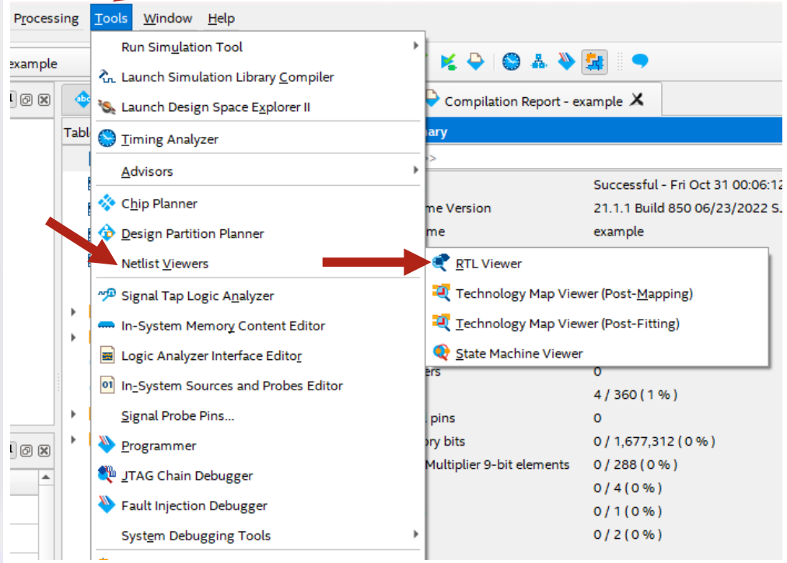{width=80%}

##### **1.8 Memory Hierarchy and Types**

###### **1.8.1 Memory Hierarchy Overview**
A computer system uses a hierarchy of memory types to balance speed, cost, and capacity. The closer memory is to the CPU, the faster and more expensive (per byte) it is, but the smaller its capacity.

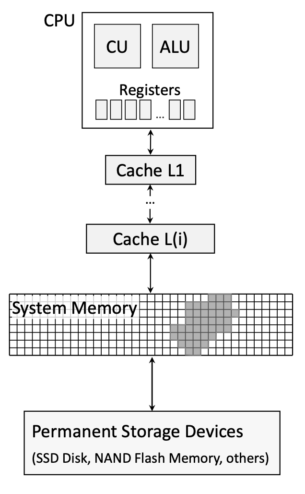{width=40%}

The typical hierarchy is:

1.  **CPU Registers:** Fastest, smallest, inside the CPU.
2.  **CPU Cache (L1, L2, L3):** Very fast, sits between CPU and main memory.
3.  **System Memory (Main Memory/RAM):** Slower than cache, larger capacity.
4.  **Permanent Storage Devices:** Slowest, largest capacity (e.g., SSD, HDD).

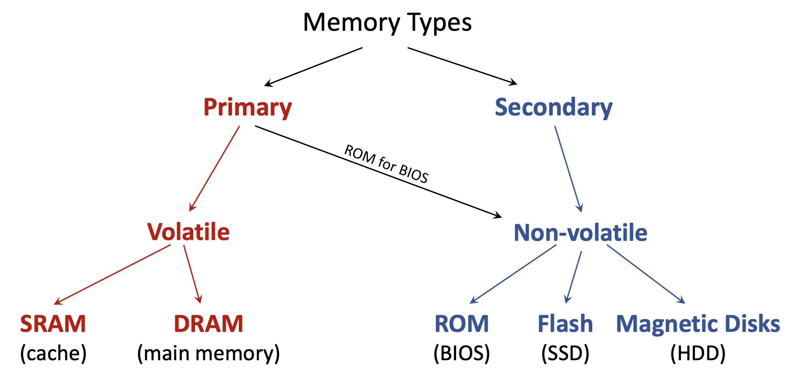{width=80%}

###### **1.8.2 Volatile vs. Non-Volatile Memory**

- **Volatile Memory** loses its stored information when the power is turned off. It is temporary storage. Examples include CPU registers, cache (SRAM), and main system memory (DRAM).
- **Non-Volatile Memory** retains its data even without power. It is used for permanent storage. Examples include Solid-State Drives (SSD), Hard-Disk Drives (HDD), and USB drives.

###### **1.8.3 Primary vs. Secondary Memory**

- **Primary Memory** is memory that the CPU can access directly. It is almost always volatile. This includes CPU cache, system memory (RAM), and the ROM that holds the BIOS.
- **Secondary Memory** refers to storage devices that are not directly accessible by the CPU. Data must first be loaded into primary memory. It is non-volatile and includes SSDs, HDDs, and USB storage.

###### **1.8.4 RAM, SAM, and ROM**

- **RAM (Random Access Memory)**: Allows data to be accessed in any order (randomly) at nearly the same speed. Both SRAM and DRAM are types of RAM.
- **SAM (Sequential Access Memory)**: Data must be accessed in a linear sequence. A classic example is a magnetic tape drive.
- **ROM (Read-Only Memory)**: Non-volatile memory that, in its purest form, can only be read from. It is used to store firmware like the computer's BIOS.

##### **1.9 Memory Locality Principles**

The memory hierarchy is effective because programs tend to exhibit predictable access patterns, known as the principle of locality.

- **Temporal Locality**: The tendency to access the same memory location again soon. If a piece of data is used, it's likely to be used again in the near future. Caches exploit this by keeping recently used data close to the CPU.
- **Spatial Locality**: The tendency to access memory locations that are physically near each other. If a program accesses one address, it is likely to access nearby addresses soon after (e.g., iterating through an array). Caches exploit this by fetching entire blocks of data at once.

##### **1.10 DRAM (Dynamic RAM)**

DRAM is the technology used for the main system memory in most modern computers. It is called "dynamic" because it needs to be constantly refreshed to maintain its data.

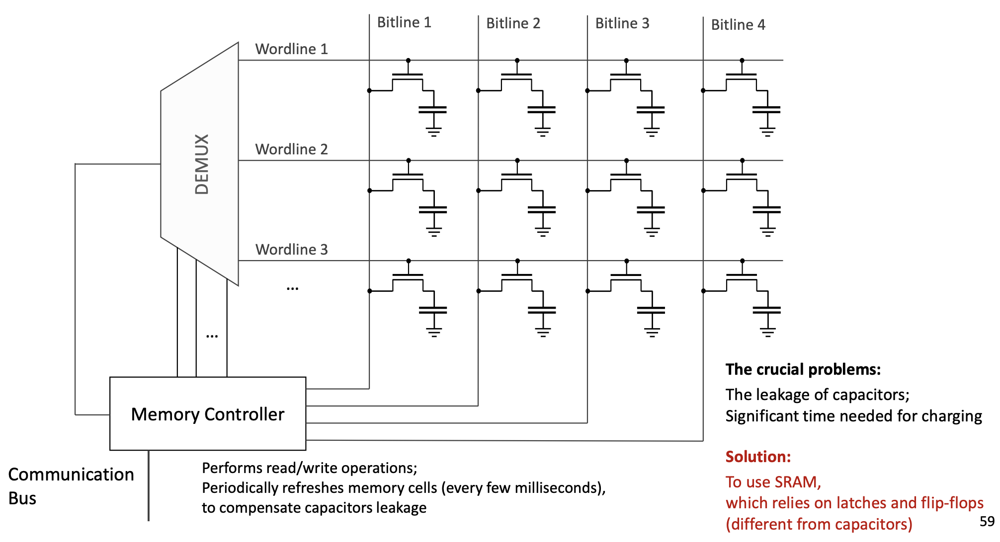{width=80%}

###### **1.10.1 The DRAM Memory Cell**

The fundamental building block of DRAM is the memory cell, which stores a single bit of data. It is constructed from two simple components:

- One **Transistor**: Acts as a tiny, fast electronic switch.
- One **Capacitor**: A device that stores an electrical charge.

The state of the bit is represented by the capacitor's charge:

- **Charged** = 1
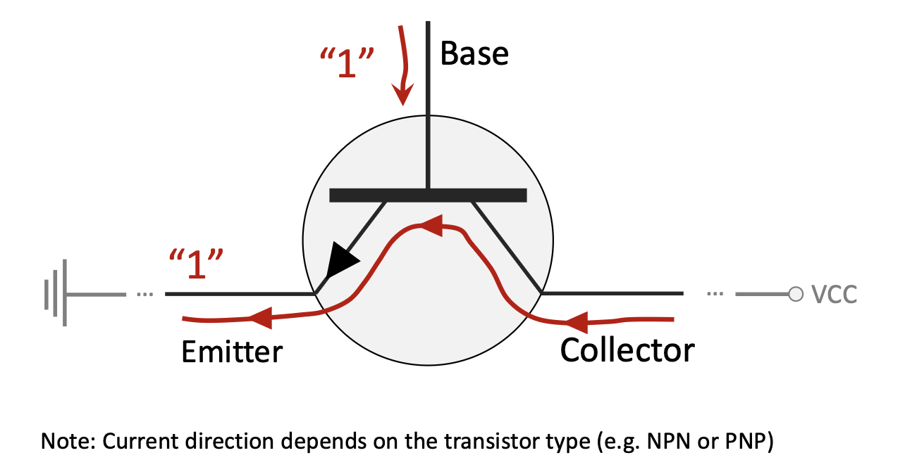{width=80%}
- **Discharged** = 0
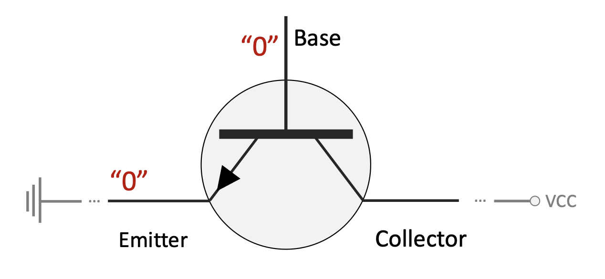{width=80%}


###### **1.10.2 DRAM Operation (Read/Write)**

DRAM cells are arranged in a grid.

- **Wordlines** run horizontally, connecting to the gate of each transistor in a row.
- **Bitlines** run vertically, connecting to the source/drain of each transistor in a column.

- **To Write Data**: The memory controller activates the appropriate wordline, which turns "ON" all the transistors in that row. It then sends a voltage down the specific bitline to either charge (for a '1') or discharge (for a '0') the capacitor in the target cell.
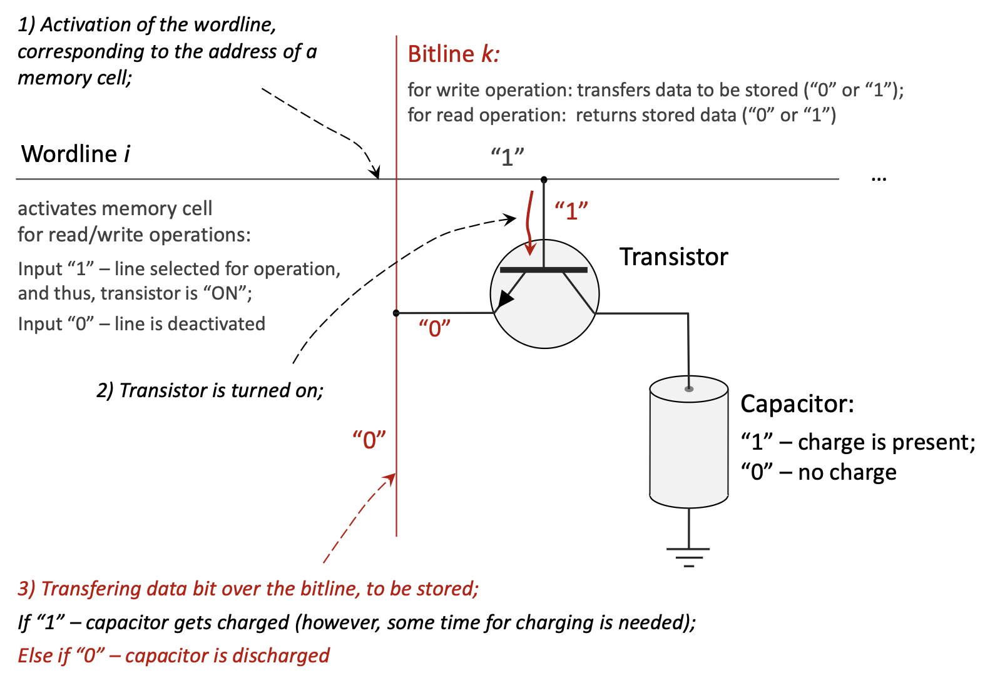{width=80%}
- **To Read Data**: The wordline is activated, turning the transistor "ON". If the attached capacitor is charged, a small amount of current flows onto the bitline. A sense amplifier detects this tiny current to determine if a '1' was stored. The reading process is *destructive* because it discharges the capacitor, so the controller must immediately write the value back.
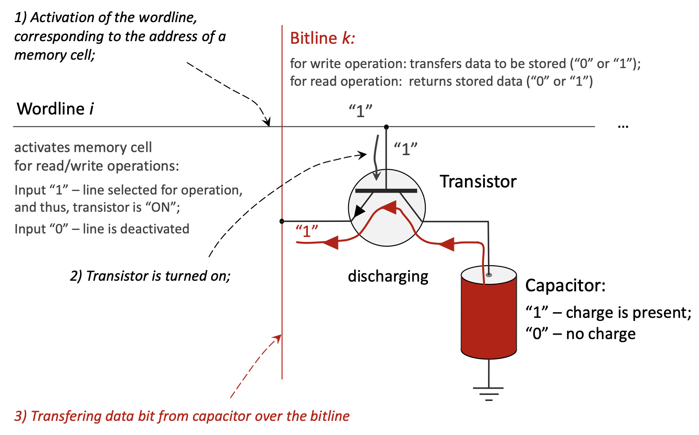{width=80%}

###### **1.10.3 Crucial Problems with DRAM**

- **Capacitor Leakage**: The charge in the tiny capacitor gradually leaks away in a matter of milliseconds. To prevent data loss, the **memory controller** must periodically perform a **refresh cycle**, where it reads the value from every cell and writes it back. This is why it is called *dynamic*.
- **Charge/Discharge Time**: Charging and discharging the capacitor is not instantaneous, which contributes to DRAM's access latency.

##### **1.11 SRAM (Static RAM)**

SRAM is the technology used for CPU caches and registers. It is called "static" because it holds its data without needing to be refreshed.

###### **1.11.1 The SRAM Memory Cell**

An SRAM cell does not use a capacitor. Instead, it uses a **latch** or **flip-flop** circuit, typically composed of 4 to 6 transistors. This circuit has two stable states (representing 0 and 1). As long as power is applied, the feedback mechanism within the latch holds the state indefinitely.

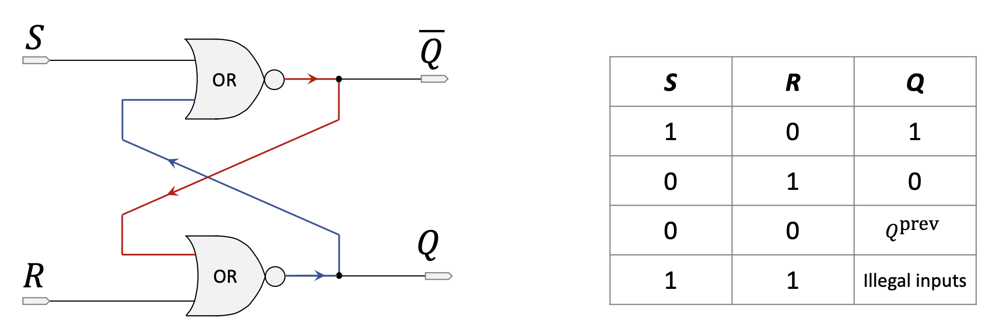{width=80%}
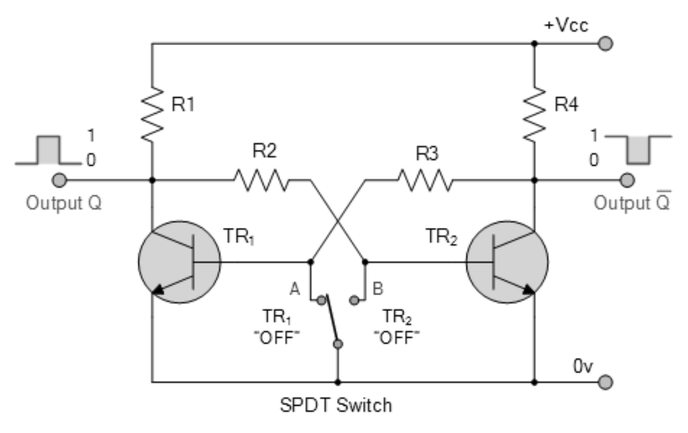{width=80%}

##### **1.12 SRAM vs. DRAM Comparison**

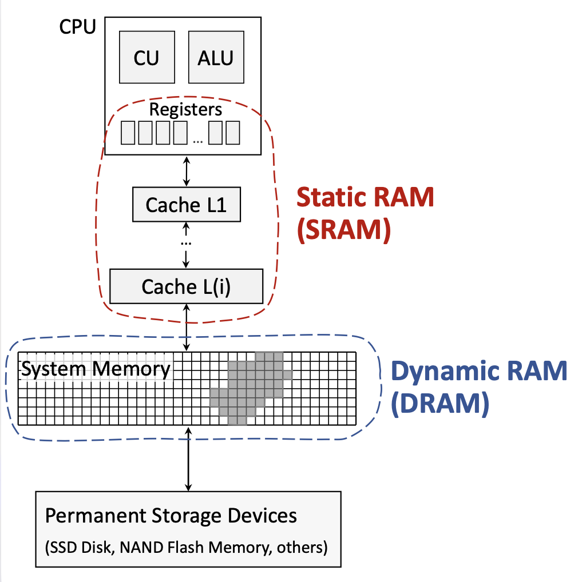{width=40%}

| Characteristic      | SRAM (Static RAM)                               | DRAM (Dynamic RAM)                               |
|---------------------|-------------------------------------------------|--------------------------------------------------|
| **Storage Element** | Flip-flop (4-6 transistors)                     | Capacitor and Transistor (1 of each)             |
| **Access Speed**    | **Much Faster** (1-10 nanoseconds)              | Slower (50-100 nanoseconds)                      |
| **Cost (per byte)** | **Expensive**                                   | **Cheaper**                                      |
| **Storage Capacity**| Lower density, smaller capacity                 | **Higher density**, larger capacity                |
| **Organisation**    | More complex cell structure                     | Simpler cell structure                           |
| **Power Leakage**   | Negligible; no refresh needed                   | **Significant**; requires constant refresh cycles  |
| **Power Consumption**| Lower when idle                                 | Higher due to refresh cycles                     |
| **Chip Reliability**| More reliable                                   | Less reliable (susceptible to soft errors)       |
| **Volatility**      | **Volatile** (loses data without power)         | **Volatile** (loses data without power)          |
| **Typical Usage**   | **CPU caches**, registers                       | **Main system memory**                           |

#### **2. Definitions**

*   **Hardware Description Language (HDL)**: A specialized computer language used to program the structure, design, and operation of electronic circuits.
*   **Multiplexer (Mux)**: A digital circuit that selects one of several input signals and forwards it to a single output, based on a control signal.
*   **Continuous Assignment**: A feature in Verilog (`assign`) that models combinational logic by creating a direct, persistent connection from inputs to an output.
*   **Procedural Block**: A block of code in Verilog (e.g., `always_comb`) that describes hardware behavior and executes based on specified conditions or signal changes.
*   **Blocking Assignment (`=`)**: An assignment in a procedural block that completes before the next statement begins execution.
*   **Volatile Memory**: Memory that requires constant power to maintain stored information.
*   **Non-Volatile Memory**: Memory that can retain stored information even after power is removed.
*   **Primary Memory**: The main working memory of a computer, directly accessible by the CPU (e.g., RAM).
*   **Secondary Memory**: Long-term, non-volatile storage that is not directly accessible by the CPU (e.g., SSD, HDD).
*   **RAM (Random Access Memory)**: A type of memory where any location can be accessed in a "random" order at nearly the same speed.
*   **DRAM (Dynamic RAM)**: A type of RAM that stores each bit of data in a separate capacitor within an integrated circuit. It must be periodically refreshed.
*   **SRAM (Static RAM)**: A type of RAM that uses latching circuitry (flip-flops) to store each bit. It is faster but more expensive than DRAM and does not need to be refreshed.
*   **ROM (Read-Only Memory)**: A type of non-volatile memory used to store firmware that is rarely or never changed, such as the BIOS.
*   **Transistor**: A semiconductor device used to amplify or switch electronic signals and electrical power. It is a fundamental building block of modern electronics.
*   **Capacitor**: A passive electronic component that stores electrical energy in an electric field.
*   **Latch/Flip-Flop**: A circuit that has two stable states and can be used to store state information (a single bit). It is the fundamental storage element in sequential logic.
*   **Temporal Locality**: The principle that if a particular memory location is referenced, it is likely to be referenced again in the near future.
*   **Spatial Locality**: The principle that if a particular memory location is referenced, memory locations with nearby addresses are likely to be referenced soon.

#### **3. Examples**
#### **3.1 Assignment 1: 1-to-4 Demultiplexer** (Lab 8, Exercise 1)
This section covers the design of a 1-to-4 demultiplexer using a procedural `always` block, along with a testbench to verify its functionality.

<details>
<summary>Click to see the solution</summary>

```verilog
// Module: demux_1_to_4
// Description: Implements a 1-to-4 demultiplexer.
// It takes one data input (din), two select lines (sel),
// and routes the input to one of the four output lines (dout).
module demux_1_to_4(
    input din,          // Data input
    input [1:0] sel,    // 2-bit select line
    output reg [3:0] dout // 4-bit data output
);

    // The 'always' block is sensitive to any changes in the inputs (din or sel).
    // This is a combinatorial circuit, so any input change should immediately
    // affect the output.
    always @(din or sel) begin
        // A case statement is used to check the value of the 'sel' input.
        case(sel)
            2'b00: dout = {3'b000, din}; // If sel is 00, route din to dout[0].
            2'b01: dout = {2'b00, din, 1'b0};  // If sel is 01, route din to dout[1].
            2'b10: dout = {1'b0, din, 2'b00};   // If sel is 10, route din to dout[2].
            2'b11: dout = {din, 3'b000}; // If sel is 11, route din to dout[3].
            default: dout = 4'b0000;      // Default case to avoid latches.
        endcase
    end

endmodule

//
// Testbench for the 1-to-4 Demultiplexer
//
// Description: This module is for simulation purposes to test the
// correctness of the demux_1_to_4 design. It is not synthesizable.
// Part c) of the assignment requires testing on an FPGA, but a simulation
// like this is the first step to verify the logic.
module demux_1_to_4_tb;

    // Declare variables to connect to the demultiplexer module.
    reg din_tb;         // Testbench register for data input
    reg [1:0] sel_tb;   // Testbench register for select lines
    wire [3:0] dout_tb; // Testbench wire for data output

    // Instantiate the module under test (UUT).
    demux_1_to_4 uut (
        .din(din_tb),
        .sel(sel_tb),
        .dout(dout_tb)
    );

    // Initial block to define the sequence of test inputs.
    initial begin
        // Display a header for the simulation output.
        $display("Time\t sel\t din\t dout");

        // Test case 1: sel = 00, din = 1
        sel_tb = 2'b00; din_tb = 1; #10;
        $display("%g\t %b\t %b\t %b", $time, sel_tb, din_tb, dout_tb);

        // Test case 2: sel = 01, din = 1
        sel_tb = 2'b01; din_tb = 1; #10;
        $display("%g\t %b\t %b\t %b", $time, sel_tb, din_tb, dout_tb);

        // Test case 3: sel = 10, din = 1
        sel_tb = 2'b10; din_tb = 1; #10;
        $display("%g\t %b\t %b\t %b", $time, sel_tb, din_tb, dout_tb);
        
        // Test case 4: sel = 11, din = 1
        sel_tb = 2'b11; din_tb = 1; #10;
        $display("%g\t %b\t %b\t %b", $time, sel_tb, din_tb, dout_tb);

        // Test case 5: sel = 01, din = 0 (to show din is passed correctly)
        sel_tb = 2'b01; din_tb = 0; #10;
        $display("%g\t %b\t %b\t %b", $time, sel_tb, din_tb, dout_tb);
        
        // End the simulation.
        $finish;
    end

endmodule

// Part b) of the assignment, "Make necessary pin assignments in Pin Planner of Quartus Prime",
// is a step performed within the Quartus software GUI. It involves mapping the Verilog
// ports (din, sel, dout) to the physical pins of the FPGA chip. This cannot be done in code.

// Part c), "Upload the design into FPGA and test program correctness", is the physical
// process of programming the FPGA and verifying its operation with hardware,
// for example, by connecting LEDs to the output pins and switches to the input pins.
```
</details>

#### **3.2 Assignment 2: 4-Bit Adder Circuit** (Lab 8, Exercise 2)
This section provides the Verilog code for a `halfadder`, a `fulladder`, and a 4-bit top-level adder (`adder4bit`) constructed from them. A testbench is also included to verify the 4-bit adder.

<details>
<summary>Click to see the solution</summary>

```verilog
//
// Part a) Design halfadder module
//
// Description: A half adder adds two single bits (a and b)
// and produces a sum and a carry output.
module halfadder(
    input a, b,         // 1-bit inputs
    output sum, carry   // 1-bit outputs
);
    // Assign sum using XOR operation.
    assign sum = a ^ b;
    // Assign carry using AND operation.
    assign carry = a & b;
endmodule

//
// Part b) Design fulladder module
//
// Description: A full adder adds three single bits (a, b, and cin)
// and produces a sum and a carry output (cout).
// It can be built from two half adders and an OR gate.
module fulladder(
    input a, b, cin,      // 1-bit inputs (cin is carry-in)
    output sum, cout      // 1-bit outputs (cout is carry-out)
);
    // Intermediate wires to connect the half adders.
    wire ha1_sum, ha1_carry, ha2_carry;

    // First half adder to add input 'a' and 'b'.
    halfadder ha1 (
        .a(a),
        .b(b),
        .sum(ha1_sum),
        .carry(ha1_carry)
    );

    // Second half adder to add the sum from the first half adder and the carry-in.
    halfadder ha2 (
        .a(ha1_sum),
        .b(cin),
        .sum(sum), // Final sum output
        .carry(ha2_carry)
    );

    // The final carry-out is the OR of the carries from both half adders.
    assign cout = ha1_carry | ha2_carry;
endmodule

//
// Part c) Design Top-Level-Entity adder4bit
//
// Description: This module implements a 4-bit ripple-carry adder.
// It uses one halfadder for the least significant bit (LSB) and
// three fulladders for the remaining bits.
module adder4bit(
    input [3:0] a, b,  // 4-bit input values
    output [3:0] sum,  // 4-bit sum output
    output cout        // 1-bit final carry-out
);
    // Intermediate wires for the carry between the adders.
    wire c0, c1, c2;

    // LSB Adder (Bit 0): Use a halfadder since there is no initial carry-in.
    halfadder ha (
        .a(a[0]),
        .b(b[0]),
        .sum(sum[0]),
        .carry(c0)
    );

    // Bit 1 Adder: Use a fulladder with the carry from the previous stage.
    fulladder fa1 (
        .a(a[1]),
        .b(b[1]),
        .cin(c0),
        .sum(sum[1]),
        .cout(c1)
    );

    // Bit 2 Adder: Use a fulladder.
    fulladder fa2 (
        .a(a[2]),
        .b(b[2]),
        .cin(c1),
        .sum(sum[2]),
        .cout(c2)
    );

    // MSB Adder (Bit 3): Use a fulladder. The cout from this is the final carry.
    fulladder fa3 (
        .a(a[3]),
        .b(b[3]),
        .cin(c2),
        .sum(sum[3]),
        .cout(cout) // Final carry-out of the 4-bit addition
    );

endmodule

//
// Testbench for the 4-bit Adder
//
// Description: This module tests the adder4bit module by providing
// various input values and displaying the results.
module adder4bit_tb;

    // Declare variables to connect to the 4-bit adder module.
    reg [3:0] a_tb, b_tb;
    wire [3:0] sum_tb;
    wire cout_tb;

    // Instantiate the module under test (UUT).
    adder4bit uut (
        .a(a_tb),
        .b(b_tb),
        .sum(sum_tb),
        .cout(cout_tb)
    );

    // Initial block to define the sequence of test inputs.
    initial begin
        // Display a header for the simulation output.
        $display("Time\t a\t b\t cout\t sum");

        // Test case 1: 3 + 2 = 5
        a_tb = 4'd3; b_tb = 4'd2; #10;
        $display("%g\t %d\t %d\t %b\t %d", $time, a_tb, b_tb, cout_tb, sum_tb);

        // Test case 2: 7 + 1 = 8
        a_tb = 4'd7; b_tb = 4'd1; #10;
        $display("%g\t %d\t %d\t %b\t %d", $time, a_tb, b_tb, cout_tb, sum_tb);

        // Test case 3: 9 + 8 = 17 (results in a carry-out)
        a_tb = 4'd9; b_tb = 4'd8; #10;
        $display("%g\t %d\t %d\t %b\t %d", $time, a_tb, b_tb, cout_tb, sum_tb);
        
        // Test case 4: 15 + 15 = 30 (maximum values with carry)
        a_tb = 4'b1111; b_tb = 4'b1111; #10;
        $display("%g\t %d\t %d\t %b\t %d", $time, a_tb, b_tb, cout_tb, sum_tb);

        // End the simulation.
        $finish;
    end

endmodule
```
</details>
