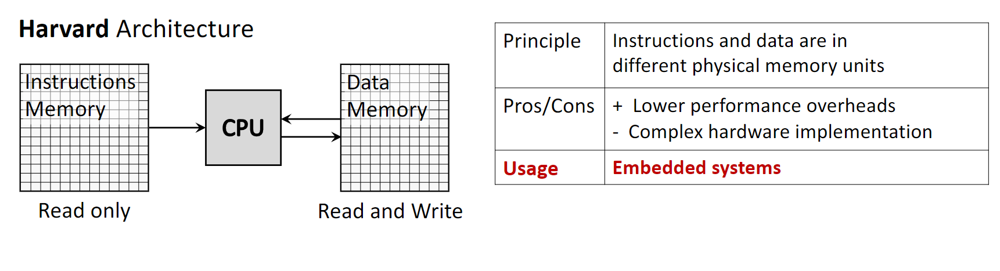
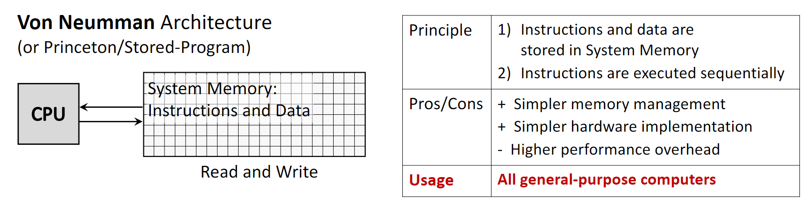
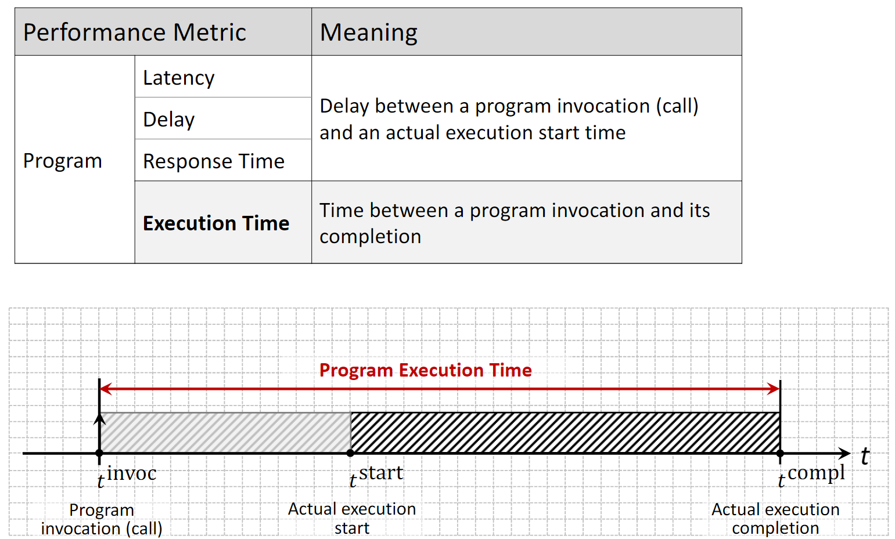
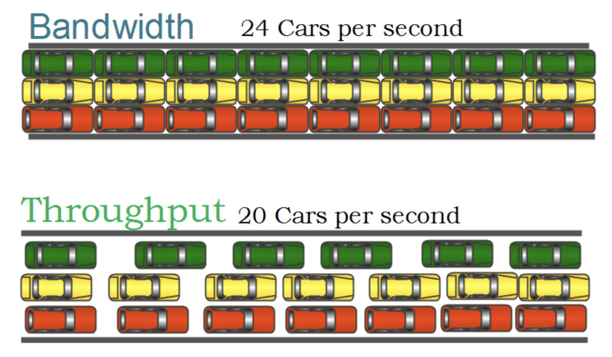
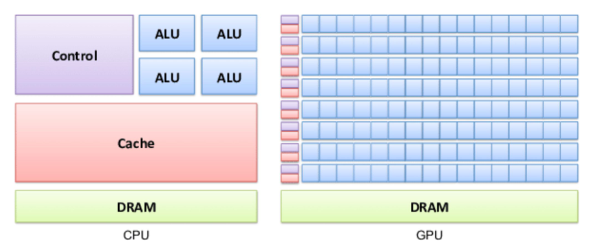
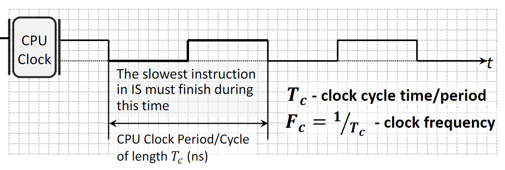
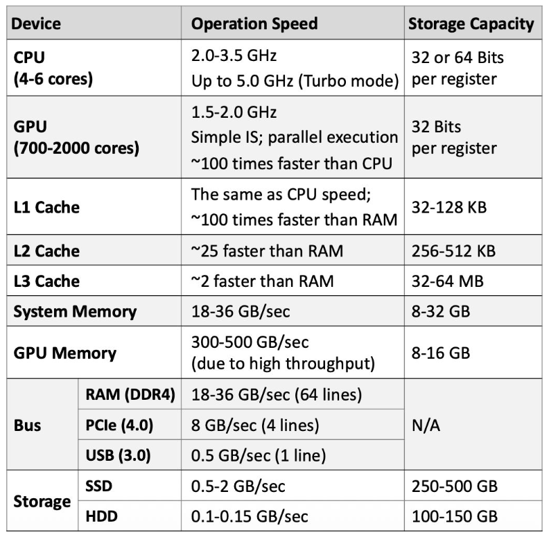
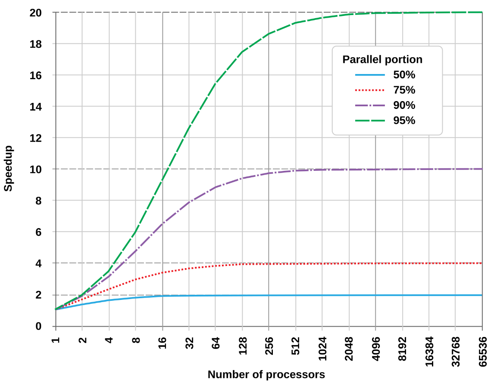
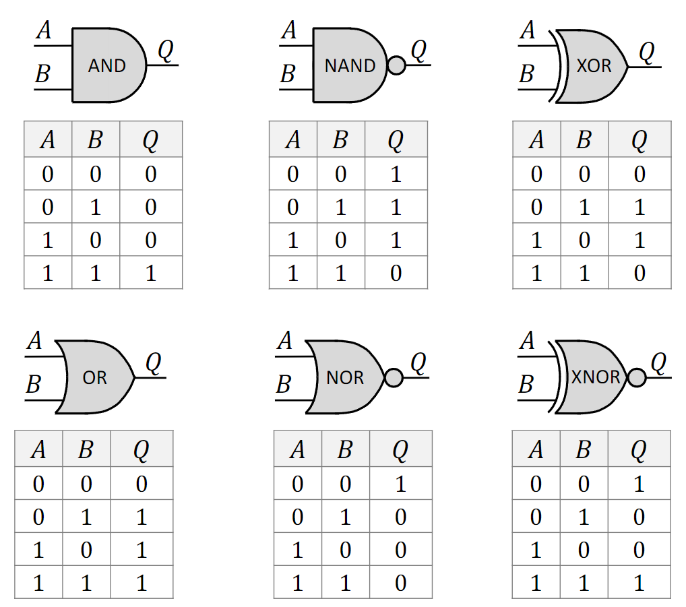
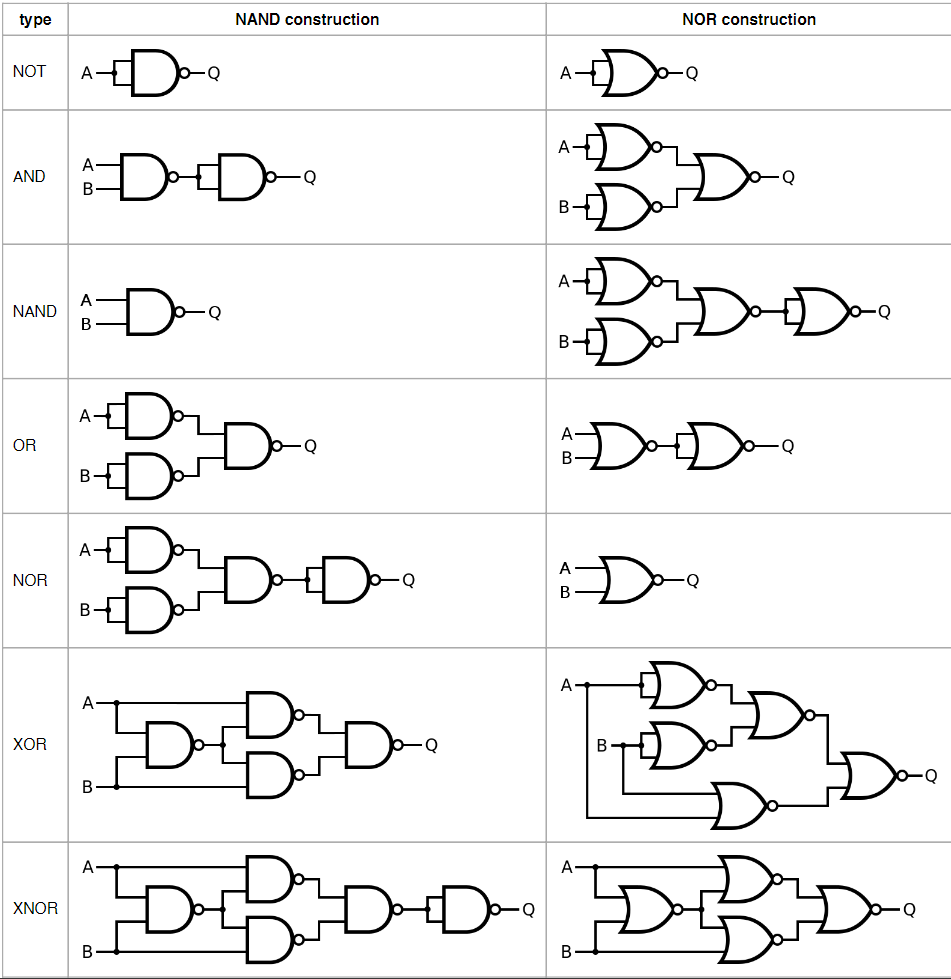



[Quiz](https://notebooklm.google.com/notebook/89f0f798-2a08-41bf-8e09-536830fb1adc?artifactId=4a3fca60-7821-4db2-b2e5-1e5331288ea0) | [Flashcards](https://notebooklm.google.com/notebook/89f0f798-2a08-41bf-8e09-536830fb1adc?artifactId=8e033034-768a-41e7-9b11-8b066ceebcc2)

### **1. Summary**

##### **1.1 Computer Architectures**

###### **1.1.1 Harvard Architecture**
The **Harvard Architecture** is a computer architecture that utilizes physically separate storage and signal pathways for instructions and data. The CPU can read an instruction and perform a data memory access at the same time, even without a cache.

-   **Principle**: Instructions and data are stored in different physical memory units, each with dedicated buses.
-   **Memory Access**: The instruction memory is typically read-only, while the data memory is read-write.
-   **Pros**: It features lower performance overheads because instructions and data can be fetched concurrently, leading to faster execution.
-   **Cons**: The primary drawback is the increased hardware complexity and cost required to implement separate memory systems and buses.
-   **Usage**: It is commonly found in specialized systems like microcontrollers and Digital Signal Processors (DSPs), as well as in the internal cache structure of most modern CPUs.

{width=80%}

###### **1.1.2 Von Neumann Architecture**
Also known as the Princeton or Stored-Program architecture, the **Von Neumann Architecture** is the dominant design for general-purpose computers. It is based on the concept of storing both program instructions and the data they operate on in the same memory.

-   **Principle**: A single memory unit and a single bus are used for both instructions and data. Instructions are typically executed sequentially.
-   **Pros**: This design simplifies memory management and hardware implementation, making it more cost-effective and flexible.
-   **Cons**: It creates a performance limitation known as the *Von Neumann bottleneck*, where the shared bus becomes a chokepoint as the CPU cannot fetch instructions and data simultaneously.
-   **Usage**: This architecture is used in virtually all modern general-purpose computers, including desktops, laptops, and servers.

{width=80%}

##### **1.2 Performance Metrics**

###### **1.2.1 Program-Level Metrics**
These metrics evaluate the performance of a specific program's execution.

-   **Latency (or Delay/Response Time)**: This is the time elapsed between a program's invocation (the call) and the start of its actual execution. This delay is often caused by preparatory activities such as operating system overhead or memory allocation.
-   **Execution Time**: This measures the total time from the program's invocation until its completion. It includes both latency and the actual program execution time.

{width=80%}

###### **1.2.2 Hardware-Level Metrics**
These metrics describe the capabilities of the hardware platform.

-   **Bandwidth**: The theoretical maximum number of jobs (or instructions) that can be executed concurrently. For example, a single-core processor has a bandwidth of 1, while a multi-core processor has a bandwidth equal to the number of cores.
-   **Throughput**: The *average* number of concurrently executing jobs over a period of time. It reflects the actual performance, which is often lower than the theoretical bandwidth.
-   **Utilization**: The percentage of time a specific hardware component is actively in use. For example, a CPU utilization of 57% means the CPU was busy for 57% of the measurement period.

{width=80%}

###### **1.2.3 CPU vs. GPU Performance Philosophy**
CPUs and GPUs are designed with different performance goals.

-   **CPU (Latency Optimized)**: A CPU is like a sports car. It is designed to execute a small number of tasks (or threads) as quickly as possible, minimizing latency for each one.
-   **GPU (Throughput Optimized)**: A GPU is like a bus. It is designed to handle a massive number of tasks simultaneously, maximizing overall throughput, even if the latency for any single task is higher than a CPU's.

{width=80%}

##### **1.3 Processor and System Performance Characteristics**

###### **1.3.1 CPU Clock**
The speed of a processor is governed by its internal clock.

-   **Clock Cycle**: A CPU operates on a periodic clock signal. The time it takes to complete one on-off cycle is the **clock cycle time** or **period**, denoted as $T_c$ (measured in nanoseconds).
-   **Clock Frequency (or Rate)**: This is the inverse of the clock cycle time ($F_c = 1 / T_c$) and represents the number of cycles the CPU can execute per second, measured in Hertz (Hz) or Gigahertz (GHz). The duration of a clock cycle is determined by the time required for the slowest instruction to complete.

{width=80%}

###### **1.3.2 Average Performance of Computer Components**
The following are typical performance characteristics for modern desktop and laptop components.

{width=80%}

##### **1.4 Amdahl's Law**
**Amdahl's Law** provides a formula to find the maximum expected improvement to an overall system when only part of the system is improved. It is often used to predict the theoretical maximum speedup of a program when using multiple processors.

-   **Concept**: Any program consists of two parts: a *serial portion* that must be executed sequentially and a *parallel portion* that can be divided among multiple cores.
-   **Implication**: The speedup gained from adding more cores is ultimately limited by the serial portion of the program. Even with an infinite number of processors, the total execution time can never be less than the time required to run the serial part.
-   **Formula**: The speedup of a program is given by:
    $$ \text{speedup} = \frac{1}{x + \frac{1-x}{m}} $$
    where $x$ is the proportion of the program that is serial, and $m$ is the number of processor cores.

{width=80%}

##### **1.5 Combinational Logic Circuits**

###### **1.5.1 Foundational Terminology**
-   **Boolean Function**: A function that takes one or more binary inputs (0 or 1) and produces a single binary output. It is the mathematical foundation of digital circuits, introduced by George Boole.
-   **Truth Table**: A table that exhaustively lists all possible input combinations to a Boolean function and shows the corresponding output for each combination.
-   **Logic Gate**: An electronic device, typically built from transistors, that implements a basic Boolean function. Examples include AND, OR, and NOT gates.
-   **Logic Circuit**: A collection of interconnected logic gates designed to perform a more complex Boolean function. The output of one gate can become the input for another.

###### **1.5.2 Basic Logic Gates**
-   **AND**: Outputs 1 only if *all* of its inputs are 1.
-   **OR**: Outputs 1 if *at least one* of its inputs is 1.
-   **NOT**: Outputs the inverse of its single input (1 becomes 0, 0 becomes 1).
-   **NAND (Not-AND)**: Outputs the inverse of an AND gate. It is 0 only when all inputs are 1.
-   **NOR (Not-OR)**: Outputs the inverse of an OR gate. It is 1 only when all inputs are 0.
-   **XOR (Exclusive-OR)**: Outputs 1 only if the inputs are different. Unlike an OR gate, it outputs 0 if both inputs are 1.
-   **XNOR (Exclusive-NOR)**: Outputs the inverse of an XOR gate. It outputs 1 only if the inputs are the same.

{width=80%}

###### **1.5.3 Universal Logic Gates**
A **universal gate** is a logic gate that can be used to implement any other logic gate or Boolean function without needing any other type of gate.

-   **NAND and NOR Gates**: Both NAND and NOR gates are universal. For instance, a NOT gate can be made from a NAND gate by connecting its inputs together. An AND gate can be made from two NAND gates, and an OR gate from three.
-   **Significance**: This property is crucial in digital circuit design because it means that any complex logic circuit can be constructed using only one type of gate, which simplifies the manufacturing process.

{width=80%}

### **2. Definitions**

*   **Boolean Function**: A mathematical function that takes binary inputs (values of 0 or 1) and produces a single binary output.
*   **Truth Table**: A tabular representation of a Boolean function that lists all possible input combinations and their corresponding outputs.
*   **Logic Gate**: A physical electronic device that performs a basic logical operation, implementing a Boolean function.
*   **Logic Circuit**: A structure composed of interconnected logic gates designed to implement a more complex Boolean function.
*   **Universal Gate**: A logic gate (such as NAND or NOR) from which any other logic gate can be constructed.
*   **Harvard Architecture**: A computer architecture with separate memory and buses for instructions and data, allowing for simultaneous access.
*   **Von Neumann Architecture**: A computer architecture that uses a single memory storage system for both instructions and data.
*   **Von Neumann Bottleneck**: A performance limitation in Von Neumann architectures caused by the shared bus between the CPU and memory, which prevents simultaneous fetching of instructions and data.
*   **Latency**: The time delay between the initiation of a process and the start of its actual execution.
*   **Execution Time**: The total time required for a program to run from invocation to completion.
*   **Bandwidth**: The theoretical maximum rate at which data or instructions can be processed by a system.
*   **Throughput**: The actual average rate at which data or instructions are processed over a given period.
*   **Amdahl's Law**: A formula used to calculate the maximum potential speedup of a system when only a part of it is improved.

### **3. Mistakes**

*   **Confusing Harvard and Von Neumann architectures:** A common error is mixing up their core principles. **Why it's wrong:** Harvard uses separate memories for instructions and data, whereas Von Neumann uses a single, shared memory. This fundamental difference dictates their respective strengths and weaknesses.
*   **Misinterpreting Amdahl's Law:** Believing that doubling the number of cores will double a program's speed. **Why it's wrong:** Amdahl's Law shows that the serial portion of a program creates a hard limit on the maximum achievable speedup, which is often far less than linear.
*   **Using Throughput and Bandwidth interchangeably:** Treating these terms as synonyms. **Why it's wrong:** Bandwidth is the theoretical peak performance (e.g., the speed limit on a highway), while throughput is the actual, measured performance (e.g., the average speed of traffic), which is affected by real-world factors.
*   **Treating an XOR gate as an OR gate:** Forgetting the "exclusive" property of XOR. **Why it's wrong:** An OR gate outputs true (1) if one or both inputs are true. An XOR gate outputs true (1) only if the inputs are different; it outputs false (0) if both inputs are true.
*   **Underestimating the Von Neumann Bottleneck:** Ignoring the performance impact of the shared bus for data and instructions. **Why it's wrong:** This bottleneck is a critical constraint in modern computing, as CPUs often have to wait for the bus to be free, and it is a primary motivation for developing complex memory hierarchies like caches.
