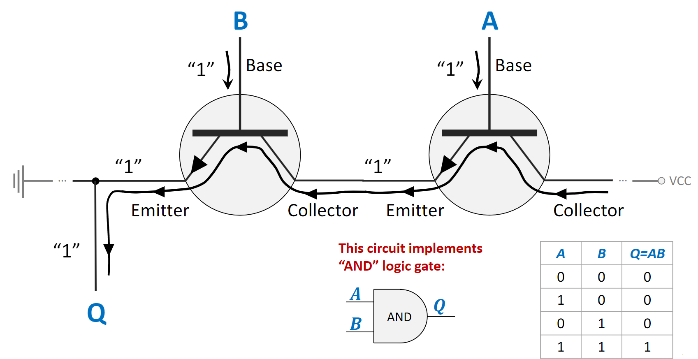
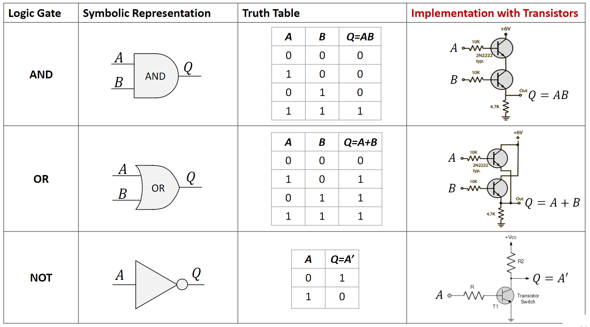
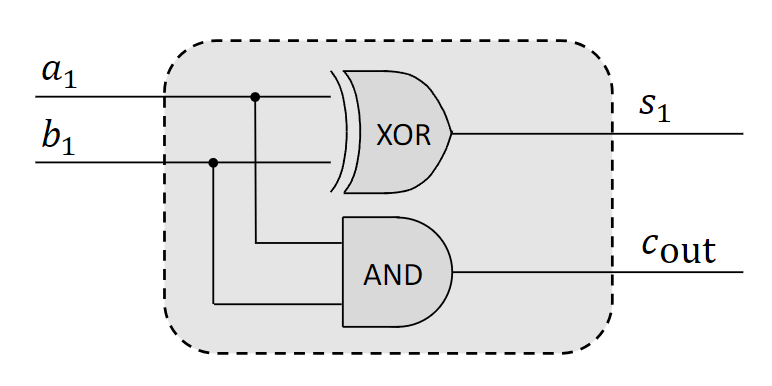
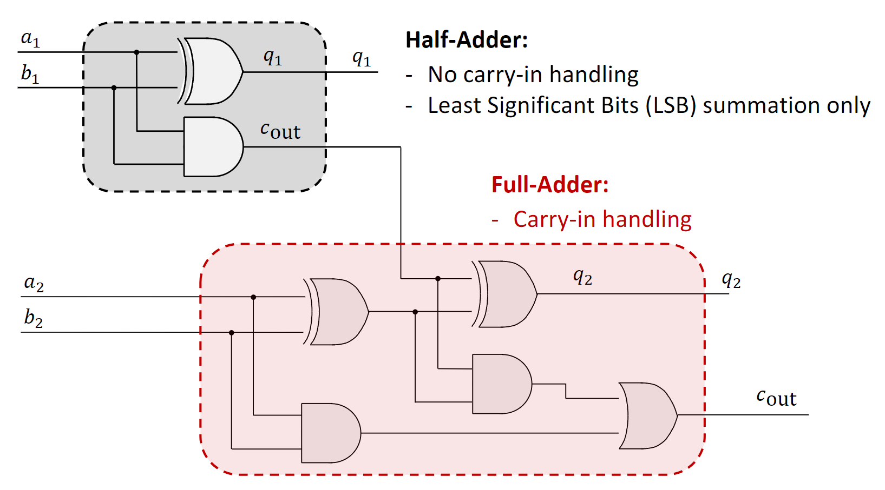
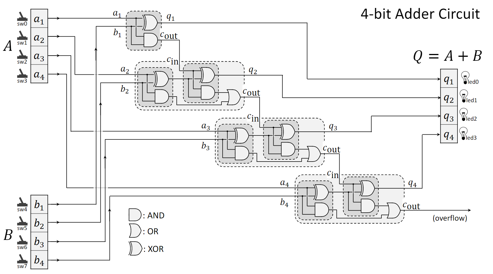
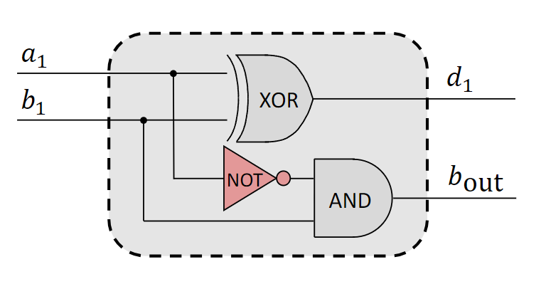
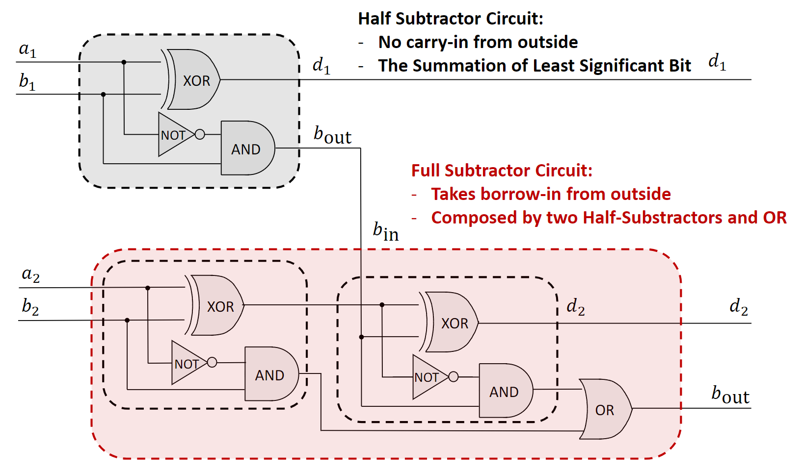
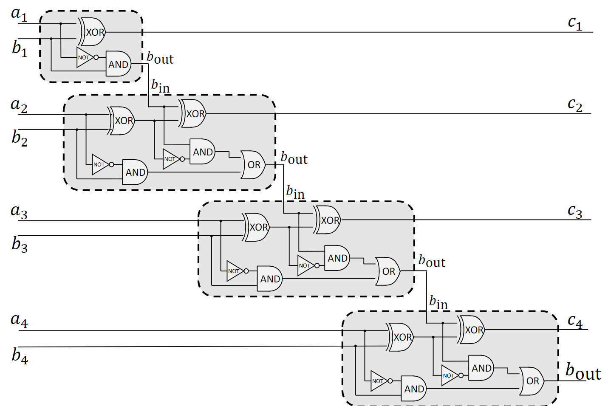
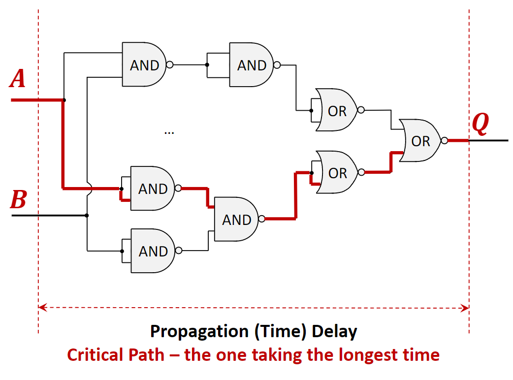
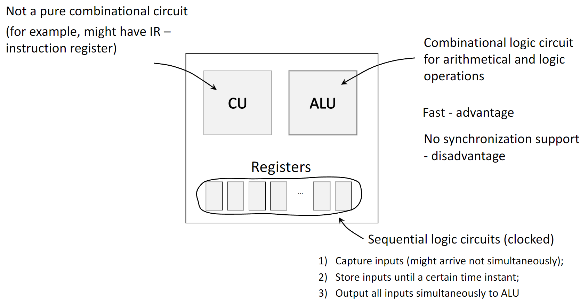



[Quiz](https://notebooklm.google.com/notebook/157d7251-86bf-4998-895f-b37e02ec0dc7?artifactId=17f820da-e090-47b5-85e5-7017bc03402f) | [Flashcards](https://notebooklm.google.com/notebook/157d7251-86bf-4998-895f-b37e02ec0dc7?artifactId=eba79054-184d-4ca1-bc00-fb44ce6adbec)

#### **1. Summary**

##### **1.1 Fundamentals of Digital Logic**

###### **1.1.1 Transistors: The Building Blocks of Logic Gates**
At the most fundamental level, logic gates are built from electronic switches called **transistors**. A transistor is a semiconductor device that acts as a rapid switch or amplifier. It typically has three terminals:

- **Base**: The control terminal. Applying a small voltage (representing a binary '1') to the Base "closes" the switch.
- **Collector**: The input terminal for the main current.
- **Emitter**: The output terminal for the main current.

When a voltage is applied to the Base, it allows a much larger current to flow from the Collector to the Emitter. If no voltage is applied to the Base (a binary '0'), no current flows. This switching behavior is the basis for implementing logic gates like AND, OR, and NOT.

{width=80%}

###### **1.1.2 Boolean Functions and Logic Gates**
A **Boolean Function** is a logical operation that takes one or more binary inputs (0s and 1s) and produces a single binary output. A **Logic Gate** is the physical device that performs this operation.

The fundamental logic gates include:

- **AND**: Outputs 1 only if *all* its inputs are 1.
- **OR**: Outputs 1 if *at least one* of its inputs is 1.
- **NOT**: Outputs the inverse of its single input (1 becomes 0, 0 becomes 1).
- **XOR (Exclusive OR)**: Outputs 1 only if the inputs are different.
- **NAND (NOT-AND)**: Outputs the inverse of an AND gate. It is a "universal gate," meaning any other logic function can be built using only NAND gates.
- **NOR (NOT-OR)**: Outputs the inverse of an OR gate, and is also a universal gate.

{width=80%}

###### **1.1.3 Logic Circuits and Integrated Circuits**
A **Logic Circuit** is a structure formed by interconnecting multiple logic gates to perform a more complex function. A **discrete circuit** is built from individual components, while an **Integrated Circuit (IC)**, or microchip, contains thousands or billions of microscopic components fabricated on a single piece of semiconductor.

ICs have several key advantages over discrete circuits:

- **Compact Size**: Immense functionality in a small area.
- **Higher Performance**: Shorter signal paths reduce propagation delays.
- **Lower Cost**: Mass manufacturing is highly efficient.

##### **1.2 Binary Arithmetic and Circuits**

###### **1.2.1 Binary Value Summation**
Binary addition is similar to decimal addition but uses only two digits (0 and 1). When adding two bits:

- $0 + 0 = 0$
- $0 + 1 = 1$
- $1 + 0 = 1$
- $1 + 1 = 0$, with a **carry** of 1 to the next column.

For multi-bit numbers, addition starts at the **Least Significant Bit (LSB)**, the rightmost bit, and proceeds to the **Most Significant Bit (MSB)**, the leftmost bit. The carry from each column is added to the next, more significant column. This carry mechanism is the key principle behind adder circuits.

<!-- DIAGRAM HERE -->

###### **1.2.2 Adder Circuits**
- **Half-Adder**: Adds two single bits, producing a **Sum (S)** and a **Carry-Out (Cout)**. It uses an `XOR` gate for the sum and an `AND` gate for the carry. It cannot accept a carry-in, so it is only suitable for the LSB position.
{width=80%}
- **Full-Adder**: Adds three bits (two inputs `A` and `B`, and a **carry-in** `Cin`). It produces a Sum and a Carry-Out. A full-adder is essential for multi-bit addition as it handles the carry from the previous bit column.
{width=80%}
- **Ripple-Carry Adder**: A multi-bit adder created by chaining full-adders. The `Cout` from each full-adder is connected to the `Cin` of the next. The name comes from the way the carry bit "ripples" through the chain.
{width=80%}

###### **1.2.3 Subtractor Circuits**
- **Half-Subtractor**: Subtracts two single bits, producing a **Difference (D)** and a **Borrow-Out (Bout)**. It cannot accept a borrow-in.
{width=80%}
- **Full-Subtractor**: Subtracts three bits (two inputs `A` and `B`, and a **borrow-in** `Bin`). It produces a Difference and a Borrow-Out, making it suitable for multi-bit subtraction.
{width=80%}
- **Multi-bit Subtractor**: Created by chaining full-subtractors, where the `Bout` of one stage connects to the `Bin` of the next.
{width=80%}

##### **1.3 Combinational Logic Circuits**

###### **1.3.1 Core Characteristics**
Combinational logic circuits are defined by a specific set of properties:

1.  **Output depends only on current inputs**: They have no memory. The output is a direct function of the input values at that exact moment.
2.  **Comprised of logic gates and wires**: They are built by connecting gates like AND, OR, and NOT.
3.  **Subject to propagation delay**: Outputs are not instantaneous; they update after a finite delay following an input change.
4.  **No memory units**: They do not contain registers or other state-holding elements.
5.  **Typically no clock signal**: Their operation is asynchronous, responding directly to input changes rather than being synchronized by a clock.

###### **1.3.2 Propagation Delay and Critical Path**
- **Propagation Delay**: The time it takes for a change at the input of a circuit to cause a change at its output. Every gate in a circuit introduces a small delay.
- **Critical Path**: The path from an input to an output that has the longest total propagation delay. This path determines the maximum operational speed of the circuit. The circuit cannot reliably process new inputs faster than the time it takes for a signal to travel down its critical path.

{width=80%}

###### **1.3.3 Proof of Circuit Equivalence**
It's often necessary to prove that two different circuit designs perform the exact same logical function. There are two primary methods for this:

1.  **Truth Tables**: Create a truth table for each circuit. If the output columns are identical for all possible combinations of inputs, the circuits are logically equivalent.
2.  **Boolean Algebra**: Write the Boolean expression for the output of each circuit. Then, using the laws of Boolean algebra (such as Commutative, Associative, Distributive, and De Morgan's laws), manipulate one expression until it becomes identical to the other.

##### **1.4 Logic Circuits in a CPU**
A Central Processing Unit (CPU) uses different types of logic circuits for its components:

- **Combinational Logic Circuits**: The **Arithmetic Logic Unit (ALU)** is a prime example. It performs arithmetic (addition, subtraction) and logical (AND, OR) operations. Combinational circuits are used here because they are fast. Their main disadvantage is the lack of input synchronization.
- **Sequential Logic Circuits**: These circuits *do* have memory and are controlled by a clock signal. **Registers** are sequential circuits used to store data temporarily. They solve the synchronization problem for the ALU by capturing input values (which may arrive at slightly different times) and holding them stable. On a clock signal, they output all inputs to the ALU simultaneously, ensuring a correct and stable calculation. The **Control Unit (CU)** is also a complex circuit that is not purely combinational.

{width=80%}

#### **2. Definitions**
*   **Transistor**: A semiconductor device used as an electronic switch, forming the physical basis of logic gates.
*   **Boolean Function**: A function with one or more binary inputs and a single binary output, based on logical operations.
*   **Logic Gate**: An electronic device that implements a basic Boolean function.
*   **Combinational Logic Circuit**: A circuit whose output is solely determined by its current input values.
*   **Sequential Logic Circuit**: A circuit whose output depends on both current inputs and its previous state (it has memory). Registers are an example.
*   **Least Significant Bit (LSB)**: The rightmost bit in a binary number, which holds the lowest value.
*   **Most Significant Bit (MSB)**: The leftmost bit in a binary number, which holds the highest value.
*   **Half-Adder**: A circuit that adds two bits, producing a sum and a carry.
*   **Full-Adder**: A circuit that adds three bits (two inputs and a carry-in), producing a sum and a carry.
*   **Half-Subtractor**: A circuit that subtracts two bits, producing a difference and a borrow.
*   **Full-Subtractor**: A circuit that subtracts three bits (two inputs and a borrow-in), producing a difference and a borrow.
*   **Propagation Delay**: The time taken for the output of a circuit to respond to a change in its input.
*   **Critical Path**: The longest-delay path in a circuit, which determines its maximum speed.

#### **3. Mistakes**
*   **Using a Half-Adder for intermediate bits:** A half-adder lacks a carry-in input and cannot process the carry from the previous bit, leading to incorrect sums. **Why it's wrong:** Full-adders are required for all positions except potentially the LSB.
*   **Confusing Combinational and Sequential Logic:** Adding a feedback loop (connecting an output back to an input) to a combinational circuit turns it into a sequential circuit. **Why it's wrong:** This introduces memory and state, violating the principle that a combinational circuit's output depends only on its current inputs.
*   **Ignoring the critical path in timing calculations:** Assuming all outputs are ready at the same time. **Why it's wrong:** The circuit's overall speed is limited by its longest delay path. A new operation cannot begin until the previous one is guaranteed to be complete.
*   **Misunderstanding the role of the Base in a transistor:** Assuming current always flows through a transistor regardless of the Base signal. **Why it's wrong:** The transistor is a switch; current only flows between the Collector and Emitter when the Base is activated (given a '1' signal).
