

[Quiz](https://notebooklm.google.com/notebook/1eaf8f75-821d-4aaf-879b-865ac25fcfa6?artifactId=b606805a-1388-4c29-a6ef-10eba468e93a) | [Flashcards](https://notebooklm.google.com/notebook/1eaf8f75-821d-4aaf-879b-865ac25fcfa6?artifactId=731ec52d-5274-4c1d-a4ef-3ccd848a9f4d)

#### **1. Summary**
##### **1.1 Introduction to Combinational Logic**
A **Combinational Logic Circuit** is a fundamental type of digital circuit where the output is determined solely by the current combination of its inputs. These circuits have no memory; they don't retain any information about past inputs. Their behavior can be described by Boolean algebra and truth tables. The basic units of these circuits are **logic gates**.

###### **1.1.1 Basic Logic Gates**
Logic gates perform basic logical operations on one or more binary inputs to produce a single binary output.

-   **AND**: Outputs `1` only if *all* its inputs are `1`.
-   **OR**: Outputs `1` if *at least one* of its inputs is `1`.
-   **XOR** (Exclusive OR): Outputs `1` only if its inputs are *different*.
-   **NOT**: An inverter that outputs the opposite of its single input.
-   **NAND**: The opposite of an AND gate. Outputs `0` only if *all* its inputs are `1`.
-   **NOR**: The opposite of an OR gate. Outputs `0` if *at least one* of its inputs is `1`.
-   **XNOR**: The opposite of an XOR gate. Outputs `1` only if its inputs are the *same*.

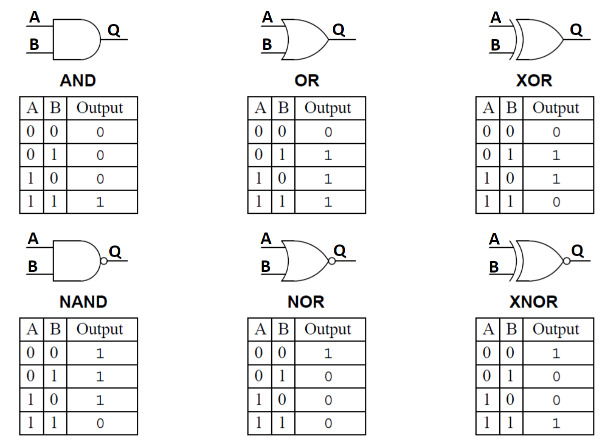{width=80%}

##### **1.2 Multiplexer (MUX)**
A **Multiplexer (MUX)**, also known as a *data selector*, is a combinational circuit that selects one of several input lines and forwards it to a single output line. The selection is controlled by a set of **control pins** (or *selector signals*).

If a multiplexer has $n$ control pins, it can select from up to $2^n$ input lines. Think of it like a railroad switch: the control signals determine which track (input) gets connected to the main line (output).

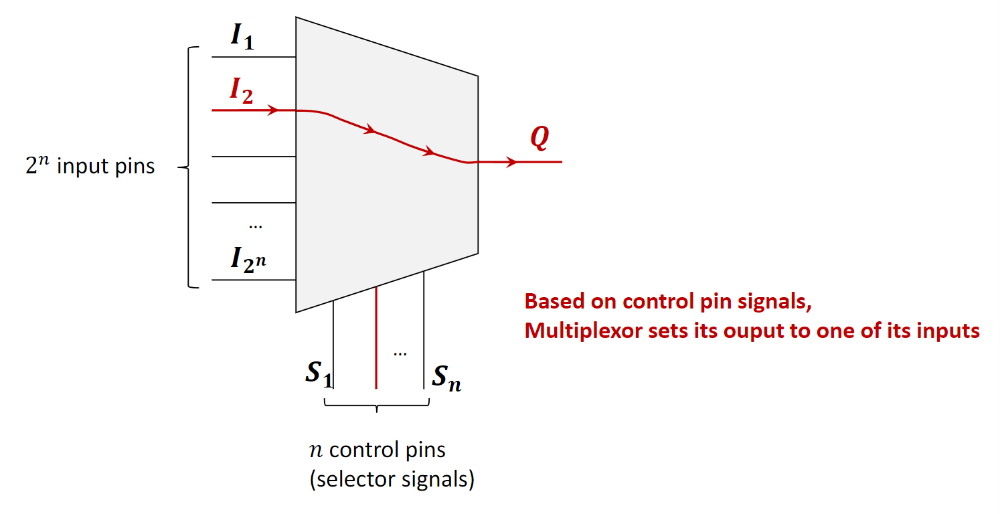{width=80%}

###### **1.2.1 2-to-1 Multiplexer Implementation**
This is the simplest form of a MUX. It has two data inputs ($I_1$, $I_2$), one control pin ($S$), and one output ($Q$).

-   If $S=0$, the output $Q$ is connected to input $I_1$.
-   If $S=1$, the output $Q$ is connected to input $I_2$.

This logic is implemented using a combination of NOT, AND, and OR gates. The control signal $S$ and its inverse (from the NOT gate) are used to "enable" one of the AND gates, allowing only one of the inputs to pass through to the final OR gate.

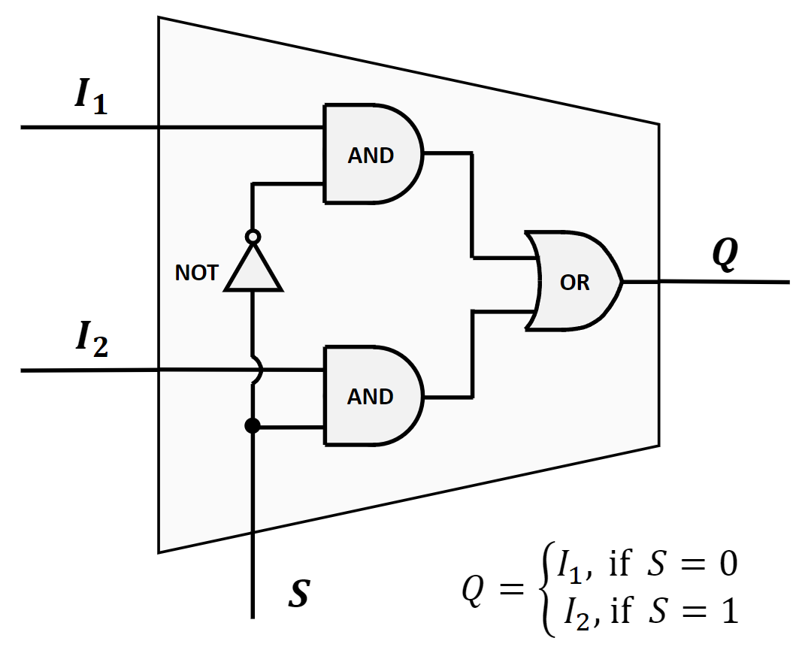{width=80%}

The truth table below verifies its correctness for all possible input combinations.

| $I_1$ | $I_2$ | S | Q   |
|:---:|:---:|:---:|:---:|
| 0   | 0   | 0 | 0   |
| 1   | 0   | 0 | 1   |
| 0   | 1   | 0 | 0   |
| 1   | 1   | 0 | 1   |
| 0   | 0   | 1 | 0   |
| 1   | 0   | 1 | 0   |
| 0   | 1   | 1 | 1   |
| 1   | 1   | 1 | 1   |

###### **1.2.2 4-to-1 Multiplexer Implementation**
A 4-to-1 MUX has four data inputs ($I_1, I_2, I_3, I_4$), two control pins ($S_1, S_2$), and one output ($Q$). The two control pins can represent four binary combinations (00, 01, 10, 11), each corresponding to one of the data inputs.

-   If $S_1S_2 = 00$, $Q = I_1$.
-   If $S_1S_2 = 01$, $Q = I_2$.
-   If $S_1S_2 = 10$, $Q = I_3$.
-   If $S_1S_2 = 11$, $Q = I_4$.

The implementation requires four 3-input AND gates, two NOT gates (for inverting the control signals), and one 4-input OR gate to combine the results. Each AND gate corresponds to one input line and is activated by a unique combination of the control signals.

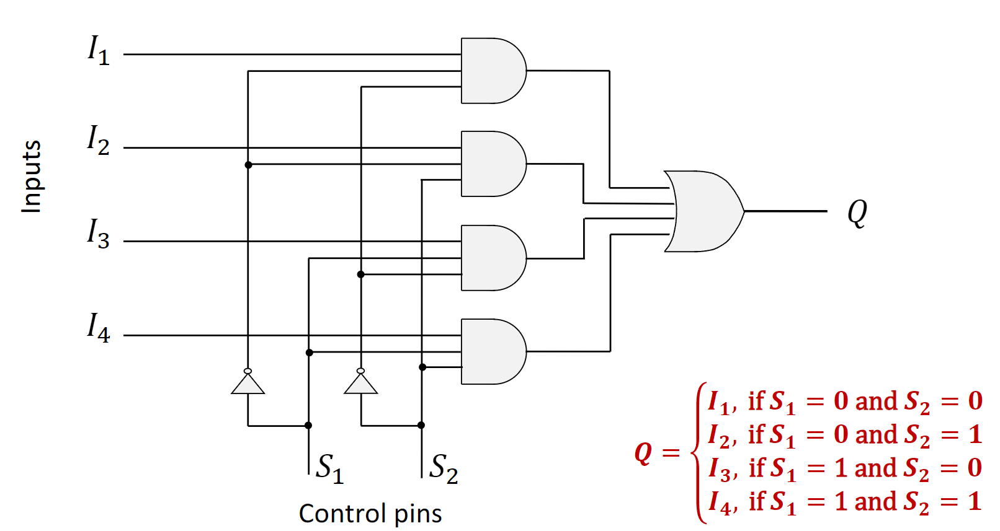{width=80%}

##### **1.3 Demultiplexer (DEMUX)**
A **Demultiplexer (DEMUX)** performs the reverse operation of a multiplexer. It takes a single input line and distributes it to one of several output lines. Similar to a MUX, a set of control pins determines which output line is selected. If there are $n$ control pins, there can be up to $2^n$ output lines.

All non-selected output lines are typically set to a default value, usually `0`. You can think of a DEMUX as a mail sorter that directs a single stream of mail (the input) into different mail slots (the outputs) based on an address (the control signals).

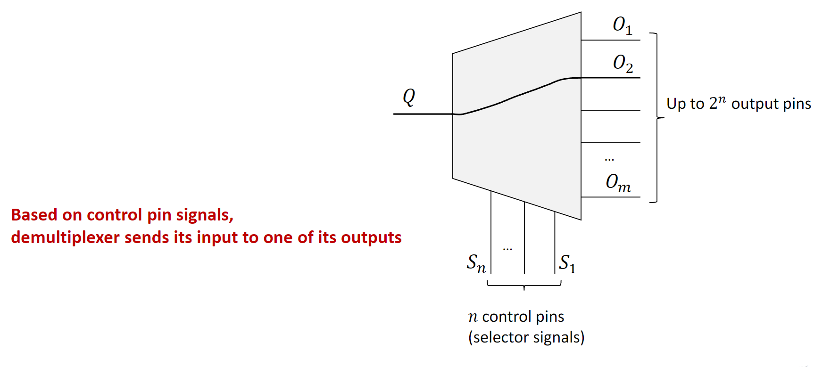{width=80%}

A 1-to-2 DEMUX has one data input $I$, one control pin $S$, and two outputs ($Q_1, Q_2$).

-   If $S=0$, then $Q_1 = I$ and $Q_2 = 0$.
-   If $S=1$, then $Q_1 = 0$ and $Q_2 = I$.

##### **1.4 Decoder**
A **Decoder** is a combinational circuit that converts a binary code from its input lines to a unique output line. It is closely related to a demultiplexer. In fact, a decoder can be created from a demultiplexer through a simple transformation:

1.  Remove the single data input pin ($Q$).
2.  The control pins of the DEMUX now become the primary input pins of the decoder.
3.  The logic is modified so that the selected output pin is set to `1`, while all other output pins are set to `0`.

Essentially, a decoder with $n$ input pins will have $2^n$ output pins. It "decodes" the $n$-bit binary input to activate a single, corresponding output.

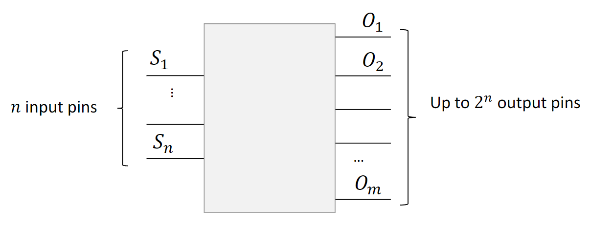{width=80%}

###### **1.4.1 2-to-4 Decoder Implementation**
A 2-to-4 decoder has two input lines ($I_1, I_2$) and four output lines ($O_1, O_2, O_3, O_4$). It activates one of the four outputs based on the two-bit binary input.

-   If $I_1I_2 = 00$, $O_1$ is `1` (others are `0`).
-   If $I_1I_2 = 01$, $O_2$ is `1` (others are `0`).
-   If $I_1I_2 = 10$, $O_3$ is `1` (others are `0`).
-   If $I_1I_2 = 11$, $O_4$ is `1` (others are `0`).

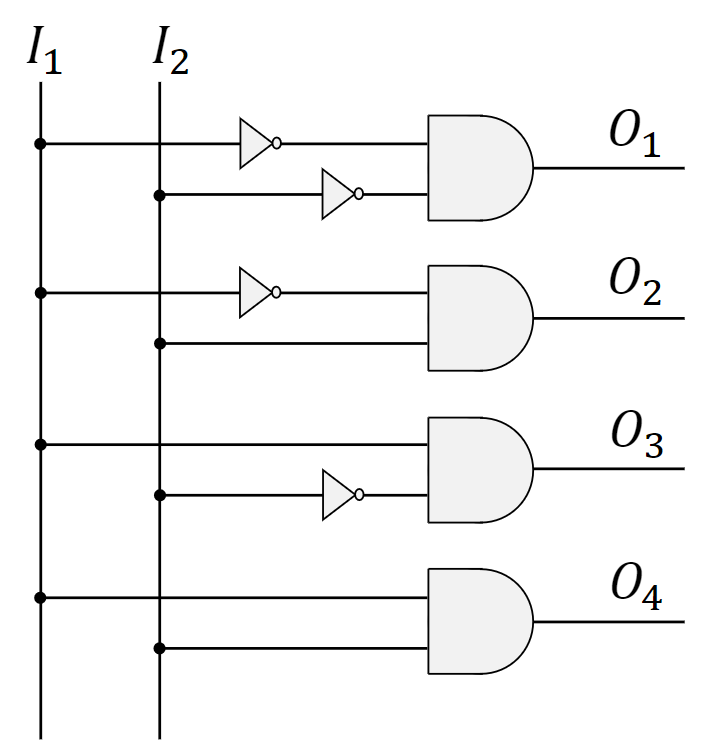{width=80%}

##### **1.5 Encoder**
An **Encoder** performs the reverse operation of a decoder. It has $2^n$ input lines and $n$ output lines. Its function is based on the assumption that *only one input line is active (set to `1`) at any given time*. The encoder produces an $n$-bit binary code on its output lines that corresponds to the active input line.

Think of it like the panel of buttons in an elevator. You press one button (one active input), and the system generates a binary code that represents the selected floor number (the output).

###### **1.5.1 4-to-2 Encoder Implementation**
A 4-to-2 encoder has four input lines ($I_1, I_2, I_3, I_4$) and two output lines ($O_1, O_2$). Assuming only one input is `1` at a time, it generates a two-bit output. The implementation for this simple encoder surprisingly only requires two OR gates.

-   If $I_1=1$, output is $00$.
-   If $I_2=1$, output is $01$.
-   If $I_3=1$, output is $10$.
-   If $I_4=1$, output is $11$.

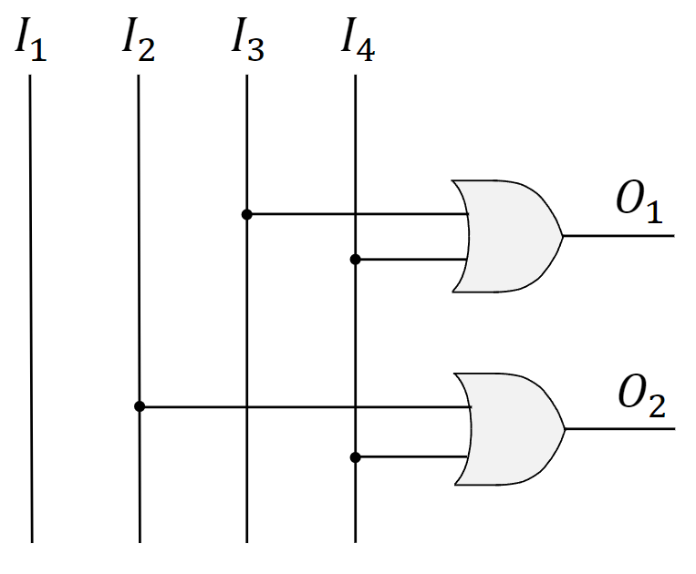{width=80%}

##### **1.6 Hardware Building Blocks in CPU Design**
These combinational circuits are not just theoretical constructs; they are the fundamental building blocks of complex computer components like the Central Processing Unit (CPU).

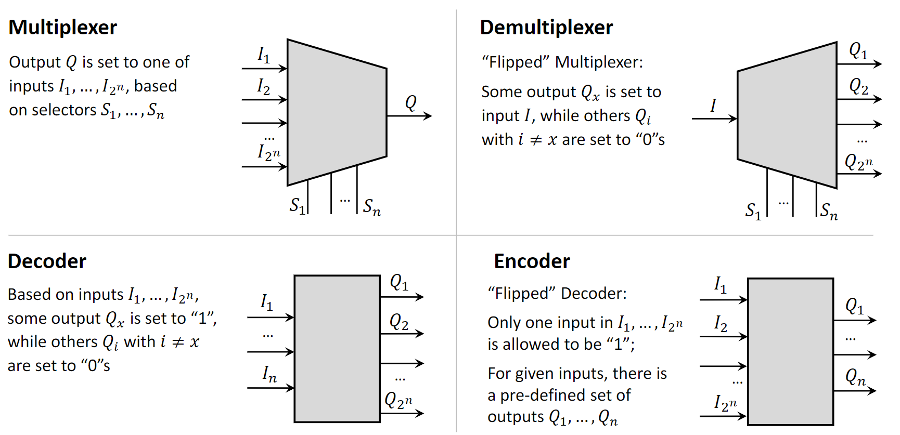{width=80%}

###### **1.6.1 Key CPU Components**
A simplified CPU contains three main parts:

-   **Control Unit (CU):** Directs the flow of operations, accesses memory, and synchronizes instruction execution.
-   **Arithmetic Logic Unit (ALU):** Performs all arithmetic (addition, subtraction) and logical (AND, OR) operations.
-   **Registers:** Small, fast memory units that temporarily hold data, instructions, and results for the ALU.

###### **1.6.2 Case 1: Multiplexer for ALU Implementation**
An ALU must perform multiple different operations. A practical way to design this is to have separate subcircuits for each operation (e.g., an adder, a subtractor, a multiplier). The inputs (arguments) are fed to all these subcircuits simultaneously. Each subcircuit computes its specific result.

A **multiplexer** is then used to select the final output. The control signal for this MUX is the **opcode** (operation code) from the instruction being executed. The opcode tells the MUX which subcircuit's result should be passed through as the final output of the ALU.

An important consideration here is **propagation delay**—the time it takes for the inputs to travel through the gates and produce a final, stable output. The CPU's clock cycle must be long enough to accommodate the slowest possible instruction in the ALU. This design trade-off is central to computer architecture concepts like RISC (Reduced Instruction Set Computer) vs. CISC (Complex Instruction Set Computer).

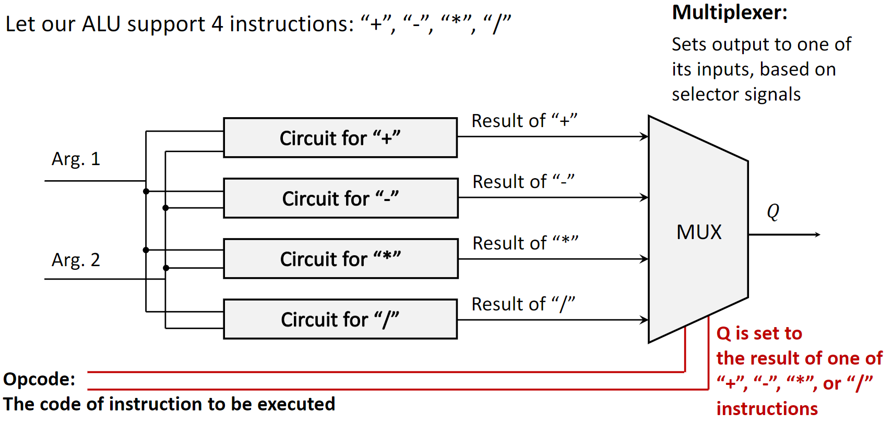{width=80%}

###### **1.6.3 Case 2: Demultiplexer for Memory Unit Write**
A **demultiplexer** is essential for writing data to a memory unit. A memory unit consists of many cells, each with a unique address. To write a bit of data to a specific cell:

1.  The data bit is provided as the single input to the DEMUX.
2.  The address of the target memory cell is provided to the control pins of the DEMUX.
3.  The DEMUX selects the output line that is physically connected to the target memory cell and routes the data bit to it, writing the value.

To write multiple bits at once (e.g., a full byte), this principle is extended. One common method is to use a bank of demultiplexers, one for each bit being written, all controlled by the same address lines.

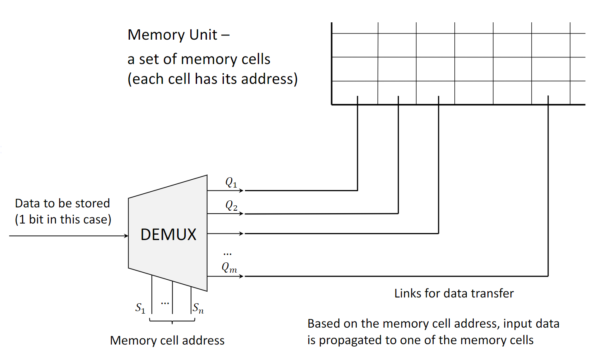{width=80%}

#### **2. Definitions**
-   **Logic Gate**: A basic electronic circuit that performs a logical operation on one or more binary inputs to produce a single binary output.
-   **Combinational Circuit**: A digital logic circuit whose output depends only on the present combination of inputs, with no memory of past states.
-   **Multiplexer (MUX)**: A circuit with multiple data inputs, one data output, and control inputs that select which data input is routed to the output.
-   **Demultiplexer (DEMUX)**: A circuit with one data input, multiple data outputs, and control inputs that select which data output receives the input.
-   **Decoder**: A circuit that converts an n-bit binary input code into a unique active signal on one of its $2^n$ outputs.
-   **Encoder**: A circuit that converts a single active signal on one of its $2^n$ inputs into an n-bit binary output code. It assumes only one input is active at a time.
-   **ALU (Arithmetic Logic Unit)**: The part of a CPU that carries out arithmetic and logic operations on the operands in computer instruction words.
-   **Opcode (Operation Code)**: The portion of a machine language instruction that specifies the operation to be performed.
-   **Propagation Delay**: The time it takes for a change in the input of a logic gate or circuit to produce a change at the output.

#### **3. Mistakes**
-   **Confusing Multiplexers and Demultiplexers:** A common mistake is to mix up which device has multiple inputs and a single output (Multiplexer) and which has a single input and multiple outputs (Demultiplexer). Remember: MUX *selects*, DEMUX *distributes*.
-   **Encoder Input Violation:** Providing more than one active ('1') input to a simple encoder. **Why it's wrong:** This will produce an invalid or ambiguous binary output because the circuit logic (often just OR gates) is not designed to handle multiple active inputs.
-   **Ignoring Propagation Delay:** Assuming the output of a combinational circuit is available instantaneously. **Why it's wrong:** Every logic gate has a small delay. In a complex circuit, these delays add up and must be accounted for in the system's timing, especially with the CPU clock cycle.
-   **Decoder vs. Demultiplexer Misunderstanding:** Failing to see that a decoder is effectively a demultiplexer without the data input. **Why it's wrong:** While they are structurally similar, their purpose is different. A DEMUX routes data, whereas a decoder selects a location or converts a code.
