

[Quiz](https://notebooklm.google.com/notebook/d51634a3-f628-4457-b164-3db55b88b876?artifactId=ac3f5be4-776d-4d93-92f8-30765f183470) | [Flashcards](https://notebooklm.google.com/notebook/d51634a3-f628-4457-b164-3db55b88b876?artifactId=2990c64f-5412-4ef9-8256-8da04602fd3e)


#### **1. Summary**
##### **1.1 Arithmetic-Logic Unit (ALU) Construction**
An **Arithmetic-Logic Unit (ALU)** is a fundamental digital circuit within a computer's central processing unit (CPU) that performs arithmetic and bitwise logic operations on integer binary numbers. It is the computational core of the processor.

###### **1.1.1 Basic ALU Organization**
A simple ALU can be designed to handle a specific set of instructions. The core idea is to have separate circuits for each operation and use a **multiplexer (MUX)** to select the correct output based on a control signal called an **opcode** (operation code).

For an ALU that performs addition (+), subtraction (-), multiplication (*), and equality comparison (==), the organization would be as follows:

- Two input arguments (`Arg. 1`, `Arg. 2`) are fed in parallel to four distinct circuits.
- Each circuit computes its specific function: one for addition, one for subtraction, etc.
- The results from all four circuits are sent to the inputs of a multiplexer.
- The opcode is used as the select signal for the MUX. It determines which of the four results is passed to the final output, `Q`.

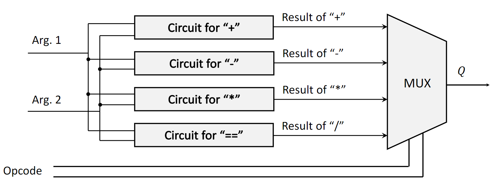{width=80%}

###### **1.1.2 4-Bit Adder Circuit**
A binary adder is a circuit that performs the addition of binary numbers. A **4-bit adder** adds two 4-bit numbers. A common implementation is the **ripple-carry adder**, which is constructed by cascading **full adders**.

-   **Full Adder**: A combinational circuit that adds three bits: two input bits ($A$ and $B$) and a carry-in bit ($C_{in}$). It produces two outputs: a sum bit ($S$) and a carry-out bit ($C_{out}$). The logic involves XOR gates for the sum and AND/OR gates for the carry.
-   **Ripple-Carry Adder**: For a 4-bit adder (e.g., adding $A_4A_3A_2A_1$ and $B_4B_3B_2B_1$), four full adders are connected in series.
    1.  The first full adder adds the least significant bits ($A_1, B_1$) with a $C_{in}$ of 0. It produces the first sum bit ($q_1$) and a carry-out ($c_{out1}$).
    2.  This carry-out ($c_{out1}$) is "rippled" to become the carry-in for the second full adder, which adds $A_2, B_2,$ and $c_{out1}$ to produce $q_2$ and $c_{out2}$.
    3.  This process continues for all bits, with the carry-out of one stage feeding the carry-in of the next. The final carry-out from the last full adder can be used to detect an overflow.

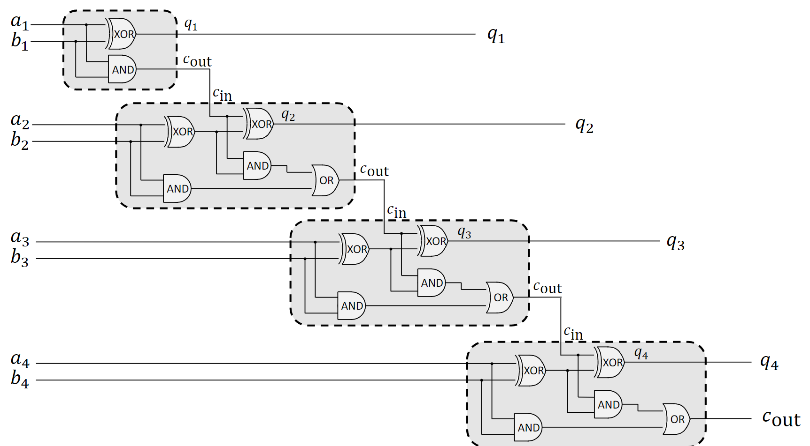{width=80%}

###### **1.1.3 4-Bit Subtractor Circuit**
Subtraction in binary can be performed by adding the two's complement of the subtrahend. A **4-bit subtractor** can be built using a 4-bit adder with a slight modification. To calculate $A - B$, we compute $A + (\text{two's complement of } B)$.

The *two's complement* of a number is found by inverting all its bits (one's complement) and then adding 1. The circuit for $A - B$ can be implemented as:

1.  Invert each bit of the second number, $B$, using NOT gates.
2.  Feed the inverted bits of $B$ and the bits of $A$ into a 4-bit adder.
3.  Set the initial carry-in ($C_{in}$) to the first full adder to 1. This handles the "+1" part of the two's complement operation.

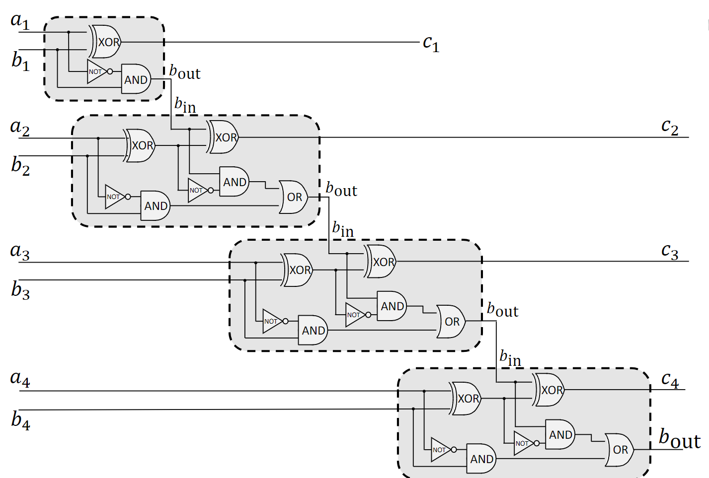{width=80%}

###### **1.1.4 Binary Multipliers**
Binary multiplication is similar to decimal multiplication and involves generating and then summing **partial products**.

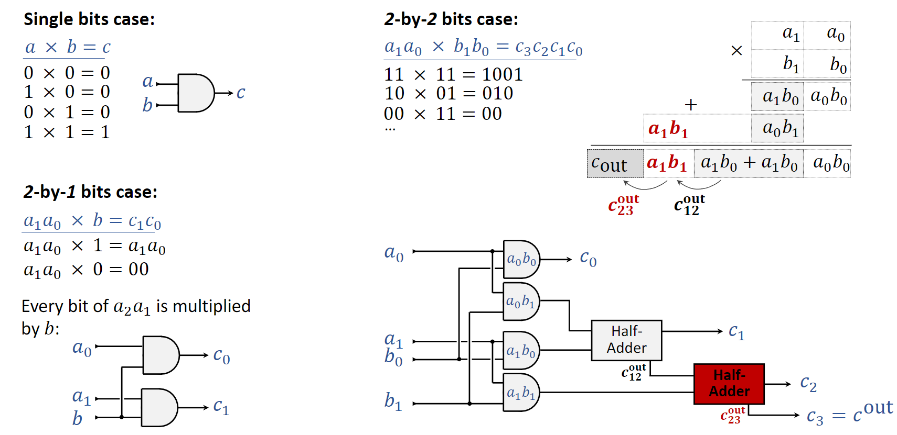{width=80%}

-   **Single-Bit Case**: Multiplying two single bits, $a \times b$, is equivalent to the logical AND operation. The result is 1 only if both $a$ and $b$ are 1. The circuit for this is a single **AND gate**.
-   **2-by-2 Bit Case**: To multiply two 2-bit numbers, $A = a_1a_0$ and $B = b_1b_0$:
    1.  Generate partial products by ANDing each bit of $A$ with each bit of $B$. This results in four partial products: $a_0b_0$, $a_1b_0$, $a_0b_1$, and $a_1b_1$.
    2.  Arrange the partial products according to their bit positions (place value) and sum them using adders (half-adders and full-adders). The result can be up to 4 bits long.
    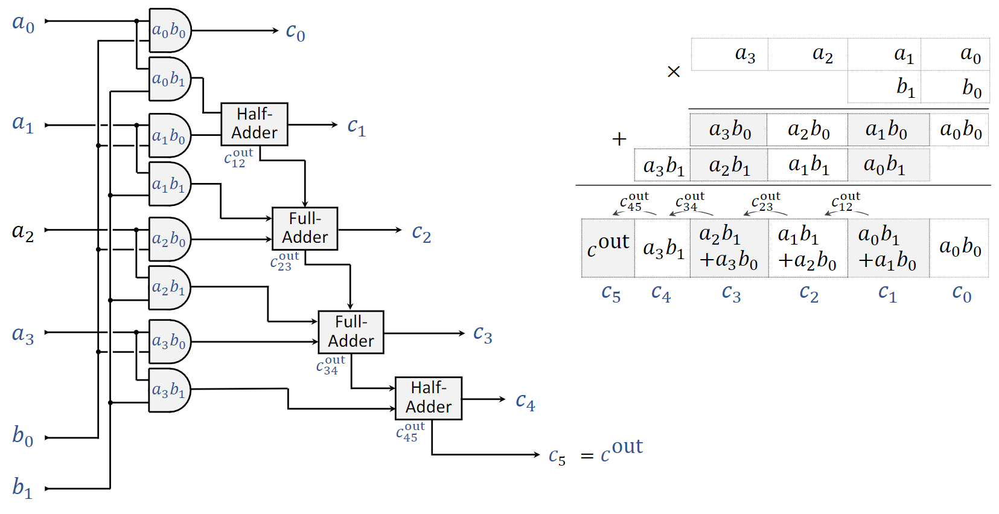{width=80%}
-   **4-by-4 Bit Multiplier**: This extends the same principle. A 4-by-4 multiplier takes two 4-bit numbers and produces an 8-bit result.
    1.  **Partial Product Generation**: An array of 16 AND gates is used to compute all the partial products ($a_ib_j$ for $i,j \in \{0,1,2,3\}$).
    2.  **Summation**: A complex structure of half-adders and full-adders is used to sum the partial products. This is often done in a tree-like structure to reduce propagation delay.
    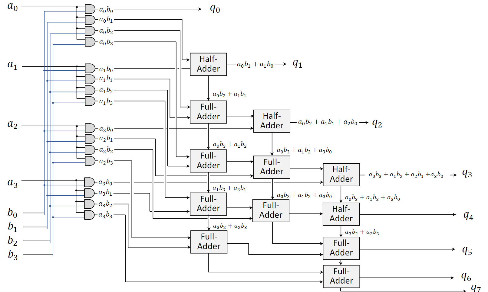{width=80%}

###### **1.1.5 4-by-4 Bit Equality Checker**
An **equality checker** determines if two binary numbers are identical. For two 4-bit numbers, $A = A_3A_2A_1A_0$ and $B = B_3B_2B_1B_0$, they are equal if and only if each corresponding pair of bits is equal ($A_i = B_i$ for all $i$).

This can be implemented using **XNOR gates**.

-   An XNOR gate outputs 1 only if its two inputs are the same.
-   Each pair of bits ($A_0, B_0$), ($A_1, B_1$), etc., is fed into a separate XNOR gate.
-   The outputs of all four XNOR gates are then fed into a 4-input AND gate.
-   The final output of the AND gate will be 1 only if all four XNOR gates output 1, which means all bit pairs are identical.

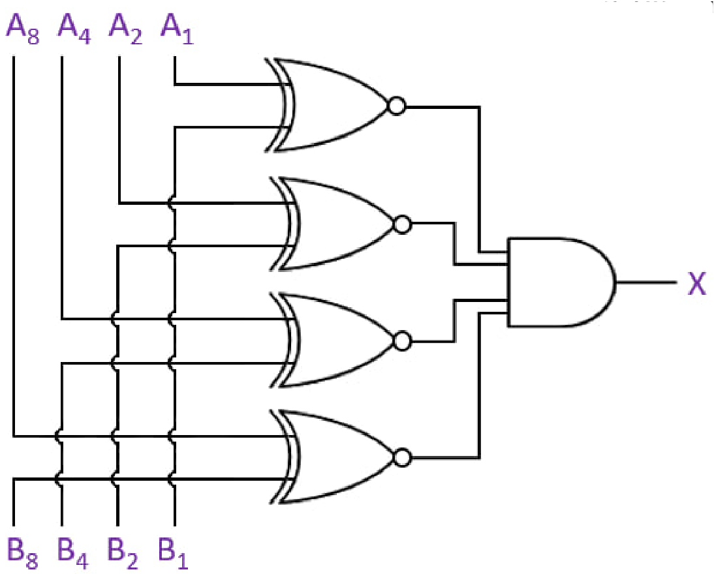{width=80%}

##### **1.2 Latch Circuits and Memory**
Unlike combinational logic circuits (like adders) whose outputs depend solely on their current inputs, **sequential logic circuits** have outputs that depend on both current inputs and previous states. They have a *memory* property. The fundamental building block of this memory is the **latch**.

###### **1.2.1 Universal Logic Gates**
While there are many basic logic gates (AND, OR, XOR, etc.), all of them can be constructed from only **NAND** gates or only **NOR** gates. Because of this property, NAND and NOR gates are called **universal gates**. They are crucial for building sequential circuits like latches.

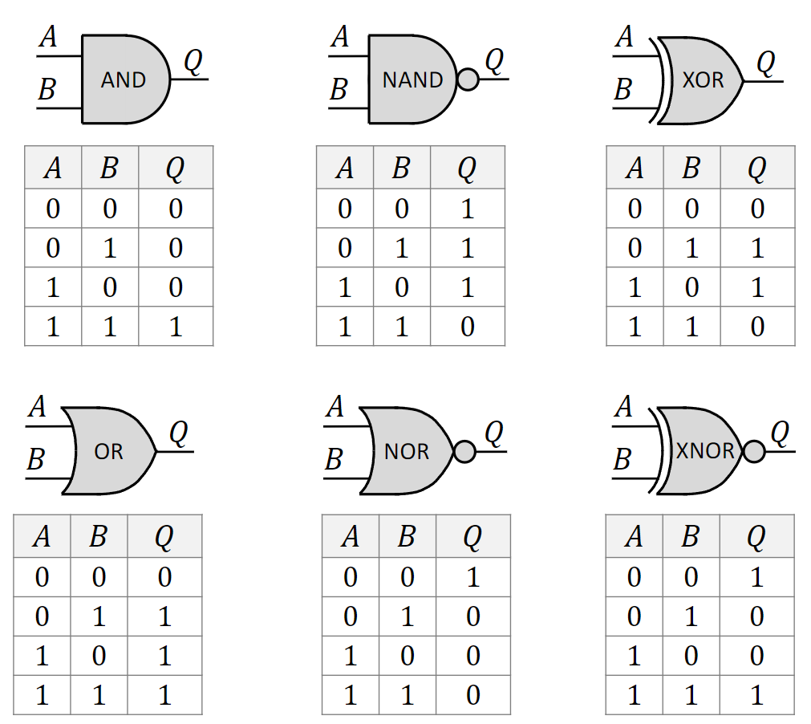{width=80%}

###### **1.2.2 SR Latch from NOR Gates**
An **SR Latch** (Set-Reset Latch) is one of the simplest sequential circuits. It can be constructed using two cross-coupled NOR gates.

-   The output of the top NOR gate is fed back as an input to the bottom NOR gate.
-   The output of the bottom NOR gate is fed back as an input to the top NOR gate.
-   This feedback loop is what allows the circuit to store a state.
-   The circuit has two inputs, S (Set) and R (Reset), and two outputs, Q and $\bar{Q}$ (which is typically the inverse of Q).

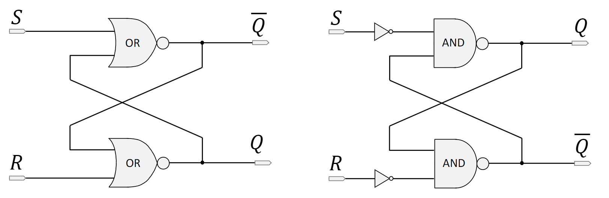{width=80%}
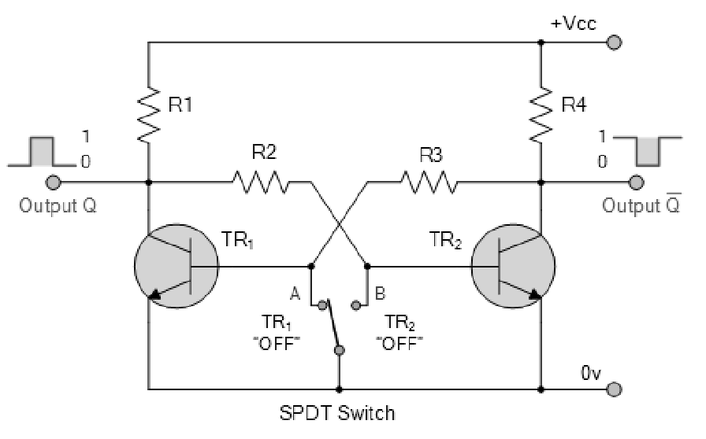{width=80%}

###### **1.2.3 SR Latch Behavior Analysis**
The state of the SR latch is determined by the inputs S and R.

-   **Set (S=1, R=0)**: This input combination forces the output Q to 1 (and $\bar{Q}$ to 0). This is called the *set* state.
-   **Reset (S=0, R=1)**: This forces the output Q to 0 (and $\bar{Q}$ to 1). This is the *reset* state.
-   **Hold/Store (S=0, R=0)**: When both inputs are 0, the latch maintains its previous state. The feedback loop keeps the outputs stable. If Q was 1, it remains 1; if it was 0, it remains 0. This is the *memory* property.
-   **Illegal/Forbidden State (S=1, R=1)**: This combination forces both Q and $\bar{Q}$ to 0. This violates the logical condition that $\bar{Q}$ should be the inverse of Q. More importantly, if S and R then change to 0 simultaneously, the next state is unpredictable (a race condition), making this input combination invalid.

The SR latch is also known as a **bistable multivibrator** because it has two stable states (Q=0 and Q=1). It can store one bit of data.

###### **1.2.4 D Latch (Enable Latch)**
To solve the illegal input problem of the SR latch, the **D Latch** (Data Latch or Enable Latch) was developed. It has two inputs: D (Data) and E (Enable).

-   When the Enable (E) input is high (1), the latch is *transparent*. The output Q simply follows the input D. If D is 1, Q becomes 1; if D is 0, Q becomes 0.
-   When the Enable (E) input is low (0), the latch is *closed*. It ignores the D input and holds (stores) its last value.
-   The D latch ensures that the illegal S=1, R=1 condition can never occur internally, making it safer to use.

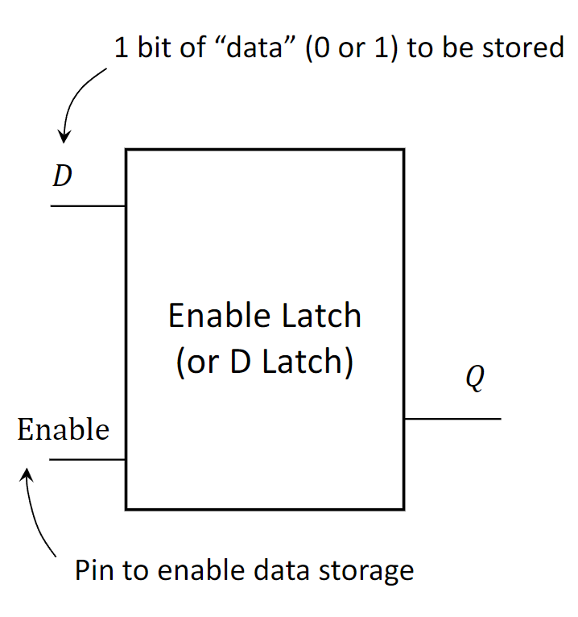{width=80%}

##### **1.3 Finite State Machines (FSM)**
A **Finite State Machine (FSM)**, or Finite Automaton, is an abstract model of computation used to design digital logic circuits and computer programs. An FSM is defined by a finite number of states and the transitions between those states. The SR latch is a perfect simple example of an FSM.

###### **1.3.1 FSM Definitions**
An FSM is an abstract machine that can be in exactly one of a finite number of **states** at any given time. Its behavior is defined by:

1.  **States ($S$)**: A finite set of possible conditions the machine can be in (e.g., for the SR latch: `Q=0`, `Q=1`, `uninitialized`, `invalid`).
2.  **Initial State ($s_0$)**: The state the machine starts in (e.g., `uninitialized`).
3.  **Inputs ($I$)**: A finite set of input signals the machine can receive (e.g., the four possible combinations of S and R).
4.  **Outputs ($O$)**: A finite set of output signals the machine can produce (e.g., the value of Q).
5.  **Transition Function**: A rule that determines the next state based on the current state and the current input.

This FSM is **deterministic**: for any given state and input, there is only one possible next state.

###### **1.3.2 Visualizing FSMs**
There are two common ways to represent an FSM:

-   **State Transition Diagram**: A directed graph where nodes represent states and arrows represent transitions. Each arrow is labeled with the input that causes the transition.
-   **State Transition Table**: A table that lists the next state and output for every possible combination of current state and input.

For the SR latch, the state diagram would show transitions from the `Q=0` state to the `Q=1` state on an `S=1, R=0` input, and a loop back to itself on an `S=0, R=0` input.

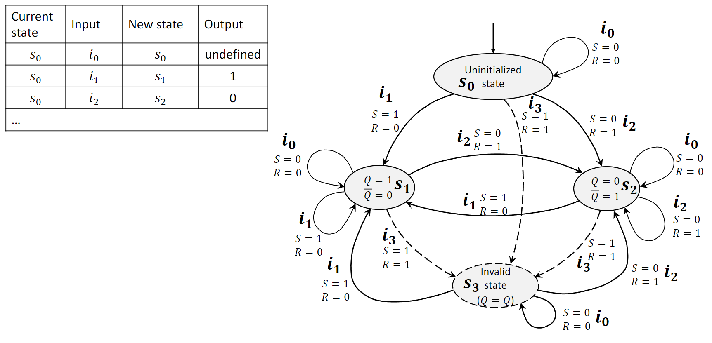{width=80%}

#### **2. Definitions**
*   **Arithmetic-Logic Unit (ALU)**: A digital circuit that performs arithmetic (addition, subtraction) and logic (AND, OR, NOT) operations.
*   **Multiplexer (MUX)**: A device that selects one of several analog or digital input signals and forwards the selected input into a single line.
*   **Opcode**: An operation code; a control signal that specifies the operation to be performed by a component like an ALU.
*   **Full Adder**: A combinational logic circuit that adds three input bits (A, B, Carry-in) and produces a two-bit output (Sum, Carry-out).
*   **Ripple-Carry Adder**: A type of binary adder constructed by cascading full adders, where the carry-out of each stage is connected to the carry-in of the next.
*   **Partial Products**: The intermediate results obtained in binary multiplication by ANDing the multiplicand with each bit of the multiplier.
*   **Latch**: A sequential logic circuit that can store one bit of information. It has two stable states and is the basic building block of memory.
*   **Universal Gate**: A logic gate (either NAND or NOR) from which any other logic function can be constructed.
*   **SR Latch**: A Set-Reset latch, a simple bistable multivibrator that can be set (to 1), reset (to 0), or hold its current state.
*   **D Latch**: A Data or "transparent" latch that passes its input to the output when enabled and holds its state when disabled, avoiding the illegal state of an SR latch.
*   **Finite State Machine (FSM)**: A computational model consisting of a finite number of states, transitions between those states triggered by inputs, and actions or outputs.

#### **3. Formulas**
*   **Full Adder Sum**: $Sum = A \oplus B \oplus C_{in}$
*   **Full Adder Carry-Out**: $C_{out} = (A \cdot B) + (C_{in} \cdot (A \oplus B))$
*   **Single-Bit Multiplication**: $Result = A \cdot B$ (Logical AND)
*   **Equality Check (XNOR)**: $Output = \overline{A \oplus B}$

#### **4. Mistakes**
*   **Ignoring the Illegal State of an SR Latch:** Applying S=1 and R=1 to a basic SR latch puts it into an undefined state where Q and $\bar{Q}$ are not complements. The subsequent state, when inputs change to S=0 and R=0, is unpredictable.
*   **Confusing Latches with Flip-Flops:** While related, latches are *level-sensitive* (their output can change whenever the enable signal is active), whereas flip-flops are *edge-triggered* (their output only changes on the rising or falling edge of a clock signal).
*   **Misunderstanding "Transparent" in a D Latch:** A D latch is only transparent when its enable signal is high. Forgetting to de-assert the enable signal means the output will continuously change with the data input instead of storing a value.
*   **Underestimating Propagation Delay in Ripple-Carry Adders:** The sum and carry bits of the most significant stage are only valid after the carry has rippled through all previous stages. This delay can be significant for adders with many bits.
*   **Incorrectly Summing Partial Products:** When performing binary multiplication, the partial products must be shifted to their correct bit positions before being added together, just like in decimal multiplication.

#### **5. Examples**
##### **5.1. 4-Bit Adder**
**Question:** Calculate the sum of the binary numbers $A = 1011_2$ and $B = 0110_2$ using a 4-bit ripple-carry adder. What is the final carry-out?
<details>
<summary>Click to see the solution</summary>

We add column by column from right to left, tracking the carry.

1.  **Bit 0 (LSB):** $1 + 0 = 1$. Sum = 1, Carry = 0.
2.  **Bit 1:** $1 + 1 + (\text{carry } 0) = 10_2$. Sum = 0, Carry = 1.
3.  **Bit 2:** $0 + 1 + (\text{carry } 1) = 10_2$. Sum = 0, Carry = 1.
4.  **Bit 3 (MSB):** $1 + 0 + (\text{carry } 1) = 10_2$. Sum = 0, Carry = 1.

**Answer:** The sum is **$0001_2$** with a final carry-out of **1**. This indicates an overflow, as the result (17) cannot be represented in 4 bits.
</details>

##### **5.2. 2-by-2 Bit Multiplication**
**Question:** Multiply the binary numbers $A = 11_2$ (3) and $B = 10_2$ (2). Show the partial products.
<details>
<summary>Click to see the solution</summary>

Let $A = a_1a_0$ and $B = b_1b_0$. Here, $a_1=1, a_0=1$ and $b_1=1, b_0=0$.

1.  **First Partial Product** (multiplying A by $b_0$): $11_2 \times 0 = 00$.
2.  **Second Partial Product** (multiplying A by $b_1$): $11_2 \times 1 = 11$.
3.  **Sum the partial products**, shifting the second one to the left by one position:
    ```
      00
    + 110
    -----
      110
    ```

**Answer:** The result is **$110_2$** (6). The partial products are `00` and `11`.
</details>

##### **5.3. SR Latch State Tracing**
**Question:** An SR Latch (made from NOR gates) has an initial state of Q=0. Trace the value of Q for the following sequence of inputs:
(1) S=1, R=0; (2) S=0, R=0; (3) S=0, R=1; (4) S=0, R=0.
<details>
<summary>Click to see the solution</summary>

*   **Initial State:** Q = 0.
1.  **Input S=1, R=0 (Set):** The latch is set. **Q becomes 1.**
2.  **Input S=0, R=0 (Hold):** The latch holds its previous value. **Q remains 1.**
3.  **Input S=0, R=1 (Reset):** The latch is reset. **Q becomes 0.**
4.  **Input S=0, R=0 (Hold):** The latch holds its previous value. **Q remains 0.**

**Answer:** The final value of Q is **0**.
</details>

##### **5.4. D Latch Operation**
**Question:** A D latch has the following inputs over time: D changes from 0 to 1, and then the Enable (E) pin goes from 0 to 1 and back to 0. Describe the output Q.
<details>
<summary>Click to see the solution</summary>

1.  **Initially:** Assume E=0. The latch is closed and holds its previous value (let's say Q=0). D changes to 1, but Q is unaffected because E is low.
2.  **Enable (E) goes high:** The latch becomes transparent. The output Q immediately takes the value of the D input. **Q becomes 1.**
3.  **Enable (E) goes low:** The latch closes. It now stores the value it had at the moment E went low. **Q remains 1**, even if D changes later.

**Answer:** The output Q will change to 1 when the Enable pin is high and will then hold the value 1 after the Enable pin goes low.
</details>

##### **5.5. Equality Checker**
**Question:** What is the output of a 4-bit equality checker for the inputs $A = 1101_2$ and $B = 1001_2$?
<details>
<summary>Click to see the solution</summary>

The checker compares each bit pair using an XNOR gate.

1.  **Bit 0:** $A_0=1, B_0=1$. XNOR output is 1.
2.  **Bit 1:** $A_1=0, B_1=0$. XNOR output is 1.
3.  **Bit 2:** $A_2=1, B_2=0$. XNOR output is 0.
4.  **Bit 3:** $A_3=1, B_3=1$. XNOR output is 1.

The outputs of the XNOR gates (1, 1, 0, 1) are fed into a final AND gate. Since one of the inputs to the AND gate is 0, its output will be 0.

**Answer:** The output is **0**, indicating the numbers are not equal.
</details>

##### **5.6. 4-Bit Subtractor**
**Question:** Calculate $1100_2 - 0101_2$ using the two's complement addition method.
<details>
<summary>Click to see the solution</summary>

1.  **Find the two's complement of B (0101):**
    *   Invert the bits (one's complement): $1010$.
    *   Add 1: $1010 + 1 = 1011$.
2.  **Add this result to A (1100):**
    ```
      1100
    + 1011
    ------
     10111
    ```
3.  The result has 5 bits. In a 4-bit system, the 5th bit (the carry-out) is discarded.

**Answer:** The result is **$0111_2$** (decimal 7), which is correct since $12 - 5 = 7$.
</details>

##### **5.7. FSM State Transition**
**Question:** An FSM has three states: S0, S1, and S2. The initial state is S0. The machine receives binary inputs (0 or 1). The transitions are:
-   From S0, on input 1, go to S1. On input 0, stay in S0.
-   From S1, on input 0, go to S2. On input 1, stay in S1.
-   From S2, go to S0 on any input.
What is the final state after the input sequence `1010`?
<details>
<summary>Click to see the solution</summary>

1.  **Start at S0.**
2.  Input is **1**: Transition from S0 to **S1**. Current state: S1.
3.  Input is **0**: Transition from S1 to **S2**. Current state: S2.
4.  Input is **1**: Transition from S2 to **S0**. Current state: S0.
5.  Input is **0**: Transition from S0 to **S0**. Current state: S0.

**Answer:** The final state is **S0**.
</details>