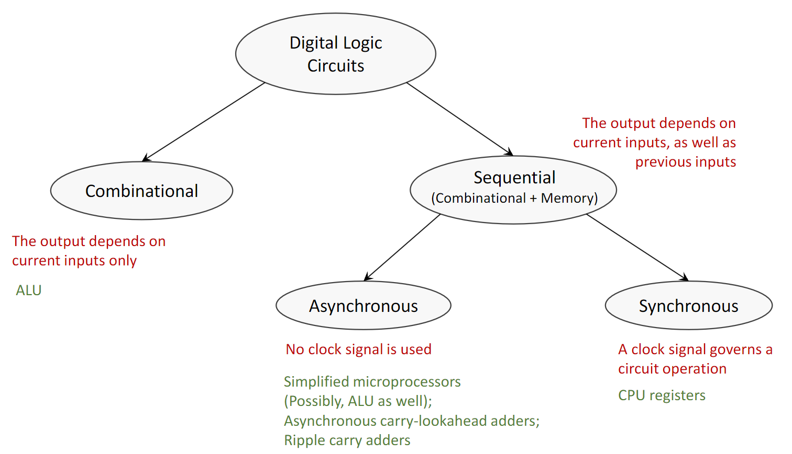
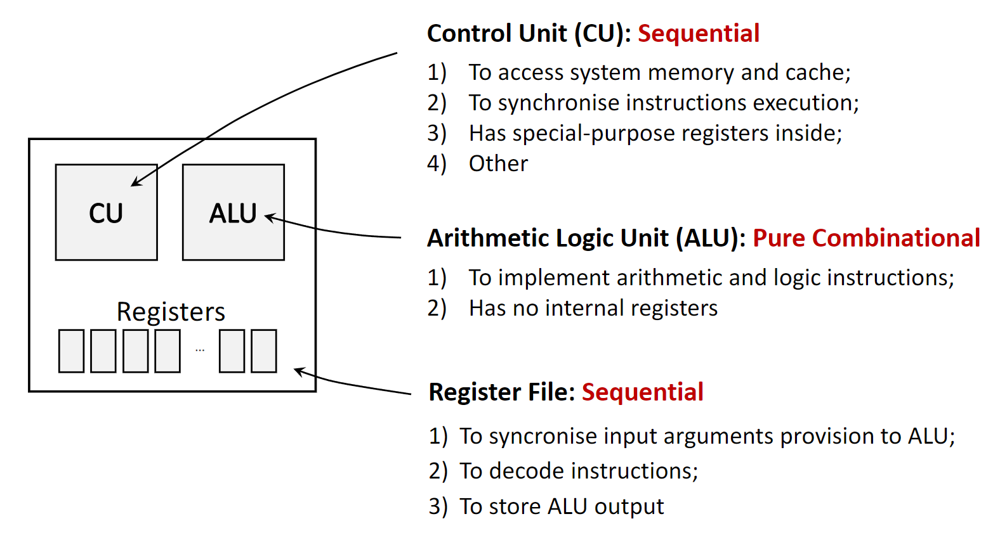
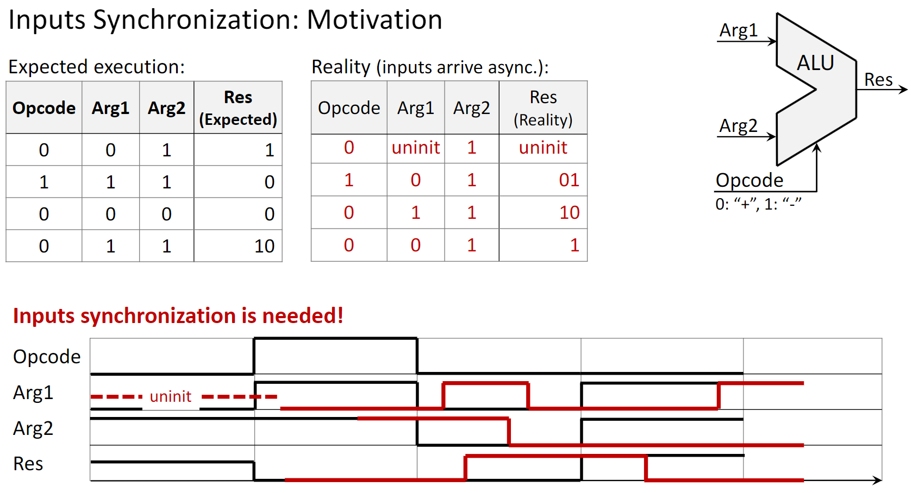
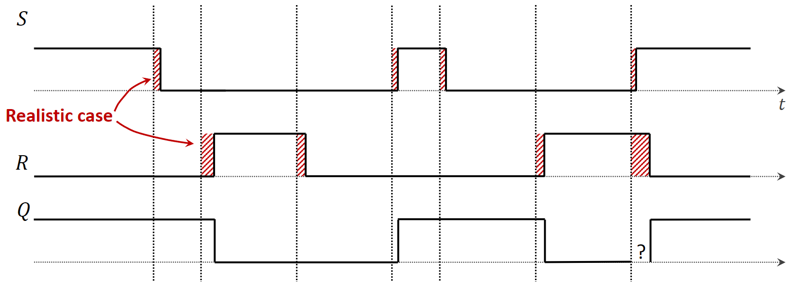
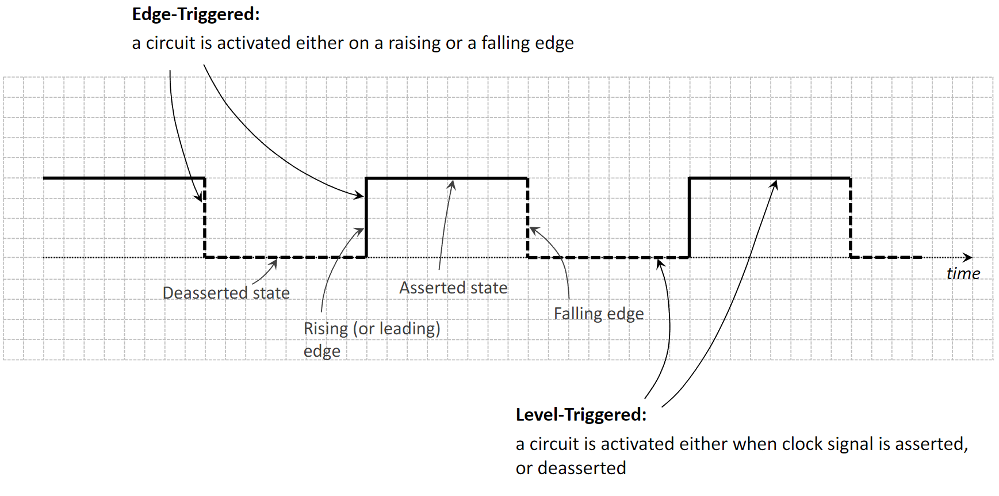
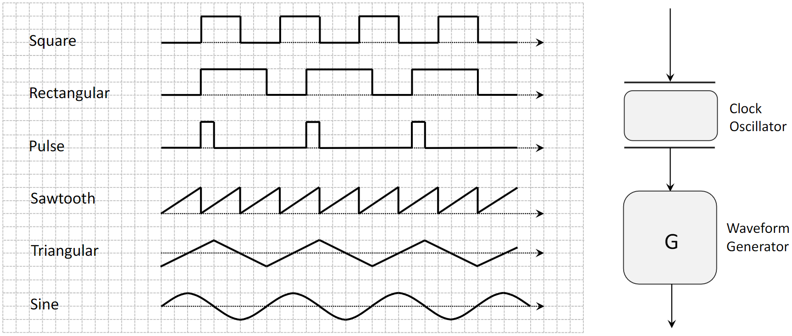
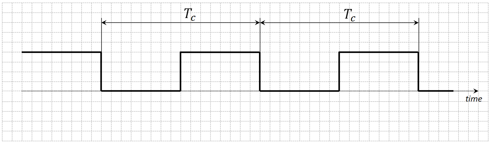
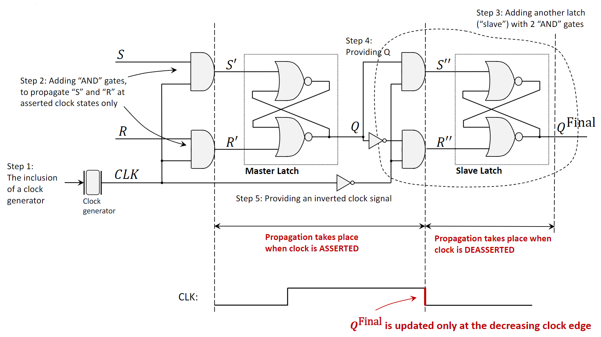
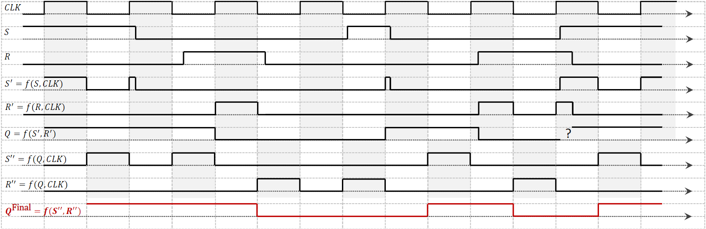
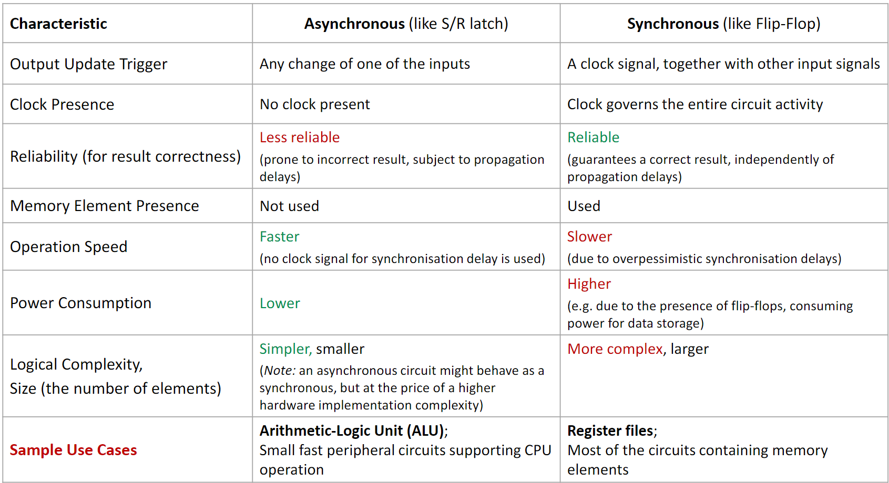



[Quiz](https://notebooklm.google.com/notebook/beeee03d-fe5f-42bd-b34c-60d102b4a1a3?artifactId=0f9d73a6-b91e-4776-b2fd-c61a64db1bf8) | [Flashcards](https://notebooklm.google.com/notebook/beeee03d-fe5f-42bd-b34c-60d102b4a1a3?artifactId=a02843e5-d23e-4e73-ba5c-7c63d3aa9125) 

#### **1. Summary**

##### **1.1 Classification of Digital Logic Circuits**
Digital logic circuits are the fundamental building blocks of all digital systems, including computers. They are broadly categorized into two main types based on how they handle inputs and memory.

###### **1.1.1 Combinational Circuits**
A **combinational circuit** is a type of digital circuit whose output is determined *solely by its current inputs*. Think of it as a simple calculator: the answer you get depends only on the numbers and the operation you enter at that moment.

-   **No Memory:** These circuits have no memory. They cannot store any information about past inputs.
-   **No Clock:** Their operation is not synchronized by a clock signal.
-   **Examples:** A basic **adder circuit** that sums two bits is a classic example. The **Arithmetic Logic Unit (ALU)** in a CPU, which performs calculations like addition and subtraction, is a complex combinational circuit.

###### **1.1.2 Sequential Circuits**
A **sequential circuit** is more complex. Its output depends not only on the *current inputs* but also on the *sequence of past inputs*. This is possible because sequential circuits have **memory elements** that store information about the circuit's previous state.

-   **Memory:** They contain memory elements like latches or flip-flops to store state.
-   **Feedback:** The stored information is fed back into the circuit, influencing future outputs.
-   **Examples:** CPU registers, memory, and counters are all sequential circuits.

Sequential circuits are further divided into two subcategories based on their timing and synchronization.

###### **1.1.2.1 Asynchronous Sequential Circuits**
**Asynchronous circuits**, also known as *self-timed* or *ripple-clock circuits*, do not use a global clock signal to coordinate changes. The state of the circuit changes as soon as its inputs change.

-   **Trigger:** Changes are triggered by any change in the input signals.
-   **Timing:** The speed of operation depends on the propagation delays of the logic gates.
-   **Use Cases:** They are used in applications where speed is critical and global synchronization is difficult, such as in simplified microprocessors, carry-lookahead adders, and communication interfaces. An **S/R Latch** is a fundamental asynchronous memory element.

###### **1.1.2.2 Synchronous Sequential Circuits**
**Synchronous circuits** use a master clock signal to orchestrate all state changes. All operations happen in lockstep, synchronized to the ticks (or edges) of the clock. This is like a rowing team where everyone paddles in unison, guided by the coxswain's calls.

-   **Trigger:** State changes are triggered by the clock signal (specifically, the rising or falling edge of the clock pulse).
-   **Timing:** The clock governs the entire circuit's activity, ensuring orderly and predictable operations.
-   **Use Cases:** Most modern digital systems, including **CPU chips** and **register files**, are synchronous because they are more reliable and easier to design and debug. A **Flip-Flop** is the fundamental synchronous memory element.

{width=80%}
{width=80%}

##### **1.2 The Need for Input Synchronization**
In a real-world system like a CPU, different input signals for a component like an ALU might arrive at slightly different times due to varying path lengths and component delays. This is called *input skew*. If an ALU (a combinational circuit) processes these unsynchronized inputs as they arrive, it can produce incorrect, glitchy outputs before the inputs stabilize.

To prevent this, synchronous systems use **registers** (built from flip-flops) to store the inputs. The registers all load their data on the same clock edge, ensuring that the ALU receives a stable, synchronized set of inputs to work with. This guarantees a correct and predictable result.

{width=80%}

##### **1.3 Memory Elements: Latches and Flip-Flops**

###### **1.3.1 The S/R Latch (Asynchronous)**
The **S/R Latch** (Set-Reset Latch) is one of the simplest memory elements. It is an asynchronous circuit built from two cross-coupled NOR gates.

-   **Set (S=1, R=0):** The output `Q` is "set" to 1.
-   **Reset (S=0, R=1):** The output `Q` is "reset" to 0.
-   **Hold (S=0, R=0):** The output `Q` holds its previous value. This is the memory feature.
-   **Illegal State (S=1, R=1):** This input combination is forbidden because it leads to an unpredictable or unstable state. In a NOR latch, it forces `Q` to 0, but when S and R return to 0, the final state is uncertain (a race condition).

A major problem with the S/R Latch is its vulnerability to propagation delays. If inputs S and R are meant to change simultaneously but one is slightly delayed, the latch might momentarily enter the illegal state, causing errors.

{width=80%}

###### **1.3.2 The Clock Signal**
Synchronous circuits rely on a **clock signal**, which is a periodic square wave that oscillates between a low state (0) and a high state (1). It's generated by a **clock oscillator**.

-   **Asserted State:** The high voltage level (logic 1).
-   **Deasserted State:** The low voltage level (logic 0).
-   **Rising Edge:** The transition from low to high.
-   **Falling Edge:** The transition from high to low.
-   **Clock Period ($T_c$):** The time for one full cycle (e.g., in nanoseconds).
-   **Clock Frequency ($F_c$):** The number of cycles per second ($1/T_c$), measured in Hertz (Hz) or Gigahertz (GHz).

Circuits can be designed to react to the clock in two ways:
-   **Level-Triggered:** The circuit is active and responds to inputs for the entire duration the clock is in a specific state (e.g., asserted high). Latches are level-triggered.
-   **Edge-Triggered:** The circuit only responds to inputs at the precise moment of a clock transition (either the rising or falling edge). Flip-flops are edge-triggered.

{width=80%}
{width=80%}
{width=80%}

###### **1.3.3 The Flip-Flop (Synchronous)**
A **flip-flop** is an edge-triggered memory element. It solves the problems of the basic latch by only changing its state on a clock edge. The most common design is the **Master-Slave Flip-Flop**.

This design consists of two latches connected in series: a **master latch** and a **slave latch**.

1.  **Clock is High (Asserted):** The master latch is enabled and accepts the external S and R inputs. The slave latch is disabled and holds the previous output value.
2.  **Clock goes Low (Falling Edge):** The master latch is disabled, locking in the value it captured. Simultaneously, the slave latch is enabled and copies the now-stable output from the master.

The final output of the flip-flop (from the slave) only updates on the falling edge of the clock. This structure isolates the output from any glitches or changes that occur on the inputs while the clock is high, ensuring a clean, single state change per clock cycle.

{width=80%}
{width=80%}

##### **1.4 Comparison: Asynchronous vs. Synchronous Circuits**

{width=80%}

#### **2. Definitions**
*   **Combinational Circuit:** A digital circuit whose output depends only on the present combination of inputs. It has no memory.
*   **Sequential Circuit:** A digital circuit whose output depends on both current inputs and the past sequence of inputs, requiring memory elements to store its state.
*   **Asynchronous Circuit:** A sequential circuit that does not use a global clock; its state changes in direct response to changes in its inputs.
*   **Synchronous Circuit:** A sequential circuit whose operation is synchronized by a global clock signal. State changes occur only at discrete moments in time, defined by the clock's edges.
*   **Clock Signal:** A periodic electronic signal used to coordinate the actions of a digital circuit.
*   **Clock Oscillator:** A physical device that generates a stable, periodic clock signal, typically by converting direct current (DC) into an alternating signal.
*   **Latch:** A level-triggered memory element. It is transparent, meaning its output changes in response to its inputs as long as the clock signal is in its active level (e.g., high). The S/R Latch is a basic asynchronous example.
*   **Flip-Flop:** An edge-triggered memory element. It stores a bit of data, and its output changes only at the moment of a clock signal's rising or falling edge.
*   **Level-Triggered:** A circuit that is activated for the entire duration that a control signal (like a clock) is at a specific level (e.g., high or low).
*   **Edge-Triggered:** A circuit that is activated only at the transition point (edge) of a control signal, either from low-to-high (rising edge) or high-to-low (falling edge).
*   **Master-Slave Flip-Flop:** A type of flip-flop constructed from two latches (a master and a slave) that isolates the inputs from the outputs, making the circuit edge-triggered. The master captures the input on one clock level, and the slave updates the output on the subsequent clock edge.

#### **3. Mistakes**
*   **Confusing Latches with Flip-Flops:** A latch is level-triggered (sensitive to the clock's state), while a flip-flop is edge-triggered (sensitive to the clock's transition). This is the most critical distinction.
*   **Ignoring the S/R Latch's Illegal State:** Applying `S=1` and `R=1` simultaneously puts the latch into an undefined state. It's an invalid input that designers must prevent, as its behavior is not reliable.
*   **Thinking Asynchronous is Always Better Because It's "Faster":** While an individual asynchronous operation can be faster because it doesn't wait for a clock tick, designing a large, reliable asynchronous system is extremely difficult due to the complexities of managing timing and avoiding race conditions.
*   **Misunderstanding the Role of the Master-Slave Configuration:** The two-latch (master-slave) structure is not for storing two bits of data. Its purpose is to create a true edge-triggered device, preventing data from "racing through" the circuit during a single clock pulse.
*   **Assuming Inputs Arrive Instantaneously:** In real circuits, signals take time to travel (propagation delay). Ignoring these delays in asynchronous design leads to timing errors and unpredictable behavior. Synchronous design inherently manages these delays by allowing a full clock cycle for signals to stabilize.
