#### **1. Summary**
##### **1.1 Transportation Networks**
A **transportation network** is a mathematical model used to represent systems where resources flow from a source to a destination through interconnected pathways. Think of it like a city's water distribution system: water flows from a reservoir (source) through pipes (edges) to homes (sink), with each pipe having a maximum capacity it can handle.

###### **1.1.1 Formal Definition**
A transportation network $N = (V, E, c, s, t)$ consists of:

*   $(V, E)$ - a **directed graph**, where $V$ is the set of vertices (nodes) and $E$ is the set of edges (directed connections)
*   $c : E \to \mathbb{R}^+ \cup \{+\infty\}$ - a **capacity function** that assigns to each edge its maximum flow capacity
*   $s$ - the **source** vertex, where flow originates
*   $t$ - the **sink** vertex, where flow terminates

The capacity function tells us the maximum amount of "stuff" (water, data, traffic, etc.) that can flow through each edge. Some edges may have infinite capacity, meaning they have no practical limit.

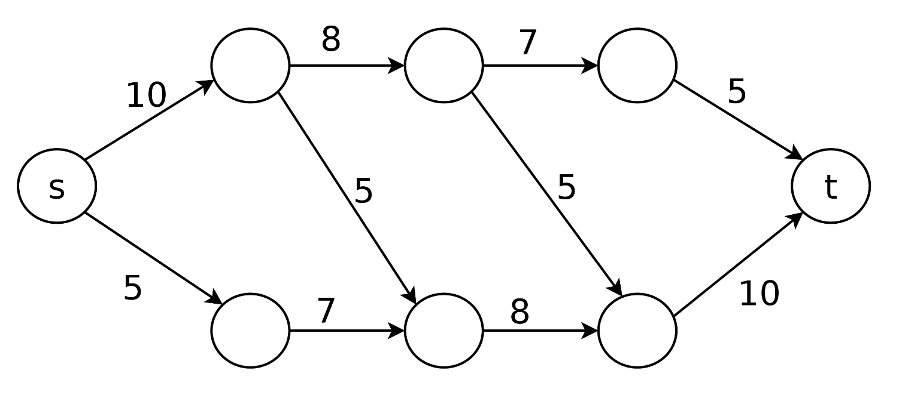{width=60%}

###### **1.1.2 Real-World Applications**
Transportation networks model many practical scenarios:

*   **Computer networks**: Data flows from servers to clients through routers
*   **Transportation systems**: Traffic flows from origin to destination through roads
*   **Supply chains**: Goods flow from factories to stores through distribution centers
*   **Fluid dynamics**: Liquids or gases flow through pipe systems

##### **1.2 Flows in Networks**
A **flow** in a network represents the actual amount of resource moving through each edge at a given time. Unlike capacity (which is a limit), flow is what's actually happening in the network.

###### **1.2.1 Flow Definition**
A flow $f$ in network $N = (V, E, c, s, t)$ is a function $f : E \to \mathbb{R}^+$ that satisfies two critical properties:

**1. Capacity Constraint**: For every edge $e \in E$:
$$0 \le f(e) \le c(e)$$
This means we cannot push more flow through an edge than its capacity allows, and flow cannot be negative.

**2. Conservation of Flow**: For every vertex $v \in V \setminus \{s, t\}$ (all vertices except source and sink):
$$\sum_{w \in V} f(v, w) = \sum_{w' \in V} f(w', v)$$
This means "what flows in must flow out" - the total flow entering a vertex equals the total flow leaving it. The source and sink are exceptions: the source only produces flow, the sink only consumes it.

###### **1.2.2 Flow Notation**
We typically write flows as $\text{flow}/\text{capacity}$. For example:

*   $3/5$ means 3 units of flow through an edge with capacity 5 (room for 2 more)
*   $5/5$ means the edge is **saturated** (full capacity)
*   $0/5$ means no flow through an edge with capacity 5 (completely unused)

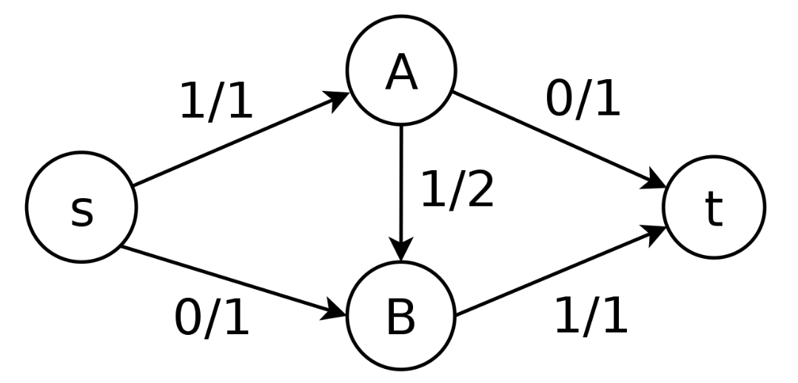{width=60%}

This simple network shows:

*   Source $s$ sends 1 unit to $A$
*   $A$ forwards that 1 unit through $B$ to reach sink $t$
*   Edge $s \to A$ is saturated ($1/1$)
*   Edge $A \to t$ is unused ($0/1$)

###### **1.2.3 Value of a Flow**
The **value** of a flow $f$ is the total amount flowing out of the source:
$$|f| = \sum_{w \in V} f(s, w)$$

This represents the total throughput of the network - how much "stuff" successfully travels from source to sink.

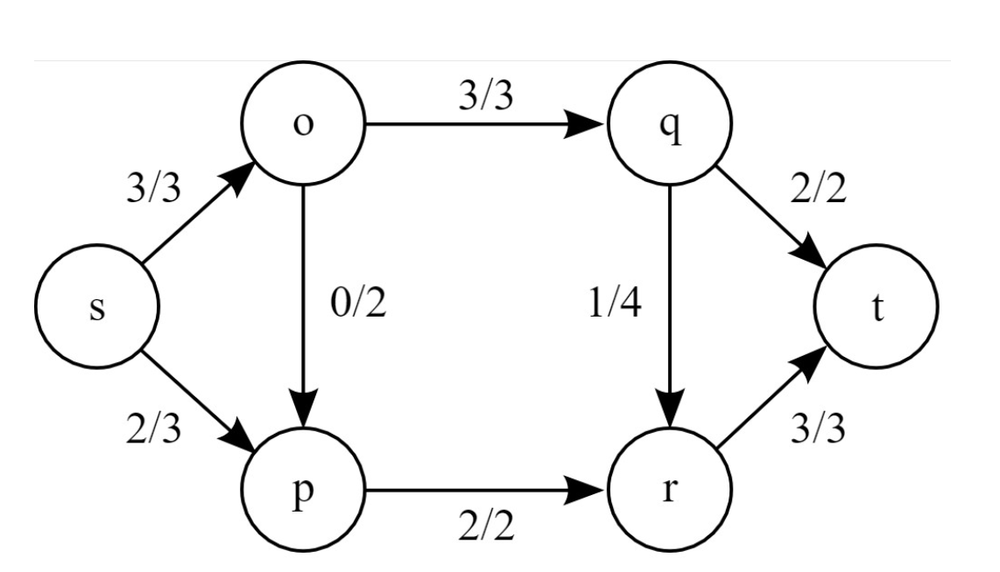{width=60%}

In this example:

*   Source $s$ sends out: $3$ (to $o$) $+ 2$ (to $p$) $= 5$ units total
*   All 5 units eventually reach sink $t$: $2$ (from $q$) $+ 3$ (from $r$) $= 5$ units
*   The flow value is $|f| = 5$

##### **1.3 The Maximum Flow Problem**
The **maximum flow problem** asks: *Given a network, what is the largest possible flow value from source to sink?*

This is one of the most fundamental problems in network optimization. In practical terms:

*   For a water system: How much water can we deliver per hour?
*   For a computer network: What's the maximum data throughput?
*   For a road network: How many vehicles can travel between two cities?

###### **1.3.1 Why a Naive Approach Fails**
A tempting strategy is to repeatedly find any path from $s$ to $t$ with available capacity and push maximum flow through it. This **greedy algorithm** can get stuck at sub-optimal solutions.

Consider this network:

[image here]

If we naively choose paths:

1.  **Step 1**: Path $s \to$ bottom-left $\to$ top-right $\to t$ carries 3 units (limited by $s \to$ bottom-left capacity)
2.  **Step 2**: Path $s \to$ top-left $\to$ top-right $\to t$ carries 2 units (limited by remaining capacity to $t$)

Now we're stuck with flow value 5, but the maximum is actually 6! The problem: we used the diagonal edge in a way that blocks optimal flow distribution.

##### **1.4 Cuts in Networks**
To understand maximum flow, we need to understand **cuts** - partitions of the network that separate source from sink.

###### **1.4.1 Cut Definition**
A **cut** $C$ in network $(V, E, c, s, t)$ is a set of edges such that:

*   There exist sets $S \subseteq V$ and $T \subseteq V$ where:
    *   $S \cup T = V$ (together they include all vertices)
    *   $S \cap T = \emptyset$ (they don't overlap)
    *   $s \in S$ (source is in $S$)
    *   $t \in T$ (sink is in $T$)
*   $C = \{(u, v) \in E \mid u \in S, v \in T\}$ (all edges crossing from $S$ to $T$)

Intuitively, a cut is like drawing a line through the network that separates the source side from the sink side. The cut consists of all edges crossing that line.

###### **1.4.2 Capacity of a Cut**
The **capacity** of cut $C$ is:
$$c(C) = \sum_{e \in C} c(e)$$

This is the sum of capacities of all edges in the cut. The capacity represents a bottleneck: no flow can exceed this value because these edges must carry all flow from $S$ to $T$.

Different cuts have different capacities:

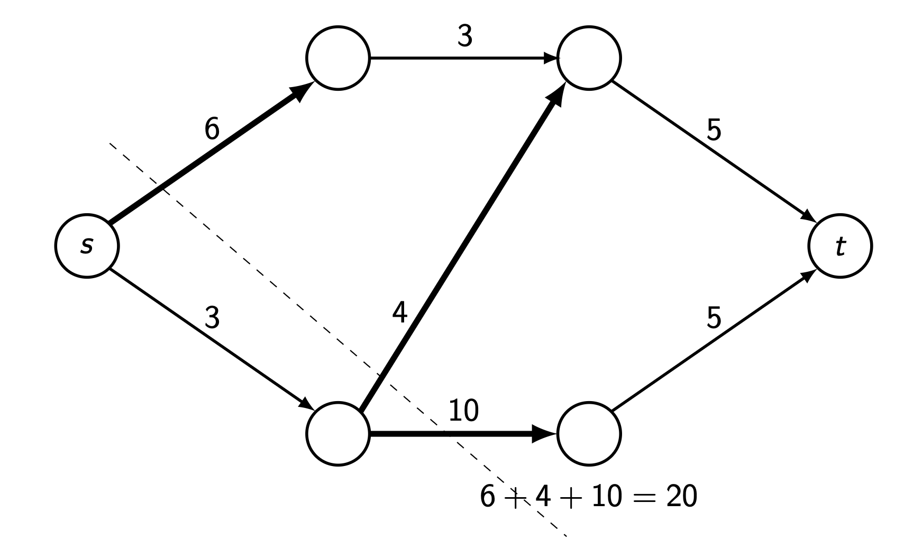{width=70%}

*   **Cut 1** (immediately after source): Cuts edges with capacities $6 + 4 + 10 = 20$

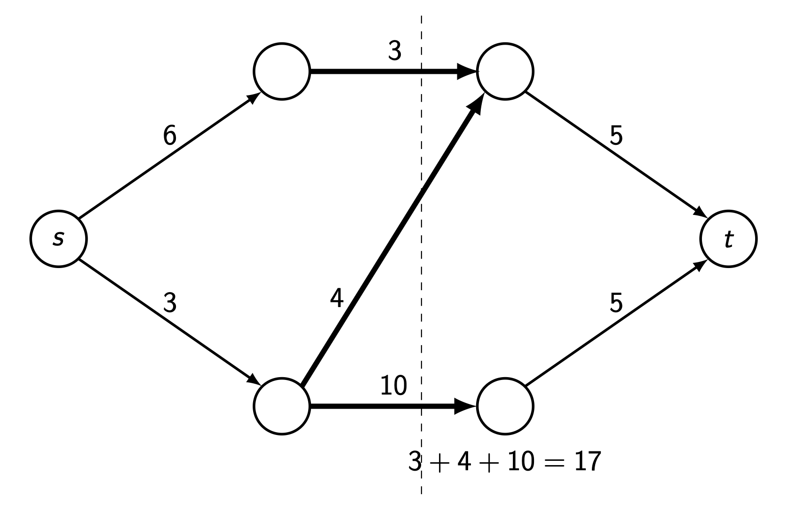{width=70%}

*   **Cut 2** (middle vertical): Cuts edges with capacities $3 + 4 + 10 = 17$

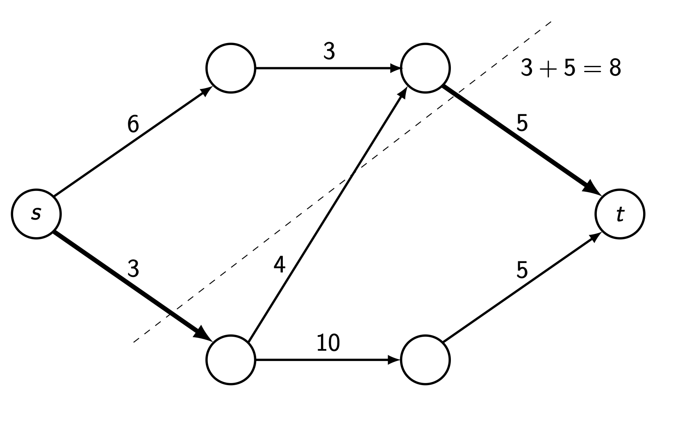{width=70%}

*   **Cut 3** (near sink): Cuts edges with capacities $3 + 5 = 8$

The minimum cut capacity limits how much can flow through the network.

##### **1.5 Max-Flow Min-Cut Theorem**
The **Max-Flow Min-Cut Theorem** (Ford-Fulkerson Theorem) is one of the most beautiful results in graph theory:

**Theorem**: *The maximum value of a flow in a network equals the minimum capacity over all cuts.*

$$\max_{f} |f| = \min_{C} c(C)$$

This means:

*   You cannot push more flow than the minimum cut capacity (it's an upper bound)
*   There exists a flow that achieves exactly this value (it's achievable)

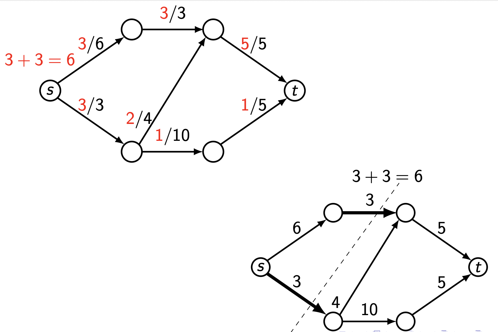{width=60%}

In the example above:

*   The maximum flow is 6 (shown on left)
*   The minimum cut has capacity 6 (shown on right)
*   They're equal, confirming the theorem!

This theorem is profound because it connects two seemingly different concepts: a **maximum** (flow) equals a **minimum** (cut). It gives us a way to verify our answer and understand network bottlenecks.

##### **1.6 The Ford-Fulkerson Algorithm**
The **Ford-Fulkerson algorithm** solves the maximum flow problem by intelligently finding paths and adjusting flow, including the ability to "undo" bad decisions.

###### **1.6.1 Key Insight: Residual Graphs**
The algorithm's brilliance lies in considering **residual graphs**: at each step, we can:

*   Push more flow along an edge if it's not saturated (forward edge)
*   *Reduce* existing flow on an edge by routing flow elsewhere (backward edge)

This ability to "cancel" flow by going backwards is what the naive algorithm lacked.

###### **1.6.2 Algorithm Steps**
**Ford-Fulkerson Algorithm**:

1.  **Initialize**: Set $f(u, v) = 0$ for all edges (start with zero flow)
2.  **While** there exists a path $p$ from $s$ to $t$ in the **residual graph** (ignoring edge directions):
    
    a.  **Find bottleneck**: Calculate
        $$c_f(p) = \min\left(\{c(u, v) - f(u, v) \mid (u, v) \in p \text{ forward}\} \cup \{f(u, v) \mid (u, v) \in p \text{ backward}\}\right)$$
        
    b.  **Update forward edges**: For each forward edge $(u, v)$ in $p$:
        $$f(u, v) := f(u, v) + c_f(p)$$
        
    c.  **Update backward edges**: For each backward edge $(u, v)$ in $p$:
        $$f(u, v) := f(u, v) - c_f(p)$$
3.  **Return**: The maximum flow value is $\sum_{w \in V} f(s, w)$

###### **1.6.3 Why It Works**
By allowing backward traversal, we can "correct" suboptimal earlier choices. When we traverse an edge backwards, we're essentially saying "let's route this flow differently" and freeing up capacity for a better path.

###### **1.6.4 Example Execution**
Let's trace the algorithm on our earlier problematic network:

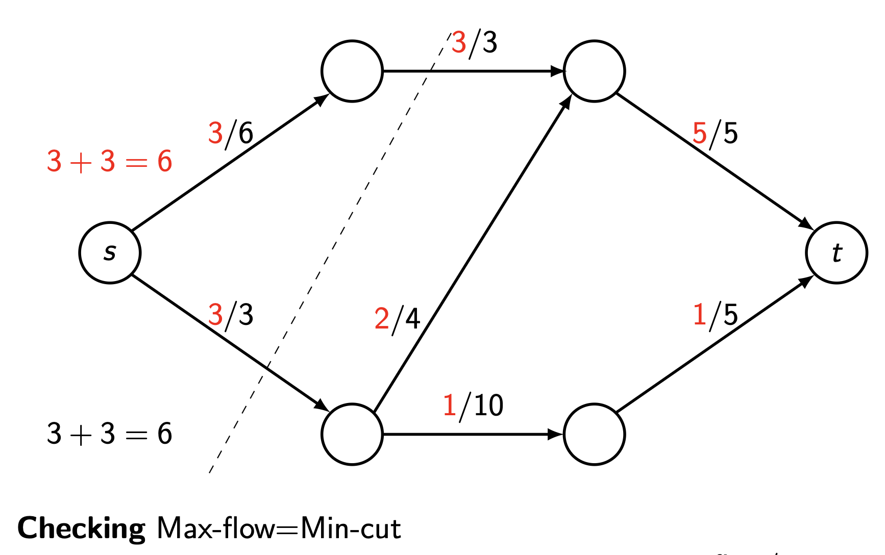{width=60%}

**Step 1**: Initialize all flows to 0

**Step 2**: Find path $s \to$ bottom-left $\to$ top-right $\to t$

*   Bottleneck: $\min(3, 4, 5) = 3$
*   Update flow by $+3$

**Step 3**: Find path $s \to$ top-left $\to$ top-right $\to t$

*   Bottleneck: $\min(6, 3, 5-3) = 2$ (the edge to $t$ has only 2 remaining capacity)
*   Update flow by $+2$
*   Now flow is 5, but top-right $\to t$ is saturated!

**Step 4**: Here's where the algorithm shines. Find path $s \to$ top-left $\to$ top-right $\leftarrow$ bottom-left $\to$ bottom-right $\to t$

*   Note: We go *backwards* from top-right to bottom-left
*   Bottleneck: $\min(6-3, 3-2, 3, 10, 5) = 1$ 
    *   The backward edge has 3 units we can "cancel"
*   Update:
    *   $f(s, \text{top-left}) = 3 + 1 = 4$
    *   $f(\text{top-left}, \text{top-right}) = 2 + 1 = 3$
    *   $f(\text{bottom-left}, \text{top-right}) = 3 - 1 = 2$ (reduced!)
    *   $f(\text{bottom-left}, \text{bottom-right}) = 0 + 1 = 1$
    *   $f(\text{bottom-right}, t) = 0 + 1 = 1$

**Result**: Total flow is now $3 + 3 = 6$, which is maximum!

{width=60%}

We can verify this is optimal by finding the minimum cut (capacity 6), confirming max-flow = min-cut.

##### **1.7 Practical Considerations**
###### **1.7.1 Complexity**
The Ford-Fulkerson algorithm's runtime depends on how we choose augmenting paths:

*   **Basic version**: $O(E \cdot |f^*|)$ where $|f^*|$ is the maximum flow value
*   **Edmonds-Karp** (using BFS for paths): $O(V \cdot E^2)$
*   **Dinic's algorithm**: $O(V^2 \cdot E)$

###### **1.7.2 Uniqueness**
*   The **maximum flow value** is unique
*   The **maximum flow itself** (distribution on edges) may not be unique - multiple optimal configurations can exist
*   The **minimum cut** may not be unique - multiple cuts can achieve minimum capacity

#### **2. Definitions**
*   **Transportation Network**: A directed graph $N = (V, E, c, s, t)$ where $(V, E)$ is a directed graph, $c : E \to \mathbb{R}^+ \cup \{+\infty\}$ is the capacity function, $s$ is the source vertex, and $t$ is the sink vertex.
*   **Capacity**: A function $c : E \to \mathbb{R}^+ \cup \{+\infty\}$ assigning a maximum flow limit to each edge in the network.
*   **Source**: The vertex $s$ in a network where flow originates; it only has outgoing flow.
*   **Sink**: The vertex $t$ in a network where flow terminates; it only has incoming flow.
*   **Flow**: A function $f : E \to \mathbb{R}^+$ satisfying (1) capacity constraint: $0 \le f(e) \le c(e)$ for all $e \in E$, and (2) conservation: $\sum_{w} f(v, w) = \sum_{w'} f(w', v)$ for all $v \in V \setminus \{s, t\}$.
*   **Flow Value**: The total amount of flow leaving the source, calculated as $|f| = \sum_{w \in V} f(s, w)$.
*   **Saturated Edge**: An edge where the flow equals its capacity, i.e., $f(e) = c(e)$, meaning no additional flow can pass through.
*   **Cut**: A partition of vertices into sets $S$ and $T$ where $s \in S$, $t \in T$, $S \cup T = V$, and $S \cap T = \emptyset$. The cut is the set of edges $C = \{(u, v) \in E \mid u \in S, v \in T\}$.
*   **Cut Capacity**: The sum of capacities of all edges in a cut: $c(C) = \sum_{e \in C} c(e)$.
*   **Minimum Cut**: A cut with the smallest possible capacity among all cuts in the network.
*   **Maximum Flow**: A flow with the largest possible value among all valid flows in the network.
*   **Residual Graph**: An augmented version of the network where each edge $(u, v)$ with flow $f(u, v) < c(u, v)$ has forward residual capacity $c(u, v) - f(u, v)$, and each edge with $f(u, v) > 0$ has backward residual capacity $f(u, v)$.
*   **Augmenting Path**: A path from source to sink in the residual graph (allowing both forward and backward traversal) along which additional flow can be pushed.
*   **Bottleneck Capacity**: The minimum residual capacity along an augmenting path, determining how much additional flow can be pushed along that path.

#### **3. Formulas**
*   **Flow Value**: $|f| = \sum_{w \in V} f(s, w)$ - sum of all flows leaving the source
*   **Capacity Constraint**: $0 \le f(e) \le c(e)$ for all $e \in E$
*   **Flow Conservation**: $\sum_{w \in V} f(v, w) = \sum_{w' \in V} f(w', v)$ for all $v \in V \setminus \{s, t\}$
*   **Cut Capacity**: $c(C) = \sum_{e \in C} c(e)$ where $C$ is the set of edges in the cut
*   **Max-Flow Min-Cut Theorem**: $\max_{f} |f| = \min_{C} c(C)$
*   **Residual Capacity (Forward)**: $c_f(u, v) = c(u, v) - f(u, v)$ for edge $(u, v)$
*   **Residual Capacity (Backward)**: $c_f(v, u) = f(u, v)$ for reverse of edge $(u, v)$
*   **Bottleneck of Augmenting Path**: 
$$c_f(p) = \min\left(\{c(u, v) - f(u, v) \mid (u, v) \in p \text{ forward}\} \cup \{f(u, v) \mid (u, v) \in p \text{ backward}\}\right)$$

#### **4. Examples**
##### **4.1. Basic Flow Representation** (Lecture 14, Example 1)
Given the network below with edges labeled as flow/capacity, verify that the flow satisfies conservation.

{width=60%}

Click to see the solution

**Key Concept**: Flow must be conserved at every intermediate vertex - what flows in must flow out.

1.  **Check vertex A**:
    *   Incoming: $1$ (from $s$)
    *   Outgoing: $0$ (to $t$) $+ 1$ (to $B$) $= 1$
    *   Conservation: $1 = 1$ ✓
2.  **Check vertex B**:
    *   Incoming: $1$ (from $A$) $+ 0$ (from $s$) $= 1$
    *   Outgoing: $1$ (to $t$)
    *   Conservation: $1 = 1$ ✓
3.  **Check capacity constraints**:
    *   Edge $s \to A$: $1 \le 1$ ✓
    *   Edge $s \to B$: $0 \le 1$ ✓
    *   Edge $A \to t$: $0 \le 1$ ✓
    *   Edge $A \to B$: $1 \le 2$ ✓
    *   Edge $B \to t$: $1 \le 1$ ✓
4.  **Flow value**: $|f| = 1 + 0 = 1$ (total leaving source)

**Answer**: This is a valid flow with value 1.

##### **4.2. Maximum Flow in Larger Network** (Lecture 14, Example 2)
Find the maximum flow in the network below using the Ford-Fulkerson algorithm.

{width=60%}

Click to see the solution

**Key Concept**: Use Ford-Fulkerson algorithm to iteratively find augmenting paths and push flow.

We'll use the systematic approach of finding paths in the residual graph.

**Initial state**: All flows are 0.

**Iteration 1**:

1.  **Find augmenting path**: $s \to$ (node after $s$ with cap 10) $\to$ (next node with cap 8) $\to$ (node with cap 7) $\to t$ (final edge cap 5)
2.  **Bottleneck**: Consider a simpler path: $s \to$ bottom path $\to t$
    *   Following the bottom route with capacities 5, 7, 8, 10
    *   Bottleneck = $\min(5, 7, 8, 10) = 5$
3.  **Update flow**: Add 5 to this path

After multiple iterations (detailed steps would follow similar pattern), we find paths and adjust flows.

**Final maximum flow**: The algorithm terminates when no augmenting path exists. 

To verify the result, we find the minimum cut. Based on the network structure, the minimum cut would separate the graph such that its capacity equals the maximum flow found.

**Answer**: The maximum flow value depends on the specific path choices, but following Ford-Fulkerson guarantees finding the optimal value that equals the minimum cut capacity.

##### **4.3. Identifying Cuts** (Lecture 14, Example 3)
For the network shown, find three different cuts and calculate their capacities.

{width=70%}

Click to see the solution

**Key Concept**: A cut separates the source from the sink by partitioning vertices into two sets.

**Cut 1 (Immediate source cut)**:

1.  **Partition**: $S = \{s\}$, $T = \{\text{all other vertices}\}$
2.  **Edges crossing**: All edges leaving $s$
3.  **Calculation**: 
    *   $s \to$ top-left: capacity 6
    *   $s \to$ bottom-left: capacity 3
    *   Total: Not visible in this image, but would include the bottom edge
4.  **Capacity**: $6 + 4 + 10 = 20$ (as shown in diagram)

**Cut 2 (Vertical middle cut)**:

{width=70%}

1.  **Partition**: $S = \{s, \text{left vertices}\}$, $T = \{\text{right vertices}, t\}$
2.  **Edges crossing**: Vertical cut through middle
3.  **Calculation**: 
    *   Top horizontal edge: capacity 3
    *   Diagonal edge: capacity 4  
    *   Bottom horizontal edge: capacity 10
4.  **Capacity**: $3 + 4 + 10 = 17$

**Cut 3 (Near sink cut)**:

{width=70%}

1.  **Partition**: $S = \{s, \text{most vertices}\}$, $T = \{\text{near-sink vertices}, t\}$
2.  **Edges crossing**: Edges entering final stage before $t$
3.  **Calculation**:
    *   Top edge to sink region: capacity 3
    *   Bottom edge to sink region: capacity 5
4.  **Capacity**: $3 + 5 = 8$

**Answer**: The three cuts have capacities 20, 17, and 8 respectively. The minimum cut has capacity 8.

##### **4.4. Verifying Max-Flow Min-Cut** (Lecture 14, Example 4)
For the network shown, verify that the maximum flow equals the minimum cut capacity.

{width=60%}

Click to see the solution

**Key Concept**: The Max-Flow Min-Cut Theorem states that these two values must be equal.

**Maximum Flow (left diagram)**:

1.  **Count flow leaving source**:
    *   $s \to$ top-left: $3/6$ (flow = 3)
    *   $s \to$ bottom-left: $3/3$ (flow = 3)
    *   Total flow leaving $s$: $3 + 3 = 6$
2.  **Verify flow entering sink**:
    *   Top-right $\to t$: $5/5$ (flow = 5)
    *   Bottom-right $\to t$: $1/5$ (flow = 1)
    *   Total flow entering $t$: $5 + 1 = 6$ ✓

**Minimum Cut (right diagram)**:

1.  **Identify the cut**: The dashed line shows the partition
2.  **Edges crossed by cut**:
    *   $s \to$ bottom-left: capacity 3 (saturated: $3/3$)
    *   Top-left $\to$ top-right: capacity 3 (saturated: $3/3$)
3.  **Cut capacity**: $3 + 3 = 6$

**Verification**:

*   Maximum flow = 6
*   Minimum cut = 6
*   They are equal ✓

This confirms the Max-Flow Min-Cut Theorem!

**Answer**: Maximum flow = Minimum cut = 6

##### **4.5. Ford-Fulkerson with Backward Edge** (Lecture 14, Example 5)
Apply the Ford-Fulkerson algorithm to find maximum flow, showing how backward edges enable optimal solution.

{width=60%}

Click to see the solution

**Key Concept**: The algorithm can traverse edges backward (reducing their flow) to find better overall solutions.

**Step 1: Initialize**

*   Set all flows to 0
*   Initial flow value: 0

**Step 2: First augmenting path**

1.  **Path**: $s \to$ bottom-left $\to$ top-right $\to t$
2.  **Residual capacities**:
    *   $s \to$ bottom-left: $3 - 0 = 3$
    *   Bottom-left $\to$ top-right: $4 - 0 = 4$
    *   Top-right $\to t$: $5 - 0 = 5$
3.  **Bottleneck**: $\min(3, 4, 5) = 3$
4.  **Update flows**: Add 3 to each edge in path
5.  **New flow value**: $0 + 3 = 3$

**Step 3: Second augmenting path**

1.  **Path**: $s \to$ top-left $\to$ top-right $\to t$
2.  **Residual capacities**:
    *   $s \to$ top-left: $6 - 0 = 6$
    *   Top-left $\to$ top-right: $3 - 0 = 3$
    *   Top-right $\to t$: $5 - 3 = 2$ (already has 3)
3.  **Bottleneck**: $\min(6, 3, 2) = 2$
4.  **Update flows**: Add 2 to each edge
5.  **New flow value**: $3 + 2 = 5$
6.  **Status**: Edge top-right $\to t$ is now saturated ($5/5$)

**Step 4: Path with backward edge**

1.  **Path**: $s \to$ top-left $\to$ top-right $\xleftarrow{\text{backward}}$ bottom-left $\to$ bottom-right $\to t$
2.  **Residual capacities**:
    *   $s \to$ top-left: $6 - 2 = 4$
    *   Top-left $\to$ top-right: $3 - 2 = 1$
    *   **Backward** (bottom-left $\to$ top-right has flow 3, so residual = 3)
    *   Bottom-left $\to$ bottom-right: $10 - 0 = 10$
    *   Bottom-right $\to t$: $5 - 0 = 5$
3.  **Bottleneck**: $\min(4, 1, 3, 10, 5) = 1$
4.  **Update flows**:
    *   $s \to$ top-left: $2 + 1 = 3$
    *   Top-left $\to$ top-right: $2 + 1 = 3$
    *   Bottom-left $\to$ top-right: $3 - 1 = 2$ (reduced!)
    *   Bottom-left $\to$ bottom-right: $0 + 1 = 1$
    *   Bottom-right $\to t$: $0 + 1 = 1$
5.  **New flow value**: $5 + 1 = 6$

**Step 5: Check for more augmenting paths**

*   No path with available residual capacity exists
*   Algorithm terminates

**Verification with minimum cut**:

The minimum cut crosses:
*   $s \to$ bottom-left: capacity 3
*   Top-left $\to$ top-right: capacity 3
*   Total: $3 + 3 = 6$ = Maximum flow ✓

**Answer**: Maximum flow = 6. The backward edge in Step 4 was crucial for achieving optimality.

##### **4.6. Find Minimum Cut for Network A** (Lab 14, Exercise 1a)
Find a cut with the minimum possible capacity for Network A.

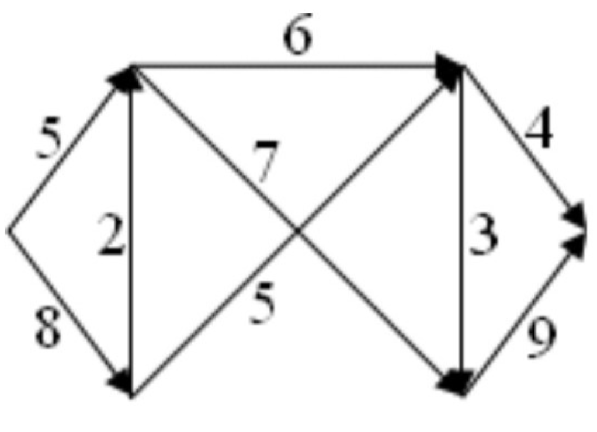{width=60%}

Click to see the solution

**Key Concept**: The minimum cut is the bottleneck that limits flow through the network.

1.  **Analyze the network structure**:
    *   Source has two outgoing edges: capacities 5 (top) and 8 (bottom)
    *   Multiple parallel paths to sink
    *   Complex middle section with crossing edges
2.  **Strategy**: Try different cuts and calculate capacities
3.  **Cut option 1** (separate source):
    *   All edges leaving source
    *   Capacities: $5 + 8 = 13$
4.  **Cut option 2** (middle vertical):
    *   Would need to identify specific edges crossing
5.  **Cut option 3** (near sink):
    *   Edges entering sink: $4 + 9 = 13$
6.  **Better cut** (strategic middle cut):
    *   Based on the network structure, find the narrowest bottleneck
    *   This requires analyzing which combination of edges creates minimum total

**Answer**: The minimum cut would be identified by testing different partitions systematically. The minimum cut capacity will equal the maximum flow value (by the Max-Flow Min-Cut Theorem).

##### **4.7. Maximum Flow for Network A** (Lab 14, Exercise 2a)
Use the Ford-Fulkerson algorithm to find maximum flow for Network A.

{width=60%}

Click to see the solution

**Key Concept**: Apply Ford-Fulkerson algorithm systematically, finding augmenting paths until none remain.

Due to the complexity of this network, we would proceed step-by-step:

**Initialization**:

*   Set all flows to 0

**Iteration process**:

1.  Find any augmenting path from source to sink
2.  Calculate bottleneck capacity
3.  Update flows along the path
4.  Repeat until no augmenting path exists

**Example first iteration**:

1.  **Path**: Source $\to$ top-left $\to$ top-middle $\to$ top-right $\to$ sink
2.  **Capacities along path**: Trace through specific edges
3.  **Bottleneck**: Minimum capacity along path
4.  **Update**: Add bottleneck flow to all edges

**Subsequent iterations**: Would continue finding paths, possibly using backward edges when necessary.

**Termination**: When no path with positive residual capacity exists.

**Answer**: The maximum flow value would be computed through complete algorithm execution. It will equal the minimum cut capacity found in Exercise 1a.

##### **4.8. Find Minimum Cut for Network B** (Lab 14, Exercise 1b)
Find a cut with the minimum possible capacity for Network B.

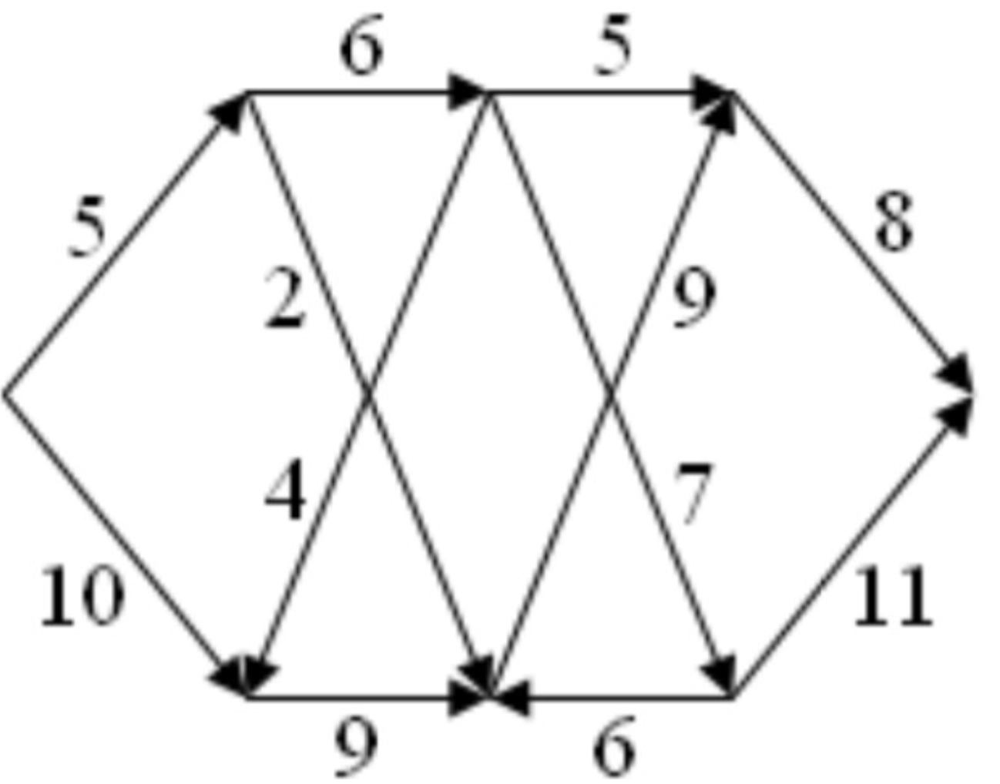{width=60%}

Click to see the solution

!addsolution

##### **4.9. Maximum Flow for Network B** (Lab 14, Exercise 2b)
Use the Ford-Fulkerson algorithm to find maximum flow for Network B.

{width=60%}

Click to see the solution

!addsolution

##### **4.10. Find Minimum Cut for Network C** (Lab 14, Exercise 1c)
Find a cut with the minimum possible capacity for Network C.

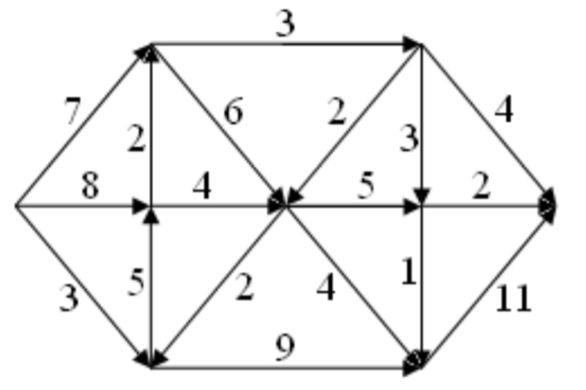{width=60%}

Click to see the solution

!addsolution

##### **4.11. Maximum Flow for Network C** (Lab 14, Exercise 2c)
Use the Ford-Fulkerson algorithm to find maximum flow for Network C.

{width=60%}

Click to see the solution

!addsolution

##### **4.12. Tutorial Example 1** (Tutorial 14, Example 1)
Find the maximum flow for the network with nodes $s, 1, 2, 3, 4, t$ using Ford-Fulkerson algorithm.

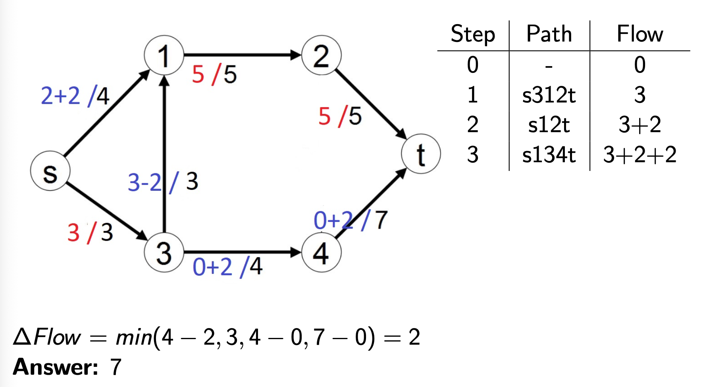{width=60%}

Click to see the solution

**Key Concept**: Systematically apply Ford-Fulkerson, tracking each iteration carefully.

From the table in the image:

| Step | Path | Flow |
|------|------|------|
| 0 | - | 0 |
| 1 | s312t | 3 |
| 2 | s12t | 3+2 |
| 3 | s134t | 3+2+2 |

**Step 0**: Initialize with 0 flow

**Step 1**: Path $s \to 3 \to 1 \to 2 \to t$

1.  **Capacities**: 
    *   $s \to 3$: 3
    *   $3 \to 1$: 3 (going upward)
    *   $1 \to 2$: 5
    *   $2 \to t$: 5
2.  **Bottleneck**: $\min(3, 3, 5, 5) = 3$
3.  **Update**: Add flow of 3 along entire path
4.  **Flow value**: $\Delta\text{Flow} = \min(3-0, 3-0, 5-0, 5-0) = 3$
5.  **Total flow**: 3

**Step 2**: Path $s \to 1 \to 2 \to t$

1.  **Capacities**:
    *   $s \to 1$: 4
    *   $1 \to 2$: $5-3=2$ remaining
    *   $2 \to t$: $5-3=2$ remaining  
2.  **Bottleneck**: $\min(4, 2, 2) = 2$
3.  **Update**: Add flow of 2
4.  **Flow value**: $\Delta\text{Flow} = \min(4-0, 5-3, 5-3) = 2$
5.  **Total flow**: $3+2=5$

**Step 3**: Path $s \to 1 \to 3 \to 4 \to t$

1.  **Note**: The edge $1 \to 3$ goes backward (against the $3 \to 1$ edge used in Step 1)
2.  **Capacities**:
    *   $s \to 1$: $4-2=2$ remaining
    *   Backward $1 \to 3$: 3 units can be "cancelled"
    *   $3 \to 4$: 4
    *   $4 \to t$: 7
3.  **Bottleneck**: $\min(2, 3, 4, 7) = 2$
4.  **Update**: 
    *   Increase $s \to 1$ by 2: total $2+2=4$
    *   **Decrease** $3 \to 1$ by 2: total $3-2=1$
    *   Increase $3 \to 4$ by 2: total $0+2=2$
    *   Increase $4 \to t$ by 2: total $0+2=2$
5.  **Flow value**: $\Delta\text{Flow} = \min(4-2, 3, 4-0, 7-0) = 2$
6.  **Total flow**: $3+2+2=7$

**No more augmenting paths exist**

**Verification with min-cut**: 
The minimum cut crosses $s \to 1$ (capacity 4) and $s \to 3$ (capacity 3), giving total capacity $4+3=7$ ✓

**Answer**: 7

##### **4.13. Tutorial Example 2** (Tutorial 14, Example 2)
Find the maximum flow for another network example.

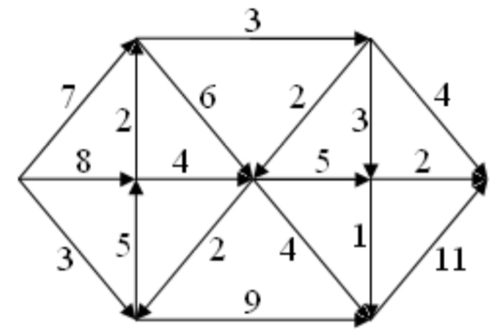{width=60%}

Click to see the solution

**Key Concept**: Apply Ford-Fulkerson algorithm to this network.

**Step 0**: Initialize flows to 0

**Step 1**: Path $s \to 3 \to 4 \to t$

1.  **Residual capacities**: 
    *   $s \to 3$: 5
    *   $3 \to 4$: 2
    *   $4 \to t$: 7
2.  **Bottleneck**: $\min(5, 2, 7) = 2$
3.  **Update**: $\Delta\text{Flow} = \min(5-0, 2-0, 7-0) = 2$
4.  **Total flow**: 2

**Step 2**: Path $s \to 1 \to 2 \to t$

1.  **Residual capacities**:
    *   $s \to 1$: 3
    *   $1 \to 2$: 5
    *   $2 \to t$: 5
2.  **Bottleneck**: $\min(3, 5, 5) = 3$
3.  **Update**: $\Delta\text{Flow} = \min(3-0, 5-0, 5-0) = 3$
4.  **Total flow**: $2+3=5$

**Step 3**: Path $s \to 3 \to 1 \to 2 \to t$

1.  **Note**: Uses edge $3 \to 1$ (there exists an edge with capacity 4 from node 3 to node 1)
2.  **Residual capacities**:
    *   $s \to 3$: $5-2=3$ remaining
    *   $3 \to 1$: 4
    *   $1 \to 2$: $5-3=2$ remaining
    *   $2 \to t$: $5-3=2$ remaining
3.  **Bottleneck**: $\min(3, 4, 2, 2) = 2$
4.  **Update**: $\Delta\text{Flow} = \min(5-2, 4-0, 5-3, 5-3) = 2$
5.  **Total flow**: $2+3+2=7$

**No more augmenting paths**

**Verification**: The min-cut crosses edges with total capacity 7, matching the max-flow ✓

**Answer**: 7

