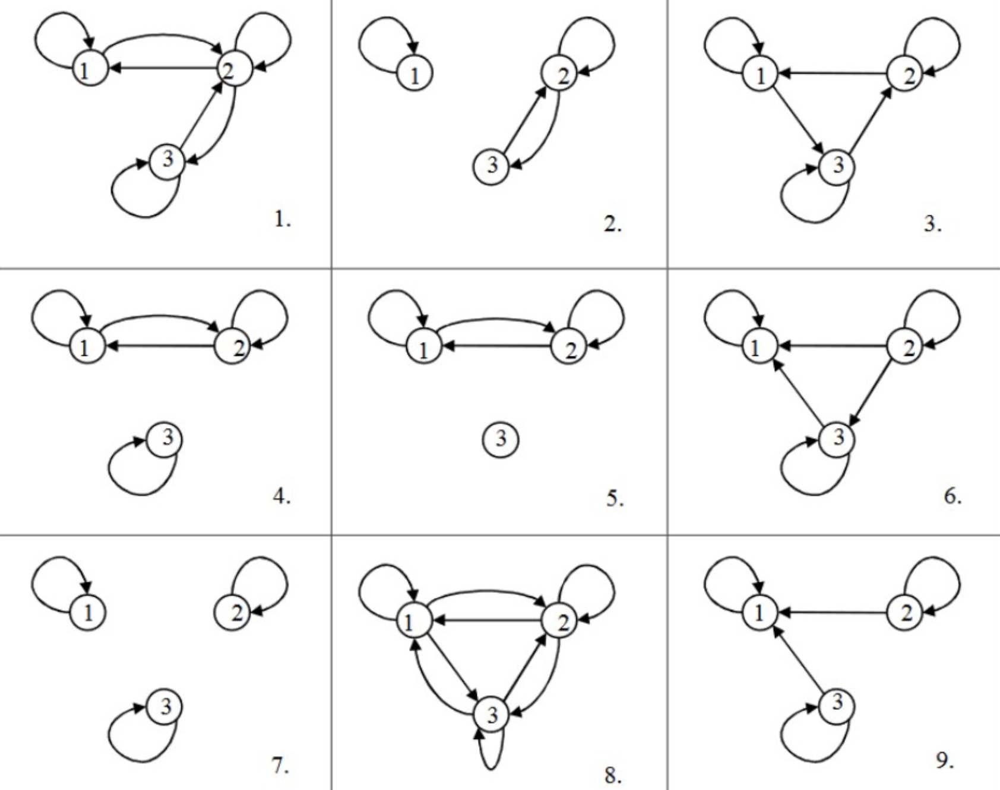

#### **1. Summary**
##### **1.1 Introduction to Relations**
A **relation** is a fundamental concept in mathematics that describes how elements from different sets are connected or associated with each other. Formally, any subset of a Cartesian product of sets is called a relation. If we have sets $X_1, X_2, \ldots, X_n$, then any set $R \subseteq X_1 \times X_2 \times \cdots \times X_n$ is a relation on these sets.

Relations can have different **arities** (number of elements involved). A **unary relation** (arity 1) describes a property of individual elements, like "x is positive" or "a person is a woman." A **binary relation** (arity 2) connects pairs of elements, such as "x is less than y" or "person x is married to person y." Higher-arity relations involve three or more elements, like "x + y = z" connecting three numbers.

###### **1.1.1 Binary Relations**
A **binary relation** $R$ on sets $X$ and $Y$ is any subset $R \subseteq X \times Y$. When $X = Y$, we say $R$ is a binary relation **on** $X$ (rather than "between" two different sets). We write $(x, y) \in R$ or equivalently $xRy$ to indicate that elements $x$ and $y$ are related.

For example, the relation "less than or equal to" on natural numbers $\mathbb{N}$ is the set $\leq = \{(x, y) \in \mathbb{N}^2 \mid x \leq y\}$. This is an infinite set containing pairs like $(1, 1), (1, 2), (1, 3), (2, 2), (2, 3), \ldots$.

##### **1.2 Properties of Binary Relations**
Binary relations can have various important properties that characterize their behavior. Understanding these properties is crucial for classifying relations and studying their applications.

###### **1.2.1 Reflexivity and Irreflexivity**
A relation $R$ on set $X$ is **reflexive** if every element is related to itself: $(\forall x \in X)(xRx)$. For example, "equals" (=) is reflexive because $x = x$ for all $x$. The relation "is less than or equal to" ($\leq$) is also reflexive.

Conversely, a relation is **irreflexive** (also called **anti-reflexive**) if no element is related to itself: $(\forall x \in X)\neg(xRx)$. The relation "less than" (<) is irreflexive because $x < x$ is never true.

**Important:** A relation can be neither reflexive nor irreflexive. For instance, "person x likes person y" may hold for some people with themselves but not others.

###### **1.2.2 Symmetry, Asymmetry, and Anti-symmetry**
A relation $R$ on set $X$ is **symmetric** if whenever $x$ is related to $y$, then $y$ is also related to $x$: $(\forall x, y \in X)(xRy \to yRx)$. Examples include "equals" (if $x = y$ then $y = x$) and "x + y = 0" (if $x + y = 0$ then $y + x = 0$).

A relation is **asymmetric** if whenever $x$ is related to $y$, then $y$ is NOT related to $x$: $(\forall x, y \in X)(xRy \to \neg yRx)$. This is equivalent to saying $(\forall x, y \in X)\neg(xRy \land yRx)$ — you can never have both $xRy$ and $yRx$ simultaneously. The relation "less than" (<) is asymmetric.

A relation is **anti-symmetric** if whenever both $xRy$ and $yRx$ hold, then $x$ must equal $y$: $(\forall x, y \in X)(xRy \land yRx \to x = y)$. The relation "less than or equal to" ($\leq$) is anti-symmetric: if $x \leq y$ and $y \leq x$, then $x = y$. The relation "divides" on natural numbers is also anti-symmetric.

**Key distinction:** Asymmetric implies anti-symmetric AND irreflexive, but anti-symmetric does not imply asymmetric.

###### **1.2.3 Transitivity**
A relation $R$ on set $X$ is **transitive** if whenever $x$ is related to $y$ and $y$ is related to $z$, then $x$ is also related to $z$: $(\forall x, y, z \in X)(xRy \land yRz \to xRz)$. 

Examples of transitive relations:

- "Less than" (<): if $x < y$ and $y < z$, then $x < z$
- "Equals" (=): if $x = y$ and $y = z$, then $x = z$
- "There is a path from city x to city y": if there's a path from x to y and from y to z, there's a path from x to z

Examples of non-transitive relations:

- "x + y = 0": if $2 + (-2) = 0$ and $(-2) + 2 = 0$, it doesn't follow that $2 + 2 = 0$
- "x is a friend of y": friends of friends are not necessarily friends

###### **1.2.4 Connexity**
A relation $R$ on set $X$ is **connex** (also called **total** or **complete**) if for any two elements, at least one direction of the relationship holds: $(\forall x, y \in X)(xRy \lor yRx)$. The relation "less than or equal to" ($\leq$) on numbers is connex because for any two numbers, one is less than or equal to the other.

The relation "is a friend of" is not connex because two people might not be friends in either direction.

##### **1.3 Representations of Binary Relations**
Binary relations can be represented in multiple ways, each offering different insights.

###### **1.3.1 Matrix Representation**
For a relation $R$ on a finite set $X = \{a_1, a_2, \ldots, a_n\}$, we can represent $R$ as an $n \times n$ matrix $M_R = (m_{ij})$ where:
$$m_{ij} = \begin{cases} 1 & \text{if } (a_i, a_j) \in R \\ 0 & \text{if } (a_i, a_j) \notin R \end{cases}$$

This representation makes properties visually apparent:

- **Reflexive**: All 1s on the main diagonal
- **Irreflexive**: All 0s on the main diagonal
- **Symmetric**: Matrix equals its transpose ($M_R = M_R^T$)
- **Anti-symmetric**: If $m_{ij} = 1$ and $i \neq j$, then $m_{ji} = 0$
- **Connex**: For $i \neq j$, cannot have both $m_{ij} = 0$ and $m_{ji} = 0$

###### **1.3.2 Graph Representation**
A relation can be visualized as a **directed graph** (digraph) where:

- **Vertices** (nodes) represent elements of the set
- **Directed edges** (arcs, arrows) represent the relation: an arrow from $a$ to $b$ means $aRb$
- **Loops** (self-loops) at a vertex represent reflexive pairs

Graph properties:

- **Reflexive**: Loop at every vertex
- **Irreflexive**: No loops at any vertex
- **Symmetric**: For every edge from $x$ to $y$, there's an edge from $y$ to $x$ (bidirectional arrows)
- **Asymmetric**: Never two edges in opposite directions between distinct vertices
- **Transitive**: If there's an edge from $x$ to $y$ and from $y$ to $z$, there must be an edge from $x$ to $z$
- **Connex**: Between any two distinct vertices, at least one directed edge exists

##### **1.4 Counting Relations on Finite Sets**
For a finite set $X$ with $n$ elements, we can count how many relations have specific properties.

###### **1.4.1 Total Number of Relations**
Any binary relation on $X$ is a subset of $X \times X$, which has $n^2$ elements (all possible pairs). Since a relation is any subset, the total number of binary relations is $2^{n^2}$.

###### **1.4.2 Reflexive Relations**
For a reflexive relation, all $n$ diagonal elements $(a_i, a_i)$ must be in the relation (fixed as 1). The remaining $n^2 - n = n(n-1)$ pairs can be either included or excluded. Therefore, there are $2^{n(n-1)}$ reflexive relations.

###### **1.4.3 Irreflexive Relations**
Similarly, for irreflexive relations, all $n$ diagonal elements must NOT be in the relation (fixed as 0), giving $2^{n(n-1)}$ irreflexive relations.

###### **1.4.4 Symmetric Relations**
For a symmetric relation, if $(a_i, a_j) \in R$, then $(a_j, a_i) \in R$. We need to count pairs independently:

- Diagonal elements: $n$ choices (each can be 0 or 1)
- Off-diagonal elements: $\frac{n(n-1)}{2}$ independent pairs (choosing one determines the other)

Total: $2^{n + \frac{n(n-1)}{2}} = 2^{\frac{n(n+1)}{2}}$ symmetric relations.

###### **1.4.5 Asymmetric Relations**
For asymmetric relations, diagonal elements must all be 0 (irreflexive). For off-diagonal pairs $(a_i, a_j)$ with $i \neq j$, we have 3 choices: include $(a_i, a_j)$, include $(a_j, a_i)$, or include neither. There are $\frac{n(n-1)}{2}$ such independent pairs.

Total: $3^{\frac{n(n-1)}{2}}$ asymmetric relations.

###### **1.4.6 Anti-symmetric Relations**
For anti-symmetric relations:

- Diagonal elements: $2^n$ choices (each can be 0 or 1)
- Off-diagonal pairs: For each pair $(a_i, a_j)$ with $i \neq j$, we have 3 choices: include $(a_i, a_j)$, include $(a_j, a_i)$, or include neither (but not both)

Total: $2^n \cdot 3^{\frac{n(n-1)}{2}}$ anti-symmetric relations.

###### **1.4.7 Transitive Relations**
Counting transitive relations is extremely difficult — no simple closed formula exists. The count grows much more slowly than $2^{n^2}$ because the transitivity constraint is very restrictive.

##### **1.5 Special Types of Relations**
###### **1.5.1 Partial Order Relations**
A **strict (partial) order** is a binary relation that is:

- Irreflexive: $(\forall x \in X)\neg(xRx)$
- Asymmetric: $(\forall x, y \in X)(xRy \to \neg yRx)$
- Transitive: $(\forall x, y, z \in X)(xRy \land yRz \to xRz)$

Example: "Less than" (<) on numbers.

A **non-strict (partial) order** is a binary relation that is:

- Reflexive: $(\forall x \in X)(xRx)$
- Anti-symmetric: $(\forall x, y \in X)(xRy \land yRx \to x = y)$
- Transitive: $(\forall x, y, z \in X)(xRy \land yRz \to xRz)$

Example: "Less than or equal to" ($\leq$) on numbers.

**Relationship:** A non-strict order can be obtained from a strict order by adding equality: $x \leq y \equiv (x < y \lor x = y)$.

An example of a partial order that's not immediately obvious: For vectors in $\mathbb{R}^n$, we can define $(x_1, \ldots, x_n) \leq (y_1, \ldots, y_n)$ if and only if $x_i \leq y_i$ for all $i$. This is a partial order because some vectors are not comparable (e.g., $(1, 2)$ and $(2, 1)$ are incomparable).

###### **1.5.2 Linear Order Relations**
A **linear order** (also called **total order**) is a non-strict partial order that is also connex:

- Reflexive: $(\forall x \in X)(xRx)$
- Anti-symmetric: $(\forall x, y \in X)(xRy \land yRx \to x = y)$
- Transitive: $(\forall x, y, z \in X)(xRy \land yRz \to xRz)$
- Connex: $(\forall x, y \in X)(xRy \lor yRx)$

Example: "Less than or equal to" ($\leq$) on real numbers. The connexity property means any two elements are comparable.

For a set with $n$ elements, the number of linear orders is $n!$ (n factorial). This is because a linear order corresponds to arranging the elements in a sequence, and there are $n!$ permutations of $n$ elements.

###### **1.5.3 Equivalence Relations**
An **equivalence relation** is a binary relation that is:

- Reflexive: $(\forall x \in X)(xRx)$
- Symmetric: $(\forall x, y \in X)(xRy \to yRx)$
- Transitive: $(\forall x, y, z \in X)(xRy \land yRz \to xRz)$

Common notations for equivalence relations: $=$, $\sim$, $\approx$, $\equiv$

Examples:

- Equality (=) on any set
- "Has the same cardinality as" for sets: $|A| = |B|$
- "Has the same age as" for people (counting only years)
- "Is logically equivalent to" for logical formulas: $\Phi_1 \equiv \Phi_2$

**Equivalence Classes:** An equivalence relation partitions the set into disjoint subsets called **equivalence classes**. An equivalence class is a maximal set of elements that are all equivalent to each other. For any element $x$, its equivalence class is $[x] = \{y \in X \mid x \sim y\}$.

**Main Property:** Two equivalence classes are either identical or disjoint — they cannot partially overlap. This means an equivalence relation creates a **partition** of the set into non-overlapping groups.

##### **1.6 Graph Theory Basics**
###### **1.6.1 Terminology**
The field of graph theory has varied terminology across different texts and contexts. Frank Harary, a pioneer in graph theory, noted that "even the very word 'graph' has not been sacrosanct" and recommended that speakers clarify their terminology in advance.

A **directed graph** (digraph) is essentially equivalent to a binary relation. Common alternative terms:

| Mathematical Term | Graph Theory Terms |
|:------------------|:-------------------|
| Elements | Vertices, nodes, points |
| Relations | Edges, arcs, lines, links |

###### **1.6.2 Properties in Graph Language**
All the relation properties we've discussed can be expressed in graph-theoretic terms:

- **Reflexive**: Loop at every vertex
- **Irreflexive**: No loops
- **Symmetric**: Bidirectional edges between all connected vertices
- **Asymmetric**: No bidirectional edges (all edges are one-way)
- **Transitive**: If there's an edge $x \to y$ and an edge $y \to z$, there must be an edge $x \to z$
- **Connex**: Between any two distinct vertices, at least one directed edge exists

#### **2. Definitions**
*   **Relation**: Any set $R \subseteq X_1 \times X_2 \times \cdots \times X_n$ on sets $X_1, X_2, \ldots, X_n$.
*   **Binary Relation**: A set $R \subseteq X \times Y$ relating elements of set $X$ to elements of set $Y$. When $X = Y$, it's a binary relation on $X$.
*   **Reflexive**: A relation $R$ on $X$ where $(\forall x \in X)(xRx)$ — every element is related to itself.
*   **Irreflexive (Anti-reflexive)**: A relation $R$ on $X$ where $(\forall x \in X)\neg(xRx)$ — no element is related to itself.
*   **Symmetric**: A relation $R$ on $X$ where $(\forall x, y \in X)(xRy \to yRx)$ — if $x$ relates to $y$, then $y$ relates to $x$.
*   **Asymmetric**: A relation $R$ on $X$ where $(\forall x, y \in X)(xRy \to \neg yRx)$ — if $x$ relates to $y$, then $y$ does not relate to $x$.
*   **Anti-symmetric**: A relation $R$ on $X$ where $(\forall x, y \in X)(xRy \land yRx \to x = y)$ — if both $xRy$ and $yRx$ hold, then $x$ equals $y$.
*   **Transitive**: A relation $R$ on $X$ where $(\forall x, y, z \in X)(xRy \land yRz \to xRz)$ — if $x$ relates to $y$ and $y$ relates to $z$, then $x$ relates to $z$.
*   **Connex (Total, Complete)**: A relation $R$ on $X$ where $(\forall x, y \in X)(xRy \lor yRx)$ — for any two elements, at least one direction of relation holds.
*   **Strict Partial Order**: A relation that is irreflexive, asymmetric, and transitive.
*   **Non-strict Partial Order**: A relation that is reflexive, anti-symmetric, and transitive.
*   **Linear Order (Total Order)**: A relation that is reflexive, anti-symmetric, transitive, and connex.
*   **Equivalence Relation**: A relation that is reflexive, symmetric, and transitive.
*   **Equivalence Class**: For an equivalence relation $\sim$ on $X$ and element $x \in X$, the set $[x] = \{y \in X \mid x \sim y\}$ of all elements equivalent to $x$.
*   **Directed Graph (Digraph)**: A visual representation of a binary relation with vertices (elements) connected by directed edges (arrows).

#### **3. Formulas**
*   **Total Number of Binary Relations on $n$ Elements**: $2^{n^2}$
*   **Number of Reflexive Relations on $n$ Elements**: $2^{n(n-1)}$
*   **Number of Irreflexive Relations on $n$ Elements**: $2^{n(n-1)}$
*   **Number of Symmetric Relations on $n$ Elements**: $2^{\frac{n(n+1)}{2}}$
*   **Number of Asymmetric Relations on $n$ Elements**: $3^{\frac{n(n-1)}{2}}$
*   **Number of Anti-symmetric Relations on $n$ Elements**: $2^n \cdot 3^{\frac{n(n-1)}{2}}$
*   **Number of Linear Orders on $n$ Elements**: $n!$
*   **Asymmetric Relation Equivalence**: A relation is asymmetric if and only if it is both anti-symmetric and irreflexive.
*   **Matrix Element Definition**: For relation $R$ on $\{a_1, \ldots, a_n\}$, $m_{ij} = 1$ if $(a_i, a_j) \in R$, else $m_{ij} = 0$.
*   **Non-strict from Strict Order**: $x \leq y \equiv (x < y \lor x = y)$

#### **4. Examples**
##### **4.1. "Father of" Relation Properties** (Tutorial 10, Example 1)
Let $X$ be the set of all humans, and define $R(x, y) \iff x$ is "a father of" $y$. Determine which properties this relation has.

Click to see the solution

**Key Concept:** Check each property definition against the real-world meaning of the relation.

1.  **Reflexive?** $(\forall x \in X)(xRx)$
    *   This would mean every person is their own father.
    *   **Answer: No** — this is clearly false.

2.  **Irreflexive?** $(\forall x \in X)\neg(xRx)$
    *   This means no person is their own father.
    *   **Answer: Yes** — this is true.

3.  **Symmetric?** $(\forall x, y \in X)(xRy \to yRx)$
    *   This would mean if $x$ is a father of $y$, then $y$ is a father of $x$.
    *   **Answer: No** — children are not fathers of their fathers.

4.  **Asymmetric?** $(\forall x, y \in X)(xRy \to \neg yRx)$
    *   This means if $x$ is a father of $y$, then $y$ is not a father of $x$.
    *   **Answer: Yes** — this is true (the relation only goes in one direction).

5.  **Anti-symmetric?** $(\forall x, y \in X)(xRy \land yRx \to x = y)$
    *   Since the premise $xRy \land yRx$ is always false (you can't have both $x$ is father of $y$ AND $y$ is father of $x$), the implication is vacuously true.
    *   **Answer: Yes** — vacuously true.

6.  **Transitive?** $(\forall x, y, z \in X)(xRy \land yRz \to xRz)$
    *   This would mean if $x$ is a father of $y$, and $y$ is a father of $z$, then $x$ is a father of $z$.
    *   But this describes grandfather, not father.
    *   **Answer: No** — grandfathers are not fathers.

7.  **Connex?** $(\forall x, y \in X)(xRy \lor yRx)$
    *   This would mean for any two people, one is a father of the other.
    *   **Answer: No** — most pairs of people have no father-child relationship.

**Answer:** Irreflexive, asymmetric, and anti-symmetric.

##### **4.2. Matrix Relation Properties (1)** (Tutorial 10, Example 2)
Consider a relation $R$ on set $\{a, b, c\}$ represented by the matrix:
$$\begin{pmatrix} 1 & 1 & 1 \\ 0 & 0 & 1 \\ 0 & 0 & 0 \end{pmatrix}$$

Determine all properties of this relation.

Click to see the solution

1.  **Reflexive?** Check the main diagonal: $(1, 1), (2, 2), (3, 3)$
    *   Diagonal elements: $m_{11} = 1$, $m_{22} = 0$, $m_{33} = 0$
    *   **Answer: No** — not all diagonal elements are 1.

2.  **Irreflexive?** Check if all diagonal elements are 0.
    *   Diagonal has $m_{11} = 1$
    *   **Answer: No** — at least one diagonal element is 1.

3.  **Symmetric?** Check if $m_{ij} = m_{ji}$ for all $i, j$.
    *   $m_{12} = 1$ but $m_{21} = 0$ (not equal)
    *   **Answer: No** — matrix is not symmetric.

4.  **Asymmetric?** Check if whenever $m_{ij} = 1$, we have $m_{ji} = 0$.
    *   $m_{11} = 1$ and $m_{11} = 1$ (both are 1, violates asymmetric for $i = j$)
    *   **Answer: No** — has a reflexive pair.

5.  **Anti-symmetric?** Check if $m_{ij} = 1$ and $m_{ji} = 1$ implies $i = j$.
    *   For all off-diagonal pairs where $m_{ij} = 1$, we check $m_{ji}$:
    *   $m_{12} = 1, m_{21} = 0$ ✓
    *   $m_{13} = 1, m_{31} = 0$ ✓
    *   $m_{23} = 1, m_{32} = 0$ ✓
    *   **Answer: Yes** — no two distinct elements have bidirectional relation.

6.  **Transitive?** Check if $m_{ij} = 1$ and $m_{jk} = 1$ implies $m_{ik} = 1$.
    *   $m_{12} = 1, m_{23} = 1$: need $m_{13} = 1$ ✓ (it is)
    *   Check all other combinations...
    *   **Answer: Yes** — all transitivity conditions are satisfied.

7.  **Connex?** Check if for all $x, y \in X$, we have $xRy \lor yRx$.
    *   The definition requires $(\forall x, y \in X)(xRy \lor yRx)$, which includes the case $x = y$.
    *   For $x = y$, this means $xRx \lor xRx = xRx$.
    *   Checking diagonal elements: $m_{11} = 1$ ✓, $m_{22} = 0$ ✗, $m_{33} = 0$ ✗
    *   Since elements 2 and 3 don't relate to themselves, the relation is not connex.
    *   **Answer: No** — not all elements satisfy $xRx$.

**Answer: Yes** for anti-symmetric and transitive; **No** for all others.

##### **4.3. Graph Relation Properties** (Tutorial 10, Example 3)
Consider the directed graph with vertices $\{a_1, a_2, a_3\}$ and edges: $a_1 \to a_1$ (loop), $a_1 \to a_2$, $a_2 \to a_3$, $a_1 \to a_3$. Determine the properties of this relation.

<!-- DIAGRAM HERE -->

Click to see the solution

1.  **Reflexive?** Check if every vertex has a loop.
    *   $a_1$ has a loop ✓
    *   $a_2$ has no loop ✗
    *   $a_3$ has no loop ✗
    *   **Answer: No**

2.  **Irreflexive?** Check if no vertex has a loop.
    *   $a_1$ has a loop
    *   **Answer: No**

3.  **Symmetric?** Check if every edge has a reverse edge.
    *   Edge $a_1 \to a_2$ exists, but $a_2 \to a_1$ does not exist
    *   **Answer: No**

4.  **Asymmetric?** Check if no two distinct vertices have edges in both directions, AND no loops.
    *   There's a loop at $a_1$, which violates asymmetry
    *   **Answer: No**

5.  **Anti-symmetric?** Check if there are no bidirectional edges between distinct vertices.
    *   No two distinct vertices have edges in both directions
    *   **Answer: Yes**

6.  **Transitive?** Check if $x \to y$ and $y \to z$ implies $x \to z$.
    *   $a_1 \to a_2$ and $a_2 \to a_3$: need $a_1 \to a_3$ ✓ (present)
    *   $a_1 \to a_1$ and $a_1 \to a_2$: need $a_1 \to a_2$ ✓ (present)
    *   $a_1 \to a_1$ and $a_1 \to a_3$: need $a_1 \to a_3$ ✓ (present)
    *   $a_1 \to a_2$ and $a_2 \to a_3$: already checked
    *   All transitivity conditions satisfied
    *   **Answer: Yes**

7.  **Connex?** Check if between any two distinct vertices, at least one directed edge exists. Also need all elements to be self-related.
    *   Elements $a_2$ and $a_3$ don't have loops, so they're not related to themselves
    *   **Answer: No**

**Answer:** Anti-symmetric and transitive only.

##### **4.4. Total Number of Relations** (Tutorial 10, Example 4)
What is the number of all binary relations on a set with $n$ elements?

Click to see the solution

**Key Concept:** A binary relation on a set $X$ is any subset of $X \times X$.

1.  **Count total pairs:** For a set with $n$ elements, $X \times X$ has $n^2$ ordered pairs: $\{(a_i, a_j) \mid 1 \leq i \leq n, 1 \leq j \leq n\}$.

2.  **Count subsets:** Any binary relation is a subset of $X \times X$. A set with $n^2$ elements has $2^{n^2}$ subsets (each element can be either included or excluded independently).

**Answer:** $2^{n^2}$

##### **4.5. Number of Reflexive Relations** (Tutorial 10, Example 5)
What is the number of all reflexive relations on a set with $n$ elements?

Click to see the solution

**Key Concept:** For reflexive relations, all diagonal elements are fixed (must be included), but other elements are free to choose.

1.  **Fixed elements:** All $n$ diagonal pairs $(a_i, a_i)$ must be in the relation (reflexivity requirement).

2.  **Free elements:** The remaining $n^2 - n = n(n-1)$ non-diagonal pairs can either be included or excluded.

3.  **Count possibilities:** For the $n(n-1)$ free pairs, we have $2^{n(n-1)}$ ways to choose subsets.

**Answer:** $2^{n(n-1)}$

##### **4.6. Number of Irreflexive Relations** (Tutorial 10, Example 6)
What is the number of all irreflexive relations on a set with $n$ elements?

Click to see the solution

**Key Concept:** For irreflexive relations, all diagonal elements are fixed (must be excluded), reasoning is similar to reflexive case.

1.  **Fixed elements:** All $n$ diagonal pairs $(a_i, a_i)$ must NOT be in the relation (irreflexivity requirement).

2.  **Free elements:** The remaining $n^2 - n = n(n-1)$ non-diagonal pairs can either be included or excluded.

3.  **Count possibilities:** $2^{n(n-1)}$ ways.

**Answer:** $2^{n(n-1)}$

##### **4.7. Number of Symmetric Relations** (Tutorial 10, Example 7)
What is the number of all symmetric relations on a set with $n$ elements?

Click to see the solution

**Key Concept:** For symmetric relations, if we include $(a_i, a_j)$, we must include $(a_j, a_i)$. So pairs come in linked groups (except diagonal).

1.  **Diagonal elements:** Each of the $n$ diagonal pairs $(a_i, a_i)$ can independently be included or excluded: $2^n$ choices.

2.  **Off-diagonal elements:** For $i \neq j$, pairs $(a_i, a_j)$ and $(a_j, a_i)$ must be chosen together. There are $\frac{n^2 - n}{2} = \frac{n(n-1)}{2}$ such independent pairs (counting each unordered pair $\{i, j\}$ once).

3.  **Total count:** $2^n \times 2^{\frac{n(n-1)}{2}} = 2^{n + \frac{n(n-1)}{2}} = 2^{\frac{n(n+1)}{2}}$

**Answer:** $2^{\frac{n(n+1)}{2}}$

##### **4.8. Number of Asymmetric Relations** (Tutorial 10, Example 8)
What is the number of all asymmetric relations on a set with $n$ elements?

Click to see the solution

**Key Concept:** Asymmetric relations are both anti-symmetric and irreflexive. For each unordered pair of distinct elements, we have 3 choices.

1.  **Diagonal elements:** All must be excluded (irreflexive), so no choice: $1$ way.

2.  **Off-diagonal pairs:** For distinct elements $a_i$ and $a_j$ (with $i < j$), we have 3 possibilities:
    *   Include $(a_i, a_j)$ but not $(a_j, a_i)$
    *   Include $(a_j, a_i)$ but not $(a_i, a_j)$
    *   Include neither $(a_i, a_j)$ nor $(a_j, a_i)$
    
    There are $\frac{n(n-1)}{2}$ such unordered pairs.

3.  **Total count:** $3^{\frac{n(n-1)}{2}}$

**Answer:** $3^{\frac{n(n-1)}{2}}$

##### **4.9. Number of Anti-symmetric Relations** (Tutorial 10, Example 9)
What is the number of all anti-symmetric relations on a set with $n$ elements?

Click to see the solution

**Key Concept:** Anti-symmetric means we cannot have both $(a_i, a_j)$ and $(a_j, a_i)$ for distinct $i, j$. Diagonal elements are free.

1.  **Diagonal elements:** Each of the $n$ diagonal pairs $(a_i, a_i)$ can independently be included or excluded: $2^n$ choices.

2.  **Off-diagonal pairs:** For each unordered pair of distinct elements $\{a_i, a_j\}$ with $i \neq j$, we have 3 possibilities:
    *   Include $(a_i, a_j)$ but not $(a_j, a_i)$
    *   Include $(a_j, a_i)$ but not $(a_i, a_j)$
    *   Include neither
    
    There are $\frac{n(n-1)}{2}$ such unordered pairs.

3.  **Total count:** $2^n \times 3^{\frac{n(n-1)}{2}}$

**Answer:** $2^n \cdot 3^{\frac{n(n-1)}{2}}$

##### **4.10. Number of Transitive Relations** (Tutorial 10, Example 10)
What is the number of all transitive relations on a set with $n$ elements?

Click to see the solution

**Key Concept:** There is no simple closed formula for counting transitive relations. The count depends heavily on $n$ and grows much slower than $2^{n^2}$.

The source material provides a table of values:

| Elements ($n$) | Any Relations | Transitive | Reflexive | Symmetric |
|:--------------:|:-------------:|:----------:|:---------:|:---------:|
| 1 | 2 | 2 | 1 | 2 |
| 2 | 16 | 13 | 4 | 8 |
| 3 | 512 | 171 | 64 | 64 |
| 4 | 65536 | 3994 | 4096 | 1024 |
| $n$ | $2^{n^2}$ | ??? | $2^{n(n-1)}$ | $2^{\frac{n(n+1)}{2}}$ |

**Answer:** No simple formula exists. For small $n$: 2 (n=1), 13 (n=2), 171 (n=3), 3994 (n=4).

##### **4.11. Number of Linear Orders** (Tutorial 10, Example 11)
What is the number of all linear orders on a set with $n$ elements?

Click to see the solution

**Key Concept:** A linear order on a finite set corresponds to a complete ordering (permutation) of the elements.

A linear order must be reflexive, anti-symmetric, transitive, and connex. The connexity property means every pair of distinct elements must be comparable — one must be "less than or equal to" the other.

For $n$ elements, a linear order is equivalent to arranging them in a sequence: $a_{i_1} \leq a_{i_2} \leq \cdots \leq a_{i_n}$. The number of such sequences is the number of permutations of $n$ elements.

**Answer:** $n!$

##### **4.12. Line Crossing Relation** (Lab 10, Problem 1a)
Consider the relation "line $x$ crosses line $y$" on the set of lines on a plane. Determine the properties of this relation.

Click to see the solution

1.  **Reflexive?** Does a line cross itself?
    *   **Answer: No** — a line doesn't cross itself.

2.  **Irreflexive?** Does no line cross itself?
    *   **Answer: Yes** — no line crosses itself.

3.  **Symmetric?** If line $x$ crosses line $y$, does line $y$ cross line $x$?
    *   **Answer: Yes** — crossing is mutual.

4.  **Asymmetric?** If line $x$ crosses line $y$, does line $y$ NOT cross line $x$?
    *   **Answer: No** — crossing is symmetric, not asymmetric.

5.  **Anti-symmetric?** If line $x$ crosses line $y$ and line $y$ crosses line $x$, does $x = y$?
    *   If two lines cross each other, they cross each other (symmetric), but they're not the same line.
    *   **Answer: No** — distinct lines can cross.

6.  **Transitive?** If line $x$ crosses line $y$ and line $y$ crosses line $z$, does line $x$ cross line $z$?
    *   Counterexample: Three lines meeting at a point, where line 1 crosses line 2, line 2 crosses line 3, but lines 1 and 3 are parallel (don't cross).
    *   **Answer: No** — not transitive.

7.  **Connex?** For any two lines, does one cross the other?
    *   Counterexample: Parallel lines don't cross.
    *   **Answer: No** — parallel lines exist.

**Answer:** Irreflexive and symmetric only.

##### **4.13. "More Than By 2" Relation** (Lab 10, Problem 1b)
Consider the relation "number $x$ is more than number $y$ by 2" on the set of natural numbers. Determine the properties of this relation.

Click to see the solution

The relation is: $xRy \iff x = y + 2$

1.  **Reflexive?** Is $x = x + 2$ for all $x$?
    *   **Answer: No** — never true.

2.  **Irreflexive?** Is $x \neq x + 2$ for all $x$?
    *   **Answer: Yes** — always true.

3.  **Symmetric?** If $x = y + 2$, is $y = x + 2$?
    *   If $x = y + 2$, then $y = x - 2 \neq x + 2$
    *   **Answer: No** — not symmetric.

4.  **Asymmetric?** If $x = y + 2$, is $y \neq x + 2$?
    *   Yes, if $x = y + 2$, then $y = x - 2$, so $y \neq x + 2$
    *   **Answer: Yes** — asymmetric.

5.  **Anti-symmetric?** If $x = y + 2$ and $y = x + 2$, does $x = y$?
    *   The premise is impossible (would require $x = x + 4$), so vacuously true
    *   **Answer: Yes** — vacuously true.

6.  **Transitive?** If $x = y + 2$ and $y = z + 2$, is $x = z + 2$?
    *   From $x = y + 2$ and $y = z + 2$, we get $x = (z + 2) + 2 = z + 4 \neq z + 2$
    *   **Answer: No** — not transitive.

7.  **Connex?** For any two natural numbers $x$ and $y$, is $x = y + 2$ or $y = x + 2$?
    *   Counterexample: For $x = 1, y = 5$, neither $1 = 5 + 2$ nor $5 = 1 + 2$ is true.
    *   **Answer: No** — not connex.

**Answer:** Irreflexive, asymmetric, and anti-symmetric.

##### **4.14. Divisibility Relation** (Lab 10, Problem 1c)
Consider the relation "number $x$ is divisible by number $y$" (denoted $y \mid x$) on the set of natural numbers. Determine the properties of this relation.

Click to see the solution

1.  **Reflexive?** Is every number divisible by itself?
    *   **Answer: Yes** — $n \mid n$ for all natural numbers $n$.

2.  **Irreflexive?** Is no number divisible by itself?
    *   **Answer: No** — every number is divisible by itself.

3.  **Symmetric?** If $y \mid x$, is $x \mid y$?
    *   Counterexample: $2 \mid 4$ but $4 \nmid 2$
    *   **Answer: No** — not symmetric.

4.  **Asymmetric?** If $y \mid x$, is $x \nmid y$?
    *   Counterexample: $1 \mid 1$ (reflexive pairs violate asymmetry)
    *   **Answer: No** — not asymmetric.

5.  **Anti-symmetric?** If $y \mid x$ and $x \mid y$, does $x = y$?
    *   If $y \mid x$ and $x \mid y$, then $x = ky$ and $y = mx$ for natural numbers $k, m$.
    *   This gives $x = k(mx) = kmx$, so $km = 1$, which means $k = m = 1$, thus $x = y$.
    *   **Answer: Yes** — anti-symmetric.

6.  **Transitive?** If $z \mid y$ and $y \mid x$, is $z \mid x$?
    *   If $y = kz$ and $x = my$, then $x = m(kz) = (mk)z$, so $z \mid x$
    *   **Answer: Yes** — transitive.

7.  **Connex?** For any two natural numbers $x$ and $y$, is $x \mid y$ or $y \mid x$?
    *   Counterexample: $2 \nmid 3$ and $3 \nmid 2$
    *   **Answer: No** — not connex.

**Answer:** Reflexive, anti-symmetric, and transitive (it's a non-strict partial order).

##### **4.15. Matrix Properties (2)** (Lab 10, Problem 2)
For each of the following matrices, determine the properties of the corresponding relation on set $\{a, b, c, d\}$:

**(Matrix 1)**
$$\begin{pmatrix} 1 & 0 & 1 & 0 \\ 1 & 1 & 0 & 0 \\ 0 & 0 & 1 & 1 \\ 0 & 1 & 0 & 1 \end{pmatrix}$$

**(Matrix 2)**
$$\begin{pmatrix} 0 & 1 & 0 & 1 \\ 1 & 0 & 1 & 0 \\ 0 & 1 & 0 & 1 \\ 1 & 0 & 1 & 0 \end{pmatrix}$$

**(Matrix 3)**
$$\begin{pmatrix} 1 & 0 & 0 & 0 \\ 0 & 1 & 1 & 0 \\ 0 & 0 & 1 & 1 \\ 0 & 0 & 0 & 1 \end{pmatrix}$$

**(Matrix 4)**
$$\begin{pmatrix} 1 & 1 & 1 & 1 \\ 0 & 0 & 1 & 1 \\ 0 & 1 & 1 & 1 \\ 0 & 1 & 0 & 0 \end{pmatrix}$$

Click to see the solution

**Matrix 1:**

1.  **Reflexive?** Diagonal: $(1, 1, 1, 1)$ — **Yes**
2.  **Irreflexive?** Has 1s on diagonal — **No**
3.  **Symmetric?** Check if $m_{ij} = m_{ji}$:
    *   $m_{12} = 0, m_{21} = 1$ (different) — **No**
4.  **Asymmetric?** Has reflexive pairs — **No**
5.  **Anti-symmetric?** Check pairs with both directions = 1:
    *   No such pairs exist for distinct elements — **Yes**
6.  **Transitive?** Check all $m_{ij} = 1, m_{jk} = 1 \implies m_{ik} = 1$:
    *   $m_{13} = 1, m_{34} = 1$: need $m_{14} = 0$ — **No**
7.  **Connex?** Check all distinct pairs:
    *   $(a,b)$: $m_{12} = 0, m_{21} = 1$ ✓
    *   $(a,c)$: $m_{13} = 1, m_{31} = 0$ ✓
    *   $(a,d)$: $m_{14} = 0, m_{41} = 0$ ✗ — **No**

**Answer for Matrix 1:** Reflexive and anti-symmetric.

**Matrix 2:**

1.  **Reflexive?** Diagonal: $(0, 0, 0, 0)$ — **No**
2.  **Irreflexive?** All diagonal elements are 0 — **Yes**
3.  **Symmetric?** Check if $m_{ij} = m_{ji}$:
    *   $m_{12} = 1, m_{21} = 1$ ✓
    *   $m_{13} = 0, m_{31} = 0$ ✓
    *   $m_{14} = 1, m_{41} = 1$ ✓
    *   $m_{23} = 1, m_{32} = 1$ ✓
    *   $m_{24} = 0, m_{42} = 0$ ✓
    *   $m_{34} = 1, m_{43} = 1$ ✓
    *   **Yes** — symmetric
4.  **Asymmetric?** Has bidirectional edges — **No**
5.  **Anti-symmetric?** Has pairs with both directions = 1 for distinct elements — **No**
6.  **Transitive?** 
    *   $m_{12} = 1, m_{23} = 1$: need $m_{13} = 0$ — **No**
7.  **Connex?** No reflexive pairs, so not connex — **No**

**Answer for Matrix 2:** Irreflexive and symmetric.

**Matrix 3:**

1.  **Reflexive?** Diagonal: $(1, 1, 1, 1)$ — **Yes**
2.  **Irreflexive?** — **No**
3.  **Symmetric?** $m_{23} = 1, m_{32} = 0$ — **No**
4.  **Asymmetric?** Has reflexive pairs — **No**
5.  **Anti-symmetric?** No bidirectional pairs for distinct elements — **Yes**
6.  **Transitive?** 
    *   Check $m_{23} = 1, m_{34} = 1$: requires $m_{24} = 1$ for transitivity
    *   Row 2 = $(0, 1, 1, 0)$, so $m_{24} = 0$ — **No**
7.  **Connex?** $(a, b)$: $m_{12} = 0, m_{21} = 0$ — **No**

**Answer for Matrix 3:** Reflexive and anti-symmetric.

**Matrix 4:**

1.  **Reflexive?** Diagonal: $(1, 0, 1, 0)$ — **No**
2.  **Irreflexive?** — **No**
3.  **Symmetric?** $m_{12} = 1, m_{21} = 0$ — **No**
4.  **Asymmetric?** — **No**
5.  **Anti-symmetric?** Check: $(b, c)$: $m_{23} = 1, m_{32} = 1$ but $b \neq c$ — **No**
6.  **Transitive?** Many violations — **No**
7.  **Connex?** Element 2 and 4 not self-related — **No**

**Answer for Matrix 4:** None of the standard properties.

##### **4.16. Graph Properties from Diagrams** (Lab 10, Problem 3)
For each of the nine directed graphs shown (with vertices {1, 2, 3}), determine which are reflexive, symmetric, and transitive.

{width=60%}

Click to see the solution

We write **R** for reflexive, **S** for symmetric, and **T** for transitive.

1. **Graph 1**  
   - Every vertex has a loop $\Rightarrow$ **R**.  
   - For each edge between distinct vertices (1–2 and 2–3) the reverse edge is also present $\Rightarrow$ **S**.  
   - There is a path $1 \to 2 \to 3$ but no edge $1 \to 3$, so it is **not T**.  
   - **Conclusion:** R, S, not T.

2. **Graph 2**  
   - Vertex 3 has no loop $\Rightarrow$ **not R**.  
   - The only non‑loop edges are between 2 and 3 in both directions, so every edge has its reverse $\Rightarrow$ **S**.  
   - From $3 \to 2$ and $2 \to 3$ we would need $3 \to 3$ for transitivity, which is missing $\Rightarrow$ **not T**.  
   - **Conclusion:** S, not R, not T.

3. **Graph 3**  
   - Every vertex has a loop $\Rightarrow$ **R**.  
   - Around the triangle the edges go in one direction only, so some edges do not have their reverses $\Rightarrow$ **not S**.  
   - For example, $1 \to 2$ and $2 \to 3$ hold but there is no $1 \to 3$ $\Rightarrow$ **not T**.  
   - **Conclusion:** R, not S, not T.

4. **Graph 4**  
   - Every vertex has a loop $\Rightarrow$ **R**.  
   - Between 1 and 2 we have edges both ways, and there are no edges between $\{1,2\}$ and 3, so every non‑loop edge has its reverse $\Rightarrow$ **S**.  
   - This is exactly the equivalence relation with classes $\{1,2\}$ and $\{3\}$, hence **T**.  
   - **Conclusion:** R, S, T.

5. **Graph 5**  
   - Vertex 3 has no loop $\Rightarrow$ **not R**.  
   - Between 1 and 2 we have edges in both directions, and there are no other non‑loop edges $\Rightarrow$ **S**.  
   - Any composable pair of edges starts and ends within $\{1,2\}$, and those compositions are present, so the relation is **T**.  
   - **Conclusion:** S, T, not R.

6. **Graph 6**  
   - Every vertex has a loop $\Rightarrow$ **R**.  
   - Between each pair of distinct vertices we have edges in both directions, so every edge has its reverse $\Rightarrow$ **S**.  
   - This is the universal relation on $\{1,2,3\}$ (all ordered pairs), which is clearly **T**.  
   - **Conclusion:** R, S, T.

7. **Graph 7**  
   - Only loops, one at each vertex, so every vertex is related to itself $\Rightarrow$ **R**.  
   - Every edge is of the form $(i,i)$, whose reverse is itself, so **S**.  
   - Any composable pair $(i,i)$, $(i,i)$ yields $(i,i)$, which is present, so **T**.  
   - **Conclusion:** R, S, T.

8. **Graph 8**  
   - Every vertex has a loop $\Rightarrow$ **R**.  
   - For each edge between distinct vertices, the reverse edge is also present $\Rightarrow$ **S**.  
   - Whenever there is a path $i \to j \to k$, the direct edge $i \to k$ is also in the diagram, so the relation is **T**.  
   - **Conclusion:** R, S, T.

9. **Graph 9**  
   - Every vertex has a loop $\Rightarrow$ **R**.  
   - There are edges $1 \to 2$ and $1 \to 3$ without the reverse edges $2 \to 1$ and $3 \to 1$, so **not S**.  
   - Any composable non‑loop pair starts at 1 and ends at 1, 2, or 3; all necessary compositions already appear (e.g., from $1 \to 2$ and $2 \to 2$ we still get $1 \to 2$), so the relation is **T**.  
   - **Conclusion:** R, T, not S.

