#### **1. Summary**
##### **1.1 Planar Graphs**
###### **1.1.1 Definition of Planar Graphs**
A **planar graph** is a graph that can be drawn on a flat surface (a plane) in such a way that no edges cross each other, except at their endpoints (vertices). This special drawing is called a **plane embedding** (or planar embedding) of the graph.

The key insight is that a graph being planar is an *intrinsic property* of the graph itself—it doesn't matter how the graph is initially drawn. If you can *somehow* redraw it without crossings, then it's planar. Many graphs that appear to have crossing edges can actually be redrawn to eliminate those crossings.

For example, the complete graph $K_4$ (4 vertices where every vertex connects to every other) can be drawn as a square with both diagonals, but it can also be drawn as a triangle with one vertex in the center—both are valid plane embeddings with no crossings.

###### **1.1.2 Examples of Planar and Non-Planar Graphs**
**Complete Graphs $K_n$:**

The complete graph $K_n$ has $n$ vertices where every pair of vertices is connected by an edge.

*   $K_2$: Two vertices connected by one edge — **planar**
*   $K_3$: A triangle — **planar**
*   $K_4$: A tetrahedron graph — **planar** (can be drawn as a triangle with a central vertex)
*   $K_5$: Five vertices, each connected to all others — **NOT planar**
*   $K_6$, $K_7$, ...: All **NOT planar** (they contain $K_5$ as a subgraph)

**Complete Bipartite Graphs $K_{m,n}$:**

The complete bipartite graph $K_{m,n}$ has two sets of vertices (of sizes $m$ and $n$) where every vertex in one set connects to every vertex in the other set.

*   $K_{2,3}$: **planar**
*   $K_{2,4}$: **planar**
*   $K_{2,n}$ for any $n$: **planar** (can always be drawn without crossings)
*   $K_{3,3}$: **NOT planar** (known as the "utility graph" or "three houses, three utilities" problem)
*   $K_{3,5}$, $K_{4,4}$, ...: All **NOT planar** (they contain $K_{3,3}$ as a subgraph)

##### **1.2 Euler's Formula**
###### **1.2.1 Faces of a Plane Graph**
When a planar graph is drawn on a plane without crossings, it divides the plane into regions called **faces**. A **face** is a region bounded by edges. This includes:

*   **Interior faces**: The bounded regions enclosed by edges
*   **Exterior face** (or infinite face): The unbounded region outside the graph

For example, a triangle drawn on a plane has exactly 2 faces: one interior face (the region inside the triangle) and one exterior face (everything outside).

###### **1.2.2 Euler's Formula Statement and Proof**
**Euler's Formula** is a fundamental relationship for connected planar graphs:

$$v - e + f = 2$$

where:

*   $v$ = number of vertices
*   $e$ = number of edges
*   $f$ = number of faces (including the exterior face)

**Proof by Induction on the Number of Faces:**

**Base Case ($f = 1$):** If the graph has only one face (the exterior face), then the graph contains no cycles—it must be a tree. For a tree with $v$ vertices, we have $e = v - 1$ edges. Therefore: $v - (v-1) + 1 = v - v + 1 + 1 = 2$. ✓

**Inductive Step:** Assume the formula holds for all plane embeddings with fewer than $f$ faces, where $f \geq 2$.

Consider a plane embedding $P(G)$ with $f \geq 2$ faces. Since there are at least 2 faces, there must be at least one cycle in the graph. Let $e$ be an edge that lies on some cycle.

When we remove this edge $e$, the graph $G - e$ remains connected (because the edge was part of a cycle, so there's still an alternative path). The plane embedding $P(G - e)$ has $f - 1$ faces, because removing edge $e$ merges the two faces that were on either side of it into one face.

By the induction hypothesis:
$$v_{G-e} - e_{G-e} + (f - 1) = 2$$

Since $v_{G-e} = v_G$ (same vertices) and $e_{G-e} = e_G - 1$ (one fewer edge):
$$v_G - (e_G - 1) + (f - 1) = 2$$
$$v_G - e_G + 1 + f - 1 = 2$$
$$v_G - e_G + f = 2$$

Thus, Euler's formula holds. ∎

###### **1.2.3 Euler's Formula for Convex Polyhedra**
Euler's formula also applies to convex polyhedra (3D shapes with flat faces). The surface of any convex polyhedron can be "flattened" into a planar graph, so:

$$V - E + F = 2$$

where $V$ = vertices, $E$ = edges, $F$ = faces of the polyhedron.

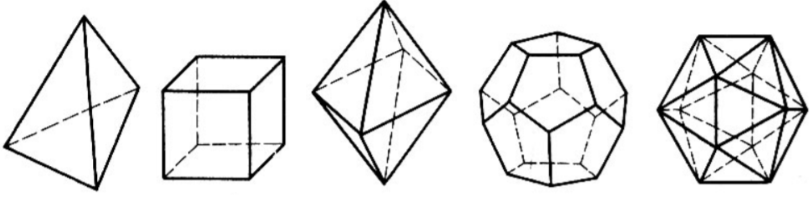

Examples with the five Platonic solids:

*   **Tetrahedron**: $V=4$, $E=6$, $F=4$ → $4 - 6 + 4 = 2$ ✓
*   **Cube (Hexahedron)**: $V=8$, $E=12$, $F=6$ → $8 - 12 + 6 = 2$ ✓
*   **Octahedron**: $V=6$, $E=12$, $F=8$ → $6 - 12 + 8 = 2$ ✓
*   **Dodecahedron**: $V=20$, $E=30$, $F=12$ → $20 - 30 + 12 = 2$ ✓
*   **Icosahedron**: $V=12$, $E=30$, $F=20$ → $12 - 30 + 20 = 2$ ✓

##### **1.3 Corollaries of Euler's Formula**
###### **1.3.1 Edge Bound for Planar Graphs**
**Corollary 1:** If $G$ is a planar graph with $v \geq 3$ vertices, then:
$$e \leq 3v - 6$$

**Proof:** Each face is bounded by at least 3 edges (since a face must form a cycle of at least length 3). Each edge can border at most 2 faces. Therefore:
$$3f \leq 2e$$

From Euler's formula, $f = e - v + 2$:
$$3(e - v + 2) \leq 2e$$
$$3e - 3v + 6 \leq 2e$$
$$e \leq 3v - 6$$ ∎

**Important:** This is a *necessary* condition for planarity, not a *sufficient* one. A graph can satisfy $e \leq 3v - 6$ and still be non-planar!

###### **1.3.2 Proving $K_5$ is Non-Planar**
**Corollary 2:** $K_5$ is not planar.

**Proof:** For $K_5$: $v = 5$ and $e = \binom{5}{2} = 10$.

If $K_5$ were planar, then by Corollary 1:
$$e \leq 3v - 6$$
$$10 \leq 3(5) - 6 = 9$$

But $10 \leq 9$ is false. Contradiction! Therefore, $K_5$ is not planar. ∎

###### **1.3.3 Proving $K_{3,3}$ is Non-Planar**
**Corollary 3:** $K_{3,3}$ is not planar.

Note: We cannot use Corollary 1 directly here. For $K_{3,3}$: $v = 6$, $e = 9$, and $9 \leq 3(6) - 6 = 12$ is true! So we need a different approach.

**Proof:** For $K_{3,3}$: $v = 6$, $e = 9$.

If $K_{3,3}$ were planar, by Euler's formula: $f = e - v + 2 = 9 - 6 + 2 = 5$ faces.

Since $K_{3,3}$ is a **bipartite graph**, it contains no odd cycles. In particular, it has no triangles. Therefore, every face must be bounded by at least **4** edges (not 3).

So: $4f \leq 2e$, which gives us $4(5) \leq 2(9)$, i.e., $20 \leq 18$.

This is false! Contradiction. Therefore, $K_{3,3}$ is not planar. ∎

##### **1.4 Kuratowski's Theorem**
###### **1.4.1 Subdivision of a Graph**
An edge $e = uv$ is **subdivided** when it is replaced by a path $u - x - v$ by introducing a new vertex $x$ in the middle of the edge. A **subdivision** of a graph $G$ is any graph obtained from $G$ by performing a sequence of such edge subdivisions.

Intuitively, subdividing an edge just adds a "bend point" in the middle of an edge—it doesn't fundamentally change the structure of the graph.

**Key Lemma:** A graph is planar if and only if all of its subdivisions are planar.

This makes sense: adding points along edges doesn't create or remove crossings.

###### **1.4.2 Kuratowski's Theorem Statement**
**Kuratowski's Theorem** provides a complete characterization of planar graphs:

> A graph is planar **if and only if** it does not contain a subgraph that is a subdivision of $K_5$ or $K_{3,3}$.

In other words:

*   If you can find a subdivision of $K_5$ or $K_{3,3}$ hiding inside your graph, then the graph is **NOT planar**
*   If no such subdivision exists, then the graph **IS planar**

This theorem tells us that $K_5$ and $K_{3,3}$ are the "minimal" non-planar graphs—every non-planar graph must contain one of them (or their subdivisions) as a subgraph.

##### **1.5 Graph Colourings**
###### **1.5.1 Definition of Graph Colouring**
A **$k$-colouring** of a graph $G$ is an assignment of "colours" (typically represented by integers $1, 2, \ldots, k$) to the vertices of $G$. Formally, it's a function:
$$\alpha : V_G \to \{1, 2, \ldots, k\}$$

A colouring is called **proper** if no two adjacent vertices have the same colour. That is, for every edge $uv \in E_G$, we have $\alpha(u) \neq \alpha(v)$.

A graph $G$ is **$k$-colourable** if there exists a proper $k$-colouring for $G$.

###### **1.5.2 Chromatic Number**
The **chromatic number** $\chi(G)$ of a graph $G$ is the minimum number of colours needed to properly colour the graph:
$$\chi(G) = \min\{k \mid G \text{ is } k\text{-colourable}\}$$

**Special cases:**

*   $\chi(G) = 0$ if and only if $V_G = \emptyset$ (empty graph)
*   $\chi(G) = 1$ if and only if $G$ has no edges (null graph $O_n$)
*   $\chi(K_n) = n$ (complete graph requires $n$ colours since every vertex is adjacent to every other)

###### **1.5.3 The Four Colour Theorem**
**Four Colour Theorem:** Every planar graph is 4-colourable.

This famous theorem states that $\chi(G) \leq 4$ for any planar graph $G$. This means any map can be coloured with at most 4 colours such that no two adjacent regions share the same colour.

###### **1.5.4 Bipartite Graphs and 2-Colouring**
**Theorem:** The following are equivalent:

1. $\chi(G) = 2$
2. $G$ is a non-trivial bipartite graph
3. All cycles in $G$ have even length

This means a graph can be 2-coloured (using just two colours) if and only if it contains no odd-length cycles. This is because in a bipartite graph, we can colour one partition with one colour and the other partition with another colour.

##### **1.6 Graph Searching Algorithms**
###### **1.6.1 Depth-First Search (DFS)**
**Depth-First Search (DFS)** is a graph traversal algorithm that explores as far as possible along each branch before backtracking.

**Algorithm:**

1. Start at an arbitrary vertex (mark it as visited)
2. From the current vertex, move to an unvisited adjacent vertex
3. Repeat step 2 until no unvisited adjacent vertices exist
4. Backtrack to the previous vertex and try other unvisited neighbors
5. Continue until all reachable vertices are visited

DFS explores "deep" into the graph first, only backtracking when it reaches a dead end.

###### **1.6.2 Breadth-First Search (BFS)**
**Breadth-First Search (BFS)** is a graph traversal algorithm that explores all neighbors at the current depth level before moving to vertices at the next depth level.

**Algorithm:**

1. Start at an arbitrary vertex (mark it as visited)
2. Visit all unvisited neighbors of the current vertex
3. Move to the next "level" and visit all unvisited neighbors of those vertices
4. Continue level by level until all reachable vertices are visited

BFS explores the graph in "layers" or "waves" emanating from the starting vertex.

**Application:** BFS can be used to prove that a graph is bipartite (2-colourable). If during BFS traversal we can assign alternating colours to successive levels without conflicts, the graph is bipartite.

#### **2. Definitions**
*   **Planar Graph**: A graph that can be drawn on a plane without any edges crossing except at their endpoints.
*   **Plane Embedding**: A specific drawing of a planar graph on a plane with no edge crossings.
*   **Face**: A region bounded by edges in a plane embedding, including the unbounded exterior face.
*   **Exterior Face (Infinite Face)**: The unbounded region outside all edges in a plane embedding.
*   **Subdivision**: A graph obtained by replacing edges with paths through new intermediate vertices.
*   **$k$-Colouring**: An assignment of $k$ colours to the vertices of a graph.
*   **Proper Colouring**: A colouring where no two adjacent vertices share the same colour.
*   **$k$-Colourable**: A graph that admits a proper $k$-colouring.
*   **Chromatic Number $\chi(G)$**: The minimum number of colours needed to properly colour graph $G$.
*   **Depth-First Search (DFS)**: A graph traversal that explores as far as possible along each branch before backtracking.
*   **Breadth-First Search (BFS)**: A graph traversal that explores all vertices at the current depth before moving to the next depth level.
*   **Bipartite Graph**: A graph whose vertices can be divided into two disjoint sets such that every edge connects a vertex in one set to a vertex in the other set.

#### **3. Formulas**
*   **Euler's Formula (Planar Graphs)**: $v - e + f = 2$, where $v$ = vertices, $e$ = edges, $f$ = faces
*   **Edge Bound for Planar Graphs**: If $G$ is planar with $v \geq 3$, then $e \leq 3v - 6$
*   **Edge Bound for Bipartite Planar Graphs**: If $G$ is a bipartite planar graph with $v \geq 3$, then $e \leq 2v - 4$
*   **Face-Edge Inequality (General)**: $3f \leq 2e$ (each face has $\geq 3$ edges, each edge borders $\leq 2$ faces)
*   **Face-Edge Inequality (Bipartite)**: $4f \leq 2e$ (bipartite graphs have no triangles, so each face has $\geq 4$ edges)
*   **Chromatic Number of Complete Graph**: $\chi(K_n) = n$
*   **Chromatic Number of Null Graph**: $\chi(O_n) = 1$ (no edges)
*   **Chromatic Number of Bipartite Graph**: $\chi(G) = 2$ if $G$ is a non-trivial bipartite graph
*   **Chromatic Number of Odd Cycle**: $\chi(C_{2k+1}) = 3$
*   **Chromatic Number of Even Cycle**: $\chi(C_{2k}) = 2$
*   **Four Colour Theorem**: $\chi(G) \leq 4$ for any planar graph $G$

#### **4. Examples**
##### **4.1. Show That Graphs Are Planar** (Lab 13, Exercise 1)
Show (draw) that the following graphs are planar:

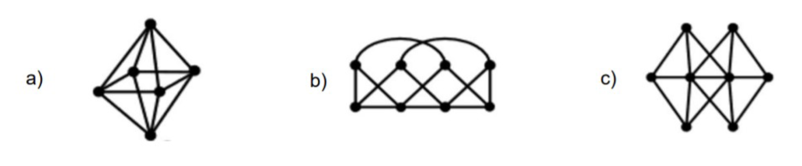{width=60%}

Click to see the solution

!addsolution

##### **4.2. Determine Planarity of Two Graphs** (Lab 13, Exercise 2)
Are the following graphs planar? Explain your answer.

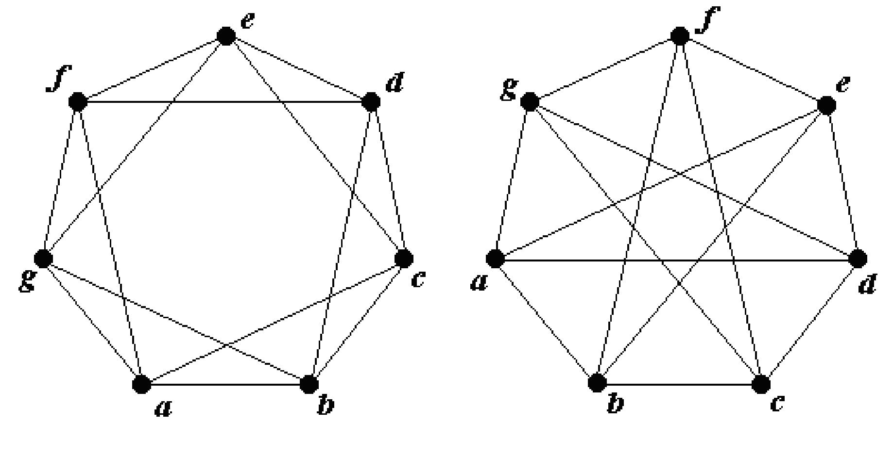{width=60%}

Click to see the solution

!addsolution

##### **4.3. Prove $K_5 - e$ is Planar** (Lab 13, Exercise 3)
Prove that $K_5 - e$ is planar for any edge $e$.

Click to see the solution

**Key Concept:** Removing any edge from $K_5$ reduces it enough to become planar.

1.  **Properties of $K_5 - e$:**
    *   Vertices: $v = 5$
    *   Edges: $e = \binom{5}{2} - 1 = 10 - 1 = 9$
2.  **Check edge bound:**
    $$e \leq 3v - 6$$
    $$9 \leq 3(5) - 6 = 9$$ ✓
    
    The edge bound is satisfied (exactly at the limit).
3.  **Construct planar embedding:**
    *   Label vertices as $1, 2, 3, 4, 5$
    *   Without loss of generality, assume edge $(1, 2)$ is removed
    *   Draw vertex 1 in the center of a square formed by vertices 2, 3, 4, 5
    *   All edges from vertex 1 to 3, 4, 5 can be drawn inside
    *   The edges 2-3, 3-4, 4-5, 5-2, 2-4, 3-5 form the outer structure
    *   Since edge (1,2) is missing, no crossing occurs
4.  **Verify no $K_5$ or $K_{3,3}$ subdivision exists:**
    *   $K_5 - e$ cannot contain $K_5$ (it has fewer edges)
    *   $K_5 - e$ cannot contain $K_{3,3}$ (only 5 vertices, $K_{3,3}$ needs 6)

**Answer:** $K_5 - e$ is planar because it satisfies the edge bound $e \leq 3v - 6$ and can be drawn without crossings. The removal of any single edge from $K_5$ eliminates the property that made $K_5$ non-planar.

##### **4.4. Prove $K_{3,3} - e$ is Planar** (Lab 13, Exercise 4)
Prove that $K_{3,3} - e$ is planar for any edge $e$.

Click to see the solution

**Key Concept:** Removing any edge from $K_{3,3}$ breaks the structure that made it non-planar.

1.  **Properties of $K_{3,3} - e$:**
    *   Vertices: $v = 6$
    *   Edges: $e = 3 \times 3 - 1 = 9 - 1 = 8$
2.  **Check edge bound for bipartite graphs:**
    For bipartite graphs (no odd cycles): $e \leq 2v - 4$
    $$8 \leq 2(6) - 4 = 8$$ ✓
    
    The bound is satisfied exactly.
3.  **Construct planar embedding:**
    *   Let the two partitions be $\{a_1, a_2, a_3\}$ and $\{b_1, b_2, b_3\}$
    *   Without loss of generality, remove edge $(a_1, b_1)$
    *   Draw $a_1$ at the top, $b_1$ at the bottom
    *   Arrange other vertices to form a planar layout:
        - Place $a_2, a_3$ on the left and $b_2, b_3$ on the right
        - Draw remaining 8 edges without crossings
4.  **Why it works:**
    *   $K_{3,3}$ fails the bipartite edge bound: $9 > 2(6) - 4 = 8$
    *   Removing one edge brings it exactly to the boundary
    *   The removed edge eliminates the "conflict" that caused non-planarity

**Answer:** $K_{3,3} - e$ is planar because removing any edge reduces the edge count to exactly satisfy the bipartite planarity bound, and a planar embedding can be constructed.

##### **4.5. Find Chromatic Numbers** (Lab 13, Exercise 5)
Find the chromatic number of the following graphs:

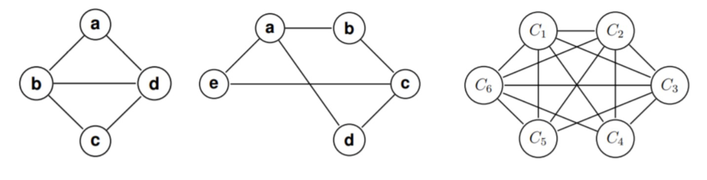{width=60%}

Click to see the solution

!addsolution

##### **4.6. Simple Planarity Check** (Tutorial 13, Example 1)
Is the following graph planar? A "diamond" shaped graph with 4 vertices and crossing internal edges.

Click to see the solution

**Key Concept:** Redraw the graph to eliminate crossings.

1.  **Original drawing:** A diamond with 4 vertices and a vertical and horizontal line through the center, creating crossings.
2.  **Redraw without crossings:**
    *   Keep the diamond shape (4 outer edges)
    *   One internal edge (say vertical) stays inside
    *   The other internal edge (horizontal) is drawn as a curve going around the outside of the diamond

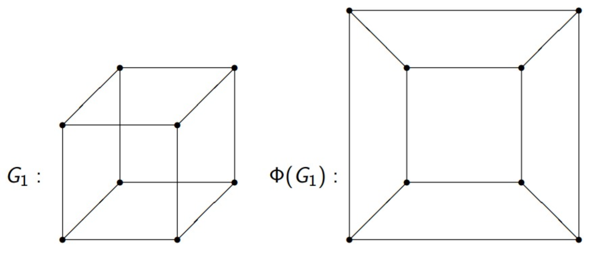{width=60%}

3.  **Result:** The graph can be embedded in the plane without crossings.

**Answer:** Yes, the graph is planar.

##### **4.7. Planarity of $K_{2,3}$** (Tutorial 13, Example 2)
Is the complete bipartite graph $K_{2,3}$ planar?

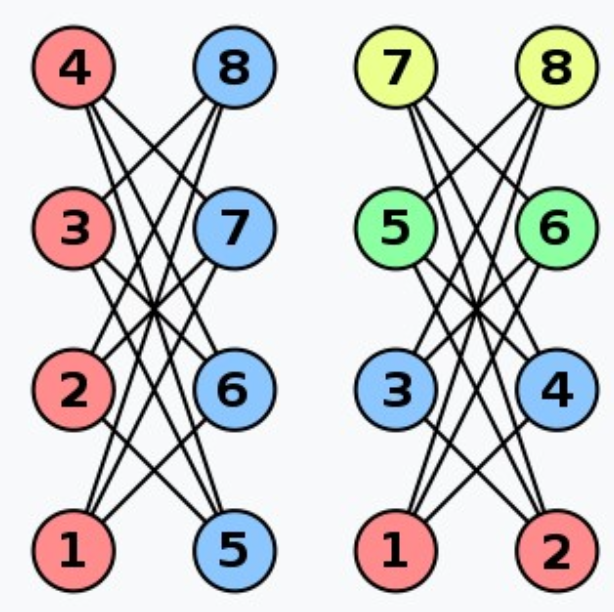{width=60%}

Click to see the solution

**Key Concept:** $K_{2,n}$ graphs are always planar for any $n$.

1.  **Structure:** $K_{2,3}$ has 2 vertices in one partition and 3 in another, with all 6 possible edges between partitions.
2.  **Check edge bound:**
    *   $v = 5$, $e = 6$
    *   $e \leq 2v - 4 = 2(5) - 4 = 6$ ✓
3.  **Construct planar embedding:**
    *   Place one vertex from the first partition (a) at the center
    *   Place the other vertex from the first partition (b) outside
    *   Arrange the three vertices (c, d, e) of the second partition in a triangle around a
    *   Draw edges from a to c, d, e inside the triangle
    *   Draw edges from b to c, d, e going around the outside
4.  **Result:** No crossings needed.

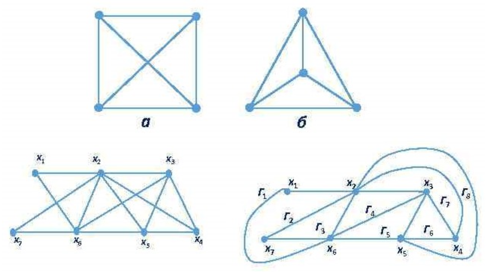{width=60%}

**Answer:** Yes, $K_{2,3}$ is planar.

##### **4.8. Planarity of 8-Vertex Grid Graph** (Tutorial 13, Example 3)
Is the following graph planar? A graph with 8 vertices in two columns of 4, with many crossing edges.

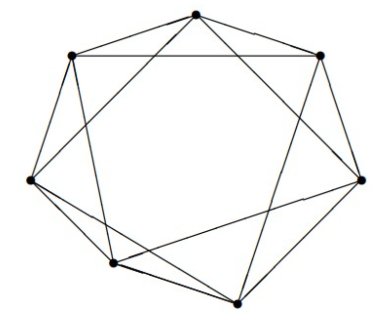{width=60%}

Click to see the solution

**Key Concept:** This graph represents a cube's edge structure, which is planar.

1.  **Identify the graph:** 8 vertices arranged in a 2×4 pattern with specific connections.
2.  **Recognize as cube graph:** The graph is isomorphic to the edge graph of a cube (3-dimensional hypercube $Q_3$).
3.  **Construct planar embedding:**
    *   Draw as a "box within a box" (nested squares)
    *   Outer square: vertices 1, 2, 6, 5
    *   Inner square: vertices 7, 3, 4, 8
    *   Connect corresponding vertices between squares

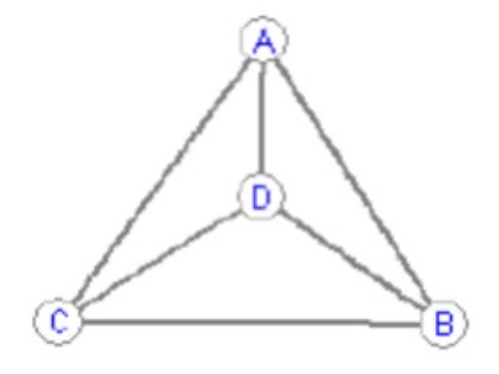{width=60%}

4.  **Result:** The cube graph is planar.

**Answer:** Yes, the graph is planar and can be drawn as nested squares.

##### **4.9. Comparing Cube and Modified Cube** (Tutorial 13, Example 4)
Which of the following graphs are planar?

- $G_1$: A standard wireframe cube
- $G_2$: A cube with an extra diagonal edge and a curved edge connecting opposite corners

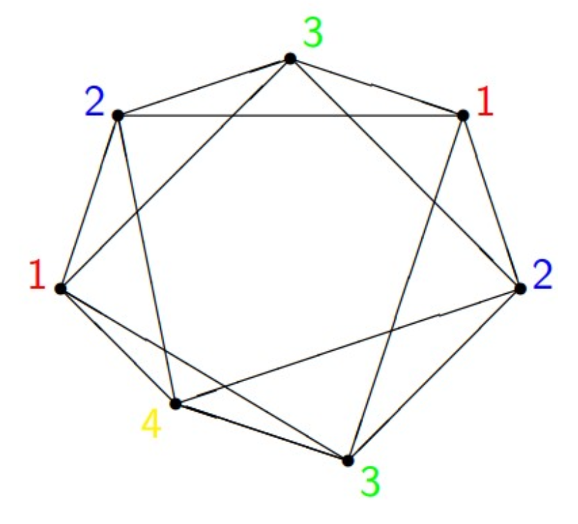{width=60%}

Click to see the solution

**$G_1$ (Standard cube):**

1.  **The cube graph is well-known to be planar.**
2.  **Planar embedding:** Draw as nested squares (inner square inside outer square) with 4 edges connecting corresponding corners.

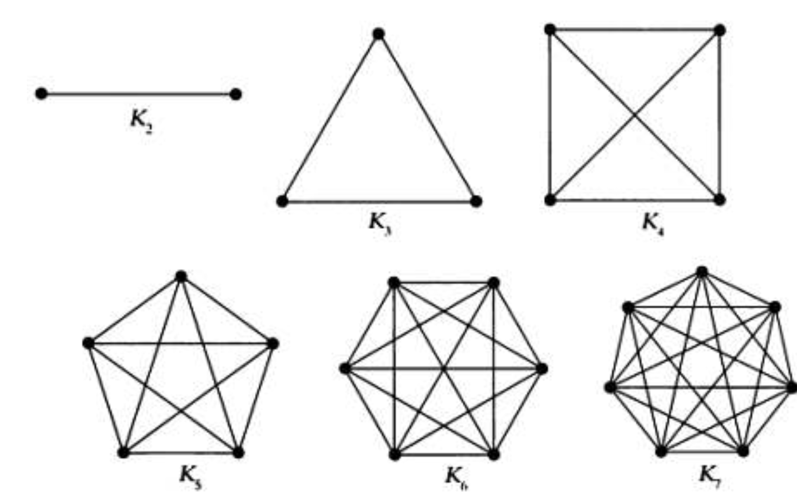{width=60%}

**Answer for $G_1$:** Planar.

**$G_2$ (Modified cube):**

1.  **Analyze additions:** The extra edges create more connectivity.
2.  **Search for $K_{3,3}$ subdivision:**
    *   Label vertices appropriately
    *   Identify two sets of 3 vertices each: $\{a_1, a_2, a_3\}$ (red) and $\{b_1, b_2, b_3\}$ (blue)
    *   Find paths connecting every $a_i$ to every $b_j$
    *   The extra diagonal and curved edge provide the necessary connections
3.  **Finding the subdivision:**
    *   The vertices can be partitioned to show 9 paths between two sets of 3
    *   Some paths go through intermediate vertices ($\alpha$, $\beta$), which are subdivision points

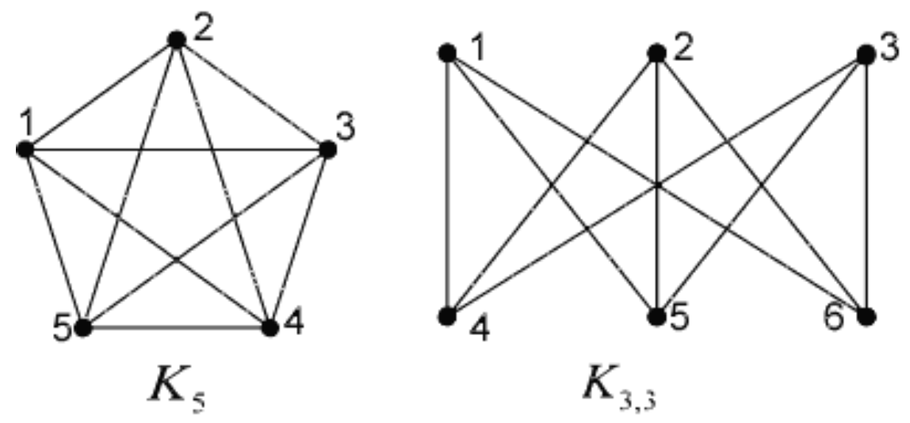{width=60%}

**Answer for $G_2$:** Not planar (contains a subdivision of $K_{3,3}$).

##### **4.10. Chromatic Number of Bipartite Graph** (Tutorial 13, Example 5)
What is the chromatic number of a bipartite graph with 8 vertices (4 on each side)?

Click to see the solution

**Key Concept:** Bipartite graphs are always 2-colourable.

1.  **Property of bipartite graphs:** Vertices can be partitioned into two sets where edges only go between sets, not within sets.
2.  **Colouring strategy:**
    *   Assign colour 1 to all vertices in the left partition
    *   Assign colour 2 to all vertices in the right partition
3.  **Verification:** Since no edges exist within a partition, no two adjacent vertices share a colour.

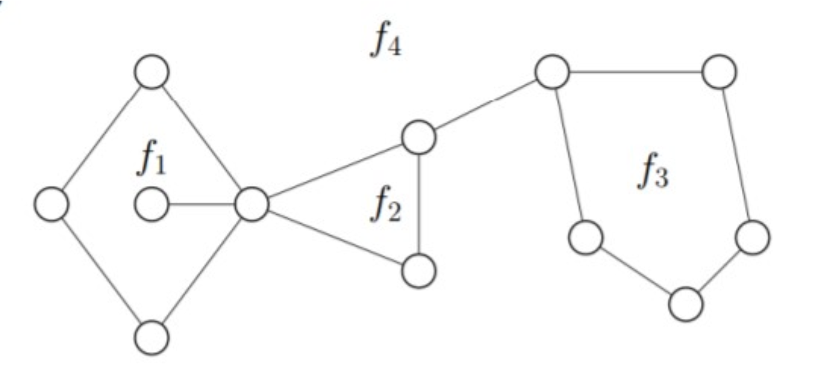{width=60%}

**Answer:** $\chi(G) = 2$

##### **4.11. Chromatic Number of Pentagon** (Tutorial 13, Example 6)
What is the chromatic number of a pentagon graph (cycle $C_5$)?

Click to see the solution

**Key Concept:** Odd cycles require 3 colours; even cycles require 2 colours.

1.  **Structure:** $C_5$ is a cycle with 5 vertices: A - B - C - D - E - A
2.  **Why 2 colours fail:**
    *   Start: A = colour 1
    *   B is adjacent to A: B = colour 2
    *   C is adjacent to B: C = colour 1
    *   D is adjacent to C: D = colour 2
    *   E is adjacent to D: E = colour 1
    *   But E is also adjacent to A, and both have colour 1!
    *   Contradiction: 2 colours insufficient.
3.  **3-colouring works:**
    *   A = 1 (Red)
    *   B = 2 (Green)
    *   C = 1 (Red)
    *   D = 2 (Green)
    *   E = 3 (Blue) — need third colour since E is adjacent to both A (Red) and D (Green)

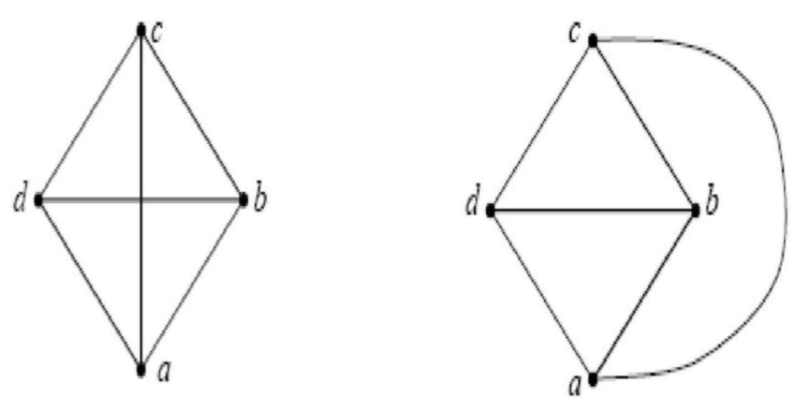{width=60%}

**Answer:** $\chi(C_5) = 3$

##### **4.12. Chromatic Number of $K_4$** (Tutorial 13, Example 7)
What is the chromatic number of the complete graph $K_4$?

Click to see the solution

**Key Concept:** In a complete graph, every vertex is adjacent to every other vertex.

1.  **Structure:** $K_4$ has 4 vertices where every pair is connected.
2.  **Consequence:** No two vertices can share a colour.
3.  **Required colours:** Each of the 4 vertices needs a distinct colour.
4.  **Colouring:**
    *   Vertex A = colour 1 (Red)
    *   Vertex B = colour 2 (Blue)
    *   Vertex C = colour 3 (Green)
    *   Vertex D = colour 4 (Yellow)

**Answer:** $\chi(K_4) = 4$

##### **4.13. Chromatic Number of Wheel Graph** (Tutorial 13, Example 8)
What is the chromatic number of a wheel graph $W_7$ (a cycle of 7 vertices with a central hub connected to all of them)?

Click to see the solution

**Key Concept:** A wheel graph $W_n$ consists of an outer cycle $C_n$ plus a central hub connected to all cycle vertices.

1.  **Structure of $W_7$:**
    *   Outer cycle: 7 vertices (odd cycle)
    *   Central hub: 1 vertex connected to all 7 outer vertices
    *   Total: 8 vertices
2.  **Attempt with 3 colours:**
    *   The outer cycle $C_7$ is an odd cycle, requiring 3 colours
    *   Colour the outer vertices: 1, 2, 1, 2, 1, 2, 3 (the 7th vertex must differ from both the 6th and the 1st)
    *   So outer cycle uses colours {1, 2, 3}
    *   The central hub is adjacent to ALL outer vertices, including vertices of colours 1, 2, and 3
    *   Therefore, the hub needs a 4th colour!
3.  **4-colouring works:**
    *   Outer cycle: colours 1, 2, 3 distributed (e.g., 1, 2, 1, 2, 1, 2, 3)
    *   Central hub: colour 4

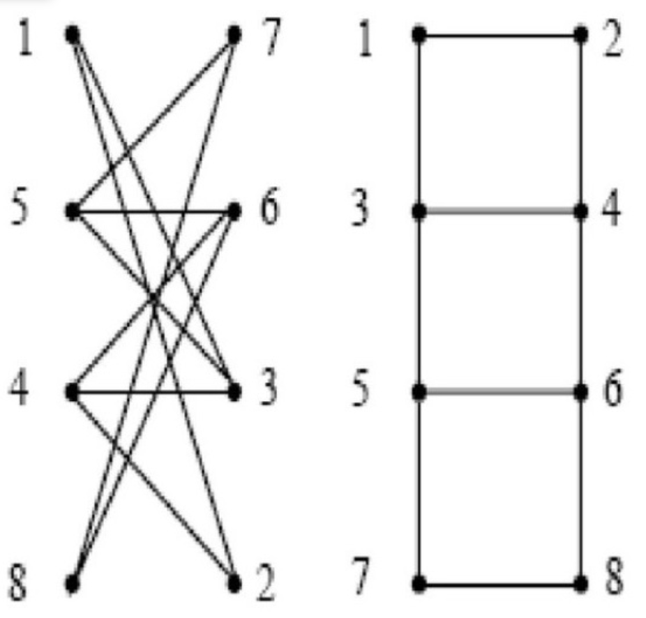{width=60%}

**Answer:** $\chi(W_7) = 4$

