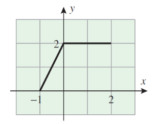

#### **1. Summary**

##### **1.1 What Is Mathematical Analysis?**

**Mathematical Analysis** is the theoretical foundation that underlies calculus. While calculus teaches you *how* to use mathematical tools and techniques, analysis explains *why* these tools work. It provides rigorous justification for concepts that you may have learned in school mathematics, such as limits, derivatives, and integrals.

The key difference between calculus and analysis is the level of rigor. In calculus, you learn rules and procedures—such as the chain rule, L'Hôpital's rule, or integration by parts—and apply them to solve problems. However, you might not fully understand why these rules are valid or when they might fail. **Real analysis** fills this gap by providing formal proofs and examining the underlying structure of real numbers and functions.

In real analysis, we address fundamental questions such as:

- What exactly is a **real number**? Is there a largest real number? After 0, what is the "next" real number?
- Why does the number $2$ have a square root, while $-2$ does not (within the real numbers)?
- If there are infinitely many real numbers and infinitely many rational numbers, why are there "more" real numbers than rational numbers?
- How do you take the limit of a sequence? Which sequences converge and which diverge?
- Can you add infinitely many numbers together and still obtain a finite result?
- What does it mean for a function to be continuous, differentiable, or integrable?

##### **1.2 Why Study Mathematical Analysis?**

Understanding analysis is essential for anyone who wishes to use mathematics rigorously. While you can apply calculus rules without knowing their justification, this approach can lead to errors when rules are applied blindly in situations where they don't hold. Analysis teaches you the *limits of applicability* of mathematical rules and helps you avoid common pitfalls.

###### **1.2.1 Example: Division by Zero**

Consider the **cancellation law** for real numbers: if $a \times b = a \times c$ and $a \neq 0$, then $b = c$. The condition $a \neq 0$ is crucial. If we ignore it, we can derive false conclusions.

For instance, the equation $0 \times 1 = 0 \times 2$ is true, but if we blindly cancel the $0$, we would conclude that $1 = 2$, which is false.

Here's a more subtle example. Let $x$ be a real number. Starting with the equation:

$$x(x + 1) = x^2$$

If we cancel $x$ from both sides, we get:

$$x + 1 = x$$

which simplifies to $1 = 0$—clearly false! The error here is that we canceled $x$ without verifying that $x \neq 0$. If $x = 0$, the cancellation is invalid.

###### **1.2.2 Example: Infinite Sequences**

Let $x$ be a real number, and consider the limit $L = \lim_{n \to \infty} x^n$. By changing the variable from $n$ to $m + 1$, we have:

$$L = \lim_{m+1 \to \infty} x^{m+1} = \lim_{m+1 \to \infty} x \cdot x^m = x \cdot \lim_{m+1 \to \infty} x^m$$

Since $n \to \infty$ implies $m \to \infty$, we have:

$$\lim_{m+1 \to \infty} x^m = \lim_{m \to \infty} x^m = \lim_{n \to \infty} x^n = L$$

Therefore:

$$xL = L$$

This implies either $x = 1$ or $L = 0$. So, we seem to have shown that $\lim_{n \to \infty} x^n = 0$ for all $x \neq 1$.

But this is incorrect! When $x = 2$, the sequence $1, 2, 4, 8, 16, \ldots$ does not converge to zero; it diverges to infinity. When $x = -1$, the sequence $1, -1, 1, -1, \ldots$ oscillates and does not converge at all.

The problem with the argument is that we assumed the limit $L$ exists and performed algebraic manipulations on it without verifying convergence. This example shows that care must be taken when working with limits.

###### **1.2.3 Example: Infinite Series**

Consider the **geometric series** $S = 1 + \frac{1}{2} + \frac{1}{4} + \frac{1}{8} + \cdots$. To find $S$, multiply both sides by $2$:

$$2S = 2 + 1 + \frac{1}{2} + \frac{1}{4} + \cdots = 2 + S$$

Solving for $S$, we get $S = 2$. This is correct; the series converges to $2$.

Now, apply the same technique to the series $S = 1 + 2 + 4 + 8 + 16 + \cdots$. Multiplying by $2$:

$$2S = 2 + 4 + 8 + 16 + \cdots = -1 + 1 + 2 + 4 + 8 + \cdots = -1 + S$$

This gives $S = -1$, which is nonsensical since $S$ is a sum of positive numbers and clearly diverges to infinity.

The issue is that the algebraic manipulation is only valid for **convergent series**. The first series converges, so the manipulation works. The second series diverges, so the manipulation produces meaningless results.

Another problematic series is $S = 1 - 1 + 1 - 1 + 1 - 1 + \cdots$. We can manipulate it in different ways:

- $S = 1 - (1 - 1 + 1 - 1 + \cdots) = 1 - S$, giving $S = \frac{1}{2}$.
- $S = (1 - 1) + (1 - 1) + (1 - 1) + \cdots = 0 + 0 + 0 + \cdots = 0$.
- $S = 1 + (-1 + 1) + (-1 + 1) + \cdots = 1 + 0 + 0 + \cdots = 1$.

These conflicting results show that the series does not converge, and we cannot manipulate it algebraically.

##### **1.3 Logical Symbols**

To study analysis rigorously, we use precise logical notation. Here are the most important symbols:

- **Conjunction**: $\land$ (read as "and"). The statement $A \land B$ is true if both $A$ and $B$ are true.
- **Disjunction**: $\lor$ (read as "or"). The statement $A \lor B$ is true if at least one of $A$ or $B$ is true.
- **Implication**: $\Rightarrow$ (read as "implies"). The notation $A \Rightarrow B$ means "$A$ implies $B$" or "if $A$, then $B$". If this implication is true, we say that $A$ is a **sufficient condition** for $B$, and $B$ is a **necessary condition** for $A$.
- **Equivalence**: $\Leftrightarrow$ (read as "if and only if" or "iff"). The notation $A \Leftrightarrow B$ means that $A$ implies $B$ and $B$ implies $A$. It indicates that $A$ and $B$ are logically equivalent. We also say that $A$ is a **necessary and sufficient condition** for $B$.
- **Universal quantifier**: $\forall$ (read as "for all" or "for any"). The statement $\forall x \in S, P(x)$ means that the property $P(x)$ holds for every element $x$ in the set $S$.
- **Existential quantifier**: $\exists$ (read as "there exists"). The statement $\exists x \in S, P(x)$ means that there is at least one element $x$ in $S$ for which $P(x)$ is true.
- **Unique existence**: $\exists!$ (read as "there exists a unique"). The statement $\exists! x \in S, P(x)$ means there is exactly one element $x$ in $S$ satisfying $P(x)$.

###### **1.3.1 Mathematical Statements**

A **mathematical statement** is a sentence that is either true or false, but not both. For example:

- "$2 + 1 = 3$" is a true statement.
- "Moscow is the capital of Russia" is a true statement.
- "Russia is the best!" is not a statement—it's an opinion.
- "$x + 1 = 3$" is an **open statement**; its truth value depends on the value of $x$. If $x = 2$, it's true; otherwise, it's false.

Mathematical statements often have the form "If $A$, then $B$" (denoted $A \Rightarrow B$).

**Example 1**: The implication $x^2 \leq 9 \Rightarrow -3 \leq x \leq 3$ is true. The converse is also true: $-3 \leq x \leq 3 \Rightarrow x^2 \leq 9$. Therefore, we can write the equivalence:

$$x^2 \leq 9 \Leftrightarrow -3 \leq x \leq 3$$

**Example 2**: The implication $x = -3 \Rightarrow x^2 + 2x - 3 = 0$ is true. However, the converse $x^2 + 2x - 3 = 0 \Rightarrow x = -3$ is false, because the equation has two solutions: $x_1 = 1$ and $x_2 = -3$.

##### **1.4 Basic Set Theory**

**Modern analysis** (referring to mathematics from the late 19th century onward) uses the language of **sets**. A set is a fundamental concept, though defining it rigorously leads to logical paradoxes. We adopt an intuitive approach: a **set** is a collection of objects called **elements** or **members**.

A set is defined solely by its members. Two sets are equal if and only if they contain the same elements. A set with no elements is called the **empty set**, denoted by $\emptyset$ or $\{\}$.

###### **1.4.1 Set Notation**

We typically work with sets of numbers. For example, the set $A = \{2, 4, 6\}$ contains three elements: $2$, $4$, and $6$.

- We write $2 \in A$ to denote that $2$ **belongs to** or is a **member of** $A$.
- We write $10 \notin A$ to denote that $10$ is **not** in $A$.

###### **1.4.2 Subsets and Equality**

**Definition**: A set $A$ is a **subset** of a set $B$ (written $A \subset B$ or $A \subseteq B$) if every element of $A$ is also an element of $B$. In symbols:

$$A \subset B \Leftrightarrow (x \in A \Rightarrow x \in B)$$

**Definition**: Two sets $A$ and $B$ are **equal** (written $A = B$) if $A \subset B$ and $B \subset A$. This means they contain exactly the same elements:

$$A = B \Leftrightarrow (A \subset B) \land (B \subset A)$$

**Definition**: A set $A$ is a **proper subset** of $B$ (written $A \subsetneq B$) if $A \subset B$ and $A \neq B$. This means $A$ is contained in $B$, but $B$ has at least one element not in $A$.

We often define sets using **set-builder notation**: $\{x \in A : P(x)\}$ denotes the subset of $A$ containing all elements that satisfy the property $P(x)$.

###### **1.4.3 Set Operations**

**1. Union**: The **union** of sets $A$ and $B$, denoted $A \cup B$, is the set of all elements that belong to $A$ or $B$ (or both):

$$A \cup B := \{x \mid (x \in A) \lor (x \in B)\}$$

**2. Intersection**: The **intersection** of sets $A$ and $B$, denoted $A \cap B$, is the set of all elements that belong to both $A$ and $B$:

$$A \cap B := \{x \mid (x \in A) \land (x \in B)\}$$

**3. Difference**: The **difference** $A \setminus B$ (also written $A - B$) is the set of elements in $A$ that are not in $B$:

$$A \setminus B := \{x \mid (x \in A) \land (x \notin B)\}$$

**4. Symmetric Difference**: The **symmetric difference** $A \Delta B$ is the set of elements that belong to either $A$ or $B$, but not both:

$$A \Delta B := (A \setminus B) \cup (B \setminus A)$$

**5. Complement**: If $B$ is a subset of a **universal set** $U$, the **complement** of $B$ in $U$, denoted $B^c$, is:

$$B^c := U \setminus B$$

Note that $A \setminus B = A \cap B^c$.

**6. Disjoint Sets**: Two sets $A$ and $B$ are **disjoint** if $A \cap B = \emptyset$ (they have no elements in common).

<!-- DIAGRAM HERE -->

###### **1.4.4 Properties of Set Operations**

Let $A$, $B$, $C$ be subsets of a universal set $U$. The following properties hold:

1. **Idempotence**: $A \cup A = A$, $A \cap A = A$
2. **Identity**: $A \cup \emptyset = A$, $A \cap \emptyset = \emptyset$
3. **Domination**: $A \cup U = U$, $A \cap U = A$
4. **Commutativity**: $A \cap B = B \cap A$, $A \cup B = B \cup A$
5. **Associativity**: $(A \cap B) \cap C = A \cap (B \cap C)$, $(A \cup B) \cup C = A \cup (B \cup C)$
6. **Distributivity**: $A \cap (B \cup C) = (A \cap B) \cup (A \cap C)$, $A \cup (B \cap C) = (A \cup B) \cap (A \cup C)$
7. **Absorption**: $A \cup (A \cap B) = A$, $A \cap (A \cup B) = A$
8. **Complement**: $A \cup A^c = U$, $A \cap A^c = \emptyset$
9. **Symmetry**: $A \Delta B = B \Delta A$, $(A \Delta B) \Delta C = A \Delta (B \Delta C)$
10. **Difference**: $A \setminus (B \cap C) = (A \setminus B) \cup (A \setminus C)$

###### **1.4.5 DeMorgan's Laws**

**Theorem (DeMorgan's Laws)**: Let $A$ and $B$ be subsets of a universal set $U$. Then:

$$(A \cup B)^c = A^c \cap B^c$$
$$(A \cap B)^c = A^c \cup B^c$$

**Proof of the first equality**: We show that each side is a subset of the other.

First, suppose $x \in (A \cup B)^c$. Then:

$$x \notin A \cup B \Rightarrow (x \notin A) \land (x \notin B) \Rightarrow (x \in A^c) \land (x \in B^c) \Rightarrow x \in A^c \cap B^c$$

Thus, $(A \cup B)^c \subset A^c \cap B^c$.

Conversely, suppose $x \in A^c \cap B^c$. Then:

$$(x \in A^c) \land (x \in B^c) \Rightarrow (x \notin A) \land (x \notin B) \Rightarrow x \notin A \cup B \Rightarrow x \in (A \cup B)^c$$

Thus, $A^c \cap B^c \subset (A \cup B)^c$.

Since each side is a subset of the other, the sets are equal.

###### **1.4.6 Cartesian Product**

**Definition**: Let $X$ and $Y$ be sets. The **Cartesian product** $X \times Y$ is the set of all **ordered pairs** $(x, y)$ where $x \in X$ and $y \in Y$:

$$X \times Y := \{(x, y) : (x \in X) \land (y \in Y)\}$$

For ordered pairs $(x_1, y_1)$ and $(x_2, y_2)$:

- $(x_1, y_1) = (x_2, y_2)$ if and only if $x_1 = x_2$ and $y_1 = y_2$.
- If $x_1 \neq x_2$ or $y_1 \neq y_2$, then $(x_1, y_1) \neq (x_2, y_2)$.

In general, $X \times Y \neq Y \times X$.

**Example**: 

$$\{a, b\} \times \{1, 2, 3\} = \{(a, 1), (a, 2), (a, 3), (b, 1), (b, 2), (b, 3)\}$$
$$\{1, 2, 3\} \times \{a, b\} = \{(1, a), (1, b), (2, a), (2, b), (3, a), (3, b)\}$$

Note that these two sets are different.

##### **1.5 Real Numbers**

The **real numbers**, denoted $\mathbb{R}$, are numbers that can be expressed as decimals (finite or infinite). Examples include:

$$3 = 3.00000\ldots, \quad \frac{3}{2} = 1.500000\ldots, \quad \sqrt{2} = 1.41421\ldots$$
$$\pi = 3.14159\ldots, \quad e = 2.71828\ldots, \quad \ln(2) = 0.69314\ldots$$

Geometrically, real numbers correspond to points on the **real line**.

Rather than defining real numbers from scratch, we use an **axiomatic approach**: we assume there exists a set $\mathbb{R}$ satisfying certain axioms. These axioms describe the fundamental properties of real numbers and can be divided into three categories:

1. **Algebraic axioms** (concerning addition and multiplication)
2. **Order axioms** (concerning inequalities)
3. **Completeness axiom** (ensuring there are no "gaps" in the real line)

###### **1.5.1 Algebraic Axioms**

The set $\mathbb{R}$ has two binary operations: **addition** ($+$) and **multiplication** ($\times$ or $\cdot$).

**Addition Axioms**: For all $a, b, c \in \mathbb{R}$:

- **(A1) Commutativity**: $a + b = b + a$
- **(A2) Associativity**: $(a + b) + c = a + (b + c)$
- **(A3) Additive Identity**: There exists an element $0 \in \mathbb{R}$ such that $a + 0 = 0 + a = a$ for all $a$.
- **(A4) Additive Inverse**: For each $a \in \mathbb{R}$, there exists an element $-a \in \mathbb{R}$ (called the **negative** of $a$) such that $a + (-a) = (-a) + a = 0$.

**Multiplication Axioms**: For all $a, b, c \in \mathbb{R}$:

- **(A5) Commutativity**: $a \cdot b = b \cdot a$
- **(A6) Associativity**: $(a \cdot b) \cdot c = a \cdot (b \cdot c)$
- **(A7) Multiplicative Identity**: There exists an element $1 \in \mathbb{R}$ with $1 \neq 0$ such that $a \cdot 1 = 1 \cdot a = a$ for all $a$.
- **(A8) Multiplicative Inverse**: For each $a \in \mathbb{R}$ with $a \neq 0$, there exists an element $a^{-1} \in \mathbb{R}$ (called the **reciprocal** or **inverse** of $a$) such that $a \cdot a^{-1} = a^{-1} \cdot a = 1$.

**Distributive Axiom**:

- **(A9) Distributivity**: $a(b + c) = ab + ac$ for all $a, b, c \in \mathbb{R}$.

We define **subtraction** as $a - b := a + (-b)$ and **division** (for $b \neq 0$) as $\frac{a}{b} := a \cdot b^{-1}$.

###### **1.5.2 Order Axioms**

There is a relation "$\leq$" (read "less than or equal to") on $\mathbb{R}$ satisfying the following axioms for all $a, b, c \in \mathbb{R}$:

- **(A10) Reflexivity**: $a \leq a$
- **(A11) Antisymmetry**: If $a \leq b$ and $b \leq a$, then $a = b$.
- **(A12) Transitivity**: If $a \leq b$ and $b \leq c$, then $a \leq c$.
- **(A13) Totality**: Either $a \leq b$ or $a \geq b$ (or both).
- **(A14) Addition Preservation**: If $a \leq b$, then $a + c \leq b + c$.
- **(A15) Multiplication by Positives**: If $a \geq 0$ and $b \geq 0$, then $ab \geq 0$.

We write $a < b$ (read "strictly less than") to mean $a \leq b$ and $a \neq b$.

###### **1.5.3 Completeness Axiom**

The **completeness axiom** ensures that the real numbers have no "gaps". There are several equivalent formulations. One intuitive version is:

**(A16)**: Let $A$ and $B$ be non-empty sets of real numbers such that $a \leq b$ for all $a \in A$ and $b \in B$. Then there exists a real number $c$ such that $a \leq c \leq b$ for all $a \in A$ and $b \in B$.

An equivalent formulation uses the concept of a **least upper bound** (discussed below):

**(A16')**: Every non-empty set of real numbers that is bounded above has a unique least upper bound.

###### **1.5.4 Axioms of Equality**

For all $a, b, c \in \mathbb{R}$:

1. **Reflexivity**: $a = a$
2. **Symmetry**: If $a = b$, then $b = a$.
3. **Transitivity**: If $a = b$ and $b = c$, then $a = c$.
4. **Addition Property**: If $a = b$, then $a + c = b + c$.
5. **Multiplication Property**: If $a = b$, then $ac = bc$.

###### **1.5.5 Properties of Real Numbers**

From the axioms, we can derive many useful properties.

**Theorem**: Let $a, b, c, d \in \mathbb{R}$.

1. **Cancellation Law for Addition**: If $a + c = b + c$, then $a = b$.
2. **Cancellation Law for Multiplication**: If $c \neq 0$ and $ac = bc$, then $a = b$.
3. $a \cdot 0 = 0$
4. $(-1)a = -a$
5. $(c^{-1})^{-1} = c$ for $c \neq 0$
6. $-(-a) = a$
7. $a(-b) = -(ab) = (-a)b$
8. $(-a) + (-b) = -(a + b)$
9. $(-a)(-b) = ab$
10. If $c \neq 0$ and $d \neq 0$, then $\frac{a}{c} \times \frac{b}{d} = \frac{ab}{cd}$
11. If $c \neq 0$ and $d \neq 0$, then $\frac{a}{c} + \frac{b}{d} = \frac{ad + bc}{cd}$

**Proof of (1)**: Assume $a + c = b + c$. By axiom (A4), there exists $-c$ such that $-c + c = 0$. Adding $-c$ to both sides:

$$(a + c) - c = (b + c) - c$$

By associativity (A2):

$$a + (c - c) = b + (c - c)$$
$$a + 0 = b + 0$$

By (A3):

$$a = b$$

**Proof of (3)**: By (A3) and (A9):

$$a \cdot 0 = a \cdot (0 + 0) = a \cdot 0 + a \cdot 0$$

By (A4), there exists $-a \cdot 0$. Adding it to both sides:

$$a \cdot 0 + (-a \cdot 0) = (a \cdot 0 + a \cdot 0) + (-a \cdot 0)$$
$$0 = a \cdot 0 + 0$$
$$0 = a \cdot 0$$

**Theorem**: Let $a, b, c, d \in \mathbb{R}$.

1. For any $a$, exactly one of the following holds: $a < b$, $a = b$, or $a > b$.
2. If $a > 0$ and $b > 0$, then $ab > 0$.
3. If $a > 0$ and $b < 0$, then $ab < 0$.
4. If $a < 0$ and $b < 0$, then $ab > 0$.
5. If $a < b$ and $c > 0$, then $ac < bc$.
6. If $a < b$ and $c < 0$, then $ac > bc$.
7. $0 < 1$ and $-1 < 0$.
8. If $a > 0$, then $a^{-1} = \frac{1}{a} > 0$.
9. If $0 < a < b$, then $0 < \frac{1}{b} < \frac{1}{a}$.
10. If $a < b$ and $b < c$, then $a < c$.
11. If $a \leq b$, then $a + c \leq b + c$.

###### **1.5.6 Absolute Value**

**Definition**: The **absolute value** of a real number $x$, denoted $|x|$, is defined by:

$$|x| = \begin{cases} x & \text{if } x \geq 0 \\ -x & \text{if } x < 0 \end{cases}$$

The absolute value represents the *distance* from $x$ to $0$ on the real line.

**Theorem**: Let $x, y \in \mathbb{R}$. Then:

1. $|x| \geq 0$, and $|x| = 0$ if and only if $x = 0$.
2. $|-x| = |x|$
3. $-|x| \leq x \leq |x|$
4. $|xy| = |x||y|$
5. **Triangle Inequality**: $|x + y| \leq |x| + |y|$
6. **Reverse Triangle Inequality**: $||x| - |y|| \leq |x - y|$
7. $|x| \leq y \Leftrightarrow -y \leq x \leq y$; $|x| \geq y \Leftrightarrow x \leq -y$ or $x \geq y$

**Proof of (5)**: We have $|x + y| = s(x + y)$ where $s \in \{-1, 1\}$ depending on the sign of $x + y$. By distributivity:

$$s(x + y) = sx + sy$$

Since $sx \leq |x|$ (because $1 \leq 1$ and $-1 \leq 1$), we have:

$$|x + y| = sx + sy \leq |x| + |y|$$

**Proof of (7)**: Suppose $|x| \leq y$. If $x \geq 0$, then $|x| = x \leq y$. Since $y \geq |x| \geq 0$, we have $-y \leq 0 \leq x$, so $-y \leq x \leq y$. If $x < 0$, then $|x| = -x \leq y$. Multiplying by $-1$: $x \geq -y$. Since $y \geq 0 > x$, we again have $-y \leq x \leq y$.

Conversely, suppose $-y \leq x \leq y$. If $x \geq 0$, then $|x| = x \leq y$. If $x < 0$, then $|x| = -x \leq y$ (since $-y \leq x$ implies $-x \leq y$).

###### **1.5.7 Intervals**

**Definition (Bounded Intervals)**: For $a, b \in \mathbb{R}$ with $a < b$:

- **Closed interval**: $[a, b] := \{x \in \mathbb{R} : a \leq x \leq b\}$
- **Open interval**: $(a, b) := \{x \in \mathbb{R} : a < x < b\}$
- **Half-open intervals**: $(a, b] := \{x \in \mathbb{R} : a < x \leq b\}$, $[a, b) := \{x \in \mathbb{R} : a \leq x < b\}$

**Definition (Unbounded Intervals)**: For $a, b \in \mathbb{R}$:

- $[a, \infty) := \{x \in \mathbb{R} : a \leq x\}$
- $(a, \infty) := \{x \in \mathbb{R} : a < x\}$
- $(-\infty, b] := \{x \in \mathbb{R} : x \leq b\}$
- $(-\infty, b) := \{x \in \mathbb{R} : x < b\}$
- $\mathbb{R} = (-\infty, \infty)$

We define the **extended real numbers** $\overline{\mathbb{R}} := \mathbb{R} \cup \{-\infty, +\infty\}$ with the ordering $-\infty < x < +\infty$ for all $x \in \mathbb{R}$.

##### **1.6 Important Subsets of Real Numbers**

###### **1.6.1 Natural Numbers**

The **natural numbers** are:

$$\mathbb{N} = \{1, 2, 3, 4, 5, \ldots\}$$

Starting from the multiplicative identity $1$, we construct:

$$2 = 1 + 1, \quad 3 = 2 + 1, \quad 4 = 3 + 1, \quad \ldots$$

###### **1.6.2 Integers**

The **integers** are:

$$\mathbb{Z} = \{\ldots, -3, -2, -1, 0, 1, 2, 3, \ldots\}$$

This is the union of the natural numbers, zero, and the negatives of natural numbers.

###### **1.6.3 Rational Numbers**

The **rational numbers** are all numbers that can be expressed as a fraction of two integers:

$$\mathbb{Q} = \left\{\frac{p}{q} : p \in \mathbb{Z}, q \in \mathbb{N}\right\}$$

Every rational number can be written in **canonical form** (irreducible fraction) $\frac{p}{q}$ where $p$ and $q$ are coprime (their greatest common divisor is $1$) and $q > 0$.

**Properties of Rational Numbers**:

- **Equality**: $\frac{a}{b} = \frac{c}{d} \Leftrightarrow ad = bc$. If both fractions are in canonical form, then $\frac{a}{b} = \frac{c}{d}$ if and only if $a = c$ and $b = d$.
- **Ordering**: If both denominators are positive, then $\frac{a}{b} < \frac{c}{d} \Leftrightarrow ad < bc$.
- **Addition**: $\frac{a}{b} + \frac{c}{d} = \frac{ad + bc}{bd}$
- **Multiplication**: $\frac{a}{b} \times \frac{c}{d} = \frac{ac}{bd}$
- **Additive Inverse**: $-\frac{a}{b} = \frac{-a}{b}$
- **Multiplicative Inverse** (for $\frac{a}{b} \neq 0$): $\left(\frac{a}{b}\right)^{-1} = \frac{b}{a}$
- **Division**: $\frac{a}{b} \div \frac{c}{d} = \frac{ad}{bc}$ (for $c \neq 0$)
- **Integer Power**: For $n \in \mathbb{N}$, $\left(\frac{a}{b}\right)^n = \frac{a^n}{b^n}$; $\left(\frac{a}{b}\right)^0 = 1$ (for $a \neq 0$); $\left(\frac{a}{b}\right)^{-n} = \frac{b^n}{a^n}$ (for $a \neq 0$)

###### **1.6.4 Irrational Numbers**

A real number is **irrational** if it is not rational. The set of irrational numbers can be denoted $\mathbb{Q}^c = \mathbb{R} \setminus \mathbb{Q}$. Examples include $\sqrt{2}$, $\sqrt{5}$, $\pi$, $e$, and $\ln(2)$.

<!-- DIAGRAM HERE -->

**Example: $\sqrt{2}$ is irrational**

**Proof**: Assume, for contradiction, that $\sqrt{2}$ is rational. Then we can write:

$$\sqrt{2} = \frac{p}{q}$$

where $p, q \in \mathbb{N}$ and $\gcd(p, q) = 1$ (the fraction is in lowest terms). Squaring both sides:

$$2 = \frac{p^2}{q^2} \Rightarrow p^2 = 2q^2$$

Thus, $p^2$ is even, which implies $p$ is even (since the square of an odd number is odd). Let $p = 2k$ for some $k \in \mathbb{N}$. Substituting:

$$(2k)^2 = 2q^2 \Rightarrow 4k^2 = 2q^2 \Rightarrow q^2 = 2k^2$$

Thus, $q^2$ is even, which implies $q$ is even. But if both $p$ and $q$ are even, they share a common factor of $2$, contradicting $\gcd(p, q) = 1$. Therefore, $\sqrt{2}$ is irrational.

**Example: $\sqrt{15}$ is irrational**

**Proof**: Assume $\sqrt{15} = \frac{p}{q}$ where $p, q \in \mathbb{N}$ and $\gcd(p, q) = 1$. Squaring:

$$15 = \frac{p^2}{q^2} \Rightarrow p^2 = 15q^2$$

Thus, $p^2$ is divisible by $3$ (and by $5$). By **Euclid's lemma** (if a prime $p$ divides a product $ab$, then $p$ divides $a$ or $p$ divides $b$), since $3$ is prime and $3$ divides $p^2 = p \cdot p$, we have $3$ divides $p$. Let $p = 3k$. Then:

$$9k^2 = 15q^2 \Rightarrow 3k^2 = 5q^2$$

Thus, $q^2$ (and hence $q$) is divisible by $3$. This contradicts $\gcd(p, q) = 1$. Therefore, $\sqrt{15}$ is irrational.

**Example: $\sqrt{3} + \sqrt{5}$ is irrational**

**Proof**: Assume $r := \sqrt{3} + \sqrt{5}$ is rational. Squaring both sides:

$$r^2 = (\sqrt{3} + \sqrt{5})^2 = 3 + 2\sqrt{15} + 5 = 8 + 2\sqrt{15}$$

Thus:

$$\sqrt{15} = \frac{r^2 - 8}{2}$$

Since $r$ is rational (by assumption), $\frac{r^2 - 8}{2}$ is also rational. But $\sqrt{15}$ is irrational (as shown above), giving a contradiction. Therefore, $\sqrt{3} + \sqrt{5}$ is irrational.

**Remark**: The sum of two irrational numbers can be rational or irrational. For example:

- $\sqrt{2} + (-\sqrt{2}) = 0 \in \mathbb{Q}$
- $\sqrt{2} + (1 - \sqrt{2}) = 1 \in \mathbb{Q}$

##### **1.7 Upper and Lower Bounds**

**Definition**: Let $E \subset \mathbb{R}$.

- An element $a \in E$ is the **maximal element** of $E$ (written $a = \max(E)$) if $x \leq a$ for all $x \in E$.
- An element $a \in E$ is the **minimal element** of $E$ (written $a = \min(E)$) if $x \geq a$ for all $x \in E$.
- The set $E$ is **bounded above** if there exists $a \in \mathbb{R}$ such that $x \leq a$ for all $x \in E$. Such an $a$ is called an **upper bound** for $E$.
- The set $E$ is **bounded below** if there exists $a \in \mathbb{R}$ such that $x \geq a$ for all $x \in E$. Such an $a$ is called a **lower bound** for $E$.
- A number $b \in \mathbb{R}$ is the **least upper bound** (or **supremum**) of $E$ (written $b = \sup(E)$) if:
  1. $b$ is an upper bound for $E$, and
  2. $b \leq a$ for every upper bound $a$ of $E$.
- A number $b \in \mathbb{R}$ is the **greatest lower bound** (or **infimum**) of $E$ (written $b = \inf(E)$) if:
  1. $b$ is a lower bound for $E$, and
  2. $b \geq a$ for every lower bound $a$ of $E$.

<!-- DIAGRAM HERE -->

**Convention**: 

- If $E = \emptyset$, then $\sup(\emptyset) := -\infty$ and $\inf(\emptyset) := +\infty$.
- If $E \neq \emptyset$ is not bounded above, then $\sup(E) := +\infty$.
- If $E \neq \emptyset$ is not bounded below, then $\inf(E) := -\infty$.

**Examples**:

1. For $E = [-1, 2]$, we have $\min(E) = \inf(E) = -1 \in E$ and $\max(E) = \sup(E) = 2 \in E$.
2. For $E = [0, 1)$, we have $\min(E) = \inf(E) = 0 \in E$ and $\sup(E) = 1 \notin E$. There is no maximal element.
3. For $E = \{1, \frac{1}{2}, \frac{1}{3}, \ldots, \frac{1}{n}, \ldots\}$, we have $\max(E) = \sup(E) = 1 \in E$ and $\inf(E) = 0 \notin E$. There is no minimal element.
4. For $E = (1, \infty)$, we have $\inf(E) = 1 \notin E$. The set is bounded below but not above, and has no minimal element.

##### **1.8 Equivalence of Completeness Axioms**

**Theorem**: The axioms (A16) and (A16') are equivalent.

**Proof**: First, note that if a least upper bound exists, it is unique. Indeed, if $b_1$ and $b_2$ are both least upper bounds for a set $M$, then $b_1 \leq b_2$ and $b_2 \leq b_1$ (since each is less than or equal to every upper bound), so $b_1 = b_2$.

**(A16) $\Rightarrow$ (A16')**: Suppose (A16) holds. Let $M$ be a non-empty set that is bounded above, and let $N = \{y \in \mathbb{R} : y \geq x \text{ for all } x \in M\}$ be the set of all upper bounds of $M$. Since $M$ is bounded above, $N$ is non-empty. By (A16), there exists $c \in \mathbb{R}$ such that $x \leq c \leq y$ for all $x \in M$ and $y \in N$. This means $c$ is an upper bound for $M$ (so $c \in N$) and a lower bound for $N$ (so $c = \min(N)$). Therefore, $c = \sup(M)$.

**(A16') $\Rightarrow$ (A16)**: Suppose (A16') holds. Let $M$ and $N$ be non-empty sets such that $x \leq y$ for all $x \in M$ and $y \in N$. Every element of $N$ is an upper bound for $M$, so $M$ is bounded above. By (A16'), $M$ has a least upper bound $c = \sup(M)$. Since $c$ is an upper bound, $x \leq c$ for all $x \in M$. Suppose there exists $\xi \in N$ with $\xi < c$. Then $\xi$ would be an upper bound for $M$ that is less than the least upper bound, a contradiction. Thus, $c \leq y$ for all $y \in N$, and (A16) holds.

##### **1.9 Archimedean Property**

**Theorem**: The set of natural numbers $\mathbb{N}$ is not bounded above.

**Proof**: Assume, for contradiction, that $\mathbb{N}$ is bounded above. By the completeness axiom (A16'), there exists a least upper bound $b = \sup(\mathbb{N})$. This means:

$$n \leq b \quad \text{for all } n \in \mathbb{N}$$

In particular, if $m \in \mathbb{N}$, then $m + 1 \in \mathbb{N}$, so:

$$m + 1 \leq b \quad \text{for all } m \in \mathbb{N}$$

By axiom (A14), adding $-1$ to both sides:

$$m \leq b - 1 \quad \text{for all } m \in \mathbb{N}$$

Thus, $b - 1$ is an upper bound for $\mathbb{N}$, and $b - 1 < b$. This contradicts the fact that $b$ is the *least* upper bound. Therefore, $\mathbb{N}$ is not bounded above.

**Theorem (Archimedean Property)**: The following statements are equivalent:

1. For any $\varepsilon > 0$, there exists $n \in \mathbb{N}$ such that $0 < \frac{1}{n} < \varepsilon$.
2. For any $x \in \mathbb{R}$, there exists $n \in \mathbb{N}$ such that $n > x$.
3. For any $a, b > 0$, there exists $n \in \mathbb{N}$ such that $na > b$.

**Proof of (1)**: Assume there exists $\varepsilon > 0$ such that $\frac{1}{n} \geq \varepsilon$ for all $n \in \mathbb{N}$. Then $n \leq \frac{1}{\varepsilon}$ for all $n \in \mathbb{N}$, meaning $\frac{1}{\varepsilon}$ is an upper bound for $\mathbb{N}$. This contradicts the previous theorem. Therefore, for any $\varepsilon > 0$, there exists $n \in \mathbb{N}$ such that $\frac{1}{n} < \varepsilon$.

**Intuitive Meaning**: No matter how large $x$ is, there is always a natural number bigger than it. No matter how small $a > 0$ is, repeatedly adding $a$ to itself will eventually exceed any positive number $b$. This means there are no "infinitely large" or "infinitely small" real numbers.

##### **1.10 Density of Rational Numbers**

**Theorem (Density of Rational Numbers)**: For any $x, y \in \mathbb{R}$ with $x < y$, there exists a rational number $r \in \mathbb{Q}$ such that $x < r < y$.

**Proof**: Since $y - x > 0$, by the Archimedean Property, there exists $n \in \mathbb{N}$ such that:

$$n(y - x) > 1 \Rightarrow \frac{1}{n} < y - x$$

Let $m := \lfloor nx \rfloor$, the greatest integer less than or equal to $nx$. Then $m \leq nx < m + 1$. Define $r := \frac{m + 1}{n} \in \mathbb{Q}$. Then:

- Since $nx < m + 1$, we have $x < \frac{m + 1}{n} = r$.
- Also, $r = \frac{m + 1}{n} \leq \frac{nx + 1}{n} = x + \frac{1}{n} < x + (y - x) = y$.

Thus, $x < r < y$, and $r$ is rational.

**Corollary**: Between any two real numbers, there are infinitely many rational numbers.

##### **1.11 Density of Irrational Numbers**

**Theorem (Density of Irrational Numbers)**: For any $x, y \in \mathbb{R}$ with $x < y$, there exists an irrational number $t$ such that $x < t < y$.

**Proof**:

**Case 1**: If $x$ and $y$ are rational. Since $x < y$, we have $y - x > 0$. Consider:

$$t = x + \frac{(y - x)\sqrt{2}}{2}$$

Since $\sqrt{2}$ is irrational and $\frac{y - x}{2} \neq 0$, the number $t$ is irrational. Also, since $0 < \frac{\sqrt{2}}{2} < 1$:

$$0 < \frac{(y - x)\sqrt{2}}{2} < y - x$$

Thus:

$$x < x + \frac{(y - x)\sqrt{2}}{2} < x + (y - x) = y$$

So $x < t < y$.

**Case 2**: If $x$ or $y$ (or both) are irrational. By the density of rational numbers, there exist rational numbers $r_1$ and $r_2$ such that:

$$x < r_1 < r_2 < y$$

By Case 1, there exists an irrational number $t$ such that $r_1 < t < r_2$. Thus, $x < t < y$.

**Corollary**: For any real number $x$ and any $\varepsilon > 0$, there exist a rational number $r$ and an irrational number $t$ such that $0 < |x - r| < \varepsilon$ and $0 < |x - t| < \varepsilon$.

This means that both rationals and irrationals are **dense** in $\mathbb{R}$: they can be found arbitrarily close to any real number.

##### **1.12 Countability**

We have shown that there are infinitely many natural numbers, and thus infinitely many rational and irrational numbers. Both rationals and irrationals are dense in $\mathbb{R}$. But can we compare the "sizes" of these infinite sets? Which is "larger"?

To answer this, we introduce the concept of **cardinality**, a measure of how many elements a set contains.

**Definition**: Two sets are **equivalent** if there exists a **one-to-one correspondence** (bijection) between them. This means for each element in one set, there is exactly one corresponding element in the other set, and vice versa.

**Definition**: A set is **countable** (or **countably infinite**) if it is equivalent to the set of natural numbers $\mathbb{N}$. In other words, the elements of the set can be "counted" or labeled with natural numbers: $a_1, a_2, a_3, \ldots$

**Definition**: An infinite set that is not countable is called **uncountable**.

**Theorem**: A finite or countable union of countable sets is countable.

**Proof**: First, consider two countable sets:

$$A = \{a_1, a_2, a_3, \ldots\}, \quad B = \{b_1, b_2, b_3, \ldots\}$$

We can list all elements of $A \cup B$ in a single sequence: $a_1, b_1, a_2, b_2, a_3, b_3, \ldots$. If an element appears twice (i.e., is in $A \cap B$), we keep only the first occurrence. This gives a bijection with $\mathbb{N}$, so $A \cup B$ is countable. By repeating this process, a finite union of countable sets is countable.

For a countable union:

$$A_1 = \{a_{11}, a_{12}, a_{13}, \ldots\}, \quad A_2 = \{a_{21}, a_{22}, a_{23}, \ldots\}, \quad \ldots$$

We list elements by grouping those with the same sum of indices (Cantor's diagonal argument):

$$a_{11}, a_{21}, a_{12}, a_{31}, a_{22}, a_{13}, a_{41}, a_{32}, a_{23}, a_{14}, \ldots$$

This establishes a bijection with $\mathbb{N}$, so $\bigcup_{k=1}^{\infty} A_k$ is countable.

**Theorem**: The set of rational numbers $\mathbb{Q}$ is countable.

**Proof**: We can write $\mathbb{Q}$ as a countable union of countable sets:

$$A_1 = \{0, \pm 1, \pm 2, \ldots\}$$
$$A_2 = \left\{\frac{n}{2} : n = 0, \pm 1, \pm 2, \ldots\right\}$$
$$A_k = \left\{\frac{n}{k} : n = 0, \pm 1, \pm 2, \ldots\right\}$$

Each $A_k$ is countable (equivalent to $\mathbb{Z}$, which is countable), and $\mathbb{Q} = \bigcup_{k=1}^{\infty} A_k$. By the previous theorem, $\mathbb{Q}$ is countable.

##### **1.13 Uncountability of Real Numbers**

**Decimal Representation**: A real number $x$ can be written in decimal form:

$$x = \pm d_k d_{k-1} \ldots d_1 d_0 . d_{-1} d_{-2} d_{-3} \ldots$$

where each $d_i \in \{0, 1, 2, \ldots, 9\}$ is a digit. The integer part (to the left of the decimal point) is finite, while the fractional part (to the right) may be infinite.

**Examples**:

$$32.125 = 3 \times 10^1 + 2 \times 10^0 + 1 \times 10^{-1} + 2 \times 10^{-2} + 5 \times 10^{-3}$$

**Theorem**: The unit interval $[0, 1]$ is uncountable.

**Proof (Cantor's Diagonalization)**: Assume, for contradiction, that $[0, 1]$ is countable. Then we could list all its elements as $x_1, x_2, x_3, \ldots$. We will construct a number $y \in [0, 1]$ that is not in this list.

Write each $x_k$ in decimal form:

$$x_k = 0.a_{k1} a_{k2} a_{k3} \ldots$$

where $a_{kn} \in \{0, 1, \ldots, 9\}$. Now construct a new number $y = 0.b_1 b_2 b_3 \ldots$ by choosing each digit $b_n$ such that $b_n \neq a_{nn}$. For example, we can set:

$$b_n = \begin{cases} 1 & \text{if } a_{nn} \neq 1 \\ 2 & \text{if } a_{nn} = 1 \end{cases}$$

Then $b_n \in \{1, 2\}$ for all $n$. By construction, $y$ differs from $x_n$ in the $n$-th decimal place (since $b_n \neq a_{nn}$), so $y \neq x_n$ for every $n$. But this contradicts the assumption that the list $x_1, x_2, x_3, \ldots$ contains all real numbers in $[0, 1]$. Therefore, $[0, 1]$ is uncountable.

<!-- DIAGRAM HERE -->

Since $[0, 1] \subset \mathbb{R}$, it follows that $\mathbb{R}$ is also uncountable.

##### **1.14 Cardinality of a Set**

**Definition**: The **cardinality** (or **size**) of a set $A$, denoted $|A|$, is a measure of the number of elements in $A$.

For finite sets, cardinality is just the number of elements: $|\{a, b, 2, -3\}| = 4$. For infinite sets, two sets have the same cardinality if there is a bijection between them.

**Examples**:

1. $|\mathbb{N}| = |2\mathbb{N}|$, where $2\mathbb{N} = \{2, 4, 6, 8, \ldots\}$ is the set of even positive integers. The bijection is $f : \mathbb{N} \to 2\mathbb{N}$, $f(n) = 2n$. This gives:

   $$1 \leftrightarrow 2, \quad 2 \leftrightarrow 4, \quad 3 \leftrightarrow 6, \quad 4 \leftrightarrow 8, \quad \ldots$$

2. $|\mathbb{N}| = |\mathbb{Z}|$. The bijection is:

   $$f(n) = \begin{cases} \frac{n}{2} & \text{if } n \text{ is even} \\ -\frac{n-1}{2} & \text{if } n \text{ is odd} \end{cases}$$

   This gives:

   $$\begin{array}{ccccccc}
   \mathbb{Z}: & 0 & -1 & 1 & -2 & 2 & \ldots \\
   \mathbb{N}: & 1 & 2 & 3 & 4 & 5 & \ldots
   \end{array}$$

3. $|\mathbb{Z}| = |\mathbb{Q}|$: There are the same number of integers as rational numbers!

4. $|\mathbb{R}| > |\mathbb{N}|$: There are **more** real numbers than natural numbers. This shows that there are different "sizes" of infinity!

##### **1.15 The Principle of Mathematical Induction**

When proving a mathematical statement, we use **deductive reasoning**: assuming axioms are true, we use logic to derive conclusions. We do not accept **inductive reasoning** (deriving general principles from specific observations), as this can lead to false conclusions.

###### **1.15.1 Moser's Circle Problem**

Consider placing $n$ points on a circle and drawing all possible line segments (chords) between them. How many regions is the circle divided into?

- $n = 1$: $1 = 2^0$ region
- $n = 2$: $2 = 2^1$ regions
- $n = 3$: $4 = 2^2$ regions
- $n = 4$: $8 = 2^3$ regions

<!-- DIAGRAM HERE -->

Based on this pattern, one might conjecture that $n$ points yield $2^{n-1}$ regions. However, this is **false**: for $n = 6$, we get $31$ regions, not $2^5 = 32$. The correct formula is:

$$\frac{n(n^3 - 6n^2 + 23n - 18)}{24} + 1$$

This problem, noted by Leo Moser in 1949, demonstrates that inductive reasoning from patterns can fail.

###### **1.15.2 The Principle of Mathematical Induction**

**Theorem (Principle of Mathematical Induction)**: For each $n \in \mathbb{N}$, let $P(n)$ be a statement. Suppose:

1. **Base step**: $P(1)$ is true.
2. **Inductive step**: For any $k \in \mathbb{N}$, if $P(k)$ is true, then $P(k+1)$ is true.

Then $P(n)$ is true for all $n \in \mathbb{N}$.

**Proof**: Suppose the theorem is false. Then the assumptions (1) and (2) hold, but there exists some $n$ for which $P(n)$ is false. Let $S = \{n \in \mathbb{N} : P(n) \text{ is false}\}$. Since $S$ is non-empty, it has a smallest element $s_0 = \min(S)$. Note that $s_0 \neq 1$ (since $P(1)$ is true), so $s_0 \geq 2$. Since $s_0$ is the smallest element of $S$, we have $s_0 - 1 \notin S$, meaning $P(s_0 - 1)$ is true. By (2), $P(s_0) = P((s_0 - 1) + 1)$ must be true, contradicting $s_0 \in S$. Therefore, $S = \emptyset$, and $P(n)$ is true for all $n$.

**Intuitive Explanation (Domino Effect)**: Imagine dominoes arranged in a line.

- If the first domino falls (base step),
- and each falling domino knocks over the next (inductive step),
- then all dominoes will fall.

<!-- DIAGRAM HERE -->

###### **1.15.3 Example 1**

**Claim**: For all $n \in \mathbb{N}$,

$$\frac{1}{2} + \frac{1}{2^2} + \cdots + \frac{1}{2^n} = 1 - \frac{1}{2^n}$$

**Proof**:

**Base step** ($n = 1$): LHS $= \frac{1}{2}$, RHS $= 1 - \frac{1}{2} = \frac{1}{2}$. True.

**Inductive step**: Assume the formula holds for $n = k$:

$$\frac{1}{2} + \frac{1}{2^2} + \cdots + \frac{1}{2^k} = 1 - \frac{1}{2^k}$$

We prove it for $n = k + 1$:

$$\frac{1}{2} + \frac{1}{2^2} + \cdots + \frac{1}{2^k} + \frac{1}{2^{k+1}} = 1 - \frac{1}{2^k} + \frac{1}{2^{k+1}}$$
$$= 1 - \frac{2}{2^{k+1}} + \frac{1}{2^{k+1}} = 1 - \frac{1}{2^{k+1}}$$

Thus, the formula holds for $n = k + 1$. By induction, it holds for all $n \in \mathbb{N}$.

###### **1.15.4 Example 2**

**Claim**: For all $n \in \mathbb{N}$,

$$\sum_{k=1}^{n} \frac{k \cdot (k+1)!}{2^k} = \frac{(n+2)!}{2^n} - 2$$

**Proof**:

**Base step** ($n = 1$): LHS $= \frac{1 \cdot 2!}{2} = 1$, RHS $= \frac{3!}{2} - 2 = 1$. True.

**Inductive step**: Assume the formula holds for $n = k$:

$$\sum_{i=1}^{k} \frac{i \cdot (i+1)!}{2^i} = \frac{(k+2)!}{2^k} - 2$$

We prove it for $n = k + 1$:

$$\sum_{i=1}^{k+1} \frac{i \cdot (i+1)!}{2^i} = \frac{(k+2)!}{2^k} - 2 + \frac{(k+1) \cdot (k+2)!}{2^{k+1}}$$
$$= \frac{2(k+2)!}{2^{k+1}} + \frac{(k+1)(k+2)!}{2^{k+1}} - 2$$
$$= \frac{(k+3)(k+2)!}{2^{k+1}} - 2 = \frac{(k+3)!}{2^{k+1}} - 2$$

Thus, the formula holds for $n = k + 1$. By induction, it holds for all $n \in \mathbb{N}$.

###### **1.15.5 Example 3**

**Claim**: $n! > 3^n$ for all $n \geq 7$.

**Proof**:

**Base step** ($n = 7$): $7! = 5040 > 3^7 = 2187$. True.

**Inductive step**: Assume $k! > 3^k$ for some $k \geq 7$. Then:

$$(k+1)! = (k+1) \cdot k! > (k+1) \cdot 3^k \geq 7 \cdot 3^k > 3 \cdot 3^k = 3^{k+1}$$

(since $k + 1 \geq 8 > 7$ and $7 \cdot 3^k > 3 \cdot 3^k$).

Thus, $(k+1)! > 3^{k+1}$. By induction, $n! > 3^n$ for all $n \geq 7$.

###### **1.15.6 Example 4**

**Claim**: $4^n - 1$ is divisible by $3$ for all $n \geq 1$.

**Proof**:

**Base step** ($n = 1$): $4^1 - 1 = 3$, which is divisible by $3$. True.

**Inductive step**: Assume $4^k - 1 = 3m$ for some $m \in \mathbb{Z}$. Then:

$$4^{k+1} - 1 = 4 \cdot 4^k - 1 = 4 \cdot 4^k - 4 + 3 = 4(4^k - 1) + 3 = 4(3m) + 3 = 3(4m + 1)$$

Thus, $4^{k+1} - 1$ is divisible by $3$. By induction, $4^n - 1$ is divisible by $3$ for all $n \geq 1$.

###### **1.15.7 Example 5: Bernoulli's Inequality**

**Claim**: For all $x \geq 0$ and $n \in \mathbb{N}$,

$$(1 + x)^n \geq 1 + nx$$

**Proof**:

**Base step** ($n = 1$): $(1 + x)^1 = 1 + x \geq 1 + 1 \cdot x$. True.

**Inductive step**: Assume $(1 + x)^k \geq 1 + kx$ for some $k$. Then, for $x \geq 0$:

$$(1 + x)^{k+1} = (1 + x)(1 + x)^k \geq (1 + x)(1 + kx)$$
$$= 1 + x + kx + kx^2 = 1 + (k+1)x + kx^2 \geq 1 + (k+1)x$$

(since $kx^2 \geq 0$).

Thus, $(1 + x)^{k+1} \geq 1 + (k+1)x$. By induction, the inequality holds for all $n \in \mathbb{N}$.

###### **1.15.8 Example 6**

**Claim**: For all $n \geq 1$,

$$\frac{1 \cdot 3 \cdot 5 \cdots (2n-1)}{2 \cdot 4 \cdot 6 \cdots (2n)} < \frac{1}{\sqrt{2n+1}}$$

**Proof**:

**Base step** ($n = 1$): LHS $= \frac{1}{2}$, RHS $= \frac{1}{\sqrt{3}} \approx 0.577$. Since $\frac{1}{2} < \frac{1}{\sqrt{3}}$, it's true.

**Inductive step**: Assume the inequality holds for $n = k$:

$$\frac{1 \cdot 3 \cdots (2k-1)}{2 \cdot 4 \cdots (2k)} < \frac{1}{\sqrt{2k+1}}$$

For $n = k + 1$:

$$\frac{1 \cdot 3 \cdots (2k-1)(2k+1)}{2 \cdot 4 \cdots (2k)(2k+2)} = \frac{1 \cdot 3 \cdots (2k-1)}{2 \cdot 4 \cdots (2k)} \cdot \frac{2k+1}{2k+2}$$
$$< \frac{1}{\sqrt{2k+1}} \cdot \frac{2k+1}{2k+2} = \frac{\sqrt{2k+1}}{2k+2}$$

Now we need to show $\frac{\sqrt{2k+1}}{2k+2} < \frac{1}{\sqrt{2k+3}}$. Squaring both sides (both are positive):

$$\frac{2k+1}{(2k+2)^2} < \frac{1}{2k+3}$$
$$(2k+1)(2k+3) < (2k+2)^2$$
$$4k^2 + 8k + 3 < 4k^2 + 8k + 4$$
$$3 < 4$$

This is always true. Thus, the inequality holds for $n = k + 1$. By induction, it holds for all $n \geq 1$.

###### **1.15.9 Remark on Limitations of Induction**

Some statements cannot be proved directly by induction alone. Consider:

$$a_n = 1 + \frac{1}{2^2} + \frac{1}{3^2} + \cdots + \frac{1}{n^2} < 2 \quad \text{for all } n \geq 2$$

For $k \geq 2$:

$$\frac{1}{k^2} \leq \frac{1}{k(k-1)} = \frac{1}{k-1} - \frac{1}{k}$$

Thus:

$$a_n = 1 + \sum_{k=2}^{n} \frac{1}{k^2} \leq 1 + \sum_{k=2}^{n} \left(\frac{1}{k-1} - \frac{1}{k}\right) = 1 + \left(1 - \frac{1}{n}\right) = 2 - \frac{1}{n} < 2$$

However, a direct inductive approach fails: assuming $a_n < 2$ and writing $a_{n+1} = a_n + \frac{1}{(n+1)^2} < 2 + \frac{1}{(n+1)^2}$ does not prove $a_{n+1} < 2$. Additional insight is needed beyond the inductive framework.

#### **2. Definitions**
* **Mathematical Analysis**: The theoretical foundation of calculus that rigorously explains why calculus works.
* **Real Analysis**: The rigorous study of real numbers, sequences, series, and functions.
* **Statement**: A sentence that is either true or false, but not both.
* **Open Statement**: A statement whose truth value depends on the value of a variable.
* **Implication** ($A \Rightarrow B$): "$A$ implies $B$"; if $A$ is true, then $B$ must be true.
* **Equivalence** ($A \Leftrightarrow B$): "$A$ if and only if $B$"; $A$ and $B$ are logically equivalent.
* **Sufficient Condition**: If $A \Rightarrow B$, then $A$ is sufficient for $B$.
* **Necessary Condition**: If $A \Rightarrow B$, then $B$ is necessary for $A$.
* **Universal Quantifier** ($\forall$): "For all" or "for any".
* **Existential Quantifier** ($\exists$): "There exists".
* **Unique Existence** ($\exists!$): "There exists a unique".
* **Set**: A collection of objects called elements or members.
* **Empty Set** ($\emptyset$): A set with no elements.
* **Element** ($x \in A$): $x$ is a member of set $A$.
* **Subset** ($A \subset B$ or $A \subseteq B$): Every element of $A$ is also in $B$.
* **Proper Subset** ($A \subsetneq B$): $A$ is a subset of $B$ but $A \neq B$.
* **Union** ($A \cup B$): The set of elements in $A$ or $B$ (or both).
* **Intersection** ($A \cap B$): The set of elements in both $A$ and $B$.
* **Difference** ($A \setminus B$): The set of elements in $A$ but not in $B$.
* **Symmetric Difference** ($A \Delta B$): The set of elements in $A$ or $B$ but not both.
* **Complement** ($B^c$ or $U \setminus B$): The set of elements in the universal set $U$ that are not in $B$.
* **Disjoint Sets**: Two sets $A$ and $B$ are disjoint if $A \cap B = \emptyset$.
* **Cartesian Product** ($X \times Y$): The set of all ordered pairs $(x, y)$ where $x \in X$ and $y \in Y$.
* **Ordered Pair** ($(x, y)$): A pair of elements where order matters; $(x_1, y_1) = (x_2, y_2)$ if and only if $x_1 = x_2$ and $y_1 = y_2$.
* **Real Numbers** ($\mathbb{R}$): The set of all numbers that can be represented as decimals, satisfying the algebraic, order, and completeness axioms.
* **Additive Identity** ($0$): The element satisfying $a + 0 = a$ for all $a$.
* **Additive Inverse** ($-a$): The element satisfying $a + (-a) = 0$.
* **Multiplicative Identity** ($1$): The element satisfying $a \cdot 1 = a$ for all $a$.
* **Multiplicative Inverse** ($a^{-1}$ or $\frac{1}{a}$): The element satisfying $a \cdot a^{-1} = 1$ (for $a \neq 0$).
* **Subtraction**: $a - b := a + (-b)$.
* **Division**: $\frac{a}{b} := a \cdot b^{-1}$ (for $b \neq 0$).
* **Absolute Value** ($|x|$): The distance from $x$ to $0$; $|x| = x$ if $x \geq 0$, and $|x| = -x$ if $x < 0$.
* **Closed Interval** ($[a, b]$): $\{x \in \mathbb{R} : a \leq x \leq b\}$.
* **Open Interval** ($(a, b)$): $\{x \in \mathbb{R} : a < x < b\}$.
* **Half-Open Interval**: $(a, b]$ or $[a, b)$.
* **Natural Numbers** ($\mathbb{N}$): $\{1, 2, 3, 4, \ldots\}$.
* **Integers** ($\mathbb{Z}$): $\{\ldots, -2, -1, 0, 1, 2, \ldots\}$.
* **Rational Numbers** ($\mathbb{Q}$): Numbers of the form $\frac{p}{q}$ where $p \in \mathbb{Z}$ and $q \in \mathbb{N}$.
* **Irrational Numbers** ($\mathbb{Q}^c$ or $\mathbb{R} \setminus \mathbb{Q}$): Real numbers that are not rational.
* **Canonical Form** (of a fraction): An irreducible fraction $\frac{p}{q}$ where $\gcd(p, q) = 1$ and $q > 0$.
* **Maximal Element** ($\max(E)$): An element $a \in E$ such that $x \leq a$ for all $x \in E$.
* **Minimal Element** ($\min(E)$): An element $a \in E$ such that $x \geq a$ for all $x \in E$.
* **Bounded Above**: A set $E$ is bounded above if there exists $M \in \mathbb{R}$ such that $x \leq M$ for all $x \in E$.
* **Bounded Below**: A set $E$ is bounded below if there exists $m \in \mathbb{R}$ such that $x \geq m$ for all $x \in E$.
* **Upper Bound**: A number $M$ such that $x \leq M$ for all $x$ in a set $E$.
* **Lower Bound**: A number $m$ such that $x \geq m$ for all $x$ in a set $E$.
* **Supremum** ($\sup(E)$): The least upper bound of a set $E$.
* **Infimum** ($\inf(E)$): The greatest lower bound of a set $E$.
* **Extended Real Numbers** ($\overline{\mathbb{R}}$): $\mathbb{R} \cup \{-\infty, +\infty\}$.
* **Archimedean Property**: For any $\varepsilon > 0$, there exists $n \in \mathbb{N}$ such that $\frac{1}{n} < \varepsilon$.
* **Density (of a set)**: A set $A$ is dense in $\mathbb{R}$ if between any two real numbers there exists an element of $A$.
* **Equivalent Sets**: Two sets are equivalent if there is a one-to-one correspondence (bijection) between them.
* **One-to-One Correspondence (Bijection)**: A pairing where each element of one set corresponds to exactly one element of another set, and vice versa.
* **Countable Set**: A set that is equivalent to the natural numbers $\mathbb{N}$.
* **Uncountable Set**: An infinite set that is not countable.
* **Cardinality** ($|A|$): A measure of the "size" or number of elements in a set $A$.
* **Continuum**: An uncountable set (often refers to the cardinality of $\mathbb{R}$).
* **Decimal Representation**: Expressing a real number as $\pm d_k \ldots d_1 d_0 . d_{-1} d_{-2} \ldots$ where each $d_i \in \{0, 1, \ldots, 9\}$.
* **Mathematical Induction**: A proof technique for statements $P(n)$ indexed by natural numbers, consisting of a base step and an inductive step.
* **Base Step**: Verifying that $P(1)$ (or $P(n_0)$ for some initial value) is true.
* **Inductive Step**: Proving that if $P(k)$ is true, then $P(k+1)$ is true.
* **Inductive Hypothesis**: The assumption that $P(k)$ is true (used in the inductive step).
#### **3. Formulas**
* **Cancellation Law (Addition)**: If $a + c = b + c$, then $a = b$.
* **Cancellation Law (Multiplication)**: If $c \neq 0$ and $ac = bc$, then $a = b$.
* **Zero Product**: $a \cdot 0 = 0$
* **Negation**: $(-1)a = -a$, $-(-a) = a$
* **Sign Rules**: $a(-b) = -(ab) = (-a)b$, $(-a)(-b) = ab$
* **Inverse of Inverse**: $(c^{-1})^{-1} = c$ for $c \neq 0$
* **Fraction Multiplication**: $\frac{a}{c} \times \frac{b}{d} = \frac{ab}{cd}$ (for $c, d \neq 0$)
* **Fraction Addition**: $\frac{a}{c} + \frac{b}{d} = \frac{ad + bc}{cd}$ (for $c, d \neq 0$)
* **Fraction Division**: $\frac{a}{b} \div \frac{c}{d} = \frac{ad}{bc}$ (for $b, c, d \neq 0$)
* **Positive Product**: If $a > 0$ and $b > 0$, then $ab > 0$.
* **Negative Product**: If $a > 0$ and $b < 0$, then $ab < 0$.
* **Negative × Negative**: If $a < 0$ and $b < 0$, then $ab > 0$.
* **Inequality Multiplication (Positive)**: If $a < b$ and $c > 0$, then $ac < bc$.
* **Inequality Multiplication (Negative)**: If $a < b$ and $c < 0$, then $ac > bc$.
* **Reciprocal Inequality**: If $0 < a < b$, then $0 < \frac{1}{b} < \frac{1}{a}$.
* **Absolute Value Definition**: $|x| = \begin{cases} x & \text{if } x \geq 0 \\ -x & \text{if } x < 0 \end{cases}$
* **Non-negativity**: $|x| \geq 0$
* **Symmetry**: $|-x| = |x|$
* **Bounds**: $-|x| \leq x \leq |x|$
* **Multiplicativity**: $|xy| = |x||y|$
* **Triangle Inequality**: $|x + y| \leq |x| + |y|$
* **Reverse Triangle Inequality**: $||x| - |y|| \leq |x - y|$
* **Absolute Value Inequalities**: $|x| \leq y \Leftrightarrow -y \leq x \leq y$; $|x| \geq y \Leftrightarrow x \leq -y$ or $x \geq y$
* **DeMorgan's Laws**: $(A \cup B)^c = A^c \cap B^c$, $(A \cap B)^c = A^c \cup B^c$
* **Set Distributivity**: $A \cap (B \cup C) = (A \cap B) \cup (A \cap C)$, $A \cup (B \cap C) = (A \cup B) \cap (A \cup C)$
* **Archimedean Property (Form 1)**: For any $\varepsilon > 0$, $\exists n \in \mathbb{N}$ such that $\frac{1}{n} < \varepsilon$.
* **Archimedean Property (Form 2)**: For any $x \in \mathbb{R}$, $\exists n \in \mathbb{N}$ such that $n > x$.
* **Archimedean Property (Form 3)**: For any $a, b > 0$, $\exists n \in \mathbb{N}$ such that $na > b$.
* **Bernoulli's Inequality**: For $x \geq 0$ and $n \in \mathbb{N}$, $(1 + x)^n \geq 1 + nx$.
* **Geometric Series Formula**: $\frac{1}{2} + \frac{1}{2^2} + \cdots + \frac{1}{2^n} = 1 - \frac{1}{2^n}$
* **Divisibility by 3**: $4^n - 1$ is divisible by $3$ for all $n \geq 1$.
* **Product Inequality**: $\frac{1 \cdot 3 \cdot 5 \cdots (2n-1)}{2 \cdot 4 \cdot 6 \cdots (2n)} < \frac{1}{\sqrt{2n+1}}$ for all $n \geq 1$.
* **Factorial Growth**: $n! > 3^n$ for all $n \geq 7$.
* **Sum of Reciprocal Squares Bound**: $1 + \frac{1}{2^2} + \frac{1}{3^2} + \cdots + \frac{1}{n^2} < 2$ for all $n \geq 2$.

#### **4. Examples**
##### **4.1. Prove an Absolute Value Identity** (Chapter 1, Proof of (7))
Prove that for any real numbers $x$ and $y$, the inequality $|x| \le y$ is equivalent to the inequality $-y \le x \le y$.

Click to see the solution

1.  **Prove the forward direction ($\Rightarrow$):** Assume $|x| \le y$.
    *   **Case 1: $x \ge 0$.** In this case, $|x| = x$. The assumption becomes $x \le y$. Since $x \ge 0$, it must be that $y \ge 0$. From $y \ge 0$, we get $-y \le 0$. Combining these gives $-y \le 0 \le x \le y$, which implies $-y \le x \le y$.
    *   **Case 2: $x < 0$.** In this case, $|x| = -x$. The assumption becomes $-x \le y$. Multiplying by -1 reverses the inequality, giving $x \ge -y$. Since $x < 0$, it follows that $y \ge 0$. Combining these gives $-y \le x < 0 \le y$, which implies $-y \le x \le y$.
    *   In both cases, we have shown that if $|x| \le y$, then $-y \le x \le y$.
2.  **Prove the backward direction ($\Leftarrow$):** Assume $-y \le x \le y$.
    *   **Case 1: $x \ge 0$.** The right side of the assumption is $x \le y$. Since $x \ge 0$, $|x| = x$, so we have $|x| \le y$.
    *   **Case 2: $x < 0$.** The left side of the assumption is $-y \le x$. Multiplying by -1 gives $y \ge -x$. Since $x < 0$, $|x| = -x$, so we have $y \ge |x|$, which is equivalent to $|x| \le y$.
    *   In both cases, we have shown that if $-y \le x \le y$, then $|x| \le y$.

**Answer:** Since the implication holds in both directions, the two inequalities are equivalent.

##### **4.2. Prove the Triangle Inequality** (Chapter 1, Proof of (5))
Prove the triangle inequality, which states that for any real numbers $x$ and $y$, we have $|x+y| \le |x| + |y|$.

Click to see the solution

1.  **Use the property of absolute values:** For any real number $z$, we know that $z \le |z|$ and $-z \le |z|$.
    *   Therefore, we have $x \le |x|$ and $y \le |y|$.
    *   We also have $-x \le |x|$ and $-y \le |y|$.
2.  **Combine the inequalities:**
    *   Adding the first pair of inequalities gives: $x + y \le |x| + |y|$.
    *   Adding the second pair of inequalities gives: $-x - y \le |x| + |y|$, which can be written as $-(x+y) \le |x| + |y|$.
3.  **Apply the equivalence from the previous problem:** We have shown that both $(x+y) \le |x|+|y|$ and $-(x+y) \le |x|+|y|$ are true.
    *   This is equivalent to the statement $|x+y| \le |x|+|y|$.

**Answer:** The proof is complete.

##### **4.3. Prove the Irrationality of $\sqrt{2}$** (Chapter 1, Example)
Prove that the number $\sqrt{2}$ is irrational.

Click to see the solution

1.  **Assume the opposite (Proof by Contradiction):** Assume that $\sqrt{2}$ is a rational number. This means it can be written as a fraction $\frac{p}{q}$ in lowest terms, where $p$ and $q$ are integers and their greatest common divisor is 1 (i.e., $\text{gcd}(p, q) = 1$).
    *   $\sqrt{2} = \frac{p}{q}$
2.  **Manipulate the equation:** Square both sides of the equation.
    *   $2 = \frac{p^2}{q^2} \implies p^2 = 2q^2$.
3.  **Deduce properties of $p$:** The equation $p^2 = 2q^2$ shows that $p^2$ is an even number. If a square of a number is even, the number itself must be even. Therefore, $p$ is even.
4.  **Express $p$ as an even number:** We can write $p = 2k$ for some integer $k$.
5.  **Substitute and deduce properties of $q$:** Substitute $p=2k$ back into the equation from step 2.
    *   $(2k)^2 = 2q^2 \implies 4k^2 = 2q^2 \implies q^2 = 2k^2$.
    *   This shows that $q^2$ is also an even number, which means that $q$ must also be even.
6.  **Find the Contradiction:** We have concluded that both $p$ and $q$ are even. If both are even, they share a common factor of 2. This contradicts our initial assumption that the fraction $\frac{p}{q}$ was in its lowest terms (i.e., $\text{gcd}(p, q) = 1$).
7.  **Conclusion:** Since our initial assumption leads to a contradiction, the assumption must be false.

**Answer:** The assumption that $\sqrt{2}$ is rational is false, therefore $\sqrt{2}$ is irrational.

##### **4.4. Prove the Irrationality of $\sqrt{15}$** (Chapter 1, Example)
Prove that the number $\sqrt{15}$ is irrational.

Click to see the solution

1.  **Assume the opposite (Proof by Contradiction):** Assume that $\sqrt{15}$ is rational. This means it can be expressed as a fraction $\frac{p}{q}$ in lowest terms, where $p, q$ are integers with $\text{gcd}(p, q) = 1$.
    *   $\sqrt{15} = \frac{p}{q}$
2.  **Manipulate the equation:** Square both sides.
    *   $15 = \frac{p^2}{q^2} \implies p^2 = 15q^2$.
3.  **Deduce properties of $p$:** The equation $p^2 = 15q^2$ shows that $p^2$ is divisible by 3. Since 3 is a prime number, if it divides $p^2$, it must also divide $p$. Therefore, $p$ is a multiple of 3.
4.  **Express $p$ as a multiple of 3:** We can write $p = 3k$ for some integer $k$.
5.  **Substitute and deduce properties of $q$:** Substitute $p=3k$ back into the equation from step 2.
    *   $(3k)^2 = 15q^2 \implies 9k^2 = 15q^2 \implies 3k^2 = 5q^2$.
    *   This equation shows that $5q^2$ is divisible by 3. Since 3 and 5 are prime, 3 must divide $q^2$. Since 3 is prime, it must also divide $q$. Therefore, $q$ is also a multiple of 3.
6.  **Find the Contradiction:** We have shown that both $p$ and $q$ are multiples of 3. This means they share a common factor of 3, which contradicts our initial assumption that $\frac{p}{q}$ was in lowest terms.
7.  **Conclusion:** The assumption that $\sqrt{15}$ is rational leads to a contradiction, so it must be false.

**Answer:** The number $\sqrt{15}$ is irrational.

##### **4.5. Find Supremum and Infimum of Sets** (Chapter 1, Example)
Find the minimum (min), infimum (inf), maximum (max), and supremum (sup) for the following sets, if they exist.

a) $E = [-1, 2]$
b) $E = [0, 1)$
c) $E = \{1, \frac{1}{2}, \frac{1}{3}, \dots\}$
d) $E = (1, \infty)$

Click to see the solution

1.  **For $E = [-1, 2]$ (a closed interval):**
    *   The smallest element is -1, so $\min(E) = -1$.
    *   The infimum (greatest lower bound) is equal to the minimum, so $\inf(E) = -1$.
    *   The largest element is 2, so $\max(E) = 2$.
    *   The supremum (least upper bound) is equal to the maximum, so $\sup(E) = 2$.
2.  **For $E = [0, 1)$ (a half-open interval):**
    *   The smallest element is 0, so $\min(E) = 0$ and $\inf(E) = 0$.
    *   The set gets arbitrarily close to 1 but never reaches it. There is no largest element, so $\max(E)$ does not exist.
    *   The least upper bound is 1, so $\sup(E) = 1$.
3.  **For $E = \{1, \frac{1}{2}, \frac{1}{3}, \dots\}$ (a sequence):**
    *   The largest element is 1, so $\max(E) = 1$ and $\sup(E) = 1$.
    *   The set gets arbitrarily close to 0 but never reaches it. There is no smallest element, so $\min(E)$ does not exist.
    *   The greatest lower bound is 0, so $\inf(E) = 0$.
4.  **For $E = (1, \infty)$ (an open, unbounded interval):**
    *   The set is not bounded above, so it has no maximum or supremum.
    *   The set gets arbitrarily close to 1 but never reaches it. There is no smallest element, so $\min(E)$ does not exist.
    *   The greatest lower bound is 1, so $\inf(E) = 1$.

##### **4.6. Prove by Mathematical Induction** (Chapter 1, Example 4)
By mathematical induction, prove that $4^n - 1$ is divisible by 3 for any integer $n \ge 1$.

Click to see the solution

Let $P(n)$ be the statement that $4^n - 1$ is divisible by 3.

1.  **Base Step:** We must show that the statement is true for the initial value, $n=1$.
    *   For $n=1$, we have $4^1 - 1 = 3$.
    *   Since 3 is divisible by 3, the statement $P(1)$ is true.
2.  **Inductive Step:** We assume that the statement $P(k)$ is true for some arbitrary integer $k \ge 1$, and then we must show that $P(k+1)$ is also true.
    *   **Assumption (Inductive Hypothesis):** Assume $4^k - 1$ is divisible by 3. This means we can write $4^k - 1 = 3m$ for some integer $m$. This implies $4^k = 3m + 1$.
    *   **Goal:** We need to prove that $4^{k+1} - 1$ is divisible by 3.
    *   **Proof:**
        *   $4^{k+1} - 1 = 4 \cdot 4^k - 1$
        *   Substitute the expression for $4^k$ from our assumption: $4(3m + 1) - 1$
        *   $= 12m + 4 - 1$
        *   $= 12m + 3 = 3(4m + 1)$
    *   Since $4^{k+1} - 1$ can be written as 3 times an integer ($4m+1$), it is divisible by 3. Thus, $P(k+1)$ is true.
3.  **Conclusion:** Since both the base step and the inductive step have been proven, by the principle of mathematical induction, the statement is true for all integers $n \ge 1$.

**Answer:** The proof is complete.

##### **4.7. Prove by Mathematical Induction** (Chapter 1, Example 1)
By mathematical induction, prove that for all $n \in \mathbb{N}$:
$$ \frac{1}{2} + \frac{1}{2^2} + \dots + \frac{1}{2^n} = 1 - \frac{1}{2^n} $$

Click to see the solution

Let $P(n)$ be the statement $\sum_{i=1}^{n} \frac{1}{2^i} = 1 - \frac{1}{2^n}$.

1.  **Base Step:** We test the formula for $n=1$.
    *   LHS = $\frac{1}{2^1} = \frac{1}{2}$.
    *   RHS = $1 - \frac{1}{2^1} = 1 - \frac{1}{2} = \frac{1}{2}$.
    *   Since LHS = RHS, $P(1)$ is true.
2.  **Inductive Step:** Assume $P(k)$ is true for some integer $k \ge 1$. We must prove that $P(k+1)$ is true.
    *   **Assumption (Inductive Hypothesis):** $\frac{1}{2} + \frac{1}{2^2} + \dots + \frac{1}{2^k} = 1 - \frac{1}{2^k}$.
    *   **Goal:** We need to prove that $\frac{1}{2} + \frac{1}{2^2} + \dots + \frac{1}{2^k} + \frac{1}{2^{k+1}} = 1 - \frac{1}{2^{k+1}}$.
    *   **Proof:** Start with the left side of the goal equation.
        *   LHS = $(\frac{1}{2} + \frac{1}{2^2} + \dots + \frac{1}{2^k}) + \frac{1}{2^{k+1}}$
        *   Using the inductive hypothesis, substitute the sum in the parenthesis:
        *   $= (1 - \frac{1}{2^k}) + \frac{1}{2^{k+1}}$
        *   $= 1 - \frac{2}{2 \cdot 2^k} + \frac{1}{2^{k+1}} = 1 - \frac{2}{2^{k+1}} + \frac{1}{2^{k+1}}$
        *   $= 1 - \frac{1}{2^{k+1}}$
    *   This is equal to the right-hand side of the goal. Thus, $P(k+1)$ is true.
3.  **Conclusion:** By the principle of mathematical induction, the formula is true for all natural numbers $n$.

**Answer:** The proof is complete.

##### **4.8. Prove by Mathematical Induction** (Chapter 1, Example 3)
By mathematical induction, prove that $n! > 3^n$ for all integers $n \ge 7$.

Click to see the solution

Let $P(n)$ be the statement $n! > 3^n$.

1.  **Base Step:** The statement is for $n \ge 7$, so our base case is $n=7$.
    *   For $n=7$, we have $7! = 5040$.
    *   And $3^7 = 2187$.
    *   Since $5040 > 2187$, the statement $P(7)$ is true.
2.  **Inductive Step:** Assume that $P(k)$ is true for some arbitrary integer $k \ge 7$. We must show that $P(k+1)$ is true.
    *   **Assumption (Inductive Hypothesis):** $k! > 3^k$ for some $k \ge 7$.
    *   **Goal:** We need to prove that $(k+1)! > 3^{k+1}$.
    *   **Proof:**
        *   Start with the left side of the goal: $(k+1)! = (k+1) \cdot k!$.
        *   From our assumption, we know $k! > 3^k$. We can substitute this to get an inequality:
        *   $(k+1)! > (k+1) \cdot 3^k$.
        *   Now we need to show that this is greater than $3^{k+1}$. We need to show that $(k+1) \cdot 3^k > 3^{k+1}$.
        *   Dividing both sides by $3^k$, this is equivalent to showing that $k+1 > 3$.
        *   Since our assumption is for $k \ge 7$, it is certainly true that $k+1 > 3$.
        *   Therefore, $(k+1)! > (k+1) \cdot 3^k > 3 \cdot 3^k = 3^{k+1}$. This proves $P(k+1)$ is true.
3.  **Conclusion:** By the principle of mathematical induction, the inequality is true for all integers $n \ge 7$.

**Answer:** The proof is complete.

##### **4.9. Prove the Equivalence of Completeness Axioms** (Chapter 1, Theorem)
Prove that the following two axioms of completeness for real numbers are equivalent:

*   **(A16)** For any two nonempty sets M and N of real numbers such that $x \le y$ for all $x \in M$ and $y \in N$, there exists a real number $c$ such that $x \le c \le y$ for all $x \in M$ and $y \in N$.
*   **(A16')** Every nonempty set of real numbers that is bounded above has a unique least upper bound (supremum).

Click to see the solution

1.  **Prove (A16) $\Rightarrow$ (A16'):**
    *   Assume (A16) is true. Let $M$ be a nonempty set of real numbers that is bounded above. We need to show it has a unique least upper bound.
    *   Define a new set $N = \{y \in \mathbb{R} \ | \ y \ge x, \forall x \in M \}$. This is the set of all upper bounds for $M$. Since $M$ is bounded above, $N$ is not empty.
    *   By the definition of the sets $M$ and $N$, we have $x \le y$ for all $x \in M$ and $y \in N$.
    *   According to axiom (A16), there must exist a number $c$ such that $x \le c \le y$ for all $x \in M$ and $y \in N$.
    *   The condition $x \le c$ means $c$ is an upper bound for $M$. The condition $c \le y$ means $c$ is less than or equal to every other upper bound.
    *   Therefore, $c$ is the least upper bound (supremum) of $M$. Uniqueness can be proven by assuming two least upper bounds $b_1, b_2$, which leads to $b_1 \le b_2$ and $b_2 \le b_1$, implying $b_1=b_2$.
2.  **Prove (A16') $\Rightarrow$ (A16):**
    *   Assume (A16') is true. Let $M$ and $N$ be two nonempty sets such that $x \le y$ for all $x \in M$ and $y \in N$.
    *   From this condition, any element of $N$ is an upper bound for the set $M$. Since $N$ is nonempty, this means $M$ is bounded above.
    *   According to axiom (A16'), the set $M$ must have a unique least upper bound, let's call it $c = \sup(M)$.
    *   By definition of supremum, $x \le c$ for all $x \in M$.
    *   We also need to show $c \le y$ for all $y \in N$. Assume for contradiction that there is some $y_0 \in N$ such that $y_0 < c$. Since $y_0$ is an upper bound for $M$ (by definition of N), this would mean $y_0$ is an upper bound smaller than the least upper bound $c$, which is a contradiction.
    *   Therefore, $c \le y$ for all $y \in N$. We have found a number $c$ such that $x \le c \le y$ for all $x \in M, y \in N$, which proves (A16).

**Answer:** The axioms are shown to be equivalent.

##### **4.10. Prove that the Set of Natural Numbers is Unbounded** (Chapter 1, Theorem)
Prove that the set of natural numbers $\mathbb{N} = \{1, 2, 3, \dots\}$ is not bounded above.

Click to see the solution

1.  **Assume the opposite (Proof by Contradiction):** Assume that $\mathbb{N}$ is bounded above.
2.  **Apply the Completeness Axiom:** Since $\mathbb{N}$ is a nonempty set of real numbers that is bounded above, by the completeness axiom (A16'), it must have a least upper bound (supremum). Let's call this least upper bound $b$.
3.  **Use the Definition of Supremum:** The number $b$ is an upper bound, so for every natural number $n$, we have $n \le b$.
4.  **Consider the Successor:** If $m$ is a natural number, then $m+1$ is also a natural number. Therefore, according to our assumption, $m+1 \le b$.
5.  **Derive a New Upper Bound:** If we subtract 1 from both sides of the inequality $m+1 \le b$, we get $m \le b-1$. This must be true for all natural numbers $m$.
6.  **Find the Contradiction:** The statement "$m \le b-1$ for all $m \in \mathbb{N}$" means that $b-1$ is also an upper bound for the set $\mathbb{N}$. However, $b-1 < b$. This contradicts our initial statement that $b$ was the *least* upper bound.
7.  **Conclusion:** The initial assumption that $\mathbb{N}$ is bounded above must be false.

**Answer:** The set of natural numbers is not bounded above.

##### **4.11. Prove the Density of Rational Numbers** (Chapter 1, Theorem)
Prove that for any two real numbers $x, y \in \mathbb{R}$ with $x < y$, there exists a rational number $r$ such that $x < r < y$.

Click to see the solution

1.  **Use the Archimedean Property:** Since $x < y$, the difference $y-x$ is a positive real number. By the Archimedean Property (which follows from the unboundedness of $\mathbb{N}$), there exists a natural number $n$ such that $n(y-x) > 1$. This implies $\frac{1}{n} < y-x$.
2.  **Construct an Integer:** Consider the number $nx$. Let $m$ be the greatest integer less than or equal to $nx$. This is denoted $m = \lfloor nx \rfloor$. By definition of the floor function, we have $m \le nx < m+1$.
3.  **Construct a Rational Number:** Divide the inequality by $n$: $\frac{m}{n} \le x < \frac{m+1}{n}$. Let's define the rational number $r = \frac{m+1}{n}$.
4.  **Show $x < r$:** From the inequality in the previous step, we directly have $x < \frac{m+1}{n} = r$.
5.  **Show $r < y$:** From step 2, we know $m+1 > nx$. So $r = \frac{m+1}{n} > \frac{nx}{n} = x$. We also know $m \le nx$, which means $m+1 \le nx+1$. Therefore, $r = \frac{m+1}{n} \le \frac{nx+1}{n} = x + \frac{1}{n}$.
    *   From step 1, we established that $\frac{1}{n} < y-x$.
    *   Combining these, we get $r \le x + \frac{1}{n} < x + (y-x) = y$.
6.  **Conclusion:** We have shown that $x < r$ and $r < y$.

**Answer:** We have constructed a rational number $r$ that lies between $x$ and $y$.

##### **4.12. Prove the Density of Irrational Numbers** (Chapter 1, Theorem)
Prove that for any two real numbers $x, y \in \mathbb{R}$ with $x < y$, there exists an irrational number $t$ such that $x < t < y$.

Click to see the solution

1.  **Case 1: Assume $x$ and $y$ are rational.**
    *   Since $x < y$, we have $y-x > 0$. Consider the number $t = x + \frac{y-x}{\sqrt{2}}$.
    *   Since $\sqrt{2}$ is irrational and $\frac{y-x}{2} \neq 0$, the term $\frac{y-x}{\sqrt{2}}$ is irrational. The sum of a rational number ($x$) and an irrational number is irrational, so $t$ is irrational.
    *   Since $\sqrt{2} > 1$, we have $0 < \frac{1}{\sqrt{2}} < 1$.
    *   Multiplying by the positive number $y-x$, we get $0 < \frac{y-x}{\sqrt{2}} < y-x$.
    *   Adding $x$ to all parts of the inequality gives $x < x + \frac{y-x}{\sqrt{2}} < x + (y-x)$, which simplifies to $x < t < y$.
2.  **Case 2: General case (x, y may be irrational).**
    *   By the density of rational numbers (proven previously), since $x < y$, we can find a rational number $r_1$ such that $x < r_1 < y$.
    *   Again, by the density of rational numbers, we can find another rational number $r_2$ such that $r_1 < r_2 < y$.
    *   Now we have two rational numbers $r_1$ and $r_2$ with $x < r_1 < r_2 < y$.
    *   Applying the result from Case 1 to the rational numbers $r_1$ and $r_2$, there must exist an irrational number $t$ such that $r_1 < t < r_2$.
    *   By transitivity, we have $x < r_1 < t < r_2 < y$, which implies $x < t < y$.

**Answer:** In both cases, we have found an irrational number $t$ between $x$ and $y$.

##### **4.13. Prove the Irrationality of a Sum of Radicals** (Chapter 1, Example)
Prove that the number $\sqrt{3} + \sqrt{5}$ is irrational.

Click to see the solution

1.  **Assume the opposite (Proof by Contradiction):** Assume that $r = \sqrt{3} + \sqrt{5}$ is a rational number.
2.  **Manipulate the Equation:** Square both sides of the equation.
    *   $r^2 = (\sqrt{3} + \sqrt{5})^2 = (\sqrt{3})^2 + 2\sqrt{3}\sqrt{5} + (\sqrt{5})^2 = 3 + 2\sqrt{15} + 5 = 8 + 2\sqrt{15}$.
3.  **Isolate the Radical:** Rearrange the equation to solve for $\sqrt{15}$.
    *   $r^2 - 8 = 2\sqrt{15} \implies \sqrt{15} = \frac{r^2 - 8}{2}$.
4.  **Find the Contradiction:**
    *   From our initial assumption, $r$ is rational. The square of a rational number is rational, and the difference and quotient of rational numbers are also rational. Therefore, the right-hand side, $\frac{r^2-8}{2}$, must be a rational number.
    *   However, the left-hand side, $\sqrt{15}$, is known to be an irrational number.
    *   This leads to the statement that a rational number is equal to an irrational number, which is a contradiction.
5.  **Conclusion:** The initial assumption that $\sqrt{3} + \sqrt{5}$ is rational must be false.

**Answer:** The number $\sqrt{3} + \sqrt{5}$ is irrational.

##### **4.14. Prove Countability of Unions** (Chapter 1, Theorem)
Prove that a finite or countable union of countable sets is a countable set.

Click to see the solution

1.  **Case 1: Union of two countable sets.**
    *   Let $A = \{a_1, a_2, a_3, \dots\}$ and $B = \{b_1, b_2, b_3, \dots\}$ be two countable sets.
    *   We can create a list of all elements in the union $A \cup B$ by alternating between the sets: $a_1, b_1, a_2, b_2, a_3, b_3, \dots$.
    *   This process creates a single list (a sequence) that includes every element from both sets. To make it a formal enumeration, we can assign a new natural number to each element in the order it appears, skipping any element that has already been listed (if $A \cap B$ is not empty).
    *   Since we can list all elements of $A \cup B$ in a sequence, the union is countable. This can be extended to any finite number of sets.
2.  **Case 2: Countable union of countable sets.**
    *   Let the sets be $A_1, A_2, A_3, \dots$, where each set $A_k$ is itself countable: $A_k = \{a_{k1}, a_{k2}, a_{k3}, \dots\}$.
    *   We can arrange all elements in a grid:
        $a_{11}, a_{12}, a_{13}, \dots$
        $a_{21}, a_{22}, a_{23}, \dots$
        $a_{31}, a_{32}, a_{33}, \dots$
        ...
    *   We can list all these elements by traversing the grid diagonally (Cantor's diagonal argument for pairing). We list elements with the same sum of indices: $a_{11}$, then $a_{12}, a_{21}$, then $a_{13}, a_{22}, a_{31}$, and so on.
    *   This method creates a single sequence that will eventually include every element from every set in the union. Therefore, the countable union of countable sets is countable.

**Answer:** By showing that the elements of the union can be arranged into a single list (sequence), we prove that the union is countable.

##### **4.15. Prove that the Set of Rational Numbers is Countable** (Chapter 1, Theorem)
Prove that the set of rational numbers $\mathbb{Q}$ is countable.

Click to see the solution

1.  **Represent $\mathbb{Q}$ as a Union:** The set of all rational numbers can be represented as the union of many sets. For instance, consider the sets of fractions with a fixed denominator.
2.  **Define Countable Sets:** For each natural number $k \in \mathbb{N}$, define the set $A_k$ as the set of all fractions with denominator $k$:
    *   $A_k = \{\frac{n}{k} \ | \ n \in \mathbb{Z} = \{0, \pm 1, \pm 2, \dots\}\}$.
3.  **Show Each Set is Countable:** For any fixed $k$, the set $A_k$ is in a one-to-one correspondence with the set of integers $\mathbb{Z}$ (the map $f(n) = n/k$ is a bijection). Since the set of integers $\mathbb{Z}$ is countable, each set $A_k$ is countable.
4.  **Apply the Union Theorem:** The set of all rational numbers $\mathbb{Q}$ is the union of all these sets: $\mathbb{Q} = \bigcup_{k=1}^{\infty} A_k$.
5.  **Conclusion:** We have expressed $\mathbb{Q}$ as a countable union of countable sets. Based on the previous theorem, such a union is itself a countable set.

**Answer:** The set of rational numbers $\mathbb{Q}$ is countable.

##### **4.16. Prove that the Unit Interval is Uncountable** (Chapter 1, Theorem)
Prove that the set of real numbers in the closed interval $[0,1]$ is uncountable.

Click to see the solution

1.  **Assume the opposite (Proof by Contradiction):** Assume that the set $[0,1]$ is countable. This means we can list all the real numbers in this interval in a sequence: $x_1, x_2, x_3, \dots$.
2.  **Represent Numbers by Decimals:** Let's write the decimal expansion for each number in the list. (To ensure uniqueness, we avoid expansions ending in infinite 9s).
    *   $x_1 = 0.a_{11}a_{12}a_{13}\dots$
    *   $x_2 = 0.a_{21}a_{22}a_{23}\dots$
    *   $x_3 = 0.a_{31}a_{32}a_{33}\dots$
    *   ... where each digit $a_{nk}$ is an integer from 0 to 9.
3.  **Construct a New Number (Cantor's Diagonal Argument):** We will now construct a new real number, $y$, which is in the interval $[0,1]$ but is not in our list. Let $y = 0.b_1b_2b_3\dots$. We define each digit $b_n$ of $y$ based on the $n$-th digit of the $n$-th number in the list, $a_{nn}$.
    *   We choose $b_n$ to be different from $a_{nn}$. A simple rule is:
        *   $b_n = 1$ if $a_{nn} \neq 1$.
        *   $b_n = 2$ if $a_{nn} = 1$.
4.  **Find the Contradiction:**
    *   The number $y$ that we constructed is a real number in the interval $[0,1]$.
    *   By its construction, $y$ cannot be equal to any number $x_n$ in our list. Why? Because for any $n$, the $n$-th decimal digit of $y$ (which is $b_n$) is different from the $n$-th decimal digit of $x_n$ (which is $a_{nn}$).
    *   This means our list, which supposedly contained *all* real numbers in $[0,1]$, is missing at least one number, $y$. This is a contradiction.
5.  **Conclusion:** The initial assumption that the set $$ is countable must be false.

**Answer:** The interval $[0,1]$ is uncountable.

##### **4.17. State the Principle of Mathematical Induction** (Chapter 1, Theorem)
State the Principle of Mathematical Induction and provide an outline of its proof.

Click to see the solution

1.  **Statement of the Principle:** Let $P(n)$ be a statement that depends on a natural number $n \in \mathbb{N}$. If the following two conditions are met:
    *   **(1) Base Step:** The statement $P(1)$ is true.
    *   **(2) Inductive Step:** The implication "if $P(k)$ is true, then $P(k+1)$ is true" holds for any natural number $k$.
    *   Then, the statement $P(n)$ is true for all natural numbers $n \in \mathbb{N}$.
2.  **Proof Outline (by Contradiction):**
    *   Assume the principle is false. This means that both conditions (1) and (2) are satisfied, yet there is at least one natural number $n$ for which the statement $P(n)$ is false.
    *   Let $S$ be the set of all natural numbers for which $P(n)$ is false: $S = \{n \in \mathbb{N} \ | \ P(n) \text{ is false}\}$.
    *   By our assumption, the set $S$ is not empty.
    *   By the well-ordering principle of natural numbers, every non-empty set of natural numbers has a least element. Let $s_0$ be the least element of $S$.
    *   Since $P(1)$ is true (by condition 1), $1$ is not in $S$. Therefore, $s_0 \neq 1$, which means $s_0 \ge 2$.
    *   Since $s_0$ is the *least* element for which P is false, the statement must be true for the number just before it, $s_0 - 1$. So, $P(s_0 - 1)$ is true.
    *   But now we can apply the inductive step (condition 2). Since $P(s_0 - 1)$ is true, the implication tells us that $P((s_0-1)+1) = P(s_0)$ must also be true.
    *   This is a contradiction, because we defined $s_0$ as an element for which $P(s_0)$ is false.
    *   Therefore, our initial assumption that the principle is false must be wrong.

**Answer:** The principle is proven.

##### **4.18. Prove by Mathematical Induction** (Chapter 1, Example 2)
By mathematical induction, prove that for all $n \in \mathbb{N}$:
$$ \frac{1}{2} \cdot 2! + \frac{2}{2^2} \cdot 3! + \dots + \frac{n}{2^n}(n+1)! = \frac{(n+2)!}{2^n} - 2 $$

Click to see the solution

Let $P(n)$ be the given equation.

1.  **Base Step:** We test the formula for $n=1$.
    *   LHS = $\frac{1}{2^1}(1+1)! = \frac{1}{2} \cdot 2! = 1$.
    *   RHS = $\frac{(1+2)!}{2^1} - 2 = \frac{3!}{2} - 2 = \frac{6}{2} - 2 = 3 - 2 = 1$.
    *   Since LHS = RHS, $P(1)$ is true.
2.  **Inductive Step:** Assume $P(k)$ is true for some integer $k \ge 1$. We must prove $P(k+1)$.
    *   **Assumption (Inductive Hypothesis):** $\sum_{i=1}^{k} \frac{i}{2^i}(i+1)! = \frac{(k+2)!}{2^k} - 2$.
    *   **Goal:** Prove $\sum_{i=1}^{k+1} \frac{i}{2^i}(i+1)! = \frac{(k+3)!}{2^{k+1}} - 2$.
    *   **Proof:**
        *   LHS of goal = $(\sum_{i=1}^{k} \frac{i}{2^i}(i+1)!) + \frac{k+1}{2^{k+1}}(k+2)!$.
        *   Using the inductive hypothesis:
        *   $= (\frac{(k+2)!}{2^k} - 2) + \frac{k+1}{2^{k+1}}(k+2)!$
        *   $= (k+2)! \left( \frac{1}{2^k} + \frac{k+1}{2^{k+1}} \right) - 2$
        *   $= (k+2)! \left( \frac{2}{2^{k+1}} + \frac{k+1}{2^{k+1}} \right) - 2$
        *   $= (k+2)! \left( \frac{2 + k+1}{2^{k+1}} \right) - 2 = (k+2)! \frac{k+3}{2^{k+1}} - 2$
        *   $= \frac{(k+3)!}{2^{k+1}} - 2$.
    *   This is the RHS of the goal. Thus $P(k+1)$ is true.
3.  **Conclusion:** By the principle of mathematical induction, the formula is true for all $n \in \mathbb{N}$.

**Answer:** The proof is complete.

##### **4.19. Prove the Bernoulli Inequality** (Chapter 1, Example 5)
By mathematical induction, prove the Bernoulli inequality: $(1+x)^n \ge 1+nx$ for any integer $n \ge 1$ and any real number $x \ge 0$.

Click to see the solution

Let $P(n)$ be the statement $(1+x)^n \ge 1+nx$.

1.  **Base Step:** For $n=1$.
    *   LHS = $(1+x)^1 = 1+x$.
    *   RHS = $1 + 1 \cdot x = 1+x$.
    *   Since $1+x \ge 1+x$, the statement $P(1)$ is true.
2.  **Inductive Step:** Assume $P(k)$ is true for some integer $k \ge 1$. We must prove $P(k+1)$.
    *   **Assumption (Inductive Hypothesis):** $(1+x)^k \ge 1+kx$.
    *   **Goal:** Prove $(1+x)^{k+1} \ge 1+(k+1)x$.
    *   **Proof:**
        *   Start with the LHS of the goal: $(1+x)^{k+1} = (1+x)^k (1+x)$.
        *   Since $x \ge 0$, the term $(1+x)$ is non-negative. We can multiply both sides of the inductive hypothesis by $(1+x)$ without changing the inequality direction.
        *   $(1+x)^k (1+x) \ge (1+kx)(1+x)$.
        *   Expand the right side: $(1+kx)(1+x) = 1 + x + kx + kx^2 = 1 + (k+1)x + kx^2$.
        *   Since $k \ge 1$ and $x \ge 0$, the term $kx^2$ must be non-negative ($kx^2 \ge 0$).
        *   Therefore, $1 + (k+1)x + kx^2 \ge 1 + (k+1)x$.
        *   Combining our inequalities, we have $(1+x)^{k+1} \ge (1+kx)(1+x) \ge 1+(k+1)x$. This proves the goal.
3.  **Conclusion:** By the principle of mathematical induction, the inequality is true for all $n \ge 1$ and $x \ge 0$.

**Answer:** The proof is complete.

##### **4.20. Prove by Mathematical Induction** (Chapter 1, Example 6)
By mathematical induction, prove the inequality: $\frac{1 \cdot 3 \cdots (2n-1)}{2 \cdot 4 \cdots 2n} < \frac{1}{\sqrt{2n+1}}$ for all $n \ge 1$.

Click to see the solution

Let $P(n)$ be the given inequality.

1.  **Base Step:** For $n=1$.
    *   LHS = $\frac{1}{2}$.
    *   RHS = $\frac{1}{\sqrt{2(1)+1}} = \frac{1}{\sqrt{3}}$.
    *   The inequality is $\frac{1}{2} < \frac{1}{\sqrt{3}}$. Squaring both sides gives $\frac{1}{4} < \frac{1}{3}$, which is true. So $P(1)$ is true.
2.  **Inductive Step:** Assume $P(k)$ is true for some integer $k \ge 1$. We must prove $P(k+1)$.
    *   **Assumption (Inductive Hypothesis):** $\frac{1 \cdot 3 \cdots (2k-1)}{2 \cdot 4 \cdots 2k} < \frac{1}{\sqrt{2k+1}}$.
    *   **Goal:** Prove $\frac{1 \cdot 3 \cdots (2k-1) \cdot (2k+1)}{2 \cdot 4 \cdots 2k \cdot (2k+2)} < \frac{1}{\sqrt{2k+3}}$.
    *   **Proof:**
        *   Start with the LHS of the goal: LHS = $\left(\frac{1 \cdot 3 \cdots (2k-1)}{2 \cdot 4 \cdots 2k}\right) \cdot \frac{2k+1}{2k+2}$.
        *   Using the inductive hypothesis, we can write: LHS $< \frac{1}{\sqrt{2k+1}} \cdot \frac{2k+1}{2k+2} = \frac{\sqrt{2k+1}}{2k+2}$.
        *   Now we just need to prove that $\frac{\sqrt{2k+1}}{2k+2} < \frac{1}{\sqrt{2k+3}}$.
        *   Since both sides are positive, we can square them: $\frac{2k+1}{(2k+2)^2} < \frac{1}{2k+3}$.
        *   Cross-multiply: $(2k+1)(2k+3) < (2k+2)^2$.
        *   $4k^2 + 8k + 3 < 4k^2 + 8k + 4$.
        *   This simplifies to $3 < 4$, which is always true.
    *   Since all steps are valid, we have proven that $P(k+1)$ is true.
3.  **Conclusion:** By the principle of mathematical induction, the inequality holds for all $n \ge 1$.

**Answer:** The proof is complete.

##### **4.21. Powers of Imaginary Unit** (Lab 1, Task 1)
Show that:

a) $1 + i - 3i^2 + i^7 = 4$
b) $i^9 + 2i^{11} + i^{13} = 0$

Click to see the solution

**(a) $1 + i - 3i^2 + i^7 = 4$**

1.  **Recall the powers of $i$:** The powers of the imaginary unit cycle: $i^1 = i$, $i^2 = -1$, $i^3 = -i$, $i^4 = 1$.
2.  **Simplify the terms:**
    *   $i^2 = -1$.
    *   $i^7 = i^{4+3} = i^4 \cdot i^3 = 1 \cdot (-i) = -i$.
3.  **Substitute and solve:**
    *   $1 + i - 3(-1) + (-i) = 1 + i + 3 - i = 4$.
    *   The statement is true.

**(b) $i^9 + 2i^{11} + i^{13} = 0$**

1.  **Simplify the terms using the cycle:**
    *   $i^9 = i^{8+1} = (i^4)^2 \cdot i = 1^2 \cdot i = i$.
    *   $i^{11} = i^{8+3} = (i^4)^2 \cdot i^3 = 1^2 \cdot (-i) = -i$.
    *   $i^{13} = i^{12+1} = (i^4)^3 \cdot i = 1^3 \cdot i = i$.
2.  **Substitute and solve:**
    *   $i + 2(-i) + i = i - 2i + i = 0$.
    *   The statement is true.

##### **4.22. Complex Number Arithmetic** (Lab 1, Task 2)
Express the following in the form $X + Yi$:

a) $(2 + 3i)^2$
b) $(2 + i)(2 - i) + (3 + 2i)(3 - 2i)$
c) $\frac{3-4i}{5+2i}$

Click to see the solution

**(a) $(2 + 3i)^2$**

1.  **Expand the expression:** $(2+3i)(2+3i) = 2^2 + 2(2)(3i) + (3i)^2$.
2.  **Simplify:** $= 4 + 12i + 9i^2 = 4 + 12i + 9(-1) = -5 + 12i$.
    *   **Answer:** $-5 + 12i$.

**(b) $(2 + i)(2 - i) + (3 + 2i)(3 - 2i)$**

1.  **Use the conjugate property:** For a complex number $z = a+bi$, $z\bar{z} = (a+bi)(a-bi) = a^2+b^2$.
2.  **Apply to each term:**
    *   $(2+i)(2-i) = 2^2 + 1^2 = 5$.
    *   $(3+2i)(3-2i) = 3^2 + 2^2 = 9 + 4 = 13$.
3.  **Add the results:** $5 + 13 = 18$.
    *   **Answer:** $18 + 0i$.

**(c) $\frac{3-4i}{5+2i}$**

1.  **Multiply by the conjugate:** Multiply the numerator and denominator by the conjugate of the denominator, which is $5-2i$.
2.  **Calculate the numerator:** $(3-4i)(5-2i) = 15 - 6i - 20i + 8i^2 = 15 - 26i - 8 = 7 - 26i$.
3.  **Calculate the denominator:** $(5+2i)(5-2i) = 5^2 + 2^2 = 25 + 4 = 29$.
4.  **Combine the results:** $\frac{7 - 26i}{29} = \frac{7}{29} - \frac{26}{29}i$.
    *   **Answer:** $\frac{7}{29} - \frac{26}{29}i$.

##### **4.23. Find Unknown Real Numbers in a Complex Equation** (Lab 1, Task 3)
Find the values of P and Q if $P + Qi = \frac{3-i}{1+i}$.

Click to see the solution

1.  **Simplify the right-hand side:** Multiply the numerator and denominator by the conjugate of the denominator, which is $1-i$.
2.  **Calculate the numerator:** $(3-i)(1-i) = 3 - 3i - i + i^2 = 3 - 4i - 1 = 2 - 4i$.
3.  **Calculate the denominator:** $(1+i)(1-i) = 1^2 + 1^2 = 2$.
4.  **Combine and simplify:** $\frac{2 - 4i}{2} = 1 - 2i$.
5.  **Equate the real and imaginary parts:** We have $P + Qi = 1 - 2i$.
    *   $P = 1$
    *   $Q = -2$

**Answer:** $P = 1$ and $Q = -2$.

##### **4.24. Convert Complex Numbers to Other Forms** (Lab 1, Task 4)
Write the trigonometric and exponential forms of the following complex numbers:

a) $Z = 1 + i$
b) $Z = 2 + 3i$

Click to see the solution

**(a) $Z = 1 + i$**

1.  **Find the modulus (r):** $r = |Z| = \sqrt{1^2 + 1^2} = \sqrt{2}$.
2.  **Find the argument ($\theta$):** $\theta = \arctan(\frac{1}{1}) = \frac{\pi}{4}$ (since the point is in the first quadrant).
3.  **Write the forms:**
    *   **Trigonometric:** $Z = r(\cos\theta + i\sin\theta) = \sqrt{2}(\cos(\frac{\pi}{4}) + i\sin(\frac{\pi}{4}))$.
    *   **Exponential:** $Z = re^{i\theta} = \sqrt{2}e^{i\pi/4}$.

**(b) $Z = 2 + 3i$**

1.  **Find the modulus (r):** $r = |Z| = \sqrt{2^2 + 3^2} = \sqrt{13}$.
2.  **Find the argument ($\theta$):** $\theta = \arctan(\frac{3}{2})$. This angle does not have a simpler expression.
3.  **Write the forms:**
    *   **Trigonometric:** $Z = \sqrt{13}(\cos(\arctan(3/2)) + i\sin(\arctan(3/2)))$.
    *   **Exponential:** $Z = \sqrt{13}e^{i\arctan(3/2)}$.

##### **4.25. Simplify Complex Numbers using De Moivre's Theorem** (Lab 1, Task 5)
Using De Moivre's Theorem, simplify the following complex numbers:

a) $Z = (2 + 2i)^3$
b) $Z = (2 + 2i)^5$

Click to see the solution

First, convert the base complex number $2+2i$ to trigonometric form.

*   **Modulus (r):** $r = \sqrt{2^2 + 2^2} = \sqrt{8} = 2\sqrt{2}$.
*   **Argument ($\theta$):** $\theta = \arctan(\frac{2}{2}) = \frac{\pi}{4}$.
*   So, $2+2i = 2\sqrt{2}(\cos(\frac{\pi}{4}) + i\sin(\frac{\pi}{4}))$.

**(a) $Z = (2 + 2i)^3$**

1.  **Apply De Moivre's Theorem:** $[r(\cos\theta + i\sin\theta)]^n = r^n(\cos(n\theta) + i\sin(n\theta))$.
    *   $Z = (2\sqrt{2})^3(\cos(3 \cdot \frac{\pi}{4}) + i\sin(3 \cdot \frac{\pi}{4}))$.
2.  **Simplify:**
    *   $(2\sqrt{2})^3 = 8 \cdot 2\sqrt{2} = 16\sqrt{2}$.
    *   $\cos(3\pi/4) = -\frac{\sqrt{2}}{2}$ and $\sin(3\pi/4) = \frac{\sqrt{2}}{2}$.
    *   $Z = 16\sqrt{2}(-\frac{\sqrt{2}}{2} + i\frac{\sqrt{2}}{2}) = 16(-1 + i) = -16 + 16i$.

**(b) $Z = (2 + 2i)^5$**

1.  **Apply De Moivre's Theorem:**
    *   $Z = (2\sqrt{2})^5(\cos(5 \cdot \frac{\pi}{4}) + i\sin(5 \cdot \frac{\pi}{4}))$.
2.  **Simplify:**
    *   $(2\sqrt{2})^5 = 32 \cdot 4\sqrt{2} = 128\sqrt{2}$.
    *   $\cos(5\pi/4) = -\frac{\sqrt{2}}{2}$ and $\sin(5\pi/4) = -\frac{\sqrt{2}}{2}$.
    *   $Z = 128\sqrt{2}(-\frac{\sqrt{2}}{2} - i\frac{\sqrt{2}}{2}) = 128(-1 - i) = -128 - 128i$.

**Answer:**

a) $Z = -16 + 16i$.
b) $Z = -128 - 128i$.

##### **4.26. Prove by Mathematical Induction** (Lab 1, Task 6.1)
Using the principles of mathematical induction, show that for all positive integer values of n, $P(n) = 5^{2n} + 3n - 1$ is an integer multiple of 9.

Click to see the solution

1.  **Base Step (n=1):**
    *   For $n=1$, $P(1) = 5^{2(1)} + 3(1) - 1 = 25 + 3 - 1 = 27$.
    *   Since $27 = 9 \times 3$, $P(1)$ is a multiple of 9. The base case holds.
2.  **Inductive Step:**
    *   **Assumption (Inductive Hypothesis):** Assume $P(k)$ is true for some positive integer $k$. That is, $5^{2k} + 3k - 1$ is a multiple of 9. We can write this as $5^{2k} + 3k - 1 = 9m$ for some integer $m$.
    *   **Goal:** Prove that $P(k+1) = 5^{2(k+1)} + 3(k+1) - 1$ is also a multiple of 9.
    *   **Proof:**
        *   $P(k+1) = 5^{2k+2} + 3k + 3 - 1 = 5^2 \cdot 5^{2k} + 3k + 2$.
        *   From the hypothesis, we can write $5^{2k} = 9m - 3k + 1$. Substitute this into the expression for $P(k+1)$:
        *   $P(k+1) = 25(9m - 3k + 1) + 3k + 2$
        *   $= 225m - 75k + 25 + 3k + 2$
        *   $= 225m - 72k + 27$
        *   $= 9(25m - 8k + 3)$.
    *   Since $m$ and $k$ are integers, $(25m - 8k + 3)$ is an integer. Thus, $P(k+1)$ is a multiple of 9.
3.  **Conclusion:** By the principle of mathematical induction, the statement is true for all positive integers $n$.

##### **4.27. Prove by Mathematical Induction** (Lab 1, Task 6.2)
Using the principles of mathematical induction, show that for all positive integer values of n, $P(n) = n(n+1)(n+2)$ is an integer multiple of 6.

Click to see the solution

1.  **Base Step (n=1):**
    *   For $n=1$, $P(1) = 1(1+1)(1+2) = 1 \cdot 2 \cdot 3 = 6$.
    *   Since $6 = 6 \times 1$, $P(1)$ is a multiple of 6. The base case holds.
2.  **Inductive Step:**
    *   **Assumption (Inductive Hypothesis):** Assume $P(k)$ is true for some positive integer $k$. That is, $k(k+1)(k+2)$ is a multiple of 6. We can write this as $k(k+1)(k+2) = 6m$ for some integer $m$.
    *   **Goal:** Prove that $P(k+1) = (k+1)(k+2)(k+3)$ is also a multiple of 6.
    *   **Proof:**
        *   $P(k+1) = (k+1)(k+2)(k+3) = (k+1)(k+2)k + (k+1)(k+2)3$.
        *   The first term, $k(k+1)(k+2)$, is a multiple of 6 by our inductive hypothesis.
        *   Consider the second term, $3(k+1)(k+2)$. The product of any two consecutive integers, $(k+1)(k+2)$, must be an even number (divisible by 2). So, we can write $(k+1)(k+2) = 2j$ for some integer $j$.
        *   Therefore, the second term is $3(2j) = 6j$, which is a multiple of 6.
        *   $P(k+1)$ is the sum of two integer multiples of 6. The sum of multiples of 6 is also a multiple of 6.
3.  **Conclusion:** By the principle of mathematical induction, the statement is true for all positive integers $n$.

##### **4.28. Prove by Mathematical Induction** (Lab 1, Task 6.3)
Using the principles of mathematical induction, show that for all positive integer values of n, $P(n) = 7^{2n+1} + 1$ is an integer multiple of 8.

Click to see the solution

1.  **Base Step (n=1):**
    *   For $n=1$, $P(1) = 7^{2(1)+1} + 1 = 7^3 + 1 = 343 + 1 = 344$.
    *   Since $344 = 8 \times 43$, $P(1)$ is a multiple of 8. The base case holds.
2.  **Inductive Step:**
    *   **Assumption (Inductive Hypothesis):** Assume $P(k)$ is true for some positive integer $k$. That is, $7^{2k+1} + 1$ is a multiple of 8. We can write this as $7^{2k+1} + 1 = 8m$ for some integer $m$.
    *   **Goal:** Prove that $P(k+1) = 7^{2(k+1)+1} + 1$ is also a multiple of 8.
    *   **Proof:**
        *   $P(k+1) = 7^{2k+3} + 1 = 7^2 \cdot 7^{2k+1} + 1 = 49 \cdot 7^{2k+1} + 1$.
        *   From the hypothesis, we can write $7^{2k+1} = 8m - 1$. Substitute this into the expression:
        *   $P(k+1) = 49(8m - 1) + 1$
        *   $= 49 \cdot 8m - 49 + 1$
        *   $= 49 \cdot 8m - 48$
        *   $= 8(49m - 6)$.
    *   Since $m$ is an integer, $(49m - 6)$ is an integer. Thus, $P(k+1)$ is a multiple of 8.
3.  **Conclusion:** By the principle of mathematical induction, the statement is true for all positive integers $n$.

##### **4.29. Complex Numbers in Trigonometric Form** (Lab 2, Examples)
Write the trigonometric form of the following complex numbers:

*   Quadrant I: $z = 1 + i$
*   Quadrant II: $z = -1 + \sqrt{3}i$
*   Quadrant III: $z = -1 - i$
*   Quadrant IV: $z = \sqrt{3} - i$

Click to see the solution

1.  **Quadrant I: $z = 1 + i$**
    *   $r = \sqrt{1^2+1^2} = \sqrt{2}$.
    *   $\theta = \arctan(1/1) = \pi/4$.
    *   $z = \sqrt{2}(\cos(\pi/4) + i\sin(\pi/4))$.
2.  **Quadrant II: $z = -1 + \sqrt{3}i$**
    *   $r = \sqrt{(-1)^2+(\sqrt{3})^2} = \sqrt{1+3} = 2$.
    *   The reference angle is $\arctan(\sqrt{3}/|-1|) = \pi/3$. In Quadrant II, the angle is $\theta = \pi - \pi/3 = 2\pi/3$.
    *   $z = 2(\cos(2\pi/3) + i\sin(2\pi/3))$.
3.  **Quadrant III: $z = -1 - i$**
    *   $r = \sqrt{(-1)^2+(-1)^2} = \sqrt{2}$.
    *   The reference angle is $\arctan(|-1|/|-1|) = \pi/4$. In Quadrant III, the angle is $\theta = \pi + \pi/4 = 5\pi/4$.
    *   $z = \sqrt{2}(\cos(5\pi/4) + i\sin(5\pi/4))$.
4.  **Quadrant IV: $z = \sqrt{3} - i$**
    *   $r = \sqrt{(\sqrt{3})^2+(-1)^2} = \sqrt{3+1} = 2$.
    *   The reference angle is $\arctan(|-1|/\sqrt{3}) = \pi/6$. In Quadrant IV, the angle is $\theta = 2\pi - \pi/6 = 11\pi/6$.
    *   $z = 2(\cos(11\pi/6) + i\sin(11\pi/6))$.

##### **4.30. Find the Trigonometric Form of Complex Numbers** (Lab 2, Exercise)
Find the trigonometric form of the following numbers:
$z_1 = \sqrt{3} + i$, $z_2 = -\frac{\sqrt{3}}{2} + \frac{1}{2}i$.

Click to see the solution

1.  **For $z_1 = \sqrt{3} + i$:**
    *   $r_1 = \sqrt{(\sqrt{3})^2+1^2} = \sqrt{3+1} = 2$.
    *   $\theta_1 = \arctan(1/\sqrt{3}) = \pi/6$.
    *   $z_1 = 2(\cos(\pi/6) + i\sin(\pi/6))$.
2.  **For $z_2 = -\frac{\sqrt{3}}{2} + \frac{1}{2}i$:**
    *   $r_2 = \sqrt{(-\sqrt{3}/2)^2+(1/2)^2} = \sqrt{3/4+1/4} = 1$.
    *   The reference angle is $\arctan(|1/2|/|-\sqrt{3}/2|) = \arctan(1/\sqrt{3}) = \pi/6$.
    *   Since $z_2$ is in Quadrant II, the angle is $\theta_2 = \pi - \pi/6 = 5\pi/6$.
    *   $z_2 = 1(\cos(5\pi/6) + i\sin(5\pi/6))$.

**Answer:**
*   $z_1 = 2(\cos(\frac{\pi}{6}) + i\sin(\frac{\pi}{6}))$.
*   $z_2 = \cos(\frac{5\pi}{6}) + i\sin(\frac{5\pi}{6})$.

##### **4.31. Find Square Roots of a Complex Number** (Lab 2, Exercise)
Find the square roots of $z = 2 + 3i$ by solving the system:
$$ \begin{cases} a^2 - b^2 = 2 \\ 2ab = 3 \end{cases} $$

Click to see the solution

1.  **Solve for one variable:** From the second equation, $b = \frac{3}{2a}$.
2.  **Substitute:** Substitute this into the first equation.
    *   $a^2 - (\frac{3}{2a})^2 = 2 \implies a^2 - \frac{9}{4a^2} = 2$.
3.  **Solve for $a^2$:** Let $x = a^2$. The equation becomes $x - \frac{9}{4x} = 2$.
    *   Multiply by $4x$: $4x^2 - 9 = 8x \implies 4x^2 - 8x - 9 = 0$.
    *   Use the quadratic formula: $x = \frac{-(-8) \pm \sqrt{(-8)^2 - 4(4)(-9)}}{2(4)} = \frac{8 \pm \sqrt{64 + 144}}{8} = \frac{8 \pm \sqrt{208}}{8} = \frac{8 \pm 4\sqrt{13}}{8} = 1 \pm \frac{\sqrt{13}}{2}$.
4.  **Find $a$:** Since $a$ is a real number, $a^2$ must be positive. So we take the positive root: $a^2 = 1 + \frac{\sqrt{13}}{2}$.
    *   $a = \pm \sqrt{1 + \frac{\sqrt{13}}{2}}$.
5.  **Find $b$:** We also need to find $b^2$. From $a^2 - b^2 = 2$, we get $b^2 = a^2 - 2 = (1 + \frac{\sqrt{13}}{2}) - 2 = -1 + \frac{\sqrt{13}}{2}$.
    *   Since $2ab=3$ is positive, $a$ and $b$ must have the same sign.
6.  **Write the Roots:** The square roots are of the form $a+bi$.
    *   $\sqrt{1 + \frac{\sqrt{13}}{2}} + i\sqrt{-1 + \frac{\sqrt{13}}{2}}$
    *   $-\sqrt{1 + \frac{\sqrt{13}}{2}} - i\sqrt{-1 + \frac{\sqrt{13}}{2}}$

**Answer:** The square roots are $\pm \left( \sqrt{\frac{2+\sqrt{13}}{2}} + i\sqrt{\frac{-2+\sqrt{13}}{2}} \right)$.

##### **4.32. Describe Sets in the Complex Plane** (Lab 2, Example 1 & Exercises)
Determine the set described by the equation $|z - (2+3i)| = 5$.

Click to see the solution

1.  **Interpret the Equation:** The expression $|z - a|$ represents the distance between the complex number $z$ and the complex number $a$.
2.  **Identify the Center and Radius:** In this equation, $a = 2+3i$. The equation states that the distance from any point $z$ in the set to the point $2+3i$ is equal to 5.
3.  **Geometric Shape:** This is the definition of a circle in the complex plane.
    *   The center of the circle is the point $(2, 3)$.
    *   The radius of the circle is 5.

**Answer:** The set is a circle with center at $2+3i$ and radius 5.

##### **4.33. Compute High Powers of Complex Numbers** (Lab 2, De Moivre's Theorem)
Compute $z^{1000}$ where $z = \frac{1}{\sqrt{2}} + \frac{1}{\sqrt{2}}i$.

Click to see the solution

1.  **Convert to Trigonometric/Exponential Form:**
    *   $r = \sqrt{(\frac{1}{\sqrt{2}})^2 + (\frac{1}{\sqrt{2}})^2} = \sqrt{\frac{1}{2} + \frac{1}{2}} = 1$.
    *   $\theta = \arctan(\frac{1/\sqrt{2}}{1/\sqrt{2}}) = \arctan(1) = \pi/4$.
    *   $z = \cos(\pi/4) + i\sin(\pi/4) = e^{i\pi/4}$.
2.  **Apply De Moivre's Theorem:** $z^n = (e^{i\theta})^n = e^{in\theta} = \cos(n\theta) + i\sin(n\theta)$.
3.  **Calculate:**
    *   $z^{1000} = \cos(1000 \cdot \frac{\pi}{4}) + i\sin(1000 \cdot \frac{\pi}{4})$
    *   $= \cos(250\pi) + i\sin(250\pi)$.
4.  **Simplify:** Since $250\pi$ is an even multiple of $\pi$, it is coterminal with 0.
    *   $= \cos(0) + i\sin(0) = 1 + 0i = 1$.

**Answer:** $z^{1000} = 1$.

##### **4.34. Applications of Trigonometric Form** (Lab 2, Powers)
Compute: $z_1 = \left(-\frac{\sqrt{3}}{2} - \frac{1}{2}i\right)^{100}$ and $z_2 = \left(\frac{1}{\sqrt{2}} - \frac{1}{\sqrt{2}}i\right)^{100}$.

Click to see the solution

1.  **For $z_1$:**
    *   Convert the base to trig form: $r=1, \theta=7\pi/6$. So the base is $\cos(7\pi/6) + i\sin(7\pi/6)$.
    *   $z_1 = \cos(100 \cdot \frac{7\pi}{6}) + i\sin(100 \cdot \frac{7\pi}{6}) = \cos(\frac{350\pi}{3}) + i\sin(\frac{350\pi}{3})$.
    *   $\frac{350\pi}{3} = \frac{348\pi+2\pi}{3} = 116\pi + \frac{2\pi}{3}$. This is coterminal with $\frac{2\pi}{3}$.
    *   $z_1 = \cos(2\pi/3) + i\sin(2\pi/3) = -\frac{1}{2} + i\frac{\sqrt{3}}{2}$.
2.  **For $z_2$:**
    *   Convert the base to trig form: $r=1, \theta=7\pi/4$. So the base is $\cos(7\pi/4) + i\sin(7\pi/4)$.
    *   $z_2 = \cos(100 \cdot \frac{7\pi}{4}) + i\sin(100 \cdot \frac{7\pi}{4}) = \cos(175\pi) + i\sin(175\pi)$.
    *   Since $175$ is odd, $175\pi$ is coterminal with $\pi$.
    *   $z_2 = \cos(\pi) + i\sin(\pi) = -1$.

**Answer:** $z_1 = -\frac{1}{2} + i\frac{\sqrt{3}}{2}$ and $z_2 = -1$.

##### **4.35. Find Roots of Complex Numbers** (Lab 2, Exercises)
Find the specified roots of the following complex numbers:

a) The square roots of $i$.
b) The cube roots of $1+i$.
c) The fourth roots of $-16$.

Click to see the solution

Use the formula $\sqrt[n]{z} = \sqrt[n]{r}\left(\cos\frac{\theta+2k\pi}{n} + i\sin\frac{\theta+2k\pi}{n}\right)$ for $k=0, 1, \dots, n-1$.

**(a) Square roots of $i$:**

*   In trig form, $i = 1(\cos(\pi/2)+i\sin(\pi/2))$. So $r=1, \theta=\pi/2, n=2$.
*   $k=0$: $\sqrt{1}(\cos\frac{\pi/2}{2}+i\sin\frac{\pi/2}{2}) = \cos(\pi/4)+i\sin(\pi/4) = \frac{\sqrt{2}}{2} + i\frac{\sqrt{2}}{2}$.
*   $k=1$: $\cos\frac{\pi/2+2\pi}{2}+i\sin\frac{\pi/2+2\pi}{2} = \cos(5\pi/4)+i\sin(5\pi/4) = -\frac{\sqrt{2}}{2} - i\frac{\sqrt{2}}{2}$.

**(b) Cube roots of $1+i$:**

*   In trig form, $1+i = \sqrt{2}(\cos(\pi/4)+i\sin(\pi/4))$. So $r=\sqrt{2}, \theta=\pi/4, n=3$. The roots will have modulus $\sqrt{2}$.
*   $k=0$: $\sqrt{2}(\cos(\pi/12)+i\sin(\pi/12))$.
*   $k=1$: $\sqrt{2}(\cos\frac{\pi/4+2\pi}{3}+i\sin\frac{\pi/4+2\pi}{3}) = \sqrt{2}(\cos(9\pi/12)+i\sin(9\pi/12)) = \sqrt{2}(\cos(3\pi/4)+i\sin(3\pi/4))$.
*   $k=2$: $\sqrt{2}(\cos\frac{\pi/4+4\pi}{3}+i\sin\frac{\pi/4+4\pi}{3}) = \sqrt{2}(\cos(17\pi/12)+i\sin(17\pi/12))$.

**(c) Fourth roots of $-16$:**

*   In trig form, $-16 = 16(\cos(\pi)+i\sin(\pi))$. So $r=16, \theta=\pi, n=4$. The roots will have modulus $\sqrt{16}=2$.
*   $k=0$: $2(\cos(\pi/4)+i\sin(\pi/4)) = 2(\frac{\sqrt{2}}{2}+i\frac{\sqrt{2}}{2}) = \sqrt{2}+i\sqrt{2}$.
*   $k=1$: $2(\cos(\frac{\pi+2\pi}{4})+i\sin(\frac{\pi+2\pi}{4})) = 2(\cos(3\pi/4)+i\sin(3\pi/4)) = -\sqrt{2}+i\sqrt{2}$.
*   $k=2$: $2(\cos(5\pi/4)+i\sin(5\pi/4)) = -\sqrt{2}-i\sqrt{2}$.
*   $k=3$: $2(\cos(7\pi/4)+i\sin(7\pi/4)) = \sqrt{2}-i\sqrt{2}$.

##### **4.36. Prove Newton's Binomial Expansion by Induction** (Lab 3, Task 1.1)
Prove the following statement by induction: $(a+b)^n = \sum_{k=0}^{n} \binom{n}{k} a^{n-k} b^k$, for $n \ge 0$.

Click to see the solution

Let $P(n)$ be the given statement.

1.  **Base Step (n=0):**
    *   LHS = $(a+b)^0 = 1$.
    *   RHS = $\sum_{k=0}^{0} \binom{0}{k} a^{0-k} b^k = \binom{0}{0} a^0 b^0 = 1 \cdot 1 \cdot 1 = 1$.
    *   Since LHS=RHS, $P(0)$ is true.
2.  **Inductive Step:**
    *   **Assumption (Inductive Hypothesis):** Assume $P(m)$ is true for some integer $m \ge 0$. So, $(a+b)^m = \sum_{k=0}^{m} \binom{m}{k} a^{m-k} b^k$.
    *   **Goal:** Prove that $P(m+1)$ is true: $(a+b)^{m+1} = \sum_{k=0}^{m+1} \binom{m+1}{k} a^{m+1-k} b^k$.
    *   **Proof:**
        *   $(a+b)^{m+1} = (a+b)(a+b)^m = (a+b) \sum_{k=0}^{m} \binom{m}{k} a^{m-k} b^k$.
        *   $= a\sum_{k=0}^{m} \binom{m}{k} a^{m-k} b^k + b\sum_{k=0}^{m} \binom{m}{k} a^{m-k} b^k$.
        *   $= \sum_{k=0}^{m} \binom{m}{k} a^{m+1-k} b^k + \sum_{k=0}^{m} \binom{m}{k} a^{m-k} b^{k+1}$.
        *   Using Pascal's Identity, $\binom{m}{k} + \binom{m}{k-1} = \binom{m+1}{k}$, and careful re-indexing of the sums, this simplifies to the goal expression.

**Answer:** The proof is complete.

##### **4.37. Prove an Inequality by Induction** (Lab 3, Task 1.2)
For any positive integer $n$ and for any n-tuple $(a_1, ..., a_n) \in [1, +\infty)^n$, prove that the following inequality holds: $2^{n-1}(1+a_1a_2\cdots a_n) \ge (1+a_1)(1+a_2)\cdots(1+a_n)$.

Click to see the solution

1.  **Base Step (n=1):**
    *   LHS: $2^{1-1}(1+a_1) = 1(1+a_1) = 1+a_1$.
    *   RHS: $(1+a_1)$.
    *   The inequality $1+a_1 \ge 1+a_1$ is true.
2.  **Inductive Step:**
    *   **Assumption:** Assume the inequality holds for some positive integer $k$.
    *   **Goal:** Prove it holds for $k+1$. We need to show $2^k(1+a_1\cdots a_{k+1}) \ge (1+a_1)\cdots(1+a_{k+1})$.
    *   **Proof:**
        *   Start with the RHS of the goal: $(1+a_1)\cdots(1+a_k)(1+a_{k+1})$.
        *   By the inductive hypothesis, this is $\le 2^{k-1}(1+a_1\cdots a_k)(1+a_{k+1})$.
        *   We now need to prove that $2^{k-1}(1+a_1\cdots a_k)(1+a_{k+1}) \le 2^k(1+a_1\cdots a_{k+1})$.
        *   This simplifies to proving $(1+P)(1+a_{k+1}) \le 2(1+Pa_{k+1})$, where $P=a_1\cdots a_k$.
        *   $1+a_{k+1}+P+Pa_{k+1} \le 2+2Pa_{k+1} \implies a_{k+1}+P-1 \le Pa_{k+1}$.
        *   Since $a_i \ge 1$, we have $P \ge 1$. The inequality holds as $Pa_{k+1} - P - a_{k+1} + 1 = (P-1)(a_{k+1}-1) \ge 0$.

**Answer:** The proof is complete.

##### **4.38. Determine the Domain of Functions** (Lab 3, Task 2)
Determine the domains of the following functions:

a) $f(x) = \frac{3x+1}{x^2+x-6}$
b) $f(x) = \sqrt{\frac{x^2-3x-4}{x+5}}$
c) $f(x) = \log(x^2-x)$
d) $f(x) = \begin{cases} \frac{1}{2x+1} & \text{if } x \ge 0 \\ e^{\sqrt{x+1}} & \text{if } x < 0 \end{cases}$

Click to see the solution

1.  **(a) Rational Function:** The denominator cannot be zero.
    *   $x^2+x-6 = (x+3)(x-2) \neq 0$.
    *   $x \neq -3$ and $x \neq 2$.
    *   Domain: $\mathbb{R} \setminus \{-3, 2\}$.
2.  **(b) Square Root Function:** The expression under the square root must be non-negative, and the denominator cannot be zero.
    *   $\frac{x^2-3x-4}{x+5} = \frac{(x-4)(x+1)}{x+5} \ge 0$.
    *   Analyze the signs of the factors. The expression is zero at $x=4, x=-1$. It is undefined at $x=-5$.
    *   The inequality holds for $x \in (-5, -1] \cup [4, \infty)$.
3.  **(c) Logarithm Function:** The argument of the logarithm must be positive.
    *   $x^2-x = x(x-1) > 0$.
    *   This holds when $x < 0$ or $x > 1$.
    *   Domain: $(-\infty, 0) \cup (1, \infty)$.
4.  **(d) Piecewise Function:** Analyze each piece separately.
    *   For $x \ge 0$: The denominator $2x+1$ cannot be zero. $2x+1 \neq 0 \implies x \neq -1/2$. This condition is satisfied since we are only considering $x \ge 0$.
    *   For $x < 0$: The expression under the square root, $x+1$, must be non-negative. $x+1 \ge 0 \implies x \ge -1$.
    *   Combining the conditions for both pieces: The domain is $[-1, 0) \cup [0, \infty) = [-1, \infty)$.

**Answer:**

a) $(-\infty, -3) \cup (-3, 2) \cup (2, \infty)$
b) $(-5, -1] \cup [4, \infty)$
c) $(-\infty, 0) \cup (1, \infty)$
d) $[-1, \infty)$

##### **4.39. Determine the Range of Functions** (Lab 3, Task 3)
Determine the range of the following functions:

a) $f(x) = \frac{1}{x^2+1}$
b) $f(x) = \sqrt{x+2}-1$

Click to see the solution

1.  **(a) $f(x) = \frac{1}{x^2+1}$:**
    *   The term $x^2$ is always non-negative: $x^2 \ge 0$.
    *   Therefore, the denominator $x^2+1 \ge 1$.
    *   The function value is maximized when the denominator is minimized, which is at $x=0$, giving $f(0)=1$.
    *   As $x \to \pm\infty$, the denominator grows infinitely large, so the function value approaches 0 from the positive side.
    *   Range: $(0, 1]$.
2.  **(b) $f(x) = \sqrt{x+2}-1$:**
    *   The domain is $x+2 \ge 0 \implies x \ge -2$.
    *   The square root term $\sqrt{x+2}$ is always non-negative: $\sqrt{x+2} \ge 0$.
    *   Therefore, the function $f(x) = \sqrt{x+2}-1 \ge -1$.
    *   The minimum value is -1, which occurs at $x=-2$. The function can take any value greater than -1.
    *   Range: $[-1, \infty)$.

**Answer:**

a) $(0, 1]$
b) $[-1, \infty)$

##### **4.40. Find Inverse Image of a Function** (Lab 3, Task 4)
Let $f(x) = -\log(x-1)$. Determine $f^{-1}([0, +\infty))$ and $f^{-1}((-\infty, -1])$.

Click to see the solution

1.  **Find $f^{-1}([0, +\infty))$:** We need to find all $x$ in the domain of $f$ such that $f(x) \in [0, +\infty)$.
    *   $f(x) \ge 0 \implies -\log(x-1) \ge 0 \implies \log(x-1) \le 0$.
    *   This means $0 < x-1 \le 1$.
    *   Adding 1 to all parts gives $1 < x \le 2$.
    *   $f^{-1}([0, +\infty)) = (1, 2]$.
2.  **Find $f^{-1}((-\infty, -1])$:** We need to find all $x$ such that $f(x) \le -1$.
    *   $-\log(x-1) \le -1 \implies \log(x-1) \ge 1$.
    *   This means $x-1 \ge 10^1$ (assuming log is base 10) or $x-1 \ge e^1$ (assuming log is natural log). Let's assume natural log.
    *   $x-1 \ge e \implies x \ge e+1$.
    *   $f^{-1}((-\infty, -1]) = [e+1, \infty)$.

**Answer:**

*   $f^{-1}([0, +\infty)) = (1, 2]$
*   $f^{-1}((-\infty, -1]) = [e+1, \infty)$

##### **4.41. Find the Inverse of Functions** (Lab 3, Task 5)
In each part, find $f^{-1}(x)$ if the inverse exists.

a) $f(x) = 8x^3 - 1$
b) $f(x) = x^2 - 2x + 1$
c) $f(x) = \frac{x+2}{x-1}$

Click to see the solution

1.  **(a) $f(x) = 8x^3 - 1$:**
    *   Let $y = 8x^3 - 1$. Solve for $x$.
    *   $y+1 = 8x^3 \implies x^3 = \frac{y+1}{8} \implies x = \sqrt{\frac{y+1}{8}} = \frac{\sqrt{y+1}}{2}$.
    *   The inverse is $f^{-1}(x) = \frac{\sqrt{x+1}}{2}$.
2.  **(b) $f(x) = x^2 - 2x + 1$:**
    *   $f(x) = (x-1)^2$. This function is not one-to-one (e.g., $f(0)=1$ and $f(2)=1$), so it does not have a unique inverse over its entire domain.
    *   **Answer:** No inverse exists.
3.  **(c) $f(x) = \frac{x+2}{x-1}$:**
    *   Let $y = \frac{x+2}{x-1}$. Solve for $x$.
    *   $y(x-1) = x+2 \implies yx - y = x+2 \implies yx-x = y+2$.
    *   $x(y-1) = y+2 \implies x = \frac{y+2}{y-1}$.
    *   The inverse is $f^{-1}(x) = \frac{x+2}{x-1}$. (The function is its own inverse).

**Answer:**

a) $f^{-1}(x) = \frac{\sqrt{x+1}}{2}$
b) No inverse exists.
c) $f^{-1}(x) = \frac{x+2}{x-1}$

##### **4.42. Sketch Transformations of a Graph** (Lab 3, Task 6)
The graph of a function $f$ is shown. Sketch the graphs of:

a) $y = f(x) - 1$
b) $y = f(x - 1)$
c) $y = \frac{1}{2}f(x)$
d) $y = f(-\frac{1}{2}x)$

Click to see the solution

1.  **(a) $y = f(x) - 1$:** This is a **vertical shift down by 1 unit**. Every point on the original graph moves down by 1. The "corner" at $(-1,0)$ moves to $(-1,-1)$, the point at $(0,2)$ moves to $(0,1)$, and the segment from $(0,2)$ to $(2,2)$ moves to a segment from $(0,1)$ to $(2,1)$.
2.  **(b) $y = f(x - 1)$:** This is a **horizontal shift right by 1 unit**. Every point on the original graph moves right by 1. The corner at $(-1,0)$ moves to $(0,0)$, the point at $(0,2)$ moves to $(1,2)$, and the segment from $(0,2)$ to $(2,2)$ moves to a segment from $(1,2)$ to $(3,2)$.
3.  **(c) $y = \frac{1}{2}f(x)$:** This is a **vertical compression by a factor of 2**. The y-coordinate of every point is halved. The corner at $(-1,0)$ stays at $(-1,0)$. The point at $(0,2)$ moves to $(0,1)$, and the segment from $(0,2)$ to $(2,2)$ moves to a segment from $(0,1)$ to $(2,1)$.
4.  **(d) $y = f(-\frac{1}{2}x)$:** This is a combination of two transformations:
    *   A **reflection across the y-axis** (due to the negative sign).
    *   A **horizontal stretch by a factor of 2** (due to the $1/2$).
    *   The point $(-1,0)$ is first reflected to $(1,0)$, then stretched to $(2,0)$. The point $(0,2)$ stays at $(0,2)$. The point $(2,2)$ is first reflected to $(-2,2)$, then stretched to $(-4,2)$.

