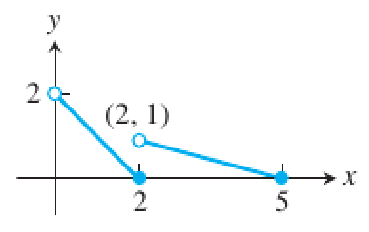
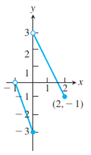
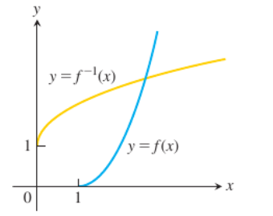
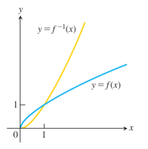

#### **1. Summary**

##### **1.1 Definition of a Sequence**

The core of analysis lies in the concept of limits. Among these, the limit of a sequence of real numbers is the most elementary form. **Sequences** provide the essential framework for the theory of infinite series as well as for many other mathematical applications.

A **sequence of real numbers** is a function $a: \mathbb{N} \to \mathbb{R}$, where the domain is the set of natural numbers $\mathbb{N}$ (or a subset like $\{n \in \mathbb{N} \mid n \geq m\}$ for some $m \in \mathbb{N}$). Instead of writing $a(n)$, we typically denote the $n$-th term in the sequence by $a_n$. To denote a sequence, we write $\{a_n\}_{n=1}^{\infty}$, or $\{a_n\}_{n\geq 1}$, or simply $\{a_n\}$ for brevity.

Think of a sequence as an ordered list of numbers: first term, second term, third term, and so on, continuing indefinitely. Each position in the list corresponds to a natural number (the index), and each index has exactly one number associated with it.

###### **1.1.1 Examples of Sequences**

Sequences can be visualized as points on the real line or as points in a plane where the horizontal axis represents the index number $n$ and the vertical axis represents the value $a_n$.

<!-- DIAGRAM HERE -->

Some basic examples of sequences:

- $\{2n\}_{n\geq 1}$: 2, 4, 6, 8, ... (even numbers)
- $\{2n+1\}_{n\geq 5}$: 11, 13, 15, ... (odd numbers starting from 11)
- $\{1/n\}_{n\geq 1}$: 1, 1/2, 1/3, ... (reciprocals)
- $\{(-1)^n\}_{n\geq 1}$: -1, 1, -1, 1, ... (alternating signs)
- $\{0\}_{n\geq 1}$: 0, 0, 0, ... (constant sequence)
- $\{1/n!\}_{n\geq 1}$: 1, 1/2, 1/6, 1/24, ... (factorial reciprocals)

###### **1.1.2 Ways to Describe Sequences**

We can describe sequences in several ways:

**By the rule of the $n$-th term (general term):**

- $a_n = \frac{1-n}{n^2}$ gives $\{a_n\}_{n\geq 2} = \{-1/4, -2/9, ...\}$
- $b_n = \frac{(-1)^{n+1}}{2n-1}$ gives $\{b_n\}_{n\geq 1} = \{1, -1/3, 1/5, -1/7, ...\}$
- $c_n = \sqrt{n-5}$ gives $\{c_n\}_{n\geq 5} = \{0, 1, \sqrt{2}, \sqrt{3}, ...\}$

**By recursive relation (recursively):**

This means defining each term based on previous terms:

- $a_1 = 1$, $a_{n+1} = a_n + \frac{1}{2^n}$ gives $\{a_n\}_{n\geq 1} = \{1, 3/2, 7/4, 15/8, ...\}$
- $b_1 = 2$, $b_2 = -1$, $b_{n+2} = \frac{b_{n+1}}{b_n}$ gives $\{b_n\}_{n\geq 1} = \{2, -1, -1/2, 1/2, -1, ...\}$

##### **1.2 Famous Recursive Sequences**

###### **1.2.1 Fibonacci Sequence**

The **Fibonacci sequence** is one of the most famous sequences in mathematics, defined by:

$$f_1 = 0, \quad f_2 = 1, \quad f_n = f_{n-2} + f_{n-1} \text{ for all } n \geq 3$$

The first terms are: 0, 1, 1, 2, 3, 5, 8, 13, 21, 34, 55, 89, 144, 233, 377, 610, 987, ...

Each term is the sum of the two preceding terms. This sequence appears frequently in nature, such as in the arrangement of leaves on a stem or the spiral patterns of shells.

There exists a **closed-form expression** (Binet's formula):

$$f_{n+1} = \frac{\varphi^n - \psi^n}{\sqrt{5}} \text{ for all } n \geq 0$$

where $\varphi = \frac{1}{2}(1 + \sqrt{5})$ is the **golden ratio**, and $\psi = \frac{1}{2}(1 - \sqrt{5})$ is its conjugate.

###### **1.2.2 Lucas Sequence**

The **Lucas sequence** has the same recursive relationship as the Fibonacci sequence, but with different starting values:

$$L_1 = 2, \quad L_2 = 1, \quad L_n = L_{n-1} + L_{n-2} \text{ for all } n \geq 3$$

The first few Lucas numbers are: 2, 1, 3, 4, 7, 11, 18, 29, 47, 76, 123, 199, 322, 521, 843, ...

Closed-form expression:

$$L_{n+1} = \varphi^n + (1-\varphi)^n = \left(\frac{1+\sqrt{5}}{2}\right)^n + \left(\frac{1-\sqrt{5}}{2}\right)^n \text{ for all } n \geq 0$$

###### **1.2.3 Pell Sequence**

The **Pell numbers** are defined by:

$$P_1 = 0, \quad P_2 = 1, \quad P_n = 2P_{n-1} + P_{n-2} \text{ for all } n \geq 3$$

The first few terms are: 0, 1, 2, 5, 12, 29, 70, 169, 408, 985, 2378, 5741, 13860, ...

Closed-form expression:

$$P_{n+1} = \frac{(1+\sqrt{2})^n - (1-\sqrt{2})^n}{2\sqrt{2}} \text{ for all } n \geq 0$$

###### **1.2.4 Triangular Numbers**

The sequence of **triangular numbers** $\{T_n\}_{n\geq 1}$ represents the number of dots in a triangle with $n$ dots to a side. Imagine arranging dots in rows: 1 dot in the first row, 2 dots in the second row, 3 dots in the third row, and so on.

<!-- DIAGRAM HERE -->

Recursive formula:

$$T_1 = 1, \quad T_{n+1} = T_n + (n+1) \text{ for all } n \geq 1$$

Explicit formula:

$$T_n = \frac{n(n+1)}{2} \text{ for all } n \geq 1$$

The first few terms: 1, 3, 6, 10, 15, 21, 28, 36, 45, 55, 66, 78, 91, 105, 120, ...

###### **1.2.5 Square and Pentagonal Numbers**

**Square numbers** represent the number of dots arranged in a square pattern:

$$S_1 = 1, \quad S_{n+1} = S_n + 2n + 1 \text{ for all } n \geq 1$$

This gives $S_n = n^2$.

**Pentagonal numbers** represent the number of dots arranged in a pentagonal pattern:

$$P_1 = 1, \quad P_{n+1} = P_n + 3n + 1 \text{ for all } n \geq 1$$

This gives $P_n = \frac{n(3n-1)}{2}$.

##### **1.3 Arithmetic Sequences**

An **arithmetic sequence** is a sequence where each term differs from the previous one by a constant amount called the **common difference**.

An arithmetic sequence $\{a_n\}_{n\geq 1}$ is defined by:

$$a_1 = k, \quad a_{n+1} = a_n + r \text{ for all } n \geq 1$$

where $k, r \in \mathbb{R}$, and $r$ is the common difference.

Examples:

- The sequence 2, 7, 12, 17, ... is arithmetic with $r = 5$
- The sequence 2, -1, -4, -7, ... is arithmetic with $r = -3$

Since each term adds $r$ to the previous term, we have:

$$a_2 = a_1 + r, \quad a_3 = a_1 + 2r, \quad a_4 = a_1 + 3r, \text{ etc.}$$

By induction, the general term is:

$$a_n = a_1 + (n-1)r \text{ for all } n \geq 1$$

More generally:

$$a_n = a_m + (n-m)r \text{ for all } n > m \geq 1$$

###### **1.3.1 Sum of Arithmetic Sequence**

The sum of the first $n$ consecutive terms of an arithmetic sequence can be expressed as:

$$S_n = \frac{n}{2}(a_1 + a_n) \text{ for all } n \geq 1$$

This formula says: multiply the number of terms by the average of the first and last term.

**Proof:**

$$S_n = a_1 + a_2 + a_3 + \cdots + a_{n-1} + a_n$$

$$= a_1 + (a_1 + r) + (a_1 + 2r) + \cdots + (a_1 + (n-2)r) + (a_1 + (n-1)r)$$

$$= na_1 + r(1 + 2 + 3 + \cdots + (n-1))$$

$$= na_1 + r \cdot \frac{(n-1)n}{2}$$

$$= n\left(a_1 + \frac{(n-1)r}{2}\right)$$

$$= \frac{n(a_1 + a_1 + (n-1)r)}{2}$$

$$= \frac{n(a_1 + a_n)}{2}$$

##### **1.4 Geometric Sequences**

A **geometric sequence** is a sequence where each term is obtained by multiplying the previous term by a constant value called the **common ratio**.

A geometric sequence $\{a_n\}_{n\geq 1}$ is defined by:

$$a_1 = k, \quad a_{n+1} = qa_n \text{ for all } n \geq 1$$

where $k, q \in \mathbb{R} \setminus \{0\}$ and $q$ is the common ratio.

Examples:

- The sequence $\{2, 6, 18, 54, ...\}$ is geometric with common ratio $q = 3$. The general term is $a_n = 2 \cdot 3^{n-1}$
- The sequence $\{1, -1/2, 1/4, -1/8, ...\}$ is geometric with common ratio $q = -1/2$. The general term is $a_n = (-1/2)^{n-1}$

Since each term is multiplied by $q$:

$$a_2 = a_1q, \quad a_3 = a_1q^2, \quad a_4 = a_1q^3, \text{ etc.}$$

By induction, the general term is:

$$a_n = a_1q^{n-1} \text{ for all } n \geq 1$$

More generally:

$$a_n = a_mq^{n-m} \text{ for all } n > m \geq 1$$

###### **1.4.1 Sum of Geometric Sequence**

The sum of the first $n$ consecutive terms of a geometric sequence with common ratio $q \in \mathbb{R} \setminus \{0, 1\}$ is:

$$S_n = \frac{a_1(1 - q^n)}{1 - q} \text{ for } q \in \mathbb{R} \setminus \{0, 1\}$$

**Proof:**

Let $S_n = a_1 + a_2 + a_3 + \cdots + a_n$. Multiplying both sides by $q$:

$$qS_n = qa_1 + qa_2 + qa_3 + \cdots + qa_n = a_2 + a_3 + a_4 + \cdots + a_{n+1}$$

Subtracting the second equation from the first:

$$S_n - qS_n = a_1 - a_{n+1}$$

$$S_n(1 - q) = a_1 - a_{n+1} = a_1 - a_1q^n$$

$$S_n = \frac{a_1(1 - q^n)}{1 - q}$$

##### **1.5 The Limit of a Sequence**

Now we come to one of the most fundamental concepts in mathematical analysis: the idea of a limit. Informally, a sequence has a limit $L$ if its terms get arbitrarily close to $L$ as we go further out in the sequence.

###### **1.5.1 Intuitive Understanding**

Consider the sequence $\{a_n\}_{n\geq 5}$ where $a_n = \frac{n+1}{n-4}$. We can rewrite this as:

$$a_n = \frac{n+1}{n-4} = \frac{1 + 1/n}{1 - 4/n}$$

For large values of $n$, both $1/n$ and $4/n$ become very small (approaching zero), so $a_n$ approaches $\frac{1}{1} = 1$.

Let's make this precise. Suppose we want $|a_n - 1|$ to be less than some small positive number $\varepsilon$ (epsilon). How large must $n$ be? We can solve:

$$|a_n - 1| < \varepsilon$$

$$\left|\frac{n+1}{n-4} - 1\right| < \varepsilon$$

$$\left|\frac{n+1 - (n-4)}{n-4}\right| < \varepsilon$$

$$\frac{5}{n-4} < \varepsilon$$

$$n > 4 + \frac{5}{\varepsilon}$$

So if we let $N = \left[4 + \frac{5}{\varepsilon}\right]$ (the greatest integer less than or equal to $4 + \frac{5}{\varepsilon}$), then for all $n > N$, we have $|a_n - 1| < \varepsilon$.

This shows that no matter how small we make $\varepsilon$, we can always find an index $N$ beyond which all terms are within $\varepsilon$ of 1.

###### **1.5.2 Formal Definition of Convergence**

A sequence $\{a_n\}$ is said to **converge** (or to be **convergent**) to a number $L$ if, for every $\varepsilon > 0$, there exists an index $N \in \mathbb{N}$ such that:

$$|a_n - L| < \varepsilon \text{ for all } n > N$$

If no such number $L$ exists, the sequence $\{a_n\}$ is called **divergent** (or said to **diverge**). When $\{a_n\}$ converges to $L$, we write:

$$\lim_{n \to \infty} a_n = L$$

and refer to $L$ as the **limit** of the sequence.

The definition says: a sequence converges to $L$ if we can make the terms as close to $L$ as we want (within any positive distance $\varepsilon$) by going far enough out in the sequence (beyond some index $N$).

###### **1.5.3 Examples of Convergence**

**Example 1:** Let $a_n = \frac{3n+1}{7n-4}$. Prove that $\lim_{n \to \infty} a_n = \frac{3}{7}$.

For each $\varepsilon > 0$, we need to find how large $n$ must be to guarantee $|a_n - 3/7| < \varepsilon$.

$$\left|a_n - \frac{3}{7}\right| = \left|\frac{3n+1}{7n-4} - \frac{3}{7}\right|$$

$$= \left|\frac{7(3n+1) - 3(7n-4)}{7(7n-4)}\right|$$

$$= \left|\frac{21n + 7 - 21n + 12}{7(7n-4)}\right|$$

$$= \frac{19}{7(7n-4)}$$

We want this to be less than $\varepsilon$:

$$\frac{19}{7(7n-4)} < \varepsilon$$

$$19 < 7\varepsilon(7n-4)$$

$$19 < 49\varepsilon n - 28\varepsilon$$

$$n > \frac{19 + 28\varepsilon}{49\varepsilon} = \frac{19}{49\varepsilon} + \frac{4}{7}$$

Let $N = \left[\frac{19}{49\varepsilon} + \frac{4}{7}\right]$. Then for all $n > N$, we have $|a_n - 3/7| < \varepsilon$.

**Example 2:** Prove that $\lim_{n \to \infty} (\sqrt{n+1} - \sqrt{n}) = 0$.

Let $a_n := \sqrt{n+1} - \sqrt{n}$ and $\varepsilon > 0$. We want to show $|a_n - 0| < \varepsilon$ for sufficiently large $n$.

$$|a_n - 0| = |\sqrt{n+1} - \sqrt{n}|$$

Rationalizing the numerator:

$$= \frac{(\sqrt{n+1} - \sqrt{n})(\sqrt{n+1} + \sqrt{n})}{\sqrt{n+1} + \sqrt{n}}$$

$$= \frac{(n+1) - n}{\sqrt{n+1} + \sqrt{n}}$$

$$= \frac{1}{\sqrt{n+1} + \sqrt{n}}$$

Since $\sqrt{n+1} + \sqrt{n} > \sqrt{n}$, we have:

$$\frac{1}{\sqrt{n+1} + \sqrt{n}} < \frac{1}{\sqrt{n}}$$

So if we make $\frac{1}{\sqrt{n}} < \varepsilon$, we guarantee our desired inequality:

$$\frac{1}{\sqrt{n}} < \varepsilon \Rightarrow \sqrt{n} > \frac{1}{\varepsilon} \Rightarrow n > \frac{1}{\varepsilon^2}$$

Let $N = \left[\frac{1}{\varepsilon^2}\right]$. Then for all $n > N$, we have $|a_n - 0| < \varepsilon$.

**Example 3 (Geometric sequence):** Let $q \in \mathbb{R}$ with $|q| < 1$. Then $\lim_{n \to \infty} q^n = 0$.

If $q = 0$, the result is immediate. Suppose $0 < |q| < 1$ and let $\varepsilon > 0$.

By Bernoulli's inequality, for any $x > -1$ and $n \in \mathbb{N}$:

$$(1 + x)^n \geq 1 + nx$$

Let $x = \frac{1}{|q|} - 1 > 0$ (since $|q| < 1$). Then:

$$\left(1 + \left(\frac{1}{|q|} - 1\right)\right)^n = \frac{1}{|q|^n} \geq 1 + n\left(\frac{1}{|q|} - 1\right) > n\left(\frac{1}{|q|} - 1\right) = \frac{(1-|q|)n}{|q|}$$

Therefore:

$$|q^n - 0| = |q|^n < \frac{|q|}{(1-|q|)n}$$

Setting $\frac{|q|}{(1-|q|)n} < \varepsilon$:

$$n > \frac{|q|}{(1-|q|)\varepsilon}$$

Let $N = \left[\frac{|q|}{(1-|q|)\varepsilon}\right]$. Then for all $n > N$, we have $|q^n - 0| < \varepsilon$.

This is an important result: **any geometric sequence with ratio between -1 and 1 converges to zero**.

<!-- DIAGRAM HERE -->

###### **1.5.4 Example of Divergence**

**Example:** Show that the sequence $\{a_n\}_{n\geq 1}$ where $a_n = (-1)^n$ does not converge.

Assume, for contradiction, that $\lim_{n \to \infty} (-1)^n = a$ for some $a \in \mathbb{R}$.

Let $\varepsilon = 1$. Then by definition, there exists $N \in \mathbb{N}$ such that:

$$|(-1)^n - a| < 1 \text{ for all } n > N$$

Consider both an even and an odd $n > N$:

- For even $n > N$: $|1 - a| < 1$
- For odd $n > N$: $|-1 - a| < 1$

By the triangle inequality:

$$2 = |2| = |(1 - a) - (-1 - a)| \leq |1 - a| + |-1 - a| < 1 + 1 = 2$$

This gives $2 < 2$, which is a contradiction. Therefore, $(-1)^n$ does not converge.

###### **1.5.5 Uniqueness of Limits**

**Theorem:** A convergent sequence has a unique limit.

**Proof:** Suppose $\{a_n\}$ has limits $a$ and $b$. Let $\varepsilon > 0$ be arbitrary.

Since $\lim_{n \to \infty} a_n = a$, there exists $N_1 \in \mathbb{N}$ such that:

$$|a_n - a| < \frac{\varepsilon}{2} \text{ for all } n > N_1$$

Similarly, since $\lim_{n \to \infty} a_n = b$, there exists $N_2 \in \mathbb{N}$ such that:

$$|a_n - b| < \frac{\varepsilon}{2} \text{ for all } n > N_2$$

Let $N = \max\{N_1, N_2\}$. Then for any $n > N$:

$$|a - b| = |a_n - b - (a_n - a)| \leq |a_n - b| + |a_n - a| < \frac{\varepsilon}{2} + \frac{\varepsilon}{2} = \varepsilon$$

Thus $0 \leq |a - b| < \varepsilon$ for all $\varepsilon > 0$. This means $|a - b| = 0$, so $a = b$.

##### **1.6 Types of Convergence**

The **speed** at which a sequence converges to its limit can vary significantly. We classify different rates of convergence:

Let $\{a_n\}_{n\geq 1}$ be a sequence that converges to $a$, i.e., $\lim_{n \to \infty} a_n = a$. Let $C > 0$, $0 < q < 1$, and $\alpha > 0$. Then:

- $\{a_n\}$ is **sublinearly convergent** to $a$ if $|a_n - a| \leq \frac{C}{n^\alpha}$
- $\{a_n\}$ is **linearly convergent** to $a$ if $|a_n - a| \leq Cq^n$
- $\{a_n\}$ is **superlinearly convergent** to $a$ if $|a_n - a| \leq Cq^{n^2}$
- $\{a_n\}$ is **quadratically convergent** to $a$ if $|a_n - a| \leq Cq^{2^n}$

These classifications help us understand how quickly the error decreases as $n$ increases. Quadratic convergence is the fastest, followed by superlinear, linear, and finally sublinear.

##### **1.7 Divergence to Infinity**

Some sequences don't converge to a finite limit, but their terms grow without bound. We have special notation for this:

**Definition:**

- The sequence $\{a_n\}$ **diverges to $\infty$** if for every $M \in \mathbb{R}$, there exists $N \in \mathbb{N}$ such that $a_n > M$ for all $n > N$. We write $\lim_{n \to \infty} a_n = \infty$.

- Similarly, $\{a_n\}$ **diverges to $-\infty$** if for every $m \in \mathbb{R}$, there exists $N \in \mathbb{N}$ such that $a_n < m$ for all $n > N$. We write $\lim_{n \to \infty} a_n = -\infty$.

Intuitively, this means the terms eventually exceed any bound we can set.

**Example 1:** Prove that $\lim_{n \to \infty} (\sqrt{n} + \alpha) = \infty$ for any $\alpha \in \mathbb{R}$.

Let $M > 0$ be arbitrary. We need to find $N \in \mathbb{N}$ such that $a_n := \sqrt{n} + \alpha > M$ for all $n > N$.

$$\sqrt{n} + \alpha > M \Leftrightarrow \sqrt{n} > M - \alpha \Leftrightarrow n > (M - \alpha)^2$$

Let $N = [(M - \alpha)^2]$. Then for all $n > N$, we have $\sqrt{n} + \alpha > M$.

**Example 2:** Prove that $\lim_{n \to \infty} \frac{n^2 + 3}{n + 1} = \infty$.

Let $M > 0$. We need to find $N \in \mathbb{N}$ such that $a_n := \frac{n^2 + 3}{n + 1} > M$ for all $n > N$.

Note that for any $n \geq 1$:

$$n^2 + 3 > n^2 \text{ and } n + 1 < 2n$$

Therefore:

$$\frac{n^2 + 3}{n + 1} > \frac{n^2}{2n} = \frac{n}{2}$$

Setting $\frac{n}{2} > M$ gives $n > 2M$.

Let $N = [2M]$. Then for all $n > N$, we have $\frac{n^2 + 3}{n + 1} > M$.

##### **1.8 Bounded Sequences**

Just as we can have bounded functions, we can have bounded sequences. The concept is simpler since sequences only have integer indices.

**Definition:**

A sequence $\{a_n\}_{n\geq 1}$ is said to be **bounded** if there exist two constants $m$ and $M$ such that:

$$m \leq a_n \leq M \text{ for all } n \geq 1$$

The constant $m$ is called a **lower bound** of the sequence, and $M$ is an **upper bound**.

Alternatively, a sequence $\{a_n\}_{n\geq 1}$ is bounded if there exists a constant $C > 0$ such that:

$$|a_n| \leq C \text{ for all } n \geq 1$$

If a sequence is not bounded, we say it is **unbounded**. This means for any $M > 0$, there exists $N \in \mathbb{N}$ (depending on $M$) such that $|a_n| > M$ for some $n > N$.

**Important distinction:** An unbounded sequence is not the same as a sequence that diverges to infinity. We'll see an example of this shortly.

Examples of bounded sequences:

- $\{(-1)^n\}_{n\geq 1}$ is bounded (between -1 and 1)
- $\{n/(n+1)\}_{n\geq 1} = \{1/2, 2/3, 3/4, ...\}$ is bounded (between 1/2 and 1)

Examples of unbounded sequences:

- $\{2, 4, 6, 8, ...\}$ is unbounded

###### **1.8.1 Convergent Sequences are Bounded**

**Theorem:** A convergent sequence is bounded.

**Proof:** Let $\{a_n\}_{n\geq 1}$ be a convergent sequence with $\lim_{n \to \infty} a_n = L$.

By the definition of convergence with $\varepsilon = 1$, there exists $N \in \mathbb{N}$ such that:

$$|a_n - L| < 1 \text{ for all } n > N$$

This means:

$$L - 1 < a_n < L + 1 \text{ for all } n > N$$

Now, let $M$ be larger than $L + 1$ and all the (finitely many) terms $a_1, a_2, ..., a_N$:

$$M = \max\{a_1, a_2, ..., a_N, L + 1\}$$

Similarly, let $m$ be smaller than $L - 1$ and all terms $a_1, a_2, ..., a_N$:

$$m = \min\{L - 1, a_1, a_2, ..., a_N\}$$

Then $m \leq a_n \leq M$ for all $n \geq 1$, so the sequence is bounded.

**Important note:** The converse is not true! A bounded sequence need not converge. For example, $\{(-1)^n\}_{n\geq 1}$ is bounded but does not converge.

###### **1.8.2 Examples of Bounded Sequences**

**Example 1:** The sequence $a_n = \frac{2n^2 - 1}{n^2 + 1}$ is bounded for any $n \geq 1$.

For any $n \geq 1$:

$$0 < \frac{2n^2 - 1}{n^2 + 1} < \frac{2n^2 - 1}{n^2} = 2 - \frac{1}{n^2} < 2$$

Thus, 0 is a lower bound and 2 is an upper bound.

**Example 2:** The sequence $b_n = \frac{1-n}{\sqrt{n^2 + 1}}$ is bounded for any $n \geq 1$.

$$|b_n| = \left|\frac{1-n}{\sqrt{n^2 + 1}}\right| \leq \frac{1+n}{\sqrt{n^2 + 1}} < \frac{1+n}{\sqrt{n^2}} = \frac{1+n}{n} = 1 + \frac{1}{n} < 2$$

Therefore, $-2 < b_n < 2$ for all $n \geq 1$.

Note that $b_n \leq 0$ for all $n \geq 1$, so we can actually write $-2 < b_n \leq 0$.

<!-- DIAGRAM HERE -->

**Example 3:** The sequence $c_n = \frac{5n^6 + 6}{(n^4 + 1)(n^2 - 1)}$ is bounded for any $n \geq 2$.

For $n \geq 2$:

$$n^4 + 1 > n^4 \Rightarrow \frac{1}{n^4 + 1} < \frac{1}{n^4}$$

$$n^2 - 1 > \frac{n^2}{2} \Rightarrow \frac{1}{n^2 - 1} < \frac{2}{n^2}$$

Therefore:

$$|c_n| = \frac{5n^6 + 6}{(n^4 + 1)(n^2 - 1)} < (5n^6 + 6) \cdot \frac{1}{n^4} \cdot \frac{2}{n^2}$$

$$= \frac{2(5n^6 + 6)}{n^6} = 2\left(5 + \frac{6}{n^6}\right) < 12$$

Thus, $0 < c_n < 12$ for all $n \geq 2$.

<!-- DIAGRAM HERE -->

###### **1.8.3 Unbounded Sequences**

**Example:** The sequence $d_n = n^2 - n$ is unbounded.

Let $M > 0$ be arbitrary. For $n \geq 3$, we have $n^2 > 2n$, thus:

$$n^2 - n > n$$

Setting $n > M$ and taking $N = [M]$, we find:

$$d_n = n^2 - n > n > M \text{ for all } n > N$$

Therefore, the sequence is unbounded.

###### **1.8.4 Unbounded vs. Divergence to Infinity**

It is crucial to distinguish between an unbounded sequence and a sequence that diverges to infinity.

**An unbounded sequence does not necessarily diverge to $\pm\infty$.**

A sequence diverges to infinity only if its terms become arbitrarily large and remain positive (or negative) for all sufficiently large $n$.

**Example:** Consider $a_n = (-1)^n \cdot n$.

This sequence is unbounded. Indeed, $|a_n| = n$, so for any $M > 0$, taking $N = [M]$ gives:

$$|a_n| = n > M \text{ for all } n > N$$

However, the sequence does not diverge to $\infty$ or $-\infty$. The terms oscillate between increasingly large positive and negative values:

$$a_1 = -1, \quad a_2 = 2, \quad a_3 = -3, \quad a_4 = 4, ...$$

The limit $\lim_{n \to \infty} a_n$ does not exist at all.

##### **1.9 Comparison Theorems**

These theorems allow us to determine the limit of a sequence by comparing it with other sequences whose limits we already know.

###### **1.9.1 Useful Lemma**

**Lemma:** Let $x, y \in \mathbb{R}$. Then:

$$x \leq y \Leftrightarrow x < y + \varepsilon \text{ for all } \varepsilon > 0$$

**Proof:**

($\Rightarrow$) If $x \leq y$ and $\varepsilon > 0$, then $x < x + \varepsilon \leq y + \varepsilon$, so $x < y + \varepsilon$.

($\Leftarrow$) Suppose $x < y + \varepsilon$ for all $\varepsilon > 0$. Assume for contradiction that $x > y$. Let $\varepsilon = x - y > 0$. Then:

$$x < y + \varepsilon = y + (x - y) = x$$

This gives $x < x$, which is a contradiction. Therefore, $x \leq y$.

###### **1.9.2 Comparison Theorem**

**Theorem:** Let $\{a_n\}_{n\geq 1}$ and $\{b_n\}_{n\geq 1}$ be convergent sequences with $a_n \leq b_n$ for all $n \geq 1$. Then:

$$\lim_{n \to \infty} a_n \leq \lim_{n \to \infty} b_n$$

**Proof:** Let $a = \lim_{n \to \infty} a_n$ and $b = \lim_{n \to \infty} b_n$.

For any $\varepsilon > 0$, there exist $N_1, N_2 \in \mathbb{N}$ such that:

$$|a_n - a| < \frac{\varepsilon}{2} \Leftrightarrow a - \frac{\varepsilon}{2} < a_n < a + \frac{\varepsilon}{2} \text{ for all } n > N_1$$

$$|b_n - b| < \frac{\varepsilon}{2} \Leftrightarrow b - \frac{\varepsilon}{2} < b_n < b + \frac{\varepsilon}{2} \text{ for all } n > N_2$$

Let $N = \max\{N_1, N_2\}$. Then for all $n > N$:

$$a - \frac{\varepsilon}{2} < a_n \leq b_n < b + \frac{\varepsilon}{2}$$

Thus:

$$a < b + \varepsilon \text{ for all } \varepsilon > 0$$

By the previous lemma, $a \leq b$.

**Important remark:** We cannot replace non-strict inequalities with strict inequalities. That is, if $a_n < b_n$ for all $n \in \mathbb{N}$, it is *not* necessarily true that $\lim_{n \to \infty} a_n < \lim_{n \to \infty} b_n$.

**Counterexample:** Let $a_n = -1/n$ and $b_n = 1/n$. Then $a_n < b_n$ for all $n \geq 1$, but:

$$\lim_{n \to \infty} a_n = 0 = \lim_{n \to \infty} b_n$$

Therefore, if we know $a_n < b_n$ for all $n$, we may only conclude $\lim_{n \to \infty} a_n \leq \lim_{n \to \infty} b_n$.

###### **1.9.3 Comparison Theorem (Infinite Case)**

**Theorem:** Let $\{a_n\}_{n\geq 1}$ and $\{b_n\}_{n\geq 1}$ be sequences with $a_n \leq b_n$ for all $n \geq 1$. Then:

- If $\lim_{n \to \infty} a_n = +\infty$, then $\lim_{n \to \infty} b_n = +\infty$
- If $\lim_{n \to \infty} b_n = -\infty$, then $\lim_{n \to \infty} a_n = -\infty$

This theorem says: if a smaller sequence goes to infinity, the larger one must too. If a larger sequence goes to negative infinity, the smaller one must too.

###### **1.9.4 Sandwich (Squeeze) Theorem**

**Theorem (Sandwich/Squeeze Theorem):** Let $\{a_n\}_{n\geq 1}$, $\{b_n\}_{n\geq 1}$, and $\{c_n\}_{n\geq 1}$ be sequences. If:

$$a_n \leq b_n \leq c_n$$

for all $n$ beyond some index $N \in \mathbb{N}$, and if:

$$\lim_{n \to \infty} a_n = \lim_{n \to \infty} c_n = L \in \mathbb{R}$$

then:

$$\lim_{n \to \infty} b_n = L$$

**Proof:** Let $\varepsilon > 0$. Since $\lim_{n \to \infty} a_n = L$, there exists $N_1 \in \mathbb{N}$ such that:

$$L - \varepsilon < a_n < L + \varepsilon \text{ for all } n > N_1$$

Since $\lim_{n \to \infty} c_n = L$, there exists $N_2 \in \mathbb{N}$ such that:

$$L - \varepsilon < c_n < L + \varepsilon \text{ for all } n > N_2$$

Let $N = \max\{N_1, N_2\}$. Then for all $n > N$:

$$L - \varepsilon < a_n \leq b_n \leq c_n < L + \varepsilon$$

Thus:

$$L - \varepsilon < b_n < L + \varepsilon$$

This means $\lim_{n \to \infty} b_n = L$.

###### **1.9.5 Examples Using Sandwich Theorem**

**Example 1:** For $a_n = \frac{\sin(n)}{n}$, we have:

$$-\frac{1}{n} \leq \frac{\sin(n)}{n} \leq \frac{1}{n}$$

Since $\lim_{n \to \infty} (-1/n) = 0$ and $\lim_{n \to \infty} (1/n) = 0$, we obtain:

$$\lim_{n \to \infty} \frac{\sin(n)}{n} = 0$$

<!-- DIAGRAM HERE -->

**Example 2:** For $a_n = \frac{\cos^2(n)}{2^n}$, note that $2^n > n$ for all $n \geq 1$. Thus:

$$0 \leq \frac{\cos^2(n)}{2^n} \leq \frac{1}{2^n} < \frac{1}{n}$$

Since $\lim_{n \to \infty} 0 = 0$ and $\lim_{n \to \infty} 1/n = 0$:

$$\lim_{n \to \infty} \frac{\cos^2(n)}{2^n} = 0$$

**Corollary:** An immediate consequence of the Sandwich Theorem is: if $|b_n| \leq c_n$ and $\lim_{n \to \infty} c_n = 0$, then $\lim_{n \to \infty} b_n = 0$.

This is because $-c_n \leq b_n \leq c_n$.

**Example:** $\lim_{n \to \infty} \frac{(-1)^n}{n} = 0$ since:

$$\left|\frac{(-1)^n}{n}\right| = \frac{1}{n} \to 0 \text{ as } n \to \infty$$

##### **1.10 Properties of the Limits (Limit Theorems)**

These fundamental theorems allow us to break down complicated limits into simpler ones. They are the workhorses of limit calculations.

**Theorem:** Let $\{a_n\}$ and $\{b_n\}$ be sequences with $\lim_{n \to \infty} a_n = a \in \mathbb{R}$ and $\lim_{n \to \infty} b_n = b \in \mathbb{R}$. Then:

1. **Sum Rule:** $\lim_{n \to \infty} (a_n + b_n) = a + b$
2. **Constant Multiple Rule:** $\lim_{n \to \infty} (\alpha a_n) = \alpha a$ for any $\alpha \in \mathbb{R}$
3. **Product Rule:** $\lim_{n \to \infty} (a_n \cdot b_n) = ab$
4. **Quotient Rule:** $\lim_{n \to \infty} \frac{a_n}{b_n} = \frac{a}{b}$ if $b_n \neq 0$ for all $n$ and $b \neq 0$

###### **1.10.1 Proof of Sum Rule**

**Proof of Sum Rule:** Let $\varepsilon > 0$.

Since $\lim_{n \to \infty} a_n = a$, there exists $N_1 \in \mathbb{N}$ such that:

$$|a_n - a| < \frac{\varepsilon}{2} \text{ for all } n > N_1$$

Similarly, since $\lim_{n \to \infty} b_n = b$, there exists $N_2 \in \mathbb{N}$ such that:

$$|b_n - b| < \frac{\varepsilon}{2} \text{ for all } n > N_2$$

Let $N = \max\{N_1, N_2\}$. Then by the triangle inequality, for all $n > N$:

$$|(a_n + b_n) - (a + b)| \leq |a_n - a| + |b_n - b| < \frac{\varepsilon}{2} + \frac{\varepsilon}{2} = \varepsilon$$

Therefore, $\lim_{n \to \infty} (a_n + b_n) = a + b$.

###### **1.10.2 Proof of Constant Multiple Rule**

**Proof of Constant Multiple Rule:** If $\alpha = 0$, then $\alpha a = 0$ and $\alpha a_n = 0$ for all $n$, so the result is immediate.

Suppose $\alpha \neq 0$. Let $\varepsilon > 0$. For any $n \in \mathbb{N}$:

$$|\alpha a_n - \alpha a| = |\alpha| \cdot |a_n - a|$$

Since $\{a_n\}$ converges to $a$, there exists $N \in \mathbb{N}$ such that:

$$|a_n - a| < \frac{\varepsilon}{|\alpha|} \text{ for all } n > N$$

Therefore:

$$|\alpha a_n - \alpha a| = |\alpha| \cdot |a_n - a| < |\alpha| \cdot \frac{\varepsilon}{|\alpha|} = \varepsilon \text{ for all } n > N$$

Thus, $\lim_{n \to \infty} \alpha a_n = \alpha a$.

###### **1.10.3 Proof of Product Rule**

**Proof of Product Rule:** For every $n \in \mathbb{N}$:

$$|a_nb_n - ab| = |a_nb_n - a_nb + a_nb - ab| \leq |a_n||b_n - b| + |b||a_n - a|$$

Since $\{a_n\}$ is convergent, it is bounded. Therefore, there exists $M > 0$ such that $|a_n| \leq M$ for all $n \in \mathbb{N}$.

Let $\varepsilon > 0$. Since $\{a_n\}$ converges to $a$, there exists $N_1 \in \mathbb{N}$ such that:

$$|a_n - a| < \frac{\varepsilon}{2(|b| + 1)} \text{ for all } n > N_1$$

Since $\{b_n\}$ converges to $b$, there exists $N_2 \in \mathbb{N}$ such that:

$$|b_n - b| < \frac{\varepsilon}{2M} \text{ for all } n > N_2$$

Let $N = \max\{N_1, N_2\}$. Then for all $n > N$:

$$|a_nb_n - ab| < M \cdot \frac{\varepsilon}{2M} + |b| \cdot \frac{\varepsilon}{2(|b| + 1)} < \frac{\varepsilon}{2} + \frac{\varepsilon}{2} = \varepsilon$$

Therefore, $\lim_{n \to \infty} (a_nb_n) = ab$.

###### **1.10.4 Proof of Quotient Rule**

**Proof of Quotient Rule:** First, we'll prove that $\lim_{n \to \infty} \frac{1}{b_n} = \frac{1}{b}$.

For any $n \in \mathbb{N}$:

$$\left|\frac{1}{b_n} - \frac{1}{b}\right| = \frac{|b_n - b|}{|b_n| \cdot |b|}$$

Since $\{b_n\}$ converges to $b$, there exists $N_1 \in \mathbb{N}$ such that:

$$|b_n - b| < \frac{|b|}{2} \text{ for all } n > N_1$$

By the triangle inequality, for any $n > N_1$:

$$||b_n| - |b|| \leq |b_n - b| < \frac{|b|}{2}$$

$$\Rightarrow -\frac{|b|}{2} < |b_n| - |b| < \frac{|b|}{2}$$

$$\Rightarrow \frac{|b|}{2} < |b_n|$$

$$\Rightarrow \frac{1}{|b_n|} < \frac{2}{|b|}$$

Let $\varepsilon > 0$. Since $\{b_n\}$ converges to $b$, there exists $N_2 \in \mathbb{N}$ such that:

$$|b_n - b| < \frac{b^2\varepsilon}{2} \text{ for all } n > N_2$$

Let $N = \max\{N_1, N_2\}$. Then for all $n > N$:

$$\left|\frac{1}{b_n} - \frac{1}{b}\right| = \frac{|b_n - b|}{|b_n| \cdot |b|} < \frac{b^2\varepsilon/2}{|b|^2} \cdot \frac{2}{1} = \varepsilon$$

Therefore, $\lim_{n \to \infty} \frac{1}{b_n} = \frac{1}{b}$.

Finally, for the sequence $\{a_n/b_n\}$, using the Product Rule:

$$\lim_{n \to \infty} \frac{a_n}{b_n} = \lim_{n \to \infty} a_n \cdot \frac{1}{b_n} = \lim_{n \to \infty} a_n \cdot \lim_{n \to \infty} \frac{1}{b_n} = a \cdot \frac{1}{b} = \frac{a}{b}$$

###### **1.10.5 Examples**

**Example 1:** $\lim_{n \to \infty} \frac{-2}{n} = -2 \lim_{n \to \infty} \frac{1}{n} = -2(0) = 0$

**Example 2:** $\lim_{n \to \infty} \frac{5}{n^2} = 5 \lim_{n \to \infty} \frac{1}{n} \cdot \lim_{n \to \infty} \frac{1}{n} = 5 \cdot 0 \cdot 0 = 0$

**Example 3:**

$$\lim_{n \to \infty} \frac{n^2 - 4n + 5}{3n^2 - 2n + 1} = \lim_{n \to \infty} \frac{1 - 4/n + 5/n^2}{3 - 2/n + 1/n^2}$$

$$= \frac{1 - 4 \lim_{n \to \infty} 1/n + 5 \lim_{n \to \infty} 1/n^2}{3 - 2 \lim_{n \to \infty} 1/n + \lim_{n \to \infty} 1/n^2}$$

$$= \frac{1 - 0 + 0}{3 - 0 + 0} = \frac{1}{3}$$

###### **1.10.6 Important Remarks**

**Remark 1:** The condition that both $\lim_{n \to \infty} a_n$ and $\lim_{n \to \infty} b_n$ exist is crucial.

For example, let $a_n = (-1)^n$ and $b_n = (-1)^{n+1} + \frac{n}{n+1}$. Neither limit exists individually, but:

$$\lim_{n \to \infty} (a_n + b_n) = \lim_{n \to \infty} \left((-1)^n + (-1)^{n+1} + \frac{n}{n+1}\right) = \lim_{n \to \infty} \frac{n}{n+1} = 1$$

This shows that the sum can converge even when the individual sequences don't. However, we cannot write this as $\lim a_n + \lim b_n$ because those limits don't exist.

**Remark 2:** The sum (or difference, multiplication, division) of two convergent sequences is convergent. However, the sum (or difference, multiplication, division) of two divergent sequences can be either convergent or divergent.

Example: Let $a_n = n$ and $b_n = -n$. Both sequences diverge ($\lim_{n \to \infty} a_n = +\infty$ and $\lim_{n \to \infty} b_n = -\infty$), but:

$$\lim_{n \to \infty} (a_n + b_n) = \lim_{n \to \infty} 0 = 0$$

The sum is convergent!

###### **1.10.7 Limits Involving Square Roots**

**Theorem:** Let $\{a_n\}_{n\geq 1}$ be a convergent sequence with $a_n \geq 0$ for all $n \geq 1$ and $\lim_{n \to \infty} a_n = a \geq 0$. Then:

$$\lim_{n \to \infty} \sqrt{a_n} = \sqrt{a}$$

**Proof:** When $a = 0$, let $\varepsilon > 0$. By definition, there exists $N \in \mathbb{N}$ such that:

$$a_n = |a_n - 0| < \varepsilon^2 \text{ for all } n > N$$

Therefore:

$$|\sqrt{a_n} - \sqrt{a}| = \sqrt{a_n} < \varepsilon$$

Thus, $\lim_{n \to \infty} \sqrt{a_n} = \sqrt{a} = 0$.

Now assume $a > 0$, so $\sqrt{a} > 0$. Since $\sqrt{a_n} \geq 0$:

$$|\sqrt{a_n} - \sqrt{a}| = \frac{|a_n - a|}{\sqrt{a_n} + \sqrt{a}} = \frac{1}{\sqrt{a_n} + \sqrt{a}} \cdot |a_n - a| \leq \frac{1}{\sqrt{a}} \cdot |a_n - a|$$

Since $\lim_{n \to \infty} a_n = a$, for any $\varepsilon > 0$, there exists $N \in \mathbb{N}$ such that:

$$|a_n - a| \leq \sqrt{a}\varepsilon \text{ for all } n > N$$

Therefore:

$$|\sqrt{a_n} - \sqrt{a}| < \frac{1}{\sqrt{a}} \cdot \sqrt{a}\varepsilon = \varepsilon \text{ for all } n > N$$

This means $\lim_{n \to \infty} \sqrt{a_n} = \sqrt{a}$.

**General case:** Similarly, we can prove that for any $k \in \{2, 3, 4, 5, ...\}$:

$$\lim_{n \to \infty} \sqrt[k]{a_n} = \sqrt[k]{a}$$

Note: when $k$ is even, we must assume $a_n \geq 0$.

###### **1.10.8 Limits Involving Absolute Values**

**Theorem:** Let $\{a_n\}_{n\geq 1}$ be a convergent sequence with $\lim_{n \to \infty} a_n = a \in \mathbb{R}$. Then:

$$\lim_{n \to \infty} |a_n| = |a|$$

**Proof:** Let $\varepsilon > 0$. Since $\lim_{n \to \infty} a_n = a$, there exists $N \in \mathbb{N}$ such that:

$$|a_n - a| < \varepsilon \text{ for all } n > N$$

By the reverse triangle inequality:

$$||a_n| - |a|| \leq |a_n - a| < \varepsilon \text{ for all } n > N$$

Therefore, $\lim_{n \to \infty} |a_n| = |a|$.

###### **1.10.9 Important Facts About Absolute Values**

**Remark 1:** $\lim_{n \to \infty} a_n = 0 \Leftrightarrow \lim_{n \to \infty} |a_n| = 0$

($\Rightarrow$) This follows from the previous theorem.

($\Leftarrow$) Assume $\lim_{n \to \infty} |a_n| = 0$. We have:

$$-|a_n| \leq a_n \leq |a_n| \text{ for all } n \geq 1$$

Since $\lim_{n \to \infty} (-|a_n|) = 0$ and $\lim_{n \to \infty} |a_n| = 0$, by the Sandwich Theorem:

$$\lim_{n \to \infty} a_n = 0$$

**Remark 2:** The converse of the theorem is not true when the limit is nonzero. If $\{|a_n|\}$ converges to a nonzero limit, it doesn't necessarily mean $\{a_n\}$ converges.

**Example:** Let $a_n = (-1)^n$. Then:

$$|a_n| = |(-1)^n| = 1 \text{ for all } n \geq 1$$

Thus, $\lim_{n \to \infty} |a_n| = 1$. However, the sequence $\{a_n = (-1)^n\}_{n\geq 1}$ does not converge.

##### **1.11 Basic Limits**

Here are some fundamental limits that are frequently used in calculations:

###### **1.11.1 Geometric Sequences**

We already proved:

$$\lim_{n \to \infty} q^n = 0 \text{ for all } |q| < 1$$

###### **1.11.2 Polynomial-Type Limits**

**Limit 1:** For any $p > 0$:

$$\lim_{n \to \infty} \frac{1}{n^p} = 0$$

**Proof:** Let $\varepsilon > 0$. Then:

$$\left|\frac{1}{n^p} - 0\right| < \varepsilon \Leftrightarrow \frac{1}{n^p} < \varepsilon \Leftrightarrow n^p > \frac{1}{\varepsilon} \Leftrightarrow n > \left(\frac{1}{\varepsilon}\right)^{1/p}$$

Let $N = \left[\left(\frac{1}{\varepsilon}\right)^{1/p}\right]$. Then for all $n > N$:

$$\left|\frac{1}{n^p} - 0\right| < \varepsilon$$

Therefore, $\lim_{n \to \infty} \frac{1}{n^p} = 0$.

###### **1.11.3 The $n$-th Root of $n$**

**Limit 2:**

$$\lim_{n \to \infty} n^{1/n} = 1$$

**Proof:** Let $a_n = n^{1/n} - 1$. Note that $a_n \geq 0$ for all $n \geq 1$. We have:

$$a_n = n^{1/n} - 1 \Rightarrow a_n + 1 = n^{1/n} \Rightarrow n = (1 + a_n)^n$$

For $n \geq 2$, using the binomial expansion:

$$(1 + a_n)^n = 1 + na_n + \frac{n(n-1)}{2}a_n^2 + \cdots \geq 1 + na_n + \frac{n(n-1)}{2}a_n^2$$

Thus:

$$n \geq 1 + na_n + \frac{n(n-1)}{2}a_n^2 > \frac{n(n-1)}{2}a_n^2$$

Therefore:

$$n > \frac{n(n-1)}{2}a_n^2 \Rightarrow a_n^2 < \frac{2}{n-1} \Rightarrow 0 \leq a_n \leq \sqrt{\frac{2}{n-1}}$$

Since $\lim_{n \to \infty} \sqrt{\frac{2}{n-1}} = 0$, by the Sandwich Theorem:

$$\lim_{n \to \infty} a_n = 0 \Rightarrow \lim_{n \to \infty} (n^{1/n} - 1) = 0 \Rightarrow \lim_{n \to \infty} n^{1/n} = 1$$

###### **1.11.4 The $n$-th Root of Any Positive Number**

**Limit 3:** For any $a > 0$:

$$\lim_{n \to \infty} a^{1/n} = 1$$

**Proof:**

- Suppose $a \geq 1$. Then for any $n \geq a$:

$$1 \leq a^{1/n} \leq n^{1/n}$$

Since $\lim_{n \to \infty} n^{1/n} = 1$, by the Sandwich Theorem:

$$\lim_{n \to \infty} a^{1/n} = 1$$

- Suppose $0 < a < 1$. Then $\frac{1}{a} > 1$. From the previous case:

$$\lim_{n \to \infty} \left(\frac{1}{a}\right)^{1/n} = 1$$

Using the quotient rule:

$$\lim_{n \to \infty} a^{1/n} = \lim_{n \to \infty} \frac{1}{(1/a)^{1/n}} = \frac{1}{\lim_{n \to \infty} (1/a)^{1/n}} = \frac{1}{1} = 1$$

###### **1.11.5 Ratio Test for Sequences**

**Limit 4 (Ratio Test):** Let $\lim_{n \to \infty} \left|\frac{a_{n+1}}{a_n}\right| = L$.

- If $L < 1$, then $\lim_{n \to \infty} a_n = 0$
- If $L > 1$, then $\lim_{n \to \infty} |a_n| = +\infty$

**Proof of (1):** Suppose $L < 1$. Set $\varepsilon = \frac{1-L}{2} > 0$ and $r = L + \varepsilon = \frac{L+1}{2}$. Then:

$$L < r < 1$$

Since $\lim_{n \to \infty} \left|\frac{a_{n+1}}{a_n}\right| = L$, there exists $N \in \mathbb{N}$ such that for all $n > N$:

$$\left|\left|\frac{a_{n+1}}{a_n}\right| - L\right| < \varepsilon \Rightarrow \left|\frac{a_{n+1}}{a_n}\right| < L + \varepsilon = r \Rightarrow |a_{n+1}| < r|a_n|$$

Applying this repeatedly:

$$|a_{n+1}| < r|a_n|, \quad |a_{n+2}| < r|a_{n+1}| < r^2|a_n|, \quad ..., \quad |a_{n+k}| < r^k|a_n|$$

For $n = N + k$ (so $k = n - N$), we have for $n > N$:

$$|a_n| < r^{n-N}|a_N| = \frac{|a_N|}{r^N} \cdot r^n$$

Let $C = \frac{|a_N|}{r^N}$ (a constant). Then:

$$|a_n| < Cr^n \text{ for all } n > N$$

Since $0 < r < 1$, we have $\lim_{n \to \infty} r^n = 0$. By the Sandwich Theorem:

$$\lim_{n \to \infty} a_n = 0$$

**Proof of (2):** Suppose $L > 1$. Choose $r$ such that $1 < r < L$. Then there exists $N \in \mathbb{N}$ such that:

$$\left|\frac{a_{n+1}}{a_n}\right| > r \text{ for all } n > N$$

This implies $|a_{n+1}| > r|a_n|$ for all $n > N$. By repeated application:

$$|a_{n+k}| > r^k|a_n| \text{ for } k = 1, 2, 3, ...$$

For $n = N + k$ (so $k = n - N$), we have for $n > N$:

$$|a_n| > r^{n-N}|a_N| = \frac{|a_N|}{r^N} \cdot r^n$$

Since $r > 1$, we have $\lim_{n \to \infty} r^n = +\infty$. Therefore:

$$\lim_{n \to \infty} |a_n| = +\infty$$

###### **1.11.6 Examples Using Ratio Test**

**Example 1:** Show that $\lim_{n \to \infty} \frac{\alpha^n}{n!} = 0$ for any $\alpha \in \mathbb{R}$.

Let $a_n = \frac{\alpha^n}{n!}$. Then $a_{n+1} = \frac{\alpha^{n+1}}{(n+1)!}$. We have:

$$\lim_{n \to \infty} \left|\frac{a_{n+1}}{a_n}\right| = \lim_{n \to \infty} \left|\frac{\alpha^{n+1}}{(n+1)!} \cdot \frac{n!}{\alpha^n}\right| = \lim_{n \to \infty} \frac{|\alpha|}{n+1} = 0$$

Since $0 < 1$, we conclude $\lim_{n \to \infty} \frac{\alpha^n}{n!} = 0$.

<!-- DIAGRAM HERE -->

**Example 2:** Show that $\lim_{n \to \infty} \frac{n^k}{\alpha^n} = 0$ for any $\alpha > 1$ and $k \in \mathbb{Z}$.

Let $a_n = \frac{n^k}{\alpha^n}$. Then:

$$\lim_{n \to \infty} \left|\frac{a_{n+1}}{a_n}\right| = \lim_{n \to \infty} \left|\frac{(n+1)^k}{\alpha^{n+1}} \cdot \frac{\alpha^n}{n^k}\right| = \lim_{n \to \infty} \frac{(1 + 1/n)^k}{\alpha} = \frac{1}{\alpha}$$

Since $\frac{1}{\alpha} < 1$ (because $\alpha > 1$), we conclude $\lim_{n \to \infty} \frac{n^k}{\alpha^n} = 0$.

<!-- DIAGRAM HERE -->

**Example 3:** Let $p > 0$. Show that:

$$\lim_{n \to \infty} \frac{\alpha^n}{n^p} = \begin{cases} 0 & \text{if } |\alpha| \leq 1 \\ +\infty & \text{if } \alpha > 1 \\ \text{does not exist} & \text{if } \alpha < -1 \end{cases}$$

Let $a_n = \frac{\alpha^n}{n^p}$. Then:

$$\lim_{n \to \infty} \left|\frac{a_{n+1}}{a_n}\right| = \lim_{n \to \infty} \left|\frac{\alpha^{n+1}}{(n+1)^p} \cdot \frac{n^p}{\alpha^n}\right| = \lim_{n \to \infty} \frac{|\alpha|}{(1 + 1/n)^p} = |\alpha|$$

- If $|\alpha| < 1$, then $\lim_{n \to \infty} a_n = 0$
- If $|\alpha| = 1$ and $\alpha = 1$, then $a_n = \frac{1}{n^p} \to 0$
- If $|\alpha| = 1$ and $\alpha = -1$, then $a_n = \frac{(-1)^n}{n^p}$. Since $\left|\frac{(-1)^n}{n^p}\right| = \frac{1}{n^p} \to 0$, we have $\lim_{n \to \infty} a_n = 0$
- If $\alpha > 1$, then $a_n > 0$ for all $n$, and $\lim_{n \to \infty} |a_n| = +\infty$, so $\lim_{n \to \infty} a_n = +\infty$
- If $\alpha < -1$, let $\alpha = -\beta$ with $\beta > 1$. Then:

$$a_n = \frac{\alpha^n}{n^p} = \frac{(-1)^n\beta^n}{n^p} = \begin{cases} +\infty & \text{if } n \text{ is even} \\ -\infty & \text{if } n \text{ is odd} \end{cases}$$

The limit does not exist.

<!-- DIAGRAM HERE -->

##### **1.12 Monotone Sequences**

Sequences that consistently increase or decrease have special properties that make them easier to analyze.

**Definition:**

A sequence $\{a_n\}_{n\geq 1}$ is:

- **Increasing** if $a_{n+1} \geq a_n$ for all $n \geq 1$
- **Decreasing** if $a_{n+1} \leq a_n$ for all $n \geq 1$
- **Monotone** if it is either increasing or decreasing
- **Strictly increasing** if $a_{n+1} > a_n$ for all $n \geq 1$
- **Strictly decreasing** if $a_{n+1} < a_n$ for all $n \geq 1$

**Examples:**

- $\{n\}_{n\geq 1}$ is increasing
- $\{1/n\}_{n\geq 1}$ is decreasing
- The constant sequence $\{\alpha\}_{n\geq 1}$ is both increasing and decreasing
- $\{(-1)^n\}_{n\geq 1}$ is not monotone

###### **1.12.1 Monotone Convergence Theorem**

This is one of the most important theorems about sequences:

**Theorem (Monotone Convergence Theorem):** A monotone sequence is bounded if and only if it is convergent. Furthermore:

- If $\{a_n\}_{n\geq 1}$ is increasing and bounded above, then:

$$\lim_{n \to \infty} a_n = \sup\{a_n \mid n \in \mathbb{N}\}$$

- If $\{a_n\}_{n\geq 1}$ is decreasing and bounded below, then:

$$\lim_{n \to \infty} a_n = \inf\{a_n \mid n \in \mathbb{N}\}$$

**Proof (increasing case):** We already proved that convergent sequences are bounded.

Now assume $\{a_n\}_{n\geq 1}$ is increasing and bounded above. Let:

$$a = \sup\{a_n \mid n \in \mathbb{N}\}$$

Let $\varepsilon > 0$. By the definition of supremum, there exists $N \in \mathbb{N}$ such that:

$$a - \varepsilon < a_N \leq a$$

Since $\{a_n\}$ is increasing:

$$a - \varepsilon < a_N \leq a_n \text{ for all } n > N$$

Since $a$ is an upper bound, $a_n \leq a$ for all $n \geq 1$. Thus:

$$a - \varepsilon < a_n \leq a \text{ for all } n > N$$

This means $\lim_{n \to \infty} a_n = a = \sup\{a_n \mid n \in \mathbb{N}\}$.

**Proof (decreasing case):** Assume $\{a_n\}$ is decreasing and bounded below. Define $b_n = -a_n$ for all $n \geq 1$. Then $\{b_n\}$ is increasing and bounded above. From the previous case:

$$\lim_{n \to \infty} b_n = \sup\{b_n = -a_n \mid n \in \mathbb{N}\} = -\inf\{a_n \mid n \in \mathbb{N}\}$$

Therefore:

$$\lim_{n \to \infty} (-a_n) = -\lim_{n \to \infty} a_n = -\inf\{a_n \mid n \in \mathbb{N}\}$$

Thus:

$$\lim_{n \to \infty} a_n = \inf\{a_n \mid n \in \mathbb{N}\}$$

**Remark:** An increasing sequence is always bounded from below (by $a_1$), so to check if it's bounded, we only need to check if it's bounded above. Similarly, a decreasing sequence is always bounded from above (by $a_1$), so we only need to check if it's bounded below.

###### **1.12.2 Examples of Monotone Sequences**

**Example 1:** Consider the sequence defined recursively by:

$$a_1 = 2, \quad a_{n+1} = \frac{a_n + 5}{3} \text{ for all } n \geq 1$$

Let's prove this sequence is increasing and bounded.

**Proving it's increasing** (by induction): We want to show $a_n < a_{n+1}$ for all $n \geq 1$.

For $n = 1$: $a_2 = \frac{2 + 5}{3} = \frac{7}{3} > 2 = a_1$. ✓

Assume $a_k < a_{k+1}$ for some $k \in \mathbb{N}$. Then:

$$\frac{a_k + 5}{3} < \frac{a_{k+1} + 5}{3} \Rightarrow a_{k+1} < a_{k+2}$$

By induction, the sequence is increasing.

**Proving it's bounded by 3** (by induction): We want to show $a_n < 3$ for all $n \geq 1$.

For $n = 1$: $a_1 = 2 < 3$. ✓

Assume $a_k < 3$. Then:

$$a_{k+1} = \frac{a_k + 5}{3} < \frac{3 + 5}{3} = \frac{8}{3} < 3$$

By induction, $a_n < 3$ for all $n \geq 1$.

**Finding the limit:** By the Monotone Convergence Theorem, $\lim_{n \to \infty} a_n = a$ exists. Taking the limit of both sides of the recursion:

$$a_{n+1} = \frac{a_n + 5}{3}$$

$$\lim_{n \to \infty} a_{n+1} = \lim_{n \to \infty} \frac{a_n + 5}{3}$$

$$a = \frac{a + 5}{3} \Rightarrow 3a = a + 5 \Rightarrow 2a = 5 \Rightarrow a = \frac{5}{2}$$

<!-- DIAGRAM HERE -->

**Example 2:** Let $a_n = \sum_{k=1}^{n} \frac{1}{k(k+1)}$. Show that this sequence is bounded and increasing.

First, note that $\frac{1}{k(k+1)} = \frac{1}{k} - \frac{1}{k+1}$ (verify by finding a common denominator).

Thus:

$$a_n = \sum_{k=1}^{n} \frac{1}{k(k+1)} = \sum_{k=1}^{n} \left(\frac{1}{k} - \frac{1}{k+1}\right)$$

$$= \left(1 - \frac{1}{2}\right) + \left(\frac{1}{2} - \frac{1}{3}\right) + \left(\frac{1}{3} - \frac{1}{4}\right) + \cdots + \left(\frac{1}{n} - \frac{1}{n+1}\right)$$

This is a *telescoping sum*, where most terms cancel:

$$a_n = 1 - \frac{1}{n+1} < 1$$

Therefore, $0 < a_n < 1$ for all $n \geq 1$, so the sequence is bounded.

**Proving it's increasing** (by induction): For $n = 1$:

$$a_1 = 1 - \frac{1}{2} = \frac{1}{2}, \quad a_2 = 1 - \frac{1}{3} = \frac{2}{3} \Rightarrow a_1 < a_2$$

Assume $a_k < a_{k+1}$ for some $k \in \mathbb{N}$. We have:

$$k + 2 > k + 1 \Rightarrow \frac{1}{k+2} < \frac{1}{k+1} \Rightarrow 1 - \frac{1}{k+2} > 1 - \frac{1}{k+1} \Rightarrow a_{k+1} < a_{k+2}$$

By induction, the sequence is increasing.

By the Monotone Convergence Theorem, the sequence converges. Note that:

$$\lim_{n \to \infty} a_n = \lim_{n \to \infty} \left(1 - \frac{1}{n+1}\right) = 1$$

<!-- DIAGRAM HERE -->

##### **1.13 The Number $e$**

One of the most important constants in mathematics arises from studying a particular monotone sequence.

Consider the sequence:

$$a_n = \left(1 + \frac{1}{n}\right)^n$$

By the Binomial Theorem:

$$a_n = \sum_{k=0}^{n} \binom{n}{k} \left(\frac{1}{n}\right)^k = \sum_{k=0}^{n} \frac{n!}{k!(n-k)!} \cdot \frac{1}{n^k}$$

Expanding:

$$a_n = 1 + 1 + \frac{n(n-1)}{2!} \cdot \frac{1}{n^2} + \frac{n(n-1)(n-2)}{3!} \cdot \frac{1}{n^3} + \cdots + \frac{n(n-1)\cdots 1}{n!} \cdot \frac{1}{n^n}$$

$$= 1 + 1 + \frac{1}{2!}\left(1 - \frac{1}{n}\right) + \frac{1}{3!}\left(1 - \frac{1}{n}\right)\left(1 - \frac{2}{n}\right) + \cdots$$

$$+ \frac{1}{n!}\left(1 - \frac{1}{n}\right)\left(1 - \frac{2}{n}\right)\cdots\left(1 - \frac{n-1}{n}\right)$$

The expression for $a_{n+1}$ has one more (positive) term, and each term is larger than the corresponding term in $a_n$. Therefore:

$$a_n < a_{n+1} \text{ for all } n \in \mathbb{N}$$

This means $\{a_n\}_{n\geq 1}$ is an increasing sequence.

Moreover, we can bound it:

$$a_n \leq 1 + 1 + \frac{1}{2!} + \frac{1}{3!} + \cdots + \frac{1}{n!}$$

Note that for $k \geq 2$:

$$k! = k \cdot (k-1) \cdot (k-2) \cdots 2 \cdot 1 \geq 2 \cdot 2 \cdot \cdots \cdot 2 = 2^{k-1}$$

For $k \geq 2$, we have $k! \geq (k-1) \cdot k \geq k(k-1)$. Thus:

$$\frac{1}{k!} \leq \frac{1}{k(k-1)}$$

Therefore:

$$a_n < 2 + \frac{1}{1 \cdot 2} + \frac{1}{2 \cdot 3} + \cdots + \frac{1}{(n-1) \cdot n}$$

$$= 2 + \sum_{k=1}^{n-1} \frac{1}{k(k+1)} = 2 + \sum_{k=1}^{n-1} \left(\frac{1}{k} - \frac{1}{k+1}\right)$$

$$= 2 + \left(1 - \frac{1}{n}\right) = 3 - \frac{1}{n} < 3$$

Hence, $\{a_n\}_{n\geq 1}$ is bounded above. By the Monotone Convergence Theorem, it converges to a limit, which we denote by $e$:

$$\lim_{n \to \infty} \left(1 + \frac{1}{n}\right)^n = e$$

This number $e$ is *irrational* and approximately equal to:

$$e = 2.718281828459045...$$

<!-- DIAGRAM HERE -->

The number $e$ is fundamental in calculus, appearing in exponential growth, compound interest, probability, and many other areas.

##### **1.14 Subsequences**

Sometimes we want to consider only selected terms from a sequence, taken in order.

**Definition (Subsequence):** Let $\{a_n\}_{n\geq 1}$ be a sequence, and let $n_1 < n_2 < n_3 < \cdots$ be a strictly increasing sequence of natural numbers. The sequence $\{a_{n_i}\}_{i\geq 1}$ is called a **subsequence** of $\{a_n\}_{n\geq 1}$.

Intuitively, a subsequence is formed by selecting infinitely many terms from the original sequence while preserving their order.

**Example:** Consider the sequence $\{1/n\}_{n\geq 1} = \{1, 1/2, 1/3, 1/4, 1/5, 1/6, ...\}$.

- The sequence $\{1/(3i)\}_{i\geq 1} = \{1/3, 1/6, 1/9, 1/12, ...\}$ is a subsequence (taking every third term)
- We take $n_i = 3i$, so $\{n_i\}_{i\geq 1} = \{3, 6, 9, 12, ...\}$
- The sequence $\{1/2, 1/6, 1/4, ...\}$ is *not* a subsequence because the order is not preserved

**Important note:** By induction, we can prove that $n_i \geq i$ for all $i \geq 1$ (since the indices are strictly increasing natural numbers).

###### **1.14.1 Convergence of Subsequences**

**Theorem:** If $\{a_n\}_{n\geq 1}$ is a convergent sequence with $\lim_{n \to \infty} a_n = a$, then every subsequence $\{a_{n_i}\}_{i\geq 1}$ also converges to $a$:

$$\lim_{i \to \infty} a_{n_i} = a$$

**Proof:** Let $\lim_{n \to \infty} a_n = a$ and let $\varepsilon > 0$. There exists $N \in \mathbb{N}$ such that:

$$|a_n - a| < \varepsilon \text{ for all } n > N$$

Since $n_i \geq i$ for all $i \geq 1$, we have: for any $i > N$, $n_i \geq i > N$. Therefore:

$$|a_{n_i} - a| < \varepsilon \text{ for all } i > N$$

This means $\lim_{i \to \infty} a_{n_i} = a$.

###### **1.14.2 Important Remarks**

**Remark 1:** The existence of a convergent subsequence does *not* imply the convergence of the original sequence.

**Example:** Consider the divergent sequence $\{a_n = (-1)^n\}_{n\geq 1} = \{-1, 1, -1, 1, ...\}$.

- The subsequence $\{a_{2i}\}_{i\geq 1} = \{1, 1, 1, ...\}$ converges to 1
- The subsequence $\{a_{2i-1}\}_{i\geq 1} = \{-1, -1, -1, ...\}$ converges to -1

However, the original sequence does not converge.

**Remark 2:** If a sequence has two subsequences that converge to *different* limits, then the sequence itself must diverge.

This follows from the previous theorem: if the sequence converged, all subsequences would converge to the same limit.

##### **1.15 Bolzano-Weierstrass Theorem**

We've seen that a bounded sequence need not converge (like $\{(-1)^n\}$). However, a remarkable fact is that every bounded sequence has at least one convergent subsequence.

**Theorem (Bolzano-Weierstrass Theorem):** Every bounded sequence of real numbers has a convergent subsequence.

**Proof (sketch):** Suppose $\{a_n\}_{n\geq 1}$ is bounded, and let $A = \{a_n : n \in \mathbb{N}\}$.

**Case 1:** If $A$ is finite, then at least one value $x \in A$ must appear infinitely many times in the sequence. We can extract a constant subsequence (all terms equal to $x$), which converges to $x$.

**Case 2:** Suppose $A$ is infinite. Since the sequence is bounded, there exist $c, d \in \mathbb{R}$ with $c \leq a_n \leq d$ for all $n$. So $A \subset [c, d]$.

We construct nested intervals $J_1 \supset J_2 \supset J_3 \supset \cdots$ such that each $J_k$ contains infinitely many terms of the sequence and the length of $J_k$ approaches zero.

Start with $J_1 = [c, d]$. Divide it into two halves: $[c, (c+d)/2]$ and $[(c+d)/2, d]$.

Since $A$ is infinite, at least one of these halves contains infinitely many elements of $A$. Call this half $J_2$.

Repeat: divide $J_2$ in half, and choose the half containing infinitely many elements of $A$. Call it $J_3$.

Continue this process indefinitely.

Now construct a subsequence: Choose $n_1 = 1$. Since $J_2$ contains infinitely many terms, choose $n_2 > n_1$ with $a_{n_2} \in J_2$. Since $J_3$ contains infinitely many terms, choose $n_3 > n_2$ with $a_{n_3} \in J_3$. Continue.

The sequence of left endpoints of the intervals $\{J_k\}$ is increasing and bounded, so it converges to some $L$. The sequence of right endpoints is decreasing and bounded, so it also converges to $L$ (since the interval lengths go to zero).

Since $a_{n_k} \in J_k$ for all $k$, and $J_k$ squeezes down to $L$, by the Sandwich Theorem:

$$\lim_{k \to \infty} a_{n_k} = L$$

This completes the proof.

**Importance:** This theorem guarantees that even if a bounded sequence doesn't converge, we can always find a convergent subsequence. This is crucial in many advanced proofs in analysis.

##### **1.16 Cauchy Sequences**

We've defined convergence in terms of approaching a limit $L$. But what if we don't know $L$ in advance? Cauchy sequences provide an alternative characterization.

**Definition:** A sequence $\{a_n\}_{n\geq 1}$ is a **Cauchy sequence** if for any $\varepsilon > 0$, there exists $N = N(\varepsilon) \in \mathbb{N}$ such that:

$$|a_m - a_n| < \varepsilon \text{ for all } m, n > N$$

Intuitively, a Cauchy sequence is one whose terms get arbitrarily close to *each other* (not necessarily to a known limit) as we go further out.

###### **1.16.1 Examples**

**Example 1:** The sequence $\{1/n\}_{n\geq 1}$ is Cauchy.

Let $\varepsilon > 0$ and choose $N > \frac{2}{\varepsilon}$. Then for any $m, n > N$:

$$|a_m - a_n| = \left|\frac{1}{m} - \frac{1}{n}\right| \leq \frac{1}{m} + \frac{1}{n} < \frac{\varepsilon}{2} + \frac{\varepsilon}{2} = \varepsilon$$

**Example 2:** The sequence $\{(-1)^n\}_{n\geq 1}$ is not Cauchy.

For any $N \in \mathbb{N}$, take $n > N$ to be even and $m = n + 1$ (odd). Then:

$$|(-1)^m - (-1)^n| = |(-1)^{n+1} - (-1)^n| = |-(-1)^n - (-1)^n| = |-2| = 2$$

For $\varepsilon = 1$ (or any $\varepsilon \leq 2$), the Cauchy condition cannot be satisfied.

###### **1.16.2 Cauchy Sequences are Bounded**

**Theorem:** Every Cauchy sequence is bounded.

**Proof:** Let $\{a_n\}_{n\geq 1}$ be Cauchy. For $\varepsilon = 1$, there exists $N \in \mathbb{N}$ such that:

$$|a_m - a_n| < 1 \text{ for all } m, n > N$$

In particular, for any $n > N$:

$$|a_n - a_N| < 1 \Rightarrow |a_n| - |a_N| \leq ||a_n| - |a_N|| \leq |a_n - a_N| < 1$$

$$\Rightarrow |a_n| < 1 + |a_N|$$

Let:

$$M = \max\{|a_1|, |a_2|, ..., |a_{N-1}|, 1 + |a_N|\}$$

Then $|a_n| \leq M$ for all $n \in \mathbb{N}$, so the sequence is bounded.

###### **1.16.3 Cauchy Criterion for Convergence**

**Theorem:** A Cauchy sequence that has a convergent subsequence is convergent.

**Proof:** Let $\{a_n\}_{n\geq 1}$ be Cauchy with a convergent subsequence $\{a_{n_k}\}_{k\geq 1}$ converging to $a$.

Let $\varepsilon > 0$. Since $\{a_n\}$ is Cauchy, there exists $N_1 \in \mathbb{N}$ such that:

$$|a_m - a_n| < \frac{\varepsilon}{2} \text{ for all } m, n > N_1$$

Since $\{a_{n_k}\}$ converges to $a$, there exists $K \in \mathbb{N}$ such that:

$$|a_{n_k} - a| < \frac{\varepsilon}{2} \text{ for all } k \geq K$$

Choose $n_i > N_1$ (which is possible since the subsequence has infinitely many terms). Then for any $n > N_1$:

$$|a_n - a| \leq |a_n - a_{n_i}| + |a_{n_i} - a| < \frac{\varepsilon}{2} + \frac{\varepsilon}{2} = \varepsilon$$

Therefore, $\{a_n\}$ converges to $a$.

###### **1.16.4 Main Theorem**

**Theorem:** A sequence of real numbers is Cauchy if and only if it converges.

**Proof:**

($\Rightarrow$) Assume $\{a_n\}$ is convergent with $\lim_{n \to \infty} a_n = a \in \mathbb{R}$. Let $\varepsilon > 0$. There exists $N \in \mathbb{N}$ such that:

$$|a_n - a| < \frac{\varepsilon}{2} \text{ for all } n > N$$

Therefore, for any $m, n > N$:

$$|a_m - a_n| = |a_m - a - (a_n - a)| \leq |a_m - a| + |a_n - a| < \frac{\varepsilon}{2} + \frac{\varepsilon}{2} = \varepsilon$$

Thus, $\{a_n\}$ is Cauchy.

($\Leftarrow$) Assume $\{a_n\}$ is Cauchy. Then it is bounded (as we proved). By the Bolzano-Weierstrass Theorem, it has a convergent subsequence. By the previous theorem, the sequence itself converges.

**Significance:** This theorem tells us that the Cauchy condition is equivalent to convergence. This is important because the Cauchy condition doesn't require knowing the limit in advance—it only depends on the terms of the sequence itself.

#### **2. Definitions**
* **Sequence of Real Numbers**: A function $a: \mathbb{N} \to \mathbb{R}$ that assigns to each natural number $n$ a real number $a_n$ called the $n$-th term of the sequence.
* **General Term**: An explicit formula for the $n$-th term of a sequence, such as $a_n = \frac{1}{n}$.
* **Recursive Relation**: A rule that defines each term of a sequence based on one or more previous terms, such as $a_{n+1} = a_n + r$.
* **Fibonacci Sequence**: A sequence defined by $f_1 = 0$, $f_2 = 1$, $f_n = f_{n-2} + f_{n-1}$ for $n \geq 3$.
* **Triangular Numbers**: Numbers that represent the count of dots in a triangular array with $n$ dots per side, given by $T_n = \frac{n(n+1)}{2}$.
* **Arithmetic Sequence**: A sequence where each term differs from the previous one by a constant $r$ (the common difference).
* **Common Difference**: The constant $r$ in an arithmetic sequence such that $a_{n+1} = a_n + r$.
* **Geometric Sequence**: A sequence where each term is obtained by multiplying the previous term by a constant $q$ (the common ratio).
* **Common Ratio**: The constant $q$ in a geometric sequence such that $a_{n+1} = qa_n$.
* **Convergent Sequence**: A sequence $\{a_n\}$ for which there exists a number $L$ such that for every $\varepsilon > 0$, there exists $N \in \mathbb{N}$ with $|a_n - L| < \varepsilon$ for all $n > N$.
* **Limit of a Sequence**: The number $L$ to which a convergent sequence $\{a_n\}$ approaches, denoted $\lim_{n \to \infty} a_n = L$.
* **Divergent Sequence**: A sequence that is not convergent, meaning no finite limit exists.
* **Sublinearly Convergent**: A sequence $\{a_n\}$ converging to $a$ with $|a_n - a| \leq \frac{C}{n^\alpha}$ for some $C > 0$ and $\alpha > 0$.
* **Linearly Convergent**: A sequence $\{a_n\}$ converging to $a$ with $|a_n - a| \leq Cq^n$ for some $C > 0$ and $0 < q < 1$.
* **Superlinearly Convergent**: A sequence $\{a_n\}$ converging to $a$ with $|a_n - a| \leq Cq^{n^2}$.
* **Quadratically Convergent**: A sequence $\{a_n\}$ converging to $a$ with $|a_n - a| \leq Cq^{2^n}$.
* **Diverges to Infinity**: A sequence $\{a_n\}$ diverges to $\infty$ if for every $M \in \mathbb{R}$, there exists $N \in \mathbb{N}$ such that $a_n > M$ for all $n > N$.
* **Diverges to Negative Infinity**: A sequence $\{a_n\}$ diverges to $-\infty$ if for every $m \in \mathbb{R}$, there exists $N \in \mathbb{N}$ such that $a_n < m$ for all $n > N$.
* **Bounded Sequence**: A sequence $\{a_n\}$ for which there exist constants $m$ and $M$ such that $m \leq a_n \leq M$ for all $n \geq 1$.
* **Lower Bound**: A constant $m$ such that $m \leq a_n$ for all terms in the sequence.
* **Upper Bound**: A constant $M$ such that $a_n \leq M$ for all terms in the sequence.
* **Unbounded Sequence**: A sequence that is not bounded; for any $M > 0$, there exists $N \in \mathbb{N}$ such that $|a_n| > M$ for some $n > N$.
* **Increasing Sequence**: A sequence $\{a_n\}$ for which $a_{n+1} \geq a_n$ for all $n \geq 1$.
* **Decreasing Sequence**: A sequence $\{a_n\}$ for which $a_{n+1} \leq a_n$ for all $n \geq 1$.
* **Monotone Sequence**: A sequence that is either increasing or decreasing.
* **Strictly Increasing Sequence**: A sequence $\{a_n\}$ for which $a_{n+1} > a_n$ for all $n \geq 1$.
* **Strictly Decreasing Sequence**: A sequence $\{a_n\}$ for which $a_{n+1} < a_n$ for all $n \geq 1$.
* **The Number $e$**: The irrational constant approximately equal to 2.71828, defined as $\lim_{n \to \infty} \left(1 + \frac{1}{n}\right)^n$.
* **Subsequence**: A sequence $\{a_{n_i}\}_{i\geq 1}$ formed by selecting infinitely many terms from a sequence $\{a_n\}$ in order, where $n_1 < n_2 < n_3 < \cdots$.
* **Cauchy Sequence**: A sequence $\{a_n\}$ for which, for every $\varepsilon > 0$, there exists $N \in \mathbb{N}$ such that $|a_m - a_n| < \varepsilon$ for all $m, n > N$.
* **Supremum**: The least upper bound of a set; the smallest number that is greater than or equal to all elements in the set.
* **Infimum**: The greatest lower bound of a set; the largest number that is less than or equal to all elements in the set.
* **Golden Ratio**: The number $\varphi = \frac{1 + \sqrt{5}}{2} \approx 1.618$, which appears in the closed-form expression for Fibonacci numbers.

#### **3. Formulas**
* **Arithmetic Sequence General Term**: $a_n = a_1 + (n-1)r$ or $a_n = a_m + (n-m)r$ for $n > m$
* **Sum of Arithmetic Sequence**: $S_n = \frac{n}{2}(a_1 + a_n)$
* **Geometric Sequence General Term**: $a_n = a_1q^{n-1}$ or $a_n = a_mq^{n-m}$ for $n > m$
* **Sum of Geometric Sequence**: $S_n = \frac{a_1(1 - q^n)}{1 - q}$ for $q \neq 0, 1$
* **Triangular Numbers**: $T_n = \frac{n(n+1)}{2}$
* **Fibonacci Closed Form (Binet's Formula)**: $f_{n+1} = \frac{\varphi^n - \psi^n}{\sqrt{5}}$ where $\varphi = \frac{1 + \sqrt{5}}{2}$ and $\psi = \frac{1 - \sqrt{5}}{2}$
* **Lucas Numbers Closed Form**: $L_{n+1} = \varphi^n + (1-\varphi)^n$
* **Pell Numbers Closed Form**: $P_{n+1} = \frac{(1+\sqrt{2})^n - (1-\sqrt{2})^n}{2\sqrt{2}}$
* **Limit Definition**: $\lim_{n \to \infty} a_n = L$ if for every $\varepsilon > 0$, there exists $N \in \mathbb{N}$ such that $|a_n - L| < \varepsilon$ for all $n > N$
* **Sum Rule for Limits**: $\lim_{n \to \infty} (a_n + b_n) = \lim_{n \to \infty} a_n + \lim_{n \to \infty} b_n$
* **Constant Multiple Rule**: $\lim_{n \to \infty} (\alpha a_n) = \alpha \lim_{n \to \infty} a_n$
* **Product Rule for Limits**: $\lim_{n \to \infty} (a_n b_n) = \lim_{n \to \infty} a_n \cdot \lim_{n \to \infty} b_n$
* **Quotient Rule for Limits**: $\lim_{n \to \infty} \frac{a_n}{b_n} = \frac{\lim_{n \to \infty} a_n}{\lim_{n \to \infty} b_n}$ if $\lim_{n \to \infty} b_n \neq 0$
* **Limit of Square Root**: $\lim_{n \to \infty} \sqrt{a_n} = \sqrt{\lim_{n \to \infty} a_n}$ for $a_n \geq 0$
* **Limit of Absolute Value**: $\lim_{n \to \infty} |a_n| = |\lim_{n \to \infty} a_n|$
* **Geometric Sequence Limit**: $\lim_{n \to \infty} q^n = 0$ for $|q| < 1$
* **Polynomial Reciprocal Limit**: $\lim_{n \to \infty} \frac{1}{n^p} = 0$ for $p > 0$
* **$n$-th Root of $n$**: $\lim_{n \to \infty} n^{1/n} = 1$
* **$n$-th Root of Constant**: $\lim_{n \to \infty} a^{1/n} = 1$ for $a > 0$
* **Euler's Number**: $e = \lim_{n \to \infty} \left(1 + \frac{1}{n}\right)^n \approx 2.71828$
* **Monotone Convergence (Increasing)**: If $\{a_n\}$ is increasing and bounded above, then $\lim_{n \to \infty} a_n = \sup\{a_n \mid n \in \mathbb{N}\}$
* **Monotone Convergence (Decreasing)**: If $\{a_n\}$ is decreasing and bounded below, then $\lim_{n \to \infty} a_n = \inf\{a_n \mid n \in \mathbb{N}\}$
* **Cauchy Condition**: $\{a_n\}$ is Cauchy if for every $\varepsilon > 0$, there exists $N \in \mathbb{N}$ such that $|a_m - a_n| < \varepsilon$ for all $m, n > N$
* **Bernoulli's Inequality**: $(1 + x)^n \geq 1 + nx$ for $x > -1$ and $n \in \mathbb{N}$
* **Binomial Theorem**: $(a + b)^n = \sum_{k=0}^{n} \binom{n}{k} a^{n-k}b^k$ where $\binom{n}{k} = \frac{n!}{k!(n-k)!}$
* **Ratio Test**: If $\lim_{n \to \infty} \left|\frac{a_{n+1}}{a_n}\right| = L < 1$, then $\lim_{n \to \infty} a_n = 0$
* **Factorial Growth**: $\lim_{n \to \infty} \frac{\alpha^n}{n!} = 0$ for any $\alpha \in \mathbb{R}$
* **Exponential Dominance**: $\lim_{n \to \infty} \frac{n^k}{\alpha^n} = 0$ for any $\alpha > 1$ and $k \in \mathbb{Z}$
* **Telescoping Sum**: $\sum_{k=1}^{n} \left(\frac{1}{k} - \frac{1}{k+1}\right) = 1 - \frac{1}{n+1}$
* **Partial Fraction**: $\frac{1}{k(k+1)} = \frac{1}{k} - \frac{1}{k+1}$

#### **4. Examples**
##### **4.1. Prove the Formula for the Sum of a Geometric Sequence** (Chapter 3)
Prove by mathematical induction that the sum of the first $n$ consecutive terms of a geometric sequence with first term $a_1$ and common ratio $q \in \mathbb{R} \setminus \{1\}$ is given by $S_n = a_1 \frac{1-q^n}{1-q}$.

Click to see the solution

Let $P(n)$ be the statement $S_n = a_1 + a_1q + \dots + a_1q^{n-1} = a_1 \frac{1-q^n}{1-q}$.

1.  **Base Step (n=1):**
    *   $S_1 = a_1$.
    *   The formula gives $a_1 \frac{1-q^1}{1-q} = a_1$.
    *   The statement $P(1)$ is true.
2.  **Inductive Step:**
    *   **Assumption (Inductive Hypothesis):** Assume $P(k)$ is true for some positive integer $k$. That is, $S_k = a_1 \frac{1-q^k}{1-q}$.
    *   **Goal:** Prove that $P(k+1)$ is true: $S_{k+1} = a_1 \frac{1-q^{k+1}}{1-q}$.
    *   **Proof:**
        *   $S_{k+1} = S_k + a_{k+1} = S_k + a_1q^k$.
        *   Using the inductive hypothesis: $S_{k+1} = a_1 \frac{1-q^k}{1-q} + a_1q^k$.
        *   $= \frac{a_1(1-q^k) + a_1q^k(1-q)}{1-q} = \frac{a_1 - a_1q^k + a_1q^k - a_1q^{k+1}}{1-q}$.
        *   $= \frac{a_1 - a_1q^{k+1}}{1-q} = a_1 \frac{1-q^{k+1}}{1-q}$.
    *   This proves $P(k+1)$ is true.
3.  **Conclusion:** By the principle of mathematical induction, the formula is true for all $n \ge 1$.

##### **4.2. Prove a Limit by Definition** (Chapter 3, Example 1)
Prove by the $\epsilon-N$ definition of a limit that $\lim_{n\to\infty} \frac{3n+1}{7n-4} = \frac{3}{7}$.

Click to see the solution

1.  **Set up the inequality:** For any given $\epsilon > 0$, we need to find an integer $N$ such that for all $n > N$, we have $|a_n - L| < \epsilon$.
    *   $|\frac{3n+1}{7n-4} - \frac{3}{7}| < \epsilon$.
2.  **Simplify the expression:**
    *   $|\frac{7(3n+1) - 3(7n-4)}{7(7n-4)}| = |\frac{21n+7 - 21n+12}{49n-28}| = |\frac{19}{49n-28}| < \epsilon$.
3.  **Solve for $n$:**
    *   For $n \ge 1$, the expression is positive. $\frac{19}{49n-28} < \epsilon \implies 19 < \epsilon(49n-28) \implies \frac{19}{\epsilon} < 49n - 28 \implies \frac{19}{\epsilon} + 28 < 49n \implies n > \frac{19}{49\epsilon} + \frac{28}{49} = \frac{19}{49\epsilon} + \frac{4}{7}$.
4.  **Choose N:** We can choose $N$ to be any integer greater than or equal to this expression.
    *   Let $N = \lceil \frac{19}{49\epsilon} + \frac{4}{7} \rceil$.
5.  **Conclusion:** For any $\epsilon > 0$, we have found an $N$ such that for all $n > N$, the inequality holds. This proves the limit by definition.

##### **4.3. Prove a Limit by Definition** (Chapter 3, Example 2)
Prove by the $\epsilon-N$ definition of a limit that $\lim_{n\to\infty} (\sqrt{n+1} - \sqrt{n}) = 0$.

Click to see the solution

1.  **Set up the inequality:** For any given $\epsilon > 0$, we need to find an $N$ such that for all $n > N$, $|\sqrt{n+1} - \sqrt{n} - 0| < \epsilon$.
2.  **Simplify the expression:** Multiply by the conjugate.
    *   $|\sqrt{n+1} - \sqrt{n}| = |\frac{(\sqrt{n+1} - \sqrt{n})(\sqrt{n+1} + \sqrt{n})}{\sqrt{n+1} + \sqrt{n}}| = |\frac{n+1 - n}{\sqrt{n+1} + \sqrt{n}}| = \frac{1}{\sqrt{n+1} + \sqrt{n}}$.
3.  **Find an upper bound and solve for $n$:**
    *   $\frac{1}{\sqrt{n+1} + \sqrt{n}} < \frac{1}{\sqrt{n} + \sqrt{n}} = \frac{1}{2\sqrt{n}}$.
    *   We want to find $n$ such that this upper bound is less than $\epsilon$.
    *   $\frac{1}{2\sqrt{n}} < \epsilon \implies 1 < 2\epsilon\sqrt{n} \implies \frac{1}{2\epsilon} < \sqrt{n} \implies n > \frac{1}{4\epsilon^2}$.
4.  **Choose N:** We can choose $N$ to be any integer greater than or equal to this expression.
    *   Let $N = \lceil \frac{1}{4\epsilon^2} \rceil$.
5.  **Conclusion:** For any $\epsilon > 0$, we have found an $N$. For all $n > N$, we have $|\sqrt{n+1} - \sqrt{n}| < \frac{1}{2\sqrt{n}} < \frac{1}{2\sqrt{N}} \le \epsilon$. This proves the limit.

##### **4.4. Prove the Limit of a Geometric Sequence** (Chapter 3, Example 3)
Prove by definition that if $|q| < 1$, then $\lim_{n\to\infty} q^n = 0$.

Click to see the solution

1.  **Handle the trivial case:** If $q=0$, the sequence is $0, 0, \dots$ and the limit is clearly 0.
2.  **Use Bernoulli's Inequality:** Assume $0 < |q| < 1$. Let $|q| = \frac{1}{1+h}$ for some $h > 0$.
    *   $|q^n - 0| = |q|^n = (\frac{1}{1+h})^n = \frac{1}{(1+h)^n}$.
    *   By Bernoulli's inequality, $(1+h)^n \ge 1+nh$.
    *   Therefore, $\frac{1}{(1+h)^n} \le \frac{1}{1+nh}$.
3.  **Solve for $n$:** We want to find an $N$ such that for all $n > N$, $|q^n| < \epsilon$. We can do this by making our upper bound smaller than $\epsilon$.
    *   $\frac{1}{1+nh} < \epsilon \implies 1 < \epsilon(1+nh) \implies \frac{1}{\epsilon} < 1+nh \implies \frac{1}{\epsilon}-1 < nh \implies n > \frac{1/\epsilon - 1}{h}$.
4.  **Choose N:** Let $N = \lceil \frac{1/\epsilon - 1}{h} \rceil$, where $h = \frac{1}{|q|} - 1$.
5.  **Conclusion:** For any $\epsilon > 0$, we can find such an $N$, proving the limit is 0.

##### **4.5. Prove a Sequence Diverges** (Chapter 3, Example 4)
Show that the sequence $\{a_n\}$ where $a_n = (-1)^n$ does not converge.

Click to see the solution

1.  **Assume the opposite (Proof by Contradiction):** Assume the sequence converges to some limit $L$.
2.  **Use the Definition of a Limit:** By definition, for any $\epsilon > 0$, there must exist an integer $N$ such that for all $n > N$, $|a_n - L| < \epsilon$.
3.  **Choose a specific $\epsilon$:** Let's choose $\epsilon = 1/2$. If the limit exists, we must be able to find an $N$ for this $\epsilon$.
4.  **Analyze the terms:** For $n > N$, the sequence contains terms that are either 1 (for even $n$) or -1 (for odd $n$).
    *   This means we must have $|1 - L| < 1/2$ and $|-1 - L| < 1/2$.
5.  **Use the Triangle Inequality to find a contradiction:** Consider the distance between the terms 1 and -1.
    *   $2 = |1 - (-1)| = |(1 - L) + (L - (-1))| = |(1 - L) + (L + 1)|$.
    *   By the triangle inequality, $|(1 - L) + (L + 1)| \le |1 - L| + |L + 1| = |1 - L| + |-1 - L|$.
    *   Using our inequalities from step 4: $|1 - L| + |-1 - L| < 1/2 + 1/2 = 1$.
6.  **Conclusion:** We have arrived at the statement $2 < 1$, which is a contradiction. Therefore, our initial assumption that the sequence converges must be false.

##### **4.6. Prove that a Convergent Sequence Has a Unique Limit** (Chapter 3, Theorem)
Prove that if a sequence converges, its limit is unique.

Click to see the solution

1.  **Assume the opposite (Proof by Contradiction):** Assume that a sequence $\{a_n\}$ converges to two different limits, say $L_1$ and $L_2$, with $L_1 \neq L_2$.
2.  **Use the Definition of a Limit:**
    *   Since $\lim a_n = L_1$, for any $\epsilon > 0$, there exists an $N_1$ such that for all $n > N_1$, $|a_n - L_1| < \epsilon/2$.
    *   Since $\lim a_n = L_2$, for the same $\epsilon$, there exists an $N_2$ such that for all $n > N_2$, $|a_n - L_2| < \epsilon/2$.
3.  **Choose a suitable $\epsilon$ and $N$:** Let $\epsilon = |L_1 - L_2|$. Since $L_1 \neq L_2$, we know $\epsilon > 0$. Let $N = \max(N_1, N_2)$. For any $n > N$, both inequalities from step 2 must hold.
4.  **Use the Triangle Inequality to find a contradiction:**
    *   Consider the distance between the limits: $|L_1 - L_2|$.
    *   We can write this as $|L_1 - a_n + a_n - L_2|$.
    *   By the triangle inequality, $|(L_1 - a_n) + (a_n - L_2)| \le |L_1 - a_n| + |a_n - L_2|$.
    *   Since $|x| = |-x|$, we have $|L_1 - a_n| = |a_n - L_1|$.
    *   So, $|L_1 - L_2| \le |a_n - L_1| + |a_n - L_2|$.
5.  **Apply the limit definition:** For $n > N$, we can substitute the inequalities from step 2:
    *   $|L_1 - L_2| < \epsilon/2 + \epsilon/2 = \epsilon$.
6.  **Conclusion:** We started by defining $\epsilon = |L_1 - L_2|$, and we have derived the statement $|L_1 - L_2| < \epsilon$, which is $|L_1 - L_2| < |L_1 - L_2|$. This is a contradiction. Therefore, the initial assumption that the limit is not unique must be false.

##### **4.7. Prove a Limit Diverges to Infinity** (Chapter 3, Example)
Prove by the definition of divergence that $\lim_{n\to\infty} \sqrt{n+\alpha} = \infty$, for any $\alpha \in \mathbb{R}$.

Click to see the solution

1.  **Definition of Divergence to $\infty$:** We need to show that for any large number $M > 0$, there exists an integer $N$ such that for all $n > N$, $a_n > M$.
2.  **Set up the inequality:** $\sqrt{n+\alpha} > M$.
3.  **Solve for $n$:** Assume $M$ is large enough such that $M^2 > \alpha$.
    *   $n+\alpha > M^2 \implies n > M^2 - \alpha$.
4.  **Choose N:** Let $N = \lceil M^2 - \alpha \rceil$.
5.  **Conclusion:** For any $M>0$, we can find an $N$ such that for all $n>N$, $\sqrt{n+\alpha} > M$. This proves the limit.

##### **4.8. Prove a Limit Diverges to Infinity** (Chapter 3, Example)
Prove by the definition of divergence that $\lim_{n\to\infty} \frac{n^2+3}{n+1} = \infty$.

Click to see the solution

1.  **Set up the inequality:** For any $M>0$, we need to find an $N$ such that for all $n>N$, $\frac{n^2+3}{n+1} > M$.
2.  **Find a simpler lower bound:**
    *   For $n \ge 1$, we have $n^2+3 > n^2$ and $n+1 < 2n$.
    *   Therefore, $\frac{n^2+3}{n+1} > \frac{n^2}{2n} = \frac{n}{2}$.
3.  **Solve for $n$:** If we can make our lower bound greater than $M$, the original expression will also be greater than $M$.
    *   $\frac{n}{2} > M \implies n > 2M$.
4.  **Choose N:** Let $N = \lceil 2M \rceil$.
5.  **Conclusion:** For any $M>0$, we can find an $N$. For all $n>N$, we have $\frac{n^2+3}{n+1} > \frac{n}{2} > \frac{N}{2} \ge M$. This proves the limit.

##### **4.9. Prove that a Convergent Sequence is Bounded** (Chapter 3, Theorem)
Prove that if a sequence $\{a_n\}$ converges, then it is bounded.

Click to see the solution

1.  **Use the Definition of Convergence:** Let the sequence $\{a_n\}$ converge to a limit $L$. By definition, for any $\epsilon > 0$, there exists an integer $N$ such that for all $n > N$, we have $|a_n - L| < \epsilon$.
2.  **Choose a specific $\epsilon$:** Let's choose $\epsilon = 1$. Then there exists an $N$ such that for all $n > N$, $|a_n - L| < 1$.
3.  **Bound the "tail" of the sequence:** The inequality $|a_n - L| < 1$ is equivalent to $L-1 < a_n < L+1$. This means that all terms of the sequence from $a_{N+1}$ onwards are bounded.
4.  **Bound the entire sequence:** The entire sequence consists of two parts: the "head" $\{a_1, a_2, \dots, a_N\}$ and the "tail" $\{a_{N+1}, a_{N+2}, \dots\}$.
    *   The head is a finite set of numbers.
    *   The tail is bounded between $L-1$ and $L+1$.
5.  **Construct the overall bounds:** Let $U$ be the maximum value in the set $\{a_1, a_2, \dots, a_N, L+1\}$. Let $M$ be the minimum value in the set $\{a_1, a_2, \dots, a_N, L-1\}$.
6.  **Conclusion:** For any term $a_n$ in the sequence, we have $M \le a_n \le U$. This shows that the sequence is bounded.

##### **4.10. Show that a Sequence is Bounded** (Chapter 3, Example)
Show that the sequence with general term $a_n = \frac{2n^2-1}{n^2+1}$ is bounded for any $n \ge 1$.

Click to see the solution

1.  **Find a Lower Bound:**
    *   For $n \ge 1$, $2n^2-1 \ge 2(1)-1 = 1 > 0$.
    *   The denominator $n^2+1$ is also always positive.
    *   Therefore, $a_n > 0$ for all $n \ge 1$. So, 0 is a lower bound.
2.  **Find an Upper Bound:**
    *   We can rewrite the expression using algebraic manipulation:
    *   $a_n = \frac{2(n^2+1) - 3}{n^2+1} = \frac{2(n^2+1)}{n^2+1} - \frac{3}{n^2+1} = 2 - \frac{3}{n^2+1}$.
    *   Since $\frac{3}{n^2+1}$ is always positive, we are always subtracting a positive value from 2.
    *   Therefore, $a_n < 2$ for all $n \ge 1$. So, 2 is an upper bound.
3.  **Conclusion:** Since $0 < a_n < 2$, the sequence is bounded.

##### **4.11. Show that a Sequence is Bounded** (Chapter 3, Example)
Show that the sequence with general term $c_n = \frac{5n^6+6}{(n^4+1)(n^2-1)}$ is bounded for any $n \ge 2$.

Click to see the solution

1.  **Find an Upper Bound:** We can find a simpler expression that is larger than $c_n$.
    *   For the numerator, we can say $5n^6+6 < 5n^6+6n^6 = 11n^6$.
    *   For the denominator, we can say $n^4+1 > n^4$ and for $n \ge 2$, $n^2-1 \ge n^2-n^2/2 = n^2/2$. So $(n^4+1)(n^2-1) > n^4 \cdot \frac{n^2}{2} = \frac{n^6}{2}$.
2.  **Combine the Inequalities:**
    *   $c_n = \frac{5n^6+6}{(n^4+1)(n^2-1)} < \frac{11n^6}{n^6/2} = 22$.
3.  **Find a Lower Bound:**
    *   For $n \ge 2$, the numerator and denominator are both positive, so $c_n > 0$.
4.  **Conclusion:** Since $0 < c_n < 22$ for all $n \ge 2$, the sequence is bounded.

##### **4.12. Show that a Sequence is Unbounded** (Chapter 3, Example)
Show that the sequence with general term $d_n = n^2-n$ is unbounded.

Click to see the solution

1.  **Use the Definition of an Unbounded Sequence:** We need to show that for any arbitrary positive number $M$, there exists an integer $N$ such that for all $n > N$, we have $d_n > M$.
2.  **Simplify the Expression:** For $n \ge 2$, we have $n^2 > 2n$, which implies $n^2-n > n$.
3.  **Set up the Inequality:** We want to find an $n$ such that $d_n > M$. It is sufficient to find an $n$ such that our simpler lower bound is greater than $M$.
    *   $n > M$.
4.  **Choose N:** Let us choose $N = \lceil M \rceil$.
5.  **Conclusion:** For any $M>0$, we can choose $N = \lceil M \rceil$. Then for any $n > N$, we have $d_n = n^2-n > n > N \ge M$. This proves that the sequence is unbounded.

##### **4.13. Analyze the Boundedness and Divergence of a Sequence** (Chapter 3, Example)
Consider the sequence $\{a_n\}_{n \ge 1}$ defined by $a_n = (-1)^n n$. Prove that this sequence is unbounded, but that it does not diverge to $\infty$ or $-\infty$.

Click to see the solution

1.  **Prove the sequence is unbounded:**
    *   To show the sequence is unbounded, we must show that for any large number $M > 0$, we can find a term $a_n$ such that $|a_n| > M$.
    *   Consider the absolute value of the terms: $|a_n| = |(-1)^n n| = n$.
    *   Let $M > 0$ be given. We need to find an $N$ such that for $n>N$, $|a_n| > M$. This is equivalent to finding $n > M$.
    *   Let us choose $N = \lceil M \rceil$. For any $n > N$, we have $|a_n| = n > N \ge M$.
    *   Thus, the sequence is unbounded.
2.  **Prove the sequence does not diverge to $\infty$ or $-\infty$:**
    *   A sequence diverges to $\infty$ if for any $M$, all terms after a certain point are greater than $M$.
    *   A sequence diverges to $-\infty$ if for any $M$, all terms after a certain point are less than $M$.
    *   The terms of this sequence are $a_1=-1, a_2=2, a_3=-3, a_4=4, \dots$.
    *   The sequence contains infinitely many positive terms (for even $n$) and infinitely many negative terms (for odd $n$).
    *   Therefore, it cannot diverge to $\infty$ (because there are always more negative terms to come) and it cannot diverge to $-\infty$ (because there are always more positive terms to come). The limit does not exist.

**Answer:** The sequence is unbounded because its absolute value $|a_n|=n$ grows infinitely. It does not diverge to $\infty$ or $-\infty$ because it oscillates between positive and negative values of increasing magnitude.

##### **4.14. Prove an Inequality Equivalence Lemma** (Chapter 3, Lemma)
Prove that for any two real numbers $x$ and $y$, the statement $x \le y$ is equivalent to the statement $x < y + \epsilon$ for all $\epsilon > 0$.

Click to see the solution

1.  **Prove the forward direction ($\Rightarrow$):**
    *   Assume $x \le y$. Let $\epsilon$ be any positive real number.
    *   Since $\epsilon > 0$, it follows that $y < y + \epsilon$.
    *   By transitivity, from $x \le y$ and $y < y + \epsilon$, we can conclude that $x < y + \epsilon$. This holds for any $\epsilon > 0$.
2.  **Prove the backward direction ($\Leftarrow$):**
    *   Assume that $x < y + \epsilon$ for all $\epsilon > 0$. We will prove that $x \le y$ by contradiction.
    *   Assume the opposite of what we want to prove, i.e., assume $x > y$.
    *   Let's choose a specific positive value for $\epsilon$. Let $\epsilon = x - y$. Since we assumed $x > y$, this $\epsilon$ is positive.
    *   Substitute this specific $\epsilon$ into our initial assumption: $x < y + (x - y)$.
    *   This simplifies to $x < x$.
    *   This is a contradiction. Therefore, our assumption that $x > y$ must be false.
    *   Since $x > y$ is false, we must have $x \le y$.

**Answer:** Since the implication holds in both directions, the two statements are equivalent.

##### **4.15. Prove the Comparison Theorem for Sequences** (Chapter 3, Theorem)
Let $\{a_n\}$ and $\{b_n\}$ be convergent sequences, and assume $a_n \le b_n$ for all $n \ge 1$. Prove that $\lim_{n\to\infty} a_n \le \lim_{n\to\infty} b_n$.

Click to see the solution

1.  Let $\lim a_n = a$ and $\lim b_n = b$. We want to prove $a \le b$. We will use proof by contradiction.
2.  **Assume the opposite:** Assume that $a > b$. Let $\epsilon = a - b$. Since $a > b$, we have $\epsilon > 0$.
3.  **Use the Definition of a Limit:**
    *   Since $\lim a_n = a$, there exists an $N_1$ such that for all $n > N_1$, $|a_n - a| < \epsilon/2$, which implies $a - \epsilon/2 < a_n < a + \epsilon/2$.
    *   Since $\lim b_n = b$, there exists an $N_2$ such that for all $n > N_2$, $|b_n - b| < \epsilon/2$, which implies $b - \epsilon/2 < b_n < b + \epsilon/2$.
4.  **Find the Contradiction:** Let $N = \max(N_1, N_2)$. For any $n > N$, both conditions hold.
    *   From the limit of $a_n$, we have $a_n > a - \epsilon/2$.
    *   From the limit of $b_n$, we have $b_n < b + \epsilon/2$.
    *   Substitute $\epsilon = a - b$:
        *   $a_n > a - (a-b)/2 = a/2 + b/2$.
        *   $b_n < b + (a-b)/2 = a/2 + b/2$.
    *   This implies that for $n > N$, we have $b_n < a/2 + b/2 < a_n$, which means $b_n < a_n$.
5.  **Conclusion:** This contradicts the given condition that $a_n \le b_n$ for all $n$. Therefore, our initial assumption that $a > b$ must be false.

**Answer:** The proof is complete; we must have $\lim a_n \le \lim b_n$.

##### **4.16. Prove the Sandwich (Squeeze) Theorem** (Chapter 3, Theorem)
Let $\{a_n\}$, $\{b_n\}$, and $\{c_n\}$ be sequences of real numbers. If $a_n \le b_n \le c_n$ holds for all $n$ beyond some index $N$, and if $\lim_{n\to\infty} a_n = \lim_{n\to\infty} c_n = L$, then prove that $\lim_{n\to\infty} b_n = L$.

Click to see the solution

1.  Let $\epsilon > 0$ be given.
2.  **Use the Definition of a Limit:** Since $\lim a_n = L$ and $\lim c_n = L$, there exist integers $N_1$ and $N_2$ such that:
    *   For all $n > N_1$, $|a_n - L| < \epsilon \implies L-\epsilon < a_n < L+\epsilon$.
    *   For all $n > N_2$, $|c_n - L| < \epsilon \implies L-\epsilon < c_n < L+\epsilon$.
3.  **Combine the Conditions:** Let $N = \max(N_1, N_2)$. For any $n > N$, both of the above conditions hold. We are also given that for $n$ large enough, $a_n \le b_n \le c_n$.
4.  **Apply the Squeeze:** For any $n > N$, we can combine the inequalities:
    *   $L - \epsilon < a_n \le b_n \le c_n < L + \epsilon$.
5.  **Conclusion:** The combined inequality directly implies that $L - \epsilon < b_n < L + \epsilon$. This is the definition of $|b_n - L| < \epsilon$. Since for any arbitrary $\epsilon > 0$ we found a suitable $N$, we have proven that $\lim_{n\to\infty} b_n = L$.

##### **4.17. Apply the Sandwich Theorem** (Chapter 3, Examples)
Find the limits of the following sequences using the Sandwich Theorem or its corollary:

a) $a_n = \frac{\sin n}{n}$
b) $a_n = \frac{\cos^2 n}{2^n}$
c) $a_n = \frac{(-1)^n}{n}$

Click to see the solution

**(a) $\lim_{n\to\infty} \frac{\sin n}{n}$**

1.  The sine function is bounded: $-1 \le \sin n \le 1$.
2.  For $n \ge 1$, we can divide by $n$: $-\frac{1}{n} \le \frac{\sin n}{n} \le \frac{1}{n}$.
3.  We know that $\lim_{n\to\infty} (-\frac{1}{n}) = 0$ and $\lim_{n\to\infty} \frac{1}{n} = 0$.
4.  By the Sandwich Theorem, since the sequence is squeezed between two sequences that both converge to 0, its limit must also be 0.
    *   **Answer:** 0.

**(b) $\lim_{n\to\infty} \frac{\cos^2 n}{2^n}$**

1.  The cosine squared function is bounded: $0 \le \cos^2 n \le 1$.
2.  For $n \ge 1$, we can divide by $2^n$: $0 \le \frac{\cos^2 n}{2^n} \le \frac{1}{2^n}$.
3.  We know that $\lim_{n\to\infty} 0 = 0$ and $\lim_{n\to\infty} (\frac{1}{2})^n = 0$ (since it's a geometric sequence with $|q|<1$).
4.  By the Sandwich Theorem, the limit must be 0.
    *   **Answer:** 0.

**(c) $\lim_{n\to\infty} \frac{(-1)^n}{n}$**

1.  We use the corollary: if $|b_n| \le c_n$ and $\lim c_n = 0$, then $\lim b_n = 0$.
2.  Let $b_n = \frac{(-1)^n}{n}$. Then $|b_n| = |\frac{(-1)^n}{n}| = \frac{1}{n}$.
3.  Let $c_n = \frac{1}{n}$. We have $|b_n| = c_n$.
4.  We know that $\lim_{n\to\infty} c_n = \lim_{n\to\infty} \frac{1}{n} = 0$.
5.  By the corollary, the limit of $b_n$ must be 0.
    *   **Answer:** 0.

##### **4.18. Prove the Properties (Laws) of Limits** (Chapter 3, Theorem)
Let $\{a_n\}$ and $\{b_n\}$ be sequences of real numbers such that $\lim_{n\to\infty} a_n = a$ and $\lim_{n\to\infty} b_n = b$. State the limit laws and prove the Sum Rule.

Click to see the solution

1.  **Statement of the Limit Laws:**
    *   **Sum Rule:** $\lim_{n\to\infty} (a_n + b_n) = a+b$
    *   **Constant Multiple Rule:** $\lim_{n\to\infty} (\alpha a_n) = \alpha a$
    *   **Product Rule:** $\lim_{n\to\infty} (a_n \cdot b_n) = a \cdot b$
    *   **Quotient Rule:** $\lim_{n\to\infty} (\frac{a_n}{b_n}) = \frac{a}{b}$, if $b \neq 0$.
2.  **Proof of the Sum Rule:**
    *   Let an arbitrary $\epsilon > 0$ be given. We want to find an $N$ such that for all $n > N$, $|(a_n+b_n) - (a+b)| < \epsilon$.
    *   Since $\lim a_n = a$, there exists an integer $N_1$ such that for all $n>N_1$, we have $|a_n-a| < \epsilon/2$.
    *   Similarly, since $\lim b_n = b$, there exists an integer $N_2$ such that for all $n>N_2$, we have $|b_n-b| < \epsilon/2$.
    *   Let $N = \max(N_1, N_2)$. Then for any $n > N$, both of the above inequalities hold.
    *   Using the triangle inequality: $|(a_n+b_n) - (a+b)| = |(a_n-a) + (b_n-b)| \le |a_n-a| + |b_n-b|$.
    *   For $n>N$, this is strictly less than $\epsilon/2 + \epsilon/2 = \epsilon$.
    *   This completes the proof.

##### **4.19. Prove the Constant Multiple Rule for Limits** (Chapter 3, Proof)
Prove the Constant Multiple Rule for limits: If $\lim_{n\to\infty} a_n = a$, then $\lim_{n\to\infty} (\alpha a_n) = \alpha a$.

Click to see the solution

1.  **Case 1: $\alpha = 0$.**
    *   If $\alpha = 0$, then the sequence is $\alpha a_n = 0$ for all $n$. The limit of a constant sequence is the constant itself, so $\lim 0 = 0$.
    *   The right side of the equation is $\alpha a = 0 \cdot a = 0$.
    *   The statement holds.
2.  **Case 2: $\alpha \neq 0$.**
    *   Let an arbitrary $\epsilon > 0$ be given. We want to show that there exists an $N$ such that for all $n>N$, $|\alpha a_n - \alpha a| < \epsilon$.
    *   First, manipulate the expression: $|\alpha a_n - \alpha a| = |\alpha(a_n-a)| = |\alpha| \cdot |a_n-a|$.
    *   Since $\lim a_n = a$, by the definition of a limit, for any positive value, there is a corresponding $N$. Let's use the positive value $\frac{\epsilon}{|\alpha|}$.
    *   There exists an integer $N$ such that for all $n>N$, we have $|a_n-a| < \frac{\epsilon}{|\alpha|}$.
    *   Now, for all $n>N$, we have $|\alpha a_n - \alpha a| = |\alpha| \cdot |a_n-a| < |\alpha| \cdot \frac{\epsilon}{|\alpha|} = \epsilon$.
    *   This completes the proof.

##### **4.20. Prove the Formula for the Sum of an Arithmetic Sequence** (Chapter 3, Arithmetic sequence)
Prove by mathematical induction that the sum of the first $n$ consecutive terms of an arithmetic sequence $\{a_n\}$ is given by the formula $S_n = \frac{n}{2}(a_1 + a_n)$ for all $n \ge 1$.

Click to see the solution

Let $P(n)$ be the statement $S_n = \frac{n}{2}(a_1 + a_n)$. The $n$-th term is $a_n = a_1 + (n-1)r$, where $r$ is the common difference.

1.  **Base Step (n=1):**
    *   $S_1 = a_1$.
    *   The formula gives $\frac{1}{2}(a_1 + a_1) = a_1$.
    *   The statement $P(1)$ is true.
2.  **Inductive Step:**
    *   **Assumption (Inductive Hypothesis):** Assume $P(k)$ is true for some positive integer $k$. That is, $S_k = \frac{k}{2}(a_1 + a_k)$.
    *   **Goal:** Prove that $P(k+1)$ is true: $S_{k+1} = \frac{k+1}{2}(a_1 + a_{k+1})$.
    *   **Proof:**
        *   $S_{k+1} = S_k + a_{k+1}$.
        *   Using the inductive hypothesis: $S_{k+1} = \frac{k}{2}(a_1 + a_k) + a_{k+1}$.
        *   Substitute $a_k = a_1 + (k-1)r$ and $a_{k+1} = a_1 + kr$:
        *   $S_{k+1} = \frac{k}{2}(a_1 + a_1 + (k-1)r) + (a_1 + kr) = \frac{k}{2}(2a_1 + kr - r) + a_1 + kr$.
        *   $= ka_1 + \frac{k^2r-kr}{2} + a_1+kr = (k+1)a_1 + \frac{k^2r+kr}{2} = (k+1)a_1 + \frac{k(k+1)r}{2}$.
        *   $= \frac{k+1}{2} (2a_1 + kr) = \frac{k+1}{2} (a_1 + (a_1+kr)) = \frac{k+1}{2} (a_1 + a_{k+1})$.
    *   This proves $P(k+1)$ is true.
3.  **Conclusion:** By the principle of mathematical induction, the formula is true for all $n \ge 1$.

##### **4.21. Prove the Quotient Rule for Limits** (Chapter 3, Proof)
Prove the Quotient Rule for limits: If $\lim_{n\to\infty} a_n = a$ and $\lim_{n\to\infty} b_n = b$ with $b \neq 0$, then $\lim_{n\to\infty} (\frac{a_n}{b_n}) = \frac{a}{b}$.

Click to see the solution

1.  **Strategy:** The proof can be done in two parts. First, prove that $\lim \frac{1}{b_n} = \frac{1}{b}$. Then, use the Product Rule: $\lim \frac{a_n}{b_n} = \lim (a_n \cdot \frac{1}{b_n}) = (\lim a_n) \cdot (\lim \frac{1}{b_n}) = a \cdot \frac{1}{b} = \frac{a}{b}$.
2.  **Part 1: Prove $\lim \frac{1}{b_n} = \frac{1}{b}$.**
    *   Let $\epsilon > 0$. We need to show that $|\frac{1}{b_n} - \frac{1}{b}| < \epsilon$ for large $n$.
    *   $|\frac{1}{b_n} - \frac{1}{b}| = |\frac{b - b_n}{b_n b}| = \frac{|b_n - b|}{|b_n||b|}$.
    *   Since $\lim b_n = b \neq 0$, we can choose an $\epsilon_1 = |b|/2 > 0$. There exists an $N_1$ such that for $n > N_1$, $|b_n - b| < |b|/2$. By the reverse triangle inequality, this implies $|b_n| > |b|/2$, so $\frac{1}{|b_n|} < \frac{2}{|b|}$.
    *   Since $\lim b_n = b$, there exists an $N_2$ such that for $n > N_2$, $|b_n - b| < \frac{\epsilon |b|^2}{2}$.
    *   Let $N = \max(N_1, N_2)$. For $n > N$, both conditions hold.
    *   $\frac{|b_n - b|}{|b_n||b|} < \frac{|b_n-b|}{(|b|/2)|b|} = \frac{2|b_n-b|}{|b|^2} < \frac{2}{|b|^2} \cdot \frac{\epsilon |b|^2}{2} = \epsilon$.
    *   This proves $\lim \frac{1}{b_n} = \frac{1}{b}$.
3.  **Part 2: Apply the Product Rule.**
    *   As established in the strategy, since both $\lim a_n$ and $\lim \frac{1}{b_n}$ exist, the limit of their product is the product of their limits.
    *   $\lim \frac{a_n}{b_n} = a \cdot \frac{1}{b} = \frac{a}{b}$.

##### **4.22. Apply Limit Laws to Evaluate Limits** (Chapter 3, Examples)
Evaluate the following limits using the properties of limits:

a) $\lim_{n\to\infty} \left(-\frac{2}{n}\right)$
b) $\lim_{n\to\infty} \left(\frac{5}{n^2}\right)$
c) $\lim_{n\to\infty} \frac{n^2-4n+5}{3n^2-2n+1}$

Click to see the solution

**(a) $\lim_{n\to\infty} \left(-\frac{2}{n}\right)$**

1.  **Use the Constant Multiple Rule:** $\lim_{n\to\infty} (\alpha a_n) = \alpha \lim_{n\to\infty} a_n$.
2.  **Apply the rule:** $\lim_{n\to\infty} \left(-2 \cdot \frac{1}{n}\right) = -2 \cdot \lim_{n\to\infty} \frac{1}{n}$.
3.  **Use the known limit:** We know that $\lim_{n\to\infty} \frac{1}{n} = 0$.
4.  **Calculate:** $-2 \cdot 0 = 0$.
    *   **Answer:** 0.

**(b) $\lim_{n\to\infty} \left(\frac{5}{n^2}\right)$**

1.  **Use Constant Multiple and Product Rules:** $\lim_{n\to\infty} \left(5 \cdot \frac{1}{n} \cdot \frac{1}{n}\right) = 5 \cdot (\lim_{n\to\infty} \frac{1}{n}) \cdot (\lim_{n\to\infty} \frac{1}{n})$.
2.  **Calculate:** $5 \cdot 0 \cdot 0 = 0$.
    *   **Answer:** 0.

**(c) $\lim_{n\to\infty} \frac{n^2-4n+5}{3n^2-2n+1}$**

1.  **Divide by the highest power of n:** Divide both the numerator and the denominator by $n^2$.
    *   $\lim_{n\to\infty} \frac{\frac{n^2}{n^2}-\frac{4n}{n^2}+\frac{5}{n^2}}{\frac{3n^2}{n^2}-\frac{2n}{n^2}+\frac{1}{n^2}} = \lim_{n\to\infty} \frac{1 - \frac{4}{n} + \frac{5}{n^2}}{3 - \frac{2}{n} + \frac{1}{n^2}}$.
2.  **Apply the Limit Laws (Sum, Quotient, Constant):**
    *   $= \frac{\lim(1) - \lim(\frac{4}{n}) + \lim(\frac{5}{n^2})}{\lim(3) - \lim(\frac{2}{n}) + \lim(\frac{1}{n^2})}$.
3.  **Evaluate:** Since limits of terms like $c/n$ and $c/n^2$ are 0:
    *   $= \frac{1 - 0 + 0}{3 - 0 + 0} = \frac{1}{3}$.
    *   **Answer:** $\frac{1}{3}$.

##### **4.23. Prove Limit Involving Square Root** (Chapter 3, Theorem)
Prove that if a sequence $\{a_n\}$ is convergent, $a_n \ge 0$ for all $n$, and $\lim_{n\to\infty} a_n = a$, then $\lim_{n\to\infty} \sqrt{a_n} = \sqrt{a}$.

Click to see the solution

1.  **Case 1: $a=0$.** Let $\epsilon > 0$. Since $\lim a_n = 0$, there exists an $N$ such that for $n > N$, $|a_n - 0| < \epsilon^2$. Since $a_n \ge 0$, this is $a_n < \epsilon^2$.
    *   Then $|\sqrt{a_n} - 0| = \sqrt{a_n} < \sqrt{\epsilon^2} = \epsilon$. This proves the limit is 0.
2.  **Case 2: $a > 0$.** We want to show $|\sqrt{a_n} - \sqrt{a}| < \epsilon$.
    *   Consider the expression: $|\sqrt{a_n} - \sqrt{a}| = \left|\frac{(\sqrt{a_n}-\sqrt{a})(\sqrt{a_n}+\sqrt{a})}{\sqrt{a_n}+\sqrt{a}}\right| = \frac{|a_n-a|}{\sqrt{a_n}+\sqrt{a}}$.
    *   Since $a_n \ge 0$ and $a > 0$, we have $\sqrt{a_n}+\sqrt{a} \ge \sqrt{a}$.
    *   Therefore, $\frac{1}{\sqrt{a_n}+\sqrt{a}} \le \frac{1}{\sqrt{a}}$.
    *   This gives us the inequality: $|\sqrt{a_n} - \sqrt{a}| \le \frac{|a_n-a|}{\sqrt{a}}$.
3.  **Apply the limit definition:** Since $\lim a_n = a$, for any $\epsilon > 0$, there exists an $N$ such that for $n>N$, $|a_n-a| < \epsilon\sqrt{a}$.
4.  **Conclusion:** For $n>N$, we have $|\sqrt{a_n} - \sqrt{a}| \le \frac{|a_n-a|}{\sqrt{a}} < \frac{\epsilon\sqrt{a}}{\sqrt{a}} = \epsilon$. This proves the limit.

##### **4.24. Prove Limit Involving Absolute Value** (Chapter 3, Theorem)
Prove that if a sequence $\{a_n\}$ is convergent and $\lim_{n\to\infty} a_n = a$, then the sequence $\{|a_n|\}$ is convergent, and $\lim_{n\to\infty} |a_n| = |a|$.

Click to see the solution

1.  **Use the Reverse Triangle Inequality:** For any two real numbers $x$ and $y$, the inequality $||x| - |y|| \le |x - y|$ holds.
2.  **Apply to the sequence:** Let $x = a_n$ and $y = a$ for each term in the sequence. This gives us:
    *   $||a_n| - |a|| \le |a_n - a|$.
3.  **Use the Squeeze Theorem:** We have established the inequality $0 \le ||a_n| - |a|| \le |a_n - a|$.
4.  **Take the Limit:** We are given that $\lim_{n\to\infty} a_n = a$. This is equivalent to saying that $\lim_{n\to\infty} (a_n - a) = 0$, which in turn means $\lim_{n\to\infty} |a_n - a| = 0$.
5.  **Conclusion:** The sequence $||a_n| - |a||$ is squeezed between the sequence $\{0\}$ and a sequence $\{|a_n - a|\}$ that converges to 0. By the Squeeze Theorem, the limit of $||a_n| - |a||$ must also be 0.
    *   $\lim_{n\to\infty} ||a_n| - |a|| = 0$. This is the definition of the statement $\lim_{n\to\infty} |a_n| = |a|$.

##### **4.25. Prove a Standard Limit** (Chapter 3, Task 2)
Prove by definition that $\lim_{n\to\infty} \left(\frac{1}{n^p}\right) = 0$, for any $p > 0$.

Click to see the solution

1.  **Set up the $\epsilon-N$ definition:** Let an arbitrary $\epsilon > 0$ be given. We need to find an integer $N$ such that for all $n > N$, we have $|\frac{1}{n^p} - 0| < \epsilon$.
2.  **Solve the inequality for n:**
    *   $|\frac{1}{n^p}| < \epsilon \implies \frac{1}{n^p} < \epsilon$ (since $n>0$).
    *   $1 < \epsilon n^p$.
    *   $\frac{1}{\epsilon} < n^p$.
    *   Since $p>0$, we can take the $p$-th root of both sides: $(\frac{1}{\epsilon})^{1/p} < n$.
3.  **Choose N:** Let us choose $N$ to be any integer greater than or equal to this value.
    *   $N = \lceil (\frac{1}{\epsilon})^{1/p} \rceil$.
4.  **Conclusion:** For any given $\epsilon > 0$, we have found an integer $N$. For any $n > N$, we have $n > (\frac{1}{\epsilon})^{1/p}$, which implies $\frac{1}{n^p} < \epsilon$. This satisfies the definition of the limit.

##### **4.26. Prove a Standard Limit** (Chapter 3, Task 3)
Prove that $\lim_{n\to\infty} \sqrt{n} = 1$.

Click to see the solution

1.  **Set up the proof:** Let $a_n = \sqrt{n} - 1$. Since $\sqrt{n} > 1$ for $n>1$, we have $a_n > 0$. We need to show that $\lim_{n\to\infty} a_n = 0$.
2.  **Use the Binomial Theorem:** From our setup, we have $\sqrt{n} = 1+a_n$. Raising both sides to the power of $n$ gives $n = (1+a_n)^n$.
3.  By the Binomial Theorem, for $n \ge 2$, the expansion of the right side is:
    *   $n = \binom{n}{0}1^n + \binom{n}{1}a_n + \binom{n}{2}a_n^2 + \dots + \binom{n}{n}a_n^n$.
4.  **Find an inequality:** Since all terms in the expansion are positive, we can take just one term to form an inequality. Let's use the term with $a_n^2$:
    *   $n \ge \binom{n}{2}a_n^2 = \frac{n(n-1)}{2}a_n^2$.
5.  **Solve for $a_n$:** For $n \ge 2$, we can divide by $n$: $1 \ge \frac{n-1}{2}a_n^2$.
    *   This gives $a_n^2 \le \frac{2}{n-1}$.
6.  **Apply the Squeeze Theorem:** We have established the inequality $0 \le a_n^2 \le \frac{2}{n-1}$. As $n \to \infty$, the right side, $\frac{2}{n-1}$, approaches 0. By the Squeeze Theorem, $\lim_{n\to\infty} a_n^2 = 0$, which implies $\lim_{n\to\infty} a_n = 0$.
7.  **Conclusion:** Since $\lim_{n\to\infty} (\sqrt{n}-1)=0$, it follows that $\lim_{n\to\infty} \sqrt{n} = 1$.

##### **4.27. Prove a Standard Limit** (Chapter 3, Task 4)
Prove that $\lim_{n\to\infty} \sqrt{a} = 1$ for any $a > 0$.

Click to see the solution

1.  **Case 1: $a=1$.** The limit is $\lim_{n\to\infty} \sqrt{1} = \lim_{n\to\infty} 1 = 1$. The statement is true.
2.  **Case 2: $a>1$.** Let $\sqrt{a} = 1+h_n$ for some sequence $h_n > 0$. We want to show that $\lim h_n = 0$.
    *   Raise both sides to the power of $n$: $a = (1+h_n)^n$.
    *   By Bernoulli's inequality, $(1+h_n)^n \ge 1+nh_n$.
    *   Therefore, $a \ge 1+nh_n$, which gives $a-1 \ge nh_n$, so $0 < h_n \le \frac{a-1}{n}$.
    *   By the Squeeze Theorem, since $\lim \frac{a-1}{n} = 0$, we must have $\lim h_n = 0$.
3.  **Case 3: $0<a<1$.** Let $b=1/a$. Since $0<a<1$, we have $b > 1$.
    *   Consider the limit $\lim_{n\to\infty} \sqrt{a} = \lim_{n\to\infty} \sqrt{1/b} = \lim_{n\to\infty} \frac{1}{\sqrt{b}}$.
    *   From Case 2, since $b>1$, we know that $\lim_{n\to\infty} \sqrt{b} = 1$.
    *   Using the quotient rule for limits, $\lim \frac{1}{\sqrt{b}} = \frac{1}{\lim \sqrt{b}} = \frac{1}{1} = 1$.
4.  **Conclusion:** In all cases, the limit is 1.

##### **4.28. Prove the Ratio Test for Sequences** (Chapter 3, Task 5)
Let $\{a_n\}$ be a sequence and let $\lim_{n\to\infty} \left|\frac{a_{n+1}}{a_n}\right| = L$. Prove that:

1) If $L < 1$, then $\lim_{n\to\infty} a_n = 0$.
2) If $L > 1$, then $\lim_{n\to\infty} |a_n| = +\infty$.

Click to see the solution

**(1) Proof for L < 1**

1.  **Use the definition of the limit:** Since the limit is $L < 1$, we can choose a number $r$ such that $L < r < 1$. Let $\epsilon = r - L > 0$.
2.  By the definition of the limit of a sequence, there exists an integer $N$ such that for all $n \ge N$, we have $\left| \left|\frac{a_{n+1}}{a_n}\right| - L \right| < \epsilon$.
3.  This implies $\left|\frac{a_{n+1}}{a_n}\right| < L + \epsilon = r$ for all $n \ge N$.
4.  From this, we can write a series of inequalities:
    *   $|a_{N+1}| < r|a_N|$
    *   $|a_{N+2}| < r|a_{N+1}| < r^2|a_N|$
    *   In general, for any $k \ge 1$, $|a_{N+k}| < r^k|a_N|$.
5.  **Apply the Squeeze Theorem:** We have the inequality $0 \le |a_{N+k}| < r^k|a_N|$. As $k \to \infty$, since $0 < r < 1$, the term $r^k \to 0$. Therefore, $\lim_{k\to\infty} r^k|a_N| = 0$.
6.  By the Squeeze Theorem, $\lim_{k\to\infty} |a_{N+k}| = 0$. This means the tail of the sequence converges to 0, which implies the entire sequence converges to 0. Thus, $\lim_{n\to\infty} a_n = 0$.

**(2) Proof for L > 1**

1.  **Use the definition of the limit:** Since the limit is $L > 1$, we can choose a number $r$ such that $1 < r < L$. Let $\epsilon = L - r > 0$.
2.  There exists an integer $N$ such that for all $n \ge N$, we have $\left|\frac{a_{n+1}}{a_n}\right| > L - \epsilon = r$.
3.  This gives $|a_{n+1}| > r|a_n|$ for all $n \ge N$.
4.  As before, this leads to the general inequality $|a_{N+k}| > r^k|a_N|$ for $k \ge 1$.
5.  **Conclusion:** Since $r > 1$, the term $r^k \to \infty$ as $k \to \infty$. This shows that the terms of the sequence $|a_n|$ grow without bound. Therefore, $\lim_{n\to\infty} |a_n| = +\infty$.

##### **4.29. Apply the Ratio Test for Sequences** (Chapter 3, Example 1)
Show that $\lim_{n\to\infty} \frac{\alpha^n}{n!} = 0$ for any $\alpha \in \mathbb{R}$.

Click to see the solution

1.  Let $a_n = \frac{\alpha^n}{n!}$. We will apply the Ratio Test for sequences.
2.  **Form the Ratio:** Consider the limit of the absolute value of the ratio of consecutive terms:
    *   $L = \lim_{n\to\infty} \left|\frac{a_{n+1}}{a_n}\right| = \lim_{n\to\infty} \left|\frac{\alpha^{n+1}/(n+1)!}{\alpha^n/n!}\right|$.
3.  **Simplify the Expression:**
    *   $L = \lim_{n\to\infty} \left|\frac{\alpha^{n+1}}{\alpha^n} \cdot \frac{n!}{(n+1)!}\right| = \lim_{n\to\infty} \left|\alpha \cdot \frac{1}{n+1}\right|$.
4.  **Evaluate the Limit:**
    *   $L = \lim_{n\to\infty} \frac{|\alpha|}{n+1} = |\alpha| \cdot \lim_{n\to\infty} \frac{1}{n+1} = |\alpha| \cdot 0 = 0$.
5.  **Conclusion:** Since the limit of the ratio is $L=0$, and $0 < 1$, by the Ratio Test for sequences, the original limit is 0.

##### **4.30. Prove the Cauchy Criterion for Convergence** (Chapter 3, Theorem)
Prove that a sequence of real numbers is a Cauchy sequence if and only if it converges.

Click to see the solution

1.  **Prove ($\Rightarrow$): A convergent sequence is a Cauchy sequence.**
    *   Assume the sequence $\{a_n\}$ converges to a limit $L$.
    *   By definition, for any $\epsilon > 0$, there exists an integer $N$ such that for all $n > N$, $|a_n - L| < \epsilon/2$.
    *   Now, consider any two integers $m, n > N$.
    *   We want to show $|a_m - a_n| < \epsilon$.
    *   Using the triangle inequality: $|a_m - a_n| = |(a_m - L) + (L - a_n)| \le |a_m - L| + |L - a_n| = |a_m - L| + |a_n - L|$.
    *   Since both $m, n > N$, this is less than $\epsilon/2 + \epsilon/2 = \epsilon$.
    *   This is the definition of a Cauchy sequence.
2.  **Prove ($\Leftarrow$): A Cauchy sequence converges.**
    *   **Step A: Show a Cauchy sequence is bounded.** A previous theorem shows this. For $\epsilon=1$, there is an $N$ such that all terms after $a_N$ are within distance 1 of $a_N$, so the "tail" is bounded. The "head" is a finite set and is also bounded. Thus, the whole sequence is bounded.
    *   **Step B: Apply Bolzano-Weierstrass.** Since $\{a_n\}$ is a bounded sequence, by the Bolzano-Weierstrass theorem, it must have a convergent subsequence. Let this subsequence be $\{a_{n_k}\}$ and let its limit be $L$.
    *   **Step C: Show the original sequence converges to L.** A previous theorem shows that a Cauchy sequence that has a convergent subsequence is itself convergent (to the same limit). For any $\epsilon > 0$, there is an $N$ such that $|a_m - a_n| < \epsilon/2$ for $m,n>N$. There is also a $K$ such that for $k>K$, $|a_{n_k}-L| < \epsilon/2$. We can pick a large enough index $n_k$ that is also greater than $N$. Then for any $n>N$, $|a_n - L| \le |a_n - a_{n_k}| + |a_{n_k} - L| < \epsilon/2 + \epsilon/2 = \epsilon$. This proves the sequence converges to $L$.

**Answer:** The proof is complete.

##### **4.31. Apply the Ratio Test for Sequences** (Chapter 3, Example 2)
Show that $\lim_{n\to\infty} \frac{n^k}{\alpha^n} = 0$ for any $\alpha > 1$ and $k \in \mathbb{Z}$.

Click to see the solution

1.  Let $a_n = \frac{n^k}{\alpha^n}$. We will apply the Ratio Test for sequences.
2.  **Form the Ratio:** Consider the limit of the absolute value of the ratio of consecutive terms:
    *   $L = \lim_{n\to\infty} \left|\frac{a_{n+1}}{a_n}\right| = \lim_{n\to\infty} \left|\frac{(n+1)^k/\alpha^{n+1}}{n^k/\alpha^n}\right|$.
3.  **Simplify the Expression:**
    *   $L = \lim_{n\to\infty} \left|\frac{(n+1)^k}{n^k} \cdot \frac{\alpha^n}{\alpha^{n+1}}\right| = \lim_{n\to\infty} \left(\frac{n+1}{n}\right)^k \cdot \frac{1}{\alpha}$.
4.  **Evaluate the Limit:**
    *   $L = \lim_{n\to\infty} \left(1 + \frac{1}{n}\right)^k \cdot \frac{1}{\alpha} = (1)^k \cdot \frac{1}{\alpha} = \frac{1}{\alpha}$.
5.  **Conclusion:** We are given that $\alpha > 1$, so the limit of the ratio is $L = 1/\alpha$, which is less than 1. By the Ratio Test for sequences, the original limit is 0.

##### **4.32. Analyze Limits of the Form $\frac{\alpha^n}{n^p}$** (Chapter 3, Example 3)
Let $p > 0$. Show that:
$$ \lim_{n\to\infty} \frac{\alpha^n}{n^p} = \begin{cases} 0, & \text{if } |\alpha| \le 1; \\ +\infty, & \text{if } \alpha > 1; \\ \text{does not exist}, & \text{if } \alpha < -1. \end{cases} $$

Click to see the solution

1.  **Case 1: $|\alpha| \le 1$.**
    *   If $|\alpha| < 1$, the numerator $\alpha^n \to 0$ while the denominator $n^p \to \infty$. The limit is clearly 0.
    *   If $\alpha = 1$, the limit is $\lim \frac{1}{n^p} = 0$ since $p>0$.
    *   If $\alpha = -1$, the limit is $\lim \frac{(-1)^n}{n^p}$. Since $|\frac{(-1)^n}{n^p}| = \frac{1}{n^p} \to 0$, the limit is 0 by the Squeeze Theorem.
2.  **Case 2: $\alpha > 1$.**
    *   Let $a_n = \frac{\alpha^n}{n^p}$. We can use the ratio test for sequences.
    *   $\frac{a_{n+1}}{a_n} = \frac{\alpha^{n+1}/(n+1)^p}{\alpha^n/n^p} = \alpha \left(\frac{n}{n+1}\right)^p = \alpha \left(\frac{1}{1+1/n}\right)^p$.
    *   $\lim_{n\to\infty} \frac{a_{n+1}}{a_n} = \alpha \cdot (1)^p = \alpha$.
    *   Since $\alpha > 1$, the limit of the ratio is greater than 1. By the ratio test, this implies that the sequence diverges to $+\infty$.
3.  **Case 3: $\alpha < -1$.**
    *   Let $\alpha = -r$ where $r > 1$. The sequence is $\frac{(-r)^n}{n^p} = (-1)^n \frac{r^n}{n^p}$.
    *   From Case 2, we know that the magnitude of the terms, $\frac{r^n}{n^p}$, diverges to $+\infty$.
    *   The sequence alternates between large positive and large negative values. An oscillating, unbounded sequence does not converge. Therefore, the limit does not exist.

##### **4.33. Prove the Monotone Convergence Theorem** (Chapter 3, Theorem)
Prove that a monotone sequence is bounded if and only if it is convergent. Furthermore:

*   If $\{a_n\}$ is increasing and bounded above, then $\lim_{n\to\infty} a_n = \sup\{a_n\}$.
*   If $\{a_n\}$ is decreasing and bounded below, then $\lim_{n\to\infty} a_n = \inf\{a_n\}$.

Click to see the solution

1.  **Prove ($\Rightarrow$): A convergent sequence is bounded.** This was proven as a separate theorem.
2.  **Prove ($\Leftarrow$): A bounded monotone sequence converges.**
    *   Let's prove the case where $\{a_n\}$ is increasing and bounded above.
    *   Since the set of terms $\{a_n\}$ is non-empty and bounded above, by the Completeness Axiom, it has a least upper bound (supremum). Let $L = \sup\{a_n\}$.
    *   We will prove that $\lim_{n\to\infty} a_n = L$.
    *   Let $\epsilon > 0$ be given. By the definition of a supremum, $L-\epsilon$ is not an upper bound for the set. This means there must be some term in the sequence, say $a_N$, such that $a_N > L-\epsilon$.
    *   Since the sequence is increasing, for any $n > N$, we have $a_n \ge a_N$.
    *   Also, since $L$ is an upper bound, we have $a_n \le L$ for all $n$.
    *   Combining these inequalities for $n > N$, we have $L-\epsilon < a_N \le a_n \le L < L+\epsilon$.
    *   This implies $L-\epsilon < a_n < L+\epsilon$, which is equivalent to $|a_n - L| < \epsilon$.
    *   This holds for all $n > N$, which is the definition of convergence to $L$.
    *   The proof for a decreasing sequence bounded below is similar, using the infimum.

**Answer:** The proof is complete.

##### **4.34. Prove Monotonicity and Boundedness of a Sequence** (Chapter 3, Example 1)
Consider the sequence $\{a_n\}_{n \ge 1}$ defined recursively by $a_1 = 2$ and $a_{n+1} = \frac{a_n+5}{3}$.

a) Prove that this sequence is increasing.
b) Prove that this sequence is bounded by 3.
c) Based on the above, find the limit of the sequence.

Click to see the solution

**(a) Prove the sequence is increasing**

1.  We use mathematical induction to prove $a_n < a_{n+1}$ for all $n \ge 1$.
2.  **Base Case (n=1):** $a_1 = 2$. $a_2 = \frac{2+5}{3} = \frac{7}{3}$. Since $2 < 7/3$, the statement is true for $n=1$.
3.  **Inductive Step:** Assume $a_k < a_{k+1}$ for some $k \ge 1$. We want to show $a_{k+1} < a_{k+2}$.
    *   Start with the assumption: $a_k < a_{k+1}$.
    *   Add 5 to both sides: $a_k + 5 < a_{k+1} + 5$.
    *   Divide by 3: $\frac{a_k+5}{3} < \frac{a_{k+1}+5}{3}$.
    *   By definition, this is $a_{k+1} < a_{k+2}$. The inductive step holds.
4.  **Conclusion:** The sequence is increasing for all $n \ge 1$.

**(b) Prove the sequence is bounded by 3**

1.  We use induction to prove $a_n < 3$ for all $n \ge 1$.
2.  **Base Case (n=1):** $a_1 = 2$. Since $2 < 3$, the statement is true.
3.  **Inductive Step:** Assume $a_k < 3$ for some $k \ge 1$. We want to show $a_{k+1} < 3$.
    *   Start with the assumption: $a_k < 3$.
    *   Add 5 to both sides: $a_k + 5 < 8$.
    *   Divide by 3: $\frac{a_k+5}{3} < \frac{8}{3}$.
    *   Since $8/3 = 2.66\dots < 3$, we have shown $a_{k+1} < 3$. The inductive step holds.
4.  **Conclusion:** The sequence is bounded above by 3.

**(c) Find the limit**

1.  Since the sequence is increasing and bounded above, the Monotone Convergence Theorem guarantees that a limit exists. Let's call the limit $L$.
2.  Take the limit of both sides of the recursive formula: $\lim_{n\to\infty} a_{n+1} = \lim_{n\to\infty} \frac{a_n+5}{3}$.
3.  Since $\lim a_{n+1}$ and $\lim a_n$ both equal $L$, we have: $L = \frac{L+5}{3}$.
4.  Solve for L: $3L = L+5 \implies 2L = 5 \implies L = 5/2$.

**Answer:** The limit of the sequence is $5/2$.

##### **4.35. Analyze a Sequence Defined by a Sum** (Chapter 3, Example 2)
Let $a_n = \sum_{k=1}^{n} \frac{1}{k(k+1)}$. Show that this sequence is bounded and increasing, and find its limit.

Click to see the solution

1.  **Rewrite the General Term:** Use partial fraction decomposition on the term inside the sum. The identity is $\frac{1}{k(k+1)} = \frac{1}{k} - \frac{1}{k+1}$.
2.  **Expand the Sum:** The sum becomes a telescoping series:
    *   $a_n = (\frac{1}{1} - \frac{1}{2}) + (\frac{1}{2} - \frac{1}{3}) + (\frac{1}{3} - \frac{1}{4}) + \dots + (\frac{1}{n} - \frac{1}{n+1})$.
    *   All intermediate terms cancel out, leaving $a_n = 1 - \frac{1}{n+1}$.
3.  **Show the Sequence is Bounded:**
    *   Since $n \ge 1$, we have $n+1 \ge 2$, so $0 < \frac{1}{n+1} \le \frac{1}{2}$.
    *   This means $1 - \frac{1}{2} \le a_n < 1 - 0$.
    *   So, $\frac{1}{2} \le a_n < 1$. The sequence is bounded.
4.  **Show the Sequence is Increasing:**
    *   Consider $a_{n+1} - a_n = (1 - \frac{1}{n+2}) - (1 - \frac{1}{n+1}) = \frac{1}{n+1} - \frac{1}{n+2}$.
    *   Since $n+2 > n+1$, we have $\frac{1}{n+1} > \frac{1}{n+2}$, so their difference is positive.
    *   $a_{n+1} - a_n > 0$, which means $a_{n+1} > a_n$. The sequence is increasing.
5.  **Find the Limit:** Since the sequence is increasing and bounded, the limit exists. We can find it from the simplified formula.
    *   $\lim_{n\to\infty} a_n = \lim_{n\to\infty} \left(1 - \frac{1}{n+1}\right) = 1 - 0 = 1$.

**Answer:** The limit of the sequence is 1.

##### **4.36. Analyze Subsequences and Convergence** (Chapter 3, Theorems)
State and prove the theorem relating the convergence of a sequence to its subsequences.

Click to see the solution

*   **Theorem Statement:** If a sequence $\{a_n\}$ converges to a limit $L$, then every subsequence $\{a_{n_i}\}$ of $\{a_n\}$ is also convergent and its limit is also $L$.
*   **Proof:**
    1.  Assume that the sequence $\{a_n\}$ converges to a limit $L$.
    2.  Let $\{a_{n_i}\}$ be an arbitrary subsequence of $\{a_n\}$. The indices $n_i$ form a strictly increasing sequence of natural numbers, i.e., $n_1 < n_2 < n_3 < \dots$.
    3.  From the definition of convergence of $\{a_n\}$, for any arbitrary $\epsilon > 0$, there exists an integer $N$ such that for all $n > N$, we have $|a_n - L| < \epsilon$.
    4.  Since the indices $n_i$ are strictly increasing, we have $n_i \ge i$ for all $i$.
    5.  Therefore, we can find an integer $I$ (for example, we can take $I=N$) such that for all $i > I$, the index of the subsequence $n_i$ will be greater than $N$. (Since if $i>N$, then $n_i \ge i > N$).
    6.  **Conclusion:** For all $i > I$, since $n_i > N$, the condition from step 3 applies to the term $a_{n_i}$. That is, $|a_{n_i} - L| < \epsilon$.
    7.  This is precisely the definition that the subsequence $\{a_{n_i}\}$ converges to $L$.

##### **4.37. Prove Properties of Subsequences and Convergence** (Chapter 3, Theorem)
Prove that if a sequence $\{a_n\}$ converges to a limit $L$, then every subsequence $\{a_{n_i}\}$ also converges to $L$.

Click to see the solution

1.  **Assume Convergence:** Let the sequence $\{a_n\}$ converge to a limit $L$.
2.  **Use the Definition of Convergence:** By definition, for any arbitrary $\epsilon > 0$, there exists an integer $N$ such that for all $n > N$, we have $|a_n - L| < \epsilon$.
3.  **Consider a Subsequence:** Let $\{a_{n_i}\}$ be any subsequence. The indices $n_i$ form a strictly increasing sequence of natural numbers, which means $n_i \ge i$ for all $i$.
4.  **Find the Corresponding Index for the Subsequence:** Since $n_i$ increases with $i$, for the $N$ we found in step 2, there must be an integer $I$ (we can simply choose $I=N$) such that for all $i > I$, the index of the subsequence $n_i$ is also greater than $N$.
5.  **Conclusion:** For all $i > I$, we have $n_i > N$. Therefore, the condition from step 2 applies to the term $a_{n_i}$. This means that $|a_{n_i} - L| < \epsilon$. This is the definition of the subsequence $\{a_{n_i}\}$ converging to $L$.

##### **4.38. Prove the Bolzano-Weierstrass Theorem** (Chapter 3, Theorem)
Prove that every bounded sequence of real numbers has a convergent subsequence.

Click to see the solution

1.  **Set up the Proof:** Let $\{a_n\}$ be a bounded sequence. Let $S$ be the set of values that the sequence takes, i.e., $S = \{a_n | n \in \mathbb{N}\}$.
2.  **Case 1: S is a finite set.**
    *   If the sequence can only take a finite number of distinct values, but has infinitely many terms, then at least one of these values must be repeated infinitely many times.
    *   Let this value be $x$. We can construct a subsequence by selecting only the terms that are equal to $x$. This subsequence will be a constant sequence of the form $(x, x, x, \dots)$.
    *   A constant sequence is convergent and its limit is the constant value itself, so we have found a convergent subsequence.
3.  **Case 2: S is an infinite set.**
    *   Since the sequence $\{a_n\}$ is bounded, the set S is a bounded, infinite set of real numbers.
    *   The Bolzano-Weierstrass theorem for sets states that every bounded, infinite set of real numbers has at least one accumulation point (or limit point). Let $L$ be an accumulation point of S.
4.  **Construct a Convergent Subsequence:**
    *   By the definition of an accumulation point, any open interval centered at $L$ contains infinitely many points from S. We can use this to build our subsequence.
    *   For $\epsilon = 1$, we can find an index $n_1$ such that $|a_{n_1} - L| < 1$.
    *   For $\epsilon = 1/2$, we can find an index $n_2 > n_1$ such that $|a_{n_2} - L| < 1/2$.
    *   Continuing this process, for any integer $k$, we can find an index $n_k > n_{k-1}$ such that $|a_{n_k} - L| < 1/k$.
5.  **Conclusion:** The subsequence $\{a_{n_k}\}$ constructed this way converges to $L$. For any $\epsilon > 0$, we can choose an integer $K$ such that $1/K < \epsilon$. Then for all $k>K$, we have $|a_{n_k} - L| < 1/k < 1/K < \epsilon$, which satisfies the definition of convergence.

##### **4.39. Prove that a Cauchy Sequence is Bounded** (Chapter 3, Theorem)
Prove that every Cauchy sequence of real numbers is bounded.

Click to see the solution

1.  **Use the Definition of a Cauchy Sequence:** Let $\{a_n\}$ be a Cauchy sequence. By definition, for any $\epsilon > 0$, there exists an integer $N$ such that for all $m, n \ge N$, we have $|a_m - a_n| < \epsilon$.
2.  **Choose a specific $\epsilon$:** Let's choose $\epsilon = 1$. This guarantees the existence of an integer $N$ such that for all $m, n \ge N$, $|a_m - a_n| < 1$.
3.  **Bound the "tail" of the sequence:** Fix one particular index, for example, $m=N$. Then the condition becomes $|a_N - a_n| < 1$ for all $n \ge N$.
4.  **Apply the Reverse Triangle Inequality:** We know that $|a_n| - |a_N| \le |a_n - a_N|$.
5.  **Combine the inequalities:** For all $n \ge N$, we have $|a_n| - |a_N| < 1$, which implies $|a_n| < |a_N| + 1$. This means all terms from $a_N$ onwards are bounded in absolute value by $|a_N| + 1$.
6.  **Bound the entire sequence:** The sequence consists of the "head" $\{a_1, a_2, \dots, a_{N-1}\}$ and the "tail".
    *   The head is a finite set of numbers, so it is bounded. Let its maximum absolute value be $M_{head} = \max\{|a_1|, |a_2|, \dots, |a_{N-1}|\}$.
7.  **Find the overall bound:** Let $M = \max\{M_{head}, |a_N| + 1\}$. Then for any term in the sequence, $|a_n| \le M$.

**Answer:** The sequence is bounded.

##### **4.40. Prove a Property of Cauchy Sequences** (Chapter 3, Theorem)
Prove that a Cauchy sequence that has a convergent subsequence is itself convergent.

Click to see the solution

1.  **Set up the Proof:** Let $\{a_n\}$ be a Cauchy sequence. Let $\{a_{n_k}\}$ be a subsequence of $\{a_n\}$ that converges to a limit $L$. We want to prove that the original sequence $\{a_n\}$ also converges to $L$.
2.  **Use the Definitions:** Let an arbitrary $\epsilon > 0$ be given.
    *   Since $\{a_n\}$ is Cauchy, there exists an integer $N$ such that for all $m, n \ge N$, $|a_m - a_n| < \epsilon/2$.
    *   Since the subsequence $\{a_{n_k}\}$ converges to $L$, there exists an integer $K$ such that for all $k \ge K$, $|a_{n_k} - L| < \epsilon/2$.
3.  **Connect the two conditions:** Since the indices $n_k$ of the subsequence go to infinity, we can find an index $k$ that is large enough to satisfy both conditions at once. Specifically, choose a $k$ such that $k \ge K$ and also such that its corresponding index $n_k \ge N$. Let's call this specific index $n_k$.
4.  **Use the Triangle Inequality:** Now, for any $n \ge N$, consider the distance $|a_n - L|$.
    *   We can write this as $|(a_n - a_{n_k}) + (a_{n_k} - L)|$.
    *   By the triangle inequality, this is $\le |a_n - a_{n_k}| + |a_{n_k} - L|$.
5.  **Apply the Bounds:**
    *   Since both $n$ and $n_k$ are greater than or equal to $N$, the first term $|a_n - a_{n_k}|$ is less than $\epsilon/2$.
    *   Since we chose $k \ge K$, the second term $|a_{n_k} - L|$ is less than $\epsilon/2$.
6.  **Conclusion:** Therefore, for any $n \ge N$, we have $|a_n - L| < \epsilon/2 + \epsilon/2 = \epsilon$. This is the definition of the sequence $\{a_n\}$ converging to $L$.

##### **4.41. Prove the Product Rule for Limits** (Chapter 3, Proof)
Prove the Product Rule for limits: If $\lim_{n\to\infty} a_n = a$ and $\lim_{n\to\infty} b_n = b$, then $\lim_{n\to\infty} (a_n b_n) = ab$.

Click to see the solution

1.  **Set up the Proof:** We want to show that for any $\epsilon > 0$, there exists an $N$ such that for all $n > N$, $|a_n b_n - ab| < \epsilon$.
2.  **Use an Algebraic Trick:** Add and subtract a term inside the absolute value.
    *   $|a_n b_n - ab| = |a_n b_n - a_n b + a_n b - ab|$.
3.  **Apply the Triangle Inequality:**
    *   $\le |a_n b_n - a_n b| + |a_n b - ab| = |a_n(b_n - b)| + |b(a_n - a)| = |a_n| |b_n - b| + |b| |a_n - a|$.
4.  **Bound the Terms:**
    *   Since the sequence $\{a_n\}$ converges, it is bounded. This means there exists a positive number $M$ such that $|a_n| \le M$ for all $n$.
    *   Since $\lim a_n = a$, for any $\epsilon > 0$, there exists an $N_1$ such that for $n > N_1$, $|a_n - a| < \frac{\epsilon}{2(|b|+1)}$. (We use $|b|+1$ to avoid issues if $b=0$).
    *   Since $\lim b_n = b$, there exists an $N_2$ such that for $n > N_2$, $|b_n - b| < \frac{\epsilon}{2M}$.
5.  **Combine the Conditions:** Let $N = \max(N_1, N_2)$. For any $n > N$, all the above conditions hold.
    *   $|a_n b_n - ab| \le |a_n| |b_n - b| + |b| |a_n - a|$
    *   $< M \left( \frac{\epsilon}{2M} \right) + |b| \left( \frac{\epsilon}{2(|b|+1)} \right)$
    *   $= \frac{\epsilon}{2} + \frac{|b|}{|b|+1} \frac{\epsilon}{2}$.
6.  **Conclusion:** Since $\frac{|b|}{|b|+1} < 1$, the second term is less than $\frac{\epsilon}{2}$.
    *   Therefore, $|a_n b_n - ab| < \frac{\epsilon}{2} + \frac{\epsilon}{2} = \epsilon$.
    *   This completes the proof.

##### **4.42. Find the Domain of a Function** (Lab 5, Task 1)
Find the domain of $y = \frac{x+3}{4 - \sqrt{x^2-9}}$.

Click to see the solution

1.  **Condition 1: Square Root:** The expression inside the square root must be non-negative.
    *   $x^2 - 9 \ge 0 \implies x^2 \ge 9 \implies x \in (-\infty, -3] \cup [3, \infty)$.
2.  **Condition 2: Denominator:** The denominator cannot be zero.
    *   $4 - \sqrt{x^2-9} \neq 0 \implies 4 \neq \sqrt{x^2-9}$.
    *   Squaring both sides: $16 \neq x^2-9 \implies x^2 \neq 25 \implies x \neq \pm 5$.
3.  **Combine the Conditions:** We take the set from the first condition and exclude the points from the second condition.
    *   The domain is $(-\infty, -5) \cup (-5, -3] \cup [3, 5) \cup (5, \infty)$.

**Answer:** The domain is $(-\infty, -5) \cup (-5, -3] \cup [3, 5) \cup (5, \infty)$.

##### **4.43. Find the Range of a Function** (Lab 5, Task 2)
Find the range of $y = 2 + \sqrt{9+x^2}$.

Click to see the solution

1.  **Analyze the Square Root Term:**
    *   The term $x^2$ is always non-negative: $x^2 \ge 0$.
    *   Therefore, $9+x^2 \ge 9$.
    *   Taking the square root, we get $\sqrt{9+x^2} \ge \sqrt{9} = 3$.
2.  **Analyze the Full Function:**
    *   The function is $y = 2 + (\text{a value that is } \ge 3)$.
    *   So, $y \ge 2 + 3 = 5$.
3.  **Conclusion:** The minimum value of the function is 5, and it can take any value greater than that.

**Answer:** The range is $[5, \infty)$.

##### **4.44. Graph Piecewise Functions** (Lab 5, Task 3)
Graph the following functions:

a) $f(x) = \begin{cases} x, & 0 \le x \le 1 \\ 2-x, & 1 < x \le 2 \end{cases}$
b) $f(x) = \begin{cases} 1/x, & x < 0 \\ x, & 0 \le x \end{cases}$

Click to see the solution

**(a) Triangle Function:**

1.  **First piece ($0 \le x \le 1$):** This is the line segment $y=x$ from the point $(0,0)$ to the point $(1,1)$.
2.  **Second piece ($1 < x \le 2$):** This is the line segment $y=2-x$ from the point $(1,1)$ (open circle, but filled by the first piece) to the point $(2,0)$.
3.  **The graph is a triangle** with vertices at $(0,0)$, $(1,1)$, and $(2,0)$.

**(b) Hyperbola and Line:**

1.  **First piece ($x < 0$):** This is the graph of the hyperbola $y=1/x$ in the third quadrant. It approaches the x-axis as $x \to -\infty$ and the y-axis as $x \to 0^-$.
2.  **Second piece ($0 \le x$):** This is the graph of the line $y=x$ starting from the origin and going into the first quadrant.
3.  **The graph combines** the left branch of the hyperbola with the right half of the line $y=x$.

##### **4.45. Find the Formula for a Graphed Function** (Lab 5, Task 4)
Find a formula for each function graphed.

Click to see the solution

**(a) Graph with three segments:** This is a piecewise function defined on the interval.

1.  **Segment 1 ($0 \le x < 2$):** This is a line segment from an open circle at $(0,2)$ to a filled circle at $(2,0)$.
    *   Slope: $m = (0-2)/(2-0) = -1$.
    *   Equation: $y - 0 = -1(x-2) \implies y = -x+2$.
2.  **Segment 2 ($2 \le x \le 5$):** Line segment from $(2,1)$ to $(5,0)$.
3.  **Segment 2 (Corrected, $2 \le x \le 5$):** This is a line segment from $(2,1)$ to $(5,0)$.
    *   Slope: $m = (0-1)/(5-2) = -1/3$.
    *   Equation: $y - 0 = -1/3(x-5) \implies y = -\frac{1}{3}x + \frac{5}{3}$.
    *   Let's check the function from the image, starting from $(0, 2)$ (open), to $(2,1)$ (open), to $(5,0)$ (closed).
    *   **Segment 1 ($0 < x < 2$):** $y = 2 - \frac{1}{2}x$.
    *   **Segment 2 ($2 \le x \le 5$):** $y=1 - \frac{1}{3}(x-2) = -\frac{1}{3}x + \frac{5}{3}$.

**(b) V-shape graph:** This is an absolute value function that has been shifted and scaled.

1.  **Vertex:** The vertex is at $(0, 3)$.
2.  **Slope:** For $x>0$, the line passes through $(2, -1)$. The slope is $m = (-1-3)/(2-0) = -2$.
3.  **Equation:** The standard absolute value function is $|x|$. This graph is flipped vertically ($-|x|$), shifted up by 3 ($-|x|+3$), and has its slope scaled by 2 ($-2|x|+3$).
    *   The equation is $y = -2|x| + 3$.

**Answer:**

a) $f(x) = \begin{cases} 2 - \frac{1}{2}x, & 0 < x < 2 \\ -\frac{1}{3}x + \frac{5}{3}, & 2 \le x \le 5 \end{cases}$
b) $f(x) = -2|x| + 3$

##### **4.46. Find a Composition of Functions** (Lab 5, Task 5)
Obtain a formula for $(f \circ g \circ h)(x)$ given the following functions:

a) $f(x) = x+1, \ g(x) = 3x, \ h(x) = 4-x$
b) $f(x) = \sqrt{x+1}, \ g(x) = \frac{1}{x+4}, \ h(x) = \frac{1}{x}$

Click to see the solution

**(a)**

1.  **First, find $(g \circ h)(x)$:**
    *   $g(h(x)) = g(4-x) = 3(4-x) = 12-3x$.
2.  **Then, find $f((g \circ h)(x))$:**
    *   $f(12-3x) = (12-3x) + 1 = 13-3x$.

**(b)**

1.  **First, find $(g \circ h)(x)$:**
    *   $g(h(x)) = g(1/x) = \frac{1}{(1/x)+4} = \frac{1}{(1+4x)/x} = \frac{x}{1+4x}$.
2.  **Then, find $f((g \circ h)(x))$:**
    *   $f(\frac{x}{1+4x}) = \sqrt{\frac{x}{1+4x} + 1} = \sqrt{\frac{x + (1+4x)}{1+4x}} = \sqrt{\frac{5x+1}{4x+1}}$.

**Answer:**

a) $(f \circ g \circ h)(x) = 13-3x$.
b) $(f \circ g \circ h)(x) = \sqrt{\frac{5x+1}{4x+1}}$.

##### **4.47. Find the Inverse of Functions** (Lab 5, Task 6)
Find a formula for $f^{-1}(x)$ in each case.

a) $f(x) = x^2 - 2x + 1, \ x \ge 1$  

b) $f(x) = x^{2/3}, \ x \ge 0$  

Click to see the solution

**(a) $f(x) = x^2 - 2x + 1, \ x \ge 1$**

1.  **Rewrite the function:** $f(x) = (x-1)^2$. The domain restriction to $x \ge 1$ makes the function one-to-one. The range is $[0, \infty)$.
2.  **Solve for x:** Let $y = (x-1)^2$.
    *   $\sqrt{y} = x-1$ (we take the positive root because $x \ge 1 \implies x-1 \ge 0$).
    *   $x = \sqrt{y} + 1$.
3.  **Write the inverse:** $f^{-1}(x) = \sqrt{x} + 1$. The domain of the inverse is the range of the original function, which is $[0, \infty)$.

**(b) $f(x) = x^{2/3}, \ x \ge 0$**

1.  **Solve for x:** Let $y = x^{2/3}$.
    *   Raise both sides to the power of 3/2: $y^{3/2} = (x^{2/3})^{3/2} = x$.
2.  **Write the inverse:** $f^{-1}(x) = x^{3/2}$. The domain of the inverse is $[0, \infty)$.

**Answer:**

a) $f^{-1}(x) = \sqrt{x} + 1$.
b) $f^{-1}(x) = x^{3/2}$.

##### **4.48. Simplify Logarithmic Expressions** (Lab 5, Task 7)
Use the properties of logarithms to write the following expressions as a single term:

a) $\ln\sin\theta - \ln(\frac{\sin\theta}{5})$
b) $\ln(3x^2-9x) + \ln(\frac{1}{3x})$
c) $\frac{1}{2}\ln(4t^4) - \ln b$

Click to see the solution

**(a) $\ln\sin\theta - \ln(\frac{\sin\theta}{5})$**

1.  Use the quotient rule $\ln(A) - \ln(B) = \ln(A/B)$.
2.  $\ln\left(\frac{\sin\theta}{(\sin\theta)/5}\right) = \ln(5)$.

**(b) $\ln(3x^2-9x) + \ln(\frac{1}{3x})$**

1.  Use the product rule $\ln(A) + \ln(B) = \ln(AB)$.
2.  $\ln((3x^2-9x) \cdot \frac{1}{3x}) = \ln(\frac{3x(x-3)}{3x}) = \ln(x-3)$.

**(c) $\frac{1}{2}\ln(4t^4) - \ln b$**

1.  Use the power rule $k\ln(A) = \ln(A^k)$.
2.  $\ln((4t^4)^{1/2}) - \ln b = \ln(2t^2) - \ln b$.
3.  Use the quotient rule.
4.  $\ln(\frac{2t^2}{b})$.

**Answer:**

a) $\ln(5)$
b) $\ln(x-3)$
c) $\ln(\frac{2t^2}{b})$

##### **4.49. Prove Angle Addition and Subtraction Identities** (Lab 6, Tasks 1 & 2)
Prove the following trigonometric identities:

1. $\sin(A+B) = \sin A \cos B + \cos A \sin B$
2. $\sin(A-B) = \sin A \cos B - \cos A \sin B$
3. $\cos(A+B) = \cos A \cos B - \sin A \sin B$
4. $\cos(A-B) = \cos A \cos B + \sin A \sin B$

Click to see the solution

1.  **Proof of $\sin(A+B)$:**
    *   This can be proven geometrically using the provided unit circle diagram or by using Euler's formula (see next task).
2.  **Proof of $\sin(A-B)$:**
    *   Use the identity for $\sin(A+B)$ and the properties of even/odd functions.
    *   $\sin(A-B) = \sin(A+(-B)) = \sin A \cos(-B) + \cos A \sin(-B)$.
    *   Since $\cos(-B) = \cos B$ (even) and $\sin(-B) = -\sin B$ (odd):
    *   $= \sin A \cos B - \cos A \sin B$.
3.  **Proof of $\cos(A+B)$:**
    *   This identity can also be derived from the geometric diagram or Euler's formula.
4.  **Proof of $\cos(A-B)$:**
    *   Use the identity for $\cos(A+B)$.
    *   $\cos(A-B) = \cos(A+(-B)) = \cos A \cos(-B) - \sin A \sin(-B)$.
    *   $= \cos A \cos B - \sin A (-\sin B) = \cos A \cos B + \sin A \sin B$.

##### **4.50. Derive Angle Addition Formulas using Euler's Formula** (Lab 6, Task 3)
Use Euler's formula, $e^{i\theta} = \cos\theta + i\sin\theta$, to derive the addition formulas for sine and cosine, for example, $\sin(A+B) = \sin A \cos B + \cos A \sin B$.

Click to see the solution

1.  **Apply Euler's Formula to A+B:**
    *   $e^{i(A+B)} = \cos(A+B) + i\sin(A+B)$.
2.  **Use Properties of Exponents:** We can also write $e^{i(A+B)}$ as the product $e^{iA}e^{iB}$.
3.  **Expand the Product:**
    *   $e^{iA}e^{iB} = (\cos A + i\sin A)(\cos B + i\sin B)$.
    *   $= \cos A \cos B + i \cos A \sin B + i \sin A \cos B + i^2 \sin A \sin B$.
    *   $= (\cos A \cos B - \sin A \sin B) + i(\sin A \cos B + \cos A \sin B)$.
4.  **Equate Real and Imaginary Parts:** We now have two expressions for $e^{i(A+B)}$. By equating their real and imaginary parts, we get the two identities:
    *   **Real Part:** $\cos(A+B) = \cos A \cos B - \sin A \sin B$.
    *   **Imaginary Part:** $\sin(A+B) = \sin A \cos B + \cos A \sin B$.

##### **4.51. Prove a Hyperbolic Double Angle Identity** (Lab 6, Task 4)
Prove the hyperbolic identity: $\sinh(2x) = 2 \sinh x \cosh x$.

Click to see the solution

1.  **Start with the Right-Hand Side (RHS):** Use the exponential definitions of $\sinh x$ and $\cosh x$.
    *   RHS $= 2 \left(\frac{e^x - e^{-x}}{2}\right) \left(\frac{e^x + e^{-x}}{2}\right)$.
2.  **Simplify the Expression:**
    *   $= \frac{1}{2} (e^x - e^{-x})(e^x + e^{-x})$.
    *   This is a difference of squares: $\frac{1}{2} ((e^x)^2 - (e^{-x})^2) = \frac{1}{2} (e^{2x} - e^{-2x})$.
3.  **Recognize the Result:** The expression $\frac{e^{2x} - e^{-2x}}{2}$ is the definition of $\sinh(2x)$.
4.  **Conclusion:** RHS = LHS.

##### **4.52. Prove a Hyperbolic Identity** (Lab 6, Task 5)
Prove that $\cosh^2(x) + \sinh^2(x) = \cosh(2x)$.

Click to see the solution

1.  **Start with the Left-Hand Side (LHS):** Use the exponential definitions.
    *   LHS = $\left(\frac{e^x + e^{-x}}{2}\right)^2 + \left(\frac{e^x - e^{-x}}{2}\right)^2$.
2.  **Expand the Squares:**
    *   $= \frac{e^{2x} + 2e^x e^{-x} + e^{-2x}}{4} + \frac{e^{2x} - 2e^x e^{-x} + e^{-2x}}{4}$.
    *   $= \frac{e^{2x} + 2 + e^{-2x} + e^{2x} - 2 + e^{-2x}}{4}$.
3.  **Simplify:**
    *   $= \frac{2e^{2x} + 2e^{-2x}}{4} = \frac{e^{2x} + e^{-2x}}{2}$.
4.  **Recognize the Result:** This is the definition of $\cosh(2x)$.
5.  **Conclusion:** LHS = RHS.

##### **4.53. Prove the Hyperbolic Sine Addition Formula** (Lab 6, Task 6)
Prove the identity for hyperbolic sine addition: $\sinh(x+y) = \sinh x \cosh y + \cosh x \sinh y$.

Click to see the solution

1.  **Start with the Right-Hand Side (RHS):** Substitute the exponential definitions.
    *   RHS = $\left(\frac{e^x - e^{-x}}{2}\right)\left(\frac{e^y + e^{-y}}{2}\right) + \left(\frac{e^x + e^{-x}}{2}\right)\left(\frac{e^y - e^{-y}}{2}\right)$.
2.  **Expand the Products:**
    *   $= \frac{1}{4} [ (e^{x+y} + e^{x-y} - e^{-x+y} - e^{-x-y}) + (e^{x+y} - e^{x-y} + e^{-x+y} - e^{-x-y}) ]$.
3.  **Simplify by Canceling Terms:**
    *   $= \frac{1}{4} [ 2e^{x+y} - 2e^{-(x+y)} ]$.
    *   $= \frac{e^{x+y} - e^{-(x+y)}}{2}$.
4.  **Recognize the Result:** This is the definition of $\sinh(x+y)$.
5.  **Conclusion:** RHS = LHS.

##### **4.54. Derive the Logarithmic Form of Inverse Hyperbolic Cosine** (Lab 6, Task 7)
Show that for $x \ge 1$, $\cosh^{-1}(x) = \ln(x + \sqrt{x^2-1})$.

Click to see the solution

1.  **Start with the definition:** Let $y = \cosh^{-1}(x)$. By definition, $x = \cosh(y)$.
2.  **Use the exponential form:** $x = \frac{e^y + e^{-y}}{2}$.
3.  **Form a quadratic equation:**
    *   $2x = e^y + e^{-y}$.
    *   Multiply by $e^y$: $2xe^y = e^{2y} + 1$.
    *   Rearrange: $(e^y)^2 - 2x(e^y) + 1 = 0$.
4.  **Solve for $e^y$:** Let $z = e^y$. Use the quadratic formula to solve $z^2 - 2xz + 1 = 0$.
    *   $z = \frac{-(-2x) \pm \sqrt{(-2x)^2 - 4(1)(1)}}{2} = \frac{2x \pm \sqrt{4x^2-4}}{2} = x \pm \sqrt{x^2-1}$.
5.  **Choose the correct root:** The range of the $\cosh^{-1}$ function is $y \ge 0$, which means $e^y \ge 1$.
    *   For $x \ge 1$, the root $x + \sqrt{x^2-1}$ is always $\ge 1$.
    *   The other root, $x - \sqrt{x^2-1}$, is equal to $\frac{1}{x+\sqrt{x^2-1}}$, which is $\le 1$.
    *   To ensure the function is one-to-one, the principal value is chosen, which corresponds to the positive root. So, $e^y = x + \sqrt{x^2-1}$.
6.  **Take the logarithm:**
    *   $y = \ln(x + \sqrt{x^2-1})$.

##### **4.55. Find the nth Term of a Sequence** (Lab 6, Task 8)
For each sequence below, find a formula for the nth term $a_n$. State the indexing convention you use (i.e. whether n starts at 0 or 1).

Click to see the solution

Let's use the convention that $n$ starts at 1.

1.  **$1, -1, 1, -1, \dots$**
    *   This is an alternating sequence starting with a positive value.
    *   Formula: $a_n = (-1)^{n+1}$ or $a_n = (-1)^{n-1}$.
2.  **$-1, 1, -1, 1, \dots$**
    *   This is an alternating sequence starting with a negative value.
    *   Formula: $a_n = (-1)^n$.
3.  **$1, 4, 9, 16, 25, \dots$**
    *   These are the perfect squares.
    *   Formula: $a_n = n^2$.
4.  **$1, -4, 9, -16, 25, \dots$**
    *   These are the perfect squares with alternating signs, starting positive.
    *   Formula: $a_n = (-1)^{n+1} n^2$.
5.  **$\frac{1}{3}, \frac{2^3}{6}, \frac{3^3}{9}, \frac{4^3}{12}, \dots$**
    *   Numerator: The numerators are the cubes of the natural numbers, $n^3$.
    *   Denominator: The denominators are multiples of 3, given by $3n$.
    *   Formula: $a_n = \frac{n^3}{3n} = \frac{n^2}{3}$.

##### **4.56. Find the Formula for an Arithmetic Sequence** (Lab 7, Task 1)
Find the sequence function $a_n = f(n)$ of the arithmetic sequence: $5, 9, 13, 17, \dots$.

Click to see the solution

1.  **Identify the First Term:** The first term of the sequence is $a_1 = 5$.
2.  **Find the Common Difference:** The common difference, $d$, is the difference between consecutive terms.
    *   $d = 9 - 5 = 4$.
3.  **Use the Formula for an Arithmetic Sequence:** The formula for the $n$-th term of an arithmetic sequence is $a_n = a_1 + (n-1)d$.
4.  **Substitute the Values:**
    *   $a_n = 5 + (n-1)4$.
5.  **Simplify the Expression:**
    *   $a_n = 5 + 4n - 4 = 4n + 1$.

**Answer:** The sequence function is $a_n = 4n + 1$.

##### **4.57. Find the Formula for an Arithmetic Sequence** (Lab 7, Task 2)
Given the first term $a_1 = 12$ and the 8-th term $a_8 = 52$ of an arithmetic sequence, find the sequence function $a_n = f(n)$.

Click to see the solution

1.  **Use the Formula for the n-th Term:** We have $a_n = a_1 + (n-1)d$. For the 8th term, this is $a_8 = a_1 + (8-1)d$.
2.  **Solve for the Common Difference (d):**
    *   $52 = 12 + 7d$.
    *   $40 = 7d \implies d = \frac{40}{7}$.
3.  **Write the General Formula:** Substitute the values of $a_1$ and $d$ into the general formula.
    *   $a_n = 12 + (n-1)\frac{40}{7}$.
4.  **Simplify the Expression:**
    *   $a_n = 12 + \frac{40}{7}n - \frac{40}{7} = \frac{84 - 40}{7} + \frac{40}{7}n = \frac{44}{7} + \frac{40}{7}n$.

**Answer:** The sequence function is $a_n = \frac{40n + 44}{7}$.

##### **4.58. Find a Sequence from its Sum** (Lab 7, Task 3)
If the sum of the first $n$ terms of an arithmetic sequence is given by $S_n = 2n^2 + 3n$, find the sequence function $a_n = f(n)$.

Click to see the solution

1.  **Use the Relationship Between $a_n$ and $S_n$:** The $n$-th term of a sequence can be found by taking the difference between the sum of the first $n$ terms and the sum of the first $n-1$ terms: $a_n = S_n - S_{n-1}$ (for $n \ge 2$).
2.  **Calculate $a_n$:**
    *   $a_n = (2n^2 + 3n) - (2(n-1)^2 + 3(n-1))$.
    *   $= (2n^2 + 3n) - (2(n^2 - 2n + 1) + 3n - 3)$.
    *   $= 2n^2 + 3n - (2n^2 - 4n + 2 + 3n - 3) = 2n^2 + 3n - (2n^2 - n - 1)$.
    *   $= 2n^2 + 3n - 2n^2 + n + 1 = 4n + 1$.
3.  **Find the First Term:** The formula is valid for $n \ge 2$. We must find $a_1$ separately.
    *   $a_1 = S_1 = 2(1)^2 + 3(1) = 5$.
4.  **Verify the Formula for n=1:** Check if the derived formula $a_n = 4n+1$ works for $n=1$.
    *   $a_1 = 4(1) + 1 = 5$. It matches.

**Answer:** The sequence function is $a_n = 4n + 1$.

##### **4.59. Find the Formula for a Geometric Sequence** (Lab 7, Task 4)
In a geometric sequence, the first term $a_1 = 12$, and $a_7 = 1728$. Find the sequence function $a_n = f(n)$.

Click to see the solution

1.  **Use the Formula for the n-th Term:** The formula for a geometric sequence is $a_n = a_1 \cdot r^{n-1}$. For the 7th term, this is $a_7 = a_1 \cdot r^{7-1}$.
2.  **Solve for the Common Ratio (r):**
    *   $1728 = 12 \cdot r^6$.
    *   $r^6 = \frac{1728}{12} = 144$.
    *   $r^2 = \sqrt{144} = 12 \implies r = \pm\sqrt{12} = \pm 2\sqrt{3}$.
3.  **Write the General Formula:** There are two possible sequences.
    *   $a_n = 12 \cdot (2\sqrt{3})^{n-1}$.
    *   $a_n = 12 \cdot (-2\sqrt{3})^{n-1}$.

**Answer:** The sequence function is either $a_n = 12(2\sqrt{3})^{n-1}$ or $a_n = 12(-2\sqrt{3})^{n-1}$.

##### **4.60. Find a Sequence from its Sum** (Lab 7, Task 5)
The sum of the first $n$ terms of a geometric sequence is given by $S_n = 64(1 - 2^{-n})$. Find the sequence function $a_n = f(n)$.

Click to see the solution

1.  **Use the Relationship Between $a_n$ and $S_n$:** For $n \ge 2$, $a_n = S_n - S_{n-1}$.
2.  **Calculate $a_n$:**
    *   $a_n = 64(1 - 2^{-n}) - 64(1 - 2^{-(n-1)})$.
    *   $= 64 - 64 \cdot 2^{-n} - 64 + 64 \cdot 2^{-n+1}$.
    *   $= 64 \cdot 2^{-n+1} - 64 \cdot 2^{-n} = 64 \cdot (2 \cdot 2^{-n} - 2^{-n})$.
    *   $= 64 \cdot 2^{-n}$.
3.  **Find the First Term:**
    *   $a_1 = S_1 = 64(1 - 2^{-1}) = 64(1 - 1/2) = 32$.
4.  **Verify the Formula for n=1:** Check if the derived formula $a_n = 64 \cdot 2^{-n}$ works for $n=1$.
    *   $a_1 = 64 \cdot 2^{-1} = 32$. It matches.
5.  **Express in Standard Form:** $a_n = 64 (\frac{1}{2})^n = 32 \cdot 2 \cdot (\frac{1}{2})^n = 32 \cdot (\frac{1}{2})^{n-1}$.

**Answer:** The sequence function is $a_n = 32(\frac{1}{2})^{n-1}$.

##### **4.61. Find the Closed Form of a Recurrence Relation** (Lab 7, Task 6)
Find the sequence function $f:\mathbb{N} \to \mathbb{R}$ defined by the recurrence relation: $a_0 = 1, a_1 = 2, a_{n+2} = \frac{a_n+a_{n+1}}{2}$ for $n \ge 0$.

Click to see the solution

1.  **Characteristic Equation:** For a linear homogeneous recurrence relation $a_{n+2} - \frac{1}{2}a_{n+1} - \frac{1}{2}a_n = 0$, the characteristic equation is $r^2 - \frac{1}{2}r - \frac{1}{2} = 0$.
2.  **Solve for the Roots:**
    *   $2r^2 - r - 1 = 0 \implies (2r+1)(r-1) = 0$.
    *   The roots are $r_1=1$ and $r_2=-1/2$.
3.  **General Solution:** The general form of the solution is $a_n = c_1(r_1)^n + c_2(r_2)^n = c_1(1)^n + c_2(-1/2)^n$.
4.  **Use Initial Conditions to Find Constants:**
    *   For $n=0$: $a_0 = 1 = c_1 + c_2$.
    *   For $n=1$: $a_1 = 2 = c_1 - \frac{1}{2}c_2$.
5.  **Solve the System:**
    *   Subtracting the second equation from the first: $1-2 = (c_1-c_1) + (c_2 - (-\frac{1}{2}c_2)) \implies -1 = \frac{3}{2}c_2 \implies c_2 = -2/3$.
    *   Substitute back into the first equation: $1 = c_1 - 2/3 \implies c_1 = 5/3$.
6.  **Write the Closed Form:**
    *   $a_n = \frac{5}{3} - \frac{2}{3}\left(-\frac{1}{2}\right)^n$.

**Answer:** The closed form expression is $a_n = \frac{5}{3} - \frac{2}{3}\left(-\frac{1}{2}\right)^n$.

##### **4.62. Analyze the Babylonian Method** (Lab 7, Task 7)
Consider the sequence $\{x_n\}$ defined by the Babylonian method for approximating $\sqrt{p}$ where $p>0$: $x_0 > 0$, $x_n = \frac{1}{2}\left(x_{n-1} + \frac{p}{x_{n-1}}\right)$ for $n \ge 1$. Prove:

a) $x_n \ge \sqrt{p}$ for all $n \ge 1$.
b) The sequence is decreasing for $n \ge 1$.
c) The sequence converges to $\sqrt{p}$.

Click to see the solution

**(a) Prove $x_n \ge \sqrt{p}$ for $n \ge 1$**

1.  **Use AM-GM Inequality:** The Arithmetic Mean-Geometric Mean (AM-GM) inequality states that for non-negative numbers, $\frac{a+b}{2} \ge \sqrt{ab}$.
2.  **Apply to the sequence:** For any $n \ge 1$, the term $x_{n-1}$ is positive. Let $a = x_{n-1}$ and $b = \frac{p}{x_{n-1}}$.
3.  $x_n = \frac{1}{2}(x_{n-1} + \frac{p}{x_{n-1}}) \ge \sqrt{x_{n-1} \cdot \frac{p}{x_{n-1}}} = \sqrt{p}$.
4.  This shows that for any $n \ge 1$, $x_n$ is greater than or equal to $\sqrt{p}$.

**(b) Prove the sequence is decreasing for $n \ge 1$**

1.  We need to show that $x_n \le x_{n-1}$ for $n \ge 1$.
2.  Consider the difference $x_n - x_{n-1}$:
    *   $x_n - x_{n-1} = \frac{1}{2}\left(x_{n-1} + \frac{p}{x_{n-1}}\right) - x_{n-1} = \frac{1}{2}\left(\frac{p}{x_{n-1}} - x_{n-1}\right) = \frac{p - x_{n-1}^2}{2x_{n-1}}$.
3.  From part (a), we know that for $n \ge 1$, $x_{n-1} \ge \sqrt{p}$ (note this holds for the term index $n-1 \ge 1$, so $n \ge 2$. For $n=1$, it holds if $x_0 \ge \sqrt{p}$). Assuming $n \ge 1$, we have $x_{n-1} \ge \sqrt{p}$.
4.  Therefore, $x_{n-1}^2 \ge p$, which means $p - x_{n-1}^2 \le 0$.
5.  Since the numerator is non-positive and the denominator is positive, the whole expression is non-positive. Thus, $x_n - x_{n-1} \le 0$, which means $x_n \le x_{n-1}$. The sequence is (non-strictly) decreasing.

**(c) Prove the sequence converges to $\sqrt{p}$**

1.  **Apply Monotone Convergence Theorem:** We have shown that the sequence is decreasing (for $n \ge 1$) and bounded below by $\sqrt{p}$. By the Monotone Convergence Theorem, the sequence must converge to a limit. Let's call it $L$.
2.  **Find the Limit:** Take the limit of both sides of the recurrence relation:
    *   $\lim_{n\to\infty} x_n = \lim_{n\to\infty} \frac{1}{2}\left(x_{n-1} + \frac{p}{x_{n-1}}\right)$.
3.  Since $\lim x_n = \lim x_{n-1} = L$, we have:
    *   $L = \frac{1}{2}\left(L + \frac{p}{L}\right)$.
4.  **Solve for L:**
    *   $2L = L + \frac{p}{L} \implies L = \frac{p}{L} \implies L^2 = p$.
    *   Since all terms $x_n$ are positive, the limit must be non-negative. Therefore, $L = \sqrt{p}$.

##### **4.63. Find Limits of Exponential Sequences** (Lab 7, Task 8)
Find the limits of the following sequences as $n \to \infty$:

a) $\left(1 + \frac{1}{2n}\right)^n$
b) $\left(1 + \frac{1}{n}\right)^{2n}$
c) $\left(1 - \frac{1}{n}\right)^n$

Click to see the solution

We use the well-known limit definition of $e$: $\lim_{x\to\infty} (1+\frac{1}{x})^x = e$. More generally, $\lim_{x\to\infty} (1+\frac{a}{x})^{bx} = e^{ab}$.

**(a) $\left(1 + \frac{1}{2n}\right)^n$**

1.  **Rewrite the expression:** We want the exponent to match the denominator inside the parenthesis.
    *   $\left(1 + \frac{1}{2n}\right)^n = \left[\left(1 + \frac{1}{2n}\right)^{2n}\right]^{1/2}$.
2.  **Take the limit:**
    *   $\lim_{n\to\infty} \left[\left(1 + \frac{1}{2n}\right)^{2n}\right]^{1/2} = \left[\lim_{n\to\infty} \left(1 + \frac{1}{2n}\right)^{2n}\right]^{1/2}$.
3.  **Apply the definition of e:** As $n \to \infty$, $2n \to \infty$. The expression inside the brackets approaches $e$.
    *   The limit is $e^{1/2} = \sqrt{e}$.

**(b) $\left(1 + \frac{1}{n}\right)^{2n}$**

1.  **Rewrite the expression:** Use the properties of exponents.
    *   $\left(1 + \frac{1}{n}\right)^{2n} = \left[\left(1 + \frac{1}{n}\right)^n\right]^2$.
2.  **Take the limit:**
    *   $\lim_{n\to\infty} \left[\left(1 + \frac{1}{n}\right)^n\right]^2 = \left[\lim_{n\to\infty} \left(1 + \frac{1}{n}\right)^n\right]^2$.
3.  **Apply the definition of e:** The limit of the expression inside the brackets is $e$.
    *   The limit is $e^2$.

**(c) $\left(1 - \frac{1}{n}\right)^n$**

1.  **Rewrite the expression:**
    *   $\left(1 + \frac{-1}{n}\right)^n$.
2.  **Apply the general formula:** This is in the form $(1+\frac{a}{x})^x$ with $a=-1$.
3.  **Take the limit:** The limit is $e^{-1} = \frac{1}{e}$.

**Answer:**

a) $\sqrt{e}$
b) $e^2$
c) $\frac{1}{e}$

##### **4.64. Find Square Roots of a Complex Number** (Midterm, Task 1.1)
Find the square roots of the complex number $z = \sqrt{3} + i$.

Click to see the solution

1.  **Convert to Trigonometric Form:**
    *   **Modulus (r):** $r = |z| = \sqrt{(\sqrt{3})^2 + 1^2} = \sqrt{3+1} = 2$.
    *   **Argument ($\theta$):** $\theta = \arctan(1/\sqrt{3}) = \pi/6$ (since the point is in Quadrant I).
    *   So, $z = 2(\cos(\pi/6) + i\sin(\pi/6))$.
2.  **Use the Root Formula:** The n-th roots are given by $\sqrt[n]{z} = \sqrt[n]{r}\left(\cos\frac{\theta+2k\pi}{n} + i\sin\frac{\theta+2k\pi}{n}\right)$ for $k=0, 1, \dots, n-1$.
    *   Here, $n=2$, $r=2$, $\theta=\pi/6$. The modulus of the roots will be $\sqrt{2}$.
3.  **Calculate the Root for k=0:**
    *   $w_0 = \sqrt{2}\left(\cos\frac{\pi/6}{2} + i\sin\frac{\pi/6}{2}\right) = \sqrt{2}(\cos(\pi/12) + i\sin(\pi/12))$.
4.  **Calculate the Root for k=1:**
    *   $w_1 = \sqrt{2}\left(\cos\frac{\pi/6+2\pi}{2} + i\sin\frac{\pi/6+2\pi}{2}\right) = \sqrt{2}(\cos(13\pi/12) + i\sin(13\pi/12))$.
    *   This is the negative of the first root.

**Answer:** The square roots are $\pm \sqrt{2}(\cos(\pi/12) + i\sin(\pi/12))$.

##### **4.65. Solve a Quadratic Equation in C** (Midterm, Task 1.2)
Solve in $\mathbb{C}$, the equation $x^2 + 2x + \frac{4-\sqrt{3}-i}{4} = 0$.

Click to see the solution

1.  **Use the Quadratic Formula:** $x = \frac{-b \pm \sqrt{b^2-4ac}}{2a}$.
    *   $a=1, b=2, c = \frac{4-\sqrt{3}-i}{4}$.
2.  **Calculate the Discriminant ($b^2-4ac$):**
    *   $4 - 4(1)(\frac{4-\sqrt{3}-i}{4}) = 4 - (4-\sqrt{3}-i) = \sqrt{3}+i$.
3.  **Find the Square Roots of the Discriminant:** We need to find the square roots of $\sqrt{3}+i$. From the previous task, we know these are $\pm \sqrt{2}(\cos(\pi/12) + i\sin(\pi/12))$.
    *   $\cos(\pi/12) = \frac{\sqrt{6}+\sqrt{2}}{4}$ and $\sin(\pi/12) = \frac{\sqrt{6}-\sqrt{2}}{4}$.
    *   The square roots are $\pm (\frac{\sqrt{3}+1}{2} + i\frac{\sqrt{3}-1}{2})$. Let's call the positive root $w$.
4.  **Find the Solutions for x:**
    *   $x = \frac{-2 \pm w}{2} = -1 \pm \frac{w}{2}$.
    *   $x_1 = -1 + \frac{\sqrt{3}+1}{4} + i\frac{\sqrt{3}-1}{4} = \frac{-3+\sqrt{3}}{4} + i\frac{\sqrt{3}-1}{4}$.
    *   $x_2 = -1 - \frac{\sqrt{3}+1}{4} - i\frac{\sqrt{3}-1}{4} = \frac{-5-\sqrt{3}}{4} - i\frac{\sqrt{3}-1}{4}$.

**Answer:** The solutions are $x = \frac{-3+\sqrt{3}}{4} + i\frac{\sqrt{3}-1}{4}$ and $x = \frac{-5-\sqrt{3}}{4} - i\frac{\sqrt{3}-1}{4}$.

##### **4.66. Prove an Inequality by Induction** (Midterm, Task 2.1)
Let $a_n = \frac{1 \cdot 3 \cdot 5 \cdots (2n-1)}{2 \cdot 4 \cdot 6 \cdots (2n)}$ for any $n \ge 1$. By mathematical induction, prove that $a_n < \frac{1}{\sqrt{2n+1}}$ for all $n \ge 1$.

Click to see the solution

Let $P(n)$ be the inequality $a_n < \frac{1}{\sqrt{2n+1}}$.

1.  **Base Step (n=1):**
    *   LHS = $a_1 = \frac{1}{2}$.
    *   RHS = $\frac{1}{\sqrt{2(1)+1}} = \frac{1}{\sqrt{3}}$.
    *   The inequality is $\frac{1}{2} < \frac{1}{\sqrt{3}}$. Squaring both sides gives $\frac{1}{4} < \frac{1}{3}$, which is true. So $P(1)$ is true.
2.  **Inductive Step:**
    *   **Assumption (Inductive Hypothesis):** Assume $P(k)$ is true for some integer $k \ge 1$: $a_k < \frac{1}{\sqrt{2k+1}}$.
    *   **Goal:** Prove $P(k+1)$ is true: $a_{k+1} < \frac{1}{\sqrt{2k+3}}$.
    *   **Proof:**
        *   $a_{k+1} = a_k \cdot \frac{2k+1}{2k+2}$.
        *   Using the inductive hypothesis: $a_{k+1} < \frac{1}{\sqrt{2k+1}} \cdot \frac{2k+1}{2k+2} = \frac{\sqrt{2k+1}}{2k+2}$.
        *   We now need to prove that $\frac{\sqrt{2k+1}}{2k+2} < \frac{1}{\sqrt{2k+3}}$.
        *   Since both sides are positive, we can square them: $\frac{2k+1}{(2k+2)^2} < \frac{1}{2k+3}$.
        *   Cross-multiply: $(2k+1)(2k+3) < (2k+2)^2$.
        *   $4k^2 + 8k + 3 < 4k^2 + 8k + 4$.
        *   This simplifies to $3 < 4$, which is always true.
    *   Since all steps are valid, we have proven that $P(k+1)$ is true.
3.  **Conclusion:** By the principle of mathematical induction, the inequality holds for all $n \ge 1$.

##### **4.67. Find the Limit of a Sequence** (Midterm, Task 2.2)
Find $\lim_{n\to\infty} a_n$ where $a_n = \frac{1 \cdot 3 \cdot 5 \cdots (2n-1)}{2 \cdot 4 \cdot 6 \cdots (2n)}$.

Click to see the solution

1.  **Establish Bounds:**
    *   From the previous task, we have the inequality $a_n < \frac{1}{\sqrt{2n+1}}$.
    *   Since all factors in the numerator and denominator are positive, we also have $a_n > 0$.
2.  **Combine the Bounds:** We have $0 < a_n < \frac{1}{\sqrt{2n+1}}$.
3.  **Apply the Squeeze (Sandwich) Theorem:**
    *   We can evaluate the limits of the bounding sequences.
    *   $\lim_{n\to\infty} 0 = 0$.
    *   $\lim_{n\to\infty} \frac{1}{\sqrt{2n+1}} = 0$, since the denominator grows to infinity.
4.  **Conclusion:** Since the sequence $a_n$ is squeezed between two sequences that both converge to 0, its limit must also be 0.

**Answer:** $\lim_{n\to\infty} a_n = 0$.

##### **4.68. Invertibility and Inverse Functions** (Midterm, Task 3)
Consider the function $f$ defined by $f(x) = \sqrt{|x-2| - |x| + 2}$.

1. Determine the largest interval $I$ where $f$ is invertible.
2. Sketch the graph of $f$ on this interval.
3. Find the explicit expression for the inverse function $f^{-1}$ restricted to $I$.

Click to see the solution

1.  **Analyze the Piecewise Function:** We analyze the expression inside the square root based on the absolute values.
    *   **Case 1 ($x \ge 2$):** $|x-2|=x-2$, $|x|=x$. The expression is $(x-2)-x+2 = 0$. So $f(x)=\sqrt{0}=0$.
    *   **Case 2 ($0 \le x < 2$):** $|x-2|=-(x-2)$, $|x|=x$. The expression is $-(x-2)-x+2 = -2x+4$. So $f(x)=\sqrt{4-2x}$.
    *   **Case 3 ($x < 0$):** $|x-2|=-(x-2)$, $|x|=-x$. The expression is $-(x-2)-(-x)+2 = 4$. So $f(x)=\sqrt{4}=2$.
    *   The function is: $f(x) = \begin{cases} 2, & x < 0 \\ \sqrt{4-2x}, & 0 \le x < 2 \\ 0, & x \ge 2 \end{cases}$.
2.  **Determine Invertibility:** A function is invertible if it is one-to-one (passes the horizontal line test). The function is constant for $x<0$ and for $x \ge 2$, so it is not one-to-one on any interval including these regions. The only part where it is one-to-one is the interval $[0, 2)$.
    *   The largest interval $I$ for invertibility is $[0, 2)$.
3.  **Sketch the Graph on $I$:** On the interval $[0, 2)$, the function is $f(x)=\sqrt{4-2x}$.
    *   At $x=0$, $f(0)=\sqrt{4}=2$.
    *   At $x=2$, the function approaches $\sqrt{4-4}=0$.
    *   The graph is the top half of a sideways parabola, starting at $(0,2)$ and ending at $(2,0)$.
4.  **Find the Inverse:** Let $y = \sqrt{4-2x}$ on the domain $[0, 2)$ and range $(0, 2]$.
    *   Solve for $x$: $y^2 = 4-2x \implies 2x = 4-y^2 \implies x = 2 - \frac{y^2}{2}$.
    *   The inverse function is $f^{-1}(x) = 2 - \frac{x^2}{2}$. Its domain is the range of $f$, which is $(0, 2]$.

**Answer:**
1. The largest interval is $I = [0, 2)$.
2. The graph on this interval is a curve from point $(0,2)$ down to $(2,0)$.
3. The inverse is $f^{-1}(x) = 2 - \frac{x^2}{2}$ with domain $(0, 2]$.

##### **4.69. Prove a Limit by Definition** (Midterm, Task 4.1)
Consider the sequence defined by $a_n = \frac{2n+1}{n+3}$. Use the definition of convergence to prove that $\lim_{n\to\infty} a_n = 2$.

Click to see the solution

1.  **Set up the $\epsilon-N$ Definition:** For any given $\epsilon > 0$, we need to find an integer $N$ such that for all $n > N$, we have $|\frac{2n+1}{n+3} - 2| < \epsilon$.
2.  **Simplify the Expression:**
    *   $|\frac{2n+1 - 2(n+3)}{n+3}| = |\frac{2n+1 - 2n-6}{n+3}| = |\frac{-5}{n+3}|$.
    *   Since $n \ge 1$, this is $\frac{5}{n+3}$.
3.  **Solve the Inequality for n:**
    *   We want to find $n$ such that $\frac{5}{n+3} < \epsilon$.
    *   $5 < \epsilon(n+3) \implies \frac{5}{\epsilon} < n+3 \implies n > \frac{5}{\epsilon} - 3$.
4.  **Choose N:** We must choose an integer $N$ that satisfies this condition.
    *   Let $N = \lceil \frac{5}{\epsilon} - 3 \rceil$. To be safe and ensure $N$ is positive, we can choose $N = \max(1, \lceil \frac{5}{\epsilon} - 3 \rceil)$.
5.  **Conclusion:** For any $\epsilon > 0$, we have found a corresponding $N$. For any $n>N$, we have $n > \frac{5}{\epsilon}-3$, which implies $\frac{5}{n+3} < \epsilon$. This proves the limit is 2.

##### **4.70. Calculate N for a Given Precision** (Midterm, Task 4.2)
How many steps $N$ (that is, the smallest number) are required for the sequence $a_n = \frac{2n+1}{n+3}$ to get the limit 2 with precision $\epsilon = 0.01$?

Click to see the solution

1.  **Use the Inequality from the Previous Task:** We need to find the smallest integer $n$ that satisfies the condition $|a_n - 2| < \epsilon$. From the previous proof, this is equivalent to $\frac{5}{n+3} < \epsilon$.
2.  **Substitute $\epsilon = 0.01$:**
    *   $\frac{5}{n+3} < 0.01$.
3.  **Solve for n:**
    *   $5 < 0.01(n+3)$.
    *   $\frac{5}{0.01} < n+3$.
    *   $500 < n+3$.
    *   $n > 497$.
4.  **Determine the Smallest Integer N:** The condition must hold for all terms *after* N. So if we need $n > 497$, the smallest integer $N$ such that all subsequent terms are within the precision is $N=497$.

**Answer:** The smallest number is $N=497$. (This means for $n=498, 499, \dots$ the condition holds).

##### **4.71. Boundedness of Convergent Sequences** (Midterm, Task 5)
1. Prove that a convergent sequence is bounded.
2. What is about the converse, is it true or not? Why?

Click to see the solution

**1. Proof that a convergent sequence is bounded:**

1.  **Use the Definition of Convergence:** Let the sequence $\{a_n\}$ converge to a limit $L$. By definition, for any $\epsilon > 0$, there exists an integer $N$ such that for all $n > N$, we have $|a_n - L| < \epsilon$.
2.  **Choose a specific $\epsilon$:** Let's choose $\epsilon = 1$. Then there exists an $N$ such that for all $n > N$, $|a_n - L| < 1$.
3.  **Bound the "tail" of the sequence:** The inequality $|a_n - L| < 1$ is equivalent to $L-1 < a_n < L+1$. This means that all terms of the sequence from $a_{N+1}$ onwards are bounded.
4.  **Bound the entire sequence:** The entire sequence consists of two parts: the "head" $\{a_1, a_2, \dots, a_N\}$ and the "tail" $\{a_{N+1}, a_{N+2}, \dots\}$.
    *   The head is a finite set of numbers, so it is bounded.
    *   The tail is bounded between $L-1$ and $L+1$.
5.  **Construct the overall bounds:** Let $U$ be the maximum value in the set $\{a_1, a_2, \dots, a_N, L+1\}$. Let $M$ be the minimum value in the set $\{a_1, a_2, \dots, a_N, L-1\}$.
6.  **Conclusion:** For any term $a_n$ in the sequence, we have $M \le a_n \le U$. This shows that the sequence is bounded.

**2. The Converse Statement:**

*   **Statement:** The converse is "If a sequence is bounded, then it is convergent."
*   **Truth Value:** This statement is **false**.
*   **Reason (Counterexample):** A bounded sequence does not have to converge. The classic counterexample is the sequence $a_n = (-1)^n$. This sequence is bounded because all its terms are either -1 or 1 (so they lie in the interval $[-1, 1]$). However, it does not converge to a single limit; it oscillates. The Bolzano-Weierstrass Theorem states that a bounded sequence must have a *convergent subsequence*, but not that the sequence itself must converge.

##### **4.81. Find Limits of Various Sequences** (Lab 8, Task 1)
Find the limits of the following sequences:

a) $\lim_{n\to\infty} \left(\frac{(n+1)!}{n!}\right)^n \frac{1}{(n+2)^n}$
b) $\lim_{n\to\infty} \left(2\left(\frac{1}{3}\right)^n + \frac{\sqrt{5}}{\left(1-\frac{3}{n}\right)^{2n}}\right)$
c) $\lim_{n\to\infty} \left(\frac{3^n}{n!} + \frac{(-1)^n}{n}\left(1+\frac{1}{n}\right)^{-n}\right)$

Click to see the solution

**(a) $\lim_{n\to\infty} \left(\frac{(n+1)!}{n!}\right)^n \frac{1}{(n+2)^n}$**

1.  **Simplify the expression:** First, simplify the factorial term. $\frac{(n+1)!}{n!} = \frac{(n+1) \cdot n!}{n!} = n+1$.
2.  The expression becomes: $\lim_{n\to\infty} (n+1)^n \cdot \frac{1}{(n+2)^n} = \lim_{n\to\infty} \left(\frac{n+1}{n+2}\right)^n$.
3.  **Rewrite the base:** The base can be rewritten to use the definition of $e$.
    *   $\frac{n+1}{n+2} = \frac{n+2-1}{n+2} = 1 - \frac{1}{n+2}$.
4.  **Evaluate the limit:** The limit is now in a familiar form.
    *   $\lim_{n\to\infty} \left(1 - \frac{1}{n+2}\right)^n = \lim_{n\to\infty} \left(1 + \frac{-1}{n+2}\right)^n$.
    *   We can adjust the exponent to match the denominator: $\lim_{n\to\infty} \left[\left(1 + \frac{-1}{n+2}\right)^{n+2}\right]^{\frac{n}{n+2}}$.
    *   The inner part, $\lim_{n\to\infty} \left(1 + \frac{-1}{n+2}\right)^{n+2}$, converges to $e^{-1}$.
    *   The exponent, $\lim_{n\to\infty} \frac{n}{n+2}$, converges to 1.
    *   Therefore, the limit is $(e^{-1})^1 = e^{-1} = \frac{1}{e}$.
    *   **Answer:** $\frac{1}{e}$.

**(b) $\lim_{n\to\infty} \left(2\left(\frac{1}{3}\right)^n + \frac{\sqrt{5}}{\left(1-\frac{3}{n}\right)^{2n}}\right)$**

1.  **Use the Sum Rule for Limits:** We can evaluate the limit of each term separately.
2.  **Limit of the first term:** $\lim_{n\to\infty} 2\left(\frac{1}{3}\right)^n$. Since $|\frac{1}{3}| < 1$, this is a geometric sequence that converges to 0. So, the limit is $2 \cdot 0 = 0$.
3.  **Limit of the second term:** $\lim_{n\to\infty} \frac{\sqrt{5}}{\left(1-\frac{3}{n}\right)^{2n}} = \frac{\sqrt{5}}{\lim_{n\to\infty}\left(1-\frac{3}{n}\right)^{2n}}$.
    *   The denominator is $\lim_{n\to\infty}\left(1 + \frac{-3}{n}\right)^{2n} = \lim_{n\to\infty}\left[\left(1 + \frac{-3}{n}\right)^{n}\right]^2$.
    *   The limit of the inner part is $e^{-3}$.
    *   So the denominator's limit is $(e^{-3})^2 = e^{-6}$.
    *   The limit of the second term is $\frac{\sqrt{5}}{e^{-6}} = \sqrt{5}e^6$.
4.  **Combine the results:** The total limit is $0 + \sqrt{5}e^6$.
    *   **Answer:** $\sqrt{5}e^6$.

**(c) $\lim_{n\to\infty} \left(\frac{3^n}{n!} + \frac{(-1)^n}{n}\left(1+\frac{1}{n}\right)^{-n}\right)$**

1.  **Use the Sum Rule for Limits:** We can evaluate the limit of each term separately.
2.  **Limit of the first term:** $\lim_{n\to\infty} \frac{3^n}{n!}$. This is a standard limit. The factorial in the denominator grows much faster than the exponential in the numerator.
    *   Using the ratio test for sequences, for $a_n = \frac{3^n}{n!}$, we have $\lim_{n\to\infty} |\frac{a_{n+1}}{a_n}| = \lim_{n\to\infty} \frac{3^{n+1}/(n+1)!}{3^n/n!} = \lim_{n\to\infty} \frac{3}{n+1} = 0$. Since the limit of the ratio is less than 1, the sequence converges to 0.
3.  **Limit of the second term:** This is the limit of a product: $\lim_{n\to\infty} \left(\frac{(-1)^n}{n}\right) \cdot \lim_{n\to\infty} \left(1+\frac{1}{n}\right)^{-n}$.
    *   The first factor, $\lim_{n\to\infty} \frac{(-1)^n}{n}$, is 0 by the Squeeze Theorem (since $-\frac{1}{n} \le \frac{(-1)^n}{n} \le \frac{1}{n}$).
    *   The second factor is $\lim_{n\to\infty} \frac{1}{(1+1/n)^n} = \frac{1}{e}$.
    *   The limit of the product is $0 \cdot \frac{1}{e} = 0$.
4.  **Combine the results:** The total limit is $0 + 0$.
    *   **Answer:** 0.

##### **4.82. Analyze a Recursively Defined Sequence** (Lab 8, Task 2)
Let $a_n$ for $n \ge 1$ be a sequence such that $a_1 = 2$ and $a_{n+1} = 2 - \frac{2}{2+a_n}$.

a) Prove by induction that $a_n \ge 1, \forall n \ge 1$.
b) Show that the sequence is decreasing.
c) Show that the sequence converges by finding its limit.

Click to see the solution

**(a) Prove by induction that $a_n \ge 1$**

1.  **Base Case (n=1):** We are given $a_1 = 2$. Since $2 \ge 1$, the statement is true for $n=1$.
2.  **Inductive Step:** Assume that for some integer $k \ge 1$, the statement $a_k \ge 1$ is true. We must prove that $a_{k+1} \ge 1$.
    *   Starting with the inductive hypothesis, $a_k \ge 1$.
    *   This implies $2 + a_k \ge 3$.
    *   Taking the reciprocal reverses the inequality: $0 < \frac{1}{2+a_k} \le \frac{1}{3}$.
    *   Multiplying by 2: $0 < \frac{2}{2+a_k} \le \frac{2}{3}$.
    *   Multiplying by -1 reverses the inequality again: $-\frac{2}{3} \le -\frac{2}{2+a_k} < 0$.
    *   Adding 2 to all parts: $2 - \frac{2}{3} \le 2 - \frac{2}{2+a_k} < 2$.
    *   This simplifies to $\frac{4}{3} \le a_{k+1} < 2$.
    *   Since $\frac{4}{3} \ge 1$, we have successfully shown that $a_{k+1} \ge 1$.
3.  **Conclusion:** By the principle of mathematical induction, $a_n \ge 1$ for all $n \ge 1$.

**(b) Show that the sequence is decreasing**

1.  To show the sequence is decreasing, we need to prove that $a_{n+1} - a_n \le 0$.
2.  Consider the expression for the difference:
    *   $a_{n+1} - a_n = \left(2 - \frac{2}{2+a_n}\right) - a_n = \frac{2(2+a_n) - 2 - a_n(2+a_n)}{2+a_n}$.
    *   $= \frac{4 + 2a_n - 2 - 2a_n - a_n^2}{2+a_n} = \frac{2 - a_n^2}{2+a_n}$.
3.  From part (a), we know $a_n \ge 1$, so the denominator $2+a_n$ is positive. The sign of the difference is therefore determined by the sign of the numerator, $2 - a_n^2$.
4.  Let's prove by induction that $a_n \ge \sqrt{2}$ for all $n \ge 1$.
    *   **Base Case (n=1):** $a_1 = 2$, and $2 \ge \sqrt{2}$, which is true.
    *   **Inductive Step:** Assume $a_k \ge \sqrt{2}$. The function $f(x) = 2 - \frac{2}{2+x}$ is increasing for $x>0$. Therefore, $a_{k+1} = f(a_k) \ge f(\sqrt{2})$.
    *   $f(\sqrt{2}) = 2 - \frac{2}{2+\sqrt{2}} = 2 - \frac{2(2-\sqrt{2})}{4-2} = 2 - (2-\sqrt{2}) = \sqrt{2}$.
    *   Thus, $a_{k+1} \ge \sqrt{2}$. The induction holds.
5.  Since $a_n \ge \sqrt{2}$ for all $n$, we have $a_n^2 \ge 2$, which means the numerator $2 - a_n^2 \le 0$.
6.  **Conclusion:** Since the numerator is non-positive and the denominator is positive, $a_{n+1} - a_n \le 0$. The sequence is decreasing.

**(c) Find the limit of the sequence**

1.  **Establish Convergence:** In part (b) we showed the sequence is decreasing. In part (a) we showed it is bounded below by 1 (and more specifically by $\sqrt{2}$ in part b).
2.  By the **Monotone Convergence Theorem**, a sequence that is monotone (decreasing) and bounded must converge to a limit. Let's call this limit $L$.
3.  **Solve for the Limit:** We can take the limit of both sides of the recurrence relation:
    *   $\lim_{n\to\infty} a_{n+1} = \lim_{n\to\infty} \left(2 - \frac{2}{2+a_n}\right)$.
4.  Since $\lim_{n\to\infty} a_{n+1} = \lim_{n\to\infty} a_n = L$, we can write:
    *   $L = 2 - \frac{2}{2+L}$.
5.  Now, we solve this equation for $L$:
    *   $L(2+L) = 2(2+L) - 2$.
    *   $2L + L^2 = 4 + 2L - 2$.
    *   $L^2 = 2$.
    *   $L = \pm\sqrt{2}$.
6.  Since we proved in part (a) that all terms of the sequence are $a_n \ge 1$, the limit must be non-negative.
7.  **Conclusion:** The limit of the sequence is $\sqrt{2}$.

