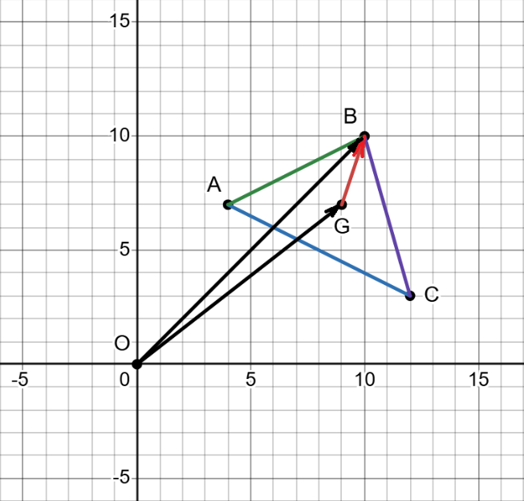
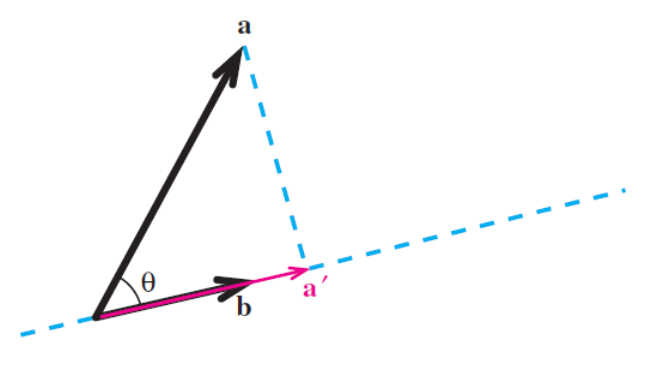
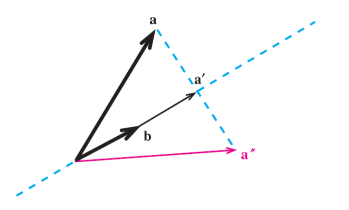



[Quiz](https://notebooklm.google.com/notebook/67a07b43-1cdf-4f8a-9ef7-0b35db695200?artifactId=70cc1a33-58ca-47bb-ad86-55bfecf31c1b) | [Flashcards](https://notebooklm.google.com/notebook/67a07b43-1cdf-4f8a-9ef7-0b35db695200?artifactId=0d043f0b-fe79-4a1c-bb8b-0752364c692b)

#### **1. Краткое содержание**
##### **1.1 Введение в векторы**
**Вектор** — базовый математический объект, у которого есть и *длина* (величина, **magnitude**), и *направление* (**direction**). Он отличается от **скаляра** (**scalar**): скаляр задаётся одним числом (как температура или модуль скорости), у него есть величина, но нет направления. Полезно думать о векторе как об инструкции «пройти столько-то в таком-то направлении».

Векторы можно задавать по-разному:

###### **1.1.1 Геометрическое представление**
Как направленный отрезок (стрелка) в пространстве: длина стрелки — величина, направление стрелки — направление вектора. Важно: вектор *не привязан к начальной точке*; две стрелки одинаковой длины и направления задают один и тот же вектор, где бы они ни лежали. Это делает векторы «свободными» геометрическими объектами.

<!-- DIAGRAM HERE -->

###### **1.1.2 Алгебраическое представление**
Как упорядованный набор чисел — **компонент** (**components**). Например, на плоскости $\mathbb{R}^2$ вектор задаётся двумя компонентами $(x, y)$, в пространстве $\mathbb{R}^3$ — тремя $(x, y, z)$; они совпадают с проекциями на координатные оси. В линейной алгебре векторы часто записывают **столбцами** (**column vectors**):
$$ \vec{v} = \begin{pmatrix} x \\ y \end{pmatrix} $$
**Строка-вектор** (**row vector**) пишется как $(x, y)$. Это не то же самое, что столбец, но переход между формами даёт операция **транспонирования** (**transpose**): $\begin{pmatrix} x \\ y \end{pmatrix}^T = (x, y)$.

###### **1.1.3 Обозначения**
Векторы обозначают полужирными строчными (**v**), буквой со стрелкой ($\vec{v}$) или концами отрезка ($\vec{AB}$ — от точки A к точке B). Точки — заглавными буквами (A, B). Скаляры — обычными строчными ($c$, $k$, $\alpha$).

##### **1.2 Основные операции с векторами**
Для векторов введены стандартные арифметические операции, с ними можно работать алгебраически.

###### **1.2.1 Сложение векторов**
Складывают покомпонентно. Геометрически это **правило треугольника** (**tip-to-tail**): конец первого вектора совмещают с началом второго; сумма идёт от начала первого до конца второго.
$$ \vec{u} + \vec{v} = \begin{pmatrix} u_1 \\ u_2 \end{pmatrix} + \begin{pmatrix} v_1 \\ v_2 \end{pmatrix} = \begin{pmatrix} u_1 + v_1 \\ u_2 + v_2 \end{pmatrix} $$
<!-- DIAGRAM HERE -->

###### **1.2.2 Умножение на скаляр**
Каждую компоненту умножают на число; вектор **масштабируется** (**scales**): меняется длина, при положительном множителе направление то же, при отрицательном — разворачивается. Коэффициент 2 удваивает длину, $-0.5$ — уполовинивает и меняет ориентацию.
$$ c\vec{v} = c\begin{pmatrix} v_1 \\ v_2 \end{pmatrix} = \begin{pmatrix} cv_1 \\ cv_2 \end{pmatrix} $$

###### **1.2.3 Вычитание векторов**
$\vec{u} - \vec{v}$ — это $\vec{u} + (-1)\vec{v}$. Геометрически $\vec{u} - \vec{v}$ направлен от конца $\vec{v}$ к концу $\vec{u}$ (если отложить оба от общего начала).
$$ \vec{u} - \vec{v} = \begin{pmatrix} u_1 \\ u_2 \end{pmatrix} - \begin{pmatrix} v_1 \\ v_2 \end{pmatrix} = \begin{pmatrix} u_1 - v_1 \\ u_2 - v_2 \end{pmatrix} $$

##### **1.3 Длина вектора и нормировка**

###### **1.3.1 Норма вектора**
**Норма** (**norm**) — неотрицательное число, длина вектора; для $\vec{v}$ пишут $||\vec{v}||$, считают по обобщённой формуле Пифагора по компонентам.
$$ ||\vec{v}|| = \sqrt{v_1^2 + v_2^2 + \dots + v_n^2} $$

###### **1.3.2 Единичные векторы**
**Единичный вектор** (**unit vector**) — вектор с нормой 1; удобен, чтобы задать чистое направление. **Нормировать** (**normalize**) ненулевой вектор — разделить его на свою норму.
$$ \hat{u} = \frac{\vec{v}}{||\vec{v}||} $$

###### **1.3.3 Стандартные орты**
В декартовой системе в $\mathbb{R}^3$:
*   $\vec{i} = \begin{pmatrix} 1 \\ 0 \\ 0 \end{pmatrix}$ (ось $x$)
*   $\vec{j} = \begin{pmatrix} 0 \\ 1 \\ 0 \end{pmatrix}$ (ось $y$)
*   $\vec{k} = \begin{pmatrix} 0 \\ 0 \\ 1 \end{pmatrix}$ (ось $z$)
Любой вектор в $\mathbb{R}^3$ раскладывается так: $\begin{pmatrix} a \\ b \\ c \end{pmatrix} = a\vec{i} + b\vec{j} + c\vec{k}$.

###### **1.3.4 Расстояние между точками**
Расстояние между $P$ и $Q$ — норма вектора $\vec{PQ} = Q - P$.
$$ d(P, Q) = ||\vec{PQ}|| = ||Q - P|| = \sqrt{(q_1-p_1)^2 + (q_2-p_2)^2 + \dots} $$

##### **1.4 Векторные пространства и подпространства**

###### **1.4.1 Векторное пространство**
**Векторное пространство** (**vector space**) — множество объектов (векторов), на котором заданы сложение и умножение на скаляры из поля; выполняются десять **аксиом** (**axioms**), гарантирующих «обычное» поведение.

Пусть **u**, **v**, **w** — векторы в пространстве $V$, $c$ и $d$ — скаляры. Аксиомы:

*   **Сложение:**
    1.  **Замкнутость по сложению** (**Closure under Addition**): $\mathbf{u}+\mathbf{v}\in V$.
    2.  **Коммутативность** (**Commutativity**): $\mathbf{u}+\mathbf{v}=\mathbf{v}+\mathbf{u}$.
    3.  **Ассоциативность** (**Associativity**): $(\mathbf{u}+\mathbf{v})+\mathbf{w}=\mathbf{u}+(\mathbf{v}+\mathbf{w})$.
    4.  **Нулевой вектор** (**zero vector**): существует единственный $\mathbf{0}$: $\mathbf{u}+\mathbf{0}=\mathbf{u}$.
    5.  **Противоположный вектор** (**additive inverse**): для каждого $\mathbf{u}$ есть $-\mathbf{u}$: $\mathbf{u}+(-\mathbf{u})=\mathbf{0}$.
*   **Умножение на скаляр:**
    6.  **Замкнутость по умножению на скаляр** (**Closure under Scalar Multiplication**): $c\mathbf{u}\in V$.
    7.  **Дистрибутивность по векторам**: $c(\mathbf{u}+\mathbf{v})=c\mathbf{u}+c\mathbf{v}$.
    8.  **Дистрибутивность по скалярам**: $(c+d)\mathbf{u}=c\mathbf{u}+d\mathbf{u}$.
    9.  **Ассоциативность по скалярам**: $(cd)\mathbf{u}=c(d\mathbf{u})$.
    10. **Единичный скаляр**: $1\mathbf{u}=\mathbf{u}$.
*   **Примеры векторных пространств**:
    *   $\mathbb{R}^n$: все $n$-мерные вещественные столбцы.
    *   $P_n$: многочлены степени не выше $n$; например, $3x^2-x+5\in P_2$.
    *   Пространство непрерывных функций (на интервале).
*   **Не-пример**: первый квадрант $\mathbb{R}^2$ ($x\ge0$, $y\ge0$) **не** векторное пространство: нарушается замкнутость при умножении на отрицательный скаляр (вектор уходит в третий квадрант).

###### **1.4.2 Подпространство**
**Подпространство** (**subspace**) — подмножество векторного пространства, само являющееся векторным пространством с теми же операциями. **Тест на подпространство** (**Subspace Test**) для $H\subseteq V$:

1.  $\mathbf{0}\in H$.
2.  **Замкнутость по сложению**: из $\vec{u},\vec{v}\in H$ следует $\vec{u}+\vec{v}\in H$.
3.  **Замкнутость по умножению на скаляр**: из $\vec{u}\in H$, $c$ — скаляр, следует $c\vec{u}\in H$.

*   **Типичные примеры**: любая прямая или плоскость через начало в $\mathbb{R}^3$; **нуль-пространство** (**null space**) матрицы $A$ — множество решений $A\vec{x}=\vec{0}$ (всегда подпространство).

###### **1.4.3 Центроид треугольника**
Для вершин $A,B,C$ **центроид** (**centroid**, центр масс) — единственная точка $G$, для которой $\vec{GA}+\vec{GB}+\vec{GC}=\vec{0}$. Радиус-вектор: $\vec{OG}=\frac{1}{3}(\vec{OA}+\vec{OB}+\vec{OC})$. Центроид лежит внутри треугольника.

##### **1.5 Линейные комбинации, линейная оболочка и базис**

###### **1.5.1 Линейная комбинация и span**
**Линейная комбинация** (**linear combination**): $\vec{w}=c_1\vec{v}_1+c_2\vec{v}_2+\dots$. **Линейная оболочка** (**span**) набора — множество **всех** таких комбинаций; span всегда подпространство. Например, span двух неколлинеарных векторов в $\mathbb{R}^3$ — плоскость через начало.
<!-- DIAGRAM HERE -->

###### **1.5.2 Линейная независимость**
Набор **линейно независим** (**linearly independent**), если ни один вектор не выражается через остальные; нулевая комбинация возможна только при нулевых коэффициентах (**trivial solution**).

###### **1.5.3 Линейная зависимость**
Набор **линейно зависим** (**linearly dependent**), если хотя бы один вектор — линейная комбинация остальных. Геометрически: два вектора на одной прямой; три — в одной плоскости.

###### **1.5.4 Базис и размерность**
**Базис** (**basis**) — линейно независимый набор, **натягивающий** всё пространство (**spans**). Число векторов в любом базисе одно и то же — **размерность** (**dimension**). У $\mathbb{R}^3$ размерность 3; стандартный базис $\{\vec{i},\vec{j},\vec{k}\}$.

***

#### **2. Определения**

*   **Вектор**: объект с длиной и направлением.
*   **Скаляр**: величина одним числом.
*   **Норма**: $||\vec{v}||$.
*   **Единичный вектор**: $||\vec{u}||=1$, задаёт направление.
*   **Стандартные орты**: $\vec{i},\vec{j},\vec{k}$.
*   **Векторное пространство**: векторы и скаляры с десятью аксиомами.
*   **Подпространство**: подмножество, замкнутое по операциям.
*   **Нуль-пространство** (**Null space**): решения $A\vec{x}=\vec{0}$; всегда подпространство.
*   **Центроид**: точка пересечения медиан; радиус-вектор — среднее радиус-векторов вершин.
*   **Линейная комбинация**: сумма векторов с числовыми коэффициентами.
*   **Span**: все линейные комбинации данного набора (подпространство).
*   **Линейная независимость**: нет «лишних» направлений.
*   **Линейная зависимость**: есть избыточность.
*   **Базис**: независимый span всего пространства.
*   **Размерность**: число векторов в базисе.

***

#### **3. Формулы**
*   **Сложение**: $$ \vec{u} + \vec{v} = \begin{pmatrix} u_1 + v_1 \\ u_2 + v_2 \end{pmatrix} $$
*   **Умножение на скаляр**: $$ c\vec{v} = \begin{pmatrix} cv_1 \\ cv_2 \end{pmatrix} $$
*   **Вычитание**: $$ \vec{u} - \vec{v} = \begin{pmatrix} u_1 - v_1 \\ u_2 - v_2 \end{pmatrix} $$
*   **Норма в $\mathbb{R}^n$**: $$ ||\vec{v}|| = \sqrt{v_1^2 + v_2^2 + \dots + v_n^2} $$
*   **Расстояние $P,Q$**: $d(P, Q) = ||Q - P||$
*   **Нормировка**: $$ \hat{u} = \frac{\vec{v}}{||\vec{v}||} $$
*   **Середина отрезка**: $$ \vec{OM} = \frac{1}{2}(\vec{OB} + \vec{OC}) $$
*   **Центроид**: $$ \vec{OG} = \frac{1}{3}(\vec{OA} + \vec{OB} + \vec{OC}) $$
*   **Линейная независимость**: $c_1\vec{v_1} + \dots + c_n\vec{v_n} = \vec{0}$ только при $c_1=\dots=c_n=0$.
*   **Базис в $\mathbb{R}^n$ через определитель**: $\det([\vec{v_1} \dots \vec{v_n}]) \neq 0$.
*   **Проекция** $\vec{a}$ на $\vec{b}$: $$ \text{proj}_{\vec{b}}\vec{a} = \frac{\vec{a} \cdot \vec{b}}{||\vec{b}||^2} \vec{b} $$
*   **Отражение** относительно прямой с направлением $\vec{b}$: $$ \text{ref}_{\vec{b}}\vec{a} = 2 \cdot \text{proj}_{\vec{b}}\vec{a} - \vec{a} $$

***

#### **4. Примеры**

##### **4.1. Точка на прямой AB** (Лаба 1, Задание 1)
Даны $A(3, -2)$ и $B(1, 4)$. Точка $M$ лежит на прямой $AB$ так, что $|AM| = 3|AB|$. Найдите координаты $M$, если:

1.  $M$ и $B$ по одну сторону от $A$.
2.  $M$ и $B$ по разные стороны от $A$.

Показать решение

{fig-align="center" width=60%}

Пусть $\vec{a},\vec{b},\vec{m}$ — радиус-векторы точек $A,B,M$. Дано соотношение длин $|\vec{AM}|$ и $|\vec{AB}|$.

1.  **Случай 1: $M$ и $B$ по одну сторону от $A$.** Тогда $\vec{AM}$ и $\vec{AB}$ сонаправлены: $\vec{AM} = 3\vec{AB}$, откуда $\vec{m}-\vec{a}=3(\vec{b}-\vec{a})$ и $\vec{m}=3\vec{b}-2\vec{a}$.
    *   $x = 3(1) - 2(3) = -3$, $y = 3(4) - 2(-2) = 16$.
    *   **Ответ:** $M_1 = (-3, 16)$.
2.  **Случай 2: по разные стороны.** Тогда $\vec{AM} = -3\vec{AB}$, $\vec{m}=\vec{a}-3(\vec{b}-\vec{a})=4\vec{a}-3\vec{b}$.
    *   $x = 4(3) - 3(1) = 9$, $y = 4(-2) - 3(4) = -20$.
    *   **Ответ:** $M_2 = (9, -20)$.

##### **4.2. Центроид треугольника** (Лаба 1, Задание 2)
На плоскости $\triangle ABC$ найдите $G$, для которой $\vec{GA} + \vec{GB} + \vec{GC} = \mathbf{0}$. Существуют ли такие точки вне треугольника?

Показать решение

{fig-align="center" width=60%}

1.  Пусть $\vec{a},\vec{b},\vec{c},\vec{g}$ — радиус-векторы. Тогда $(\vec{a}-\vec{g})+(\vec{b}-\vec{g})+(\vec{c}-\vec{g})=\mathbf{0}$.
2.  $\vec{a}+\vec{b}+\vec{c}=3\vec{g}$, значит $\vec{g}=\frac{\vec{a}+\vec{b}+\vec{c}}{3}$ — **центроид** (**centroid** / центр масс).
3.  Центроид всегда **внутри** треугольника.

**Ответ:** $G$ — центроид; вне треугольника других точек с этим свойством нет.

##### **4.3. Является ли набор базисом** (Лаба 1, Задание 3a)
Проверьте, образует ли набор базис $\mathbb{R}^2$; поясните:
$\left\{ \begin{bmatrix} 1 \\ 0 \end{bmatrix} + \begin{bmatrix} 0 \\ 2 \end{bmatrix} \right\}$

Показать решение

Сложим: $\begin{bmatrix} 1 \\ 2 \end{bmatrix}$ — один вектор. Его span — прямая, не вся плоскость $\mathbb{R}^2$.

**Ответ:** **не базис** $\mathbb{R}^2$ (не хватает размерности / не покрывает всё пространство).

##### **4.4. Является ли набор базисом** (Лаба 1, Задание 3b)
$\left\{ \begin{bmatrix} 1 \\ 0 \end{bmatrix}, \begin{bmatrix} 0 \\ 2 \end{bmatrix} \right\}$

Показать решение

Два вектора в $\mathbb{R}^2$: проверим $c_1\begin{bmatrix}1\\0\end{bmatrix}+c_2\begin{bmatrix}0\\2\end{bmatrix}=\mathbf{0}$ — только тривиальное решение, значит **линейно независимы**. Их два — как раз $\dim\mathbb{R}^2$.

**Ответ:** **базис** $\mathbb{R}^2$.

##### **4.5. Является ли набор базисом** (Лаба 1, Задание 3c)
$\left\{ \begin{bmatrix} 1 \\ 2 \\ 3 \end{bmatrix} \right\}$

Показать решение

В $\mathbb{R}^3$ базис из трёх независимых векторов; здесь один — span — прямая.

**Ответ:** **не базис** $\mathbb{R}^3$.

##### **4.6. Является ли набор базисом** (Лаба 1, Задание 3d)
$\left\{ \begin{bmatrix} 1 \\ 0 \\ 0 \end{bmatrix}, \begin{bmatrix} 0 \\ 2 \\ 0 \end{bmatrix}, \begin{bmatrix} 0 \\ 0 \\ 3 \end{bmatrix} \right\}$

Показать решение

Система $c_1v_1+c_2v_2+c_3v_3=\mathbf{0}$ даёт $c_1=2c_2=3c_3=0$ — только тривиальное; три вектора в $\mathbb{R}^3$.

**Ответ:** **базис** $\mathbb{R}^3$.

##### **4.7. Является ли набор базисом** (Лаба 1, Задание 3e)
$\left\{ \begin{bmatrix} 1 \\ 0 \\ 0 \end{bmatrix}, \begin{bmatrix} 0 \\ 2 \\ 0 \end{bmatrix} \right\}$

Показать решение

Span — векторы $(c_1,2c_2,0)$: плоскость $z=0$, но не всё $\mathbb{R}^3$.

**Ответ:** **не базис** $\mathbb{R}^3$.

##### **4.8. Является ли набор базисом** (Лаба 1, Задание 3f)
$\left\{ \begin{bmatrix} 1 \\ 2 \\ 1 \end{bmatrix}, \begin{bmatrix} 3 \\ 1 \\ 4 \end{bmatrix}, \begin{bmatrix} 5 \\ 5 \\ 6 \end{bmatrix} \right\}$

Показать решение

Рассмотрим $A=\begin{bmatrix}1&3&5\\2&1&5\\1&4&6\end{bmatrix}$. Вычисляем:
$\det(A)=1(6-20)-3(12-5)+5(8-1)=-14-21+35=0$ — столбцы линейно зависимы.

**Ответ:** **не базис** $\mathbb{R}^3$ (векторы линейно зависимы).

##### **4.9. Разложение вектора** (Лекция 1, Пример 1)
Можно ли $w = \begin{pmatrix} 7 \\ 2 \end{pmatrix}$ представить как линейную комбинацию $u = \begin{pmatrix} 1 \\ 2 \end{pmatrix}$ и $v = \begin{pmatrix} 3 \\ 1 \end{pmatrix}$?

Показать решение

$c_1u+c_2v=w$ даёт $c_1+3c_2=7$, $2c_1+c_2=2$ $\Rightarrow$ $c_1=-1/5$, $c_2=12/5$.

**Ответ:** да, $w = -\frac{1}{5}u + \frac{12}{5}v$.

##### **4.10. Линейная зависимость** (Лекция 1, Пример 2)
Зависим ли $v_1 = \begin{bmatrix} 1 \\ 2 \end{bmatrix}$, $v_2 = \begin{bmatrix} 3 \\ 4 \end{bmatrix}$, $v_3 = \begin{bmatrix} 5 \\ 6 \end{bmatrix}$?

Показать решение

Есть нетривиальное решение, например $\alpha_3=1$ даёт $\alpha_1=1,\alpha_2=-2$.

**Ответ:** набор **линейно зависим**.

##### **4.11. Подмножество в $\mathbb{R}^2$** (Лекция 1, Пример 3)
Является ли $H = \left\{ \begin{bmatrix} t \\ 2t \end{bmatrix} \mid t \in \mathbb{R} \right\}$ (прямая $y=2x$) подпространством $\mathbb{R}^2$?

Показать решение

1.  При $t=0$ получаем $\mathbf{0}\in H$.
2.  Сумма векторов вида $(t,2t)$ снова того же вида.
3.  Умножение на скаляр сохраняет вид $(\alpha t, 2\alpha t)$.

**Ответ:** $H$ — **подпространство** $\mathbb{R}^2$.

##### **4.12. Линейная независимость** (Лекция 1, Пример 4)
Независимы ли $v_1 = \begin{bmatrix} 1 \\ 0 \end{bmatrix}$, $v_2 = \begin{bmatrix} 0 \\ 1 \end{bmatrix}$?

Показать решение

$\alpha_1 v_1+\alpha_2 v_2=\mathbf{0}$ влечёт $\alpha_1=\alpha_2=0$.

**Ответ:** **линейно независимы**.

##### **4.13. Подмножество в $\mathbb{R}^2$** (Лекция 1, Пример 5)
Является ли $K = \left\{ \begin{bmatrix} t \\ 2t + 1 \end{bmatrix} \mid t \in \mathbb{R} \right\}$ (прямая $y=2x+1$) подпространством $\mathbb{R}^2$?

Показать решение

При $t=0$ вектор $(0,1)\neq\mathbf{0}$; $\mathbf{0}\notin K$.

**Ответ:** **не подпространство** (нет нулевого вектора).

##### **4.14. Независимость в $\mathbb{R}^2$** (Лекция 1, Пример 6)
Независимы ли $v_1 = \begin{pmatrix} 1 \\ 2 \end{pmatrix}$ и $v_2 = \begin{pmatrix} 2 \\ 4 \end{pmatrix}$?

Показать решение

$v_2=2v_1$; есть нетривиальная комбинация к нулю.

**Ответ:** **линейно зависимы**.

##### **4.15. Нуль-пространство — подпространство** (Лекция 1, Пример 7)
Пусть $H$ — множество решений однородной системы $A\mathbf{x}=\mathbf{0}$. Докажите, что $H$ — подпространство $\mathbb{R}^n$.

Показать решение

$A\mathbf{0}=\mathbf{0}$; если $A\mathbf{u}=A\mathbf{v}=\mathbf{0}$, то $A(\mathbf{u}+\mathbf{v})=\mathbf{0}$; $A(\alpha\mathbf{u})=\alpha A\mathbf{u}=\mathbf{0}$.

**Ответ:** $H$ — **null space** матрицы $A$, всегда подпространство.

##### **4.16. Независимость в $\mathbb{R}^3$** (Лекция 1, Пример 8)
Независимы ли стандартные орты $e_1,e_2,e_3$ в $\mathbb{R}^3$?

Показать решение

Из $c_1e_1+c_2e_2+c_3e_3=\mathbf{0}$ следует $c_1=c_2=c_3=0$.

**Ответ:** **линейно независимы**.

##### **4.17. Описать span** (Лекция 1, Пример 9)
Чему равен $\operatorname{span}\left\{\begin{bmatrix}1\\0\\0\end{bmatrix},\begin{bmatrix}0\\1\\0\end{bmatrix}\right\}$ в $\mathbb{R}^3$?

Показать решение

Линейные комбинации дают $(c_1,c_2,0)$ — координатная плоскость $xy$.

**Ответ:** плоскость $z=0$ (все $\begin{bmatrix}a\\b\\0\end{bmatrix}$).

##### **4.18. Норма вектора** (Лекция 1, Пример 10)
Найдите $||\vec{v}||$ для $\vec{v} = \begin{bmatrix} 2 \\ 3 \\ 1 \end{bmatrix}$.

Показать решение

$||\vec{v}||=\sqrt{4+9+1}=\sqrt{14}$.

**Ответ:** $\sqrt{14}$.

##### **4.19. Расстояние между точками** (Лекция 1, Пример 11)
Расстояние между $P=(1,2,0)$ и $Q=(3,5,4)$.

Показать решение

$\sqrt{(3-1)^2+(5-2)^2+(4-0)^2}=\sqrt{29}$.

**Ответ:** $\sqrt{29}$.

##### **4.20. Единичный вектор** (Лекция 1, Пример 12)
Единичный вектор в направлении $\vec{v} = \begin{bmatrix} 2 \\ 3 \\ 1 \end{bmatrix}$.

Показать решение

$||\vec{v}||=\sqrt{14}$, $\vec{u}=\vec{v}/||\vec{v}||$.

**Ответ:** $\vec{u} = \begin{bmatrix} 2/\sqrt{14} \\ 3/\sqrt{14} \\ 1/\sqrt{14} \end{bmatrix}$.

##### **4.21. Неизвестные координаты** (Туториал 1, Задание 1)
Найдите неизвестные координаты, если $\vec{AB} \cong \vec{CD}$ (равны как свободные векторы).

*   $A(3, 5)$, $B(4, 6)$, $C(-2, 5)$, $D(x, y)$
*   $A(-1, 1)$, $B(3, 5)$, $C(x, y)$, $D(2x, 1)$

Показать решение

1.  $\vec{AB}=(1,1)$, $\vec{CD}=(x+2,y-5)$ $\Rightarrow$ $x=-1$, $y=6$.
2.  $\vec{AB}=(4,4)$, $\vec{CD}=(x,1-y)$ $\Rightarrow$ $x=4$, $y=-3$.

**Ответ:** $D=(-1,6)$; $C=(4,-3)$.

##### **4.22. Периметр и средняя линия** (Туториал 1, Задание 2)
Вершины $A(-1,0,0)$, $B(2,0,\sqrt{7})$, $C(3,\sqrt{2},\sqrt{7})$. Найдите периметр и вектор средней линии $AM$ ($M$ — середина $BC$).

Показать решение

$||\vec{AB}||=4$, $||\vec{BC}||=\sqrt{3}$, $||\vec{AC}||=5$; периметр $9+\sqrt{3}$. Середина $M=(\frac{5}{2},\frac{\sqrt{2}}{2},\sqrt{7})$, $\vec{AM}=(\frac{7}{2},\frac{\sqrt{2}}{2},\sqrt{7})$.

**Ответ:** периметр $9+\sqrt{3}$; $\vec{AM}$ как выше.

##### **4.23. Операции с векторами** (Туториал 1, Задание 3)
$\vec{u}=(4,-3)$, $\vec{v}=\vec{AB}$, $A(2,-1)$, $B(-1,3)$.

*   Точка $D$: $\vec{AD}$ — представитель $\vec{u}+\vec{v}$.
*   Скаляр $c$: $\vec{u}+c\vec{v}=(1,1)$.
*   $||\vec{u}-2\vec{v}||$.

Показать решение

$\vec{v}=(-3,4)$; $\vec{u}+\vec{v}=(1,1)$ $\Rightarrow$ $D=(3,0)$; $c=1$; $||\vec{u}-2\vec{v}||=\sqrt{221}$.

**Ответ:** $D=(3,0)$, $c=1$, норма $\sqrt{221}$.

##### **4.24. Зависимость и независимость** (Туториал 1, Задание 4)
Покажите:

*   $(1,2)$ и $(3,6)$ — зависимы;
*   $(1,2)$ и $(-1,2)$ — независимы;
*   три вектора в $\mathbb{R}^2$ — зависимы.

Показать решение

$(3,6)=3(1,2)$; для пары $(-1,2)$ — только тривиальное решение; в $\mathbb{R}^2$ любые 3 вектора зависимы (или явная комбинация).

##### **4.25. Пространство многочленов** (Туториал 1, Задание 5)
Докажите, что $P_n$ — векторное пространство; что с непрерывными функциями?

Показать решение

Нуль — нулевой многочлен; степень суммы $\le\max$ степеней; $\alpha p$ снова в $P_n$. Непрерывные функции: нуль, сумма и произведение на скаляр сохраняют непрерывность.

##### **4.26. Первый квадрант — не пространство** (Туториал 1, Задание 6)
$S=\{[x,y]^T\in\mathbb{R}^2\mid x\ge0,y\ge0\}$. Покажите, что $S$ не векторное пространство.

{fig-align="center" width=60%}

Показать решение

$(1,1)\in S$, но $(-1)(1,1)\notin S$ — нет замкнутости по умножению на скаляр.

**Ответ:** **не векторное пространство**.

##### **4.27. Проекция вектора** (Туториал 1, Задание 7)
По рисунку выразите $\vec{a'}$ через $\vec{a}$ и $\vec{b}$.

{fig-align="center" width=60%}

Показать решение

$\vec{a'}$ — ортогональная проекция $\vec{a}$ на прямую по $\vec{b}$: $\vec{a'}=\bigl(\frac{\vec{a}\cdot\vec{b}}{||\vec{b}||^2}\bigr)\vec{b}$.

##### **4.28. Отражение вектора** (Туториал 1, Задание 8)
По рисунку выразите $\vec{a''}$ через $\vec{a}$ и $\vec{b}$.

{fig-align="center" width=60%}

Показать решение

$\vec{a''}=2\vec{a'}-\vec{a}=2\,\text{proj}_{\vec{b}}\vec{a}-\vec{a}$.

##### **4.29. Норма и параметр** (Домашнее задание 1, Задание 1)
$\mathbf{a}=[2,x]^T$, $\mathbf{b}=[1,1]^T$, $\mathbf{c}=[x,3]^T$. Найдите $x$, если $\mathbf{v}=\mathbf{a}-\mathbf{b}+\mathbf{c}$ и $||\mathbf{v}||=\sqrt{13}$.

Показать решение

$\mathbf{v}=[1+x,x+2]^T$, $||\mathbf{v}||^2=(1+x)^2+(x+2)^2=13$ $\Rightarrow$ $x\in\{1,-4\}$.

**Ответ:** $x\in\{1,-4\}$.

##### **4.30. Условие базиса в $\mathbb{R}^3$** (Домашнее задание 1, Задание 2)
При каких $x$ векторы $\mathbf{a}=[1,x,3]^T$, $\mathbf{b}=[2,1,1]^T$, $\mathbf{c}=[3,2,4]^T$ образуют базис $\mathbb{R}^3$?

Показать решение

$\det(A)=-5x+5\neq0$ $\Rightarrow$ $x\neq1$.

**Ответ:** все вещественные $x\neq1$.

##### **4.31. Проекция и отражение** (Домашнее задание 1, Задание 7)
$\mathbf{a}=(2,2,-1)$, $\mathbf{b}=(0,4,3)$. Найдите проекцию $\mathbf{a}$ на $\mathbf{b}$ и отражение $\mathbf{a}$ относительно прямой по $\mathbf{b}$.

{fig-align="center" width=60%}

Показать решение

$\mathbf{a}\cdot\mathbf{b}=5$, $||\mathbf{b}||^2=25$ $\Rightarrow$ $\mathbf{a}'=(0,\frac{4}{5},\frac{3}{5})$; $\mathbf{a}''=2\mathbf{a}'-\mathbf{a}=(-2,-\frac{2}{5},\frac{11}{5})$.

**Ответ:** $\mathbf{a}'$ и $\mathbf{a}''$ как выше.

