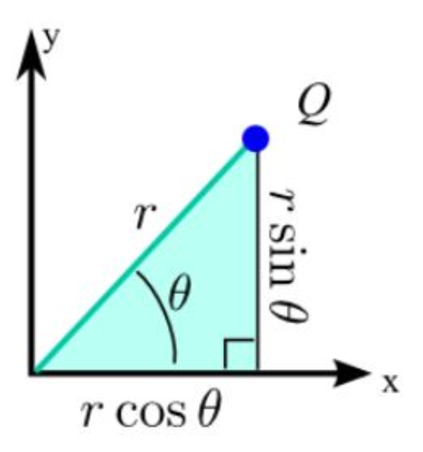
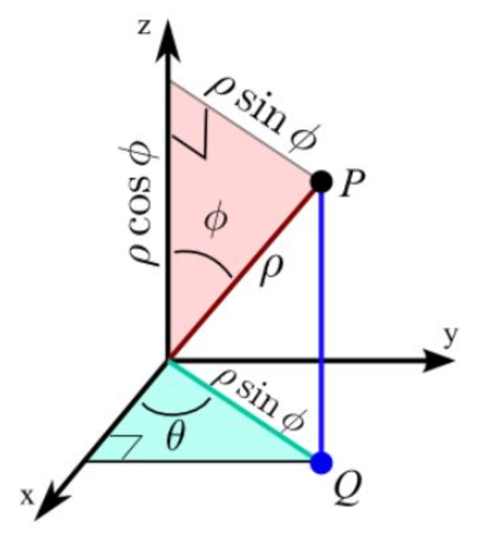

#### **1. Краткое содержание**
##### **1.1 Полярные координаты**
**Полярные координаты (polar coordinates)** задают точку на плоскости через расстояние и угол, а не через смещения вдоль горизонтали и вертикали. Если **декартовы координаты (Cartesian coordinates)** описывают положение точки парой $(x, y)$, то **полярные координаты** используют $(r, \theta)$: здесь $r$ — расстояние от начала координат (**полюс, pole**), а $\theta$ — угол против часовой стрелки от положительной оси $x$ (**полярная ось, polar axis**).

{fig-align="center" width=50%}

Интуитивно полярные координаты похожи на указание маршрута: «пройди 5 метров под углом 30° к северо-востоку» — часто нагляднее, чем «4{,}33 м на восток и 2{,}5 м на север».

###### **1.1.1 Переход между системами координат**
Между декартовыми и полярными координатами действуют следующие связи:

**Из полярных в декартовы:**

$$ x = r \cos \theta $$
$$ y = r \sin \theta $$

Это следует из тригонометрии прямоугольного треугольника с гипотенузой $r$ и углом $\theta$: горизонтальный катет равен $r \cos \theta$, вертикальный — $r \sin \theta$.

**Из декартовых в полярные:**

$$ r = \sqrt{x^2 + y^2} $$
$$ \tan \theta = \frac{y}{x} $$

Первое соотношение — теорема Пифагора, второе — определение тангенса. При нахождении $\theta$ важно учитывать **квадрант**, чтобы получить правильный угол.

###### **1.1.2 Преобразование уравнений**
Чтобы перевести **уравнение в декартовых координатах (Cartesian equation)** в **полярную форму (polar form)**, подставляют $x = r \cos \theta$, $y = r \sin \theta$ и упрощают. Цель — получить уравнение только с $r$ и $\theta$.

Например:

- Прямая $x = 5$ даёт $r \cos \theta = 5$, то есть $r = 5 \sec \theta$
- Окружность $x^2 + y^2 = 16$ даёт $r^2 = 16$, то есть $r = 4$
- Прямая $y = x$ даёт $r \sin \theta = r \cos \theta$, откуда $\tan \theta = 1$ и $\theta = \frac{\pi}{4}$

Некоторые уравнения в полярной форме сильно упрощаются (например, окружности с центром в начале координат), другие, наоборот, становятся сложнее.

##### **1.2 Сферические координаты**
Так же как полярные координаты обобщают декартовы на плоскости, **сферические координаты (spherical coordinates)** обобщают их на пространство. Если в 3D используют $(x, y, z)$, то в сферической системе берут $(\rho, \theta, \varphi)$, где:

- $\rho$ (rho) — расстояние от начала координат до точки
- $\theta$ (theta) — **азимутальный угол** в плоскости $xy$ от положительной оси $x$ (как в 2D-полярных координатах)
- $\varphi$ (phi) — **полярный угол** (угол от положительной оси $z$ «вниз» к лучу, идущему к точке)

{fig-align="center" width=50%}

Сферические координаты особенно удобны при **сферической симметрии (spherical symmetry)**: гравитационные поля планет, сферически распространяющиеся волны, широта и долгота в навигации.

###### **1.2.1 Формулы перехода для сферических координат**
**Из сферических в декартовы:**

$$ x = \rho \sin \varphi \cos \theta $$
$$ y = \rho \sin \varphi \sin \theta $$
$$ z = \rho \cos \varphi $$

Геометрически $\rho \sin \varphi$ — радиус окружности в плоскости $xy$, который затем раскладывается на $x$ и $y$ с помощью $\cos \theta$ и $\sin \theta$.

**Из декартовых в сферические:**

$$ \rho = \sqrt{x^2 + y^2 + z^2} $$
$$ \theta = \arctan\left(\frac{y}{x}\right) \quad \text{(учитывайте квадрант)} $$
$$ \varphi = \arccos\left(\frac{z}{\rho}\right) $$

Стандартные диапазоны: $\rho \geq 0$, $0 \leq \theta < 2\pi$, $0 \leq \varphi \leq \pi$.

##### **1.3 Конические сечения**
**Конические сечения (conic sections)** — это кривые, получаемые сечением двойного конуса плоскостью: окружности, эллипсы, параболы и гиперболы. Они постоянно встречаются в математике, физике и инженерии — от орбит планет до тарелок спутников и арок в архитектуре.

###### **1.3.1 Определение через фокус и директрису**
Все конические сечения (кроме окружности как отдельного случая) можно описать едино: **коническое сечение** — множество точек $P$, для которых отношение

$$\frac{\text{расстояние от } P \text{ до фиксированной точки (фокус)}}{\text{расстояние от } P \text{ до фиксированной прямой (директриса)}} = e$$

равно постоянному числу $e$, называемому **эксцентриситетом (eccentricity)**. По значению $e$ определяют тип кривой:

- $e = 0$: **окружность (circle)** (частный случай, когда фокус совпадает с центром)
- $0 < e < 1$: **эллипс (ellipse)** (окружность входит в этот класс как предельный случай $e=0$)
- $e = 1$: **парабола (parabola)**
- $e > 1$: **гипербола (hyperbola)**

Эксцентриситет отражает «вытянутость» кривой: у окружности симметрия максимальна ($e=0$), парабола — пограничный случай ($e=1$), гиперболы — «открытые» кривые ($e>1$).

###### **1.3.2 Эллипсы**
**Эллипс** — замкнутая кривая, для которой **сумма** расстояний от любой её точки до двух фиксированных точек (**фокусы, foci**) постоянна. В стандартной форме с центром в начале координат и горизонтальной большой осью:

$$\frac{x^2}{a^2} + \frac{y^2}{b^2} = 1 \quad (a > b > 0)$$

Для этого эллипса:

- **Большая полуось (semi-major axis)**: $a$ (половина наибольшего диаметра)
- **Малая полуось (semi-minor axis)**: $b$ (половина наименьшего диаметра)
- **Эксцентриситет**: $e = \sqrt{1 - \frac{b^2}{a^2}}$
- **Фокусы**: $(\pm ae, 0) = (\pm c, 0)$, где $c = ae = \sqrt{a^2 - b^2}$
- **Директрисы (directrices)**: прямые $x = \pm \frac{a}{e}$

Чем ближе $b$ к $a$, тем «окружнее» эллипс (меньше $e$). Если $b = a$, получается окружность с $e = 0$.

###### **1.3.3 Гиперболы**
**Гипербола** состоит из двух ветвей; для точек на кривой **по модулю разность** расстояний до двух фокусов постоянна. В стандартной форме с горизонтальной действительной осью:

$$\frac{x^2}{a^2} - \frac{y^2}{b^2} = 1$$

Для этой гиперболы:

- **Вершины (vertices)**: $(\pm a, 0)$
- **Эксцентриситет**: $e = \sqrt{1 + \frac{b^2}{a^2}} > 1$
- **Фокусы**: $(\pm ae, 0) = (\pm c, 0)$, где $c = ae = \sqrt{a^2 + b^2}$
- **Директрисы**: $x = \pm \frac{a}{e}$
- **Асимптоты (asymptotes)**: прямые $y = \pm \frac{b}{a}x$

Для гиперболы $c^2 = a^2 + b^2$ (со знаком «плюс»), тогда как для эллипса $c^2 = a^2 - b^2$ (со знаком «минус»).

###### **1.3.4 Параболы**
**Парабола** — множество точек, **равноудалённых** от фокуса и директрисы. Для параболы, открытой вправо:

$$y^2 = 4px \quad (p > 0)$$

Свойства:

- **Фокус**: $(p, 0)$
- **Директриса**: прямая $x = -p$
- **Эксцентриситет**: всегда $e = 1$
- **Вершина**: в начале координат $(0, 0)$

Параметр $p$ — расстояние от вершины до фокуса (оно же — от вершины до директрисы).

##### **1.4 Конические сечения в полярной форме**
Если у конического сечения один фокус совпадает с началом координат, уравнение часто удобно записать в полярных координатах; так делают в астрономии и физике.

###### **1.4.1 Общее полярное уравнение**
Общий вид для коники с фокусом в начале координат:

$$r = \frac{ed}{1 \pm e \cos \theta} \quad \text{(вертикальная директриса)}$$

или

$$r = \frac{ed}{1 \pm e \sin \theta} \quad \text{(горизонтальная директриса)}$$

где:

- $e$ — эксцентриситет
- $d$ — длина перпендикуляра от фокуса до директрисы
- знак в знаменателе задаёт, лежит ли директриса справа/сверху ($+$) или слева/снизу ($-$) относительно фокуса

###### **1.4.2 Переход между формами**
**Декартовы → полярные:** для эллипса или гиперболы в стандартной декартовой форме:

1. Найти $a$, $b$ и вычислить $e$
2. Выбрать положение фокуса и сдвинуть систему координат так, чтобы фокус оказался в начале
3. Найти $d$ (расстояние от фокуса до директрисы)
4. Подставить в общую полярную формулу с нужным знаком

**Полярные → декартовы:**

1. Умножить обе части на знаменатель
2. Подставить $x = r \cos \theta$, $y = r \sin \theta$, $r = \sqrt{x^2 + y^2}$
3. Изолировать радикал (если он есть)
4. При необходимости возвести в квадрат
5. Преобразовать и выделить полные квадраты до стандартного вида

***

#### **2. Определения**
*   **Полярные координаты (Polar coordinates)**: система координат на плоскости $(r, \theta)$, где $r$ — расстояние до начала, $\theta$ — угол от положительной оси $x$.
*   **Полюс (Pole)**: начало координат в полярной системе.
*   **Полярная ось (Polar axis)**: положительная ось $x$, от которой отсчитывают углы.
*   **Сферические координаты (Spherical coordinates)**: система в $\mathbb{R}^3$ с координатами $(\rho, \theta, \varphi)$: $\rho$ — расстояние до начала, $\theta$ — азимут в плоскости $xy$, $\varphi$ — полярный угол от оси $z$.
*   **Коническое сечение (Conic section)**: кривая — сечение двойного конуса плоскостью (окружность, эллипс, парабола, гипербола).
*   **Эксцентриситет (Eccentricity)**: параметр $e$: $e=0$ для окружности, $0<e<1$ для эллипса, $e=1$ для параболы, $e>1$ для гиперболы.
*   **Фокус / фокусы (Focus, foci)**: фиксированные точки в геометрическом определении коники.
*   **Директриса (Directrix)**: фиксированная прямая в определении «фокус — директриса».
*   **Эллипс (Ellipse)**: коника с $0<e<1$; сумма расстояний до двух фокусов постоянна.
*   **Гипербола (Hyperbola)**: коника с $e>1$; две ветви; модуль разности расстояний до фокусов постоянен.
*   **Парабола (Parabola)**: коника с $e=1$; равные расстояния до фокуса и директрисы.
*   **Большая полуось (Semi-major axis)**: у эллипса половина наибольшего диаметра, обозначение $a$.
*   **Малая полуось (Semi-minor axis)**: у эллипса половина наименьшего диаметра, обозначение $b$.
*   **Вершина / вершины (Vertex, vertices)**: точки пересечения коники с её осью симметрии.
*   **Асимптоты (Asymptotes)**: прямые, к которым бесконечно приближаются ветви гиперболы.

***
#### **3. Формулы**
*   **Полярные → декартовы**: $x = r \cos \theta$, $y = r \sin \theta$
*   **Декартовы → полярные**: $r = \sqrt{x^2 + y^2}$, $\tan \theta = \frac{y}{x}$
*   **Сферические → декартовы**: $x = \rho \sin \varphi \cos \theta$, $y = \rho \sin \varphi \sin \theta$, $z = \rho \cos \varphi$
*   **Декартовы → сферические**: $\rho = \sqrt{x^2 + y^2 + z^2}$, $\theta = \arctan\left(\frac{y}{x}\right)$, $\varphi = \arccos\left(\frac{z}{\rho}\right)$
*   **Эксцентриситет эллипса**: $e = \sqrt{1 - \frac{b^2}{a^2}} = \frac{c}{a}$, где $c = \sqrt{a^2 - b^2}$
*   **Эксцентриситет гиперболы**: $e = \sqrt{1 + \frac{b^2}{a^2}} = \frac{c}{a}$, где $c = \sqrt{a^2 + b^2}$
*   **Канонический эллипс**: $\frac{x^2}{a^2} + \frac{y^2}{b^2} = 1$ (горизонтальная большая ось, $a > b$)
*   **Каноническая гипербола**: $\frac{x^2}{a^2} - \frac{y^2}{b^2} = 1$ (горизонтальная действительная ось)
*   **Канонические параболы**: $y^2 = 4px$ (ветви вправо), $x^2 = 4py$ (ветви вверх)
*   **Фокусы эллипса**: $(\pm ae, 0) = (\pm c, 0)$ при горизонтальной большой оси
*   **Директрисы эллипса**: $x = \pm \frac{a}{e}$ при горизонтальной большой оси
*   **Фокусы гиперболы**: $(\pm ae, 0) = (\pm c, 0)$ при горизонтальной действительной оси
*   **Директрисы гиперболы**: $x = \pm \frac{a}{e}$ при горизонтальной действительной оси
*   **Асимптоты гиперболы**: $y = \pm \frac{b}{a}x$ для $\frac{x^2}{a^2} - \frac{y^2}{b^2} = 1$
*   **Фокус параболы**: $(p, 0)$ для $y^2 = 4px$
*   **Директриса параболы**: $x = -p$ для $y^2 = 4px$
*   **Коника в полярной форме (вертикальная директриса)**: $r = \frac{ed}{1 \pm e \cos \theta}$
*   **Коника в полярной форме (горизонтальная директриса)**: $r = \frac{ed}{1 \pm e \sin \theta}$
*   **Прямая через две точки (полярные координаты)**: $r[r_2 \sin(\theta - \theta_2) - r_1 \sin(\theta - \theta_1)] = r_1 r_2 \sin(\theta_2 - \theta_1)$
*   **То же (альтернативная форма)**: $\frac{1}{r} \sin(\theta_2 - \theta_1) = \frac{1}{r_2} \sin(\theta - \theta_1) - \frac{1}{r_1} \sin(\theta - \theta_2)$

***

#### **4. Примеры**
##### **4.1. Перевести $x = 5$ в полярную форму** (Лаба 10, Задание 1)
Переведите декартово уравнение $x = 5$ в полярную форму и максимально упростите ответ.

Нажмите, чтобы показать решение

**Ключевая идея:** подставьте $x = r \cos \theta$ и упростите.

1.  **Подстановка:**
    $$x = 5 \implies r \cos \theta = 5$$
2.  **Выражаем $r$:**
    $$r = \frac{5}{\cos \theta} = 5 \sec \theta$$

**Ответ:** $r = 5 \sec \theta$

##### **4.2. Перевести $y = -3$ в полярную форму** (Лаба 10, Задание 2)
Переведите уравнение $y = -3$ в полярную форму.

Нажмите, чтобы показать решение

1.  **Подстановка:**
    $$y = -3 \implies r \sin \theta = -3$$
2.  **Выражаем $r$:**
    $$r = \frac{-3}{\sin \theta} = -3 \csc \theta$$

**Ответ:** $r = -3 \csc \theta$

##### **4.3. Перевести $y = x$ в полярную форму** (Лаба 10, Задание 3)
Переведите уравнение $y = x$ в полярную форму.

Нажмите, чтобы показать решение

1.  **Подстановка:**
    $$y = x \implies r \sin \theta = r \cos \theta$$
2.  **Делим на $r \cos \theta$ (при $r \neq 0$):**
    $$\frac{\sin \theta}{\cos \theta} = 1$$
    $$\tan \theta = 1$$
3.  **Угол:**
    $$\theta = \frac{\pi}{4} \text{ или } \theta = \frac{5\pi}{4}$$

**Ответ:** $\theta = \frac{\pi}{4}$ или $\theta = \frac{5\pi}{4}$ (одна и та же прямая через начало координат)

##### **4.4. Перевести $y = 7x$ в полярную форму** (Лаба 10, Задание 4)
Переведите уравнение $y = 7x$ в полярную форму.

Нажмите, чтобы показать решение

1.  **Подстановка:**
    $$y = 7x \implies r \sin \theta = 7r \cos \theta$$
2.  **Делим на $r \cos \theta$:**
    $$\tan \theta = 7$$
3.  **Угол:**
    $$\theta = \arctan(7)$$

**Ответ:** $\theta = \arctan(7)$ (плюс $\pi$ для противоположного направления)

##### **4.5. Перевести $x^2 + y^2 = 16$ в полярную форму** (Лаба 10, Задание 5)
Переведите уравнение $x^2 + y^2 = 16$ в полярную форму.

Нажмите, чтобы показать решение

**Ключевая идея:** $r^2 = x^2 + y^2$.

1.  **Тождество:**
    $$x^2 + y^2 = 16 \implies r^2 = 16$$
2.  **Положительный корень:**
    $$r = 4$$

**Ответ:** $r = 4$ (окружность радиуса 4 с центром в начале координат)

##### **4.6. Перевести $x^2 + y^2 = 2x$ в полярную форму** (Лаба 10, Задание 6)
Переведите уравнение $x^2 + y^2 = 2x$ в полярную форму.

Нажмите, чтобы показать решение

1.  **Подстановка:**
    $$x^2 + y^2 = 2x \implies r^2 = 2r \cos \theta$$
2.  **Преобразование:**
    $$r^2 - 2r \cos \theta = 0$$
    $$r(r - 2 \cos \theta) = 0$$
3.  **Решение (кроме $r = 0$):**
    $$r = 2 \cos \theta$$

**Ответ:** $r = 2 \cos \theta$ (окружность)

##### **4.7. Перевести $x^2 + y^2 = 9y$ в полярную форму** (Лаба 10, Задание 7)
Переведите уравнение $x^2 + y^2 = 9y$ в полярную форму.

Нажмите, чтобы показать решение

1.  **Подстановка:**
    $$x^2 + y^2 = 9y \implies r^2 = 9r \sin \theta$$
2.  **Преобразование:**
    $$r^2 - 9r \sin \theta = 0$$
    $$r(r - 9 \sin \theta) = 0$$
3.  **Решение (кроме $r = 0$):**
    $$r = 9 \sin \theta$$

**Ответ:** $r = 9 \sin \theta$

##### **4.8. Перевести $xy = 1$ в полярную форму** (Лаба 10, Задание 8)
Переведите уравнение $xy = 1$ в полярную форму.

Нажмите, чтобы показать решение

1.  **Подстановка:**
    $$xy = 1 \implies (r \cos \theta)(r \sin \theta) = 1$$
    $$r^2 \cos \theta \sin \theta = 1$$
2.  **Формула двойного угла $\sin 2\theta = 2\sin \theta \cos \theta$:**
    $$\frac{r^2 \sin 2\theta}{2} = 1$$
    $$r^2 \sin 2\theta = 2$$
3.  **Выражаем $r^2$:**
    $$r^2 = \frac{2}{\sin 2\theta} = 2 \csc 2\theta$$

**Ответ:** $r^2 = 2 \csc 2\theta$

##### **4.9. Перевести $y = x^2$ в полярную форму** (Лаба 10, Задание 9)
Переведите уравнение $y = x^2$ в полярную форму.

Нажмите, чтобы показать решение

1.  **Подстановка:**
    $$y = x^2 \implies r \sin \theta = (r \cos \theta)^2$$
    $$r \sin \theta = r^2 \cos^2 \theta$$
2.  **Делим на $r$ (при $r \neq 0$):**
    $$\sin \theta = r \cos^2 \theta$$
3.  **Выражаем $r$:**
    $$r = \frac{\sin \theta}{\cos^2 \theta} = \tan \theta \sec \theta$$

**Ответ:** $r = \tan \theta \sec \theta$

##### **4.10. Перевести $x^2 - y^2 = 4$ в полярную форму** (Лаба 10, Задание 10)
Переведите уравнение $x^2 - y^2 = 4$ в полярную форму, используя $\cos^2 \theta - \sin^2 \theta = \cos 2\theta$.

Нажмите, чтобы показать решение

1.  **Подстановка:**
    $$(r \cos \theta)^2 - (r \sin \theta)^2 = 4$$
    $$r^2(\cos^2 \theta - \sin^2 \theta) = 4$$
2.  **Двойной угол:**
    $$r^2 \cos 2\theta = 4$$
3.  **Выражаем $r^2$:**
    $$r^2 = \frac{4}{\cos 2\theta} = 4 \sec 2\theta$$

**Ответ:** $r^2 = 4 \sec 2\theta$

##### **4.11. Перевести $(x^2 + y^2)^2 = x^2 - y^2$ в полярную форму** (Лаба 10, Задание 11)
Переведите уравнение $(x^2 + y^2)^2 = x^2 - y^2$ в полярную форму.

Нажмите, чтобы показать решение

1.  **Подстановка:**
    $$(r^2)^2 = r^2 \cos^2 \theta - r^2 \sin^2 \theta$$
    $$r^4 = r^2(\cos^2 \theta - \sin^2 \theta)$$
2.  **Двойной угол:**
    $$r^4 = r^2 \cos 2\theta$$
3.  **Преобразование:**
    $$r^2(r^2 - \cos 2\theta) = 0$$
4.  **Решение (кроме $r = 0$):**
    $$r^2 = \cos 2\theta$$

**Ответ:** $r^2 = \cos 2\theta$

##### **4.12. Перевести $y = \sqrt{3}x$ в полярную форму** (Лаба 10, Задание 12)
Переведите уравнение $y = \sqrt{3}x$ в полярную форму, опираясь на «хороший» угол $\theta$.

Нажмите, чтобы показать решение

1.  **Подстановка:**
    $$y = \sqrt{3}x \implies r \sin \theta = \sqrt{3}r \cos \theta$$
2.  **Делим на $r \cos \theta$:**
    $$\tan \theta = \sqrt{3}$$
3.  **Стандартный угол:**
    $$\theta = \frac{\pi}{3}$$

**Ответ:** $\theta = \frac{\pi}{3}$ (плюс $\pi$ для противоположного луча)

##### **4.13. Перевести $x = 0$ в полярную форму** (Лаба 10, Задание 13)
Переведите уравнение $x = 0$ в полярную форму.

Нажмите, чтобы показать решение

1.  **Подстановка:**
    $$x = 0 \implies r \cos \theta = 0$$
2.  **Условие на косинус:**
    $$\cos \theta = 0$$
3.  **Углы:**
    $$\theta = \frac{\pi}{2} \text{ или } \theta = \frac{3\pi}{2}$$

**Ответ:** $\theta = \frac{\pi}{2}$ или $\theta = \frac{3\pi}{2}$ (ось $y$)

##### **4.14. Перевести $x^2 + (y - 2)^2 = 4$ в полярную форму** (Лаба 10, Задание 14)
Переведите уравнение $x^2 + (y - 2)^2 = 4$ в полярную форму. Подсказка: сначала раскройте скобки.

Нажмите, чтобы показать решение

1.  **Раскрытие:**
    $$x^2 + y^2 - 4y + 4 = 4$$
    $$x^2 + y^2 - 4y = 0$$
2.  **Подстановка:**
    $$r^2 - 4r \sin \theta = 0$$
3.  **Факторизация:**
    $$r(r - 4 \sin \theta) = 0$$
4.  **Решение (кроме $r = 0$):**
    $$r = 4 \sin \theta$$

**Ответ:** $r = 4 \sin \theta$

##### **4.15. Перевести $y^2 = 8x$ в полярную форму** (Лаба 10, Задание 15)
Переведите параболу $y^2 = 8x$, открытую вправо, в полярную форму с фокусом в начале координат.

Нажмите, чтобы показать решение

**Ключевая идея:** для $y^2 = 4px$ фокус в $(p, 0)$, директриса $x = -p$.

1.  **Параметры:**
    $$y^2 = 8x \implies 4p = 8 \implies p = 2$$
    
    Фокус $(2, 0)$, директриса $x = -2$.
2.  **Сдвиг:** $X = x - 2$, $Y = y$. Тогда $y^2 = 8x$ переписывается как $Y^2 = 8(X + 2)$.
3.  **Парабола с $e = 1$ и $d = 2p = 4$:**
    $$r = \frac{ed}{1 - e \cos \theta} = \frac{1 \cdot 4}{1 - 1 \cdot \cos \theta}$$

**Ответ:** $r = \frac{4}{1 - \cos \theta}$, где $e = 1$, $d = 4$, **парабола**

##### **4.16. Перевести $3x^2 + 4y^2 = 12$ в полярную форму** (Лаба 10, Задание 16)
Переведите эллипс $3x^2 + 4y^2 = 12$ в полярную форму с фокусом в начале координат.

Нажмите, чтобы показать решение

1.  **Канонический вид:**
    $$\frac{x^2}{4} + \frac{y^2}{3} = 1$$
    
    Здесь $a = 2$, $b = \sqrt{3}$.
2.  **Эксцентриситет:**
    $$c^2 = a^2 - b^2 = 4 - 3 = 1 \implies c = 1$$
    $$e = \frac{c}{a} = \frac{1}{2}$$
3.  **Правый фокус и директриса:**
    - Правый фокус: $(1, 0)$
    - Директриса: $x = \frac{a}{e} = \frac{2}{1/2} = 4$
    - Расстояние $d = 4 - 1 = 3$
4.  **Сдвиг $(X, Y) = (x - 1, y)$:**
    $$r = \frac{ed}{1 + e \cos \theta} = \frac{\frac{1}{2} \cdot 3}{1 + \frac{1}{2} \cos \theta}$$
5.  **Упрощение:**
    $$r = \frac{3/2}{1 + \frac{1}{2} \cos \theta} = \frac{3}{2 + \cos \theta}$$

**Ответ:** $r = \frac{3}{2 + \cos \theta}$, где $e = \frac{1}{2}$, $d = 3$, **эллипс**

##### **4.17. Перевести $4x^2 - 9y^2 = 36$ в полярную форму** (Лаба 10, Задание 17)
Переведите гиперболу $4x^2 - 9y^2 = 36$ в полярную форму с фокусом в начале координат.

Нажмите, чтобы показать решение

1.  **Канонический вид:**
    $$\frac{x^2}{9} - \frac{y^2}{4} = 1$$
    
    Здесь $a = 3$, $b = 2$.
2.  **Эксцентриситет:**
    $$c^2 = a^2 + b^2 = 9 + 4 = 13 \implies c = \sqrt{13}$$
    $$e = \frac{c}{a} = \frac{\sqrt{13}}{3}$$
3.  **Правый фокус и директриса:**
    - Правый фокус: $(\sqrt{13}, 0)$
    - Директриса: $x = \frac{a}{e} = \frac{3}{\sqrt{13}/3} = \frac{9}{\sqrt{13}}$
    - Расстояние: $d = \frac{9}{\sqrt{13}} - \sqrt{13} = \frac{9 - 13}{\sqrt{13}} = \frac{4}{\sqrt{13}}$
4.  **Полярная форма:**
    $$r = \frac{ed}{1 + e \cos \theta} = \frac{\frac{\sqrt{13}}{3} \cdot \frac{4}{\sqrt{13}}}{1 + \frac{\sqrt{13}}{3} \cos \theta}$$
5.  **Упрощение:**
    $$r = \frac{4/3}{1 + \frac{\sqrt{13}}{3} \cos \theta} = \frac{4}{3 + \sqrt{13} \cos \theta}$$

**Ответ:** $r = \frac{4}{3 + \sqrt{13} \cos \theta}$, где $e = \frac{\sqrt{13}}{3}$, $d = \frac{4}{\sqrt{13}}$, **гипербола**

##### **4.18. Перевести $x^2 = -12y$ в полярную форму** (Лаба 10, Задание 18)
Переведите параболу $x^2 = -12y$, открытую вниз, в полярную форму с фокусом в начале координат.

Нажмите, чтобы показать решение

1.  **Параметры:**
    $$x^2 = -4py \implies 4p = 12 \implies p = 3$$
    
    Фокус $(0, -3)$, директриса $y = 3$.
2.  **Сдвиг:** $(X, Y) = (x, y + 3)$. Тогда $x^2 = -12y$ даёт $X^2 = -12(Y - 3)$.
3.  **Парабола с $e = 1$ и $d = 2p = 6$:**
    $$r = \frac{ed}{1 + e \sin \theta} = \frac{1 \cdot 6}{1 + 1 \cdot \sin \theta}$$

**Ответ:** $r = \frac{6}{1 + \sin \theta}$, где $e = 1$, $d = 6$, **парабола**

##### **4.19. Перевести $9x^2 + 16y^2 = 144$ в полярную форму** (Лаба 10, Задание 19)
Переведите эллипс $9x^2 + 16y^2 = 144$ в полярную форму с фокусом в начале координат.

Нажмите, чтобы показать решение

1.  **Канонический вид:**
    $$\frac{x^2}{16} + \frac{y^2}{9} = 1$$
    
    Здесь $a = 4$, $b = 3$.
2.  **Эксцентриситет:**
    $$c^2 = a^2 - b^2 = 16 - 9 = 7 \implies c = \sqrt{7}$$
    $$e = \frac{c}{a} = \frac{\sqrt{7}}{4}$$
3.  **Правый фокус и директриса:**
    - Правый фокус: $(\sqrt{7}, 0)$
    - Директриса: $x = \frac{a}{e} = \frac{4}{\sqrt{7}/4} = \frac{16}{\sqrt{7}}$
    - Расстояние: $d = \frac{16}{\sqrt{7}} - \sqrt{7} = \frac{16 - 7}{\sqrt{7}} = \frac{9}{\sqrt{7}}$
4.  **Полярная форма:**
    $$r = \frac{ed}{1 + e \cos \theta} = \frac{\frac{\sqrt{7}}{4} \cdot \frac{9}{\sqrt{7}}}{1 + \frac{\sqrt{7}}{4} \cos \theta}$$
5.  **Упрощение:**
    $$r = \frac{9/4}{1 + \frac{\sqrt{7}}{4} \cos \theta} = \frac{9}{4 + \sqrt{7} \cos \theta}$$

**Ответ:** $r = \frac{9}{4 + \sqrt{7} \cos \theta}$, где $e = \frac{\sqrt{7}}{4}$, $d = \frac{9}{\sqrt{7}}$, **эллипс**

##### **4.20. Перевести $r = \frac{4}{1+\cos \theta}$ в декартову форму** (Лаба 10, Задание 20)
Переведите полярное уравнение $r = \frac{4}{1+\cos \theta}$ в декартову форму и укажите тип коники.

Нажмите, чтобы показать решение

1.  **Умножение на знаменатель:**
    $$r(1 + \cos \theta) = 4$$
    $$r + r \cos \theta = 4$$
2.  **Подстановка $r = \sqrt{x^2 + y^2}$, $r \cos \theta = x$:**
    $$\sqrt{x^2 + y^2} + x = 4$$
3.  **Изолируем радикал:**
    $$\sqrt{x^2 + y^2} = 4 - x$$
4.  **Возведение в квадрат:**
    $$x^2 + y^2 = 16 - 8x + x^2$$
5.  **Упрощение:**
    $$y^2 = 16 - 8x$$
    $$y^2 = -8(x - 2)$$

**Ответ:** $y^2 = -8(x - 2)$ — **парабола**, открытая влево.

##### **4.21. Тип коники для $r = \frac{6}{2-3 \sin \theta}$** (Лаба 10, Задание 21)
Найдите эксцентриситет $e$, параметр $d$ (расстояние до директрисы) и тип кривой для $r = \frac{6}{2-3 \sin \theta}$.

Нажмите, чтобы показать решение

1.  **Стандартный вид:**
    $$r = \frac{6}{2-3 \sin \theta} = \frac{3}{1 - \frac{3}{2} \sin \theta}$$
2.  **Сравнение с $r = \frac{ed}{1 - e \sin \theta}$:**
    $$ed = 3 \text{ и } e = \frac{3}{2}$$
3.  **Находим $d$:**
    $$d = \frac{3}{e} = \frac{3}{3/2} = 2$$

**Ответ:** $e = \frac{3}{2}$, $d = 2$; так как $e > 1$, это **гипербола**.

##### **4.22. Тип коники для $r = \frac{3}{1-2 \cos \theta}$** (Лаба 10, Задание 22)
Найдите $e$, $d$ и тип кривой для $r = \frac{3}{1-2 \cos \theta}$.

Нажмите, чтобы показать решение

1.  **Сравнение с $r = \frac{ed}{1 - e \cos \theta}$:**
    $$ed = 3 \text{ и } e = 2$$
2.  **Находим $d$:**
    $$d = \frac{3}{2}$$

**Ответ:** $e = 2$, $d = \frac{3}{2}$; так как $e > 1$, это **гипербола**.

##### **4.23. Прямая через две точки в полярных координатах** (Лаба 10, Задание 23)
Найдите уравнение прямой через точки $P_1(r_1, \theta_1)$ и $P_2(r_2, \theta_2)$ в полярных координатах.

Нажмите, чтобы показать решение

**Ключевая идея:** начните с уравнения прямой в декартовых координатах и перейдите к полярным.

1.  **Декартова прямая через две точки:**
    $$\frac{x - x_2}{x_2 - x_1} = \frac{y - y_2}{y_2 - y_1}$$
2.  **Подстановка $x = r \cos \theta$, $y = r \sin \theta$ и аналогично для $(r_1,\theta_1)$, $(r_2,\theta_2)$:**
    - $x = r \cos \theta$, $y = r \sin \theta$
    - $x_1 = r_1 \cos \theta_1$, $y_1 = r_1 \sin \theta_1$
    - $x_2 = r_2 \cos \theta_2$, $y_2 = r_2 \sin \theta_2$
3.  **Получаем:**
    $$\frac{r \cos \theta - r_2 \cos \theta_2}{r_2 \cos \theta_2 - r_1 \cos \theta_1} = \frac{r \sin \theta - r_2 \sin \theta_2}{r_2 \sin \theta_2 - r_1 \sin \theta_1}$$
4.  **Перекрёстное умножение и раскрытие:**
    $$(r \cos \theta - r_2 \cos \theta_2)(r_2 \sin \theta_2 - r_1 \sin \theta_1) = (r \sin \theta - r_2 \sin \theta_2)(r_2 \cos \theta_2 - r_1 \cos \theta_1)$$
5.  **После алгебры и тригонометрии:**
    $$\sin(\theta_2 - \theta) = \cos \theta \sin \theta_2 - \sin \theta \cos \theta_2$$
    
    В итоге:

**Ответ:** 
$$r[r_1 \sin(\theta - \theta_1) + r_2 \sin(\theta_2 - \theta)] = r_1r_2 \sin(\theta_2 - \theta_1)$$

**Альтернативная форма:**
$$\frac{1}{r} \sin(\theta_2 - \theta_1) = \frac{1}{r_2} \sin(\theta - \theta_1) - \frac{1}{r_1} \sin(\theta - \theta_2)$$

Или:
$$r = \frac{r_1r_2 \sin(\theta_2 - \theta_1)}{r_1 \sin(\theta - \theta_1) - r_2 \sin(\theta - \theta_2)}$$

##### **4.24. Прямая через $P_1(2, \frac{\pi}{6})$ и $P_2(3, \frac{\pi}{3})$** (Лаба 10, Задание 23)
Найдите уравнение прямой через $P_1(2, \frac{\pi}{6})$ и $P_2(3, \frac{\pi}{3})$ и проверьте, что на ней лежит точка $(\frac{6}{3\sqrt{3}-2}, \frac{\pi}{2})$.

Нажмите, чтобы показать решение

1.  **Формула:**
    $$r \left[ 2 \sin \left(\theta - \frac{\pi}{6}\right) + 3 \sin \left(\frac{\pi}{3} - \theta\right) \right] = 2 \cdot 3 \cdot \sin \left(\frac{\pi}{3} - \frac{\pi}{6}\right)$$
2.  **Правая часть:**
    $$r \left[ 2 \sin \left(\theta - \frac{\pi}{6}\right) + 3 \sin \left(\frac{\pi}{3} - \theta\right) \right] = 6 \sin \left(\frac{\pi}{6}\right)$$
    $$r \left[ 2 \sin \left(\theta - \frac{\pi}{6}\right) + 3 \sin \left(\frac{\pi}{3} - \theta\right) \right] = 6 \cdot \frac{1}{2} = 3$$
3.  **Проверка точки $(\frac{6}{3\sqrt{3}-2}, \frac{\pi}{2})$:**
    Подставим $\theta = \frac{\pi}{2}$:
    $$r \left[ 2 \sin \left(\frac{\pi}{2} - \frac{\pi}{6}\right) + 3 \sin \left(\frac{\pi}{3} - \frac{\pi}{2}\right) \right] = 3$$
    $$r \left[ 2 \cdot \frac{\sqrt{3}}{2} + 3 \cdot \left(-\frac{1}{2}\right) \right] = 3$$
    $$r \left[ \sqrt{3} - \frac{3}{2} \right] = 3$$
    $$r = \frac{3}{\sqrt{3} - \frac{3}{2}} = \frac{6}{2\sqrt{3} - 3} = \frac{6}{3\sqrt{3} - 2}$$ ✓

**Ответ:** $r \left[ 2 \sin \left(\theta - \frac{\pi}{6}\right) + 3 \sin \left(\frac{\pi}{3} - \theta\right) \right] = 3$

##### **4.25. Перпендикуляр к прямой через точку** (Лаба 10, Задание 24)
Найдите уравнение прямой, перпендикулярной прямой через $P_1(r_1, \theta_1)$ и $P_2(r_2, \theta_2)$, проходящей через $P_0(r_0, \theta_0)$.

Нажмите, чтобы показать решение

**Ключевая идея:** условие перпендикулярности наклонов в декартовых координатах и переход к полярным.

1.  **Угловой коэффициент данной прямой:**
    $$m = \frac{y_2 - y_1}{x_2 - x_1} = \frac{r_2 \sin \theta_2 - r_1 \sin \theta_1}{r_2 \cos \theta_2 - r_1 \cos \theta_1}$$
2.  **Перпендикулярный наклон:**
    $$m_{\perp} = -\frac{1}{m} = -\frac{r_2 \cos \theta_2 - r_1 \cos \theta_1}{r_2 \sin \theta_2 - r_1 \sin \theta_1}$$
3.  **Уравнение через $(x_0, y_0) = (r_0 \cos \theta_0, r_0 \sin \theta_0)$:**
    $$y - r_0 \sin \theta_0 = m_{\perp}(x - r_0 \cos \theta_0)$$
4.  **Подстановка полярных координат и упрощение:**
    $$r \sin \theta - r_0 \sin \theta_0 = -\frac{r_2 \cos \theta_2 - r_1 \cos \theta_1}{r_2 \sin \theta_2 - r_1 \sin \theta_1} (r \cos \theta - r_0 \cos \theta_0)$$
5.  **Перекрёстное умножение и $\cos(A-B)$:**

**Ответ:** 
$$r[r_2 \cos(\theta - \theta_2) - r_1 \cos(\theta - \theta_1)] = r_0[r_2 \cos(\theta_0 - \theta_2) - r_1 \cos(\theta_0 - \theta_1)]$$

##### **4.26. Пример: перпендикуляр к прямой** (Лаба 10, Задание 24)
Найдите уравнение прямой, перпендикулярной прямой через $P_1(2, \frac{\pi}{6})$ и $P_2(3, \frac{\pi}{3})$, проходящей через $P_0(1, \frac{\pi}{4})$.

Нажмите, чтобы показать решение

1.  **Формула:**
    $$r \left[ 2 \cos \left(\theta - \frac{\pi}{6}\right) - 3 \cos \left(\theta - \frac{\pi}{3}\right) \right] = 1 \cdot \left[ 2 \cos \left(\frac{\pi}{4} - \frac{\pi}{6}\right) - 3 \cos \left(\frac{\pi}{4} - \frac{\pi}{3}\right) \right]$$
2.  **Правая часть:**
    $$2 \cos \left(\frac{\pi}{12}\right) - 3 \cos \left(-\frac{\pi}{12}\right)$$
    
    Так как $\cos(-x) = \cos(x)$:
    $$= 2 \cos \left(\frac{\pi}{12}\right) - 3 \cos \left(\frac{\pi}{12}\right) = -\cos \left(\frac{\pi}{12}\right)$$

**Ответ:** $r \left[ 2 \cos \left(\theta - \frac{\pi}{6}\right) - 3 \cos \left(\theta - \frac{\pi}{3}\right) \right] = -\cos \left(\frac{\pi}{12}\right)$

##### **4.27. Перевести $(-3, 3)$ из декартовых в полярные** (Лекция 10, Пример 1)
Переведите декартовы координаты $(-3, 3)$ в полярные.

Нажмите, чтобы показать решение

1.  **Вычисляем $r$:**
    $$r = \sqrt{x^2 + y^2} = \sqrt{(-3)^2 + 3^2} = \sqrt{9 + 9} = \sqrt{18} = 3\sqrt{2}$$
2.  **Тангенс:**
    $$\tan \theta = \frac{y}{x} = \frac{3}{-3} = -1$$
3.  **Квадрант:**
    Точка $(-3, 3)$ во II квадранте, поэтому:
    $$\theta = \pi - \frac{\pi}{4} = \frac{3\pi}{4}$$

**Ответ:** $(3\sqrt{2}, \frac{3\pi}{4})$

##### **4.28. Перевести $(4, \frac{2\pi}{3})$ из полярных в декартовы** (Лекция 10, Пример 2)
Переведите полярные координаты $(4, \frac{2\pi}{3})$ в декартовы.

Нажмите, чтобы показать решение

1.  **Координата $x$:**
    $$x = r \cos \theta = 4 \cos\left(\frac{2\pi}{3}\right) = 4 \cdot \left(-\frac{1}{2}\right) = -2$$
2.  **Координата $y$:**
    $$y = r \sin \theta = 4 \sin\left(\frac{2\pi}{3}\right) = 4 \cdot \frac{\sqrt{3}}{2} = 2\sqrt{3}$$

**Ответ:** $(-2, 2\sqrt{3})$

##### **4.29. Перевести $(4, \frac{\pi}{3}, \frac{2\pi}{3})$ из сферических в декартовы** (Лекция 10, Пример 3)
Переведите сферические координаты $(\rho, \theta, \varphi) = (4, \frac{\pi}{3}, \frac{2\pi}{3})$ в декартовы.

Нажмите, чтобы показать решение

1.  **$x$:**
    $$x = \rho \sin \varphi \cos \theta = 4 \cdot \sin\left(\frac{2\pi}{3}\right) \cdot \cos\left(\frac{\pi}{3}\right)$$
    $$= 4 \cdot \frac{\sqrt{3}}{2} \cdot \frac{1}{2} = \sqrt{3}$$
2.  **$y$:**
    $$y = \rho \sin \varphi \sin \theta = 4 \cdot \sin\left(\frac{2\pi}{3}\right) \cdot \sin\left(\frac{\pi}{3}\right)$$
    $$= 4 \cdot \frac{\sqrt{3}}{2} \cdot \frac{\sqrt{3}}{2} = 3$$
3.  **$z$:**
    $$z = \rho \cos \varphi = 4 \cdot \cos\left(\frac{2\pi}{3}\right) = 4 \cdot \left(-\frac{1}{2}\right) = -2$$

**Ответ:** $(\sqrt{3}, 3, -2)$

##### **4.30. Перевести $(1, 1, \sqrt{2})$ из декартовых в сферические** (Лекция 10, Пример 4)
Переведите декартовы координаты $(x, y, z) = (1, 1, \sqrt{2})$ в сферические.

Нажмите, чтобы показать решение

1.  **$\rho$:**
    $$\rho = \sqrt{x^2 + y^2 + z^2} = \sqrt{1^2 + 1^2 + (\sqrt{2})^2} = \sqrt{1 + 1 + 2} = \sqrt{4} = 2$$
2.  **$\theta$:**
    $$\theta = \arctan\left(\frac{y}{x}\right) = \arctan\left(\frac{1}{1}\right) = \arctan(1) = \frac{\pi}{4}$$
    
    (Так как $x > 0$ и $y > 0$, это I квадрант.)
3.  **$\varphi$:**
    $$\varphi = \arccos\left(\frac{z}{\rho}\right) = \arccos\left(\frac{\sqrt{2}}{2}\right) = \frac{\pi}{4}$$

**Ответ:** $(2, \frac{\pi}{4}, \frac{\pi}{4})$

##### **4.31. Фокусы и директрисы для $\frac{x^2}{16} + \frac{y^2}{9} = 1$** (Лекция 10, Пример 17–18)
Найдите фокусы, эксцентриситет и директрисы эллипса $\frac{x^2}{16} + \frac{y^2}{9} = 1$.

Нажмите, чтобы показать решение

1.  **Параметры:**
    $$a^2 = 16 \implies a = 4$$
    $$b^2 = 9 \implies b = 3$$
2.  **Эксцентриситет:**
    $$e = \sqrt{1 - \frac{b^2}{a^2}} = \sqrt{1 - \frac{9}{16}} = \sqrt{\frac{7}{16}} = \frac{\sqrt{7}}{4}$$
3.  **Фокусы:**
    $$\text{Фокусы: } (\pm ae, 0) = \left(\pm 4 \cdot \frac{\sqrt{7}}{4}, 0\right) = (\pm \sqrt{7}, 0)$$
4.  **Директрисы:**
    $$x = \pm \frac{a}{e} = \pm \frac{4}{\sqrt{7}/4} = \pm \frac{16}{\sqrt{7}} = \pm \frac{16\sqrt{7}}{7}$$

**Ответ:** 

- Эксцентриситет: $e = \frac{\sqrt{7}}{4}$
- Фокусы: $(\pm \sqrt{7}, 0)$
- Директрисы: $x = \pm \frac{16\sqrt{7}}{7}$

##### **4.32. Фокусы и директрисы для $\frac{x^2}{16} - \frac{y^2}{9} = 1$** (Лекция 10, Пример 20–21)
Найдите фокусы, эксцентриситет и директрисы гиперболы $\frac{x^2}{16} - \frac{y^2}{9} = 1$.

Нажмите, чтобы показать решение

1.  **Параметры:**
    $$a^2 = 16 \implies a = 4$$
    $$b^2 = 9 \implies b = 3$$
2.  **Эксцентриситет:**
    $$e = \sqrt{1 + \frac{b^2}{a^2}} = \sqrt{1 + \frac{9}{16}} = \sqrt{\frac{25}{16}} = \frac{5}{4}$$
3.  **Фокусы:**
    $$\text{Фокусы: } (\pm ae, 0) = \left(\pm 4 \cdot \frac{5}{4}, 0\right) = (\pm 5, 0)$$
4.  **Директрисы:**
    $$x = \pm \frac{a}{e} = \pm \frac{4}{5/4} = \pm \frac{16}{5}$$

**Ответ:** 

- Эксцентриситет: $e = \frac{5}{4}$
- Фокусы: $(\pm 5, 0)$
- Директрисы: $x = \pm \frac{16}{5}$

##### **4.33. Тип коники для $r = \frac{6}{2 + 4 \sin \theta}$** (Лекция 10, Пример 29–30)
Проанализируйте $r = \frac{6}{2 + 4 \sin \theta}$: тип кривой, эксцентриситет и директрису.

Нажмите, чтобы показать решение

1.  **Стандартный вид:**
    $$r = \frac{6}{2 + 4 \sin \theta} = \frac{3}{1 + 2 \sin \theta}$$
2.  **Сравнение с $r = \frac{ed}{1 + e \sin \theta}$:**
    $$e = 2 \quad \text{(эксцентриситет)}$$
    $$ed = 3 \implies 2d = 3 \implies d = \frac{3}{2}$$
3.  **Тип:**
    Так как $e = 2 > 1$, это **гипербола**.
4.  **Директриса:**
    Вид $1 + e \sin \theta$ соответствует горизонтальной директрисе выше фокуса: $y = \frac{3}{2}$.

**Ответ:** **гипербола** с $e = 2$ и директрисой $y = \frac{3}{2}$

##### **4.34. Полярное уравнение параболы с директрисой $x = -4$** (Лекция 10, Пример 5)
Найдите полярное уравнение параболы с фокусом в начале координат и директрисой $x = -4$.

Нажмите, чтобы показать решение

**Ключевая идея:** для параболы $e = 1$; при директрисе $x = -4$ имеем $d = 4$ (расстояние от фокуса до директрисы).

1.  **Форма $r = \frac{ed}{1 + e \cos \theta}$:**
    Директриса вертикальна слева от фокуса — берём знак «$+$» в знаменателе.
2.  **Подстановка:**
    $$r = \frac{(1)(4)}{1 + (1) \cos \theta} = \frac{4}{1 + \cos \theta}$$

**Ответ:** $r = \frac{4}{1 + \cos \theta}$

##### **4.35. Полярное уравнение эллипса при $e = \frac{1}{2}$ и директрисе $y = 6$** (Лекция 10, Пример 32–33)
Найдите полярное уравнение эллипса с эксцентриситетом $e = \frac{1}{2}$ и директрисой $y = 6$.

Нажмите, чтобы показать решение

1.  **Параметры:**
    $$e = \frac{1}{2}, \quad d = 6$$
2.  **Форма $r = \frac{ed}{1 + e \sin \theta}$:**
    Горизонтальная директриса выше начала — знак «$+$» с $\sin \theta$.
3.  **Подстановка:**
    $$r = \frac{(\frac{1}{2})(6)}{1 + (\frac{1}{2}) \sin \theta} = \frac{3}{1 + \frac{1}{2} \sin \theta}$$
4.  **Избавляемся от дроби в знаменателе:**
    $$r = \frac{6}{2 + \sin \theta}$$

**Ответ:** $r = \frac{6}{2 + \sin \theta}$

##### **4.36. Вершины для $r = \frac{12}{4 + 8 \cos \theta}$** (Лекция 10, Пример 6)
Найдите вершины коники $r = \frac{12}{4 + 8 \cos \theta}$.

Нажмите, чтобы показать решение

1.  **Стандартный вид:**
    $$r = \frac{12}{4 + 8 \cos \theta} = \frac{3}{1 + 2 \cos \theta}$$
2.  **Тип:**
    Так как $e = 2 > 1$, это гипербола.
3.  **Вершины при $\theta = 0$ и $\theta = \pi$:**
    - При $\theta = 0$: $r = \frac{3}{1 + 2 \cos 0} = \frac{3}{1 + 2} = \frac{3}{3} = 1$
    - При $\theta = \pi$: $r = \frac{3}{1 + 2 \cos \pi} = \frac{3}{1 - 2} = \frac{3}{-1} = -3$
4.  **Отрицательное $r$:**
    Точка $(-3, \pi)$ эквивалентна $(3, 0)$ (идём на 3 единицы в противоположном направлении).

**Ответ:** вершины в $(1, 0)$ и $(3, 0)$

##### **4.37. Перевести $r = \frac{4}{2 - 2 \cos \theta}$ в декартову форму** (Лекция 10, Пример 7)
Переведите полярное уравнение $r = \frac{4}{2 - 2 \cos \theta}$ в декартову форму.

Нажмите, чтобы показать решение

1.  **Упрощение:**
    $$r = \frac{4}{2 - 2 \cos \theta} = \frac{2}{1 - \cos \theta}$$
2.  **Умножение на знаменатель:**
    $$r(1 - \cos \theta) = 2$$
    $$r - r \cos \theta = 2$$
3.  **Подстановка $r = \sqrt{x^2 + y^2}$, $r \cos \theta = x$:**
    $$\sqrt{x^2 + y^2} - x = 2$$
4.  **Изолируем радикал:**
    $$\sqrt{x^2 + y^2} = x + 2$$
5.  **Квадрат:**
    $$x^2 + y^2 = (x + 2)^2$$
    $$x^2 + y^2 = x^2 + 4x + 4$$
6.  **Упрощение:**
    $$y^2 = 4x + 4$$
    $$y^2 = 4(x + 1)$$

**Ответ:** $y^2 = 4(x + 1)$ — парабола, открытая вправо, вершина в $(-1, 0)$.

##### **4.38. Перевести $r = \frac{6}{3 + 2 \cos \theta}$ в декартову форму (эллипс)** (Лекция 10, Пример 41–45)
Переведите $r = \frac{6}{3 + 2 \cos \theta}$ в декартову форму.

Нажмите, чтобы показать решение

1.  **Стандартный вид:**
    $$r = \frac{6}{3 + 2 \cos \theta} = \frac{2}{1 + \frac{2}{3} \cos \theta}$$
    
    Здесь $e = \frac{2}{3}$ (эллипс), $ed = 2$, значит $d = 3$.
2.  **Умножение:**
    $$r(3 + 2 \cos \theta) = 6$$
    $$3r + 2r \cos \theta = 6$$
3.  **Подстановка $r \cos \theta = x$, $r = \sqrt{x^2 + y^2}$:**
    $$3\sqrt{x^2 + y^2} + 2x = 6$$
4.  **Радикал:**
    $$3\sqrt{x^2 + y^2} = 6 - 2x$$
    $$\sqrt{x^2 + y^2} = 2 - \frac{2}{3}x$$
5.  **Квадрат:**
    $$x^2 + y^2 = \left(2 - \frac{2}{3}x\right)^2 = 4 - \frac{8}{3}x + \frac{4}{9}x^2$$
6.  **Преобразование:**
    $$x^2 - \frac{4}{9}x^2 + y^2 + \frac{8}{3}x - 4 = 0$$
    $$\frac{5}{9}x^2 + y^2 + \frac{8}{3}x - 4 = 0$$
7.  **Умножение на 9 и выделение полного квадрата:**
    $$5x^2 + 9y^2 + 24x - 36 = 0$$
    $$5\left(x^2 + \frac{24}{5}x\right) + 9y^2 = 36$$
    $$5\left(x + \frac{12}{5}\right)^2 + 9y^2 = 36 + 5 \cdot \frac{144}{25} = \frac{324}{5}$$
8.  **Канонический вид:**
    $$\frac{(x + \frac{12}{5})^2}{\frac{324}{25}} + \frac{y^2}{\frac{324}{45}} = 1$$

**Ответ:** эллипс с центром в $(-2.4, 0)$, $a \approx 3.6$, $b \approx 2.68$

##### **4.39. Перевести $r = \frac{4}{1 + 2 \cos \theta}$ в декартову форму (гипербола)** (Лекция 10, Пример 46–49)
Переведите $r = \frac{4}{1 + 2 \cos \theta}$ в декартову форму.

Нажмите, чтобы показать решение

1.  **Параметры:**
    $e = 2$ (гипербола), $ed = 4$, значит $d = 2$.
2.  **Умножение:**
    $$r(1 + 2 \cos \theta) = 4$$
    $$r + 2r \cos \theta = 4$$
3.  **Подстановка:**
    $$\sqrt{x^2 + y^2} + 2x = 4$$
4.  **Изоляция и квадрат:**
    $$\sqrt{x^2 + y^2} = 4 - 2x$$
    $$x^2 + y^2 = 16 - 16x + 4x^2$$
5.  **Преобразование:**
    $$-3x^2 + 16x + y^2 = 16$$
6.  **Выделение полного квадрата:**
    $$-3\left(x^2 - \frac{16}{3}x\right) + y^2 = 16$$
    $$-3\left(x - \frac{8}{3}\right)^2 + y^2 = 16 - 3 \cdot \frac{64}{9} = -\frac{16}{3}$$
7.  **Канонический вид:**
    $$\frac{(x - \frac{8}{3})^2}{(\frac{4}{3})^2} - \frac{y^2}{(\frac{4}{\sqrt{3}})^2} = 1$$

**Ответ:** гипербола с центром в $\left(\frac{8}{3}, 0\right)$

##### **4.40. Эллипс $\frac{x^2}{25} + \frac{y^2}{16} = 1$ в полярной форме** (Лекция 10, Пример 50–52)
Переведите эллипс $\frac{x^2}{25} + \frac{y^2}{16} = 1$ в полярную форму с правым фокусом в начале координат.

Нажмите, чтобы показать решение

1.  **Параметры:**
    $$a = 5, \quad b = 4, \quad c = \sqrt{25 - 16} = 3$$
    $$e = \frac{c}{a} = \frac{3}{5} = 0.6$$
2.  **Правый фокус $(3, 0)$:**
    Сдвиг: $X = x - 3$, $Y = y$.
3.  **Формула $r = \frac{a(1 - e^2)}{1 + e \cos \theta}$:**
    $$a(1 - e^2) = 5(1 - 0.36) = 5(0.64) = 3.2$$
4.  **Полярная форма:**
    $$r = \frac{3.2}{1 + 0.6 \cos \theta}$$

**Ответ:** $r = \frac{3.2}{1 + 0.6 \cos \theta}$ или $r = \frac{16}{5 + 3 \cos \theta}$

##### **4.41. Практика: $(2\sqrt{3}, -2)$ в полярные** (Лекция 10, Задание 1)
Переведите $(2\sqrt{3}, -2)$ в полярные координаты.

Нажмите, чтобы показать решение

1.  **$r$:**
    $$r = \sqrt{(2\sqrt{3})^2 + (-2)^2} = \sqrt{12 + 4} = \sqrt{16} = 4$$
2.  **Тангенс:**
    $$\tan \theta = \frac{-2}{2\sqrt{3}} = -\frac{1}{\sqrt{3}}$$
3.  **Квадрант:**
    Точка в IV квадранте ($x>0$, $y<0$):
    $$\theta = -\frac{\pi}{6} \text{ или } \theta = \frac{11\pi}{6}$$

**Ответ:** $(4, -\frac{\pi}{6})$ или $(4, \frac{11\pi}{6})$

##### **4.42. Практика: $(5, \frac{7\pi}{6})$ в декартовы** (Лекция 10, Задание 2)
Переведите полярные координаты $(5, \frac{7\pi}{6})$ в декартовы.

Нажмите, чтобы показать решение

1.  **$x$:**
    $$x = 5 \cos\left(\frac{7\pi}{6}\right) = 5 \cdot \left(-\frac{\sqrt{3}}{2}\right) = -\frac{5\sqrt{3}}{2}$$
2.  **$y$:**
    $$y = 5 \sin\left(\frac{7\pi}{6}\right) = 5 \cdot \left(-\frac{1}{2}\right) = -\frac{5}{2}$$

**Ответ:** $\left(-\frac{5\sqrt{3}}{2}, -\frac{5}{2}\right)$

##### **4.43. Практика: тип кривой для $r = \frac{8}{4 - 2 \cos \theta}$** (Лекция 10, Задание 3)
Определите тип коники для $r = \frac{8}{4 - 2 \cos \theta}$.

Нажмите, чтобы показать решение

1.  **Стандартный вид:**
    $$r = \frac{8}{4 - 2 \cos \theta} = \frac{4}{2 - \cos \theta} = \frac{2}{1 - \frac{1}{2} \cos \theta}$$
2.  **Эксцентриситет:**
    $$e = \frac{1}{2} < 1$$

**Ответ:** **эллипс** с $e = \frac{1}{2}$

##### **4.44. Практика: полярное уравнение при $e = 0.8$ и директрисе $x = 5$** (Лекция 10, Задание 4)
Найдите полярное уравнение эллипса с $e = 0.8$ и директрисой $x = 5$.

Нажмите, чтобы показать решение

1.  **Параметры:**
    $$e = 0.8 = \frac{4}{5}, \quad d = 5$$
2.  **Форма $r = \frac{ed}{1 + e \cos \theta}$:**
    $$r = \frac{0.8 \cdot 5}{1 + 0.8 \cos \theta} = \frac{4}{1 + 0.8 \cos \theta}$$
3.  **Без десятичных дробей:**
    $$r = \frac{20}{5 + 4 \cos \theta}$$

**Ответ:** $r = \frac{20}{5 + 4 \cos \theta}$

##### **4.45. Задача о прямой Симсона** (Туториал 10, Задание 3)
Треугольник $ABC$ задан точками с полярными углами $\alpha, \beta, \gamma$ на окружности $r = 2a \cos \theta$; стороны — отрезки прямых. Докажите, что основания перпендикуляров из начала координат на эти прямые лежат на прямой $2a \cos \alpha \cos \beta \cos \gamma = r \cos(\theta - \alpha - \beta - \gamma)$.

Нажмите, чтобы показать решение

**Ключевая идея:** это проявление **прямой Симсона (Simson line)** в полярных координатах.

1.  **Вершины:**
    - $A(2a \cos \alpha, \alpha)$
    - $B(2a \cos \beta, \beta)$
    - $C(2a \cos \gamma, \gamma)$
2.  **Прямая $AB$:**
    $$r_{AB} = \frac{2a \cos \alpha \cos \beta}{\cos(\theta - (\alpha + \beta))}$$
    
    Аналогично:
    $$r_{BC} = \frac{2a \cos \beta \cos \gamma}{\cos(\theta - (\beta + \gamma))}$$
    $$r_{AC} = \frac{2a \cos \alpha \cos \gamma}{\cos(\theta - (\alpha + \gamma))}$$
3.  **Углы перпендикуляров:**
    $$\tan \phi_{AB} = -\cot(\alpha + \beta)$$
    
    Значит для перпендикуляра:
    $$\tan \psi_{AB} = \tan(\alpha + \beta)$$
    
    и $\psi_{AB} = \alpha + \beta$ — полярный угол перпендикуляра из начала на $AB$.
4.  **Основания перпендикуляров:**
    Подставляя $\psi_{AB}, \psi_{BC}, \psi_{AC}$:

    - $P(2a \cos \alpha \cos \beta, \alpha + \beta)$
    - $Q(2a \cos \beta \cos \gamma, \beta + \gamma)$
    - $R(2a \cos \alpha \cos \gamma, \alpha + \gamma)$
5.  **Коллинеарность:**
    Уравнение прямой через $P$ и $R$ после упрощений даёт
    $$r_{PR} = \frac{2a \cos \alpha \cos \beta \cos \gamma}{\cos(\theta - \alpha - \beta - \gamma)}$$

**Ответ:** основания лежат на **прямой Симсона**:
$$r = \frac{2a \cos \alpha \cos \beta \cos \gamma}{\cos(\theta - \alpha - \beta - \gamma)}$$

**Замечание:** прямая Симсона — классический факт: для точки на описанной окружности основания перпендикуляров на стороны треугольника лежат на одной прямой.

