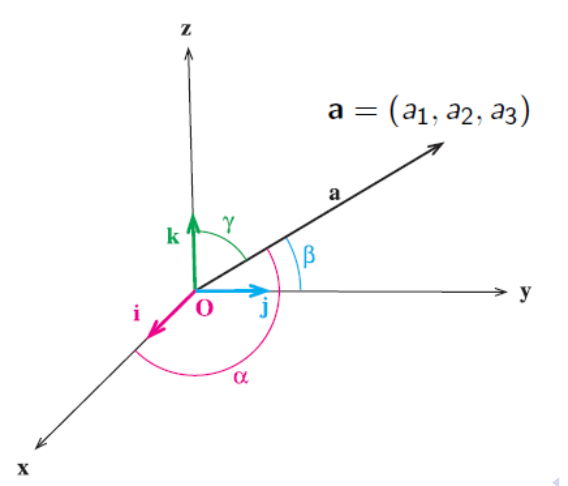
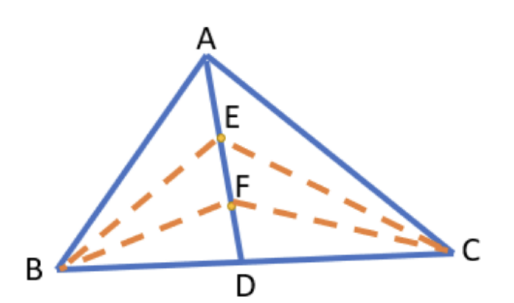



#### **1. Theory**

##### **1.1 The Inner Product**
An **inner product** is a generalized concept that defines a way to multiply two vectors to produce a scalar (a single number). It is a function that takes two vectors and returns a single value, and it allows us to introduce geometric concepts like length and angle into abstract vector spaces. The standard dot product is the most common example of an inner product. For a function to be considered an inner product, it must satisfy four key properties for any vectors $\vec{u}$, $\vec{v}$, $\vec{w}$ and any scalar $c$:

1.  **Symmetry**: The order of vectors doesn't matter. $\langle \vec{u}, \vec{v} \rangle = \langle \vec{v}, \vec{u} \rangle$.
2.  **Linearity**: A scalar multiple can be factored out. $\langle c\vec{u}, \vec{v} \rangle = c\langle \vec{u}, \vec{v} \rangle$.
3.  **Additivity**: The product distributes over vector addition. $\langle \vec{u} + \vec{w}, \vec{v} \rangle = \langle \vec{u}, \vec{v} \rangle + \langle \vec{w}, \vec{v} \rangle$.
4.  **Positive Definiteness**: The inner product of a vector with itself is always non-negative, and it is zero *if and only if* the vector is the zero vector. $\langle \vec{v}, \vec{v} \rangle \ge 0$ and $\langle \vec{v}, \vec{v} \rangle = 0 \iff \vec{v} = \vec{0}$.

A vector space equipped with an inner product is called an **inner product space**.

##### **1.2 The Dot Product**
The **dot product** (also known as the Euclidean inner product) is the standard way to combine two vectors to produce a scalar. It has two primary definitions: an algebraic one and a geometric one. Both yield the same result.

##### **1.3 Algebraic Definition of the Dot Product**
The algebraic definition is calculated by multiplying the corresponding components of two vectors and summing the results. For two vectors $\vec{u} = (u_1, u_2, \dots, u_n)$ and $\vec{v} = (v_1, v_2, \dots, v_n)$ in $\mathbb{R}^n$, the dot product is:
$$ \vec{u} \cdot \vec{v} = u_1v_1 + u_2v_2 + \dots + u_nv_n = \sum_{i=1}^{n} u_i v_i $$
For example, in 3D space, if $\vec{a} = (a_1, a_2, a_3)$ and $\vec{b} = (b_1, b_2, b_3)$, then $\vec{a} \cdot \vec{b} = a_1b_1 + a_2b_2 + a_3b_3$.

##### **1.4 Geometric Definition and Connection to the Law of Cosines**
The geometric definition relates the dot product to the *magnitudes* (lengths) of the vectors and the *angle* between them. For two vectors $\vec{v}$ and $\vec{w}$, with an angle $\theta$ between them:
$$ \vec{v} \cdot \vec{w} = ||\vec{v}|| \cdot ||\vec{w}|| \cos(\theta) $$
Here, $||\vec{v}||$ denotes the magnitude of vector $\vec{v}$. This definition is powerful because it connects a simple algebraic operation to a fundamental geometric property (the angle) and helps us understand how "aligned" two vectors are.
<!-- DIAGRAM HERE -->
This formula can be derived directly from the **Law of Cosines**. Consider a triangle formed by vectors $\vec{v}$, $\vec{w}$, and their difference $\vec{v}-\vec{w}$. The Law of Cosines states:
$$ ||\vec{v}-\vec{w}||^2 = ||\vec{v}||^2 + ||\vec{w}||^2 - 2||\vec{v}||||\vec{w}||\cos(\theta) $$
Expanding the left side using the dot product gives $||\vec{v}-\vec{w}||^2 = (\vec{v}-\vec{w})\cdot(\vec{v}-\vec{w}) = ||\vec{v}||^2 - 2(\vec{v}\cdot\vec{w}) + ||\vec{w}||^2$. By equating the two expressions, we arrive at the geometric definition of the dot product.

The sign of the dot product tells us about the angle $\theta$:

*   If $\vec{v} \cdot \vec{w} > 0$, then $\cos(\theta) > 0$, so the angle is *acute* ($0^\circ \le \theta < 90^\circ$).
*   If $\vec{v} \cdot \vec{w} < 0$, then $\cos(\theta) < 0$, so the angle is *obtuse* ($90^\circ < \theta \le 180^\circ$).
*   If $\vec{v} \cdot \vec{w} = 0$, then $\cos(\theta) = 0$, so the angle is *right* ($\theta = 90^\circ$).

##### **1.5 Orthogonality**
Two non-zero vectors are **orthogonal** (perpendicular) if and only if their dot product is zero. This is one of the most important applications of the dot product.
$$ \vec{v} \perp \vec{w} \iff \vec{v} \cdot \vec{w} = 0 $$

##### **1.6 Vector Norm and Its Properties**
The dot product defines the **norm** (or length) of a vector, which is called the *induced norm*. The norm of a vector $\vec{v}$ is the square root of the dot product of the vector with itself.
$$ ||\vec{v}|| = \sqrt{\vec{v} \cdot \vec{v}} $$
From the algebraic definition, for $\vec{v} = (v_1, v_2, v_3)$, this is the familiar distance formula: $||\vec{v}|| = \sqrt{v_1^2 + v_2^2 + v_3^2}$. This norm satisfies several key properties:

1. **Non-negativity**: $||\vec{v}|| \ge 0$.
2. **Point-separating**: $||\vec{v}|| = 0 \iff \vec{v} = \vec{0}$.
3. **Absolute homogeneity**: $||c\vec{v}|| = |c| \cdot ||\vec{v}||$.
4. **Triangle Inequality**: $||\vec{u} + \vec{v}|| \le ||\vec{u}|| + ||\vec{v}||$. This states that the length of the sum of two vectors is less than or equal to the sum of their individual lengths.

##### **1.7 Key Inequalities and Identities**
The properties of the inner product lead to several fundamental results:

*   **Cauchy-Schwarz Inequality**: This inequality provides an upper bound on the magnitude of the dot product of two vectors: $|\vec{v} \cdot \vec{w}| \le ||\vec{v}|| \cdot ||\vec{w}||$. It is one of the most important inequalities in mathematics.
*   **Parallelogram Law**: This law relates the lengths of the sides of a parallelogram to the lengths of its diagonals: $||\vec{a} + \vec{b}||^2 + ||\vec{a} - \vec{b}||^2 = 2(||\vec{a}||^2 + ||\vec{b}||^2)$.

##### **1.8 Projections**
Projections describe how much of one vector points in the direction of another, essentially casting a "shadow".

###### **1.8.1 Scalar Projection**
The **scalar projection** of vector $\vec{v}$ onto vector $\vec{w}$ is the *signed length* of the component of $\vec{v}$ that lies in the direction of $\vec{w}$.
$$ \text{comp}_{\vec{w}}(\vec{v}) = \frac{\vec{v} \cdot \vec{w}}{||\vec{w}||} $$
This value is a scalar. It is positive if the projection points in the same direction as $\vec{w}$ and negative if it points in the opposite direction.

###### **1.8.2 Vector Projection**
The **vector projection** is the actual vector that represents the shadow. It has the magnitude of the scalar projection and the direction of $\vec{w}$.
<!-- DIAGRAM HERE -->
$$ \text{proj}_{\vec{w}}(\vec{v}) = \left( \frac{\vec{v} \cdot \vec{w}}{||\vec{w}||^2} \right) \vec{w} = \left( \frac{\vec{v} \cdot \vec{w}}{\vec{w} \cdot \vec{w}} \right) \vec{w} $$
The term in parentheses is a scalar that scales the vector $\vec{w}$.

##### **1.9 Decomposing a Vector**
Any vector $\vec{v}$ can be uniquely decomposed into two orthogonal components relative to another non-zero vector $\vec{w}$:

1.  A component parallel to $\vec{w}$: $\vec{v}_{||} = \text{proj}_{\vec{w}}(\vec{v})$.
2.  A component orthogonal to $\vec{w}$: $\vec{v}_{\perp} = \vec{v} - \vec{v}_{||}$.
The sum of these two components gives back the original vector: $\vec{v} = \vec{v}_{||} + \vec{v}_{\perp}$.

##### **1.10 Direction Cosines**
For a vector $\vec{a} = (a_1, a_2, a_3)$ in 3D space, the angles it forms with the positive x, y, and z axes are denoted $\alpha$, $\beta$, and $\gamma$, respectively. The cosines of these angles are called **direction cosines** and can be found using the dot product:

*   $\cos(\alpha) = \frac{\vec{a} \cdot \vec{i}}{||\vec{a}||} = \frac{a_1}{||\vec{a}||}$
*   $\cos(\beta) = \frac{\vec{a} \cdot \vec{j}}{||\vec{a}||} = \frac{a_2}{||\vec{a}||}$
*   $\cos(\gamma) = \frac{\vec{a} \cdot \vec{k}}{||\vec{a}||} = \frac{a_3}{||\vec{a}||}$
These cosines are related by the identity:
$$ \cos^2(\alpha) + \cos^2(\beta) + \cos^2(\gamma) = 1 $$

***

#### **2. Definitions**
*   **Inner Product**: A function that takes two vectors and produces a scalar, satisfying the properties of symmetry, linearity, additivity, and positive definiteness.
*   **Inner Product Space**: A vector space that has an inner product defined on it.
*   **Dot Product**: The most common type of inner product, calculated as the sum of the products of corresponding vector components ($\sum u_i v_i$).
*   **Orthogonal Vectors**: Two vectors whose dot product is zero, indicating they are perpendicular to each other.
*   **Norm (Vector Length)**: The magnitude of a vector, calculated as the square root of the dot product of the vector with itself ($||\vec{v}|| = \sqrt{\vec{v} \cdot \vec{v}}$).
*   **Scalar Projection**: The signed length of the projection of one vector onto another, resulting in a scalar value.
*   **Vector Projection**: The vector that represents the "shadow" of one vector onto another. It is parallel to the vector being projected upon.
*   **Cauchy-Schwarz Inequality**: A fundamental theorem stating that the absolute value of the dot product of two vectors is less than or equal to the product of their norms.
*   **Triangle Inequality**: A property of norms stating that the norm of a sum of two vectors is no greater than the sum of their individual norms.
*   **Parallelogram Law**: An identity relating the sum of the squares of the lengths of a parallelogram's sides to the sum of the squares of its diagonals.

***

#### **3. Formulas**
*   **Algebraic Dot Product**: $$ \vec{u} \cdot \vec{v} = \sum_{i=1}^{n} u_i v_i $$
*   **Geometric Dot Product**: $$ \vec{v} \cdot \vec{w} = ||\vec{v}|| \cdot ||\vec{w}|| \cos(\theta) $$
*   **Dot Product with Scalar Multiplication**: $\vec{a} \cdot (k\vec{b}) = k(\vec{a} \cdot \vec{b})$
*   **Distributive Property of Dot Product**: $\vec{a} \cdot (\vec{b} + \vec{c}) = \vec{a} \cdot \vec{b} + \vec{a} \cdot \vec{c}$
*   **Dot Product and Norm**: $\vec{v} \cdot \vec{v} = ||\vec{v}||^2$
*   **Vector Norm**: $$ ||\vec{v}|| = \sqrt{v_1^2 + v_2^2 + \dots + v_n^2} $$
*   **Angle Between Vectors**: $$ \cos(\theta) = \frac{\vec{v} \cdot \vec{w}}{||\vec{v}|| \cdot ||\vec{w}||} $$
*   **Orthogonality Condition**: $\vec{v} \cdot \vec{w} = 0$
*   **Vector Projection**: $$ \text{proj}_{\vec{w}}(\vec{v}) = \left( \frac{\vec{v} \cdot \vec{w}}{||\vec{w}||^2} \right) \vec{w} $$
*   **Scalar Projection (Component)**: $$ \text{comp}_{\vec{w}}(\vec{v}) = \frac{\vec{v} \cdot \vec{w}}{||\vec{w}||} $$
*   **Vector Decomposition**: $\vec{v} = \vec{v}_{||} + \vec{v}_{\perp}$, where $\vec{v}_{||} = \text{proj}_{\vec{w}}(\vec{v})$ and $\vec{v}_{\perp} = \vec{v} - \vec{v}_{||}$
*   **Parallelogram Law**: $$ ||\vec{a} + \vec{b}||^2 + ||\vec{a} - \vec{b}||^2 = 2(||\vec{a}||^2 + ||\vec{b}||^2) $$
*   **Direction Cosines**: $\cos(\alpha) = \frac{a_1}{||\vec{a}||}, \cos(\beta) = \frac{a_2}{||\vec{a}||}, \cos(\gamma) = \frac{a_3}{||\vec{a}||}$
*   **Direction Cosines Identity**: $$ \cos^2(\alpha) + \cos^2(\beta) + \cos^2(\gamma) = 1 $$
*   **Vector Between Two Points**: $\vec{BA} = A - B$
*   **Median Vector**: $$ \vec{AD} = \frac{\vec{AB} + \vec{AC}}{2} $$

***

#### **4. Practice**
##### **4.1. Evaluate a Vector Expression** (Lab 2, Task 1)
Evaluate $|\vec{a}|² − 2\sqrt{3}(\vec{a} \cdot \vec{b}) − 7|\vec{b}|²$ given that $|\vec{a}| = 4$, $|\vec{b}| = 1$, and the angle $∠(\vec{a}, \vec{b}) = 150°$.

Click to see the solution

1.  **Find the dot product:** First, calculate the value of $\vec{a} \cdot \vec{b}$ using the formula $\vec{a} \cdot \vec{b} = |\vec{a}||\vec{b}|\cos(\theta)$.
    *   $\cos(150°) = \cos(180° - 30°) = -\cos(30°) = -\sqrt{3}/2$.
    *   $\vec{a} \cdot \vec{b} = (4)(1)(-\sqrt{3}/2) = -2\sqrt{3}$.
2.  **Substitute the values into the expression:** Now substitute the given magnitudes and the calculated dot product into the expression.
    *   Expression = $|\vec{a}|² − 2\sqrt{3}(\vec{a} \cdot \vec{b}) − 7|\vec{b}|²$
    *   $= (4)² − 2\sqrt{3}(-2\sqrt{3}) − 7(1)²$
3.  **Simplify and calculate:**
    *   $= 16 - 2(-2)(\sqrt{3} \cdot \sqrt{3}) - 7$
    *   $= 16 + 4(3) - 7$
    *   $= 16 + 12 - 7 = 21$.

**Answer:** The value of the expression is $21$.

##### **4.2. Find the Angle Between Vectors** (Lab 2, Task 2)
Find the angle between the vectors $\vec{a} = [1, −1, 1]$ and $\vec{b} = [−5, −1, −1]$.

Click to see the solution

1.  **Calculate the dot product:**
    *   $\vec{a} \cdot \vec{b} = (1)(-5) + (-1)(-1) + (1)(-1) = -5 + 1 - 1 = -5$.
2.  **Calculate the magnitudes of the vectors:**
    *   $|\vec{a}| = \sqrt{1² + (-1)² + 1²} = \sqrt{1 + 1 + 1} = \sqrt{3}$.
    *   $|\vec{b}| = \sqrt{(-5)² + (-1)² + (-1)²} = \sqrt{25 + 1 + 1} = \sqrt{27} = 3\sqrt{3}$.
3.  **Use the angle formula:** $\cos(\theta) = (\vec{a} \cdot \vec{b}) / (|\vec{a}||\vec{b}|)$.
    *   $\cos(\theta) = -5 / (\sqrt{3} \cdot 3\sqrt{3}) = -5 / (3 \cdot 3) = -5/9$.
4.  **Find the angle:**
    *   $\theta = \arccos(-5/9) \approx 123.75°$.

**Answer:** The angle is $\arccos(-5/9)$, which is approximately $123.75°$.

##### **4.3. Prove Vector Perpendicularity** (Lab 2, Task 3)
Prove that vectors $\vec{b}(\vec{a} \cdot \vec{c}) − \vec{c}(\vec{a} \cdot \vec{b})$ and $\vec{a}$ are perpendicular to each other.

Click to see the solution

1.  **Recall the condition for perpendicularity:** Two vectors are perpendicular if their dot product is zero. We need to show that $[\vec{b}(\vec{a} \cdot \vec{c}) − \vec{c}(\vec{a} \cdot \vec{b})] \cdot \vec{a} = 0$.
2.  **Apply the distributive property of the dot product:**
    *   $[\vec{b}(\vec{a} \cdot \vec{c})] \cdot \vec{a} − [\vec{c}(\vec{a} \cdot \vec{b})] \cdot \vec{a}$
3.  **Treat scalar products as scalars:** The terms $(\vec{a} \cdot \vec{c})$ and $(\vec{a} \cdot \vec{b})$ are scalar values. We can rearrange the order of multiplication.
    *   $(\vec{a} \cdot \vec{c})(\vec{b} \cdot \vec{a}) − (\vec{a} \cdot \vec{b})(\vec{c} \cdot \vec{a})$
4.  **Use the commutative property of the dot product:** $\vec{b} \cdot \vec{a} = \vec{a} \cdot \vec{b}$ and $\vec{c} \cdot \vec{a} = \vec{a} \cdot \vec{c}$.
    *   $(\vec{a} \cdot \vec{c})(\vec{a} \cdot \vec{b}) − (\vec{a} \cdot \vec{b})(\vec{a} \cdot \vec{c})$
5.  **Simplify the expression:** The two terms are identical, so their difference is zero.
    *   $0$

**Answer:** Since the dot product of the two vectors is $0$, they are perpendicular.

##### **4.4. Calculate a Sum of Dot Products** (Lab 2, Task 4)
All three vectors $\vec{a}$, $\vec{b}$, and $\vec{c}$ have length $3$ and $\vec{a} + \vec{b} + \vec{c} = \vec{0}$. Find $\vec{a} \cdot \vec{b} + \vec{b} \cdot \vec{c} + \vec{c} \cdot \vec{a}$.

Click to see the solution

1.  **Start with the given vector sum:** $\vec{a} + \vec{b} + \vec{c} = \vec{0}$.
2.  **Take the dot product of the equation with itself:**
    *   $(\vec{a} + \vec{b} + \vec{c}) \cdot (\vec{a} + \vec{b} + \vec{c}) = \vec{0} \cdot \vec{0} = 0$.
3.  **Expand the left side:**
    *   $\vec{a}\cdot\vec{a} + \vec{a}\cdot\vec{b} + \vec{a}\cdot\vec{c} + \vec{b}\cdot\vec{a} + \vec{b}\cdot\vec{b} + \vec{b}\cdot\vec{c} + \vec{c}\cdot\vec{a} + \vec{c}\cdot\vec{b} + \vec{c}\cdot\vec{c} = 0$.
4.  **Simplify and group terms:** Using $\vec{u}\cdot\vec{u} = |\vec{u}|²$ and the commutative property ($\vec{u}\cdot\vec{v} = \vec{v}\cdot\vec{u}$):
    *   $|\vec{a}|² + |\vec{b}|² + |\vec{c}|² + 2(\vec{a}\cdot\vec{b}) + 2(\vec{b}\cdot\vec{c}) + 2(\vec{c}\cdot\vec{a}) = 0$.
    *   $|\vec{a}|² + |\vec{b}|² + |\vec{c}|² + 2(\vec{a}\cdot\vec{b} + \vec{b}\cdot\vec{c} + \vec{c}\cdot\vec{a}) = 0$.
5.  **Substitute the known magnitudes:** We are given $|\vec{a}| = |\vec{b}| = |\vec{c}| = 3$.
    *   $3² + 3² + 3² + 2(\vec{a}\cdot\vec{b} + \vec{b}\cdot\vec{c} + \vec{c}\cdot\vec{a}) = 0$.
    *   $9 + 9 + 9 + 2(\vec{a}\cdot\vec{b} + \vec{b}\cdot\vec{c} + \vec{c}\cdot\vec{a}) = 0$.
    *   $27 + 2(\vec{a}\cdot\vec{b} + \vec{b}\cdot\vec{c} + \vec{c}\cdot\vec{a}) = 0$.
6.  **Solve for the desired expression:**
    *   $2(\vec{a}\cdot\vec{b} + \vec{b}\cdot\vec{c} + \vec{c}\cdot\vec{a}) = -27$.
    *   $\vec{a}\cdot\vec{b} + \vec{b}\cdot\vec{c} + \vec{c}\cdot\vec{a} = -27 / 2$.

**Answer:** $\vec{a} \cdot \vec{b} + \vec{b} \cdot \vec{c} + \vec{c} \cdot \vec{a} = -13.5$.

##### **4.5. Find an Unknown Vector** (Lab 2, Task 5)
There are two vectors $\vec{a} = [1, −1, 1]$ and $\vec{b} =$. A third vector $\vec{c}$ has length equal to $1$. The vector $\vec{c}$ is perpendicular to $\vec{a}$. The angle between $\vec{b}$ and $\vec{c}$ is $\arccos(\sqrt{2/27})$. Find the coordinates of $\vec{c}$. How many solutions does the task have?

Click to see the solution

1.  **Set up equations from the given conditions:** Let $\vec{c} = (x, y, z)$.
    *   Condition 1: $|\vec{c}| = 1 \implies x² + y² + z² = 1$.
    *   Condition 2: $\vec{c} \perp \vec{a} \implies \vec{c} \cdot \vec{a} = 0 \implies (x)(1) + (y)(-1) + (z)(1) = 0 \implies x - y + z = 0$.
    *   Condition 3: Angle between $\vec{b}$ and $\vec{c}$ is $\theta = \arccos(\sqrt{2/27}) \implies \cos(\theta) = (\vec{b} \cdot \vec{c}) / (|\vec{b}||\vec{c}|) = \sqrt{2/27}$.
2.  **Process the third condition:**
    *   $|\vec{b}| = \sqrt{5² + 1² + 1²} = \sqrt{25 + 1 + 1} = \sqrt{27}$.
    *   $|\vec{c}| = 1$ (given).
    *   $\vec{b} \cdot \vec{c} = 5x + y + z$.
    *   So, $(5x + y + z) / (\sqrt{27} \cdot 1) = \sqrt{2/27}$.
    *   $5x + y + z = \sqrt{2}$.
3.  **Solve the system of three equations:**
    *   Eq 1: $x² + y² + z² = 1$
    *   Eq 2: $y = x + z$
    *   Eq 3: $5x + y + z = \sqrt{2}$
4.  **Substitute Eq 2 into Eq 3:**
    *   $5x + (x + z) + z = \sqrt{2} \implies 6x + 2z = \sqrt{2} \implies z = (\sqrt{2} - 6x) / 2$.
5.  **Substitute z back into the expression for y (Eq 2):**
    *   $y = x + (\sqrt{2} - 6x) / 2 = (2x + \sqrt{2} - 6x) / 2 = (\sqrt{2} - 4x) / 2$.
6.  **Substitute y and z in terms of x into Eq 1:**
    *   $x² + ((\sqrt{2} - 4x) / 2)² + ((\sqrt{2} - 6x) / 2)² = 1$.
    *   $x² + (2 - 8\sqrt{2}x + 16x²) / 4 + (2 - 12\sqrt{2}x + 36x²) / 4 = 1$.
    *   Multiply by 4: $4x² + 2 - 8\sqrt{2}x + 16x² + 2 - 12\sqrt{2}x + 36x² = 4$.
    *   Combine terms: $56x² - 20\sqrt{2}x + 4 = 4$.
    *   $56x² - 20\sqrt{2}x = 0 \implies 4x(14x - 5\sqrt{2}) = 0$.
7.  **Find the possible values for x:**
    *   Solution A: $x = 0$.
    *   Solution B: $14x - 5\sqrt{2} = 0 \implies x = 5\sqrt{2} / 14$.
8.  **Calculate y and z for each solution:**
    *   **For Solution A (x = 0):**
        *   $z = (\sqrt{2} - 0) / 2 = \sqrt{2} / 2$.
        *   $y = (\sqrt{2} - 0) / 2 = \sqrt{2} / 2$.
        *   $\vec{c₁} = (0, \sqrt{2}/2, \sqrt{2}/2)$.
    *   **For Solution B ($x = 5\sqrt{2} / 14$):**
        *   $z = (\sqrt{2} - 6(5\sqrt{2}/14)) / 2 = (\sqrt{2} - 30\sqrt{2}/14) / 2 = ((14\sqrt{2} - 30\sqrt{2})/14) / 2 = (-16\sqrt{2}/14) / 2 = -8\sqrt{2} / 14 = -4\sqrt{2} / 7$.
        *   $y = (\sqrt{2} - 4(5\sqrt{2}/14)) / 2 = (\sqrt{2} - 20\sqrt{2}/14) / 2 = ((14\sqrt{2} - 20\sqrt{2})/14) / 2 = (-6\sqrt{2}/14) / 2 = -3\sqrt{2} / 14$.
        *   $\vec{c₂} = (5\sqrt{2}/14, -3\sqrt{2}/14, -4\sqrt{2}/7)$.

**Answer:** There are two solutions for the vector $\vec{c}$:
$\vec{c₁} = (0, \sqrt{2}/2, \sqrt{2}/2)$
$\vec{c₂} = (5\sqrt{2}/14, -3\sqrt{2}/14, -4\sqrt{2}/7)$

##### **4.6. Dot Product in R³** (Lecture 2, Example 1)
Calculate the dot product of $\vec{u} = (1, −2, 4)$ and $\vec{v} = (3, 0, −5)$.

Click to see the solution

1.  **Use the formula for dot product:** For two vectors in $R³$, $\vec{u} = (u₁, u₂, u₃)$ and $\vec{v} = (v₁, v₂, v₃)$, the dot product is $\vec{u} \cdot \vec{v} = u₁v₁ + u₂v₂ + u₃v₃$.
2.  **Substitute the components:**
    *   $\vec{u} \cdot \vec{v} = (1)(3) + (−2)(0) + (4)(−5)$.
3.  **Calculate the result:**
    *   $3 + 0 - 20 = -17$.

**Answer:** The dot product is $-17$.

##### **4.7. Dot Product Cancellation** (Lecture 2, Example 2)
Assume $\vec{a}$, $\vec{b}$ and $\vec{c}$ are three nonzero vectors. If $\vec{a} \cdot \vec{b} = \vec{a} \cdot \vec{c}$, is it true to say $\vec{b} = \vec{c}$?

Click to see the solution

1.  **Rearrange the equation:** Start with the given equation $\vec{a} \cdot \vec{b} = \vec{a} \cdot \vec{c}$ and move all terms to one side.
    *   $\vec{a} \cdot \vec{b} - \vec{a} \cdot \vec{c} = 0$
2.  **Apply the distributive property:** The dot product is distributive over vector subtraction.
    *   $\vec{a} \cdot (\vec{b} - \vec{c}) = 0$
3.  **Interpret the result:** This equation means that the vector $\vec{a}$ is orthogonal (perpendicular) to the vector $(\vec{b} - \vec{c})$.
4.  **Conclusion:** The fact that $\vec{a}$ is orthogonal to $(\vec{b} - \vec{c})$ does not require $(\vec{b} - \vec{c})$ to be the zero vector. It only requires them to be at a 90-degree angle. Therefore, $\vec{b}$ does not necessarily equal $\vec{c}$.

**Answer:** No, it is not true. For a counterexample, let $\vec{a} = (1, 0)$, $\vec{b} = (0, 5)$, and $\vec{c} = (0, 10)$. Then $\vec{a} \cdot \vec{b} = (1)(0) + (0)(5) = 0$ and $\vec{a} \cdot \vec{c} = (1)(0) + (0)(10) = 0$. So $\vec{a} \cdot \vec{b} = \vec{a} \cdot \vec{c}$, but clearly $\vec{b} \neq \vec{c}$.

##### **4.8. Vector Operations** (Lecture 2, Example 3)
Given $\vec{a} \cdot \vec{b} = 4$, $\vec{a} \cdot \vec{c} = -2$, and $||\vec{a}|| = 1$, find $\vec{a} \cdot (3\vec{b})$.

Click to see the solution

1.  **Use the scalar multiplication property:** The dot product has the property that $k(\vec{a} \cdot \vec{b}) = \vec{a} \cdot (k\vec{b})$.
2.  **Apply the property:** $\vec{a} \cdot (3\vec{b}) = 3(\vec{a} \cdot \vec{b})$.
3.  **Substitute the given value:** We are given that $\vec{a} \cdot \vec{b} = 4$.
    *   $3 \cdot (4) = 12$.

**Answer:** $12$.

##### **4.9. Vector Operations** (Lecture 2, Example 4)
Given $\vec{a} \cdot \vec{b} = 4$, $\vec{a} \cdot \vec{c} = -2$, and $||\vec{a}|| = 1$, find $\vec{a} \cdot (\vec{b} + \vec{c})$.

Click to see the solution

1.  **Use the distributive property:** The dot product distributes over vector addition: $\vec{a} \cdot (\vec{b} + \vec{c}) = \vec{a} \cdot \vec{b} + \vec{a} \cdot \vec{c}$.
2.  **Substitute the given values:** We are given that $\vec{a} \cdot \vec{b} = 4$ and $\vec{a} \cdot \vec{c} = -2$.
    *   $4 + (-2) = 2$.

**Answer:** $2$.

##### **4.10. Vector Operations** (Lecture 2, Example 5)
Given $\vec{a} \cdot \vec{b} = 4$, $\vec{a} \cdot \vec{c} = -2$, and $||\vec{a}|| = 1$, find $\vec{a} \cdot (4\vec{a})$.

Click to see the solution

1.  **Use the scalar multiplication property:** $\vec{a} \cdot (4\vec{a}) = 4(\vec{a} \cdot \vec{a})$.
2.  **Relate dot product to magnitude:** The dot product of a vector with itself is the square of its magnitude: $\vec{a} \cdot \vec{a} = ||\vec{a}||²$.
3.  **Substitute into the expression:** $4(||\vec{a}||²)$.
4.  **Substitute the given value:** We are given that $||\vec{a}|| = 1$.
    *   $4 \cdot (1²) = 4$.

**Answer:** $4$.

##### **4.11. Parallelogram Law** (Lecture 2, Example 6)
Given two vectors $\vec{a}$ and $\vec{b}$, what is $||\vec{a} − \vec{b}||² + ||\vec{a} + \vec{b}||²$?

Click to see the solution

1.  **Expand the terms:** Use the property that $||\vec{v}||² = \vec{v} \cdot \vec{v}$.
    *   $||\vec{a} - \vec{b}||² = (\vec{a} - \vec{b}) \cdot (\vec{a} - \vec{b}) = \vec{a}\cdot\vec{a} - \vec{a}\cdot\vec{b} - \vec{b}\cdot\vec{a} + \vec{b}\cdot\vec{b} = ||\vec{a}||² - 2(\vec{a}\cdot\vec{b}) + ||\vec{b}||²$
    *   $||\vec{a} + \vec{b}||² = (\vec{a} + \vec{b}) \cdot (\vec{a} + \vec{b}) = \vec{a}\cdot\vec{a} + \vec{a}\cdot\vec{b} + \vec{b}\cdot\vec{a} + \vec{b}\cdot\vec{b} = ||\vec{a}||² + 2(\vec{a}\cdot\vec{b}) + ||\vec{b}||²$
2.  **Add the expanded expressions:**
    *   $(||\vec{a}||² - 2(\vec{a}\cdot\vec{b}) + ||\vec{b}||²) + (||\vec{a}||² + 2(\vec{a}\cdot\vec{b}) + ||\vec{b}||²)$
3.  **Simplify:** The terms $-2(\vec{a}\cdot\vec{b})$ and $2(\vec{a}\cdot\vec{b})$ cancel out.
    *   $||\vec{a}||² + ||\vec{b}||² + ||\vec{a}||² + ||\vec{b}||² = 2||\vec{a}||² + 2||\vec{b}||²$

**Answer:** $2||\vec{a}||² + 2||\vec{b}||²$

##### **4.12. Find the Angle Between Vectors** (Lecture 2, Example 7)
Find the angle between $\vec{u} = (3, −1)$ and $\vec{v} = (2, 4)$.

Click to see the solution

1.  **Compute dot product:** $\vec{u} \cdot \vec{v} = (3)(2) + (−1)(4) = 6 − 4 = 2$.
2.  **Compute magnitudes:**
    *   $||\vec{u}|| = \sqrt{3² + (−1)²} = \sqrt{9 + 1} = \sqrt{10}$.
    *   $||\vec{v}|| = \sqrt{2² + 4²} = \sqrt{4 + 16} = \sqrt{20} = 2\sqrt{5}$.
3.  **Use the angle formula:** The cosine of the angle $\theta$ between two vectors is given by $\cos(\theta) = (\vec{u} \cdot \vec{v}) / (||\vec{u}|| ||\vec{v}||)$.
    *   $\cos(\theta) = 2 / (\sqrt{10} \cdot 2\sqrt{5}) = 2 / (2\sqrt{50}) = 1 / \sqrt{50}$.
4.  **Find the angle:** $\theta = \arccos(1/\sqrt{50})$.
    *   $\theta \approx 81.87°$.

**Answer:** The angle is approximately $81.87°$.

##### **4.13. Determine if Vectors are Orthogonal** (Lecture 2, Example 8)
Determine if the vectors $\vec{a} = (2, −3)$ and $\vec{b} = (3, 2)$ are orthogonal.

Click to see the solution

1.  **Recall the condition for orthogonality:** Two vectors are orthogonal if their dot product is zero.
2.  **Compute the dot product:**
    *   $\vec{a} \cdot \vec{b} = (2)(3) + (−3)(2) = 6 − 6 = 0$.

**Answer:** The dot product is $0$, so the vectors are **Orthogonal**.

##### **4.14. Determine if Vectors are Orthogonal** (Lecture 2, Example 9)
Determine if the vectors $\vec{u} = (1, 4, −2)$ and $\vec{v} = (0, 1, 2)$ are orthogonal.

Click to see the solution

1.  **Recall the condition for orthogonality:** Two vectors are orthogonal if their dot product is zero.
2.  **Compute the dot product:**
    *   $\vec{u} \cdot \vec{v} = (1)(0) + (4)(1) + (−2)(2) = 0 + 4 − 4 = 0$.

**Answer:** The dot product is $0$, so the vectors are **Orthogonal**.

##### **4.15. Determine if Vectors are Orthogonal** (Lecture 2, Example 10)
Determine if the vectors $\vec{p} = (1, 1)$ and $\vec{q} = (2, 2)$ are orthogonal.

Click to see the solution

1.  **Recall the condition for orthogonality:** Two vectors are orthogonal if their dot product is zero.
2.  **Compute the dot product:**
    *   $\vec{p} \cdot \vec{q} = (1)(2) + (1)(2) = 2 + 2 = 4$.

**Answer:** The dot product is $4$ (not $0$), so the vectors are **Not Orthogonal**.

##### **4.16. Find the Vector Projection** (Lecture 2, Example 11)
Find the vector projection of $\vec{v} = (5, 3)$ onto $\vec{w} = (4, 0)$.

Click to see the solution

1.  **State the projection formula:** The projection of vector $\vec{v}$ onto vector $\vec{w}$ is given by: $proj_{\vec{w}}(\vec{v}) = ((\vec{v} \cdot \vec{w}) / ||\vec{w}||²) \cdot \vec{w}$.
2.  **Compute the dot product:** $\vec{v} \cdot \vec{w} = (5)(4) + (3)(0) = 20$.
3.  **Compute the squared magnitude of w:** $||\vec{w}||² = 4² + 0² = 16$.
4.  **Substitute into the formula:**
    *   $proj_{\vec{w}}(\vec{v}) = (20 / 16) \cdot (4, 0)$.
5.  **Simplify and calculate:**
    *   $proj_{\vec{w}}(\vec{v}) = (5 / 4) \cdot (4, 0) = ( (5/4)\cdot4, (5/4)\cdot0 ) = (5, 0)$.

**Answer:** The vector projection is $(5, 0)$.

##### **4.17. Find the Angle in a Triangle** (Tutorial 2, Task 1)
Given points $A(1, 2)$, $B(3, −1)$, and $C(−2, 1)$, find the measure of angle $∠ABC$.

Click to see the solution

1.  **Define the vectors:** The angle is at vertex B, so we need the vectors originating from B.
    *   $\vec{BA} = A - B = (1 - 3, 2 - (-1)) = (-2, 3)$
    *   $\vec{BC} = C - B = (-2 - 3, 1 - (-1)) = (-5, 2)$
2.  **Calculate the dot product:**
    *   $\vec{BA} \cdot \vec{BC} = (-2)(-5) + (3)(2) = 10 + 6 = 16$
3.  **Calculate the magnitudes:**
    *   $||\vec{BA}|| = \sqrt{(-2)² + 3²} = \sqrt{4 + 9} = \sqrt{13}$
    *   $||\vec{BC}|| = \sqrt{(-5)² + 2²} = \sqrt{25 + 4} = \sqrt{29}$
4.  **Use the angle formula:** $\cos(\theta) = (\vec{BA} \cdot \vec{BC}) / (||\vec{BA}|| ||\vec{BC}||)$
    *   $\cos(\theta) = 16 / (\sqrt{13} \cdot \sqrt{29}) = 16 / \sqrt{377}$
5.  **Find the angle:**
    *   $\theta = \arccos(16 / \sqrt{377}) \approx \arccos(0.8236) \approx 34.55°$

**Answer:** The measure of angle $∠ABC$ is approximately $34.55°$.

##### **4.18. Find an Unknown Vector Component** (Tutorial 2, Task 2)
Find the value of $x$ such that the vectors $\vec{u} = (x, −1, 3)$ and $\vec{v} = (x, 5, 1)$ are orthogonal.

Click to see the solution

1.  **Set the dot product to zero:** Two vectors are orthogonal if their dot product is $0$.
    *   $\vec{u} \cdot \vec{v} = 0$
2.  **Calculate the dot product in terms of x:**
    *   $(x)(x) + (−1)(5) + (3)(1) = 0$
3.  **Solve the equation for x:**
    *   $x² - 5 + 3 = 0$
    *   $x² - 2 = 0$
    *   $x² = 2$
    *   $x = \pm\sqrt{2}$

**Answer:** The values of $x$ are $\sqrt{2}$ and $-\sqrt{2}$.

##### **4.19. Prove the Identity for Direction Cosines** (Tutorial 2, Task 3)
Suppose that a non-zero vector $\vec{a} = (a₁, a₂, a₃)$ makes angles $\alpha$, $\beta$, and $\gamma$ with the positive X, Y, and Z axes, respectively. Prove that $\cos²(\alpha) + \cos²(\beta) + \cos²(\gamma) = 1$.

{fig-align="center" width=60%}

Click to see the solution

1.  **Define the direction angles:** The angle between the vector $\vec{a}$ and the positive X-axis (represented by the standard basis vector $\vec{i} = (1,0,0)$) is $\alpha$. Similarly, $\beta$ is the angle with $\vec{j} = (0,1,0)$, and $\gamma$ is the angle with $\vec{k} = (0,0,1)$.
2.  **Express cosines using the dot product formula:** From the formula $\vec{u} \cdot \vec{v} = ||\vec{u}|| ||\vec{v}|| \cos(\theta)$, we can find the cosine of each angle.
    *   $\cos(\alpha) = (\vec{a} \cdot \vec{i}) / (||\vec{a}|| ||\vec{i}||) = (a₁ \cdot 1 + a₂ \cdot 0 + a₃ \cdot 0) / (||\vec{a}|| \cdot 1) = a₁ / ||\vec{a}||$
    *   $\cos(\beta) = (\vec{a} \cdot \vec{j}) / (||\vec{a}|| ||\vec{j}||) = a₂ / ||\vec{a}||$
    *   $\cos(\gamma) = (\vec{a} \cdot \vec{k}) / (||\vec{a}|| ||\vec{k}||) = a₃ / ||\vec{a}||$
3.  **Substitute into the identity:**
    *   $\cos²(\alpha) + \cos²(\beta) + \cos²(\gamma) = (a₁/||\vec{a}||)² + (a₂/||\vec{a}||)² + (a₃/||\vec{a}||)²$
4.  **Simplify the expression:**
    *   $= (a₁² / ||\vec{a}||²) + (a₂² / ||\vec{a}||²) + (a₃² / ||\vec{a}||²)$
    *   $= (a₁² + a₂² + a₃²) / ||\vec{a}||²$
5.  **Use the definition of magnitude:** The magnitude of $\vec{a}$ is $||\vec{a}|| = \sqrt{a₁² + a₂² + a₃²}$, so $||\vec{a}||² = a₁² + a₂² + a₃²$.
    *   $= ||\vec{a}||² / ||\vec{a}||² = 1$

**Answer:** The identity $\cos²(\alpha) + \cos²(\beta) + \cos²(\gamma) = 1$ is proven.

##### **4.20. Prove the Law of Cosines using Vectors** (Tutorial 2, Task 4)
For any triangle with side lengths $a, b, c$ and angle $\theta$ opposite side $c$, prove the Law of Cosines: $c² = a² + b² - 2ab \cos(\theta)$.

Click to see the solution

1.  **Represent the triangle with vectors:** Let two sides of the triangle be represented by vectors $\vec{A}$ and $\vec{B}$, with lengths $||\vec{A}|| = a$ and $||\vec{B}|| = b$. Let the angle between them be $\theta$. The third side, $\vec{C}$, can be represented as the vector difference $\vec{C} = \vec{A} - \vec{B}$, and its length is $||\vec{C}|| = c$.
2.  **Use the dot product to find the squared length of C:**
    *   $c² = ||\vec{C}||² = \vec{C} \cdot \vec{C}$
3.  **Substitute and expand:**
    *   $c² = (\vec{A} - \vec{B}) \cdot (\vec{A} - \vec{B})$
    *   $c² = \vec{A}\cdot\vec{A} - \vec{A}\cdot\vec{B} - \vec{B}\cdot\vec{A} + \vec{B}\cdot\vec{B}$
4.  **Simplify using dot product properties:** Since $\vec{A}\cdot\vec{B} = \vec{B}\cdot\vec{A}$ and $\vec{V}\cdot\vec{V} = ||\vec{V}||²$:
    *   $c² = ||\vec{A}||² - 2(\vec{A} \cdot \vec{B}) + ||\vec{B}||²$
5.  **Substitute the geometric definition of the dot product:** We know that $\vec{A} \cdot \vec{B} = ||\vec{A}|| ||\vec{B}|| \cos(\theta) = ab \cos(\theta)$.
    *   $c² = a² - 2(ab \cos(\theta)) + b²$

**Answer:** Rearranging the terms gives the Law of Cosines: $c² = a² + b² - 2ab \cos(\theta)$.

##### **4.21. Find the Vector Projection** (Tutorial 2, Task 5)
Find the vector projection of $\vec{a} = (4, 3)$ onto $\vec{b} = (2, 2)$.

Click to see the solution

1.  **Recall the projection formula:** $proj_{\vec{b}}(\vec{a}) = ((\vec{a} \cdot \vec{b}) / ||\vec{b}||²) \cdot \vec{b}$.
2.  **Calculate the dot product:**
    *   $\vec{a} \cdot \vec{b} = (4)(2) + (3)(2) = 8 + 6 = 14$.
3.  **Calculate the squared magnitude of b:**
    *   $||\vec{b}||² = 2² + 2² = 4 + 4 = 8$.
4.  **Substitute the values into the formula:**
    *   $proj_{\vec{b}}(\vec{a}) = (14 / 8) \cdot (2, 2)$
5.  **Simplify and calculate:**
    *   $proj_{\vec{b}}(\vec{a}) = (7 / 4) \cdot (2, 2) = (14/4, 14/4) = (7/2, 7/2)$.

**Answer:** The vector projection is $(7/2, 7/2)$.

##### **4.22. Find the Scalar Component** (Tutorial 2, Task 6)
Find the scalar component of $\vec{a} = (1, −2, 4)$ in the direction of $\vec{b} = (2, 1, −2)$.

Click to see the solution

1.  **Recall the scalar component formula:** The scalar component of $\vec{a}$ on $\vec{b}$ is given by $comp_{\vec{b}}(\vec{a}) = (\vec{a} \cdot \vec{b}) / ||\vec{b}||$.
2.  **Calculate the dot product:**
    *   $\vec{a} \cdot \vec{b} = (1)(2) + (−2)(1) + (4)(−2) = 2 - 2 - 8 = -8$.
3.  **Calculate the magnitude of b:**
    *   $||\vec{b}|| = \sqrt{2² + 1² + (−2)²} = \sqrt{4 + 1 + 4} = \sqrt{9} = 3$.
4.  **Divide the dot product by the magnitude:**
    *   $comp_{\vec{b}}(\vec{a}) = -8 / 3$.

**Answer:** The scalar component is $-8/3$.

##### **4.23. Decompose a Vector** (Tutorial 2, Task 7)
Decompose the vector $\vec{a} = (5, 1, −3)$ into two vectors, one parallel to $\vec{b} = (1, 2, 2)$ and one orthogonal to it.

Click to see the solution

1.  **Find the parallel component:** The component of $\vec{a}$ parallel to $\vec{b}$ ($\vec{a}_{∥}$) is the vector projection of $\vec{a}$ onto $\vec{b}$.
    *   $\vec{a}_{∥} = proj_{\vec{b}}(\vec{a}) = ((\vec{a} \cdot \vec{b}) / ||\vec{b}||²) \cdot \vec{b}$.
2.  **Calculate the necessary values:**
    *   $\vec{a} \cdot \vec{b} = (5)(1) + (1)(2) + (−3)(2) = 5 + 2 - 6 = 1$.
    *   $||\vec{b}||² = 1² + 2² + 2² = 1 + 4 + 4 = 9$.
3.  **Calculate the parallel vector:**
    *   $\vec{a}_{∥} = (1 / 9) \cdot (1, 2, 2) = (1/9, 2/9, 2/9)$.
4.  **Find the orthogonal component:** The component of $\vec{a}$ orthogonal to $\vec{b}$ ($\vec{a}_{⊥}$) is the remaining part of $\vec{a}$.
    *   $\vec{a}_{⊥} = \vec{a} - \vec{a}_{∥}$.
5.  **Calculate the orthogonal vector:**
    *   $\vec{a}_{⊥} = (5, 1, -3) - (1/9, 2/9, 2/9)$
    *   $\vec{a}_{⊥} = (45/9 - 1/9, 9/9 - 2/9, -27/9 - 2/9)$
    *   $\vec{a}_{⊥} = (44/9, 7/9, -29/9)$.

**Answer:**

*   The vector parallel to $\vec{b}$ is $(1/9, 2/9, 2/9)$.
*   The vector orthogonal to $\vec{b}$ is $(44/9, 7/9, -29/9)$.

##### **4.24. Vector Dot Product in a Triangle with a Median** (Homework 2, Task 1)
In triangle ABC, the median AD is divided into three equal segments: AE, EF and FD. Given:

*   $\vec{BA} \cdot \vec{CA} = 4$
*   $\vec{BF} \cdot \vec{CF} = -1$

Find $\vec{BE} \cdot \vec{CE}$.

{fig-align="center" width=60%}

Click to see the solution

1.  **Establish a vector basis:** Let point A be the origin. We can define the vectors representing the sides of the triangle as $\vec{AB} = \mathbf{b}$ and $\vec{AC} = \mathbf{c}$.
2.  **Express points D, E, and F in terms of the basis:**
    *   Since AD is the median, D is the midpoint of BC. Thus, $\vec{AD} = \frac{\vec{AB} + \vec{AC}}{2} = \frac{\mathbf{b} + \mathbf{c}}{2}$.
    *   The median AD is divided into three equal parts, so $\vec{AE} = \frac{1}{3}\vec{AD} = \frac{1}{3} \left( \frac{\mathbf{b} + \mathbf{c}}{2} \right) = \frac{\mathbf{b} + \mathbf{c}}{6}$.
    *   Similarly, $\vec{AF} = \frac{2}{3}\vec{AD} = \frac{2}{3} \left( \frac{\mathbf{b} + \mathbf{c}}{2} \right) = \frac{\mathbf{b} + \mathbf{c}}{3}$.
3.  **Use the given information to find relationships between b and c:**
    *   First given: $\vec{BA} \cdot \vec{CA} = 4$.
        *   $\vec{BA} = -\vec{AB} = -\mathbf{b}$.
        *   $\vec{CA} = -\vec{AC} = -\mathbf{c}$.
        *   $(-\mathbf{b}) \cdot (-\mathbf{c}) = \mathbf{b} \cdot \mathbf{c} = 4$.
    *   Second given: $\vec{BF} \cdot \vec{CF} = -1$.
        *   $\vec{BF} = \vec{AF} - \vec{AB} = \frac{\mathbf{b} + \mathbf{c}}{3} - \mathbf{b} = \frac{-2\mathbf{b} + \mathbf{c}}{3}$.
        *   $\vec{CF} = \vec{AF} - \vec{AC} = \frac{\mathbf{b} + \mathbf{c}}{3} - \mathbf{c} = \frac{\mathbf{b} - 2\mathbf{c}}{3}$.
        *   $\left( \frac{-2\mathbf{b} + \mathbf{c}}{3} \right) \cdot \left( \frac{\mathbf{b} - 2\mathbf{c}}{3} \right) = -1$.
        *   $\frac{1}{9}(-2\mathbf{b}\cdot\mathbf{b} + 4\mathbf{b}\cdot\mathbf{c} + \mathbf{c}\cdot\mathbf{b} - 2\mathbf{c}\cdot\mathbf{c}) = -1$.
        *   $-2|\mathbf{b}|^2 + 5(\mathbf{b}\cdot\mathbf{c}) - 2|\mathbf{c}|^2 = -9$.
        *   Substitute $\mathbf{b} \cdot \mathbf{c} = 4$: $-2|\mathbf{b}|^2 + 5(4) - 2|\mathbf{c}|^2 = -9$.
        *   $-2|\mathbf{b}|^2 + 20 - 2|\mathbf{c}|^2 = -9$.
        *   $-2(|\mathbf{b}|^2 + |\mathbf{c}|^2) = -29 \implies |\mathbf{b}|^2 + |\mathbf{c}|^2 = 14.5$.
4.  **Calculate the required dot product:** We need to find $\vec{BE} \cdot \vec{CE}$.
    *   $\vec{BE} = \vec{AE} - \vec{AB} = \frac{\mathbf{b} + \mathbf{c}}{6} - \mathbf{b} = \frac{-5\mathbf{b} + \mathbf{c}}{6}$.
    *   $\vec{CE} = \vec{AE} - \vec{AC} = \frac{\mathbf{b} + \mathbf{c}}{6} - \mathbf{c} = \frac{\mathbf{b} - 5\mathbf{c}}{6}$.
    *   $\vec{BE} \cdot \vec{CE} = \left( \frac{-5\mathbf{b} + \mathbf{c}}{6} \right) \cdot \left( \frac{\mathbf{b} - 5\mathbf{c}}{6} \right)$.
    *   $= \frac{1}{36}(-5\mathbf{b}\cdot\mathbf{b} + 25\mathbf{b}\cdot\mathbf{c} + \mathbf{c}\cdot\mathbf{b} - 5\mathbf{c}\cdot\mathbf{c})$.
    *   $= \frac{1}{36}(-5|\mathbf{b}|^2 + 26(\mathbf{b}\cdot\mathbf{c}) - 5|\mathbf{c}|^2)$.
    *   $= \frac{1}{36}(-5(|\mathbf{b}|^2 + |\mathbf{c}|^2) + 26(\mathbf{b}\cdot\mathbf{c}))$.
5.  **Substitute the derived values:**
    *   $= \frac{1}{36}(-5(14.5) + 26(4))$.
    *   $= \frac{1}{36}(-72.5 + 104)$.
    *   $= \frac{31.5}{36} = \frac{63/2}{36} = \frac{63}{72} = \frac{7}{8}$.

**Answer:** $\vec{BE} \cdot \vec{CE} = \frac{7}{8}$.

