

[Квиз](https://notebooklm.google.com/notebook/6421027e-ef3f-4798-89bb-0bb75bf5ebaa?artifactId=d3252ea5-e02c-45f2-846a-1feeb38ec10c) | [Карточки](https://notebooklm.google.com/notebook/6421027e-ef3f-4798-89bb-0bb75bf5ebaa?artifactId=9b55b775-2d8f-4fbc-804c-b3c6d4d05e22)

#### **1. Кратко**

##### **1.1 Конусы и конические сечения**

###### **1.1.1 Конус**
**Конус (cone)** — трёхмерное тело: объединение отрезков от общей точки (**вершина / apex, vertex**) до точек плоского основания. Для **конических сечений** удобен **двуполостный конус (double-napped cone)**: два одинаковых конуса с общей вершиной. Он получается вращением прямой вокруг оси, с которой она пересекается.

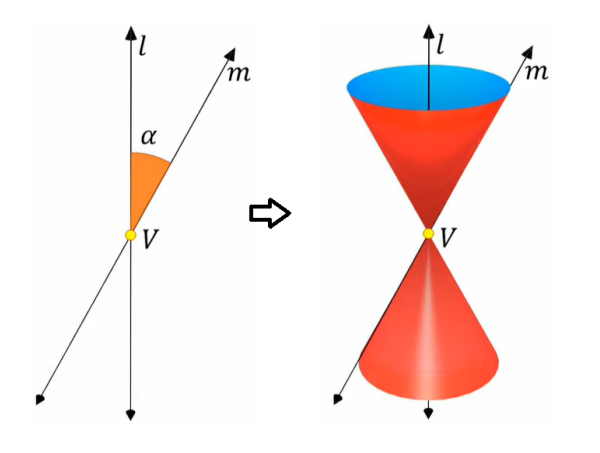{fig-align="center" width=60%}

###### **1.1.2 Конические сечения**
**Коническое сечение (conic section)** — кривая, полученная пересечением плоскости с двуполостным конусом. Тип кривой (окружность, эллипс, парабола, гипербола) зависит от угла плоскости к оси. Вырожденные случаи (**degenerate conics**) — точка, прямая, пара прямых.

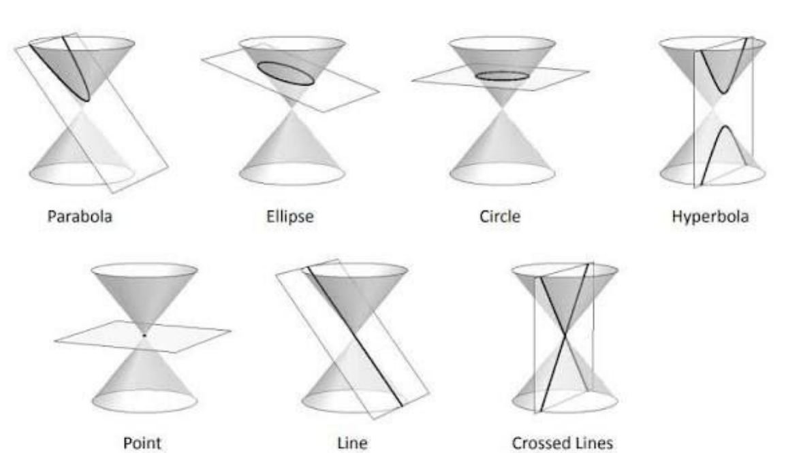{fig-align="center" width=60%}

##### **1.2 Окружность**

###### **1.2.1 Определение и уравнения**
**Окружность (circle)** — множество точек плоскости, равноудалённых от центра $(h,k)$; расстояние — **радиус (radius)** $r$.

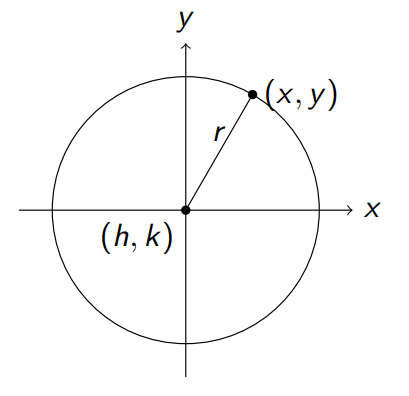{fig-align="center" width=60%}

*   **Стандартный вид (standard equation):** $(x-h)^2+(y-k)^2=r^2$
*   **Общий вид (general form):** $x^2+y^2+Dx+Ey+F=0$, где $D=-2h$, $E=-2k$, $F=h^2+k^2-r^2$.

###### **1.2.2 Примеры**
*   По центру и радиусу: центр $(2,-3)$, $r=5$ ⇒ $(x-2)^2+(y+3)^2=25$; в общем виде $x^2+y^2-4x+6y-12=0$.
*   Из общего вида — **выделение полных квадратов (completing the square)**.
*   По трём точкам — подстановка в общий вид и решение системы для $D,E,F$; **коллинеарные** точки окружность не задают.

##### **1.3 Эллипс**

###### **1.3.1 Определение и уравнение**
**Эллипс (ellipse)** — сумма расстояний до двух **фокусов (foci)** постоянна.

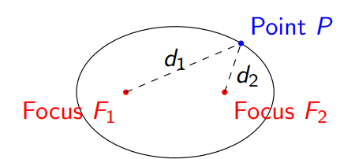{fig-align="center" width=60%}

*   **Стандартный вид** при центре $(h,k)$:
    *   **Горизонтальная большая ось (horizontal major axis):** $\frac{(x-h)^2}{a^2}+\frac{(y-k)^2}{b^2}=1$
    *   **Вертикальная большая ось (vertical major axis):** $\frac{(x-h)^2}{b^2}+\frac{(y-k)^2}{a^2}=1$
*   $a$ — **semi-major axis**, $b$ — **semi-minor axis**, $a>b>0$; больший знаменатель — у $a^2$.
*   $c$ — расстояние от центра до фокуса: $c^2=a^2-b^2$.

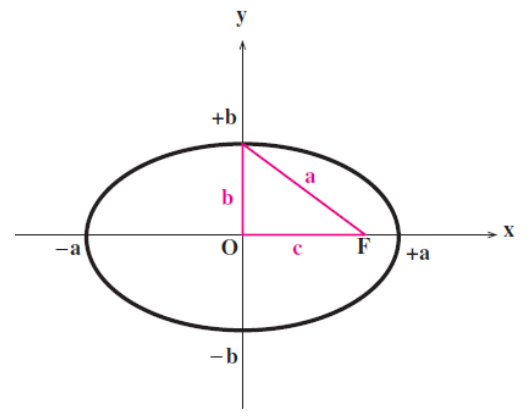{fig-align="center" width=60%}

###### **1.3.2 Ориентация**
Ориентация задаётся знаменателем у $(x-h)^2$ и $(y-k)^2$.

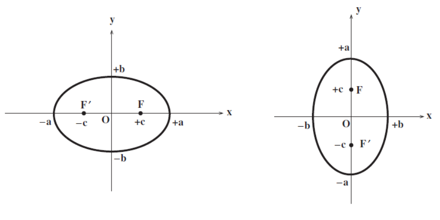{fig-align="center" width=60%}

*   **Правило:** больший знаменатель задаёт направление **большой оси (major axis)**.

###### **1.3.3 Эксцентриситет**
**Эксцентриситет (eccentricity)** $e=\frac{c}{a}$, $0\le e<1$; $e=0$ — окружность; при $e\to 1$ эллипс вытянут.

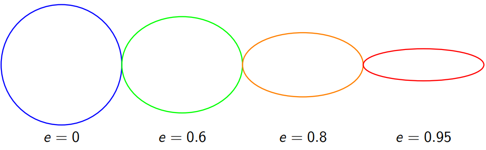{fig-align="center" width=60%}

##### **1.4 Парабола**

###### **1.4.1 Определение и уравнение**
**Парабола (parabola)** — равные расстояния до **фокуса (focus)** и **директрисы (directrix)**; **вершина (vertex)** — середина между фокусом и директрисой.

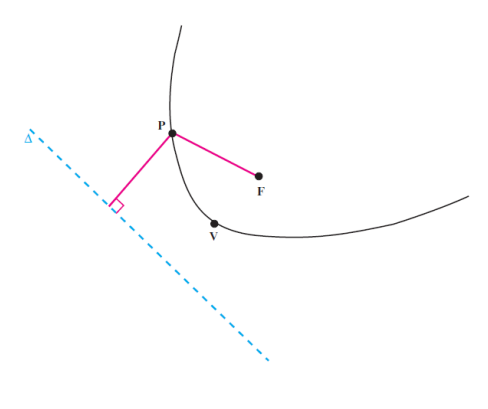{fig-align="center" width=60%}

*   **Вертикальная ось симметрии:** $(x-h)^2=4a(y-k)$; вверх при $a>0$, вниз при $a<0$; фокус $(h,k+a)$, директриса $y=k-a$.
*   **Горизонтальная ось:** $(y-k)^2=4a(x-h)$; вправо/влево по знаку $a$; фокус $(h+a,k)$, директриса $x=h-a$.

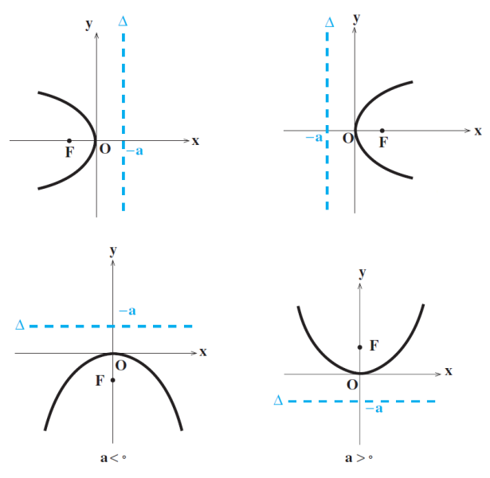{fig-align="center" width=60%}

*   $|a|$ — расстояние от вершины до фокуса.

###### **1.4.2 Переход между формами**
Раскрытие квадрата и перенос — в общий вид; обратно — выделение полного квадрата.

##### **1.5 Гипербола**

###### **1.5.1 Определение и уравнение**
**Гипербола (hyperbola)** — модуль разности расстояний до фокусов постоянен; две **ветви (branches)**; **действительная ось (transverse axis)** через вершины.

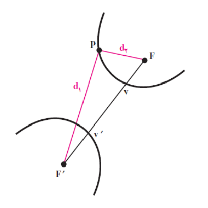{fig-align="center" width=60%}

*   **Горизонтальная действительная ось:** $\frac{(x-h)^2}{a^2}-\frac{(y-k)^2}{b^2}=1$
*   **Вертикальная действительная ось:** $\frac{(y-k)^2}{a^2}-\frac{(x-h)^2}{b^2}=1$
*   $a$ — до вершины, $c^2=a^2+b^2$, положительный знак всегда у «$+a^2$» в стандартной записи.

###### **1.5.2 Асимптоты**
**Асимптоты (asymptotes)** и «опорный» прямоугольник для эскиза.

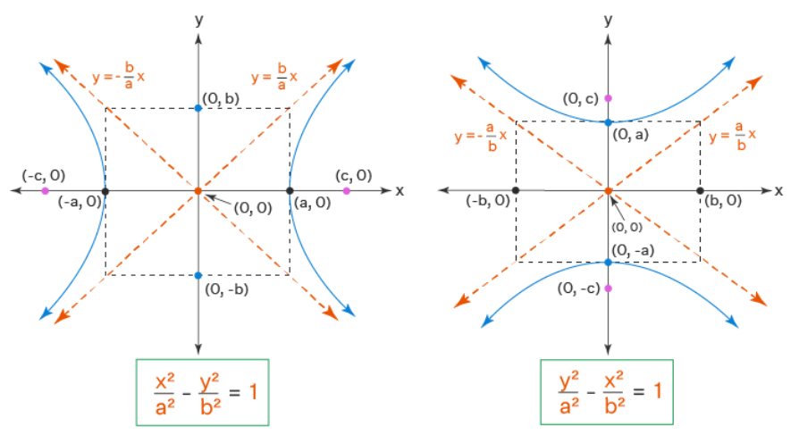{fig-align="center" width=60%}

*   Горизонтальная гипербола: $y-k=\pm\frac{b}{a}(x-h)$
*   Вертикальная: $y-k=\pm\frac{a}{b}(x-h)$

###### **1.5.3 Эксцентриситет**
$e=\frac{c}{a}>1$; при $e\to 1$ ветви узкие; при росте $e$ — «шире».

##### **1.6 Общее уравнение второго порядка и поворот осей**

###### **1.6.1 Общий вид**
$$Ax^2+Bxy+Cy^2+Dx+Ey+F=0$$
Член $Bxy$ означает **поворот (rotation)** коники относительно осей $x,y$.

###### **1.6.2 Дискриминант**
$\Delta=B^2-4AC$: $\Delta<0$ — **эллипс** (или окружность при $A=C,B=0$); $\Delta=0$ — **парабола**; $\Delta>0$ — **гипербола**.

###### **1.6.3 Поворот осей**
Угол $\theta$, убирающий $Bxy$:
$$\cot(2\theta)=\frac{A-C}{B}\quad\text{или}\quad\tan(2\theta)=\frac{B}{A-C}$$
Подстановка
$$x=x'\cos\theta-y'\sin\theta,\quad y=x'\sin\theta+y'\cos\theta$$
приводит к простому виду в $(x',y')$.

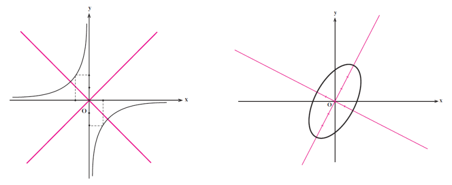{fig-align="center" width=60%}

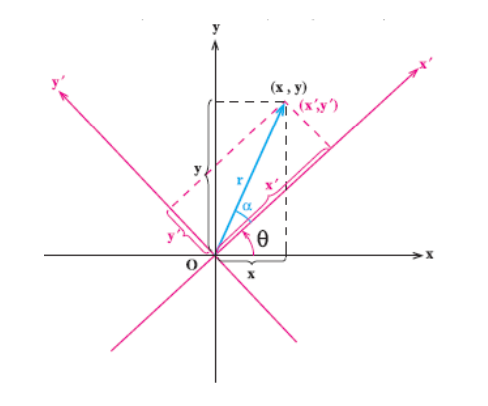{fig-align="center" width=60%}

##### **1.7 Параллельный перенос координат**
**Параллельный перенос (translation)** сдвигает начало в $O'=(\alpha,\beta)$:
$$x=x'+\alpha,\quad y=y'+\beta$$
Это переносит центр/вершину коники в начало новой системы.

<!-- DIAGRAM HERE -->

***

#### **2. Определения**

*   **Cone / конус**: от плоского основания к вершине.
*   **Conic section / коническое сечение**: пересечение плоскости с двуполостным конусом.
*   **Circle / окружность**: равные расстояния до центра.
*   **Ellipse / эллипс**: постоянная сумма расстояний до двух фокусов.
*   **Parabola / парабола**: равные расстояния до фокуса и директрисы.
*   **Hyperbola / гипербола**: постоянный модуль разности расстояний до фокусов.
*   **Focus / фокус (foci)**: опорные точки.
*   **Directrix / директриса**: опорная прямая для параболы.
*   **Vertex / вершина**: пересечение коники с осью симметрии (в зависимости от типа).
*   **Center / центр**: для окружности, эллипса, гиперболы.
*   **Radius / радиус**.
*   **Major/Minor axis / большая и малая ось** эллипса.
*   **Transverse axis / действительная ось** гиперболы.
*   **Asymptote / асимптота**.
*   **Eccentricity $e$ / эксцентриситет**.
*   **Discriminant / дискриминант** $\Delta=B^2-4AC$.

***

#### **3. Формулы**

*   **Окружность (стандарт):** $(x-h)^2+(y-k)^2=r^2$
*   **Эллипс (гориз. большая ось):** $\frac{(x-h)^2}{a^2}+\frac{(y-k)^2}{b^2}=1$
*   **Эллипс (верт. большая ось):** $\frac{(x-h)^2}{b^2}+\frac{(y-k)^2}{a^2}=1$
*   **Связь фокусов эллипса:** $c^2=a^2-b^2$
*   **Парабола (вертикальная ось):** $(x-h)^2=4a(y-k)$
*   **Парабола (горизонтальная ось):** $(y-k)^2=4a(x-h)$
*   **Гипербола (гориз. действ. ось):** $\frac{(x-h)^2}{a^2}-\frac{(y-k)^2}{b^2}=1$
*   **Гипербола (верт. действ. ось):** $\frac{(y-k)^2}{a^2}-\frac{(x-h)^2}{b^2}=1$
*   **Связь фокусов гиперболы:** $c^2=a^2+b^2$
*   **Асимптоты (гориз.):** $y-k=\pm\frac{b}{a}(x-h)$
*   **Асимптоты (верт.):** $y-k=\pm\frac{a}{b}(x-h)$
*   **Эксцентриситет (эллипс и гипербола):** $e=\frac{c}{a}$
*   **Директрисы эллипса (гориз.):** $x=h\pm\frac{a}{e}$
*   **Директрисы гиперболы (гориз.):** $x=h\pm\frac{a^2}{c}$
*   **Latus rectum / фокальная хорда:** $l=\frac{2b^2}{a}$
*   **Общее уравнение 2-го порядка:** $Ax^2+Bxy+Cy^2+Dx+Ey+F=0$
*   **Дискриминант:** $\Delta=B^2-4AC$
*   **Угол поворота:** $\cot(2\theta)=\frac{A-C}{B}$
*   **Поворот координат:** $x=x'\cos\theta-y'\sin\theta$, $y=x'\sin\theta+y'\cos\theta$
*   **Перенос:** $x=x'+\alpha$, $y=y'+\beta$
*   **Расстояние от точки до прямой:** $d=\frac{|Ax_0+By_0+C|}{\sqrt{A^2+B^2}}$

***

#### **4. Примеры**

##### **4.1. Каноническое уравнение эллипса и директрисы** (Лаба 7, Задание 1)
Найдите каноническое уравнение эллипса и уравнения его директрис, если фокусы $(4,0)$ и $(-4,0)$, а эксцентриситет $e=\frac13$.

Нажмите, чтобы увидеть решение

1.  **Геометрия:** фокусы на оси $x$ ⇒ горизонтальный эллипс с центром в $(0,0)$; $c=4$.
2.  **Найти $a$:** $e=\frac{c}{a}$ ⇒ $\frac13=\frac4a$ ⇒ $a=12$.
3.  **Найти $b^2$:** $b^2=a^2-c^2=144-16=128$.
4.  **Канон:** $\frac{x^2}{144}+\frac{y^2}{128}=1$.
5.  **Директрисы:** $x=\pm\frac{a}{e}=\pm36$.

**Ответ:** $\frac{x^2}{144}+\frac{y^2}{128}=1$; директрисы $x=\pm36$.

##### **4.2. Параметры эллипса** (Лаба 7, Задание 2)
Найдите эксцентриситет, фокусы и длину **latus rectum** для $9x^2+4y^2=36$ (напоминание: $l=\frac{2b^2}{a}$).

Нажмите, чтобы увидеть решение

1.  Делим на $36$: $\frac{x^2}{4}+\frac{y^2}{9}=1$.
2.  Больший знаменатель под $y^2$ ⇒ вертикальный эллипс: $a^2=9$, $b^2=4$.
3.  $c^2=a^2-b^2=5$, $c=\sqrt5$.
4.  Фокусы $(0,\pm\sqrt5)$, $e=\frac{\sqrt5}{3}$, $l=\frac{2\cdot4}{3}=\frac83$.

**Ответ:** $e=\frac{\sqrt5}{3}$; фокусы $(0,\pm\sqrt5)$; $l=\frac83$.

##### **4.3. Эллипс по фокусам и директрисам** (Лаба 7, Задание 3)
Фокусы на оси $y$, расстояние между фокусами $6$, между директрисами $16\frac23$, симметрия относительно начала координат.

Нажмите, чтобы увидеть решение

$2c=6\Rightarrow c=3$; для вертикального эллипса расстояние между директрисами $2\frac{a}{e}=\frac{50}{3}$; $e=\frac{3}{a}$. Подстановка даёт $a=5$, $b^2=16$.

**Ответ:** $\frac{x^2}{16}+\frac{y^2}{25}=1$.

##### **4.4. Параметры парабол** (Лаба 7, Задание 4)
Найдите фокус, длину latus rectum, вершину и директрису:

a) $y^2+4x-2y+3=0$  
b) $x^2=4y$

Нажмите, чтобы увидеть решение

**(a)** $(y-1)^2=-4(x+\frac12)$ ⇒ горизонтальная парабола влево; вершина $(-\frac12,1)$, $4p=-4\Rightarrow p=-1$; фокус $(-\frac32,1)$, директриса $x=\frac12$, $|4p|=4$.

**(b)** $x^2=4py$ с $p=1$: вершина $(0,0)$, фокус $(0,1)$, директриса $y=-1$, latus rectum $4$.

**Ответ:** как выше.

##### **4.5. Канон параболы по расстоянию «фокус–вершина»** (Лаба 7, Задание 5)
Каноническое уравнение параболы, если расстояние от фокуса до вершины равно $3$.

Нажмите, чтобы увидеть решение

В каноне вершина в $(0,0)$; возможны четыре ориентации: $y^2=12x$, $y^2=-12x$, $x^2=12y$, $x^2=-12y$.

**Ответ:** четыре варианта выше.

##### **4.6. Парабола по фокусу и директрисе** (Лаба 7, Задание 6)
Директриса $x=8$, фокус $F(7,0)$. Найдите стандартное уравнение.

Нажмите, чтобы увидеть решение

Горизонтальная парабола, открывается влево; вершина — середина между фокусом и директрисой: $h=\frac{15}{2}$, $k=0$, $p=-\frac12$.

**Ответ:** $y^2=-2\left(x-\frac{15}{2}\right)$.

##### **4.7. Параметры гиперболы** (Лаба 7, Задание 7)
Для $\frac{x^2}{64}-\frac{y^2}{225}=1$ найдите фокусы, асимптоты и директрисы.

Нажмите, чтобы увидеть решение

$a=8$, $b=15$, $c=17$; фокусы $(\pm17,0)$; $y=\pm\frac{15}{8}x$; директрисы $x=\pm\frac{64}{17}$.

**Ответ:** как выше.

##### **4.8. Гипербола с теми же фокусами, что у эллипса** (Лаба 7, Задание 8)
Эллипс $\frac{x^2}{49}+\frac{y^2}{24}=1$, у гиперболы $e=\frac54$.

Нажмите, чтобы увидеть решение

У эллипса $c=5$; у гиперболы $c=5$, $e=\frac54\Rightarrow a=4$, $b^2=9$.

**Ответ:** $\frac{x^2}{16}-\frac{y^2}{9}=1$.

##### **4.9. Гипербола по асимптотам и расстоянию между фокусами** (Лаба 7, Задание 9)
Асимптоты $y=\pm\frac43 x$, расстояние между фокусами $20$.

Нажмите, чтобы увидеть решение

$2c=20\Rightarrow c=10$; горизонтальный случай $b/a=4/3$ и $a^2+b^2=100$ даёт $a=6$, $b=8$.

**Ответ:** $\frac{x^2}{36}-\frac{y^2}{64}=1$.

##### **4.10. Центр и радиус окружности** (Лекция 7, Пример 1)
$x^2+y^2-6x+8y-11=0$.

Нажмите, чтобы увидеть решение

$(x-3)^2+(y+4)^2=36$.

**Ответ:** центр $(3,-4)$, $r=6$.

##### **4.11. Уравнение окружности по центру и радиусу** (Лекция 7, Пример 2)
Центр $(2,-3)$, $r=5$.

Нажмите, чтобы увидеть решение

**Ответ:** $(x-2)^2+(y+3)^2=25$; общий вид $x^2+y^2-4x+6y-12=0$.

##### **4.12. Эллипс по фокусам и вершинам** (Лекция 7, Пример 3)
Фокусы $(\pm3,0)$, вершины $(\pm5,0)$.

Нажмите, чтобы увидеть решение

$a=5$, $c=3$, $b^2=16$.

**Ответ:** $\frac{x^2}{25}+\frac{y^2}{16}=1$.

##### **4.13. Эллипс: элементы** (Лекция 7, Пример 4)
$\frac{(x-2)^2}{9}+\frac{(y+1)^2}{4}=1$.

Нажмите, чтобы увидеть решение

Центр $(2,-1)$, большая ось горизонтальна, $a=3$, $b=2$; вершины $(-1,-1)$, $(5,-1)$; сопряжённые вершины $(2,1)$, $(2,-3)$.

**Ответ:** как выше.

##### **4.14. Горизонтальный эллипс** (Лекция 7, Пример 5)
$\frac{x^2}{16}+\frac{y^2}{9}=1$.

Нажмите, чтобы увидеть решение

$a=4$, $b=3$, $c=\sqrt7$; фокусы $(\pm\sqrt7,0)$.

**Ответ:** горизонтальная большая ось; фокусы $(\pm\sqrt7,0)$.

##### **4.15. Вертикальный эллипс** (Лекция 7, Пример 6)
$\frac{x^2}{25}+\frac{y^2}{36}=1$.

Нажмите, чтобы увидеть решение

$a=6$, $b=5$, $c=\sqrt{11}$; фокусы $(0,\pm\sqrt{11})$.

**Ответ:** вертикальная большая ось; фокусы $(0,\pm\sqrt{11})$.

##### **4.16. Парабола $y^2=12x$** (Лекция 7, Пример 7)

Нажмите, чтобы увидеть решение

$4p=12\Rightarrow p=3$; вершина $(0,0)$, фокус $(3,0)$, директриса $x=-3$.

**Ответ:** как выше.

##### **4.17. Парабола по вершине и фокусу** (Лекция 7, Пример 8)
Вершина $(1,2)$, фокус $(1,4)$.

Нажмите, чтобы увидеть решение

Вертикальная ось, $p=2$.

**Ответ:** $(x-1)^2=8(y-2)$.

##### **4.18. Парабола $(x-2)^2=8(y-1)$** (Лекция 7, Пример 9)

Нажмите, чтобы увидеть решение

Вверх; вершина $(2,1)$; $p=2$; фокус $(2,3)$; директриса $y=-1$.

**Ответ:** как выше.

##### **4.19. Парабола $(y+1)^2=-12(x-3)$** (Лекция 7, Пример 10)

Нажмите, чтобы увидеть решение

Влево; вершина $(3,-1)$; $p=-3$; фокус $(0,-1)$; директриса $x=6$.

**Ответ:** как выше.

##### **4.20. Стандартный → общий вид** (Лекция 7, Пример 11)
$(x-2)^2=8(y-1)$.

Нажмите, чтобы увидеть решение

**Ответ:** $x^2-4x-8y+12=0$.

##### **4.21. Общий → стандартный вид** (Лекция 7, Пример 12)
$y^2+4y+8x-4=0$.

Нажмите, чтобы увидеть решение

**Ответ:** $(y+2)^2=-8(x-1)$.

##### **4.22. Три параболы: тип и фокус** (Лекция 7, Пример 13)
Для каждой параболы определите, вертикальная она или горизонтальная, куда открывается «чаша», и найдите вершину и фокус.

1.  $(x + 1)^2 = 16(y - 2)$
2.  $(y - 3)^2 = -4(x + 2)$
3.  $x^2 - 6x + 4y + 5 = 0$

Нажмите, чтобы увидеть решение

1. Вертикальная, вверх ($4p>0$); вершина $(-1,2)$, $p=4$, фокус $(-1,6)$.  
2. Горизонтальная, влево; вершина $(-2,3)$, $p=-1$, фокус $(-3,3)$.  
3. $(x-3)^2=-4(y-1)$: вертикальная вниз; вершина $(3,1)$, $p=-1$, фокус $(3,0)$.

**Ответ:** как в пунктах выше.

##### **4.23. Горизонтальная гипербола (сдвиг)** (Лекция 7, Пример 14)
$\frac{(x-1)^2}{9}-\frac{(y+2)^2}{16}=1$.

Нажмите, чтобы увидеть решение

Центр $(1,-2)$, $a=3$, $b=4$, $c=5$; вершины $(-2,-2)$, $(4,-2)$; фокусы $(-4,-2)$, $(6,-2)$.

**Ответ:** как выше.

##### **4.24. Вертикальная гипербола (сдвиг)** (Лекция 7, Пример 15)
$\frac{(y-3)^2}{25}-\frac{(x+1)^2}{9}=1$.

Нажмите, чтобы увидеть решение

Центр $(-1,3)$, $a=5$, $b=3$, $c=\sqrt{34}$; вершины $(-1,-2)$, $(-1,8)$; фокусы $(-1,3\pm\sqrt{34})$.

**Ответ:** как выше.

##### **4.25. Асимптоты гиперболы** (Лекция 7, Пример 16)
Для $\frac{(x-1)^2}{9}-\frac{(y+2)^2}{16}=1$.

Нажмите, чтобы увидеть решение

**Ответ:** $y+2=\pm\frac43(x-1)$.

##### **4.26. Три гиперболы: ориентация и элементы** (Лекция 7, Пример 17)
Для каждой гиперболы укажите ориентацию и найдите центр, вершины и фокусы.

1.  $\frac{(x+2)^2}{16}-\frac{(y-1)^2}{9}=1$
2.  $\frac{(y-3)^2}{25}-\frac{x^2}{4}=1$
3.  $9x^2-16y^2-36x-32y-124=0$

Нажмите, чтобы увидеть решение

1. Горизонтальная; центр $(-2,1)$, $a=4$, $b=3$, $c=5$; вершины $(-6,1)$, $(2,1)$; фокусы $(-7,1)$, $(3,1)$.  
2. Вертикальная; центр $(0,3)$, $a=5$, $b=2$, $c=\sqrt{29}$; вершины $(0,-2)$, $(0,8)$; фокусы $(0,3\pm\sqrt{29})$.  
3. К стандарту: $\frac{(x-2)^2}{16}-\frac{(y+1)^2}{9}=1$; горизонтальная; центр $(2,-1)$, вершины $(-2,-1)$, $(6,-1)$, фокусы $(-3,-1)$, $(7,-1)$.

**Ответ:** как в пунктах выше.

##### **4.27. Классификация по дискриминанту** (Лекция 7, Пример 18)
$3x^2-2xy+3y^2-6x+4y-1=0$.

Нажмите, чтобы увидеть решение

$A=3,B=-2,C=3$, $\Delta=-32<0$.

**Ответ:** эллипс.

##### **4.28. Убрать $xy$ поворотом** (Лекция 7, Пример 19)
$x^2+4xy+y^2-3=0$.

Нажмите, чтобы увидеть решение

$\theta=45^\circ$; после подстановки: $3(x')^2-(y')^2=3$.

**Ответ:** гипербола в системе $(x',y')$.

##### **4.29. Окружность по трём точкам** (Туториал 7, Задание 1)
а) $(1,2),(2,4),(-1,1)$; б) $(1,2),(3,4),(5,6)$.

Нажмите, чтобы увидеть решение

а) $x^2+y^2+3x-9y+10=0$; б) точки коллинеарны — окружности нет.

**Ответ:** как выше.

##### **4.30. Геометрическое место: отношение расстояний** (Туториал 7, Задание 2)
$PA=2PB$ для $A(7,1)$, $B(1,4)$.

Нажмите, чтобы увидеть решение

**Ответ:** $x^2+y^2+2x-10y+6=0$.

##### **4.31. Окружность, касательная к прямой** (Туториал 7, Задание 3)
Центр $(2,-2)$, касание $y=x+4$.

Нажмите, чтобы увидеть решение

$r$ — расстояние от центра до прямой: $r=4\sqrt2$.

**Ответ:** $(x-2)^2+(y+2)^2=32$.

##### **4.32. Взаимное расположение двух окружностей** (Туториал 7, Задание 4)
Окружности  
$C_1: x^2 + y^2 - 4x - 6y + 9 = 0$,  
$C_2: x^2 + y^2 - 12x - 14y + 76 = 0$.  
Укажите взаимное расположение (пересекаются, касаются, разобщены и т.д.) и кратко опишите общий критерий.

Нажмите, чтобы увидеть решение

$C_1$: $(x-2)^2+(y-3)^2=4$, центр $(2,3)$, $r_1=2$.  
$C_2$: $(x-6)^2+(y-7)^2=9$, центр $(6,7)$, $r_2=3$.  
Расстояние между центрами $d=\sqrt{32}\approx5{,}66>r_1+r_2=5$ ⇒ окружности **разобщены** (лежат вне друг друга и не пересекаются).

**Ответ:** разобщены; в общем случае сравнивают $d$ с $r_1+r_2$ и с $|r_1-r_2|$.

##### **4.33. Тип коники поворотом осей** (Туториал 7, Задание 5)
Определите тип коники и угол поворота осей, убирающий смешанный член $xy$:

1.  $x^2 - 4xy + y^2 - 12 = 0$
2.  $x^2 + 2\sqrt{3}\,xy + 3y^2 + 8\sqrt{3}\,x - 8y = 0$

Нажмите, чтобы увидеть решение

1. $\Delta>0$ ⇒ **гипербола**; $\tan2\theta=\frac{B}{A-C}$ неопределённость при $A=C$ даёт $2\theta=90^\circ$, $\theta=45^\circ$.  
2. $\Delta=0$ ⇒ **парабола**; $\theta=60^\circ$.

**Ответ:** (1) гипербола, $\theta=45^\circ$; (2) парабола, $\theta=60^\circ$.

##### **4.34. Внутри/снаружи окружности** (Туториал 7, Задание 6)
$x^2+y^2-2x+4y-4=0$, точка $A(2,1)$.

Нажмите, чтобы увидеть решение

Подстановка в левую часть в общем виде даёт $>0$ ⇒ снаружи.

**Ответ:** снаружи; быстрый способ — знак выражения $f(x,y)$.

##### **4.35. Приведение гиперболы к стандарту** (Туториал 7, Задание 7)
$-9x^2+16y^2-72x-96y-144=0$.

Нажмите, чтобы увидеть решение

**Ответ:** $\frac{(y-3)^2}{9}-\frac{(x+4)^2}{16}=1$.

##### **4.36. Поворот на $\pi/6$** (Туториал 7, Задание 8)
$2x^2+\sqrt3\,xy+y^2-10=0$.

Нажмите, чтобы увидеть решение

**Ответ:** $\frac{(x')^2}{4}+\frac{(y')^2}{20}=1$ — эллипс.

##### **4.37. Мин/макс расстояние до окружности** (Туториал 7, Задание 9)
Точка $A(1,0)$, окружность $x^2+y^2-2y-7=0$.

Нажмите, чтобы увидеть решение

Центр $(0,1)$, $r=2\sqrt2$, $d(A,C)=\sqrt2$ (точка внутри).

**Ответ:** $\min=\sqrt2$, $\max=3\sqrt2$.

