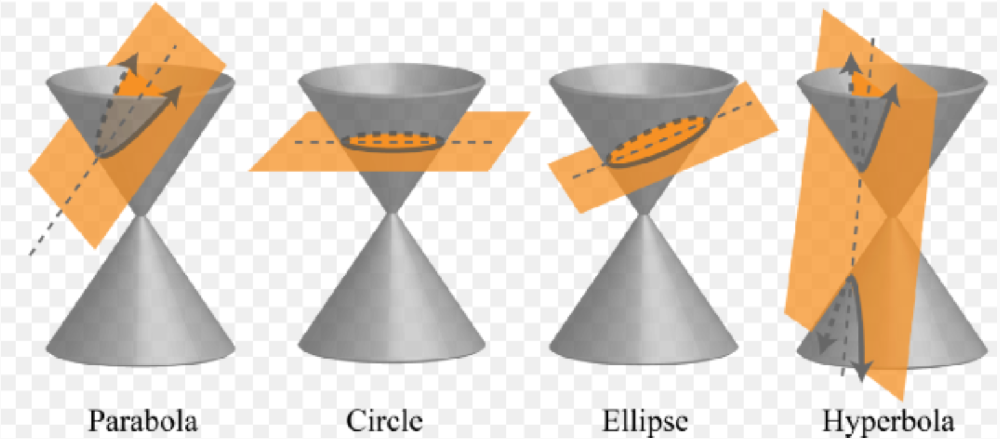
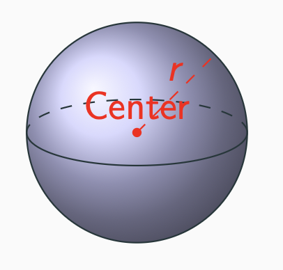
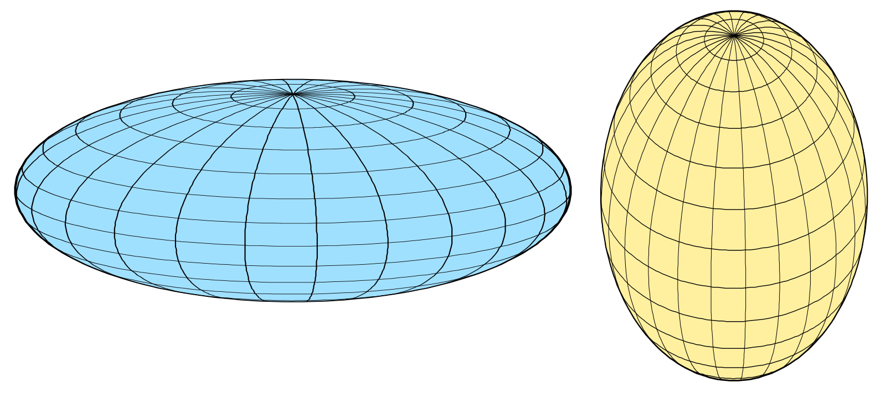
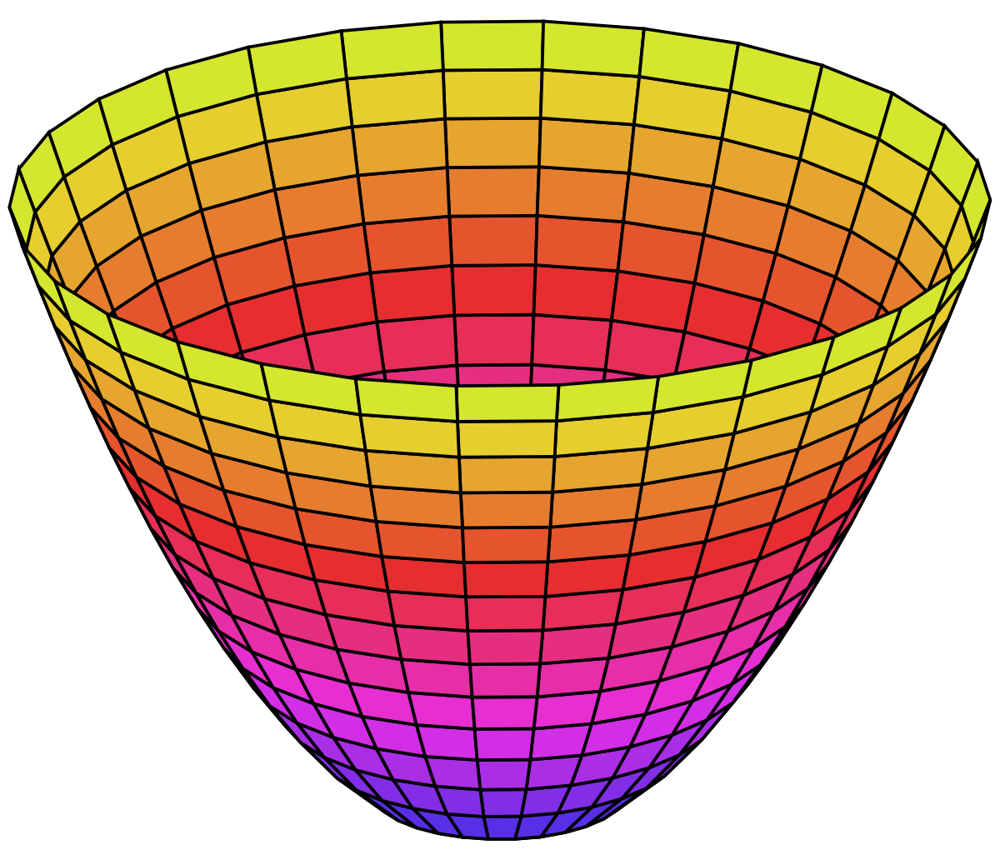
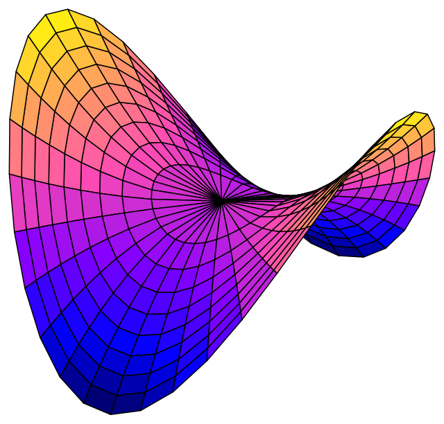
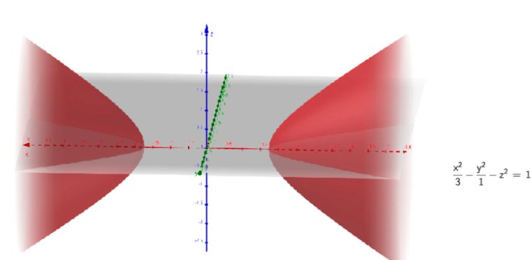
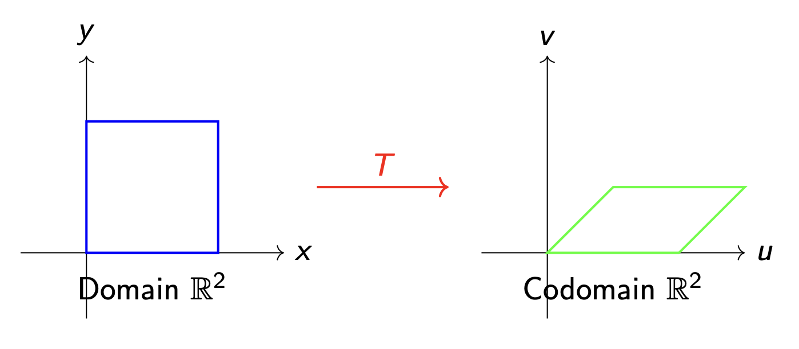

#### **1. Кратко**
##### **1.1 Поверхности второго порядка в 3D (quadrics / квадрики)**
**Квадрики (quadric surfaces)** — трёхмерный аналог **конических сечений (conic sections)**. Как окружность, эллипс, парабола и гипербола задаются многочленом второй степени на плоскости, так и квадрики задаются многочленом второй степени по переменным $x$, $y$ и $z$.

###### **1.1.1 От коник 2D к поверхностям 3D**
Переход от кривых на плоскости к поверхностям в пространстве естественно делают так: кривую **вращают (rotate)** вокруг одной из осей симметрии.

{fig-align="center" width=60%}

Соответствие между кониками 2D и их 3D-расширениями:

*   **Circle → Sphere (окружность → сфера)**: окружность, вращаемая вокруг любого диаметра, даёт сферу
*   **Ellipse → Ellipsoid (эллипс → эллипсоид)**: эллипс, вращаемый вокруг одной из осей, даёт эллипсоид
*   **Parabola → Paraboloid (парабола → параболоид)**: парабола, вращаемая вокруг своей оси симметрии, даёт параболоид
*   **Hyperbola → Hyperboloid (гипербола → гиперболоид)**: гипербола, вращаемая вокруг своей оси, даёт гиперболоид

###### **1.1.2 Типы квадрик**
**Сфера (sphere)**

{fig-align="center" width=60%}

**Сфера** — множество точек пространства, равноудалённых от фиксированной точки — **центра (center)**.

*   **Стандартное уравнение (standard equation)**: $x^2 + y^2 + z^2 = r^2$ (центр в начале координат, радиус $r$)
*   **Общий вид с центром**: $(x - a)^2 + (y - b)^2 + (z - c)^2 = r^2$ (центр $(a, b, c)$)
*   **Развёрнутая форма**: $x^2 + y^2 + z^2 + Dx + Ey + Fz + G = 0$

**Эллипсоид (ellipsoid)**

{fig-align="center" width=60%}

**Эллипсоид** — «растянутая» сфера: масштабы по осям могут отличаться.

*   **Стандартное уравнение**: $\frac{x^2}{a^2} + \frac{y^2}{b^2} + \frac{z^2}{c^2} = 1$
*   Если $a = b = c$, эллипсоид вырождается в сферу
*   Параметры $a$, $b$, $c$ — **полуоси (semi-axes)** вдоль $x$, $y$ и $z$

**Эллиптический параболоид (elliptic paraboloid)**

{fig-align="center" width=60%}

**Эллиптический параболоид** — «чашеобразная» поверхность (тарелки спутниковых антенн, отражатели фар).

*   **Стандартное уравнение**: $z = \frac{x^2}{a^2} + \frac{y^2}{b^2}$
*   Сечения плоскостями, параллельными $xy$, — эллипсы
*   Сечения плоскостями, параллельными $xz$ или $yz$, — параболы
*   Вершина в начале координат; при отрицательном $z$ «чаша» может быть направлена вниз

**Гиперболический параболоид (hyperbolic paraboloid)**

{fig-align="center" width=60%}

**Гиперболический параболоид** — седлообразная поверхность.

*   **Стандартное уравнение**: $z = \frac{x^2}{a^2} - \frac{y^2}{b^2}$
*   Сечения, параллельные $xy$, — гиперболы
*   Сечения, параллельные $xz$, — параболы «вверх»
*   Сечения, параллельные $yz$, — параболы «вниз»

**Однополостный гиперболоид (hyperboloid of one sheet)**

{fig-align="center" width=60%}

**Однополостный гиперболоид** напоминает песочные часы или градирню — одна связная поверхность.

*   **Стандартное уравнение**: $\frac{x^2}{a^2} + \frac{y^2}{b^2} - \frac{z^2}{c^2} = 1$
*   Сечения, параллельные $xy$, — эллипсы
*   Поверхность связна и уходит на бесконечность

**Двуполостный гиперболоид (hyperboloid of two sheets)**

{fig-align="center" width=60%}

**Двуполостный гиперболоид** состоит из двух отдельных «чаш», развернутых друг от друга.

*   **Стандартное уравнение**: $\frac{x^2}{a^2} + \frac{y^2}{b^2} - \frac{z^2}{c^2} = -1$
*   Эквивалентно: $\frac{z^2}{c^2} - \frac{x^2}{a^2} - \frac{y^2}{b^2} = 1$
*   Между листами есть «щель»

**Конус (cone)**

**Конус** — объединение прямых, проходящих через фиксированную **вершину (vertex)** и пересекающих кривую (**директрису / directrix**).

*   **Круговой конус**: $\frac{x^2}{a^2} + \frac{y^2}{a^2} = \frac{z^2}{c^2}$
*   Сечения, параллельные $xy$, — окружности
*   Вершина в начале координат
*   Две полости (**nappes**): верхняя ($z \geq 0$) и нижняя ($z \leq 0$)

###### **1.1.3 Как распознать квадрику**
Чтобы по общему уравнению понять тип поверхности:

1.  при необходимости **выделите полные квадраты (complete the square)** по каждой переменной;
2.  **приведите** уравнение к стандартному виду;
3.  **сравните** со стандартными шаблонами.

Полезные правила:

*   **все квадратичные члены одного знака, справа константа** — эллипсоид (или сфера при равных коэффициентах);
*   **два «$+$», один «$-$», справа «$+$»** — однополостный гиперболоид;
*   **два «$+$», один «$-$», справа «$-$»** — двуполостный гиперболоид;
*   **два квадрата равны линейному члену** — параболоид (эллиптический или гиперболический).

###### **1.1.4 Где встречаются**
*   **Сфера**: планеты, мячи, пузыри
*   **Эллипсоид**: форма Земли (геоид), часть спортивных мячей
*   **Параболоид**: спутниковые тарелки, фары, зеркала телескопов
*   **Гиперболоид**: градирни, архитектура, конструкции реакторных зданий

##### **1.2 Линейные преобразования (linear transformations)**
###### **1.2.1 Определение**
**Линейное преобразование** — отображение между векторными пространствами, которое сохраняет сложение векторов и умножение на скаляр.

{fig-align="center" width=60%}

**Формально**: $T : \mathbb{R}^m \to \mathbb{R}^n$ — **линейное преобразование**, если для всех $\mathbf{u}, \mathbf{v} \in \mathbb{R}^m$ и $c \in \mathbb{R}$:

1.  **Аддитивность (additivity)**: $T(\mathbf{u} + \mathbf{v}) = T(\mathbf{u}) + T(\mathbf{v})$
2.  **Однородность (homogeneity)**: $T(c\mathbf{u}) = cT(\mathbf{u})$

**Эквивалентно**: для всех $\mathbf{u}, \mathbf{v}$ и $a, b \in \mathbb{R}$
$$T(a\mathbf{u} + b\mathbf{v}) = aT(\mathbf{u}) + bT(\mathbf{v})$$
то есть $T$ **сохраняет линейные комбинации**.

###### **1.2.2 Свойства**
Если $T : \mathbb{R}^m \to \mathbb{R}^n$ линейно, то:

*   $T(\mathbf{0}) = \mathbf{0}$ — нуль всегда уходит в нуль
*   $T(c_1\mathbf{v}_1 + \cdots + c_k\mathbf{v}_k) = c_1T(\mathbf{v}_1) + \cdots + c_kT(\mathbf{v}_k)$

**Важно**: если $T(\mathbf{0}) \neq \mathbf{0}$, то $T$ **не** линейно!

###### **1.2.3 Как проверить линейность**
1.  Проверить аддитивность и однородность напрямую **или**
2.  Проверить $T(a\mathbf{u} + b\mathbf{v}) = aT(\mathbf{u}) + bT(\mathbf{v})$ на произвольных векторах и скалярах **или**
3.  **Быстрый тест**: $T(\mathbf{0}) \neq \mathbf{0}$ ⇒ не линейно

**Типичные нелинейности**:

*   сдвиг: $T(\vec{x}) = \vec{x} + \vec{c}$ (**translation**)
*   произведение координат: $T(x, y) = xy$
*   нелинейные функции: $T(x)=x^2$, $T(x)=\sin x$

##### **1.3 Матричное представление**
###### **1.3.1 Стандартная матрица (standard matrix)**
У каждого линейного $T : \mathbb{R}^m \to \mathbb{R}^n$ есть единственная матрица $A$ размера $n \times m$:
$$T(\mathbf{x}) = A\mathbf{x}$$

**Как построить**: столбцы $A$ — образы стандартного базиса $\mathbb{R}^m$:
$$A = \begin{bmatrix} T(\mathbf{e}_1) & T(\mathbf{e}_2) & \cdots & T(\mathbf{e}_m) \end{bmatrix}$$

В $\mathbb{R}^2$: $\mathbf{e}_1 = \begin{pmatrix} 1 \\ 0 \end{pmatrix}$, $\mathbf{e}_2 = \begin{pmatrix} 0 \\ 1 \end{pmatrix}$.

В $\mathbb{R}^3$: $\mathbf{e}_1 = \begin{pmatrix} 1 \\ 0 \\ 0 \end{pmatrix}$, $\mathbf{e}_2 = \begin{pmatrix} 0 \\ 1 \\ 0 \end{pmatrix}$, $\mathbf{e}_3 = \begin{pmatrix} 0 \\ 0 \\ 1 \end{pmatrix}$.

###### **1.3.2 Частые преобразования в $\mathbb{R}^2$**

**Поворот на угол $\theta$ против часовой**:
$$R = \begin{bmatrix} \cos \theta & -\sin \theta \\ \sin \theta & \cos \theta \end{bmatrix}$$

**Масштабирование (scaling)**:
$$S = \begin{bmatrix} s_x & 0 \\ 0 & s_y \end{bmatrix}$$

**Отражение относительно оси $x$**, **оси $y$**, **прямой $y=x$**, **сдвиг (shear)** и **проекция на ось $x$** — те же матрицы, что в английской версии (см. раздел **3. Формулы**).

###### **1.3.3 Проекции**
**Проекция** отображает векторы на подпространство (прямую или плоскость).

**Проекция на плоскость $xy$ в $\mathbb{R}^3$**:
$$A = \begin{bmatrix} 1 & 0 & 0 \\ 0 & 1 & 0 \\ 0 & 0 & 0 \end{bmatrix}, \quad T\begin{pmatrix} x \\ y \\ z \end{pmatrix} = \begin{bmatrix} x \\ y \\ 0 \end{bmatrix}$$

Свойства:

*   **Идемпотентность (idempotent)**: $T(T(\vec{v})) = T(\vec{v})$
*   **Не обратима**: много прообразов
*   **rank**: размерность подпространства, куда проецируем
*   **nullity**: «потерянная» размерность

##### **1.4 Композиция**
Если $T$ имеет матрицу $A$, а $S$ — матрицу $B$, то
$$(S \circ T)(\mathbf{x}) = S(T(\mathbf{x})) = B(A\mathbf{x}) = (BA)\mathbf{x}$$

**Идея**: матрица композиции — **произведение** матриц в **обратном** порядке применения.

**Порядок важен**: обычно $BA \neq AB$.

*   $S \circ T$: сначала $T$, потом $S$ ⇒ матрица $BA$
*   $T \circ S$: сначала $S$, потом $T$ ⇒ матрица $AB$

##### **1.5 Ядро и образ**
###### **1.5.1 Ядро / null space**
$$\ker(T) = \{ \mathbf{v} \in \mathbb{R}^m \mid T(\mathbf{v}) = \mathbf{0} \}$$

*   $\ker(T)$ — подпространство области определения
*   $\dim\ker(T)$ — **nullity**

###### **1.5.2 Образ / range**
$$\text{im}(T) = \{ T(\mathbf{v}) \mid \mathbf{v} \in \mathbb{R}^m \}$$

*   $\text{im}(T)$ — подпространство в $\mathbb{R}^n$
*   $\dim\text{im}(T)$ — **rank**
*   $\text{im}(T)$ совпадает с **column space** матрицы $A$

###### **1.5.3 Теорема о ранге и дефекте**
$$\dim(\ker(T)) + \dim(\text{im}(T)) = \dim(\text{Domain})$$
$$\text{nullity}(T) + \text{rank}(T) = m$$

**Смысл**: размерность области «делится» на то, что «схлопывается» в нуль, и то, что видно на выходе.

**Следствия**:

*   если $\text{nullity}(T) > 0$, то $T(\mathbf{x})=\mathbf{b}$ имеет **0** или **бесконечно много** решений;
*   **инъекция (injective)** ⇔ $\text{nullity}(T)=0$;
*   **сюръекция на $\mathbb{R}^n$** ⇔ $\text{rank}(T)=n$.

##### **1.6 Обратимость**
$T : \mathbb{R}^n \to \mathbb{R}^n$ **обратимо**, если существует $T^{-1}$:
$$T^{-1}(T(\mathbf{x})) = \mathbf{x}, \quad T(T^{-1}(\mathbf{y})) = \mathbf{y}$$

Условия: квадратная матрица и $\det(A) \neq 0$ (биекция).

Для $2\times 2$: формула для $A^{-1}$ как в разделе **3. Формулы**.

##### **1.7 Приложения**
###### **1.7.1 Компьютерная графика**
Повороты, масштабы, **3D→2D projection**, преобразования изображений; несколько шагов — произведение матриц в обратном порядке применения.

###### **1.7.2 Данные и ML**
**PCA**, линейные замены признаков, нормализация.

###### **1.7.3 Физика и инженерия**
Переходы между СК, связи напряжение–деформация, анализ цепей.

***

#### **2. Определения**
*   **Квадрика (quadric surface)**: поверхность, задаваемая многочленом второй степени по $x,y,z$.
*   **Сфера (sphere)**: равные расстояния до центра.
*   **Эллипсоид (ellipsoid)**: сечения — эллипсы/окружности; «растянутая» сфера.
*   **Эллиптический параболоид (elliptic paraboloid)**: чаша; эллиптические сечения у основания.
*   **Гиперболический параболоид (hyperbolic paraboloid)**: седло; гиперболические сечения.
*   **Однополостный гиперболоид (hyperboloid of one sheet)**: одна связная компонента.
*   **Двуполостный гиперболоид (hyperboloid of two sheets)**: две отдельные компоненты.
*   **Конус (cone)**: прямые через вершину к директрисе.
*   **Линейное преобразование (linear transformation)**: сохраняет $+$ векторов и умножение на скаляр.
*   **Стандартная матрица (standard matrix)**: $A$ с $T(\mathbf{x})=A\mathbf{x}$.
*   **Стандартный базис (standard basis vectors)**: $\mathbf{e}_i$ с единицей на $i$-м месте.
*   **Ядро / kernel (null space)**: $\ker(T)=\{\mathbf{v}:T(\mathbf{v})=\mathbf{0}\}$.
*   **Образ / image (range)**: $\text{im}(T)=\{T(\mathbf{v})\}$.
*   **Nullity / rank**: размерности $\ker(T)$ и $\text{im}(T)$.
*   **Композиция (composition)**: $(S\circ T)(\mathbf{x})=S(T(\mathbf{x}))$.
*   **Обратимое преобразование (invertible transformation)**: $\det(A)\neq 0$.
*   **Проекция (projection)**: идемпотентность $T^2=T$.

***

#### **3. Формулы**
*   **Сфера (центр в 0)**: $x^2 + y^2 + z^2 = r^2$
*   **Сфера (произвольный центр)**: $(x - a)^2 + (y - b)^2 + (z - c)^2 = r^2$
*   **Эллипсоид**: $\frac{x^2}{a^2} + \frac{y^2}{b^2} + \frac{z^2}{c^2} = 1$
*   **Эллиптический параболоид**: $z = \frac{x^2}{a^2} + \frac{y^2}{b^2}$
*   **Гиперболический параболоид**: $z = \frac{x^2}{a^2} - \frac{y^2}{b^2}$
*   **Однополостный гиперболоид**: $\frac{x^2}{a^2} + \frac{y^2}{b^2} - \frac{z^2}{c^2} = 1$
*   **Двуполостный гиперболоид**: $\frac{x^2}{a^2} + \frac{y^2}{b^2} - \frac{z^2}{c^2} = -1$
*   **Круговой конус**: $\frac{x^2}{a^2} + \frac{y^2}{a^2} = \frac{z^2}{c^2}$
*   **Стандартная матрица**: $A = \begin{bmatrix} T(\mathbf{e}_1) & T(\mathbf{e}_2) & \cdots & T(\mathbf{e}_m) \end{bmatrix}$
*   **Поворот 2D (против часовой на $\theta$)**: $R = \begin{bmatrix} \cos \theta & -\sin \theta \\ \sin \theta & \cos \theta \end{bmatrix}$
*   **Масштаб 2D**: $S = \begin{bmatrix} s_x & 0 \\ 0 & s_y \end{bmatrix}$
*   **Отражение относительно $x$**: $\begin{bmatrix} 1 & 0 \\ 0 & -1 \end{bmatrix}$
*   **Отражение относительно $y$**: $\begin{bmatrix} -1 & 0 \\ 0 & 1 \end{bmatrix}$
*   **Отражение относительно $y=x$**: $\begin{bmatrix} 0 & 1 \\ 1 & 0 \end{bmatrix}$
*   **Горизонтальный shear**: $\begin{bmatrix} 1 & k \\ 0 & 1 \end{bmatrix}$
*   **Проекция на $xy$**: $\begin{bmatrix} 1 & 0 & 0 \\ 0 & 1 & 0 \\ 0 & 0 & 0 \end{bmatrix}$
*   **Проекция на ось $x$ (2D)**: $\begin{bmatrix} 1 & 0 \\ 0 & 0 \end{bmatrix}$
*   **Композиция**: $(S \circ T)(\mathbf{x}) = (BA)\mathbf{x}$
*   **Ранг–дефект**: $\text{nullity}(T) + \text{rank}(T) = \dim(\text{Domain})$
*   **Обратная $2\times2$**: $A^{-1} = \frac{1}{ad-bc}\begin{bmatrix} d & -b \\ -c & a \end{bmatrix}$
*   **Расстояние от точки до плоскости**: $d = \frac{|ax_0 + by_0 + cz_0 + d|}{\sqrt{a^2 + b^2 + c^2}}$ для $ax+by+cz+d=0$

***

#### **4. Примеры**
##### **4.1. Тип квадрики** (Лаба 9, Задание 1a)
Запишите стандартное уравнение и определите тип квадрики: $x^2 - y^2 + 4y + z = 4$

Нажмите, чтобы увидеть решение

**Идея:** выделите полный квадрат и приведите к канону.

1.  **По $y$:**
    $$x^2 - y^2 + 4y + z = 4$$
    $$x^2 - (y^2 - 4y) + z = 4$$
    $$x^2 - (y^2 - 4y + 4) + 4 + z = 4$$
    $$x^2 - (y - 2)^2 + z = 0$$
2.  **Выразите $z$:**
    $$z = (y - 2)^2 - x^2$$
3.  **Тип:** разность квадратов с линейным $z$.

**Ответ:** $z = (y - 2)^2 - x^2$ — **гиперболический параболоид (hyperbolic paraboloid)**.

##### **4.2. Тип квадрики** (Лаба 9, Задание 1b)
$z^2 = 3x^2 + 4y^2 - 12$

Нажмите, чтобы увидеть решение

1.  $$z^2 - 3x^2 - 4y^2 = -12$$
2.  Делим на $-12$:
    $$\frac{x^2}{4} + \frac{y^2}{3} - \frac{z^2}{12} = 1$$
3.  Два «$+$» и один «$-$», справа $1$.

**Ответ:** **однополостный гиперболоид (hyperboloid of one sheet)**.

##### **4.3. Тип квадрики** (Лаба 9, Задание 1c)
$z = x^2 + y^2 + 1$

Нажмите, чтобы увидеть решение

$$z - 1 = x^2 + y^2$$
Вершина сдвинута в $(0,0,1)$.

**Ответ:** **эллиптический параболоид** (здесь **круговой параболоид**, коэффициенты у $x^2$ и $y^2$ равны).

##### **4.4. Тип квадрики** (Лаба 9, Задание 1d)
$x^2 + y^2 - 4z^2 + 4x - 6y - 8z = 13$

Нажмите, чтобы увидеть решение

$$(x+2)^2 + (y-3)^2 - 4(z+1)^2 = 22$$
$$\frac{(x+2)^2}{22} + \frac{(y-3)^2}{22} - \frac{(z+1)^2}{11/2} = 1$$

**Ответ:** **однополостный гиперболоид**, центр $(-2,3,-1)$.

##### **4.5. Тип квадрики** (Лаба 9, Задание 1e)
$4x^2 + 9y^2 + 36z^2 = 36$

Нажмите, чтобы увидеть решение

$$\frac{x^2}{9} + \frac{y^2}{4} + z^2 = 1$$

**Ответ:** **эллипсоид**, $a=3$, $b=2$, $c=1$.

##### **4.6. Тип квадрики** (Лаба 9, Задание 1f)
$4 - 4y^2 - z^2 = x$

Нажмите, чтобы увидеть решение

$$y^2 + \frac{z^2}{4} = 1 - \frac{x}{4}$$

**Ответ:** **эллиптический параболоид**, «чаша» в сторону отрицательного $x$.

##### **4.7. Значение линейного отображения** (Лаба 9, Задание 1 — линейные преобразования)
Пусть $T : \mathbb{R}^3 \to \mathbb{R}^4$ линейно и
$T\begin{pmatrix} 1 \\ 3 \\ 1 \end{pmatrix} = \begin{pmatrix} 4 \\ 4 \\ 0 \\ -2 \end{pmatrix}$, $T\begin{pmatrix} 4 \\ 0 \\ 5 \end{pmatrix} = \begin{pmatrix} 4 \\ 5 \\ -1 \\ 5 \end{pmatrix}$.
Найдите $T\begin{pmatrix} -7 \\ 3 \\ -9 \end{pmatrix}$.

Нажмите, чтобы увидеть решение

Разложение: $\begin{pmatrix} -7 \\ 3 \\ -9 \end{pmatrix} = \begin{pmatrix} 1 \\ 3 \\ 1 \end{pmatrix} - 2\begin{pmatrix} 4 \\ 0 \\ 5 \end{pmatrix}$, далее линейность.

**Ответ:** $\begin{pmatrix} -4 \\ -6 \\ 2 \\ -12 \end{pmatrix}$

##### **4.8. Сфера по диаметру** (Лаба 9, Задание 2)
Сфера через $(2,7,-4)$ и $(4,5,-1)$; отрезок между точками — **диаметр**.

Нажмите, чтобы увидеть решение

Центр — середина: $\left(3,6,-\frac52\right)$, $r=\frac{\sqrt{17}}2$.

**Ответ:** $(x - 3)^2 + (y - 6)^2 + (z + \frac{5}{2})^2 = \frac{17}{4}$ (или развёрнутый вид как в EN).

##### **4.9. Матричное ли отображение?** (Лаба 9, Задание 2 — линейные преобразования)
$$T\left(\begin{bmatrix} a \\ b \\ c \end{bmatrix}\right) = \begin{bmatrix} a + b \\ b + c \\ a - c \\ c - b \end{bmatrix}$$

Нажмите, чтобы увидеть решение

**Ответ:** да; $A = \begin{bmatrix} 1 & 1 & 0 \\ 0 & 1 & 1 \\ 1 & 0 & -1 \\ 0 & -1 & 1 \end{bmatrix}$.

##### **4.10. Касательная плоскость к сфере** (Лаба 9, Задание 3)
Покажите, что $4x - 3y + 6z - 35 = 0$ касается сферы $x^2 + y^2 + z^2 - y - 2z - 14 = 0$, и найдите точку касания.

Нажмите, чтобы увидеть решение

Центр $\left(0,\frac12,1\right)$, $r=\frac{\sqrt{61}}2$; расстояние до плоскости равно $r$; точка касания $(2,-1,4)$.

**Ответ:** касается; $(2,-1,4)$.

##### **4.11. Сдвиг — не линейность** (Лаба 9, Задание 3 — линейные преобразования)
$T(\vec{x})=\vec{x}+\begin{bmatrix}1\\-1\end{bmatrix}$. Линейно ли?

Нажмите, чтобы увидеть решение

$T(\mathbf{0})\neq \mathbf{0}$.

**Ответ:** **нет** (сдвиг не линеен, если вектор сдвига $\neq 0$).

##### **4.12. Уравнение конуса** (Лаба 9, Задание 4)
Вершина $(1,1,1)$; поверхность проходит через $x^2+y^2=4$, $z=2$.

Нажмите, чтобы увидеть решение

**Ответ:** $(x + z - 2)^2 + (y + z - 2)^2 = 4(z - 1)^2$

##### **4.13. Произведение координат** (Лаба 9, Задание 4 — линейные преобразования)
$T\begin{bmatrix}x\\y\end{bmatrix}=\begin{bmatrix}xy\\x+y\end{bmatrix}$ — линейно?

Нажмите, чтобы увидеть решение

**Ответ:** **нет** (компонента $xy$ нелинейна).

##### **4.14. Прямой круговой конус** (Лаба 9, Задание 5)
Вершина в $0$, ось $\frac{x}{1}=\frac{y}{2}=\frac{z}{3}$, вертикальный угол $60^\circ$.

Нажмите, чтобы увидеть решение

**Ответ:** $19x^2 + 13y^2 + 3z^2 - 8xy - 24yz - 12zx = 0$

##### **4.15. Композиция в $\mathbb{R}^2$** (Лаба 9, Задание 5 — линейные преобразования)
Единичный квадрат с центром в начале координат с вершинами $V_1 = (-0.5, -0.5)$, $V_2 = (0.5, -0.5)$, $V_3 = (0.5, 0.5)$, $V_4 = (-0.5, 0.5)$. Примените композицию: поворот на $30^\circ$ против часовой стрелки, затем масштабирование так, чтобы сторона квадрата стала $4$.

Нажмите, чтобы увидеть решение

**Идея:** при композиции умножайте матрицы в **обратном** порядке применения. Чтобы сторона единичного квадрата стала $4$, берите коэффициент масштаба $4$.

1.  **Матрица поворота ($30^\circ$ против часовой):**
    $$R = \begin{bmatrix} \cos 30° & -\sin 30° \\ \sin 30° & \cos 30° \end{bmatrix} = \begin{bmatrix} \frac{\sqrt{3}}{2} & -\frac{1}{2} \\ \frac{1}{2} & \frac{\sqrt{3}}{2} \end{bmatrix}$$
2.  **Матрица масштаба (коэффициент $4$):**
    $$S = \begin{bmatrix} 4 & 0 \\ 0 & 4 \end{bmatrix}$$
3.  **Композиция (сначала поворот, затем масштаб):**
    $$M = S \cdot R = \begin{bmatrix} 2\sqrt{3} & -2 \\ 2 & 2\sqrt{3} \end{bmatrix}$$
4.  **Вершины:**
    *   $V'_1 = (-\sqrt{3} + 1,\,-1 - \sqrt{3})$
    *   $V'_2 = (\sqrt{3} + 1,\,1 - \sqrt{3})$
    *   $V'_3 = (\sqrt{3} - 1,\,1 + \sqrt{3})$
    *   $V'_4 = (-\sqrt{3} - 1,\,-1 + \sqrt{3})$

**Ответ:** $M = \begin{bmatrix} 2\sqrt{3} & -2 \\ 2 & 2\sqrt{3} \end{bmatrix}$ и вершины выше.

##### **4.16. Линейность: проверка** (Туториал 9, Задание 1)
Линейны ли отображения:

a) $T : \mathbb{R}^2 \to \mathbb{R}^2$, $T(x, y) = (2x + y, x - y)$

b) $T : \mathbb{R}^2 \to \mathbb{R}$, $T(x, y) = xy$

c) $T : \mathbb{R}^3 \to \mathbb{R}^2$, $T(x, y, z) = (x + z, y - z)$

Нажмите, чтобы увидеть решение

**Идея:** проверьте $T(a\mathbf{u} + b\mathbf{v}) = aT(\mathbf{u}) + bT(\mathbf{v})$.

**(a)** Пусть $\mathbf{u}=(x_1,y_1)$, $\mathbf{v}=(x_2,y_2)$. Раскройте $T(a\mathbf{u}+b\mathbf{v})$ и сведите к $aT(\mathbf{u})+bT(\mathbf{v})$.

**Ответ (a):** да, $T$ линейно.

**(b)** Контрпример однородности: $T(1,1)=1$, но $T(2,2)=4 \neq 2T(1,1)$.

**Ответ (b):** нет.

**(c)** Линейная комбинация координат без констант и произведений; стандартная матрица
$A = \begin{bmatrix} 1 & 0 & 1 \\ 0 & 1 & -1 \end{bmatrix}$.

**Ответ (c):** да.

##### **4.17. Матрица отражения** (Туториал 9, Задание 1)
Отражение относительно $y=x$.

Нажмите, чтобы увидеть решение

**Ответ:** $\begin{bmatrix}0&1\\1&0\end{bmatrix}$

##### **4.18. Стандартные матрицы** (Туториал 9, Задание 2)
Найдите стандартную матрицу для:

a) $T : \mathbb{R}^2 \to \mathbb{R}^3$, $T(x, y) = (2x, x + y, 3y)$

b) $T : \mathbb{R}^3 \to \mathbb{R}^2$, $T(x, y, z) = (x + 2y - z, 3x - y + 2z)$

c) поворота на $45^\circ$ против часовой в $\mathbb{R}^2$

Нажмите, чтобы увидеть решение

**Идея:** $A = [T(\mathbf{e}_1)\mid T(\mathbf{e}_2)\mid \cdots]$.

**(a)** $T(\mathbf{e}_1)=(2,1,0)$, $T(\mathbf{e}_2)=(0,1,3)$.

**Ответ (a):** $A = \begin{bmatrix} 2 & 0 \\ 1 & 1 \\ 0 & 3 \end{bmatrix}$

**(b)** $T(\mathbf{e}_1)=(1,3)$, $T(\mathbf{e}_2)=(2,-1)$, $T(\mathbf{e}_3)=(-1,2)$.

**Ответ (b):** $A = \begin{bmatrix} 1 & 2 & -1 \\ 3 & -1 & 2 \end{bmatrix}$

**(c)** $T(\mathbf{e}_1)=(\frac{\sqrt2}{2},\frac{\sqrt2}{2})$, $T(\mathbf{e}_2)=(-\frac{\sqrt2}{2},\frac{\sqrt2}{2})$.

**Ответ (c):** $A = \begin{bmatrix} \frac{\sqrt{2}}{2} & -\frac{\sqrt{2}}{2} \\ \frac{\sqrt{2}}{2} & \frac{\sqrt{2}}{2} \end{bmatrix}$

##### **4.19. Сдвиг не линеен** (Туториал 9, Задание 2)
$T(x,y)=(x+1,y-1)$.

Нажмите, чтобы увидеть решение

**Ответ:** не линейно, $T(0,0)\neq(0,0)$.

##### **4.20. Композиция** (Туториал 9, Задание 3)
Пусть $T$ — поворот на $90^\circ$ против часовой, а $S$ — отражение относительно оси $x$.

a) Стандартные матрицы $T$ и $S$

b) Матрица $S\circ T$ (сначала $T$, затем $S$)

c) Матрица $T\circ S$ (сначала $S$, затем $T$)

d) Совпадают ли композиции?

Нажмите, чтобы увидеть решение

**(a)** 
$$A=\begin{bmatrix}0&-1\\1&0\end{bmatrix},\qquad B=\begin{bmatrix}1&0\\0&-1\end{bmatrix}$$

**(b)** $S\circ T$: матрица $BA$:
$$BA=\begin{bmatrix}0&-1\\-1&0\end{bmatrix}$$

**(c)** $T\circ S$: матрица $AB$:
$$AB=\begin{bmatrix}0&1\\1&0\end{bmatrix}$$

**(d)** $BA\neq AB$.

**Ответ:** нет, порядок композиции важен.

##### **4.21. Применить матрицу** (Туториал 9, Задание 3)
Матрица $\begin{bmatrix}1&2&0\\0&1&1\\1&0&1\end{bmatrix}$, вектор $(1,-1,2)^T$.

Нажмите, чтобы увидеть решение

**Ответ:** $(-1,1,3)^T$.

##### **4.22. Ядро и образ** (Туториал 9, Задание 4)
Для $T : \mathbb{R}^3 \to \mathbb{R}^2$ с матрицей
$$A = \begin{bmatrix} 1 & 2 & -1 \\ 2 & 4 & -2 \end{bmatrix}$$
найдите $\ker(T)$, $\mathrm{im}(T)$ и проверьте теорему о ранге и дефекте.

Нажмите, чтобы увидеть решение

**(a)** $A\mathbf{x}=\mathbf{0}$ даёт $x+2y-z=0$, то есть $x=z-2y$,
$$\begin{bmatrix}z-2y\\y\\z\end{bmatrix}=y\begin{bmatrix}-2\\1\\0\end{bmatrix}+z\begin{bmatrix}1\\0\\1\end{bmatrix}$$
Базис $\ker(T)$: $\left\{\begin{bmatrix}-2\\1\\0\end{bmatrix},\begin{bmatrix}1\\0\\1\end{bmatrix}\right\}$, $\dim\ker(T)=2$.

**(b)** Столбцы кратны $\begin{bmatrix}1\\2\end{bmatrix}$; базис образа $\left\{\begin{bmatrix}1\\2\end{bmatrix}\right\}$, $\dim\mathrm{im}(T)=1$.

**(c)** $2+1=3=\dim\mathbb{R}^3$.

**Ответ:** как выше; теорема выполняется.

##### **4.23. Удвоение координат** (Туториал 9, Задание 4)
Линейно ли $T(x,y,z)=(2x,2y,2z)$?

Нажмите, чтобы увидеть решение

**Ответ:** да; $A=2I$.

##### **4.24. Обратимость** (Туториал 9, Задание 5)
Какие из линейных отображений обратимы? Найдите обратную, если есть:

a) $T:\mathbb{R}^2\to\mathbb{R}^2$, $A=\begin{bmatrix}2&1\\1&3\end{bmatrix}$

b) $T:\mathbb{R}^3\to\mathbb{R}^2$, $A=\begin{bmatrix}1&0&1\\0&1&1\end{bmatrix}$

c) проекция на ось $x$ в $\mathbb{R}^2$

Нажмите, чтобы увидеть решение

**(a)** $\det(A)=5\neq 0$; обратима:
$$A^{-1}=\frac15\begin{bmatrix}3&-1\\-1&2\end{bmatrix}$$

**(b)** Матрица $2\times 3$ не квадратная ⇒ **не** обратима как изоморфизм $\mathbb{R}^3\to\mathbb{R}^2$.

**(c)** $A=\begin{bmatrix}1&0\\0&0\end{bmatrix}$, $\det(A)=0$; не инъективна ⇒ **не** обратима.

**Ответ:** (a) обратима с $A^{-1}$ выше; (b) и (c) не обратимы.

##### **4.25. Графика: треугольник** (Туториал 9, Задание 6)
Поворот $90^\circ$, затем масштаб $2$ по $x$ и $3$ по $y$.

Нажмите, чтобы увидеть решение

**Ответ:** итоговые вершины $(-2,3)$, $(-2,9)$, $(-6,6)$.

