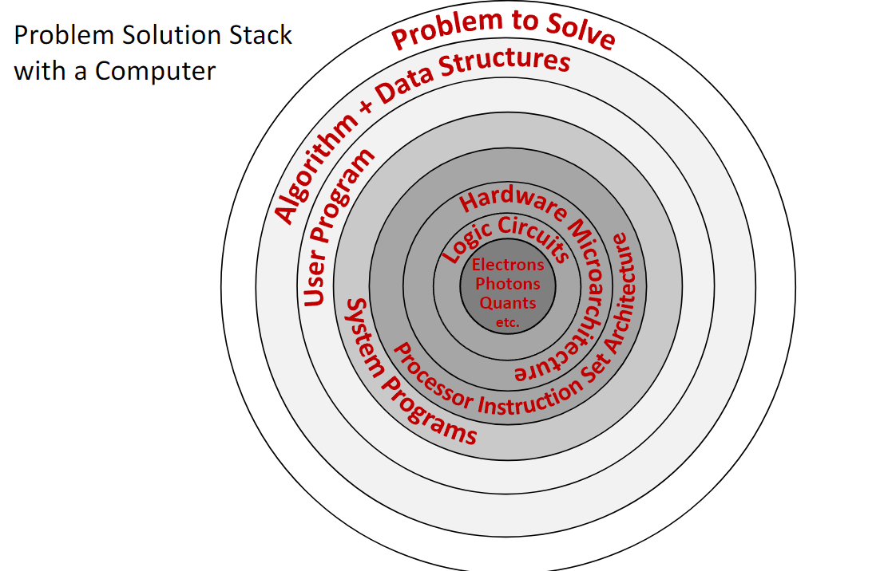



#### **1. Theory**

##### **1.1 What is a Computer?**
A **computer** is an electronic machine designed to automatically execute a sequence of arithmetic or logical operations based on a given program. It processes **input data** and produces an **output result**. Fundamentally, computers operate on binary data—strings of zeros and ones—manipulating this input to generate a binary output according to a predefined sequence of instructions.

<!-- DIAGRAM HERE -->

##### **1.2 The Problem Solution Stack**
Solving a problem with a computer involves multiple layers of abstraction, from the physical world to the software application. This is often visualized as a stack.

1.  **Problem to Solve**: The high-level goal.
2.  **Algorithm + Data Structures**: The conceptual solution.
3.  **User Program**: The implementation in a high-level language (e.g., C++, Python).
4.  **System Programs**: The operating system and compilers that translate the user program into machine instructions.
5.  **Processor Instruction Set Architecture (ISA)**: The specific set of low-level instructions the hardware can execute. This is the interface between hardware and software.
6.  **Microarchitecture**: The specific implementation of the ISA in hardware (e.g., how the CPU components are arranged and connected).
7.  **Logic Circuits**: The fundamental building blocks, like AND and OR gates, that implement the microarchitecture.
8.  **Electrons, Photons, etc.**: The underlying physics that makes the circuits work.

*Computer architecture* is the study of the layers from the Instruction Set Architecture down to the logic circuits, including how they interact with system software.

{fig-align="center" width=80%}

##### **1.3 What is Computer Architecture?**
**Computer Architecture** is a field of computer science and engineering that covers three main areas:

1.  *Hardware organization of computer systems*: How components like the CPU, memory, and I/O devices are structured and interconnected.
2.  *Hardware/Software interaction principles*: The rules and methods by which software controls the hardware, primarily through the instruction set.
3.  *Performance-related computer aspects*: Analyzing and designing systems to optimize for speed, power efficiency, and cost.

Studying architecture helps us understand how to design efficient hardware, write high-performance software, and customize computing systems for specific tasks.

##### **1.4 Core Components of a Computer**
A modern computer's architecture is built around several key interacting components.

###### **1.4.1 CPU (Central Processing Unit)**
The "brain" of the computer, the CPU executes program instructions. It is a complex electrical circuit with several key parts:

*   **Control Unit (CU)**: Fetches instructions from memory, decodes them, and directs the other components to carry them out.
*   **Arithmetic-Logic Unit (ALU)**: Performs all arithmetic (e.g., addition, subtraction) and logical (e.g., AND, OR) operations.
*   **Registers**: A small number of extremely fast memory locations located directly within the CPU. They hold data that is being actively processed, such as the arguments for an ALU operation or its result.

###### **1.4.2 The Processor Principle**
A processor operates by receiving electrical signals on its **input pins** and producing a result on its **output pins**. The inputs consist of:

*   **Instruction Code**: A binary code that tells the processor which operation to perform (e.g., `0` for logical OR, `1` for logical AND).
*   **Input Arguments**: The data values on which the operation will be performed.

The combination of the instruction code and its arguments forms a **machine instruction** (e.g., the binary string `010` could mean "OR the values 1 and 0").

###### **1.4.3 System Memory (RAM)**
**Random Access Memory** is the computer's main workspace. It stores program instructions and data for the CPU to access quickly. RAM is *volatile*, meaning its contents are lost when power is cut.

###### **1.4.4 Storage Devices**
These provide long-term, *non-volatile* storage for the operating system, applications, and files. Examples include Solid-State Drives (SSDs) and hard disk drives (HDDs). Data is loaded from storage into RAM for execution.

###### **1.4.5 Input/Output (I/O) Devices**
Peripherals that allow the computer to interact with the world, such as keyboards, monitors, printers, and network interfaces.

###### **1.4.6 Communication Bus**
The set of electrical pathways connecting all components, allowing them to communicate and exchange data. Bus speed is a critical factor in system performance. Significant delays in data transfer between the CPU and memory lead to the *"memory wall problem,"* a key performance limitation in modern computers.

##### **1.5 The Memory Hierarchy**
To balance speed, cost, and capacity, computers organize memory in a hierarchy. Data is moved between levels based on how frequently the CPU needs it.

1.  **Registers (inside the CPU)**: Fastest access (<1 nanosecond), smallest capacity (hundreds of bytes).
2.  **CPU Cache (L1, L2, L3)**: Very fast memory on or near the CPU. It stores copies of frequently used data from RAM.
    *   **L1 Cache**: Embedded in each CPU core, fastest cache, smallest capacity (tens of kilobytes).
    *   **L2 Cache**: Slower but larger than L1.
    *   **L3 Cache (LLC - Last Level Cache)**: Shared among all CPU cores, slowest and largest cache (megabytes).
3.  **System Memory (RAM)**: Much larger capacity (gigabytes) but significantly slower than cache.
4.  **Storage Devices (SSD/HDD)**: Largest capacity (terabytes) but the slowest access speeds.

{fig-align="center" width=80%}

##### **1.6 CPU Architectures and Multicore Systems**
A CPU's design is defined by its **Instruction Set Architecture (ISA)**.

###### **1.6.1 Widely-known Architectures**
*   **Intel x86 / AMD64**: Dominant in desktop and server computers (CISC - Complex Instruction Set Computer).
*   **ARM**: Dominant in mobile and embedded devices (RISC - Reduced Instruction Set Computer).
*   **RISC-V**: A modern, open-standard RISC architecture gaining popularity.
*   Others include **Baikal** and **Elbrus**.

###### **1.6.2 Multicore Systems**
Modern CPUs are **multicore processors**, meaning a single chip contains multiple independent processing units (cores). Each core has its own ALU, CU, and L1 cache, while typically sharing an L3 cache and main memory. This allows for parallel execution of tasks but introduces challenges in coordinating, or **scheduling**, work across the cores.

##### **1.7 Processors vs. FPGAs**
A standard **CPU** is a *general-purpose processor* with a fixed, unchangeable hardware design. An **FPGA (Field-Programmable Gate Array)** is an integrated circuit containing a grid of configurable logic blocks that can be reprogrammed by the user after manufacturing.

###### **1.7.1 Key Differences**
*   **Programmability**: A CPU's hardware is fixed; it executes software. An FPGA's hardware itself is reconfigured to create a custom circuit.
*   **Instruction Set**: A CPU has a fixed instruction set defined by its manufacturer. An FPGA has no inherent instruction set; you design the digital logic circuits directly.
*   **Computation Speed**: For general tasks, CPUs are optimized and efficient. For highly specific, parallelizable tasks, an FPGA's custom hardware can be much faster.
*   **Power Consumption**: FPGAs typically consume more power than a CPU for the same task due to their programmable nature.
*   **Cost**: FPGAs are generally more expensive than mass-produced CPUs.

###### **1.7.2 Use Cases for FPGAs**
FPGAs are used for prototyping new processor designs, high-frequency trading, real-time signal processing, and other tasks requiring massive parallelism and low latency.

##### **1.8 FPGA Programming and Development Boards**
FPGAs are programmed using a **Hardware Description Language (HDL)** like **Verilog** or **VHDL**. These languages describe the structure of hardware circuits rather than a sequence of software instructions. A tool like **Intel Quartus Prime Lite** is used to synthesize the HDL code into a configuration file that is then loaded onto the FPGA.

Educational boards like the **DE10-Lite MAX 10** include an FPGA chip along with various I/O devices for hands-on learning, such as:

*   LEDs and Switches
*   Push Buttons
*   7-Segment Displays
*   VGA Output
*   Accelerometer (G-Sensor)
*   GPIO (General-Purpose Input/Output) pins

***

#### **2. Definitions**

*   **Computer**: An electronic device that processes data by executing a sequence of instructions defined in a program.
*   **Computer Architecture**: The design and operational structure of a computer system, defining its hardware components, their interconnections, and the hardware-software interface (the instruction set).
*   **CPU (Central Processing Unit)**: The component of a computer that executes program instructions and performs arithmetic, logic, and control operations.
*   **ALU (Arithmetic-Logic Unit)**: A digital circuit within the CPU that performs arithmetic and bitwise logic operations.
*   **CU (Control Unit)**: The component of the CPU that directs the processor by interpreting instructions and generating control signals.
*   **Register**: A small, high-speed storage location directly within the CPU.
*   **Instruction Set Architecture (ISA)**: The specific set of commands that a CPU can execute, acting as the interface between the hardware and the software.
*   **System Memory (RAM)**: Volatile memory that stores data and machine code currently in use.
*   **CPU Cache**: A small, fast volatile memory that stores copies of frequently used data from main memory to reduce access times.
*   **Memory Hierarchy**: A tiered structure of memory and storage devices that balances speed, cost, and capacity.
*   **FPGA (Field-Programmable Gate Array)**: An integrated circuit with configurable logic blocks and programmable interconnects that can be rewired by the user after manufacturing.
*   **Verilog HDL**: A hardware description language (HDL) used to model and design digital electronic systems.
*   **Multicore Processor**: A single CPU chip that contains two or more independent processing units called "cores."

