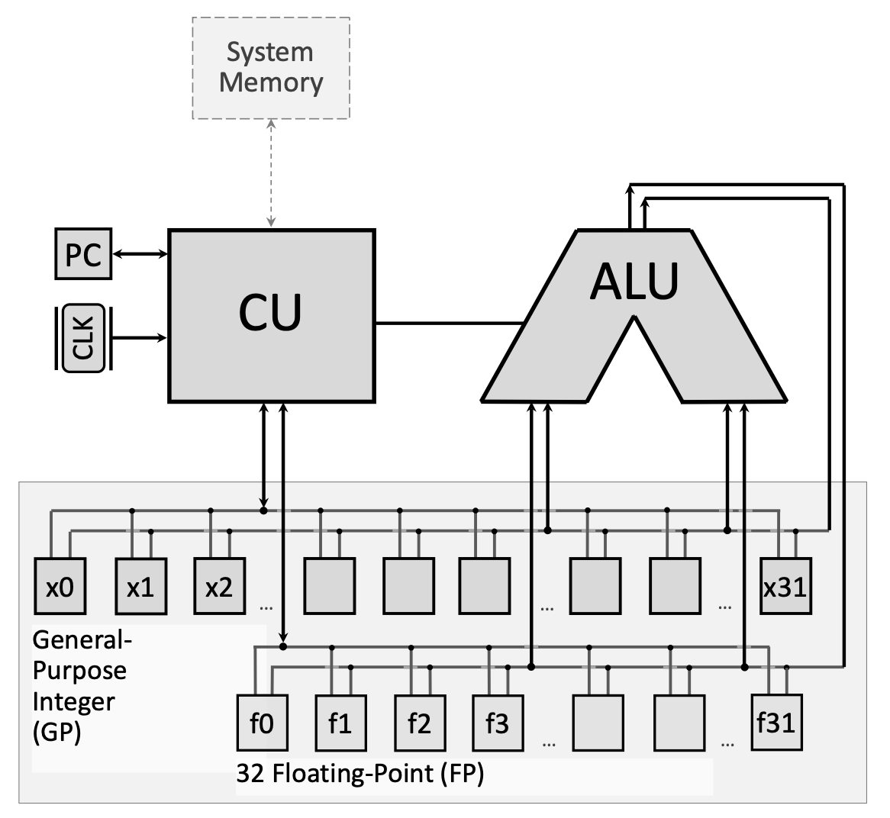
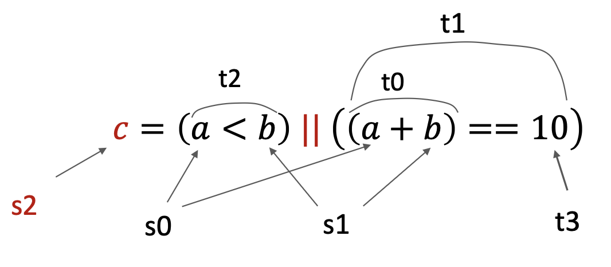

#### **1. Summary**
##### **1.1 RISC-V Program Structure**
RISC-V assembly programs are organized into two primary segments that serve different purposes in program execution. Understanding this structure is fundamental to writing any RISC-V program.

{fig-align="center" width=50%}

###### **1.1.1 The .data Segment**
The **`.data` segment** is where you declare and allocate memory for variables before your program runs. Think of it as the "setup" section where you reserve space for all the data your program will need to manipulate. This segment comes before actual program instructions and tells the assembler how much memory to set aside.

You can declare various data types:

*   **`.byte`**: Allocates 1 byte (8 bits) for a single character
*   **`.half`**: Allocates 2 bytes (16 bits) for a half-word integer
*   **`.word`**: Allocates 4 bytes (32 bits) for a full integer
*   **`.float`**: Allocates 4 bytes for a single-precision floating-point number
*   **`.double`**: Allocates 8 bytes for a double-precision floating-point number
*   **`.space n`**: Allocates `n` consecutive bytes (useful for arrays)
*   **`.asciiz "text"`** or **`.asciz "text"`**: Allocates a null-terminated string (the "z" stands for zero-terminated)

Each variable declaration consists of a **label** (the variable name followed by a colon) and a **directive** (the data type). For example:

```assembly
.data
myVar:    .word      # Allocates 4 bytes, labeled as myVar
myArray:  .space 20  # Allocates 20 bytes for an array
message:  .asciiz "Hello, World!"  # String with null terminator
```

###### **1.1.2 The .text Segment**
The **`.text` segment** contains the actual program instructions that the CPU will execute. This is where your algorithmic logic lives. The segment typically starts with a **label** (commonly `main:`) that marks the entry point of your program.

You can optionally use the **`.globl` directive** before a label to make that code block visible to other programs or modules. This is useful when writing multi-file programs.

```assembly
.text
.globl main   # Optional: makes main visible externally
main:         # Entry point label
    # Your program instructions go here
```

##### **1.2 Branch Instructions**
**Branch instructions** are the foundation of control flow in assembly language. They enable your program to make decisions and repeat operations—the building blocks of loops and conditional statements.

###### **1.2.1 Conditional Branches**
Conditional branches check a condition and only jump if that condition is true. RISC-V provides six primary conditional branch instructions:

*   **`beq rs1, rs2, label`**: Branch if Equal — jumps to `label` if `rs1 == rs2`
*   **`bne rs1, rs2, label`**: Branch if Not Equal — jumps if `rs1 != rs2`
*   **`blt rs1, rs2, label`**: Branch if Less Than — jumps if `rs1 < rs2` (signed comparison)
*   **`bge rs1, rs2, label`**: Branch if Greater or Equal — jumps if `rs1 >= rs2` (signed)
*   **`bltu rs1, rs2, label`**: Branch if Less Than Unsigned — jumps if `rs1 < rs2` (unsigned)
*   **`bgeu rs1, rs2, label`**: Branch if Greater or Equal Unsigned — jumps if `rs1 >= rs2` (unsigned)

All branch instructions use **PC-relative addressing**, meaning the target address is calculated relative to the current Program Counter (PC). When the branch is taken, the PC is updated to point to the instruction at the specified label.

RISC-V also provides **pseudo-instructions** that simplify common branching patterns:

*   **`bgtz rs, label`**: Branch if Greater Than Zero — jumps if `rs > 0`
*   **`bgez rs, label`**: Branch if Greater or Equal to Zero — jumps if `rs >= 0`  
*   **`bltz rs, label`**: Branch if Less Than Zero — jumps if `rs < 0`
*   **`bnez rs, label`**: Branch if Not Equal to Zero — jumps if `rs != 0`

These pseudo-instructions are translated by the assembler into combinations of the core instructions.

###### **1.2.2 Unconditional Jumps**
Unlike conditional branches, **unconditional jumps** always transfer control to the target address, regardless of any conditions.

**`j label`** (Jump): This pseudo-instruction unconditionally jumps to the specified label. It's commonly used to create infinite loops or to skip sections of code.

Example of an infinite loop:

```assembly
main:
    mv t0, zero      # t0 = 0
my_loop:
    addi t0, t0, 1   # Increment t0
    j my_loop        # Jump back unconditionally
```

Here, after line 3 executes, the PC is set back to `my_loop`, creating an infinite loop that increments `t0` forever.

##### **1.3 Jump and Link Instructions**
Jump and link instructions enable **procedure calls** — the ability to call functions and return from them. They are essential for structured programming.

###### **1.3.1 JAL (Jump and Link)**
**`jal rd, label`**: This instruction performs two operations:

1.  Stores the address of the next instruction (PC + 4) into register `rd` (the **return address**)
2.  Jumps to the specified `label`

By convention, `rd` is typically `ra` (register `x1`), the dedicated return address register.

###### **1.3.2 JALR (Jump and Link Register)**
**`jalr rd, offset(rs)`**: This instruction:

1.  Stores PC + 4 into register `rd`
2.  Jumps to the address calculated as `rs + offset`

The instruction `jalr zero, 0(ra)` is the standard way to **return from a function**. It jumps to the address stored in `ra` (the return address saved by `jal`) and discards the new return address by writing it to `zero` (which is read-only).

Together, `jal` and `jalr` implement the call-and-return mechanism:

```assembly
main:
    mv t0, zero
    jal my_func        # Save PC+4 to ra, jump to my_func
    # Execution continues here after my_func returns
    ...

my_func:
    addi t0, t0, 1
    jalr zero, 0(ra)   # Return to address in ra
```

When `jal my_func` executes, the address of the instruction after it is saved in `ra`. When `jalr zero, 0(ra)` executes inside `my_func`, control returns to that saved address.

##### **1.4 Logical Instructions**
**Logical instructions** perform bitwise Boolean operations on registers. They manipulate individual bits and are crucial for implementing boolean logic, bit masking, and flag manipulation.

###### **1.4.1 Core Logical Operations**
*   **`and rd, rs1, rs2`**: Performs bitwise AND. Each bit of `rd` is set to 1 only if the corresponding bits in both `rs1` and `rs2` are 1.
*   **`or rd, rs1, rs2`**: Performs bitwise OR. Each bit of `rd` is set to 1 if at least one corresponding bit in `rs1` or `rs2` is 1.
*   **`xor rd, rs1, rs2`**: Performs bitwise XOR (exclusive OR). Each bit of `rd` is set to 1 if the corresponding bits in `rs1` and `rs2` are different.
*   **`andi rd, rs1, imm`**: AND with immediate value
*   **`ori rd, rs1, imm`**: OR with immediate value
*   **`xori rd, rs1, imm`**: XOR with immediate value

###### **1.4.2 Implementing Complex Boolean Expressions**
Logical instructions are used to implement compound boolean expressions. For example, to implement `c = (a < b) || ((a + b) == 10)`, you need to:

1.  Evaluate `(a + b) == 10`:
    *   Calculate `a + b` and store in a temporary register
    *   Subtract the constant 10
    *   Use `seqz` to set a register to 1 if the result is zero (equality holds)
2.  Evaluate `a < b`:
    *   Use `slt` (Set Less Than) to set a register to 1 if `a < b`
3.  Combine with OR:
    *   Use `or` to combine the two boolean results

RISC-V lacks a direct "set if equal" instruction, so equality checks require subtraction followed by `seqz` (Set if Equal to Zero).

###### **1.4.3 Set Instructions**
These instructions set a register to 1 or 0 based on a condition:

*   **`slt rd, rs1, rs2`**: Set Less Than — sets `rd = 1` if `rs1 < rs2` (signed), else `rd = 0`
*   **`sltu rd, rs1, rs2`**: Set Less Than Unsigned
*   **`slti rd, rs1, imm`**: Set Less Than Immediate
*   **`sltiu rd, rs1, imm`**: Set Less Than Immediate Unsigned
*   **`seqz rd, rs`** (pseudo): Set if Equal to Zero — sets `rd = 1` if `rs == 0`, else `rd = 0`

##### **1.5 Shift Instructions**
**Shift instructions** move all the bits in a register left or right by a specified number of positions. They're essential for efficient arithmetic operations and bit manipulation.

###### **1.5.1 Why Shift Instructions Matter**
Shifting left by $n$ positions is equivalent to **multiplying by** $2^n$. Shifting right by $n$ positions is equivalent to **dividing by** $2^n$ (for unsigned or positive numbers). Since shift operations are typically faster than multiplication or division instructions, they're used for performance optimization.

Example: $20 \times 2^3 = 20 \times 8 = 160$

In binary:
$(00010100)_2 \times 2^3 = (10100000)_2$

This is equivalent to shifting `00010100` left by 3 positions.

###### **1.5.2 Shift Left**
*   **`sll rd, rs1, rs2`**: Shift Left Logical — shifts `rs1` left by the number of positions specified in `rs2` (only lower 5 bits used), storing result in `rd`. Zeros fill the vacated positions on the right.
*   **`slli rd, rs1, shamt`**: Shift Left Logical Immediate — shifts `rs1` left by the immediate value `shamt` (0-31).

Example: `slli t0, t0, 3` shifts `t0` left by 3 bits (multiplies by 8).

###### **1.5.3 Shift Right**
*   **`srl rd, rs1, rs2`**: Shift Right Logical — shifts `rs1` right by `rs2` positions. Zeros fill the vacated positions on the left. Used for unsigned division.
*   **`srli rd, rs1, shamt`**: Shift Right Logical Immediate
*   **`sra rd, rs1, rs2`**: Shift Right Arithmetic — shifts right but preserves the sign bit (copies the leftmost bit into vacated positions). Used for signed division.
*   **`srai rd, rs1, shamt`**: Shift Right Arithmetic Immediate

Example: `srli t0, t0, 4` shifts `t0` right by 4 bits (divides by 16 for unsigned values).

##### **1.6 Pseudo Instructions**
**Pseudo instructions** are assembly mnemonics that don't correspond to actual RISC-V machine instructions. Instead, the assembler translates them into one or more real instructions. They make code more readable and easier to write.

Common pseudo instructions:

*   **`mv rd, rs`**: Move — copies `rs` to `rd`. Implemented as `addi rd, rs, 0`
*   **`li rd, imm`**: Load Immediate — loads a constant into `rd`. Implemented as `addi rd, zero, imm` (for small values)
*   **`nop`**: No Operation — does nothing. Implemented as `addi zero, zero, 0`
*   **`j label`**: Jump — unconditional jump. Implemented as `jal zero, label`
*   **`ret`**: Return — return from function. Implemented as `jalr zero, 0(ra)`

Pseudo instructions can also be more complex. You can define custom macros using `.macro` and `.end_macro` directives for frequently used instruction sequences.

##### **1.7 System Calls (Ecall)**
**System calls** (invoked with `ecall`) allow assembly programs to interact with the operating system for input/output and other services. Before calling `ecall`, you set up arguments in specific registers:

*   **Register `a7`**: Contains the system call code (determines which service to invoke)
*   **Registers `a0`, `a1`, etc.**: Contain the arguments for the system call

Common system calls:

| Code (a7) | Service | Arguments/Returns |
|:----------|:--------|:------------------|
| 1 | Print integer | `a0` = integer to print |
| 4 | Print string | `a0` = address of null-terminated string |
| 5 | Read integer | Returns integer in `a0` |
| 8 | Read string | `a0` = buffer address, `a1` = max length |
| 10 | Exit program | None |
| 11 | Print character | `a0` = character (lowest byte) |
| 12 | Read character | Returns character in `a0` |
| 93 | Exit with code | `a0` = exit code |

Example — printing a string:

```assembly
.data
msg: .asciiz "Hello, World!"
.text
main:
    li a7, 4        # System call code for print string
    la a0, msg      # Load address of string
    ecall           # Execute system call
```

##### **1.8 Practical Example: Array Filling**
Let's walk through a complete program that demonstrates branching and loops. This program allocates an array of 10 bytes and fills it with the value 1:

```assembly
.data:
myArray: .space 10        # Allocate 10 bytes

.text
main:
    li t3, 10             # t3 = array size (loop counter)
    la t0, myArray        # t0 = address of first element
    li t1, 1              # t1 = value to fill (1)
fill_array:               # Loop label
    sb t1, 0(t0)          # Store byte: memory[t0] = t1
    addi t0, t0, 1        # Increment address by 1 byte
    addi t3, t3, -1       # Decrement counter
    bgtz t3, fill_array   # Branch if t3 > 0 (continue loop)
    li a7, 10
    ecall                 # Exit program
```

**How it works:**

1.  **Initialization**: `t3` holds the number of elements remaining to fill. `t0` holds the current memory address. `t1` holds the value to store.
2.  **Loop body**: `sb` stores one byte from `t1` into the memory location `t0 + 0`. Then `t0` is incremented to point to the next byte, and `t3` is decremented.
3.  **Loop condition**: `bgtz t3, fill_array` checks if `t3 > 0`. If true, jump back to `fill_array`. If false, continue to the next instruction.
4.  **Termination**: When `t3` reaches 0, the loop exits and the program terminates via system call.

To modify this program to fill the array with indices (1, 2, 3, ..., 10) instead of all 1s, simply add this line inside the loop after `sb`:

```assembly
addi t1, t1, 1  # Increment the value to store
```

***

#### **2. Definitions**
*   **`.data` Segment**: The section of a RISC-V program where variables are declared and memory is allocated for data storage before program execution begins.
*   **`.text` Segment**: The section of a RISC-V program containing the executable instructions (the actual code).
*   **Label**: A symbolic name followed by a colon (e.g., `main:`) that marks a location in memory, used as a target for jumps and branches or to identify variables.
*   **Branch Instruction**: An instruction that conditionally changes the program flow by jumping to a different location if a specified condition is true.
*   **Unconditional Jump**: An instruction that always transfers control to a target address, regardless of any condition (e.g., `j`).
*   **PC (Program Counter)**: A special-purpose register that holds the memory address of the next instruction to be executed.
*   **PC-Relative Addressing**: A method of calculating jump/branch target addresses as an offset from the current value of the Program Counter.
*   **JAL (Jump and Link)**: An instruction that saves the return address (PC+4) in a register and jumps to a label, used for function calls.
*   **JALR (Jump and Link Register)**: An instruction that saves the return address and jumps to an address calculated from a register plus an offset, used for function returns and indirect calls.
*   **Return Address (ra)**: Register `x1`, conventionally used to store the address to return to after a function call completes.
*   **Logical Instruction**: An instruction that performs bitwise Boolean operations (AND, OR, XOR) on register values.
*   **Bitwise Operation**: An operation that manipulates individual bits within a register according to Boolean logic rules.
*   **SLT (Set Less Than)**: An instruction that sets a destination register to 1 if one source register is less than another, otherwise sets it to 0.
*   **SEQZ (Set if Equal to Zero)**: A pseudo-instruction that sets a register to 1 if the source register equals zero, otherwise sets it to 0.
*   **Shift Instruction**: An instruction that moves all bits in a register left or right by a specified number of positions.
*   **Shift Left Logical (SLL)**: Shifts bits to the left, filling vacated positions with zeros; equivalent to multiplication by powers of 2.
*   **Shift Right Logical (SRL)**: Shifts bits to the right, filling vacated positions with zeros; used for unsigned division by powers of 2.
*   **Shift Right Arithmetic (SRA)**: Shifts bits to the right while preserving the sign bit, used for signed division by powers of 2.
*   **Pseudo Instruction**: An assembly mnemonic that is not a real machine instruction but is translated by the assembler into one or more actual instructions for convenience.
*   **System Call (ecall)**: A mechanism for assembly programs to request services from the operating system, such as I/O operations.
*   **Macro**: A user-defined shorthand that the assembler expands into a sequence of instructions, defined using `.macro` and `.end_macro` directives.
*   **Immediate Value**: A constant numerical value embedded directly in an instruction, rather than stored in a register or memory.

***

#### **3. Examples**
##### **3.1. Array Filling with Constant Value** (Lab 10, Task 1)
Write a RISC-V program that allocates memory for an array of 10 elements and fills it with the value `1`.

<details>
<summary>Click to see the solution</summary>

**Key Concept:** Use a loop with a counter to iterate through array elements, storing a constant value in each position.

```assembly
.data:
myArray: .space 10        # Allocate 10 bytes (array size)

.text
main:
    li t3, 10             # t3 = 10 (size of the array, loop counter)
    la t0, myArray        # Load the address of the 1st array element
    li t1, 1              # Value to be filled inside the array
fill_array:               # Labeled block of code (loop start)
    sb t1, 0(t0)          # Store byte: put value from t1 into memory[t0 + 0]
    addi t0, t0, 1        # Increment address by 1 byte (size of element)
    addi t3, t3, -1       # Decrement the number of elements to be filled
    bgtz t3, fill_array   # Branch if t3 > 0 (continue loop)
    li a7, 10
    ecall                 # Exit from the program
```

**How it works:**

1.  **Initialize counter**: `t3 = 10` (number of elements to fill)
2.  **Load array address**: `t0` points to the start of the array
3.  **Set fill value**: `t1 = 1`
4.  **Loop**:
    *   Store byte `t1` at address `t0`
    *   Increment `t0` to point to next element
    *   Decrement counter `t3`
    *   If `t3 > 0`, repeat the loop
5.  **Exit**: System call 10

**Answer:** The program fills all 10 bytes of `myArray` with the value `1`.

</details>

##### **3.2. Array Filling with Indices** (Lab 10, Task 2)
Modify the previous program to fill the array with its element indices (1, 2, 3, ..., 10) rather than all `1`s.

<details>
<summary>Click to see the solution</summary>

**Key Concept:** Increment the value to be stored during each iteration, not just the address and counter.

```assembly
.data:
myArray: .space 10

.text
main:
    li t3, 10
    la t0, myArray
    li t1, 1              # Start with value 1
fill_array:
    sb t1, 0(t0)
    addi t0, t0, 1
    addi t1, t1, 1        # Increment t1 value to be stored into the next element
    addi t3, t3, -1
    bgtz t3, fill_array
    li a7, 10
    ecall
```

**Change from previous example:**

*   Added `addi t1, t1, 1` inside the loop
*   This increments the value being stored, so the first element gets 1, the second gets 2, etc.

**Answer:** The array now contains `[1, 2, 3, 4, 5, 6, 7, 8, 9, 10]`.

</details>

##### **3.3. Factorial Calculation** (Lab 10, Task 3)
Write a RISC-V program to compute the factorial of a number:

a) An input integer number is taken from a user (using system calls)

b) The factorial is computed iteratively

c) Display the result back to the user console

<details>
<summary>Click to see the solution</summary>

**Key Concept:** Factorial of $n$ is $n! = n \times (n-1) \times (n-2) \times \ldots \times 1$. Use a loop that multiplies an accumulator by decreasing values.

```assembly
.data
prompt:    .asciiz "Enter a number: "
result_msg: .asciiz "Factorial: "

.text
main:
    # Print prompt
    li a7, 4
    la a0, prompt
    ecall
    
    # Read integer from user
    li a7, 5
    ecall
    mv t0, a0              # t0 = n (input number)
    
    # Initialize factorial result
    li t1, 1               # t1 = result (accumulator), starts at 1
    
    # Handle edge case: if n <= 1, factorial is 1
    li t2, 1
    ble t0, t2, print_result
    
factorial_loop:
    mul t1, t1, t0         # result = result * n
    addi t0, t0, -1        # n = n - 1
    li t2, 1
    bgt t0, t2, factorial_loop  # Continue while n > 1
    
print_result:
    # Print result message
    li a7, 4
    la a0, result_msg
    ecall
    
    # Print factorial value
    li a7, 1
    mv a0, t1
    ecall
    
    # Exit
    li a7, 10
    ecall
```

**Step-by-step:**

1.  **Get input**: Use system call 5 to read an integer into `a0`, then move to `t0`
2.  **Initialize**: Set accumulator `t1 = 1`
3.  **Check edge case**: If input is 0 or 1, skip to printing (factorial is 1)
4.  **Loop**: Multiply `t1` by `t0`, then decrement `t0`. Continue while `t0 > 1`
5.  **Output**: Print the result message, then print the integer in `t1`

**Answer:** For input `n = 5`, the program outputs `Factorial: 120`.

</details>

##### **3.4. Word Counting in a String** (Lab 10, Task 4)
Write a RISC-V program to compute the number of words in a string:

a) The string is taken from a user (or specified in `.data` segment)

b) Words are separated by spaces

c) Hint: ASCII code of space is 32, and of newline (`\n`) is 10

d) Hint: System call code to read a character is 12, with the character returned in `a0`

<details>
<summary>Click to see the solution</summary>

**Key Concept:** Read the string character by character. Count transitions from space to non-space as the start of a new word.

**Version 1: Using predefined string in .data**

```assembly
.data
input_str: .asciiz "Hello world from RISC-V"
result_msg: .asciiz "Number of words: "

.text
main:
    la t0, input_str       # t0 = address of string
    li t1, 0               # t1 = word count
    li t2, 1               # t2 = in_space flag (1 = currently in space)
    
count_loop:
    lb t3, 0(t0)           # Load byte (character) from string
    beqz t3, done          # If null terminator, exit loop
    
    li t4, 32              # ASCII space
    beq t3, t4, is_space   # If current char is space
    li t4, 10              # ASCII newline
    beq t3, t4, is_space   # If current char is newline
    
    # Current char is not a space
    bnez t2, new_word      # If we were in space, this starts a new word
    j next_char
    
new_word:
    addi t1, t1, 1         # Increment word count
    li t2, 0               # Clear in_space flag
    j next_char
    
is_space:
    li t2, 1               # Set in_space flag
    
next_char:
    addi t0, t0, 1         # Move to next character
    j count_loop
    
done:
    # Print result message
    li a7, 4
    la a0, result_msg
    ecall
    
    # Print word count
    li a7, 1
    mv a0, t1
    ecall
    
    # Exit
    li a7, 10
    ecall
```

**Algorithm:**

1.  **Initialize**: `t1 = 0` (word count), `t2 = 1` (flag indicating we're in a space initially)
2.  **Loop through string**:
    *   Load current character into `t3`
    *   If null terminator (0), exit loop
    *   If space (32) or newline (10), set `in_space` flag
    *   If not a space and we were previously in a space, increment word count and clear flag
3.  **Output**: Print the word count

**Version 2: Reading string from user**

Replace the `.data` section and beginning of `main` with:

```assembly
.data
buffer: .space 100
result_msg: .asciiz "Number of words: "
prompt: .asciiz "Enter a string: "

.text
main:
    # Print prompt
    li a7, 4
    la a0, prompt
    ecall
    
    # Read string
    li a7, 8
    la a0, buffer
    li a1, 100
    ecall
    
    la t0, buffer          # Continue with counting algorithm...
```

**Answer:** For input `"Hello world from RISC-V"`, the program outputs `Number of words: 4`.

</details>

##### **3.5. Binary Search Implementation** (Lab 10, Task 5)
Write a program to find the index of an element in a sorted array using binary search:

1) The array of integers and the target value are read from user or defined in `.data` segment

2) If the value is present: print its index

3) If not found: print "Not found"

<details>
<summary>Click to see the solution</summary>

**Key Concept:** Binary search repeatedly divides the search interval in half. Compare the target with the middle element; if equal, return the index. If target is smaller, search the left half; if larger, search the right half.

```assembly
.data
array:     .word 1, 3, 5, 7, 9, 11, 13, 15, 17, 19  # Sorted array (10 elements)
array_size: .word 10
target:    .word 13
found_msg: .asciiz "Found at index: "
notfound_msg: .asciiz "Not found"

.text
main:
    # Initialize
    la t0, array           # t0 = array base address
    lw t1, target          # t1 = target value
    li t2, 0               # t2 = left index
    lw t3, array_size      # t3 = array size
    addi t3, t3, -1        # t3 = right index (size - 1)
    
binary_search:
    bgt t2, t3, not_found  # If left > right, not found
    
    # Calculate mid = (left + right) / 2
    add t4, t2, t3         # t4 = left + right
    srli t4, t4, 1         # t4 = (left + right) / 2 (using right shift)
    
    # Load array[mid]
    slli t5, t4, 2         # t5 = mid * 4 (word size)
    add t5, t0, t5         # t5 = address of array[mid]
    lw t6, 0(t5)           # t6 = array[mid]
    
    # Compare target with array[mid]
    beq t1, t6, found      # If target == array[mid], found
    blt t1, t6, search_left   # If target < array[mid], search left
    
    # Search right half
    addi t2, t4, 1         # left = mid + 1
    j binary_search
    
search_left:
    addi t3, t4, -1        # right = mid - 1
    j binary_search
    
found:
    # Print found message
    li a7, 4
    la a0, found_msg
    ecall
    
    # Print index
    li a7, 1
    mv a0, t4              # t4 contains the index
    ecall
    
    j exit
    
not_found:
    # Print not found message
    li a7, 4
    la a0, notfound_msg
    ecall
    
exit:
    # Exit
    li a7, 10
    ecall
```

**Algorithm:**

1.  **Initialize**: `left = 0`, `right = n - 1`
2.  **Loop while** `left <= right`:
    *   Calculate `mid = (left + right) / 2` using shift right
    *   Load `array[mid]` (multiply index by 4 for word addressing)
    *   If `target == array[mid]`, found at index `mid`
    *   If `target < array[mid]`, set `right = mid - 1`
    *   If `target > array[mid]`, set `left = mid + 1`
3.  **If loop exits**: element not found

**Answer:** For the array `[1, 3, 5, 7, 9, 11, 13, 15, 17, 19]` and target `13`, the program outputs `Found at index: 6`.

</details>

##### **3.6. Logical Expression Implementation** (Lecture 10, Example 1)
Implement the boolean expression: $c = (a < b) \, || \, ((a + b) == 10)$

Assume: `a` is in register `s0`, `b` is in register `s1`, and result `c` should be in `s2`.

{fig-align="center" width=50%}

<details>
<summary>Click to see the solution</summary>

**Key Concept:** Break complex expressions into parts, evaluate each condition separately, then combine with logical OR.

```assembly
# Assume s0 = a, s1 = b
# Result c will be in s2

# Step 1: Compute (a + b)
add t0, s0, s1             # t0 = a + b

# Step 2: Check if (a + b) == 10
li t3, 10                  # Load constant 10
sub t0, t0, t3             # t0 = (a + b) - 10
seqz t1, t0                # t1 = 1 if t0 == 0, else t1 = 0
                           # t1 now holds result of ((a + b) == 10)

# Step 3: Check if (a < b)
slt t2, s0, s1             # t2 = 1 if s0 < s1, else t2 = 0
                           # t2 now holds result of (a < b)

# Step 4: Combine with OR
or s2, t2, t1              # s2 = t2 | t1
                           # s2 now holds final result c
```

**Step-by-step:**

1.  **Evaluate** `(a + b) == 10`:
    *   Add `s0` and `s1`, store in `t0`
    *   Load 10 into `t3`
    *   Subtract: `t0 = t0 - 10`
    *   Use `seqz t1, t0` to set `t1 = 1` if result is zero (equality holds)
2.  **Evaluate** `a < b`:
    *   Use `slt t2, s0, s1` to set `t2 = 1` if `s0 < s1`
3.  **Combine**: Use `or s2, t2, t1` to compute the final result

**Note:** RISC-V doesn't have a direct "set if equal" instruction, so we use subtraction + `seqz`.

**Alternative using macro:**

You can define a macro for equality checking:

```assembly
.macro seq result, reg1, reg2
    sub t0, \reg1, \reg2
    seqz \result, t0
.end_macro

# Then use:
seq t1, t0, t3    # t1 = (t0 == t3)
```

**Answer:** Register `s2` contains 1 if the expression is true, 0 if false.

</details>

##### **3.7. String Reading and Printing** (Lecture 10, Example 2)
Write a program that prompts the user to enter a string, reads it, and prints it back.

<details>
<summary>Click to see the solution</summary>

**Key Concept:** Use system calls for I/O: call 4 to print strings, call 8 to read strings.

```assembly
.data
msg: .asciz "Enter your string: "    # Prompt string
inputStr: .space 100                 # Buffer for input (100 bytes)

.text
main:
    # Print prompt
    li a7, 4                         # System call code for print string
    la a0, msg                       # Load address of prompt message
    ecall                            # Execute system call
    
    # Read string from user
    li a7, 8                         # System call code for read string
    la a0, inputStr                  # Load address of input buffer
    li a1, 100                       # Set maximum read size to 100 chars
    ecall                            # Execute system call
    
    # Print the string back
    li a7, 4                         # System call code for print string
    la a0, inputStr                  # Load address of input string
    ecall                            # Execute system call
    
    # Exit program
    li a7, 10                        # System call code for exit
    ecall                            # Execute system call
```

**How it works:**

1.  **Allocate buffer**: `.space 100` reserves 100 bytes for the input string
2.  **Print prompt**: System call 4 with address in `a0`
3.  **Read string**: System call 8 with buffer address in `a0` and max length in `a1`
4.  **Echo string**: Another system call 4 with the input buffer address
5.  **Exit**: System call 10

**Answer:** The program echoes whatever string the user enters.

</details>

##### **3.8. Fast Multiplication Using Shift** (Lecture 10, Example 3)
Calculate $20 \times 8$ using shift instructions instead of multiplication.

<details>
<summary>Click to see the solution</summary>

**Key Concept:** Multiplying by $2^n$ is equivalent to shifting left by $n$ positions. Since $8 = 2^3$, we shift left by 3.

```assembly
li t0, 20                  # t0 = 20
slli t0, t0, 3             # t0 = t0 << 3 (multiply by 8)
# Now t0 = 160
```

**In binary:**

$(00010100)_2 \times 2^3 = (10100000)_2$

$20_{10} = 00010100_2$

Shift left by 3 positions: $10100000_2 = 160_{10}$

**Answer:** `t0` contains 160 after the shift operation. This is much faster than a multiplication instruction.

</details>

##### **3.9. Fast Division Using Shift** (Lecture 10, Example 4)
Calculate $160 \div 16$ using shift instructions.

<details>
<summary>Click to see the solution</summary>

**Key Concept:** Dividing by $2^n$ is equivalent to shifting right by $n$ positions. Since $16 = 2^4$, we shift right by 4.

```assembly
li t0, 160                 # t0 = 160
srli t0, t0, 4             # t0 = t0 >> 4 (divide by 16)
# Now t0 = 10
```

**In binary:**

$(10100000)_2 \div 2^4 = (00001010)_2$

$160_{10} = 10100000_2$

Shift right by 4 positions: $00001010_2 = 10_{10}$

**Answer:** `t0` contains 10 after the shift operation.

**Note:** Use `srli` for unsigned division, `srai` for signed division (preserves sign bit).

</details>

##### **3.10. Infinite Loop with Jump** (Lecture 10, Example 5)
Create an infinite loop that continuously increments a register.

<details>
<summary>Click to see the solution</summary>

**Key Concept:** Use an unconditional jump (`j`) that jumps back to itself, creating an infinite loop.

```assembly
main:
    mv t0, zero            # t0 = 0
my_loop:
    addi t0, t0, 1         # Increment t0
    j my_loop              # Jump back unconditionally
```

**How it works:**

1.  First iteration: instructions execute sequentially from `main` to `j my_loop`
2.  When `j my_loop` executes, PC is set to the address of `my_loop` label
3.  Instructions at `my_loop` execute again
4.  The jump repeats indefinitely

**Warning:** This loop never terminates and will freeze the program!

**Answer:** `t0` increments forever: 1, 2, 3, 4, ...

</details>

##### **3.11. Function Call with JAL/JALR** (Lecture 10, Example 6)
Write a simple function that increments a value and returns.

<details>
<summary>Click to see the solution</summary>

**Key Concept:** Use `jal` to call a function (saves return address in `ra`), and `jalr zero, 0(ra)` to return.

```assembly
main:
    mv t0, zero            # t0 = 0
    jal my_func            # Call my_func, save return address in ra
    # Execution continues here after return
    li a7, 10
    ecall                  # Exit

my_func:
    addi t0, t0, 1         # Increment t0
    jalr zero, 0(ra)       # Return: jump to address in ra
```

**How it works:**

1.  **`jal my_func`**: Saves the address of the next instruction (the `li a7, 10` line) into `ra`, then jumps to `my_func`
2.  **Inside `my_func`**: The increment happens
3.  **`jalr zero, 0(ra)`**: Jumps to the address stored in `ra` (the saved return address), discarding the new return address by writing to `zero`
4.  **Back in `main`**: Execution resumes at `li a7, 10`

**Answer:** The function increments `t0` by 1, then returns control to `main`.

</details>
