#### **1. Краткое содержание**
##### **1.1 Инструкции с плавающей запятой в RISC-V**
RISC-V расширяет свою **архитектуру набора инструкций (ISA)** отдельной поддержкой **операций с плавающей запятой (floating-point)**. Это необходимо для научных вычислений, графики, обработки сигналов и любых приложений, где нужны вещественные числа с дробной частью. В отличие от целых чисел, **floating-point** позволяет представлять очень большие или очень малые значения по стандарту **IEEE 754**.

###### **1.1.1 Регистры с плавающей запятой**
В RISC-V есть **32 отдельных регистра с плавающей запятой**, независимых от целочисленных. Они обозначаются `f0`–`f31`. Каждый такой регистр может хранить число **одинарной точности (single-precision, 32 бита)** или **двойной точности (double-precision, 64 бита)**.

У регистров есть **имена ABI (Application Binary Interface)** — соглашение об использовании:

| Регистр | Имя ABI | Назначение |
|:---------|:---------|:--------|
| f0-f7 | ft0-ft7 | Временные регистры (сохраняет вызывающий, caller-saved) |
| f8-f9 | fs0-fs1 | Сохраняемые регистры (сохраняет вызываемый, callee-saved) |
| f10-f11 | fa0-fa1 | Аргументы функций / возвращаемые значения |
| f12-f17 | fa2-fa7 | Аргументы функций |
| f18-f27 | fs2-fs11 | Сохраняемые регистры (callee-saved) |
| f28-f31 | ft8-ft11 | Временные регистры (caller-saved) |

**Важно:** регистр `f10` (он же `fa0`) передаёт первый **floating-point**-аргумент в функции и возвращает **floating-point**-результат.

###### **1.1.2 Архитектура RISC-V с блоком FPU**
В архитектуре процессора RISC-V рядом с целочисленным конвейером размещается отдельный **блок с плавающей запятой (FPU)**:

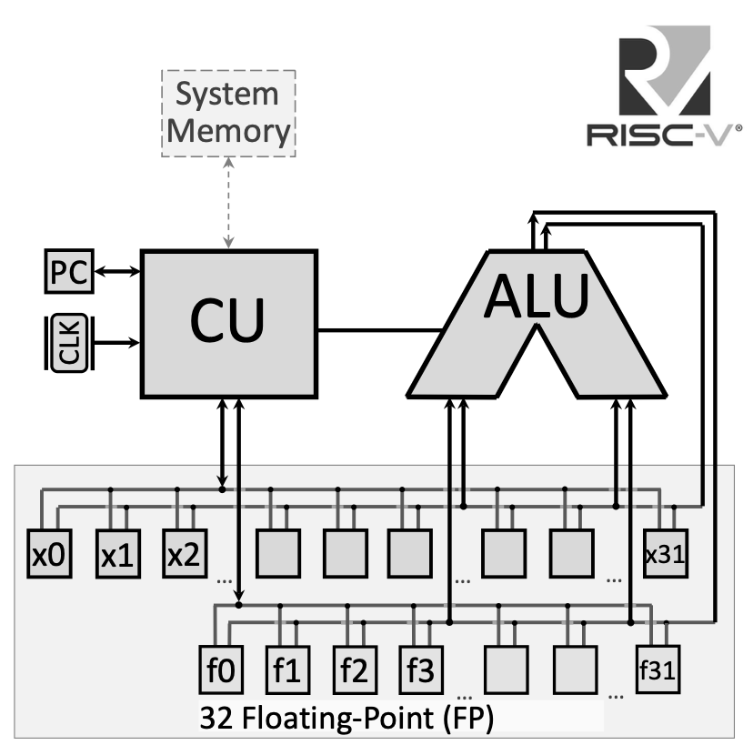{fig-align="center" width=80%}

Регистры **floating-point** подключены к отдельной шине, не смешиваясь с целочисленным регистровым файлом. В более продвинутых реализациях это позволяет параллельно выполнять **floating-point**- и целочисленные операции.

###### **1.1.3 Арифметические инструкции с плавающей запятой**
Арифметика задаётся суффиксами **`.s`** (single) и **`.d`** (double):

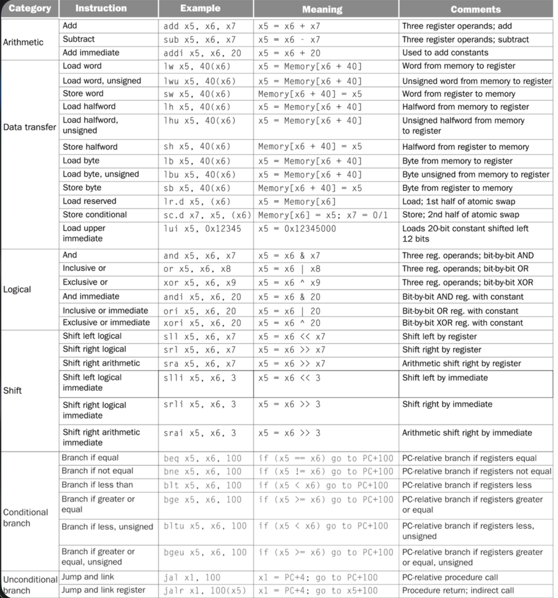{fig-align="center" width=80%}

**Операции одинарной точности:**

*   **`fadd.s fd, fs1, fs2`**: сложение — $fd = fs1 + fs2$
*   **`fsub.s fd, fs1, fs2`**: вычитание — $fd = fs1 - fs2$
*   **`fmul.s fd, fs1, fs2`**: умножение — $fd = fs1 \times fs2$
*   **`fdiv.s fd, fs1, fs2`**: деление — $fd = fs1 / fs2$
*   **`fsqrt.s fd, fs1`**: квадратный корень — $fd = \sqrt{fs1}$

**Операции двойной точности:**

*   **`fadd.d fd, fs1, fs2`**: сложение — $fd = fs1 + fs2$
*   **`fsub.d fd, fs1, fs2`**: вычитание — $fd = fs1 - fs2$
*   **`fmul.d fd, fs1, fs2`**: умножение — $fd = fs1 \times fs2$
*   **`fdiv.d fd, fs1, fs2`**: деление — $fd = fs1 / fs2$
*   **`fsqrt.d fd, fs1`**: квадратный корень — $fd = \sqrt{fs1}$

###### **1.1.4 Инструкции сравнения**
Результат сравнения записывается в **целочисленный регистр** (не в **floating-point**): 1, если условие истинно, иначе 0:

**Сравнения `.s`:**

*   **`feq.s rd, fs1, fs2`**: равенство — $rd = 1$ если $fs1 == fs2$, иначе $rd = 0$
*   **`flt.s rd, fs1, fs2`**: меньше — $rd = 1$ если $fs1 < fs2$, иначе $rd = 0$
*   **`fle.s rd, fs1, fs2`**: меньше или равно — $rd = 1$ если $fs1 \le fs2$, иначе $rd = 0$

**Сравнения `.d`:**

*   **`feq.d rd, fs1, fs2`**: проверка равенства
*   **`flt.d rd, fs1, fs2`**: сравнение «меньше»
*   **`fle.d rd, fs1, fs2`**: сравнение «меньше или равно»

###### **1.1.5 Пересылка данных память ↔ F-регистры**

*   **`flw fd, offset(rs)`**: загрузка **float** — $fd = \text{Memory}[rs + offset]$
*   **`fld fd, offset(rs)`**: загрузка **double** — $fd = \text{Memory}[rs + offset]$
*   **`fsw fs, offset(rs)`**: сохранение **float** — $\text{Memory}[rs + offset] = fs$
*   **`fsd fs, offset(rs)`**: сохранение **double** — $\text{Memory}[rs + offset] = fs$

###### **1.1.6 Перемещение между F-регистрами**

*   **`fmv.s fd, fs`**: копия **single** из `fs` в `fd`
*   **`fmv.d fd, fs`**: копия **double** из `fs` в `fd`

###### **1.1.7 Системные вызовы для ввода-вывода F-чисел**

| Код (a7) | Сервис | Аргументы / результат |
|:----------|:--------|:------------------|
| 2 | Печать float | в `fa0` значение для вывода |
| 3 | Печать double | в `fa0` значение для вывода |
| 6 | Чтение float | читает float, кладёт в `fa0` |
| 7 | Чтение double | читает double, кладёт в `fa0` |

**Важно:** для **floating-point** I/O используется `fa0` (то есть `f10`), а не целочисленный `a0`.

##### **1.2 Перевод программы с высокого уровня в машинный код**
Понимать путь от кода на C/C++ до исполняемого двоичного файла — база **computer architecture**. Это несколько стадий, у каждой своя роль.

###### **1.2.1 Конвейер перевода**
Полный путь от **high-level program** до **executable machine code**:

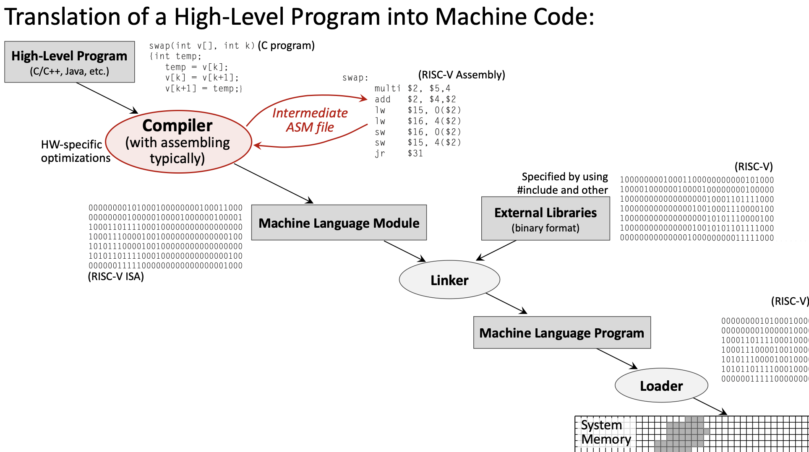{fig-align="center" width=80%}

1.  **Программа на высоком уровне** (например, C) →
2.  **Compiler** → **программа на ассемблере** →
3.  **Assembler** → **машинный модуль (object file)** →
4.  **Linker** → **исполняемый файл** →
5.  **Loader** → **программа в памяти**

###### **1.2.2 Компилятор**
**Compiler** переводит исходный код высокого уровня в ассемблер. Здесь обычно делается большая часть оптимизаций.

**Основные задачи:**

*   перевод конструкций языка (циклы, ветвления, функции) в ассемблер;
*   оптимизации под конкретное железо;
*   **register allocation**;
*   генерация кода под уровни `-O0`, `-O2`, `-O3` и т.д.

Пример преобразования:

```c
// High-Level C Code
float f2c(float fahr) {
    return ((5.0f/9.0f) * (fahr - 32.0f));
}
```

Соответствующий ассемблер:

```assembly
f2c:
    flw f0, const5, t0    # f0 = 5.0f
    flw f1, const9, t0    # f1 = 9.0f
    fdiv.s f0, f0, f1     # f0 = 5.0f/9.0f
    flw f1, const32, t0   # f1 = 32.0f
    fsub.s f10, f10, f1   # f10 = fahr - 32.0f
    fmul.s f10, f0, f10   # f10 = (5.0f/9.0f) * (fahr - 32.0f)
    ret
```

###### **1.2.3 Ассемблер**
**Assembler** переводит мнемоники в машинный язык (бинарные **object files**).

**Основные задачи:**

*   мнемоники → двоичные **opcode**;
*   разрешение локальных меток в адреса;
*   **relocation information** для **linker**;
*   **symbol tables**.

На выходе — **object files** (`.o`):

*   машинный код;
*   секции данных;
*   таблица символов;
*   информация о перемещениях.

###### **1.2.4 Компоновщик (линкер)**
**Linker** объединяет несколько **object files** и библиотек в один исполняемый файл.

**Основные задачи:**

*   разрешение внешних ссылок (функции/переменные из других файлов);
*   слияние секций кода и данных;
*   подключение стандартной и др. библиотек;
*   назначение окончательных адресов в памяти.

###### **1.2.5 Загрузчик**
**Loader** — часть ОС: загружает исполняемый файл в память и готовит запуск.

**Основные задачи:**

*   выделить память под программу;
*   загрузить сегменты кода и данных;
*   настроить стек и кучу;
*   инициализировать **Program Counter (PC)** на точку входа.

###### **1.2.6 Зависимость от железа**
Степень привязки к аппаратуре разная:

*   **Hardware-Independent:** исходный код высокого уровня (переносим);
*   **Hardware-Dependent:** ассемблер, объектный код и исполняемые файлы (специфичны для RISC-V, x86, ARM и т.д.).

Поэтому одна и та же программа на C может быть скомпилирована под разные **ISA**.

##### **1.3 Кодирование инструкций RISC-V**
Каждая инструкция RISC-V кодируется ровно **32 битами**; у разных типов разная разбивка полей.

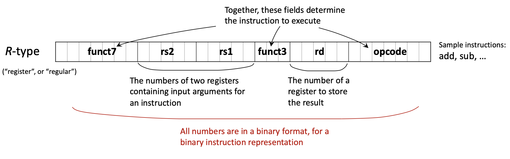{fig-align="center" width=80%}

###### **1.3.1 Основные форматы инструкций**
Шесть основных форматов:

**R-type (Register):** только регистры

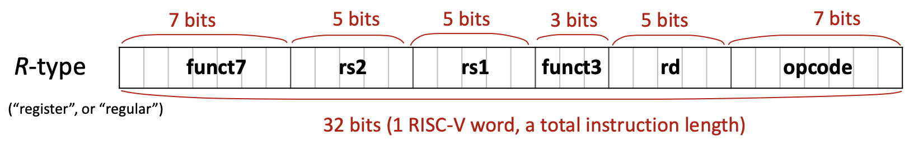{fig-align="center" width=80%}

| funct7 (7) | rs2 (5) | rs1 (5) | funct3 (3) | rd (5) | opcode (7) |
|:-----------|:--------|:--------|:-----------|:-------|:-----------|

*   для: `add`, `sub`, `and`, `or`, `sll`, `srl`, …
*   все операнды — регистры

**I-type (Immediate):** непосредственное значение и загрузки

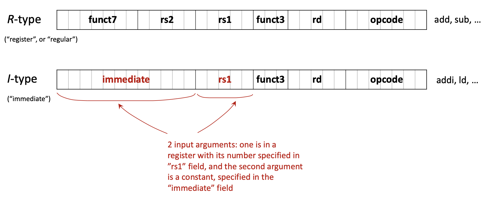{fig-align="center" width=80%}

| imm[11:0] (12) | rs1 (5) | funct3 (3) | rd (5) | opcode (7) |
|:---------------|:--------|:-----------|:-------|:-----------|

*   для: `addi`, `andi`, `ori`, `ld`, `lw`, `jalr`, …
*   12-битное знаковое **immediate**

**S-type (Store):** сохранение в память

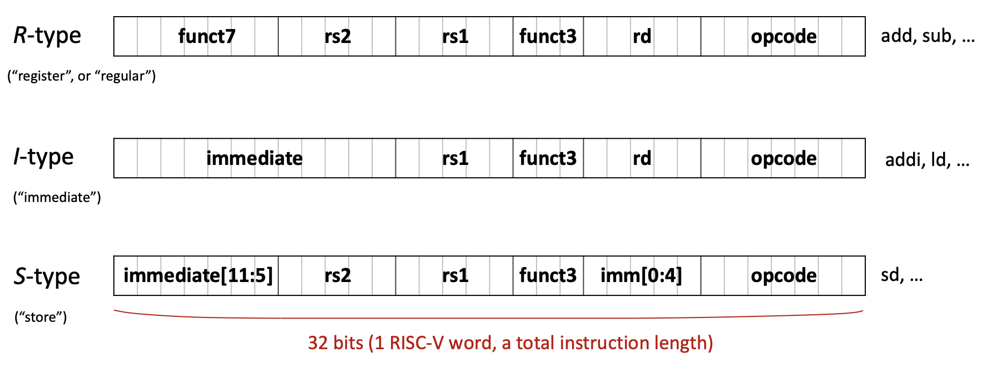{fig-align="center" width=80%}

| imm[11:5] (7) | rs2 (5) | rs1 (5) | funct3 (3) | imm[4:0] (5) | opcode (7) |
|:--------------|:--------|:--------|:-----------|:-------------|:-----------|

*   для: `sw`, `sd`, `sb`, …
*   **immediate** разбит на два поля

**B-type (Branch):** условные переходы

| imm[12\|10:5] (7) | rs2 (5) | rs1 (5) | funct3 (3) | imm[4:1\|11] (5) | opcode (7) |
|:------------------|:--------|:--------|:-----------|:-----------------|:-----------|

*   для: `beq`, `bne`, `blt`, `bge`, …
*   **immediate** кодирует смещение ветки (со сдвигом)

**U-type (Upper immediate):** большие константы

| imm[31:12] (20) | rd (5) | opcode (7) |
|:----------------|:-------|:-----------|

*   для: `lui`, `auipc`
*   20 бит старших разрядов

**J-type (Jump):** безусловный переход

| imm[20\|10:1\|11\|19:12] (20) | rd (5) | opcode (7) |
|:------------------------------|:-------|:-----------|

*   для: `jal`
*   20-битное смещение

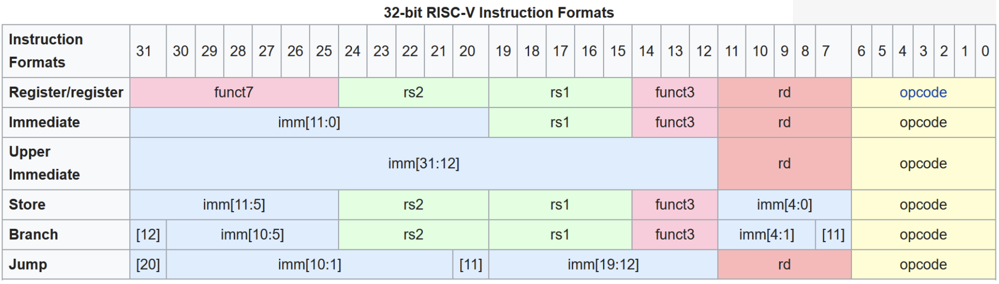{fig-align="center" width=80%}

###### **1.3.2 Пример: от C к двоичному коду**
Проследим `A[30] = h + A[30] + 1`, где `h` в `x21`, база массива `A` в `x18`.

**Шаг 1: назначение регистров**

*   `h` → `x21`
*   база `A` → `x18`
*   временный → `x5`

**Шаг 2: ассемблер**

```assembly
ld x5, 240(x18)    # Load A[30] (offset = 30 × 8 = 240 bytes for doubleword)
add x5, x21, x5    # x5 = h + A[30]
addi x5, x5, 1     # x5 = h + A[30] + 1
sd x5, 240(x18)    # Store result back to A[30]
```

**Шаг 3: типы инструкций**

*   `ld` → I-type
*   `add` → R-type
*   `addi` → I-type
*   `sd` → S-type

**Шаг 4: двоичное кодирование (пример `ld x5, 240(x18)`)**

*   **opcode** `ld`: 0000011 (3)
*   **rd**: 00101 (5)
*   **funct3** для doubleword: 011
*   **rs1**: 10010 (18)
*   **immediate**: 000011110000 (240)

Итоговая строка битов: `000011110000 10010 011 00101 0000011`

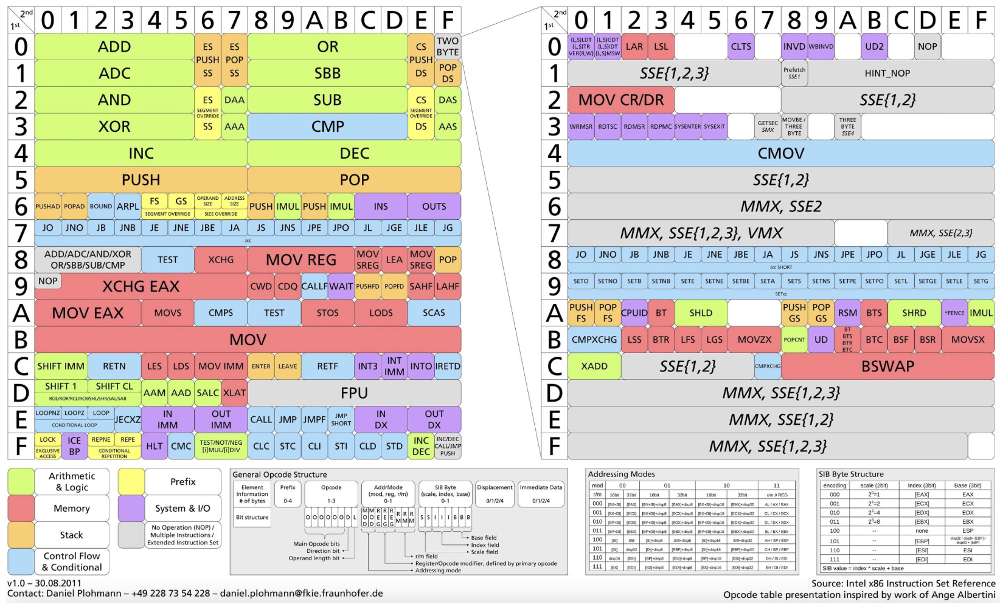{fig-align="center" width=80%}

##### **1.4 Однотактный процессор**
**Single-cycle processor** выполняет каждую инструкцию за один такт. Удобно для понимания, но накладывает ограничения и мотивирует **pipelining**.

###### **1.4.1 Напоминание: архитектура RISC-V**

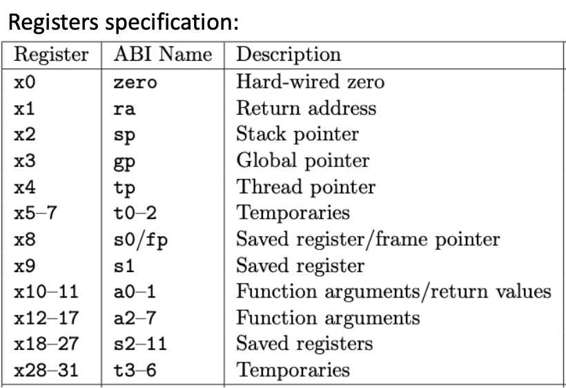{fig-align="center" width=80%}

**Ключевые черты:**

*   **Тип архитектуры:** RISC (Reduced Instruction Set Computer)
*   **Память:** **load-store** (к памяти только load/store)
*   **Стандарт:** открытая архитектура
*   **Адресное пространство:** 32 или 64 бита
*   **Размер инструкции:** фиксированные 32 бита
*   **Регистры:** 32 целочисленных (x0–x31) + 32 **floating-point** (f0–f31)
*   **Особый регистр:** **PC (Program Counter)**

###### **1.4.2 Program Counter (PC)**
**Program Counter** — специальный регистр с адресом **следующей** инструкции. От него зависит поток управления.

**Факты о PC:**

*   хранит адрес следующей инструкции;
*   после каждой инструкции увеличивается на 4 (все инструкции по 4 байта);
*   ветки и переходы меняют PC.

###### **1.4.3 Harvard vs Von Neumann**
Две базовые схемы памяти:

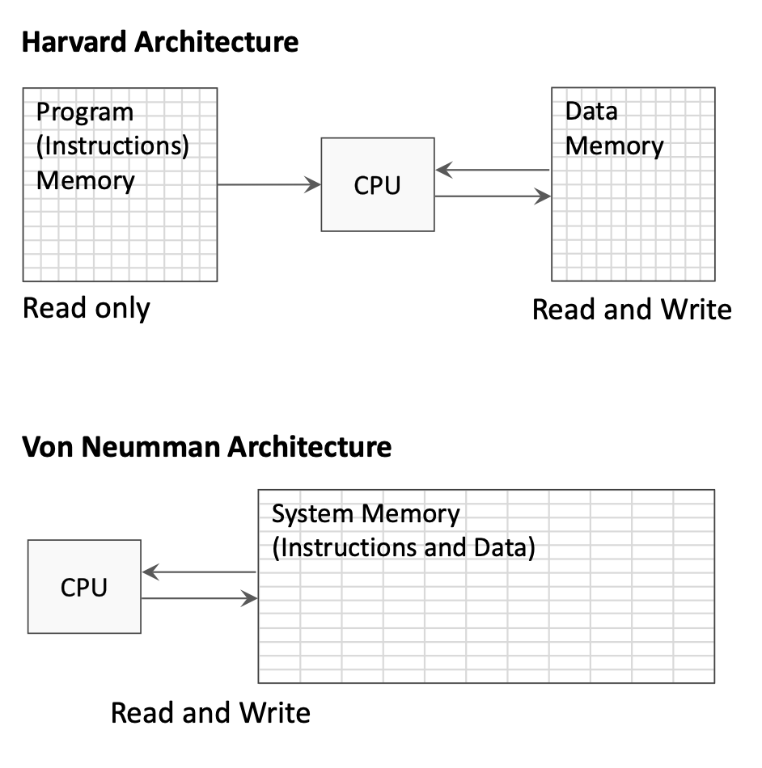{fig-align="center" width=80%}

**Harvard architecture:**

*   раздельные адресные пространства для команд и данных;
*   память команд при выполнении только читается;
*   память данных — чтение и запись;
*   можно одновременно выбирать команду и обращаться к данным.

**Von Neumann architecture:**

*   единая память для команд и данных;
*   проще, но возможен конфликт по шине;
*   команды и данные делят шину.

На схемах **single-cycle** часто показывают раздельные **instruction** и **data memory** (стиль **Harvard**) для наглядности.

###### **1.4.4 Стадии выполнения инструкции**
Каждая инструкция проходит стадии; в **single-cycle** все стадии укладываются в один такт:

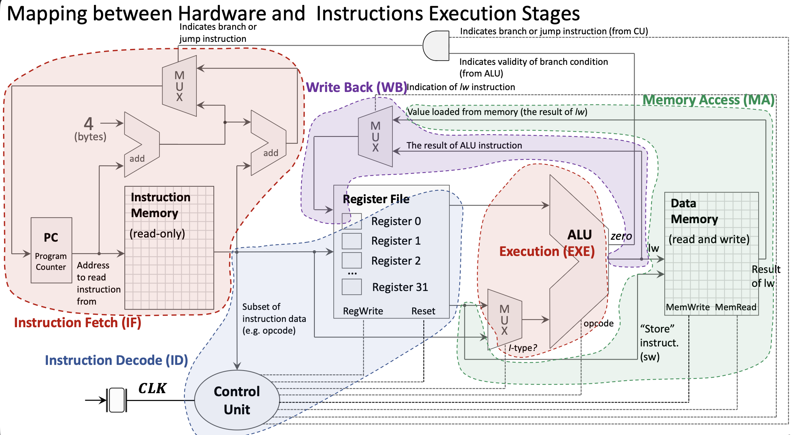{fig-align="center" width=80%}

**1. Instruction Fetch (IF):**

*   PC подаёт адрес в **Instruction Memory**;
*   возвращается 32-битная инструкция;
*   параллельно PC + 4.

**2. Instruction Decode (ID):**

*   поля инструкции разводятся по блокам;
*   **register file** читает **rs1**, **rs2**;
*   **Control Unit** по **opcode** выдаёт управляющие сигналы;
*   **immediate** извлекается и **sign-extended**.

**3. Execution (EXE):**

*   **ALU** выполняет операцию;
*   для R-type — два регистра;
*   для I-type — регистр и **immediate**;
*   **MUX** выбирает второй вход **ALU**.

**4. Memory Access (MA):**

*   только у load/store;
*   `lw`/`ld`: чтение **Data Memory**;
*   `sw`/`sd`: запись в **Data Memory**;
*   остальные инструкции обходят эту стадию.

**5. Write Back (WB):**

*   результат пишется в регистр назначения;
*   источник — **ALU** или память;
*   **MUX** выбирает источник.

###### **1.4.5 Control Unit**
**Control Unit (CU)** декодирует **opcode** и задаёт сигналы **datapath**:

*   **ALU control:** какая операция **ALU**;
*   **ALUSrc:** регистр или **immediate** на вход **ALU**;
*   **MemRead/MemWrite:** доступ к **Data Memory**;
*   **RegWrite:** запись в **register file**;
*   **MemtoReg:** что писать обратно — результат **ALU** или из памяти;
*   **Branch:** признак ветвления.

###### **1.4.6 Реализация ветвления**
Особая обработка веток:

{fig-align="center" width=80%}

**Адрес ветки:**

*   **immediate** извлекается и сдвигается (смещения кратны 2);
*   цель ветки = PC + (**immediate** × 2).

**Условие:**

*   **ALU** считает rs1 − rs2;
*   выход **Zero** — проверка равенства;
*   **AND** объединяет сигнал **Branch** и результат условия.

**Обновление PC:**

*   **MUX** выбирает PC+4 или адрес ветки.

###### **1.4.7 Доступ к памяти для load/store**
**Store Word (`sw`):**

1.  **ALU**: адрес = rs1 + offset;
2.  значение **rs2** на порт записи **Data Memory**;
3.  **MemWrite** разрешает запись.

**Load Word (`lw`):**

1.  **ALU**: адрес = rs1 + offset;
2.  **MemRead** включает чтение;
3.  **MUX** для **write-back** берёт значение из памяти;
4.  запись в регистр назначения.

###### **1.4.8 Полный однотактный datapath**

{fig-align="center" width=80%}

В состав входят:

*   **PC:** адрес текущей инструкции;
*   **Instruction Memory:** код программы;
*   **Register File:** 32 целочисленных регистра, 2 чтения и 1 запись;
*   **ALU:** арифметика и логика;
*   **Data Memory:** данные;
*   **Control Unit:** управляющие сигналы;
*   **Multiplexers:** выбор путей данных;
*   **Adders:** PC+4 и цели ветвлений.

###### **1.4.9 Тактирование**
Все элементы состояния (PC, регистры, памяти) синхронизируются **clock**:

*   **rising edge:** фиксация новых значений;
*   период такта: не короче самой медленной инструкции (часто **load**);
*   **reset:** начальный адрес PC.

Ограничение **single-cycle:** период определяется худшей инструкцией, быстрые инструкции «ждут» зря.

##### **1.5 Введение в pipelining**
**Pipelining** повышает **throughput**, перекрывая выполнение инструкций.

###### **1.5.1 Идея pipelining**

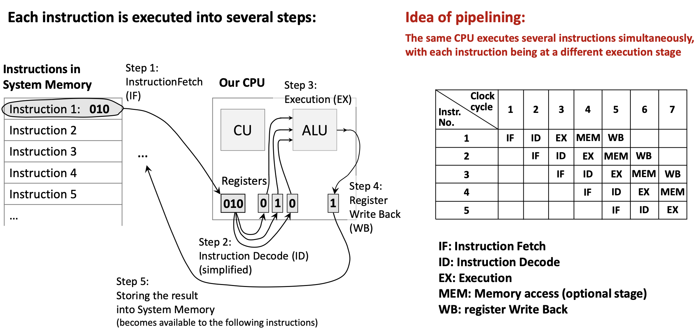{fig-align="center" width=80%}

**Аналогия:** конвейер на заводе — пока одна деталь красится, другая собирается; каждая деталь не ускоряется, но в единицу времени готово больше изделий.

**В процессоре:**

*   у каждой инструкции те же стадии (IF, ID, EXE, MEM, WB);
*   разные инструкции одновременно на разных стадиях;
*   пока инструкция 1 в ID, инструкция 2 может быть в IF;
*   в идеале **throughput** растёт примерно с глубиной конвейера.

**Плюсы:**

*   выше число инструкций в секунду;
*   лучше загрузка блоков.

**Сложности:**

*   **data hazards:** нужны данные от ещё не завершённой инструкции;
*   **control hazards:** ветвления рвут конвейер;
*   **structural hazards:** конфликт ресурсов.

**Pipelining** почти не снижает **latency** одной инструкции, но сильно повышает **throughput**.

***

#### **2. Определения**
*   **Floating-Point Number**: представление числа со знаком, мантиссой (**significand**) и порядком по IEEE 754; большой динамический диапазон.
*   **Single-Precision**: 32 бита **float**, около 7 десятичных значащих цифр.
*   **Double-Precision**: 64 бита **double**, около 15–16 значащих цифр.
*   **Floating-Point Register**: один из 32 регистров f0–f31 только для **floating-point**.
*   **Compiler**: программа, переводящая исходный код в ассемблер с оптимизациями.
*   **Assembler**: программа, переводящая мнемоники в машинный код (**object files**).
*   **Linker**: объединяет **object files** и библиотеки, разрешает внешние ссылки.
*   **Loader**: компонент ОС, загружающий исполняемый файл в память.
*   **Object File**: бинарный выход **assembler**: код, данные, символы, **relocation**.
*   **Opcode**: поле, задающее операцию.
*   **Instruction Format**: раскладка битов (R-type, I-type, S-type, …).
*   **R-type Instruction**: все операнды — регистры.
*   **I-type Instruction**: 12-бит **immediate**, арифметика с константой и **load**.
*   **S-type Instruction**: **store**, **immediate** разбит.
*   **Program Counter (PC)**: адрес следующей инструкции.
*   **Single-Cycle Processor**: одна инструкция за один такт.
*   **Datapath**: путь данных: регистры, **ALU**, память и т.д.
*   **Control Unit (CU)**: декодирование и управляющие сигналы.
*   **ALU (Arithmetic Logic Unit)**: арифметика и логика.
*   **Instruction Fetch (IF)**: выборка команды по адресу **PC**.
*   **Instruction Decode (ID)**: декодирование и чтение регистров.
*   **Execution (EXE)**: работа **ALU**.
*   **Memory Access (MA)**: обращение к памяти данных у **load/store**.
*   **Write Back (WB)**: запись результата в регистр.
*   **Harvard Architecture**: раздельная память команд и данных.
*   **Von Neumann Architecture**: единая память команд и данных.
*   **Multiplexer (MUX)**: выбор одного из входов по управлению.
*   **Pipelining**: перекрытие инструкций на разных стадиях.
*   **Throughput**: инструкций завершено в единицу времени.
*   **Latency**: время от начала до конца одной инструкции.

***

#### **3. Примеры**
##### **3.1. Перевод градусов Фаренгейта в Цельсии** (Лаба 11, Задание 1)
Напишите программу RISC-V с **floating-point**-инструкциями:
$$°C = (°F - 32.0) \times \frac{5.0}{9.0}$$

<details>
<summary>Нажмите, чтобы увидеть решение</summary>

**Ключевая идея:** использовать арифметику **float**; константы хранить в памяти и загружать в F-регистры.

**Функция:**

```assembly
.data:
const5:  .float 5.0      # Allocate float constant 5.0
const9:  .float 9.0      # Allocate float constant 9.0
const32: .float 32.0     # Allocate float constant 32.0

.text
f2c:                     # Function to convert Fahrenheit to Celsius
    flw f0, const5, t0   # f0 = 5.0f (t0 used as temp for address)
    flw f1, const9, t0   # f1 = 9.0f
    fdiv.s f0, f0, f1    # f0 = 5.0f / 9.0f
    flw f1, const32, t0  # f1 = 32.0f
    fsub.s f10, f10, f1  # f10 = fahr - 32.0f (input in f10)
    fmul.s f10, f0, f10  # f10 = (5.0f/9.0f) * (fahr - 32.0f)
    ret                  # Return (result in f10)
```

**Полная программа с `main`:**

```assembly
.data:
const5:  .float 5.0
const9:  .float 9.0
const32: .float 32.0

.text
main:
    li a7, 6             # System call code to read a float
    ecall                # Execute system call (input stored in fa0)
    fmv.s f10, fa0       # Move input to f10 (Note: f10 IS fa0, so this is redundant!)
    call f2c             # Call conversion function
    li a7, 2             # System call code to print a float
    ecall                # Print result (fa0 = f10 already contains result)
    li a7, 10            # System call code to exit
    ecall                # Exit program

f2c:
    flw f0, const5, t0
    flw f1, const9, t0
    fdiv.s f0, f0, f1
    flw f1, const32, t0
    fsub.s f10, f10, f1
    fmul.s f10, f0, f10
    ret
```

**Вопрос для размышления:** зачем `fmv.s f10, fa0` избыточен?

**Ответ:** `f10` и `fa0` — один и тот же физический регистр; имя **ABI** `fa0` — псевдоним для `f10`, копирование не меняет биты.

**Пошагово:**

1.  **Ввод:** системный вызов 6 кладёт **float** в `fa0` (= `f10`).
2.  **Вызов `f2c`:** аргумент уже в `f10`.
3.  **Внутри `f2c`:** константы из памяти, $5/9$, вычитание 32, умножение.
4.  **Вывод:** системный вызов 2 печатает значение из `fa0` / `f10`.

**Ответ:** при 212°F программа выводит 100.0 (кипение воды по Цельсию).

</details>

##### **3.2. Площадь поверхности и объём шара** (Лаба 11, Задание 2)
Программа RISC-V по формулам:
$$\text{surfaceArea} = 4.0 \times \pi \times r^2$$
$$\text{volume} = \frac{4.0}{3.0} \times \pi \times r^3$$

Подсказка: примите $\pi = 3.14159$

<details>
<summary>Нажмите, чтобы увидеть решение</summary>

**Ключевая идея:** степени через умножение ($r^2$, $r^3$) и константы из `.data`.

```assembly
.data
pi:      .float 3.14159
four:    .float 4.0
three:   .float 3.0
sa_msg:  .asciiz "Surface Area: "
vol_msg: .asciiz "\nVolume: "
prompt:  .asciiz "Enter radius: "

.text
main:
    # Print prompt
    li a7, 4
    la a0, prompt
    ecall
    
    # Read radius from user
    li a7, 6
    ecall
    fmv.s f10, fa0           # f10 = radius
    
    # Load constants
    flw f0, pi, t0           # f0 = pi
    flw f1, four, t0         # f1 = 4.0
    flw f2, three, t0        # f2 = 3.0
    
    # Calculate r^2
    fmul.s f3, f10, f10      # f3 = r * r = r^2
    
    # Calculate r^3
    fmul.s f4, f3, f10       # f4 = r^2 * r = r^3
    
    # Calculate surface area: 4.0 * pi * r^2
    fmul.s f5, f1, f0        # f5 = 4.0 * pi
    fmul.s f5, f5, f3        # f5 = 4.0 * pi * r^2 (surface area)
    
    # Calculate volume: (4.0/3.0) * pi * r^3
    fdiv.s f6, f1, f2        # f6 = 4.0 / 3.0
    fmul.s f6, f6, f0        # f6 = (4.0/3.0) * pi
    fmul.s f6, f6, f4        # f6 = (4.0/3.0) * pi * r^3 (volume)
    
    # Print surface area
    li a7, 4
    la a0, sa_msg
    ecall
    
    li a7, 2
    fmv.s fa0, f5            # Move surface area to fa0 for printing
    ecall
    
    # Print volume
    li a7, 4
    la a0, vol_msg
    ecall
    
    li a7, 2
    fmv.s fa0, f6            # Move volume to fa0 for printing
    ecall
    
    # Exit
    li a7, 10
    ecall
```

**Пошагово:**

1.  радиус в `f10`;
2.  константы $\pi$, 4.0, 3.0;
3.  $r^2$, $r^3$;
4.  площадь $4\pi r^2$;
5.  объём $(4/3)\pi r^3$;
6.  вывод через **ecall**.

**Ответ:** при $r = 5.0$: площадь ≈ 314.159, объём ≈ 523.599.

</details>

##### **3.3. Вычисление $f(x)$** (Лаба 11, Задание 3)
$$f(x) = \frac{e^2}{\pi} \cdot x$$

Подсказка: $\pi = 3.14159$, $e = 2.71828$

<details>
<summary>Нажмите, чтобы увидеть решение</summary>

**Ключевая идея:** вычислить $e^2$, затем $e^2/\pi$, затем умножить на $x$.

```assembly
.data
pi:      .float 3.14159
e:       .float 2.71828
prompt:  .asciiz "Enter x: "
result:  .asciiz "f(x) = "

.text
main:
    # Print prompt
    li a7, 4
    la a0, prompt
    ecall
    
    # Read x from user
    li a7, 6
    ecall
    fmv.s f10, fa0           # f10 = x
    
    # Load constants
    flw f0, e, t0            # f0 = e
    flw f1, pi, t0           # f1 = pi
    
    # Calculate e^2
    fmul.s f2, f0, f0        # f2 = e * e = e^2
    
    # Calculate e^2 / pi
    fdiv.s f3, f2, f1        # f3 = e^2 / pi
    
    # Calculate f(x) = (e^2 / pi) * x
    fmul.s f4, f3, f10       # f4 = (e^2 / pi) * x
    
    # Print result message
    li a7, 4
    la a0, result
    ecall
    
    # Print result value
    li a7, 2
    fmv.s fa0, f4
    ecall
    
    # Exit
    li a7, 10
    ecall
```

**Пошагово:** ввод $x$; константы; `fmul.s` для $e^2$; `fdiv.s` для $e^2/\pi$; `fmul.s` на $x$.

**Ответ:** при $x = 1.0$: $e^2 \approx 7.389$, $e^2/\pi \approx 2.351$, $f(1.0) \approx 2.351$.

</details>

##### **3.4. Выражение на C → RISC-V** (Лекция 11, Пример 1)
Переведите `A[30] = h + A[30] + 1` в ассемблер RISC-V и в двоичный машинный код.

Допущения:

- `h` в `x21`;
- база `A` в `x18`;
- элементы `A` — 64-битные **doublewords**.

<details>
<summary>Нажмите, чтобы увидеть решение</summary>

**Ключевая идея:** загрузка, арифметика, сохранение.

**Шаг 1: ассемблер**

```assembly
ld x5, 240(x18)    # Load A[30] into x5 (offset = 30 × 8 = 240)
add x5, x21, x5    # x5 = h + A[30]
addi x5, x5, 1     # x5 = h + A[30] + 1
sd x5, 240(x18)    # Store result back to A[30]
```

**Шаг 2: типы**

| Инструкция | Тип | Формат |
|:------------|:-----|:-------|
| `ld x5, 240(x18)` | I-type | immediate \| rs1 \| funct3 \| rd \| opcode |
| `add x5, x21, x5` | R-type | funct7 \| rs2 \| rs1 \| funct3 \| rd \| opcode |
| `addi x5, x5, 1` | I-type | immediate \| rs1 \| funct3 \| rd \| opcode |
| `sd x5, 240(x18)` | S-type | imm[11:5] \| rs2 \| rs1 \| funct3 \| imm[4:0] \| opcode |

**Шаг 3: `ld x5, 240(x18)` в двоичный вид**

*   **opcode** `ld`: 0000011 (3)
*   **rd** = x5: 00101 (5)
*   **funct3**: 011 (3)
*   **rs1** = x18: 10010 (18)
*   **immediate** 240: 000011110000

Двоичная строка: `000011110000 10010 011 00101 0000011`

**Шаг 4: `add x5, x21, x5`**

*   **opcode** R-type: 0110011 (51)
*   **rd** x5: 00101; **funct3** add: 000; **rs1** x21: 10101; **rs2** x5: 00101; **funct7** add: 0000000

`0000000 00101 10101 000 00101 0110011`

**Шаг 5: `addi x5, x5, 1`**

*   **opcode** I-type арифметики: 0010011 (19); **immediate** 1: 000000000001

`000000000001 00101 000 00101 0010011`

**Шаг 6: `sd x5, 240(x18)`**

*   **opcode** S-type: 0100011 (35); **funct3**: 011; **rs1** x18; **rs2** x5; **immediate** 240: imm[11:5]=0000111, imm[4:0]=10000

`0000111 00101 10010 011 10000 0100011`

**Ответ:** полный набор битовых строк:

```
ld x5, 240(x18):   000011110000 10010 011 00101 0000011
add x5, x21, x5:   0000000 00101 10101 000 00101 0110011
addi x5, x5, 1:    000000000001 00101 000 00101 0010011
sd x5, 240(x18):   0000111 00101 10010 011 10000 0100011
```

</details>

##### **3.5. Какие стадии используются** (Лекция 11, Пример 2)
Для каждой инструкции укажите задействованные стадии:

a) `add x5, x6, x7`
b) `lw x5, 0(x6)`
c) `sw x5, 0(x6)`
d) `beq x5, x6, label`

<details>
<summary>Нажмите, чтобы увидеть решение</summary>

**Ключевая идея:** наборы стадий IF, ID, EXE, MA, WB различаются по типу инструкции.

**(a) `add x5, x6, x7`** (арифметика R-type)

| Стадия | Есть? | Действие |
|:------|:------|:---------|
| IF | ✓ | выборка команды |
| ID | ✓ | чтение x6, x7 |
| EXE | ✓ | **ALU**: x6 + x7 |
| MA | ✗ | память не нужна |
| WB | ✓ | запись в x5 |

**(b) `lw x5, 0(x6)`**

| Стадия | Есть? | Действие |
|:------|:------|:---------|
| IF | ✓ | выборка |
| ID | ✓ | база x6 |
| EXE | ✓ | адрес x6 + 0 |
| MA | ✓ | чтение памяти |
| WB | ✓ | запись в x5 |

**(c) `sw x5, 0(x6)`**

| Стадия | Есть? | Действие |
|:------|:------|:---------|
| IF | ✓ | выборка |
| ID | ✓ | значение x5, адрес x6 |
| EXE | ✓ | адрес |
| MA | ✓ | запись x5 в память |
| WB | ✗ | регистр не пишется |

**(d) `beq x5, x6, label`**

| Стадия | Есть? | Действие |
|:------|:------|:---------|
| IF | ✓ | выборка |
| ID | ✓ | x5, x6; цель ветки |
| EXE | ✓ | сравнение (**ALU** вычитанием) |
| MA | ✗ | |
| WB | ✗ | |

**Ответ:**

- `add`: IF, ID, EXE, WB
- `lw`: IF, ID, EXE, MA, WB
- `sw`: IF, ID, EXE, MA
- `beq`: IF, ID, EXE

</details>

##### **3.6. Трассировка конвейера** (Лекция 11, Пример 3)
Как выполняется последовательность в 5-стадийном **pipeline**:

```assembly
add x1, x2, x3
sub x4, x5, x6
and x7, x8, x9
or x10, x11, x12
```

<details>
<summary>Нажмите, чтобы увидеть решение</summary>

**Ключевая идея:** инструкции «ступенькой» продвигаются по стадиям; новые входят сзади.

| Такт | 1 | 2 | 3 | 4 | 5 | 6 | 7 | 8 |
|:------------|:--|:--|:--|:--|:--|:--|:--|:--|
| `add` | IF | ID | EX | MA | WB | | | |
| `sub` | | IF | ID | EX | MA | WB | | |
| `and` | | | IF | ID | EX | MA | WB | |
| `or` | | | | IF | ID | EX | MA | WB |

**По тактам:** такт 1 — `add` в IF; … такт 8 — `or` завершает WB.

**Производительность:** без конвейера $4 \times 5 = 20$ тактов; с конвейером 8 тактов; ускорение $20/8 = 2.5\times$ (к длинной последовательности стремится к $5\times$).

**Ответ:** все четыре инструкции за 8 тактов; после заполнения конвейера завершается по одной инструкции за такт.

</details>

##### **3.7. Single-cycle и pipelined: задержки** (Лекция 11, Пример 4)
Задержки стадий:

- IF: 200 ps
- ID: 100 ps
- EX: 200 ps
- MA: 200 ps
- WB: 100 ps

Найти:

a) период такта **single-cycle**
b) период такта **pipelined**
c) ускорение на 100 инструкциях

<details>
<summary>Нажмите, чтобы увидеть решение</summary>

**Ключевая идея:** в **single-cycle** такт ≥ сумме стадий худшей инструкции; в **pipelined** такт ≥ максимуму стадии.

**(a) Период такта single-cycle:**

Такт должен вмещать все стадии любой инструкции:
$$T_{single} = IF + ID + EX + MA + WB = 200 + 100 + 200 + 200 + 100 = 800 \text{ ps}$$

**(b) Период такта pipelined:**

Ограничен самой медленной стадией:
$$T_{pipelined} = \max(IF, ID, EX, MA, WB) = \max(200, 100, 200, 200, 100) = 200 \text{ ps}$$

**(c) Ускорение на 100 инструкциях:**

**Single-cycle:**
$$\text{Time}_{single} = 100 \times 800 \text{ ps} = 80,000 \text{ ps}$$

**Pipelined:** первая инструкция занимает 5 тактов, затем по одной инструкции за такт:
$$\text{Time}_{pipelined} = (5 + 99) \times 200 \text{ ps} = 104 \times 200 = 20,800 \text{ ps}$$

**Speedup:**
$$\text{Speedup} = \frac{80,000}{20,800} \approx 3.85$$

**Ответ:** период **single-cycle:** 800 ps; **pipelined:** 200 ps; ускорение ≈ $3.85\times$ (при большом числе инструкций стремится к $800/200 = 4\times$).

</details>
