#### **1. Summary**
##### **1.1 Cache Basics**
###### **1.1.1 The Memory Wall Problem**

Modern computer systems face a fundamental performance bottleneck known as the **"Memory Wall"** problem. This issue arises from the growing disparity between CPU processing speed and memory access speed. Since the 1980s, CPU performance has improved exponentially—roughly doubling every 18-24 months according to Moore's Law. However, system memory (RAM) performance has improved much more slowly, creating an ever-widening **processor-memory performance gap**.

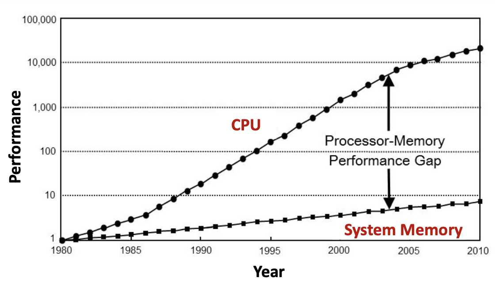{width=70%}

The graph above illustrates this critical problem: by 2010, CPUs had become approximately 10,000 times faster than they were in 1980, while system memory had only improved by a factor of about 7. This gap means that even the fastest CPU must frequently wait for data from relatively slow main memory, creating a severe performance bottleneck.

###### **1.1.2 The Memory Hierarchy**

To address the Memory Wall problem, modern computer systems employ a **memory hierarchy**—a tiered structure of different memory technologies, each optimized for specific trade-offs between speed, capacity, and cost.

The hierarchy, from fastest to slowest, consists of:

1. **CPU Registers**: The fastest storage, located directly inside the processor
2. **Cache Memory (L1, L2, L3)**: Small, extremely fast memory built using SRAM technology
3. **System Memory (RAM)**: Larger but slower memory built using DRAM technology
4. **Storage Devices (SSD/HDD)**: Very large but much slower persistent storage

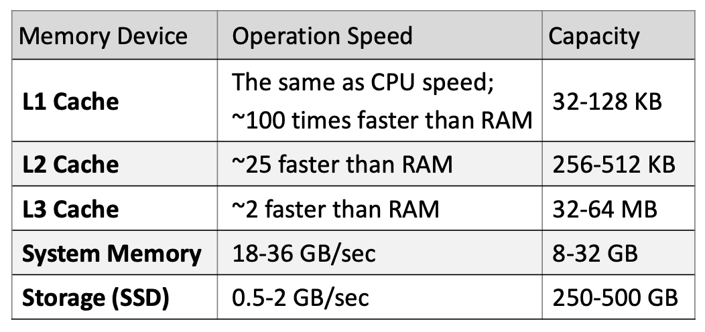{width=70%}

The key characteristics of this hierarchy:

- **Access speed increases** as you move up the hierarchy (toward the CPU)
- **Storage capacity increases** as you move down the hierarchy (toward storage devices)

Each level of cache has dramatically different performance characteristics:

- **L1 Cache**: Operates at CPU speed (~100× faster than RAM), capacity 32-128 KB
- **L2 Cache**: ~25× faster than RAM, capacity 256-512 KB
- **L3 Cache**: ~2× faster than RAM, capacity 32-64 MB
- **System Memory**: 18-36 GB/sec transfer rate, capacity 8-32 GB
- **Storage (SSD)**: 0.5-2 GB/sec transfer rate, capacity 250-500 GB

###### **1.1.3 SRAM vs DRAM Technologies**

The memory hierarchy uses two fundamentally different technologies:

**SRAM (Static Random Access Memory)**:

- Used for: CPU registers and cache (L1, L2, L3)
- Storage element: **Flip-flop (latch)** circuit
- Characteristics: Very fast, expensive, lower capacity, complex organization
- Power: Lower consumption, no leakage
- Reliability: More reliable

**DRAM (Dynamic Random Access Memory)**:

- Used for: System memory (main RAM)
- Storage element: **Capacitor**
- Characteristics: Slower, cheaper, higher capacity, simpler organization
- Power: Higher consumption, significant leakage (requires periodic refresh)
- Reliability: Less reliable

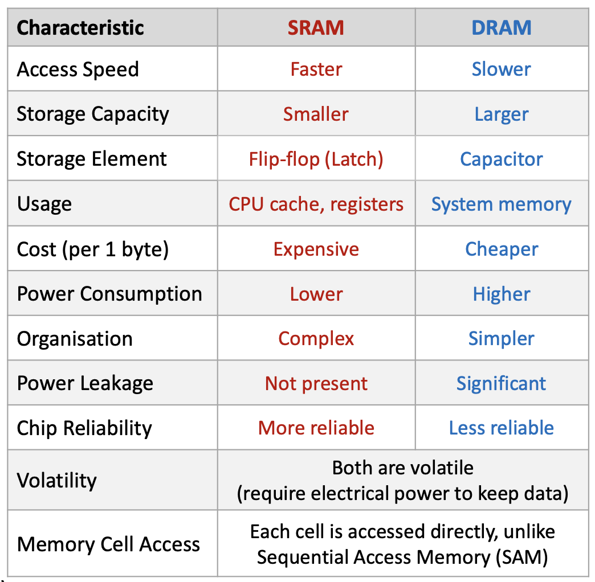{width=80%}

Both are **volatile** (lose data when power is removed) and both provide **random access** (can access any memory location directly, unlike sequential access devices like tape drives).

DRAM's capacitor-based design requires special circuitry. The **memory controller** continuously refreshes DRAM cells every few milliseconds to compensate for capacitor leakage—charge gradually escapes from the capacitors, so they must be periodically recharged to maintain data.

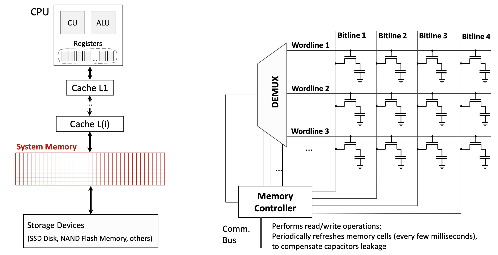{width=90%}

The diagram above shows how DRAM is organized: a matrix of wordlines and bitlines, where each intersection contains a transistor and capacitor forming a memory cell. The Memory Controller manages read/write operations and periodic refreshes.

###### **1.1.4 Principles of Locality**

The memory hierarchy works effectively because of two fundamental principles describing how programs access memory:

**Spatial Locality**: If a program accesses data at address $X$, it is likely to soon access data at nearby addresses (e.g., $X+1$, $X+2$, etc.). This occurs naturally when:

- Iterating through arrays
- Executing sequential instructions (the next instruction is usually at the next memory address)

**Temporal Locality**: If a program accesses data at address $X$, it is likely to access that same address again in the near future. This occurs naturally when:

- Executing loop iterations (the same instructions run repeatedly)
- Accessing frequently used variables
- Reusing recently computed values

These principles mean that **programs access a very small portion of their address space at any given time**, not all data simultaneously. This makes caching effective: by keeping recently used data (temporal locality) and nearby data (spatial locality) in fast cache memory, we can satisfy most memory requests without accessing slow main memory.

Modern **compilers actively facilitate** these principles by:

- Reordering instructions to improve locality
- Arranging data structures for better cache utilization
- Unrolling loops to access consecutive memory locations

###### **1.1.5 The Goal of Memory Hierarchy**

The fundamental objective of the memory hierarchy is to **create an illusion that there is as much memory as in storage (hundreds of GB), but with access speed as high as CPU cache** (nearly instantaneous). This allows programs to work with large datasets while maintaining high performance—the best of both worlds.

This illusion works because of the locality principles: since programs only actively use a small subset of their data at any moment, we can keep that "working set" in fast cache while the bulk of data resides in slower, larger memory.

###### **1.1.6 Cache Structure and Terminology**

A **cache** is organized as a collection of **blocks** (also called **cache lines**). Each block contains:

1. **Block Index**: A unique identifier for the cache location (e.g., 00, 01, 10, 11 for a 4-block cache)
2. **Validity Flag**: Indicates whether the block contains valid/initialized data (Y/N)
3. **Address Tag**: The upper portion of the memory address for the data stored in this block
4. **Data Field**: The actual data words copied from main memory

When the CPU requests data from memory address $A$, the address is split into two parts:

- **Lower bits** become the **Block Index** (which cache block to check)
- **Upper bits** become the **Address Tag** (which memory location the block represents)

The concatenation of the address tag and block index forms the complete memory address.

###### **1.1.7 Cache Hits and Misses**

When the CPU requests data, one of two outcomes occurs:

**Cache Hit**: The requested data is found in the cache

- The cache block index is valid (Validity Flag = Y)
- The address tag matches the requested tag
- The data is immediately loaded into CPU registers
- **No penalty**—execution continues at full speed

**Cache Miss**: The requested data is NOT found in the cache

- Either the validity flag is N, or the address tag doesn't match
- The cache must fetch the data from a lower-level cache or main memory
- The **entire data block** containing the requested data is copied into the cache
- This incurs a **cache miss penalty**—the time required to:
  - Access the lower-level cache/memory
  - Transfer the block to the higher-level cache
  - Insert the block into the cache
  - Pass the requested data to the CPU

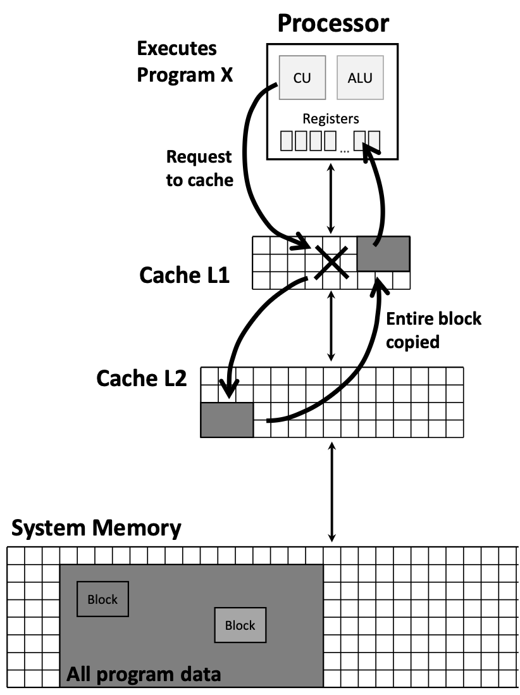{width=90%}

The diagram above illustrates the hierarchical flow: when the CPU requests data, it first checks the fastest cache (L1). On a miss, it checks successively slower caches (L2, L3...) until reaching system memory. When found, the entire block is copied back up through the hierarchy.

###### **1.1.8 Cache Performance Metrics**

Three key metrics evaluate cache effectiveness:

1. **Cache Hit Rate**: The percentage of memory accesses satisfied by the cache (typically >95% for modern systems)
2. **Cache Miss Rate**: The percentage of memory accesses that miss the cache  
   $$\text{Miss Rate} = 1 - \text{Hit Rate}$$
3. **Cache Miss Penalty**: The time cost of a cache miss, typically ~100 CPU cycles

Even a small miss rate can significantly impact performance due to the high miss penalty. For example, with a 5% miss rate and 100-cycle penalty, approximately 5 out of every 100 memory accesses will stall the CPU for 100 cycles.

###### **1.1.9 Memory Consistency Principle**

The memory hierarchy maintains a crucial invariant: **If a data block is present at a higher-level cache (e.g., L1), then it must also be present at all lower-level caches (e.g., L2, L3)**.

This ensures data consistency across the hierarchy—the CPU doesn't access stale data, and all cache levels maintain a coherent view of memory.

###### **1.1.10 Direct-Mapped Cache**

In a **direct-mapped cache**, each memory address maps to exactly one possible cache block location. The mapping is determined by the lower bits of the memory address (the block index).

For example, in a 4-block cache with 2-bit indices:

- Addresses ending in 00 (binary) map to Block 0
- Addresses ending in 01 map to Block 1
- Addresses ending in 10 map to Block 2
- Addresses ending in 11 map to Block 3

This creates a **conflict**: if a program repeatedly accesses addresses `01010` and `11010` (both map to Block 10), they will evict each other from the cache, causing repeated misses—even though other cache blocks might be empty.

**Alternative: Fully Associative Cache**

In a **fully associative cache**, any memory block can be placed in any cache block location. This eliminates conflicts but requires more complex hardware (must check all cache blocks for every access).

##### **1.2 CPU Pipelining**
###### **1.2.1 Instruction Execution Stages**

Every instruction in a RISC-V processor goes through five distinct execution stages, each using different hardware components:

1. **IF (Instruction Fetch)**: Read the instruction from instruction memory
   - Hardware: Program Counter (PC), Instruction Memory
   - Time: ~200 picoseconds (ps)
2. **ID (Instruction Decode)**: Decode the instruction and read register operands
   - Hardware: Register File, Sign-extend unit, Control Unit
   - Time: ~200 ps
3. **EX (Execution)**: Perform the actual computation
   - Hardware: ALU (Arithmetic Logic Unit)
   - Time: ~200 ps
4. **MA (Memory Access)**: Read from or write to data memory (if needed)
   - Hardware: Data Memory
   - Time: ~200 ps
   - Note: Not all instructions use this stage (e.g., ADD doesn't access memory)
5. **WB (Write Back)**: Write the result back to a register
   - Hardware: Register File (write port)
   - Time: ~200 ps
   - Note: Not all instructions write back (e.g., store instructions)

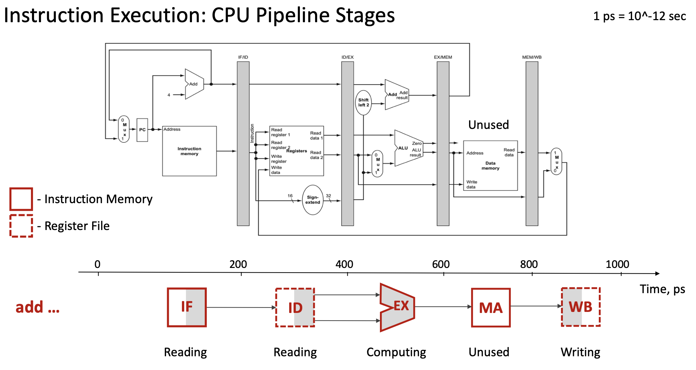{width=80%}

For a single instruction like `add x19, x0, x1`, the total execution time is 5 × 200 ps = 1000 ps (1 nanosecond).

###### **1.2.2 Pipeline Registers**

To enable pipelining, the processor inserts **pipeline registers** (also called **interstage registers**) between each execution stage:

- **IF/ID register**: Stores data between Instruction Fetch and Instruction Decode
- **ID/EX register**: Stores data between Instruction Decode and Execution
- **EX/MEM register**: Stores data between Execution and Memory Access
- **MEM/WB register**: Stores data between Memory Access and Write Back

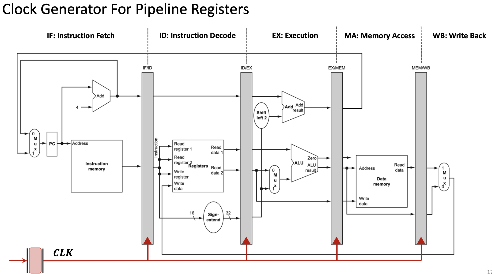{width=90%}

These registers are synchronized by the **clock signal (CLK)**. On each clock edge:

- Each pipeline register captures the output from the previous stage
- Each stage begins processing the data from its input register
- All stages work simultaneously on different instructions

###### **1.2.3 The Pipelining Concept**

**Pipelining** is a technique where multiple instructions execute simultaneously, with each instruction at a different stage of completion. Think of it like an assembly line in a factory:

- Station 1 (IF) works on instruction 5
- Station 2 (ID) works on instruction 4
- Station 3 (EX) works on instruction 3
- Station 4 (MA) works on instruction 2
- Station 5 (WB) works on instruction 1

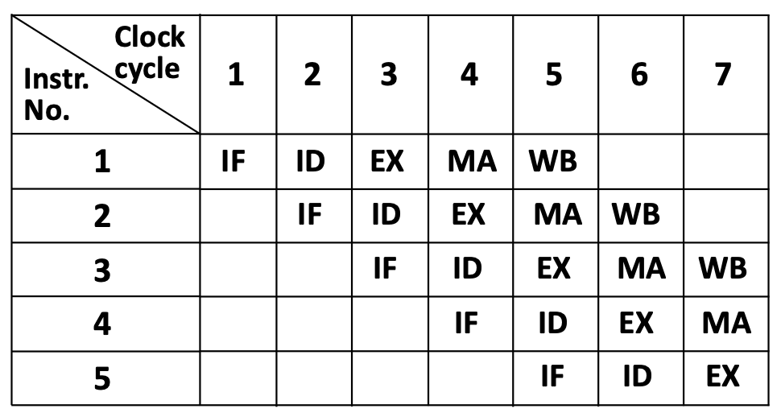{width=60%}

This table shows the "staircase" pattern of pipelining. In clock cycle 5, all five stages are active simultaneously, each processing a different instruction.

###### **1.2.4 Pipelining Advantages**

**Throughput Improvement**: Although each individual instruction still takes 5 stages to complete, pipelining drastically improves **throughput**—the number of instructions completed per unit time.

- **Without pipelining**: Complete 1 instruction every 1000 ps  
  Throughput = 1 instruction / 1000 ps = 1 billion instructions/second
- **With 5-stage pipelining**: Complete 1 instruction every 200 ps (after initial fill)  
  Throughput = 1 instruction / 200 ps = 5 billion instructions/second

**Ideal speedup**: With $N$ pipeline stages, the theoretical speedup approaches $N$ times. In practice, speedups of 3-4× are typical due to hazards and overhead.

###### **1.2.5 RISC-V Design Principles for Efficient Pipelining**

RISC-V's instruction set architecture was specifically designed to facilitate efficient pipelining:

**Principle 1: Fixed-Length Instructions**

All RISC-V instructions are exactly 32 bits long. This allows the IF stage to always fetch exactly 4 bytes, simplifying pipeline control.

**Principle 2: Few Instruction Formats with Minimal Differences**

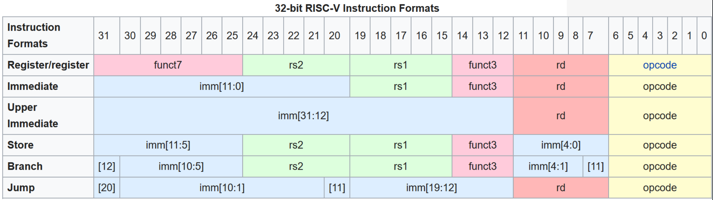{width=90%}

RISC-V has only 6 instruction formats (R-type, I-type, S-type, B-type, U-type, J-type), and critical fields (like opcode, rd, rs1, rs2) appear at the same bit positions across formats. This allows the ID stage to begin decoding before knowing the exact instruction type.

**Principle 3: Memory Operations Only in Load/Store Instructions**

Only load (`lw`, `ld`) and store (`sw`, `sd`) instructions access memory. Arithmetic instructions (`add`, `sub`, etc.) work only with registers. This simplifies the pipeline—the MA stage can be bypassed for most instructions.

###### **1.2.6 Pipeline Hazards**

Pipelining introduces complications called **hazards**—situations where the next instruction cannot execute in the next clock cycle.

**Data Hazard Example**:

Consider these two instructions:

```
A: add x19, x0, x1    // x19 = x0 + x1
B: sub x2, x19, x3    // x2 = x19 - x3
```

Instruction B depends on the result of instruction A (the value in register `x19`). However:

- Instruction A writes `x19` in its WB stage (clock cycle 5)
- Instruction B needs `x19` in its ID stage (clock cycle 3)

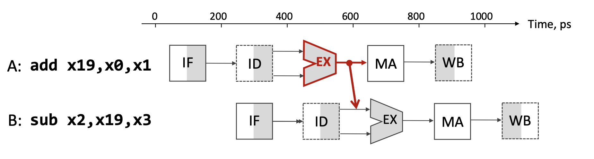{width=80%}

This creates a **data hazard**: instruction B would read the old value of `x19` before A writes the new value.

**Solutions to Data Hazards**:

1. **Stalling (Pipeline Bubble)**: Pause instruction B for several clock cycles until A completes WB. This works but wastes cycles.
2. **Forwarding (Bypassing)**: As soon as A completes its EX stage (clock cycle 3), forward the result directly to B's EX stage through a dedicated hardware path, bypassing the register file. This avoids most stalls and provides dramatic average speedup.
3. **Compiler Instruction Reordering**: The compiler can insert independent instructions between A and B to fill the delay slot, avoiding stalls entirely.

###### **1.2.7 Compiler Optimization for Pipelining**

Modern compilers optimize code to minimize pipeline stalls. Consider this C code:

```c
a = b + e;
c = b + f;
```

**Non-optimized assembly** (suffers stalls):

```assembly
lw  x1, 0(x31)    // Load b
lw  x2, 8(x31)    // Load e
add x3, x1, x2    // Stall waiting for x1, x2
sw  x3, 24(x31)   // Store a
lw  x4, 16(x31)   // Load f
add x5, x1, x4    // Stall waiting for x4
sw  x5, 32(x31)   // Store c
```

**Optimized assembly** (reordered to avoid stalls):

```assembly
lw  x1, 0(x31)    // Load b
lw  x2, 8(x31)    // Load e
lw  x4, 16(x31)   // Load f (moved up!)
add x3, x1, x2    // No stall—x1, x2 are ready
sw  x3, 24(x31)   // Store a
add x5, x1, x4    // No stall—x1, x4 are ready
sw  x5, 32(x31)   // Store c
```

By moving the third load instruction earlier, the compiler fills the delay slot created by the first two loads, eliminating stalls.

##### **1.3 GPU Architecture and Parallel Computing**
###### **1.3.1 Flynn's Taxonomy**

Michael Flynn (1966, 1972) classified computer architectures based on how they handle instructions and data streams:

| Architecture | Instructions | Data | Description |
|-------------|--------------|------|-------------|
| **SISD** | Single | Single | Traditional serial processor—one instruction operates on one data item at a time |
| **SIMD** | Single | Multiple | One instruction operates on multiple data items simultaneously (e.g., vector processors, GPUs) |
| **MISD** | Multiple | Single | Multiple instructions operate on the same data (rare; used for fault tolerance) |
| **MIMD** | Multiple | Multiple | Multiple independent processors executing different instructions on different data (multi-core CPUs) |

Modern computing uses primarily:

- **SISD**: Basic single-core CPU operation
- **SIMD**: GPUs, vector extensions (SSE, AVX)
- **MIMD**: Multi-core processors
- **SIMT** (Single Instruction Multiple Threads): NVIDIA's variant of SIMD combining multithreading with data parallelism

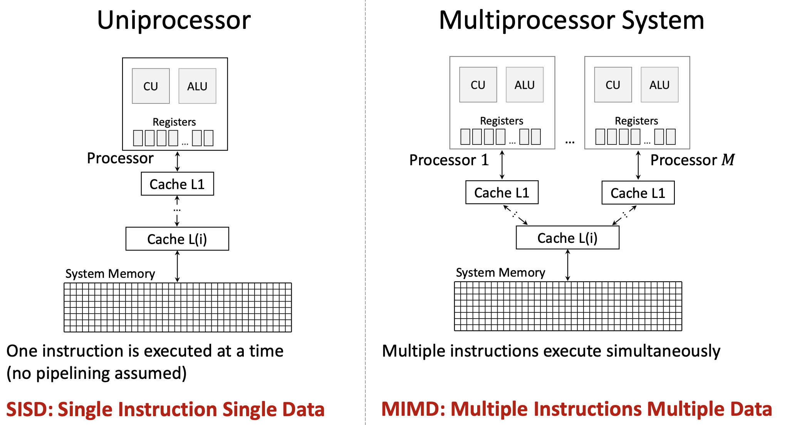{width=90%}

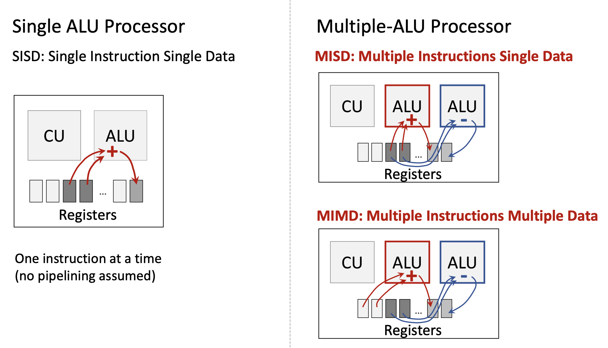{width=90%}

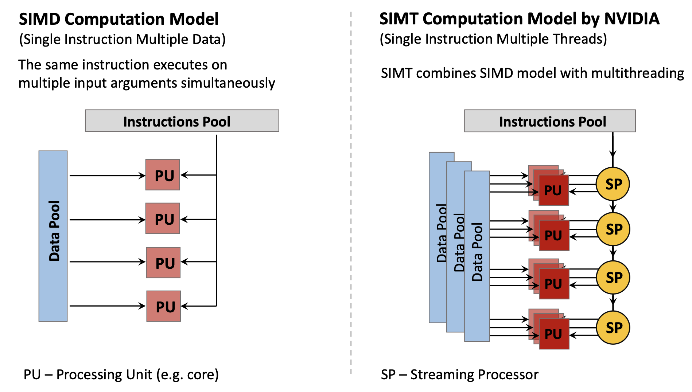{width=90%}

###### **1.3.2 CPU vs GPU Architectural Philosophy**

CPUs and GPUs have fundamentally different design philosophies:

**CPU Design (Latency-Optimized)**:

- Large control logic for complex instruction handling
- Large cache memory (L1/L2/L3) to reduce average latency
- Few but powerful cores (4-16 typical)
- Optimized for **serial task performance** and low latency
- Analogy: A sports car—fast for individual passengers (2 people at 200 km/hr)

**GPU Design (Throughput-Optimized)**:

- Minimal control logic (instructions are simple and uniform)
- Small cache (rely on memory bandwidth)
- Massive number of simple cores (hundreds to thousands)
- Optimized for **parallel data processing** and high throughput
- Analogy: A bus—slow for individuals but carries many (50 people at 50 km/hr)

The throughput of a bus (people × speed) is actually higher: 50 × 50 = 2,500 person-km/hr vs. 2 × 200 = 400 person-km/hr.

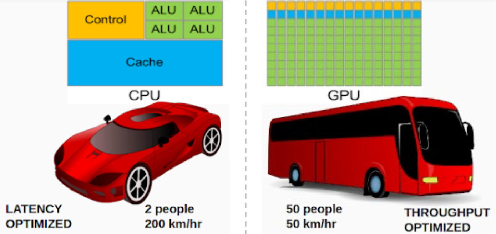{width=90%}

###### **1.3.3 The Processor-Memory Performance Gap and GPUs**

{width=70%}

The same Memory Wall problem that motivated caches also motivates GPUs. However, GPUs address it differently:

- **CPUs**: Use deep cache hierarchies to hide latency
- **GPUs**: Use massive parallelism—while some threads wait for memory, thousands of other threads continue computing

###### **1.3.4 GPU Motivation: Matrix Operations**

Modern graphics, scientific computing, and AI/ML workloads heavily involve matrix operations. Consider matrix multiplication $C = AB$:

$$c_{ij} = \sum_{\ell=1}^{n} a_{i\ell} b_{\ell j}$$

Key observations:

1. **Each output element is independent**—computing $c_{11}$ doesn't affect computing $c_{12}$
2. **All elements use the same operation**—multiply and accumulate
3. **Thousands of elements** need the same computation

This is perfect for SIMD parallelism: apply the same instruction simultaneously to many data elements.

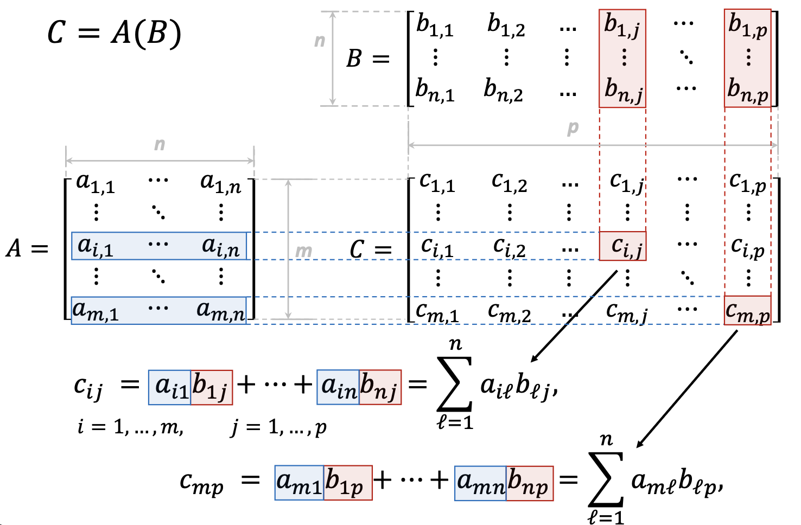{width=90%}

###### **1.3.5 NVIDIA GPU Architecture Example (Tesla/GeForce 8800)**

A typical NVIDIA GPU contains:

- **14 Streaming Multiprocessors (SMs)**: Each SM is a group of processing cores
- **8 Streaming Processors (SP cores) per SM**: Each SP is a simple ALU
- **112 total SP cores** (14 × 8)
- **10,752 concurrent threads** can be active simultaneously

Each SM contains:

- Multiple SP cores (the actual compute units)
- Shared memory (fast, shared among threads in a block)
- Instruction cache (I-Cache)
- Constant cache (C-Cache)
- Special Function Units (SFUs) for transcendental functions (sin, cos, etc.)

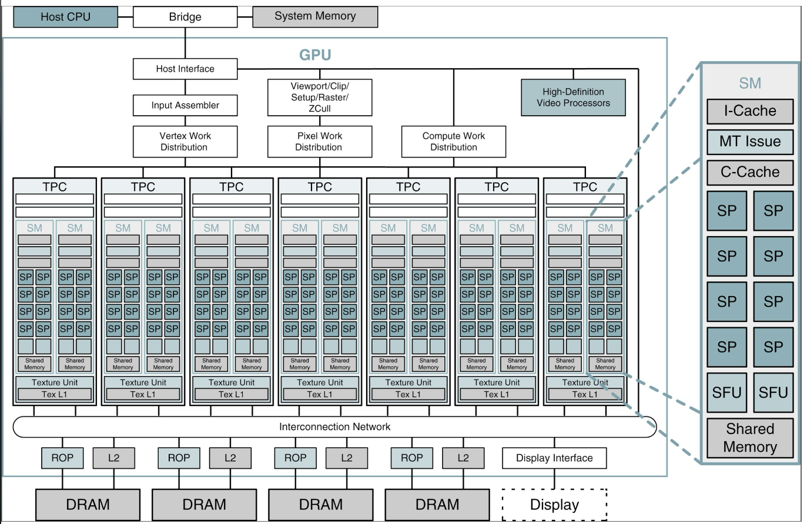{width=100%}

###### **1.3.6 GPU Programming Model: CUDA**

NVIDIA's CUDA (Compute Unified Device Architecture) programming model maps software concepts to hardware:

**Software Hierarchy**:

1. **Kernel**: A function that executes on the GPU, applied to many data elements
2. **Thread**: A single execution of the kernel (analogous to a single matrix element computation)
3. **Thread Block**: A group of threads that can cooperate and share data
4. **Grid**: A collection of thread blocks that execute the same kernel

**Hardware Mapping**:

- **Thread** → executes on one **SP core**
- **Thread Block** → executes on one **SM**
- **Grid** → executes on the entire **GPU**

For matrix multiplication $C = AB$ where $C$ is $m \times p$:

- Each element $c_{ij}$ is computed by one **thread**
- Threads are organized into **blocks** (e.g., 16×16 threads per block)
- Multiple **blocks** form a **grid** covering the entire matrix $C$

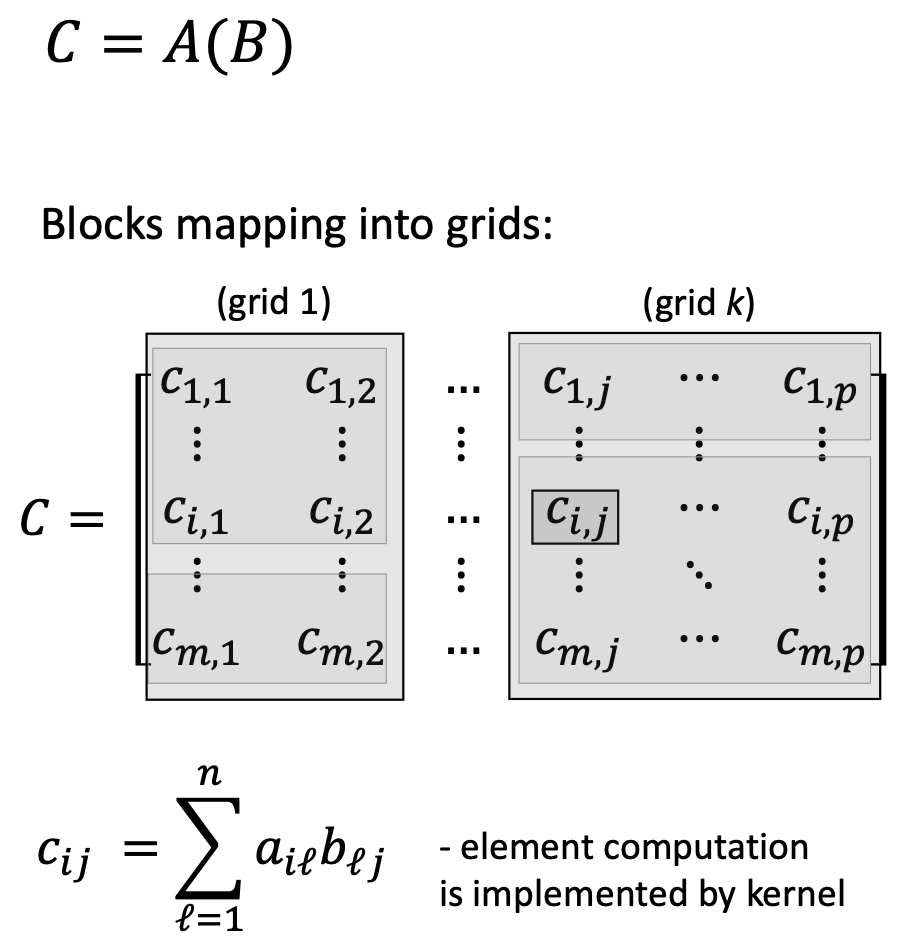{width=90%}

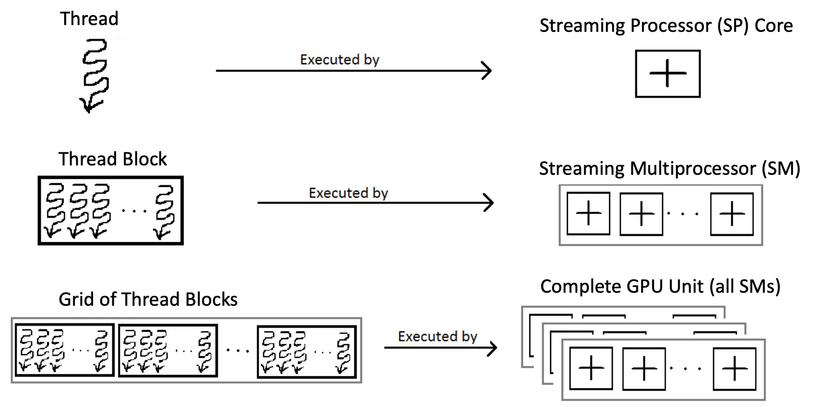{width=90%}

###### **1.3.7 GPU Memory Subsystem**

GPUs use a separate memory subsystem from the CPU:

**CPU Memory Subsystem**:

- System DRAM (8-32 GB)
- Connected to CPU via North Bridge chipset
- Bandwidth: ~6.4 GB/s

**GPU Memory Subsystem**:

- Graphics DRAM (dedicated GPU memory, 4-24 GB typical)
- Directly connected to GPU
- Bandwidth: Up to 35 GB/s (internal) or higher in modern GPUs

**Data Flow for GPU Computing**:

1. CPU allocates memory in System DRAM
2. CPU copies data from System DRAM → Graphics DRAM (via North Bridge, ~6.4 GB/s)
3. GPU processes data directly from Graphics DRAM (~35 GB/s internal bandwidth)
4. CPU copies results from Graphics DRAM → System DRAM (or to display)

The bottleneck is often the CPU-GPU data transfer (step 2 and 4), not the GPU computation itself. Modern systems use techniques like unified memory and direct GPU access to mitigate this.

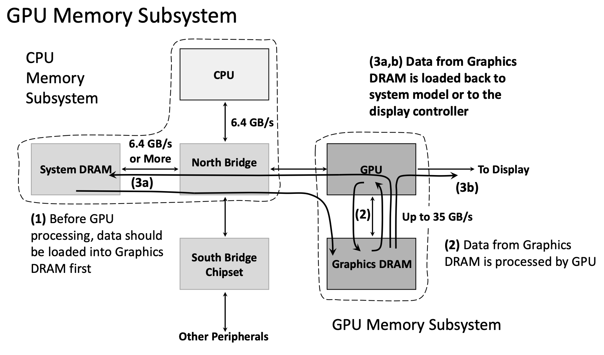{width=90%}

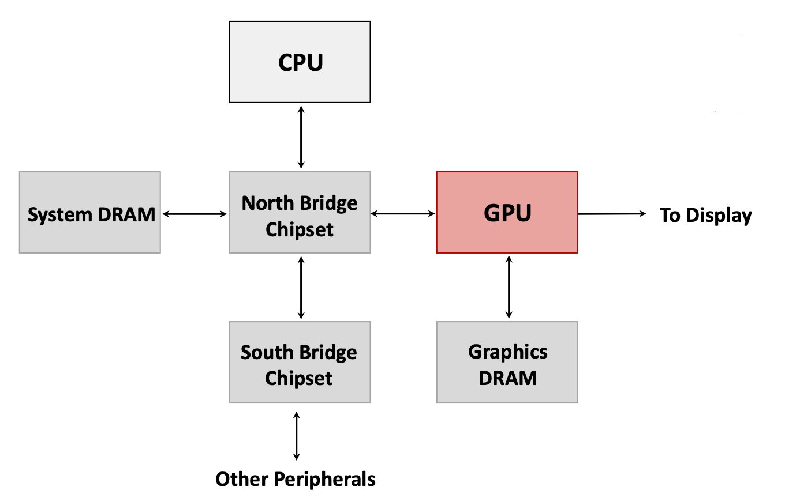{width=90%}

###### **1.3.8 CPU vs GPU Performance Example**

Consider an image processing task on a 1392×1040 image:

**CPU Execution**: 130 ms

**GPU Execution**:

- Allocate GPU memory: ~1.8 ms
- Transfer image Host → GPU: ~4.5 ms
- Execute GPU code: ~2.7 ms
- Transfer result GPU → Host: ~4.5 ms
- Deallocate GPU memory: ~4.5 ms
- **Total**: ~18 ms

The GPU is **~7× faster** despite the overhead of memory transfers. For larger workloads or repeated operations (where data stays on the GPU), speedups of 30-100× are common.

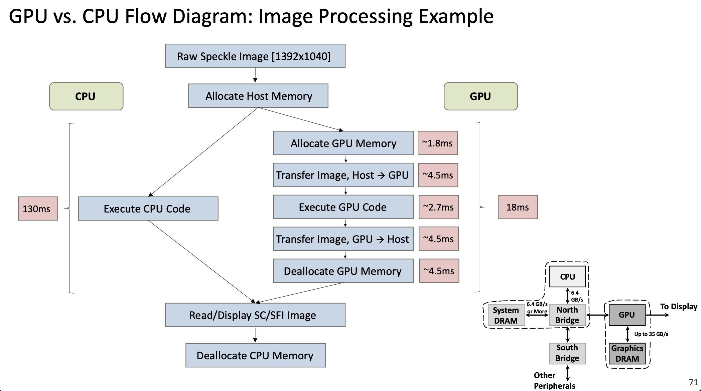{width=100%}

###### **1.3.9 Applications of GPU Computing**

Modern GPUs are used far beyond graphics:

**Traditional Graphics**: Rendering 3D scenes, video processing, display output

**General-Purpose GPU Computing (GPGPU)**:

1. **Scientific Computing**: Physics simulations, climate modeling, computational chemistry
2. **Machine Learning / AI**:
   - Training neural networks (dominated by matrix multiplications)
   - Deep learning inference
   - This market has grown exponentially—GPU chips for AI applications increased from <100K units in 2017 to >2.5M projected for 2025
3. **Image/Video Processing**: Real-time video enhancement, medical imaging
4. **Cryptography**: Mining cryptocurrencies, encryption/decryption
5. **Financial Modeling**: Monte Carlo simulations, risk analysis

**Why GPUs Excel at AI/ML**:

- Neural networks are essentially huge matrix multiplications
- Training requires the same operations on millions of data samples (perfect SIMD pattern)
- High floating-point throughput (measured in TFLOPS—trillions of floating-point operations per second)
- Performance/cost ratio is 3-10× better than CPUs for these workloads

{width=90%}

The chart above shows the explosive growth in GPU chips used for AI applications, from under 100,000 units in 2017 to over 2.5 million projected for 2025, spanning automotive, robotics, mobile devices, and more.

###### **1.3.10 GPU Programming Tools**

Several programming frameworks enable GPU computing:

- **CUDA**: NVIDIA's proprietary framework, most mature and widely used
- **OpenCL**: Open standard, works on multiple vendors' GPUs and other accelerators
- **ROCm**: AMD's open-source GPU computing platform
- **SYCL**: C++-based abstraction layer for heterogeneous computing

**CUDA Example**:

```cpp
// CPU version
void saxpy_serial(int n, float a, float *x, float *y) {
    for (int i = 0; i < n; ++i)
        y[i] = a * x[i] + y[i];
}

// GPU version
__global__ void saxpy_parallel(int n, float a, float *x, float *y) {
    int i = blockIdx.x * blockDim.x + threadIdx.x;
    if (i < n) y[i] = a * x[i] + y[i];
}
```

The `__global__` keyword marks a kernel function. Each thread computes its index `i` from block and thread IDs, then computes one element.

###### **1.3.11 Hardware Accelerators Beyond GPUs**

Modern systems use various specialized accelerators:

- **TPU (Tensor Processing Unit)**: Google's custom ASIC for machine learning, optimized specifically for TensorFlow operations
- **NPU (Neural Processing Unit)**: Specialized processors for AI inference in mobile devices and edge computing
- **FPGA (Field-Programmable Gate Array)**: Reconfigurable hardware for custom acceleration
- **Domain-Specific Accelerators**: Custom chips for cryptocurrency mining, video encoding, etc.

These represent a trend toward **heterogeneous computing**—systems combining general-purpose CPUs with specialized accelerators, each optimized for specific workload types.

***

#### **2. Definitions**
*   **Cache**: A small, fast memory that stores copies of frequently accessed data from main memory to reduce average access time.
*   **Cache Block (Cache Line)**: The minimum unit of data transfer between cache and memory; an indivisible portion either present or absent in the cache.
*   **Block Index**: The portion of a memory address that identifies which cache block location to check (lower bits of the address).
*   **Address Tag**: The portion of a memory address stored in a cache block to identify which memory location the cached data came from (upper bits of the address).
*   **Validity Flag**: A bit in each cache block indicating whether the block contains valid, initialized data (Y/N or 1/0).
*   **Cache Hit**: The condition when requested data is found in the cache and can be immediately provided to the CPU.
*   **Cache Miss**: The condition when requested data is not found in the cache and must be fetched from a lower-level cache or main memory.
*   **Cache Miss Penalty**: The time required to fetch missing data from a lower-level cache or memory, including access latency, transfer time, cache insertion, and data delivery to the CPU.
*   **Cache Hit Rate**: The percentage of memory accesses satisfied by the cache (typically >95% in modern systems).
*   **Cache Miss Rate**: The percentage of memory accesses that miss the cache; equals $1 - \text{Hit Rate}$.
*   **Spatial Locality**: The principle that if data at address $X$ is accessed, nearby addresses are likely to be accessed soon.
*   **Temporal Locality**: The principle that if data at address $X$ is accessed, the same address is likely to be accessed again in the near future.
*   **Direct-Mapped Cache**: A cache organization where each memory address maps to exactly one cache block location.
*   **Fully Associative Cache**: A cache organization where any memory block can be placed in any cache block location.
*   **Memory Consistency Principle**: The invariant that if a data block is present in a higher-level cache, it must also be present in all lower-level caches.
*   **SRAM (Static RAM)**: Fast memory technology using flip-flop circuits; used for CPU caches and registers.
*   **DRAM (Dynamic RAM)**: Slower but denser memory technology using capacitors; used for main system memory; requires periodic refresh.
*   **Pipeline**: A technique where multiple instructions execute simultaneously, each at a different stage of completion.
*   **Pipeline Stages**: The distinct phases of instruction execution: IF (Instruction Fetch), ID (Instruction Decode), EX (Execution), MA (Memory Access), WB (Write Back).
*   **Pipeline Registers**: Storage elements between pipeline stages that hold intermediate results and synchronize stage transitions on clock edges.
*   **Data Hazard**: A pipeline conflict where an instruction depends on the result of a previous instruction that hasn't completed yet.
*   **Forwarding (Bypassing)**: A technique to resolve data hazards by passing results directly from one pipeline stage to another without waiting for write-back.
*   **Pipeline Stall (Bubble)**: A delay inserted in the pipeline to resolve hazards, where one or more stages remain idle for a cycle.
*   **Throughput**: The number of instructions completed per unit time (instructions/second).
*   **Flynn's Taxonomy**: A classification of computer architectures based on instruction and data streams: SISD, SIMD, MISD, MIMD.
*   **SISD (Single Instruction Single Data)**: Traditional architecture where one instruction operates on one data item at a time.
*   **SIMD (Single Instruction Multiple Data)**: Architecture where one instruction operates on multiple data items simultaneously.
*   **MIMD (Multiple Instruction Multiple Data)**: Architecture with multiple processors executing different instructions on different data.
*   **GPU (Graphics Processing Unit)**: A specialized processor with hundreds to thousands of simple cores, optimized for parallel data processing.
*   **Streaming Multiprocessor (SM)**: A cluster of processing cores in a GPU that executes thread blocks.
*   **Streaming Processor (SP) Core**: An individual compute unit (ALU) within an SM.
*   **Kernel**: A GPU function that executes on many data elements in parallel.
*   **Thread**: A single execution instance of a kernel.
*   **Thread Block**: A group of threads that execute together on one SM and can share data.
*   **Grid**: A collection of thread blocks executing the same kernel across the GPU.
*   **CUDA (Compute Unified Device Architecture)**: NVIDIA's parallel computing platform and programming model for GPU computing.
*   **GPGPU (General-Purpose computing on GPU)**: Using GPU hardware for non-graphics computations like scientific simulations and machine learning.
*   **Heterogeneous Computing**: Computing systems that combine general-purpose CPUs with specialized accelerators (GPUs, TPUs, etc.).

***

#### **3. Examples**
##### **3.1. Direct-Mapped Cache Execution Trace** (Lecture 12, Example 1)

Consider a direct-mapped cache with 4 blocks (2-bit block index) and a 5-bit memory address space (32 locations). Initially, all cache blocks have Validity Flag = N. Execute the following memory access sequence:

1. `LW 01010` (Load Word from address 01010)
2. `LW 01100` (Load Word from address 01100)
3. `LW 01010` (Load Word from address 01010)
4. `LW 11010` (Load Word from address 11010)
5. `LW 01010` (Load Word from address 01010)

For each access, determine whether it is a cache hit or miss, and show the cache state.

<details>
<summary>Click to see the solution</summary>

**Key Concept:** In a direct-mapped cache, the address is split into Block Index (lower bits) and Address Tag (upper bits). A hit occurs when the block at the computed index has Validity = Y and the stored tag matches the requested tag.

**Address Breakdown:**

For a 5-bit address with 2-bit block index:

- **Bits [1:0]**: Block Index (which cache block to check)
- **Bits [4:2]**: Address Tag (identifies which memory block)

**Initial Cache State:**

| Block Index | Validity | Tag | Data |
|------------|----------|-----|------|
| 00 | N | --- | --- |
| 01 | N | --- | --- |
| 10 | N | --- | --- |
| 11 | N | --- | --- |

---

**Access 1: LW 01010**

1.  **Parse address**: `01010` → Tag = `010`, Index = `10`
2.  **Check cache block 10**: Validity = N (invalid)
3.  **Result**: **MISS**
4.  **Action**: Load $W_{01010}$ from memory into cache block 10

**Cache State After Access 1:**

| Block Index | Validity | Tag | Data |
|------------|----------|-----|------|
| 00 | N | --- | --- |
| 01 | N | --- | --- |
| 10 | **Y** | **010** | $W_{01010}$ |
| 11 | N | --- | --- |

---

**Access 2: LW 01100**

1.  **Parse address**: `01100` → Tag = `011`, Index = `00`
2.  **Check cache block 00**: Validity = N (invalid)
3.  **Result**: **MISS**
4.  **Action**: Load $W_{01100}$ from memory into cache block 00

**Cache State After Access 2:**

| Block Index | Validity | Tag | Data |
|------------|----------|-----|------|
| **00** | **Y** | **011** | $W_{01100}$ |
| 01 | N | --- | --- |
| 10 | Y | 010 | $W_{01010}$ |
| 11 | N | --- | --- |

---

**Access 3: LW 01010**

1.  **Parse address**: `01010` → Tag = `010`, Index = `10`
2.  **Check cache block 10**: Validity = Y, Tag = `010` ✓ (matches!)
3.  **Result**: **HIT**
4.  **Action**: Read data directly from cache (no memory access needed)

**Cache State After Access 3:** (unchanged)

---

**Access 4: LW 11010**

1.  **Parse address**: `11010` → Tag = `110`, Index = `10`
2.  **Check cache block 10**: Validity = Y, Tag = `010` ✗ (doesn't match `110`)
3.  **Result**: **MISS** (conflict—different tag for same index)
4.  **Action**: **Evict** old data, load $W_{11010}$ from memory into cache block 10

**Cache State After Access 4:**

| Block Index | Validity | Tag | Data |
|------------|----------|-----|------|
| 00 | Y | 011 | $W_{01100}$ |
| 01 | N | --- | --- |
| 10 | **Y** | **110** | $W_{11010}$ |
| 11 | N | --- | --- |

---

**Access 5: LW 01010**

1.  **Parse address**: `01010` → Tag = `010`, Index = `10`
2.  **Check cache block 10**: Validity = Y, Tag = `110` ✗ (doesn't match `010`)
3.  **Result**: **MISS** (the data was evicted in Access 4!)
4.  **Action**: Evict $W_{11010}$, reload $W_{01010}$ into cache block 10

**Cache State After Access 5:**

| Block Index | Validity | Tag | Data |
|------------|----------|-----|------|
| 00 | Y | 011 | $W_{01100}$ |
| 01 | N | --- | --- |
| 10 | **Y** | **010** | $W_{01010}$ |
| 11 | N | --- | --- |

---

**Summary:**

| Access | Address | Block Index | Tag | Result | Reason |
|--------|---------|-------------|-----|--------|--------|
| 1 | 01010 | 10 | 010 | **MISS** | Block invalid |
| 2 | 01100 | 00 | 011 | **MISS** | Block invalid |
| 3 | 01010 | 10 | 010 | **HIT** | Tag matches |
| 4 | 11010 | 10 | 110 | **MISS** | Tag mismatch (conflict) |
| 5 | 01010 | 10 | 010 | **MISS** | Tag mismatch (data was evicted) |

**Key Observation**: Accesses 4 and 5 demonstrate a **conflict miss**—addresses `01010` and `11010` both map to block 10, causing them to evict each other repeatedly. This is a weakness of direct-mapped caches.

**Answer:** Hit rate = 1/5 = 20%, Miss rate = 4/5 = 80%

</details>

##### **3.2. Cache Miss for Store Instructions** (Lecture 12, Example 2)

Can a cache miss occur for a store instruction (e.g., `SW 11010`)? If so, explain what happens.

<details>
<summary>Click to see the solution</summary>

**Key Concept:** Store instructions can indeed experience cache misses. When storing data, the processor typically follows a **write-allocate** policy.

**Answer:** **Yes**, cache misses can occur for store instructions.

**Explanation:**

When executing `SW 11010` (Store Word to address 11010):

1.  **Parse address**: Extract Block Index and Tag
2.  **Check cache**: Look up the cache block
3.  **If MISS** (block invalid or tag mismatch):
    *   The processor must first **load the entire block** from memory into the cache (write-allocate policy)
    *   Then **update** the specific word within that block
    *   Mark the block as **dirty** (modified)
4.  **If HIT**:
    *   Directly update the word in the cache
    *   Mark the block as dirty

**Why load on a store miss?**

Caches operate on **blocks**, not individual words. To maintain cache coherency and enable future loads from that block, the processor loads the entire block, then modifies the relevant portion.

**Write Policies:**

- **Write-through**: Every store also updates main memory immediately (slower but simpler)
- **Write-back**: Stores only update the cache; memory is updated when the block is evicted (faster but requires dirty bit tracking)

Most modern systems use **write-back** with a **write-allocate** policy for better performance.

</details>

##### **3.3. Pipeline Data Hazard Resolution** (Lecture 12, Example 3)

Given the instruction sequence:

```assembly
A: add x19, x0, x1
B: sub x2, x19, x3
```

Instruction B depends on the result in register `x19` from instruction A. Explain:

a) Why this creates a data hazard  
b) How forwarding resolves the hazard  
c) What would happen without forwarding

<details>
<summary>Click to see the solution</summary>

**Key Concept:** Data hazards occur when an instruction needs a result that a previous instruction hasn't yet written back. Forwarding (bypassing) passes results directly between pipeline stages.

**(a) Why this creates a data hazard:**

In a 5-stage pipeline:

- Instruction A writes `x19` in its **WB stage** (clock cycle 5)
- Instruction B needs `x19` in its **ID stage** (clock cycle 3) and **EX stage** (clock cycle 4)

Timeline without any solution:

| Clock Cycle | 1 | 2 | 3 | 4 | 5 |
|------------|---|---|---|---|---|
| A: add | IF | ID | EX | MA | WB (writes x19) |
| B: sub | | IF | ID (needs x19!) | EX (needs x19!) | MA |

Instruction B would read the **old value** of `x19` from the register file before A writes the new value—producing incorrect results.

**(b) How forwarding resolves the hazard:**

**Forwarding** (also called **bypassing**) creates a direct data path from the output of one pipeline stage to the input of another.

For this example:

- After instruction A completes its **EX stage** (clock cycle 3), the result is available in the **EX/MEM pipeline register**
- This result can be **forwarded directly** to instruction B's EX stage (clock cycle 4) via a dedicated hardware path
- Instruction B's EX stage uses the forwarded value instead of reading from the register file

Timeline with forwarding:

| Clock Cycle | 1 | 2 | 3 | 4 | 5 |
|------------|---|---|---|---|---|
| A: add | IF | ID | EX (computes x19) | MA | WB |
| B: sub | | IF | ID | EX (uses forwarded x19) | MA |

No stalls needed—the pipeline continues at full speed.

**(c) What would happen without forwarding:**

Without forwarding, the processor must **stall** instruction B until A completes WB:

| Clock Cycle | 1 | 2 | 3 | 4 | 5 | 6 | 7 | 8 |
|------------|---|---|---|---|---|---|---|---|
| A: add | IF | ID | EX | MA | WB | | | |
| B: sub | | IF | **stall** | **stall** | **stall** | ID | EX | MA |

Instruction B is delayed by 3 clock cycles, severely reducing throughput. This is why modern processors implement extensive forwarding networks.

**Answer:** Forwarding allows the pipeline to continue without stalls by passing results directly between stages, typically providing 2-3× speedup compared to stalling.

</details>

##### **3.4. Compiler Instruction Reordering** (Lecture 12, Example 4)

The following C code computes two sums:

```c
a = b + e;
c = b + f;
```

Show how a compiler can reorder RISC-V assembly instructions to minimize pipeline stalls. Assume register `x31` holds the base address of variables.

<details>
<summary>Click to see the solution</summary>

**Key Concept:** Compilers can reorder independent instructions to fill delay slots created by dependencies, reducing pipeline stalls.

**Initial (naive) assembly code:**

```assembly
lw  x1, 0(x31)    // Load b
lw  x2, 8(x31)    // Load e
add x3, x1, x2    // a = b + e  [STALL: waiting for x1, x2]
sw  x3, 24(x31)   // Store a
lw  x4, 16(x31)   // Load f
add x5, x1, x4    // c = b + f  [STALL: waiting for x4]
sw  x5, 32(x31)   // Store c
```

**Problem:** The `add` instructions must stall waiting for the `lw` instructions to complete (load-use hazard).

**Optimized assembly code:**

```assembly
lw  x1, 0(x31)    // Load b
lw  x2, 8(x31)    // Load e
lw  x4, 16(x31)   // Load f  [MOVED UP!]
add x3, x1, x2    // a = b + e  [No stall—x1, x2 ready]
sw  x3, 24(x31)   // Store a
add x5, x1, x4    // c = b + f  [No stall—x1, x4 ready]
sw  x5, 32(x31)   // Store c
```

**Explanation:**

1.  **Identify independent instruction**: The third load (`lw x4, 16(x31)`) doesn't depend on any previous computations
2.  **Move it earlier**: Place it immediately after the first two loads
3.  **Fill the delay slot**: By the time the first `add` executes, all three load values are ready (loads take ~2-3 cycles in a typical pipeline)
4.  **Result**: Both `add` instructions can execute without stalling

**Performance Improvement:**

- Original: ~11-12 cycles (with stalls)
- Optimized: ~7-8 cycles (no stalls)
- Speedup: ~40-50% improvement

**Answer:** By reordering the third load instruction to execute before the first add, the compiler fills the delay slot and eliminates pipeline stalls, significantly improving performance.

</details>


