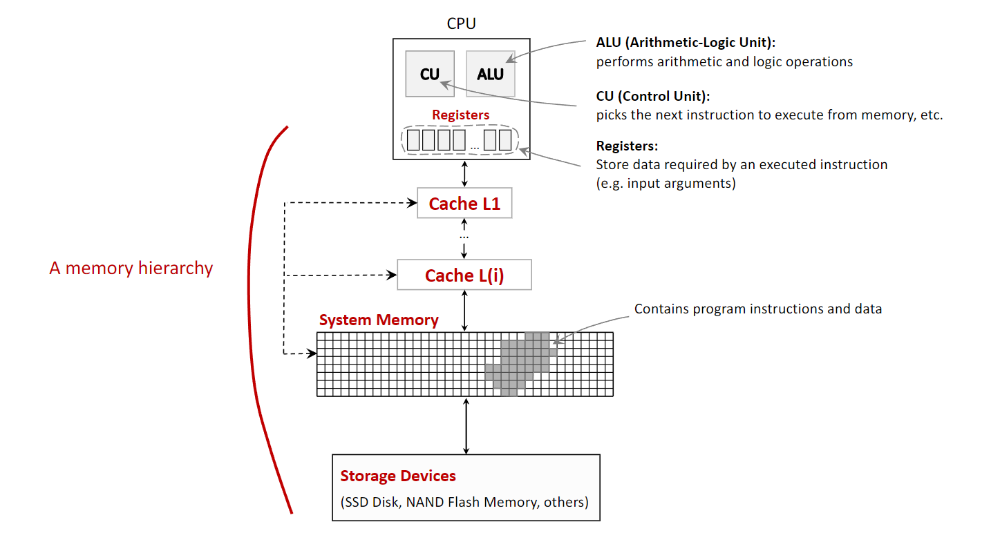
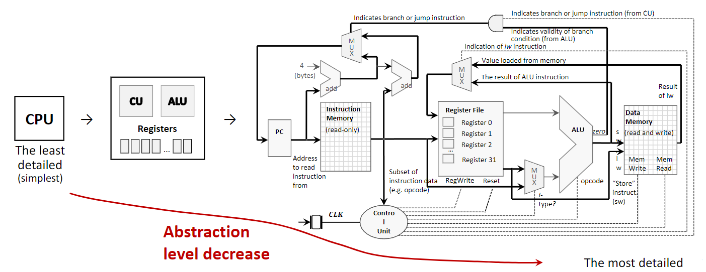
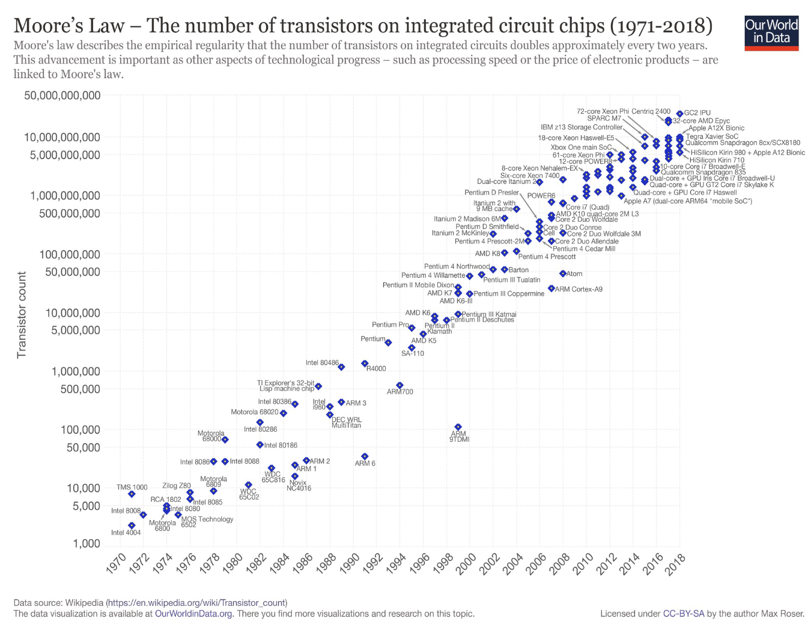
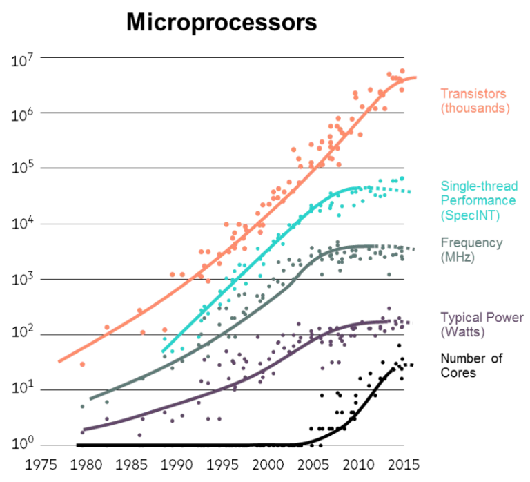
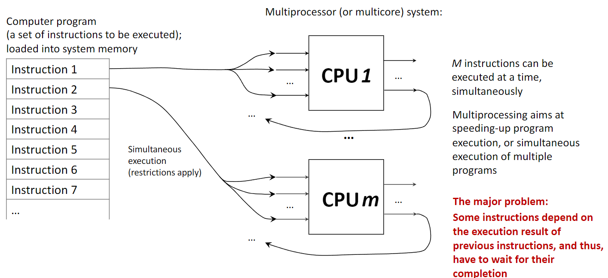
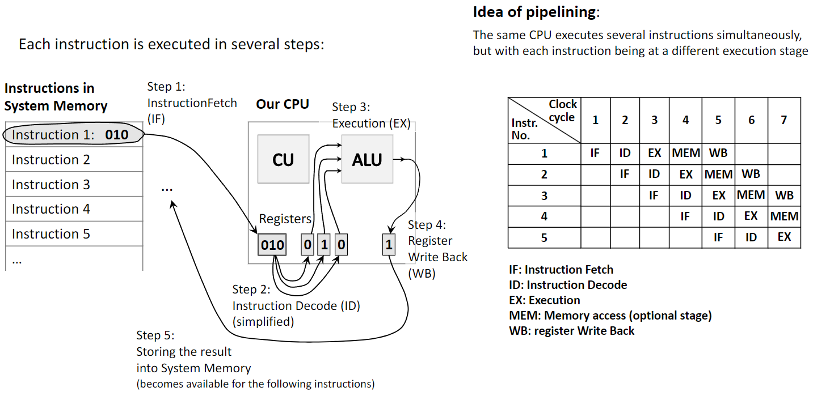
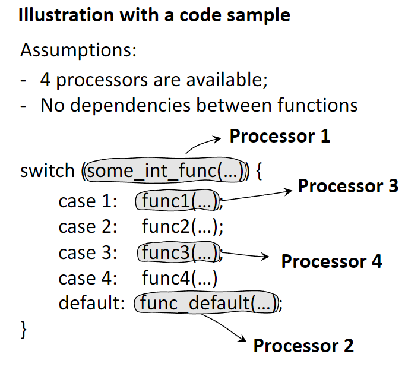
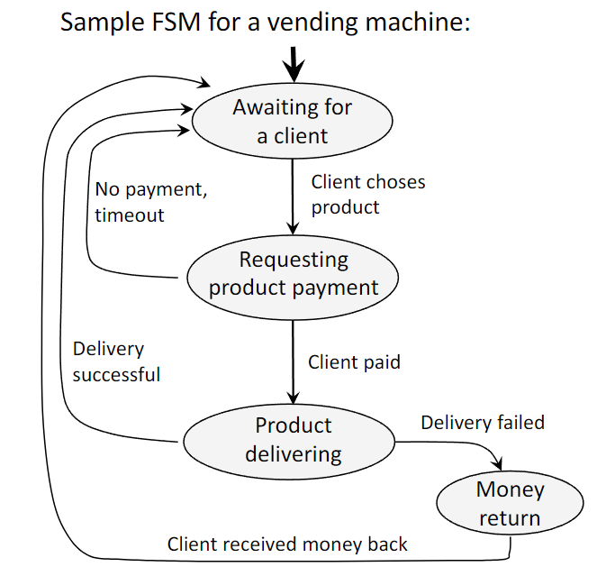
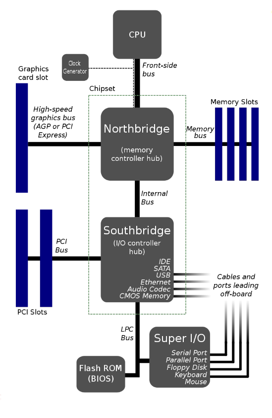



#### **1. Краткое содержание**

##### **1.1 Иерархия памяти**
В архитектуре компьютера **memory hierarchy** — базовая идея: память организуется «пирамидой», чтобы совместить три конкурирующих фактора: *скорость*, *объём* и *стоимость*. Процессоры очень быстры, но быстрая память дорога и потому мала; крупные накопители дешевле, но гораздо медленнее. Иерархия строит уровни, где каждый выше лежащий уровень меньше, быстрее и дороже за байт, чем нижележащий. Чем ближе уровень к CPU, тем быстрее к нему доступ.

Типичные уровни (от быстрых к медленным):

1.  **CPU Registers**: самые быстрые и маленькие ячейки внутри CPU; держат данные, с которыми процессор работает прямо сейчас. Доступ практически мгновенный — за один такт CPU.
2.  **Cache Memory**: небольшая очень быстрая память между CPU и основной памятью; хранит часто используемые данные и команды. Процесс помещения данных в кэш называют **caching**. Обычно уровни L1, L2, L3, где L1 — самый маленький и быстрый.
3.  **System Memory (RAM — Random Access Memory)**: основная рабочая память, где держатся ОС, приложения и текущие данные для процессора; крупнее кэша, но медленнее.
4.  **Storage Devices (Secondary Storage — вторичная память)**: твердотельные накопители (**SSDs**), флеш-память (**Flash Memory**) и т.п. — долговременное хранение больших объёмов; самый медленный и самый ёмкий уровень.

{fig-align="center" width=80%}

Важное различение — **volatile** и **non-volatile** память.

*   *Volatile* (регистры, кэш, RAM) требует питания; при отключении данные теряются.
*   *Non-volatile* (SSD, HDD, флеш) сохраняет данные без питания.

##### **1.2 Упрощение проектирования через абстракцию**
**Abstraction** — ключевой принцип: скрываются детали реализации, наружу выдаётся только нужное поведение. Так проектировщики и программисты работают с упрощённой моделью компонента без полного знания внутренностей.

Например, CPU можно рассматривать на разных уровнях:

*   **Высший уровень (самый простой):** программист видит CPU как «чёрный ящик», исполняющий команды через заданный **instruction set**, не вдаваясь в физику выполнения.
*   **Средний уровень:** архитектор видит CPU как набор крупных функциональных блоков — **Control Unit (CU)**, **Arithmetic Logic Unit (ALU)** и **registers** — и связи между ними: *что* делают компоненты и как они соединены.
*   **Низший уровень (наиболее детальный):** инженер видит вентили, транзисторы и проводку — *как* всё построено.

Абстракция позволяет строить и программировать сложные системы по слоям.

{fig-align="center" width=80%}

##### **1.3 Закон Мура и его «замедление»**
**Moore's Law** — наблюдение сооснователя Intel Гордона Мура (1965): число транзисторов на ИС примерно удваивается каждые два года. Долго это сопровождалось ростом скорости однопоточного исполнения и тактовой частоты CPU.

С примерно 2008 года рост производительности одного потока и тактовой частоты заметно снизился — говорят о «застое» закона Мура не потому, что плотность транзисторов перестала расти, а из‑за физических пределов:

1.  **Отвод тепла:** при ужатии транзисторов плотность тепловыделения растёт; дальнейший разгон такта увеличивает мощность и перегрев — это **power wall**.
2.  **Ограничение скорости света:** сигналы в кристалле идут почти со скоростью света; на быстрых и больших чипах время распространения сигнала становится существенным ограничителем.

Поэтому индустрия сместила акцент с ускорения одного процессора на добавление нескольких процессоров (или **cores**) на одном кристалле — к росту **multicore**- и **multiprocessor**-систем, где производительность увеличивается за счёт **parallelism**, а не только за счёт тактовой частоты.

{fig-align="center" width=80%}
{fig-align="center" width=40%}

##### **1.4 Производительность через параллелизм**
**Parallelism** — использование нескольких вычислительных узлов для одновременного выполнения нескольких задач или частей одной задачи. Это противопоставляют **uniprocessor**, где команды идут строго по очереди. Несколько CPU или многоядерный чип — параллельная система.

Цель — ускорить счёт, разделяя работу между ядрами. Сильная помеха — **instruction dependency**: следующая команда ждёт результата предыдущей, что сериализует выполнение и ограничивает выигрыш; это формализует **Amdahl's Law**.

{fig-align="center" width=80%}

##### **1.5 Производительность через конвейер (pipelining)**
**Pipelining** — другой приём: один процессор разбивает выполнение команды на стадии и *накладывает* стадии разных команд, как конвейер. Растёт **instruction throughput** — число завершённых команд в единицу времени.

Классический пятиступенчатый конвейер:

1.  **Instruction Fetch (IF):** выборка команды из памяти.
2.  **Instruction Decode (ID):** декодирование и определение действия.
3.  **Execute (EX):** вычисление в ALU.
4.  **Memory Access (MEM):** чтение/запись в системную память при необходимости.
5.  **Write Back (WB):** запись результата в регистр.

Пока одна команда в EX, следующая может быть в ID, а ещё одна — в IF. *Pipelining повышает пропускную способность на одном процессоре; параллелизм — за счёт одновременного исполнения на разных аппаратных узлах.*

{fig-align="center" width=80%}

##### **1.6 Производительность через спекуляцию (prediction)**
**Speculative execution** — оптимизация: процессор предсказывает будущий путь и начинает выполнять команды по предсказанному пути до уверенности. Чаще всего это **branch prediction**.

При условном переходе (**conditional branch**, например `if`) вместо ожидания и простоя конвейера **branch predictor** угадывает исход; CPU **speculatively** исполняет команды по предсказанной ветке.

*   Если предсказание **верно**, результат сохраняется, простой конвейера избегается.
*   Если **неверно**, спекулятивный результат отбрасывается, выполнение продолжается с правильной ветки — штраф по времени; при точности предиктора >95% суммарный выигрыш обычно велик.

{fig-align="center" width=60%}

##### **1.7 Другие базовые идеи**
*   **Dependability via Redundancy**: дублирование узлов (CPU, память, БП) для отказоустойчивости; при отказе основного включается резерв — важно для космоса, серверов и критичных систем.
*   **Make the Common Case Fast**: ускорять самый частый сценарий — инженерные ресурсы тратятся на типичный путь, даже если редкие случаи менее оптимальны.
*   **Finite State Machines (FSM)**: модель с конечным числом **states** и **transitions** по входам; удобна для протоколов, компиляторов, кэшей и т.д.

{fig-align="center" width=60%}

##### **1.8 Схема Northbridge / Southbridge**
В классической архитектуре материнской платы **chipset** делился на **Northbridge** и **Southbridge** — узел маршрутизации данных между CPU и остальной системой.

*   **Northbridge** (memory controller hub) — быстрый чип, связанный с CPU по **Front-Side Bus (FSB)**; отвечает за наиболее критичные по скорости связи:
    *   **System Memory (RAM)**
    *   **Высокоскоростной слот видеокарты** (AGP или PCI Express)
*   **Southbridge** (I/O controller hub) — не напрямую к CPU, а к Northbridge; обслуживает более медленную периферию:
    *   **PCI Slots**
    *   **SATA и IDE** для дисков
    *   **USB ports**
    *   **Встроенный звук и Ethernet**
    *   **Flash ROM (BIOS)** через шину LPC
    *   Устаревшие порты и **Super I/O**

Так высокоскоростной обмен CPU–RAM–графика не тормозился множеством медленных устройств. Сегодня схема устарела: функции Northbridge (особенно контроллер памяти) встроены в CPU, роль Southbridge часто сводится к одному чипу **Platform Controller Hub (PCH)**.

{fig-align="center" width=40%}

***

#### **2. Определения**

*   **Computer Architecture**: проектирование и базовая организация компьютерной системы — части, связи, набор команд, микроархитектура.
*   **CPU (Central Processing Unit)**: основной исполнитель команд; включает CU и ALU.
*   **ALU (Arithmetic Logic Unit)**: арифметика и логика (AND, OR, NOT и т.д.).
*   **Control Unit (CU)**: выборка и декодирование команд, координация системы.
*   **Register**: очень быстрая ячейка внутри CPU для одного значения в процессе вычислений.
*   **Cache Memory**: небольшая быстрая volatile-память с копиями часто используемых данных из RAM.
*   **System Memory (RAM)**: основная volatile-память для ОС, приложений и текущих данных.
*   **Volatile Memory**: требует питания; при отключении данные теряются.
*   **Non-Volatile Memory**: сохраняет данные без питания.
*   **Abstraction**: сокрытие деталей реализации за простым интерфейсом.
*   **Moore's Law**: наблюдение о удвоении числа транзисторов на ИС примерно каждые два года и связанный с этим исторический рост вычислительной мощности.
*   **Parallelism**: одновременное выполнение нескольких команд или задач на нескольких вычислительных узлах.
*   **Pipelining**: наложение стадий выполнения нескольких команд на одном процессоре для роста **instruction throughput**.
*   **Speculative Execution**: выполнение работы до уверенности в необходимости, чаще всего для **branch prediction**.
*   **Redundancy**: резервные компоненты для повышения надёжности.
*   **Finite State Machine (FSM)**: модель с конечным числом состояний и переходов по входам.
