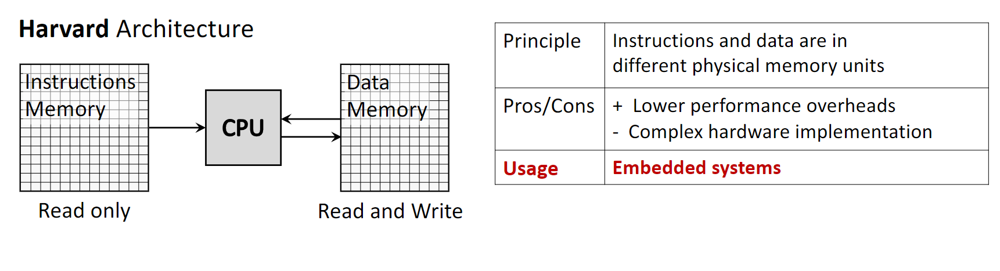
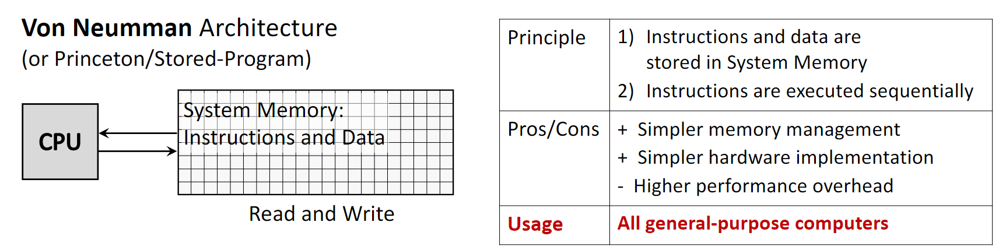
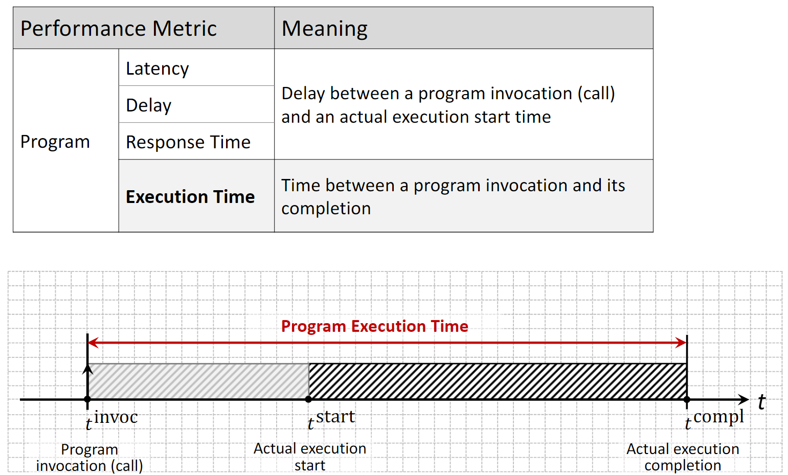
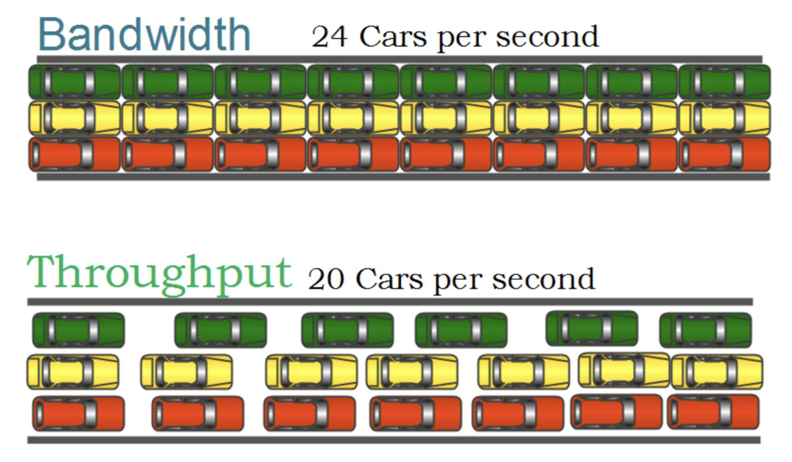
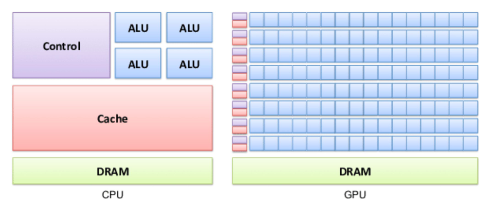
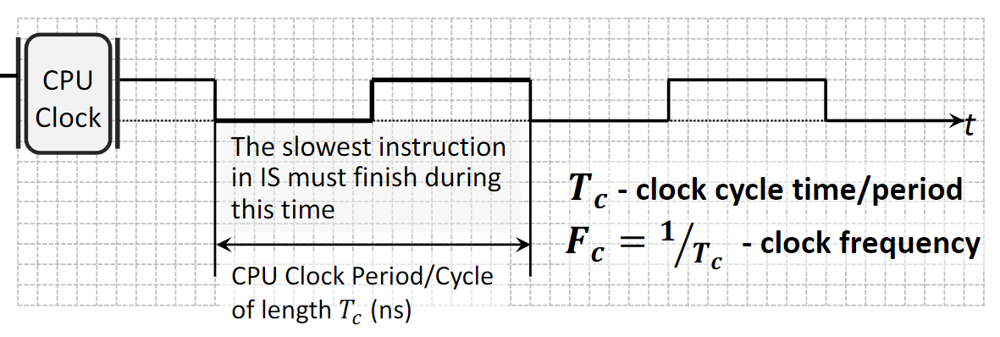
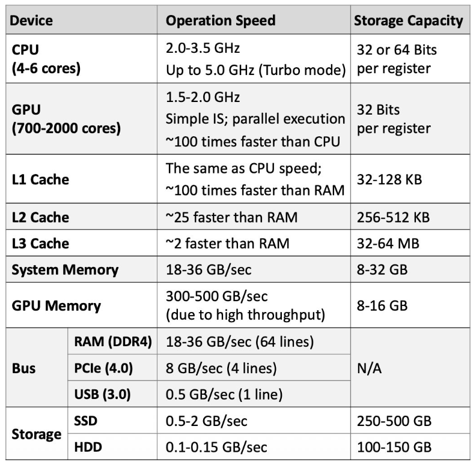
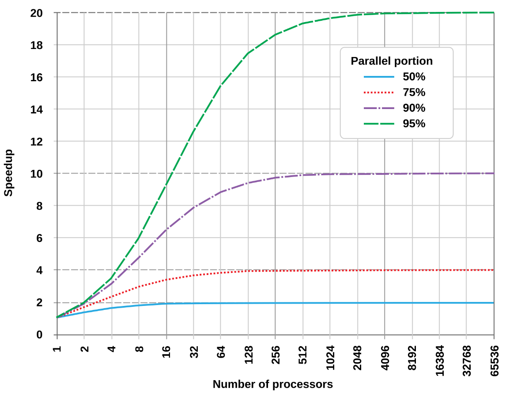
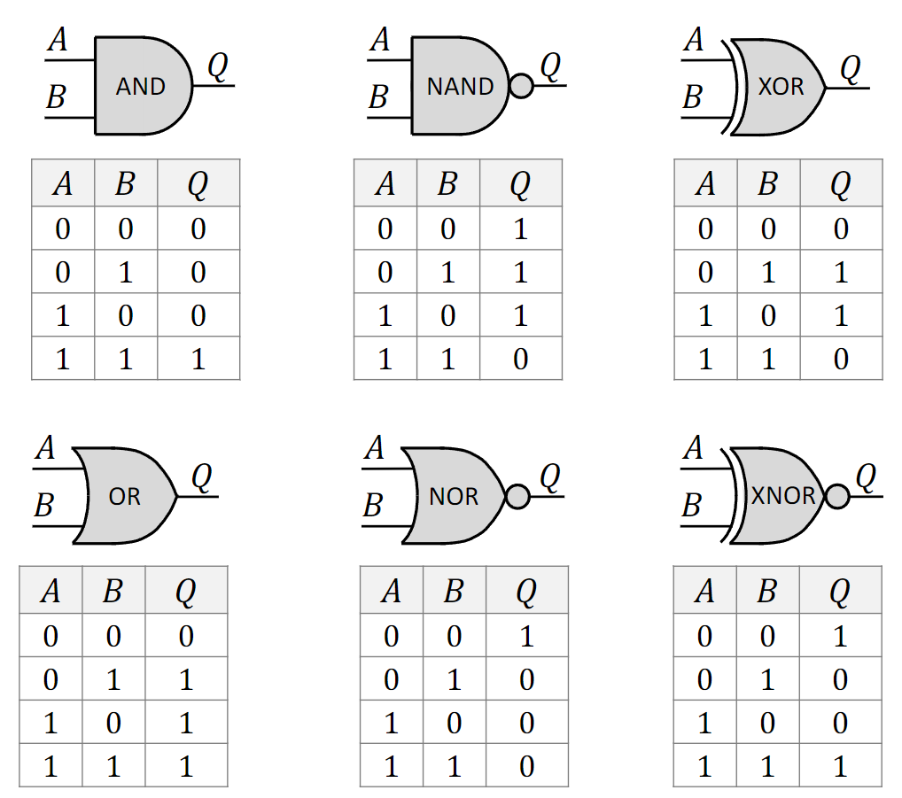
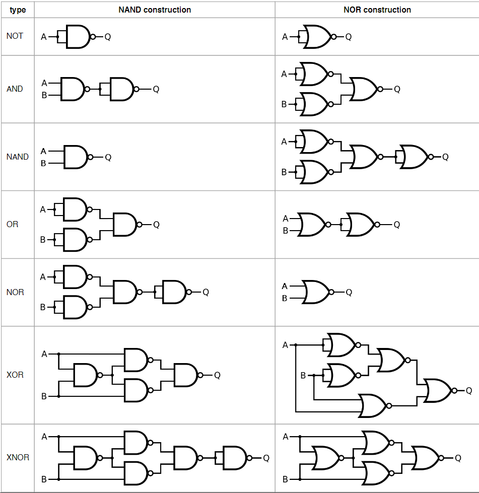



#### **1. Краткое содержание**

##### **1.1 Архитектуры компьютера**

###### **1.1.1 Harvard Architecture**
**Harvard Architecture** — схема с *физически раздельными* путями и памятью для команд и данных. CPU может одновременно читать команду и обращаться к памяти данных даже без кэша.

-   **Principle**: команды и данные в разных физических модулях памяти, с отдельными шинами.
-   **Memory Access**: память команд обычно только для чтения; память данных — чтение/запись.
-   **Pros**: меньше накладных расходов, команда и данные могут выбираться параллельно — быстрее исполнение.
-   **Cons**: сложнее и дороже железо — отдельные подсистемы памяти и шины.
-   **Usage**: микроконтроллеры, **DSP (Digital Signal Processors)**, внутренняя организация кэшей в современных CPU.

{fig-align="center" width=80%}

###### **1.1.2 Von Neumann Architecture**
**Von Neumann Architecture** (также **Princeton** или **Stored-Program**) — доминирующая схема универсальных компьютеров: и команды, и данные лежат в *одной* памяти.

-   **Principle**: одна память и одна шина для команд и данных; команды обычно выполняются последовательно.
-   **Pros**: проще управление памятью и реализация, ниже стоимость, гибкость.
-   **Cons**: ограничение производительности **Von Neumann bottleneck** — общая шина становится узким местом: CPU не может одновременно выбирать команду и данные.
-   **Usage**: практически все современные универсальные ПК — десктопы, ноутбуки, серверы.

{fig-align="center" width=80%}

##### **1.2 Метрики производительности**

###### **1.2.1 Метрики уровня программы**
Оценивают выполнение конкретной программы.

-   **Latency (или Delay / Response Time)**: время от вызова программы (**invocation**) до начала реальной работы; задержку часто дают подготовительные действия (накладные расходы ОС, выделение памяти и т.п.).
-   **Execution Time**: полное время от вызова до завершения, включая latency и полезное исполнение.

{fig-align="center" width=80%}

###### **1.2.2 Метрики уровня аппаратуры**
Описывают возможности платформы.

-   **Bandwidth**: теоретический максимум числа задач (или команд), исполняемых *одновременно*. У одноядерного процессора bandwidth = 1; у многоядерного — порядка числа ядер.
-   **Throughput**: *среднее* число одновременно исполняемых задач за интервал — фактическая производительность, часто ниже bandwidth.
-   **Utilization**: доля времени, когда компонент занят; например, **CPU utilization** 57% означает, что CPU был занят 57% измеренного интервала.

{fig-align="center" width=80%}

###### **1.2.3 Философия производительности CPU и GPU**
CPU и GPU проектируются под разные цели.

-   **CPU (Latency Optimized)**: как «спорткар» — рассчитан на небольшое число задач (или **threads**) и минимальную **latency** для каждой.
-   **GPU (Throughput Optimized)**: как «автобус» — рассчитан на огромное число задач одновременно и максимальный суммарный **throughput**, даже если **latency** одной задачи выше, чем у CPU.

{fig-align="center" width=80%}

##### **1.3 Характеристики производительности процессора и системы**

###### **1.3.1 CPU Clock**
Скорость процессора задаётся его **internal clock** (внутренним тактовым генератором).

-   **Clock Cycle**: CPU работает от периодического тактового сигнала; время одного полного цикла «вкл–выкл» — это **clock cycle time** или **period** $T_c$ (в наносекундах).
-   **Clock Frequency (или Rate)**: $F_c = 1/T_c$ — число циклов в секунду (Гц, ГГц), то есть обратная величина длительности такта. Длительность такта определяется временем, нужным для завершения самой медленной команды.

{fig-align="center" width=80%}

###### **1.3.2 Типичные характеристики компонентов**
Ориентиры для современных десктопов и ноутбуков.

{fig-align="center" width=80%}

##### **1.4 Amdahl's Law**
**Amdahl's Law** даёт оценку максимального ускорения системы при улучшении только части системы; часто применяют к ускорению программы на нескольких ядрах.

-   **Суть модели**: любая программа состоит из *serial portion* (последовательная часть) и *parallel portion* (часть, которую можно распределить по ядрам).
-   **Следствие**: ускорение от добавления ядер в конечном счёте ограничено последовательной долей; даже при бесконечном числе процессоров время выполнения не может быть меньше времени **serial portion**.
-   **Формула**:
    $$ \text{speedup} = \frac{1}{x + \frac{1-x}{m}} $$
    где $x$ — доля последовательного кода, $m$ — число ядер.

{fig-align="center" width=80%}

##### **1.5 Комбинационные логические схемы**

###### **1.5.1 Базовая терминология**
-   **Boolean Function**: функция с двоичными входами (0/1) и одним двоичным выходом; основа цифровых схем (Джордж Буль).
-   **Truth Table**: таблица всех входных комбинаций и выходов.
-   **Logic Gate**: электронный узел (обычно на транзисторах), реализующий элементарную булеву функцию (AND, OR, NOT).
-   **Logic Circuit**: соединение вентилей для более сложной функции; выход одного вентиля может быть входом другого.

###### **1.5.2 Основные вентили**
-   **AND**: 1 только если *все* входы 1.
-   **OR**: 1 если *хотя бы один* вход 1.
-   **NOT**: инверсия единственного входа.
-   **NAND (Not-AND)**: инверсия AND; 0 только когда все входы 1.
-   **NOR (Not-OR)**: инверсия OR; 1 только когда все входы 0.
-   **XOR (Exclusive-OR)**: 1 если входы *различны*; при двух единицах на входе — 0 (в отличие от OR).
-   **XNOR (Exclusive-NOR)**: инверсия XOR; 1 если входы одинаковы.

{fig-align="center" width=80%}

###### **1.5.3 Универсальные вентили**
**Universal gate** — вентиль, из которого можно собрать любой другой без дополнительных типов.

-   **NAND и NOR**: оба универсальны (например, NOT из NAND — соединить входы; AND/OR строятся композицией).
-   **Значение**: любую схему можно строить из одного типа вентилей — упрощает производство.

{fig-align="center" width=80%}

***

#### **2. Определения**

*   **Boolean Function**: функция с двоичными входами и одним двоичным выходом.
*   **Truth Table**: таблица истинности — все входы и соответствующие выходы.
*   **Logic Gate**: физическое устройство, реализующее элементарную логическую операцию.
*   **Logic Circuit**: структура из соединённых вентилей для более сложной булевой функции.
*   **Universal Gate**: вентиль (NAND или NOR), из которого строятся остальные.
*   **Harvard Architecture**: раздельная память и шины для команд и данных, допускающие параллельный доступ.
*   **Von Neumann Architecture**: единая память для команд и данных.
*   **Von Neumann Bottleneck**: ограничение производительности из‑за общей шины между CPU и памятью.
*   **Latency**: задержка между запуском процесса и началом полезной работы.
*   **Execution Time**: полное время выполнения программы от вызова до завершения.
*   **Bandwidth**: теоретический максимум скорости, с которой система может обрабатывать данные или команды.
*   **Throughput**: средняя фактическая скорость обработки данных или команд за заданный интервал.
*   **Amdahl's Law**: формула предельного ускорения при улучшении только части системы.
