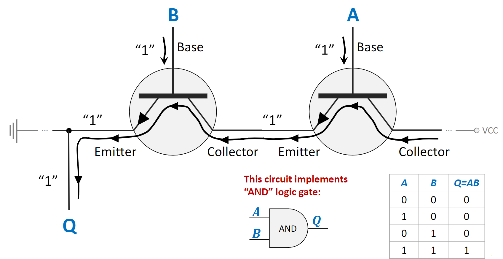
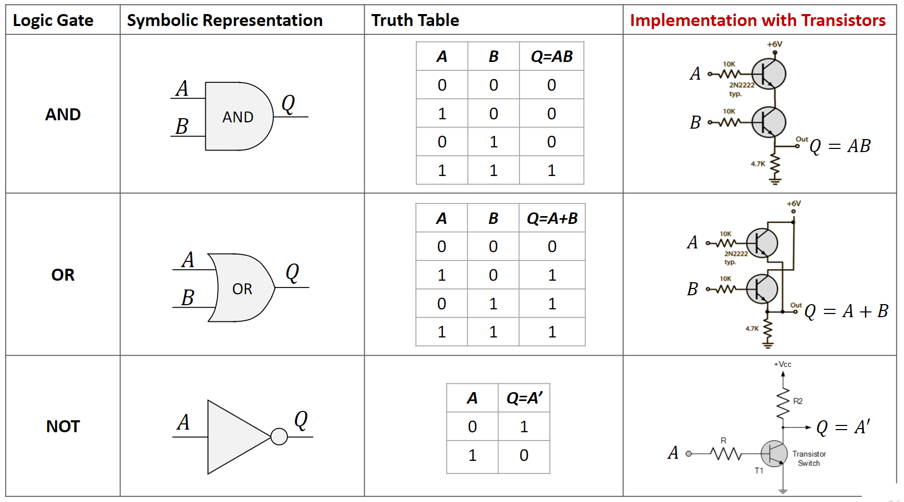
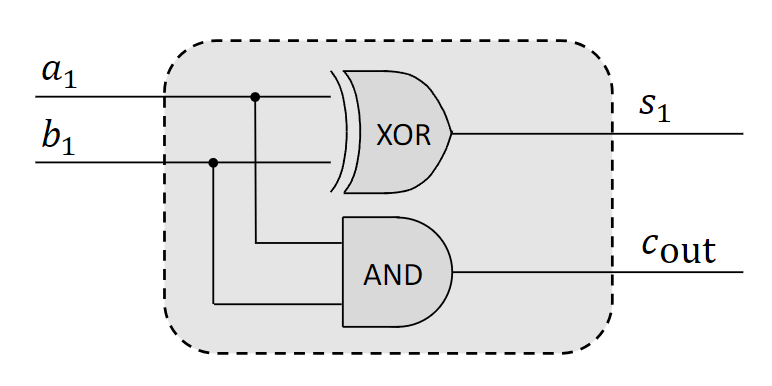
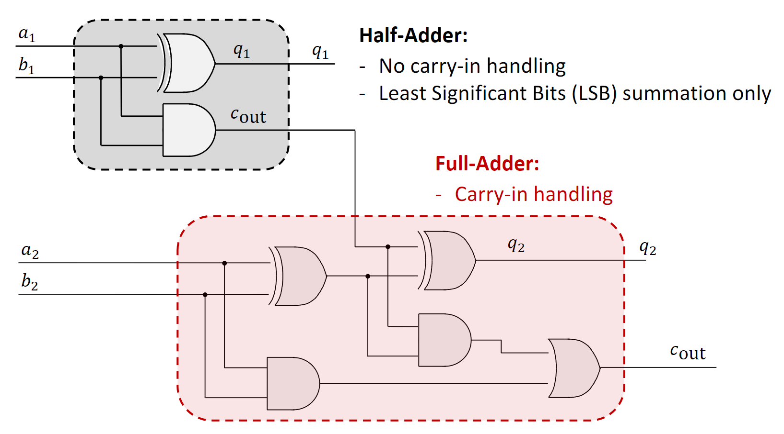
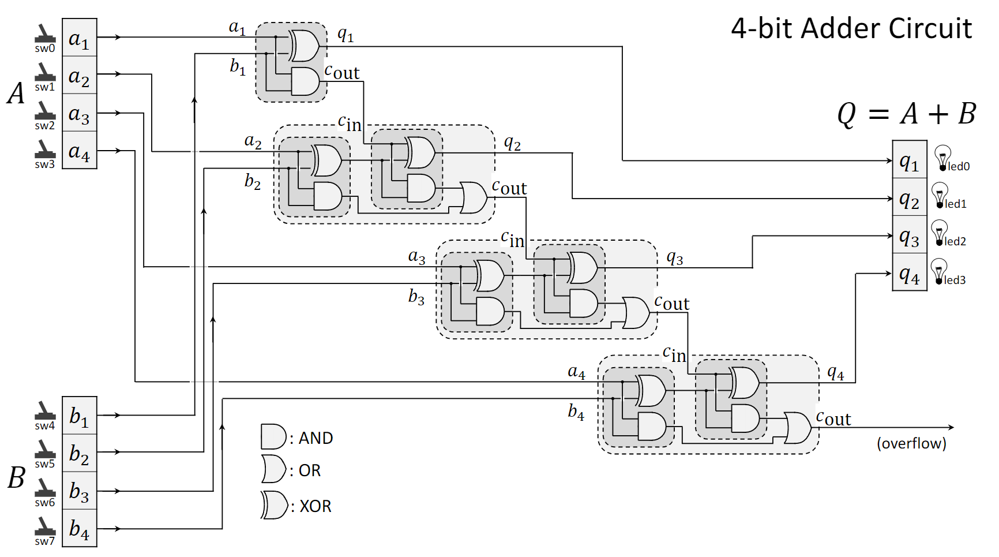
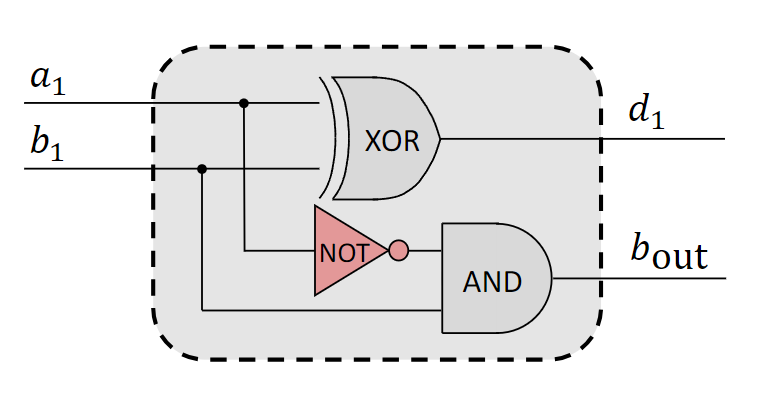
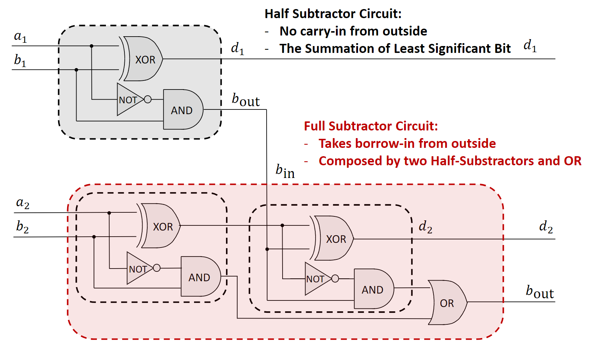
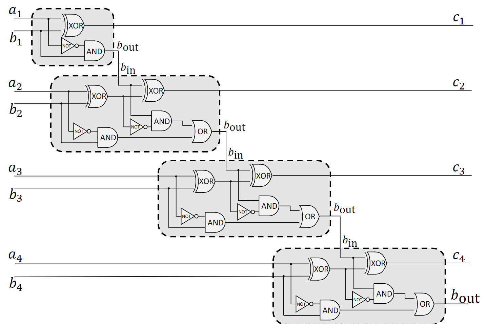
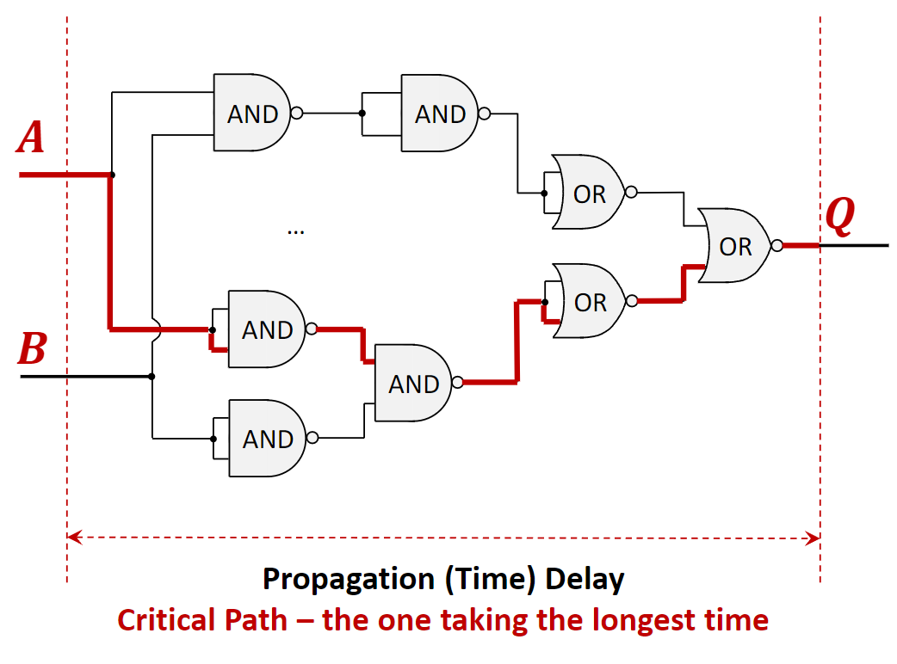
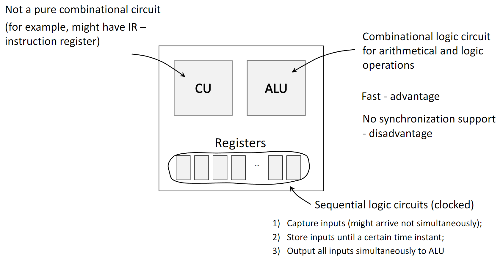



[Quiz](https://notebooklm.google.com/notebook/157d7251-86bf-4998-895f-b37e02ec0dc7?artifactId=17f820da-e090-47b5-85e5-7017bc03402f) | [Flashcards](https://notebooklm.google.com/notebook/157d7251-86bf-4998-895f-b37e02ec0dc7?artifactId=eba79054-184d-4ca1-bc00-fb44ce6adbec)

#### **1. Краткое содержание**

##### **1.1 Основы цифровой логики**

###### **1.1.1 Транзисторы — кирпичики вентилей**
На самом нижнем уровне вентили строят из **transistors** — полупроводниковых ключей/усилителей. Обычно три вывода:

- **Base**: управляющий вывод; небольшое напряжение (логическая «1») на Base «замыкает» ключ.
- **Collector**: вход силового тока.
- **Emitter**: выход силового тока.

При подаче напряжения на Base через кристалл течёт гораздо больший ток от **Collector** к **Emitter**; без напряжения на Base (логический «0») ток не идёт. Такое ключевое поведение — основа реализации вентилей AND, OR и NOT.

{fig-align="center" width=80%}

###### **1.1.2 Булевы функции и логические вентили**
**Boolean Function** — логическая операция над двоичными входами с одним двоичным выходом. **Logic Gate** — физическая реализация такой операции.

Базовый набор:

- **AND**: 1 только если *все* входы 1.
- **OR**: 1 если *хотя бы один* вход 1.
- **NOT**: инверсия единственного входа (1 становится 0, 0 — 1).
- **XOR (Exclusive OR)**: 1 только при различных входах.
- **NAND (NOT-AND)**: инверсия AND; **universal gate** — из одних NAND строится любая логика.
- **NOR (NOT-OR)**: тоже универсальный вентиль.

{fig-align="center" width=80%}

###### **1.1.3 Логические схемы и интегральные схемы**
**Logic Circuit** — соединение вентилей для более сложной функции. **Discrete circuit** собирается из отдельных компонентов; **Integrated Circuit (IC)** — микросхема с огромным числом элементов на одном кристалле.

Преимущества ИС перед дискретной сборкой:

- **Compact Size** — много функций на малой площади.
- **Higher Performance** — короче пути сигналов, меньше **propagation delay**.
- **Lower Cost** — массовое производство.

##### **1.2 Двоичная арифметика и схемы**

###### **1.2.1 Сложение двоичных разрядов**
При сложении двух битов:

- $0 + 0 = 0$
- $0 + 1 = 1$
- $1 + 0 = 1$
- $1 + 1 = 0$ с **carry** (переносом) 1 в следующий разряд.

Для многоразрядных чисел сложение начинается с **Least Significant Bit (LSB)** (правого бита) и идёт к **Most Significant Bit (MSB)** (левому); перенос из каждого разряда учитывается в следующем, более значимом разряде. Этот механизм **carry** — ключевой принцип схем сумматоров.

<!-- DIAGRAM HERE -->

###### **1.2.2 Схемы сумматоров**
- **Half-Adder**: складывает два однобитовых входа и даёт **Sum (S)** и **Carry-Out (Cout)**; сумма через `XOR`, перенос через `AND`; **carry-in** не принимает — подходит только для позиции **LSB**.
{fig-align="center" width=80%}
- **Full-Adder**: три бита (`A`, `B`, **carry-in** `Cin`) → Sum и Cout; нужен для всех старших разрядов.
{fig-align="center" width=80%}
- **Ripple-Carry Adder**: цепочка full-adder’ов, где `Cout` предыдущего подаётся на `Cin` следующего; перенос «распространяется» по цепочке.
{fig-align="center" width=80%}

###### **1.2.3 Схемы вычитателей**
- **Half-Subtractor**: два бита → **Difference (D)** и **Borrow-Out (Bout)**; без **borrow-in**.
{fig-align="center" width=80%}
- **Full-Subtractor**: три бита (`A`, `B`, **borrow-in** `Bin`) → Difference и Borrow-Out.
{fig-align="center" width=80%}
- **Multi-bit Subtractor**: цепочка full-subtractor’ов, `Bout` → `Bin` следующего каскада.
{fig-align="center" width=80%}

##### **1.3 Комбинационные логические схемы**

###### **1.3.1 Основные свойства**
У **combinational logic circuits** такие свойства:

1.  **Output depends only on current inputs**: памяти нет — выход в каждый момент однозначно задаётся текущими значениями входов.
2.  **Comprised of logic gates and wires**: схема собирается из вентилей (AND, OR, NOT и т.д.) и соединений.
3.  **Subject to propagation delay**: выход не мгновенен — после изменения входов проходит конечная задержка (**propagation delay**).
4.  **No memory units**: нет регистров и других элементов, хранящих состояние.
5.  **Typically no clock signal**: работа **asynchronous** — схема реагирует на входы напрямую, без синхронизации тактом.

###### **1.3.2 Propagation delay и critical path**
- **Propagation Delay**: время от изменения входа до стабильного изменения выхода; каждый вентиль вносит задержку.
- **Critical Path**: путь от входа к выходу с максимальной суммарной задержкой; он ограничивает максимальную рабочую частоту схемы — новые входы нельзя подавать быстрее, чем позволяет **critical path**.

{fig-align="center" width=80%}

###### **1.3.3 Доказательство эквивалентности схем**
Два варианта:

1.  **Truth Tables**: если столбцы выходов совпадают на всех входах — схемы эквивалентны.
2.  **Boolean Algebra**: записать выражения и преобразовать законами (коммутативность, ассоциативность, дистрибутивность, законы де Моргана) к одной форме.

##### **1.4 Логические схемы в CPU**
В CPU используются разные классы схем:

- **Combinational Logic Circuits**: типичный пример — **Arithmetic Logic Unit (ALU)**; выполняет арифметику (сложение, вычитание) и логику (AND, OR). Комбинационные схемы здесь быстрые, но не синхронизируют приход входов.
- **Sequential Logic Circuits**: есть память и такт; **Registers** — последовательные схемы, которые временно хранят данные: они фиксируют входы для ALU на такте и выдают их одновременно, чтобы расчёт был корректным и стабильным. **Control Unit (CU)** — тоже сложная схема, не сводимая к чисто комбинационной.

{fig-align="center" width=80%}

***

#### **2. Определения**

*   **Transistor**: полупроводниковый ключ — физическая основа вентилей.
*   **Boolean Function**: функция с двоичными входами и одним двоичным выходом.
*   **Logic Gate**: устройство, реализующее элементарную булеву функцию.
*   **Combinational Logic Circuit**: выход однозначно определяется текущими входами.
*   **Sequential Logic Circuit**: выход зависит от входов и предыдущего состояния (память); пример — регистры.
*   **Least Significant Bit (LSB)**: младший (правый) бит.
*   **Most Significant Bit (MSB)**: старший (левый) бит.
*   **Half-Adder**: сумматор двух битов без входа переноса.
*   **Full-Adder**: сумматор двух битов с **carry-in**.
*   **Half-Subtractor**: вычитатель двух битов без входа займа.
*   **Full-Subtractor**: вычитатель с **borrow-in**.
*   **Propagation Delay**: задержка реакции выхода на изменение входа.
*   **Critical Path**: путь с максимальной суммарной задержкой, задающий предел быстродействия.
