

#### **1. Краткое содержание**

##### **1.1 Введение в комбинационную логику**
**Combinational Logic Circuit** — цифровая схема, у которой выход однозначно определяется *текущей* комбинацией входов: памяти прошлых входов нет. Поведение задаётся алгеброй логики и таблицами истинности. Базовые элементы — **logic gates**.

###### **1.1.1 Базовые вентили**
Вентили выполняют элементарные операции над двоичными входами и дают один выход.

-   **AND**: `1` только если *все* входы `1`.
-   **OR**: `1` если *хотя бы один* вход `1`.
-   **XOR** (исключающее ИЛИ): `1` только если входы *различны*.
-   **NOT**: инвертор — на выходе противоположное значение единственного входа.
-   **NAND**: инверсия AND; `0` только если *все* входы `1`.
-   **NOR**: инверсия OR; `0` если *хотя бы один* вход `1`.
-   **XNOR**: инверсия XOR; `1` если входы *одинаковы*.

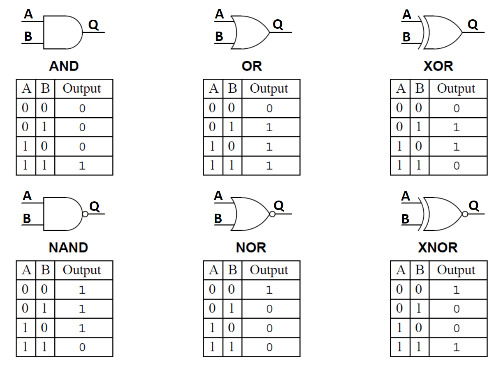{fig-align="center" width=80%}

##### **1.2 Multiplexer (MUX)**
**Multiplexer (MUX)** — **data selector**: комбинационная схема, которая по **control pins** (**selector signals**) подключает один из нескольких входов к одному выходу.

При $n$ управляющих линиях можно выбрать до $2^n$ входов. Аналогия — стрелка на ж/д: сигналы выбора определяют, какая «ветка» (вход) соединена с «магистралью» (выходом).

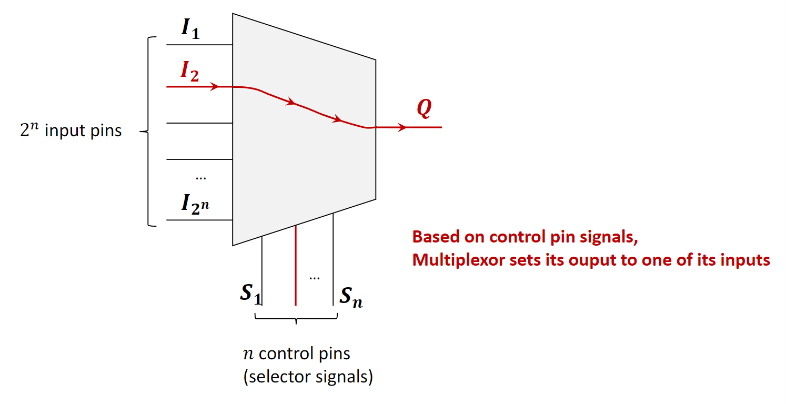{fig-align="center" width=80%}

###### **1.2.1 Реализация MUX 2-к-1**
Два входа данных ($I_1$, $I_2$), один селектор $S$, выход $Q$.

-   $S=0$ → $Q = I_1$.
-   $S=1$ → $Q = I_2$.

Обычно строится на NOT, AND и OR: $S$ и $\lnot S$ «включают» ровно один из AND перед OR.

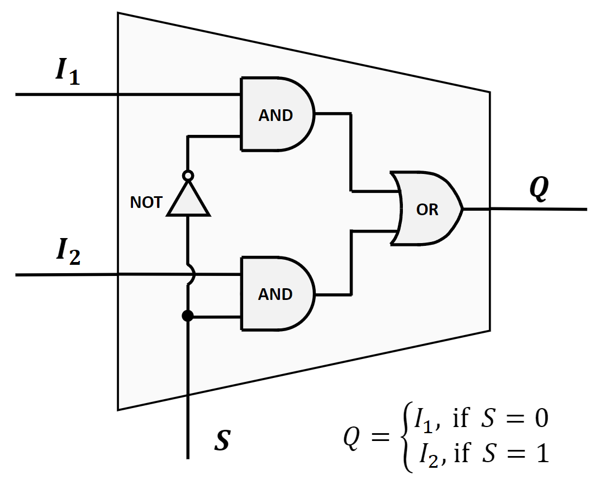{fig-align="center" width=80%}

Таблица истинности:

| $I_1$ | $I_2$ | S | Q   |
|:---:|:---:|:---:|:---:|
| 0   | 0   | 0 | 0   |
| 1   | 0   | 0 | 1   |
| 0   | 1   | 0 | 0   |
| 1   | 1   | 0 | 1   |
| 0   | 0   | 1 | 0   |
| 1   | 0   | 1 | 0   |
| 0   | 1   | 1 | 1   |
| 1   | 1   | 1 | 1   |

###### **1.2.2 MUX 4-к-1**
Четыре входа ($I_1..I_4$), два селектора ($S_1,S_2$), один выход $Q$. Комбинации $S_1S_2$ выбирают вход:

-   `00` → $I_1$; `01` → $I_2$; `10` → $I_3$; `11` → $I_4$.

Типично: четыре 3-входовых AND, два NOT на селекторы, один 4-входовый OR.

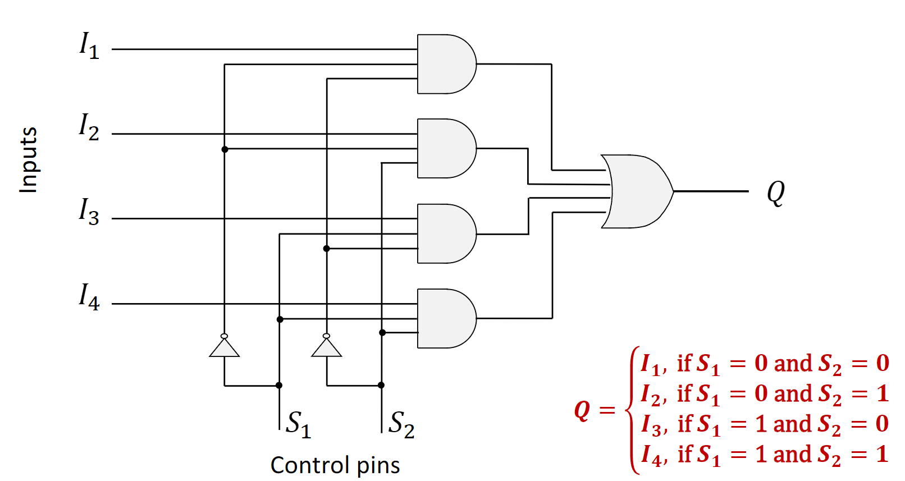{fig-align="center" width=80%}

##### **1.3 Demultiplexer (DEMUX)**
**Demultiplexer (DEMUX)** — обратная операция к MUX: один вход распределяется на один из нескольких выходов по тем же идеям селекции; до $2^n$ выходов при $n$ линиях управления.

Невыбранные выходы обычно в `0`. Аналогия — сортировка почты по адресу.

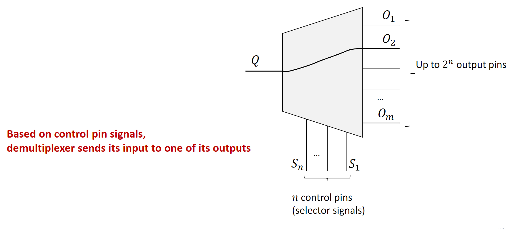{fig-align="center" width=80%}

DEMUX 1-к-2: вход $I$, селектор $S$, выходы $Q_1,Q_2$.

-   $S=0$ → $Q_1=I$, $Q_2=0$.
-   $S=1$ → $Q_1=0$, $Q_2=I$.

##### **1.4 Decoder**
**Decoder** — комбинационная схема, которая преобразует двоичный код на входных линиях в сигнал на **одной** выходной линии. По смыслу близок к демультиплексору: декодер можно получить из DEMUX так:

1.  убрать единственный **data input**;
2.  **control pins** DEMUX сделать основными входами декодера;
3.  изменить логику так, чтобы на выбранном выходе было `1`, а на всех остальных — `0`.

У декодера с $n$ входами будет $2^n$ выходов: $n$-битный вход «раскодируется» в активацию ровно одной соответствующей линии.

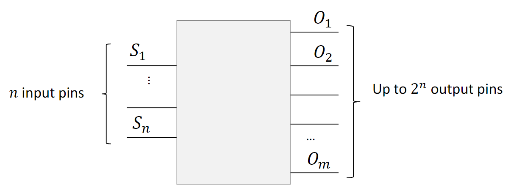{fig-align="center" width=80%}

###### **1.4.1 Decoder 2-к-4**
Декодер 2-to-4 имеет две входные линии ($I_1, I_2$) и четыре выходные ($O_1, O_2, O_3, O_4$) и активирует один из четырёх выходов по двухбитному коду.

-   Если $I_1I_2 = 00$, $O_1$ равен `1` (остальные — `0`).
-   Если $I_1I_2 = 01$, $O_2$ равен `1` (остальные — `0`).
-   Если $I_1I_2 = 10$, $O_3$ равен `1` (остальные — `0`).
-   Если $I_1I_2 = 11$, $O_4$ равен `1` (остальные — `0`).

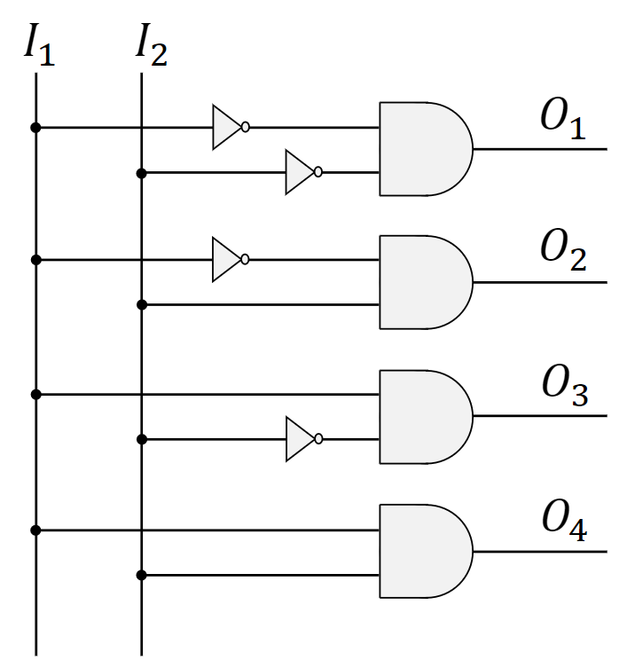{fig-align="center" width=80%}

##### **1.5 Encoder**
**Encoder** — обратная операция декодера: $2^n$ входных линий и $n$ выходных. Работает в предположении, что *в каждый момент времени активна ровно одна* входная линия (равна `1`). На выходе формируется $n$-битный двоичный код, соответствующий этой линии.

Аналогия — панель кнопок лифта.

###### **1.5.1 Encoder 4-к-2**
**Encoder** 4-to-2 имеет четыре входные линии ($I_1, I_2, I_3, I_4$) и две выходные ($O_1, O_2$). Если в каждый момент на входах единица только в одной позиции, на выходе получается двухбитный код; для этой простой схемы достаточно двух вентилей OR.

-   Если $I_1=1$, выход $00$.
-   Если $I_2=1$, выход $01$.
-   Если $I_3=1$, выход $10$.
-   Если $I_4=1$, выход $11$.

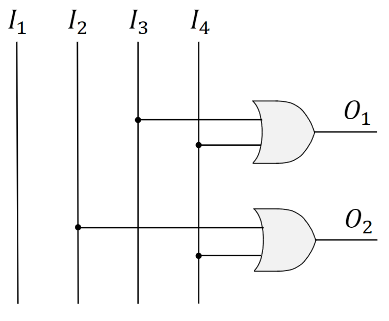{fig-align="center" width=80%}

##### **1.6 Аппаратные блоки в проектировании CPU**
Эти комбинационные схемы — строительные блоки **Central Processing Unit (CPU)**.

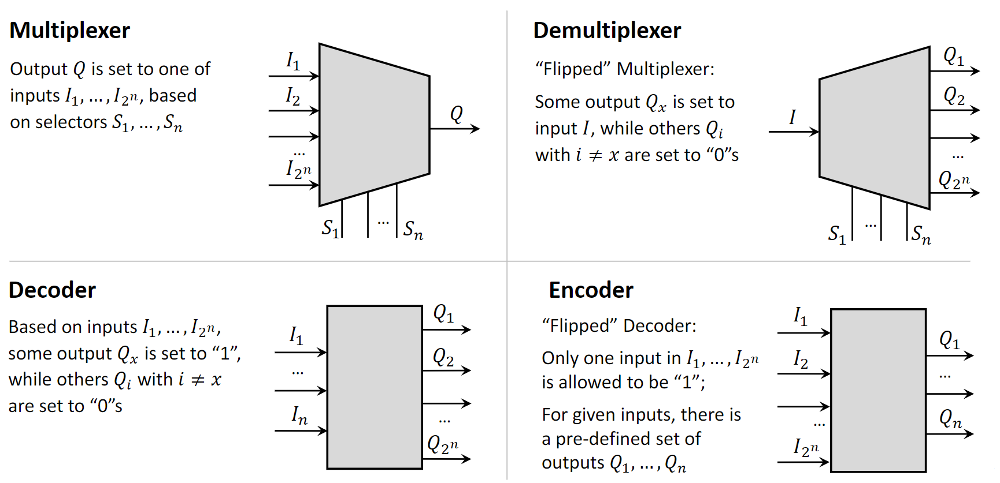{fig-align="center" width=80%}

###### **1.6.1 Основные части CPU (упрощённо)**
-   **Control Unit (CU):** поток операций, доступ к памяти, синхронизация исполнения команд.
-   **Arithmetic Logic Unit (ALU):** арифметика и логика.
-   **Registers:** маленькая быстрая память для операндов, команд и промежуточных результатов.

###### **1.6.2 Случай 1: MUX в реализации ALU**
ALU должен выполнять несколько разных операций. Практичный приём — завести отдельные подсхемы под каждую операцию (сумматор, вычитатель, умножитель и т.д.), подать на них одни и те же входы (аргументы) **одновременно** и дать каждой подсхеме вычислить свой результат. Затем **multiplexer** выбирает итоговый выход; сигнал выбора для этого MUX — **opcode** (**operation code**) из исполняемой команды: он указывает, результат какой подсхемы считать выходом ALU.

Важен **propagation delay** — время, за которое сигналы проходят через вентили и выход стабилизируется. Период такта CPU должен быть не короче, чем «самая медленная» возможная операция ALU. Этот компромисс лежит в основе идей вроде **RISC (Reduced Instruction Set Computer)** и **CISC (Complex Instruction Set Computer)**.

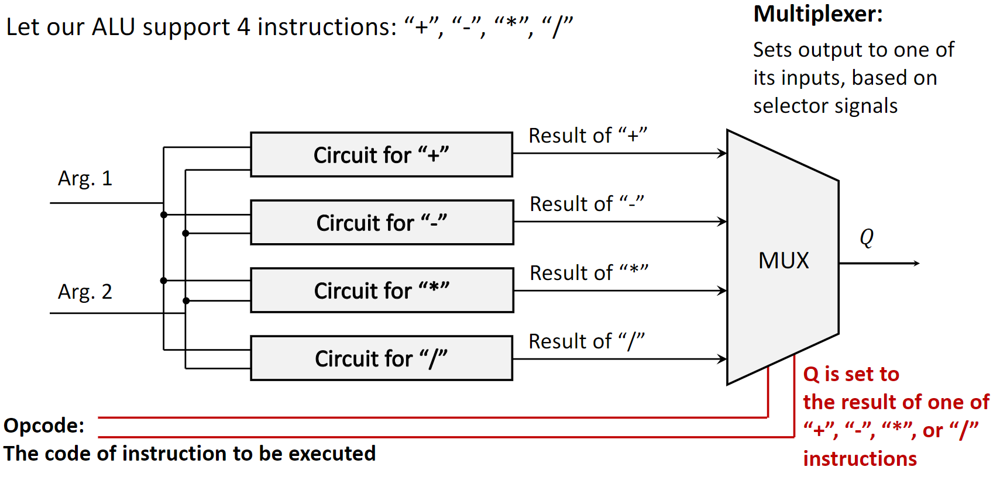{fig-align="center" width=80%}

###### **1.6.3 Случай 2: DEMUX при записи в память**
**Demultiplexer** нужен, чтобы писать данные в блок памяти. Память состоит из множества ячеек с уникальным адресом. Чтобы записать бит в конкретную ячейку:

1.  бит данных подаётся как единственный вход DEMUX;
2.  адрес целевой ячейки — на **control pins** DEMUX;
3.  DEMUX выбирает выходную линию, физически соединённую с этой ячейкой, и направляет на неё бит.

Чтобы записать сразу несколько бит (например, байт), схему обобщают: часто используют **банк** демультиплексоров — по одному на каждый бит, с общими адресными линиями.

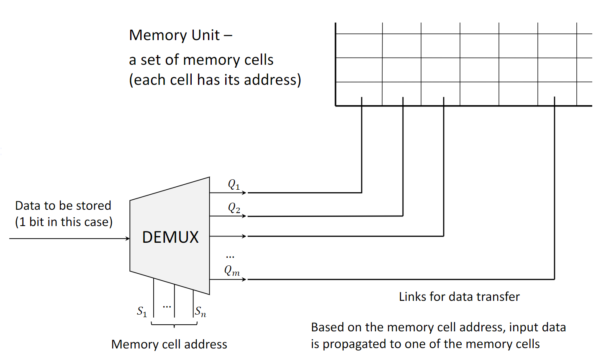{fig-align="center" width=80%}

***

#### **2. Определения**

-   **Logic Gate**: базовая схема с двоичными входами и одним выходом.
-   **Combinational Circuit**: выход зависит только от текущих входов, без памяти состояний.
-   **Multiplexer (MUX)**: много входов, один выход, селектор выбирает вход.
-   **Demultiplexer (DEMUX)**: один вход, много выходов, селектор выбирает выход.
-   **Decoder**: $n$-битный вход → один активный из $2^n$ выходов.
-   **Encoder**: один активный из $2^n$ входов → $n$-битный код (при единственной активной линии).
-   **ALU (Arithmetic Logic Unit)**: узел CPU для арифметики и логики по операндам команд.
-   **Opcode (Operation Code)**: часть машинной команды, которая задаёт выполняемую операцию.
-   **Propagation Delay**: задержка от изменения входа вентиля/схемы до изменения выхода.
