

#### **1. Краткое содержание**

##### **1.1 Построение Arithmetic-Logic Unit (ALU)**
**Arithmetic-Logic Unit (ALU)** — ключевая комбинационная схема в **CPU**, выполняющая арифметику и побитовую логику над целыми двоичными числами; это вычислительное ядро процессора.

###### **1.1.1 Базовая организация ALU**
Идея: отдельные схемы на каждую операцию и **multiplexer (MUX)** с управлением **opcode** (operation code), выбирающий результат.

Для ALU с `+`, `-`, `*`, `==`:

- Аргументы `Arg. 1`, `Arg. 2` параллельно подаются на четыре схемы.
- Каждая считает свою функцию.
- Результаты идут на входы MUX; **opcode** выбирает, что попадёт в выход `Q`.

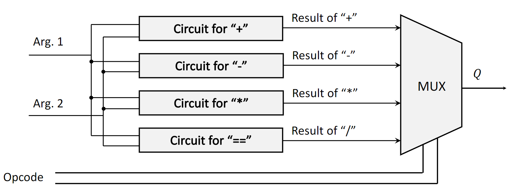{fig-align="center" width=80%}

###### **1.1.2 4-битный сумматор**
**4-bit adder** складывает два 4-битных числа; частая реализация — **ripple-carry adder** из каскада **full adder**.

- **Full Adder**: три бита ($A$, $B$, $C_{in}$) → сумма $S$ и $C_{out}$; сумма через XOR, перенос через AND/OR.
- **Ripple-Carry Adder**: для 4-битного сумматора (например, $A_4A_3A_2A_1$ и $B_4B_3B_2B_1$) четыре **full adder** соединяют последовательно.
    1.  Первый full adder складывает младшие биты ($A_1, B_1$) с $C_{in}=0$, даёт первый бит суммы ($q_1$) и перенос $c_{out1}$.
    2.  $c_{out1}$ подаётся как $C_{in}$ второго full adder, который складывает $A_2, B_2$ и $c_{out1}$, выдавая $q_2$ и $c_{out2}$.
    3.  Цепочка продолжается: перенос каждого каскада — вход переноса следующего; финальный $C_{out}$ последнего full adder позволяет обнаружить **overflow**.

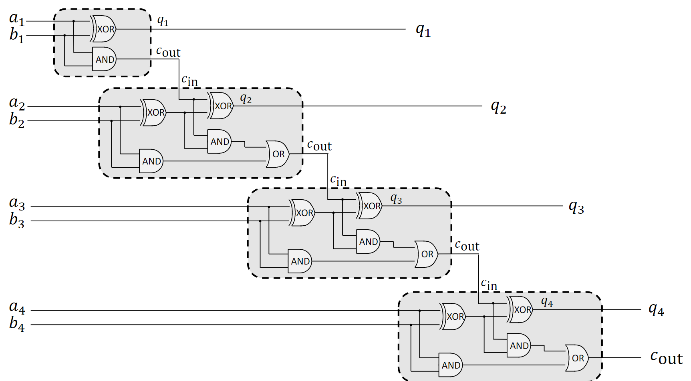{fig-align="center" width=80%}

###### **1.1.3 4-битный вычитатель**
В двоичной арифметике вычитание делают сложением **two's complement** вычитаемого: $A - B = A + (\text{two's complement of }B)$.

*Two's complement* числа: инвертировать все биты (**one's complement**) и прибавить 1. Схема для $A - B$:

1.  Инвертировать каждый бит второго числа $B$ вентилями NOT.
2.  Подать инвертированные биты $B$ и биты $A$ на входы 4-битного сумматора.
3.  Установить начальный $C_{in}$ у первого full adder в 1 — это даёт «+1» в формуле two's complement.

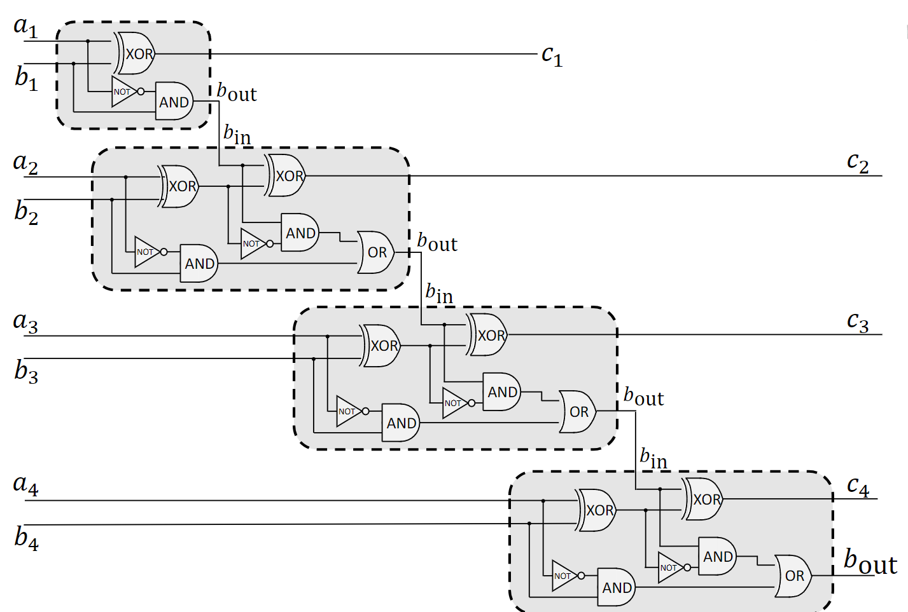{fig-align="center" width=80%}

###### **1.1.4 Двоичные умножители**
Двоичное умножение — генерация и суммирование **partial products**.

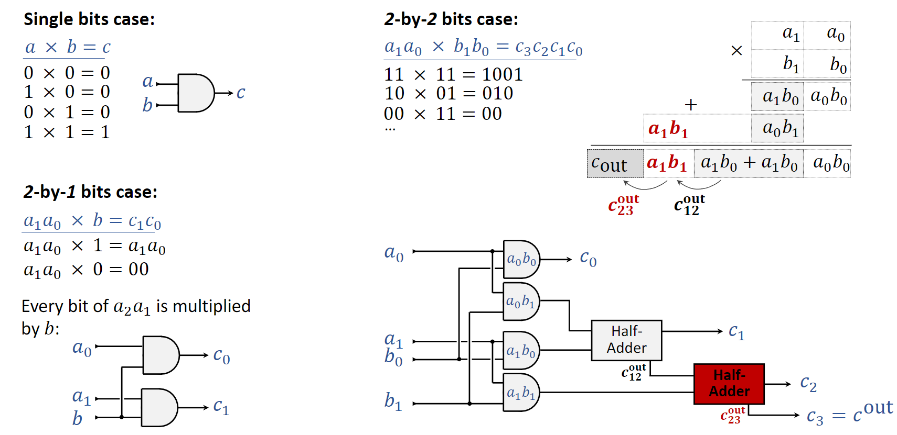{fig-align="center" width=80%}

- **Single-Bit Case**: произведение двух битов $a \times b$ эквивалентно логическому AND; результат 1 только если оба бита равны 1. Схема — один **AND gate**.
- **2-by-2 Bit Case**: для $A = a_1a_0$ и $B = b_1b_0$:
    1.  Сгенерировать **partial products**, AND’я каждый бит $A$ с каждым битом $B$; получаются четыре слагаемых: $a_0b_0$, $a_1b_0$, $a_0b_1$, $a_1b_1$.
    2.  Разложить их по разрядам и сложить half-adder’ами и full-adder’ами; результат до 4 бит.
    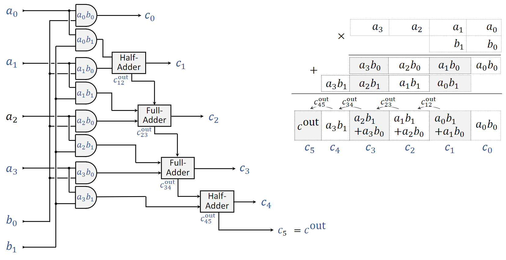{fig-align="center" width=80%}
- **4-by-4 Bit Multiplier**: два 4-битных числа дают 8-битный результат по тому же принципу.
    1.  **Partial Product Generation**: массив из 16 AND вычисляет все $a_ib_j$ при $i,j \in \{0,1,2,3\}$.
    2.  **Summation**: half-adder’ы и full-adder’ы суммируют частичные произведения, часто в древовидной структуре, чтобы уменьшить **propagation delay**.
    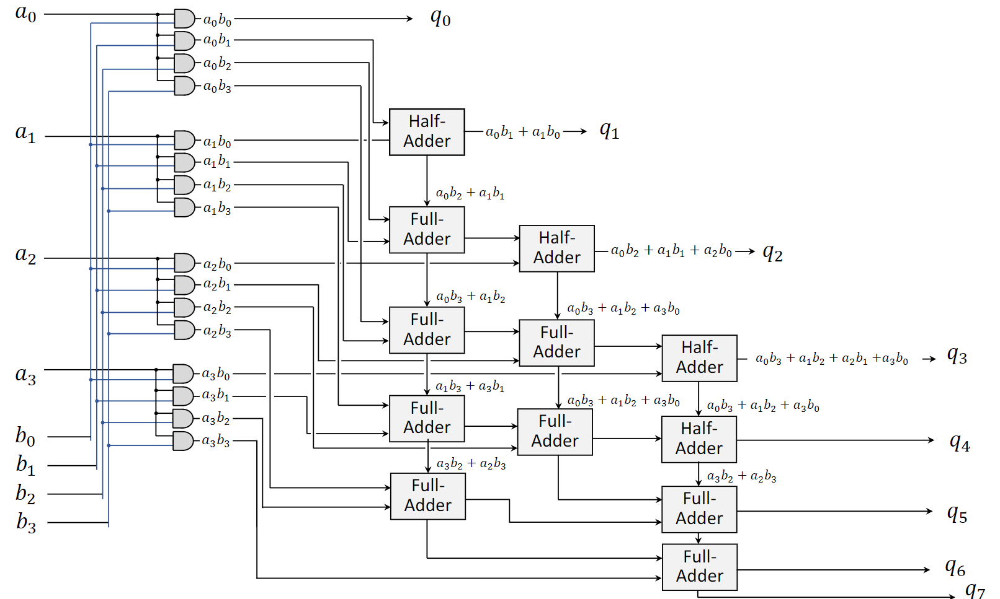{fig-align="center" width=80%}

###### **1.1.5 4-by-4 Bit Equality Checker**
**Equality checker** проверяет, совпадают ли два двоичных числа. Для $A = A_3A_2A_1A_0$ и $B = B_3B_2B_1B_0$ равенство выполняется тогда и только тогда, когда $A_i = B_i$ для всех $i$.

Реализация на **XNOR gates**:

- вентиль XNOR выдаёт 1 только если оба входа одинаковы;
- каждая пара ($A_0,B_0$), ($A_1,B_1$), … подаётся на отдельный XNOR;
- выходы четырёх XNOR входят в 4-входовый AND;
- итоговый выход AND равен 1 только если все четыре XNOR выдали 1, то есть все пары битов совпали.

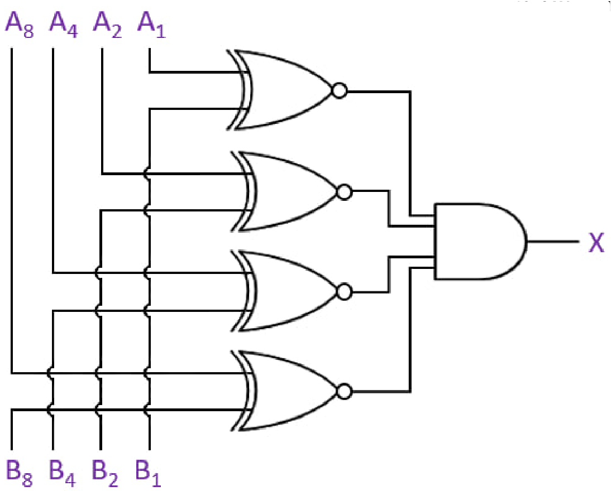{fig-align="center" width=80%}

##### **1.2 Защёлки и память**
В отличие от комбинационных схем, **sequential logic circuits** зависят от прошлого состояния — есть **memory**. Базовый элемент — **latch**.

###### **1.2.1 Универсальные вентили**
Любую функцию можно собрать только из **NAND** или только из **NOR** — они называются **universal gates**; это важно для построения последовательностных схем, включая latch.

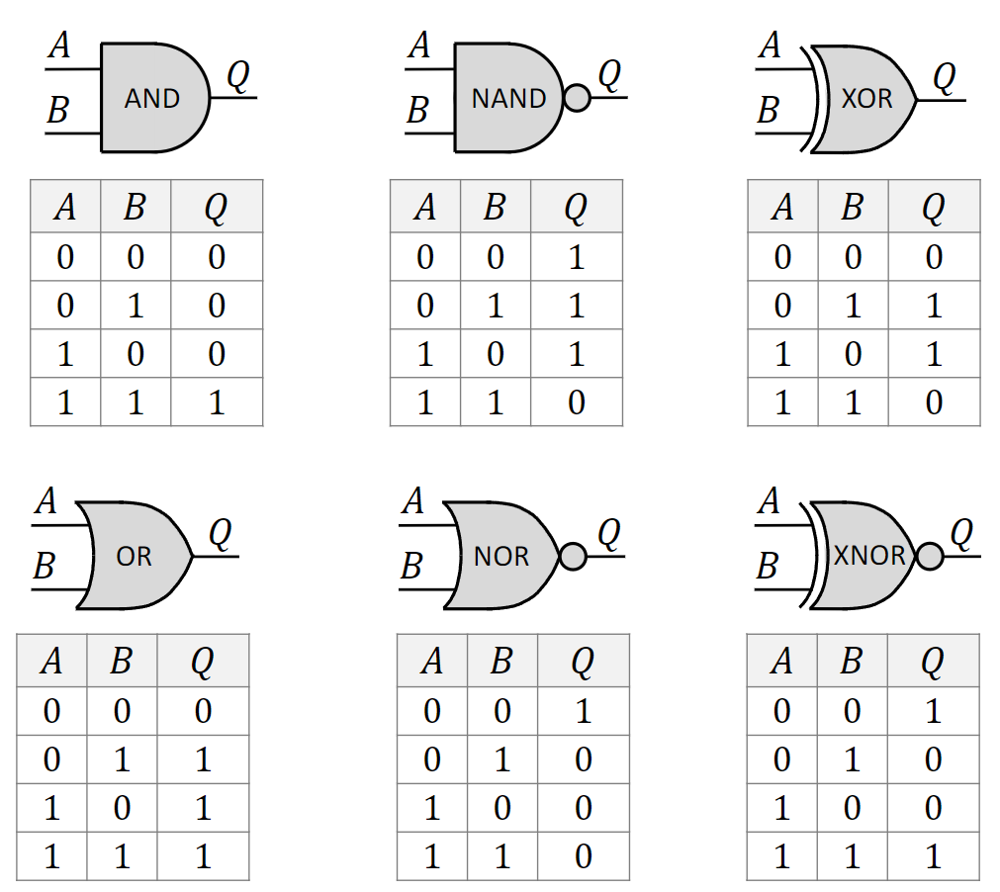{fig-align="center" width=80%}

###### **1.2.2 SR Latch на NOR**
**SR Latch** (Set-Reset): два перекрёстно соединённых NOR с обратной связью — хранение одного бита.

- Выход верхнего NOR → вход нижнего и наоборот.
- Входы S (Set) и R (Reset); выходы Q и $\bar{Q}$ (обычно инверсия Q).

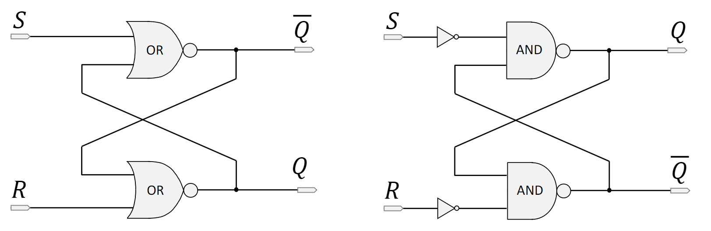{fig-align="center" width=80%}
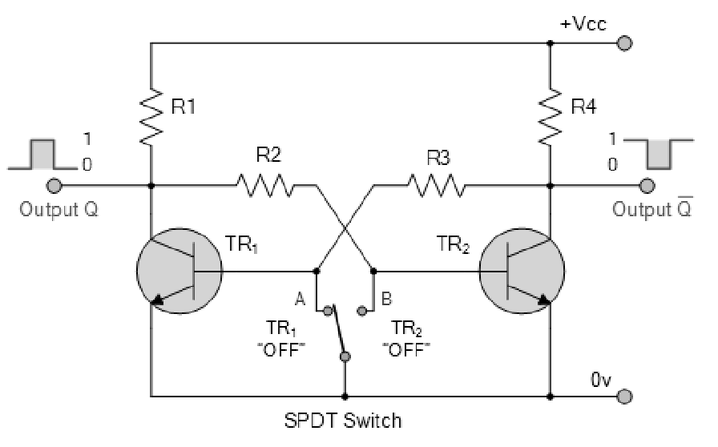{fig-align="center" width=80%}

###### **1.2.3 Поведение SR latch**
- **Set (S=1, R=0)**: Q=1, $\bar{Q}$=0.
- **Reset (S=0, R=1)**: Q=0, $\bar{Q}$=1.
- **Hold (S=0, R=0)**: сохраняется предыдущее состояние — эффект памяти.
- **Illegal/Forbidden State (S=1, R=1)**: Q и $\bar{Q}$ принудительно оба 0 — это нарушает условие, что $\bar{Q}$ должен быть инверсией Q; если затем S и R одновременно переходят в 0, следующее состояние непредсказуемо (**race condition**), поэтому комбинация входов недопустима.

SR latch — **bistable multivibrator**: два устойчивых состояния; хранит 1 бит.

###### **1.2.4 D Latch (Enable Latch)**
**D Latch** (**Data Latch** или **Enable Latch**) устраняет проблему недопустимых входов SR: есть входы D (**Data**) и E (**Enable**).

- при высоком E (1) защёлка *прозрачна*: Q повторяет D;
- при низком E (0) защёлка *закрыта*: D игнорируется, Q хранит последнее значение;
- внутренне комбинация S=1, R=1 не возникает.

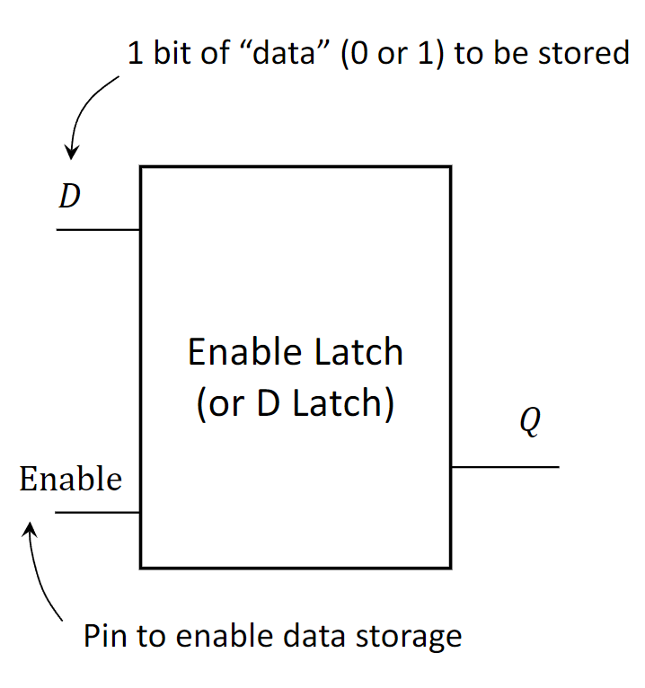{fig-align="center" width=80%}

##### **1.3 Finite State Machines (FSM)**
**Finite State Machine (FSM)**, или **Finite Automaton**, — абстрактная модель вычислений для проектирования цифровых схем и программ: конечное множество **states** и переходы между ними. SR latch — наглядный простой пример FSM.

###### **1.3.1 Определение FSM**
В каждый момент автомат в ровно одном **state** из конечного множества. Задаётся:

1. **States ($S$)** — например для SR: `Q=0`, `Q=1`, `uninitialized`, `invalid`.
2. **Initial State ($s_0$)** — старт, например `uninitialized`.
3. **Inputs ($I$)** — конечный набор входных комбинаций (четыре варианта S,R).
4. **Outputs ($O$)** — например значение Q.
5. **Transition Function** — следующее состояние по текущему состоянию и входу.

Автомат **deterministic**: для пары (состояние, вход) следующее состояние однозначно.

###### **1.3.2 Визуализация FSM**
- **State Transition Diagram** — граф состояний и переходов с подписями входов.
- **State Transition Table** — таблица «текущее состояние + вход → следующее состояние и выход».

Для SR на диаграмме будут переходы из `Q=0` в `Q=1` по входу `S=1,R=0` и петля удержания по `S=0,R=0`.

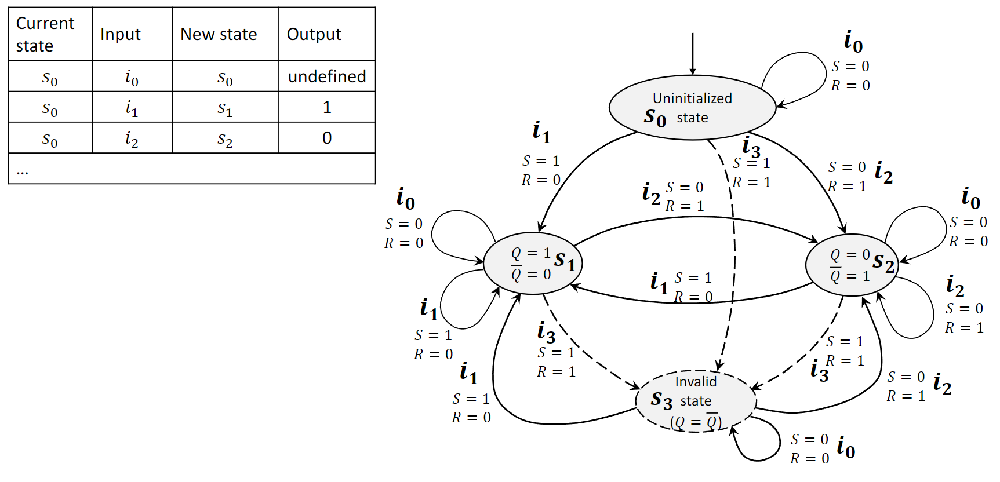{fig-align="center" width=80%}

***

#### **2. Определения**

*   **Arithmetic-Logic Unit (ALU)**: схема арифметики и побитовой логики в CPU.
*   **Multiplexer (MUX)**: выбор одного из сигналов на общий выход.
*   **Opcode**: код операции — сигнал выбора для ALU и подобных блоков.
*   **Full Adder**: сумматор трёх битов (A, B, carry-in) → sum и carry-out.
*   **Ripple-Carry Adder**: цепочка full adder’ов с «протеканием» переноса.
*   **Partial Products**: промежуточные произведения в двоичном умножении.
*   **Latch**: последовательностная схема на 1 бит; два устойчивых состояния.
*   **Universal Gate**: NAND или NOR — достаточно для любой логической функции.
*   **SR Latch**: Set-Reset защёлка; set, reset или удержание.
*   **D Latch**: прозрачная при Enable защёлка; безопаснее SR.
*   **Finite State Machine (FSM)**: конечное число состояний, переходы по входам, выходы/действия.
