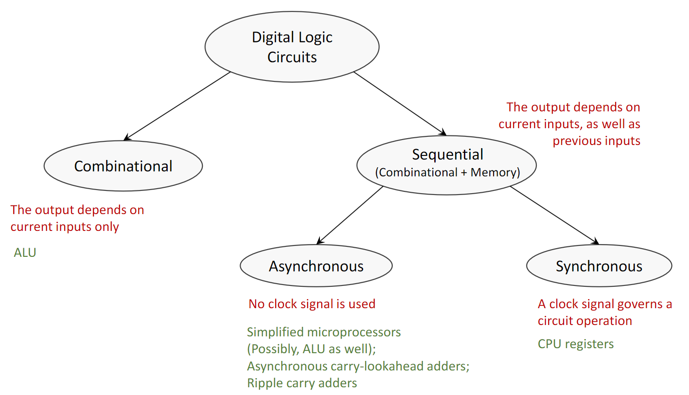
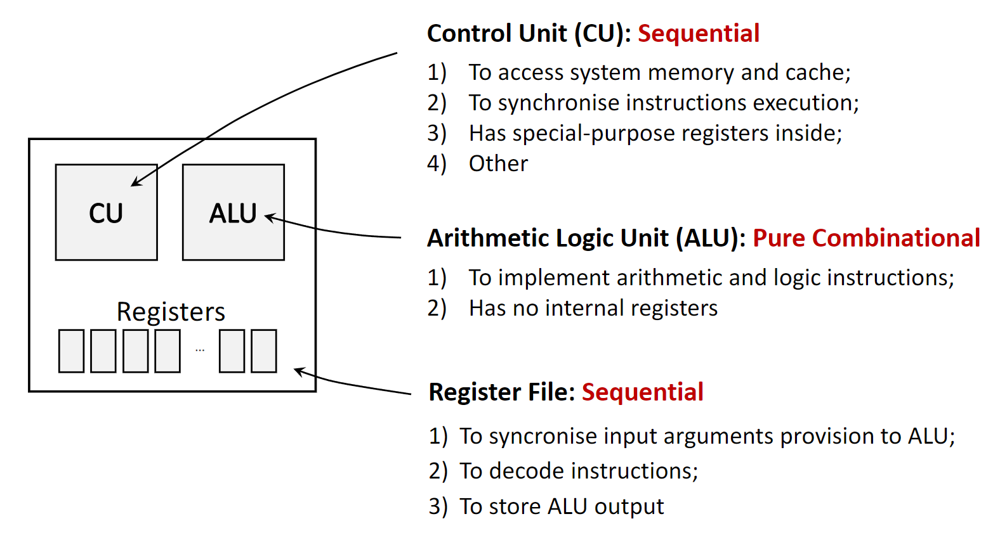
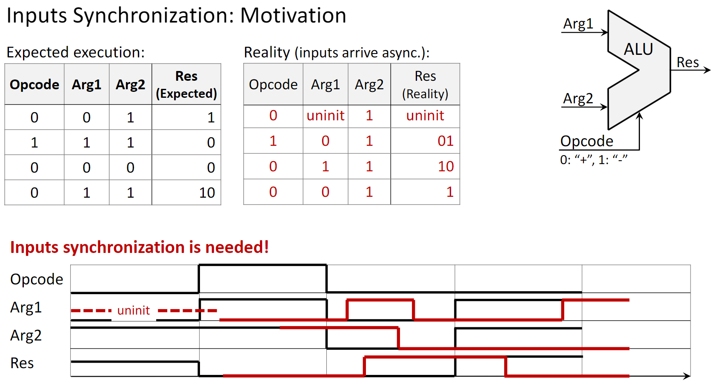
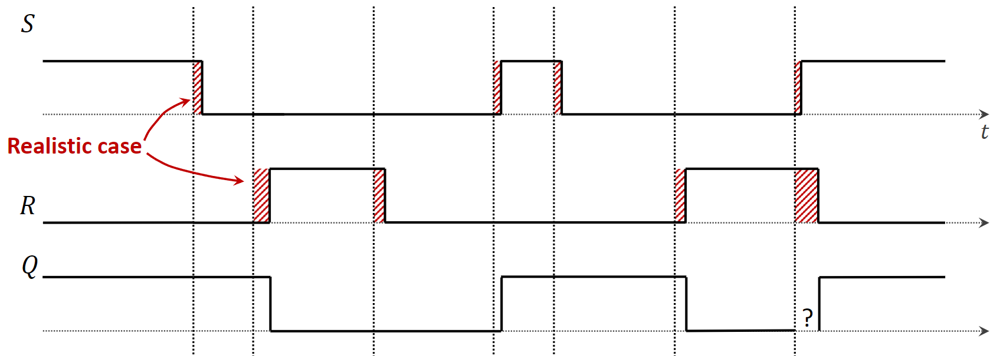
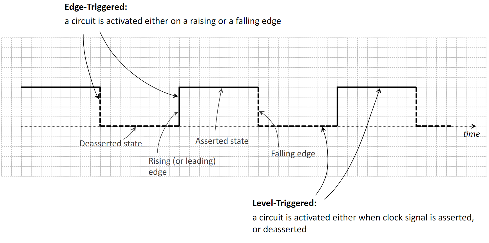
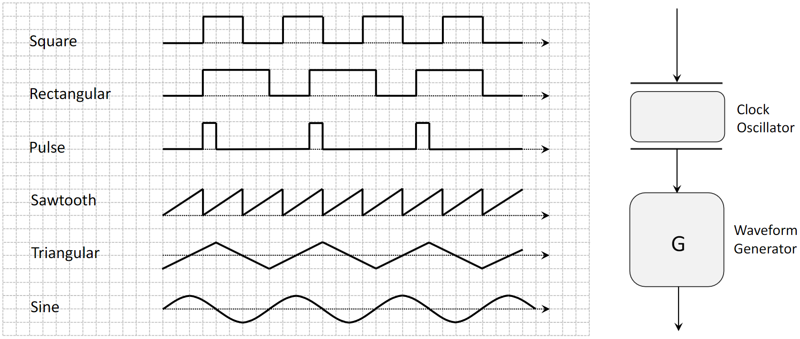
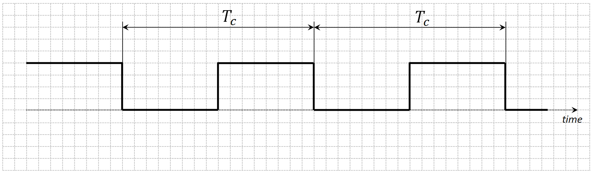
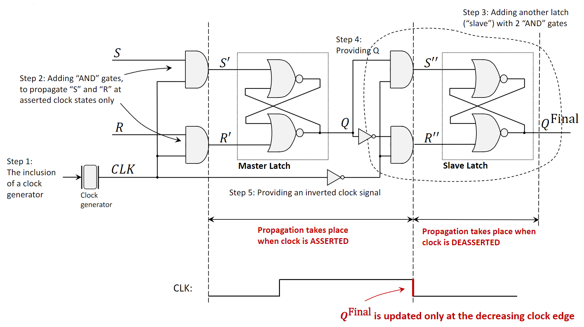
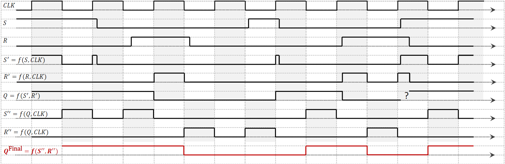
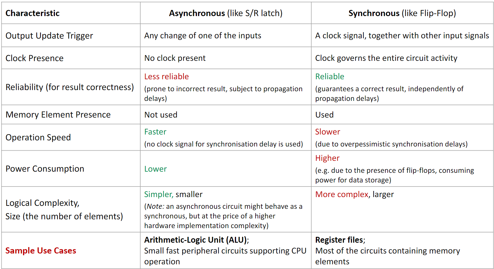



#### **1. Краткое содержание**

##### **1.1 Классификация цифровых схем**
Цифровые схемы делятся на два больших класса по работе с памятью и временем.

###### **1.1.1 Комбинационные схемы**
**Combinational circuit** — цифровая схема, у которой выход определяется *только текущими входами* (как у простого калькулятора: ответ зависит только от введённых сейчас чисел и операции).

-   **No Memory:** памяти нет — схема не хранит информацию о прошлых входах.
-   **No Clock:** работа не синхронизирована глобальным тактовым сигналом.
-   **Examples:** классический **adder circuit** для суммы двух битов; **Arithmetic Logic Unit (ALU)** в CPU — более сложный комбинационный блок для сложения, вычитания и т.д.

###### **1.1.2 Последовательностные схемы**
**Sequential circuit** сложнее: выход зависит не только от *текущих входов*, но и от *последовательности прошлых входов*, потому что есть **memory elements**, хранящие предыдущее состояние.

-   **Memory:** внутри — latch или **flip-flop**, регистры и т.п.
-   **Feedback:** сохранённая информация возвращается в схему и влияет на дальнейшие выходы.
-   **Examples:** регистры CPU, память, счётчики.

Дальше схемы делят по таймингу и синхронизации.

###### **1.1.2.1 Асинхронные последовательностные схемы**
**Asynchronous circuits** (ещё **self-timed** или **ripple-clock circuits**) не используют глобальный такт для согласования изменений: состояние меняется, как только меняются входы.

-   **Trigger:** переходы вызываются любым изменением входных сигналов.
-   **Timing:** скорость определяется **propagation delays** логических вентилей.
-   **Use Cases:** там, где важна скорость и трудно ввести глобальную синхронизацию — упрощённые микропроцессоры, **carry-lookahead adders**, интерфейсы связи; базовый асинхронный элемент памяти — **S/R Latch**.

###### **1.1.2.2 Синхронные последовательностные схемы**
**Synchronous circuits** используют общий **master clock**: все операции идут синхронно с тиками (или фронтами) такта — как у команды гребцов под команды рулевого.

-   **Trigger:** смена состояния по такту — обычно по нарастающему или спадающему фронту импульса.
-   **Timing:** такт задаёт ритм всей схемы и делает поведение упорядоченным и предсказуемым.
-   **Use Cases:** большинство современных цифровых систем, включая **CPU chips** и **register files**, синхронны — так проще проектировать и отлаживать; базовый синхронный элемент памяти — **Flip-Flop**.

{fig-align="center" width=80%}
{fig-align="center" width=80%}

##### **1.2 Зачем нужна синхронизация входов**
В реальной системе вроде CPU разные входные сигналы компонента (например, ALU) могут приходить с небольшим разбросом во времени из‑за разной длины путей и задержек — это называют **input skew**. Если ALU как комбинационная схема обрабатывает несинхронизированные входы «по мере прихода», она может на короткое время выдать неверный, «дребезжащий» выход до стабилизации операндов.

Синхронные системы ставят перед ALU **registers** на **flip-flop**: все регистры загружают данные на одном и том же фронте такта, и ALU получает уже стабильный, согласованный набор входов — результат становится корректным и предсказуемым.

{fig-align="center" width=80%}

##### **1.3 Элементы памяти: latch и flip-flop**

###### **1.3.1 S/R Latch (асинхронный)**
**S/R Latch** (**Set-Reset Latch**) — простейший элемент памяти; асинхронная схема из двух перекрёстно соединённых вентилей NOR.

-   **Set (S=1, R=0):** выход `Q` «устанавливается» в 1.
-   **Reset (S=0, R=1):** `Q` «сбрасывается» в 0.
-   **Hold (S=0, R=0):** `Q` сохраняет предыдущее значение — это и есть память.
-   **Illegal State (S=1, R=1):** комбинация запрещена: для NOR-защёлки оба выхода принуждаются к 0, а при одновременном возврате S и R в 0 итоговое состояние непредсказуемо (**race condition**).

Дополнительная проблема — чувствительность к задержкам распространения: если S и R должны измениться одновременно, но один сигнал запаздывает, защёлка может на мгновение оказаться в недопустимом состоянии и дать ошибку.

{fig-align="center" width=80%}

###### **1.3.2 Тактовый сигнал**
**Clock signal** — периодическая «меандровая» волна от **clock oscillator**.

-   **Asserted State:** высокий уровень напряжения (логическая 1).
-   **Deasserted State:** низкий уровень (логическая 0).
-   **Rising Edge:** переход из низкого в высокий.
-   **Falling Edge:** переход из высокого в низкий.
-   **Clock Period ($T_c$):** длительность одного полного цикла (например, в наносекундах).
-   **Clock Frequency ($F_c$):** число циклов в секунду ($1/T_c$), измеряется в герцах (Гц) или гигагерцах (ГГц).

Реакция на такт:

- **Level-triggered** — активность всё время, пока clock в заданном уровне; типично для **latch**.
- **Edge-triggered** — срабатывание только на фронте; типично для **flip-flop**.

{fig-align="center" width=80%}
{fig-align="center" width=80%}
{fig-align="center" width=80%}

###### **1.3.3 Flip-flop (синхронный)**
**Flip-flop** — **edge-triggered** элемент памяти: состояние меняется только на фронте такта, что снимает часть проблем «голой» защёлки. Частая реализация — **Master-Slave Flip-Flop**: два latch, **master latch** и **slave latch**, включены последовательно.

1.  **Clock is High (Asserted):** master открыт и принимает внешние S и R; slave закрыт и удерживает предыдущее значение выхода.
2.  **Clock goes Low (Falling Edge):** master запирается с зафиксированным значением; slave открывается и переносит уже стабильный выход master на выход каскада.

Итоговый выход flip-flop (со slave) обновляется на **falling edge** такта: выход изолирован от шумов и изменений входов, пока такт высокий, — за один период такта получается один «чистый» сдвиг состояния.

{fig-align="center" width=80%}
{fig-align="center" width=80%}

##### **1.4 Сравнение: асинхронные и синхронные схемы**

{fig-align="center" width=80%}

***

#### **2. Определения**

*   **Combinational Circuit:** выход только от текущих входов, без памяти.
*   **Sequential Circuit:** выход от текущих входов и истории; нужны элементы памяти.
*   **Asynchronous Circuit:** без глобального такта; реакция на изменения входов.
*   **Synchronous Circuit:** состояния меняются в дискретные моменты по clock.
*   **Clock Signal:** периодический сигнал синхронизации.
*   **Clock Oscillator:** устройство, которое генерирует стабильный периодический такт (часто преобразуя постоянный ток в переменный сигнал заданной частоты).
*   **Latch:** элемент, чувствительный к **уровню** такта (прозрачен при активном уровне).
*   **Flip-flop:** элемент, чувствительный к **фронту** такта.
*   **Level-Triggered:** активен всё время удержания управляющего уровня.
*   **Edge-Triggered:** активен только на переходе сигнала.
*   **Master-Slave Flip-Flop:** два latch; master ловит вход на одном уровне такта, slave обновляет выход на противоположном перепаде.
