

[Quiz](https://notebooklm.google.com/notebook/10ea61f7-7eb6-46b2-9183-d13f960171e9?artifactId=b24c1665-498a-4a90-9a61-b8ffc92c5b59) | [Flashcards](https://notebooklm.google.com/notebook/10ea61f7-7eb6-46b2-9183-d13f960171e9?artifactId=9b7f69ab-b0ba-4ebd-82aa-8690316ed710)

#### **1. Краткое содержание**

##### **1.1 SystemVerilog как Hardware Description Language (HDL)**

**Hardware Description Language (HDL)** — специализированный язык для описания структуры и поведения электронных схем, прежде всего цифровой логики. В отличие от программы, которая исполняется на процессоре, HDL описывает физическое **hardware**: как соединены вентили и как они должны работать. **SystemVerilog** — современный мощный HDL для проектирования и верификации цифровых чипов.

##### **1.2 Проектирование мультиплексора 2-к-1**

###### **1.2.1 Логическая схема**

**Multiplexer (Mux)** — базовая цифровая схема, которая по **select lines** подключает один из входных сигналов к одному выходу.

У мультиплексора 2-к-1:

- два входа данных `i1` и `i2`;
- одна линия выбора `s`;
- выход `q`.

Поведение:

- если `s = 0`, то `q = i1`;
- если `s = 1`, то `q = i2`.

Схему собирают из двух AND, одного OR и одного NOT.

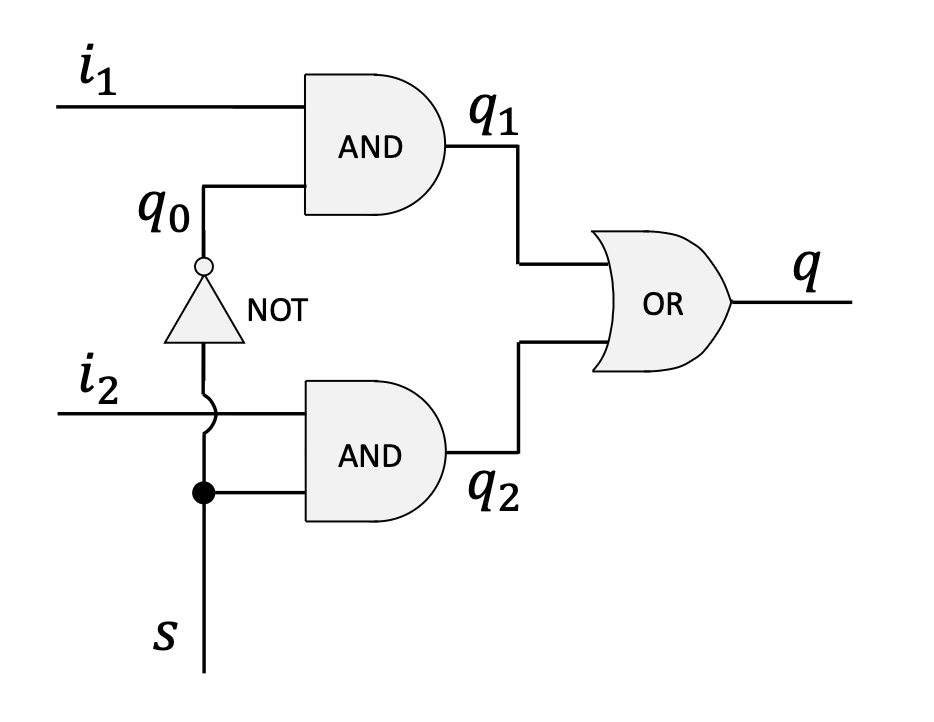{fig-align="center" width=80%}

###### **1.2.2 Реализация на Verilog**

Ниже — описание модуля на SystemVerilog.

```verilog
// 1. Module Definition: Declares a new hardware module named 'mux'.
//    The parentheses list all external connection points (pins):
//    three inputs (i1, i2, s) and one output (q).
module mux (i1, i2, s, q);

  // 2. Pin Direction Declaration: Specifies which pins are inputs
  //    and which are outputs.
  input  i1, i2, s;
  output q;

  // 3. Internal Wires: Declares internal wires to connect the
  //    logic gates. These are not visible from outside the module.
  wire q0, q1, q2;

  // 4. Gate Instantiation: Describes the logic gates and their
  //    connections. For Verilog primitives, the output pin is
  //    always listed first.
  
  // A NOT gate to invert the select signal 's'. Output is 'q0'.
  not(q0, s);
  
  // An AND gate combining input 'i1' and the inverted select 'q0'.
  // Output is 'q1'.
  and(q1, i1, q0);
  
  // An AND gate combining input 'i2' and the original select 's'.
  // Output is 'q2'.
  and(q2, i2, s);
  
  // An OR gate to combine the outputs of the two AND gates.
  // The final result is the module's output 'q'.
  or(q, q1, q2);

// 5. End of Module Definition
endmodule
```

###### **1.2.3 Варианты синтаксиса объявления портов**

В SystemVerilog можно компактно задать направление прямо в списке портов — семантически эквивалентно предыдущему варианту.

```verilog
module mux (
  input  i1,
  input  i2,
  input  s,
  output q
);
  // ... module logic ...
endmodule
```

##### **1.3 Операторы Verilog и continuous assignment**

###### **1.3.1 Операторы Verilog**

Вместо примитивных вентилей логику часто задают операторами «как в языке программирования»:

- `~`: побитовое NOT
- `&`: побитовое AND
- `|`: побитовое OR
- `^`: побитовое XOR
- `?:`: тернарный оператор

###### **1.3.2 Continuous assignment с `assign`**

Ключевое слово **`assign`** задаёт **continuous assignment**: прямую **комбинационную** связь правой части с выходом слева. При любом изменении входов справа выражение немедленно пересчитывается — удобный способ описать **combinational logic** без состояния.

Например, `and(q1, i1, q0);` можно переписать так:

```verilog
assign q1 = i1 & q0;
```

Это описывает поведение без явного именования вентиля.

##### **1.4 Альтернативные реализации MUX**

С помощью `assign` MUX записывают короче.

- **С промежуточными проводами:**

```verilog
module mux (i1, i2, s, q);
  input  i1, i2, s;
  output q;
  wire   q0, q1, q2;

  assign q0 = ~s;
  assign q1 = i1 & q0;
  assign q2 = i2 & s;
  assign q  = q1 | q2;
endmodule
```

- **Компактно, в одну строку:**

```verilog
module mux (i1, i2, s, q);
  input  i1, i2, s;
  output q;

  assign q = (i1 & ~s) | (i2 & s);
endmodule
```

##### **1.5 Процедурные блоки с `always_comb`**

###### **1.5.1 Блок `always_comb`**

**Procedural block** — ещё один стиль описания. **`always_comb`** предназначен для **комбинационной** логики: синтезатор ожидает, что блок «срабатывает» при изменении любого релевантного входного сигнала.

- переменные внутри `always` должны быть переменного типа, например `logic`; выход задают как `output logic q;`.
- тело — между `begin` и `end`.

```verilog
module mux (i1, i2, s, q);
  input  i1, i2, s;
  output logic q; // 'q' must be a variable type

  always_comb
  begin
    q = (i1 & ~s) | (i2 & s);
  end
endmodule
```

###### **1.5.2 Blocking assignments**

Внутри `always_comb` используют **blocking assignments** с оператором `=` — строки исполняются последовательно; следующая не начнётся, пока не завершится текущая. Это стандарт для моделирования комбинационной логики.

##### **1.6 Условная логика в `always_comb`**

Процедурные блоки позволяют писать более абстрактно — через `if`/`case`.

###### **1.6.1 `if-else`**

Поведение MUX естественно записать через `if-else`:

```verilog
always_comb
begin
  if (s == 0)
    q = i1;
  else
    q = i2;
end
```

###### **1.6.2 `case`**

`case` часто удобнее при большем числе ветвей:

```verilog
always_comb
begin
  case (s)
    0: q = i1;
    1: q = i2;
  endcase
end
```

###### **1.6.3 Важное замечание о полноте описания**

В **чисто комбинационном** `always_comb` нужно определить выход при **всех** возможных комбинациях входов. Если ветка не покрыта (например, `if` без `else`), синтезатор может вывести **latch** — элемент памяти, удерживающий предыдущее значение. Для комбинационной логики это обычно ошибка: дописывайте `else` и ветку `default` в `case`.

##### **1.7 RTL Viewer**

В **Intel Quartus Prime** есть **RTL (Register-Transfer Level) Viewer** — по SystemVerilog строится схема синтезированного **hardware**. Это помогает убедиться, что схема соответствует замыслу. Для MUX 2-к-1 итоговая логика после примитивов, `assign` или `always_comb` должна быть эквивалентна.

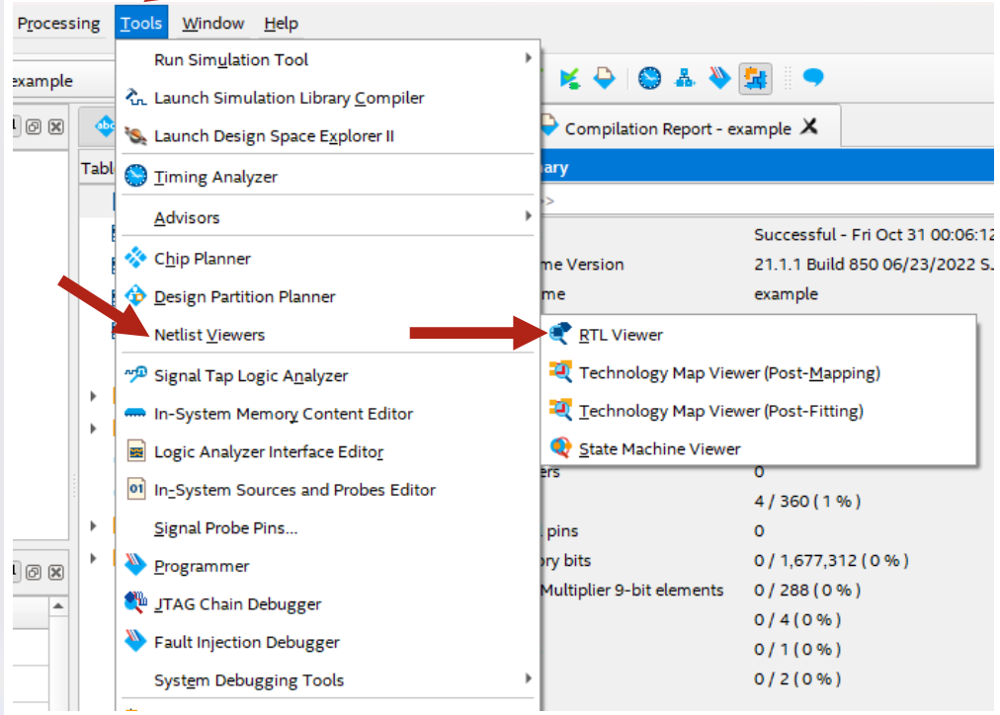{fig-align="center" width=80%}

##### **1.8 Иерархия памяти и типы**

###### **1.8.1 Обзор иерархии**
Система балансирует скорость, стоимость и объём: чем ближе память к CPU, тем она быстрее и дороже за байт, но меньше по объёму.

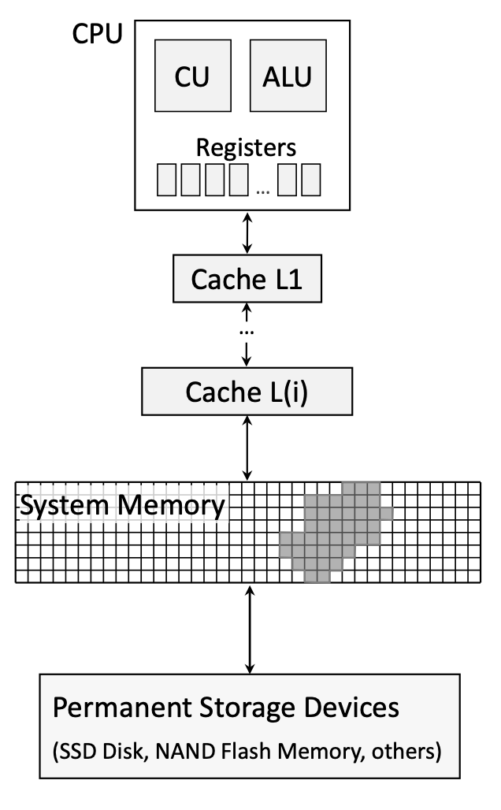{fig-align="center" width=40%}

Типичная иерархия:

1. **CPU Registers** — внутри CPU, минимальная задержка.
2. **CPU Cache (L1, L2, L3)** — между CPU и основной памятью.
3. **System Memory (Main Memory / RAM)** — крупнее, медленнее кэша.
4. **Permanent Storage Devices** — SSD/HDD и т.п., самый медленный и самый ёмкий уровень.

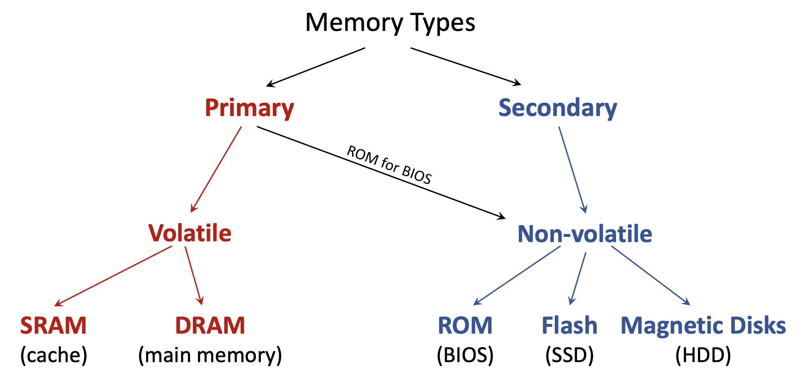{fig-align="center" width=80%}

###### **1.8.2 Volatile и non-volatile**

- **Volatile Memory** — теряет данные без питания (регистры, кэш SRAM, DRAM).
- **Non-Volatile Memory** — сохраняет данные (SSD, HDD, USB).

###### **1.8.3 Primary и secondary memory**

- **Primary Memory** — память, с которой CPU работает напрямую; почти всегда volatile (кэш, RAM, ROM с BIOS).
- **Secondary Memory** — накопители: данные сначала подгружаются в primary; non-volatile.

###### **1.8.4 RAM, SAM и ROM**

- **RAM (Random Access Memory)** — доступ к адресам в произвольном порядке при почти одинаковой задержке; и SRAM, и DRAM — RAM.
- **SAM (Sequential Access Memory)** — линейный доступ (ленточные накопители).
- **ROM (Read-Only Memory)** — в «чистом» виде только чтение; прошивки, BIOS.

##### **1.9 Принципы локальности**

Иерархия эффективна из‑за **locality**:

- **Temporal Locality** — повторные обращения к тем же адресам; кэш держит «недавнее» рядом с CPU.
- **Spatial Locality** — склонность обращаться к адресам рядом с уже использованными (например, при проходе по массиву); кэши используют это, подтягивая целые **blocks** данных за один раз.

##### **1.10 DRAM (Dynamic RAM)**

DRAM — основная технология **main memory** в большинстве ПК. «Dynamic» означает необходимость **refresh** — периодического восстановления заряда.

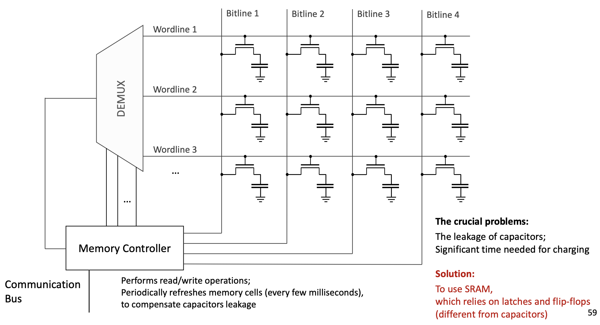{fig-align="center" width=80%}

###### **1.10.1 Ячейка DRAM**

Один бит — это **transistor** + **capacitor**:

- **Charged** (заряжен) = 1
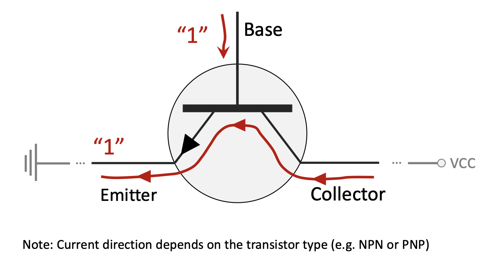{fig-align="center" width=80%}
- **Discharged** (разряжен) = 0
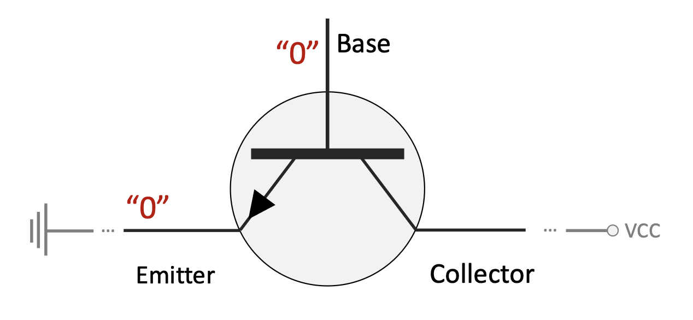{fig-align="center" width=80%}

###### **1.10.2 Чтение/запись**

Ячейки DRAM выстроены в решётку.

- **Wordlines** идут горизонтально и подключаются к затворам транзисторов в строке.
- **Bitlines** идут вертикально и подключаются к стоку/истоку транзисторов в столбце.
- **To Write Data:** контроллер памяти активирует нужную **wordline**, открывая все транзисторы в этой строке, затем подаёт напряжение на выбранную **bitline**, чтобы зарядить конденсатор (логическая «1») или разрядить его («0») в целевой ячейке.
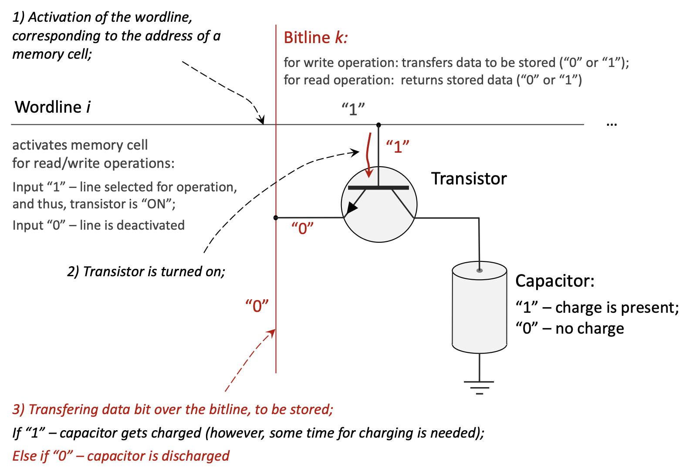{fig-align="center" width=80%}
- **To Read Data:** при активной **wordline** транзистор открывается; если конденсатор заряжен, небольшой ток попадает на **bitline**, и **sense amplifier** распознаёт «1». Чтение **деструктивно** разряжает конденсатор, поэтому контроллер сразу же **rewrite** (перезаписывает) значение обратно.
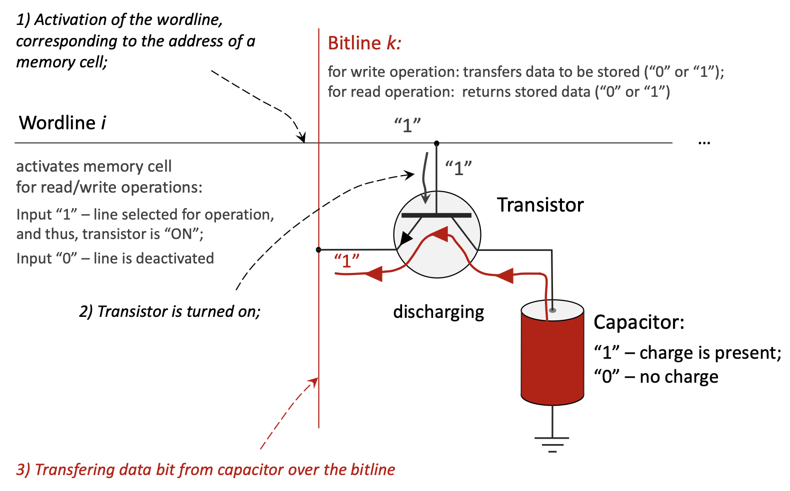{fig-align="center" width=80%}

###### **1.10.3 Проблемы DRAM**

- **Capacitor Leakage** — утечка заряда за миллисекунды → нужны **refresh cycles**.
- **Charge/Discharge Time** — не мгновенно → вклад в latency доступа.

##### **1.11 SRAM (Static RAM)**

SRAM — технология кэшей и регистров; «static» — без refresh, пока есть питание.

###### **1.11.1 Ячейка SRAM**

Без отдельного конденсатора как в DRAM: **latch** / **flip-flop**, обычно 4–6 транзисторов; два устойчивых состояния; обратная связь удерживает бит.

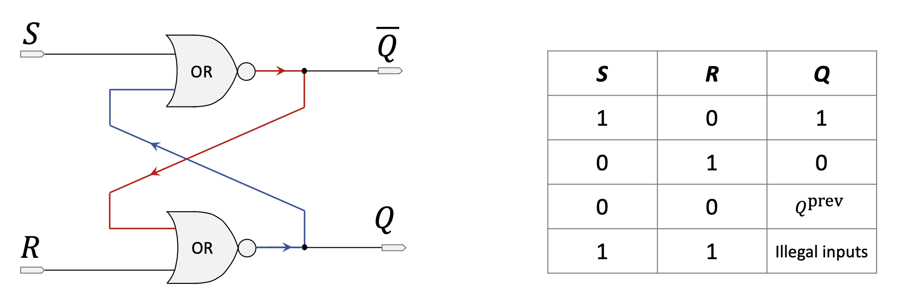{fig-align="center" width=80%}
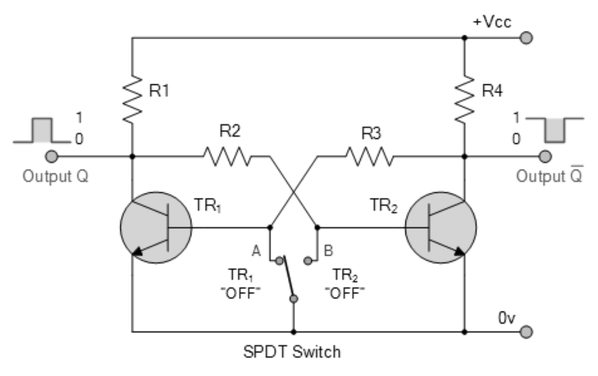{fig-align="center" width=80%}

##### **1.12 Сравнение SRAM и DRAM**

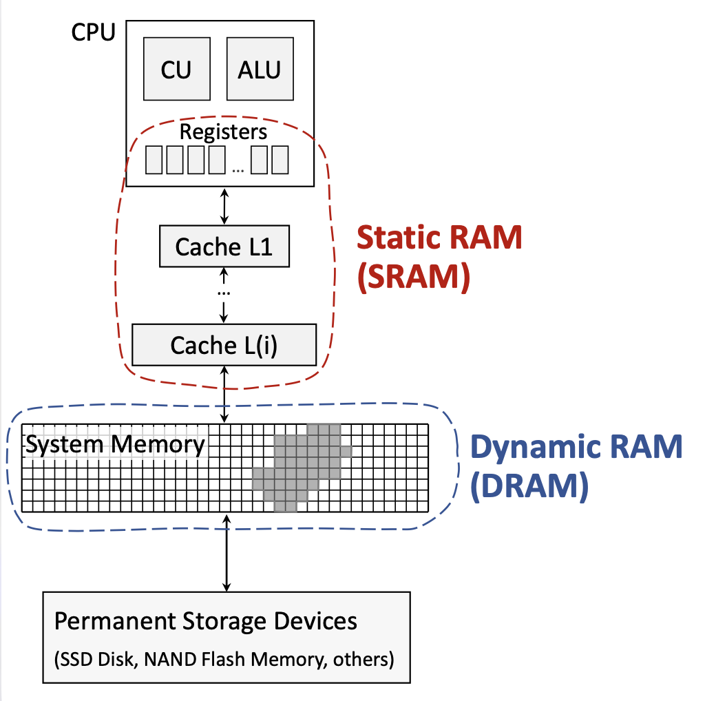{fig-align="center" width=40%}

| Характеристика | SRAM (Static RAM) | DRAM (Dynamic RAM) |
|----------------|-------------------|--------------------|
| **Элемент хранения** | Flip-flop (4–6 транзисторов) | Конденсатор + транзистор (по одному) |
| **Скорость доступа** | **Существенно быстрее** (порядка 1–10 нс) | Медленнее (порядка 50–100 нс) |
| **Стоимость за байт** | **Дороже** | **Дешевле** |
| **Плотность / объём** | Ниже плотность, меньше ёмкость | **Выше плотность**, больше ёмкость |
| **Организация** | Более сложная ячейка | Проще |
| **Утечки / refresh** | Пренебрежимо; refresh не нужен | **Существенно**; постоянные циклы refresh |
| **Потребление** | Ниже в простое | Выше из‑за refresh |
| **Надёжность** | Выше | Ниже (чувствительность к soft errors) |
| **Volatile** | **Да** | **Да** |
| **Типичное применение** | **CPU caches**, регистры | **Main system memory** |

***

#### **2. Определения**

*   **Hardware Description Language (HDL)**: язык для описания структуры и поведения электронных схем.
*   **Multiplexer (Mux)**: схема выбора одного из входов на выход по управляющему сигналу.
*   **Continuous Assignment**: в Verilog — `assign`, модель комбинационной связи входов с выходом.
*   **Procedural Block**: блок вроде `always_comb`, описывающий поведение по правилам чувствительности.
*   **Blocking Assignment (`=`)**: блокирующее присваивание в процедурном блоке.
*   **Volatile Memory**: требует питания для хранения.
*   **Non-Volatile Memory**: сохраняет данные без питания.
*   **Primary Memory**: основная память, доступная CPU напрямую.
*   **Secondary Memory**: внешние накопители; доступ через загрузку в primary.
*   **RAM (Random Access Memory)**: память с почти равномерным временем доступа к адресам.
*   **DRAM (Dynamic RAM)**: RAM на конденсаторах с обязательным refresh.
*   **SRAM (Static RAM)**: RAM на защёлках/триггерах; быстрее DRAM, без refresh.
*   **ROM (Read-Only Memory)**: non-volatile память для прошивок (BIOS).
*   **Transistor**: полупроводниковый ключ/усилитель — базовый элемент схем.
*   **Capacitor**: пассивный элемент для хранения электрической энергии в поле.
*   **Latch / Flip-Flop**: элемент с двумя устойчивыми состояниями для хранения 1 бита.
*   **Temporal Locality**: повторные обращения к тем же адресам в ближайшем будущем.
*   **Spatial Locality**: обращения к соседним адресам после доступа к данному адресу.

***

#### **3. Примеры**

***

#### **3.1 Задание 1: демультиплексор 1-к-4** (Лаба 8, Задание 1)
Раздел описывает проект **1-to-4 demultiplexer** на процедурном `always` и **testbench** для проверки.

<details>
<summary>Нажмите, чтобы увидеть решение</summary>

```verilog
// Module: demux_1_to_4
// Description: Implements a 1-to-4 demultiplexer.
// It takes one data input (din), two select lines (sel),
// and routes the input to one of the four output lines (dout).
module demux_1_to_4(
    input din,          // Data input
    input [1:0] sel,    // 2-bit select line
    output reg [3:0] dout // 4-bit data output
);

    // The 'always' block is sensitive to any changes in the inputs (din or sel).
    // This is a combinatorial circuit, so any input change should immediately
    // affect the output.
    always @(din or sel) begin
        // A case statement is used to check the value of the 'sel' input.
        case(sel)
            2'b00: dout = {3'b000, din}; // If sel is 00, route din to dout[0].
            2'b01: dout = {2'b00, din, 1'b0};  // If sel is 01, route din to dout[1].
            2'b10: dout = {1'b0, din, 2'b00};   // If sel is 10, route din to dout[2].
            2'b11: dout = {din, 3'b000}; // If sel is 11, route din to dout[3].
            default: dout = 4'b0000;      // Default case to avoid latches.
        endcase
    end

endmodule

//
// Testbench for the 1-to-4 Demultiplexer
//
// Description: This module is for simulation purposes to test the
// correctness of the demux_1_to_4 design. It is not synthesizable.
// Part c) of the assignment requires testing on an FPGA, but a simulation
// like this is the first step to verify the logic.
module demux_1_to_4_tb;

    // Declare variables to connect to the demultiplexer module.
    reg din_tb;         // Testbench register for data input
    reg [1:0] sel_tb;   // Testbench register for select lines
    wire [3:0] dout_tb; // Testbench wire for data output

    // Instantiate the module under test (UUT).
    demux_1_to_4 uut (
        .din(din_tb),
        .sel(sel_tb),
        .dout(dout_tb)
    );

    // Initial block to define the sequence of test inputs.
    initial begin
        // Display a header for the simulation output.
        $display("Time\t sel\t din\t dout");

        // Test case 1: sel = 00, din = 1
        sel_tb = 2'b00; din_tb = 1; #10;
        $display("%g\t %b\t %b\t %b", $time, sel_tb, din_tb, dout_tb);

        // Test case 2: sel = 01, din = 1
        sel_tb = 2'b01; din_tb = 1; #10;
        $display("%g\t %b\t %b\t %b", $time, sel_tb, din_tb, dout_tb);

        // Test case 3: sel = 10, din = 1
        sel_tb = 2'b10; din_tb = 1; #10;
        $display("%g\t %b\t %b\t %b", $time, sel_tb, din_tb, dout_tb);
        
        // Test case 4: sel = 11, din = 1
        sel_tb = 2'b11; din_tb = 1; #10;
        $display("%g\t %b\t %b\t %b", $time, sel_tb, din_tb, dout_tb);

        // Test case 5: sel = 01, din = 0 (to show din is passed correctly)
        sel_tb = 2'b01; din_tb = 0; #10;
        $display("%g\t %b\t %b\t %b", $time, sel_tb, din_tb, dout_tb);
        
        // End the simulation.
        $finish;
    end

endmodule

// Part b) of the assignment, "Make necessary pin assignments in Pin Planner of Quartus Prime",
// is a step performed within the Quartus software GUI. It involves mapping the Verilog
// ports (din, sel, dout) to the physical pins of the FPGA chip. This cannot be done in code.

// Part c), "Upload the design into FPGA and test program correctness", is the physical
// process of programming the FPGA and verifying its operation with hardware,
// for example, by connecting LEDs to the output pins and switches to the input pins.
```

</details>

***

#### **3.2 Задание 2: 4-битный сумматор** (Лаба 8, Задание 2)
Код Verilog для `halfadder`, `fulladder`, верхнего уровня `adder4bit` и тестбенча.

<details>
<summary>Нажмите, чтобы увидеть решение</summary>

```verilog
//
// Part a) Design halfadder module
//
// Description: A half adder adds two single bits (a and b)
// and produces a sum and a carry output.
module halfadder(
    input a, b,         // 1-bit inputs
    output sum, carry   // 1-bit outputs
);
    // Assign sum using XOR operation.
    assign sum = a ^ b;
    // Assign carry using AND operation.
    assign carry = a & b;
endmodule

//
// Part b) Design fulladder module
//
// Description: A full adder adds three single bits (a, b, and cin)
// and produces a sum and a carry output (cout).
// It can be built from two half adders and an OR gate.
module fulladder(
    input a, b, cin,      // 1-bit inputs (cin is carry-in)
    output sum, cout      // 1-bit outputs (cout is carry-out)
);
    // Intermediate wires to connect the half adders.
    wire ha1_sum, ha1_carry, ha2_carry;

    // First half adder to add input 'a' and 'b'.
    halfadder ha1 (
        .a(a),
        .b(b),
        .sum(ha1_sum),
        .carry(ha1_carry)
    );

    // Second half adder to add the sum from the first half adder and the carry-in.
    halfadder ha2 (
        .a(ha1_sum),
        .b(cin),
        .sum(sum), // Final sum output
        .carry(ha2_carry)
    );

    // The final carry-out is the OR of the carries from both half adders.
    assign cout = ha1_carry | ha2_carry;
endmodule

//
// Part c) Design Top-Level-Entity adder4bit
//
// Description: This module implements a 4-bit ripple-carry adder.
// It uses one halfadder for the least significant bit (LSB) and
// three fulladders for the remaining bits.
module adder4bit(
    input [3:0] a, b,  // 4-bit input values
    output [3:0] sum,  // 4-bit sum output
    output cout        // 1-bit final carry-out
);
    // Intermediate wires for the carry between the adders.
    wire c0, c1, c2;

    // LSB Adder (Bit 0): Use a halfadder since there is no initial carry-in.
    halfadder ha (
        .a(a[0]),
        .b(b[0]),
        .sum(sum[0]),
        .carry(c0)
    );

    // Bit 1 Adder: Use a fulladder with the carry from the previous stage.
    fulladder fa1 (
        .a(a[1]),
        .b(b[1]),
        .cin(c0),
        .sum(sum[1]),
        .cout(c1)
    );

    // Bit 2 Adder: Use a fulladder.
    fulladder fa2 (
        .a(a[2]),
        .b(b[2]),
        .cin(c1),
        .sum(sum[2]),
        .cout(c2)
    );

    // MSB Adder (Bit 3): Use a fulladder. The cout from this is the final carry.
    fulladder fa3 (
        .a(a[3]),
        .b(b[3]),
        .cin(c2),
        .sum(sum[3]),
        .cout(cout) // Final carry-out of the 4-bit addition
    );

endmodule

//
// Testbench for the 4-bit Adder
//
// Description: This module tests the adder4bit module by providing
// various input values and displaying the results.
module adder4bit_tb;

    // Declare variables to connect to the 4-bit adder module.
    reg [3:0] a_tb, b_tb;
    wire [3:0] sum_tb;
    wire cout_tb;

    // Instantiate the module under test (UUT).
    adder4bit uut (
        .a(a_tb),
        .b(b_tb),
        .sum(sum_tb),
        .cout(cout_tb)
    );

    // Initial block to define the sequence of test inputs.
    initial begin
        // Display a header for the simulation output.
        $display("Time\t a\t b\t cout\t sum");

        // Test case 1: 3 + 2 = 5
        a_tb = 4'd3; b_tb = 4'd2; #10;
        $display("%g\t %d\t %d\t %b\t %d", $time, a_tb, b_tb, cout_tb, sum_tb);

        // Test case 2: 7 + 1 = 8
        a_tb = 4'd7; b_tb = 4'd1; #10;
        $display("%g\t %d\t %d\t %b\t %d", $time, a_tb, b_tb, cout_tb, sum_tb);

        // Test case 3: 9 + 8 = 17 (results in a carry-out)
        a_tb = 4'd9; b_tb = 4'd8; #10;
        $display("%g\t %d\t %d\t %b\t %d", $time, a_tb, b_tb, cout_tb, sum_tb);
        
        // Test case 4: 15 + 15 = 30 (maximum values with carry)
        a_tb = 4'b1111; b_tb = 4'b1111; #10;
        $display("%g\t %d\t %d\t %b\t %d", $time, a_tb, b_tb, cout_tb, sum_tb);

        // End the simulation.
        $finish;
    end

endmodule
```

</details>
