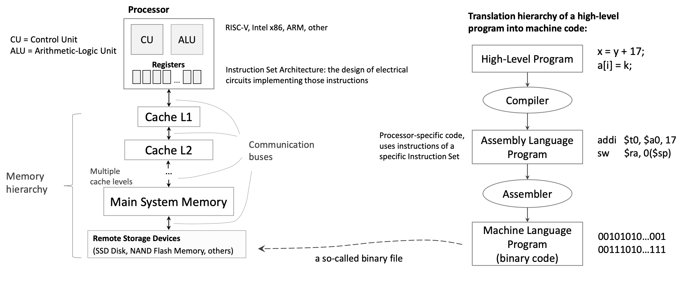
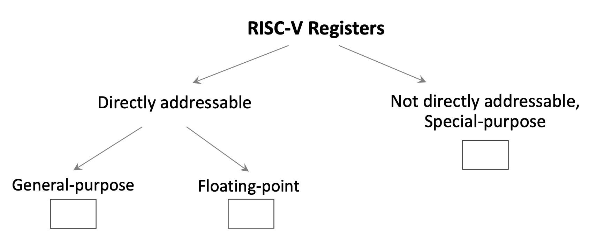
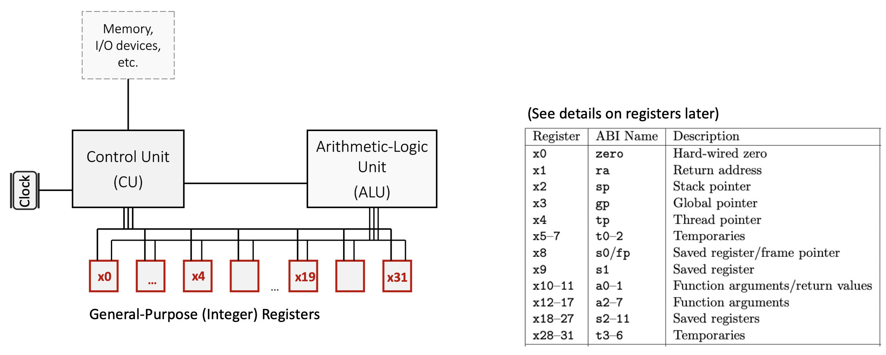
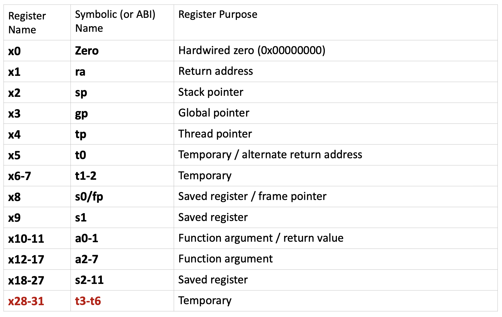
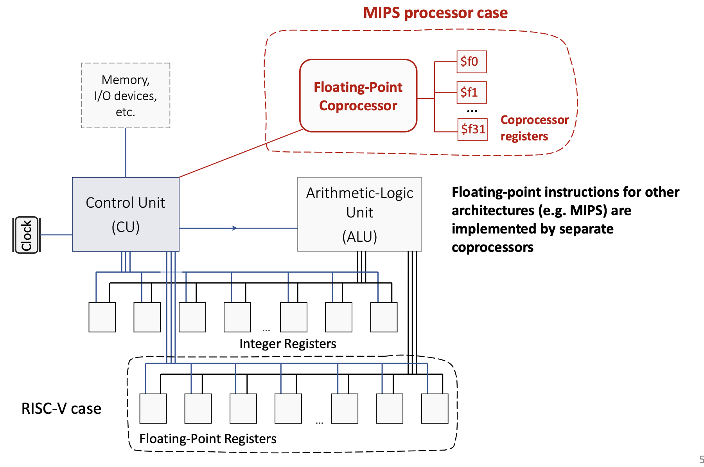
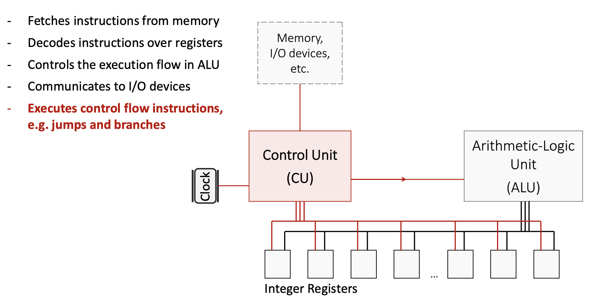
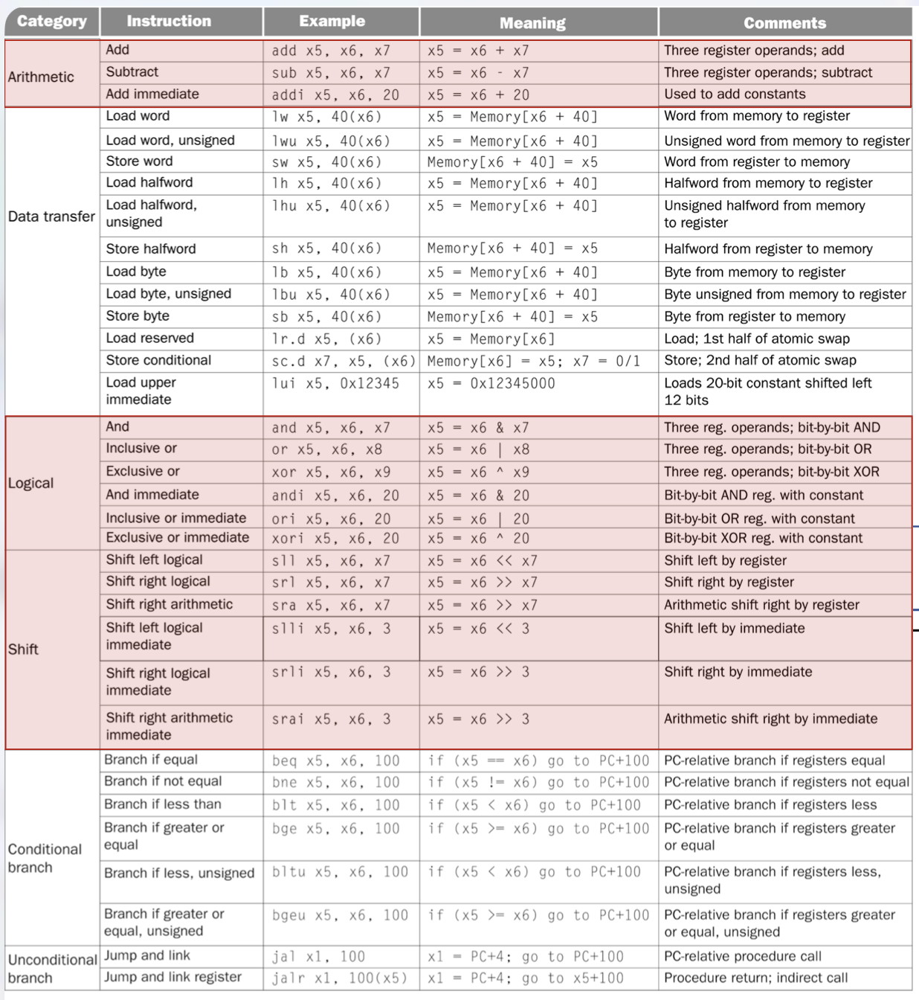
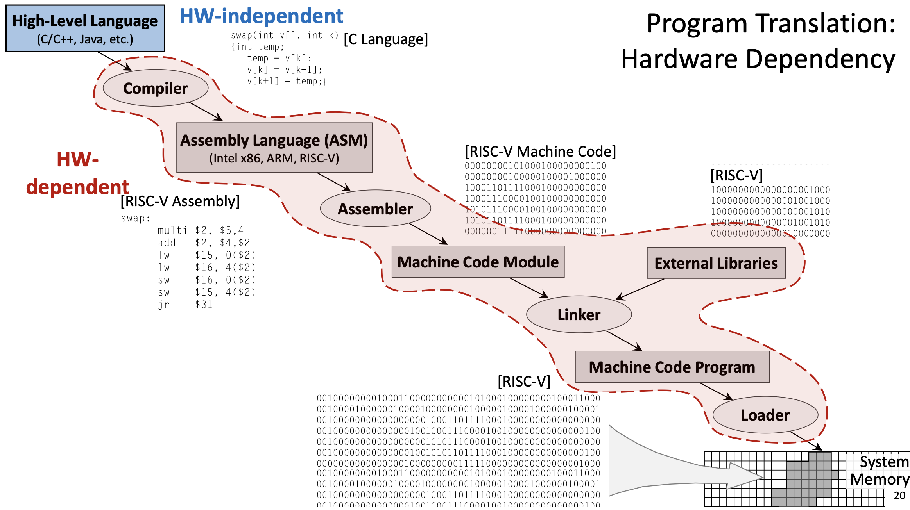
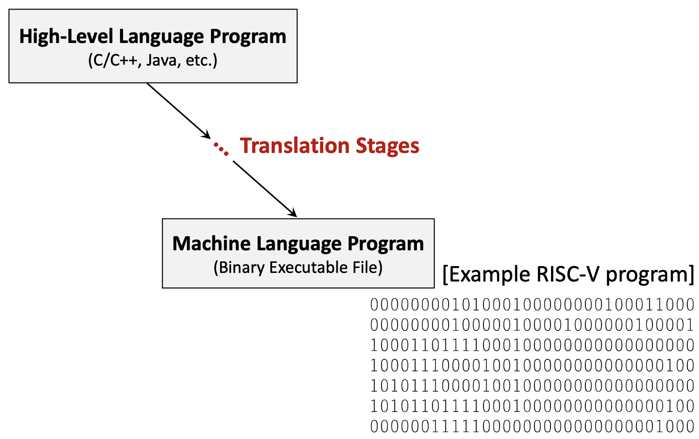
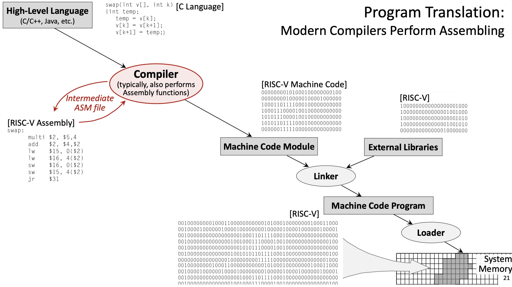

#### **1. Theory**
##### **1.1 Introduction to RISC-V**
**RISC-V** (Reduced Instruction Set Computer, 5th Generation) is a modern instruction set architecture (ISA) designed with simplicity and efficiency in mind. Unlike traditional architectures that may have hundreds of complex instructions, RISC-V follows the RISC philosophy: use a small set of simple instructions that execute quickly. This design principle helps minimize the **propagation delay** (the time it takes for a signal to travel through a circuit), which directly affects the CPU's **clock frequency** and overall performance.

The RISC-V architecture is a **load/store architecture**, meaning that all computational instructions (like addition, subtraction, logical operations) operate exclusively on **registers**—special high-speed storage locations directly connected to the processor's computational units. Only dedicated load and store instructions can transfer data between registers and memory. This design choice simplifies the instruction set and allows for faster execution.

{fig-align="center" width=80%}

##### **1.2 RISC-V Registers**

{fig-align="center" width=80%}

###### **1.2.1 General-Purpose Integer Registers**
RISC-V provides **32 directly addressable integer registers**, named `x0` through `x31`. Each register is 64 bits wide by default (in RV64, the 64-bit variant of RISC-V). These registers are **general-purpose**, but by convention, they are reserved for specific purposes to maintain consistency across programs and facilitate function calls. Each register has both a numerical name (like `x5`) and an **ABI (Application Binary Interface) name** (like `t0`) that describes its conventional use.

{fig-align="center" width=80%}

Key register categories:

- **`x0` (zero)**: A special register hardwired to the constant value 0. Writing to this register has no effect, and reading from it always returns 0. This is useful for operations like copying values (by adding zero) or implementing NOP (no operation) instructions.
- **Temporary registers (`t0`-`t6`)**: Registers `x5`-`x7` and `x28`-`x31` are used for temporary values that don't need to be preserved across function calls. The caller doesn't expect these values to remain unchanged after calling a function.
- **Saved registers (`s0`-`s11`)**: Registers `x8`-`x9` and `x18`-`x27` must be preserved across function calls. If a function uses these registers, it must save their original values and restore them before returning.
- **Argument/return registers (`a0`-`a7`)**: Registers `x10`-`x17` pass arguments to functions and return results. `a0` and `a1` specifically hold return values.
- **Special-purpose registers**:
  - `x1` (`ra`): **Return address** register, stores the address to return to after a function call
  - `x2` (`sp`): **Stack pointer**, points to the top of the current stack frame
  - `x3` (`gp`): **Global pointer**, provides access to global/static variables
  - `x4` (`tp`): **Thread pointer**, used in multi-threaded programs
  - `x8` (`s0`/`fp`): Can also serve as a **frame pointer** to reference local variables

{fig-align="center" width=80%}

###### **1.2.2 Special-Purpose Registers**
The **Program Counter (PC)** is a special register that is part of the Control Unit (CU) but not directly addressable by most instructions. It stores the memory address of the instruction currently being executed. After fetching each instruction, the PC automatically increments to point to the next instruction.

###### **1.2.3 Floating-Point Registers**
RISC-V also includes 32 floating-point registers (`f0`-`f31`) for operations on floating-point numbers. Unlike some older architectures (like MIPS, which used a separate floating-point coprocessor), RISC-V integrates floating-point support directly into the main processor.

{fig-align="center" width=80%}

###### **1.2.4 Register Spilling**
Since there are only 32 integer registers, complex programs with many live variables may run out of registers. When this happens, the **compiler** performs **register spilling**: it temporarily stores some register values in memory (typically on the stack) to free up registers, then reloads them when needed. This is a trade-off between the cost of having more registers (which would increase hardware complexity and propagation delay) and the occasional performance penalty of memory access.

##### **1.3 RISC-V Architecture Components**
###### **1.3.1 Control Unit (CU)**

The **Control Unit** orchestrates all CPU operations:

{fig-align="center" width=80%}

###### **1.3.2 Arithmetic Logic Unit (ALU)**
The **ALU** performs all arithmetic and logical computations:

- Executes operations like addition, subtraction, AND, OR, XOR, and bit shifts
- Is specifically **designed for minimized propagation delay** to allow higher clock frequencies
- Receives operands from registers, performs the operation, and writes the result back to a register

###### **1.3.3 Communication Buses**
**On-chip communication buses** connect the CU, ALU, registers, and memory hierarchy. These buses carry:

- **Instruction data** from memory to the CU
- **Operand values** between registers and the ALU
- **Control signals** that coordinate operations across components

##### **1.4 RISC-V Instruction Categories**

{fig-align="center" width=80%}

RISC-V instructions are organized into several categories based on their function:

###### **1.4.1 Arithmetic Instructions**
These instructions perform mathematical operations on register values:

- **`add rd, rs1, rs2`**: Adds the values in registers `rs1` and `rs2`, stores the result in register `rd`. Example: `add x5, x6, x7` computes `x5 = x6 + x7`.
- **`sub rd, rs1, rs2`**: Subtracts `rs2` from `rs1`, stores the result in `rd`. Example: `sub x5, x6, x7` computes `x5 = x6 - x7`.
- **`addi rd, rs1, imm`**: Adds an immediate (constant) value to `rs1`, stores the result in `rd`. Example: `addi x5, x6, 20` computes `x5 = x6 + 20`. This instruction is crucial for loading constants and adjusting addresses.

###### **1.4.2 Logical Instructions**
These perform **bitwise** operations (operating on each bit independently):

- **`and rd, rs1, rs2`**: Bitwise AND. Example: `and x5, x6, x7` computes `x5 = x6 & x7`.
- **`or rd, rs1, rs2`**: Bitwise OR. Example: `or x5, x6, x8` computes `x5 = x6 | x8`.
- **`xor rd, rs1, rs2`**: Bitwise XOR (exclusive OR). Example: `xor x5, x6, x9` computes `x5 = x6 ^ x9`.
- **Immediate versions**: `andi`, `ori`, `xori` perform these operations with a constant value.

###### **1.4.3 Shift Instructions**
Shift instructions move bits left or right:

- **`sll rd, rs1, rs2`**: **Shift left logical** by the amount in `rs2`. Example: `sll x5, x6, x7` computes `x5 = x6 << x7`. This multiplies by powers of 2.
- **`srl rd, rs1, rs2`**: **Shift right logical** by the amount in `rs2`. Fills with zeros from the left. Used for unsigned division by powers of 2.
- **`sra rd, rs1, rs2`**: **Shift right arithmetic** by the amount in `rs2`. Preserves the sign bit for signed numbers.
- **Immediate versions**: `slli`, `srli`, `srai` use a constant shift amount (e.g., `slli x5, x6, 3` computes `x5 = x6 << 3`).

###### **1.4.4 Data Transfer Instructions**
These instructions move data between registers and memory:

- **Load instructions** read from memory into a register:
  - **`lw rd, offset(rs1)`**: Load word (32 bits). Example: `lw x5, 40(x6)` loads the word at address `x6 + 40` into `x5`.
  - **`lh rd, offset(rs1)`**: Load halfword (16 bits), sign-extended to 64 bits.
  - **`lb rd, offset(rs1)`**: Load byte (8 bits), sign-extended to 64 bits.
  - **Unsigned versions** (`lwu`, `lhu`, `lbu`) zero-extend instead of sign-extend.
- **Store instructions** write from a register to memory:
  - **`sw rs2, offset(rs1)`**: Store word. Example: `sw x5, 40(x6)` stores the word in `x5` to address `x6 + 40`.
  - **`sh rs2, offset(rs1)`**: Store halfword.
  - **`sb rs2, offset(rs1)`**: Store byte.
- **`lui rd, imm`**: **Load upper immediate**. Loads a 20-bit constant into the upper 20 bits of `rd`, setting the lower 12 bits to zero. Example: `lui x5, 0x12345` sets `x5 = 0x12345000`. This is used in combination with other instructions to load large constants.
- **Atomic instructions** (`lr.d`, `sc.d`): Load reserved and store conditional, used for synchronization in multi-threaded programs.

###### **1.4.5 Conditional Branch Instructions**
Branch instructions implement conditional execution (like `if` statements):

- **`beq rs1, rs2, offset`**: **Branch if equal**. If `rs1 == rs2`, jump to `PC + offset`. Example: `beq x5, x6, 100` jumps 100 bytes forward if `x5` equals `x6`.
- **`bne rs1, rs2, offset`**: Branch if not equal.
- **`blt rs1, rs2, offset`**: Branch if less than (signed comparison).
- **`bge rs1, rs2, offset`**: Branch if greater or equal (signed).
- **`bltu rs1, rs2, offset`**: Branch if less than (unsigned).
- **`bgeu rs1, rs2, offset`**: Branch if greater or equal (unsigned).

All branch offsets are **PC-relative**: they specify a displacement from the current PC value.

###### **1.4.6 Unconditional Jump Instructions**
Jump instructions implement function calls and returns:

- **`jal rd, offset`**: **Jump and link**. Stores the return address (`PC + 4`) in `rd`, then jumps to `PC + offset`. Example: `jal x1, 100` saves the next instruction's address in `x1` and jumps forward 100 bytes. This is used for function calls.
- **`jalr rd, offset(rs1)`**: **Jump and link register**. Stores `PC + 4` in `rd`, then jumps to `rs1 + offset`. Example: `jalr x1, 100(x5)` saves the return address in `x1` and jumps to `x5 + 100`. This enables indirect calls and function returns (by setting `rd = x0` to discard the return address).

##### **1.5 Pseudo-Instructions**
**Pseudo-instructions** are convenient mnemonics that the assembler translates into one or more real RISC-V instructions. They simplify assembly programming:

- **`li rd, imm`**: Load immediate. Example: `li t1, 5` becomes `addi t1, zero, 5` (add 5 to the zero register).
- **`mv rd, rs`**: Move. Example: `mv a0, t0` becomes `add a0, zero, t0` (add zero to `t0`).
- **`nop`**: No operation, becomes `addi zero, zero, 0`.
- **`la rd, symbol`**: Load address of a symbol (label) into `rd`.
- **`j offset`**: Jump, becomes `jal x0, offset` (jump without saving return address).
- **`ret`**: Return from function, becomes `jalr x0, 0(ra)` (jump to address in `ra`).

##### **1.6 System Calls**
**System calls (syscalls)** provide a mechanism for programs to request services from the operating system, such as I/O operations. In RISC-V assembly using the RARS simulator, syscalls are invoked using the **`ecall`** instruction. The specific service is determined by a code placed in register `a7`, and arguments are passed in registers `a0`, `a1`, etc.

Common syscall codes:

- **Code 1** (Print integer): Prints the integer value in `a0` to the console.
- **Code 2** (Print float): Prints the float value in `fa0` to the console.
- **Code 3** (Print double): Prints the double value in `fa0` to the console.
- **Code 4** (Print string): Prints the null-terminated string whose address is in `a0`.
- **Code 5** (Read integer): Reads an integer from the console and stores it in `a0`.
- **Code 8** (Read string): Reads a string into the buffer at address `a0`, with maximum length in `a1`.
- **Code 10** (Exit): Terminates the program.

Typical usage pattern:

```assembly
li a7, 1      # Set syscall code to 1 (print integer)
li a0, 42     # Load value to print
ecall         # Execute syscall
```

##### **1.7 Assembly Program Structure**
RISC-V assembly programs are divided into segments:

###### **1.7.1 Data Segment**
The **`.data`** directive marks the beginning of the data segment, which contains static variables and constants:

```assembly
.data
msg:     .asciz "Hello, World!"   # Null-terminated string
number:  .word 42                  # 32-bit integer
buffer:  .space 100                # Reserve 100 bytes
```

- **`.asciz`**: Declares a null-terminated string.
- **`.word`**: Declares a 32-bit integer.
- **`.space n`**: Reserves `n` bytes of uninitialized space.

###### **1.7.2 Text Segment**
The **`.text`** directive marks the beginning of the code segment, which contains executable instructions:

```assembly
.text
main:
    # Your code here
```

Labels (like `main:`) mark specific locations in code and can be used as jump targets.

##### **1.8 Writing RISC-V Assembly Programs**
To write an effective assembly program:

1. **Understand the algorithm**: Break down the high-level logic into simple steps.
2. **Allocate registers**: Decide which registers will hold which values. Use temporary registers (`t0`-`t6`) for intermediate computations and saved registers (`s0`-`s11`) for values that must persist.
3. **Load constants**: Use `li` to load immediate values into registers.
4. **Perform computations**: Use arithmetic and logical instructions.
5. **Handle I/O**: Use syscalls to read input and print output.
6. **Exit cleanly**: Always end with an exit syscall (`li a7, 10; ecall`).

##### **1.9 Program Translation Process**
{fig-align="center" width=80%}

Before a program can run on a processor, it must be translated from high-level source code to machine code. This process involves several stages:

###### **1.9.1 High-Level Language**
Programs are typically written in **high-level languages** like C, C++, or Java. These languages are **hardware-independent**: the same source code can theoretically run on any processor architecture. High-level languages provide abstractions like variables, functions, loops, and objects that make programming more intuitive.

{fig-align="center" width=80%}

Example C function:

```c
void swap(int v[], int k) {
    int temp;
    temp = v[k];
    v[k] = v[k+1];
    v[k+1] = temp;
}
```

###### **1.9.2 Compilation**
The **compiler** translates high-level code into **assembly language** for a specific target architecture (like RISC-V, x86, or ARM). This stage is complex and involves:

- **Parsing**: Analyzing the source code's syntax and semantics.
- **Optimization**: Applying transformations to improve performance (e.g., eliminating redundant calculations, reordering instructions, unrolling loops).
- **Code generation**: Producing assembly instructions that implement the high-level logic.
- **Register allocation**: Deciding which variables should be stored in which registers.

The compiler is **configurable**: you can specify optimization levels (like `-O0` for no optimization, `-O3` for aggressive optimization) and language standards.

Example output (simplified RISC-V assembly for the `swap` function):

```assembly
swap:
    slli t0, a1, 2      # t0 = k * 4 (multiply by word size)
    add  t0, a0, t0     # t0 = address of v[k]
    lw   t1, 0(t0)      # t1 = v[k]
    lw   t2, 4(t0)      # t2 = v[k+1]
    sw   t2, 0(t0)      # v[k] = t2 (v[k+1])
    sw   t1, 4(t0)      # v[k+1] = t1 (v[k])
    jr   ra             # return
```

###### **1.9.3 Assembly**
The **assembler** translates assembly language into **machine code** (binary). This is a relatively straightforward, mechanical process:

- Each assembly instruction maps to a specific binary encoding defined by the ISA.
- Labels are converted to addresses.
- Pseudo-instructions are expanded into real instructions.

The output is an **object file** (machine code module), which contains binary instructions but may have unresolved references to external functions or libraries.

Example: `add x5, x6, x7` might be encoded as the 32-bit binary value `00000000011100110000001010110011`.

###### **1.9.4 Linking**
The **linker** combines multiple object files and **external libraries** (like the C standard library) into a single executable program:

- Resolves references to external functions (e.g., `printf`, `malloc`).
- Assigns final memory addresses to all code and data.
- Produces a complete **executable binary file**.

External libraries are typically specified in the source code using `#include` directives (in C/C++) or `import` statements (in other languages).

###### **1.9.5 Loading**
The **loader** is part of the operating system. When you run a program, the loader:

- Reads the executable file from disk.
- Allocates memory for the program's code, data, and stack.
- Copies the program into system memory.
- Sets up the initial execution environment (e.g., initializes registers, sets the PC to the program's entry point).
- Transfers control to the program.

##### **1.10 Hardware Dependency**
The translation process involves both **hardware-independent** and **hardware-dependent** stages:

- **Hardware-independent**: High-level source code (C, Java, etc.) can be written once and compiled for different architectures.
- **Hardware-dependent**: Assembly language, machine code, and the specific instruction set used are tied to a particular architecture (RISC-V, x86, ARM, etc.). You cannot run RISC-V machine code on an x86 processor without emulation.

Modern compilers often perform the assembler's job as well, directly producing machine code from high-level source. The intermediate assembly file may be generated for debugging purposes but is not strictly necessary.

{fig-align="center" width=80%}

##### **1.11 Instruction Set Architecture and Performance**
The design of an ISA significantly impacts CPU performance:

###### **1.11.1 Propagation Delay and Clock Frequency**
The **worst-case propagation delay** of the slowest instruction determines the maximum clock frequency. If one instruction takes much longer to execute than others, the entire CPU must slow down to accommodate it.

###### **1.11.2 Number of Registers**
Having more registers would reduce the need for memory access, but it comes with trade-offs:

- **More registers** → more complex multiplexers and decoding logic → longer propagation delays → lower clock frequency.
- **Fewer registers** → simpler hardware → faster clock → but more frequent register spilling (memory access).

RISC-V's 32 registers represent a balance: enough for most programs to keep frequently used values in registers, but not so many that the hardware becomes slow. The design objective is to **optimize performance for the average use case**, not just the best or worst case.

##### **1.12 Memory Hierarchy**
Modern computers use a **memory hierarchy** to balance speed and capacity:

- **Registers**: Fastest (nanoseconds), smallest capacity (32-64 registers).
- **Cache L1**: Very fast, small (tens of KB).
- **Cache L2**: Fast, medium (hundreds of KB to a few MB).
- **Main system memory (RAM)**: Slower, large (GB).
- **Remote storage devices (SSD, HDD)**: Much slower, very large (TB).

Instructions and data move up and down this hierarchy as needed. The CPU always tries to keep the most frequently accessed data in faster levels.

***

#### **2. Definitions**
*   **RISC-V**: A reduced instruction set computer architecture (5th generation) that uses a small set of simple, fast-executing instructions to achieve high performance.
*   **Instruction Set Architecture (ISA)**: The set of instructions a processor can execute, defining the interface between software and hardware.
*   **Register**: A fast storage location directly connected to the CPU's computational units, used to hold operands and results.
*   **Load/Store Architecture**: A design where computational instructions operate only on registers, and only dedicated load/store instructions access memory.
*   **ABI (Application Binary Interface) Name**: The conventional name for a register indicating its intended purpose (e.g., `t0` for temporary, `s0` for saved).
*   **Program Counter (PC)**: A special register that stores the memory address of the instruction currently being executed.
*   **Propagation Delay**: The time required for a signal to travel through a circuit, determining the maximum clock frequency.
*   **Control Unit (CU)**: The CPU component that fetches, decodes, and coordinates instruction execution.
*   **Arithmetic Logic Unit (ALU)**: The CPU component that performs arithmetic and logical computations.
*   **Pseudo-Instruction**: An assembly mnemonic that the assembler translates into one or more real instructions for convenience.
*   **System Call (Syscall)**: A mechanism for programs to request operating system services like I/O operations.
*   **Register Spilling**: The process of temporarily storing register values in memory when there aren't enough registers for all live variables.
*   **Compiler**: A program that translates high-level source code into assembly or machine code for a specific architecture.
*   **Assembler**: A program that translates assembly language into binary machine code.
*   **Linker**: A program that combines object files and libraries into a single executable program.
*   **Loader**: An operating system component that loads executable programs into memory and initiates execution.
*   **Object File**: A file containing machine code with potentially unresolved external references, produced by the assembler.
*   **Hardware-Independent**: Code or languages that can run on different processor architectures without modification (e.g., C source code).
*   **Hardware-Dependent**: Code or representations tied to a specific processor architecture (e.g., RISC-V assembly, x86 machine code).
*   **Immediate Value**: A constant value encoded directly in an instruction (e.g., the `20` in `addi x5, x6, 20`).
*   **PC-Relative**: An addressing mode where addresses are specified as offsets from the current Program Counter value.
*   **Sign Extension**: Filling the upper bits of a value with copies of the sign bit to preserve the numeric value when converting to a larger size.
*   **Zero Extension**: Filling the upper bits of a value with zeros when converting to a larger size.
*   **Word**: A 32-bit (4-byte) data unit, the standard size for RISC-V instructions.
*   **Halfword**: A 16-bit (2-byte) data unit.
*   **Byte**: An 8-bit data unit.

***

#### **3. Practice**
##### **3.1. Simple Addition Program** (Lab 9, Task 1)
Write a RISC-V assembly program that computes $5 + 7$ and prints the result.

<details>
<summary>Click to see the solution</summary>

**Key Concept:** Load constants into registers, perform arithmetic, use syscalls for output, and properly exit.

Here's the program using pseudo-instructions:

```assembly
li   t1, 5          # load value "5" into register t1
li   t2, 7          # load value "7" into register t2
add  t0, t1, t2     # t0 = t1 + t2
mv   a0, t0         # move value from register t0 to a0
li   a7, 1          # set code for syscall to "1" (to print)
ecall               # execute syscall with code in a7 and argument in a0
li   a7, 10         # set code for syscall to "10" (exit)
ecall               # execute syscall with code "10"
```

Here's the same program with pseudo-instructions expanded to real RISC-V instructions:

```assembly
addi t1, zero, 5    # load value "5" into register t1 (li t1, 5)
addi t2, zero, 7    # load value "7" into register t2 (li t2, 7)
add  t0, t1, t2     # t0 = t1 + t2
add  a0, zero, t0   # move value from register t0 to a0 (mv a0, t0)
addi a7, zero, 1    # set code for syscall to "1" (li a7, 1)
ecall               # execute syscall with code in a7 and argument in a0
addi a7, zero, 10   # set code for syscall to "10" (li a7, 10)
ecall               # execute syscall with code "10"
```

**Explanation:**

1.  **Load constants**: `li` (load immediate) is a pseudo-instruction that becomes `addi rd, zero, imm`. We load 5 into `t1` and 7 into `t2`.
2.  **Perform addition**: `add t0, t1, t2` adds the values and stores the result (12) in `t0`.
3.  **Prepare for printing**: We need the value in `a0` for the print syscall, so `mv a0, t0` copies it (this becomes `add a0, zero, t0`).
4.  **Print the result**: Set `a7 = 1` (syscall code for print integer), then `ecall` executes the syscall, which prints the value in `a0`.
5.  **Exit**: Set `a7 = 10` (syscall code for exit), then `ecall` terminates the program.

**Answer:** The program prints `12` and exits.

</details>

##### **3.2. Reading and Printing a String** (Lab 9, Task 2)
Write a RISC-V assembly program that prompts the user to enter a string, reads the string, and then prints it back.

<details>
<summary>Click to see the solution</summary>

**Key Concept:** Use the data segment for static strings and buffers. Use syscalls 4 (print string) and 8 (read string).

```assembly
.data                                   # Start of segment with static variables
msg:       .asciz "Enter your string: " # Prompt string
inputStr:  .space 10                    # Space for input string (10 bytes)

.text                                   # Start of segment with code
main:                                   # Start of the main function
    li   a7, 4                          # Set code for syscall to PrintString
    la   a0, msg                        # Load address of msg to a0
    ecall                               # Print the prompt
    
    li   a7, 8                          # Set code for syscall to ReadString
    la   a0, inputStr                   # Load address of inputStr to a0
    li   a1, 10                         # Set maximum read size to 10
    ecall                               # Read the string
    
    li   a7, 4                          # Set code for syscall to PrintString
    la   a0, inputStr                   # Load address of inputStr to a0
    ecall                               # Print the input string
    
    li   a7, 10                         # Set code for syscall to exit
    ecall                               # Exit program
```

**Explanation:**

1.  **Data segment**: 
    - `msg` is a label for the null-terminated prompt string.
    - `inputStr` reserves 10 bytes for the user's input.
2.  **Print prompt**:
    - Set `a7 = 4` (print string syscall).
    - Use `la` (load address) to put the address of `msg` in `a0`.
    - `ecall` prints the string.
3.  **Read input**:
    - Set `a7 = 8` (read string syscall).
    - Put the address of `inputStr` in `a0` (where to store the input).
    - Put the maximum length (10) in `a1`.
    - `ecall` reads the string from the console.
4.  **Print the input**:
    - Set `a7 = 4` again to print.
    - Put the address of `inputStr` in `a0`.
    - `ecall` prints what the user entered.
5.  **Exit**: Standard exit sequence.

**Answer:** The program prompts for input, reads up to 10 characters, and echoes them back.

</details>

##### **3.3. Sum of Three Integers** (Lab 9, Assignment 2)
Write a RISC-V assembly program that reads three integer inputs from the user, computes their sum, and displays the result.

<details>
<summary>Click to see the solution</summary>

**Key Concept:** Use syscall 5 (read integer) three times, add the values, then use syscall 1 (print integer) to display the result.

```assembly
.text
main:
    # Read first integer
    li   a7, 5          # Syscall code for ReadInteger
    ecall               # Read integer, result stored in a0
    mv   t0, a0         # Save first integer in t0
    
    # Read second integer
    li   a7, 5          # Syscall code for ReadInteger
    ecall               # Read integer, result stored in a0
    mv   t1, a0         # Save second integer in t1
    
    # Read third integer
    li   a7, 5          # Syscall code for ReadInteger
    ecall               # Read integer, result stored in a0
    mv   t2, a0         # Save third integer in t2
    
    # Compute sum
    add  t3, t0, t1     # t3 = t0 + t1 (sum of first two)
    add  t3, t3, t2     # t3 = t3 + t2 (add third number)
    
    # Print result
    mv   a0, t3         # Move sum to a0 for printing
    li   a7, 1          # Syscall code for PrintInteger
    ecall               # Print the sum
    
    # Exit
    li   a7, 10         # Syscall code for Exit
    ecall               # Exit program
```

**Explanation:**

1.  **Read first integer**: 
    - Set `a7 = 5` (read integer syscall).
    - `ecall` reads an integer and stores it in `a0`.
    - Save it in `t0` using `mv t0, a0`.
2.  **Read second integer**: 
    - Same process, save in `t1`.
3.  **Read third integer**: 
    - Same process, save in `t2`.
4.  **Compute sum**: 
    - `add t3, t0, t1` computes the sum of the first two numbers.
    - `add t3, t3, t2` adds the third number to get the final sum.
5.  **Print result**:
    - Move the sum to `a0` (required for print syscall).
    - Set `a7 = 1` (print integer).
    - `ecall` prints the result.
6.  **Exit**: Standard exit sequence.

**Answer:** The program reads three integers, computes their sum, prints it, and exits. For example, if the user enters 5, 10, and 15, the program prints 30.

</details>

##### **3.4. Swap Function Translation** (Lecture 9, Example 1)
Given the following C function, show the complete translation process from high-level code to machine code:

```c
void swap(int v[], int k) {
    int temp;
    temp = v[k];
    v[k] = v[k+1];
    v[k+1] = temp;
}
```

<details>
<summary>Click to see the solution</summary>

**Key Concept:** Understand the multi-stage translation from high-level language through assembly to binary machine code.

**Stage 1: High-Level Language (C)**

The C function swaps two adjacent elements in an integer array. It:

- Takes an array `v` and index `k` as parameters
- Uses a temporary variable to perform the swap
- Accesses array elements using bracket notation

**Stage 2: Compilation to Assembly**

The compiler translates this into RISC-V assembly. Assuming:

- `a0` contains the base address of array `v`
- `a1` contains the value of `k`

```assembly
swap:
    slli t0, a1, 2      # t0 = k * 4 (multiply by word size)
    add  t0, a0, t0     # t0 = address of v[k]
    lw   t1, 0(t0)      # t1 = v[k] (load first element)
    lw   t2, 4(t0)      # t2 = v[k+1] (load second element)
    sw   t2, 0(t0)      # v[k] = t2 (store second into first position)
    sw   t1, 4(t0)      # v[k+1] = t1 (store first into second position)
    jr   ra             # return (jump to return address)
```

**Explanation of assembly code:**
1.  **Calculate address**: Since each integer is 4 bytes (1 word), `v[k]` is at address `base + k*4`. The `slli` (shift left logical immediate) multiplies `k` by 4 efficiently.
2.  **Add base address**: `add t0, a0, t0` computes the absolute address of `v[k]`.
3.  **Load values**: Load `v[k]` and `v[k+1]` into temporary registers.
4.  **Store swapped values**: Write them back in reversed order.
5.  **Return**: Jump to the address in `ra` (return address register).

**Stage 3: Assembly to Machine Code**

The assembler converts each instruction to a 32-bit binary encoding. Example encodings (simplified):

```
slli t0, a1, 2     → 00000000001001011001001010010011
add  t0, a0, t0    → 00000000010101010000001010110011
lw   t1, 0(t0)     → 00000000000000101010001100000011
lw   t2, 4(t0)     → 00000000010000101010001110000011
sw   t2, 0(t0)     → 00000000011100101010000000100011
sw   t1, 4(t0)     → 00000000011000101010001000100011
jr   ra            → 00000000000000001000000001100111
```

This produces a **machine code module** (object file).

**Stage 4: Linking**

The linker:

- Combines this object file with others and external libraries
- Resolves any external function references
- Assigns final memory addresses
- Produces the complete executable binary

**Stage 5: Loading**

The operating system's loader:

- Allocates memory for the program
- Copies the machine code into RAM
- Sets up the initial environment (stack, registers, PC)
- Transfers control to the program's entry point

**Answer:** The translation process converts the C function through compilation (to assembly), assembly (to binary object code), linking (to executable), and loading (into memory for execution). Each stage is necessary to transform human-readable code into instructions the processor can execute.

</details>

##### **3.5. Using Load Upper Immediate** (Lecture 9, Example 2)
Load the 32-bit value `0x12345678` into register `t0`.

<details>
<summary>Click to see the solution</summary>

**Key Concept:** RISC-V instructions are 32 bits, so immediate values are limited in size. To load large constants, we use `lui` (load upper immediate) combined with `addi` or `ori`.

**Method:**

1.  **Load upper 20 bits**: `lui` loads a 20-bit immediate into the upper 20 bits of a register and zeros the lower 12 bits.
2.  **Set lower 12 bits**: Use `addi` or `ori` to set the lower bits.

```assembly
lui  t0, 0x12345       # Load 0x12345 into upper 20 bits: t0 = 0x12345000
ori  t0, t0, 0x678     # OR with 0x678: t0 = 0x12345000 | 0x678 = 0x12345678
```

**Explanation:**

1.  **`lui t0, 0x12345`**: 
    - Takes the 20-bit value `0x12345` and places it in bits [31:12] of `t0`.
    - Sets bits [11:0] to zero.
    - Result: `t0 = 0x12345000`
2.  **`ori t0, t0, 0x678`**: 
    - Performs bitwise OR with the 12-bit value `0x678`.
    - Since the upper bits of `0x678` are zero, this effectively sets the lower 12 bits.
    - Result: `t0 = 0x12345678`

**Alternative using `addi`**:

```assembly
lui  t0, 0x12345       # t0 = 0x12345000
addi t0, t0, 0x678     # t0 = t0 + 0x678 = 0x12345678
```

This works when the lower 12 bits don't require sign extension considerations. For negative values or when bit 11 is set, you may need to adjust the `lui` value.

**Answer:** Use `lui` to load the upper 20 bits, then `ori` or `addi` to set the lower 12 bits.

</details>

##### **3.6. Array Access with Load Instruction** (Lecture 9, Example 3)
Given an integer array `A` with base address stored in register `s0`, and index `i` stored in register `s1`, write instructions to load `A[i]` into register `t0`.

<details>
<summary>Click to see the solution</summary>

**Key Concept:** Array elements are stored contiguously in memory. For an integer array, each element is 4 bytes (1 word). To access `A[i]`, compute `address = base + i * 4`.

**Solution:**

```assembly
slli t1, s1, 2         # t1 = i * 4 (shift left by 2 is multiply by 4)
add  t1, s0, t1        # t1 = base_address + offset = address of A[i]
lw   t0, 0(t1)         # t0 = Memory[t1] = A[i]
```

**Explanation:**

1.  **Calculate offset**: `slli t1, s1, 2` shifts `i` left by 2 bits, effectively multiplying by $2^2 = 4$. This computes the byte offset for element `i`.
2.  **Calculate address**: `add t1, s0, t1` adds the base address to the offset, giving the absolute address of `A[i]`.
3.  **Load value**: `lw t0, 0(t1)` loads the word at address `t1 + 0` into `t0`.

**Optimized alternative** (if the offset is small):

If you can compute the address in one step:

```assembly
slli t1, s1, 2         # t1 = i * 4
add  t1, s0, t1        # t1 = address of A[i]
lw   t0, 0(t1)         # t0 = A[i]
```

Or, if using a combined approach:

```assembly
slli t1, s1, 2         # t1 = i * 4
lw   t0, 0(s0 + t1)    # ERROR: This syntax isn't valid!
```

Note: RISC-V doesn't support register+register addressing in load/store instructions directly. You must compute the address first.

**Answer:** Shift the index left by 2 to multiply by 4, add to the base address, then use `lw` to load the value.

</details>

##### **3.7. Conditional Branch Example** (Lecture 9, Example 4)
Implement the following C code in RISC-V assembly:

```c
if (x == y) {
    z = x + y;
} else {
    z = x - y;
}
```

Assume `x` is in register `s0`, `y` is in register `s1`, and `z` should be stored in register `s2`.

<details>
<summary>Click to see the solution</summary>

**Key Concept:** Use conditional branch instructions to implement if-else logic. Branch instructions check a condition and jump to a label if the condition is true.

**Solution:**

```assembly
    bne  s0, s1, else_branch   # If x != y, branch to else_branch
    # Then branch (x == y)
    add  s2, s0, s1            # z = x + y
    j    end_if                # Jump to end (skip else part)
else_branch:
    sub  s2, s0, s1            # z = x - y
end_if:
    # Continue with rest of program
```

**Explanation:**

1.  **Check condition**: `bne s0, s1, else_branch` (branch if not equal) checks if `x != y`. If they're not equal, it jumps to `else_branch`. If they are equal, it continues to the next instruction.
2.  **Then block**: If `x == y`, execute `add s2, s0, s1` to compute `z = x + y`.
3.  **Skip else**: After the then block, `j end_if` (unconditional jump) skips the else block.
4.  **Else block**: The `else_branch` label marks the start of the else code. Execute `sub s2, s0, s1` to compute `z = x - y`.
5.  **Continue**: The `end_if` label marks where both branches converge.

**Alternative using `beq`**:

```assembly
    beq  s0, s1, then_branch   # If x == y, branch to then_branch
    # Else branch (x != y)
    sub  s2, s0, s1            # z = x - y
    j    end_if                # Jump to end
then_branch:
    add  s2, s0, s1            # z = x + y
end_if:
    # Continue
```

Both approaches are correct; the choice depends on which branch you expect to be more common (for performance optimization).

**Answer:** Use `bne` or `beq` to check the condition, with labels marking the then and else blocks, and a jump to skip the unused branch.

</details>

##### **3.8. Simple Loop Example** (Lecture 9, Example 5)
Implement the following C loop in RISC-V assembly:

```c
int sum = 0;
for (int i = 0; i < 10; i++) {
    sum = sum + i;
}
```

Assume `sum` is in register `s0` and `i` is in register `t0`.

<details>
<summary>Click to see the solution</summary>

**Key Concept:** Loops use conditional branches to repeat code. A typical pattern: initialize, check condition, execute body, increment, repeat.

**Solution:**

```assembly
    li   s0, 0              # sum = 0 (initialize sum)
    li   t0, 0              # i = 0 (initialize loop counter)
    li   t1, 10             # t1 = 10 (loop limit)
loop_start:
    bge  t0, t1, loop_end   # If i >= 10, exit loop
    add  s0, s0, t0         # sum = sum + i
    addi t0, t0, 1          # i = i + 1 (increment counter)
    j    loop_start         # Jump back to start of loop
loop_end:
    # sum now contains 0+1+2+...+9 = 45
```

**Explanation:**

1.  **Initialize variables**: Set `sum = 0` and `i = 0`. Load the limit (10) into `t1`.
2.  **Check condition**: `bge t0, t1, loop_end` (branch if greater or equal) checks if `i >= 10`. If true, exit the loop by jumping to `loop_end`.
3.  **Loop body**: Execute `add s0, s0, t0` to add the current value of `i` to `sum`.
4.  **Increment**: `addi t0, t0, 1` increments `i` by 1.
5.  **Repeat**: `j loop_start` jumps back to the beginning of the loop.
6.  **Exit**: When the condition becomes true, the branch to `loop_end` is taken, and the loop terminates.

**Result**: After the loop, `s0` contains $0 + 1 + 2 + \cdots + 9 = 45$.

**Alternative using `blt`** (checking `i < 10`):

```assembly
    li   s0, 0              # sum = 0
    li   t0, 0              # i = 0
    li   t1, 10             # limit
loop_start:
    blt  t0, t1, loop_body  # If i < 10, continue
    j    loop_end           # Otherwise exit
loop_body:
    add  s0, s0, t0         # sum = sum + i
    addi t0, t0, 1          # i++
    j    loop_start         # Repeat
loop_end:
    # Done
```

**Answer:** Use a branch instruction to check the loop condition, jump to loop body if true, increment the counter, and jump back to the start. Exit when the condition becomes false.

</details>

##### **3.9. Function Call Example** (Lecture 9, Example 6)
Write a simple RISC-V function that takes two integers as arguments, returns their sum, and show how to call it from another function.

<details>
<summary>Click to see the solution</summary>

**Key Concept:** Function calls use registers `a0`-`a7` for arguments and return values, and register `ra` for the return address. Use `jal` to call a function and `jr ra` to return.

**Function definition** (adds two integers):

```assembly
# Function: add_two
# Arguments: a0 = first number, a1 = second number
# Returns: a0 = sum
add_two:
    add  a0, a0, a1         # a0 = a0 + a1 (compute sum)
    jr   ra                 # Return to caller
```

**Calling the function**:

```assembly
main:
    # Prepare arguments
    li   a0, 15             # First argument = 15
    li   a1, 27             # Second argument = 27
    
    # Call function
    jal  ra, add_two        # Call add_two, save return address in ra
    
    # Result is now in a0
    # Print result
    # (a0 already contains the result)
    li   a7, 1              # Syscall: print integer
    ecall                   # Print the sum (42)
    
    # Exit
    li   a7, 10             # Syscall: exit
    ecall
```

**Explanation:**

1.  **Prepare arguments**: Load the values 15 and 27 into `a0` and `a1` respectively. These are the standard registers for passing the first two function arguments.
2.  **Call function**: `jal ra, add_two` does two things:
    - Saves the return address (the address of the next instruction) in `ra`.
    - Jumps to the label `add_two`.
3.  **Function execution**: Inside `add_two`:
    - `add a0, a0, a1` computes the sum and stores it in `a0` (the standard return value register).
    - `jr ra` (jump register) jumps to the address stored in `ra`, returning to the caller.
4.  **Use result**: After the function returns, `a0` contains the result (42). We can use it directly for the print syscall.

**More complex example** (saving and restoring registers):

If a function needs to use registers that must be preserved (`s0`-`s11`, `ra`), it should save them on the stack:

```assembly
# Function that uses saved registers
complex_function:
    # Save registers
    addi sp, sp, -8         # Allocate 8 bytes on stack
    sw   s0, 0(sp)          # Save s0
    sw   ra, 4(sp)          # Save return address
    
    # Function body (use s0, call other functions, etc.)
    li   s0, 100
    add  a0, a0, s0
    
    # Restore registers
    lw   s0, 0(sp)          # Restore s0
    lw   ra, 4(sp)          # Restore return address
    addi sp, sp, 8          # Deallocate stack space
    
    jr   ra                 # Return
```

**Answer:** Use registers `a0`-`a7` for arguments and return values. Call functions with `jal`, which saves the return address in `ra`. Return with `jr ra`. Save and restore preserved registers using the stack if necessary.

</details>

##### **3.10. Understanding Compilation Flags** (Lecture 9, Example 7)
Explain how different compiler optimization levels might affect the RISC-V assembly generated for the following C code:

```c
int sum = 0;
for (int i = 0; i < 1000; i++) {
    sum += i;
}
return sum;
```

<details>
<summary>Click to see the solution</summary>

**Key Concept:** Compilers can apply various optimizations to improve performance. Higher optimization levels produce faster code but may make debugging harder.

**At `-O0` (no optimization)**:

The compiler generates straightforward assembly that closely mirrors the C code:

```assembly
    li   s0, 0              # sum = 0
    li   t0, 0              # i = 0
    li   t1, 1000           # limit = 1000
loop:
    bge  t0, t1, end        # if (i >= 1000) break
    add  s0, s0, t0         # sum += i
    addi t0, t0, 1          # i++
    j    loop               # repeat
end:
    mv   a0, s0             # return sum
    ret
```

This executes 1000 iterations, performing 1000 additions.

**At `-O1` or `-O2` (moderate optimization)**:

The compiler might apply optimizations like:

- **Loop unrolling**: Execute multiple iterations per loop cycle
- **Register allocation**: Use registers more efficiently
- **Instruction reordering**: Arrange instructions to minimize pipeline stalls

```assembly
    li   s0, 0              # sum = 0
    li   t0, 0              # i = 0
    li   t1, 1000           # limit = 1000
loop:
    bge  t0, t1, end        # if (i >= 1000) break
    add  s0, s0, t0         # sum += i
    addi t0, t0, 1          # i++
    add  s0, s0, t0         # sum += i (unrolled iteration)
    addi t0, t0, 1          # i++
    j    loop               # repeat
end:
    mv   a0, s0             # return sum
    ret
```

This reduces loop overhead by processing two iterations per cycle.

**At `-O3` (aggressive optimization)**:

The compiler might recognize a mathematical pattern. The sum $0 + 1 + 2 + \cdots + 999$ equals $\frac{n(n-1)}{2}$ where $n = 1000$:

$$\text{sum} = \frac{1000 \times 999}{2} = 499500$$

The compiler could replace the entire loop with a constant:

```assembly
    li   a0, 499500         # return 499500 (computed at compile time!)
    ret
```

This is **constant folding**: the compiler evaluates the loop at compile time and replaces it with the result. The code executes instantly, without any loop at all!

**Trade-offs:**

- **`-O0`**: Easy to debug (code matches source closely), but slower
- **`-O2`**: Good balance of speed and code size
- **`-O3`**: Maximum speed, but larger code size, longer compile time, harder to debug

**Answer:** Higher optimization levels can dramatically transform code. The compiler may unroll loops, reorder instructions, or even eliminate loops entirely through mathematical analysis. In this case, `-O3` might compute the result at compile time, producing just a single instruction to load the constant.

</details>