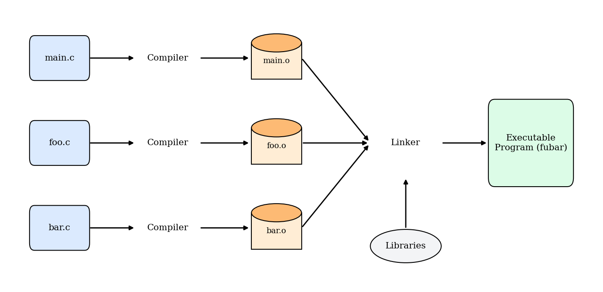
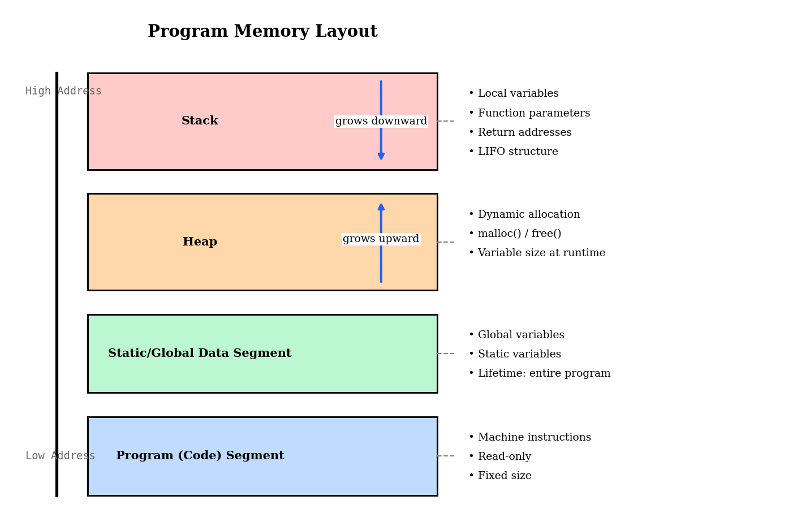

#### **1. Краткое содержание**
##### **1.1 Язык программирования C**
**C programming language** (**язык программирования C**), созданный Деннисом Ритчи и Брайаном Керниганом, — базовый язык общего назначения, известный эффективностью и низкоуровневым контролем над аппаратурой. Его часто называют *middle-level language* (*языком среднего уровня*): между высокоуровневыми языками с сильной абстракцией и низкоуровневым **assembly**, почти напрямую отображаемым на машинные инструкции. Отсюда прозвище «универсальный assembly».

Важно различать *syntax* (**синтаксис**) и *semantics* (**семантику**).

*   **Синтаксис** — правила структуры и записи конструкций. Например, требование завершать оператор `;` — это синтаксис.
*   **Семантика** — *смысл* конструкций: что должен делать компьютер. Корректный синтаксис нужен, чтобы программа **скомпилировалась** (**compile**), но для корректных и эффективных программ необходимо понимание семантики.

Ключевые черты C:

*   **Compiled language** (**компилируемый язык**): исходный код переводится **compiler** (**компилятором**) в машинный код до запуска.
*   **Statically typed** (**статическая типизация**): у каждой переменной фиксированный тип (`int`, `float` и т.д.), известный на этапе компиляции. При этом C не *строго* типизирован в смысле полного запрета преобразований: многие **type conversions** разрешены.
*   **Procedural** (**процедурный стиль**): программы строят из процедур, то есть **functions** (**функций**) — блоков кода с конкретными задачами.
*   **System-level access**: прямое управление памятью и возможность использовать особенности архитектуры.
*   **Unsafe by design**: C доверяет программисту; встроенной защиты от типичных ошибок вроде обращения к невалидной памяти нет. Эта «отсутствие ограничений» даёт большую свободу, но требует аккуратности, чтобы избегать багов и уязвимостей. Хорошая практика — всегда прогонять код на своей машине и смотреть, как он ведёт себя в реальной среде.

##### **1.2 Базовые инструменты и компилятор**
Для программирования на C нужны **text editor** (**текстовый редактор**) для исходного кода (например VS Code, Notepad++) и **C compiler** (**компилятор C**). **IDE** удобно объединяет редактор, **debugger** и прочее, но не обязательна.

Часто используемый компилятор — **GCC** (GNU Compiler Collection). Также распространены Clang и Microsoft Visual C++ (MSVC). Чтобы собрать `program.c` в исполняемый `program`, в терминале обычно выполняют:
`gcc -Wall -o program program.c`

*   `gcc`: вызов компилятора.
*   `-Wall`: важный флаг, включающий широкий набор предупреждений; по ним проще ловить потенциальные баги.
*   `-o program`: имя выходного исполняемого файла.
*   `program.c`: входной исходный файл.

##### **1.3 Компиляция и линковка**
Программа на C может состоять из нескольких `.c` файлов; после препроцессинга каждый становится **translation unit** (**единицей трансляции**). Сборка исполняемого файла — многошаговый процесс:

1.  **Preprocessing** (**препроцессинг**): препроцессор обрабатывает директивы (строки с `#`). Например, `#include <stdio.h>` подставляет содержимое заголовка стандартного ввода-вывода.
2.  **Compilation** (**компиляция**): компилятор переводит препроцессированный код в **assembly** — человекочитаемое представление машинных инструкций.
3.  **Assembly** (**ассемблирование**): ассемблер получает машинный код — **object file** (**объектный файл**, `.o` / `.obj`), ещё не готовый к автономному запуску.
4.  **Linking** (**линковка**): **linker** (**линкер**) объединяет объектные файлы в **executable file** (**исполняемый файл**), разрешает ссылки между файлами (например вызов из `main.c` функции из `utils.c`) и подключает код системных библиотек.

<!-- DIAGRAM HERE -->
{#fig-compilation-process}

##### **1.4 Структура программы и модель памяти**
Память работающей программы на C делится на сегменты:

*   **Code Segment**: машинные инструкции; обычно только для чтения.
*   **Static/Global Data Segment**: глобальные и `static` переменные на всё время работы программы.
*   **Heap**: **dynamic memory allocation** (**динамическое выделение памяти**); выделение вроде `malloc()` и освобождение `free()`; куча растёт к старшим адресам.
*   **Stack**: вызовы функций по принципу **Last-In, First-Out (LIFO)**; при вызове на стек кладётся (**push**) **stack frame** с параметрами, адресом возврата и локальными переменными, а по завершении функции кадр снимается (**pop**); стек растёт к младшим адресам.

<!-- DIAGRAM HERE -->
{#fig-memory-model}

##### **1.5 Переменные, типы, область видимости и классы хранения**
**Variable** (**переменная**) — именованная область памяти. **Type** (**тип**) задаёт множество *values* (*значений*), *operators* (*операций*) и *relationships* (*связи*) с другими типами.

**Scope** (**область видимости**) определяет, где имя доступно. В C — преимущественно лексическая область по **blocks** (`{}`); внутренняя переменная может *shadow* одноимённую внешнюю.

**Storage classes** (**классы хранения**) — ключевые слова, задающие **lifetime** (время жизни) и **linkage** (видимость между файлами).

*   `auto`: по умолчанию для локальных; *local lifetime* — создание/уничтожение с блоком; память на **stack**.
*   `static`:
    *   **Local static variable**: *static lifetime* на всю программу, но *local scope* внутри функции; инициализируется один раз.
    *   **Global static variable**: *static lifetime* и **internal linkage** — видимость ограничена файлом.
*   `extern`: объявление глобальной переменной, определённой в другом файле; для обмена между **translation units**. Обычная глобальная без `static` имеет **external linkage** по умолчанию.

##### **1.6 Отладка**
**Debugger** (**отладчик**) позволяет выполнять программу контролируемо, останавливаться, смотреть переменные и идти по строкам. **GDB** (GNU Debugger) — мощный консольный отладчик для C.

Сборка с отладочной информацией:
`gcc -g -Wall -o program program.c`

Частые команды GDB:

*   `run` (`r`): запуск.
*   `break <line_number>` (`b`): **breakpoint** — останов на строке.
*   `next` (`n`): следующая строка, *step over* вызовов.
*   `step` (`s`): с *step into* при вызове функции.
*   `print <variable>` (`p`): значение переменной.
*   `continue` (`c`): до следующего breakpoint или конца.
*   `quit` (`q`): выход.

***

#### **2. Определения**
*   **Compiler**: программа, переводящая исходный код в низкоуровневый машинный код.
*   **Linker**: программа, объединяющая объектные файлы и библиотеки в исполняемый файл.
*   **Debugger**: инструмент для контролируемого выполнения и поиска ошибок.
*   **Source File**: текстовый `.c` с исходным кодом.
*   **Object File**: `.o` с машинным кодом одного исходника; промежуточный этап до линковки.
*   **Executable File**: полная программа в машинном коде, запускаемая ОС.
*   **Translation Unit**: исходник после препроцессора; базовая единица компиляции.
*   **Stack**: область LIFO для вызовов, локальных переменных, параметров и адресов возврата.
*   **Stack Frame**: фрагмент стека под один вызов функции.
*   **Heap**: область динамического выделения с ручным управлением.
*   **Syntax vs. Semantics**: синтаксис — грамматика кода; семантика — смысл и поведение.
*   **Scope**: участок программы, где имя видимо и доступно.
*   **Lifetime**: интервал существования переменной в памяти.
*   **Linkage**: правила видимости символов между файлами (**translation units**).

***

#### **3. Примеры**
##### **3.1. Программа Hello World** (**Лаба** 1, **Задание** 1)
Напишите программу на C, которая печатает `"Hello, World!"`.

<details>
<summary>Нажмите, чтобы увидеть решение</summary>

```c
// Include the Standard Input/Output library, which is necessary for functions like printf.
#include <stdio.h>

// The main function is the entry point of every C program.
int main() {
   /* my first program in C */
   // printf is a function that prints formatted output to the screen.
   // "Hello, World!" is the string to be printed.
   // "\n" is a special character that represents a new line.
   printf("Hello, World! \n");

   // The return 0 statement indicates that the program has executed successfully.
   return 0;
}
```
</details>

##### **3.2. Целочисленная арифметика** (**Лаба** 1, **Задание** 2)
Напишите программу, которая объявляет и инициализирует два целых и печатает сумму, разность, произведение и частное.

<details>
<summary>Нажмите, чтобы увидеть решение</summary>

```c
// Include the Standard Input/Output library for using the printf function.
#include <stdio.h>

// The main function where the program execution begins.
int main() {
    // Declare and initialize two integer variables.
    // You can change these values to see different results.
    int x = 20;
    int y = 5;

    // --- Perform Arithmetic Operations ---

    // 1. Addition
    // Calculate the sum of x and y and store it in a new integer variable 'sum'.
    int sum = x + y;
    // Print the result of the addition. The '%d' is a format specifier for integers.
    printf("Addition: %d + %d = %d\n", x, y, sum);

    // 2. Subtraction
    // Calculate the difference between x and y and store it in 'difference'.
    int difference = x - y;
    // Print the result of the subtraction.
    printf("Subtraction: %d - %d = %d\n", x, y, difference);

    // 3. Multiplication
    // Calculate the product of x and y and store it in 'product'.
    int product = x * y;
    // Print the result of the multiplication.
    printf("Multiplication: %d * %d = %d\n", x, y, product);

    // 4. Division
    // Note: If both operands are integers, C performs integer division (the fractional part is discarded).
    int integer_division = x / y;
    // Print the result of the integer division.
    printf("Integer Division: %d / %d = %d\n", x, y, integer_division);

    // To get a precise result for division, we can convert the integers to floating-point numbers.
    // (float)x is a 'cast' that temporarily treats the integer x as a float for this calculation.
    float float_division = (float)x / (float)y;
    // Print the result of the floating-point division. The '%f' is a format specifier for floats.
    printf("Floating-Point Division: %d / %d = %f\n", x, y, float_division);

    // Indicate that the program finished successfully.
    return 0;
}
```
</details>
