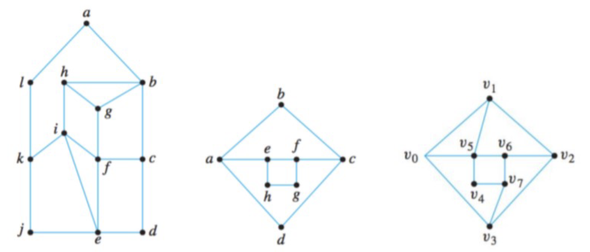
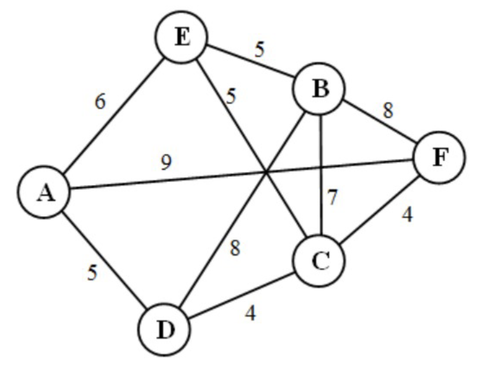

#### **1. Резюме**
##### **1.1 Пути и циклы в графах**
В теории графов **путь (path)** и **цикл (cycle)** — базовые объекты обхода. **Path** — последовательность вершин, где соседние пары соединены рёбрами и **ребро не повторяется**. **Cycle** — путь, у которого совпадают начало и конец. Интересны дополнительные ограничения: пройти каждое ребро ровно один раз (**Euler path**) или каждую вершину ровно один раз (**Hamilton path**).

Эти модели встречаются в маршрутизации, логистике и классических задачах вроде **Seven Bridges of Königsberg**.

##### **1.2 Эйлеровы пути и циклы**
**Eulerian path** (**Euler trail**) — путь, проходящий по каждому **ребру** ровно один раз. Если начало и конец совпадают, получаем **Eulerian cycle** (**Euler tour**).

###### **1.2.1 Исторический контекст**
История начинается с Эйлера (1736) и задачи о семи мостах Кёнигсберга: можно ли пройти каждый мост ровно один раз. Эйлер смоделировал суши как вершины, мосты как рёбра и доказал невозможность.

###### **1.2.2 Необходимые и достаточные условия**
Для **Eulerian** ситуации известны **necessary and sufficient conditions**:

*   **Связный (connected)** граф **Eulerian** (имеет **Euler cycle**) тогда и только тогда, когда **степени всех вершин чётны**.
*   **Связный** граф имеет **Euler path** тогда и только тогда, когда **0 или 2** вершины имеют **нечётную степень**.

**Наглядный смысл доказательства (не «интуиция» в кальке):** в **Euler tour** каждое посещение вершины использует «вход» и «выход», вклад в степень чётный.

Граф с **Euler cycle** называют **Eulerian graph**; с **Euler path**, но без цикла, — **semi-Eulerian**.

##### **1.3 Алгоритм Флёри**
Условия существования дополняет **Fleury's algorithm**: на каждом шаге выбираем ребро, которое **не является мостом (bridge)** в оставшемся графе нетронутых рёбер, если есть альтернатива.

Формально:

1.  Старт из $v_0$ (или из вершины нечётной степени для **Euler path**).
2.  На шаге выбираем ребро, которое:
    *   ещё не использовано;
    *   не разрывает остаточный граф на компоненты (**bridge**), если возможно.

##### **1.4 Гамильтоновы пути и циклы**
**Hamiltonian path** фокусируется на **вершинах**: каждая вершина ровно один раз. Замкнув путь, получаем **Hamiltonian cycle** (**Hamilton circuit**).

###### **1.4.1 Исторический контекст**
Название связано с Гамильтоном и головоломкой Icosian (1857) на додекаэдре: обойти все вершины по рёбрам и вернуться.

###### **1.4.2 Почему это сложнее**
Для **Hamiltonian** графов **нет известных простых necessary and sufficient conditions**. Задача **NP-complete** в общей постановке.

Граф с **Hamiltonian cycle** — **Hamiltonian**; с **Hamiltonian path**, но не обязательно с циклом, — **semi-Hamiltonian**.

##### **1.5 Достаточные условия: Оре и Дирак**
Есть **sufficient conditions**, гарантирующие **Hamiltonian cycle**:

###### **1.5.1 Теорема Дирака (1952)**
Если $G$ — простой граф на $n\ge3$ вершинах и $\deg(v)\ge n/2$ для всех $v$, то $G$ **Hamiltonian**.

**Интерпретация:** если каждая вершина смежна хотя бы с половиной остальных, в графе обязательно есть **Hamiltonian cycle**.

###### **1.5.2 Теорема Оре (1960)**
Если для любой пары несмежных $u,v$ выполнено $\deg(u)+\deg(v)\ge n$, то $G$ **Hamiltonian**.

**Интерпретация:** **Ore's theorem** слабее **Dirac's theorem**: не требуется большая степень у каждой вершины по отдельности — важно, чтобы **несмежные** пары вместе имели достаточно инцидентных рёбер.

Теорема Оре обобщает Дирака: из условий Дирака следует условие Оре.

##### **1.6 Алгоритм Дейкстры**
**Dijkstra's algorithm** ищет **shortest path** от источника до всех вершин во **weighted graph** с **неотрицательными** весами рёбер.

###### **1.6.1 Идея**
Поддерживаем текущие кратчайшие **tentative distances**, итеративно «фиксируем» вершину с минимальной оценкой среди **unvisited**.

###### **1.6.2 Greedy**
Это **greedy algorithm**: локально берём минимум расстояния среди **unvisited**, что даёт глобально оптимальные **shortest paths** при неотрицательных весах.

###### **1.6.3 Восстановление пути**
Храним **predecessor** для каждой вершины при релаксации.

***

#### **2. Определения**
*   **Path:** последовательность вершин, где каждая соседняя пара соединена ребром и **ребро не повторяется**.
*   **Cycle:** путь, у которого совпадают начало и конец.
*   **Walk:** последовательность вершин с рёбрами между соседями (**рёбра могут повторяться**).
*   **Closed walk:** замкнутый walk.
*   **Euler path (Euler trail):** путь, проходящий по каждому ребру графа ровно один раз.
*   **Euler cycle (Euler tour):** цикл, проходящий по каждому ребру ровно один раз.
*   **Eulerian graph:** граф, содержащий **Euler cycle**.
*   **Semi-Eulerian graph:** граф с **Euler path**, но без **Euler cycle**.
*   **Hamilton path:** путь, проходящий через каждую вершину ровно один раз.
*   **Hamilton cycle (Hamilton circuit):** цикл, проходящий через каждую вершину ровно один раз.
*   **Hamiltonian graph:** граф, содержащий **Hamilton cycle**.
*   **Semi-Hamiltonian graph:** граф с **Hamilton path**, но без **Hamilton cycle**.
*   **Degree of a vertex:** число инцидентных рёбер.
*   **Simple graph:** без петель и без кратных рёбер между одной парой вершин.
*   **Connected graph:** между любой парой вершин существует путь.
*   **Bridge:** ребро, удаление которого увеличивает число компонент связности.
*   **Weighted graph:** граф с числовыми весами (стоимостями) на рёбрах.
*   **Shortest path:** во взвешенном графе путь с минимальной суммой весов рёбер.

***

#### **3. Формулы**
*   **Euler cycle condition:** нетривиальный связный граф **Eulerian** $\Leftrightarrow$ все степени вершин чётны.
*   **Euler path condition:** связный граф имеет **Euler path** $\Leftrightarrow$ ровно $0$ или ровно $2$ вершины нечётной степени.
*   **Dirac's theorem:** если $G$ — простой граф на $n\ge3$ вершинах и $\deg(v)\ge n/2$ для всех $v$, то $G$ **Hamiltonian**.
*   **Ore's theorem:** если $G$ — простой граф на $n\ge3$ вершинах и для любой пары несмежных $u,v$ выполнено $\deg(u)+\deg(v)\ge n$, то $G$ **Hamiltonian**.
*   **Degree sum formula:** $\sum_{v\in V}\deg(v)=2|E|$.
*   **Fleury's algorithm:** стартуем из вершины; на каждом шаге выбираем неиспользованное ребро, которое не **bridge** в оставшемся графе, если есть выбор.
*   **Dijkstra's algorithm:** для неотрицательных весов: $d[s]=0$, остальные $+\infty$; повторяем выбор **unvisited** с минимальным текущим $d[\cdot]$, релаксации $d[v]=\min(d[v],d[u]+w(u,v))$, пометку **visited**.

***

#### **4. Примеры**
##### **4.1. Разница между Euler и Hamilton** (Лаба 10, Задание 1)
В чём разница между **Euler path** и **Hamilton path**?

Показать решение

**Суть:** различается объект обхода.

**Euler path:** каждое **ребро** один раз; вершины можно посещать многократно.

**Hamilton path:** каждая **вершина** один раз; не все рёбра нужны.

На треугольнике $K_3$: **Euler path** использует все 3 ребра; **Hamilton path** использует 2 ребра и 3 вершины.

**Ответ:** **Euler path** проходит по каждому **ребру** ровно один раз, а **Hamilton path** — по каждой **вершине** ровно один раз.

##### **4.2. Домик: Euler и Hamilton** (Лаба 10, Задание 2a)
Для графа на рисунке найдите **Euler path** и **Hamilton cycle**, если они есть.

{fig-align="center" width=60%}

Показать решение

!addsolution

##### **4.3. «Ромб» с внутренностью** (Лаба 10, Задание 2b)
Для графа «ромб» с внешними $a,b,c,d$ и внутренними $e,f,g,h$ найдите **Euler path** и **Hamilton cycle**, если существуют.

Показать решение

1.  Посчитайте степени.
2.  Проверьте условия **Euler path/cycle**.
3.  Для **Hamilton cycle** попробуйте, например, $a \to e \to f \to b \to g \to c \to h \to d \to a$, проверяя рёбра.

**Ответ:** зависит от точной схемы рёбер; при типичной конфигурации часто возможны оба типа обходов.

##### **4.4. Звездообразный пример** (Лаба 10, Задание 2c)
Для графа на вершинах $v_0,\ldots,v_7$ найдите **Euler path** и **Hamilton cycle**, если существуют.

Показать решение

**Разбор:**

1.  **Степени вершин:** проверьте связи между $v_0$ (слева), $v_1$ (сверху), $v_2$ (справа), $v_3$ (снизу) и внутренними $v_4,v_5,v_6,v_7$.
2.  **Эйлеровость:** посчитайте вершины нечётной степени и примените критерии **Euler path** / **Euler cycle**.
3.  **Гамильтонов цикл:** попробуйте построить цикл по всем 8 вершинам, например $v_0 \to v_1 \to v_2 \to v_3 \to v_4 \to v_5 \to v_6 \to v_7 \to v_0$, и проверьте наличие каждого ребра.

##### **4.5. Когда $K_n$ эйлеров** (Лаба 10, Задание 3a)
Для каких $n$ граф $K_n$ **Eulerian**?

Показать решение

**Суть:** в $K_n$ степень каждой вершины $n-1$.

Нужна чётность $n-1$, то есть нечётное $n$ (и $n\ge3$ для содержательного случая).

**Ответ:** $K_n$ **Eulerian** $\Leftrightarrow$ $n$ нечётно, $n\ge3$.

##### **4.6. Когда $K_n$ гамильтонов** (Лаба 10, Задание 3b)
Для каких $n$ граф $K_n$ **Hamiltonian**?

Показать решение

**Суть:** в полном графе можно идти в любом порядке по вершинам.

**Ответ:** для всех $n\ge3$.

##### **4.7. Когда $K_{n,m}$ эйлеров** (Лаба 10, Задание 4a)
Для каких $n,m$ граф $K_{n,m}$ **Eulerian**?

Показать решение

Степени в долях равны $m$ и $n$ соответственно. Нужны чётные $n$ и $m$, а также $n,m\ge1$ для связности.

**Ответ:** оба параметра чётные и положительные.

##### **4.8. Когда $K_{n,m}$ гамильтонов** (Лаба 10, Задание 4b)
Для каких $n,m$ граф $K_{n,m}$ **Hamiltonian**?

Показать решение

**Суть:** цикл должен чередовать доли, значит $|L|=|R|$ и в каждой доле хотя бы 2 вершины.

**Ответ:** $n=m\ge2$.

##### **4.9. Ни эйлеров, ни гамильтонов** (Лаба 10, Задание 5a)
Постройте связный $G_1$, который не **Eulerian** и не **Hamiltonian**. Обоснуйте.

Показать решение

**Конструкция:**

Граф с **cut vertex (articulation point)**, который «режет» структуру так, что **Hamilton cycle** невозможен:

*   «Гантеля» / **dumbbell**: два треугольника и одно **мостовое** ребро между ними;
*   вершины: $\{a,b,c,d,e,f,g\}$;
*   рёбра: треугольник 1: $(a,b),(b,c),(c,a)$; мост: $(c,d)$; треугольник 2: $(d,e),(e,f),(f,d)$.

**Почему не Eulerian:**

*   у $c$ и $d$ степень $3$ (нечётная);
*   если нечётных вершин больше двух, **Euler path** тоже невозможен.

**Почему не Hamiltonian:**

*   любой **Hamiltonian cycle** должен был бы пройти мост $(c,d)$ дважды (туда и обратно);
*   в простом цикле каждое ребро используется не более одного раза в стандартной постановке **Hamilton cycle**;
*   следовательно, **Hamilton cycle** не существует.

**Ответ:** **dumbbell** из двух треугольников с мостом — не **Eulerian** и не **Hamiltonian**.

##### **4.10. Эйлеров, но не гамильтонов** (Лаба 10, Задание 5b)
Постройте связный $G_2$: **Eulerian**, но не **Hamiltonian**.

Показать решение

**Конструкция:**

Нужны **все чётные степени**, но структура, запрещающая **Hamilton cycle**.

*   Черновик с $K_{2,3}$: при неравных долях **Hamilton cycle** нет, но степени там не все чётные, поэтому это не подходит как «эйлеров» пример.
*   Черновик: цикл длины 4 $a\text{--}b\text{--}c\text{--}d\text{--}a$ с **кратными** рёбрами $a\text{--}b$ и $c\text{--}d$: степени $a,b,c,d$ становятся 4 (чётные) ⇒ возможен **Eulerian** обход с учётом кратных рёбер, но **Hamilton cycle** в смысле простого цикла по вершинам может не совпадать с требуемой «простотой»; пример нужно подбирать аккуратно.
*   «Самый простой» $K_{2,2}$ (4-цикл) наоборот **Hamiltonian**.

**Рабочая идея:** модификации графа **Petersen** или цикл с хордами, дающими чётность степеней, но блокирующими **Hamiltonicity**.

**Практический ответ:** можно получить **Eulerian** граф с **articulation points**, где структура разреза мешает **Hamilton cycle** (например, два цикла, пересекающиеся в одной вершине, при подходящих степенях).

##### **4.11. Гамильтонов, но не эйлеров** (Лаба 10, Задание 5c)
Постройте связный $G_3$: **Hamiltonian**, но не **Eulerian**.

Показать решение

Возьмите $K_4$: **Hamiltonian**, но все степени 3 (нечётные) ⇒ нет **Euler cycle**; четыре нечётные вершины ⇒ нет и **Euler path**.

**Ответ:** $K_4$ (и более общо $K_n$ при чётном $n\ge4$).

##### **4.12. И эйлеров, и гамильтонов, но циклы разные** (Лаба 10, Задание 5d)
Постройте связный $G_4$, который **Eulerian** и **Hamiltonian**, но **Euler cycle** и **Hamilton cycle** — разные (как наборы рёбер).

Показать решение

**Конструкция:**

*   Возьмите цикл из 6 вершин и добавьте хорды, образующие «внутренний треугольник»;
*   вершины: $v_1,\ldots,v_6$;
*   рёбра цикла: $(v_1,v_2),(v_2,v_3),(v_3,v_4),(v_4,v_5),(v_5,v_6),(v_6,v_1)$;
*   хорды: $(v_1,v_3),(v_3,v_5),(v_5,v_1)$.

**Проверка степеней:**

*   $v_1$: соседи $v_2,v_6,v_3,v_5$ ⇒ степень 4;
*   $v_2$: $v_1,v_3$ ⇒ 2;
*   $v_3$: $v_2,v_4,v_1,v_5$ ⇒ 4;
*   $v_4$: $v_3,v_5$ ⇒ 2;
*   $v_5$: $v_4,v_6,v_3,v_1$ ⇒ 4;
*   $v_6$: $v_5,v_1$ ⇒ 2.

Все степени чётные ⇒ **Eulerian**.

**Hamilton cycle:** $v_1\to v_2\to\cdots\to v_6\to v_1$ (внешний 6-цикл).

**Euler cycle:** должен использовать все 9 рёбер; один из вариантов обхода:
$v_1\to v_2\to v_3\to v_4\to v_5\to v_6\to v_1\to v_3\to v_5\to v_1$.

Циклы различны (**Euler** использует 9 рёбер, **Hamilton** — 6).

**Ответ:** шестиугольник с «вписанным» треугольником из хорд.

##### **4.13. Гамильтонов, но не удовлетворяет теореме Оре** (Лаба 10, Задание 6)
Постройте **Hamiltonian** граф, для которого не выполняются условия **Ore's theorem**.

Показать решение

**Суть:** **Ore's theorem** — достаточное условие, не необходимое.

**Конструкция:** цикл $C_6$ на вершинах $v_1,\ldots,v_6$ с рёбрами
$(v_1,v_2),(v_2,v_3),(v_3,v_4),(v_4,v_5),(v_5,v_6),(v_6,v_1)$.

**Hamiltonian:** сам цикл — **Hamilton cycle**.

**Проверка условия Оре:** здесь $n=6$, нужно $\deg(u)+\deg(v)\ge6$ для любой пары несмежных вершин.
У каждой вершины степень 2. Возьмём несмежные $v_1$ и $v_3$: $2+2=4<6$.

**Ответ:** простой цикл $C_n$ при $n\ge6$ — **Hamiltonian**, но условие **Ore** может нарушаться.

##### **4.14. Выполняет Оре, но не Дирак** (Лаба 10, Задание 7)
Постройте граф, удовлетворяющий **Ore**, но не **Dirac**.

Показать решение

**Суть:** **Dirac** требует $\deg(v)\ge n/2$ для всех вершин, **Ore** — лишь суммы степеней для **несмежных** пар.

**Стратегия:** сделать две «низкостепенные» вершины, но смежные между собой (чтобы они не входили в проверку **Ore** как пара несмежных), и обеспечить большие степени остальным.

**Пример:** $n=6$, вершины $\{v_1,\ldots,v_6\}$:

*   $v_1$ и $v_2$ смежны и обе смежны только с $v_3$;
*   $v_3,v_4,v_5,v_6$ образуют $K_4$ на $\{v_3,v_4,v_5,v_6\}$.

**Степени:**

*   $v_1,v_2$: по 2;
*   $v_3$: 5;
*   $v_4,v_5,v_6$: по 4.

**Dirac:** нужно $\deg(v)\ge3$ для всех, но $v_1,v_2$ имеют степень 2 ⇒ **Dirac** не выполнен.

**Ore:** проверяем несмежные пары, включающие $v_1$ или $v_2$ с $v_4,v_5,v_6$; для них суммы степеней дают $2+4=6\ge6$ и аналогично для остальных требуемых пар ⇒ условие **Ore** выполнено.

**Ответ:** указанный граф удовлетворяет **Ore**, но нарушает **Dirac**.

##### **4.15. Пример Дейкстры** (Лаба 10, Задание 8)
Примените **Dijkstra's algorithm** от $A$ до остальных вершин $\{A,\ldots,F\}$ с рёбрами A–E (6), A–F (9), A–D (5), E–B (5), E–C (5), B–F (8), B–C (7), B–D (8), F–C (4), D–C (4).

{fig-align="center" width=60%}

Показать решение

**Суть:** **Dijkstra's algorithm** поддерживает текущие оценки расстояний и каждый раз «фиксирует» ближайшую среди **unvisited** вершин.

**Инициализация:**

*   $d[A]=0$, остальные $d[\cdot]=\infty$;
*   все вершины **unvisited**.

**Шаг 1: посещаем $A$** (минимум = 0)

*   релаксации соседей $A$: $d[D]=5$, $d[E]=6$, $d[F]=9$;
*   помечаем $A$ как **visited**.

**Шаг 2: посещаем $D$** (минимум = 5)

*   из $D$: $d[C]=\min(\infty,5+4)=9$, $d[B]=\min(\infty,5+8)=13$;
*   $D$ — **visited**.

**Шаг 3: посещаем $E$** (минимум = 6)

*   из $E$: $d[B]=\min(13,6+5)=11$, $d[C]=\min(9,6+5)=9$;
*   $E$ — **visited**.

**Шаг 4: посещаем $F$** (минимум = 9)

*   из $F$: улучшений нет для $C$ и $B$;
*   $F$ — **visited**.

**Шаг 5: посещаем $C$** (минимум = 9)

*   из $C$: $d[B]$ не улучшается;
*   $C$ — **visited**.

**Шаг 6: посещаем $B$** (минимум = 11)

*   соседей **unvisited** нет;
*   $B$ — **visited**.

**Итоговые кратчайшие расстояния от $A$:**

*   к $A$: 0;
*   к $D$: 5 (путь $A\to D$);
*   к $E$: 6 ($A\to E$);
*   к $F$: 9 ($A\to F$);
*   к $C$: 9 ($A\to D\to C$);
*   к $B$: 11 ($A\to E\to B$).

**Ответ:** как в списке выше.

##### **4.16. Две треугольника отдельно** (Туториал 10, Задание 1)
Классифицируйте граф: (1) **Eulerian**, (2) есть **Euler path**, (3) ни то ни другое. Граф: два непересекающихся треугольника.

Показать решение

**Суть:** **Euler path/cycle** требуют **connected** графа.

**Ответ:** (3) — граф несвязен.

##### **4.17. Звезда Давида** (Туториал 10, Задание 2)
То же (1)–(3) для шестиконечной звезды (**hexagram**) с вершинами в пересечениях.

Показать решение

1.  **Степени вершин:** у типичной разметки **hexagram** на пересечениях степени чётные (часто 4 на «внутренних» узлах и 2 на внешних острых вершинах — в точности по рисунку).
2.  **Связность:** граф связен.
3.  **Критерий Эйлера:** все степени чётные ⇒ существует **Euler cycle** ⇒ граф **Eulerian**.

**Ответ:** (1).

##### **4.18. Домик с вертикалью** (Туториал 10, Задание 3)
То же (1)–(3) для «домика» с вертикалью от конька к середине основания.

Показать решение

Шесть вершин степени 3 ⇒ больше двух нечётных.

**Ответ:** (3).

##### **4.19. Два ромба в одной точке** (Туториал 10, Задание 4)
То же (1)–(3) для двух ромбов, склеенных одной вершиной.

Показать решение

Ровно две вершины нечётной степени ⇒ есть **Euler path**.

**Ответ:** (2).

##### **4.20. Звезда: гамильтоновость** (Туториал 10, Задание 5)
Классифицируйте по **Hamiltonian** / **Hamilton path** / ни то ни другое для **hexagram**.

Показать решение

**Разбор:** при достаточной связности можно построить **Hamilton cycle**, проходящий по всем вершинам один раз.

Пример цикла (как на стандартной маркировке вершин в задаче):
$a \to d \to e \to g \to k \to j \to l \to i \to h \to f \to b \to c \to a$.

**Ответ:** (1) **Hamiltonian**.

##### **4.21. Домик: гамильтоновость** (Туториал 10, Задание 6)
То же для «домика» с внутренними рёбрами.

Показать решение

Пример **Hamilton cycle:** $a \to b \to c \to f \to d \to e \to a$.

**Ответ:** (1).

##### **4.22. Два ромба: гамильтоновость** (Туториал 10, Задание 7)
То же для двух ромбов в общей вершине $d$.

Показать решение

**Cut vertex** $d$ мешает циклу, но не обязательно пути.

**Ответ:** (2) есть **Hamilton path**, нет **Hamilton cycle**.

##### **4.23. «Воздушный змей»** (Туториал 10, Задание 8)
То же для формы «kite / teardrop».

Показать решение

**Ответ:** (1) **Hamiltonian** при указанной связности графа.

##### **4.24. Эйлеров граф: чётное $v$, нечётное $|E|$** (Туториал 10, Задание 9)
Существует ли **Eulerian** граф с чётным числом вершин и нечётным числом рёбер?

Показать решение

**Суть:** сумма степеней $=2|E|$; все степени чётные ⇒ сумма чётна — согласовано.

Пример: 6 вершин, 9 рёбер (шестиугольник + треугольник хорд).

**Ответ:** да.

##### **4.25. Флёри от вершины 1** (Туториал 10, Задание 10)
Примените **Fleury's algorithm**, стартуя из вершины 1.

Показать решение

На рисунке туториала задана конкретная схема рёбер; на каждом шаге выбирайте ребро, не являющееся **bridge** в оставшемся графе нетронутых рёбер, если это возможно. Тогда строится **Euler cycle** (конкретная последовательность вершин определяется рисунком).

**Ответ:** корректное применение правила даёт обход всех рёбер ровно один раз.

##### **4.26. Дейкстра: только длина** (Туториал 10, Пример 1)
Найдите длину **shortest path** от $a$ до $z$ для рёбер: a–b (4), a–c (2), b–c (1), b–d (5), c–d (8), c–e (10), d–e (2), d–z (6), e–z (3).

Показать решение

| Вершина | Расстояние | Помечена как посещённая |
|---------|------------|-------------------------|
| a | 0 | Нет |
| b | ∞ | Нет |
| c | ∞ | Нет |
| d | ∞ | Нет |
| e | ∞ | Нет |
| z | ∞ | Нет |

**Шаг 1: посещаем $a$** — обновляем $d[b]=4$, $d[c]=2$.

**Шаг 2: посещаем $c$** (минимум 2) — $d[b]=\min(4,2+1)=3$, $d[d]=10$, $d[e]=12$.

**Шаг 3: посещаем $b$** (минимум 3) — $d[d]=\min(10,3+5)=8$.

**Шаг 4: посещаем $d$** (минимум 8) — $d[e]=\min(12,8+2)=10$, $d[z]=14$.

**Шаг 5: посещаем $e$** (минимум 10) — $d[z]=\min(14,10+3)=13$.

**Шаг 6: посещаем $z$** (минимум 13) — алгоритм завершён.

**Ответ:** кратчайшее расстояние от $a$ до $z$ равно **13**.

##### **4.27. Дейкстра: восстановление пути** (Туториал 10, Пример 2)
Найдите сам **shortest path** от $a$ до $z$ для того же графа, что в примере 4.26.

Показать решение

**Суть:** параллельно с релаксациями храним **predecessor** для восстановления пути.

**После шага «посещаем $a$»:** у $b$ предшественник $a$, у $c$ предшественник $a$.

**После шага «посещаем $c$»:** у $b$ предшественник обновляется на $c$; у $d$ и $e$ — пока $c$.

**После шага «посещаем $b$»:** у $d$ предшественник становится $b$.

**После шага «посещаем $d$»:** у $e$ предшественник $d$; у $z$ пока $d$.

**После шага «посещаем $e$»:** у $z$ предшественник обновляется на $e$.

**Восстановление:** из $z$ идём к $e$, затем к $d$, к $b$, к $c$, к $a$.

**Путь:** $a \to c \to b \to d \to e \to z$.

**Ответ:** кратчайший путь указан выше, суммарный вес **13**.

