#### **1. Резюме**
##### **1.1 Планарные графы**
###### **1.1.1 Определение**
**Планарный граф (planar graph)** — это граф, который можно изобразить на плоскости так, что рёбра не пересекаются вне общих концов (вершин). Такое изображение называют **вложением в плоскость (plane embedding)** (или **planar embedding**).

Планарность — **внутреннее свойство** графа: не важно, как граф нарисован изначально; если существует перерисовка без пересечений, граф планарен. Многие графы «с пересечениями» на черновом рисунке допускают **перекладку рёбр** без пересечений.

Например, полный граф $K_4$ можно нарисовать как квадрат с диагоналями, а можно — как треугольник с вершиной в центре; оба варианта — **plane embedding** без пересечений.

###### **1.1.2 Примеры планарных и непланарных графов**
**Полные графы $K_n$:**

*   $K_2$: одно ребро — **планарен**
*   $K_3$: треугольник — **планарен**
*   $K_4$: «тетраэдр на плоскости» — **планарен** (треугольник + центр)
*   $K_5$: **не планарен**
*   $K_6, K_7, \ldots$: **не планарны** (содержат $K_5$ как подграф)

**Полные двудольные $K_{m,n}$:**

*   $K_{2,3}$, $K_{2,4}$, $K_{2,n}$: **планарны**
*   $K_{3,3}$: **не планарен** (классическая задача «три дома — три колодца», **utility graph**)
*   $K_{3,5}$, $K_{4,4}$, ...: **не планарны** (содержат $K_{3,3}$)

##### **1.2 Формула Эйлера**
###### **1.2.1 Грани плоского графа**
Плоское вложение без пересечений разбивает плоскость на области — **грани (faces)**. **Face** — область, ограниченная рёбрами; среди них есть:

*   **внутренние грани**;
*   **внешняя (бесконечная) грань (exterior / infinite face)**.

У треугольника на плоскости обычно **две** грани: внутренняя и внешняя.

###### **1.2.2 Формулировка и доказательство**
Для связного планарного графа **Euler's formula**:

$$v - e + f = 2$$

где $v$ — число вершин, $e$ — рёбер, $f$ — граней (включая внешнюю).

**Индукция по числу граней**

**База ($f=1$):** одна грань — внешняя; тогда граф без циклов, то есть дерево: $e=v-1$, откуда $v-(v-1)+1=2$.

**Шаг:** для $f\ge2$ выберем ребро $e$ на цикле, удалим его: число граней уменьшится на 1, связность сохранится, применим предположение индукции и получим $v-e+f=2$. ∎

###### **1.2.3 Выпуклые многогранники**
Для выпуклого многогранника после «развертки» на плоскость получается та же связка $V-E+F=2$.

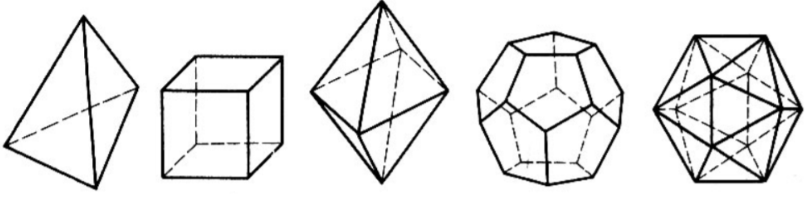{fig-align="center" width=60%}

Платоновы тела (проверка):

*   **Tetrahedron:** $4-6+4=2$
*   **Cube (Hexahedron):** $8-12+6=2$
*   **Octahedron:** $6-12+8=2$
*   **Dodecahedron:** $20-30+12=2$
*   **Icosahedron:** $12-30+20=2$

##### **1.3 Следствия формулы Эйлера**
###### **1.3.1 Оценка числа рёбер**
**Следствие 1:** если $G$ планарен и $v\ge3$, то
$$e \leq 3v - 6$$

**Идея доказательства:** у каждой грани не меньше трёх рёбер в сумме по периметру, каждое ребро граничит не более чем с двумя гранями: $3f\le2e$, подставляем $f=e-v+2$.

**Важно:** это **необходимое** условие планарности, не **достаточное**.

###### **1.3.2 $K_5$ не планарен**
Для $K_5$: $v=5$, $e=\binom{5}{2}=10$. Если бы планарен, то $10\le3\cdot5-6=9$ — противоречие. ∎

###### **1.3.3 $K_{3,3}$ не планарен**
Здесь оценка $e\le3v-6$ не отсекает граф: $9\le12$. Используем двудольность: нет нечётных циклов, значит нет треугольников, каждая грань ограничена минимум **4** рёбрами, откуда $4f\le2e$. Если бы $K_{3,3}$ был планарен, то $f=5$ и $20\le18$ — противоречие. ∎

##### **1.4 Теорема Куратовского**
###### **1.4.1 Подразбиение графа**
Ребро $e=uv$ **подразбивают (subdivide)**, заменяя его путём $u-x-v$ новой вершиной $x$. **Subdivision** — результат последовательности таких операций.

**Ключевая лемма:** граф планарен тогда и только тогда, когда планарны все его подразбиения.

###### **1.4.2 Формулировка**
**Kuratowski's Theorem:** граф планарен **тогда и только тогда**, когда он не содержит подграфа, являющегося **subdivision** $K_5$ или $K_{3,3}$.

##### **1.5 Раскраски**
###### **1.5.1 $k$-раскраска**
**$k$-colouring** — отображение
$$\alpha : V_G \to \{1, 2, \ldots, k\}$$
**Proper colouring:** на каждом ребре концы разного цвета. Граф **$k$-colourable**, если существует proper **$k$-colouring**.

###### **1.5.2 Хроматическое число**
**Chromatic number** $\chi(G)$ — минимальное $k$:
$$\chi(G) = \min\{k \mid G \text{ is } k\text{-colourable}\}$$

**Частные случаи:**

*   $\chi(G)=0$ тогда и только тогда, когда $V_G=\emptyset$ (**пустой граф**);
*   $\chi(G)=1$ тогда и только тогда, когда в $G$ нет рёбер (**null graph** $O_n$);
*   $\chi(K_n)=n$: в **complete graph** каждая пара вершин смежна, значит все цвета должны быть различны.

###### **1.5.3 Теорема о четырёх красках**
**Four Colour Theorem:** любой планарный граф **4-colourable**, то есть $\chi(G)\le4$.

###### **1.5.4 Двудольность и 2-раскраска**
Следующие условия эквивалентны:

1. $\chi(G)=2$ для нетривиального графа;
2. $G$ **двудольный (bipartite)**;
3. все циклы чётной длины.

##### **1.6 Обходы графа**
###### **1.6.1 DFS**
**Depth-First Search (DFS)** — обход «вглубь» с возвратами.

###### **1.6.2 BFS**
**Breadth-First Search (BFS)** — обход по уровням.

**Применение:** BFS удобен для проверки двудольности (**2-colouring**) через чередование цветов по слоям.

***

#### **2. Определения**
*   **Planar graph:** граф с **plane embedding** без пересечений рёбер.
*   **Plane embedding:** конкретный планарный рисунок.
*   **Face / exterior face:** грань и внешняя грань.
*   **Subdivision:** подразбиение рёбер.
*   **$k$-colouring:** функция $\alpha:V_G\to\{1,2,\ldots,k\}$ (**раскраска вершин** в $k$ цветов).
*   **Proper colouring:** раскраска, в которой на каждом ребре концы имеют разные цвета: для каждого $uv\in E_G$ выполнено $\alpha(u)\ne\alpha(v)$.
*   **$k$-colourable:** граф допускает **proper $k$-colouring**.
*   **Chromatic number $\chi(G)$.**
*   **DFS / BFS.**
*   **Bipartite graph:** доли $L,R$, рёбра только между долями.

***

#### **3. Формулы**
*   **Euler (planar):** $v-e+f=2$
*   **Edge bound (planar):** если $G$ планарен и $v\ge3$, то $e\le 3v-6$
*   **Bipartite planar edge bound:** $e\le 2v-4$ при $v\ge3$
*   **$3f\le2e$** и для двудольного планарного **$4f\le2e$**
*   $\chi(K_n)=n$, $\chi(O_n)=1$, $\chi(G)=2$ для нетривиального bipartite
*   $\chi(C_{2k+1})=3$, $\chi(C_{2k})=2$
*   **Four colours:** $\chi(G)\le4$ для планарного $G$

***

#### **4. Примеры**
##### **4.1. Показать планарность рисунком** (Лаба 11, Задание 1)
Покажите (нарисуйте), что графы планарны:

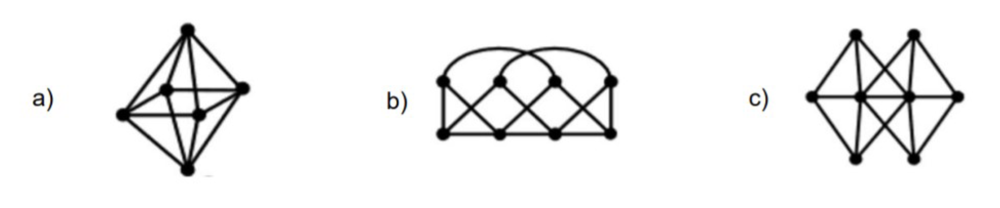{fig-align="center" width=60%}

Показать решение

!addsolution

##### **4.2. Планарность двух графов** (Лаба 11, Задание 2)
Планарны ли графы? Обоснуйте.

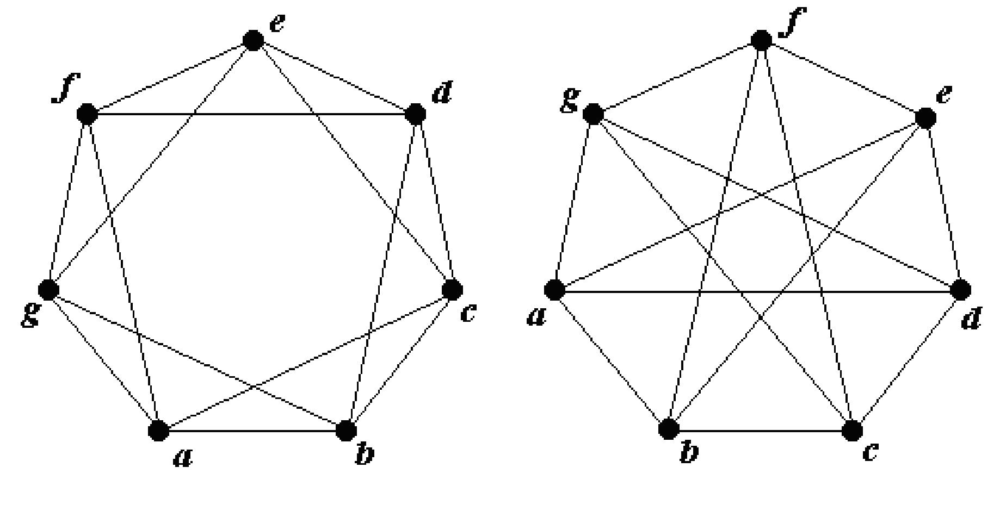{fig-align="center" width=60%}

Показать решение

!addsolution

##### **4.3. Доказать: $K_5-e$ планарен** (Лаба 11, Задание 3)
Докажите, что $K_5-e$ планарен для любого ребра $e$.

Показать решение

**Суть:** удаление любого ребра из $K_5$ уменьшает $e$ до границы $3v-6$.

1.  $v=5$, $e=\binom{5}{2}-1=9$.
2.  Проверка: $9\le3\cdot5-6=9$.
3.  **Планарное вложение:** без ограничения общности удалим $(1,2)$, поместим 1 внутрь квадрата $2,3,4,5$ и проведём остальные рёбра без пересечений.
4.  Подграфа-$K_5$ нет по числу рёбер; $K_{3,3}$ невозможен при $v=5$.

**Ответ:** $K_5-e$ планарен.

##### **4.4. Доказать: $K_{3,3}-e$ планарен** (Лаба 11, Задание 4)
Докажите, что $K_{3,3}-e$ планарен для любого ребра $e$.

Показать решение

**Суть:** для двудольного планарного графа действует оценка $e\le2v-4$.

1.  $v=6$, $e=9-1=8$.
2.  $8\le2\cdot6-4=8$.
3.  Конструкция **plane embedding** после удаления, например, $(a_1,b_1)$.
4.  У $K_{3,3}$ было $9>8$, одно ребро снимает «конфликт».

**Ответ:** $K_{3,3}-e$ планарен.

##### **4.5. Хроматические числа** (Лаба 11, Задание 5)
Найдите $\chi(G)$ для графов на рисунке:

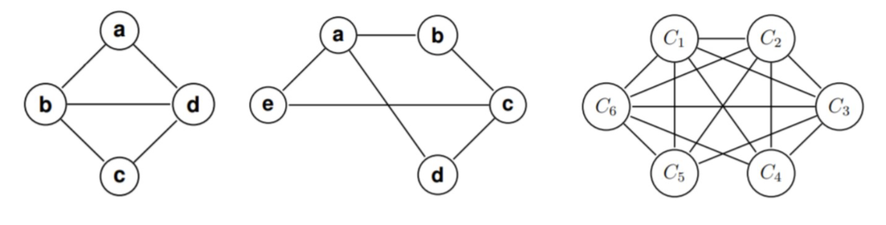{fig-align="center" width=60%}

Показать решение

!addsolution

##### **4.6. «Ромб» с пересечениями** (Туториал 11, Задание 1)
Планарен ли граф: «ромб» из 4 вершин с пересекающимися внутренними диагоналями?

Показать решение

**Суть:** пересечение на рисунке не означает непланарность — важно существование **plane embedding**.

Перерисуем: одну диагональ оставим внутри, вторую — «обойдём» снаружи контура.

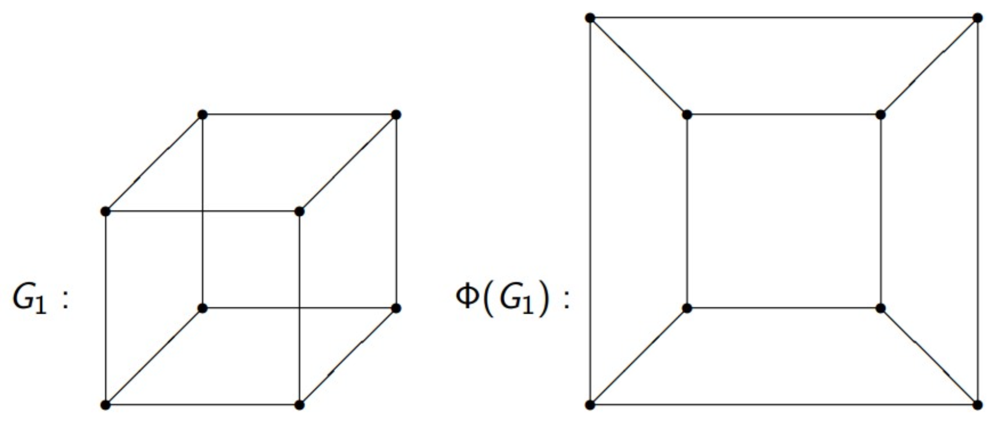{fig-align="center" width=60%}

**Ответ:** да, граф планарен.

##### **4.7. Планарность $K_{2,3}$** (Туториал 11, Задание 2)
Планарен ли полный двудольный граф $K_{2,3}$?

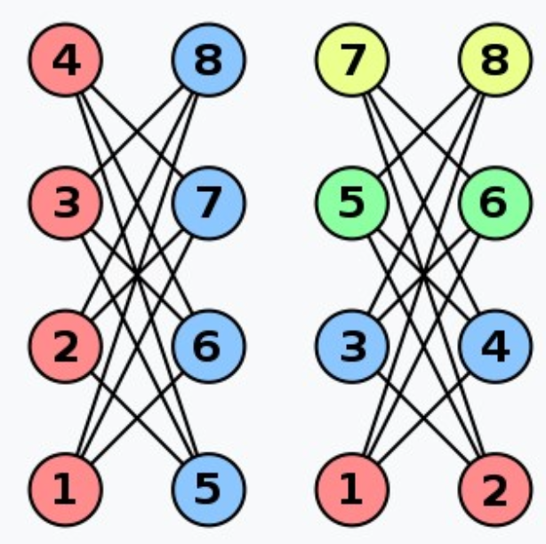{fig-align="center" width=60%}

Показать решение

**Суть:** $K_{2,n}$ планарен для любого $n$.

1.  $v=5$, $e=6$, оценка $e\le2v-4$ даёт $6\le6$.
2.  Вложение: одна вершина первой доли в центр, вторая снаружи, тройка второй доли по треугольнику; рёбра «внутрь» и «снаружи» не пересекаются.

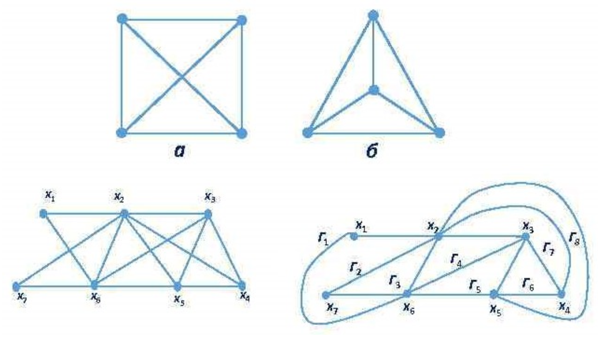{fig-align="center" width=60%}

**Ответ:** да.

##### **4.8. Сетка $2\times4$ на 8 вершинах** (Туториал 11, Задание 3)
Планарен ли граф на рисунке?

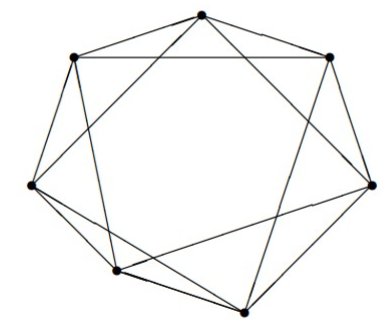{fig-align="center" width=60%}

Показать решение

**Суть:** это изоморфно графу рёбер куба (**cube graph**, $Q_3$), который планарен.

Вложение «квадрат в квадрате»:

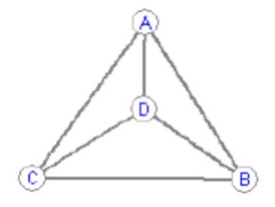{fig-align="center" width=60%}

**Ответ:** да.

##### **4.9. Куб и модификация** (Туториал 11, Задание 4)
Какие из графов планарны?

- $G_1$: каркас куба
- $G_2$: куб + дополнительная диагональ и «дуга» между противоположными вершинами

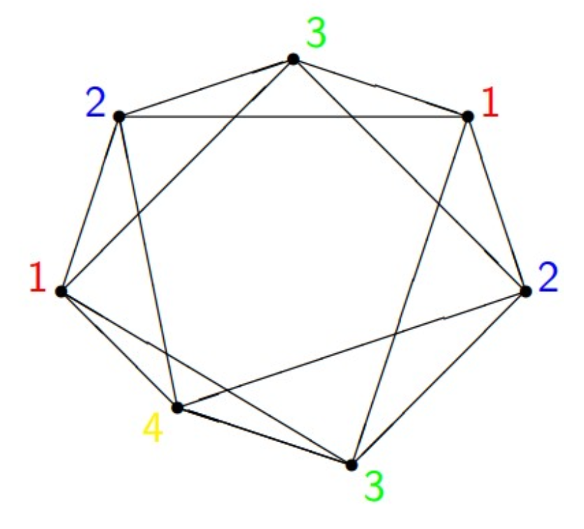{fig-align="center" width=60%}

Показать решение

**$G_1$:** планарен, вложение «вложенные квадраты».

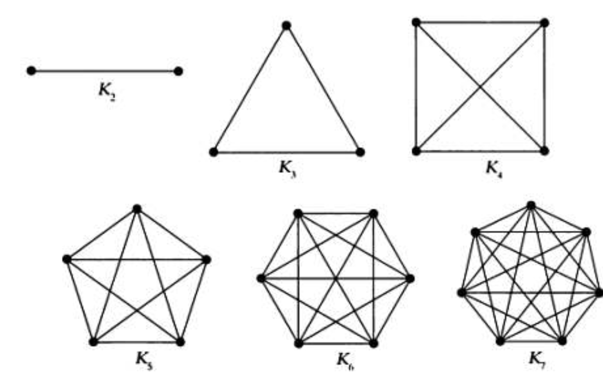{fig-align="center" width=60%}

**Ответ по $G_1$:** планарен.

**$G_2$:** содержит **subdivision** $K_{3,3}$ (как в разборе с красной/синей тройками и промежуточными $\alpha,\beta$):

{fig-align="center" width=60%}

**Ответ по $G_2$:** не планарен.

##### **4.10. Хроматическое число двудольного графа (4+4)** (Туториал 11, Задание 5)
Чему равно хроматическое число двудольного графа на 8 вершинах (по 4 в каждой доле)?

Показать решение

**Суть:** нетривиальный **bipartite** граф **2-colourable**.

Раскрасить доли двумя цветами.

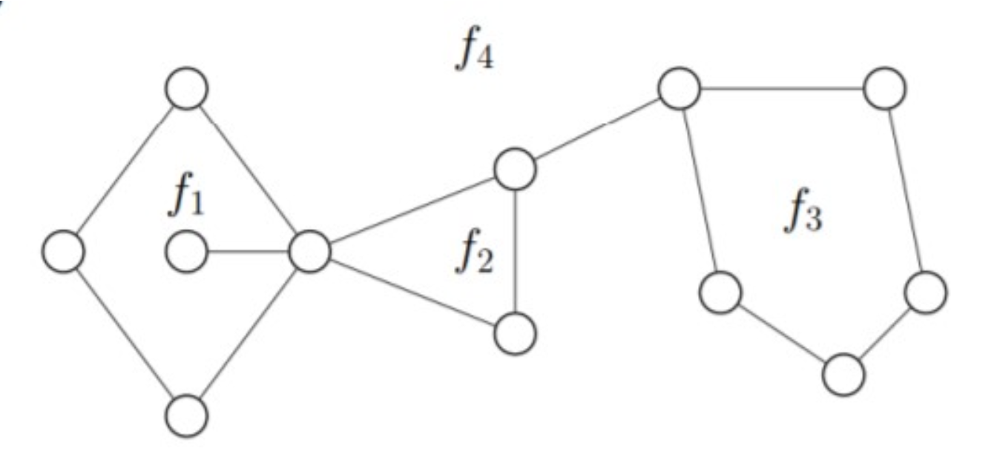{fig-align="center" width=60%}

**Ответ:** $\chi(G)=2$.

##### **4.11. Пятиугольник $C_5$** (Туториал 11, Задание 6)
Найдите $\chi(C_5)$.

Показать решение

**Суть:** нечётный цикл требует 3 цветов в proper **colouring**.

Двухцветная чередающаяся раскраска ломается на замыкающем ребре; третий цвет нужен.

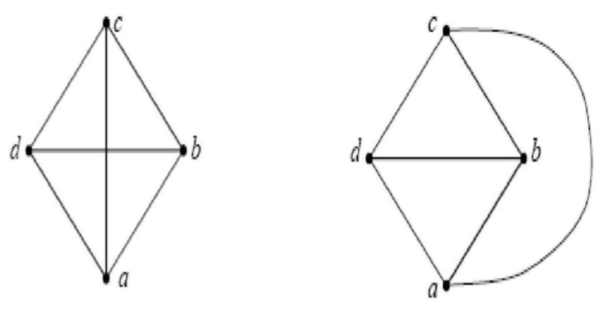{fig-align="center" width=60%}

**Ответ:** $\chi(C_5)=3$.

##### **4.12. Полный граф $K_4$** (Туториал 11, Задание 7)
Найдите $\chi(K_4)$.

Показать решение

**Суть:** в $K_n$ все вершины смежны, значит все цвета различны.

**Ответ:** $\chi(K_4)=4$.

##### **4.13. Колесо $W_7$** (Туториал 11, Задание 8)
Найдите $\chi(W_7)$ для колеса: цикл из 7 вершин + центральная «ступица», смежная со всеми вершинами цикла.

Показать решение

**Суть:** внешний цикл нечётный ($C_7$) уже требует 3 цветов; **hub** смежен со всеми вершинами цикла, значит нужен 4-й цвет.

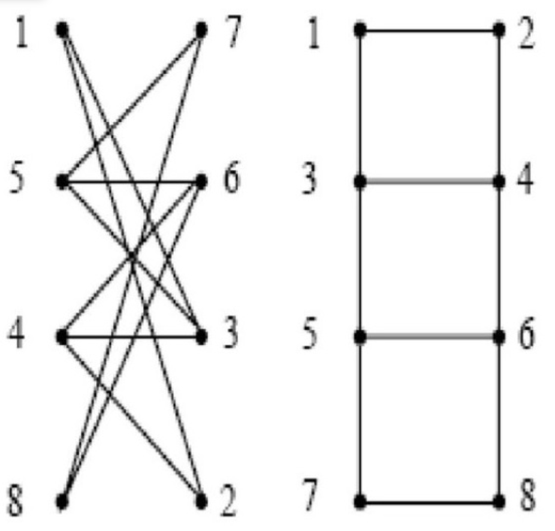{fig-align="center" width=60%}

**Ответ:** $\chi(W_7)=4$.

