#### **1. Резюме**
##### **1.1 Сети переноса**
**Сеть переноса (transportation network)** — математическая модель систем, где ресурс движется от **источника (source)** к **стоку (sink)** по связанным каналам. Удобная аналогия — водоснабжение города: вода идёт из резервуара через трубы (рёбра) к потребителям, а у каждой трубы есть предельная **пропускная способность (capacity)**.

###### **1.1.1 Формальное определение**
Транспортная (сетевая) модель $N = (V, E, c, s, t)$ состоит из:

*   $(V, E)$ — **ориентированного графа (directed graph)**: $V$ — вершины (узлы), $E$ — рёбра (направленные связи);
*   $c : E \to \mathbb{R}^+ \cup \{+\infty\}$ — **функции пропускных способностей (capacity function)**, сопоставляющей каждому ребру верхний предел потока;
*   $s$ — вершина-**источник (source)**, откуда «порождается» поток;
*   $t$ — вершина-**сток (sink)**, где поток «поглощается».

Функция $c$ задаёт максимум того, что может пройти по ребру (вода, данные, транспорт и т.д.). Для некоторых рёбер допускается бесконечная пропускная способность.

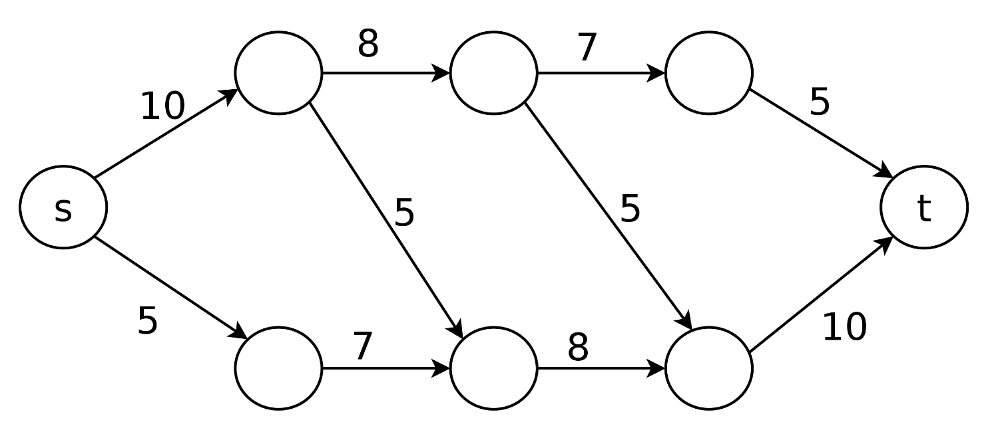{fig-align="center" width=60%}

###### **1.1.2 Прикладные смыслы**
Такие сети описывают, например:

*   **компьютерные сети**: данные от серверов к клиентам через маршрутизаторы;
*   **транспортные системы**: потоки между началом и концом маршрута по дорогам;
*   **цепочки поставок**: товары от производства к точкам продажи через склады;
*   **трубопроводы**: жидкости и газы в системе труб.

##### **1.2 Потоки в сетях**
**Поток (flow)** — фактическое распределение количества ресурса по рёбрам. В отличие от **capacity**, поток показывает, что реально «идёт» по сети в выбранный момент.

###### **1.2.1 Определение потока**
Поток $f$ в сети $N = (V, E, c, s, t)$ — это функция $f : E \to \mathbb{R}^+$, для которой выполняются два условия:

**1. Ограничение по пропускной способности (capacity constraint):** для каждого ребра $e \in E$:
$$0 \le f(e) \le c(e)$$
То есть по ребру нельзя пропустить больше, чем позволяет $c(e)$, и поток неотрицателен.

**2. Сохранение потока (conservation of flow):** для каждой вершины $v \in V \setminus \{s, t\}$:
$$\sum_{w \in V} f(v, w) = \sum_{w' \in V} f(w', v)$$
Смысл: «сколько вошло, столько и вышло». Источник и сток — исключения: у источника нет требования «вход=выход» в той же форме, сток — потребитель.

###### **1.2.2 Запись «поток/ёмкость»**
Часто на рёбрах пишут $\text{flow}/\text{capacity}$. Например:

*   $3/5$ — по ребру идёт 3 единицы при ёмкости 5 (ещё 2 единицы запаса);
*   $5/5$ — ребро **насыщено (saturated)**;
*   $0/5$ — ребро не используется.

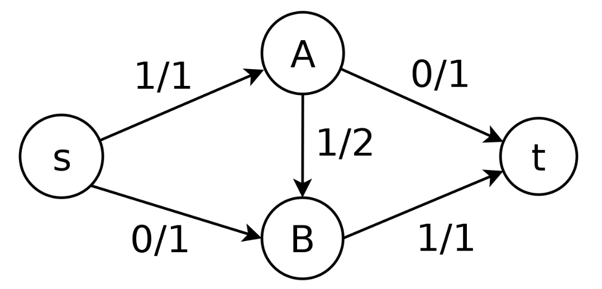{fig-align="center" width=60%}

На этой простой схеме:

*   источник $s$ посылает 1 единицу в $A$;
*   $A$ пересылает эту единицу через $B$ к стоку $t$;
*   ребро $s \to A$ насыщено ($1/1$);
*   ребро $A \to t$ не используется ($0/1$).

###### **1.2.3 Величина потока**
**Величина (value)** потока $f$ — суммарный выход из источника:
$$|f| = \sum_{w \in V} f(s, w)$$

Это пропускная способность «сквозь сеть» от $s$ к $t$ в выбранной конфигурации потока.

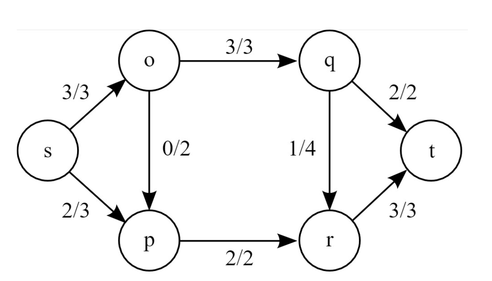{fig-align="center" width=60%}

Здесь:

*   из $s$ уходит: $3$ (к $o$) $+ 2$ (к $p$) $= 5$;
*   в $t$ приходит: $2$ (из $q$) $+ 3$ (из $r$) $= 5$;
*   значит $|f| = 5$.

##### **1.3 Задача о максимальном потоке**
**Maximum flow problem** формулируется так: *каково наибольшее возможное значение $|f|$ для данной сети?*

Это базовая задача сетевой оптимизации. В прикладных терминах:

*   сколько воды в час можно доставить;
*   какова максимальная **throughput** данных;
*   сколько транспорта «протолкнуть» между двумя узлами при заданных ограничениях.

###### **1.3.1 Почему «жадный» наивный подход ломается**
Естественная эвристика — многократно брать любой $s$–$t$ путь с остаточной пропускной способностью и насыщать его. Такой **greedy algorithm** может застрять далеко не на оптимуме.

Рассмотрим сеть:

[image here]

Если наивно выбирать пути:

1.  **Шаг 1:** путь $s \to$ нижний левый $\to$ верхний правый $\to t$ пропускает 3 единицы (ограничение по $s \to$ нижний левый);
2.  **Шаг 2:** путь $s \to$ верхний левый $\to$ верхний правый $\to t$ пропускает 2 единицы (ограничение по остатку к $t$).

Тогда получаем $|f| = 5$, хотя максимум равен 6: ранний выбор «диагонали» блокирует более равномерное распределение потока.

##### **1.4 Разрезы (cuts)**
Чтобы понять максимум потока, вводят **разрез (cut)** — набор рёбер, «отделяющий» $s$ от $t$.

###### **1.4.1 Определение разреза**
**Cut** $C$ в сети $(V, E, c, s, t)$ — множество рёбер, для которого существуют $S \subseteq V$ и $T \subseteq V$ такие, что:

*   $S \cup T = V$, $S \cap T = \emptyset$;
*   $s \in S$, $t \in T$;
*   $C = \{(u, v) \in E \mid u \in S, v \in T\}$ — все рёбра из $S$ в $T$.

Интуитивно: «линия», пересекающая сеть от стороны источника к стороне стока; в разрез входят рёбра, пересекающие границу.

###### **1.4.2 Ёмкость разреза**
**Ёмкость разреза (capacity of a cut)**:
$$c(C) = \sum_{e \in C} c(e)$$

Это сумма пропускных способностей рёбер разреза — «бутылочное горлышко»: через эти рёбра весь поток из $S$ в $T$ должен пройти целиком.

Разные разрезы дают разные суммы:

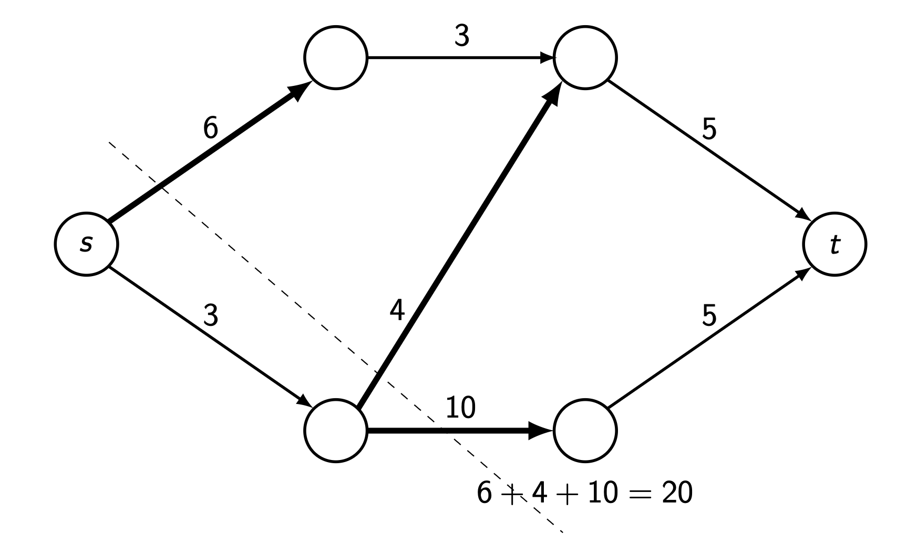{fig-align="center" width=70%}

*   **Cut 1** (сразу после источника): $6 + 4 + 10 = 20$

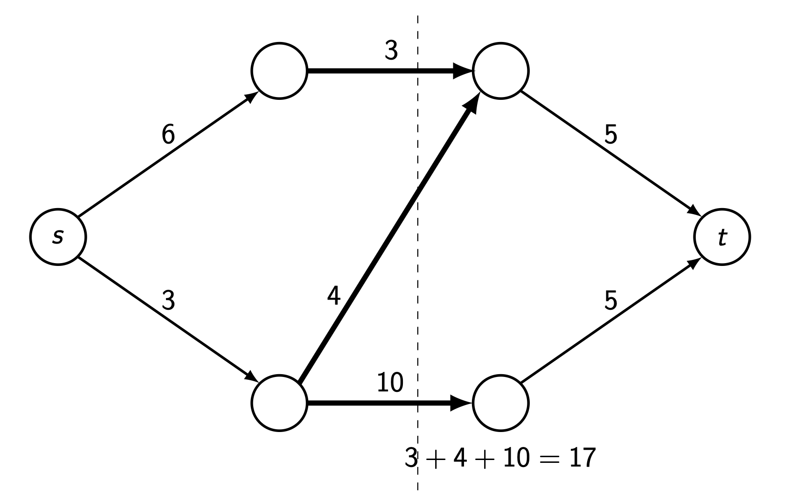{fig-align="center" width=70%}

*   **Cut 2** (вертикаль «в середине»): $3 + 4 + 10 = 17$

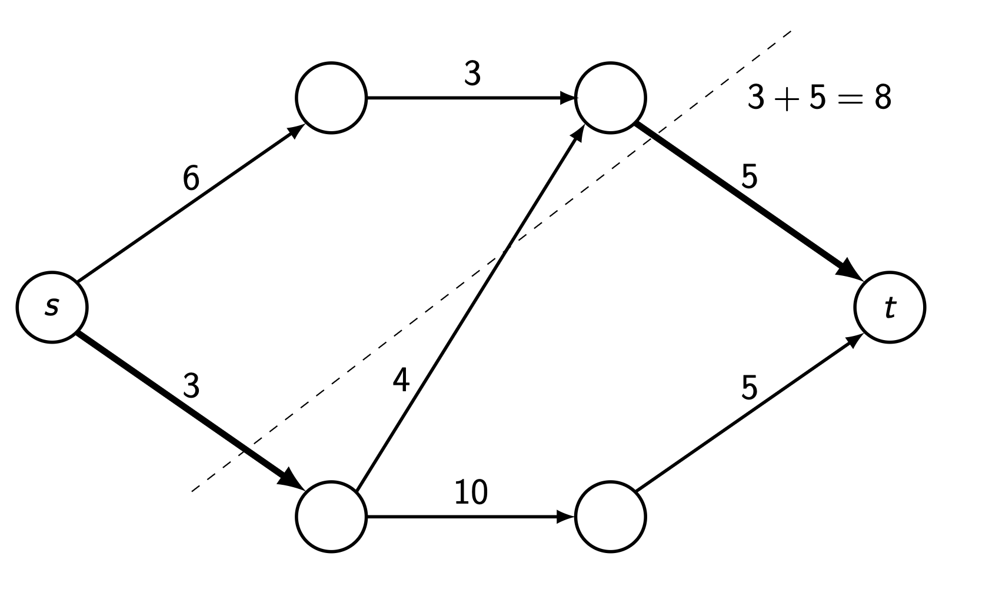{fig-align="center" width=70%}

*   **Cut 3** (ближе к стоку): $3 + 5 = 8$

Минимальная ёмкость разреза ограничивает сверху величину любого допустимого потока.

##### **1.5 Теорема max-flow min-cut**
**Max-Flow Min-Cut Theorem** (иногда связывают с именем Ford–Fulkerson) утверждает:

**Теорема:** *максимальная величина потока равна минимальной ёмкости разреза по всем разрезам.*

$$\max_{f} |f| = \min_{C} c(C)$$

Следствия:

*   больше, чем **min-cut**, протолкнуть нельзя (верхняя граница);
*   существует поток, который достигает этой границы (достижимость).

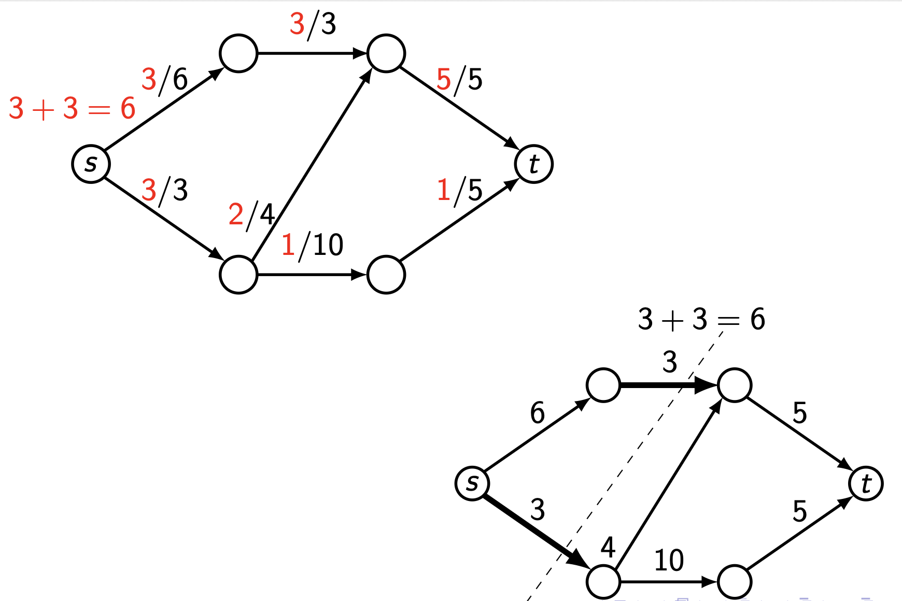{fig-align="center" width=60%}

На примере слева/справа:

*   максимальный поток равен 6;
*   минимальный разрез имеет ёмкость 6;
*   равенство подтверждает теорему.

Это связывает два разных объекта: **maximum** по потокам и **minimum** по разрезам.

##### **1.6 Алгоритм Ford–Fulkerson**
**Ford-Fulkerson algorithm** строит максимальный поток, итеративно увеличивая его и позволяя «откатывать» неудачные ранние направления за счёт обратных рёбер в остаточной сети.

###### **1.6.1 Ключ: остаточные графы (residual graphs)**
На каждом шаге рассматривают **residual graph**:

*   по прямому ребру можно добавить поток, если оно не **saturated**;
*   по обратному направлению можно **уменьшить** уже существующий поток на исходном ребре (**backward edge**), перераспределяя маршрутизацию.

###### **1.6.2 Шаги алгоритма**
**Ford-Fulkerson Algorithm:**

1.  **Инициализация:** $f(u,v)=0$ на всех рёбрах.
2.  **Пока** в **residual graph** существует путь $p$ от $s$ к $t$ (учитывая прямые и обратные дуги как в стандартной постановке):

    a.  **Bottleneck:** вычислить
        $$c_f(p) = \min\left(\{c(u, v) - f(u, v) \mid (u, v) \in p \text{ forward}\} \cup \{f(u, v) \mid (u, v) \in p \text{ backward}\}\right)$$

    b.  **Прямые рёбра:** для каждого прямого $(u,v)$ на $p$:
        $$f(u, v) := f(u, v) + c_f(p)$$

    c.  **Обратные рёбра:** для каждого обратного $(u,v)$ на $p$:
        $$f(u, v) := f(u, v) - c_f(p)$$

3.  **Ответ:** $\sum_{w \in V} f(s, w)$.

###### **1.6.3 Почему это работает**
Обход «назад» позволяет исправлять локально жадные ошибки: мы перенаправляем часть потока и освобождаем пропускную способность для лучшего пути.

###### **1.6.4 Пример трассировки**
Проследим алгоритм на «проблемной» сети:

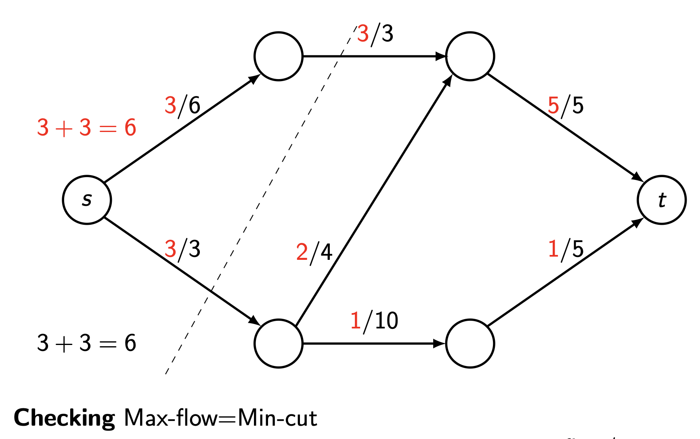{fig-align="center" width=60%}

**Шаг 1:** все потоки 0.

**Шаг 2:** путь $s \to$ нижний левый $\to$ верхний правый $\to t$

*   bottleneck: $\min(3, 4, 5) = 3$;
*   добавляем $+3$.

**Шаг 3:** путь $s \to$ верхний левый $\to$ верхний правый $\to t$

*   bottleneck: $\min(6, 3, 5-3) = 2$ (к $t$ осталось 2);
*   добавляем $+2$;
*   ребро верхний правый $\to t$ становится насыщенным.

**Шаг 4:** путь с **backward** дугой: $s \to$ верхний левый $\to$ верхний правый $\leftarrow$ нижний левый $\to$ нижний правый $\to t$

*   идём *назад* от верхнего правого к нижнему левому;
*   bottleneck: $\min(6-3, 3-2, 3, 10, 5) = 1$;
*   обновления:
    *   $f(s, \text{top-left}) = 3 + 1 = 4$
    *   $f(\text{top-left}, \text{top-right}) = 2 + 1 = 3$
    *   $f(\text{bottom-left}, \text{top-right}) = 3 - 1 = 2$ (уменьшили!)
    *   $f(\text{bottom-left}, \text{bottom-right}) = 0 + 1 = 1$
    *   $f(\text{bottom-right}, t) = 0 + 1 = 1$

**Итог:** $|f| = 6$ — максимум.

{fig-align="center" width=60%}

Согласованность с **min-cut** (ёмкость 6) подтверждает оптимальность.

##### **1.7 Практические замечания**
###### **1.7.1 Сложность**
От выбора **augmenting path** зависит время:

*   базовая оценка: $O(E \cdot |f^*|)$, где $|f^*|$ — величина максимального потока;
*   **Edmonds–Karp** (BFS): $O(V \cdot E^2)$;
*   **Dinic's algorithm**: $O(V^2 \cdot E)$.

###### **1.7.2 Единственность**
*   **максимальная величина потока** единственна;
*   сам **максимальный поток** как распределение по рёбрам может быть неединственным;
*   **minimum cut** тоже может быть неединственным.

***

#### **2. Определения**
*   **Transportation network:** ориентированный граф $N=(V,E,c,s,t)$, где $(V,E)$ — ориентированный граф, $c:E\to\mathbb{R}^+\cup\{+\infty\}$ — функция пропускных способностей, $s$ — **source**, $t$ — **sink**.
*   **Capacity:** функция $c$, задающая верхний предел потока на каждом ребре.
*   **Source:** вершина $s$, откуда «исходит» поток (в стандартной модели исключения для сохранения формулируются отдельно).
*   **Sink:** вершина $t$, где поток «поглощается».
*   **Flow:** функция $f:E\to\mathbb{R}^+$, для которой выполнены (1) **capacity constraint** $0\le f(e)\le c(e)$ и (2) **conservation** $\sum_w f(v,w)=\sum_{w'} f(w',v)$ для всех $v\in V\setminus\{s,t\}$.
*   **Flow value:** $|f|=\sum_{w\in V} f(s,w)$.
*   **Saturated edge:** ребро с $f(e)=c(e)$.
*   **Cut:** разбиение вершин на $S$ и $T$, где $s\in S$, $t\in T$, $S\cup T=V$, $S\cap T=\emptyset$; сам разрез — рёбра $C=\{(u,v)\in E\mid u\in S,\ v\in T\}$.
*   **Cut capacity:** $c(C)=\sum_{e\in C} c(e)$.
*   **Minimum cut:** разрез с минимальной ёмкостью среди всех разрезов.
*   **Maximum flow:** поток с максимально возможным значением $|f|$.
*   **Residual graph:** сеть остаточных пропускных способностей относительно текущего $f$ (включая обратные дуги для уменьшения потока).
*   **Augmenting path:** путь $s\to t$ в **residual graph**, вдоль которого можно увеличить поток на величину **bottleneck capacity**.
*   **Bottleneck capacity:** минимум остаточных пропускных способностей вдоль **augmenting path**.

***

#### **3. Формулы**
*   **Flow value:** $|f| = \sum_{w \in V} f(s, w)$
*   **Capacity constraint:** $0 \le f(e) \le c(e)$
*   **Flow conservation:** $\sum_{w \in V} f(v, w) = \sum_{w' \in V} f(w', v)$ для $v \in V \setminus \{s, t\}$
*   **Cut capacity:** $c(C) = \sum_{e \in C} c(e)$
*   **Max-flow min-cut:** $\max_{f} |f| = \min_{C} c(C)$
*   **Residual (forward):** $c_f(u, v) = c(u, v) - f(u, v)$
*   **Residual (backward):** $c_f(v, u) = f(u, v)$
*   **Bottleneck:**
$$c_f(p) = \min\left(\{c(u, v) - f(u, v) \mid (u, v) \in p \text{ forward}\} \cup \{f(u, v) \mid (u, v) \in p \text{ backward}\}\right)$$

***

#### **4. Примеры**
##### **4.1. Минимальный разрез для сети A** (Лаба 12, Задание 1a)
Найдите разрез минимальной возможной ёмкости для сети A.

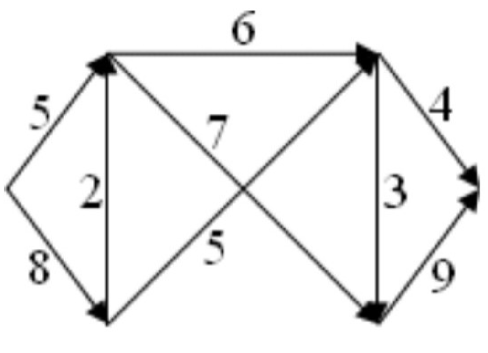{fig-align="center" width=60%}

Показать решение

**Суть:** **minimum cut** — «узкое место», ограничивающее любой поток.

1.  **Структура:** у источника два исходящих ребра (в условии: 5 сверху и 8 снизу), дальше — параллельные маршруты к стоку.
2.  **Стратегия:** перебирать разумные $(S,T)$-разбиения и суммировать $c(e)$ по рёбрам из $S$ в $T$.
3.  **Вариант 1 (сразу после $s$):** все рёбра, выходящие из источника: $5+8=13$.
4.  **Вариант 2 (середина):** зависит от конкретной геометрии на рисунке.
5.  **Вариант 3 (у стока):** рёбра, входящие в «предастоковую» зону: в типичной разметке встречается $4+9=13$.
6.  **Более «узкий» разрез** часто находится «внутри» сети: нужно минимизировать сумму по пересекаемым рёбрам.

**Ответ:** точное значение **min-cut** получается систематическим перебором разрезов; по **max-flow min-cut** оно совпадает с величиной максимального потока.

##### **4.2. Минимальный разрез для сети B** (Лаба 12, Задание 1b)
Найдите разрез минимальной возможной ёмкости для сети B.

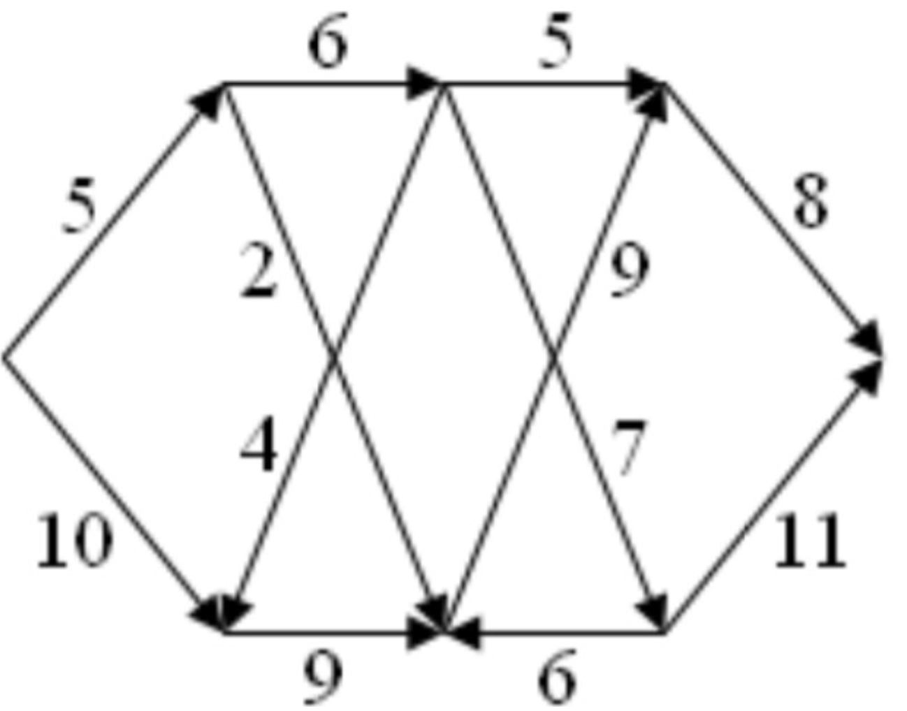{fig-align="center" width=60%}

Показать решение

!addsolution

##### **4.3. Минимальный разрез для сети C** (Лаба 12, Задание 1c)
Найдите разрез минимальной возможной ёмкости для сети C.

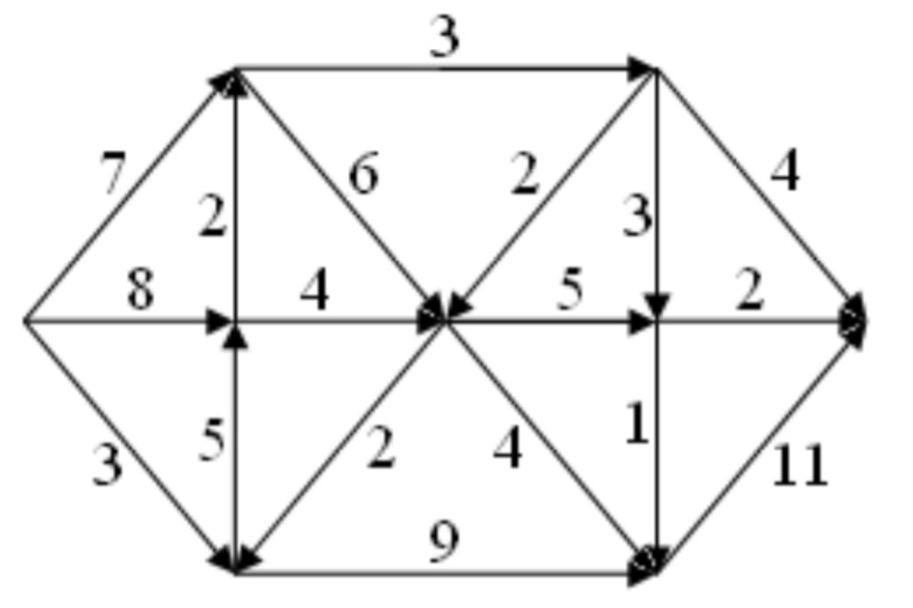{fig-align="center" width=60%}

Показать решение

!addsolution

##### **4.4. Максимальный поток для сети A** (Лаба 12, Задание 2a)
Найдите максимальный поток для сети A алгоритмом Ford–Fulkerson.

{fig-align="center" width=60%}

Показать решение

**Суть:** итеративно искать **augmenting path** в **residual graph**, пока такие пути есть.

**Инициализация:** $f=0$ на всех рёбрах.

**Итерации:**

1.  найти любой путь $s\to t$ с положительным bottleneck;
2.  увеличить поток на величину bottleneck;
3.  повторять.

**Пример первой итерации (схематично):** выбрать путь через «верхнюю цепочку» к $t$ и ограничить его минимальной пропускной способностью на пути.

**Останов:** нет пути с положительным остатком.

**Ответ:** значение $|f^*|$ получают полным выполнением шагов Ford–Fulkerson до остановки; по **max-flow min-cut** оно совпадает с ёмкостью **min-cut** из задания 1a.

##### **4.5. Максимальный поток для сети B** (Лаба 12, Задание 2b)
Найдите максимальный поток для сети B алгоритмом Ford–Fulkerson.

{fig-align="center" width=60%}

Показать решение

!addsolution

##### **4.6. Максимальный поток для сети C** (Лаба 12, Задание 2c)
Найдите максимальный поток для сети C алгоритмом Ford–Fulkerson.

{fig-align="center" width=60%}

Показать решение

!addsolution

##### **4.7. Проверка сохранения потока** (Лекция 12, Пример 1)
На рисунке рёбра подписаны как поток/ёмкость. Проверьте, что поток допустим.

{fig-align="center" width=60%}

Показать решение

**Суть:** на каждой внутренней вершине входящий поток равен исходящему.

1.  **Вершина $A$:** внутрь $1$ (из $s$), наружу $0+1=1$ — ок.
2.  **Вершина $B$:** внутрь $1+0=1$, наружу $1$ — ок.
3.  **Ограничения по $c$:** все неравенства $f(e)\le c(e)$ выполняются.
4.  **Величина:** $|f|=1+0=1$.

**Ответ:** допустимый поток, $|f|=1$.

##### **4.8. Максимальный поток на большой сети** (Лекция 12, Пример 2)
Найдите максимальный поток на сети ниже методом Ford–Fulkerson.

{fig-align="center" width=60%}

Показать решение

**Суть:** серия **augmenting paths** в **residual graph**.

Начинаем с нулевого потока, затем многократно увеличиваем поток по путям; типичный первый шаг — взять «нижний» маршрут и ограничить его минимальной пропускной способностью на пути, например $\min(5,7,8,10)=5$ при указанных на рисунке пропускных способностях.

**Ответ:** численное значение следует из полного выполнения алгоритма на сети с рисунка; **Ford–Fulkerson** даёт оптимум, совпадающий с **min-cut**.

##### **4.9. Три разреза и их ёмкости** (Лекция 12, Пример 3)
Найдите три разных разреза и посчитайте их ёмкости.

{fig-align="center" width=70%}

Показать решение

**Суть:** разрез задаётся парой $(S,T)$.

**Cut 1 (у источника):** $S=\{s\}$, берём все рёбра $s\to \ldots$; в диаграмме сумма **20**.

{fig-align="center" width=70%}

**Cut 2 (вертикаль в середине):** сумма **17**.

{fig-align="center" width=70%}

**Cut 3 (у стока):** сумма **8**.

**Ответ:** 20, 17 и 8; **minimum cut** равен 8.

##### **4.10. Проверка max-flow min-cut** (Лекция 12, Пример 4)
Проверьте, что максимальный поток равен минимальной ёмкости разреза.

{fig-align="center" width=60%}

Показать решение

**Суть:** теорема **max-flow min-cut**.

**Max flow (слева):** из $s$ уходит $3+3=6$, в $t$ приходит $5+1=6$.

**Min cut (справа):** пересечённые рёбра дают $3+3=6$.

**Ответ:** $6=6$.

##### **4.11. Ford–Fulkerson и backward ребро** (Лекция 12, Пример 5)
Покажите максимальный поток, объясняя роль обратного ребра.

{fig-align="center" width=60%}

Показать решение

**Суть:** **backward edge** в **residual graph** соответствует уменьшению потока на прямом ребре и позволяет выйти из локального «плохого» распределения.

**Шаг 1: инициализация** — все потоки 0, $|f|=0$.

**Шаг 2: первый augmenting path** $s\to$ нижний левый $\to$ верхний правый $\to t$:

*   остаточные пропускные способности вдоль пути: $3,4,5$;
*   bottleneck $=3$;
*   добавляем 3 ко всем рёбрам пути; $|f|=3$.

**Шаг 3: второй путь** $s\to$ верхний левый $\to$ верхний правый $\to t$:

*   остаточные: $6$, $3$, и к $t$ остаётся $5-3=2$;
*   bottleneck $=2$;
*   добавляем 2; $|f|=5$;
*   ребро верхний правый $\to t$ насыщается ($5/5$).

**Шаг 4: путь с обратной дугой** $s\to$ верхний левый $\to$ верхний правый $\leftarrow$ нижний левый $\to$ нижний правый $\to t$:

*   остаточные: $6-2=4$, $3-2=1$, по обратной дуге «снимаем» до 3 единиц с ребра нижний левый$\to$верхний правый, далее $10$ и $5$;
*   bottleneck $=1$;
*   обновления потоков как в разделе 1.6.4; $|f|=6$.

**Шаг 5:** augmenting path с положительным bottleneck больше нет.

**Проверка min-cut:** пересечённые рёбра дают $3+3=6$.

**Ответ:** максимальный поток равен 6; шаг с **backward edge** был ключевым.

##### **4.12. Пример 1** (Туториал 12, Задание 1)
Найдите максимальный поток в сети с узлами $s,1,2,3,4,t$ алгоритмом Ford–Fulkerson.

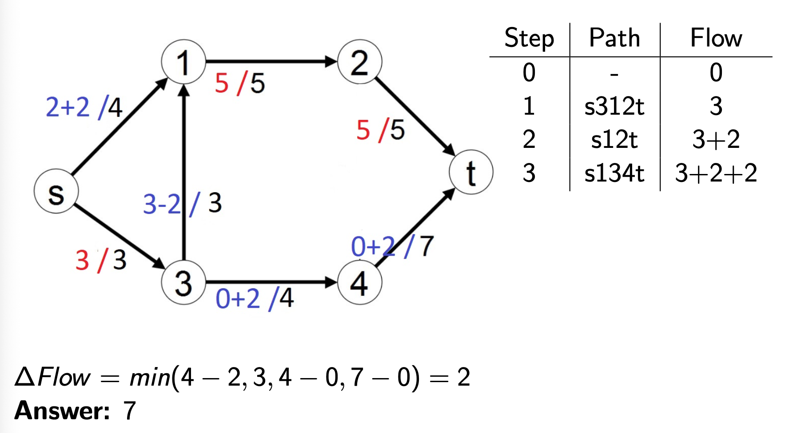{fig-align="center" width=60%}

Показать решение

**Суть:** вести итерации и остаточные пропускные способности.

По таблице шагов на рисунке:

| Шаг | Путь | Поток |
|-----|------|-------|
| 0 | - | 0 |
| 1 | s312t | 3 |
| 2 | s12t | 3+2 |
| 3 | s134t | 3+2+2 |

**Шаг 1:** $s\to3\to1\to2\to t$, bottleneck $\min(3,3,5,5)=3$, добавляем 3.

**Шаг 2:** $s\to1\to2\to t$, bottleneck $\min(4,2,2)=2$, добавляем 2.

**Шаг 3:** $s\to1\to3\to4\to t$ использует **backward** вдоль ранее использованного $3\to1$; bottleneck $\min(2,3,4,7)=2$, добавляем 2.

**Проверка min-cut:** рёбра из разреза у источника дают $4+3=7$.

**Ответ:** 7.

##### **4.13. Пример 2** (Туториал 12, Задание 2)
Найдите максимальный поток для второй сети-примера.

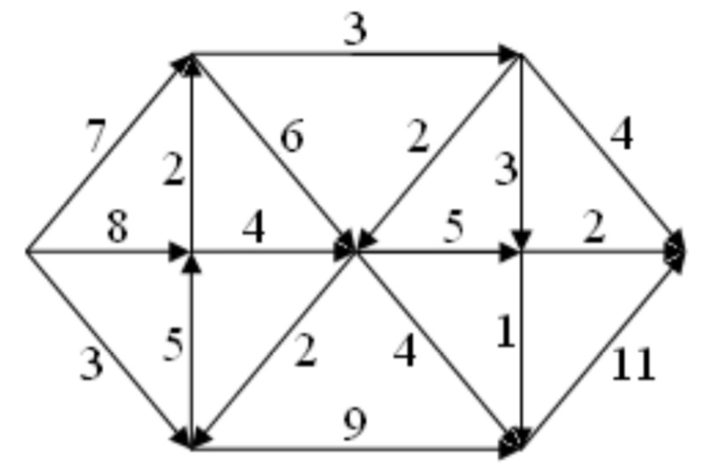{fig-align="center" width=60%}

Показать решение

**Суть:** три итерации Ford–Fulkerson.

**Шаг 0:** потоки 0.

**Шаг 1:** путь $s\to3\to4\to t$, bottleneck $\min(5,2,7)=2$, добавляем 2, $|f|=2$.

**Шаг 2:** путь $s\to1\to2\to t$, bottleneck $\min(3,5,5)=3$, добавляем 3, $|f|=5$.

**Шаг 3:** путь $s\to3\to1\to2\to t$ с рёбром $3\to1$; остатки дают bottleneck $\min(3,4,2,2)=2$, добавляем 2, $|f|=7$.

**Останов:** augmenting path не найден.

**Проверка:** **min-cut** даёт 7, совпадает с **max-flow**.

**Ответ:** 7.

