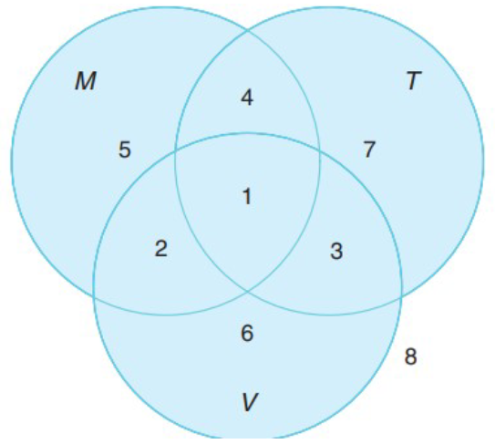
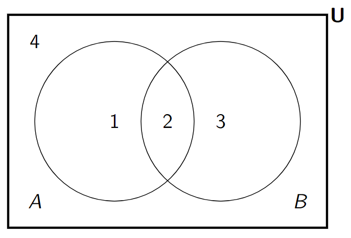



[Quiz](https://notebooklm.google.com/notebook/85dac215-bcd6-4ee6-8990-b134d5349358?artifactId=576a1b7f-3a1c-4dd7-bbba-1c1ced60306e) | [Flashcards](https://notebooklm.google.com/notebook/85dac215-bcd6-4ee6-8990-b134d5349358?artifactId=0ae84ae4-4dd8-469d-ae45-69f2416319f0)

#### **1. Кратко**
##### **1.1 Введение в наивную теорию множеств**
###### **1.1.1 Определение множества**
**Множество (set)** — базовое понятие: *неупорядоченная совокупность различных объектов* — **элементов (elements)** или **членов множества (members)**.

- **Неупорядоченность (unordered)**: порядок в записи не важен: $\{1,2,3\}=\{3,1,2\}$.
- **Различность элементов (distinct elements)**: повторы не учитываются; $\{a,a,b\}$ — это $\{a,b\}$.

Задать множество можно так:

1.  **Перечислением (list method)**: явный список в фигурных скобках, например $A=\{0,2,4,6,8\}$.
2.  **Правилом (set-builder notation)**: условие на элементах, например $X=\{x \mid x \% 2 = 0\}$ для чётных целых.

###### **1.1.2 Равенство множеств и принадлежность**
**Принцип объёмности (extension principle / axiom of extensionality):** два множества *равны*, тогда и только тогда, когда состоят из одних и тех же элементов.

**Принадлежность (membership):**

- $∈$ — «элемент принадлежит множеству», например $3 ∈ \{1,2,3\}$.
- $∉$ — «не принадлежит», например $4 ∉ \{1,2,3\}$.

##### **1.2 Подмножества и особые множества**
###### **1.2.1 Подмножества**
$A$ — **подмножество (subset)** $B$, если каждый элемент $A$ лежит в $B$; пишут $A ⊆ B$.

- **Собственное подмножество (proper subset)** $A ⊂ B$: $A ⊆ B$ и $A \neq B$.

Пример: $A=\{a,b\}$, $B=\{a,b,c\}$ ⇒ $A ⊆ B$ и $A ⊂ B$.

###### **1.2.2 Универсальное множество и пустое множество**
- **Универсальное множество $U$ (universal set)** — заранее выбранная «вся область рассуждения»; остальные множества в задаче — подмножества $U$.
- **Пустое множество $\emptyset$ (empty set)** — единственное множество без элементов; $\emptyset ⊆ A$ для любого $A$.

##### **1.3 Базовые операции над множествами**
###### **1.3.1 Дополнение (complement)**
**Дополнение** $A$ (в обозначениях курса часто $\bar A$ или $Ā$) — все элементы $U$, не входящие в $A$: $\bar A=\{x∈U \mid x∉A\}$.
<!-- DIAGRAM HERE -->

###### **1.3.2 Пересечение (intersection)**
$A ∩ B$ — элементы, лежащие **и** в $A$, **и** в $B$.
<!-- DIAGRAM HERE -->

###### **1.3.3 Объединение (union)**
$A ∪ B$ — элементы, которые в $A$, или в $B$, или в обоих.
<!-- DIAGRAM HERE -->

###### **1.3.4 Разность (set difference)**
$A \setminus B$ — элементы из $A$, **не** лежащие в $B$; также $A ∩ \bar B$.
<!-- DIAGRAM HERE -->

##### **1.4 Свойства операций**
Свойства аналогичны законам логики:

- **Коммутативность:** $A ∪ B = B ∪ A$, $A ∩ B = B ∩ A$.
- **Ассоциативность:** $(A ∪ B) ∪ C = A ∪ (B ∪ C)$, $(A ∩ B) ∩ C = A ∩ (B ∩ C)$.
- **Дистрибутивность:** $A ∪ (B ∩ C) = (A ∪ B) ∩ (A ∪ C)$, $A ∩ (B ∪ C) = (A ∩ B) ∪ (A ∩ C)$.
- **Законы де Моргана (De Morgan's laws):**
  - $\overline{A ∪ B} = \bar A ∩ \bar B$
  - $\overline{A ∩ B} = \bar A ∪ \bar B$

##### **1.5 Мощность (cardinality)**
**Мощность** $|A|$ — число различных элементов.

- Для конечных множеств $|A|∈\mathbb{Z}_{\ge 0}$; $|\{1,2,3\}|=3$.
- $|\emptyset|=0$.
- Для бесконечных множеств мощность описывает «размер бесконечности»: $\mathbb{N}$ — *счётно бесконечно (countably infinite)*, $\mathbb{R}$ — *несчётно (uncountably infinite)*.

##### **1.6 Декартово произведение (Cartesian product)**
$A × B$ — множество всех **упорядоченных пар** $(a,b)$, $a∈A$, $b∈B$.

- **Не коммутативно:** обычно $A×B \neq B×A$.
- **Мощность:** $|A×B| = |A|\cdot|B|$.

Пример: $A=\{1,2\}$, $B=\{x,y\}$ ⇒ $A×B=\{(1,x),(1,y),(2,x),(2,y)\}$.

##### **1.7 Булеан (power set)**
**Булеан $P(A)$** (или $2^A$) — множество **всех подмножеств** $A$, включая $\emptyset$ и $A$.

- Если $|A|=n$, то $|P(A)|=2^n$.

Пример: $A=\{a,b\}$ ⇒ $P(A)=\{\emptyset,\{a\},\{b\},\{a,b\}\}$.

##### **1.8 Принцип включения–исключения (inclusion–exclusion)**
Техника подсчёта $|A ∪ B ∪ \dots|$ без двойного учёта.

- **Два множества:** $|A ∪ B| = |A| + |B| - |A ∩ B|$.
- **Три множества:**
  $$ |A ∪ B ∪ C| = |A| + |B| + |C| - |A ∩ B| - |A ∩ C| - |B ∩ C| + |A ∩ B ∩ C| $$

***

#### **2. Определения**
* **Множество (set)**: неупорядоченная совокупность различных объектов — элементов.
* **Элемент (element)**: член множества.
* **Подмножество ($⊆$)**: все элементы содержатся в другом множестве.
* **Собственное подмножество ($⊂$)**: подмножество, не равное исходному множеству.
* **Универсальное множество ($U$)**: область всех элементов в постановке задачи.
* **Пустое множество ($∅$)**: множество без элементов.
* **Мощность ($|A|$)**: число различных элементов.
* **Дополнение ($\bar A$ / $Ā$)**: элементы $U$, не входящие в $A$.
* **Пересечение ($∩$)**: общие элементы.
* **Объединение ($∪$)**: элементы, встречающиеся хотя бы в одном множестве.
* **Разность ($\setminus$)**: элементы первого множества, не лежащие во втором.
* **Декартово произведение ($×$)**: все упорядоченные пары.
* **Булеан ($P(A)$)**: множество всех подмножеств.
* **Диаграмма Венна (Venn diagram)**: наглядная схема множеств.

***

#### **3. Формулы**
*   **Дополнение (complement)**: $\overline{A} = U \setminus A$
*   **Разность (difference)**: $A \setminus B = A \cap \overline{B}$
*   **Закон де Моргана (De Morgan's law)**: $\overline{(A \cup B)} = \overline{A} \cap \overline{B}$
*   **Закон де Моргана (De Morgan's law)**: $\overline{(A \cap B)} = \overline{A} \cup \overline{B}$
*   **Дистрибутивность (distributive law)**: $A \cap (B \cup C) = (A \cap B) \cup (A \cap C)$
*   **Мощность объединения (два множества)**: $|A \cup B| = |A| + |B| - |A \cap B|$
*   **Мощность объединения (три множества)**: $$ |A \cup B \cup C| = |A| + |B| + |C| - |A \cap B| - |A \cap C| - |B \cap C| + |A \cap B \cap C| $$
*   **Мощность разности**: $|A \setminus B| = |A| - |A \cap B|$
*   **Мощность декартова произведения**: $|A \times B| = |A| \cdot |B|$
*   **Пересечение декартовых произведений**: $(A \times C) \cap (B \times D) = (A \cap B) \times (C \cap D)$
*   **Пересечение булеанов**: $P(A) \cap P(B) = P(A \cap B)$

***

#### **4. Примеры**
##### **4.1. Операции над множествами** (Лаба 4, Задание 1)
Пусть $U = \{0, 1, 2, 3, 4, 5, 6, 7, 8, 9\}$, $A = \{1, 2, 9\}$, $B = \{7, 8, 9\}$. Перечислите элементы множества $\overline{A} \cap B$.

Показать решение

1.  **Дополнение к $A$ ($\overline{A}$):** элементы универсума $U$, не входящие в $A$.
    *   $A = \{1, 2, 9\}$
    *   $\overline{A} = \{0, 3, 4, 5, 6, 7, 8\}$.
2.  **Пересечение $\overline{A}$ и $B$:** общие элементы.
    *   $\overline{A} = \{0, 3, 4, 5, 6, 7, 8\}$
    *   $B = \{7, 8, 9\}$
    *   Общие: $7$ и $8$.

**Ответ:** $\overline{A} \cap B = \{7, 8\}$.

##### **4.2. Операции над множествами** (Лаба 4, Задание 1.a)
Пусть $U = \{0, 1, \ldots, 9\}$, $A = \{0, 2, 4, 6, 8\}$, $C = \{2, 3, 4, 5\}$. Перечислите элементы $\overline{A} \cup C$.

Показать решение

1.  **Дополнение к $A$:**
    *   $\overline{A} = \{1, 3, 5, 7, 9\}$.
2.  **Объединение:** объединяем $\overline{A}$ и $C$ без повторов.
    *   $\overline{A} = \{1, 3, 5, 7, 9\}$
    *   $C = \{2, 3, 4, 5\}$
    *   $\overline{A} \cup C = \{1, 2, 3, 4, 5, 7, 9\}$.

**Ответ:** $\overline{A} \cup C = \{1, 2, 3, 4, 5, 7, 9\}$.

##### **4.3. Операции над множествами** (Лаба 4, Задание 1.b)
Пусть $A = \{0, 2, 4, 6, 8\}$, $B = \{1, 3, 5, 7, 9\}$. Перечислите элементы $A \cap \overline{B}$.

Показать решение

1.  **Дополнение к $B$:**
    *   универсум $U = \{0, 1, \ldots, 9\}$;
    *   $\overline{B} = \{0, 2, 4, 6, 8\}$.
2.  **Пересечение $A$ и $\overline{B}$:**
    *   $A = \{0, 2, 4, 6, 8\}$
    *   $\overline{B} = \{0, 2, 4, 6, 8\}$
    *   пересечение совпадает с $A$.

**Ответ:** $A \cap \overline{B} = \{0, 2, 4, 6, 8\}$.

##### **4.4. Операции над множествами** (Лаба 4, Задание 1.c)
Пусть $A = \{0, 2, 4, 6, 8\}$, $C = \{2, 3, 4, 5\}$. Перечислите элементы $\overline{A \cap C}$.

Показать решение

1.  **Пересечение $A \cap C$:**
    *   $A \cap C = \{2, 4\}$.
2.  **Дополнение к пересечению** в $U = \{0, 1, \ldots, 9\}$:
    *   $\overline{\{2, 4\}} = \{0, 1, 3, 5, 6, 7, 8, 9\}$.

**Ответ:** $\overline{A \cap C} = \{0, 1, 3, 5, 6, 7, 8, 9\}$.

##### **4.5. Операции над множествами** (Лаба 4, Задание 1.d)
Пусть $U = \{0, 1, \ldots, 9\}$, $B = \{1, 3, 5, 7, 9\}$, $C = \{2, 3, 4, 5\}$, $D = \{1, 6, 7\}$. Перечислите элементы $(\overline{C} \setminus D) \cup B$.

Показать решение

1.  **Дополнение к $C$:**
    *   $\overline{C} = \{0, 1, 6, 7, 8, 9\}$.
2.  **Разность $\overline{C} \setminus D$:** из $\overline{C}$ убираем элементы $D$.
    *   $D = \{1, 6, 7\}$ ⇒ остаётся $\{0, 8, 9\}$.
3.  **Объединение с $B$:**
    *   $\{0, 8, 9\} \cup \{1, 3, 5, 7, 9\} = \{0, 1, 3, 5, 7, 8, 9\}$.

**Ответ:** $(\overline{C} \setminus D) \cup B = \{0, 1, 3, 5, 7, 8, 9\}$.

##### **4.6. Операции над множествами** (Лаба 4, Задание 1.e)
Пусть $U = \{0, 1, \ldots, 9\}$, $A = \{0, 2, 4, 6, 8\}$, $C = \{2, 3, 4, 5\}$, $D = \{1, 6, 7\}$. Перечислите элементы $\overline{A \cap C \cap D}$.

Показать решение

1.  **Пересечение $A \cap C \cap D$:**
    *   $A = \{0, 2, 4, 6, 8\}$, $C = \{2, 3, 4, 5\}$, $D = \{1, 6, 7\}$;
    *   общих элементов у трёх множеств нет ⇒ $A \cap C \cap D = \emptyset$.
2.  **Дополнение к пустому множеству** в $U$ — весь универсум.

**Ответ:** $\overline{A \cap C \cap D} = \{0, 1, 2, 3, 4, 5, 6, 7, 8, 9\}$.

##### **4.7. Формула по диаграмме Венна** (Лаба 4, Задание 2)
По диаграмме Венна ниже запишите формулу (только $\overline{()}$, $\cap$, $\cup$) для **региона 1**.

{fig-align="center" width=60%}

Показать решение

1.  **Регион 1:** пересечение трёх кругов $M$, $T$ и $V$.
2.  **Смысл:** элементы лежат одновременно в $M$, в $T$ и в $V$.
3.  **Формула:** тройное пересечение.

**Ответ:** **$M \cap T \cap V$**.

##### **4.8. Формула по диаграмме Венна** (Лаба 4, Задание 2.a)
По той же диаграмме запишите формулу для **региона 5**.

{fig-align="center" width=60%}

Показать решение

1.  **Регион 5:** внутри $M$, но вне $T$ и вне $V$.
2.  **Смысл:** $M \land \neg T \land \neg V$ в терминах множеств.
3.  **Формула:** $M \cap \overline{T} \cap \overline{V}$.

**Ответ:** $M \cap \overline{T} \cap \overline{V}$.

##### **4.9. Формула по диаграмме Венна** (Лаба 4, Задание 2.b)
По диаграмме запишите формулу для **региона 3**.

{fig-align="center" width=60%}

Показать решение

1.  **Регион 3:** в пересечении $T$ и $V$, но вне $M$.
2.  **Смысл:** $T \cap V \cap \overline{M}$.
3.  **Формула:** как выше.

**Ответ:** $T \cap V \cap \overline{M}$.

##### **4.10. Формула по диаграмме Венна** (Лаба 4, Задание 2.c)
По диаграмме запишите формулу для **регионов 1 и 2** вместе.

{fig-align="center" width=60%}

Показать решение

1.  **Регионы 1 и 2:** часть $M \cap V$, не обязательно лежащая в $T$.
2.  **Разложение:** регион 1 — $M \cap T \cap V$; регион 2 — $M \cap V \cap \overline{T}$.
3.  **Объединение:** $(M \cap T \cap V) \cup (M \cap V \cap \overline{T})$.
4.  **Упрощение:** вынесем $M \cap V$: $(M \cap V) \cap (T \cup \overline{T}) = M \cap V$, так как $T \cup \overline{T}$ даёт универсум внутри $M \cap V$.

**Ответ:** $M \cap V$.

##### **4.11. Формула по диаграмме Венна** (Лаба 4, Задание 2.d)
По диаграмме запишите формулу для **регионов 4 и 7** вместе.

{fig-align="center" width=60%}

Показать решение

1.  **Регионы 4 и 7:** часть $T$, лежащая вне $V$.
2.  **Смысл:** в $T$ и не в $V$.
3.  **Формула:** $T \cap \overline{V}$.

**Ответ:** $T \cap \overline{V}$.

##### **4.12. Формула по диаграмме Венна** (Лаба 4, Задание 2.e)
По диаграмме запишите формулу для **регионов 3, 6, 7 и 8** вместе.

{fig-align="center" width=60%}

Показать решение

1.  **Совокупность регионов:** объединение «всего вне $M$» на этой схеме даёт области $\{3,6,7,8\}$.
2.  **Исключённые области:** регионы $\{1,2,4,5\}$ соответствуют частям, покрываемым $M$ (и смежным кускам) — проще описать дополнение к $M$.
3.  **Прямой путь:** требуемая область — это вне $M$, т.е. **дополнение $\overline{M}$** (на диаграмме это как раз $\{3,6,7,8\}$).
4.  **Проверка:** $\overline{M}$ на рисунке совпадает с объединением указанных регионов.

**Ответ:** $\overline{M}$.

##### **4.13. Декартово произведение** (Лаба 4, Задание 3)
Пусть $A = \{a, b\}$, $C = \{0, 1\}$. Перечислите элементы $A \times C$ и найдите мощность $|A \times C|$.

Показать решение

1.  **Определение:** $A \times C$ — множество всех упорядоченных пар $(x,y)$, где $x \in A$, $y \in C$ (*Cartesian product*).
2.  **Пары:** каждый элемент $A$ с каждым элементом $C$:
    *   $(a,0)$, $(a,1)$
    *   $(b,0)$, $(b,1)$
3.  **Множество пар:** $A \times C = \{(a,0), (a,1), (b,0), (b,1)\}$.
4.  **Мощность:** $|A| \cdot |C| = 2 \cdot 2 = 4$.

**Ответ:** $A \times C = \{(a,0), (a,1), (b,0), (b,1)\}$, $|A \times C| = 4$.

##### **4.14. Операции с декартовым произведением** (Лаба 4, Задание 3.a)
Пусть $A = \{a, b, c\}$, $B = \{b, c, d\}$. Перечислите $A \times B$ и $|A \times B|$.

Показать решение

1.  **Пары:**
    *   $(a,b)$, $(a,c)$, $(a,d)$
    *   $(b,b)$, $(b,c)$, $(b,d)$
    *   $(c,b)$, $(c,c)$, $(c,d)$
2.  **Множество:** $A \times B = \{(a,b), (a,c), (a,d), (b,b), (b,c), (b,d), (c,b), (c,c), (c,d)\}$.
3.  **Мощность:** $3 \cdot 3 = 9$.

**Ответ:** множество как выше, $|A \times B| = 9$.

##### **4.15. Операции с декартовым произведением** (Лаба 4, Задание 3.b)
Пусть $A = \{a, b, c\}$, $B = \{b, c, d\}$, $C = \{0, 1, 2\}$. Перечислите $(A \cap B) \times C$ и его мощность.

Показать решение

1.  **Пересечение:** $A \cap B = \{b, c\}$.
2.  **Произведение:** $\{b, c\} \times \{0, 1, 2\} = \{(b,0), (b,1), (b,2), (c,0), (c,1), (c,2)\}$.
3.  **Мощность:** $2 \cdot 3 = 6$.

**Ответ:** множество как выше, мощность $6$.

##### **4.16. Операции с декартовым произведением** (Лаба 4, Задание 3.c)
Пусть $A = \{a, b, c\}$, $B = \{b, c, d\}$, $C = \{0, 1, 2\}$, $D = \{1, 2, 3\}$. Перечислите $(A \times C) \cap (B \times D)$.

Показать решение

1.  **Первые координаты:** $A \cap B = \{b, c\}$.
2.  **Вторые координаты:** $C \cap D = \{1, 2\}$.
3.  **Свойство:** $(A \times C) \cap (B \times D) = (A \cap B) \times (C \cap D)$.
4.  **Список:** $\{(b,1), (b,2), (c,1), (c,2)\}$.
5.  **Мощность:** $2 \cdot 2 = 4$.

**Ответ:** $\{(b,1), (b,2), (c,1), (c,2)\}$, мощность $4$.

##### **4.17. Операции с декартовым произведением** (Лаба 4, Задание 3.d)
Те же $A$, $B$, $C$, $D$. Перечислите $(A \times D) \cap (C \times B)$.

Показать решение

1.  **Пересечение первых множителей:** $A \cap C = \emptyset$ (нет общих элементов).
2.  **Свойство:** $(A \times D) \cap (C \times B) = (A \cap C) \times (D \cap B) = \emptyset \times (D \cap B)$.
3.  **Вывод:** декартово произведение с $\emptyset$ — $\emptyset$.

**Ответ:** $\emptyset$, мощность $0$.

##### **4.18. Операции с декартовым произведением** (Лаба 4, Задание 3.e)
Те же $A$, $B$, $C$, $D$. Перечислите $((A \cap B) \times D) \cup (B \times (C \cap D))$.

Показать решение

1.  **Первая часть $(A \cap B) \times D$:** $A \cap B = \{b,c\}$ ⇒ $\{(b,1),(b,2),(b,3),(c,1),(c,2),(c,3)\}$.
2.  **Вторая часть $B \times (C \cap D)$:** $C \cap D = \{1,2\}$ ⇒ $\{(b,1),(b,2),(c,1),(c,2),(d,1),(d,2)\}$.
3.  **Объединение** (без повторов): $\{(b,1), (b,2), (b,3), (c,1), (c,2), (c,3), (d,1), (d,2)\}$.
4.  **Мощность:** $8$.

**Ответ:** множество как выше, мощность $8$.

##### **4.19. Пересечение булеанов** (Лаба 4, Задание 4)
Пусть $A = \{a, b\}$, $B = \{b, c\}$. Перечислите $P(A) \cap P(B)$.

Показать решение

1.  **Булеан $P(A)$:** $\{\emptyset, \{a\}, \{b\}, \{a,b\}\}$.
2.  **Булеан $P(B)$:** $\{\emptyset, \{b\}, \{c\}, \{b,c\}\}$.
3.  **Пересечение** как множеств подмножеств: общие элементы — $\emptyset$ и $\{b\}$.

**Ответ:** $P(A) \cap P(B) = \{\emptyset, \{b\}\}$.

##### **4.20. Операции с булеаном** (Лаба 4, Задание 4.a)
Пусть $A = \{a, b, c\}$. Перечислите $P(A)$.

Показать решение

1.  **Булеан (power set)** — все подмножества $A$.
2.  **По размерам:** $\emptyset$; одноэлементные $\{a\},\{b\},\{c\}$; двухэлементные $\{a,b\},\{a,c\},\{b,c\}$; само $A$.
3.  **Сборка в одно множество** — см. ответ.

**Ответ:** $P(A) = \{\emptyset, \{a\}, \{b\}, \{c\}, \{a,b\}, \{a,c\}, \{b,c\}, \{a,b,c\}\}$.

##### **4.21. Операции с булеаном** (Лаба 4, Задание 4.b)
Пусть $A = \{a, b, c\}$, $C = \{c, d, e\}$. Перечислите $P(A) \cap P(C)$.

Показать решение

1.  **Свойство:** $P(A) \cap P(C) = P(A \cap C)$ — быстрее, чем полностью выписывать оба булеана.
2.  **Пересечение:** $A \cap C = \{c\}$.
3.  **Булеан:** $P(\{c\}) = \{\emptyset, \{c\}\}$.

**Ответ:** $\{\emptyset, \{c\}\}$.

##### **4.22. Операции с булеаном** (Лаба 4, Задание 4.c)
Пусть $A = \{a, b, c\}$, $B = \{b, c, d\}$. Перечислите $P(A) \cap P(B)$.

Показать решение

1.  **Свойство:** $P(A) \cap P(B) = P(A \cap B)$.
2.  **Пересечение:** $A \cap B = \{b, c\}$.
3.  **Булеан:** $P(\{b,c\}) = \{\emptyset, \{b\}, \{c\}, \{b,c\}\}$.

**Ответ:** $\{\emptyset, \{b\}, \{c\}, \{b,c\}\}$.

##### **4.23. Операции с булеаном** (Лаба 4, Задание 4.d)
Пусть $A = \{a, b, c\}$, $B = \{b, c, d\}$, $C = \{c, d, e\}$. Перечислите $P(A \cap B) \cup P(B \cap C)$.

Показать решение

1.  **$P(A \cap B)$:** $A \cap B = \{b,c\}$ ⇒ $\{\emptyset,\{b\},\{c\},\{b,c\}\}$.
2.  **$P(B \cap C)$:** $B \cap C = \{c,d\}$ ⇒ $\{\emptyset,\{c\},\{d\},\{c,d\}\}$.
3.  **Объединение:** $\{\emptyset,\{b\},\{c\},\{d\},\{b,c\},\{c,d\}\}$.

**Ответ:** как выше.

##### **4.24. Операции с булеаном** (Лаба 4, Задание 4.e)
Пусть $B = \{b, c, d\}$, $C = \{c, d, e\}$. Перечислите $P(B) \setminus P(C)$.

Показать решение

1.  **$P(B)$:** $\{\emptyset,\{b\},\{c\},\{d\},\{b,c\},\{b,d\},\{c,d\},\{b,c,d\}\}$.
2.  **$P(C)$:** $\{\emptyset,\{c\},\{d\},\{e\},\{c,d\},\{c,e\},\{d,e\},\{c,d,e\}\}$.
3.  **Разность $P(B) \setminus P(C)$:** убираем общие с $P(C)$; остаются $\{b\}, \{b,c\}, \{b,d\}, \{b,c,d\}$.

**Ответ:** $\{\{b\}, \{b,c\}, \{b,d\}, \{b,c,d\}\}$.

##### **4.25. Анализ утверждения по опросу** (Лаба 4, Задание 5)
Опрос: $80\%$ любят шоколад ($C$), $60\%$ — ваниль ($V$), $50\%$ — оба вкуса. Утверждают, что $40\%$ любят **только** шоколад. Покажите, что это неверно.

Показать решение

1.  **Дано:** $|C| = 80\%$, $|V| = 60\%$, $|C \cap V| = 50\%$.
2.  **Только $C$:** $|C \setminus V| = |C| - |C \cap V|$.
3.  **Подстановка:** $80\% - 50\% = 30\%$.
4.  **Сравнение:** получается $30\%$, а не $40\%$.

**Ответ:** утверждение ложно: доля «только шоколад» равна $30\%$.

##### **4.26. Анализ утверждения по опросу** (Лаба 4, Задание 6)
Опрос: футбол ($S$) $60\%$, баскетбол ($B$) $50\%$, теннис ($T$) $70\%$. Пересечения: $|S \cap B| = 30\%$, $|S \cap T| = 35\%$, $|B \cap T| = 30\%$. Утверждают $|S \cap B \cap T| = 20\%$. Покажите несостоятельность.

Показать решение

1.  **Включение–исключение для трёх множеств:** $|S \cup B \cup T| \le 100\%$.
    *   $|S \cup B \cup T| = |S|+|B|+|T| - (|S \cap B|+|S \cap T|+|B \cap T|) + |S \cap B \cap T|$.
2.  **Подстановка с $|S \cap B \cap T| = 20\%$:** $60+50+70 - (30+35+30) + 20 = 105\%$.
3.  **Вывод:** доля «хотя бы один вид спорта» не может превосходить $100\%$.

**Ответ:** утверждение о $20\%$ в тройном пересечении невозможно — получается $105\%$.

##### **4.27. Анализ данных опроса** (Лаба 4, Задание 7)
Робототехника ($R$) $40\%$, программирование ($C$) $50\%$, Data Science ($DS$) $30\%$. Пересечения: $|R \cap C| = 20\%$, $|R \cap DS| = 15\%$, $|C \cap DS| = 10\%$, $|R \cap C \cap DS| = 5\%$. Какова доля студентов в $R \cup C$, но **вне** $DS$?

Показать решение

1.  **Цель:** $|(R \cup C) \setminus DS|$.
2.  **Формула:** $|(R \cup C) \setminus DS| = |R \cup C| - |(R \cup C) \cap DS|$.
3.  **$|R \cup C|$:** $40\% + 50\% - 20\% = 70\%$.
4.  **$|(R \cup C) \cap DS|$:** по дистрибутивности это $|(R \cap DS) \cup (C \cap DS)|$.
5.  **Включение–исключение:** $15\% + 10\% - |R \cap C \cap DS| = 15\% + 10\% - 5\% = 20\%$.
6.  **Итог:** $70\% - 20\% = 50\%$.

**Ответ:** **$50\%$** студентов в робототехнике или программировании, но не в Data Science.

##### **4.28. Дополнение множества** (Туториал 4, Задание 1)
Пусть $U = \{a, b, c, d, e\}$, $A = \{a, b, e\}$. Перечислите элементы $\overline{A}$.

Показать решение

1.  **Дополнение (*complement*):** $\overline{A}$ — элементы $U$, не входящие в $A$.
2.  **Множества:** $U = \{a,b,c,d,e\}$, $A = \{a,b,e\}$.
3.  **Вне $A$:** остаются $c$ и $d$.

**Ответ:** $\overline{A} = \{c, d\}$.

##### **4.29. Дополнение множества** (Туториал 4, Задание 2)
Пусть $U = \{a, b, c, d, e\}$, $B = \{b, d, e\}$. Перечислите $\overline{B}$.

Показать решение

1.  **Дополнение:** элементы $U$, не входящие в $B$.
2.  **Множества:** $U$ как выше, $B = \{b,d,e\}$.
3.  **Вне $B$:** $a$ и $c$.

**Ответ:** $\overline{B} = \{a, c\}$.

##### **4.30. Пересечение множеств** (Туториал 4, Задание 3)
Пусть $A = \{a, b, e\}$, $B = \{b, d, e\}$. Перечислите $A \cap B$.

Показать решение

1.  **Пересечение (*intersection*):** общие элементы $A$ и $B$.
2.  **Списки:** $A = \{a,b,e\}$, $B = \{b,d,e\}$.
3.  **Общие:** $b$, $e$.

**Ответ:** $A \cap B = \{b, e\}$.

##### **4.31. Объединение множеств** (Туториал 4, Задание 4)
Те же $A$, $B$. Перечислите $A \cup B$.

Показать решение

1.  **Объединение (*union*):** все элементы, встречающиеся в $A$ или в $B$, без повторов.
2.  **Сборка:** из $A$ — $a,b,e$; из $B$ — $b,d,e$.
3.  **Итог:** $\{a,b,d,e\}$.

**Ответ:** $A \cup B = \{a, b, d, e\}$.

##### **4.32. Операции над множествами** (Туториал 4, Задание 6)
Пусть $U = \{a, b, c, d, e\}$, $A = \{a, b, e\}$, $B = \{b, d, e\}$. Перечислите $\overline{A} \cap B$.

Показать решение

1.  **$\overline{A}$:** $\overline{A} = U \setminus A = \{c, d\}$.
2.  **Пересечение с $B$:** $\{c,d\} \cap \{b,d,e\} = \{d\}$.

**Ответ:** $\overline{A} \cap B = \{d\}$.

##### **4.33. Формула по диаграмме Венна** (Туториал 4, Задание 7)
По диаграмме Венна ниже запишите формулу (только $\overline{()}$, $\cap$, $\cup$) для **региона 2**.
{fig-align="center" width=60%}

Показать решение

1.  **Регион 2:** пересечение кругов $A$ и $B$.
2.  **Смысл:** элементы одновременно в $A$ и в $B$.
3.  **Формула:** $A \cap B$.

**Ответ:** **$A \cap B$**.

##### **4.34. Формула по диаграмме Венна** (Туториал 4, Задание 8)
По той же диаграмме — формула для **региона 1**.
{fig-align="center" width=60%}

Показать решение

1.  **Регион 1:** часть $A$ вне $B$.
2.  **Смысл:** в $A$ и не в $B$ ⇒ $A \cap \overline{B}$.

**Ответ:** **$A \cap \overline{B}$**.

##### **4.35. Формула по диаграмме Венна** (Туториал 4, Задание 9)
Формула для **региона 4**.
{fig-align="center" width=60%}

Показать решение

1.  **Регион 4:** вне $A$ и вне $B$ (внутри прямоугольника $U$).
2.  **Смысл:** $\overline{A} \cap \overline{B}$.
3.  **По де Моргану:** это же $\overline{A \cup B}$.

**Ответ:** **$\overline{A} \cap \overline{B}$** или **$\overline{A \cup B}$**.

##### **4.36. Формула по диаграмме Венна** (Туториал 4, Задание 10)
Формула для **регионов 1, 2 и 4** вместе.
{fig-align="center" width=60%}

Показать решение

1.  **Исключаем регион 3:** объединённая область — всё, кроме региона 3.
2.  **Регион 3:** $B \cap \overline{A}$ (часть $B$ вне $A$).
3.  **Дополнение:** искомое — $\overline{B \cap \overline{A}}$.
4.  **Упрощение (De Morgan):** $\overline{B \cap \overline{A}} = \overline{B} \cup A$.
5.  **Проверка на регионах:** $A$ даёт $\{1,2\}$, $\overline{B}$ даёт $\{1,4\}$, объединение — $\{1,2,4\}$.

**Ответ:** **$A \cup \overline{B}$**.

##### **4.37. Формула по диаграмме Венна** (Туториал 4, Задание 11)
По диаграмме с тремя множествами $M$, $T$, $V$ — формула для **региона 1**.

{fig-align="center" width=60%}

Показать решение

1.  **Регион 1:** центр — пересечение трёх кругов.
2.  **Формула:** $M \cap T \cap V$.

**Ответ:** **$M \cap T \cap V$**.

##### **4.38. Декартово произведение** (Туториал 4, Задание 12)
Пусть $A = \{a, b\}$, $B = \{0, 1\}$. Перечислите $A \times B$.

Показать решение

1.  **Определение:** $A \times B$ — все упорядоченные пары $(x,y)$, $x \in A$, $y \in B$.
2.  **Пары:** $(a,0)$, $(a,1)$, $(b,0)$, $(b,1)$.

**Ответ:** $A \times B = \{(a,0), (a,1), (b,0), (b,1)\}$.

##### **4.39. Декартово произведение** (Туториал 4, Задание 13)
Пусть $A = \{a, b\}$. Перечислите $A \times A$ (обозначают также $A^2$).

Показать решение

1.  **Пары из элементов $A$:** $(a,a)$, $(a,b)$, $(b,a)$, $(b,b)$.

**Ответ:** $A^2 = \{(a,a), (a,b), (b,a), (b,b)\}$.

##### **4.40. Свойство декартова произведения** (Туториал 4, Задание 14)
Докажите: $\exists A\,(A^2 \neq A)$.

Показать решение

1.  **Идея:** достаточно одного множества $A$, для которого $A \times A \neq A$.
2.  **Пример:** $A = \{1\}$.
3.  **Вычисление:** $A^2 = \{1\} \times \{1\} = \{(1,1)\}$.
4.  **Сравнение:** в $A$ лежит число $1$, в $A^2$ — упорядованная пара $(1,1)$; как множества они различны.

**Ответ:** для $A = \{1\}$ имеем $A^2 = \{(1,1)\}$, причём $1 \neq (1,1)$ как элементы разных типов, значит $A^2 \neq A$.

##### **4.41. Свойство декартова произведения** (Туториал 4, Задание 15)
Докажите: $\exists A, B\,(A \times B \neq B \times A)$.

Показать решение

1.  **Идея:** декартово произведение не коммутативно на упорядованных парах.
2.  **Пример:** $A = \{1\}$, $B = \{2\}$.
3.  **$A \times B = \{(1,2)\}$**, $B \times A = \{(2,1)\}$.
4.  **Вывод:** $(1,2) \neq (2,1)$.

**Ответ:** указанный пример подходит.

##### **4.42. Декартово произведение трёх множеств** (Туториал 4, Задание 17)
Пусть $A = \{a, b\}$, $B = \{x, y\}$, $C = \{1, 2\}$. Перечислите $A \times B \times C$ и $|A \times B \times C|$.

Показать решение

1.  **Тройки** $(i,j,k)$, $i \in A$, $j \in B$, $k \in C$.
2.  **Перебор:** $(a,x,1)$, $(a,x,2)$, $(a,y,1)$, $(a,y,2)$, $(b,x,1)$, $(b,x,2)$, $(b,y,1)$, $(b,y,2)$.
3.  **Мощность:** $2^3 = 8$.

**Ответ:** множество из восьми троек выше, мощность $8$.

##### **4.43. Булеан множества** (Туториал 4, Задание 18)
Пусть $A = \{0\}$. Перечислите $P(A)$.

Показать решение

1.  **Булеан (*power set*)** — все подмножества $A$.
2.  **Подмножества:** $\emptyset$ и $\{0\}$.

**Ответ:** $P(A) = \{\emptyset, \{0\}\}$.

##### **4.44. Булеан множества** (Туториал 4, Задание 19)
Пусть $A = \{x, y\}$. Перечислите $P(A)$.

Показать решение

1.  Подмножества: $\emptyset$; $\{x\}$, $\{y\}$; $\{x,y\}$.

**Ответ:** $P(A) = \{\emptyset, \{x\}, \{y\}, \{x,y\}\}$.

##### **4.45. Булеан объединения** (Туториал 4, Задание 20)
Пусть $A = \{1, 2\}$, $B = \{1, 3\}$. Перечислите $P(A \cup B)$.

Показать решение

1.  **Объединение:** $A \cup B = \{1,2,3\}$.
2.  **Булеан** $\{1,2,3\}$: $\emptyset$; одноэлементные; двухэлементные; $\{1,2,3\}$.

**Ответ:** $P(A \cup B) = \{\emptyset, \{1\}, \{2\}, \{3\}, \{1,2\}, \{1,3\}, \{2,3\}, \{1,2,3\}\}$.

##### **4.46. Разность булеанов** (Туториал 4, Задание 21)
Пусть $A = \{1, 2\}$, $B = \{1, 3\}$. Перечислите $P(A) \setminus P(B)$.

Показать решение

1.  $P(A) = \{\emptyset, \{1\}, \{2\}, \{1,2\}\}$.
2.  $P(B) = \{\emptyset, \{1\}, \{3\}, \{1,3\}\}$.
3.  **Разность:** убираем из $P(A)$ элементы $P(B)$; остаются $\{2\}$ и $\{1,2\}$.

**Ответ:** $\{\{2\}, \{1,2\}\}$.

##### **4.47. Пересечение булеанов** (Туториал 4, Задание 22)
Пусть $A = \{a, b\}$, $B = \{b, c\}$. Перечислите $P(A) \cap P(B)$.

Показать решение

1.  $P(A) = \{\emptyset, \{a\}, \{b\}, \{a,b\}\}$, $P(B) = \{\emptyset, \{b\}, \{c\}, \{b,c\}\}$.
2.  **Пересечение:** $\emptyset$, $\{b\}$.
3.  **Замечание:** $P(A) \cap P(B) = P(A \cap B)$, здесь $A \cap B = \{b\}$.

**Ответ:** $\{\emptyset, \{b\}\}$.

##### **4.48. Принцип включения–исключения** (Туториал 4, Задание 23)
Сколько существует двоичных строк длины $8$, которые **начинаются с** $1$ **или** **оканчиваются на** $10$?

Показать решение

1.  **Множества:** $A$ — строки вида `1???????` ($7$ свободных битов); $B$ — строки вида `??????10` ($6$ свободных битов).
2.  **Включение–исключение (*inclusion–exclusion*):** $|A \cup B| = |A| + |B| - |A \cap B|$.
3.  **$|A|$:** $2^7 = 128$.
4.  **$|B|$:** $2^6 = 64$.
5.  **$|A \cap B|$:** шаблон `1????10` — $5$ свободных битов ⇒ $2^5 = 32$.
6.  **Итог:** $128 + 64 - 32 = 160$.

**Ответ:** **$160$** строк.

##### **4.49. Принцип включения–исключения** (Туториал 4, Задание 24)
В группе $100$ студентов: футбол ($F$) — $45$, баскетбол ($B$) — $35$, волейбол ($V$) — $30$. Попарно: $|F \cap B| = 15$, $|F \cap V| = 10$, $|B \cap V| = 8$, тройное пересечение $|F \cap B \cap V| = 5$. Найдите:

a) сколько играют хотя бы в один вид;

b) сколько играют **ровно** в один вид;

c) сколько **ни в какой** не играют.

Показать решение

1.  **а) Хотя бы один вид:** $|F \cup B \cup V| = 45+35+30 - (15+10+8) + 5 = 82$.
2.  **с) Ни в какой:** $100 - 82 = 18$.
3.  **б) Ровно один:** только $F$: $45 - 15 - 10 + 5 = 25$; только $B$: $35 - 15 - 8 + 5 = 17$; только $V$: $30 - 10 - 8 + 5 = 17$; сумма $25+17+17 = 59$.

**Ответ:**

a) **$82$** студента играют хотя бы в один вид;  
b) **$59$** — ровно в один вид;  
c) **$18$** — ни в какой.

