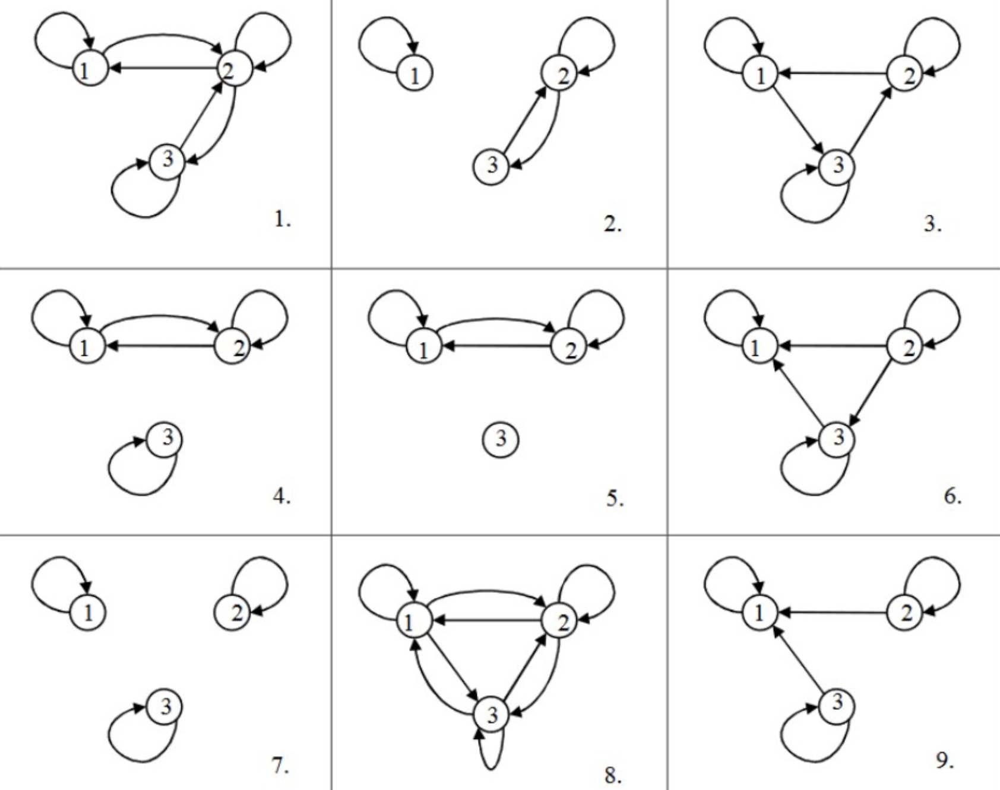

#### **1. Краткое содержание**
##### **1.1 Введение в отношения**
**Relation** (отношение) — базовое понятие: оно описывает, как элементы разных множеств связаны друг с другом. Формально любое подмножество декартова произведения называется отношением: если есть множества $X_1, X_2, \ldots, X_n$, то любое $R \subseteq X_1 \times X_2 \times \cdots \times X_n$ — отношение на этих множествах.

У отношения есть **arity** (арность — число участвующих элементов). **Unary relation** (унарное отношение, арность 1) задаёт свойство одного элемента. **Binary relation** (бинарное отношение, арность 2) связывает пары элементов. Отношения большей арности соединяют три и более элемента (например, «$x+y=z$»).

###### **1.1.1 Бинарные отношения**
**Binary relation** $R$ между $X$ и $Y$ — это любое подмножество $R \subseteq X \times Y$. Если $X = Y$, говорят, что $R$ — бинарное отношение **на** $X$. Пишут $(x,y)\in R$ или $xRy$.

Пример: отношение «меньше или равно» на $\mathbb{N}$ — это $\leq = \{(x,y)\in\mathbb{N}^2\mid x\le y\}$.

##### **1.2 Свойства бинарных отношений**
###### **1.2.1 Рефлексивность и иррефлексивность**
**Reflexive** (рефлексивно): $(\forall x\in X)(xRx)$. Пример: «$=$», «$\le$».

**Irreflexive** (**anti-reflexive**): $(\forall x\in X)\neg(xRx)$. Пример: «$<$».

Важно: отношение может быть ни рефлексивным, ни иррефлексивным.

###### **1.2.2 Симметрия, асимметрия, антисимметрия**
**Symmetric**: $(\forall x,y)(xRy\to yRx)$.

**Asymmetric**: $(\forall x,y)(xRy\to \neg yRx)$; эквивалентно запрету одновременно $xRy$ и $yRx$ для любых $x,y$.

**Anti-symmetric**: $(\forall x,y)(xRy\land yRx\to x=y)$. Для «$\le$» и делимости на $\mathbb{N}$ — антисимметрично.

**Важно:** asymmetric влечёт anti-symmetric и irreflexive; обратное неверно.

###### **1.2.3 Транзитивность**
**Transitive**: $(\forall x,y,z)(xRy\land yRz\to xRz)$.

###### **1.2.4 Связность (connex)**
**Connex** (**total**, **complete**): $(\forall x,y)(xRy\lor yRx)$. Числовое «$\le$» — связно; «друзья» — не обязательно.

##### **1.3 Представления бинарных отношений**
###### **1.3.1 Матрица**
Для $X=\{a_1,\dots,a_n\}$ матрица $M_R=(m_{ij})$ с
$$m_{ij}=\begin{cases}1&(a_i,a_j)\in R\\0&\text{иначе}\end{cases}$$

###### **1.3.2 Ориентированный граф**
**Directed graph** (**digraph**): вершины — элементы, рёбра — пары отношения; петли — рефлексивные пары.

##### **1.4 Подсчёт отношений на конечном множестве**
Всего бинарных отношений: $2^{n^2}$.

Рефлексивных / иррефлексивных: по $2^{n(n-1)}$.

Симметричных: $2^{n(n+1)/2}$.

Асимметричных: $3^{n(n-1)/2}$.

Антисимметричных: $2^n\cdot 3^{n(n-1)/2}$.

Транзитивных — простой общей формулы нет.

##### **1.5 Частные типы отношений**
**Strict partial order**: irreflexive + asymmetric + transitive.

**Non-strict partial order**: reflexive + anti-symmetric + transitive.

**Linear order** (**total order**): нестрогий частичный порядок + **connex**.

**Equivalence relation**: reflexive + symmetric + transitive. **Equivalence classes** $[x]$ образуют **partition**.

##### **1.6 Связь с теорией графов**
**Directed graph** по сути эквивалентен бинарному отношению; терминология Harary: elements ↔ vertices, relations ↔ edges.

***

#### **2. Определения**
*   **Relation**: $R \subseteq X_1 \times \cdots \times X_n$.
*   **Binary relation**: $R \subseteq X\times Y$; при $X=Y$ — на $X$.
*   **Reflexive**: $(\forall x\in X)\,xRx$; **irreflexive**: $(\forall x\in X)\,\neg xRx$; **symmetric**: из $xRy$ следует $yRx$; **asymmetric**: из $xRy$ следует $\neg yRx$; **anti-symmetric**: из $xRy\land yRx$ следует $x=y$; **transitive**: из $xRy\land yRz$ следует $xRz$; **connex**: для любых $x,y\in X$ верно $xRy\lor yRx$.
*   **Strict partial order**: irreflexive + transitive; **non-strict partial order**: reflexive + anti-symmetric + transitive; **linear order**: частичный порядок + connex; **equivalence relation**: reflexive + symmetric + transitive; **equivalence class** $[x]$; **digraph** — ориентированный граф, задающий отношение стрелками.

***

#### **3. Формулы**
*   Все бинарные отношения на $n$ элементах: $2^{n^2}$
*   Рефлексивные: $2^{n(n-1)}$
*   Иррефлексивные: $2^{n(n-1)}$
*   Симметричные: $2^{n(n+1)/2}$
*   Асимметричные: $3^{n(n-1)/2}$
*   Антисимметричные: $2^n\cdot 3^{n(n-1)/2}$
*   Линейных порядков: $n!$
*   **asymmetric** $\iff$ **anti-symmetric** $\land$ **irreflexive** (асимметрично $\iff$ антисимметрично $\land$ иррефлексивно)
*   Элемент матрицы: $m_{ij}=1$ тогда и только тогда, когда $(a_i,a_j)\in R$
*   $x\le y \equiv (x<y \lor x=y)$

***

#### **4. Примеры**
##### **4.1. Пересечение прямых** (Лаба 8, Задание 1a)
На множестве прямых плоскости задано отношение «прямая $x$ пересекает прямую $y$». Какие свойства выполняются?

Показать решение

1. **Reflexive?** Нет — прямая не пересекает саму себя в этом смысле.
2. **Irreflexive?** Да.
3. **Symmetric?** Да — пересечение взаимно.
4. **Asymmetric?** Нет.
5. **Anti-symmetric?** Нет — разные прямые могут пересекаться в обе стороны.
6. **Transitive?** Нет (контрпример: три прямых через точку, 1 и 3 параллельны).
7. **Connex?** Нет (параллельные прямые).

**Ответ:** только **irreflexive** и **symmetric**.

##### **4.2. Отношение «больше на 2»** (Лаба 8, Задание 1b)
На $\mathbb{N}$: $xRy \iff x=y+2$. Свойства?

Показать решение

Проверка по определениям даёт: **irreflexive**, **asymmetric**, **anti-symmetric** (посылка $x=y+2$ и $y=x+2$ невозможна — импликация пусто истинна), не **symmetric**, не **transitive**, не **connex**.

**Ответ:** irreflexive, asymmetric, anti-symmetric.

##### **4.3. Делимость** (Лаба 8, Задание 1c)
$y\mid x$ на $\mathbb{N}$. Свойства?

Показать решение

**Reflexive**, **anti-symmetric**, **transitive**; не **symmetric**, не **asymmetric** ($1\mid 1$), не **connex** ($2$ и $3$).

**Ответ:** нестрогий частичный порядок (рефлексивность + антисимметрия + транзитивность).

##### **4.4. Свойства по матрицам (2)** (Лаба 8, Задание 2)
Для каждой из матриц определите свойства соответствующего отношения на $\{a, b, c, d\}$:

**(Матрица 1)**
$$\begin{pmatrix} 1 & 0 & 1 & 0 \\ 1 & 1 & 0 & 0 \\ 0 & 0 & 1 & 1 \\ 0 & 1 & 0 & 1 \end{pmatrix}$$

**(Матрица 2)**
$$\begin{pmatrix} 0 & 1 & 0 & 1 \\ 1 & 0 & 1 & 0 \\ 0 & 1 & 0 & 1 \\ 1 & 0 & 1 & 0 \end{pmatrix}$$

**(Матрица 3)**
$$\begin{pmatrix} 1 & 0 & 0 & 0 \\ 0 & 1 & 1 & 0 \\ 0 & 0 & 1 & 1 \\ 0 & 0 & 0 & 1 \end{pmatrix}$$

**(Матрица 4)**
$$\begin{pmatrix} 1 & 1 & 1 & 1 \\ 0 & 0 & 1 & 1 \\ 0 & 1 & 1 & 1 \\ 0 & 1 & 0 & 0 \end{pmatrix}$$

Показать решение

**Матрица 1:** рефлексивна (единицы на диагонали), не симметрична ($m_{12}\neq m_{21}$), антисимметрична, не транзитивна ($m_{13}=m_{34}=1$, но $m_{14}=0$), не connex (для $(a,d)$ оба направления нули).

**Матрица 2:** иррефлексивна, симметрична, не антисимметрична (есть двунаправленные пары), не транзитивна ($m_{12}=m_{23}=1$, но $m_{13}=0$), не connex.

**Матрица 3:** рефлексивна, не симметрична, антисимметрична, не транзитивна ($m_{23}=m_{34}=1$, но $m_{24}=0$), не connex.

**Матрица 4:** не рефлексивна, не иррефлексивна, не симметрична, не антисимметрична ($b$ и $c$), не транзитивна, не connex.

**Ответ:** М1 — рефлексивность + антисимметрия; М2 — иррефлексивность + симметрия; М3 — рефлексивность + антисимметрия; М4 — ни одно из стандартных свойств из проверки.

##### **4.5. Свойства по рисункам графов** (Лаба 8, Задание 3)
Для девяти ориентированных графов на $\{1,2,3\}$ укажите **R/S/T** (reflexive / symmetric / transitive).

{fig-align="center" width=60%}

Показать решение

Обозначения: **R** — reflexive, **S** — symmetric, **T** — transitive.

1. **Граф 1:** петли у всех вершин ⇒ **R**; рёбра между различными идут парами в обе стороны там, где они есть ⇒ **S**; путь $1\to2\to3$ без ребра $1\to3$ ⇒ не **T**. **Итог:** R, S, не T.
2. **Граф 2:** у 3 нет петли ⇒ не **R**; симметрия на $\{2,3\}$ ⇒ **S**; для транзитивности при $3\to2$ и $2\to3$ нужна петля $3\to3$ ⇒ не **T**. **Итог:** S, не R, не T.
3. **Граф 3:** петли есть ⇒ **R**; ориентированный «треугольник» без обратных рёбер ⇒ не **S**; нет $1\to3$ при $1\to2\to3$ ⇒ не **T**. **Итог:** R, не S, не T.
4. **Граф 4:** **R** и **S**; классы $\{1,2\}$ и $\{3\}$ дают эквивалентность ⇒ **T**. **Итог:** R, S, T.
5. **Граф 5:** не **R**; **S** на $\{1,2\}$; композиции рёбер остаются внутри $\{1,2\}$ и замкнуты ⇒ **T**. **Итог:** S, T, не R.
6. **Граф 6:** универсальное отношение на трёх вершинах ⇒ **R, S, T**.
7. **Граф 7:** только петли ⇒ **R, S, T**.
8. **Граф 8:** петли + симметрия на нетривиальных рёбрах + проверка композиций ⇒ **R, S, T**.
9. **Граф 9:** **R**; нет $2\to1$, $3\to1$ при $1\to2$, $1\to3$ ⇒ не **S**; композиции с «хабом» 1 замкнуты ⇒ **T**. **Итог:** R, T, не S.

**Ответ:** для каждого из графов 1–9 итоговые свойства **R** (reflexive), **S** (symmetric), **T** (transitive) указаны в нумерованном разборе в этом же блоке.

##### **4.6. Отношение «отец»** (Туториал 8, Задание 1)
$R(x,y)\iff x$ — отец $y$ на множестве людей. Свойства?

Показать решение

**Irreflexive**, **asymmetric**, **anti-symmetric** (пусто истинно), не **symmetric**, не **transitive** (это «дед», не «отец»), не **connex**.

**Ответ:** irreflexive, asymmetric, anti-symmetric.

##### **4.7. Матрица $3\times 3$** (Туториал 8, Задание 2)
Отношение $R$ на $\{a,b,c\}$ задано матрицей
$$\begin{pmatrix} 1 & 1 & 1 \\ 0 & 0 & 1 \\ 0 & 0 & 0 \end{pmatrix}$$
Определите все свойства.

Показать решение

1. **Рефлексивность:** на диагонали $1,0,0$ — не все единицы → **не рефлексивно**.
2. **Иррефлексивность:** есть $m_{11}=1$ → **не иррефлексивно**.
3. **Симметрия:** $m_{12}=1\neq m_{21}=0$ → **не симметрично**.
4. **Asymmetric:** при $m_{11}=1$ пара $(1,1)$ нарушает требование «нет обратной» для диагонали → **не asymmetric**.
5. **Anti-symmetric:** для всех $i\neq j$ из $m_{ij}=1$ следует $m_{ji}=0$ → **да**.
6. **Transitive:** проверка композиций (в частности $m_{12}=m_{23}=1\Rightarrow m_{13}=1$) выполняется → **да**.
7. **Connex:** для $x=y$ нужно $xRx$; у второй и третьей вершин нет петель → **не connex**.

**Ответ:** **anti-symmetric** и **transitive**; остальные перечисленные свойства — нет.

##### **4.8. Свойства по описанию графа** (Туториал 8, Задание 3)
Рёбра: петля $a_1\to a_1$, $a_1\to a_2$, $a_2\to a_3$, $a_1\to a_3$.

<!-- DIAGRAM HERE -->

Показать решение

**Anti-symmetric** и **transitive**; не рефлексивно; не симметрично; не **connex** (не связно в смысле полноты отношения).

**Ответ:** anti-symmetric + transitive.

##### **4.9. Число всех отношений** (Туториал 8, Задание 4)
Сколько бинарных отношений на $n$ элементах?

Показать решение

$|X\times X|=n^2$; любое подмножество — отношение: $2^{n^2}$.

**Ответ:** $2^{n^2}$.

##### **4.10. Число рефлексивных отношений** (Туториал 8, Задание 5)

Показать решение

Диагональ фиксирована в 1; свободно $n(n-1)$ внедиагональных позиций: $2^{n(n-1)}$.

**Ответ:** $2^{n(n-1)}$.

##### **4.11. Число иррефлексивных отношений** (Туториал 8, Задание 6)

Показать решение

Диагональ фиксирована в 0; остальное свободно: $2^{n(n-1)}$.

**Ответ:** $2^{n(n-1)}$.

##### **4.12. Число симметричных отношений** (Туториал 8, Задание 7)

Показать решение

$2^n$ на диагонали и $2^{n(n-1)/2}$ на неупорядоченных парах: $2^{n(n+1)/2}$.

**Ответ:** $2^{n(n+1)/2}$.

##### **4.13. Число асимметричных отношений** (Туториал 8, Задание 8)

Показать решение

Три варианта на каждую неупорядоченную пару различных элементов: $3^{n(n-1)/2}$.

**Ответ:** $3^{n(n-1)/2}$.

##### **4.14. Число антисимметричных отношений** (Туториал 8, Задание 9)

Показать решение

$2^n\cdot 3^{n(n-1)/2}$.

**Ответ:** $2^n\cdot 3^{n(n-1)/2}$.

##### **4.15. Число транзитивных отношений** (Туториал 8, Задание 10)

Показать решение

Простой замкнутой формулы нет; для малых $n$ известны значения $2,13,171,3994$ при $n=1,2,3,4$.

**Ответ:** без общей формулы; приведены малые $n$.

##### **4.16. Число линейных порядков** (Туториал 8, Задание 11)

Показать решение

Линейный порядок на $n$ элементах — перестановка: $n!$.

**Ответ:** $n!$.

