#### **1. Summary**
##### **1.1 Graph Theory Fundamentals**
**Graph theory** is a branch of mathematics that studies relationships between objects. A **graph** is a mathematical structure used to model pairwise relations between objects, consisting of **vertices** (also called nodes or points) connected by **edges** (also called arcs, lines, or links).

###### **1.1.1 Graph Terminology**
The terminology in graph theory can be inconsistent across different sources. As Frank Harary noted in his foundational book "Graph Theory," even the word "graph" itself has not been universally agreed upon. However, we adopt the following standard conventions:

A **graph** $G = (V, E)$ consists of:

*   A set $V$ of **vertices** (the objects we're studying)
*   A set $E$ of **edges** (the connections between objects)

For a **simple undirected graph** (the type we focus on), we have the formal definition: $E \subseteq \{\{u, v\} \mid u, v \in V \text{ and } u \neq v\}$. This means:

*   Edges connect two different vertices (no **loops** connecting a vertex to itself)
*   There is at most one edge between any pair of vertices (no **multiple edges**)
*   Edges have no direction (unlike **directed graphs** or digraphs)

We write an edge $\{x, y\}$ simply as $xy$, $x-y$, or $(x, y)$ for convenience.

###### **1.1.2 Adjacency and Incidence**
Understanding how vertices and edges relate to each other is fundamental:

**Adjacency** (between vertices): Two vertices $x$ and $y$ are **adjacent** or **neighbors** if there exists an edge $xy$ connecting them.

**Incidence** (between vertices and edges): A vertex $v$ is **incident** with an edge $e$ if $v$ is one of the endpoints of $e$. The two vertices incident with an edge are called its **endvertices** or **ends**.

**Adjacency** (between edges): Two edges are **adjacent** or **neighbors** if they share a common endpoint.

###### **1.1.3 Graph Isomorphism**
Two graphs may appear different visually but be structurally identical. We call such graphs **isomorphic**.

**Formal Definition**: Graphs $G = (V, E)$ and $G' = (V', E')$ are **isomorphic** (written $G \simeq G'$) if there exists a bijection (one-to-one correspondence) $\phi: V \to V'$ such that for all vertices $x, y \in V$:
$$(x, y) \in E \iff (\phi(x), \phi(y)) \in E'$$

This bijection $\phi$ is called an **isomorphism**. It preserves the edge structure: two vertices are connected in $G$ if and only if their images are connected in $G'$.

To prove two graphs are isomorphic, we must find such a bijection. To prove they are NOT isomorphic, we can find a structural property that differs (such as degree sequences, number of cycles, or connectivity).

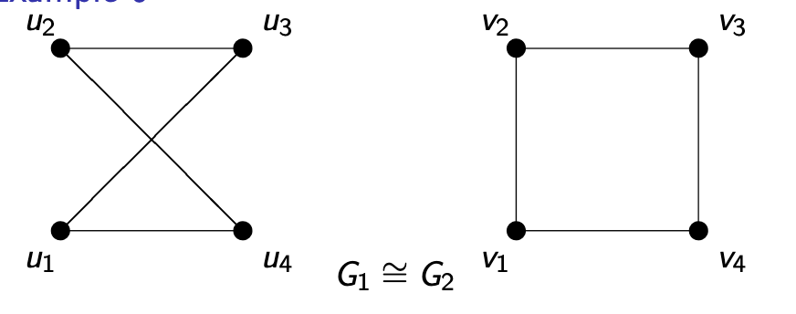

###### **1.1.4 Vertex Degrees**
The **degree** of a vertex measures how many connections it has.

**Formal Definition**: The **neighborhood** of a vertex $v$ in graph $G = (V_G, E_G)$, denoted $N_G(v)$ or simply $N(v)$, is the set of all vertices adjacent to $v$:
$$N_G(v) = \{u \in V_G \mid (v, u) \in E_G\}$$

The **degree** (or **valency**) of vertex $v$, denoted $d_G(v)$ or $d(v)$, is the number of edges incident to $v$, which equals the size of its neighborhood:
$$d_G(v) = |N_G(v)|$$

The **degree sequence** of a graph is the list of all vertex degrees, typically written in non-decreasing order.

##### **1.2 The Handshaking Lemma**
One of the most fundamental results in graph theory is the **Handshaking Lemma**, which relates the sum of all degrees to the number of edges.

**Handshaking Lemma**: For any graph $G = (V_G, E_G)$:
$$\sum_{v \in V_G} d_G(v) = 2|E_G|$$

The intuition is simple: when people shake hands, each handshake involves two hands. Similarly, each edge has two endpoints, so when we sum all degrees (counting how many edges touch each vertex), we count each edge exactly twice.

**Important Corollary**: The sum of all vertex degrees must be even. This immediately tells us, for example, that we cannot have a graph with 3 vertices of degrees 2, 3, and 4 (since $2 + 3 + 4 = 9$ is odd).

##### **1.3 Paths, Walks, and Connectivity**
###### **1.3.1 Walks and Paths**
**Walk**: A sequence of vertices $u_1, u_2, \ldots, u_k$ is called a **walk** (or **way**) from $u_1$ to $u_k$ if consecutive vertices are neighbors (i.e., $u_i$ and $u_{i+1}$ are connected by an edge for all $i$).

A walk is:

*   **Closed** if $u_1 = u_k$ (it starts and ends at the same vertex)
*   A **path** if all edges $(u_i, u_{i+1})$ are distinct (no edge is repeated)
*   A **cycle** if it is both closed and a path (except the first and last vertices are the same)

###### **1.3.2 Graph Connectivity**
A graph's connectivity describes whether we can travel between vertices.

**Connected Graph**: A non-empty graph $G$ is **connected** if there exists a path (or walk) between any pair of vertices $v$ and $w$. Otherwise, $G$ is **disconnected**.

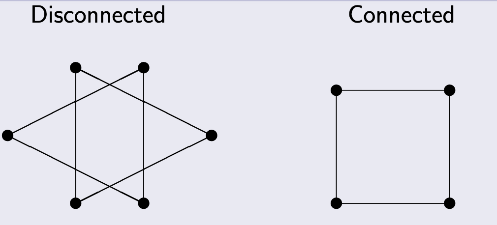

**Subgraph**: $G' = (V', E')$ is a **subgraph** of $G = (V, E)$ if $V' \subseteq V$ and $E' \subseteq E$.

**Component**: A **component** of graph $G$ is a maximal connected subgraph of $G$ (a connected piece that cannot be extended by adding more vertices while remaining connected).

**Key Result**: Any graph is a disjoint union of all its connected components.

##### **1.4 Trees and Forests**
###### **1.4.1 Basic Definitions**
**Tree**: A **tree** is a connected graph that contains no cycles. Trees are fundamental structures in computer science and mathematics, appearing in family trees, organizational charts, file systems, decision trees, and many algorithms.

**Forest**: A **forest** is a graph with no cycles (but not necessarily connected). In other words, a forest is a disjoint union of trees.

**Key Observation**: Every forest can be decomposed into its connected components, each of which is a tree.

###### **1.4.2 Applications of Trees**
Trees appear throughout mathematics and computer science:

**Family Trees**: Representing genealogical relationships (like the Bernoulli family of mathematicians)

**Organizational Trees**: Corporate hierarchies with presidents, vice presidents, directors, and managers

**Computer File Systems**: Directories and subdirectories form a tree structure (e.g., Unix file systems with root `/`, directories like `usr`, `bin`, `tmp`)

**Decision Trees**: Algorithms for sorting, searching, or game-playing where each node represents a decision point

**Game Trees**: Representing possible moves in games like tic-tac-toe, chess, or checkers

###### **1.4.3 Equivalent Characterizations of Trees**
There are several equivalent ways to define a tree. The following are all equivalent for a graph $T$:

1.  $T$ is a tree (connected with no cycles)
2.  Any two vertices of $T$ are connected by a unique path
3.  $T$ is **minimally connected**: $T$ is connected, but removing any edge disconnects it
4.  $T$ is **maximally acyclic**: $T$ has no cycles, but adding any edge between non-adjacent vertices creates a cycle

###### **1.4.4 Properties of Trees**
**Leaf Vertices**: Any tree (with at least two vertices) has at least two vertices of degree 1. These are called **leaf vertices** or **leaves**.

**Proof Idea**: Consider a path of maximum length in the tree. Its endpoints cannot be adjacent to any vertices outside the path (or we could extend it), and they cannot be adjacent to internal path vertices (or we'd create a cycle). Thus, each endpoint has degree 1.

**The Characteristic Property**: This is the most important quantitative property of trees:

**Theorem**: Let $G$ be a connected graph with $n$ vertices and $e$ edges. Then $G$ is a tree if and only if $n = e + 1$.

This means a tree with $n$ vertices has exactly $n-1$ edges—not too few (which would disconnect it) and not too many (which would create cycles).

##### **1.5 Spanning Trees**
###### **1.5.1 Definition and Existence**
A **spanning tree** of a connected graph $G = (V, E)$ is a subgraph $G' = (V, E')$ that:

*   Contains all vertices of $G$ (it "spans" the graph)
*   Is a tree (connected with no cycles)

**Fundamental Theorem**: Every connected graph has at least one spanning tree.

The proof is constructive: start with the graph and repeatedly remove edges from cycles until no cycles remain. Since we only remove edges from cycles, the graph stays connected, and we eventually obtain a tree.

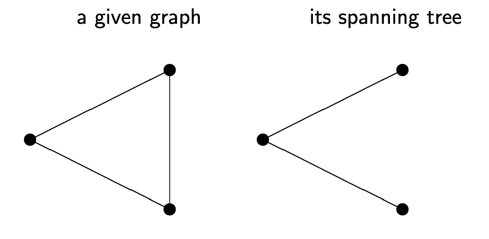

###### **1.5.2 Natural Algorithm for Finding a Spanning Tree**
Given a connected graph $G$:

1.  If $G$ contains a cycle, remove one edge from that cycle
2.  Repeat step 1 until no cycles remain
3.  The result is a spanning tree

This works because removing an edge from a cycle preserves connectivity (there's still another path between the edge's endpoints).

###### **1.5.3 Application: Spanning Tree Protocol**
In computer networks, the **Spanning Tree Protocol (STP)** uses spanning trees to prevent network loops in Ethernet networks. It builds a cycle-free logical topology while including backup links for fault tolerance.

##### **1.6 Weighted Graphs and Minimal Spanning Trees**
###### **1.6.1 Weighted Graphs**
**Weighted Graph**: A graph where each vertex or edge has an associated numerical value called a **weight**.

*   **Vertex-weighted graph**: Has a function $f: V \to \mathbb{R}$ assigning weights to vertices
*   **Edge-weighted graph**: Has a function $f: E \to \mathbb{R}$ assigning weights to edges

Edge weights are typically non-negative and often represent distances, costs, capacities, or times.

**Total Weight**: The total weight of an edge-weighted graph is the sum of all its edge weights.

###### **1.6.2 The Minimal Spanning Tree Problem**
**Problem**: Given a connected edge-weighted graph $G$, find a spanning tree $T$ with minimal total weight.

This problem has practical applications:

*   **Network Design**: Connecting cities with minimal total cable length
*   **Circuit Design**: Connecting pins on a circuit board with minimal wire
*   **Cluster Analysis**: Building hierarchical clusterings in data science

Two famous algorithms solve this problem: **Kruskal's algorithm** and **Prim's algorithm**. Both are **greedy algorithms** that make locally optimal choices to achieve a globally optimal solution.

##### **1.7 Kruskal's Algorithm**
**Kruskal's Algorithm** builds the spanning tree by adding edges in order of increasing weight, avoiding cycles.

**Algorithm**:

1.  Start with $T = (V_G, \emptyset)$ (all vertices, no edges)
2.  Sort all edges by weight (smallest first)
3.  For each edge $e$ in sorted order:
    *   If adding $e$ to $T$ does not create a cycle, add $e$ to $T$
    *   Otherwise, skip $e$
4.  Stop when $T$ has $n-1$ edges (where $n = |V_G|$)

**Key Property**: This algorithm works even for disconnected graphs (forests)! It produces a minimal spanning forest.

**Implementation Note**: To efficiently check whether adding an edge creates a cycle, use a **union-find (disjoint-set)** data structure.

##### **1.8 Prim's Algorithm**
**Prim's Algorithm** grows the spanning tree from a single vertex by repeatedly adding the minimum-weight edge that connects the tree to a new vertex.

**Algorithm**:

1.  Start with a single vertex (chosen arbitrarily) as tree $T$
2.  Repeat until all vertices are in $T$:
    *   Find all edges connecting $T$ to vertices not yet in $T$
    *   Among these edges, choose one with minimum weight
    *   Add this edge and its new vertex to $T$

**Key Difference from Kruskal**: Prim's algorithm maintains a single growing tree, while Kruskal's algorithm may have multiple disconnected components that eventually merge.

**Implementation Note**: Usefisjoint union of all its connected components a **priority queue** (min-heap) to efficiently find the minimum-weight edge at each step.

##### **1.9 Standard Graph Families**
Several special types of graphs appear frequently:

**Complete Graph** $K_n$: A simple graph with $n$ vertices where every pair of distinct vertices is connected. It has $\binom{n}{2} = \frac{n(n-1)}{2}$ edges, and every vertex has degree $n-1$.

**Cycle** $C_n$ (for $n \geq 3$): A graph with $n$ vertices arranged in a circle, with $n$ edges connecting consecutive vertices. Every vertex has degree 2.

**Wheel** $W_n$ (for $n \geq 3$): Obtained from cycle $C_n$ by adding a central vertex connected to all vertices on the cycle. The central vertex has degree $n$, and all other vertices have degree 3.

**Bipartite Graph**: A graph whose vertices can be divided into two disjoint sets $U$ and $V$ such that every edge connects a vertex in $U$ to one in $V$. No edges connect vertices within the same set.

**Complete Bipartite Graph** $K_{n,m}$: A bipartite graph where every vertex in the first set (of size $n$) is connected to every vertex in the second set (of size $m$). It has $nm$ edges.

***

#### **2. Definitions**
*   **Graph**: A pair $G = (V, E)$ where $V$ is a set of vertices and $E$ is a set of edges connecting pairs of vertices.
*   **Simple Graph**: A graph with no loops (edges from a vertex to itself) and no multiple edges between the same pair of vertices.
*   **Undirected Graph**: A graph where edges have no direction; edge $(u,v)$ is the same as edge $(v,u)$.
*   **Vertices (Nodes, Points)**: The fundamental objects in a graph that can be connected by edges.
*   **Edges (Arcs, Lines, Links)**: Connections between pairs of vertices in a graph.
*   **Adjacent Vertices**: Two vertices connected by an edge; also called neighbors.
*   **Incident**: A vertex $v$ is incident with edge $e$ if $v$ is an endpoint of $e$.
*   **Endvertices (Ends)**: The two vertices that an edge connects.
*   **Degree (Valency)**: The degree $d(v)$ of vertex $v$ is the number of edges incident to $v$, equivalently the number of neighbors of $v$.
*   **Neighborhood**: The set $N(v)$ of all vertices adjacent to vertex $v$.
*   **Degree Sequence**: A list of all vertex degrees in a graph, typically in non-decreasing order.
*   **Isomorphic Graphs**: Two graphs $G$ and $G'$ are isomorphic ($G \simeq G'$) if there exists a bijection between their vertices that preserves adjacency.
*   **Isomorphism**: A bijection $\phi: V \to V'$ between vertex sets such that $(x,y) \in E \iff (\phi(x), \phi(y)) \in E'$.
*   **Walk (Way)**: A sequence of vertices where consecutive vertices are adjacent.
*   **Closed Walk**: A walk where the first and last vertices are the same.
*   **Path**: A walk where no edge is repeated.
*   **Cycle**: A closed path (a path that returns to its starting vertex).
*   **Connected Graph**: A graph where there exists a path between every pair of vertices.
*   **Disconnected Graph**: A graph that is not connected; it has at least two vertices with no path between them.
*   **Subgraph**: $G' = (V', E')$ is a subgraph of $G = (V, E)$ if $V' \subseteq V$ and $E' \subseteq E$.
*   **Component**: A maximal connected subgraph of a graph.
*   **Tree**: A connected graph with no cycles.
*   **Forest**: A graph with no cycles (possibly disconnected); equivalently, a disjoint union of trees.
*   **Leaf Vertex (Leaf)**: A vertex in a tree with degree 1.
*   **Spanning Tree**: A subgraph of a connected graph $G$ that includes all vertices of $G$ and is a tree.
*   **Weighted Graph**: A graph where vertices or edges have associated numerical weights.
*   **Vertex-weighted Graph**: A graph with a weight function $f: V \to \mathbb{R}$ on vertices.
*   **Edge-weighted Graph**: A graph with a weight function $f: E \to \mathbb{R}$ on edges.
*   **Total Weight**: The sum of weights of all edges in an edge-weighted graph.
*   **Minimal Spanning Tree**: A spanning tree of a weighted graph with the smallest possible total weight.
*   **Complete Graph** $K_n$: A simple graph with $n$ vertices where every pair of distinct vertices is connected by an edge.
*   **Cycle Graph** $C_n$: A graph with $n$ vertices forming a single cycle; all vertices have degree 2.
*   **Wheel Graph** $W_n$: A graph formed by adding a central vertex to cycle $C_n$ and connecting it to all cycle vertices.
*   **Bipartite Graph**: A graph whose vertices can be partitioned into two disjoint sets such that every edge connects vertices from different sets.
*   **Complete Bipartite Graph** $K_{n,m}$: A bipartite graph where every vertex in the first set is connected to every vertex in the second set.

***

#### **3. Formulas**
*   **Handshaking Lemma**: $\sum_{v \in V_G} d_G(v) = 2|E_G|$ (the sum of all degrees equals twice the number of edges)
*   **Number of Edges in Complete Graph** $K_n$: $|E| = \binom{n}{2} = \frac{n(n-1)}{2}$
*   **Degree of Vertices in** $K_n$: Each vertex has degree $n-1$
*   **Degree of Vertices in** $C_n$: Each vertex has degree 2
*   **Number of Edges in** $C_n$: $|E| = n$
*   **Number of Edges in Complete Bipartite Graph** $K_{n,m}$: $|E| = nm$
*   **Characteristic Property of Trees**: A connected graph with $n$ vertices is a tree if and only if it has exactly $n-1$ edges
*   **Number of Edges in a Forest**: A forest with $n$ vertices and $k$ components has exactly $n-k$ edges
*   **Number of Possible Simple Graphs of Order** $n$: $2^{\binom{n}{2}} = 2^{\frac{n(n-1)}{2}}$ (each potential edge can be present or absent)
*   **Number of Possible Bipartite Graphs with Sets** $|U|=n$ and $|V|=m$: $2^{nm}$ (each potential edge between sets can be present or absent)

***

#### **4. Examples**
##### **4.1. Drawing a Graph from Sets** (Lab 9, Task 1a)
Let $V = \{1, 2, 3, 4, 5, 6\}$ and $E = \{\{1,2\}, \{2,3\}, \{2,4\}, \{2,5\}, \{3,6\}, \{4,5\}, \{5,6\}\}$. Draw this graph.

Click to see the solution

**Key Concept:** Place vertices and draw edges according to the edge set.

1.  **Place vertices:** Draw 6 vertices labeled 1, 2, 3, 4, 5, 6.
2.  **Draw edges:**
    *   Connect 1 to 2
    *   Connect 2 to 3, 4, and 5
    *   Connect 3 to 6
    *   Connect 4 to 5
    *   Connect 5 to 6
3.  **Observe structure:** Vertex 2 is a central hub with a high degree. The edges are $E = \{\{1,2\}, \{2,3\}, \{2,4\}, \{2,5\}, \{3,6\}, \{4,5\}, \{5,6\}\}$. Vertex 3 connects to 2 and 6. Vertex 4 connects to 2 and 5. Vertex 5 connects to 2, 4, and 6. Vertex 6 connects to 3 and 5. The image above shows a possible layout.

**Answer:** The graph has vertex 2 as a hub connected to vertices 1, 3, 4, and 5. There are cycles: 3-2-5-6-3 and 4-2-5-4. The image provided is a valid representation.

##### **4.2. Find Degree Sequence** (Lab 9, Task 1b)
For the graph in Exercise 1a, what is the sequence of degrees?

Click to see the solution

**Key Concept:** Count the edges incident to each vertex from the set E.

1.  **Count degrees:**
    *   $d(1)$: connected to 2 only $\implies d(1) = 1$
    *   $d(2)$: connected to 1, 3, 4, 5 $\implies d(2) = 4$
    *   $d(3)$: connected to 2, 6 $\implies d(3) = 2$
    *   $d(4)$: connected to 2, 5 $\implies d(4) = 2$
    *   $d(5)$: connected to 2, 4, 6 $\implies d(5) = 3$
    *   $d(6)$: connected to 3, 5 $\implies d(6) = 2$
2.  **Sort in non-decreasing order:**
    $(1, 2, 2, 2, 3, 4)$
3.  **Verify with Handshaking Lemma:**
    The sum of degrees is $1 + 2 + 2 + 2 + 3 + 4 = 14$. The number of edges is 7. Since $14 = 2 \times 7$, the calculation is consistent.

**Answer:** $(1, 2, 2, 2, 3, 4)$

##### **4.3. Counting Odd-Degree Vertices** (Lab 9, Task 1c)
For the graph in Exercise 1a, how many vertices have odd degree?

Click to see the solution

**Key Concept:** Check which degrees in the degree sequence are odd numbers.

From the degree sequence $(1, 2, 2, 2, 3, 4)$:

1.  **Identify odd degrees:**
    *   Degree 1 is odd.
    *   Degree 3 is odd.
2.  **Count:**
    There are 2 vertices with odd degrees (vertex 1 and vertex 5).

**Note:** A corollary of the Handshaking Lemma states that the number of odd-degree vertices in any graph must be even. Our answer of 2 is consistent with this.

**Answer:** 2 vertices have odd degree.

##### **4.4. Constructing Graphs from Degree Sequences** (Lab 9, Task 2)
For each degree sequence, sketch a simple graph with that degree sequence. Is such a graph unique (up to isomorphism)?

**(a)** $D = (2, 2, 2, 2, 2)$

**(b)** $D = (2, 2, 2, 2, 2, 2)$

**(c)** $D = (3, 3, 3, 3)$

**(d)** $D = (1, 2, 3, 4, 5)$

Click to see the solution

**Key Concept:** A degree sequence does not always uniquely define a graph. Multiple non-isomorphic graphs can share the same degree sequence.

**(a) $D = (2, 2, 2, 2, 2)$:**

*   This is a 2-regular graph on 5 vertices. The only connected simple graph is the cycle $C_5$.
*   **Unique (if connected)**. If disconnected graphs are allowed, it is not possible as any component would need an even number of odd-degree vertices (it has none). So any component is also regular, which isn't possible for components with < 3 vertices. Thus, it must be connected.

**(b) $D = (2, 2, 2, 2, 2, 2)$:**

*   This is a 2-regular graph on 6 vertices.
*   One possibility is the cycle $C_6$.
*   Another possibility is the disjoint union of two triangles ($C_3 \cup C_3$).
*   These two graphs are not isomorphic.
*   **Not unique**.

**(c) $D = (3, 3, 3, 3)$:**

*   This is a 3-regular graph on 4 vertices. This is uniquely realized by the complete graph $K_4$.
*   **Unique up to isomorphism**.

**(d) $D = (1, 2, 3, 4, 5)$:**

*   Check feasibility using the Handshaking Lemma.
*   Sum of degrees = $1 + 2 + 3 + 4 + 5 = 15$.
*   The sum is odd, which violates the Handshaking Lemma.
*   **No such simple graph exists**.

**Answer:**

*   (a) Unique (up to isomorphism): $C_5$.
*   (b) Not unique; examples are $C_6$ and the disjoint union of two $C_3$ graphs.
*   (c) Unique (up to isomorphism): $K_4$.
*   (d) Impossible to construct.

##### **4.5. Counting Edges in Complete Graphs** (Lab 9, Task 3a)
What is the number of edges in a complete graph $K_n$ of order $n$? Explain your answer.

Click to see the solution

**Key Concept:** In $K_n$, every pair of distinct vertices is connected by exactly one edge. The problem is equivalent to counting the number of pairs of vertices.

1.  **Combinatorial Approach:**
    The number of ways to choose 2 vertices from a set of $n$ vertices is given by the binomial coefficient "n choose 2":
    $$|E| = \binom{n}{2} = \frac{n!}{2!(n-2)!} = \frac{n(n-1)}{2}$$
2.  **Degree Sum Approach (Handshaking Lemma):**
    *   In $K_n$, each of the $n$ vertices is connected to the other $n-1$ vertices, so every vertex has degree $n-1$.
    *   The sum of degrees is $\sum d(v) = n \times (n-1)$.
    *   By the Handshaking Lemma, $2|E| = n(n-1)$, so $|E| = \frac{n(n-1)}{2}$.

**Answer:** A complete graph $K_n$ has $\frac{n(n-1)}{2}$ edges.

##### **4.6. Counting Simple Graphs** (Lab 9, Task 3b)
What is the number of different simple graphs of order $n$? Explain your answer.

Click to see the solution

**Key Concept:** A simple graph on a fixed set of $n$ vertices is defined by its set of edges. For every possible pair of vertices, the edge connecting them can either exist or not exist.

1.  **Count potential edges:**
    With $n$ vertices, there are $\binom{n}{2} = \frac{n(n-1)}{2}$ possible pairs of vertices that could be connected by an edge.
2.  **Count possibilities for each edge:**
    For each of these $\binom{n}{2}$ potential edges, we have 2 independent choices: either include the edge in the graph or do not.
3.  **Calculate total number of graphs:**
    Since there are 2 choices for each of the $\binom{n}{2}$ potential edges, the total number of possible graphs is:
    $$2^{\binom{n}{2}} = 2^{\frac{n(n-1)}{2}}$$

**Answer:** There are $2^{\binom{n}{2}}$ different simple graphs of order $n$.

##### **4.7. Counting Edges in Complete Bipartite Graphs** (Lab 9, Task 4a)
What is the number of edges in a complete bipartite graph $K_{n,m}$? Explain your answer.

Click to see the solution

**Key Concept:** In a complete bipartite graph $K_{n,m}$, the vertices are partitioned into two sets, $U$ of size $n$ and $V$ of size $m$. Every vertex in $U$ is connected to every vertex in $V$.

1.  **Count connections:**
    *   Consider a single vertex from set $U$. It must be connected to all $m$ vertices in set $V$. This accounts for $m$ edges.
    *   Since there are $n$ such vertices in set $U$, the total number of edges is the product of the sizes of the two sets.
2.  **Calculate:**
    $$|E| = n \times m$$

**Answer:** A complete bipartite graph $K_{n,m}$ has $nm$ edges.

##### **4.8. Counting Bipartite Graphs** (Lab 9, Task 4b)
What is the number of different bipartite graphs for fixed partitions of sizes $n = |U|$ and $m = |V|$? Explain your answer.

Click to see the solution

**Key Concept:** A bipartite graph with fixed partitions $U$ and $V$ is defined by its edge set, where edges can only connect a vertex in $U$ to a vertex in $V$.

1.  **Count potential edges:**
    The maximum number of possible edges is $nm$, as seen in the complete bipartite graph $K_{n,m}$.
2.  **Count possibilities for each edge:**
    For each of these $nm$ potential edges, we have 2 independent choices: either include the edge or do not.
3.  **Calculate total number of graphs:**
    The total number of possibilities is $2$ raised to the power of the number of potential edges.
    $$\text{Number of bipartite graphs} = 2^{nm}$$

**Answer:** There are $2^{nm}$ different bipartite graphs for fixed partitions of size $n$ and $m$.

##### **4.9. Determining Graph Isomorphism (Multiple Cases)** (Lab 9, Task 5)
Determine whether the given pairs of graphs are isomorphic. Exhibit an isomorphism or provide a rigorous argument that none exists.

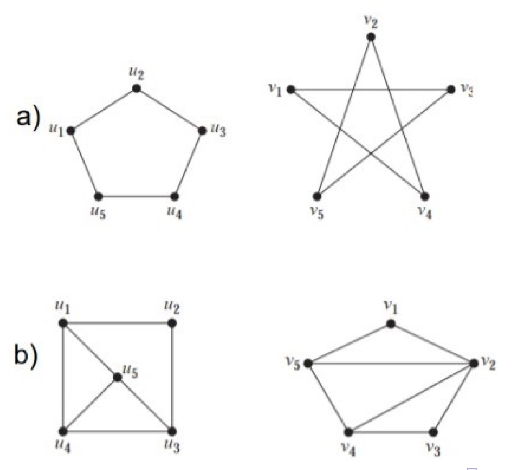
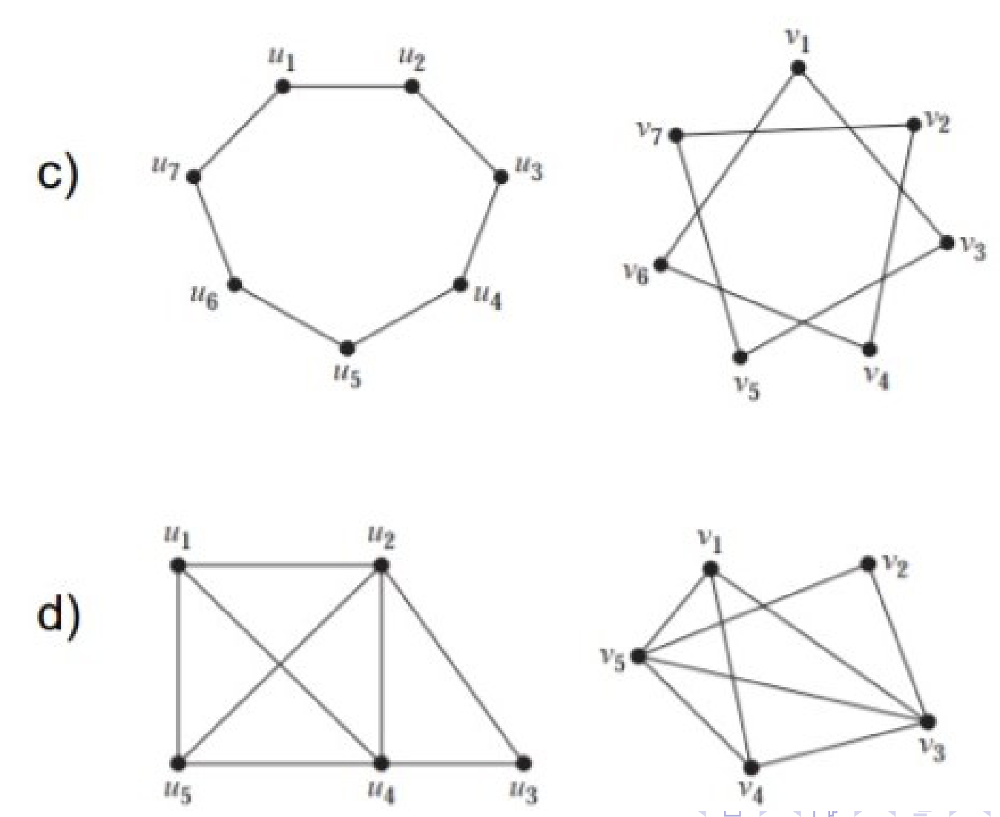

Click to see the solution

**Key Concept:** Check for graph invariants (properties that must be the same for isomorphic graphs) like the number of vertices, edges, and the degree sequence. If they match, try to find a structure-preserving mapping.

**Pair (a):**

*   **Left Graph:** 5 vertices, 5 edges. Degree sequence: (2, 2, 2, 2, 2). This is the cycle graph $C_5$.
*   **Right Graph:** 5 vertices, 5 edges. Degree sequence: (2, 2, 2, 2, 2). This is the pentagram graph.
*   **Analysis:** Both are 2-regular graphs. The left graph is the cycle $u_1-u_2-u_3-u_4-u_5-u_1$. The right graph has a cycle $v_1-v_3-v_5-v_2-v_4-v_1$. Since both are 5-cycles, they are isomorphic.
*   **Isomorphism:** $\phi(u_1)=v_1, \phi(u_2)=v_3, \phi(u_3)=v_5, \phi(u_4)=v_2, \phi(u_5)=v_4$.
*   **Result:** Isomorphic.

**Pair (b):**

*   **Left Graph:** 5 vertices, 8 edges. Degree sequence: (3, 3, 3, 3, 4).
*   **Right Graph:** 5 vertices, 8 edges. Degree sequence: (3, 3, 3, 3, 4).
*   **Analysis:** The invariants match. Let's look at the vertices of degree 3. In the left graph, the vertex of degree 4 ($u_5$) is adjacent to all other vertices. In the right graph, the vertex of degree 4 ($v_2$) is not adjacent to $v_4$.
*   **Result:** Not isomorphic. The neighborhood of the degree-4 vertex is different.

**Pair (c):**

*   **Left Graph:** 7 vertices, 7 edges. Degree sequence: (2, 2, 2, 2, 2, 2, 2). This is the cycle graph $C_7$.
*   **Right Graph:** 7 vertices, 7 edges. Degree sequence: (2, 2, 2, 2, 2, 2, 2). This graph is also a 7-cycle.
*   **Result:** Isomorphic. All cycles of the same length are isomorphic.

**Pair (d):**

*   **Left Graph:** 5 vertices, 7 edges. Degree sequence: (2, 3, 3, 3, 3).
*   **Right Graph:** 5 vertices, 6 edges.
*   **Analysis:** The number of edges is different (7 vs 6).
*   **Result:** Not isomorphic.

##### **4.10. Trees in Graph Families** (Lab 9, Task 6)
Find all $n$ and $m$ such that the following graphs are trees:

**(a)** $K_n$

**(b)** $K_{n,m}$

Click to see the solution

**Key Concept:** A graph is a tree if and only if it is connected and has $v-1$ edges, where $v$ is the number of vertices.

**(a) When is $K_n$ a tree?**

1.  A complete graph $K_n$ has $n$ vertices and $\frac{n(n-1)}{2}$ edges.
2.  For $K_n$ to be a tree, the number of edges must equal $n-1$.
3.  Set up the equation: $\frac{n(n-1)}{2} = n-1$.
4.  If $n>1$, we can divide by $n-1$ to get $\frac{n}{2} = 1$, which means $n=2$.
5.  If $n=1$, the equation is $0=0$, which is true.
6.  Check the cases:
    *   $K_1$ has 1 vertex, 0 edges. It is a tree.
    *   $K_2$ has 2 vertices, 1 edge. It is a tree.
    *   For $n \geq 3$, $K_n$ contains cycles (specifically, $C_3$), so it cannot be a tree.

**(b) When is $K_{n,m}$ a tree?**

1.  A complete bipartite graph $K_{n,m}$ has $n+m$ vertices and $nm$ edges.
2.  For $K_{n,m}$ to be a tree, the number of edges must equal $(n+m)-1$.
3.  Set up the equation: $nm = n+m-1$.
4.  Rearrange the terms: $nm - n - m + 1 = 0$.
5.  Factor by grouping: $n(m-1) - 1(m-1) = 0 \implies (n-1)(m-1) = 0$.
6.  This equation holds if and only if $n-1=0$ or $m-1=0$.
7.  Therefore, either $n=1$ or $m=1$.
8.  If $n=1$ or $m=1$, the graph is a star graph, which is a tree.

**Answer:**

*   (a) $K_n$ is a tree if and only if $n = 1$ or $n = 2$.
*   (b) $K_{n,m}$ is a tree if and only if $n = 1$ or $m = 1$.

##### **4.11. Minimal Spanning Tree Algorithms** (Lab 9, Task 7)
Find a minimum spanning tree for the given weighted graph by:

**(a)** Applying Kruskal's algorithm

**(b)** Applying Prim's algorithm

Note: Show all steps, not just the final answer.

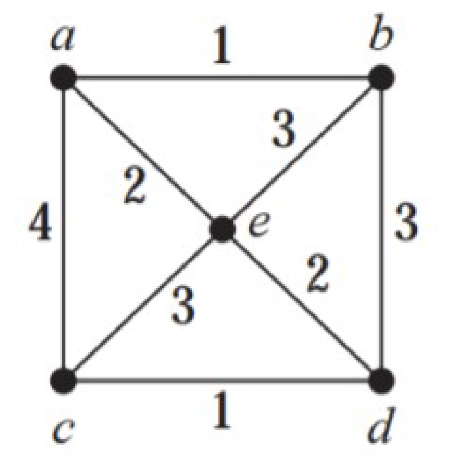

Click to see the solution

**Key Concept:** Both algorithms are greedy and will find an MST with the same minimum total weight.

The edges sorted by weight are: (c,d,1), (a,b,1), (a,e,2), (b,e,2), (b,c,3), (b,d,3), (c,e,3), (a,c,4).

**(a) Kruskal's Algorithm:**

1.  Initialize $T$ with 5 vertices and no edges.
2.  Add edge (c,d) with weight 1. $T = \{\{c,d\}\}$.
3.  Add edge (a,b) with weight 1. $T = \{\{c,d\}, \{a,b\}\}$.
4.  Add edge (a,e) with weight 2. $T = \{\{c,d\}, \{a,b\}, \{a,e\}\}$.
5.  Consider edge (b,e) with weight 2. Adding it would form cycle a-b-e-a. Skip.
6.  Add edge (b,c) with weight 3. This connects the two components {a,b,e} and {c,d}. No cycle is formed. Add it. $T = \{\{c,d\}, \{a,b\}, \{a,e\}, \{b,c\}\}$.
7.  The graph is now connected with 4 edges. The algorithm terminates.
*   **MST Edges:** (c,d), (a,b), (a,e), (b,c).
*   **Total Weight:** $1 + 1 + 2 + 3 = 7$.

**(b) Prim's Algorithm:**

1.  Start at vertex **a**.
2.  Edges from **a** are (a,b,1), (a,e,2), (a,c,4). Choose minimum: (a,b) with weight 1. Tree vertices: {a,b}.
3.  Edges leaving {a,b}: (a,e,2), (a,c,4), (b,e,2), (b,d,3), (b,c,3). Minimum is 2. Let's pick (a,e). Tree vertices: {a,b,e}.
4.  Edges leaving {a,b,e}: (a,c,4), (b,d,3), (b,c,3), (e,c,3), (e,d,2). Minimum is (e,d) with weight 2. Tree vertices: {a,b,e,d}.

Using the graph from the image with weights: (a,b,1), (c,d,1), (a,e,2), (e,d,2), (b,c,3), (b,e,3), (a,c,4).

**Kruskal:**

1. Add (a,b,1).
2. Add (c,d,1).
3. Add (a,e,2).
4. Add (e,d,2). This connects components {a,b,e} and {c,d}. No cycle.
MST: {(a,b), (c,d), (a,e), (e,d)}. Weight = 1+1+2+2 = 6.

**Prim (start at e):**

1. From e, min edge is (e,a,2) or (e,d,2). Pick (e,a,2). Tree: {e,a}.
2. From {e,a}, min edge out is (a,b,1). Add it. Tree: {e,a,b}.
3. From {e,a,b}, min edge out is (e,d,2). Add it. Tree: {e,a,b,d}.
4. From {e,a,b,d}, min edge out is (d,c,1). Add it. Tree is complete.
MST: {(e,a), (a,b), (e,d), (d,c)}. Weight = 2+1+2+1 = 6.

**Answer:** A minimum spanning tree has edges with a total weight of 6. For example, using Prim's: {(e,a), (a,b), (e,d), (d,c)}.

##### **4.12. All Spanning Trees of a Graph** (Lab 9, Task 7a)
Let $V = \{1, 2, 3, 4, 5, 6\}$ and $E = \{\{1,2\}, \{2,3\}, \{2,4\}, \{2,5\}, \{3,6\}, \{4,5\}, \{5,6\}\}$. Draw all spanning trees.

Click to see the solution

**Key Concept:** A spanning tree of this graph must include all 6 vertices and have exactly $6-1=5$ edges. The original graph has 7 edges, so we must remove 2 edges while keeping the graph connected.

1.  **Identify Cycles:** The graph has two main cycles: 2-4-5-2 and 2-3-6-5-2. Any pair of removed edges must break all cycles.
2.  **Systematic Removal:**
    *   Remove {2,4} and {2,3}. The graph remains connected. This is a valid spanning tree.
    *   Remove {2,4} and {3,6}. The graph remains connected. Valid.
    *   Remove {4,5} and {5,6}. The graph remains connected. Valid.
    *   ...and so on.
3.  Enumerating all valid pairs of edges to remove will yield all possible spanning trees. This is a tedious but straightforward process.

**Answer:** There are numerous spanning trees for this graph. Each is formed by removing a pair of edges that breaks all cycles while maintaining connectivity. For instance, removing edges {4,5} and {3,6} results in one such spanning tree.

##### **4.13. Non-Isomorphic Spanning Trees** (Lab 9, Task 7b)
For the spanning trees found in the exercise above, which of them are not pairwise isomorphic?

Click to see the solution

**Key Concept:** To distinguish non-isomorphic trees, compare their structural properties, primarily the degree sequence. Trees with different degree sequences cannot be isomorphic.

1.  **Generate Spanning Trees:** Create a few spanning trees by removing different pairs of edges from the original graph.
2.  **Calculate Degree Sequences:**
    *   Tree 1 (remove {4,5}, {5,6}): Degrees are d(1)=1, d(2)=3, d(3)=2, d(4)=1, d(5)=2, d(6)=1. Sequence: (1,1,1,2,2,3).
    *   Tree 2 (remove {2,4}, {2,5}): Degrees are d(1)=1, d(2)=2, d(3)=2, d(4)=1, d(5)=1, d(6)=1. Sequence: (1,1,1,1,2,2).
3.  **Compare:** The degree sequences (1,1,1,2,2,3) and (1,1,1,1,2,2) are different. Therefore, these two spanning trees are not isomorphic.
4.  By continuing this process for all spanning trees, one can group them into isomorphism classes.

**Answer:** There are multiple non-isomorphic spanning trees. For example, a tree with degree sequence (1,1,1,2,2,3) is not isomorphic to one with (1,1,1,1,2,2).

##### **4.14. All Graphs of Order 3** (Lab 9, Task 8)
Draw all graphs of order 3. Which of them are not pairwise isomorphic?

Click to see the solution

**Key Concept:** On 3 vertices, there are $\binom{3}{2}=3$ possible edges. We can classify the graphs by the number of edges they have, from 0 to 3.

*   **0 Edges:** One graph: three isolated vertices. Degree sequence: (0,0,0).
*   **1 Edge:** One graph: two vertices connected, one isolated. Degree sequence: (0,1,1).
*   **2 Edges:** One graph: the path graph $P_3$. Degree sequence: (1,2,1).
*   **3 Edges:** One graph: the triangle (cycle $C_3$), which is also the complete graph $K_3$. Degree sequence: (2,2,2).

Since graphs with different numbers of edges cannot be isomorphic, and for a fixed number of edges each configuration is unique up to relabeling, there are 4 distinct non-isomorphic graphs.

**Answer:** There are 4 non-isomorphic graphs of order 3, classified by their number of edges (0, 1, 2, or 3).

##### **4.15. All Connected Graphs of Order 4** (Lab 9, Task 9)
Draw all connected graphs of order 4. Which of them are not pairwise isomorphic?

Click to see the solution

**Key Concept:** A connected graph on 4 vertices must have at least 3 edges (to be a tree) and at most $\binom{4}{2}=6$ edges (the complete graph). We can classify them by the number of edges.

*   **3 Edges (Trees):**
    1.  The path graph $P_4$. Degree sequence: (1, 2, 2, 1).
    2.  The star graph $K_{1,3}$. Degree sequence: (1, 1, 1, 3).
*   **4 Edges:**
    3.  The cycle graph $C_4$. Degree sequence: (2, 2, 2, 2).
    4.  The "paw" graph (a triangle with one tail). Degree sequence: (1, 2, 2, 3).
*   **5 Edges:**
    5.  The complete graph minus one edge ($K_4 - e$). Degree sequence: (2, 3, 3, 3).
*   **6 Edges:**
    6.  The complete graph $K_4$. Degree sequence: (3, 3, 3, 3).

These 6 graphs are all structurally distinct (e.g., they have different degree sequences, except for P4 and C4 which are distinguished by other properties like having a cycle), so they are non-isomorphic.

**Answer:** There are 6 non-isomorphic connected graphs of order 4.

##### **4.16. Kruskal's Algorithm** (Lecture 9, Example 1)
Apply Kruskal's algorithm to find a minimal spanning tree for the given weighted graph.

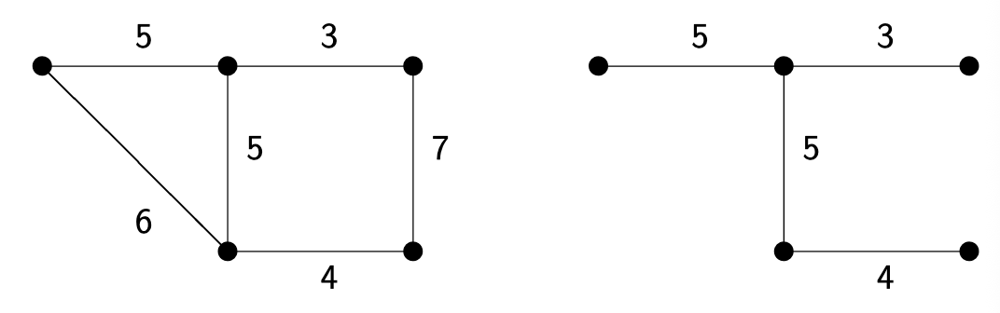

Click to see the solution

**Key Concept:** Kruskal's algorithm adds edges in order of increasing weight, skipping any edge that would create a cycle.

The graph has 6 vertices and edges with weights: 3, 4, 5, 5, 6, 7.

1.  **Initialize:** Start with 6 vertices and no edges, $T = (V, \emptyset)$.
2.  **Sort edges by weight:**
    The edge weights in ascending order are: 3, 4, 5, 5, 6, 7.
3.  **Step 1: Add edge with weight 3.**
    *   This connects two vertices. No cycle is created. Add to tree.
4.  **Step 2: Add edge with weight 4.**
    *   This connects two different vertices. No cycle is created. Add to tree.
5.  **Step 3: Add the first edge with weight 5 (the horizontal one).**
    *   This connects a new vertex to one of the existing components. No cycle is created. Add to tree.
6.  **Step 4: Add the second edge with weight 5 (the vertical one).**
    *   This connects two existing components. No cycle is created. Add to tree.
7.  **Step 5: Consider the edge with weight 6.**
    *   Adding this edge would form a cycle with the edges of weight 4 and 5 (vertical). Skip this edge.
8.  **Complete the algorithm:**
    *   Add edge with weight 3
    *   Add edge with weight 4
    *   Add edge with weight 5 (vertical)
    *   Add edge with weight 5 (horizontal)
    *   Consider edge with weight 6: forms a cycle, skip
    *   Consider edge with weight 7: forms a cycle, skip
    *   For 6 vertices, we need 5 edges. Continue until all vertices are connected.
    *   3. Add edge (weight 5, vertical).
    *   4. Add edge (weight 5, horizontal). Now we have two components: {left-vertex}, {the other 5 vertices}.
    *   5. Add edge (weight 6). This connects the isolated vertex to the main component. No cycle. Add it.
    *   Now we have 5 edges and all vertices are connected.

**Answer:** The minimal spanning tree consists of the edges with weights 3, 4, 5, 5, and 6. The total weight is $3 + 4 + 5 + 5 + 6 = 23$.

##### **4.17. Degrees in Complete Graphs** (Tutorial 9, Task 1)
Consider complete graphs $K_1$, $K_2$, $K_3$, and $K_4$. What are the degree sequences for each?

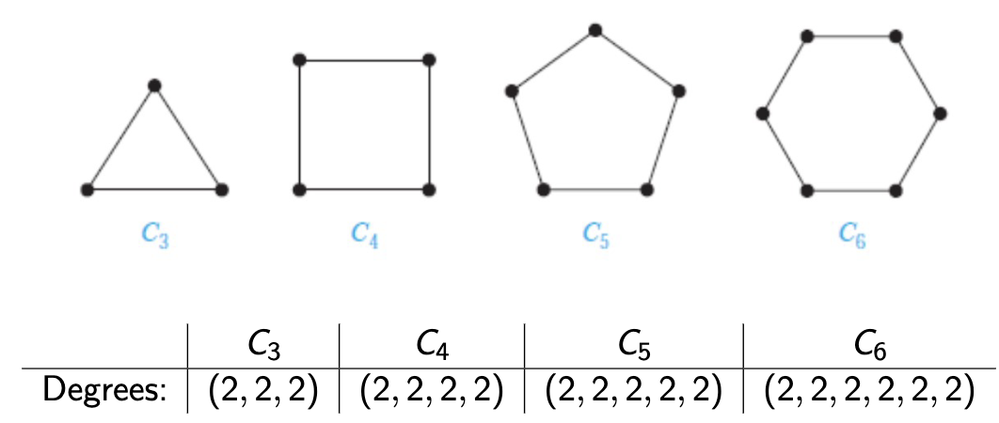

Click to see the solution

**Key Concept:** In a complete graph $K_n$, every vertex is connected to every other vertex, so each vertex has degree $n-1$.

**$K_1$** (1 vertex):

*   The single vertex has no other vertices to connect to
*   Degree sequence: $(0)$

**$K_2$** (2 vertices):

*   Each vertex connects to the 1 other vertex
*   Degree sequence: $(1, 1)$

**$K_3$** (3 vertices):

*   Each vertex connects to the 2 other vertices
*   Degree sequence: $(2, 2, 2)$

**$K_4$** (4 vertices):

*   Each vertex connects to the 3 other vertices
*   Degree sequence: $(3, 3, 3, 3)$

**Answer:**

*   $K_1$: $(0)$
*   $K_2$: $(1, 1)$
*   $K_3$: $(2, 2, 2)$
*   $K_4$: $(3, 3, 3, 3)$

##### **4.18. Degrees in Cycle Graphs** (Tutorial 9, Task 2)
Consider cycle graphs $C_3$, $C_4$, $C_5$, and $C_6$. What are the degree sequences for each?

Click to see the solution

**Key Concept:** In a cycle $C_n$, vertices form a closed loop, so each vertex connects to exactly 2 neighbors (one on each side).

**$C_3$**: Degree sequence: $(2, 2, 2)$

**$C_4$**: Degree sequence: $(2, 2, 2, 2)$

**$C_5$**: Degree sequence: $(2, 2, 2, 2, 2)$

**$C_6$**: Degree sequence: $(2, 2, 2, 2, 2, 2)$

**Answer:** For any cycle $C_n$, the degree sequence is $(2, 2, \ldots, 2)$ with $n$ entries of 2.

##### **4.19. Degrees in Wheel Graphs** (Tutorial 9, Task 3)
Consider wheel graphs $W_3$, $W_4$, $W_5$, and $W_6$. What are the degree sequences for each?

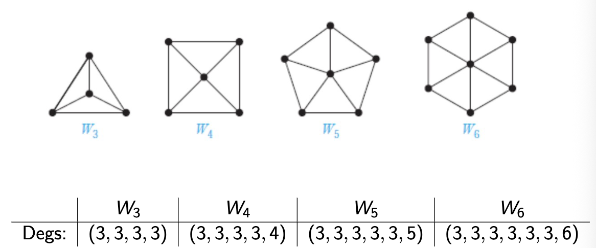

Click to see the solution

**Key Concept:** A wheel $W_n$ is formed from cycle $C_n$ by adding a central vertex connected to all $n$ vertices on the cycle. The central vertex has degree $n$, and each cycle vertex has degree 3 (two cycle neighbors plus the center).

**$W_3$**:

*   Central vertex: degree 3
*   Three cycle vertices: each degree 3
*   Degree sequence: $(3, 3, 3, 3)$

**$W_4$**:

*   Central vertex: degree 4
*   Four cycle vertices: each degree 3
*   Degree sequence: $(3, 3, 3, 3, 4)$

**$W_5$**:

*   Central vertex: degree 5
*   Five cycle vertices: each degree 3
*   Degree sequence: $(3, 3, 3, 3, 3, 5)$

**$W_6$**:

*   Central vertex: degree 6
*   Six cycle vertices: each degree 3
*   Degree sequence: $(3, 3, 3, 3, 3, 3, 6)$

**Answer:**

*   $W_3$: $(3, 3, 3, 3)$
*   $W_4$: $(3, 3, 3, 3, 4)$
*   $W_5$: $(3, 3, 3, 3, 3, 5)$
*   $W_6$: $(3, 3, 3, 3, 3, 3, 6)$

##### **4.20. Degree Sequences of Bipartite Graphs** (Tutorial 9, Task 4)
For complete bipartite graphs $K_{3,5}$ and $K_{2,6}$, what are the degree sequences?

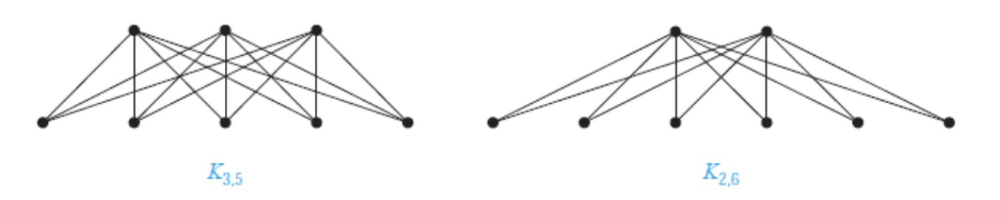

Click to see the solution

**Key Concept:** In $K_{n,m}$, every vertex in the first set (size $n$) connects to all $m$ vertices in the second set, and vice versa.

**$K_{3,5}$**:

*   First set (3 vertices): each connects to all 5 vertices in the second set → degree 5 each
*   Second set (5 vertices): each connects to all 3 vertices in the first set → degree 3 each
*   Degree sequence: $(3, 3, 3, 3, 3, 5, 5, 5)$

**$K_{2,6}$**:

*   First set (2 vertices): each connects to all 6 vertices in the second set → degree 6 each
*   Second set (6 vertices): each connects to all 2 vertices in the first set → degree 2 each
*   Degree sequence: $(2, 2, 2, 2, 2, 2, 6, 6)$

**Answer:**

*   $K_{3,5}$: $(3, 3, 3, 3, 3, 5, 5, 5)$
*   $K_{2,6}$: $(2, 2, 2, 2, 2, 2, 6, 6)$

##### **4.21. Applying the Handshaking Lemma** (Tutorial 9, Task 5)
Is there a graph with 4 vertices whose degrees are $(1, 3, 4, 5)$?

Click to see the solution

**Key Concept:** By the Handshaking Lemma, the sum of all degrees must be even (since it equals $2|E|$).

1.  **Calculate the sum of degrees:**
    $$1 + 3 + 4 + 5 = 13$$
2.  **Check if the sum is even:**
    13 is odd
3.  **Conclusion:**
    Since the sum is odd, this violates the Handshaking Lemma

**Answer:** No, such a graph cannot exist because the sum of degrees (13) is odd, which contradicts the Handshaking Lemma.

##### **4.22. Verifying Graph Isomorphism** (Tutorial 9, Task 6)
Are the following two graphs $G_1$ and $G_2$ isomorphic?

Click to see the solution

**Key Concept:** To prove isomorphism, we need to find a bijection between vertices that preserves edges.

Let $G_1$ have vertices $\{u_1, u_2, u_3, u_4\}$ and $G_2$ have vertices $\{v_1, v_2, v_3, v_4\}$.

1.  **Examine the structure:**
    *   Both graphs have 4 vertices and 4 edges.
    *   Both have the same degree sequence: $(2, 2, 2, 2)$.
2.  **Find a bijection:**
    Notice $G_1$ is a "crossed square" and $G_2$ is a standard square ($C_4$). We can "uncross" $G_1$. Try the mapping: $\phi: u_1 \to v_1, u_2 \to v_3, u_3 \to v_2, u_4 \to v_4$.
3.  **Verify edge preservation:**
    *   Edge $(u_1, u_2) \in E_1 \implies (\phi(u_1), \phi(u_2)) = (v_1, v_3) \notin E_2$. This mapping fails.
    *   Let's try another mapping based on the visual structure. In $G_1$, follow the cycle: $u_1 \to u_2 \to u_4 \to u_3 \to u_1$. In $G_2$, the cycle is $v_1 \to v_2 \to v_3 \to v_4 \to v_1$.
    *   Try the mapping: $\phi: u_1 \to v_1, u_2 \to v_2, u_4 \to v_3, u_3 \to v_4$.
    *   Let's check edges:
        *   $(u_1, u_2) \to (v_1, v_2)$ ✓
        *   $(u_2, u_4) \to (v_2, v_3)$ ✓
        *   $(u_4, u_3) \to (v_3, v_4)$ ✓
        *   $(u_3, u_1) \to (v_4, v_1)$ ✓
    *   This mapping works and preserves all adjacencies.

**Answer:** Yes, $G_1 \simeq G_2$. One possible isomorphism is $\phi(u_1)=v_1, \phi(u_2)=v_2, \phi(u_3)=v_4, \phi(u_4)=v_3$.

##### **4.23. Disproving Graph Isomorphism** (Tutorial 9, Task 7)
Are the following two graphs $G_1$ and $G_2$ isomorphic?

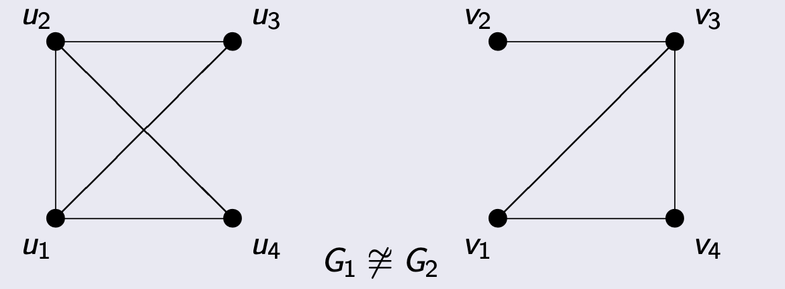

Click to see the solution

**Key Concept:** To disprove isomorphism, find a structural property that differs between the graphs. Comparing degree sequences is a common first step.

1.  **Calculate degree sequence of $G_1$:**
    *   $d(u_1) = 3$
    *   $d(u_2) = 3$
    *   $d(u_3) = 3$
    *   $d(u_4) = 3$
    *   Sequence: $(3, 3, 3, 3)$ (This is $K_4$)
2.  **Calculate degree sequence of $G_2$:**
    *   $d(v_1) = 2$
    *   $d(v_2) = 2$
    *   $d(v_3) = 3$
    *   $d(v_4) = 3$
    *   Sequence: $(2, 2, 3, 3)$
3.  **Compare:**
    The degree sequences $(3, 3, 3, 3)$ and $(2, 2, 3, 3)$ are different.

**Answer:** No, $G_1 \not\simeq G_2$ because isomorphic graphs must have the same degree sequence, and these do not.

##### **4.24. Find All Spanning Trees** (Tutorial 9, Task 8)
For the given graph $G$ with 4 vertices and 5 edges, draw all spanning trees and determine which are pairwise non-isomorphic.

**Problem Graph:**
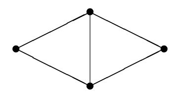

**Solution:**
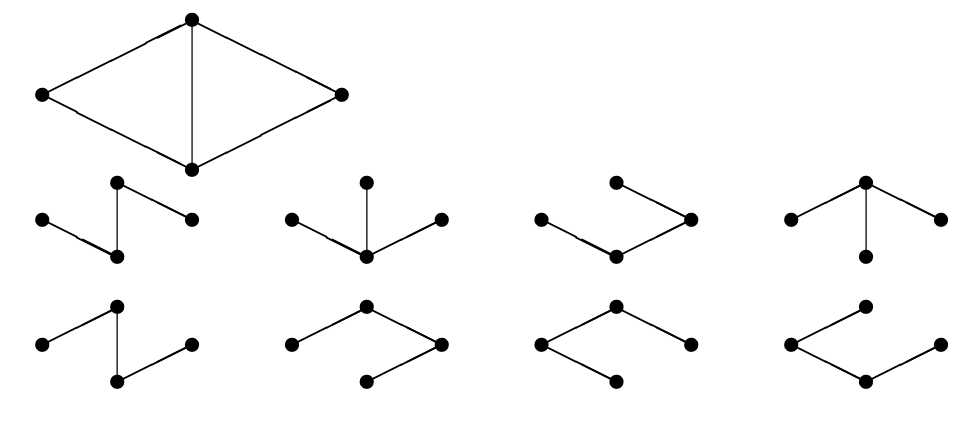

Click to see the solution

**Key Concept:** A spanning tree must include all 4 vertices and have exactly $4-1=3$ edges (with no cycles). We need to remove $5-3=2$ edges from the original graph while keeping it connected.

1.  **Calculate required properties:**
    *   Original graph: $v_G = 4$ vertices, $e_G = 5$ edges.
    *   Spanning tree: $v_T = 4$ vertices, $e_T = 3$ edges.
    *   We need to remove: $e_G - e_T = 5 - 3 = 2$ edges.
2.  **Systematically enumerate all possibilities:**
    The original graph consists of a triangle and a "tail" vertex. The cycles are within the triangle. We must remove one edge from the triangle. The second edge to remove can be another triangle edge or one of the two outer edges. By systematically trying all combinations, we find there are 8 distinct spanning trees.
3.  **Check for isomorphisms:**
    Among the 8 spanning trees, we compare their structures by looking at their degree sequences.
    *   Some trees will have degree sequence (1, 1, 2, 2). These are all paths ($P_4$) and are isomorphic to each other.
    *   Other trees will have degree sequence (1, 1, 1, 3). These are all star graphs ($K_{1,3}$) and are isomorphic to each other.
4.  **Final count:**
    The 8 spanning trees fall into two isomorphism classes: the path graph and the star graph.

**Answer:** The graph has 8 total spanning trees, which belong to 2 non-isomorphic classes (the path $P_4$ and the star $K_{1,3}$).

##### **4.25. Prim's Algorithm** (Tutorial 9, Task 9)
For the given graph, find a spanning tree with minimum total weight using Prim's algorithm.

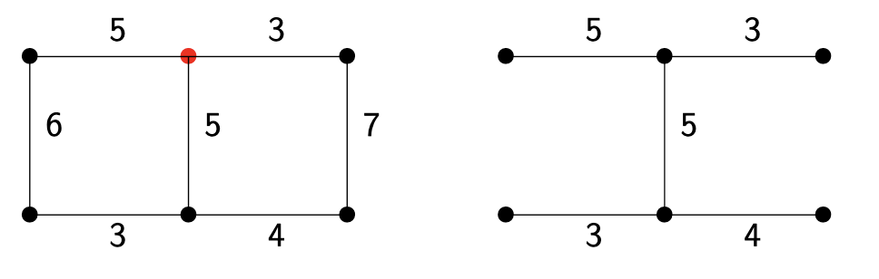

Click to see the solution

**Key Concept:** Prim's algorithm starts from one vertex and grows the tree by repeatedly adding the minimum-weight edge connecting the tree to a new vertex.

Let's trace the algorithm as shown in the tutorial slides, starting from the top-middle vertex (marked with a red dot).

1.  **Initialize:** The tree $T$ contains only the top-middle vertex.
2.  **Step 1:** The edges leaving $T$ have weights 3 (right) and 5 (left). The minimum is 3. Add this edge and the top-right vertex to $T$. Current weight: 3.
3.  **Step 2:** The edges leaving $T$ are: from top-middle (to left, w=5; to down, w=5) and from top-right (to down, w=5; to bottom-right, w=7). The minimum is 5. The slide chooses the edge from the top-middle to the top-left vertex. Add this edge. Current weight: 3 + 5 = 8.
4.  **Step 3:** The edges leaving $T$ now include one from the new top-left vertex (to bottom-left, w=6). The minimum weight edge leaving the tree is now one of the three with weight 5. The slide picks the one from the top-middle vertex down to the middle vertex. Add this edge. Current weight: 8 + 5 = 13.
5.  **Step 4:** The edges leaving $T$ now include two from the new middle vertex (to bottom-left, w=3; to bottom-right, w=4). The minimum of all outgoing edges is now 3. Add this edge. Current weight: 13 + 3 = 16.
6.  **Step 5:** The only remaining vertex is the bottom-right. The edges connecting to it from the tree have weights 7 and 4. The minimum is 4. Add this edge. All vertices are now in the tree. Current weight: 16 + 4 = 20.

**Answer:** The minimal spanning tree found has edges with weights 3, 5, 5, 3, and 4. The minimum total weight is 20.

