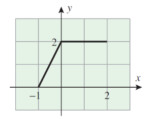

#### **1. Краткое содержание**

##### **1.1 Что такое математический анализ?**

**Mathematical analysis** (математический анализ) — это теоретический фундамент, на котором стоит **calculus** (классический курс «математического анализа» в прикладном смысле). Если calculus учит *как* пользоваться приёмами и формулами, то анализ объясняет *почему* они работают: он даёт строгое обоснование понятиям, которые вы могли видеть в школьной математике, — **limits** (пределы), **derivatives** (производные), **integrals** (интегралы).

Главное отличие — уровень строгости. В calculus вы запоминаете правила — **chain rule**, **L'Hôpital's rule**, **integration by parts** — и применяете их к задачам, но не всегда понимаете, при каких условиях они верны и где ломаются. **Real analysis** (вещественный анализ) заполняет этот пробел: формальные доказательства и структура вещественных чисел и функций.

В вещественном анализе мы задаёмся базовыми вопросами:

- Что такое **real number** (вещественное число) в точности? Существует ли «наибольшее» вещественное? Какое число идёт «сразу после» $0$?
- Почему у $2$ есть квадратный корень, а у $-2$ — нет (в $\mathbb{R}$)?
- Если и вещественных, и рациональных чисел бесконечно много, почему вещественных «больше», чем рациональных?
- Как брать **limit** последовательности? Какие последовательности **converge** (сходятся), а какие **diverge** (расходятся)?
- Можно ли сложить бесконечно много слагаемых и получить конечную сумму?
- Что значит, что функция **continuous** (непрерывна), **differentiable** (дифференцируема) или **integrable** (интегрируема)?

##### **1.2 Зачем изучать математический анализ?**

Понимание анализа важно, если вы хотите пользоваться математикой строго. Правила calculus можно применять «по памяти», но тогда легко ошибиться там, где условия теорем не выполняются. Анализ показывает **limits of applicability** (границы применимости) формул и помогает избегать типичных ловушек.

###### **1.2.1 Пример: деление на ноль**

Вспомним **cancellation law** (закон сокращения) для вещественных чисел: если $a \times b = a \times c$ и $a \neq 0$, то $b = c$. Условие $a \neq 0$ существенно: без него можно получить ложные выводы.

Например, равенство $0 \times 1 = 0 \times 2$ верно, но если «сократить» нуль, получится $1 = 2$.

Более тонкий пример. Пусть $x \in \mathbb{R}$ и

$$x(x + 1) = x^2.$$

Если сократить $x$ в обеих частях,

$$x + 1 = x,$$

то есть $1 = 0$ — неверно. Ошибка в том, что сокращение $x$ допустимо только при $x \neq 0$; при $x = 0$ оно недействительно.

###### **1.2.2 Пример: бесконечные последовательности**

Пусть $x \in \mathbb{R}$ и $L = \lim_{n \to \infty} x^n$. Заменяя $n$ на $m+1$,

$$L = \lim_{m+1 \to \infty} x^{m+1} = \lim_{m+1 \to \infty} x \cdot x^m = x \cdot \lim_{m+1 \to \infty} x^m.$$

Так как $n \to \infty$ влечёт $m \to \infty$,

$$\lim_{m+1 \to \infty} x^m = \lim_{m \to \infty} x^m = \lim_{n \to \infty} x^n = L,$$

значит $xL = L$, откуда «либо $x=1$, либо $L=0$», и кажется, что $\lim_{n \to \infty} x^n = 0$ для всех $x \neq 1$.

Это неверно: при $x=2$ последовательность $1,2,4,8,\ldots$ не сходится к нулю, а уходит на $+\infty$; при $x=-1$ она $1,-1,1,-1,\ldots$ не сходится вовсе.

Довод ломается в том, что мы предположили существование предела $L$ и алгебраически манипулировали выражением, не проверив **convergence** (сходимость).

###### **1.2.3 Пример: бесконечные ряды**

Рассмотрим **geometric series** (геометрический ряд) $S = 1 + \frac{1}{2} + \frac{1}{4} + \frac{1}{8} + \cdots$. Умножая на $2$,

$$2S = 2 + 1 + \frac{1}{2} + \frac{1}{4} + \cdots = 2 + S,$$

откуда $S=2$ — верно, ряд сходится к $2$.

Тот же приём для $S = 1 + 2 + 4 + 8 + \cdots$ даёт

$$2S = 2 + 4 + 8 + \cdots = -1 + 1 + 2 + 4 + \cdots = -1 + S,$$

то есть $S=-1$, что бессмысленно: слагаемые положительны, ряд явно расходится к $+\infty$.

Алгебраические преобразования такого типа оправданы только для **convergent series** (сходящихся рядов). Первый ряд сходится — приём работает; второй расходится — результат произволен.

Для $S = 1 - 1 + 1 - 1 + \cdots$ разные «скобки» дают $S=\frac12$, $S=0$ или $S=1$ — противоречие показывает, что ряд не сходится и им нельзя пользоваться как конечной суммой.

##### **1.3 Логические символы**

Для строгого изложения используются стандартные обозначения:

- **Conjunction** (конъюнкция «и»): $\land$. Высказывание $A \land B$ истинно, если истинны и $A$, и $B$.
- **Disjunction** (дизъюнкция «или»): $\lor$. Высказывание $A \lor B$ истинно, если истинно хотя бы одно из $A$, $B$.
- **Implication** (импликация): $\Rightarrow$. Запись $A \Rightarrow B$ читается «если $A$, то $B$»; тогда $A$ — **sufficient condition** (достаточное условие) для $B$, а $B$ — **necessary condition** (необходимое условие) для $A$.
- **Equivalence** (эквивалентность, «тогда и только тогда»): $\Leftrightarrow$. $A \Leftrightarrow B$ значит, что $A \Rightarrow B$ и $B \Rightarrow A$; $A$ — **necessary and sufficient condition** для $B$.
- **Universal quantifier** $\forall$: «для всех»; $\forall x \in S,\, P(x)$ — свойство $P$ выполнено для каждого $x \in S$.
- **Existential quantifier** $\exists$: «существует»; $\exists x \in S,\, P(x)$ — найдётся $x \in S$ с истинным $P(x)$.
- **Unique existence** $\exists!$: «существует ровно один» $x \in S$ с $P(x)$.

###### **1.3.1 Математические высказывания**

**Mathematical statement** (замкнутое высказывание) — предложение, которое либо истинно, либо ложно:

- «$2+1=3$» — истина.
- «Москва — столица России» — истина (факт из мира вне математики).
- «Russia is the best!» — не высказывание, а оценка.
- «$x+1=3$» — **open statement** (открытое высказывание): истинность зависит от $x$; при $x=2$ истинно, иначе — нет.

Частая форма: «если $A$, то $B$» — это $A \Rightarrow B$.

**Пример 1**: импликация $x^2 \leq 9 \Rightarrow -3 \leq x \leq 3$ верна; обратная $-3 \leq x \leq 3 \Rightarrow x^2 \leq 9$ тоже верна, поэтому

$$x^2 \leq 9 \Leftrightarrow -3 \leq x \leq 3.$$

**Пример 2**: $x = -3 \Rightarrow x^2 + 2x - 3 = 0$ верно, но обратное неверно: уравнение имеет корни $x_1=1$ и $x_2=-3$.

##### **1.4 Основы теории множеств**

**Modern analysis** (современный анализ, условно с конца XIX века) опирается на язык **sets** (множеств). Множество — базовое понятие; строгое «определение множества» приводит к парадоксам, поэтому здесь **intuitive approach** (наглядный подход): **set** (множество) — это совокупность объектов — **elements** / **members** (элементов).

Множество однозначно задаётся составом элементов; два множества **equal** (равны), если содержат одни и те же элементы. Множество без элементов — **empty set** (пустое множество), $\emptyset$ или $\{\}$.

###### **1.4.1 Запись множеств**

Чаще всего берут множества чисел. Например, $A = \{2, 4, 6\}$ состоит из трёх элементов $2$, $4$, $6$.

- Запись $2 \in A$ значит, что $2$ **belongs to** $A$ (принадлежит $A$, элемент $A$).
- Запись $10 \notin A$ значит, что $10$ не лежит в $A$.

###### **1.4.2 Подмножества и равенство**

**Определение**. $A$ — **subset** (подмножество) $B$ (пишут $A \subset B$ или $A \subseteq B$), если каждый элемент $A$ лежит в $B$:

$$A \subset B \Leftrightarrow (x \in A \Rightarrow x \in B)$$

**Определение**. $A$ и $B$ **equal** (равны), $A = B$, если $A \subset B$ и $B \subset A$ — те же самые элементы:

$$A = B \Leftrightarrow (A \subset B) \land (B \subset A)$$

**Определение**. $A$ — **proper subset** (строгое подмножество) $B$, $A \subsetneq B$, если $A \subset B$ и $A \neq B$: в $B$ есть элемент вне $A$.

Часто задают множества в **set-builder notation** (обозначении через свойство): $\{x \in A : P(x)\}$ — все $x$ из $A$, для которых верно $P(x)$.

###### **1.4.3 Операции над множествами**

**1. Union** (объединение) $A \cup B$ — элементы, лежащие в $A$ или в $B$ (или в обоих):

$$A \cup B := \{x \mid (x \in A) \lor (x \in B)\}$$

**2. Intersection** (пересечение) $A \cap B$ — элементы, лежащие и в $A$, и в $B$:

$$A \cap B := \{x \mid (x \in A) \land (x \in B)\}$$

**3. Difference** (разность) $A \setminus B$ (иногда $A - B$) — элементы $A$, не лежащие в $B$:

$$A \setminus B := \{x \mid (x \in A) \land (x \notin B)\}$$

**4. Symmetric difference** (симметрическая разность) $A \Delta B$ — элементы, лежащие ровно в одном из $A$, $B$:

$$A \Delta B := (A \setminus B) \cup (B \setminus A)$$

**5. Complement** (дополнение). Если $B \subset U$ для **universal set** $U$, то **complement** $B$ в $U$ — $B^c$:

$$B^c := U \setminus B$$

Имеем $A \setminus B = A \cap B^c$.

**6. Disjoint sets** (непересекающиеся множества): $A$ и $B$ **disjoint**, если $A \cap B = \emptyset$.

<!-- DIAGRAM HERE -->

###### **1.4.4 Свойства операций**

Пусть $A,B,C \subset U$. Справедливо:

1. **Idempotence**: $A \cup A = A$, $A \cap A = A$
2. **Identity**: $A \cup \emptyset = A$, $A \cap \emptyset = \emptyset$
3. **Domination**: $A \cup U = U$, $A \cap U = A$
4. **Commutativity**: $A \cap B = B \cap A$, $A \cup B = B \cup A$
5. **Associativity**: $(A \cap B) \cap C = A \cap (B \cap C)$, $(A \cup B) \cup C = A \cup (B \cup C)$
6. **Distributivity**: $A \cap (B \cup C) = (A \cap B) \cup (A \cap C)$, $A \cup (B \cap C) = (A \cup B) \cap (A \cup C)$
7. **Absorption**: $A \cup (A \cap B) = A$, $A \cap (A \cup B) = A$
8. **Complement**: $A \cup A^c = U$, $A \cap A^c = \emptyset$
9. **Symmetry**: $A \Delta B = B \Delta A$, $(A \Delta B) \Delta C = A \Delta (B \Delta C)$
10. **Difference**: $A \setminus (B \cap C) = (A \setminus B) \cup (A \setminus C)$

###### **1.4.5 Законы де Моргана**

**Теорема (De Morgan's laws)**. Если $A,B \subset U$, то

$$(A \cup B)^c = A^c \cap B^c$$
$$(A \cap B)^c = A^c \cup B^c$$

**Доказательство первого равенства**. Покажем взаимное вложение.

Пусть $x \in (A \cup B)^c$. Тогда

$$x \notin A \cup B \Rightarrow (x \notin A) \land (x \notin B) \Rightarrow (x \in A^c) \land (x \in B^c) \Rightarrow x \in A^c \cap B^c,$$

то есть $(A \cup B)^c \subset A^c \cap B^c$.

Обратно, если $x \in A^c \cap B^c$, то

$$(x \in A^c) \land (x \in B^c) \Rightarrow (x \notin A) \land (x \notin B) \Rightarrow x \notin A \cup B \Rightarrow x \in (A \cup B)^c,$$

значит $A^c \cap B^c \subset (A \cup B)^c$. Следовательно, множества совпадают.

###### **1.4.6 Декартово произведение**

**Определение**. **Cartesian product** $X \times Y$ — множество всех **ordered pairs** (упорядоченных пар) $(x,y)$, $x\in X$, $y\in Y$:

$$X \times Y := \{(x, y) : (x \in X) \land (y \in Y)\}$$

Для пар $(x_1,y_1)$ и $(x_2,y_2)$:

- $(x_1,y_1) = (x_2,y_2)$ тогда и только тогда, когда $x_1=x_2$ и $y_1=y_2$.
- если $x_1\neq x_2$ или $y_1\neq y_2$, то пары различны.

Вообще говоря, $X \times Y \neq Y \times X$.

**Пример**:

$$\{a, b\} \times \{1, 2, 3\} = \{(a, 1), (a, 2), (a, 3), (b, 1), (b, 2), (b, 3)\}$$
$$\{1, 2, 3\} \times \{a, b\} = \{(1, a), (1, b), (2, a), (2, b), (3, a), (3, b)\}$$

это разные множества.

##### **1.5 Вещественные числа**

**Real numbers** $\mathbb{R}$ — числа, которые можно записать десятичной дробью (конечной или бесконечной), например

$$3 = 3.00000\ldots, \quad \frac{3}{2} = 1.500000\ldots, \quad \sqrt{2} = 1.41421\ldots$$
$$\pi = 3.14159\ldots, \quad e = 2.71828\ldots, \quad \ln(2) = 0.69314\ldots$$

Геометрически — точки на **real line** (числовой прямой).

Вместо конструкции $\mathbb{R}$ «с нуля» мы используем **axiomatic approach** (аксиоматический подход): постулируем множество $\mathbb{R}$ с аксиомами. Их удобно разбить на три группы:

1. **Algebraic axioms** (алгебраические — сложение и умножение)
2. **Order axioms** (аксиомы порядка — неравенства)
3. **Completeness axiom** (аксиома полноты — «нет дыр» на прямой)

###### **1.5.1 Алгебраические аксиомы**

На $\mathbb{R}$ заданы две бинарные операции: **addition** ($+$) и **multiplication** ($\times$ или $\cdot$).

**Аксиомы сложения** для всех $a,b,c\in\mathbb{R}$:

- **(A1) Commutativity**: $a + b = b + a$
- **(A2) Associativity**: $(a + b) + c = a + (b + c)$
- **(A3) Additive identity**: существует $0\in\mathbb{R}$: $a+0=0+a=a$ для всех $a$.
- **(A4) Additive inverse**: для каждого $a$ существует $-a$ (**negative** противоположный элемент): $a+(-a)=(-a)+a=0$.

**Аксиомы умножения**:

- **(A5) Commutativity**: $a \cdot b = b \cdot a$
- **(A6) Associativity**: $(a \cdot b) \cdot c = a \cdot (b \cdot c)$
- **(A7) Multiplicative identity**: существует $1\in\mathbb{R}$, $1\neq 0$: $a\cdot 1=1\cdot a=a$.
- **(A8) Multiplicative inverse**: для $a\neq 0$ существует $a^{-1}$ (**reciprocal** / **inverse**): $a\cdot a^{-1}=a^{-1}\cdot a=1$.

**Дистрибутивность**:

- **(A9) Distributivity**: $a(b+c)=ab+ac$.

**Subtraction** (вычитание): $a-b:=a+(-b)$; **division** (деление при $b\neq 0$): $\frac{a}{b}:=a\cdot b^{-1}$.

###### **1.5.2 Аксиомы порядка**

На $\mathbb{R}$ задано отношение $\leq$ (меньше или равно) такое, что для всех $a,b,c\in\mathbb{R}$:

- **(A10) Reflexivity**: $a\leq a$
- **(A11) Antisymmetry**: если $a\leq b$ и $b\leq a$, то $a=b$.
- **(A12) Transitivity**: если $a\leq b$ и $b\leq c$, то $a\leq c$.
- **(A13) Totality**: верно $a\leq b$ или $a\geq b$ (или оба).
- **(A14) Addition preservation**: если $a\leq b$, то $a+c\leq b+c$.
- **(A15) Multiplication by positives**: если $a\geq 0$ и $b\geq 0$, то $ab\geq 0$.

Строгое $a<b$ значит $a\leq b$ и $a\neq b$.

###### **1.5.3 Аксиома полноты**

**Completeness axiom** гарантирует отсутствие «щелей» в $\mathbb{R}$. Одна наглядная форма:

**(A16)**: если $A,B\subset\mathbb{R}$ непусты и $a\leq b$ для всех $a\in A$, $b\in B$, то существует $c\in\mathbb{R}$ с $a\leq c\leq b$ для всех таких $a,b$.

Эквивалентная формулировка через **least upper bound** (**sup**, точная верхняя грань; см. ниже):

**(A16')**: всякое непустое ограниченное сверху подмножество $\mathbb{R}$ имеет единственную наименьшую верхнюю грань.

###### **1.5.4 Аксиомы равенства**

Для всех $a,b,c\in\mathbb{R}$:

1. **Reflexivity**: $a=a$
2. **Symmetry**: из $a=b$ следует $b=a$.
3. **Transitivity**: из $a=b$ и $b=c$ следует $a=c$.
4. **Addition property**: из $a=b$ следует $a+c=b+c$.
5. **Multiplication property**: из $a=b$ следует $ac=bc$.

###### **1.5.5 Свойства вещественных чисел**

Из аксиом выводятся полезные факты.

**Теорема**. Пусть $a,b,c,d\in\mathbb{R}$.

1. **Cancellation law for addition**: если $a+c=b+c$, то $a=b$.
2. **Cancellation law for multiplication**: если $c\neq 0$ и $ac=bc$, то $a=b$.
3. $a\cdot 0=0$
4. $(-1)a=-a$
5. $(c^{-1})^{-1}=c$ при $c\neq 0$
6. $-(-a)=a$
7. $a(-b)=-(ab)=(-a)b$
8. $(-a)+(-b)=-(a+b)$
9. $(-a)(-b)=ab$
10. при $c,d\neq 0$: $\frac{a}{c}\times\frac{b}{d}=\frac{ab}{cd}$
11. при $c,d\neq 0$: $\frac{a}{c}+\frac{b}{d}=\frac{ad+bc}{cd}$

**Доказательство (1)**. Если $a+c=b+c$, по (A4) существует $-c$. Прибавим его:

$$(a+c)-c=(b+c)-c,\quad a+(c-c)=b+(c-c),\quad a+0=b+0,\quad a=b.$$

**Доказательство (3)**. По (A3) и (A9): $a\cdot0=a\cdot(0+0)=a\cdot0+a\cdot0$. Прибавив $-a\cdot0$, получим $0=a\cdot0$.

**Теорема**. Пусть $a,b,c,d\in\mathbb{R}$.

1. Для любых $a,b$ ровно одно из: $a<b$, $a=b$, $a>b$.
2. если $a>0$, $b>0$, то $ab>0$.
3. если $a>0$, $b<0$, то $ab<0$.
4. если $a<0$, $b<0$, то $ab>0$.
5. если $a<b$ и $c>0$, то $ac<bc$.
6. если $a<b$ и $c<0$, то $ac>bc$.
7. $0<1$ и $-1<0$.
8. если $a>0$, то $a^{-1}=\frac1a>0$.
9. если $0<a<b$, то $0<\frac1b<\frac1a$.
10. если $a<b$ и $b<c$, то $a<c$.
11. если $a\leq b$, то $a+c\leq b+c$.

###### **1.5.6 Модуль**

**Определение**. **Absolute value** $|x|$:

$$|x| = \begin{cases} x & \text{if } x \geq 0 \\ -x & \text{if } x < 0 \end{cases}$$

Геометрически — расстояние от $x$ до $0$.

**Теорема**. Для $x,y\in\mathbb{R}$:

1. $|x|\geq 0$, и $|x|=0 \Leftrightarrow x=0$.
2. $|-x|=|x|$
3. $-|x|\leq x\leq |x|$
4. $|xy|=|x||y|$
5. **Triangle inequality**: $|x+y|\leq |x|+|y|$
6. **Reverse triangle inequality**: $||x|-|y||\leq |x-y|$
7. $|x|\leq y \Leftrightarrow -y\leq x\leq y$; $|x|\geq y \Leftrightarrow x\leq -y$ или $x\geq y$

**Доказательство (5)**. $|x+y|=s(x+y)$, $s\in\{-1,1\}$ по знаку $x+y$; $s(x+y)=sx+sy\leq |x|+|y|$.

**Доказательство (7)**. Если $|x|\leq y$ и $x\geq 0$, то $x\leq y$ и $-y\leq x\leq y$; если $x<0$, то $|x|=-x\leq y$, откуда $x\geq -y$. Обратно, из $-y\leq x\leq y$ следует $|x|\leq y$.

###### **1.5.7 Промежутки**

**Определение (ограниченные)**. Пусть $a<b$.

- **Closed interval** $[a,b] := \{x\in\mathbb{R}: a\leq x\leq b\}$
- **Open interval** $(a,b) := \{x\in\mathbb{R}: a< x< b\}$
- **Half-open intervals** $(a,b]$, $[a,b)$ — соответственно с одной включённой границей.

**Определение (неограниченные)**:

- $[a,\infty)$, $(a,\infty)$, $(-\infty,b]$, $(-\infty,b)$, и $\mathbb{R}=(-\infty,\infty)$.

**Extended real numbers** (расширенная прямая): $\overline{\mathbb{R}} := \mathbb{R}\cup\{-\infty,+\infty\}$ с порядком $-\infty<x<+\infty$ для всех $x\in\mathbb{R}$.

##### **1.6 Важные подмножества $\mathbb{R}$**

###### **1.6.1 Натуральные числа**

**Natural numbers** $\mathbb{N}$:

$$\mathbb{N} = \{1, 2, 3, 4, 5, \ldots\}$$

От единицы как **multiplicative identity** строят $2=1+1$, $3=2+1$, …

$$2 = 1 + 1, \quad 3 = 2 + 1, \quad 4 = 3 + 1, \quad \ldots$$

###### **1.6.2 Целые числа**

**Integers** $\mathbb{Z}$:

$$\mathbb{Z} = \{\ldots, -3, -2, -1, 0, 1, 2, 3, \ldots\}$$

объединение $\mathbb{N}$, нуля и чисел $-n$ при $n\in\mathbb{N}$.

###### **1.6.3 Рациональные числа**

**Rational numbers** — числа вида дроби двух целых:

$$\mathbb{Q} = \left\{\frac{p}{q} : p \in \mathbb{Z}, q \in \mathbb{N}\right\}$$

Каждое рациональное можно записать в **canonical form** (несократимой дроби) $\frac{p}{q}$ с взаимно простыми $p,q$ и $q>0$.

**Свойства рациональных чисел**:

- **Equality**: $\frac{a}{b} = \frac{c}{d} \Leftrightarrow ad = bc$; в канонической форме равенство дробей $\Leftrightarrow$ совпадение числителей и знаменателей.
- **Ordering** (при положительных знаменателях): $\frac{a}{b} < \frac{c}{d} \Leftrightarrow ad < bc$.
- **Addition**: $\frac{a}{b} + \frac{c}{d} = \frac{ad + bc}{bd}$
- **Multiplication**: $\frac{a}{b} \times \frac{c}{d} = \frac{ac}{bd}$
- **Additive inverse**: $-\frac{a}{b} = \frac{-a}{b}$
- **Multiplicative inverse** ($\frac{a}{b} \neq 0$): $\left(\frac{a}{b}\right)^{-1} = \frac{b}{a}$
- **Division**: $\frac{a}{b} \div \frac{c}{d} = \frac{ad}{bc}$ ($c \neq 0$)
- **Integer powers**: для $n \in \mathbb{N}$, $\left(\frac{a}{b}\right)^n = \frac{a^n}{b^n}$; $\left(\frac{a}{b}\right)^0 = 1$ ($a \neq 0$); $\left(\frac{a}{b}\right)^{-n} = \frac{b^n}{a^n}$ ($a \neq 0$)

###### **1.6.4 Иррациональные числа**

Вещественное число **irrational**, если оно не рационально. Иррациональные: $\mathbb{Q}^c = \mathbb{R} \setminus \mathbb{Q}$; примеры: $\sqrt{2}$, $\sqrt{5}$, $\pi$, $e$, $\ln 2$.

<!-- DIAGRAM HERE -->

**Пример: $\sqrt{2}$ иррационально**

**Доказательство**. Пусть $\sqrt{2}=\frac{p}{q}$, $p,q\in\mathbb{N}$, $\gcd(p,q)=1$. Тогда

$$2 = \frac{p^2}{q^2} \Rightarrow p^2 = 2q^2,$$

значит $p^2$ чётно, откуда $p$ чётно. Пишем $p=2k$:

$$(2k)^2 = 2q^2 \Rightarrow q^2 = 2k^2,$$

тогда $q$ чётно — противоречие с $\gcd(p,q)=1$. Следовательно, $\sqrt{2}\notin\mathbb{Q}$.

**Пример: $\sqrt{15}$ иррационально**

**Доказательство**. Если $\sqrt{15}=\frac{p}{q}$ в несократимой дроби, то $p^2=15q^2$. По **Euclid's lemma** из $3\mid p^2$ следует $3\mid p$; пусть $p=3k$:

$$9k^2 = 15q^2 \Rightarrow 3k^2 = 5q^2,$$

откуда $3\mid q$ — снова противоречие с взаимной простотой $p,q$.

**Пример: $\sqrt{3}+\sqrt{5}$ иррационально**

**Доказательство**. Если $r=\sqrt{3}+\sqrt{5}\in\mathbb{Q}$, то

$$r^2 = 8 + 2\sqrt{15},\quad \sqrt{15}=\frac{r^2-8}{2}\in\mathbb{Q},$$

но $\sqrt{15}$ иррационально — противоречие.

**Замечание**. Сумма двух иррациональных чисел может быть рациональной или нет:

- $\sqrt{2} + (-\sqrt{2}) = 0 \in \mathbb{Q}$
- $\sqrt{2} + (1 - \sqrt{2}) = 1 \in \mathbb{Q}$

##### **1.7 Верхние и нижние грани**

**Определение**. Пусть $E \subset \mathbb{R}$.

- $a \in E$ — **maximal element** (**максимум**), $a=\max(E)$, если $x\leq a$ для всех $x\in E$.
- $a \in E$ — **minimal element** (**минимум**), $a=\min(E)$, если $x\geq a$ для всех $x\in E$.
- $E$ **bounded above** (ограничено сверху), если существует $a\in\mathbb{R}$: $x\leq a$ для всех $x\in E$; такое $a$ — **upper bound** (верхняя грань).
- $E$ **bounded below** (ограничено снизу), если $\exists a\in\mathbb{R}$: $x\geq a$ для всех $x\in E$ — **lower bound** (нижняя грань).
- $b\in\mathbb{R}$ — **least upper bound** / **supremum**, $b=\sup(E)$, если (1) $b$ — верхняя грань $E$; (2) $b\leq a$ для любой верхней грани $a$.
- $b\in\mathbb{R}$ — **greatest lower bound** / **infimum**, $b=\inf(E)$, если (1) $b$ — нижняя грань; (2) $b\geq a$ для любой нижней грани $a$.

<!-- DIAGRAM HERE -->

**Соглашения**:

- если $E=\emptyset$, полагают $\sup\emptyset:=-\infty$, $\inf\emptyset:=+\infty$;
- если $E\neq\emptyset$ не ограничено сверху, $\sup E:=+\infty$;
- если $E\neq\emptyset$ не ограничено снизу, $\inf E:=-\infty$.

**Примеры**:

1. $E=[-1,2]$: $\min E=\inf E=-1\in E$, $\max E=\sup E=2\in E$.
2. $E=[0,1)$: $\min E=\inf E=0\in E$, $\sup E=1\notin E$; максимума нет.
3. $E=\{1,\frac12,\frac13,\ldots\}$: $\max E=\sup E=1\in E$, $\inf E=0\notin E$; минимума нет.
4. $E=(1,\infty)$: $\inf E=1\notin E$; снизу ограничено, сверху — нет, минимума нет.

##### **1.8 Эквивалентность формулировок полноты**

**Теорема**. Аксиомы (A16) и (A16') эквивалентны.

**Доказательство**. **Least upper bound**, если существует, единствен: если $b_1,b_2$ — оба $\sup M$, то $b_1\leq b_2$ и $b_2\leq b_1$, значит $b_1=b_2$.

**(A16) $\Rightarrow$ (A16')**. Пусть $M\neq\emptyset$ ограничено сверху, $N=\{y\in\mathbb{R}: y\geq x\ \forall x\in M\}$ — множество верхних граней $M$. Тогда $N\neq\emptyset$, и по (A16) найдётся $c$ с $x\leq c\leq y$ для всех $x\in M$, $y\in N$. Такое $c$ — верхняя грань $M$ и нижняя грань $N$, т.е. $c=\min N=\sup M$.

**(A16') $\Rightarrow$ (A16)**. Если $M,N\neq\emptyset$ и $x\leq y$ для всех $x\in M$, $y\in N$, то $M$ ограничено сверху, $c=\sup M$ существует. Если бы нашлось $\xi\in N$ с $\xi<c$, $\xi$ было бы верхней гранью $M$ меньше $\sup M$ — невозможно. Значит $c\leq y$ для всех $y\in N$, что и есть (A16).

##### **1.9 Архимедово свойство**

**Теорема**. $\mathbb{N}$ не ограничено сверху в $\mathbb{R}$.

**Доказательство**. Если $b=\sup\mathbb{N}$ существует по (A16'), то $n\leq b$ для всех $n\in\mathbb{N}$, откуда $m+1\leq b$ для всех $m\in\mathbb{N}$, т.е. $m\leq b-1$ — у $\mathbb{N}$ есть верхняя грань $b-1<b$, противоречие с минимальностью $b$.

**Теорема (Archimedean property)**. Следующие утверждения эквивалентны:

1. $\forall\varepsilon>0\ \exists n\in\mathbb{N}$: $0<\frac1n<\varepsilon$.
2. $\forall x\in\mathbb{R}\ \exists n\in\mathbb{N}$: $n>x$.
3. $\forall a,b>0\ \exists n\in\mathbb{N}$: $na>b$.

**Доказательство (1)**. Если бы для некоторого $\varepsilon>0$ было $\frac1n\geq\varepsilon$ для всех $n$, то $n\leq\frac1\varepsilon$ — верхняя грань $\mathbb{N}$, противоречие.

**Смысл**. Сколько бы ни было велико $x$, найдётся натуральное больше $x$; сколь угодно мало $a>0$, сумма $n$ копий $a$ переплюсует любое $b>0$ — в $\mathbb{R}$ нет «бесконечно больших/малых» элементов в школьном смысле.

##### **1.10 Плотность $\mathbb{Q}$**

**Теорема (density of $\mathbb{Q}$)**. Если $x<y$, то $\exists r\in\mathbb{Q}$: $x<r<y$.

**Доказательство**. По архимедовости $\exists n\in\mathbb{N}$: $n(y-x)>1$, т.е. $\frac1n<y-x$. Пусть $m=\lfloor nx\rfloor$, $r=\frac{m+1}{n}\in\mathbb{Q}$. Тогда $x<r\leq x+\frac1n<y$.

**Следствие**. Между любыми двумя вещественными — бесконечно много рациональных.

##### **1.11 Плотность иррациональных**

**Теорема (density of irrationals)**. При $x<y$ найдётся иррациональное $t$ с $x<t<y$.

**Доказательство**. **Случай 1**: $x,y\in\mathbb{Q}$. Тогда $t=x+\frac{(y-x)\sqrt2}{2}$ иррационально и $x<t<y$.

**Случай 2**: иначе выберем $r_1,r_2\in\mathbb{Q}$ с $x<r_1<r_2<y$ и применим случай 1 к $[r_1,r_2]$.

**Следствие**. Для любого $x\in\mathbb{R}$ и $\varepsilon>0$ существуют $r\in\mathbb{Q}$ и иррациональное $t$ с $0<|x-r|<\varepsilon$ и $0<|x-t|<\varepsilon$.

И $\mathbb{Q}$, и $\mathbb{R}\setminus\mathbb{Q}$ **dense** (всюду плотны) в $\mathbb{R}$.

##### **1.12 Счётность**

Бесконечных натуральных, рациональных и иррациональных чисел много, но «размер» множеств сравнивают через **cardinality** (мощность).

**Определение**. Множества **equivalent**, если между ними есть **bijection** (взаимно однозначное соответствие).

**Определение**. Множество **countable** (**счётно**), если оно эквивалентно $\mathbb{N}$ (элементы можно пронумеровать $a_1,a_2,\ldots$).

**Определение**. Бесконечное не счётное множество — **uncountable**.

**Теорема**. Конечное или счётное объединение счётных множеств счётно.

**Доказательство**. Для $A=\{a_i\}$, $B=\{b_i\}$ нумерация $a_1,b_1,a_2,b_2,\ldots$ с удалением повторов даёт биекцию с $\mathbb{N}$. Для счётного объединения $A_k$ используют диагональную нумерацию (как у Кантора):

$$a_{11}, a_{21}, a_{12}, a_{31}, a_{22}, a_{13}, \ldots$$

**Теорема**. $\mathbb{Q}$ счётно.

**Доказательство**. $\mathbb{Q}=\bigcup_{k=1}^\infty A_k$, $A_k=\{\frac{n}{k}: n\in\mathbb{Z}\}$ — счётные $A_k$.

##### **1.13 Несчётность $\mathbb{R}$**

**Decimal representation**: $x=\pm d_k\ldots d_0.d_{-1}d_{-2}\ldots$, цифры $d_i\in\{0,\ldots,9\}$.

**Пример**:

$$32.125 = 3 \times 10^1 + 2 \times 10^0 + 1 \times 10^{-1} + 2 \times 10^{-2} + 5 \times 10^{-3}$$

**Теорема**. Отрезок $[0,1]$ **uncountable**.

**Доказательство (Cantor's diagonal argument)**. Если бы $[0,1]=\{x_1,x_2,\ldots\}$, записали бы $x_k=0.a_{k1}a_{k2}\ldots$ и построили $y=0.b_1b_2\ldots$ с $b_n\neq a_{nn}$, например

$$b_n = \begin{cases} 1 & \text{if } a_{nn} \neq 1 \\ 2 & \text{if } a_{nn} = 1 \end{cases}$$

Тогда $y\in[0,1]$, но $y\neq x_n$ для всех $n$ — противоречие.

<!-- DIAGRAM HERE -->

Значит, и $\mathbb{R}$ несчётно.

##### **1.14 Мощность множества**

**Определение**. **Cardinality** $|A|$ — «число элементов»; для бесконечных множеств равенство мощностей означает существование биекции.

**Примеры**:

1. $|\mathbb{N}|=|2\mathbb{N}|$, $f(n)=2n$.
2. $|\mathbb{N}|=|\mathbb{Z}|$ с

   $$f(n) = \begin{cases} \frac{n}{2} & \text{if } n \text{ is even} \\ -\frac{n-1}{2} & \text{if } n \text{ is odd} \end{cases}$$

   $$\begin{array}{ccccccc}
   \mathbb{Z}: & 0 & -1 & 1 & -2 & 2 & \ldots \\
   \mathbb{N}: & 1 & 2 & 3 & 4 & 5 & \ldots
   \end{array}$$
3. $|\mathbb{Z}|=|\mathbb{Q}|$ (равномощность).
4. $|\mathbb{R}|>|\mathbb{N}|$ — континуум «больше» счётного; бывают разные «уровни» бесконечности.

##### **1.15 Принцип математической индукции**

В доказательствах мы пользуемся **deductive reasoning** (дедукцией): из аксиом и логики выводим следствия. **Inductive reasoning** (индукция в бытовом смысле — «обобщение по примерам») как метод доказательства не принимается: наглядные закономерности могут обманывать.

###### **1.15.1 Задача Мозера про окружность**

На окружности отмечают $n$ точек и соединяют их всеми хордами. Сколько областей получается?

- $n = 1$: $1 = 2^0$
- $n = 2$: $2 = 2^1$
- $n = 3$: $4 = 2^2$
- $n = 4$: $8 = 2^3$

<!-- DIAGRAM HERE -->

Кажется, что число областей $2^{n-1}$, но это **ложно**: при $n=6$ получается $31$, а не $32$. Верная формула:

$$\frac{n(n^3 - 6n^2 + 23n - 18)}{24} + 1$$

(классический пример Л. Мозера, 1949): «паттерн по маленьким $n$» $\neq$ доказательство.

###### **1.15.2 Принцип математической индукции**

**Теорема (principle of mathematical induction)**. Для каждого $n\in\mathbb{N}$ пусть $P(n)$ — высказывание. Если

1. **Base step** (база): $P(1)$ истинно;
2. **Inductive step** (шаг индукции): из истинности $P(k)$ следует $P(k+1)$ для любого $k\in\mathbb{N}$,

то $P(n)$ истинно для всех $n\in\mathbb{N}$.

**Доказательство**. Если бы существовало наименьшее $s_0$ с ложным $P(s_0)$, то $s_0>1$ и $P(s_0-1)$ истинно — тогда по (2) истинно и $P(s_0)$, противоречие.

**Наглядно (domino effect)**: падает первая костяшка (база), каждая сбивает следующую (шаг) — падают все.

<!-- DIAGRAM HERE -->

###### **1.15.3 Пример 1**

**Утверждение**. Для всех $n \in \mathbb{N}$,

$$\frac{1}{2} + \frac{1}{2^2} + \cdots + \frac{1}{2^n} = 1 - \frac{1}{2^n}$$

**Доказательство**.

**База** ($n = 1$): слева $\frac{1}{2}$, справа $1 - \frac{1}{2} = \frac{1}{2}$.

**Шаг индукции**: пусть верно для $n = k$. Тогда для $n=k+1$:

$$\frac{1}{2} + \frac{1}{2^2} + \cdots + \frac{1}{2^k} + \frac{1}{2^{k+1}} = 1 - \frac{1}{2^k} + \frac{1}{2^{k+1}}$$
$$= 1 - \frac{2}{2^{k+1}} + \frac{1}{2^{k+1}} = 1 - \frac{1}{2^{k+1}}$$

По индукции формула верна для всех $n \in \mathbb{N}$.

###### **1.15.4 Пример 2**

**Утверждение**. Для всех $n \in \mathbb{N}$,

$$\sum_{k=1}^{n} \frac{k \cdot (k+1)!}{2^k} = \frac{(n+2)!}{2^n} - 2$$

**Доказательство**.

**База** ($n = 1$): слева $\frac{1 \cdot 2!}{2} = 1$, справа $\frac{3!}{2} - 2 = 1$.

**Шаг индукции**: из равенства для $n=k$ следует для $n=k+1$:

$$\sum_{i=1}^{k+1} \frac{i \cdot (i+1)!}{2^i} = \frac{(k+2)!}{2^k} - 2 + \frac{(k+1) \cdot (k+2)!}{2^{k+1}}$$
$$= \frac{2(k+2)!}{2^{k+1}} + \frac{(k+1)(k+2)!}{2^{k+1}} - 2$$
$$= \frac{(k+3)(k+2)!}{2^{k+1}} - 2 = \frac{(k+3)!}{2^{k+1}} - 2$$

###### **1.15.5 Пример 3**

**Утверждение**. $n! > 3^n$ при всех $n \geq 7$.

**Доказательство**. **База** $n=7$: $5040>2187$. **Шаг**: если $k!\ > 3^k$, $k\geq 7$, то $(k+1)!=(k+1)k! > 8\cdot 3^k > 3^{k+1}$.

###### **1.15.6 Пример 4**

**Утверждение**. $4^n - 1$ делится на $3$ при всех $n \geq 1$.

**Доказательство**. **База** $n=1$: $3\mid 3$. **Шаг**: если $4^k-1=3m$, то $4^{k+1}-1=4(4^k-1)+3=3(4m+1)$.

###### **1.15.7 Пример 5: неравенство Бернулли**

**Утверждение**. При $x \geq 0$, $n \in \mathbb{N}$,

$$(1 + x)^n \geq 1 + nx$$

**Доказательство**. **База** $n=1$ очевидна. **Шаг**: из $(1+x)^k\geq 1+kx$ при $x\geq 0$,

$$(1 + x)^{k+1} = (1 + x)(1 + x)^k \geq (1 + x)(1 + kx)$$
$$= 1 + (k+1)x + kx^2 \geq 1 + (k+1)x.$$

###### **1.15.8 Пример 6**

**Утверждение**. При всех $n \geq 1$,

$$\frac{1 \cdot 3 \cdot 5 \cdots (2n-1)}{2 \cdot 4 \cdot 6 \cdots (2n)} < \frac{1}{\sqrt{2n+1}}$$

**Доказательство**. **База** $n=1$: $\frac12<\frac1{\sqrt3}$. **Шаг**: домножение на $\frac{2k+1}{2k+2}$ и сравнение квадратов даёт $3<4$, как в оригинале.

###### **1.15.9 Замечание об ограничениях индукции**

Иногда прямой индукцией не обойтись. Например,

$$a_n = 1 + \frac{1}{2^2} + \frac{1}{3^2} + \cdots + \frac{1}{n^2} < 2 \quad \text{for all } n \geq 2$$

удобно доказать телескопированием: при $k \geq 2$

$$\frac{1}{k^2} \leq \frac{1}{k(k-1)} = \frac{1}{k-1} - \frac{1}{k}$$

$$a_n = 1 + \sum_{k=2}^{n} \frac{1}{k^2} \leq 1 + \sum_{k=2}^{n} \left(\frac{1}{k-1} - \frac{1}{k}\right) = 1 + \left(1 - \frac{1}{n}\right) = 2 - \frac{1}{n} < 2$$

Наивная попытка шага «из $a_n<2$ получить $a_{n+1}<2$» только из $a_{n+1}=a_n+\frac{1}{(n+1)^2}<2+\frac{1}{(n+1)^2}$ не срабатывает — нужна дополнительная идея.

***

#### **2. Определения**
* **Mathematical analysis**: теоретический каркас **calculus** — строгое обоснование, «почему работают» предельные приёмы.
* **Real analysis**: строгое изучение $\mathbb{R}$, последовательностей, рядов и функций.
* **Statement** (высказывание): утверждение, истинное или ложное, не «и то и другое».
* **Open statement**: истинность зависит от значения переменной.
* **Implication** ($A \Rightarrow B$): из $A$ следует $B$; при истинном $A$ должно быть истинно $B$.
* **Equivalence** ($A \Leftrightarrow B$): $A$ тогда и только тогда, когда $B$.
* **Sufficient condition**: если $A \Rightarrow B$, то $A$ достаточно для $B$.
* **Necessary condition**: если $A \Rightarrow B$, то $B$ необходимо для $A$.
* **Universal quantifier** ($\forall$): «для всех» / «для любого».
* **Existential quantifier** ($\exists$): «существует».
* **Unique existence** ($\exists!$): «существует ровно один».
* **Set**: множество элементов (**elements** / **members**).
* **Empty set** ($\emptyset$): множество без элементов.
* **Element** ($x \in A$): $x$ принадлежит $A$.
* **Subset** ($A \subset B$ или $A \subseteq B$): каждый элемент $A$ лежит в $B$.
* **Proper subset** ($A \subsetneq B$): $A\subset B$ и $A\neq B$.
* **Union** ($A \cup B$): элементы из $A$ или из $B$ (или из обоих).
* **Intersection** ($A \cap B$): общие элементы $A$ и $B$.
* **Difference** ($A \setminus B$): элементы $A$, не лежащие в $B$.
* **Symmetric difference** ($A \Delta B$): элементы ровно одного из $A$, $B$.
* **Complement** ($B^c$, $U\setminus B$): элементы универсума $U$, не входящие в $B$.
* **Disjoint sets**: $A\cap B=\emptyset$.
* **Cartesian product** ($X\times Y$): все упорядоченные пары $(x,y)$, $x\in X$, $y\in Y$.
* **Ordered pair** ($(x,y)$): порядок важен; равенство пар покомпонентно.
* **Real numbers** ($\mathbb{R}$): десятичные записи с алгебраическими, порядковыми и аксиомой полноты.
* **Additive identity** ($0$): $a+0=a$.
* **Additive inverse** ($-a$): $a+(-a)=0$.
* **Multiplicative identity** ($1$): $a\cdot 1=a$.
* **Multiplicative inverse** ($a^{-1}$, $\frac1a$): $a\cdot a^{-1}=1$ при $a\neq 0$.
* **Subtraction**: $a-b:=a+(-b)$.
* **Division**: $\frac{a}{b}:=a\cdot b^{-1}$ при $b\neq 0$.
* **Absolute value** ($|x|$): расстояние до $0$; $|x|=x$ при $x\geq 0$, иначе $|x|=-x$.
* **Closed interval** ($[a,b]$): $\{x\in\mathbb{R}: a\leq x\leq b\}$.
* **Open interval** ($(a,b)$): $\{x\in\mathbb{R}: a<x<b\}$.
* **Half-open interval**: $(a,b]$ или $[a,b)$.
* **Natural numbers** ($\mathbb{N}$): $\{1,2,3,\ldots\}$.
* **Integers** ($\mathbb{Z}$): $\{\ldots,-1,0,1,\ldots\}$.
* **Rational numbers** ($\mathbb{Q}$): числа $\frac{p}{q}$, $p\in\mathbb{Z}$, $q\in\mathbb{N}$.
* **Irrational numbers** ($\mathbb{Q}^c$): $\mathbb{R}\setminus\mathbb{Q}$.
* **Canonical form** дроби: несократимая $\frac{p}{q}$, $\gcd(p,q)=1$, $q>0$.
* **Maximal element** $\max(E)$: $a\in E$, $x\leq a$ для всех $x\in E$.
* **Minimal element** $\min(E)$: $a\in E$, $x\geq a$ для всех $x\in E$.
* **Bounded above**: $\exists M$: $x\leq M$ для всех $x\in E$.
* **Bounded below**: $\exists m$: $x\geq m$ для всех $x\in E$.
* **Upper bound**: число $M$ с $x\leq M$ на $E$.
* **Lower bound**: число $m$ с $x\geq m$ на $E$.
* **Supremum** $\sup(E)$: наименьшая верхняя грань (**least upper bound**).
* **Infimum** $\inf(E)$: наибольшая нижняя грань (**greatest lower bound**).
* **Extended real line** $\overline{\mathbb{R}}$: $\mathbb{R}\cup\{-\infty,+\infty\}$.
* **Archimedean property**: $\forall\varepsilon>0\ \exists n\in\mathbb{N}$: $\frac1n<\varepsilon$.
* **Dense** множество $A$ в $\mathbb{R}$: между любыми $x<y$ есть точка из $A$.
* **Equivalent sets**: существует **bijection** между ними.
* **Bijection**: взаимно однозначное соответствие.
* **Countable set**: равномощно $\mathbb{N}$.
* **Uncountable set**: бесконечное, но не счётное.
* **Cardinality** $|A|$: «размер» множества.
* **Continuum**: часто мощность $\mathbb{R}$.
* **Decimal representation**: запись $x=\pm d_k\ldots d_0.d_{-1}\ldots$.
* **Mathematical induction**: база + индукционный шаг для $P(n)$.
* **Base step**: проверка $P(1)$ (или $P(n_0)$).
* **Inductive step**: $P(k)\Rightarrow P(k+1)$.
* **Inductive hypothesis**: предположение истинности $P(k)$.

***

#### **3. Формулы**
* **Cancellation law (addition)**: из $a+c=b+c$ следует $a=b$.
* **Cancellation law (multiplication)**: при $c\neq 0$ из $ac=bc$ следует $a=b$.
* **Zero**: $a\cdot 0=0$.
* **Negation**: $(-1)a=-a$, $-(-a)=a$.
* **Sign rules**: $a(-b)=-(ab)=(-a)b$, $(-a)(-b)=ab$.
* **Inverse of inverse**: $(c^{-1})^{-1}=c$ при $c\neq 0$.
* **Fraction multiplication**: $\frac{a}{c}\cdot\frac{b}{d}=\frac{ab}{cd}$.
* **Fraction addition**: $\frac{a}{c}+\frac{b}{d}=\frac{ad+bc}{cd}$.
* **Fraction division**: $\frac{a}{b}\div\frac{c}{d}=\frac{ad}{bc}$.
* **Product of positives**: $a,b>0\Rightarrow ab>0$.
* **Product mixed signs**: $a>0$, $b<0\Rightarrow ab<0$.
* **Product of negatives**: $a,b<0\Rightarrow ab>0$.
* **Multiply inequality by positive**: $a<b$, $c>0\Rightarrow ac<bc$.
* **Multiply inequality by negative**: $a<b$, $c<0\Rightarrow ac>bc$.
* **Reciprocals**: $0<a<b\Rightarrow 0<\frac1b<\frac1a$.
* **Absolute value**: $|x| = \begin{cases} x & \text{if } x \geq 0 \\ -x & \text{if } x < 0 \end{cases}$
* **Non-negativity**: $|x|\geq 0$.
* **Symmetry**: $|-x|=|x|$.
* **Sandwich for $x$**: $-|x|\leq x\leq |x|$.
* **Multiplicativity**: $|xy|=|x||y|$.
* **Triangle inequality**: $|x+y|\leq |x|+|y|$.
* **Reverse triangle inequality**: $||x|-|y||\leq |x-y|$.
* **Absolute value and intervals**: $|x|\leq y\Leftrightarrow -y\leq x\leq y$; $|x|\geq y\Leftrightarrow x\leq -y$ или $x\geq y$.
* **De Morgan's laws**: $(A\cup B)^c=A^c\cap B^c$, $(A\cap B)^c=A^c\cup B^c$.
* **Distributivity** множеств: $A\cap(B\cup C)=(A\cap B)\cup(A\cap C)$, $A\cup(B\cap C)=(A\cup B)\cap(A\cup C)$.
* **Archimedean property (форма 1)**: $\forall\varepsilon>0\ \exists n$: $\frac1n<\varepsilon$.
* **Archimedean property (форма 2)**: $\forall x\in\mathbb{R}\ \exists n\in\mathbb{N}$: $n>x$.
* **Archimedean property (форма 3)**: $\forall a,b>0\ \exists n$: $na>b$.
* **Bernoulli's inequality**: при $x\geq 0$, $n\in\mathbb{N}$, $(1+x)^n\geq 1+nx$.
* **Частичная сумма** $\frac12+\cdots+\frac1{2^n}=1-\frac1{2^n}$.
* **Делимость**: $3\mid(4^n-1)$ при $n\geq 1$.
* **Дробное неравенство** из примера 1.15.8: $\frac{1\cdot3\cdots(2n-1)}{2\cdot4\cdots(2n)}<\frac1{\sqrt{2n+1}}$.
* **Факториал vs степень**: $n!>3^n$ при $n\geq 7$.
* **Оценка частичных сумм** $\sum_{k=1}^n \frac1{k^2}<2$ при $n\geq 2$ (телескопирование).

***

#### **4. Примеры**
##### **4.1. Степени мнимой единицы** (Лаба 1, Задание 1)
Покажите, что:

a) $1 + i - 3i^2 + i^7 = 4$
b) $i^9 + 2i^{11} + i^{13} = 0$

Нажмите, чтобы увидеть решение

**(a) $1 + i - 3i^2 + i^7 = 4$**

1.  **Recall the powers of $i$:** The powers of the imaginary unit cycle: $i^1 = i$, $i^2 = -1$, $i^3 = -i$, $i^4 = 1$.
2.  **Simplify the terms:**
    *   $i^2 = -1$.
    *   $i^7 = i^{4+3} = i^4 \cdot i^3 = 1 \cdot (-i) = -i$.
3.  **Substitute and solve:**
    *   $1 + i - 3(-1) + (-i) = 1 + i + 3 - i = 4$.
    *   The statement is true.

**(b) $i^9 + 2i^{11} + i^{13} = 0$**

1.  **Simplify the terms using the cycle:**
    *   $i^9 = i^{8+1} = (i^4)^2 \cdot i = 1^2 \cdot i = i$.
    *   $i^{11} = i^{8+3} = (i^4)^2 \cdot i^3 = 1^2 \cdot (-i) = -i$.
    *   $i^{13} = i^{12+1} = (i^4)^3 \cdot i = 1^3 \cdot i = i$.
2.  **Substitute and solve:**
    *   $i + 2(-i) + i = i - 2i + i = 0$.
    *   The statement is true.

##### **4.2. Арифметика комплексных чисел** (Лаба 1, Задание 2)
Запишите в виде $X + Yi$:

a) $(2 + 3i)^2$
b) $(2 + i)(2 - i) + (3 + 2i)(3 - 2i)$
c) $\frac{3-4i}{5+2i}$

Нажмите, чтобы увидеть решение

**(a) $(2 + 3i)^2$**

1.  **Expand the expression:** $(2+3i)(2+3i) = 2^2 + 2(2)(3i) + (3i)^2$.
2.  **Simplify:** $= 4 + 12i + 9i^2 = 4 + 12i + 9(-1) = -5 + 12i$.
    *   **Answer:** $-5 + 12i$.

**(b) $(2 + i)(2 - i) + (3 + 2i)(3 - 2i)$**

1.  **Use the conjugate property:** For a complex number $z = a+bi$, $z\bar{z} = (a+bi)(a-bi) = a^2+b^2$.
2.  **Apply to each term:**
    *   $(2+i)(2-i) = 2^2 + 1^2 = 5$.
    *   $(3+2i)(3-2i) = 3^2 + 2^2 = 9 + 4 = 13$.
3.  **Add the results:** $5 + 13 = 18$.
    *   **Answer:** $18 + 0i$.

**(c) $\frac{3-4i}{5+2i}$**

1.  **Multiply by the conjugate:** Multiply the numerator and denominator by the conjugate of the denominator, which is $5-2i$.
2.  **Calculate the numerator:** $(3-4i)(5-2i) = 15 - 6i - 20i + 8i^2 = 15 - 26i - 8 = 7 - 26i$.
3.  **Calculate the denominator:** $(5+2i)(5-2i) = 5^2 + 2^2 = 25 + 4 = 29$.
4.  **Combine the results:** $\frac{7 - 26i}{29} = \frac{7}{29} - \frac{26}{29}i$.
    *   **Answer:** $\frac{7}{29} - \frac{26}{29}i$.

##### **4.3. Найти неизвестные $P,Q$ в комплексном уравнении** (Лаба 1, Задание 3)
Найдите $P$ и $Q$, если $P + Qi = \frac{3-i}{1+i}$.

Нажмите, чтобы увидеть решение

1.  **Simplify the right-hand side:** Multiply the numerator and denominator by the conjugate of the denominator, which is $1-i$.
2.  **Calculate the numerator:** $(3-i)(1-i) = 3 - 3i - i + i^2 = 3 - 4i - 1 = 2 - 4i$.
3.  **Calculate the denominator:** $(1+i)(1-i) = 1^2 + 1^2 = 2$.
4.  **Combine and simplify:** $\frac{2 - 4i}{2} = 1 - 2i$.
5.  **Equate the real and imaginary parts:** We have $P + Qi = 1 - 2i$.
    *   $P = 1$
    *   $Q = -2$

**Answer:** $P = 1$ and $Q = -2$.

##### **4.4. Перевод комплексных чисел в другие формы** (Лаба 1, Задание 4)
Запишите тригонометрическую и показательную формы чисел:

a) $Z = 1 + i$
b) $Z = 2 + 3i$

Нажмите, чтобы увидеть решение

**(a) $Z = 1 + i$**

1.  **Find the modulus (r):** $r = |Z| = \sqrt{1^2 + 1^2} = \sqrt{2}$.
2.  **Find the argument ($\theta$):** $\theta = \arctan(\frac{1}{1}) = \frac{\pi}{4}$ (since the point is in the first quadrant).
3.  **Write the forms:**
    *   **Trigonometric:** $Z = r(\cos\theta + i\sin\theta) = \sqrt{2}(\cos(\frac{\pi}{4}) + i\sin(\frac{\pi}{4}))$.
    *   **Exponential:** $Z = re^{i\theta} = \sqrt{2}e^{i\pi/4}$.

**(b) $Z = 2 + 3i$**

1.  **Find the modulus (r):** $r = |Z| = \sqrt{2^2 + 3^2} = \sqrt{13}$.
2.  **Find the argument ($\theta$):** $\theta = \arctan(\frac{3}{2})$. This angle does not have a simpler expression.
3.  **Write the forms:**
    *   **Trigonometric:** $Z = \sqrt{13}(\cos(\arctan(3/2)) + i\sin(\arctan(3/2)))$.
    *   **Exponential:** $Z = \sqrt{13}e^{i\arctan(3/2)}$.

##### **4.5. Упростить комплексные числа (теорема де Мойвра)** (Лаба 1, Задание 5)
С помощью теоремы де Мойвра упростите:

a) $Z = (2 + 2i)^3$
b) $Z = (2 + 2i)^5$

Нажмите, чтобы увидеть решение

First, convert the base complex number $2+2i$ to trigonometric form.

*   **Modulus (r):** $r = \sqrt{2^2 + 2^2} = \sqrt{8} = 2\sqrt{2}$.
*   **Argument ($\theta$):** $\theta = \arctan(\frac{2}{2}) = \frac{\pi}{4}$.
*   So, $2+2i = 2\sqrt{2}(\cos(\frac{\pi}{4}) + i\sin(\frac{\pi}{4}))$.

**(a) $Z = (2 + 2i)^3$**

1.  **Apply De Moivre's Theorem:** $[r(\cos\theta + i\sin\theta)]^n = r^n(\cos(n\theta) + i\sin(n\theta))$.
    *   $Z = (2\sqrt{2})^3(\cos(3 \cdot \frac{\pi}{4}) + i\sin(3 \cdot \frac{\pi}{4}))$.
2.  **Simplify:**
    *   $(2\sqrt{2})^3 = 8 \cdot 2\sqrt{2} = 16\sqrt{2}$.
    *   $\cos(3\pi/4) = -\frac{\sqrt{2}}{2}$ and $\sin(3\pi/4) = \frac{\sqrt{2}}{2}$.
    *   $Z = 16\sqrt{2}(-\frac{\sqrt{2}}{2} + i\frac{\sqrt{2}}{2}) = 16(-1 + i) = -16 + 16i$.

**(b) $Z = (2 + 2i)^5$**

1.  **Apply De Moivre's Theorem:**
    *   $Z = (2\sqrt{2})^5(\cos(5 \cdot \frac{\pi}{4}) + i\sin(5 \cdot \frac{\pi}{4}))$.
2.  **Simplify:**
    *   $(2\sqrt{2})^5 = 32 \cdot 4\sqrt{2} = 128\sqrt{2}$.
    *   $\cos(5\pi/4) = -\frac{\sqrt{2}}{2}$ and $\sin(5\pi/4) = -\frac{\sqrt{2}}{2}$.
    *   $Z = 128\sqrt{2}(-\frac{\sqrt{2}}{2} - i\frac{\sqrt{2}}{2}) = 128(-1 - i) = -128 - 128i$.

**Answer:**

a) $Z = -16 + 16i$.
b) $Z = -128 - 128i$.

##### **4.6. Доказательство по индукции** (Лаба 1, Задание 6.1)
По индукции покажите, что для всех $n\in\mathbb{N}$ выражение $P(n) = 5^{2n} + 3n - 1$ делится на $9$.

Нажмите, чтобы увидеть решение

1.  **Base Step (n=1):**
    *   For $n=1$, $P(1) = 5^{2(1)} + 3(1) - 1 = 25 + 3 - 1 = 27$.
    *   Since $27 = 9 \times 3$, $P(1)$ is a multiple of 9. The base case holds.
2.  **Inductive Step:**
    *   **Assumption (Inductive Hypothesis):** Assume $P(k)$ is true for some positive integer $k$. That is, $5^{2k} + 3k - 1$ is a multiple of 9. We can write this as $5^{2k} + 3k - 1 = 9m$ for some integer $m$.
    *   **Goal:** Prove that $P(k+1) = 5^{2(k+1)} + 3(k+1) - 1$ is also a multiple of 9.
    *   **Proof:**
        *   $P(k+1) = 5^{2k+2} + 3k + 3 - 1 = 5^2 \cdot 5^{2k} + 3k + 2$.
        *   From the hypothesis, we can write $5^{2k} = 9m - 3k + 1$. Substitute this into the expression for $P(k+1)$:
        *   $P(k+1) = 25(9m - 3k + 1) + 3k + 2$
        *   $= 225m - 75k + 25 + 3k + 2$
        *   $= 225m - 72k + 27$
        *   $= 9(25m - 8k + 3)$.
    *   Since $m$ and $k$ are integers, $(25m - 8k + 3)$ is an integer. Thus, $P(k+1)$ is a multiple of 9.
3.  **Conclusion:** By the principle of mathematical induction, the statement is true for all positive integers $n$.

##### **4.7. Доказательство по индукции** (Лаба 1, Задание 6.2)
По индукции покажите, что для всех $n\in\mathbb{N}$ произведение $P(n) = n(n+1)(n+2)$ делится на $6$.

Нажмите, чтобы увидеть решение

1.  **Base Step (n=1):**
    *   For $n=1$, $P(1) = 1(1+1)(1+2) = 1 \cdot 2 \cdot 3 = 6$.
    *   Since $6 = 6 \times 1$, $P(1)$ is a multiple of 6. The base case holds.
2.  **Inductive Step:**
    *   **Assumption (Inductive Hypothesis):** Assume $P(k)$ is true for some positive integer $k$. That is, $k(k+1)(k+2)$ is a multiple of 6. We can write this as $k(k+1)(k+2) = 6m$ for some integer $m$.
    *   **Goal:** Prove that $P(k+1) = (k+1)(k+2)(k+3)$ is also a multiple of 6.
    *   **Proof:**
        *   $P(k+1) = (k+1)(k+2)(k+3) = (k+1)(k+2)k + (k+1)(k+2)3$.
        *   The first term, $k(k+1)(k+2)$, is a multiple of 6 by our inductive hypothesis.
        *   Consider the second term, $3(k+1)(k+2)$. The product of any two consecutive integers, $(k+1)(k+2)$, must be an even number (divisible by 2). So, we can write $(k+1)(k+2) = 2j$ for some integer $j$.
        *   Therefore, the second term is $3(2j) = 6j$, which is a multiple of 6.
        *   $P(k+1)$ is the sum of two integer multiples of 6. The sum of multiples of 6 is also a multiple of 6.
3.  **Conclusion:** By the principle of mathematical induction, the statement is true for all positive integers $n$.

##### **4.8. Доказательство по индукции** (Лаба 1, Задание 6.3)
По индукции покажите, что для всех $n\in\mathbb{N}$ число $P(n) = 7^{2n+1} + 1$ делится на $8$.

Нажмите, чтобы увидеть решение

1.  **Base Step (n=1):**
    *   For $n=1$, $P(1) = 7^{2(1)+1} + 1 = 7^3 + 1 = 343 + 1 = 344$.
    *   Since $344 = 8 \times 43$, $P(1)$ is a multiple of 8. The base case holds.
2.  **Inductive Step:**
    *   **Assumption (Inductive Hypothesis):** Assume $P(k)$ is true for some positive integer $k$. That is, $7^{2k+1} + 1$ is a multiple of 8. We can write this as $7^{2k+1} + 1 = 8m$ for some integer $m$.
    *   **Goal:** Prove that $P(k+1) = 7^{2(k+1)+1} + 1$ is also a multiple of 8.
    *   **Proof:**
        *   $P(k+1) = 7^{2k+3} + 1 = 7^2 \cdot 7^{2k+1} + 1 = 49 \cdot 7^{2k+1} + 1$.
        *   From the hypothesis, we can write $7^{2k+1} = 8m - 1$. Substitute this into the expression:
        *   $P(k+1) = 49(8m - 1) + 1$
        *   $= 49 \cdot 8m - 49 + 1$
        *   $= 49 \cdot 8m - 48$
        *   $= 8(49m - 6)$.
    *   Since $m$ is an integer, $(49m - 6)$ is an integer. Thus, $P(k+1)$ is a multiple of 8.
3.  **Conclusion:** By the principle of mathematical induction, the statement is true for all positive integers $n$.

##### **4.9. Множества на комплексной плоскости** (Лаба 2, Задание 1)
Опишите множество точек $z$, удовлетворяющих $|z - (2+3i)| = 5$.

Нажмите, чтобы увидеть решение

1.  **Interpret the Equation:** The expression $|z - a|$ represents the distance between the complex number $z$ and the complex number $a$.
2.  **Identify the Center and Radius:** In this equation, $a = 2+3i$. The equation states that the distance from any point $z$ in the set to the point $2+3i$ is equal to 5.
3.  **Geometric Shape:** This is the definition of a circle in the complex plane.
    *   The center of the circle is the point $(2, 3)$.
    *   The radius of the circle is 5.

**Answer:** The set is a circle with center at $2+3i$ and radius 5.

##### **4.10. Тригонометрическая форма** (Лаба 2, Задание 2)
Запишите в тригонометрической форме:

*   Quadrant I: $z = 1 + i$
*   Quadrant II: $z = -1 + \sqrt{3}i$
*   Quadrant III: $z = -1 - i$
*   Quadrant IV: $z = \sqrt{3} - i$

Нажмите, чтобы увидеть решение

1.  **Quadrant I: $z = 1 + i$**
    *   $r = \sqrt{1^2+1^2} = \sqrt{2}$.
    *   $\theta = \arctan(1/1) = \pi/4$.
    *   $z = \sqrt{2}(\cos(\pi/4) + i\sin(\pi/4))$.
2.  **Quadrant II: $z = -1 + \sqrt{3}i$**
    *   $r = \sqrt{(-1)^2+(\sqrt{3})^2} = \sqrt{1+3} = 2$.
    *   The reference angle is $\arctan(\sqrt{3}/|-1|) = \pi/3$. In Quadrant II, the angle is $\theta = \pi - \pi/3 = 2\pi/3$.
    *   $z = 2(\cos(2\pi/3) + i\sin(2\pi/3))$.
3.  **Quadrant III: $z = -1 - i$**
    *   $r = \sqrt{(-1)^2+(-1)^2} = \sqrt{2}$.
    *   The reference angle is $\arctan(|-1|/|-1|) = \pi/4$. In Quadrant III, the angle is $\theta = \pi + \pi/4 = 5\pi/4$.
    *   $z = \sqrt{2}(\cos(5\pi/4) + i\sin(5\pi/4))$.
4.  **Quadrant IV: $z = \sqrt{3} - i$**
    *   $r = \sqrt{(\sqrt{3})^2+(-1)^2} = \sqrt{3+1} = 2$.
    *   The reference angle is $\arctan(|-1|/\sqrt{3}) = \pi/6$. In Quadrant IV, the angle is $\theta = 2\pi - \pi/6 = 11\pi/6$.
    *   $z = 2(\cos(11\pi/6) + i\sin(11\pi/6))$.

##### **4.11. Тригонометрическая форма чисел** (Лаба 2, Задание 3)
Найдите тригонометрическую форму чисел:
$z_1 = \sqrt{3} + i$, $z_2 = -\frac{\sqrt{3}}{2} + \frac{1}{2}i$.

Нажмите, чтобы увидеть решение

1.  **For $z_1 = \sqrt{3} + i$:**
    *   $r_1 = \sqrt{(\sqrt{3})^2+1^2} = \sqrt{3+1} = 2$.
    *   $\theta_1 = \arctan(1/\sqrt{3}) = \pi/6$.
    *   $z_1 = 2(\cos(\pi/6) + i\sin(\pi/6))$.
2.  **For $z_2 = -\frac{\sqrt{3}}{2} + \frac{1}{2}i$:**
    *   $r_2 = \sqrt{(-\sqrt{3}/2)^2+(1/2)^2} = \sqrt{3/4+1/4} = 1$.
    *   The reference angle is $\arctan(|1/2|/|-\sqrt{3}/2|) = \arctan(1/\sqrt{3}) = \pi/6$.
    *   Since $z_2$ is in Quadrant II, the angle is $\theta_2 = \pi - \pi/6 = 5\pi/6$.
    *   $z_2 = 1(\cos(5\pi/6) + i\sin(5\pi/6))$.

**Answer:**

*   $z_1 = 2(\cos(\frac{\pi}{6}) + i\sin(\frac{\pi}{6}))$.
*   $z_2 = \cos(\frac{5\pi}{6}) + i\sin(\frac{5\pi}{6})$.

##### **4.12. Квадратные корни из комплексного числа** (Лаба 2, Задание 4)
Найдите квадратные корни из $z = 2 + 3i$, решая систему:
$$ \begin{cases} a^2 - b^2 = 2 \\ 2ab = 3 \end{cases} $$

Нажмите, чтобы увидеть решение

1.  **Solve for one variable:** From the second equation, $b = \frac{3}{2a}$.
2.  **Substitute:** Substitute this into the first equation.
    *   $a^2 - (\frac{3}{2a})^2 = 2 \implies a^2 - \frac{9}{4a^2} = 2$.
3.  **Solve for $a^2$:** Let $x = a^2$. The equation becomes $x - \frac{9}{4x} = 2$.
    *   Multiply by $4x$: $4x^2 - 9 = 8x \implies 4x^2 - 8x - 9 = 0$.
    *   Use the quadratic formula: $x = \frac{-(-8) \pm \sqrt{(-8)^2 - 4(4)(-9)}}{2(4)} = \frac{8 \pm \sqrt{64 + 144}}{8} = \frac{8 \pm \sqrt{208}}{8} = \frac{8 \pm 4\sqrt{13}}{8} = 1 \pm \frac{\sqrt{13}}{2}$.
4.  **Find $a$:** Since $a$ is a real number, $a^2$ must be positive. So we take the positive root: $a^2 = 1 + \frac{\sqrt{13}}{2}$.
    *   $a = \pm \sqrt{1 + \frac{\sqrt{13}}{2}}$.
5.  **Find $b$:** We also need to find $b^2$. From $a^2 - b^2 = 2$, we get $b^2 = a^2 - 2 = (1 + \frac{\sqrt{13}}{2}) - 2 = -1 + \frac{\sqrt{13}}{2}$.
    *   Since $2ab=3$ is positive, $a$ and $b$ must have the same sign.
6.  **Write the Roots:** The square roots are of the form $a+bi$.
    *   $\sqrt{1 + \frac{\sqrt{13}}{2}} + i\sqrt{-1 + \frac{\sqrt{13}}{2}}$
    *   $-\sqrt{1 + \frac{\sqrt{13}}{2}} - i\sqrt{-1 + \frac{\sqrt{13}}{2}}$

**Answer:** The square roots are $\pm \left( \sqrt{\frac{2+\sqrt{13}}{2}} + i\sqrt{\frac{-2+\sqrt{13}}{2}} \right)$.

##### **4.13. Высокие степени комплексного числа** (Лаба 2, Задание 5)
Вычислите $z^{1000}$ для $z = \frac{1}{\sqrt{2}} + \frac{1}{\sqrt{2}}i$.

Нажмите, чтобы увидеть решение

1.  **Convert to Trigonometric/Exponential Form:**
    *   $r = \sqrt{(\frac{1}{\sqrt{2}})^2 + (\frac{1}{\sqrt{2}})^2} = \sqrt{\frac{1}{2} + \frac{1}{2}} = 1$.
    *   $\theta = \arctan(\frac{1/\sqrt{2}}{1/\sqrt{2}}) = \arctan(1) = \pi/4$.
    *   $z = \cos(\pi/4) + i\sin(\pi/4) = e^{i\pi/4}$.
2.  **Apply De Moivre's Theorem:** $z^n = (e^{i\theta})^n = e^{in\theta} = \cos(n\theta) + i\sin(n\theta)$.
3.  **Calculate:**
    *   $z^{1000} = \cos(1000 \cdot \frac{\pi}{4}) + i\sin(1000 \cdot \frac{\pi}{4})$
    *   $= \cos(250\pi) + i\sin(250\pi)$.
4.  **Simplify:** Since $250\pi$ is an even multiple of $\pi$, it is coterminal with 0.
    *   $= \cos(0) + i\sin(0) = 1 + 0i = 1$.

**Answer:** $z^{1000} = 1$.

##### **4.14. Применение тригонометрической формы** (Лаба 2, Задание 6)
Вычислите: $z_1 = \left(-\frac{\sqrt{3}}{2} - \frac{1}{2}i\right)^{100}$ и $z_2 = \left(\frac{1}{\sqrt{2}} - \frac{1}{\sqrt{2}}i\right)^{100}$.

Нажмите, чтобы увидеть решение

1.  **For $z_1$:**
    *   Convert the base to trig form: $r=1, \theta=7\pi/6$. So the base is $\cos(7\pi/6) + i\sin(7\pi/6)$.
    *   $z_1 = \cos(100 \cdot \frac{7\pi}{6}) + i\sin(100 \cdot \frac{7\pi}{6}) = \cos(\frac{350\pi}{3}) + i\sin(\frac{350\pi}{3})$.
    *   $\frac{350\pi}{3} = \frac{348\pi+2\pi}{3} = 116\pi + \frac{2\pi}{3}$. This is coterminal with $\frac{2\pi}{3}$.
    *   $z_1 = \cos(2\pi/3) + i\sin(2\pi/3) = -\frac{1}{2} + i\frac{\sqrt{3}}{2}$.
2.  **For $z_2$:**
    *   Convert the base to trig form: $r=1, \theta=7\pi/4$. So the base is $\cos(7\pi/4) + i\sin(7\pi/4)$.
    *   $z_2 = \cos(100 \cdot \frac{7\pi}{4}) + i\sin(100 \cdot \frac{7\pi}{4}) = \cos(175\pi) + i\sin(175\pi)$.
    *   Since $175$ is odd, $175\pi$ is coterminal with $\pi$.
    *   $z_2 = \cos(\pi) + i\sin(\pi) = -1$.

**Answer:** $z_1 = -\frac{1}{2} + i\frac{\sqrt{3}}{2}$ and $z_2 = -1$.

##### **4.15. Корни из комплексных чисел** (Лаба 2, Задание 7)
Найдите указанные корни:

a) The square roots of $i$.
b) The cube roots of $1+i$.
c) The fourth roots of $-16$.

Нажмите, чтобы увидеть решение

Use the formula $\sqrt[n]{z} = \sqrt[n]{r}\left(\cos\frac{\theta+2k\pi}{n} + i\sin\frac{\theta+2k\pi}{n}\right)$ for $k=0, 1, \dots, n-1$.

**(a) Square roots of $i$:**

*   In trig form, $i = 1(\cos(\pi/2)+i\sin(\pi/2))$. So $r=1, \theta=\pi/2, n=2$.
*   $k=0$: $\sqrt{1}(\cos\frac{\pi/2}{2}+i\sin\frac{\pi/2}{2}) = \cos(\pi/4)+i\sin(\pi/4) = \frac{\sqrt{2}}{2} + i\frac{\sqrt{2}}{2}$.
*   $k=1$: $\cos\frac{\pi/2+2\pi}{2}+i\sin\frac{\pi/2+2\pi}{2} = \cos(5\pi/4)+i\sin(5\pi/4) = -\frac{\sqrt{2}}{2} - i\frac{\sqrt{2}}{2}$.

**(b) Cube roots of $1+i$:**

*   In trig form, $1+i = \sqrt{2}(\cos(\pi/4)+i\sin(\pi/4))$. So $r=\sqrt{2}, \theta=\pi/4, n=3$. The roots will have modulus $\sqrt{2}$.
*   $k=0$: $\sqrt{2}(\cos(\pi/12)+i\sin(\pi/12))$.
*   $k=1$: $\sqrt{2}(\cos\frac{\pi/4+2\pi}{3}+i\sin\frac{\pi/4+2\pi}{3}) = \sqrt{2}(\cos(9\pi/12)+i\sin(9\pi/12)) = \sqrt{2}(\cos(3\pi/4)+i\sin(3\pi/4))$.
*   $k=2$: $\sqrt{2}(\cos\frac{\pi/4+4\pi}{3}+i\sin\frac{\pi/4+4\pi}{3}) = \sqrt{2}(\cos(17\pi/12)+i\sin(17\pi/12))$.

**(c) Fourth roots of $-16$:**

*   In trig form, $-16 = 16(\cos(\pi)+i\sin(\pi))$. So $r=16, \theta=\pi, n=4$. The roots will have modulus $\sqrt{16}=2$.
*   $k=0$: $2(\cos(\pi/4)+i\sin(\pi/4)) = 2(\frac{\sqrt{2}}{2}+i\frac{\sqrt{2}}{2}) = \sqrt{2}+i\sqrt{2}$.
*   $k=1$: $2(\cos(\frac{\pi+2\pi}{4})+i\sin(\frac{\pi+2\pi}{4})) = 2(\cos(3\pi/4)+i\sin(3\pi/4)) = -\sqrt{2}+i\sqrt{2}$.
*   $k=2$: $2(\cos(5\pi/4)+i\sin(5\pi/4)) = -\sqrt{2}-i\sqrt{2}$.
*   $k=3$: $2(\cos(7\pi/4)+i\sin(7\pi/4)) = \sqrt{2}-i\sqrt{2}$.

##### **4.16. Бином Ньютона по индукции** (Лаба 3, Задание 1.1)
Докажите по индукции: $(a+b)^n = \sum_{k=0}^{n} \binom{n}{k} a^{n-k} b^k$ при $n \ge 0$.

Нажмите, чтобы увидеть решение

Let $P(n)$ be the given statement.

1.  **Base Step (n=0):**
    *   LHS = $(a+b)^0 = 1$.
    *   RHS = $\sum_{k=0}^{0} \binom{0}{k} a^{0-k} b^k = \binom{0}{0} a^0 b^0 = 1 \cdot 1 \cdot 1 = 1$.
    *   Since LHS=RHS, $P(0)$ is true.
2.  **Inductive Step:**
    *   **Assumption (Inductive Hypothesis):** Assume $P(m)$ is true for some integer $m \ge 0$. So, $(a+b)^m = \sum_{k=0}^{m} \binom{m}{k} a^{m-k} b^k$.
    *   **Goal:** Prove that $P(m+1)$ is true: $(a+b)^{m+1} = \sum_{k=0}^{m+1} \binom{m+1}{k} a^{m+1-k} b^k$.
    *   **Proof:**
        *   $(a+b)^{m+1} = (a+b)(a+b)^m = (a+b) \sum_{k=0}^{m} \binom{m}{k} a^{m-k} b^k$.
        *   $= a\sum_{k=0}^{m} \binom{m}{k} a^{m-k} b^k + b\sum_{k=0}^{m} \binom{m}{k} a^{m-k} b^k$.
        *   $= \sum_{k=0}^{m} \binom{m}{k} a^{m+1-k} b^k + \sum_{k=0}^{m} \binom{m}{k} a^{m-k} b^{k+1}$.
        *   Using Pascal's Identity, $\binom{m}{k} + \binom{m}{k-1} = \binom{m+1}{k}$, and careful re-indexing of the sums, this simplifies to the goal expression.

**Answer:** The proof is complete.

##### **4.17. Неравенство по индукции** (Лаба 3, Задание 1.2)
Для любого $n\in\mathbb{N}$ и любого набора $(a_1, \ldots, a_n) \in [1, +\infty)^n$ докажите: $2^{n-1}(1+a_1a_2\cdots a_n) \ge (1+a_1)(1+a_2)\cdots(1+a_n)$.

Нажмите, чтобы увидеть решение

1.  **Base Step (n=1):**
    *   LHS: $2^{1-1}(1+a_1) = 1(1+a_1) = 1+a_1$.
    *   RHS: $(1+a_1)$.
    *   The inequality $1+a_1 \ge 1+a_1$ is true.
2.  **Inductive Step:**
    *   **Assumption:** Assume the inequality holds for some positive integer $k$.
    *   **Goal:** Prove it holds for $k+1$. We need to show $2^k(1+a_1\cdots a_{k+1}) \ge (1+a_1)\cdots(1+a_{k+1})$.
    *   **Proof:**
        *   Start with the RHS of the goal: $(1+a_1)\cdots(1+a_k)(1+a_{k+1})$.
        *   By the inductive hypothesis, this is $\le 2^{k-1}(1+a_1\cdots a_k)(1+a_{k+1})$.
        *   We now need to prove that $2^{k-1}(1+a_1\cdots a_k)(1+a_{k+1}) \le 2^k(1+a_1\cdots a_{k+1})$.
        *   This simplifies to proving $(1+P)(1+a_{k+1}) \le 2(1+Pa_{k+1})$, where $P=a_1\cdots a_k$.
        *   $1+a_{k+1}+P+Pa_{k+1} \le 2+2Pa_{k+1} \implies a_{k+1}+P-1 \le Pa_{k+1}$.
        *   Since $a_i \ge 1$, we have $P \ge 1$. The inequality holds as $Pa_{k+1} - P - a_{k+1} + 1 = (P-1)(a_{k+1}-1) \ge 0$.

**Answer:** The proof is complete.

##### **4.18. Область определения функций** (Лаба 3, Задание 2)
Найдите область определения функций:

a) $f(x) = \frac{3x+1}{x^2+x-6}$
b) $f(x) = \sqrt{\frac{x^2-3x-4}{x+5}}$
c) $f(x) = \log(x^2-x)$
d) $f(x) = \begin{cases} \frac{1}{2x+1} & \text{if } x \ge 0 \\ e^{\sqrt{x+1}} & \text{if } x < 0 \end{cases}$

Нажмите, чтобы увидеть решение

1.  **(a) Rational Function:** The denominator cannot be zero.
    *   $x^2+x-6 = (x+3)(x-2) \neq 0$.
    *   $x \neq -3$ and $x \neq 2$.
    *   Domain: $\mathbb{R} \setminus \{-3, 2\}$.
2.  **(b) Square Root Function:** The expression under the square root must be non-negative, and the denominator cannot be zero.
    *   $\frac{x^2-3x-4}{x+5} = \frac{(x-4)(x+1)}{x+5} \ge 0$.
    *   Analyze the signs of the factors. The expression is zero at $x=4, x=-1$. It is undefined at $x=-5$.
    *   The inequality holds for $x \in (-5, -1] \cup [4, \infty)$.
3.  **(c) Logarithm Function:** The argument of the logarithm must be positive.
    *   $x^2-x = x(x-1) > 0$.
    *   This holds when $x < 0$ or $x > 1$.
    *   Domain: $(-\infty, 0) \cup (1, \infty)$.
4.  **(d) Piecewise Function:** Analyze each piece separately.
    *   For $x \ge 0$: The denominator $2x+1$ cannot be zero. $2x+1 \neq 0 \implies x \neq -1/2$. This condition is satisfied since we are only considering $x \ge 0$.
    *   For $x < 0$: The expression under the square root, $x+1$, must be non-negative. $x+1 \ge 0 \implies x \ge -1$.
    *   Combining the conditions for both pieces: The domain is $[-1, 0) \cup [0, \infty) = [-1, \infty)$.

**Answer:**

a) $(-\infty, -3) \cup (-3, 2) \cup (2, \infty)$
b) $(-5, -1] \cup [4, \infty)$
c) $(-\infty, 0) \cup (1, \infty)$
d) $[-1, \infty)$

##### **4.19. Область значений функций** (Лаба 3, Задание 3)
Найдите область значений функций:

a) $f(x) = \frac{1}{x^2+1}$
b) $f(x) = \sqrt{x+2}-1$

Нажмите, чтобы увидеть решение

1.  **(a) $f(x) = \frac{1}{x^2+1}$:**
    *   The term $x^2$ is always non-negative: $x^2 \ge 0$.
    *   Therefore, the denominator $x^2+1 \ge 1$.
    *   The function value is maximized when the denominator is minimized, which is at $x=0$, giving $f(0)=1$.
    *   As $x \to \pm\infty$, the denominator grows infinitely large, so the function value approaches 0 from the positive side.
    *   Range: $(0, 1]$.
2.  **(b) $f(x) = \sqrt{x+2}-1$:**
    *   The domain is $x+2 \ge 0 \implies x \ge -2$.
    *   The square root term $\sqrt{x+2}$ is always non-negative: $\sqrt{x+2} \ge 0$.
    *   Therefore, the function $f(x) = \sqrt{x+2}-1 \ge -1$.
    *   The minimum value is -1, which occurs at $x=-2$. The function can take any value greater than -1.
    *   Range: $[-1, \infty)$.

**Answer:**

a) $(0, 1]$
b) $[-1, \infty)$

##### **4.20. Прообраз (обратный образ) множества** (Лаба 3, Задание 4)
Пусть $f(x) = -\log(x-1)$. Найдите $f^{-1}([0, +\infty))$ и $f^{-1}((-\infty, -1])$.

Нажмите, чтобы увидеть решение

1.  **Find $f^{-1}([0, +\infty))$:** We need to find all $x$ in the domain of $f$ such that $f(x) \in [0, +\infty)$.
    *   $f(x) \ge 0 \implies -\log(x-1) \ge 0 \implies \log(x-1) \le 0$.
    *   This means $0 < x-1 \le 1$.
    *   Adding 1 to all parts gives $1 < x \le 2$.
    *   $f^{-1}([0, +\infty)) = (1, 2]$.
2.  **Find $f^{-1}((-\infty, -1])$:** We need to find all $x$ such that $f(x) \le -1$.
    *   $-\log(x-1) \le -1 \implies \log(x-1) \ge 1$.
    *   This means $x-1 \ge 10^1$ (assuming log is base 10) or $x-1 \ge e^1$ (assuming log is natural log). Let's assume natural log.
    *   $x-1 \ge e \implies x \ge e+1$.
    *   $f^{-1}((-\infty, -1]) = [e+1, \infty)$.

**Answer:**

*   $f^{-1}([0, +\infty)) = (1, 2]$
*   $f^{-1}((-\infty, -1]) = [e+1, \infty)$

##### **4.21. Обратные функции** (Лаба 3, Задание 5)
В каждом пункте найдите $f^{-1}(x)$, если обратная существует.

a) $f(x) = 8x^3 - 1$
b) $f(x) = x^2 - 2x + 1$
c) $f(x) = \frac{x+2}{x-1}$

Нажмите, чтобы увидеть решение

1.  **(a) $f(x) = 8x^3 - 1$:**
    *   Let $y = 8x^3 - 1$. Solve for $x$.
    *   $y+1 = 8x^3 \implies x^3 = \frac{y+1}{8} \implies x = \sqrt{\frac{y+1}{8}} = \frac{\sqrt{y+1}}{2}$.
    *   The inverse is $f^{-1}(x) = \frac{\sqrt{x+1}}{2}$.
2.  **(b) $f(x) = x^2 - 2x + 1$:**
    *   $f(x) = (x-1)^2$. This function is not one-to-one (e.g., $f(0)=1$ and $f(2)=1$), so it does not have a unique inverse over its entire domain.
    *   **Answer:** No inverse exists.
3.  **(c) $f(x) = \frac{x+2}{x-1}$:**
    *   Let $y = \frac{x+2}{x-1}$. Solve for $x$.
    *   $y(x-1) = x+2 \implies yx - y = x+2 \implies yx-x = y+2$.
    *   $x(y-1) = y+2 \implies x = \frac{y+2}{y-1}$.
    *   The inverse is $f^{-1}(x) = \frac{x+2}{x-1}$. (The function is its own inverse).

**Answer:**

a) $f^{-1}(x) = \frac{\sqrt{x+1}}{2}$
b) No inverse exists.
c) $f^{-1}(x) = \frac{x+2}{x-1}$

##### **4.22. Преобразования графика** (Лаба 3, Задание 6)
Дан график $f$. Постройте графики:

a) $y = f(x) - 1$
b) $y = f(x - 1)$
c) $y = \frac{1}{2}f(x)$
d) $y = f(-\frac{1}{2}x)$

{fig-align="center" width=50%}

Нажмите, чтобы увидеть решение

1.  **(a) $y = f(x) - 1$:** This is a **vertical shift down by 1 unit**. Every point on the original graph moves down by 1. The "corner" at $(-1,0)$ moves to $(-1,-1)$, the point at $(0,2)$ moves to $(0,1)$, and the segment from $(0,2)$ to $(2,2)$ moves to a segment from $(0,1)$ to $(2,1)$.
2.  **(b) $y = f(x - 1)$:** This is a **horizontal shift right by 1 unit**. Every point on the original graph moves right by 1. The corner at $(-1,0)$ moves to $(0,0)$, the point at $(0,2)$ moves to $(1,2)$, and the segment from $(0,2)$ to $(2,2)$ moves to a segment from $(1,2)$ to $(3,2)$.
3.  **(c) $y = \frac{1}{2}f(x)$:** This is a **vertical compression by a factor of 2**. The y-coordinate of every point is halved. The corner at $(-1,0)$ stays at $(-1,0)$. The point at $(0,2)$ moves to $(0,1)$, and the segment from $(0,2)$ to $(2,2)$ moves to a segment from $(0,1)$ to $(2,1)$.
4.  **(d) $y = f(-\frac{1}{2}x)$:** This is a combination of two transformations:
    *   A **reflection across the y-axis** (due to the negative sign).
    *   A **horizontal stretch by a factor of 2** (due to the $1/2$).
    *   The point $(-1,0)$ is first reflected to $(1,0)$, then stretched to $(2,0)$. The point $(0,2)$ stays at $(0,2)$. The point $(2,2)$ is first reflected to $(-2,2)$, then stretched to $(-4,2)$.

##### **4.23. Доказательство по индукции** (Глава 1, Пример 1)
По индукции докажите для всех $n \in \mathbb{N}$:
$$ \frac{1}{2} + \frac{1}{2^2} + \dots + \frac{1}{2^n} = 1 - \frac{1}{2^n} $$

Нажмите, чтобы увидеть решение

Let $P(n)$ be the statement $\sum_{i=1}^{n} \frac{1}{2^i} = 1 - \frac{1}{2^n}$.

1.  **Base Step:** We test the formula for $n=1$.
    *   LHS = $\frac{1}{2^1} = \frac{1}{2}$.
    *   RHS = $1 - \frac{1}{2^1} = 1 - \frac{1}{2} = \frac{1}{2}$.
    *   Since LHS = RHS, $P(1)$ is true.
2.  **Inductive Step:** Assume $P(k)$ is true for some integer $k \ge 1$. We must prove that $P(k+1)$ is true.
    *   **Assumption (Inductive Hypothesis):** $\frac{1}{2} + \frac{1}{2^2} + \dots + \frac{1}{2^k} = 1 - \frac{1}{2^k}$.
    *   **Goal:** We need to prove that $\frac{1}{2} + \frac{1}{2^2} + \dots + \frac{1}{2^k} + \frac{1}{2^{k+1}} = 1 - \frac{1}{2^{k+1}}$.
    *   **Proof:** Start with the left side of the goal equation.
        *   LHS = $(\frac{1}{2} + \frac{1}{2^2} + \dots + \frac{1}{2^k}) + \frac{1}{2^{k+1}}$
        *   Using the inductive hypothesis, substitute the sum in the parenthesis:
        *   $= (1 - \frac{1}{2^k}) + \frac{1}{2^{k+1}}$
        *   $= 1 - \frac{2}{2 \cdot 2^k} + \frac{1}{2^{k+1}} = 1 - \frac{2}{2^{k+1}} + \frac{1}{2^{k+1}}$
        *   $= 1 - \frac{1}{2^{k+1}}$
    *   This is equal to the right-hand side of the goal. Thus, $P(k+1)$ is true.
3.  **Conclusion:** By the principle of mathematical induction, the formula is true for all natural numbers $n$.

**Answer:** The proof is complete.

##### **4.24. Иррациональность $\sqrt{2}$** (Глава 1, Пример 2)
Докажите, что $\sqrt{2}$ иррационально.

Нажмите, чтобы увидеть решение

1.  **Assume the opposite (Proof by Contradiction):** Assume that $\sqrt{2}$ is a rational number. This means it can be written as a fraction $\frac{p}{q}$ in lowest terms, where $p$ and $q$ are integers and their greatest common divisor is 1 (i.e., $\text{gcd}(p, q) = 1$).
    *   $\sqrt{2} = \frac{p}{q}$
2.  **Manipulate the equation:** Square both sides of the equation.
    *   $2 = \frac{p^2}{q^2} \implies p^2 = 2q^2$.
3.  **Deduce properties of $p$:** The equation $p^2 = 2q^2$ shows that $p^2$ is an even number. If a square of a number is even, the number itself must be even. Therefore, $p$ is even.
4.  **Express $p$ as an even number:** We can write $p = 2k$ for some integer $k$.
5.  **Substitute and deduce properties of $q$:** Substitute $p=2k$ back into the equation from step 2.
    *   $(2k)^2 = 2q^2 \implies 4k^2 = 2q^2 \implies q^2 = 2k^2$.
    *   This shows that $q^2$ is also an even number, which means that $q$ must also be even.
6.  **Find the Contradiction:** We have concluded that both $p$ and $q$ are even. If both are even, they share a common factor of 2. This contradicts our initial assumption that the fraction $\frac{p}{q}$ was in its lowest terms (i.e., $\text{gcd}(p, q) = 1$).
7.  **Conclusion:** Since our initial assumption leads to a contradiction, the assumption must be false.

**Answer:** The assumption that $\sqrt{2}$ is rational is false, therefore $\sqrt{2}$ is irrational.

##### **4.25. Доказательство по индукции** (Глава 1, Пример 3)
По индукции докажите для всех $n \in \mathbb{N}$:
$$ \frac{1}{2} \cdot 2! + \frac{2}{2^2} \cdot 3! + \dots + \frac{n}{2^n}(n+1)! = \frac{(n+2)!}{2^n} - 2 $$

Нажмите, чтобы увидеть решение

Let $P(n)$ be the given equation.

1.  **Base Step:** We test the formula for $n=1$.
    *   LHS = $\frac{1}{2^1}(1+1)! = \frac{1}{2} \cdot 2! = 1$.
    *   RHS = $\frac{(1+2)!}{2^1} - 2 = \frac{3!}{2} - 2 = \frac{6}{2} - 2 = 3 - 2 = 1$.
    *   Since LHS = RHS, $P(1)$ is true.
2.  **Inductive Step:** Assume $P(k)$ is true for some integer $k \ge 1$. We must prove $P(k+1)$.
    *   **Assumption (Inductive Hypothesis):** $\sum_{i=1}^{k} \frac{i}{2^i}(i+1)! = \frac{(k+2)!}{2^k} - 2$.
    *   **Goal:** Prove $\sum_{i=1}^{k+1} \frac{i}{2^i}(i+1)! = \frac{(k+3)!}{2^{k+1}} - 2$.
    *   **Proof:**
        *   LHS of goal = $(\sum_{i=1}^{k} \frac{i}{2^i}(i+1)!) + \frac{k+1}{2^{k+1}}(k+2)!$.
        *   Using the inductive hypothesis:
        *   $= (\frac{(k+2)!}{2^k} - 2) + \frac{k+1}{2^{k+1}}(k+2)!$
        *   $= (k+2)! \left( \frac{1}{2^k} + \frac{k+1}{2^{k+1}} \right) - 2$
        *   $= (k+2)! \left( \frac{2}{2^{k+1}} + \frac{k+1}{2^{k+1}} \right) - 2$
        *   $= (k+2)! \left( \frac{2 + k+1}{2^{k+1}} \right) - 2 = (k+2)! \frac{k+3}{2^{k+1}} - 2$
        *   $= \frac{(k+3)!}{2^{k+1}} - 2$.
    *   This is the RHS of the goal. Thus $P(k+1)$ is true.
3.  **Conclusion:** By the principle of mathematical induction, the formula is true for all $n \in \mathbb{N}$.

**Answer:** The proof is complete.

##### **4.26. Иррациональность $\sqrt{15}$** (Глава 1, Пример 4)
Докажите, что $\sqrt{15}$ иррационально.

Нажмите, чтобы увидеть решение

1.  **Assume the opposite (Proof by Contradiction):** Assume that $\sqrt{15}$ is rational. This means it can be expressed as a fraction $\frac{p}{q}$ in lowest terms, where $p, q$ are integers with $\text{gcd}(p, q) = 1$.
    *   $\sqrt{15} = \frac{p}{q}$
2.  **Manipulate the equation:** Square both sides.
    *   $15 = \frac{p^2}{q^2} \implies p^2 = 15q^2$.
3.  **Deduce properties of $p$:** The equation $p^2 = 15q^2$ shows that $p^2$ is divisible by 3. Since 3 is a prime number, if it divides $p^2$, it must also divide $p$. Therefore, $p$ is a multiple of 3.
4.  **Express $p$ as a multiple of 3:** We can write $p = 3k$ for some integer $k$.
5.  **Substitute and deduce properties of $q$:** Substitute $p=3k$ back into the equation from step 2.
    *   $(3k)^2 = 15q^2 \implies 9k^2 = 15q^2 \implies 3k^2 = 5q^2$.
    *   This equation shows that $5q^2$ is divisible by 3. Since 3 and 5 are prime, 3 must divide $q^2$. Since 3 is prime, it must also divide $q$. Therefore, $q$ is also a multiple of 3.
6.  **Find the Contradiction:** We have shown that both $p$ and $q$ are multiples of 3. This means they share a common factor of 3, which contradicts our initial assumption that $\frac{p}{q}$ was in lowest terms.
7.  **Conclusion:** The assumption that $\sqrt{15}$ is rational leads to a contradiction, so it must be false.

**Answer:** The number $\sqrt{15}$ is irrational.

##### **4.27. Доказательство по индукции** (Глава 1, Пример 5)
По индукции докажите $n! > 3^n$ для всех целых $n \ge 7$.

Нажмите, чтобы увидеть решение

Let $P(n)$ be the statement $n! > 3^n$.

1.  **Base Step:** The statement is for $n \ge 7$, so our base case is $n=7$.
    *   For $n=7$, we have $7! = 5040$.
    *   And $3^7 = 2187$.
    *   Since $5040 > 2187$, the statement $P(7)$ is true.
2.  **Inductive Step:** Assume that $P(k)$ is true for some arbitrary integer $k \ge 7$. We must show that $P(k+1)$ is true.
    *   **Assumption (Inductive Hypothesis):** $k! > 3^k$ for some $k \ge 7$.
    *   **Goal:** We need to prove that $(k+1)! > 3^{k+1}$.
    *   **Proof:**
        *   Start with the left side of the goal: $(k+1)! = (k+1) \cdot k!$.
        *   From our assumption, we know $k! > 3^k$. We can substitute this to get an inequality:
        *   $(k+1)! > (k+1) \cdot 3^k$.
        *   Now we need to show that this is greater than $3^{k+1}$. We need to show that $(k+1) \cdot 3^k > 3^{k+1}$.
        *   Dividing both sides by $3^k$, this is equivalent to showing that $k+1 > 3$.
        *   Since our assumption is for $k \ge 7$, it is certainly true that $k+1 > 3$.
        *   Therefore, $(k+1)! > (k+1) \cdot 3^k > 3 \cdot 3^k = 3^{k+1}$. This proves $P(k+1)$ is true.
3.  **Conclusion:** By the principle of mathematical induction, the inequality is true for all integers $n \ge 7$.

**Answer:** The proof is complete.

##### **4.28. $\min$, $\inf$, $\max$, $\sup$ множеств** (Глава 1, Пример 6)
Для указанных множеств найдите $\min$, $\inf$, $\max$, $\sup$, если они существуют.

a) $E = [-1, 2]$
b) $E = [0, 1)$
c) $E = \{1, \frac{1}{2}, \frac{1}{3}, \dots\}$
d) $E = (1, \infty)$

Нажмите, чтобы увидеть решение

1.  **For $E = [-1, 2]$ (a closed interval):**
    *   The smallest element is -1, so $\min(E) = -1$.
    *   The infimum (greatest lower bound) is equal to the minimum, so $\inf(E) = -1$.
    *   The largest element is 2, so $\max(E) = 2$.
    *   The supremum (least upper bound) is equal to the maximum, so $\sup(E) = 2$.
2.  **For $E = [0, 1)$ (a half-open interval):**
    *   The smallest element is 0, so $\min(E) = 0$ and $\inf(E) = 0$.
    *   The set gets arbitrarily close to 1 but never reaches it. There is no largest element, so $\max(E)$ does not exist.
    *   The least upper bound is 1, so $\sup(E) = 1$.
3.  **For $E = \{1, \frac{1}{2}, \frac{1}{3}, \dots\}$ (a sequence):**
    *   The largest element is 1, so $\max(E) = 1$ and $\sup(E) = 1$.
    *   The set gets arbitrarily close to 0 but never reaches it. There is no smallest element, so $\min(E)$ does not exist.
    *   The greatest lower bound is 0, so $\inf(E) = 0$.
4.  **For $E = (1, \infty)$ (an open, unbounded interval):**
    *   The set is not bounded above, so it has no maximum or supremum.
    *   The set gets arbitrarily close to 1 but never reaches it. There is no smallest element, so $\min(E)$ does not exist.
    *   The greatest lower bound is 1, so $\inf(E) = 1$.

##### **4.29. Доказательство по индукции** (Глава 1, Пример 7)
По индукции докажите, что $4^n - 1$ делится на $3$ при любом целом $n \ge 1$.

Нажмите, чтобы увидеть решение

Let $P(n)$ be the statement that $4^n - 1$ is divisible by 3.

1.  **Base Step:** We must show that the statement is true for the initial value, $n=1$.
    *   For $n=1$, we have $4^1 - 1 = 3$.
    *   Since 3 is divisible by 3, the statement $P(1)$ is true.
2.  **Inductive Step:** We assume that the statement $P(k)$ is true for some arbitrary integer $k \ge 1$, and then we must show that $P(k+1)$ is also true.
    *   **Assumption (Inductive Hypothesis):** Assume $4^k - 1$ is divisible by 3. This means we can write $4^k - 1 = 3m$ for some integer $m$. This implies $4^k = 3m + 1$.
    *   **Goal:** We need to prove that $4^{k+1} - 1$ is divisible by 3.
    *   **Proof:**
        *   $4^{k+1} - 1 = 4 \cdot 4^k - 1$
        *   Substitute the expression for $4^k$ from our assumption: $4(3m + 1) - 1$
        *   $= 12m + 4 - 1$
        *   $= 12m + 3 = 3(4m + 1)$
    *   Since $4^{k+1} - 1$ can be written as 3 times an integer ($4m+1$), it is divisible by 3. Thus, $P(k+1)$ is true.
3.  **Conclusion:** Since both the base step and the inductive step have been proven, by the principle of mathematical induction, the statement is true for all integers $n \ge 1$.

**Answer:** The proof is complete.

##### **4.30. Неравенство Бернулли** (Глава 1, Пример 8)
По индукции докажите неравенство Бернулли: $(1+x)^n \ge 1+nx$ при $n \ge 1$, $x \ge 0$.

Нажмите, чтобы увидеть решение

Let $P(n)$ be the statement $(1+x)^n \ge 1+nx$.

1.  **Base Step:** For $n=1$.
    *   LHS = $(1+x)^1 = 1+x$.
    *   RHS = $1 + 1 \cdot x = 1+x$.
    *   Since $1+x \ge 1+x$, the statement $P(1)$ is true.
2.  **Inductive Step:** Assume $P(k)$ is true for some integer $k \ge 1$. We must prove $P(k+1)$.
    *   **Assumption (Inductive Hypothesis):** $(1+x)^k \ge 1+kx$.
    *   **Goal:** Prove $(1+x)^{k+1} \ge 1+(k+1)x$.
    *   **Proof:**
        *   Start with the LHS of the goal: $(1+x)^{k+1} = (1+x)^k (1+x)$.
        *   Since $x \ge 0$, the term $(1+x)$ is non-negative. We can multiply both sides of the inductive hypothesis by $(1+x)$ without changing the inequality direction.
        *   $(1+x)^k (1+x) \ge (1+kx)(1+x)$.
        *   Expand the right side: $(1+kx)(1+x) = 1 + x + kx + kx^2 = 1 + (k+1)x + kx^2$.
        *   Since $k \ge 1$ and $x \ge 0$, the term $kx^2$ must be non-negative ($kx^2 \ge 0$).
        *   Therefore, $1 + (k+1)x + kx^2 \ge 1 + (k+1)x$.
        *   Combining our inequalities, we have $(1+x)^{k+1} \ge (1+kx)(1+x) \ge 1+(k+1)x$. This proves the goal.
3.  **Conclusion:** By the principle of mathematical induction, the inequality is true for all $n \ge 1$ and $x \ge 0$.

**Answer:** The proof is complete.

##### **4.31. Доказательство по индукции** (Глава 1, Пример 9)
По индукции докажите: $\frac{1 \cdot 3 \cdots (2n-1)}{2 \cdot 4 \cdots 2n} < \frac{1}{\sqrt{2n+1}}$ при всех $n \ge 1$.

Нажмите, чтобы увидеть решение

Let $P(n)$ be the given inequality.

1.  **Base Step:** For $n=1$.
    *   LHS = $\frac{1}{2}$.
    *   RHS = $\frac{1}{\sqrt{2(1)+1}} = \frac{1}{\sqrt{3}}$.
    *   The inequality is $\frac{1}{2} < \frac{1}{\sqrt{3}}$. Squaring both sides gives $\frac{1}{4} < \frac{1}{3}$, which is true. So $P(1)$ is true.
2.  **Inductive Step:** Assume $P(k)$ is true for some integer $k \ge 1$. We must prove $P(k+1)$.
    *   **Assumption (Inductive Hypothesis):** $\frac{1 \cdot 3 \cdots (2k-1)}{2 \cdot 4 \cdots 2k} < \frac{1}{\sqrt{2k+1}}$.
    *   **Goal:** Prove $\frac{1 \cdot 3 \cdots (2k-1) \cdot (2k+1)}{2 \cdot 4 \cdots 2k \cdot (2k+2)} < \frac{1}{\sqrt{2k+3}}$.
    *   **Proof:**
        *   Start with the LHS of the goal: LHS = $\left(\frac{1 \cdot 3 \cdots (2k-1)}{2 \cdot 4 \cdots 2k}\right) \cdot \frac{2k+1}{2k+2}$.
        *   Using the inductive hypothesis, we can write: LHS $< \frac{1}{\sqrt{2k+1}} \cdot \frac{2k+1}{2k+2} = \frac{\sqrt{2k+1}}{2k+2}$.
        *   Now we just need to prove that $\frac{\sqrt{2k+1}}{2k+2} < \frac{1}{\sqrt{2k+3}}$.
        *   Since both sides are positive, we can square them: $\frac{2k+1}{(2k+2)^2} < \frac{1}{2k+3}$.
        *   Cross-multiply: $(2k+1)(2k+3) < (2k+2)^2$.
        *   $4k^2 + 8k + 3 < 4k^2 + 8k + 4$.
        *   This simplifies to $3 < 4$, which is always true.
    *   Since all steps are valid, we have proven that $P(k+1)$ is true.
3.  **Conclusion:** By the principle of mathematical induction, the inequality holds for all $n \ge 1$.

**Answer:** The proof is complete.

##### **4.32. Иррациональность суммы корней** (Глава 1, Пример 10)
Докажите, что $\sqrt{3} + \sqrt{5}$ иррационально.

Нажмите, чтобы увидеть решение

1.  **Assume the opposite (Proof by Contradiction):** Assume that $r = \sqrt{3} + \sqrt{5}$ is a rational number.
2.  **Manipulate the Equation:** Square both sides of the equation.
    *   $r^2 = (\sqrt{3} + \sqrt{5})^2 = (\sqrt{3})^2 + 2\sqrt{3}\sqrt{5} + (\sqrt{5})^2 = 3 + 2\sqrt{15} + 5 = 8 + 2\sqrt{15}$.
3.  **Isolate the Radical:** Rearrange the equation to solve for $\sqrt{15}$.
    *   $r^2 - 8 = 2\sqrt{15} \implies \sqrt{15} = \frac{r^2 - 8}{2}$.
4.  **Find the Contradiction:**
    *   From our initial assumption, $r$ is rational. The square of a rational number is rational, and the difference and quotient of rational numbers are also rational. Therefore, the right-hand side, $\frac{r^2-8}{2}$, must be a rational number.
    *   However, the left-hand side, $\sqrt{15}$, is known to be an irrational number.
    *   This leads to the statement that a rational number is equal to an irrational number, which is a contradiction.
5.  **Conclusion:** The initial assumption that $\sqrt{3} + \sqrt{5}$ is rational must be false.

**Answer:** The number $\sqrt{3} + \sqrt{5}$ is irrational.

##### **4.33. Неравенство треугольника** (Глава 1, Пример 11)
Докажите неравенство треугольника: для любых $x,y\in\mathbb{R}$ выполнено $|x+y| \le |x| + |y|$.

Нажмите, чтобы увидеть решение

1.  **Use the property of absolute values:** For any real number $z$, we know that $z \le |z|$ and $-z \le |z|$.
    *   Therefore, we have $x \le |x|$ and $y \le |y|$.
    *   We also have $-x \le |x|$ and $-y \le |y|$.
2.  **Combine the inequalities:**
    *   Adding the first pair of inequalities gives: $x + y \le |x| + |y|$.
    *   Adding the second pair of inequalities gives: $-x - y \le |x| + |y|$, which can be written as $-(x+y) \le |x| + |y|$.
3.  **Apply the equivalence from the previous problem:** We have shown that both $(x+y) \le |x|+|y|$ and $-(x+y) \le |x|+|y|$ are true.
    *   This is equivalent to the statement $|x+y| \le |x|+|y|$.

**Answer:** The proof is complete.

##### **4.34. Эквивалентность с модулем** (Глава 1, Пример 12)
Докажите, что для любых $x,y\in\mathbb{R}$ неравенство $|x| \le y$ эквивалентно $-y \le x \le y$.

Нажмите, чтобы увидеть решение

1.  **Prove the forward direction ($\Rightarrow$):** Assume $|x| \le y$.
    *   **Case 1: $x \ge 0$.** In this case, $|x| = x$. The assumption becomes $x \le y$. Since $x \ge 0$, it must be that $y \ge 0$. From $y \ge 0$, we get $-y \le 0$. Combining these gives $-y \le 0 \le x \le y$, which implies $-y \le x \le y$.
    *   **Case 2: $x < 0$.** In this case, $|x| = -x$. The assumption becomes $-x \le y$. Multiplying by -1 reverses the inequality, giving $x \ge -y$. Since $x < 0$, it follows that $y \ge 0$. Combining these gives $-y \le x < 0 \le y$, which implies $-y \le x \le y$.
    *   In both cases, we have shown that if $|x| \le y$, then $-y \le x \le y$.
2.  **Prove the backward direction ($\Leftarrow$):** Assume $-y \le x \le y$.
    *   **Case 1: $x \ge 0$.** The right side of the assumption is $x \le y$. Since $x \ge 0$, $|x| = x$, so we have $|x| \le y$.
    *   **Case 2: $x < 0$.** The left side of the assumption is $-y \le x$. Multiplying by -1 gives $y \ge -x$. Since $x < 0$, $|x| = -x$, so we have $y \ge |x|$, which is equivalent to $|x| \le y$.
    *   In both cases, we have shown that if $-y \le x \le y$, then $|x| \le y$.

**Answer:** Since the implication holds in both directions, the two inequalities are equivalent.

##### **4.35. Эквивалентность аксиом полноты** (Глава 1, Пример 13)
Докажите эквивалентность двух формулировок полноты для $\mathbb{R}$:

*   **(A16)** For any two nonempty sets M and N of real numbers such that $x \le y$ for all $x \in M$ and $y \in N$, there exists a real number $c$ such that $x \le c \le y$ for all $x \in M$ and $y \in N$.
*   **(A16')** Every nonempty set of real numbers that is bounded above has a unique least upper bound (supremum).

Нажмите, чтобы увидеть решение

1.  **Prove (A16) $\Rightarrow$ (A16'):**
    *   Assume (A16) is true. Let $M$ be a nonempty set of real numbers that is bounded above. We need to show it has a unique least upper bound.
    *   Define a new set $N = \{y \in \mathbb{R} \ | \ y \ge x, \forall x \in M \}$. This is the set of all upper bounds for $M$. Since $M$ is bounded above, $N$ is not empty.
    *   By the definition of the sets $M$ and $N$, we have $x \le y$ for all $x \in M$ and $y \in N$.
    *   According to axiom (A16), there must exist a number $c$ such that $x \le c \le y$ for all $x \in M$ and $y \in N$.
    *   The condition $x \le c$ means $c$ is an upper bound for $M$. The condition $c \le y$ means $c$ is less than or equal to every other upper bound.
    *   Therefore, $c$ is the least upper bound (supremum) of $M$. Uniqueness can be proven by assuming two least upper bounds $b_1, b_2$, which leads to $b_1 \le b_2$ and $b_2 \le b_1$, implying $b_1=b_2$.
2.  **Prove (A16') $\Rightarrow$ (A16):**
    *   Assume (A16') is true. Let $M$ and $N$ be two nonempty sets such that $x \le y$ for all $x \in M$ and $y \in N$.
    *   From this condition, any element of $N$ is an upper bound for the set $M$. Since $N$ is nonempty, this means $M$ is bounded above.
    *   According to axiom (A16'), the set $M$ must have a unique least upper bound, let's call it $c = \sup(M)$.
    *   By definition of supremum, $x \le c$ for all $x \in M$.
    *   We also need to show $c \le y$ for all $y \in N$. Assume for contradiction that there is some $y_0 \in N$ such that $y_0 < c$. Since $y_0$ is an upper bound for $M$ (by definition of N), this would mean $y_0$ is an upper bound smaller than the least upper bound $c$, which is a contradiction.
    *   Therefore, $c \le y$ for all $y \in N$. We have found a number $c$ such that $x \le c \le y$ for all $x \in M, y \in N$, which proves (A16).

**Answer:** The axioms are shown to be equivalent.

##### **4.36. $\mathbb{N}$ не ограничено сверху** (Глава 1, Пример 14)
Докажите, что $\mathbb{N} = \{1, 2, 3, \dots\}$ не ограничено сверху в $\mathbb{R}$.

Нажмите, чтобы увидеть решение

1.  **Assume the opposite (Proof by Contradiction):** Assume that $\mathbb{N}$ is bounded above.
2.  **Apply the Completeness Axiom:** Since $\mathbb{N}$ is a nonempty set of real numbers that is bounded above, by the completeness axiom (A16'), it must have a least upper bound (supremum). Let's call this least upper bound $b$.
3.  **Use the Definition of Supremum:** The number $b$ is an upper bound, so for every natural number $n$, we have $n \le b$.
4.  **Consider the Successor:** If $m$ is a natural number, then $m+1$ is also a natural number. Therefore, according to our assumption, $m+1 \le b$.
5.  **Derive a New Upper Bound:** If we subtract 1 from both sides of the inequality $m+1 \le b$, we get $m \le b-1$. This must be true for all natural numbers $m$.
6.  **Find the Contradiction:** The statement "$m \le b-1$ for all $m \in \mathbb{N}$" means that $b-1$ is also an upper bound for the set $\mathbb{N}$. However, $b-1 < b$. This contradicts our initial statement that $b$ was the *least* upper bound.
7.  **Conclusion:** The initial assumption that $\mathbb{N}$ is bounded above must be false.

**Answer:** The set of natural numbers is not bounded above.

##### **4.37. Плотность $\mathbb{Q}$** (Глава 1, Пример 15)
Докажите: если $x<y$, то существует $r\in\mathbb{Q}$ с $x<r<y$.

Нажмите, чтобы увидеть решение

1.  **Use the Archimedean Property:** Since $x < y$, the difference $y-x$ is a positive real number. By the Archimedean Property (which follows from the unboundedness of $\mathbb{N}$), there exists a natural number $n$ such that $n(y-x) > 1$. This implies $\frac{1}{n} < y-x$.
2.  **Construct an Integer:** Consider the number $nx$. Let $m$ be the greatest integer less than or equal to $nx$. This is denoted $m = \lfloor nx \rfloor$. By definition of the floor function, we have $m \le nx < m+1$.
3.  **Construct a Rational Number:** Divide the inequality by $n$: $\frac{m}{n} \le x < \frac{m+1}{n}$. Let's define the rational number $r = \frac{m+1}{n}$.
4.  **Show $x < r$:** From the inequality in the previous step, we directly have $x < \frac{m+1}{n} = r$.
5.  **Show $r < y$:** From step 2, we know $m+1 > nx$. So $r = \frac{m+1}{n} > \frac{nx}{n} = x$. We also know $m \le nx$, which means $m+1 \le nx+1$. Therefore, $r = \frac{m+1}{n} \le \frac{nx+1}{n} = x + \frac{1}{n}$.
    *   From step 1, we established that $\frac{1}{n} < y-x$.
    *   Combining these, we get $r \le x + \frac{1}{n} < x + (y-x) = y$.
6.  **Conclusion:** We have shown that $x < r$ and $r < y$.

**Answer:** We have constructed a rational number $r$ that lies between $x$ and $y$.

##### **4.38. Плотность иррациональных** (Глава 1, Пример 16)
Докажите: если $x<y$, то существует иррациональное $t$ с $x<t<y$.

Нажмите, чтобы увидеть решение

1.  **Case 1: Assume $x$ and $y$ are rational.**
    *   Since $x < y$, we have $y-x > 0$. Consider the number $t = x + \frac{y-x}{\sqrt{2}}$.
    *   Since $\sqrt{2}$ is irrational and $\frac{y-x}{2} \neq 0$, the term $\frac{y-x}{\sqrt{2}}$ is irrational. The sum of a rational number ($x$) and an irrational number is irrational, so $t$ is irrational.
    *   Since $\sqrt{2} > 1$, we have $0 < \frac{1}{\sqrt{2}} < 1$.
    *   Multiplying by the positive number $y-x$, we get $0 < \frac{y-x}{\sqrt{2}} < y-x$.
    *   Adding $x$ to all parts of the inequality gives $x < x + \frac{y-x}{\sqrt{2}} < x + (y-x)$, which simplifies to $x < t < y$.
2.  **Case 2: General case (x, y may be irrational).**
    *   By the density of rational numbers (proven previously), since $x < y$, we can find a rational number $r_1$ such that $x < r_1 < y$.
    *   Again, by the density of rational numbers, we can find another rational number $r_2$ such that $r_1 < r_2 < y$.
    *   Now we have two rational numbers $r_1$ and $r_2$ with $x < r_1 < r_2 < y$.
    *   Applying the result from Case 1 to the rational numbers $r_1$ and $r_2$, there must exist an irrational number $t$ such that $r_1 < t < r_2$.
    *   By transitivity, we have $x < r_1 < t < r_2 < y$, which implies $x < t < y$.

**Answer:** In both cases, we have found an irrational number $t$ between $x$ and $y$.

##### **4.39. Счётность объединений** (Глава 1, Пример 17)
Докажите, что конечное или счётное объединение счётных множеств счётно.

Нажмите, чтобы увидеть решение

1.  **Case 1: Union of two countable sets.**
    *   Let $A = \{a_1, a_2, a_3, \dots\}$ and $B = \{b_1, b_2, b_3, \dots\}$ be two countable sets.
    *   We can create a list of all elements in the union $A \cup B$ by alternating between the sets: $a_1, b_1, a_2, b_2, a_3, b_3, \dots$.
    *   This process creates a single list (a sequence) that includes every element from both sets. To make it a formal enumeration, we can assign a new natural number to each element in the order it appears, skipping any element that has already been listed (if $A \cap B$ is not empty).
    *   Since we can list all elements of $A \cup B$ in a sequence, the union is countable. This can be extended to any finite number of sets.
2.  **Case 2: Countable union of countable sets.**
    *   Let the sets be $A_1, A_2, A_3, \dots$, where each set $A_k$ is itself countable: $A_k = \{a_{k1}, a_{k2}, a_{k3}, \dots\}$.
    *   We can arrange all elements in a grid:
        $a_{11}, a_{12}, a_{13}, \dots$
        $a_{21}, a_{22}, a_{23}, \dots$
        $a_{31}, a_{32}, a_{33}, \dots$
        ...
    *   We can list all these elements by traversing the grid diagonally (Cantor's diagonal argument for pairing). We list elements with the same sum of indices: $a_{11}$, then $a_{12}, a_{21}$, then $a_{13}, a_{22}, a_{31}$, and so on.
    *   This method creates a single sequence that will eventually include every element from every set in the union. Therefore, the countable union of countable sets is countable.

**Answer:** By showing that the elements of the union can be arranged into a single list (sequence), we prove that the union is countable.

##### **4.40. Счётность $\mathbb{Q}$** (Глава 1, Пример 18)
Докажите, что $\mathbb{Q}$ счётно.

Нажмите, чтобы увидеть решение

1.  **Represent $\mathbb{Q}$ as a Union:** The set of all rational numbers can be represented as the union of many sets. For instance, consider the sets of fractions with a fixed denominator.
2.  **Define Countable Sets:** For each natural number $k \in \mathbb{N}$, define the set $A_k$ as the set of all fractions with denominator $k$:
    *   $A_k = \{\frac{n}{k} \ | \ n \in \mathbb{Z} = \{0, \pm 1, \pm 2, \dots\}\}$.
3.  **Show Each Set is Countable:** For any fixed $k$, the set $A_k$ is in a one-to-one correspondence with the set of integers $\mathbb{Z}$ (the map $f(n) = n/k$ is a bijection). Since the set of integers $\mathbb{Z}$ is countable, each set $A_k$ is countable.
4.  **Apply the Union Theorem:** The set of all rational numbers $\mathbb{Q}$ is the union of all these sets: $\mathbb{Q} = \bigcup_{k=1}^{\infty} A_k$.
5.  **Conclusion:** We have expressed $\mathbb{Q}$ as a countable union of countable sets. Based on the previous theorem, such a union is itself a countable set.

**Answer:** The set of rational numbers $\mathbb{Q}$ is countable.

##### **4.41. Несчётность $[0,1]$** (Глава 1, Пример 19)
Докажите, что множество вещественных чисел на отрезке $[0,1]$ несчётно.

Нажмите, чтобы увидеть решение

1.  **Assume the opposite (Proof by Contradiction):** Assume that the set $[0,1]$ is countable. This means we can list all the real numbers in this interval in a sequence: $x_1, x_2, x_3, \dots$.
2.  **Represent Numbers by Decimals:** Let's write the decimal expansion for each number in the list. (To ensure uniqueness, we avoid expansions ending in infinite 9s).
    *   $x_1 = 0.a_{11}a_{12}a_{13}\dots$
    *   $x_2 = 0.a_{21}a_{22}a_{23}\dots$
    *   $x_3 = 0.a_{31}a_{32}a_{33}\dots$
    *   ... where each digit $a_{nk}$ is an integer from 0 to 9.
3.  **Construct a New Number (Cantor's Diagonal Argument):** We will now construct a new real number, $y$, which is in the interval $[0,1]$ but is not in our list. Let $y = 0.b_1b_2b_3\dots$. We define each digit $b_n$ of $y$ based on the $n$-th digit of the $n$-th number in the list, $a_{nn}$.
    *   We choose $b_n$ to be different from $a_{nn}$. A simple rule is:
        *   $b_n = 1$ if $a_{nn} \neq 1$.
        *   $b_n = 2$ if $a_{nn} = 1$.
4.  **Find the Contradiction:**
    *   The number $y$ that we constructed is a real number in the interval $[0,1]$.
    *   By its construction, $y$ cannot be equal to any number $x_n$ in our list. Why? Because for any $n$, the $n$-th decimal digit of $y$ (which is $b_n$) is different from the $n$-th decimal digit of $x_n$ (which is $a_{nn}$).
    *   This means our list, which supposedly contained *all* real numbers in $[0,1]$, is missing at least one number, $y$. This is a contradiction.
5.  **Conclusion:** The initial assumption that the set $$ is countable must be false.

**Answer:** The interval $[0,1]$ is uncountable.

##### **4.42. Формулировка принципа индукции** (Глава 1, Пример 20)
Сформулируйте принцип математической индукции и кратко опишите идею доказательства.

Нажмите, чтобы увидеть решение

1.  **Statement of the Principle:** Let $P(n)$ be a statement that depends on a natural number $n \in \mathbb{N}$. If the following two conditions are met:
    *   **(1) Base Step:** The statement $P(1)$ is true.
    *   **(2) Inductive Step:** The implication "if $P(k)$ is true, then $P(k+1)$ is true" holds for any natural number $k$.
    *   Then, the statement $P(n)$ is true for all natural numbers $n \in \mathbb{N}$.
2.  **Proof Outline (by Contradiction):**
    *   Assume the principle is false. This means that both conditions (1) and (2) are satisfied, yet there is at least one natural number $n$ for which the statement $P(n)$ is false.
    *   Let $S$ be the set of all natural numbers for which $P(n)$ is false: $S = \{n \in \mathbb{N} \ | \ P(n) \text{ is false}\}$.
    *   By our assumption, the set $S$ is not empty.
    *   By the well-ordering principle of natural numbers, every non-empty set of natural numbers has a least element. Let $s_0$ be the least element of $S$.
    *   Since $P(1)$ is true (by condition 1), $1$ is not in $S$. Therefore, $s_0 \neq 1$, which means $s_0 \ge 2$.
    *   Since $s_0$ is the *least* element for which P is false, the statement must be true for the number just before it, $s_0 - 1$. So, $P(s_0 - 1)$ is true.
    *   But now we can apply the inductive step (condition 2). Since $P(s_0 - 1)$ is true, the implication tells us that $P((s_0-1)+1) = P(s_0)$ must also be true.
    *   This is a contradiction, because we defined $s_0$ as an element for which $P(s_0)$ is false.
    *   Therefore, our initial assumption that the principle is false must be wrong.

**Answer:** The principle is proven.

