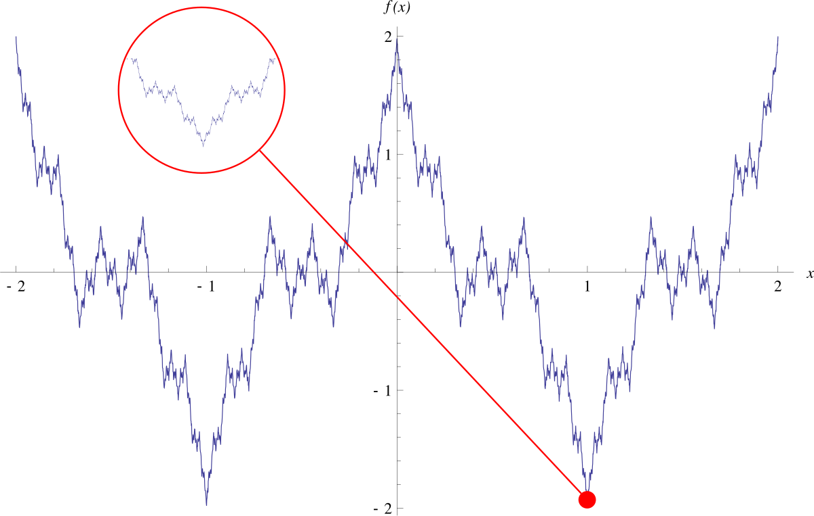

#### **1. Theory**
##### **1.1 Introduction: Tangent Lines**

When we look at the graph of a function, we often want to understand how it behaves at a specific point. One of the most important tools for this is the **tangent line** - a line that just "touches" the curve at a single point and has the same direction as the curve at that point.

###### **1.1.1 The Slope of a Curve**

Unlike a straight line which has a constant slope, a curved function has a slope that changes from point to point. To find the **slope of a curve** at a specific point $P(x_0, f(x_0))$, we use a limiting process:

1. Take a nearby point $Q(x_0 + h, f(x_0 + h))$ on the curve
2. Draw the **secant line** connecting $P$ and $Q$
3. Calculate the slope of this secant line: $\frac{f(x_0+h) - f(x_0)}{h}$
4. Let point $Q$ approach point $P$ (i.e., let $h \to 0$)
5. The limiting value of these slopes is the slope of the tangent line

This gives us the formula:

$$m = \lim_{h \to 0} \frac{f(x_0 + h) - f(x_0)}{h}$$

<!-- DIAGRAM HERE -->

The expression $\frac{f(x_0+h)-f(x_0)}{h}$ (where $h \neq 0$) is called the **difference quotient** of $f$ at $x_0$ with **increment** $h$. It represents the average rate of change of the function over the interval from $x_0$ to $x_0 + h$.

**Example:** For the function $f(x) = \frac{1}{x}$, the slope at any point $x = a \neq 0$ is:

$$m = \lim_{h \to 0} \frac{\frac{1}{a+h} - \frac{1}{a}}{h} = \lim_{h \to 0} \frac{a - (a+h)}{h \cdot a(a+h)} = \lim_{h \to 0} \frac{-h}{h \cdot a(a+h)} = -\frac{1}{a^2}$$

This slope is always negative for $a \neq 0$, becoming steeper (approaching $-\infty$) as $a$ approaches 0, and becoming flatter (approaching 0) as $a$ moves away from 0.

###### **1.1.2 Vertical Tangent Lines**

Sometimes a curve can have a **vertical tangent line** at a point. This occurs when the limit of the difference quotient exists but equals $\pm\infty$. 

**Example:** The function $f(x) = \sqrt[3]{x} = x^{1/3}$ has a vertical tangent line at $x = 0$ because:

$$\lim_{h \to 0} \frac{f(0+h) - f(0)}{h} = \lim_{h \to 0} \frac{h^{1/3}}{h} = \lim_{h \to 0} \frac{1}{h^{2/3}} = \infty$$

<!-- DIAGRAM HERE -->

However, not all functions with vertical-looking behavior at a point have vertical tangent lines. The function $f(x) = \sqrt[3]{x^2} = x^{2/3}$ does *not* have a vertical tangent at $x = 0$ because the limit from the left is $-\infty$ and from the right is $+\infty$ - they don't match, so the limit doesn't exist.

<!-- DIAGRAM HERE -->

##### **1.2 The Derivative at a Point**

The concept of the slope of a tangent line leads us to one of the most fundamental ideas in calculus: the **derivative**.

###### **1.2.1 Definition of the Derivative at a Point**

Let $f$ be a function defined on an interval $I$ containing a point $x_0$. The **derivative of $f$ at $x_0$**, denoted $f'(x_0)$, is:

$$f'(x_0) = \lim_{h \to 0} \frac{f(x_0+h) - f(x_0)}{h}$$

provided this limit exists and is finite.

**Alternative notations** for the derivative at $x_0$ include:

- $f'(x_0)$
- $\frac{df}{dx}\bigg|_{x=x_0}$
- $\frac{d}{dx}f(x)\bigg|_{x=x_0}$

We can also write this definition using a different variable substitution. If we set $h = x - x_0$, then as $h \to 0$, we have $x \to x_0$, giving:

$$f'(x_0) = \lim_{x \to x_0} \frac{f(x) - f(x_0)}{x - x_0}$$

The derivative $f'(x_0)$ is also called **the rate of change of $f(x)$ with respect to $x$ at $x = x_0$**. This interpretation is crucial in applications - it tells us how fast the function is changing at that particular point.

##### **1.3 The Derivative as a Function**

Instead of finding the derivative at just one specific point, we can find the derivative at *every* point where it exists, creating a new function called the **derivative function**.

###### **1.3.1 Definition of the Derivative Function**

The **derivative of $f$ with respect to $x$** is the function $f'$ whose value at $x$ is:

$$f'(x) = \lim_{h \to 0} \frac{f(x+h) - f(x)}{h} = \lim_{z \to x} \frac{f(z) - f(x)}{z - x}$$

provided the limit exists.

The **domain of $f'$** consists of all points in the domain of $f$ where this limit exists. This domain may be smaller than the domain of $f$ itself.

If $f'$ exists at a particular point $x$, we say that $f$ is **differentiable at $x$**. If $f'$ exists at every point in its domain, we call $f$ **differentiable**.

**Examples of computing derivatives from the definition:**

1. For $f(x) = ax$ (where $a$ is a constant):
   $$f'(x) = \lim_{h \to 0} \frac{a(x+h) - ax}{h} = \lim_{h \to 0} \frac{ah}{h} = a$$
2. For $f(x) = \frac{x}{1+x^2}$:
   $$f'(x) = \lim_{z \to x} \frac{\frac{z}{1+z^2} - \frac{x}{1+x^2}}{z - x} = \lim_{z \to x} \frac{z(1+x^2) - x(1+z^2)}{(z - x)(1 + z^2)(1 + x^2)}$$
   $$= \lim_{z \to x} \frac{z - x + xz(x - z)}{(z - x)(1 + z^2)(1 + x^2)} = \lim_{z \to x} \frac{1 - xz}{(1 + z^2)(1 + x^2)} = \frac{1 - x^2}{(1 + x^2)^2}$$
3. For $f(x) = \sqrt{x}$ on $(0, \infty)$:
   $$f'(x) = \lim_{z \to x} \frac{\sqrt{z} - \sqrt{x}}{z - x} = \lim_{z \to x} \frac{\sqrt{z} - \sqrt{x}}{(\sqrt{z} - \sqrt{x})(\sqrt{z} + \sqrt{x})} = \lim_{z \to x} \frac{1}{\sqrt{z} + \sqrt{x}} = \frac{1}{2\sqrt{x}}$$

###### **1.3.2 One-Sided Derivatives and Differentiability on Intervals**

A function can have different behaviors when approached from the left versus the right at a point. This leads to the concept of **one-sided derivatives**.

For a function $f$ on a closed interval $[a, b]$:

- The **right-hand derivative at $a$** is: $\lim_{h \to 0^+} \frac{f(a+h) - f(a)}{h}$
- The **left-hand derivative at $b$** is: $\lim_{h \to 0^-} \frac{f(b+h) - f(b)}{h}$

A function $f$ is:

- **Differentiable on an open interval** if it has a derivative at each point of the interval
- **Differentiable on a closed interval $[a,b]$** if it is differentiable on $(a,b)$ and the right-hand derivative exists at $a$ and the left-hand derivative exists at $b$

**Important:** A function has a derivative at an interior point *if and only if* both the left-hand and right-hand derivatives exist there and are equal.

**Example:** The function $f(x) = |x|$ has no derivative at $x = 0$ because:

- Right-hand derivative: $\lim_{h \to 0^+} \frac{|h|}{h} = \lim_{h \to 0^+} \frac{h}{h} = 1$
- Left-hand derivative: $\lim_{h \to 0^-} \frac{|h|}{h} = \lim_{h \to 0^-} \frac{-h}{h} = -1$

Since these are different, $f'(0)$ doesn't exist. However, when $x > 0$, we have $\frac{d}{dx}|x| = \frac{d}{dx}x = 1$, and when $x < 0$, we have $\frac{d}{dx}|x| = \frac{d}{dx}(-x) = -1$.

<!-- DIAGRAM HERE -->

##### **1.4 Differentiability and Continuity**

There's an important relationship between differentiability and continuity: **differentiable functions are always continuous**, but continuous functions are not always differentiable.

###### **1.4.1 Theorem: Differentiability Implies Continuity**

**Theorem:** If $f$ has a derivative at $x_0$, then $f$ is continuous at $x_0$.

**Proof:** We need to show that $\lim_{h \to 0} f(x_0 + h) = f(x_0)$. For $h \neq 0$, we can write:

$$f(x_0 + h) = f(x_0) + \frac{f(x_0 + h) - f(x_0)}{h} \cdot h$$

Taking limits as $h \to 0$:

$$\lim_{h \to 0} f(x_0 + h) = \lim_{h \to 0} f(x_0) + \lim_{h \to 0} \frac{f(x_0 + h) - f(x_0)}{h} \cdot \lim_{h \to 0} h = f(x_0) + f'(x_0) \cdot 0 = f(x_0)$$

This proves continuity at $x_0$.

**Important:** The converse is *not* true. The function $f(x) = |x|$ is continuous at $x = 0$ but not differentiable there (as shown earlier).

###### **1.4.2 Nowhere Differentiable Functions**

It's possible for a function to be continuous everywhere but differentiable nowhere! A famous example is the **Weierstrass function**:

$$f(x) = W_{p,a,b}(x) = \sum_{n=0}^{\infty} a^n \cos^p(2\pi b^n x)$$

where $p \in \mathbb{N}$, $0 < a < 1$, and $ab \ge 1$. This function is continuous everywhere but has no derivative at any point - its graph is so jagged and irregular that it has no tangent line anywhere!

{fig-align="center" width=50%}

##### **1.5 Differentiation Rules**

Computing derivatives using the definition (the limit process) can be tedious. Fortunately, we have **differentiation rules** that allow us to find derivatives quickly and efficiently.

###### **1.5.1 Basic Rules**

**Constant Multiple Rule:** If $u(x)$ is differentiable and $c$ is a constant, then:

$$(cu)' = cu'$$

**Proof:** By definition, $\frac{d}{dx}(cu) = \lim_{h \to 0} \frac{cu(x+h) - cu(x)}{h} = c \lim_{h \to 0} \frac{u(x+h) - u(x)}{h} = c \frac{du}{dx}$.

**Sum Rule:** If $u(x)$ and $v(x)$ are both differentiable, then:

$$(u + v)' = u' + v'$$

**Proof:** By definition:
$$\frac{d}{dx}[u(x) + v(x)] = \lim_{h \to 0} \frac{[u(x+h) + v(x+h)] - [u(x) + v(x)]}{h}$$
$$= \lim_{h \to 0} \left[ \frac{u(x+h) - u(x)}{h} + \frac{v(x+h) - v(x)}{h} \right] = \frac{du}{dx} + \frac{dv}{dx}$$

**Difference Rule:** Combining the Sum Rule with the Constant Multiple Rule gives:

$$(u - v)' = u' - v'$$

These rules extend to sums of more than two functions by mathematical induction.

###### **1.5.2 Product and Quotient Rules**

**Product Rule:** If $u$ and $v$ are differentiable at $x$, then:

$$(uv)' = u'v + uv'$$

**Proof:** Starting from the definition:
$$\frac{d}{dx}(uv) = \lim_{h \to 0} \frac{u(x+h)v(x+h) - u(x)v(x)}{h}$$

We add and subtract $u(x+h)v(x)$ in the numerator:
$$= \lim_{h \to 0} \frac{u(x+h)v(x+h) - u(x+h)v(x) + u(x+h)v(x) - u(x)v(x)}{h}$$
$$= \lim_{h \to 0} \left[ u(x+h) \frac{v(x+h) - v(x)}{h} + \frac{u(x+h) - u(x)}{h} v(x) \right]$$

Since $u$ is differentiable at $x$, it's continuous there, so $\lim_{h \to 0} u(x+h) = u(x)$. Therefore:
$$= u(x) \cdot v'(x) + u'(x) \cdot v(x)$$

**Quotient Rule:** If $u$ and $v$ are differentiable at $x$ and $v(x) \neq 0$, then:

$$\left( \frac{u}{v} \right)' = \frac{u'v - uv'}{v^2}$$

**Proof:** By definition:
$$\frac{d}{dx} \left( \frac{u}{v} \right) = \lim_{h \to 0} \frac{\frac{u(x+h)}{v(x+h)} - \frac{u(x)}{v(x)}}{h} = \lim_{h \to 0} \frac{v(x)u(x+h) - u(x)v(x+h)}{h v(x+h)v(x)}$$

Adding and subtracting $v(x)u(x)$ in the numerator:
$$= \lim_{h \to 0} \frac{v(x)[u(x+h)-u(x)] - u(x)[v(x+h)-v(x)]}{h v(x+h)v(x)}$$
$$= \lim_{h \to 0} \frac{v(x)\frac{u(x+h)-u(x)}{h} - u(x)\frac{v(x+h)-v(x)}{h}}{v(x+h)v(x)} = \frac{v u' - u v'}{v^2}$$

##### **1.6 Derivatives of Elementary Functions**

Using the definition of the derivative and the rules above, we can derive formulas for all elementary functions.

###### **1.6.1 Constant and Power Functions**

**Derivative of a Constant:** If $f(x) = c$ (constant), then:

$$\frac{d}{dx} c = 0$$

**Power Rule:** For any real number $n$:

$$\frac{d}{dx} x^n = nx^{n-1}$$

**Proof for positive integers:** We use the algebraic identity:
$$z^n - x^n = (z - x)(z^{n-1} + z^{n-2}x + \dots + zx^{n-2} + x^{n-1})$$

From the definition:
$$f'(x) = \lim_{z \to x} \frac{z^n - x^n}{z - x} = \lim_{z \to x} (z^{n-1} + z^{n-2}x + \dots + zx^{n-2} + x^{n-1}) = nx^{n-1}$$

(There are $n$ terms, each approaching $x^{n-1}$ as $z \to x$.)

The proof for general real $n$ requires the exponential function derivative, which we'll see next.

###### **1.6.2 Exponential Functions**

**Derivative of Exponential Functions:** For $a > 0$:

$$\frac{d}{dx}(a^x) = a^x \ln a$$

**Proof:** We use the important limit $\lim_{x \to 0} \frac{a^x - 1}{x} = \ln a$. From the definition:
$$\frac{d}{dx}(a^x) = \lim_{h \to 0} \frac{a^{x+h} - a^x}{h} = \lim_{h \to 0} \frac{a^x a^h - a^x}{h} = a^x \lim_{h \to 0} \frac{a^h - 1}{h} = a^x \ln a$$

**Special case:** For the natural exponential function:

$$\frac{d}{dx}(e^x) = e^x$$

This is one of the most remarkable properties of $e$ - the exponential function is its own derivative!

###### **1.6.3 Trigonometric Functions**

**Derivative of Sine:** Using the angle addition formula and important limits $\lim_{h \to 0} \frac{\sin h}{h} = 1$ and $\lim_{h \to 0} \frac{\cos h - 1}{h} = 0$:

$$\frac{d}{dx}(\sin x) = \lim_{h \to 0} \frac{\sin(x+h) - \sin x}{h} = \lim_{h \to 0} \frac{\sin x \cos h + \cos x \sin h - \sin x}{h}$$
$$= \lim_{h \to 0} \left( \sin x \cdot \frac{\cos h - 1}{h} + \cos x \cdot \frac{\sin h}{h} \right) = \sin x \cdot 0 + \cos x \cdot 1 = \cos x$$

**Derivative of Cosine:** Similarly:

$$\frac{d}{dx}(\cos x) = -\sin x$$

**Other Trigonometric Functions:** Using the Quotient Rule:

- $\frac{d}{dx}(\tan x) = \sec^2 x = \frac{1}{\cos^2 x}$
- $\frac{d}{dx}(\cot x) = -\csc^2 x = -\frac{1}{\sin^2 x}$
- $\frac{d}{dx}(\sec x) = \sec x \tan x$
- $\frac{d}{dx}(\csc x) = -\csc x \cot x$

##### **1.7 The Chain Rule**

When we have a **composite function** (a function inside another function), we need a special rule to find its derivative.

###### **1.7.1 The Chain Rule Theorem**

**Theorem (The Chain Rule):** If $g$ is differentiable at $x$ and $f$ is differentiable at $g(x)$, then the composite function $f \circ g$ defined by $(f \circ g)(x) = f(g(x))$ is differentiable at $x$, and:

$$(f \circ g)'(x) = f'(g(x)) \cdot g'(x)$$

In other words: the derivative of the outer function (evaluated at the inner function) times the derivative of the inner function.

**Alternative notation:** If we set $u = g(x)$, then:

$$\frac{d}{dx}[f(g(x))] = \frac{d}{dx}[f(u)] = f'(u) \cdot u'$$

<!-- DIAGRAM HERE -->

The Chain Rule tells us that the **rate of change at $x$** for the composite function equals the rate of change of $f$ at $g(x)$ multiplied by the rate of change of $g$ at $x$.

###### **1.7.2 Chain Rule for Elementary Functions**

Applying the Chain Rule to our elementary functions (where $u = u(x)$ is a differentiable function):

- $(u^n)' = nu^{n-1}u'$ (Power Rule with Chain Rule)
- $(e^u)' = e^u u'$
- $(a^u)' = a^u u' \ln a$ for $a > 0$
- $(\sin u)' = u' \cos u$
- $(\cos u)' = -u' \sin u$
- $(\tan u)' = \frac{u'}{\cos^2 u}$
- $(\cot u)' = -\frac{u'}{\sin^2 u}$

**Examples:**

1. $f(x) = (2x+1)^5 \implies f'(x) = 5(2x+1)^4 \cdot 2 = 10(2x+1)^4$
2. $f(x) = x\sqrt{x^2+1}e^{5-7x} \implies f'(x) = \sqrt{x^2+1}e^{5-7x} + x \cdot \frac{x}{\sqrt{x^2+1}}e^{5-7x} + x\sqrt{x^2+1} \cdot (-7)e^{5-7x}$
   $$= \frac{x^2}{\sqrt{x^2+1}}e^{5-7x} + \sqrt{x^2+1}e^{5-7x} - 7x\sqrt{x^2+1}e^{5-7x}$$
3. $f(x) = -5 \sin \left(\frac{3\pi}{2}x\right) + 3 \cos \left(\frac{3\pi}{2}x\right) \implies f'(x) = -\frac{15\pi}{2} \cos \left(\frac{3\pi}{2}x\right) - \frac{9\pi}{2} \sin \left(\frac{3\pi}{2}x\right)$

##### **1.8 Derivatives of Inverse Functions**

When a function has an inverse, there's a beautiful relationship between their derivatives.

###### **1.8.1 The Inverse Function Rule**

**Theorem:** Let $f$ be a one-to-one function on an interval $I$. If $f'(x)$ exists and $f'(x) \neq 0$ for all $x \in I$, then $f^{-1}$ is differentiable at every point in its domain (the range of $f$).

Moreover, if $b = f(a)$ and $a = f^{-1}(b)$, then:

$$(f^{-1})'(b) = \frac{1}{f'(a)} = \frac{1}{f'(f^{-1}(b))}$$

**Proof sketch:** From $f(f^{-1}(x)) = x$, differentiating both sides using the Chain Rule:

$$f'(f^{-1}(x)) \cdot (f^{-1})'(x) = 1$$

Therefore:

$$(f^{-1})'(x) = \frac{1}{f'(f^{-1}(x))}$$

**Example:** Let $f(x) = x^3 - 2$ for $x > 0$, and $a = 6 = f(2)$. We can find $(f^{-1})'(6)$ without finding a formula for $f^{-1}$:

$$(f^{-1})'(6) = \frac{1}{f'(f^{-1}(6))} = \frac{1}{f'(2)} = \frac{1}{3 \cdot 2^2} = \frac{1}{12}$$

###### **1.8.2 Derivative of the Natural Logarithm**

Since $f(x) = e^x$ has derivative $f'(x) = e^x$, its inverse $f^{-1}(x) = \ln x$ has derivative:

$$(\ln x)' = \frac{1}{f'(f^{-1}(x))} = \frac{1}{e^{\ln x}} = \frac{1}{x}$$

Therefore:

$$\frac{d}{dx} \ln x = \frac{1}{x} \quad \text{for } x > 0$$

By the Chain Rule, for a positive differentiable function $u(x)$:

$$\frac{d}{dx} \ln(u(x)) = \frac{u'(x)}{u(x)}$$

**Examples:**

1. $\frac{d}{dx} \ln(2x^5 + 3x - 2) = \frac{10x^4 + 3}{2x^5 + 3x - 2}$
2. $\frac{d}{dx} [\ln(2 \sin x + 4)]^5 = 5 [\ln(2 \sin x + 4)]^4 \cdot \frac{2 \cos x}{2 \sin x + 4}$

###### **1.8.3 Derivatives of Inverse Trigonometric Functions**

**Derivative of $\arcsin x$:** Since $y = \arcsin x$ is the inverse of $x = \sin y$ for $-\pi/2 < y < \pi/2$:

$$(\arcsin x)' = \frac{1}{\cos(\arcsin x)} = \frac{1}{\sqrt{1 - \sin^2(\arcsin x)}} = \frac{1}{\sqrt{1 - x^2}}$$

Therefore:

$$\frac{d}{dx}(\arcsin x) = \frac{1}{\sqrt{1 - x^2}} \quad \text{for } |x| < 1$$

With Chain Rule: $\frac{d}{dx}(\arcsin u) = \frac{u'}{\sqrt{1 - u^2}}$ for $|u| < 1$.

**Derivative of $\arccos x$:** Since $\arccos x = \frac{\pi}{2} - \arcsin x$:

$$\frac{d}{dx}(\arccos x) = -\frac{1}{\sqrt{1 - x^2}} \quad \text{for } |x| < 1$$

**Derivative of $\arctan x$:** Since $(\tan x)' = \sec^2 x = 1 + \tan^2 x$:

$$(\arctan x)' = \frac{1}{\sec^2(\arctan x)} = \frac{1}{1 + \tan^2(\arctan x)} = \frac{1}{1 + x^2}$$

Therefore:

$$\frac{d}{dx}(\arctan x) = \frac{1}{1 + x^2} \quad \text{for all } x \in \mathbb{R}$$

**Other inverse trigonometric functions:**

- $\frac{d}{dx}(\text{arccot } x) = -\frac{1}{1 + x^2}$
- $\frac{d}{dx}(\text{arcsec } x) = \frac{1}{|x|\sqrt{x^2 - 1}}$ for $|x| > 1$
- $\frac{d}{dx}(\text{arccsc } x) = -\frac{1}{|x|\sqrt{x^2 - 1}}$ for $|x| > 1$

##### **1.9 Logarithmic Differentiation**

For functions involving products, quotients, and powers, taking the logarithm before differentiating can greatly simplify the calculation. This technique is called **logarithmic differentiation**.

**Example:** To find the derivative of $f(x) = \sqrt[3]{\frac{x(x+1)(x-2)}{(x^2+1)(2x+3)}}$ for $x > 2$:

1. Take the natural logarithm of both sides:
   $$\ln(f(x)) = \frac{1}{3}[\ln x + \ln(x+1) + \ln(x-2) - \ln(x^2+1) - \ln(2x+3)]$$
2. Differentiate both sides (using $\frac{d}{dx}\ln(f(x)) = \frac{f'(x)}{f(x)}$):
   $$\frac{f'(x)}{f(x)} = \frac{1}{3}\left[\frac{1}{x} + \frac{1}{x+1} + \frac{1}{x-2} - \frac{2x}{x^2+1} - \frac{2}{2x+3}\right]$$
3. Solve for $f'(x)$:
   $$f'(x) = \frac{f(x)}{3}\left[\frac{1}{x} + \frac{1}{x+1} + \frac{1}{x-2} - \frac{2x}{x^2+1} - \frac{2}{2x+3}\right]$$

###### **1.9.1 Derivatives of the Form $u(x)^{v(x)}$**

For functions where both the base and exponent depend on $x$, we write $f(x) = u(x)^{v(x)} = e^{v(x) \ln(u(x))}$ and then differentiate:

**Examples:**

1. For $f(x) = x^x$ (where $x > 0$): $f(x) = e^{x \ln x}$, so:
   $$f'(x) = (x \ln x)' \cdot e^{x \ln x} = (1 + \ln x) \cdot x^x$$
2. For $f(x) = x^{\ln x}$: $f(x) = e^{(\ln x)^2}$, so:
   $$f'(x) = 2\frac{\ln x}{x} \cdot e^{(\ln x)^2} = \frac{2\ln x}{x} \cdot x^{\ln x}$$
3. For $f(x) = (\sin x)^{\cos x}$: $f(x) = e^{\cos x \cdot \ln(\sin x)}$, so:
   $$f'(x) = \left(-\sin x \cdot \ln(\sin x) + \cos x \cdot \frac{\cos x}{\sin x}\right) \cdot (\sin x)^{\cos x}$$

##### **1.10 Higher-Order Derivatives**

If the derivative $f'$ of a function $f$ is itself differentiable, we can take its derivative to get the **second derivative** $f''$, and continue this process to get higher-order derivatives.

###### **1.10.1 Notation for Higher-Order Derivatives**

The **$n$-th derivative** of $f$ is denoted in several ways:

$$f^{(n)}(x) = \frac{d^n f}{dx^n} = \frac{d}{dx}[f^{(n-1)}(x)]$$

For the first few derivatives:

- First derivative: $f'(x) = \frac{df}{dx} = \frac{dy}{dx}$
- Second derivative: $f''(x) = \frac{d^2f}{dx^2} = \frac{d}{dx}\left(\frac{df}{dx}\right)$
- Third derivative: $f'''(x) = \frac{d^3f}{dx^3}$
- Fourth derivative: $f^{(4)}(x) = \frac{d^4f}{dx^4}$

###### **1.10.2 Leibniz Formula for the $n$-th Derivative of a Product**

There's a formula analogous to the binomial theorem for the $n$-th derivative of a product:

$$(fg)^{(n)} = \sum_{k=0}^n \binom{n}{k} f^{(n-k)} g^{(k)}$$

where $\binom{n}{k} = \frac{n!}{k!(n-k)!}$ is the binomial coefficient.

###### **1.10.3 Examples of Higher-Order Derivatives**

**Example 1:** For $f(x) = \ln x$:

- $f'(x) = \frac{1}{x}$
- $f''(x) = -\frac{1}{x^2}$
- $f'''(x) = \frac{2}{x^3}$
- $f^{(4)}(x) = -\frac{6}{x^4}$
- $f^{(5)}(x) = \frac{24}{x^5}$

We can see a pattern and prove by induction that:

$$f^{(n)}(x) = \frac{(-1)^{n-1}(n-1)!}{x^n} \quad \text{for all } n \ge 1$$

**Example 2:** For $f(x) = \sin x$:

- $f'(x) = \cos x$
- $f''(x) = -\sin x$
- $f'''(x) = -\cos x$
- $f^{(4)}(x) = \sin x$

The pattern repeats with period 4. By induction, we can prove:

$$(\sin x)^{(n)} = \sin\left(x + \frac{n\pi}{2}\right) \quad \text{for all } n \ge 1$$

Similarly, $(\cos x)^{(n)} = \cos\left(x + \frac{n\pi}{2}\right)$.

**Other useful formulas:**

- $(x \ln x)^{(n)} = \frac{(-1)^n(n-2)!}{x^{n-1}}$ for $n \ge 1$
- $\left(\frac{1}{x}\right)^{(n)} = \frac{(-1)^n n!}{x^{n+1}}$ for $n \ge 1$

##### **1.11 Indeterminate Forms and L'Hôpital's Rule**

When evaluating limits, we often encounter expressions that don't have an obvious value. These are called **indeterminate forms**.

###### **1.11.1 Indeterminate Forms**

The common indeterminate forms are:

$$\frac{0}{0}, \quad \frac{\infty}{\infty}, \quad 0 \cdot \infty, \quad \infty - \infty, \quad 1^\infty, \quad 0^0, \quad \infty^0$$

Each requires special techniques to evaluate. The most powerful technique is **L'Hôpital's Rule**.

###### **1.11.2 L'Hôpital's Rule**

**Theorem (L'Hôpital's Rule):** Suppose $f$ and $g$ are differentiable on an open interval $I$ containing $a$ (except possibly at $a$), and $g'(x) \neq 0$ on $I$ (except possibly at $a$). If:

$$\lim_{x \to a} f(x) = 0 \quad \text{and} \quad \lim_{x \to a} g(x) = 0$$

or

$$\lim_{x \to a} f(x) = \pm \infty \quad \text{and} \quad \lim_{x \to a} g(x) = \pm \infty$$

Then:

$$\lim_{x \to a} \frac{f(x)}{g(x)} = \lim_{x \to a} \frac{f'(x)}{g'(x)}$$

provided the limit on the right side exists (or is $\pm\infty$).

**Important notes:**

1. L'Hôpital's Rule says: differentiate the numerator and denominator *separately*, then take the limit
2. The rule applies to one-sided limits and limits at infinity (replace $x \to a$ with $x \to a^+$, $x \to a^-$, $x \to \infty$, or $x \to -\infty$)
3. **Only use when you have an indeterminate form!** For example, $\lim_{x \to 0} \frac{\sin x}{1+2x} = 0$ (not indeterminate), so L'Hôpital's Rule doesn't apply

**Why it works (special case):** When $f(a) = g(a) = 0$ and both derivatives are continuous at $a$ with $g'(a) \neq 0$:

$$\lim_{x \to a} \frac{f(x)}{g(x)} = \lim_{x \to a} \frac{f(x)-f(a)}{g(x)-g(a)} = \lim_{x \to a} \frac{\frac{f(x)-f(a)}{x-a}}{\frac{g(x)-g(a)}{x-a}} = \frac{f'(a)}{g'(a)} = \lim_{x \to a} \frac{f'(x)}{g'(x)}$$

###### **1.11.3 Examples Using L'Hôpital's Rule**

**Type $\frac{0}{0}$ examples:**

1. $\lim_{x \to \pi/4} \frac{\tan x - 1}{x - \pi/4} \stackrel{\frac{0}{0}}{=} \lim_{x \to \pi/4} \frac{\sec^2 x}{1} = \sec^2(\pi/4) = 2$
2. $\lim_{x \to 0} \frac{x \sin x}{2 - 2 \cos x} \stackrel{\frac{0}{0}}{=} \lim_{x \to 0} \frac{\sin x + x \cos x}{2 \sin x} \stackrel{\frac{0}{0}}{=} \lim_{x \to 0} \frac{2 \cos x - x \sin x}{2 \cos x} = \frac{2}{2} = 1$

**Type $\frac{\infty}{\infty}$ example:**

$$\lim_{x \to \infty} \frac{\ln x}{\sqrt{x}} \stackrel{\frac{\infty}{\infty}}{=} \lim_{x \to \infty} \frac{1/x}{1/(2\sqrt{x})} = \lim_{x \to \infty} \frac{2\sqrt{x}}{x} = \lim_{x \to \infty} \frac{2}{\sqrt{x}} = 0$$

**Type $0 \cdot \infty$ (convert to $\frac{0}{0}$ or $\frac{\infty}{\infty}$):**

$$\lim_{x \to 0^+} x \ln x \stackrel{0 \cdot (-\infty)}{=} \lim_{x \to 0^+} \frac{\ln x}{1/x} \stackrel{\frac{-\infty}{\infty}}{=} \lim_{x \to 0^+} \frac{1/x}{-1/x^2} = \lim_{x \to 0^+} (-x) = 0$$

**Type $\infty - \infty$ (combine into a single fraction):**

$$\lim_{x \to 1^+} \left(\frac{1}{\ln x} - \frac{1}{x-1}\right) \stackrel{\infty - \infty}{=} \lim_{x \to 1^+} \frac{x - 1 - \ln x}{(x-1) \ln x} \stackrel{\frac{0}{0}}{=} \lim_{x \to 1^+} \frac{1 - 1/x}{\ln x + (x-1)/x}$$
$$= \lim_{x \to 1^+} \frac{(x-1)/x}{x-1 + x \ln x} \stackrel{\frac{0}{0}}{=} \lim_{x \to 1^+} \frac{1/x}{2 + \ln x} = \frac{1}{2}$$

###### **1.11.4 Indeterminate Powers: $1^\infty$, $0^0$, $\infty^0$**

For limits of the form $\lim_{x \to a} [f(x)]^{g(x)}$ where we get an indeterminate power, we either:

1. Take the logarithm: $y = [f(x)]^{g(x)} \implies \ln y = g(x) \ln(f(x))$, then find $\lim \ln y$
2. Rewrite as an exponential: $[f(x)]^{g(x)} = e^{g(x) \ln(f(x))}$

Both lead to evaluating the indeterminate product $g(x) \ln(f(x))$ (type $0 \cdot \infty$ or $\infty \cdot 0$).

**Example 1:** $\lim_{x \to 0} (1 + x)^{1/x}$ (type $1^\infty$)

Let $f(x) = (1 + x)^{1/x}$, then $\ln(f(x)) = \frac{\ln(1+x)}{x}$.

$$\lim_{x \to 0} \ln(f(x)) = \lim_{x \to 0} \frac{\ln(1+x)}{x} \stackrel{\frac{0}{0}}{=} \lim_{x \to 0} \frac{1/(1+x)}{1} = 1$$

Therefore: $\lim_{x \to 0} f(x) = e^1 = e$.

**Example 2:** $\lim_{x \to 0^+} x^x$ (type $0^0$)

We write $x^x = e^{x \ln x}$. We know $\lim_{x \to 0^+} x \ln x = 0$ (from earlier example), so:

$$\lim_{x \to 0^+} x^x = e^0 = 1$$

###### **1.11.5 When L'Hôpital's Rule Doesn't Help**

Sometimes L'Hôpital's Rule leads to an infinite loop or more complicated expressions. In such cases, use algebraic manipulation instead.

**Example 1:** 

$$\lim_{x \to \infty} \frac{\sqrt{9x+1}}{\sqrt{x+1}}$$

L'Hôpital's Rule keeps cycling. Instead, divide numerator and denominator by $\sqrt{x}$:

$$\lim_{x \to \infty} \frac{\sqrt{9x+1}}{\sqrt{x+1}} = \lim_{x \to \infty} \sqrt{\frac{9x+1}{x+1}} = \lim_{x \to \infty} \sqrt{\frac{9 + 1/x}{1 + 1/x}} = \sqrt{\frac{9}{1}} = 3$$

**Example 2:**

$$\lim_{x \to -\infty} \frac{2^x + 4^x}{5^x - 2^x}$$

L'Hôpital's Rule keeps producing similar forms. Instead, divide by the dominant term $5^x$:

$$\lim_{x \to -\infty} \frac{2^x + 4^x}{5^x - 2^x} = \lim_{x \to -\infty} \frac{(2/5)^x + (4/5)^x}{1 - (2/5)^x}$$

As $x \to -\infty$: $(2/5)^x \to +\infty$, $(4/5)^x \to +\infty$. Factor out $(4/5)^x$ from numerator:

$$= \lim_{x \to -\infty} \frac{(4/5)^x[(2/4)^x + 1]}{1 - (2/5)^x} = \lim_{x \to -\infty} \frac{(4/5)^x[(1/2)^x + 1]}{1 - (2/5)^x}$$

As $x \to -\infty$: $(1/2)^x \to +\infty$, $(4/5)^x \to +\infty$, $(2/5)^x \to +\infty$. The numerator grows like $(4/5)^x \cdot (1/2)^x = (2/5)^x$, so:

$$\lim_{x \to -\infty} \frac{(2/5)^x}{-(2/5)^x} = -1$$

##### **1.12 Taylor Series and Taylor's Theorem**

One of the most powerful ideas in calculus is representing functions as infinite series. This allows us to approximate complicated functions with polynomials and use them to calculate limits and analyze function behavior.

###### **1.12.1 Motivation: Approximating Functions with Polynomials**

Polynomials are the simplest functions to work with - they only involve addition and multiplication. Can we approximate more complicated functions (like $\sin x$, $e^x$, $\ln(1+x)$) using polynomials?

Consider approximating $\cos \theta$ near $\theta = 0$. In physics (e.g., simple pendulum), we often use:

$$\cos \theta \approx 1 - \frac{\theta^2}{2}$$

For example, $\cos(0.2) = 0.9800665778...$, and $1 - \frac{(0.2)^2}{2} = 0.98$ - very close!

Where does this approximation come from? It's the second-degree **Taylor polynomial** of $\cos \theta$ at $\theta = 0$.

###### **1.12.2 Power Series Representations**

A **power series** centered at $c$ has the form:

$$\sum_{n=0}^\infty a_n(x-c)^n = a_0 + a_1(x-c) + a_2(x-c)^2 + a_3(x-c)^3 + \cdots$$

**Theorem (Term-by-Term Differentiation):** If a power series $\sum_{n=0}^\infty a_n(x-c)^n$ has radius of convergence $R > 0$, then it defines a function:

$$f(x) = \sum_{n=0}^\infty a_n(x-c)^n$$

on the interval $(c - R, c + R)$. This function has derivatives of all orders, obtained by differentiating term by term:

$$f'(x) = \sum_{n=1}^\infty na_n(x-c)^{n-1}, \quad f''(x) = \sum_{n=2}^\infty n(n-1)a_n(x-c)^{n-2}$$

**Important consequence:** Within its interval of convergence, a power series sum is infinitely differentiable.

**Question:** If $f$ has derivatives of all orders on an interval $I$, can it be expressed as a power series? If so, what are the coefficients?

###### **1.12.3 Determining the Coefficients**

Suppose $f(x)$ equals a power series:

$$f(x) = \sum_{n=0}^\infty a_n(x-c)^n = a_0 + a_1(x-c) + a_2(x-c)^2 + \cdots$$

with positive radius of convergence. Differentiating term by term:

$$f'(x) = a_1 + 2a_2(x-c) + 3a_3(x-c)^2 + \cdots$$
$$f''(x) = 2a_2 + 2 \cdot 3 a_3(x-c) + 3 \cdot 4 a_4(x-c)^2 + \cdots$$
$$f'''(x) = 2 \cdot 3 a_3 + 2 \cdot 3 \cdot 4 a_4(x-c) + \cdots$$

In general, for the $n$-th derivative:

$$f^{(n)}(x) = n! a_n + \text{(terms with } (x-c) \text{ as a factor)}$$

Evaluating at $x = c$:

$$f(c) = a_0, \quad f'(c) = a_1, \quad f''(c) = 2! a_2, \quad f'''(c) = 3! a_3, \ldots, \quad f^{(n)}(c) = n! a_n$$

Therefore:

$$a_n = \frac{f^{(n)}(c)}{n!}$$

**Conclusion:** If $f$ has a power series representation near $c$, it must be:

$$f(x) = \sum_{n=0}^\infty \frac{f^{(n)}(c)}{n!} (x-c)^n$$

###### **1.12.4 Taylor Series and Maclaurin Series**

**Definition:** Let $f$ have derivatives of all orders in an interval containing $c$. The **Taylor series of $f$ centered at $c$** is:

$$\sum_{n=0}^\infty \frac{f^{(n)}(c)}{n!} (x-c)^n = f(c) + f'(c)(x-c) + \frac{f''(c)}{2!} (x-c)^2 + \cdots$$

When $c = 0$, this is called the **Maclaurin series of $f$**:

$$\sum_{n=0}^\infty \frac{f^{(n)}(0)}{n!} x^n = f(0) + f'(0)x + \frac{f''(0)}{2!} x^2 + \cdots$$

The **Taylor polynomial of order $n$** is:

$$T_n(x) = f(c) + f'(c)(x-c) + \frac{f''(c)}{2!} (x-c)^2 + \cdots + \frac{f^{(n)}(c)}{n!} (x-c)^n$$

**Example:** For $f(x) = \cos x$ at $c = 0$:

- $f(0) = 1$, $f'(0) = 0$, $f''(0) = -1$, $f'''(0) = 0$, $f^{(4)}(0) = 1$, ...
- General pattern: $f^{(2n)}(0) = (-1)^n$, $f^{(2n+1)}(0) = 0$

The Maclaurin series is:

$$\cos x = \sum_{n=0}^\infty \frac{(-1)^n}{(2n)!} x^{2n} = 1 - \frac{x^2}{2!} + \frac{x^4}{4!} - \frac{x^6}{6!} + \cdots$$

The Taylor polynomials are:

- $T_2(x) = 1 - \frac{x^2}{2}$
- $T_4(x) = 1 - \frac{x^2}{2} + \frac{x^4}{24}$
- $T_6(x) = 1 - \frac{x^2}{2} + \frac{x^4}{24} - \frac{x^6}{720}$

<!-- DIAGRAM HERE -->

###### **1.12.5 Taylor's Theorem and the Remainder**

**Important question:** When does the Taylor series actually equal the function? Not always!

**Taylor's Theorem:** If $f$ has derivatives of all orders on an open interval $I$ containing $c$, then for each positive integer $n$ and each $x \in I$:

$$f(x) = T_n(x) + R_n(x)$$

where $T_n(x)$ is the Taylor polynomial of order $n$ and the **remainder** is:

$$R_n(x) = \frac{f^{(n+1)}(\alpha)}{(n+1)!} (x-c)^{n+1}$$

for some $\alpha$ between $c$ and $x$.

**Convergence condition:** $f(x)$ equals its Taylor series if and only if:

$$\lim_{n \to \infty} R_n(x) = 0$$

In that case:

$$f(x) = \sum_{n=0}^\infty \frac{f^{(n)}(c)}{n!} (x-c)^n$$

**Example:** For $f(x) = e^x$ at $c = 0$:

Since $f^{(n)}(x) = e^x$ for all $n$, we have:

$$e^x = T_n(x) + R_n(x) = 1 + x + \frac{x^2}{2!} + \cdots + \frac{x^n}{n!} + \frac{e^\alpha}{(n+1)!} x^{n+1}$$

for some $\alpha$ between 0 and $x$.

- If $x \ge 0$: $0 < \alpha < x$, so $e^\alpha < e^x$ and $|R_n(x)| < e^x \frac{x^{n+1}}{(n+1)!}$
- If $x < 0$: $x < \alpha < 0$, so $e^\alpha < 1$ and $|R_n(x)| < \frac{|x|^{n+1}}{(n+1)!}$

In both cases, $\lim_{n \to \infty} \frac{|x|^{n+1}}{(n+1)!} = 0$ (factorials grow faster than exponentials), so $\lim_{n \to \infty} R_n(x) = 0$.

Therefore:

$$e^x = \sum_{n=0}^\infty \frac{x^n}{n!} = 1 + x + \frac{x^2}{2!} + \frac{x^3}{3!} + \cdots \quad \text{for all } x \in \mathbb{R}$$

Setting $x = 1$:

$$e = \sum_{n=0}^\infty \frac{1}{n!} = 1 + 1 + \frac{1}{2} + \frac{1}{6} + \frac{1}{24} + \cdots$$

###### **1.12.6 Frequently Used Taylor/Maclaurin Series**

Here are the most important series (all at $x = 0$):

**Exponential and Logarithmic:**

$$e^x = \sum_{n=0}^\infty \frac{x^n}{n!} = 1 + x + \frac{x^2}{2!} + \frac{x^3}{3!} + o(x^3) \quad (x \to 0)$$

$$\ln(1+x) = \sum_{n=1}^\infty (-1)^{n+1} \frac{x^n}{n} = x - \frac{x^2}{2} + \frac{x^3}{3} + o(x^3) \quad (x \to 0)$$

$$\ln(1-x) = -\sum_{n=1}^\infty \frac{x^n}{n} = -x - \frac{x^2}{2} - \frac{x^3}{3} + o(x^3) \quad (x \to 0)$$

**Trigonometric:**

$$\sin x = \sum_{n=0}^\infty (-1)^n \frac{x^{2n+1}}{(2n+1)!} = x - \frac{x^3}{3!} + \frac{x^5}{5!} + o(x^6) \quad (x \to 0)$$

$$\cos x = \sum_{n=0}^\infty (-1)^n \frac{x^{2n}}{(2n)!} = 1 - \frac{x^2}{2!} + \frac{x^4}{4!} + o(x^5) \quad (x \to 0)$$

$$\tan x = x + \frac{x^3}{3} + \frac{2x^5}{15} + o(x^6) \quad (x \to 0)$$

$$\cot x = \frac{1}{x} - \frac{x}{3} - \frac{x^3}{45} + o(x^4) \quad (x \to 0)$$

**Hyperbolic:**

$$\sinh x = \sum_{n=0}^\infty \frac{x^{2n+1}}{(2n+1)!} = x + \frac{x^3}{3!} + \frac{x^5}{5!} + o(x^6) \quad (x \to 0)$$

$$\cosh x = \sum_{n=0}^\infty \frac{x^{2n}}{(2n)!} = 1 + \frac{x^2}{2!} + \frac{x^4}{4!} + o(x^5) \quad (x \to 0)$$

$$\tanh x = x - \frac{x^3}{3} + \frac{2x^5}{15} + o(x^6) \quad (x \to 0)$$

$$\coth x = \frac{1}{x} + \frac{x}{3} - \frac{x^3}{45} + o(x^4) \quad (x \to 0)$$

**Inverse Trigonometric:**

$$\arctan x = \sum_{n=0}^\infty (-1)^n \frac{x^{2n+1}}{2n+1} = x - \frac{x^3}{3} + \frac{x^5}{5} + o(x^6) \quad (x \to 0)$$

$$\arcsin x = \sum_{n=0}^\infty \frac{(2n)!}{(2^n n!)^2(2n+1)} x^{2n+1} = x + \frac{x^3}{6} + \frac{3x^5}{40} + o(x^6) \quad (x \to 0)$$

$$\arccos x = \frac{\pi}{2} - \arcsin x = \frac{\pi}{2} - x - \frac{x^3}{6} - \frac{3x^5}{40} + o(x^6) \quad (x \to 0)$$

**Powers and Fractions:**

$$(1+x)^\alpha = 1 + \alpha x + \frac{\alpha(\alpha-1)}{2!}x^2 + \cdots = \sum_{k=0}^\infty \binom{\alpha}{k} x^k + o(x^n) \quad (x \to 0)$$

where $\binom{\alpha}{k} = \frac{\alpha(\alpha-1)\cdots(\alpha-k+1)}{k!}$ (generalized binomial coefficient).

$$\frac{1}{1-x} = 1 + x + x^2 + x^3 + x^4 + o(x^4) \quad (x \to 0)$$

$$\frac{1}{1+x} = 1 - x + x^2 - x^3 + x^4 + o(x^4) \quad (x \to 0)$$

$$\sqrt{1+x} = 1 + \frac{x}{2} - \frac{x^2}{8} + \frac{x^3}{16} + o(x^3) \quad (x \to 0)$$

$$\frac{1}{\sqrt{1+x}} = 1 - \frac{x}{2} + \frac{3x^2}{8} - \frac{5x^3}{16} + o(x^3) \quad (x \to 0)$$

###### **1.12.7 Using Taylor Series to Find Limits**

Taylor series are extremely useful for calculating limits, especially when L'Hôpital's Rule becomes complicated.

**Asymptotic notation:**

- $f(x) = O(g(x))$ as $x \to x_0$ means $\left|\frac{f(x)}{g(x)}\right|$ is bounded near $x_0$
- $f(x) = o(g(x))$ as $x \to x_0$ means $\lim_{x \to x_0} \frac{f(x)}{g(x)} = 0$
- $f(x) \sim g(x)$ as $x \to x_0$ means $\lim_{x \to x_0} \frac{f(x)}{g(x)} = 1$

**Example 1:** Calculate $\lim_{x \to 0} \frac{x \cos x - \arctan x}{\ln(1-x^3)}$.

Using Taylor series:

$$\ln(1-x^3) = -x^3 + o(x^3)$$
$$x \cos x = x\left(1 - \frac{x^2}{2} + o(x^2)\right) = x - \frac{x^3}{2} + o(x^3)$$
$$\arctan x = x - \frac{x^3}{3} + o(x^3)$$

Therefore:

$$x \cos x - \arctan x = x - \frac{x^3}{2} - x + \frac{x^3}{3} + o(x^3) = -\frac{x^3}{6} + o(x^3)$$

So:

$$\lim_{x \to 0} \frac{x \cos x - \arctan x}{\ln(1-x^3)} = \lim_{x \to 0} \frac{-x^3/6 + o(x^3)}{-x^3 + o(x^3)} = \frac{1}{6}$$

**Example 2:** Calculate $L = \lim_{x \to 0} (\cos(xe^x) - \ln(1-x) - x)^{\cot(x^3)}$ (type $1^\infty$).

First:

$$\cot(x^3) = \frac{1}{\tan(x^3)} = \frac{1}{x^3 + o(x^3)} = \frac{1}{x^3}(1 + o(1))$$

For the base:

$$xe^x = x(1 + x + \frac{x^2}{2} + o(x^2)) = x + x^2 + \frac{x^3}{2} + o(x^3)$$

$$\cos(xe^x) = 1 - \frac{(xe^x)^2}{2} + o(x^3) = 1 - \frac{x^2}{2} - x^3 + o(x^3)$$

$$\ln(1-x) = -x - \frac{x^2}{2} - \frac{x^3}{3} + o(x^3)$$

$$\cos(xe^x) - \ln(1-x) - x = 1 - \frac{x^2}{2} - x^3 + x + \frac{x^2}{2} + \frac{x^3}{3} - x + o(x^3) = 1 - \frac{2x^3}{3} + o(x^3)$$

Therefore:

$$L = \lim_{x \to 0} \left(1 - \frac{2x^3}{3} + o(x^3)\right)^{1/x^3} = e^{-2/3}$$

using the limit $\lim_{u \to 0} (1 + au)^{1/u} = e^a$.

##### **1.13 Applications: Extreme Values of Functions**

One of the most important applications of derivatives is finding the maximum and minimum values of functions - crucial in optimization problems across science, engineering, and economics.

###### **1.13.1 Types of Extreme Values**

**Definitions:** Let $f : D \to \mathbb{R}$ and $c \in D$. We say $f(c)$ is:

1. An **absolute (global) maximum** of $f$ on $D$ if $f(c) \ge f(x)$ for all $x \in D$
2. An **absolute (global) minimum** of $f$ on $D$ if $f(c) \le f(x)$ for all $x \in D$
3. A **local (relative) maximum** of $f$ if $f(c) \ge f(x)$ for all $x$ in some open interval containing $c$
4. A **local (relative) minimum** of $f$ if $f(c) \le f(x)$ for all $x$ in some open interval containing $c$

<!-- DIAGRAM HERE -->

Absolute extrema are "global" - they're the highest/lowest values over the entire domain. Local extrema are "neighborhood" - they're highest/lowest in some small region around the point.

###### **1.13.2 The Extreme Value Theorem**

**Theorem (Extreme Value Theorem):** If $f$ is continuous on a closed interval $[a, b]$, then $f$ attains both an absolute maximum value and an absolute minimum value at some numbers in $[a, b]$.

This theorem is intuitively clear but requires deep knowledge of real numbers to prove rigorously.

**Important:** All three conditions are essential:

1. **Closed interval:** On $(-\infty, \infty)$, $e^x$ has no maximum
2. **Bounded interval:** On $[0, \infty)$, $f(x) = x$ has no maximum
3. **Continuity:** On $[0, 1]$, $f(x) = \begin{cases} x, & 0 \le x < 1 \\ 0, & x = 1 \end{cases}$ has no maximum

<!-- DIAGRAM HERE -->

###### **1.13.3 Fermat's Theorem**

**Theorem (Fermat's Theorem):** If $f$ has a local maximum or minimum at an interior point $c$ of its domain, and if $f'(c)$ exists, then $f'(c) = 0$.

**Proof:** Suppose $f$ has a local maximum at $c$, so $f(x) - f(c) \le 0$ for all $x$ near $c$.

From the right: $\lim_{x \to c^+} \frac{f(x) - f(c)}{x - c} \le 0$ (since numerator $\le 0$ and denominator $> 0$)

From the left: $\lim_{x \to c^-} \frac{f(x) - f(c)}{x - c} \ge 0$ (since numerator $\le 0$ and denominator $< 0$)

Since both limits must equal $f'(c)$, we have $f'(c) \le 0$ and $f'(c) \ge 0$, so $f'(c) = 0$.

**Important notes:**

1. The converse is false: $f(x) = x^3$ has $f'(0) = 0$ but no extremum at $x = 0$
2. Extrema can occur where $f'$ doesn't exist: $f(x) = |x|$ has a minimum at $x = 0$ where $f'(0)$ is undefined

###### **1.13.4 Critical Points**

**Definition:** An interior point of the domain of $f$ where $f' = 0$ or $f'$ is undefined is called a **critical point** of $f$.

**Key result:** If $f$ has a local extremum at $c$, then $c$ is either:

- A critical point, or
- An endpoint of the domain

This gives us a strategy for finding extreme values:

1. Find all critical points (where $f' = 0$ or $f'$ is undefined)
2. Evaluate $f$ at all critical points and endpoints
3. The largest value is the absolute maximum, the smallest is the absolute minimum

**Example:** For $f(x) = x^3 - 3x^2 + 1$ on $[-1/2, 4]$:

Critical points: $f'(x) = 3x^2 - 6x = 3x(x-2) = 0 \implies x = 0, 2$

Evaluate: $f(-1/2) = 1/8$, $f(0) = 1$, $f(2) = -3$, $f(4) = 17$

Absolute max: $f(4) = 17$; Absolute min: $f(2) = -3$

##### **1.14 The Mean Value Theorem**

The Mean Value Theorem is one of the most important theoretical tools in calculus, with far-reaching consequences.

###### **1.14.1 Rolle's Theorem**

**Theorem (Rolle's Theorem):** Suppose $f$ is continuous on $[a, b]$ and differentiable on $(a, b)$. If $f(a) = f(b)$, then there exists at least one $c \in (a, b)$ such that $f'(c) = 0$.

**Geometric interpretation:** If a differentiable curve starts and ends at the same height, there must be at least one point where the tangent is horizontal.

<!-- DIAGRAM HERE -->

**Proof:** By the Extreme Value Theorem, $f$ attains its maximum and minimum on $[a, b]$.

- If both occur at endpoints, then $f$ is constant (since $f(a) = f(b)$), so $f'(x) = 0$ everywhere
- If either occurs at an interior point $c$, then $f$ has a local extremum at $c$, so by Fermat's Theorem, $f'(c) = 0$

###### **1.14.2 The Mean Value Theorem**

**Theorem (Mean Value Theorem):** Suppose $f$ is continuous on $[a, b]$ and differentiable on $(a, b)$. Then there exists at least one $c \in (a, b)$ such that:

$$f'(c) = \frac{f(b) - f(a)}{b - a}$$

**Geometric interpretation:** There exists a point where the tangent line is parallel to the secant line connecting the endpoints.

<!-- DIAGRAM HERE -->

**Proof:** Consider the function:

$$h(x) = f(x) - f(a) - \frac{f(b) - f(a)}{b - a}(x - a)$$

This measures the vertical distance between $f(x)$ and the secant line. Note that $h(a) = h(b) = 0$, and $h$ satisfies the conditions of Rolle's Theorem. Therefore, there exists $c \in (a, b)$ with:

$$h'(c) = 0 \implies f'(c) - \frac{f(b) - f(a)}{b - a} = 0 \implies f'(c) = \frac{f(b) - f(a)}{b - a}$$

###### **1.14.3 Consequences of the Mean Value Theorem**

**Corollary 1:** If $f'(x) = 0$ for all $x$ in $(a, b)$, then $f$ is constant on $(a, b)$.

**Proof:** For any $x_1, x_2 \in (a, b)$ with $x_1 < x_2$, by MVT there exists $c \in (x_1, x_2)$ with:

$$f'(c) = \frac{f(x_2) - f(x_1)}{x_2 - x_1} \implies 0 = \frac{f(x_2) - f(x_1)}{x_2 - x_1} \implies f(x_1) = f(x_2)$$

**Corollary 2:** If $f'(x) = g'(x)$ for all $x$ in $(a, b)$, then $f(x) = g(x) + C$ for some constant $C$.

**Proof:** Apply Corollary 1 to $h(x) = f(x) - g(x)$.

**Corollary 3 (Monotonicity Test):**

1. If $f'(x) > 0$ for all $x \in (a, b)$, then $f$ is increasing on $[a, b]$
2. If $f'(x) < 0$ for all $x \in (a, b)$, then $f$ is decreasing on $[a, b]$

**Proof:** For $x_1 < x_2$ in $[a, b]$, by MVT:

$$f(x_2) - f(x_1) = f'(c)(x_2 - x_1)$$

for some $c \in (x_1, x_2)$. Since $x_2 - x_1 > 0$:

- If $f'(c) > 0$, then $f(x_2) > f(x_1)$ (increasing)
- If $f'(c) < 0$, then $f(x_2) < f(x_1)$ (decreasing)

##### **1.15 The First and Second Derivative Tests**

The derivative tests give us practical methods for classifying critical points.

###### **1.15.1 First Derivative Test**

**Theorem (First Derivative Test):** Suppose $c$ is a critical point of a continuous function $f$, and $f$ is differentiable on an interval containing $c$ (except possibly at $c$ itself). Moving from left to right across $c$:

1. If $f'$ changes from negative to positive at $c$, then $f$ has a **local minimum** at $c$
2. If $f'$ changes from positive to negative at $c$, then $f$ has a **local maximum** at $c$
3. If $f'$ does not change sign at $c$, then $f$ has **no local extremum** at $c$

<!-- DIAGRAM HERE -->

**Example:** For $f(x) = \sqrt[3]{x}(x - 4) = x^{4/3} - 4x^{1/3}$:

$$f'(x) = \frac{4x^{1/3} - 4/3 \cdot x^{-2/3} \cdot 3x}{3x^{2/3}} = \frac{4(x-1)}{3x^{2/3}}$$

Critical points: $x = 0$ (derivative undefined) and $x = 1$ (derivative zero).

| Interval | $x < 0$ | $0 < x < 1$ | $x > 1$ |
|----------|---------|-------------|---------|
| Sign of $f'$ | $-$ | $-$ | $+$ |
| Behavior | decreasing | decreasing | increasing |

Therefore: no extremum at $x = 0$ (no sign change), local minimum at $x = 1$.

###### **1.15.2 Concavity**

**Definition:** The graph of a differentiable function $f$ is:

1. **Concave up (convex)** on interval $I$ if $f'$ is increasing on $I$ (graph lies above tangent lines)
2. **Concave down** on interval $I$ if $f'$ is decreasing on $I$ (graph lies below tangent lines)

<!-- DIAGRAM HERE -->

**Second Derivative Test for Concavity:**

1. If $f''(x) > 0$ on $I$, then $f$ is concave up on $I$
2. If $f''(x) < 0$ on $I$, then $f$ is concave down on $I$

**Definition:** A point $P$ on the curve $y = f(x)$ is an **inflection point** if $f$ is continuous there and the concavity changes (from up to down or vice versa). At an inflection point $c$, either $f''(c) = 0$ or $f''(c)$ doesn't exist.

<!-- DIAGRAM HERE -->

###### **1.15.3 Second Derivative Test**

**Theorem (Second Derivative Test):** Suppose $f''$ is continuous near $c$.

1. If $f'(c) = 0$ and $f''(c) < 0$, then $f$ has a **local maximum** at $c$
2. If $f'(c) = 0$ and $f''(c) > 0$, then $f$ has a **local minimum** at $c$
3. If $f'(c) = 0$ and $f''(c) = 0$, the test is **inconclusive**

**Proof of (1):** Since $f''(c) < 0$ and $f''$ is continuous, $f''(x) < 0$ on some interval around $c$. This means $f'$ is decreasing on this interval. Since $f'(c) = 0$, we have $f'(x) > 0$ for $x$ slightly less than $c$ and $f'(x) < 0$ for $x$ slightly greater than $c$. By the First Derivative Test, $f$ has a local maximum at $c$.

**Why the test can fail when $f''(c) = 0$:**

- $f(x) = x^4$: $f'(0) = 0$, $f''(0) = 0$, but $f$ has a local minimum at $x = 0$
- $f(x) = -x^4$: $f'(0) = 0$, $f''(0) = 0$, but $f$ has a local maximum at $x = 0$
- $f(x) = x^3$: $f'(0) = 0$, $f''(0) = 0$, but $f$ has no extremum at $x = 0$

##### **1.16 Curve Sketching**

Combining our tools, we can sketch accurate graphs of functions.

###### **1.16.1 Curve Sketching Procedure**

1. **Domain and symmetry:** Find the domain and check for symmetry (even/odd functions)
2. **Asymptotes:** Find vertical, horizontal, and oblique asymptotes
3. **Derivatives:** Calculate $f'$ and $f''$
4. **Critical points:** Find where $f' = 0$ or $f'$ is undefined
5. **Monotonicity:** Determine where $f$ is increasing/decreasing using $f'$
6. **Concavity and inflection points:** Determine where $f$ is concave up/down using $f''$, find inflection points
7. **Plot key points:** Mark intercepts, critical points, inflection points, and sketch

<!-- DIAGRAM HERE -->

###### **1.16.2 Example**

**Sketch** $f(x) = \frac{(x+1)^2}{1+x^2}$.

1. **Domain:** $\mathbb{R}$ (no restrictions). No symmetry.
2. **Asymptotes:** 
   $$\lim_{x \to \pm\infty} f(x) = \lim_{x \to \pm\infty} \frac{x^2 + 2x + 1}{x^2 + 1} = 1$$
   So $y = 1$ is a horizontal asymptote.
3. **Derivatives:**
   $$f'(x) = \frac{2(x+1)(1+x^2) - (x+1)^2 \cdot 2x}{(1+x^2)^2} = \frac{2(1-x^2)}{(1+x^2)^2}$$
   
   $$f''(x) = \frac{4x(x^2-3)}{(1+x^2)^3}$$
4. **Critical points:** $f'(x) = 0 \implies x = \pm 1$
5. **Monotonicity:**
   
   | Interval | $x < -1$ | $-1 < x < 1$ | $x > 1$ |
   |----------|----------|--------------|---------|
   | Sign of $f'$ | $-$ | $+$ | $-$ |
   | Behavior | decreasing | increasing | decreasing |
   
   Local minimum at $x = -1$: $f(-1) = 0$
   Local maximum at $x = 1$: $f(1) = 2$
6. **Concavity:** $f''(x) = 0 \implies x = 0, \pm\sqrt{3}$
   
   Inflection points at $x = -\sqrt{3}, 0, \sqrt{3}$
7. **Sketch:** Plot the key points and connect smoothly, respecting the monotonicity and concavity.

<!-- DIAGRAM HERE -->

***

#### **2. Definitions**
*   **Tangent Line**: A line that touches a curve at a single point and has the same slope as the curve at that point. For the curve $y = f(x)$ at point $P(x_0, f(x_0))$, the tangent line has slope $m = \lim_{h \to 0} \frac{f(x_0 + h) - f(x_0)}{h}$ (if this limit exists).
*   **Difference Quotient**: The expression $\frac{f(x_0+h)-f(x_0)}{h}$ for $h \neq 0$, which represents the slope of the secant line through points $(x_0, f(x_0))$ and $(x_0+h, f(x_0+h))$, and gives the average rate of change of $f$ over the interval.
*   **Vertical Tangent Line**: A curve has a vertical tangent line at $x = x_0$ if the limit of the difference quotient exists and equals $\pm\infty$.
*   **Derivative at a Point**: The derivative of $f$ at $x_0$, denoted $f'(x_0)$, is $\lim_{h \to 0} \frac{f(x_0+h) - f(x_0)}{h}$ (if this limit exists and is finite). It represents the instantaneous rate of change of $f$ at $x_0$.
*   **Derivative Function**: The function $f'$ whose value at $x$ is $f'(x) = \lim_{h \to 0} \frac{f(x+h) - f(x)}{h}$ (wherever this limit exists).
*   **Differentiable at a Point**: A function $f$ is differentiable at $x$ if $f'(x)$ exists.
*   **Differentiable on an Interval**: A function is differentiable on an open interval if it has a derivative at each point; differentiable on a closed interval $[a,b]$ if differentiable on $(a,b)$ and the appropriate one-sided derivatives exist at the endpoints.
*   **Right-Hand Derivative**: The limit $\lim_{h \to 0^+} \frac{f(a+h) - f(a)}{h}$, giving the derivative from the right.
*   **Left-Hand Derivative**: The limit $\lim_{h \to 0^-} \frac{f(b+h) - f(b)}{h}$, giving the derivative from the left.
*   **Critical Point**: An interior point $c$ in the domain of $f$ where either $f'(c) = 0$ or $f'(c)$ does not exist.
*   **Increasing Function**: A function $f$ is increasing on an interval if $f(x_1) < f(x_2)$ whenever $x_1 < x_2$ in that interval.
*   **Decreasing Function**: A function $f$ is decreasing on an interval if $f(x_1) > f(x_2)$ whenever $x_1 < x_2$ in that interval.
*   **Concave Up (Convex)**: A differentiable function $f$ is concave up on an interval if $f'$ is increasing on that interval, equivalently if the graph lies above all its tangent lines.
*   **Concave Down**: A differentiable function $f$ is concave down on an interval if $f'$ is decreasing on that interval, equivalently if the graph lies below all its tangent lines.
*   **Inflection Point**: A point $P$ on the curve $y = f(x)$ where $f$ is continuous and the concavity changes from up to down or down to up.
*   **Absolute (Global) Maximum**: A value $f(c)$ is an absolute maximum of $f$ on domain $D$ if $f(c) \ge f(x)$ for all $x \in D$.
*   **Absolute (Global) Minimum**: A value $f(c)$ is an absolute minimum of $f$ on domain $D$ if $f(c) \le f(x)$ for all $x \in D$.
*   **Local (Relative) Maximum**: A value $f(c)$ is a local maximum if $f(c) \ge f(x)$ for all $x$ in some open interval containing $c$.
*   **Local (Relative) Minimum**: A value $f(c)$ is a local minimum if $f(c) \le f(x)$ for all $x$ in some open interval containing $c$.
*   **Higher-Order Derivatives**: The $n$-th derivative $f^{(n)}$ is the derivative of $f^{(n-1)}$, denoted $f''$ for second derivative, $f'''$ for third, etc.
*   **Indeterminate Form**: An expression arising in limit evaluation that doesn't have an obvious value, such as $\frac{0}{0}$, $\frac{\infty}{\infty}$, $0 \cdot \infty$, $\infty - \infty$, $1^\infty$, $0^0$, or $\infty^0$.
*   **Taylor Series**: The series $\sum_{n=0}^\infty \frac{f^{(n)}(c)}{n!} (x-c)^n$ generated by an infinitely differentiable function $f$ at point $c$.
*   **Maclaurin Series**: A Taylor series centered at $c = 0$: $\sum_{n=0}^\infty \frac{f^{(n)}(0)}{n!} x^n$.
*   **Taylor Polynomial**: The polynomial $T_n(x) = \sum_{k=0}^n \frac{f^{(k)}(c)}{k!} (x-c)^k$, which is the $n$-th partial sum of the Taylor series.
*   **Remainder (Taylor's Theorem)**: The term $R_n(x) = f(x) - T_n(x) = \frac{f^{(n+1)}(\alpha)}{(n+1)!} (x-c)^{n+1}$ for some $\alpha$ between $c$ and $x$.
*   **Logarithmic Differentiation**: A technique where we take the natural logarithm of both sides of an equation before differentiating, useful for products, quotients, and variable exponents.
*   **Convex Function** (without differentiability): A function $f$ on interval $I$ where $f(\alpha_1 x_1 + \alpha_2 x_2) \le \alpha_1 f(x_1) + \alpha_2 f(x_2)$ for all $x_1, x_2 \in I$ and $\alpha_1, \alpha_2 \ge 0$ with $\alpha_1 + \alpha_2 = 1$.
*   **Strictly Convex Function**: A convex function where the inequality is strict whenever $x_1 \neq x_2$ and $\alpha_1 \alpha_2 \neq 0$.

***

#### **3. Formulas**

**Basic Differentiation Rules:**

*   **Constant Rule**: $\frac{d}{dx}(c) = 0$
*   **Power Rule**: $\frac{d}{dx}(x^n) = nx^{n-1}$ for any real $n$
*   **Constant Multiple Rule**: $\frac{d}{dx}(cu) = c\frac{du}{dx}$
*   **Sum Rule**: $\frac{d}{dx}(u + v) = \frac{du}{dx} + \frac{dv}{dx}$
*   **Difference Rule**: $\frac{d}{dx}(u - v) = \frac{du}{dx} - \frac{dv}{dx}$
*   **Product Rule**: $\frac{d}{dx}(uv) = u\frac{dv}{dx} + v\frac{du}{dx}$
*   **Quotient Rule**: $\frac{d}{dx}\left(\frac{u}{v}\right) = \frac{v\frac{du}{dx} - u\frac{dv}{dx}}{v^2}$ (where $v \neq 0$)
*   **Chain Rule**: $\frac{d}{dx}[f(g(x))] = f'(g(x)) \cdot g'(x)$

**Derivatives of Elementary Functions:**

*   **Exponential Functions**:
    *   $\frac{d}{dx}(e^x) = e^x$
    *   $\frac{d}{dx}(a^x) = a^x \ln a$ for $a > 0$
*   **Logarithmic Functions**:
    *   $\frac{d}{dx}(\ln x) = \frac{1}{x}$ for $x > 0$
    *   $\frac{d}{dx}(\ln |x|) = \frac{1}{x}$ for $x \neq 0$
*   **Trigonometric Functions**:
    *   $\frac{d}{dx}(\sin x) = \cos x$
    *   $\frac{d}{dx}(\cos x) = -\sin x$
    *   $\frac{d}{dx}(\tan x) = \sec^2 x = \frac{1}{\cos^2 x}$
    *   $\frac{d}{dx}(\cot x) = -\csc^2 x = -\frac{1}{\sin^2 x}$
    *   $\frac{d}{dx}(\sec x) = \sec x \tan x$
    *   $\frac{d}{dx}(\csc x) = -\csc x \cot x$
*   **Inverse Trigonometric Functions**:
    *   $\frac{d}{dx}(\arcsin x) = \frac{1}{\sqrt{1-x^2}}$ for $|x| < 1$
    *   $\frac{d}{dx}(\arccos x) = -\frac{1}{\sqrt{1-x^2}}$ for $|x| < 1$
    *   $\frac{d}{dx}(\arctan x) = \frac{1}{1+x^2}$ for all $x$
    *   $\frac{d}{dx}(\text{arccot } x) = -\frac{1}{1+x^2}$
    *   $\frac{d}{dx}(\text{arcsec } x) = \frac{1}{|x|\sqrt{x^2-1}}$ for $|x| > 1$
    *   $\frac{d}{dx}(\text{arccsc } x) = -\frac{1}{|x|\sqrt{x^2-1}}$ for $|x| > 1$
*   **Hyperbolic Functions**:
    *   $\frac{d}{dx}(\sinh x) = \cosh x$
    *   $\frac{d}{dx}(\cosh x) = \sinh x$
    *   $\frac{d}{dx}(\tanh x) = \frac{1}{\cosh^2 x}$

**Chain Rule Forms (where $u = u(x)$):**

*   $(u^n)' = nu^{n-1}u'$
*   $(e^u)' = e^u u'$
*   $(a^u)' = a^u u' \ln a$ for $a > 0$
*   $(\ln u)' = \frac{u'}{u}$ for $u > 0$
*   $(\sin u)' = u' \cos u$
*   $(\cos u)' = -u' \sin u$
*   $(\tan u)' = \frac{u'}{\cos^2 u}$
*   $(\arcsin u)' = \frac{u'}{\sqrt{1-u^2}}$ for $|u| < 1$
*   $(\arctan u)' = \frac{u'}{1+u^2}$

**Inverse Function Rule:**

*   $(f^{-1})'(b) = \frac{1}{f'(f^{-1}(b))}$ where $b = f(a)$

**Higher-Order Derivatives:**

*   **Leibniz Formula**: $(fg)^{(n)} = \sum_{k=0}^n \binom{n}{k} f^{(n-k)} g^{(k)}$
*   **Common Higher Derivatives**:
    *   $(\ln x)^{(n)} = \frac{(-1)^{n-1}(n-1)!}{x^n}$ for $n \ge 1$
    *   $(\sin x)^{(n)} = \sin(x + \frac{n\pi}{2})$ for $n \ge 1$
    *   $(\cos x)^{(n)} = \cos(x + \frac{n\pi}{2})$ for $n \ge 1$
    *   $(x^{-1})^{(n)} = \frac{(-1)^n n!}{x^{n+1}}$ for $n \ge 1$

**L'Hôpital's Rule:**

*   If $\lim_{x \to a} f(x) = \lim_{x \to a} g(x) = 0$ or both $= \pm\infty$, then:
    $$\lim_{x \to a} \frac{f(x)}{g(x)} = \lim_{x \to a} \frac{f'(x)}{g'(x)}$$
    (provided the right side exists or is $\pm\infty$)

**Taylor Series (Maclaurin Series at $x = 0$):**

*   **General Formula**: $f(x) = \sum_{n=0}^\infty \frac{f^{(n)}(c)}{n!}(x-c)^n$
*   **Taylor's Formula**: $f(x) = T_n(x) + R_n(x)$ where $R_n(x) = \frac{f^{(n+1)}(\alpha)}{(n+1)!}(x-c)^{n+1}$
*   **Common Series**:
    *   $e^x = \sum_{n=0}^\infty \frac{x^n}{n!} = 1 + x + \frac{x^2}{2!} + \frac{x^3}{3!} + \cdots$
    *   $\sin x = \sum_{n=0}^\infty (-1)^n \frac{x^{2n+1}}{(2n+1)!} = x - \frac{x^3}{3!} + \frac{x^5}{5!} - \cdots$
    *   $\cos x = \sum_{n=0}^\infty (-1)^n \frac{x^{2n}}{(2n)!} = 1 - \frac{x^2}{2!} + \frac{x^4}{4!} - \cdots$
    *   $\ln(1+x) = \sum_{n=1}^\infty (-1)^{n+1} \frac{x^n}{n} = x - \frac{x^2}{2} + \frac{x^3}{3} - \cdots$ for $|x| < 1$
    *   $(1+x)^\alpha = \sum_{n=0}^\infty \binom{\alpha}{n} x^n = 1 + \alpha x + \frac{\alpha(\alpha-1)}{2!}x^2 + \cdots$ for $|x| < 1$
    *   $\frac{1}{1-x} = \sum_{n=0}^\infty x^n = 1 + x + x^2 + x^3 + \cdots$ for $|x| < 1$
    *   $\arctan x = \sum_{n=0}^\infty (-1)^n \frac{x^{2n+1}}{2n+1} = x - \frac{x^3}{3} + \frac{x^5}{5} - \cdots$ for $|x| \le 1$

**Theorems and Tests:**

*   **Fermat's Theorem**: If $f$ has a local extremum at interior point $c$ and $f'(c)$ exists, then $f'(c) = 0$
*   **Rolle's Theorem**: If $f$ is continuous on $[a,b]$, differentiable on $(a,b)$, and $f(a) = f(b)$, then $\exists c \in (a,b)$ with $f'(c) = 0$
*   **Mean Value Theorem**: If $f$ is continuous on $[a,b]$ and differentiable on $(a,b)$, then $\exists c \in (a,b)$ with:
    $$f'(c) = \frac{f(b)-f(a)}{b-a}$$
*   **Monotonicity Test**:
    *   $f'(x) > 0$ on $(a,b) \implies f$ increasing on $[a,b]$
    *   $f'(x) < 0$ on $(a,b) \implies f$ decreasing on $[a,b]$
*   **First Derivative Test**: At critical point $c$:
    *   $f'$ changes from $-$ to $+$: local minimum
    *   $f'$ changes from $+$ to $-$: local maximum
    *   $f'$ doesn't change sign: no extremum
*   **Second Derivative Test**: If $f'(c) = 0$:
    *   $f''(c) > 0$: local minimum
    *   $f''(c) < 0$: local maximum
    *   $f''(c) = 0$: inconclusive
*   **Concavity Test**:
    *   $f''(x) > 0$ on $I \implies f$ concave up on $I$
    *   $f''(x) < 0$ on $I \implies f$ concave down on $I$

***

#### **4. Practice**

##### **4.1. Limit with Indeterminate Form $1^\infty$** (Lab 15, Task 1)

Calculate the limit:
$$ \lim_{x \to 0^+} (1 + \sin(4x))^{\cot x} $$

Click to see the solution

**Key Concept:** This is an indeterminate form $1^\infty$. Use the identity $a^b = e^{b \ln a}$ and then apply L'Hôpital's Rule or Taylor series.

1.  **Rewrite using exponential form:**
    $$L = \lim_{x \to 0^+} (1 + \sin(4x))^{\cot x} = \lim_{x \to 0^+} e^{\cot x \cdot \ln(1 + \sin(4x))}$$
2.  **Find the limit of the exponent:**
    $$\lim_{x \to 0^+} \cot x \cdot \ln(1 + \sin(4x)) = \lim_{x \to 0^+} \frac{\cos x}{\sin x} \cdot \ln(1 + \sin(4x))$$
3.  **Use Taylor series or L'Hôpital's Rule:**
    As $x \to 0^+$: $\sin(4x) \sim 4x$, so $\ln(1 + \sin(4x)) \sim \sin(4x) \sim 4x$
    
    Also, $\cot x = \frac{\cos x}{\sin x} \sim \frac{1}{x}$ as $x \to 0^+$
    
    Therefore: $\cot x \cdot \ln(1 + \sin(4x)) \sim \frac{1}{x} \cdot 4x = 4$
4.  **Compute the limit:**
    $$L = e^4$$

**Answer:** $e^4$

##### **4.2. Limit with Indeterminate Form $1^\infty$ at Infinity** (Lab 15, Task 2)

Calculate the limit:
$$ \lim_{x \to \infty} \left( \frac{x^2 + 1}{x + 2} \right)^{1/x} $$

Click to see the solution

**Key Concept:** This is an indeterminate form $1^\infty$. Analyze the behavior of the base and exponent as $x$ approaches infinity.

1.  **Rewrite using exponential form:**
    $$L = \lim_{x \to \infty} \left( \frac{x^2 + 1}{x + 2} \right)^{1/x} = \lim_{x \to \infty} e^{\frac{1}{x} \ln\left(\frac{x^2 + 1}{x + 2}\right)}$$
2.  **Simplify the base:**
    $$\frac{x^2 + 1}{x + 2} = \frac{x^2(1 + 1/x^2)}{x(1 + 2/x)} = \frac{x(1 + 1/x^2)}{1 + 2/x} = x \cdot \frac{1 + 1/x^2}{1 + 2/x}$$
3.  **Find the limit of the exponent:**
    $$\lim_{x \to \infty} \frac{1}{x} \ln\left(\frac{x^2 + 1}{x + 2}\right) = \lim_{x \to \infty} \frac{1}{x} \ln\left(x \cdot \frac{1 + 1/x^2}{1 + 2/x}\right)$$
    $$= \lim_{x \to \infty} \frac{1}{x} \left[\ln x + \ln\left(\frac{1 + 1/x^2}{1 + 2/x}\right)\right]$$
    $$= \lim_{x \to \infty} \frac{\ln x}{x} + \lim_{x \to \infty} \frac{1}{x} \ln\left(\frac{1 + 1/x^2}{1 + 2/x}\right)$$
4.  **Evaluate each term:**
    - $\lim_{x \to \infty} \frac{\ln x}{x} = 0$ (by L'Hôpital's Rule)
    - $\lim_{x \to \infty} \frac{1 + 1/x^2}{1 + 2/x} = 1$, so $\ln(1) = 0$, and $\lim_{x \to \infty} \frac{1}{x} \cdot 0 = 0$
5.  **Compute the limit:**
    $$L = e^0 = 1$$

**Answer:** $1$

##### **4.3. Taylor Polynomials for $\ln x$** (Lab 15, Task 3)

Find the Taylor Polynomials of orders 1, 2, and 3 generated by $f(x) = \ln x$ at $a = 2$.

Click to see the solution

**Key Concept:** Use the formula $T_n(x) = \sum_{k=0}^n \frac{f^{(k)}(a)}{k!}(x-a)^k$.

1.  **Find derivatives:**
    - $f(x) = \ln x$, so $f(2) = \ln 2$
    - $f'(x) = \frac{1}{x}$, so $f'(2) = \frac{1}{2}$
    - $f''(x) = -\frac{1}{x^2}$, so $f''(2) = -\frac{1}{4}$
    - $f'''(x) = \frac{2}{x^3}$, so $f'''(2) = \frac{2}{8} = \frac{1}{4}$
2.  **Construct Taylor polynomials:**
    - **Order 1:** $P_1(x) = f(2) + f'(2)(x-2) = \ln 2 + \frac{1}{2}(x-2)$
    - **Order 2:** $P_2(x) = P_1(x) + \frac{f''(2)}{2!}(x-2)^2 = \ln 2 + \frac{1}{2}(x-2) - \frac{1}{8}(x-2)^2$
    - **Order 3:** $P_3(x) = P_2(x) + \frac{f'''(2)}{3!}(x-2)^3 = \ln 2 + \frac{1}{2}(x-2) - \frac{1}{8}(x-2)^2 + \frac{1}{24}(x-2)^3$

**Answer:**

- $P_1(x) = \ln 2 + \frac{1}{2}(x-2)$
- $P_2(x) = \ln 2 + \frac{1}{2}(x-2) - \frac{1}{8}(x-2)^2$
- $P_3(x) = \ln 2 + \frac{1}{2}(x-2) - \frac{1}{8}(x-2)^2 + \frac{1}{24}(x-2)^3$

##### **4.4. Taylor Polynomials for $\sqrt{1-x}$** (Lab 15, Task 4)

Find the Taylor Polynomials of orders 1, 2, and 3 generated by $f(x) = \sqrt{1 - x}$ at $a = 0$.

Click to see the solution

**Key Concept:** Use the formula $T_n(x) = \sum_{k=0}^n \frac{f^{(k)}(0)}{k!}x^k$.

1.  **Find derivatives:**
    - $f(x) = \sqrt{1-x} = (1-x)^{1/2}$, so $f(0) = 1$
    - $f'(x) = -\frac{1}{2}(1-x)^{-1/2}$, so $f'(0) = -\frac{1}{2}$
    - $f''(x) = -\frac{1}{4}(1-x)^{-3/2}$, so $f''(0) = -\frac{1}{4}$
    - $f'''(x) = -\frac{3}{8}(1-x)^{-5/2}$, so $f'''(0) = -\frac{3}{8}$
2.  **Construct Taylor polynomials:**
    - **Order 1:** $P_1(x) = 1 - \frac{1}{2}x$
    - **Order 2:** $P_2(x) = 1 - \frac{1}{2}x - \frac{1}{8}x^2$
    - **Order 3:** $P_3(x) = 1 - \frac{1}{2}x - \frac{1}{8}x^2 - \frac{1}{16}x^3$

**Answer:**

- $P_1(x) = 1 - \frac{1}{2}x$
- $P_2(x) = 1 - \frac{1}{2}x - \frac{1}{8}x^2$
- $P_3(x) = 1 - \frac{1}{2}x - \frac{1}{8}x^2 - \frac{1}{16}x^3$

##### **4.5. Taylor Series for $e^x$** (Lab 15, Task 5)

Find the Taylor series generated by $f(x) = e^x$ at $x = 2$.

Click to see the solution

**Key Concept:** Use the formula $f(x) = \sum_{n=0}^\infty \frac{f^{(n)}(a)}{n!}(x-a)^n$.

1.  **Find derivatives:**
    Since $f^{(n)}(x) = e^x$ for all $n$, we have $f^{(n)}(2) = e^2$ for all $n$.
2.  **Construct the Taylor series:**
    $$e^x = \sum_{n=0}^\infty \frac{e^2}{n!}(x-2)^n = e^2 \sum_{n=0}^\infty \frac{(x-2)^n}{n!}$$
3.  **Simplify:**
    $$e^x = e^2 \left[1 + (x-2) + \frac{(x-2)^2}{2!} + \frac{(x-2)^3}{3!} + \cdots\right]$$

**Answer:** $e^x = e^2 \sum_{n=0}^\infty \frac{(x-2)^n}{n!} = e^2 \left[1 + (x-2) + \frac{(x-2)^2}{2!} + \frac{(x-2)^3}{3!} + \cdots\right]$

##### **4.6. Taylor Series for $\frac{1}{x-2}$** (Lab 15, Task 6)

Find the Taylor series generated by $f(x) = \frac{1}{x-2}$ at $x = 5$.

Click to see the solution

**Key Concept:** Use the formula for geometric series or find derivatives directly.

1.  **Method 1: Using geometric series:**
    Write $f(x) = \frac{1}{x-2} = \frac{1}{(x-5) + 3} = \frac{1}{3} \cdot \frac{1}{1 + \frac{x-5}{3}}$
    
    For $|x-5| < 3$, we have:
    $$\frac{1}{1 + \frac{x-5}{3}} = \sum_{n=0}^\infty \left(-\frac{x-5}{3}\right)^n = \sum_{n=0}^\infty \frac{(-1)^n}{3^n}(x-5)^n$$
    
    Therefore:
    $$f(x) = \frac{1}{3} \sum_{n=0}^\infty \frac{(-1)^n}{3^n}(x-5)^n = \sum_{n=0}^\infty \frac{(-1)^n}{3^{n+1}}(x-5)^n$$
2.  **Method 2: Using derivatives:**
    - $f(x) = (x-2)^{-1}$, so $f(5) = \frac{1}{3}$
    - $f'(x) = -(x-2)^{-2}$, so $f'(5) = -\frac{1}{9}$
    - $f''(x) = 2(x-2)^{-3}$, so $f''(5) = \frac{2}{27}$
    - $f^{(n)}(x) = (-1)^n n! (x-2)^{-n-1}$, so $f^{(n)}(5) = \frac{(-1)^n n!}{3^{n+1}}$
    
    Therefore:
    $$f(x) = \sum_{n=0}^\infty \frac{(-1)^n}{3^{n+1}}(x-5)^n$$

**Answer:** $\frac{1}{x-2} = \sum_{n=0}^\infty \frac{(-1)^n}{3^{n+1}}(x-5)^n$ for $|x-5| < 3$

##### **4.7. Limit Using Taylor Series** (Lab 15, Task 7)

Calculate the limit:
$$ \lim_{x \to 0} \frac{\sqrt{1 + 2 \tan x} - e^x + x^2}{\arcsin x - \sin x} $$

Click to see the solution

**Key Concept:** Expand each term using Taylor series (Maclaurin series) at $x = 0$ and keep terms up to the dominant power.

1.  **Expand each function:**
    *   $\tan x = x + \frac{x^3}{3} + o(x^3)$, so $2\tan x = 2x + \frac{2x^3}{3} + o(x^3)$
    *   $\sqrt{1 + 2\tan x} = \sqrt{1 + 2x + \frac{2x^3}{3} + o(x^3)} = 1 + \frac{1}{2}(2x) - \frac{1}{8}(2x)^2 + o(x^2) = 1 + x - \frac{x^2}{2} + o(x^2)$
    *   $e^x = 1 + x + \frac{x^2}{2} + o(x^2)$
    *   $\arcsin x = x + \frac{x^3}{6} + o(x^3)$
    *   $\sin x = x - \frac{x^3}{6} + o(x^3)$
2.  **Compute the numerator:**
    $$\sqrt{1 + 2\tan x} - e^x + x^2 = 1 + x - \frac{x^2}{2} - 1 - x - \frac{x^2}{2} + x^2 + o(x^2) = o(x^2)$$
    
    We need higher order terms. Let's be more precise:

    - $\sqrt{1 + u} = 1 + \frac{u}{2} - \frac{u^2}{8} + \frac{u^3}{16} + o(u^3)$ where $u = 2\tan x = 2x + \frac{2x^3}{3} + o(x^3)$
    - $\sqrt{1 + 2\tan x} = 1 + x + \frac{x^3}{3} - \frac{x^2}{2} - \frac{x^3}{2} + o(x^3) = 1 + x - \frac{x^2}{2} - \frac{x^3}{6} + o(x^3)$
    - $e^x = 1 + x + \frac{x^2}{2} + \frac{x^3}{6} + o(x^3)$
    - Therefore: $\sqrt{1 + 2\tan x} - e^x + x^2 = 1 + x - \frac{x^2}{2} - \frac{x^3}{6} - 1 - x - \frac{x^2}{2} - \frac{x^3}{6} + x^2 + o(x^3) = -\frac{x^3}{3} + o(x^3)$
3.  **Compute the denominator:**
    $$\arcsin x - \sin x = x + \frac{x^3}{6} - x + \frac{x^3}{6} + o(x^3) = \frac{x^3}{3} + o(x^3)$$
4.  **Compute the limit:**
    $$\lim_{x \to 0} \frac{-\frac{x^3}{3} + o(x^3)}{\frac{x^3}{3} + o(x^3)} = -1$$

**Answer:** $-1$

##### **4.8. Analyze Variation and Sketch the Graph** (Lab 15, Task 8)

Study the variation and graph of the function:
$$ f(x) = \sqrt{x^2 + 1} - \sqrt{x^2 - 1} $$

Click to see the solution

**Key Concept:** Analyze domain, symmetry, asymptotes, derivatives, and monotonicity to sketch the graph.

1.  **Domain:**
    We need $x^2 - 1 \ge 0$, so $|x| \ge 1$. Domain: $(-\infty, -1] \cup [1, \infty)$
2.  **Symmetry:**
    $f(-x) = \sqrt{(-x)^2 + 1} - \sqrt{(-x)^2 - 1} = \sqrt{x^2 + 1} - \sqrt{x^2 - 1} = f(x)$
    
    So $f$ is an **even function**.
3.  **Asymptotes:**
    *   As $x \to \infty$:
        $$f(x) = \sqrt{x^2 + 1} - \sqrt{x^2 - 1} = \frac{(x^2 + 1) - (x^2 - 1)}{\sqrt{x^2 + 1} + \sqrt{x^2 - 1}} = \frac{2}{\sqrt{x^2 + 1} + \sqrt{x^2 - 1}} \to 0$$
        So $y = 0$ is a horizontal asymptote as $x \to \infty$.
    *   By symmetry, $y = 0$ is also a horizontal asymptote as $x \to -\infty$.
    *   No vertical asymptotes (function is continuous on its domain).
4.  **First derivative:**
    $$f'(x) = \frac{x}{\sqrt{x^2 + 1}} - \frac{x}{\sqrt{x^2 - 1}} = x\left(\frac{1}{\sqrt{x^2 + 1}} - \frac{1}{\sqrt{x^2 - 1}}\right)$$
    
    For $x > 1$: $\sqrt{x^2 + 1} > \sqrt{x^2 - 1}$, so $\frac{1}{\sqrt{x^2 + 1}} - \frac{1}{\sqrt{x^2 - 1}} < 0$, and $x > 0$, so $f'(x) < 0$.
    
    For $x < -1$: $x < 0$ and the difference in parentheses is still negative, so $f'(x) > 0$.
    
    Therefore: $f$ is decreasing on $[1, \infty)$ and increasing on $(-\infty, -1]$.
5.  **Critical points:**
    $f'(x) = 0$ when $x = 0$, but $0$ is not in the domain. No critical points in the domain.
6.  **Behavior at endpoints:**
    *   $f(1) = \sqrt{2} - 0 = \sqrt{2}$
    *   $f(-1) = \sqrt{2} - 0 = \sqrt{2}$
    *   As $x \to \infty$: $f(x) \to 0$
    *   As $x \to -\infty$: $f(x) \to 0$
7.  **Second derivative (for concavity):**
    $$f''(x) = \frac{1}{\sqrt{x^2 + 1}} - \frac{x^2}{(x^2 + 1)^{3/2}} - \frac{1}{\sqrt{x^2 - 1}} + \frac{x^2}{(x^2 - 1)^{3/2}}$$
    
    This is negative for $x > 1$ (function is concave down), and positive for $x < -1$ (function is concave up).

**Answer:** The function is even, defined on $(-\infty, -1] \cup [1, \infty)$, decreasing on $[1, \infty)$, increasing on $(-\infty, -1]$, with horizontal asymptote $y = 0$ at both ends, and maximum value $\sqrt{2}$ at $x = \pm 1$.

##### **4.9. Find the Slope of a Curve at Any Point** (Chapter 6, Example 1)

Find the slope of the curve $y = \frac{1}{x}$ at any point $x = a \neq 0$. Where does the slope equal $-\frac{1}{4}$?

Click to see the solution

**Key Concept:** Use the definition of the derivative to find the slope at any point.

1.  **Apply the definition**: We have $f(x) = \frac{1}{x}$. The slope at $(a, \frac{1}{a})$ is:
    $$\lim_{h \to 0} \frac{f(a+h) - f(a)}{h} = \lim_{h \to 0} \frac{\frac{1}{a+h} - \frac{1}{a}}{h}$$
2.  **Simplify the numerator**:
    $$= \lim_{h \to 0} \frac{\frac{a - (a+h)}{a(a+h)}}{h} = \lim_{h \to 0} \frac{-h}{h \cdot a(a+h)}$$
3.  **Cancel and evaluate**:
    $$= \lim_{h \to 0} \frac{-1}{a(a+h)} = \frac{-1}{a^2}$$
4.  **Find where slope equals $-\frac{1}{4}$**:
    $$-\frac{1}{a^2} = -\frac{1}{4} \implies a^2 = 4 \implies a = \pm 2$$

**Answer:** The slope at $x = a$ is $-\frac{1}{a^2}$. The slope equals $-\frac{1}{4}$ at the points $(2, \frac{1}{2})$ and $(-2, -\frac{1}{2})$.

**Note:** The slope is always negative for $a \neq 0$. As $a \to 0$, the slope approaches $-\infty$ (tangent becomes vertical). As $|a| \to \infty$, the slope approaches 0 (tangent becomes horizontal).

##### **4.10. Compute Derivatives from the Definition** (Chapter 6, Example 2)

By the definition, find the derivative of the following functions:

**(a)** $f_1(x) = \frac{1}{x+2}$  
**(b)** $f_2(x) = x^2 - 3x + 4$  
**(c)** $f_3(x) = 1 + \sqrt{x}$  
**(d)** $f_4(x) = \frac{x}{x-1}$

Click to see the solution

**(a) $f_1(x) = \frac{1}{x+2}$:**

1.  **Apply the definition**:
    $$f_1'(x) = \lim_{h \to 0} \frac{\frac{1}{x+h+2} - \frac{1}{x+2}}{h}$$
2.  **Simplify**:
    $$= \lim_{h \to 0} \frac{(x+2) - (x+h+2)}{h(x+h+2)(x+2)} = \lim_{h \to 0} \frac{-h}{h(x+h+2)(x+2)}$$
3.  **Evaluate**:
    $$= \lim_{h \to 0} \frac{-1}{(x+h+2)(x+2)} = \frac{-1}{(x+2)^2}$$

**Answer (a):** $f_1'(x) = -\frac{1}{(x+2)^2}$

**(b) $f_2(x) = x^2 - 3x + 4$:**

1.  **Apply the definition**:
    $$f_2'(x) = \lim_{h \to 0} \frac{[(x+h)^2 - 3(x+h) + 4] - [x^2 - 3x + 4]}{h}$$
2.  **Expand**:
    $$= \lim_{h \to 0} \frac{x^2 + 2xh + h^2 - 3x - 3h + 4 - x^2 + 3x - 4}{h}$$
3.  **Simplify**:
    $$= \lim_{h \to 0} \frac{2xh + h^2 - 3h}{h} = \lim_{h \to 0} (2x + h - 3) = 2x - 3$$

**Answer (b):** $f_2'(x) = 2x - 3$

**(c) $f_3(x) = 1 + \sqrt{x}$:**

1.  **Apply the definition**:
    $$f_3'(x) = \lim_{h \to 0} \frac{1 + \sqrt{x+h} - 1 - \sqrt{x}}{h} = \lim_{h \to 0} \frac{\sqrt{x+h} - \sqrt{x}}{h}$$
2.  **Rationalize**:
    $$= \lim_{h \to 0} \frac{(\sqrt{x+h} - \sqrt{x})(\sqrt{x+h} + \sqrt{x})}{h(\sqrt{x+h} + \sqrt{x})} = \lim_{h \to 0} \frac{(x+h) - x}{h(\sqrt{x+h} + \sqrt{x})}$$
3.  **Evaluate**:
    $$= \lim_{h \to 0} \frac{h}{h(\sqrt{x+h} + \sqrt{x})} = \frac{1}{2\sqrt{x}}$$

**Answer (c):** $f_3'(x) = \frac{1}{2\sqrt{x}}$

**(d) $f_4(x) = \frac{x}{x-1}$:**

1.  **Apply the definition**:
    $$f_4'(x) = \lim_{h \to 0} \frac{\frac{x+h}{x+h-1} - \frac{x}{x-1}}{h}$$
2.  **Combine fractions**:
    $$= \lim_{h \to 0} \frac{(x+h)(x-1) - x(x+h-1)}{h(x+h-1)(x-1)}$$
3.  **Expand and simplify**:
    $$= \lim_{h \to 0} \frac{x^2 - x + xh - h - x^2 - xh + x}{h(x+h-1)(x-1)} = \lim_{h \to 0} \frac{-h}{h(x+h-1)(x-1)}$$
4.  **Evaluate**:
    $$= \frac{-1}{(x-1)^2}$$

**Answer (d):** $f_4'(x) = -\frac{1}{(x-1)^2}$

##### **4.11. Evaluate a Limit Using Taylor Series** (Chapter 6, Example 3)

Calculate $L = \lim_{x \to 0} (\cos(xe^x) - \ln(1-x) - x)^{\cot(x^3)}$ (type $1^\infty$).

Click to see the solution

**Key Concept:** This is type $1^\infty$. Expand the base and exponent using Taylor series.

1.  **Expand the exponent**:
    $$\cot(x^3) = \frac{1}{\tan(x^3)} = \frac{1}{x^3 + o(x^3)} = \frac{1}{x^3}(1 + o(1))$$
2.  **Expand the base**:
    *   $e^x = 1 + x + \frac{x^2}{2} + o(x^2)$
    *   $xe^x = x + x^2 + \frac{x^3}{2} + o(x^3)$
    *   $\cos(xe^x) = 1 - \frac{(xe^x)^2}{2} + o(x^3) = 1 - \frac{x^2}{2} - x^3 + o(x^3)$
    *   $\ln(1-x) = -x - \frac{x^2}{2} - \frac{x^3}{3} + o(x^3)$
    
    Therefore:
    $$\cos(xe^x) - \ln(1-x) - x = 1 - \frac{x^2}{2} - x^3 + x + \frac{x^2}{2} + \frac{x^3}{3} - x + o(x^3)$$
    $$= 1 - \frac{2x^3}{3} + o(x^3)$$
3.  **Compute the limit**:
    $$L = \lim_{x \to 0} \left(1 - \frac{2x^3}{3} + o(x^3)\right)^{1/x^3}$$
    
    Using the limit $\lim_{u \to 0} (1 + au)^{1/u} = e^a$, we get:
    $$L = e^{-2/3}$$

**Answer:** $e^{-2/3}$

##### **4.12. Apply Differentiation Rules** (Chapter 6, Example 4)

Find the derivatives of the following functions:

**(a)** $f(x) = x^5 + 3x^2 - \frac{1}{x}$  
**(b)** $f(x) = \sqrt{x^3} + \frac{e^x - 1}{3e^x + 5}$  
**(c)** $f(x) = xe^x - x^{\sqrt{2}} + 35^x$  
**(d)** $f(x) = e^x \sin x + 2x \tan x$

Click to see the solution

**(a) $f(x) = x^5 + 3x^2 - \frac{1}{x} = x^5 + 3x^2 - x^{-1}$:**

**Answer (a):** $f'(x) = 5x^4 + 6x + \frac{1}{x^2}$

**(b) $f(x) = \sqrt{x^3} + \frac{e^x - 1}{3e^x + 5} = x^{3/2} + \frac{e^x - 1}{3e^x + 5}$:**

1.  **Derivative of first term**: $(x^{3/2})' = \frac{3}{2}x^{1/2}$
2.  **Derivative of second term (quotient rule)**:
    $$\left(\frac{e^x - 1}{3e^x + 5}\right)' = \frac{e^x(3e^x + 5) - 3e^x(e^x - 1)}{(3e^x + 5)^2}$$
    $$= \frac{3e^{2x} + 5e^x - 3e^{2x} + 3e^x}{(3e^x + 5)^2} = \frac{8e^x}{(3e^x + 5)^2}$$

**Answer (b):** $f'(x) = \frac{3}{2}\sqrt{x} + \frac{8e^x}{(3e^x + 5)^2}$

**(c) $f(x) = xe^x - x^{\sqrt{2}} + 35^x$:**

1.  **First term (product rule)**: $(xe^x)' = e^x + xe^x = (x+1)e^x$
2.  **Second term (power rule)**: $(x^{\sqrt{2}})' = \sqrt{2}x^{\sqrt{2}-1}$
3.  **Third term**: $(35^x)' = 35^x \ln(35)$

**Answer (c):** $f'(x) = (x+1)e^x - \sqrt{2}x^{\sqrt{2}-1} + 35^x\ln(35)$

Note: $35^x = (5 \cdot 7)^x$, so $\ln(35) = \ln 5 + \ln 7$.

**(d) $f(x) = e^x \sin x + 2x \tan x$:**

1.  **First term (product rule)**: $(e^x \sin x)' = e^x \sin x + e^x \cos x$
2.  **Second term (product rule)**: $(2x \tan x)' = 2\tan x + 2x \sec^2 x = 2\tan x + \frac{2x}{\cos^2 x}$

**Answer (d):** $f'(x) = e^x(\sin x + \cos x) + 2\tan x + \frac{2x}{\cos^2 x}$

##### **4.13. Differentiate Composite and Rational Functions** (Chapter 6, Example 5)

Find the derivatives of the following functions:

**(a)** $y(x) = \frac{(x+1)(x+2)}{(x-1)(x-2)}$  
**(b)** $g(x) = \frac{x^2 - 4}{x + 0.5}$  
**(c)** $v(t) = (1 - t)(1 + t^2)^{-1}$  
**(d)** $f(s) = \frac{\sqrt{s} - 1}{\sqrt{s} + 1}$  
**(e)** $y(x) = 2e^{-x} + e^{3x}$  
**(f)** $y(x) = \frac{1}{(x^2 - 1)(x^2 + x + 1)}$

Click to see the solution

**(a) $y(x) = \frac{(x+1)(x+2)}{(x-1)(x-2)}$:**

Using the quotient rule, or first expand numerator and denominator:

Numerator: $(x+1)(x+2) = x^2 + 3x + 2$  
Denominator: $(x-1)(x-2) = x^2 - 3x + 2$

$$y'(x) = \frac{(2x+3)(x^2-3x+2) - (x^2+3x+2)(2x-3)}{(x^2-3x+2)^2}$$

After simplification:

**Answer (a):** $y'(x) = \frac{-10x}{(x^2-3x+2)^2}$ or equivalently $\frac{-10x}{[(x-1)(x-2)]^2}$

**(b) $g(x) = \frac{x^2 - 4}{x + 0.5}$:**

Using quotient rule:

$$g'(x) = \frac{2x(x+0.5) - (x^2-4)(1)}{(x+0.5)^2} = \frac{2x^2 + x - x^2 + 4}{(x+0.5)^2} = \frac{x^2 + x + 4}{(x+0.5)^2}$$

**Answer (b):** $g'(x) = \frac{x^2 + x + 4}{(x+0.5)^2}$

**(c) $v(t) = (1 - t)(1 + t^2)^{-1}$:**

Using product rule:

$$v'(t) = -(1+t^2)^{-1} + (1-t) \cdot (-1)(1+t^2)^{-2} \cdot 2t$$
$$= \frac{-1}{1+t^2} + \frac{-2t(1-t)}{(1+t^2)^2} = \frac{-(1+t^2) - 2t(1-t)}{(1+t^2)^2}$$
$$= \frac{-1 - t^2 - 2t + 2t^2}{(1+t^2)^2} = \frac{t^2 - 2t - 1}{(1+t^2)^2}$$

**Answer (c):** $v'(t) = \frac{t^2 - 2t - 1}{(1+t^2)^2}$

**(d) $f(s) = \frac{\sqrt{s} - 1}{\sqrt{s} + 1}$:**

Using quotient rule:

$$f'(s) = \frac{\frac{1}{2\sqrt{s}}(\sqrt{s}+1) - (\sqrt{s}-1) \cdot \frac{1}{2\sqrt{s}}}{(\sqrt{s}+1)^2}$$
$$= \frac{\sqrt{s} + 1 - \sqrt{s} + 1}{2\sqrt{s}(\sqrt{s}+1)^2} = \frac{2}{2\sqrt{s}(\sqrt{s}+1)^2} = \frac{1}{\sqrt{s}(\sqrt{s}+1)^2}$$

**Answer (d):** $f'(s) = \frac{1}{\sqrt{s}(\sqrt{s}+1)^2}$

**(e) $y(x) = 2e^{-x} + e^{3x}$:**

**Answer (e):** $y'(x) = -2e^{-x} + 3e^{3x}$

**(f) $y(x) = \frac{1}{(x^2 - 1)(x^2 + x + 1)}$:**

Using quotient rule (or chain rule with product):

$$y'(x) = -\frac{(2x)(x^2+x+1) + (x^2-1)(2x+1)}{[(x^2-1)(x^2+x+1)]^2}$$

**Answer (f):** $y'(x) = -\frac{4x^3 + 3x^2 + 2x - 1}{[(x^2-1)(x^2+x+1)]^2}$

##### **4.14. Chain Rule Applications** (Chapter 6, Example 6)

Find the derivatives:

**(a)** $f(x) = (2x+1)^5$  
**(b)** $f(x) = x\sqrt{x^2+1}e^{5-7x}$  
**(c)** $f(x) = -5 \sin\left(\frac{3\pi}{2}x\right) + 3 \cos\left(\frac{3\pi}{2}x\right)$

Click to see the solution

**(a):** Using chain rule: $(2x+1)'  = 2$

$$f'(x) = 5(2x+1)^4 \cdot 2 = 10(2x+1)^4$$

**Answer (a):** $f'(x) = 10(2x+1)^4$

**(b):** Using product rule multiple times:

$$f'(x) = \sqrt{x^2+1}e^{5-7x} + x \cdot \frac{x}{\sqrt{x^2+1}}e^{5-7x} + x\sqrt{x^2+1} \cdot (-7)e^{5-7x}$$
$$= e^{5-7x}\left[\sqrt{x^2+1} + \frac{x^2}{\sqrt{x^2+1}} - 7x\sqrt{x^2+1}\right]$$
$$= e^{5-7x}\left[\frac{x^2+1 + x^2}{\sqrt{x^2+1}} - 7x\sqrt{x^2+1}\right]$$
$$= e^{5-7x}\left[\frac{2x^2+1 - 7x(x^2+1)}{\sqrt{x^2+1}}\right]$$

**Answer (b):** $f'(x) = \frac{e^{5-7x}(2x^2+1-7x^3-7x)}{\sqrt{x^2+1}}$ or $e^{5-7x}\left[\frac{x^2}{\sqrt{x^2+1}} + \sqrt{x^2+1} - 7x\sqrt{x^2+1}\right]$

**(c):** Using chain rule:

$$f'(x) = -5 \cos\left(\frac{3\pi}{2}x\right) \cdot \frac{3\pi}{2} + 3 \cdot (-\sin)\left(\frac{3\pi}{2}x\right) \cdot \frac{3\pi}{2}$$
$$= -\frac{15\pi}{2} \cos\left(\frac{3\pi}{2}x\right) - \frac{9\pi}{2} \sin\left(\frac{3\pi}{2}x\right)$$

**Answer (c):** $f'(x) = -\frac{15\pi}{2} \cos\left(\frac{3\pi}{2}x\right) - \frac{9\pi}{2} \sin\left(\frac{3\pi}{2}x\right)$

##### **4.15. Derivative of Inverse Function** (Chapter 6, Example 7)

Let $f(x) = x^3 - 2$ for $x > 0$, and $a = 6 = f(2)$. Find $(f^{-1})'(6)$ without finding a formula for $f^{-1}(x)$.

Click to see the solution

**Key Concept:** Use the inverse function rule: $(f^{-1})'(b) = \frac{1}{f'(f^{-1}(b))}$

1.  **Identify the values**: We have $b = 6$ and $a = f^{-1}(6) = 2$ (since $f(2) = 2^3 - 2 = 6$)
2.  **Find $f'(x)$**: $f'(x) = 3x^2$
3.  **Evaluate $f'(2)$**: $f'(2) = 3(2)^2 = 12$
4.  **Apply the inverse function rule**:
    $$(f^{-1})'(6) = \frac{1}{f'(f^{-1}(6))} = \frac{1}{f'(2)} = \frac{1}{12}$$

**Answer:** $(f^{-1})'(6) = \frac{1}{12}$

##### **4.16. Logarithmic Differentiation** (Chapter 6, Example 8)

Find the derivative of $f(x) = \sqrt[3]{\frac{x(x+1)(x-2)}{(x^2+1)(2x+3)}}$ for $x > 2$.

Click to see the solution

**Key Concept:** Take the logarithm of both sides before differentiating to simplify products and quotients.

1.  **Take the natural logarithm**:
    $$\ln(f(x)) = \frac{1}{3}[\ln x + \ln(x+1) + \ln(x-2) - \ln(x^2+1) - \ln(2x+3)]$$
2.  **Differentiate both sides**:
    $$\frac{f'(x)}{f(x)} = \frac{1}{3}\left[\frac{1}{x} + \frac{1}{x+1} + \frac{1}{x-2} - \frac{2x}{x^2+1} - \frac{2}{2x+3}\right]$$
3.  **Solve for $f'(x)$**:
    $$f'(x) = \frac{f(x)}{3}\left[\frac{1}{x} + \frac{1}{x+1} + \frac{1}{x-2} - \frac{2x}{x^2+1} - \frac{2}{2x+3}\right]$$

**Answer:** 
$$f'(x) = \frac{1}{3}\sqrt[3]{\frac{x(x+1)(x-2)}{(x^2+1)(2x+3)}}\left[\frac{1}{x} + \frac{1}{x+1} + \frac{1}{x-2} - \frac{2x}{x^2+1} - \frac{2}{2x+3}\right]$$

##### **4.17. Derivatives of $u^v$ Forms** (Chapter 6, Example 9)

Find the derivatives:

**(a)** $f(x) = x^x$ for $x > 0$  
**(b)** $f(x) = x^{\ln x}$ for $x > 0$  
**(c)** $f(x) = (\sin x)^{\cos x}$

Click to see the solution

**Key Concept:** For $f(x) = u(x)^{v(x)}$, write $f(x) = e^{v(x) \ln(u(x))}$ and use the chain rule.

**(a) $f(x) = x^x$:**

1.  **Rewrite**: $f(x) = e^{x \ln x}$
2.  **Differentiate**: $f'(x) = (x \ln x)' \cdot e^{x \ln x} = (1 + \ln x) \cdot x^x$

**Answer (a):** $f'(x) = (1 + \ln x)x^x$

**(b) $f(x) = x^{\ln x}$:**

1.  **Rewrite**: $f(x) = e^{(\ln x)^2}$
2.  **Differentiate**: $f'(x) = 2\ln x \cdot \frac{1}{x} \cdot e^{(\ln x)^2} = \frac{2\ln x}{x} \cdot x^{\ln x}$

**Answer (b):** $f'(x) = \frac{2\ln x}{x} \cdot x^{\ln x}$

**(c) $f(x) = (\sin x)^{\cos x}$:**

1.  **Rewrite**: $f(x) = e^{\cos x \cdot \ln(\sin x)}$
2.  **Differentiate the exponent**:
    $$(\cos x \cdot \ln(\sin x))' = -\sin x \cdot \ln(\sin x) + \cos x \cdot \frac{\cos x}{\sin x}$$
    $$= -\sin x \cdot \ln(\sin x) + \frac{\cos^2 x}{\sin x}$$
3.  **Apply chain rule**:
    $$f'(x) = \left[-\sin x \cdot \ln(\sin x) + \frac{\cos^2 x}{\sin x}\right] \cdot (\sin x)^{\cos x}$$

**Answer (c):** $f'(x) = (\sin x)^{\cos x}\left[\frac{\cos^2 x}{\sin x} - \sin x \ln(\sin x)\right]$

##### **4.18. Find the $n$-th Derivative of $\ln x$** (Chapter 6, Example 10)

Find the $n$-th order derivative of $f(x) = \ln x$ and prove your formula by induction.

Click to see the solution

1.  **Compute the first few derivatives**:
    *   $f'(x) = \frac{1}{x} = x^{-1}$
    *   $f''(x) = -x^{-2} = -\frac{1}{x^2}$
    *   $f'''(x) = 2x^{-3} = \frac{2}{x^3}$
    *   $f^{(4)}(x) = -6x^{-4} = -\frac{6}{x^4} = -\frac{3!}{x^4}$
    *   $f^{(5)}(x) = 24x^{-5} = \frac{24}{x^5} = \frac{4!}{x^5}$
2.  **Identify the pattern**:
    $$f^{(n)}(x) = \frac{(-1)^{n-1}(n-1)!}{x^n} \quad \text{for } n \ge 1$$
3.  **Prove by induction**:
    
    **Base case** ($n=1$): $f'(x) = \frac{1}{x} = \frac{(-1)^0 \cdot 0!}{x^1}$ ✓
    
    **Inductive step**: Assume true for $n$. Show for $n+1$:
    $$f^{(n+1)}(x) = \frac{d}{dx}\left[\frac{(-1)^{n-1}(n-1)!}{x^n}\right]$$
    $$= (-1)^{n-1}(n-1)! \cdot \frac{d}{dx}(x^{-n})$$
    $$= (-1)^{n-1}(n-1)! \cdot (-n)x^{-n-1}$$
    $$= \frac{(-1)^n \cdot n!}{x^{n+1}}$$ ✓

**Answer:** $f^{(n)}(x) = \frac{(-1)^{n-1}(n-1)!}{x^n}$ for all $n \ge 1$

##### **4.19. L'Hôpital's Rule Examples** (Chapter 6, Example 11)

Calculate the following limits using L'Hôpital's Rule:

**(a)** $\lim_{x \to \pi/4} \frac{\tan x - 1}{x - \pi/4}$  
**(b)** $\lim_{x \to 0} \frac{x \sin x}{2 - 2 \cos x}$  
**(c)** $\lim_{x \to \infty} \frac{\ln x}{\sqrt{x}}$  
**(d)** $\lim_{x \to 0^+} x \ln x$  
**(e)** $\lim_{x \to 1^+} \left(\frac{1}{\ln x} - \frac{1}{x-1}\right)$

Click to see the solution

**(a)** Type $\frac{0}{0}$:

$$\lim_{x \to \pi/4} \frac{\tan x - 1}{x - \pi/4} = \lim_{x \to \pi/4} \frac{\sec^2 x}{1} = \sec^2(\pi/4) = \left(\frac{1}{\cos(\pi/4)}\right)^2 = \left(\frac{1}{1/\sqrt{2}}\right)^2 = 2$$

**Answer (a):** $2$

**(b)** Type $\frac{0}{0}$:

$$\lim_{x \to 0} \frac{x \sin x}{2 - 2 \cos x} = \lim_{x \to 0} \frac{\sin x + x \cos x}{2 \sin x}$$

This is still $\frac{0}{0}$, apply L'Hôpital again:

$$= \lim_{x \to 0} \frac{2\cos x - x \sin x}{2 \cos x} = \frac{2 - 0}{2} = 1$$

**Answer (b):** $1$

**(c)** Type $\frac{\infty}{\infty}$:

$$\lim_{x \to \infty} \frac{\ln x}{\sqrt{x}} = \lim_{x \to \infty} \frac{1/x}{1/(2\sqrt{x})} = \lim_{x \to \infty} \frac{2\sqrt{x}}{x} = \lim_{x \to \infty} \frac{2}{\sqrt{x}} = 0$$

**Answer (c):** $0$

**(d)** Type $0 \cdot (-\infty)$, convert to $\frac{\infty}{\infty}$:

$$\lim_{x \to 0^+} x \ln x = \lim_{x \to 0^+} \frac{\ln x}{1/x} = \lim_{x \to 0^+} \frac{1/x}{-1/x^2} = \lim_{x \to 0^+} \frac{-x^2}{x} = \lim_{x \to 0^+} (-x) = 0$$

**Answer (d):** $0$

**(e)** Type $\infty - \infty$, combine into single fraction:

$$\lim_{x \to 1^+} \left(\frac{1}{\ln x} - \frac{1}{x-1}\right) = \lim_{x \to 1^+} \frac{(x-1) - \ln x}{(x-1)\ln x}$$

Type $\frac{0}{0}$, apply L'Hôpital:

$$= \lim_{x \to 1^+} \frac{1 - 1/x}{\ln x + (x-1)/x} = \lim_{x \to 1^+} \frac{(x-1)/x}{(x-1)/x + \ln x}$$

Still $\frac{0}{0}$, apply L'Hôpital again:

$$= \lim_{x \to 1^+} \frac{1/x}{1/x + 1/x} = \lim_{x \to 1^+} \frac{1}{2} = \frac{1}{2}$$

**Answer (e):** $\frac{1}{2}$

##### **4.20. Indeterminate Powers** (Chapter 6, Example 12)

Calculate:

**(a)** $\lim_{x \to 0} (1 + x)^{1/x}$ (type $1^\infty$)  
**(b)** $\lim_{x \to 0^+} x^x$ (type $0^0$)

Click to see the solution

**(a)** Type $1^\infty$:

Let $f(x) = (1 + x)^{1/x}$, then $\ln(f(x)) = \frac{\ln(1+x)}{x}$.

$$\lim_{x \to 0} \ln(f(x)) = \lim_{x \to 0} \frac{\ln(1+x)}{x} \stackrel{\frac{0}{0}}{=} \lim_{x \to 0} \frac{1/(1+x)}{1} = 1$$

Therefore:
$$\lim_{x \to 0} f(x) = e^1 = e$$

**Answer (a):** $e$

**(b)** Type $0^0$:

Write $x^x = e^{x \ln x}$. From Example 4.10(d), we know $\lim_{x \to 0^+} x \ln x = 0$. Therefore:

$$\lim_{x \to 0^+} x^x = e^0 = 1$$

**Answer (b):** $1$

##### **4.21. Sum of Series Using $e$** (Chapter 6, Example 13)

Given that $e = \sum_{n=0}^\infty \frac{1}{n!}$, find:

**(a)** $\sum_{n=0}^\infty \frac{n+1}{n!}$  
**(b)** $\sum_{n=0}^\infty \frac{n^2+3}{n!}$

Click to see the solution

**(a)** Split the sum:

$$\sum_{n=0}^\infty \frac{n+1}{n!} = \sum_{n=0}^\infty \frac{n}{n!} + \sum_{n=0}^\infty \frac{1}{n!}$$

For the first sum, note that $\frac{n}{n!} = \frac{1}{(n-1)!}$ for $n \ge 1$:

$$\sum_{n=0}^\infty \frac{n}{n!} = \sum_{n=1}^\infty \frac{1}{(n-1)!} = \sum_{k=0}^\infty \frac{1}{k!} = e$$

For the second sum:
$$\sum_{n=0}^\infty \frac{1}{n!} = e$$

Therefore:
$$\sum_{n=0}^\infty \frac{n+1}{n!} = e + e = 2e$$

**Answer (a):** $2e$

**(b)** Split the sum:

$$\sum_{n=0}^\infty \frac{n^2+3}{n!} = \sum_{n=0}^\infty \frac{n^2}{n!} + 3\sum_{n=0}^\infty \frac{1}{n!} = \sum_{n=0}^\infty \frac{n^2}{n!} + 3e$$

For $\sum \frac{n^2}{n!}$, write $n^2 = n(n-1) + n$:

$$\sum_{n=0}^\infty \frac{n^2}{n!} = \sum_{n=2}^\infty \frac{n(n-1)}{n!} + \sum_{n=1}^\infty \frac{n}{n!}$$
$$= \sum_{n=2}^\infty \frac{1}{(n-2)!} + e = \sum_{k=0}^\infty \frac{1}{k!} + e = 2e$$

Therefore:
$$\sum_{n=0}^\infty \frac{n^2+3}{n!} = 2e + 3e = 5e$$

**Answer (b):** $5e$

##### **4.22. Find Limits Using Taylor Series** (Chapter 6, Example 14)

Calculate $\lim_{x \to 0} \frac{x \cos x - \arctan x}{\ln(1-x^3)}$.

Click to see the solution

**Key Concept:** Use Taylor series expansions around $x = 0$ and keep terms up to the dominant power.

1.  **Expand each function**:
    *   $\ln(1-x^3) = -x^3 - \frac{x^6}{2} - \cdots = -x^3 + o(x^3)$
    *   $\cos x = 1 - \frac{x^2}{2} + o(x^2)$, so:
        $$x \cos x = x\left(1 - \frac{x^2}{2} + o(x^2)\right) = x - \frac{x^3}{2} + o(x^3)$$
    *   $\arctan x = x - \frac{x^3}{3} + o(x^3)$
2.  **Compute numerator**:
    $$x \cos x - \arctan x = x - \frac{x^3}{2} - x + \frac{x^3}{3} + o(x^3) = -\frac{x^3}{6} + o(x^3)$$
3.  **Compute the limit**:
    $$\lim_{x \to 0} \frac{-x^3/6 + o(x^3)}{-x^3 + o(x^3)} = \lim_{x \to 0} \frac{-x^3/6}{-x^3} = \frac{1}{6}$$

**Answer:** $\frac{1}{6}$

##### **4.23. Find Absolute Extrema on a Closed Interval** (Chapter 6, Example 15)

**(a)** Find the absolute maximum and minimum values of $f(x) = x^3 - 3x^2 + 1$ on $[-1/2, 4]$.  
**(b)** Find the absolute maximum and minimum values of $f(x) = x^{2/3}$ on $[-2, 3]$.

Click to see the solution

**(a) $f(x) = x^3 - 3x^2 + 1$ on $[-1/2, 4]$:**

1.  **Find critical points**:
    $$f'(x) = 3x^2 - 6x = 3x(x - 2) = 0 \implies x = 0 \text{ or } x = 2$$
    
    Both are in the interval $[-1/2, 4]$.
2.  **Evaluate $f$ at critical points and endpoints**:
    *   $f(-1/2) = (-1/2)^3 - 3(-1/2)^2 + 1 = -\frac{1}{8} - \frac{3}{4} + 1 = \frac{1}{8}$
    *   $f(0) = 1$
    *   $f(2) = 8 - 12 + 1 = -3$
    *   $f(4) = 64 - 48 + 1 = 17$
3.  **Identify extrema**:
    *   Absolute maximum: $f(4) = 17$ (at endpoint)
    *   Absolute minimum: $f(2) = -3$ (at critical point)

**Answer (a):** Absolute max: $17$ at $x = 4$; Absolute min: $-3$ at $x = 2$

**(b) $f(x) = x^{2/3}$ on $[-2, 3]$:**

1.  **Find critical points**:
    $$f'(x) = \frac{2}{3}x^{-1/3} = \frac{2}{3\sqrt[3]{x}}$$
    
    $f'(x)$ is undefined at $x = 0$, which is in the interval. This is a critical point.
2.  **Evaluate $f$ at critical point and endpoints**:
    *   $f(-2) = (-2)^{2/3} = \sqrt[3]{4} \approx 1.587$
    *   $f(0) = 0$
    *   $f(3) = 3^{2/3} = \sqrt[3]{9} \approx 2.080$
3.  **Identify extrema**:
    *   Absolute maximum: $f(3) = \sqrt[3]{9}$ (at endpoint)
    *   Absolute minimum: $f(0) = 0$ (at critical point - a cusp)

**Answer (b):** Absolute max: $\sqrt[3]{9}$ at $x = 3$; Absolute min: $0$ at $x = 0$

##### **4.24. First Derivative Test** (Chapter 6, Example 16)

**(a)** For $f(x) = \sqrt[3]{x}(x - 4) = x^{4/3} - 4x^{1/3}$, find all critical points and classify them using the First Derivative Test.

**(b)** For $f(x) = (x^2 - 3)e^x$, find all critical points and classify them using the First Derivative Test.

Click to see the solution

**(a) $f(x) = x^{4/3} - 4x^{1/3}$:**

1.  **Find $f'(x)$**:
    $$f'(x) = \frac{4}{3}x^{1/3} - \frac{4}{3}x^{-2/3} = \frac{4}{3x^{2/3}}(x - 1) = \frac{4(x-1)}{3x^{2/3}}$$
2.  **Find critical points**:
    *   $f'(x) = 0 \implies x = 1$
    *   $f'(x)$ undefined $\implies x = 0$
3.  **Test sign of $f'$ on intervals**:
    
    | Interval | $x < 0$ | $0 < x < 1$ | $x > 1$ |
    |----------|---------|-------------|---------|
    | Sign of $f'$ | $-$ | $-$ | $+$ |
    | Behavior | decreasing | decreasing | increasing |
4.  **Classify critical points**:
    *   At $x = 0$: no sign change, so **no extremum**
    *   At $x = 1$: sign changes from $-$ to $+$, so **local minimum**
    *   $f(1) = 1 - 4 = -3$

**Answer (a):** Critical points: $x = 0$ (no extremum), $x = 1$ (local minimum with value $-3$)

**(b) $f(x) = (x^2 - 3)e^x$:**

1.  **Find $f'(x)$ using product rule**:
    $$f'(x) = 2xe^x + (x^2 - 3)e^x = e^x(x^2 + 2x - 3) = e^x(x + 3)(x - 1)$$
2.  **Find critical points**:
    $$f'(x) = 0 \implies x = -3 \text{ or } x = 1$$
    
    (Note: $e^x \neq 0$ for any $x$)
3.  **Test sign of $f'$ on intervals**:
    
    | Interval | $x < -3$ | $-3 < x < 1$ | $x > 1$ |
    |----------|----------|--------------|---------|
    | Sign of $f'$ | $+$ | $-$ | $+$ |
    | Behavior | increasing | decreasing | increasing |
4.  **Classify critical points**:
    *   At $x = -3$: sign changes from $+$ to $-$, so **local maximum**
        *   $f(-3) = (9 - 3)e^{-3} = 6e^{-3}$
    *   At $x = 1$: sign changes from $-$ to $+$, so **local minimum**
        *   $f(1) = (1 - 3)e = -2e$

**Answer (b):** Local max at $x = -3$ with value $6e^{-3}$; Local min at $x = 1$ with value $-2e$

##### **4.25. Curve Sketching: Example 1** (Chapter 6, Example 17)

Sketch the graph of $f(x) = \frac{(x+1)^2}{1+x^2}$.

Click to see the solution

1.  **Domain**: $\mathbb{R}$ (no restrictions). No symmetry.
2.  **Asymptotes**:
    $$\lim_{x \to \pm\infty} f(x) = \lim_{x \to \pm\infty} \frac{x^2 + 2x + 1}{x^2 + 1} = 1$$
    
    Horizontal asymptote: $y = 1$. No vertical asymptotes.
3.  **First derivative**:
    $$f'(x) = \frac{2(x+1)(1+x^2) - (x+1)^2 \cdot 2x}{(1+x^2)^2} = \frac{2(x+1)[(1+x^2) - x(x+1)]}{(1+x^2)^2}$$
    $$= \frac{2(x+1)(1 + x^2 - x^2 - x)}{(1+x^2)^2} = \frac{2(x+1)(1-x)}{(1+x^2)^2} = \frac{2(1-x^2)}{(1+x^2)^2}$$
    
    Critical points: $f'(x) = 0 \implies x = \pm 1$
4.  **Monotonicity**:
    
    | Interval | $x < -1$ | $-1 < x < 1$ | $x > 1$ |
    |----------|----------|--------------|---------|
    | Sign of $f'$ | $-$ | $+$ | $-$ |
    | Behavior | decreasing | increasing | decreasing |
    *   Local minimum at $x = -1$: $f(-1) = 0$
    *   Local maximum at $x = 1$: $f(1) = 2$
5.  **Second derivative**:
    $$f''(x) = \frac{4x(x^2-3)}{(1+x^2)^3}$$
    
    Inflection points: $f''(x) = 0 \implies x = 0, \pm\sqrt{3}$
6.  **Concavity**:
    
    | Interval | $x < -\sqrt{3}$ | $-\sqrt{3} < x < 0$ | $0 < x < \sqrt{3}$ | $x > \sqrt{3}$ |
    |----------|-----------------|---------------------|---------------------|----------------|
    | Sign of $f''$ | $+$ | $-$ | $+$ | $-$ |
    | Concavity | up | down | up | down |
7.  **Key points**:
    *   Intercepts: $f(0) = 1$
    *   Inflection points at $x = -\sqrt{3}, 0, \sqrt{3}$

**Answer:** See sketch with horizontal asymptote $y = 1$, local min at $(-1, 0)$, local max at $(1, 2)$, and three inflection points.

##### **4.26. Curve Sketching: Example 2** (Chapter 6, Example 18)

Sketch the graph of $f(x) = e^{2/x}$.

Click to see the solution

1.  **Domain**: $(-\infty, 0) \cup (0, \infty)$. No symmetry.
2.  **Limits and asymptotes**:
    *   $\lim_{x \to \infty} e^{2/x} = e^0 = 1$ (horizontal asymptote as $x \to \infty$)
    *   $\lim_{x \to -\infty} e^{2/x} = e^0 = 1$ (horizontal asymptote as $x \to -\infty$)
    *   $\lim_{x \to 0^+} e^{2/x} = \infty$ (vertical asymptote at $x = 0$)
    *   $\lim_{x \to 0^-} e^{2/x} = 0$ (approaches 0 from left)
3.  **First derivative**:
    $$f'(x) = e^{2/x} \cdot \left(-\frac{2}{x^2}\right) = -\frac{2e^{2/x}}{x^2}$$
    
    Since $e^{2/x} > 0$ and $x^2 > 0$, we have $f'(x) < 0$ for all $x \neq 0$.
    
    No critical points. $f$ is decreasing on $(-\infty, 0)$ and on $(0, \infty)$.
4.  **Second derivative**:
    $$f''(x) = \frac{d}{dx}\left(-\frac{2e^{2/x}}{x^2}\right) = -2 \cdot \frac{-\frac{2e^{2/x}}{x^2} \cdot x^2 - e^{2/x} \cdot 2x}{x^4}$$
    $$= \frac{2e^{2/x}(x + 1)}{x^4}$$
    
    Inflection point: $f''(x) = 0 \implies x = -1$
    *   $f(-1) = e^{-2}$
5.  **Concavity**:
    
    | Interval | $x < -1$ | $-1 < x < 0$ | $x > 0$ |
    |----------|----------|--------------|---------|
    | Sign of $f''$ | $-$ | $+$ | $+$ |
    | Concavity | down | up | up |

**Answer:** See sketch with vertical asymptote at $x = 0$ (approaching $\infty$ from right, 0 from left), horizontal asymptote $y = 1$ on both sides, always decreasing, inflection point at $(-1, e^{-2})$.

##### **4.27. Curve Sketching: Example 3** (Chapter 6, Example 19)

Sketch the graph of $f(x) = \sqrt[3]{6x^2 - x^3} = x^{2/3}(6-x)^{1/3}$.

Click to see the solution

1.  **Domain**: $\mathbb{R}$ (cube root defined everywhere). No symmetry.
2.  **Limits**:
    *   $\lim_{x \to \infty} x^{2/3}(6-x)^{1/3} = \lim_{x \to \infty} x^{2/3} \cdot x^{1/3}(-1)^{1/3} = -\infty$
    *   $\lim_{x \to -\infty} x^{2/3}(6-x)^{1/3} = +\infty$
    
    No asymptotes.
3.  **First derivative**:
    $$f'(x) = \frac{2}{3}x^{-1/3}(6-x)^{1/3} + x^{2/3} \cdot \frac{1}{3}(6-x)^{-2/3} \cdot (-1)$$
    $$= \frac{2(6-x) - x}{3x^{1/3}(6-x)^{2/3}} = \frac{12 - 3x}{3x^{1/3}(6-x)^{2/3}} = \frac{4-x}{x^{1/3}(6-x)^{2/3}}$$
    
    Critical points:

    *   $f'(x) = 0 \implies x = 4$
    *   $f'(x)$ undefined $\implies x = 0$ or $x = 6$
4.  **Monotonicity**:
    
    | Interval | $x < 0$ | $0 < x < 4$ | $4 < x < 6$ | $x > 6$ |
    |----------|---------|-------------|-------------|---------|
    | Sign of $f'$ | $+$ | $+$ | $-$ | $-$ |
    | Behavior | increasing | increasing | decreasing | decreasing |
    *   At $x = 0$: no sign change, local minimum (cusp), $f(0) = 0$
    *   At $x = 4$: sign changes from $+$ to $-$, local maximum, $f(4) = 4^{2/3} \cdot 2^{1/3} = 2^{4/3} \cdot 2^{1/3} = 2^{5/3}$
    *   At $x = 6$: $f(6) = 0$
5.  **Second derivative**:
    $$f''(x) = \frac{-8}{x^{4/3}(6-x)^{5/3}}$$
    
    Inflection point: $f''(x) = 0$ has no solution, but changes sign at $x = 6$.
6.  **Concavity**:
    
    | Interval | $x < 0$ | $0 < x < 6$ | $x > 6$ |
    |----------|---------|-------------|---------|
    | Sign of $f''$ | $+$ | $-$ | $-$ |
    | Concavity | up | down | down |

**Answer:** See sketch with cusp at origin $(0, 0)$, local max at $(4, 2^{5/3})$, crosses $x$-axis at $(0, 0)$ and $(6, 0)$, going to $+\infty$ as $x \to -\infty$ and to $-\infty$ as $x \to +\infty$.

##### **4.28. Find the Sum of Series $S_1$** (Preparing for Final, Series 1)

Find the sum:
$$S_1 = \sum_{n=1}^{\infty} \frac{1}{(n+1)^2 - 1}$$

Click to see the solution

**Key Concept:** Use partial fractions and telescoping series.

1.  **Factor the denominator:**
    $$(n+1)^2 - 1 = (n+1-1)(n+1+1) = n(n+2)$$
2.  **Use partial fractions:**
    $$\frac{1}{n(n+2)} = \frac{A}{n} + \frac{B}{n+2}$$
    
    Solving: $A = \frac{1}{2}$, $B = -\frac{1}{2}$
    
    $$\frac{1}{n(n+2)} = \frac{1}{2}\left(\frac{1}{n} - \frac{1}{n+2}\right)$$
3.  **Write partial sum:**
    $$S_N = \sum_{n=1}^{N} \frac{1}{2}\left(\frac{1}{n} - \frac{1}{n+2}\right) = \frac{1}{2}\left(1 + \frac{1}{2} - \frac{1}{N+1} - \frac{1}{N+2}\right)$$
4.  **Take limit:**
    $$S_1 = \lim_{N \to \infty} S_N = \frac{1}{2}\left(1 + \frac{1}{2}\right) = \frac{3}{4}$$

**Answer:** $\frac{3}{4}$

##### **4.29. Limits Without L'Hôpital - Problem 1** (Preparing for Final, Limits 1)

Evaluate (**without using L'Hôpital's Rule**):
$$ \lim_{x\to-2} \frac{x^3+8}{x^4-16} $$

Click to see the solution

**Key Concept:** Factor numerator and denominator.

1.  **Factor:**
    *   $x^3 + 8 = x^3 + 2^3 = (x+2)(x^2-2x+4)$
    *   $x^4 - 16 = (x^2)^2 - 4^2 = (x^2-4)(x^2+4) = (x-2)(x+2)(x^2+4)$
2.  **Simplify:**
    $$\lim_{x\to-2} \frac{(x+2)(x^2-2x+4)}{(x-2)(x+2)(x^2+4)} = \lim_{x\to-2} \frac{x^2-2x+4}{(x-2)(x^2+4)}$$
3.  **Evaluate:**
    $$= \frac{(-2)^2-2(-2)+4}{(-2-2)((-2)^2+4)} = \frac{4+4+4}{-4(4+4)} = \frac{12}{-32} = -\frac{3}{8}$$

**Answer:** $-\frac{3}{8}$

##### **4.30. Limits Without L'Hôpital - Problem 2** (Preparing for Final, Limits 1)

Evaluate (**without using L'Hôpital's Rule**):
$$ \lim_{x\to-1} \frac{x^3-x^2-5x-3}{(x+1)^2} $$

Click to see the solution

**Key Concept:** Factor numerator. Since $x = -1$ is a root, factor out $(x+1)$.

1.  **Factor numerator:**
    Using polynomial division or synthetic division:
    $$x^3-x^2-5x-3 = (x+1)(x^2-2x-3) = (x+1)(x-3)(x+1) = (x+1)^2(x-3)$$
2.  **Simplify:**
    $$\lim_{x\to-1} \frac{(x+1)^2(x-3)}{(x+1)^2} = \lim_{x\to-1} (x-3) = -1-3 = -4$$

**Answer:** $-4$

##### **4.31. Limits Without L'Hôpital - Problem 3** (Preparing for Final, Limits 1)

Evaluate (**without using L'Hôpital's Rule**):
$$ \lim_{x\to-3} \frac{2-\sqrt{x^2-5}}{x+3} $$

Click to see the solution

**Key Concept:** Rationalize the numerator.

1.  **Rationalize:**
    $$\frac{2-\sqrt{x^2-5}}{x+3} = \frac{(2-\sqrt{x^2-5})(2+\sqrt{x^2-5})}{(x+3)(2+\sqrt{x^2-5})} = \frac{4-(x^2-5)}{(x+3)(2+\sqrt{x^2-5})}$$
    $$= \frac{9-x^2}{(x+3)(2+\sqrt{x^2-5})} = \frac{(3-x)(3+x)}{(x+3)(2+\sqrt{x^2-5})} = \frac{3-x}{2+\sqrt{x^2-5}}$$
2.  **Evaluate:**
    $$\lim_{x\to-3} \frac{3-x}{2+\sqrt{x^2-5}} = \frac{3-(-3)}{2+\sqrt{9-5}} = \frac{6}{2+2} = \frac{6}{4} = \frac{3}{2}$$

**Answer:** $\frac{3}{2}$

##### **4.32. Limits Without L'Hôpital - Problem 4** (Preparing for Final, Limits 1)

Evaluate (**without using L'Hôpital's Rule**):
$$ \lim_{x\to0} \frac{\sqrt[3]{x+1}-1}{x} $$

Click to see the solution

**Key Concept:** Use the identity $a^3 - b^3 = (a-b)(a^2+ab+b^2)$.

1.  **Rationalize using cube root identity:**
    Let $a = \sqrt[3]{x+1}$ and $b = 1$. Then:
    $$a^3 - b^3 = (a-b)(a^2+ab+b^2)$$
    $$(x+1) - 1 = (\sqrt[3]{x+1}-1)((\sqrt[3]{x+1})^2 + \sqrt[3]{x+1} + 1)$$
    
    Therefore:
    $$\frac{\sqrt[3]{x+1}-1}{x} = \frac{x}{x((\sqrt[3]{x+1})^2 + \sqrt[3]{x+1} + 1)} = \frac{1}{(\sqrt[3]{x+1})^2 + \sqrt[3]{x+1} + 1}$$
2.  **Evaluate:**
    $$\lim_{x\to0} \frac{1}{(\sqrt[3]{x+1})^2 + \sqrt[3]{x+1} + 1} = \frac{1}{1+1+1} = \frac{1}{3}$$

**Answer:** $\frac{1}{3}$

##### **4.33. Derivative by Definition - Problem 1** (Preparing for Final, Differentiation 1)

By the definition, find the derivative of:
$$ f(x) = \frac{x}{1+x^2} $$

Click to see the solution

**Key Concept:** Use the definition $f'(x) = \lim_{h \to 0} \frac{f(x+h) - f(x)}{h}$.

1.  **Apply the definition:**
    $$f'(x) = \lim_{h \to 0} \frac{\frac{x+h}{1+(x+h)^2} - \frac{x}{1+x^2}}{h}$$
2.  **Combine fractions:**
    $$= \lim_{h \to 0} \frac{(x+h)(1+x^2) - x(1+(x+h)^2)}{h(1+(x+h)^2)(1+x^2)}$$
3.  **Expand and simplify:**
    Numerator: $(x+h)(1+x^2) - x(1+x^2+2xh+h^2) = x + x^3 + h + hx^2 - x - x^3 - 2x^2h - xh^2$
    $$= h + hx^2 - 2x^2h - xh^2 = h(1 + x^2 - 2x^2 - xh) = h(1 - x^2 - xh)$$
4.  **Evaluate:**
    $$f'(x) = \lim_{h \to 0} \frac{h(1 - x^2 - xh)}{h(1+(x+h)^2)(1+x^2)} = \lim_{h \to 0} \frac{1 - x^2 - xh}{(1+(x+h)^2)(1+x^2)} = \frac{1-x^2}{(1+x^2)^2}$$

**Answer:** $f'(x) = \frac{1-x^2}{(1+x^2)^2}$

##### **4.34. Derivative by Definition - Problem 2** (Preparing for Final, Differentiation 1)

By the definition, find the derivative of:
$$ f(x) = x^2-3x+4 $$

Click to see the solution

**Key Concept:** Use the definition of the derivative.

1.  **Apply the definition:**
    $$f'(x) = \lim_{h \to 0} \frac{[(x+h)^2 - 3(x+h) + 4] - [x^2 - 3x + 4]}{h}$$
2.  **Expand:**
    $$= \lim_{h \to 0} \frac{x^2 + 2xh + h^2 - 3x - 3h + 4 - x^2 + 3x - 4}{h}$$
    $$= \lim_{h \to 0} \frac{2xh + h^2 - 3h}{h} = \lim_{h \to 0} (2x + h - 3) = 2x - 3$$

**Answer:** $f'(x) = 2x - 3$

##### **4.35. Find the Sum of Series $S_2$** (Preparing for Final, Series 2)

Find the sum:
$$S_2 = \sum_{n=1}^{\infty} \frac{1}{(2n-1)(2n+5)}$$

Click to see the solution

**Key Concept:** Use partial fractions and telescoping series.

1.  **Use partial fractions:**
    $$\frac{1}{(2n-1)(2n+5)} = \frac{A}{2n-1} + \frac{B}{2n+5}$$
    
    Solving: $A = \frac{1}{6}$, $B = -\frac{1}{6}$
    
    $$\frac{1}{(2n-1)(2n+5)} = \frac{1}{6}\left(\frac{1}{2n-1} - \frac{1}{2n+5}\right)$$
2.  **Write partial sum and take limit:**
    The series telescopes, and after taking the limit:
    
    $$S_2 = \frac{1}{6}\left(1 + \frac{1}{3} + \frac{1}{5}\right) = \frac{23}{90}$$

**Answer:** $\frac{23}{90}$

##### **4.36. Limits Without L'Hôpital - Problem 5** (Preparing for Final, Limits 2)

Find the limit (**without using L'Hôpital's Rule**):
$$ \lim_{x\to-2} \frac{(x+3)|x+2|}{x+2} $$

Click to see the solution

**Key Concept:** Consider left and right limits separately due to absolute value.

1.  **Right limit ($x \to -2^+$):**
    For $x > -2$, we have $|x+2| = x+2$, so:
    $$\lim_{x\to-2^+} \frac{(x+3)(x+2)}{x+2} = \lim_{x\to-2^+} (x+3) = 1$$
2.  **Left limit ($x \to -2^-$):**
    For $x < -2$, we have $|x+2| = -(x+2)$, so:
    $$\lim_{x\to-2^-} \frac{(x+3)(-(x+2))}{x+2} = \lim_{x\to-2^-} (-(x+3)) = -1$$
3.  **Conclusion:**
    Since the left and right limits differ, the limit does not exist.

**Answer:** Limit does not exist

##### **4.37. Limits Without L'Hôpital - Problem 6** (Preparing for Final, Limits 2)

Find the limit (**without using L'Hôpital's Rule**):
$$ \lim_{h\to0^-} \frac{\sqrt{6}-\sqrt{5h^2+11h+6}}{h} $$

Click to see the solution

**Key Concept:** Rationalize the numerator.

1.  **Rationalize:**
    $$\frac{\sqrt{6}-\sqrt{5h^2+11h+6}}{h} = \frac{(\sqrt{6}-\sqrt{5h^2+11h+6})(\sqrt{6}+\sqrt{5h^2+11h+6})}{h(\sqrt{6}+\sqrt{5h^2+11h+6})}$$
    $$= \frac{6-(5h^2+11h+6)}{h(\sqrt{6}+\sqrt{5h^2+11h+6})} = \frac{-5h^2-11h}{h(\sqrt{6}+\sqrt{5h^2+11h+6})}$$
    $$= \frac{-5h-11}{\sqrt{6}+\sqrt{5h^2+11h+6}}$$
2.  **Evaluate:**
    $$\lim_{h\to0^-} \frac{-5h-11}{\sqrt{6}+\sqrt{5h^2+11h+6}} = \frac{-11}{\sqrt{6}+\sqrt{6}} = \frac{-11}{2\sqrt{6}}$$

**Answer:** $-\frac{11}{2\sqrt{6}}$

##### **4.38. Limits Without L'Hôpital - Problem 7** (Preparing for Final, Limits 2)

Find the limit (**without using L'Hôpital's Rule**):
$$ \lim_{x\to0} \frac{\tan 3x}{\sin 8x} $$

Click to see the solution

**Key Concept:** Use the limit $\lim_{u\to0} \frac{\sin u}{u} = 1$ and $\lim_{u\to0} \frac{\tan u}{u} = 1$.

1.  **Rewrite:**
    $$\frac{\tan 3x}{\sin 8x} = \frac{\tan 3x}{3x} \cdot \frac{8x}{\sin 8x} \cdot \frac{3x}{8x} = \frac{\tan 3x}{3x} \cdot \frac{8x}{\sin 8x} \cdot \frac{3}{8}$$
2.  **Evaluate:**
    $$\lim_{x\to0} \frac{\tan 3x}{3x} = 1, \quad \lim_{x\to0} \frac{8x}{\sin 8x} = 1$$
    
    Therefore:
    $$\lim_{x\to0} \frac{\tan 3x}{\sin 8x} = 1 \cdot 1 \cdot \frac{3}{8} = \frac{3}{8}$$

**Answer:** $\frac{3}{8}$

##### **4.39. Limits Without L'Hôpital - Problem 8** (Preparing for Final, Limits 2)

Find the limit (**without using L'Hôpital's Rule**):
$$ \lim_{t\to0} \frac{\sin(1-\cos t)}{2-2\cos t} $$

Click to see the solution

**Key Concept:** Use substitution and known limits.

1.  **Substitute $u = 1 - \cos t$:**
    As $t \to 0$, we have $u \to 0$. Also, $2 - 2\cos t = 2(1 - \cos t) = 2u$.
2.  **Rewrite:**
    $$\lim_{t\to0} \frac{\sin(1-\cos t)}{2-2\cos t} = \lim_{u\to0} \frac{\sin u}{2u} = \frac{1}{2} \lim_{u\to0} \frac{\sin u}{u} = \frac{1}{2} \cdot 1 = \frac{1}{2}$$

**Answer:** $\frac{1}{2}$

##### **4.40. Limits Without L'Hôpital - Problem 9** (Preparing for Final, Limits 2)

Find the limit (**without using L'Hôpital's Rule**):
$$ \lim_{x\to0} \frac{\sin(\sinh x)}{2\sinh x} $$

Click to see the solution

**Key Concept:** Use substitution and known limits.

1.  **Substitute $u = \sinh x$:**
    As $x \to 0$, we have $u \to 0$.
2.  **Rewrite:**
    $$\lim_{x\to0} \frac{\sin(\sinh x)}{2\sinh x} = \lim_{u\to0} \frac{\sin u}{2u} = \frac{1}{2} \lim_{u\to0} \frac{\sin u}{u} = \frac{1}{2} \cdot 1 = \frac{1}{2}$$

**Answer:** $\frac{1}{2}$

##### **4.41. Limits Without L'Hôpital - Problem 10** (Preparing for Final, Limits 2)

Find the limit (**without using L'Hôpital's Rule**):
$$ \lim_{x\to0} 8x^2(\cot x)(\csc x) $$

Click to see the solution

**Key Concept:** Rewrite in terms of sine and cosine, then use known limits.

1.  **Rewrite:**
    $$8x^2(\cot x)(\csc x) = 8x^2 \cdot \frac{\cos x}{\sin x} \cdot \frac{1}{\sin x} = \frac{8x^2 \cos x}{\sin^2 x}$$
2.  **Use known limits:**
    $$\lim_{x\to0} \frac{x^2}{\sin^2 x} = \left(\lim_{x\to0} \frac{x}{\sin x}\right)^2 = 1^2 = 1$$
    
    Therefore:
    $$\lim_{x\to0} \frac{8x^2 \cos x}{\sin^2 x} = 8 \cdot 1 \cdot 1 = 8$$

**Answer:** $8$

##### **4.42. Limits Without L'Hôpital - Problem 11** (Preparing for Final, Limits 2)

Find the limit (**without using L'Hôpital's Rule**):
$$ \lim_{x\to0} \frac{x - x\cos x}{\sin^2 3x} $$

Click to see the solution

**Key Concept:** Factor and use known limits.

1.  **Factor:**
    $$\frac{x - x\cos x}{\sin^2 3x} = \frac{x(1-\cos x)}{\sin^2 3x}$$
2.  **Use known limits:**
    *   $\lim_{x\to0} \frac{1-\cos x}{x^2} = \frac{1}{2}$
    *   $\lim_{x\to0} \frac{\sin 3x}{3x} = 1$, so $\lim_{x\to0} \frac{\sin^2 3x}{(3x)^2} = 1$
    
    Therefore:
    $$\lim_{x\to0} \frac{x(1-\cos x)}{\sin^2 3x} = \lim_{x\to0} \frac{x \cdot \frac{1-\cos x}{x^2} \cdot x^2}{\sin^2 3x}$$
    $$= \lim_{x\to0} \frac{x \cdot \frac{1}{2} \cdot x^2}{9x^2} = \frac{1}{18}$$

**Answer:** $\frac{1}{18}$

##### **4.43. Limits Without L'Hôpital - Problem 12** (Preparing for Final, Limits 2)

Find the limit (**without using L'Hôpital's Rule**):
$$ \lim_{z\to0} \frac{\sin(3z)\cot(5z)}{z\cot(4z)} $$

Click to see the solution

**Key Concept:** Rewrite in terms of sine and cosine, then use known limits.

1.  **Rewrite:**
    $$\frac{\sin(3z)\cot(5z)}{z\cot(4z)} = \frac{\sin(3z) \cdot \frac{\cos(5z)}{\sin(5z)}}{z \cdot \frac{\cos(4z)}{\sin(4z)}} = \frac{\sin(3z) \cos(5z) \sin(4z)}{z \cos(4z) \sin(5z)}$$
2.  **Use known limits:**
    $$\lim_{z\to0} \frac{\sin(3z)}{3z} = 1, \quad \lim_{z\to0} \frac{\sin(4z)}{4z} = 1, \quad \lim_{z\to0} \frac{5z}{\sin(5z)} = 1$$
    
    Therefore:
    $$\lim_{z\to0} \frac{\sin(3z) \cos(5z) \sin(4z)}{z \cos(4z) \sin(5z)} = \lim_{z\to0} \frac{3z \cdot \cos(5z) \cdot 4z}{z \cdot \cos(4z) \cdot 5z} = \frac{12}{5}$$

**Answer:** $\frac{12}{5}$

##### **4.44. Logarithmic Differentiation** (Preparing for Final, Differentiation 2)

Find the derivative of the function $f(x) = \sqrt[3]{\frac{x(x+1)(x-2)}{(x^2+1)(2x+3)}}$ for all $x > 2$.

Click to see the solution

**Key Concept:** Use logarithmic differentiation.

1.  **Take natural logarithm:**
    $$\ln(f(x)) = \frac{1}{3}[\ln x + \ln(x+1) + \ln(x-2) - \ln(x^2+1) - \ln(2x+3)]$$
2.  **Differentiate both sides:**
    $$\frac{f'(x)}{f(x)} = \frac{1}{3}\left[\frac{1}{x} + \frac{1}{x+1} + \frac{1}{x-2} - \frac{2x}{x^2+1} - \frac{2}{2x+3}\right]$$
3.  **Solve for $f'(x)$:**
    $$f'(x) = \frac{f(x)}{3}\left[\frac{1}{x} + \frac{1}{x+1} + \frac{1}{x-2} - \frac{2x}{x^2+1} - \frac{2}{2x+3}\right]$$

**Answer:** $f'(x) = \frac{1}{3}\sqrt[3]{\frac{x(x+1)(x-2)}{(x^2+1)(2x+3)}}\left[\frac{1}{x} + \frac{1}{x+1} + \frac{1}{x-2} - \frac{2x}{x^2+1} - \frac{2}{2x+3}\right]$

##### **4.45. Find the Sum of Series $S_3$** (Preparing for Final, Series 3)

Find the sum:
$$S_3 = \sum_{n=1}^{\infty} \frac{1}{(e+n)(e+n+1)}$$

Click to see the solution

**Key Concept:** This is a telescoping series.

1.  **Use partial fractions:**
    $$\frac{1}{(e+n)(e+n+1)} = \frac{1}{e+n} - \frac{1}{e+n+1}$$
2.  **Write partial sum:**
    $$S_N = \sum_{n=1}^{N} \left(\frac{1}{e+n} - \frac{1}{e+n+1}\right) = \frac{1}{e+1} - \frac{1}{e+N+1}$$
3.  **Take limit:**
    $$S_3 = \lim_{N \to \infty} S_N = \frac{1}{e+1} - 0 = \frac{1}{e+1}$$

**Answer:** $\frac{1}{e+1}$

##### **4.46. Limits at Infinity - Problem 1** (Preparing for Final, Limits 3)

Find (**without using L'Hôpital's Rule**):
$$ \lim_{x\to\infty} \frac{2^x+4^x}{5^x-2^x} $$

Click to see the solution

**Key Concept:** Divide by the dominant exponential term.

1.  **Divide numerator and denominator by $5^x$:**
    $$\frac{2^x+4^x}{5^x-2^x} = \frac{(2/5)^x + (4/5)^x}{1 - (2/5)^x}$$
2.  **Evaluate:**
    As $x \to \infty$: $(2/5)^x \to 0$ and $(4/5)^x \to 0$
    
    Therefore:
    $$\lim_{x\to\infty} \frac{(2/5)^x + (4/5)^x}{1 - (2/5)^x} = \frac{0 + 0}{1 - 0} = 0$$

**Answer:** $0$

##### **4.47. Limits at Infinity - Problem 2** (Preparing for Final, Limits 3)

Find (**without using L'Hôpital's Rule**):
$$ \lim_{x\to-\infty} \frac{2^x+4^x}{5^x-2^x} $$

Click to see the solution

**Key Concept:** Divide by the dominant exponential term. As $x \to -\infty$, $2^x$ and $4^x$ approach $0$ slowly.

1.  **Divide numerator and denominator by $2^x$:**
    $$\frac{2^x+4^x}{5^x-2^x} = \frac{1 + 2^x}{5^x/2^x - 1} = \frac{1 + 2^x}{(5/2)^x - 1}$$
2.  **Evaluate:**
    As $x \to -\infty$: $2^x \to 0$ and $(5/2)^x \to 0$
    
    Therefore:
    $$\lim_{x\to-\infty} \frac{1 + 2^x}{(5/2)^x - 1} = \frac{1 + 0}{0 - 1} = -1$$

**Answer:** $-1$

##### **4.48. Limits at Infinity - Problem 3** (Preparing for Final, Limits 3)

Find (**without using L'Hôpital's Rule**):
$$ \lim_{x\to0^+} \frac{x}{e^{-1/x}} $$

Click to see the solution

**Key Concept:** Substitute $u = 1/x$ and use limit properties.

1.  **Substitute $u = 1/x$:**
    As $x \to 0^+$, we have $u \to +\infty$.
2.  **Rewrite:**
    $$\lim_{x\to0^+} \frac{x}{e^{-1/x}} = \lim_{u\to\infty} \frac{1/u}{e^{-u}} = \lim_{u\to\infty} \frac{e^u}{u}$$
3.  **Evaluate:**
    Since $e^u$ grows much faster than $u$ as $u \to \infty$:
    $$\lim_{u\to\infty} \frac{e^u}{u} = +\infty$$

**Answer:** $+\infty$

##### **4.49. Limits at Infinity - Problem 4** (Preparing for Final, Limits 3)

Find (**without using L'Hôpital's Rule**):
$$ \lim_{x\to\infty} \frac{2x^{5/3}-x^{1/3}+7}{x^{8/5}+3x+\sqrt{x}} $$

Click to see the solution

**Key Concept:** Divide by the highest power of $x$ in the denominator.

1.  **Divide numerator and denominator by $x^{8/5}$:**
    $$\frac{2x^{5/3}-x^{1/3}+7}{x^{8/5}+3x+\sqrt{x}} = \frac{2x^{5/3-8/5} - x^{1/3-8/5} + 7x^{-8/5}}{1 + 3x^{1-8/5} + x^{1/2-8/5}}$$
2.  **Simplify exponents:**
    *   $5/3 - 8/5 = 25/15 - 24/15 = 1/15 > 0$
    *   $1/3 - 8/5 = 5/15 - 24/15 = -19/15 < 0$
    *   $1 - 8/5 = -3/5 < 0$
    *   $1/2 - 8/5 = 5/10 - 16/10 = -11/10 < 0$
3.  **Evaluate:**
    As $x \to \infty$:

    *   $2x^{1/15} \to \infty$
    *   All other terms approach $0$
    
    Therefore the limit is $+\infty$.

**Answer:** $+\infty$

##### **4.50. Limits at Infinity - Problem 5** (Preparing for Final, Limits 3)

Find (**without using L'Hôpital's Rule**):
$$ \lim_{x\to\infty} (\sqrt{x+9} - \sqrt{x+4}) $$

Click to see the solution

**Key Concept:** Rationalize the expression.

1.  **Rationalize:**
    $$\sqrt{x+9} - \sqrt{x+4} = \frac{(x+9) - (x+4)}{\sqrt{x+9} + \sqrt{x+4}} = \frac{5}{\sqrt{x+9} + \sqrt{x+4}}$$
2.  **Evaluate:**
    As $x \to \infty$, both square roots approach $\sqrt{x}$, so:
    $$\lim_{x\to\infty} \frac{5}{\sqrt{x+9} + \sqrt{x+4}} = \lim_{x\to\infty} \frac{5}{2\sqrt{x}} = 0$$

**Answer:** $0$

##### **4.51. Limits at Infinity - Problem 6** (Preparing for Final, Limits 3)

Find (**without using L'Hôpital's Rule**):
$$ \lim_{x\to\infty} (\sqrt{x^2+25} - \sqrt{x^2-1}) $$

Click to see the solution

**Key Concept:** Rationalize the expression.

1.  **Rationalize:**
    $$\sqrt{x^2+25} - \sqrt{x^2-1} = \frac{(x^2+25) - (x^2-1)}{\sqrt{x^2+25} + \sqrt{x^2-1}} = \frac{26}{\sqrt{x^2+25} + \sqrt{x^2-1}}$$
2.  **Evaluate:**
    As $x \to \infty$:
    $$\sqrt{x^2+25} \sim x, \quad \sqrt{x^2-1} \sim x$$
    
    Therefore:
    $$\lim_{x\to\infty} \frac{26}{x + x} = \lim_{x\to\infty} \frac{26}{2x} = 0$$

**Answer:** $0$

##### **4.52. Taylor Polynomials for $\arctan x$ at $a=0$** (Preparing for Final, Differentiation 3)

Find the Taylor Polynomials of orders 1, 2, and 3 generated by $f(x) = \arctan x$ at $a = 0$.

Click to see the solution

**Key Concept:** Compute derivatives and use Taylor polynomial formula.

1.  **Find derivatives:**
    *   $f(x) = \arctan x$, so $f(0) = 0$
    *   $f'(x) = \frac{1}{1+x^2}$, so $f'(0) = 1$
    *   $f''(x) = -\frac{2x}{(1+x^2)^2}$, so $f''(0) = 0$
    *   $f'''(x) = \frac{6x^2-2}{(1+x^2)^3}$, so $f'''(0) = -2$
2.  **Construct Taylor polynomials:**
    *   $P_1(x) = 0 + 1 \cdot x = x$
    *   $P_2(x) = x + 0 = x$
    *   $P_3(x) = x + \frac{-2}{3!}x^3 = x - \frac{x^3}{3}$

**Answer:**

- $P_1(x) = x$
- $P_2(x) = x$
- $P_3(x) = x - \frac{x^3}{3}$

##### **4.53. Taylor Polynomials for $\arctan x$ at $a=1$** (Preparing for Final, Differentiation 3)

Find the Taylor Polynomials of orders 1, 2, and 3 generated by $f(x) = \arctan x$ at $a = 1$.

Click to see the solution

**Key Concept:** Compute derivatives at $x = 1$.

1.  **Find derivatives at $a = 1$:**
    *   $f(1) = \arctan(1) = \frac{\pi}{4}$
    *   $f'(x) = \frac{1}{1+x^2}$, so $f'(1) = \frac{1}{2}$
    *   $f''(x) = -\frac{2x}{(1+x^2)^2}$, so $f''(1) = -\frac{2}{4} = -\frac{1}{2}$
    *   $f'''(x) = \frac{6x^2-2}{(1+x^2)^3}$, so $f'''(1) = \frac{4}{8} = \frac{1}{2}$
2.  **Construct Taylor polynomials:**
    *   $P_1(x) = \frac{\pi}{4} + \frac{1}{2}(x-1)$
    *   $P_2(x) = \frac{\pi}{4} + \frac{1}{2}(x-1) - \frac{1}{4}(x-1)^2$
    *   $P_3(x) = \frac{\pi}{4} + \frac{1}{2}(x-1) - \frac{1}{4}(x-1)^2 + \frac{1}{12}(x-1)^3$

**Answer:**

- $P_1(x) = \frac{\pi}{4} + \frac{1}{2}(x-1)$
- $P_2(x) = \frac{\pi}{4} + \frac{1}{2}(x-1) - \frac{1}{4}(x-1)^2$
- $P_3(x) = \frac{\pi}{4} + \frac{1}{2}(x-1) - \frac{1}{4}(x-1)^2 + \frac{1}{12}(x-1)^3$

##### **4.54. Taylor Polynomials for $\ln(1+x)$ at $a=0$** (Preparing for Final, Differentiation 3)

Find the Taylor Polynomials of orders 1, 2, and 3 generated by $f(x) = \ln(1+x)$ at $a = 0$.

Click to see the solution

**Key Concept:** Compute derivatives at $x = 0$.

1.  **Find derivatives:**
    *   $f(x) = \ln(1+x)$, so $f(0) = 0$
    *   $f'(x) = \frac{1}{1+x}$, so $f'(0) = 1$
    *   $f''(x) = -\frac{1}{(1+x)^2}$, so $f''(0) = -1$
    *   $f'''(x) = \frac{2}{(1+x)^3}$, so $f'''(0) = 2$
2.  **Construct Taylor polynomials:**
    *   $P_1(x) = 0 + 1 \cdot x = x$
    *   $P_2(x) = x - \frac{1}{2}x^2$
    *   $P_3(x) = x - \frac{1}{2}x^2 + \frac{1}{3}x^3$

**Answer:**

- $P_1(x) = x$
- $P_2(x) = x - \frac{1}{2}x^2$
- $P_3(x) = x - \frac{1}{2}x^2 + \frac{1}{3}x^3$

##### **4.55. Find the Sum of Series $S_4$** (Preparing for Final, Series 4)

Find the sum:
$$S_4 = \sum_{n=1}^{\infty} \left( a^{\frac{1}{2^{n-1}}} - a^{\frac{1}{2^n}} \right) \quad (\forall a > 0)$$

Click to see the solution

**Key Concept:** This is a telescoping series.

1.  **Write partial sum:**
    $$S_N = \sum_{n=1}^{N} \left( a^{\frac{1}{2^{n-1}}} - a^{\frac{1}{2^n}} \right) = a^1 - a^{\frac{1}{2}} + a^{\frac{1}{2}} - a^{\frac{1}{4}} + \cdots + a^{\frac{1}{2^{N-1}}} - a^{\frac{1}{2^N}}$$
    
    $$= a - a^{\frac{1}{2^N}}$$
2.  **Take limit:**
    Since $\lim_{N \to \infty} \frac{1}{2^N} = 0$ and $a > 0$, we have:
    $$S_4 = \lim_{N \to \infty} (a - a^{\frac{1}{2^N}}) = a - a^0 = a - 1$$

**Answer:** $a - 1$ (for all $a > 0$)

##### **4.56. Limits with Indeterminate Powers - Problem 1** (Preparing for Final, Limits 4)

Find the limit:
$$ \lim_{x\to\infty} \left(\frac{x+2}{x+1}\right)^x $$

Click to see the solution

**Key Concept:** This is type $1^\infty$. Use the identity $a^b = e^{b \ln a}$.

1.  **Rewrite:**
    $$\left(\frac{x+2}{x+1}\right)^x = e^{x \ln\left(\frac{x+2}{x+1}\right)} = e^{x \ln\left(1 + \frac{1}{x+1}\right)}$$
2.  **Find limit of exponent:**
    $$\lim_{x\to\infty} x \ln\left(1 + \frac{1}{x+1}\right) = \lim_{x\to\infty} x \cdot \frac{1}{x+1} = \lim_{x\to\infty} \frac{x}{x+1} = 1$$
    
    (Using $\ln(1+u) \sim u$ as $u \to 0$)
3.  **Compute the limit:**
    $$\lim_{x\to\infty} e^{x \ln\left(1 + \frac{1}{x+1}\right)} = e^1 = e$$

**Answer:** $e$

##### **4.57. Limits with Indeterminate Powers - Problem 2** (Preparing for Final, Limits 4)

Find the limit:
$$ \lim_{x\to\infty} \left(\frac{5x-2}{2x+1}\right)^{2x-1} $$

Click to see the solution

**Key Concept:** Type $1^\infty$. Use exponential form.

1.  **Rewrite:**
    $$\left(\frac{5x-2}{2x+1}\right)^{2x-1} = e^{(2x-1) \ln\left(\frac{5x-2}{2x+1}\right)}$$
2.  **Find limit of exponent:**
    $$\lim_{x\to\infty} (2x-1) \ln\left(\frac{5x-2}{2x+1}\right) = \lim_{x\to\infty} (2x-1) \ln\left(\frac{5}{2} \cdot \frac{1 - 2/(5x)}{1 + 1/(2x)}\right)$$
    
    Using $\ln(1+u) \sim u$ for small $u$:
    $$\ln\left(\frac{5x-2}{2x+1}\right) = \ln\left(\frac{5}{2}\right) + \ln\left(1 - \frac{2}{5x}\right) - \ln\left(1 + \frac{1}{2x}\right)$$
    $$= \ln\left(\frac{5}{2}\right) - \frac{2}{5x} - \frac{1}{2x} + o\left(\frac{1}{x}\right) = \ln\left(\frac{5}{2}\right) - \frac{9}{10x} + o\left(\frac{1}{x}\right)$$
    
    Therefore:
    $$(2x-1) \ln\left(\frac{5x-2}{2x+1}\right) = (2x-1)\left[\ln\left(\frac{5}{2}\right) - \frac{9}{10x} + o\left(\frac{1}{x}\right)\right]$$
    $$= 2x \ln\left(\frac{5}{2}\right) + o(1) \to +\infty$$

**Answer:** $+\infty$

##### **4.58. Limits with Indeterminate Powers - Problem 3** (Preparing for Final, Limits 4)

Find the limit:
$$ \lim_{x\to\infty} \left(\frac{x^2+1}{x^2-2}\right)^{x^2} $$

Click to see the solution

**Key Concept:** Type $1^\infty$. Use exponential form.

1.  **Rewrite:**
    $$\left(\frac{x^2+1}{x^2-2}\right)^{x^2} = e^{x^2 \ln\left(\frac{x^2+1}{x^2-2}\right)}$$
2.  **Find limit of exponent:**
    $$\lim_{x\to\infty} x^2 \ln\left(\frac{x^2+1}{x^2-2}\right) = \lim_{x\to\infty} x^2 \ln\left(1 + \frac{3}{x^2-2}\right)$$
    
    Using $\ln(1+u) \sim u$ as $u \to 0$:
    $$= \lim_{x\to\infty} x^2 \cdot \frac{3}{x^2-2} = \lim_{x\to\infty} \frac{3x^2}{x^2-2} = 3$$
3.  **Compute the limit:**
    $$\lim_{x\to\infty} e^{x^2 \ln\left(\frac{x^2+1}{x^2-2}\right)} = e^3$$

**Answer:** $e^3$

##### **4.59. Limits with Indeterminate Powers - Problem 4** (Preparing for Final, Limits 4)

Find the limit:
$$ \lim_{x\to1} (1+\sin(\pi x))^{\cot(\pi x)} $$

Click to see the solution

**Key Concept:** Type $1^\infty$. Use exponential form and substitution.

1.  **Substitute $t = x - 1$:**
    As $x \to 1$, we have $t \to 0$. Also, $\sin(\pi x) = \sin(\pi(t+1)) = \sin(\pi t + \pi) = -\sin(\pi t)$.
2.  **Rewrite:**
    $$(1+\sin(\pi x))^{\cot(\pi x)} = (1-\sin(\pi t))^{\cot(\pi(t+1))} = (1-\sin(\pi t))^{\cot(\pi t + \pi)} = (1-\sin(\pi t))^{\cot(\pi t)}$$
3.  **Use exponential form:**
    $$= e^{\cot(\pi t) \ln(1-\sin(\pi t))}$$
4.  **Find limit of exponent:**
    As $t \to 0$: $\sin(\pi t) \sim \pi t$, $\cot(\pi t) = \frac{\cos(\pi t)}{\sin(\pi t)} \sim \frac{1}{\pi t}$, and $\ln(1-\sin(\pi t)) \sim -\sin(\pi t) \sim -\pi t$
    
    Therefore:
    $$\lim_{t\to0} \cot(\pi t) \ln(1-\sin(\pi t)) = \lim_{t\to0} \frac{1}{\pi t} \cdot (-\pi t) = -1$$
5.  **Compute the limit:**
    $$\lim_{t\to0} e^{\cot(\pi t) \ln(1-\sin(\pi t))} = e^{-1} = \frac{1}{e}$$

**Answer:** $\frac{1}{e}$

##### **4.60. Taylor Series for $\frac{1}{x+1}$ at $a=0$** (Preparing for Final, Differentiation 4)

Find the Taylor series of $f(x) = \frac{1}{x+1}$ near $a = 0$.

Click to see the solution

**Key Concept:** Use geometric series or find derivatives.

1.  **Method 1: Geometric series:**
    $$\frac{1}{x+1} = \frac{1}{1-(-x)} = \sum_{n=0}^{\infty} (-x)^n = \sum_{n=0}^{\infty} (-1)^n x^n$$
    
    Valid for $|x| < 1$.
2.  **Method 2: Derivatives:**
    $f^{(n)}(x) = \frac{(-1)^n n!}{(x+1)^{n+1}}$, so $f^{(n)}(0) = (-1)^n n!$
    
    Taylor series: $\sum_{n=0}^{\infty} \frac{(-1)^n n!}{n!} x^n = \sum_{n=0}^{\infty} (-1)^n x^n$

**Answer:** $\frac{1}{x+1} = \sum_{n=0}^{\infty} (-1)^n x^n$ for $|x| < 1$

##### **4.61. Taylor Series for $\frac{1}{x+1}$ at $a=2$** (Preparing for Final, Differentiation 4)

Find the Taylor series of $f(x) = \frac{1}{x+1}$ near $a = 2$.

Click to see the solution

**Key Concept:** Use geometric series with substitution.

1.  **Rewrite:**
    $$\frac{1}{x+1} = \frac{1}{(x-2) + 3} = \frac{1}{3} \cdot \frac{1}{1 + \frac{x-2}{3}} = \frac{1}{3} \cdot \frac{1}{1 - (-\frac{x-2}{3})}$$
2.  **Use geometric series:**
    For $\left|\frac{x-2}{3}\right| < 1$, i.e., $|x-2| < 3$:
    $$\frac{1}{x+1} = \frac{1}{3} \sum_{n=0}^{\infty} \left(-\frac{x-2}{3}\right)^n = \sum_{n=0}^{\infty} \frac{(-1)^n}{3^{n+1}}(x-2)^n$$

**Answer:** $\frac{1}{x+1} = \sum_{n=0}^{\infty} \frac{(-1)^n}{3^{n+1}}(x-2)^n$ for $|x-2| < 3$

##### **4.62. Taylor Series for $\frac{1}{x+1}$ at $a=-3$** (Preparing for Final, Differentiation 4)

Find the Taylor series of $f(x) = \frac{1}{x+1}$ near $a = -3$.

Click to see the solution

**Key Concept:** Use geometric series with substitution.

1.  **Rewrite:**
    $$\frac{1}{x+1} = \frac{1}{(x+3) - 2} = -\frac{1}{2} \cdot \frac{1}{1 - \frac{x+3}{2}} = -\frac{1}{2} \cdot \frac{1}{1 - \frac{x+3}{2}}$$
2.  **Use geometric series:**
    For $\left|\frac{x+3}{2}\right| < 1$, i.e., $|x+3| < 2$:
    $$\frac{1}{x+1} = -\frac{1}{2} \sum_{n=0}^{\infty} \left(\frac{x+3}{2}\right)^n = -\sum_{n=0}^{\infty} \frac{(x+3)^n}{2^{n+1}}$$

**Answer:** $\frac{1}{x+1} = -\sum_{n=0}^{\infty} \frac{(x+3)^n}{2^{n+1}}$ for $|x+3| < 2$

##### **4.63. Taylor Series for $xe^{2x}$ at $a=0$** (Preparing for Final, Differentiation 4)

Find the Taylor series of $f(x) = xe^{2x}$ near $a = 0$.

Click to see the solution

**Key Concept:** Use known series for $e^x$ and multiply by $x$.

1.  **Use known series:**
    $$e^{2x} = \sum_{n=0}^{\infty} \frac{(2x)^n}{n!} = \sum_{n=0}^{\infty} \frac{2^n x^n}{n!}$$
2.  **Multiply by $x$:**
    $$xe^{2x} = x \sum_{n=0}^{\infty} \frac{2^n x^n}{n!} = \sum_{n=0}^{\infty} \frac{2^n x^{n+1}}{n!} = \sum_{n=1}^{\infty} \frac{2^{n-1} x^n}{(n-1)!}$$

    Or reindexing: $xe^{2x} = \sum_{n=0}^{\infty} \frac{2^n x^{n+1}}{n!}$

**Answer:** $xe^{2x} = \sum_{n=0}^{\infty} \frac{2^n x^{n+1}}{n!} = \sum_{n=1}^{\infty} \frac{2^{n-1} x^n}{(n-1)!}$

##### **4.64. Taylor Series for $xe^{2x}$ at $a=1$** (Preparing for Final, Differentiation 4)

Find the Taylor series of $f(x) = xe^{2x}$ near $a = 1$.

Click to see the solution

**Key Concept:** Use substitution and known series.

1.  **Substitute $u = x - 1$:**
    Then $x = u + 1$ and:
    $$xe^{2x} = (u+1)e^{2(u+1)} = (u+1)e^2 e^{2u}$$
2.  **Use series for $e^{2u}$:**
    $$e^{2u} = \sum_{n=0}^{\infty} \frac{(2u)^n}{n!} = \sum_{n=0}^{\infty} \frac{2^n u^n}{n!}$$
3.  **Multiply:**
    $$xe^{2x} = e^2(u+1) \sum_{n=0}^{\infty} \frac{2^n u^n}{n!} = e^2 \sum_{n=0}^{\infty} \frac{2^n u^{n+1}}{n!} + e^2 \sum_{n=0}^{\infty} \frac{2^n u^n}{n!}$$
    $$= e^2 \sum_{n=1}^{\infty} \frac{2^{n-1} u^n}{(n-1)!} + e^2 \sum_{n=0}^{\infty} \frac{2^n u^n}{n!}$$

    Substituting back $u = x-1$:
    $$xe^{2x} = e^2 \sum_{n=0}^{\infty} \left[\frac{2^{n-1}}{(n-1)!} + \frac{2^n}{n!}\right](x-1)^n$$
    (with convention that $\frac{1}{(-1)!} = 0$)

**Answer:** $xe^{2x} = e^2 \sum_{n=0}^{\infty} \left[\frac{2^{n-1}}{(n-1)!} + \frac{2^n}{n!}\right](x-1)^n$ (where $\frac{1}{(-1)!} = 0$)

##### **4.65. Taylor Series for $(x-2)\cos(x)$ at $a=0$** (Preparing for Final, Differentiation 4)

Find the Taylor series of $f(x) = (x-2)\cos(x)$ near $a = 0$.

Click to see the solution

**Key Concept:** Use known series for $\cos x$ and multiply.

1.  **Use known series:**
    $$\cos x = \sum_{n=0}^{\infty} \frac{(-1)^n x^{2n}}{(2n)!}$$
2.  **Multiply by $(x-2)$:**
    $$(x-2)\cos x = (x-2) \sum_{n=0}^{\infty} \frac{(-1)^n x^{2n}}{(2n)!}$$
    $$= x \sum_{n=0}^{\infty} \frac{(-1)^n x^{2n}}{(2n)!} - 2 \sum_{n=0}^{\infty} \frac{(-1)^n x^{2n}}{(2n)!}$$
    $$= \sum_{n=0}^{\infty} \frac{(-1)^n x^{2n+1}}{(2n)!} - 2 \sum_{n=0}^{\infty} \frac{(-1)^n x^{2n}}{(2n)!}$$

**Answer:** $(x-2)\cos x = \sum_{n=0}^{\infty} \frac{(-1)^n x^{2n+1}}{(2n)!} - 2 \sum_{n=0}^{\infty} \frac{(-1)^n x^{2n}}{(2n)!}$

##### **4.66. Taylor Series for $(x-2)\cos(x)$ at $a=2$** (Preparing for Final, Differentiation 4)

Find the Taylor series of $f(x) = (x-2)\cos(x)$ near $a = 2$.

Click to see the solution

**Key Concept:** Use substitution and known series.

1.  **Substitute $u = x - 2$:**
    Then $x = u + 2$ and:
    $$(x-2)\cos x = u \cos(u+2) = u(\cos u \cos 2 - \sin u \sin 2)$$
2.  **Use series for $\cos u$ and $\sin u$:**
    $$\cos u = \sum_{n=0}^{\infty} \frac{(-1)^n u^{2n}}{(2n)!}, \quad \sin u = \sum_{n=0}^{\infty} \frac{(-1)^n u^{2n+1}}{(2n+1)!}$$
3.  **Multiply and combine:**
    $$(x-2)\cos x = u \cos 2 \sum_{n=0}^{\infty} \frac{(-1)^n u^{2n}}{(2n)!} - u \sin 2 \sum_{n=0}^{\infty} \frac{(-1)^n u^{2n+1}}{(2n+1)!}$$
    $$= \cos 2 \sum_{n=0}^{\infty} \frac{(-1)^n u^{2n+1}}{(2n)!} - \sin 2 \sum_{n=0}^{\infty} \frac{(-1)^n u^{2n+2}}{(2n+1)!}$$

    Substituting back $u = x-2$:
    $$(x-2)\cos x = \cos 2 \sum_{n=0}^{\infty} \frac{(-1)^n (x-2)^{2n+1}}{(2n)!} - \sin 2 \sum_{n=0}^{\infty} \frac{(-1)^n (x-2)^{2n+2}}{(2n+1)!}$$

**Answer:** $(x-2)\cos x = \cos 2 \sum_{n=0}^{\infty} \frac{(-1)^n (x-2)^{2n+1}}{(2n)!} - \sin 2 \sum_{n=0}^{\infty} \frac{(-1)^n (x-2)^{2n+2}}{(2n+1)!}$

##### **4.67. Find the Sum of Series $S_5$** (Preparing for Final, Series 5)

Find the sum:
$$S_5 = \sum_{n=1}^{\infty} \left( \arctan\left(\frac{n+1}{n+2}\right) - \arctan\left(\frac{n}{n+1}\right) \right)$$

Click to see the solution

**Key Concept:** This is a telescoping series.

1.  **Write partial sum:**
    $$S_N = \sum_{n=1}^{N} \left( \arctan\left(\frac{n+1}{n+2}\right) - \arctan\left(\frac{n}{n+1}\right) \right)$$
    
    $$= \arctan\left(\frac{2}{3}\right) - \arctan\left(\frac{1}{2}\right) + \arctan\left(\frac{3}{4}\right) - \arctan\left(\frac{2}{3}\right) + \cdots$$
    $$+ \arctan\left(\frac{N+1}{N+2}\right) - \arctan\left(\frac{N}{N+1}\right)$$
    
    $$= -\arctan\left(\frac{1}{2}\right) + \arctan\left(\frac{N+1}{N+2}\right)$$
2.  **Take limit:**
    $$\lim_{N \to \infty} \arctan\left(\frac{N+1}{N+2}\right) = \arctan(1) = \frac{\pi}{4}$$
    
    Therefore:
    $$S_5 = \frac{\pi}{4} - \arctan\left(\frac{1}{2}\right)$$

**Answer:** $\frac{\pi}{4} - \arctan\left(\frac{1}{2}\right)$

##### **4.68. Limit Using Taylor Series - Problem 1** (Preparing for Final, Differentiation 5)

Find the limit:
$$ \lim_{x\to0} \frac{x\cos x - \arctan x}{\ln(1-x^3)} $$

Click to see the solution

**Key Concept:** Use Taylor series expansions. (This problem was solved in Example 4.13, answer is $\frac{1}{6}$.)

1.  **Expand each function:**
    *   $\ln(1-x^3) = -x^3 + o(x^3)$
    *   $x \cos x = x(1 - \frac{x^2}{2} + o(x^2)) = x - \frac{x^3}{2} + o(x^3)$
    *   $\arctan x = x - \frac{x^3}{3} + o(x^3)$
2.  **Compute numerator:**
    $$x \cos x - \arctan x = x - \frac{x^3}{2} - x + \frac{x^3}{3} + o(x^3) = -\frac{x^3}{6} + o(x^3)$$
3.  **Compute the limit:**
    $$\lim_{x \to 0} \frac{-x^3/6 + o(x^3)}{-x^3 + o(x^3)} = \frac{1}{6}$$

**Answer:** $\frac{1}{6}$

##### **4.69. Limit Using Taylor Series - Problem 2** (Preparing for Final, Differentiation 5)

Find the limit:
$$ \lim_{x\to0} \frac{\sqrt{1+2\tan x} - e^x + x^2}{\arcsin x - \sin x} $$

Click to see the solution

**Key Concept:** Use Taylor series expansions. (This problem was solved in Lab 15 Problem 7, but answer given is $2$.)

1.  **Expand each function:**
    *   $\tan x = x + \frac{x^3}{3} + o(x^3)$, so $2\tan x = 2x + \frac{2x^3}{3} + o(x^3)$
    *   $\sqrt{1+2\tan x} = 1 + x - \frac{x^2}{2} - \frac{x^3}{6} + o(x^3)$
    *   $e^x = 1 + x + \frac{x^2}{2} + \frac{x^3}{6} + o(x^3)$
    *   $\arcsin x = x + \frac{x^3}{6} + o(x^3)$
    *   $\sin x = x - \frac{x^3}{6} + o(x^3)$
2.  **Compute numerator:**
    $$\sqrt{1+2\tan x} - e^x + x^2 = 1 + x - \frac{x^2}{2} - \frac{x^3}{6} - 1 - x - \frac{x^2}{2} - \frac{x^3}{6} + x^2 + o(x^3) = -\frac{x^3}{3} + o(x^3)$$
3.  **Compute denominator:**
    $$\arcsin x - \sin x = x + \frac{x^3}{6} - x + \frac{x^3}{6} + o(x^3) = \frac{x^3}{3} + o(x^3)$$
4.  **Compute the limit:**
    $$\lim_{x \to 0} \frac{-x^3/3 + o(x^3)}{x^3/3 + o(x^3)} = -1$$

**Answer:** $-1$

##### **4.70. Find the Sum of Series $S_6$** (Preparing for Final, Series 6)

Find the sum:
$$S_6 = \sum_{n=1}^{\infty} \frac{2(-3)^n}{5^n}$$

Click to see the solution

**Key Concept:** This is a geometric series.

1.  **Rewrite:**
    $$S_6 = \sum_{n=1}^{\infty} 2\left(\frac{-3}{5}\right)^n = 2 \sum_{n=1}^{\infty} \left(-\frac{3}{5}\right)^n$$
2.  **Use geometric series formula:**
    For $|r| < 1$: $\sum_{n=1}^{\infty} r^n = \frac{r}{1-r}$
    
    Here $r = -\frac{3}{5}$, and $|r| = \frac{3}{5} < 1$, so:
    $$S_6 = 2 \cdot \frac{-\frac{3}{5}}{1 - (-\frac{3}{5})} = 2 \cdot \frac{-\frac{3}{5}}{\frac{8}{5}} = 2 \cdot \left(-\frac{3}{8}\right) = -\frac{3}{4}$$

**Answer:** $-\frac{3}{4}$

##### **4.71. Sketch Graph - Problem 1** (Preparing for Final, Differentiation 6)

Sketch the graph of:
$$ f(x) = \frac{(x+1)^2}{1+x^2} $$

Click to see the solution

**Key Concept:** This problem was solved in detail in Example 4.17. See that solution for complete analysis.

**Answer:** See Example 4.17 for complete solution. Key features: horizontal asymptote $y = 1$, local min at $(-1, 0)$, local max at $(1, 2)$, inflection points at $x = 0, \pm\sqrt{3}$.

##### **4.72. Sketch Graph - Problem 2** (Preparing for Final, Differentiation 6)

Sketch the graph of:
$$ f(x) = e^{2/x} $$

Click to see the solution

**Key Concept:** This problem was solved in detail in Example 4.18. See that solution for complete analysis.

**Answer:** See Example 4.18 for complete solution. Key features: vertical asymptote at $x = 0$ (approaching $\infty$ from right, $0$ from left), horizontal asymptote $y = 1$ on both sides, always decreasing, inflection point at $(-1, e^{-2})$.

##### **4.73. Sketch Graph - Problem 3** (Preparing for Final, Differentiation 6)

Sketch the graph of:
$$ f(x) = \sqrt[3]{6x^2-x^3} $$

Click to see the solution

**Key Concept:** This problem was solved in detail in Example 4.19. See that solution for complete analysis.

**Answer:** See Example 4.19 for complete solution. Key features: cusp at origin $(0, 0)$, local max at $(4, 2^{5/3})$, crosses $x$-axis at $(0, 0)$ and $(6, 0)$.

##### **4.74. Sketch Graph - Problem 4** (Preparing for Final, Differentiation 6)

Sketch the graph of:
$$ f(x) = \frac{x^3}{x^2-3} $$

Click to see the solution

**Key Concept:** Analyze domain, asymptotes, derivatives, and behavior.

1.  **Domain:** $x \neq \pm\sqrt{3}$
2.  **Asymptotes:**
    *   Vertical: $x = \pm\sqrt{3}$
    *   Oblique: Perform division: $\frac{x^3}{x^2-3} = x + \frac{3x}{x^2-3}$, so $y = x$ is oblique asymptote
    *   No horizontal asymptote
3.  **Derivatives and critical points:**
    $$f'(x) = \frac{3x^2(x^2-3) - x^3 \cdot 2x}{(x^2-3)^2} = \frac{x^2(x^2-9)}{(x^2-3)^2}$$
    
    Critical points: $x = 0, \pm 3$
4.  **Behavior:**
    *   $f$ is increasing on $(-\infty, -3)$, decreasing on $(-3, -\sqrt{3})$, increasing on $(-\sqrt{3}, 0)$, decreasing on $(0, \sqrt{3})$, increasing on $(\sqrt{3}, 3)$, decreasing on $(3, \infty)$
    *   Local max at $x = -3$ and $x = 3$, local min at $x = 0$

**Answer:** See sketch with vertical asymptotes at $x = \pm\sqrt{3}$, oblique asymptote $y = x$, local maxima at $x = \pm 3$, local minimum at $x = 0$.

##### **4.75. Sketch Graph - Problem 5** (Preparing for Final, Differentiation 6)

Sketch the graph of:
$$ f(x) = 2\ln(x) - \arctan x $$

Click to see the solution

**Key Concept:** Analyze domain, asymptotes, derivatives, and behavior.

1.  **Domain:** $x > 0$ (due to $\ln x$)
2.  **Asymptotes:**
    *   Vertical: $x = 0$ (as $x \to 0^+$, $\ln x \to -\infty$)
    *   As $x \to \infty$: $f(x) \to +\infty$ (since $2\ln x$ dominates)
3.  **Derivatives:**
    $$f'(x) = \frac{2}{x} - \frac{1}{1+x^2} = \frac{2(1+x^2) - x}{x(1+x^2)} = \frac{2+2x^2-x}{x(1+x^2)} = \frac{2x^2-x+2}{x(1+x^2)}$$
    
    The numerator $2x^2-x+2$ has discriminant $1-16 = -15 < 0$, so $f'(x) > 0$ for all $x > 0$.
    
    Therefore $f$ is increasing on $(0, \infty)$.
4.  **Second derivative:**
    $$f''(x) = -\frac{2}{x^2} + \frac{2x}{(1+x^2)^2}$$
    
    Find inflection points where $f''(x) = 0$.

**Answer:** See sketch with vertical asymptote at $x = 0$, always increasing, going to $+\infty$ as $x \to \infty$.

##### **4.76. Sketch Graph - Problem 6** (Preparing for Final, Differentiation 6)

Sketch the graph of:
$$ f(x) = \sqrt{x^2+1} - \sqrt{x^2-1} $$

Click to see the solution

**Key Concept:** This problem was solved in detail in Lab 15 Problem 8 (Example 4.27). See that solution for complete analysis.

**Answer:** See Example 4.27 for complete solution. Key features: even function, defined on $(-\infty, -1] \cup [1, \infty)$, decreasing on $[1, \infty)$, increasing on $(-\infty, -1]$, horizontal asymptote $y = 0$ at both ends, maximum value $\sqrt{2}$ at $x = \pm 1$.

##### **4.77. Find the Sum of Series $S_7$** (Preparing for Final, Series 7)

Find the sum:
$$S_7 = \sum_{n=1}^{\infty} \frac{3^n + 2^n}{6^n}$$

Click to see the solution

**Key Concept:** Split into two geometric series.

1.  **Split the series:**
    $$S_7 = \sum_{n=1}^{\infty} \frac{3^n}{6^n} + \sum_{n=1}^{\infty} \frac{2^n}{6^n} = \sum_{n=1}^{\infty} \left(\frac{1}{2}\right)^n + \sum_{n=1}^{\infty} \left(\frac{1}{3}\right)^n$$
2.  **Use geometric series formula:**
    For $|r| < 1$: $\sum_{n=1}^{\infty} r^n = \frac{r}{1-r}$
    
    $$S_7 = \frac{\frac{1}{2}}{1 - \frac{1}{2}} + \frac{\frac{1}{3}}{1 - \frac{1}{3}} = \frac{\frac{1}{2}}{\frac{1}{2}} + \frac{\frac{1}{3}}{\frac{2}{3}} = 1 + \frac{1}{2} = \frac{3}{2}$$

**Answer:** $\frac{3}{2}$

##### **4.78. Find the Sum of Series $S_8$** (Preparing for Final, Series 8)

Find the sum:
$$S_8 = \sum_{n=1}^{\infty} \frac{1}{\sqrt{e^n}}$$

Click to see the solution

**Key Concept:** This is a geometric series.

1.  **Rewrite:**
    $$S_8 = \sum_{n=1}^{\infty} \frac{1}{e^{n/2}} = \sum_{n=1}^{\infty} \left(\frac{1}{\sqrt{e}}\right)^n = \sum_{n=1}^{\infty} \left(e^{-1/2}\right)^n$$
2.  **Use geometric series formula:**
    Since $e^{-1/2} < 1$:
    $$S_8 = \frac{e^{-1/2}}{1 - e^{-1/2}} = \frac{1}{\sqrt{e} - 1}$$

**Answer:** $\frac{1}{\sqrt{e} - 1}$

##### **4.79. Find the Sum of Series $S_9$** (Preparing for Final, Series 9)

Find the sum:
$$S_9 = \sum_{n=1}^{\infty} \frac{2^n}{\sqrt{5^{n+1}}}$$

Click to see the solution

**Key Concept:** This is a geometric series.

1.  **Rewrite:**
    $$S_9 = \sum_{n=1}^{\infty} \frac{2^n}{\sqrt{5} \cdot 5^{n/2}} = \frac{1}{\sqrt{5}} \sum_{n=1}^{\infty} \frac{2^n}{5^{n/2}} = \frac{1}{\sqrt{5}} \sum_{n=1}^{\infty} \left(\frac{2}{\sqrt{5}}\right)^n$$
2.  **Use geometric series formula:**
    Since $\frac{2}{\sqrt{5}} = \frac{2\sqrt{5}}{5} < 1$:
    $$S_9 = \frac{1}{\sqrt{5}} \cdot \frac{\frac{2}{\sqrt{5}}}{1 - \frac{2}{\sqrt{5}}} = \frac{1}{\sqrt{5}} \cdot \frac{\frac{2}{\sqrt{5}}}{\frac{\sqrt{5} - 2}{\sqrt{5}}} = \frac{2}{\sqrt{5} - 2}$$

**Answer:** $\frac{2}{\sqrt{5} - 2}$

##### **4.80. Find the Sum of Series $S_{10}$** (Preparing for Final, Series 10)

Find the sum:
$$S_{10} = \sum_{n=0}^{\infty} e^{-na} \quad (\forall a > 0)$$

Click to see the solution

**Key Concept:** This is a geometric series.

1.  **Rewrite:**
    $$S_{10} = \sum_{n=0}^{\infty} (e^{-a})^n$$
2.  **Use geometric series formula:**
    For $|r| < 1$: $\sum_{n=0}^{\infty} r^n = \frac{1}{1-r}$
    
    Since $a > 0$, we have $e^{-a} < 1$, so:
    $$S_{10} = \frac{1}{1 - e^{-a}} = \frac{e^a}{e^a - 1}$$

**Answer:** $\frac{e^a}{e^a - 1}$ (for all $a > 0$)

##### **4.81. Find the Sum of Series $S_{11}$** (Preparing for Final, Series 11)

Find the sum:
$$S_{11} = \sum_{n=0}^{\infty} \frac{n+1}{n!}$$

Click to see the solution

**Key Concept:** Split the sum and use the fact that $\sum_{n=0}^{\infty} \frac{1}{n!} = e$.

1.  **Split the sum:**
    $$S_{11} = \sum_{n=0}^{\infty} \frac{n}{n!} + \sum_{n=0}^{\infty} \frac{1}{n!}$$
2.  **Evaluate each sum:**
    *   For $n = 0$: $\frac{0}{0!} = 0$
    *   For $n \ge 1$: $\frac{n}{n!} = \frac{1}{(n-1)!}$
    
    Therefore:
    $$\sum_{n=0}^{\infty} \frac{n}{n!} = \sum_{n=1}^{\infty} \frac{1}{(n-1)!} = \sum_{k=0}^{\infty} \frac{1}{k!} = e$$
    
    And:
    $$\sum_{n=0}^{\infty} \frac{1}{n!} = e$$
3.  **Compute the sum:**
    $$S_{11} = e + e = 2e$$

**Answer:** $2e$

##### **4.82. Find the Sum of Series $S_{12}$** (Preparing for Final, Series 12)

Find the sum:
$$S_{12} = \sum_{n=0}^{\infty} \frac{n^2+3}{n!}$$

Click to see the solution

**Key Concept:** Split the sum and use properties of the exponential series.

1.  **Split the sum:**
    $$S_{12} = \sum_{n=0}^{\infty} \frac{n^2}{n!} + 3\sum_{n=0}^{\infty} \frac{1}{n!} = \sum_{n=0}^{\infty} \frac{n^2}{n!} + 3e$$
2.  **Evaluate $\sum_{n=0}^{\infty} \frac{n^2}{n!}$:**
    Write $n^2 = n(n-1) + n$:
    $$\sum_{n=0}^{\infty} \frac{n^2}{n!} = \sum_{n=0}^{\infty} \frac{n(n-1)}{n!} + \sum_{n=0}^{\infty} \frac{n}{n!}$$
    *   For $n = 0, 1$: $\frac{n(n-1)}{n!} = 0$
    *   For $n \ge 2$: $\frac{n(n-1)}{n!} = \frac{1}{(n-2)!}$
    
    Therefore:
    $$\sum_{n=0}^{\infty} \frac{n(n-1)}{n!} = \sum_{n=2}^{\infty} \frac{1}{(n-2)!} = \sum_{k=0}^{\infty} \frac{1}{k!} = e$$
    
    And from the previous problem:
    $$\sum_{n=0}^{\infty} \frac{n}{n!} = e$$
    
    So: $\sum_{n=0}^{\infty} \frac{n^2}{n!} = e + e = 2e$
3.  **Compute the sum:**
    $$S_{12} = 2e + 3e = 5e$$

**Answer:** $5e$

##### **4.83. Find the Sum of Series $S_{13}$** (Preparing for Final, Series 13)

Find the sum:
$$S_{13} = \sum_{n=1}^{\infty} \frac{n^2+n-1}{(n-1)!}$$

Click to see the solution

**Key Concept:** Rewrite the summand and use properties of the exponential series.

1.  **Change index:**
    Let $k = n - 1$, so $n = k + 1$:
    $$S_{13} = \sum_{k=0}^{\infty} \frac{(k+1)^2 + (k+1) - 1}{k!} = \sum_{k=0}^{\infty} \frac{k^2 + 3k + 1}{k!}$$
2.  **Split the sum:**
    $$S_{13} = \sum_{k=0}^{\infty} \frac{k^2}{k!} + 3\sum_{k=0}^{\infty} \frac{k}{k!} + \sum_{k=0}^{\infty} \frac{1}{k!}$$
3.  **Use known results:**
    From previous problems:

    *   $\sum_{k=0}^{\infty} \frac{k^2}{k!} = 2e$
    *   $\sum_{k=0}^{\infty} \frac{k}{k!} = e$
    *   $\sum_{k=0}^{\infty} \frac{1}{k!} = e$
4.  **Compute the sum:**
    $$S_{13} = 2e + 3e + e = 6e$$

**Answer:** $6e$

##### **4.84. Study Convergence - Part (a) - Problem 1** (Preparing for Final, Convergence a)

Study the convergence or divergence of:
$$ \sum_{n=1}^{\infty} (\sqrt{n+1} - \sqrt{n}) $$

Click to see the solution

**Key Concept:** Rationalize and check if the terms approach zero.

1.  **Rationalize:**
    $$\sqrt{n+1} - \sqrt{n} = \frac{(\sqrt{n+1} - \sqrt{n})(\sqrt{n+1} + \sqrt{n})}{\sqrt{n+1} + \sqrt{n}} = \frac{1}{\sqrt{n+1} + \sqrt{n}}$$
2.  **Compare with harmonic series:**
    Since $\frac{1}{\sqrt{n+1} + \sqrt{n}} \sim \frac{1}{2\sqrt{n}}$ as $n \to \infty$, and $\sum \frac{1}{\sqrt{n}}$ diverges (p-series with $p = \frac{1}{2} < 1$), the series diverges.

**Answer:** Diverges

##### **4.85. Study Convergence - Part (a) - Problem 2** (Preparing for Final, Convergence a)

Study the convergence or divergence of:
$$ \sum_{n=1}^{\infty} \frac{1}{\sqrt{n} - \sqrt{n+1}} $$

Click to see the solution

**Key Concept:** Rationalize and check convergence.

1.  **Rationalize:**
    $$\frac{1}{\sqrt{n} - \sqrt{n+1}} = \frac{\sqrt{n} + \sqrt{n+1}}{n - (n+1)} = -(\sqrt{n} + \sqrt{n+1})$$
2.  **Check if terms approach zero:**
    As $n \to \infty$, $-(\sqrt{n} + \sqrt{n+1}) \to -\infty$, so the terms do not approach zero.

**Answer:** Diverges (terms do not approach zero)

##### **4.86. Study Convergence - Part (a) - Problem 3** (Preparing for Final, Convergence a)

Study the convergence or divergence of:
$$ \sum_{n=1}^{\infty} \cos^2\left(\frac{1}{n}\right) $$

Click to see the solution

**Key Concept:** Use limit comparison test with a known series.

1.  **Find limit of terms:**
    As $n \to \infty$, $\frac{1}{n} \to 0$, so $\cos^2\left(\frac{1}{n}\right) \to \cos^2(0) = 1$.
2.  **Since terms do not approach zero:**
    The series diverges by the divergence test.

**Answer:** Diverges (terms approach 1, not zero)

##### **4.87. Study Convergence - Part (a) - Problem 4** (Preparing for Final, Convergence a)

Study the convergence or divergence of:
$$ \frac{1}{3} + \frac{4}{9} + \frac{9}{19} + \frac{16}{33} + \frac{25}{51} + \dots $$

Click to see the solution

**Key Concept:** Find the general term and use comparison test.

1.  **Identify the pattern:**
    Numerators: $1^2, 2^2, 3^2, 4^2, 5^2, \ldots = n^2$
    Denominators: $3, 9, 19, 33, 51, \ldots$
    
    The denominator appears to be $2n^2 + 1$ (check: $2(1)^2 + 1 = 3$, $2(2)^2 + 1 = 9$, etc.)
2.  **General term:**
    $$a_n = \frac{n^2}{2n^2 + 1}$$
3.  **Check limit:**
    $$\lim_{n \to \infty} a_n = \lim_{n \to \infty} \frac{n^2}{2n^2 + 1} = \frac{1}{2} \neq 0$$
4.  **Conclusion:**
    Since terms do not approach zero, the series diverges.

**Answer:** Diverges

##### **4.88. Study Convergence - Part (b) - Problem 1** (Preparing for Final, Convergence b)

Study the convergence or divergence of:
$$ \sum_{n=3}^{\infty} \frac{\ln n}{n} $$

Click to see the solution

**Key Concept:** Use the integral test or comparison with harmonic series.

1.  **Use integral test:**
    Consider $f(x) = \frac{\ln x}{x}$ for $x \ge 3$.
    
    $$\int_3^{\infty} \frac{\ln x}{x} dx = \int_{\ln 3}^{\infty} u du = \lim_{b \to \infty} \frac{u^2}{2}\bigg|_{\ln 3}^{b} = \infty$$
    
    (Substitution: $u = \ln x$, $du = \frac{1}{x}dx$)
2.  **Conclusion:**
    Since the integral diverges, the series diverges.

**Answer:** Diverges

##### **4.89. Study Convergence - Part (b) - Problem 2** (Preparing for Final, Convergence b)

Study the convergence or divergence of:
$$ \sum_{n=1}^{\infty} \frac{2n-1}{3^{2n+1}} $$

Click to see the solution

**Key Concept:** Use ratio test or comparison with geometric series.

1.  **Rewrite:**
    $$\frac{2n-1}{3^{2n+1}} = \frac{2n-1}{3 \cdot 9^n} = \frac{2n-1}{3} \cdot \left(\frac{1}{9}\right)^n$$
2.  **Use ratio test:**
    $$\lim_{n \to \infty} \left|\frac{a_{n+1}}{a_n}\right| = \lim_{n \to \infty} \frac{2(n+1)-1}{2n-1} \cdot \frac{1}{9} = \frac{1}{9} < 1$$
3.  **Conclusion:**
    The series converges by the ratio test.

**Answer:** Converges

##### **4.90. Study Convergence - Part (b) - Problem 3** (Preparing for Final, Convergence b)

Study the convergence or divergence of:
$$ \sum_{n=1}^{\infty} \frac{n^2}{2^n+3^n} $$

Click to see the solution

**Key Concept:** Use comparison test with geometric series.

1.  **Compare with geometric series:**
    For large $n$, $3^n$ dominates, so:
    $$\frac{n^2}{2^n+3^n} < \frac{n^2}{3^n} = n^2 \left(\frac{1}{3}\right)^n$$
2.  **Use ratio test on $\sum n^2 \left(\frac{1}{3}\right)^n$:**
    $$\lim_{n \to \infty} \frac{(n+1)^2}{n^2} \cdot \frac{1}{3} = \frac{1}{3} < 1$$
    
    So $\sum n^2 \left(\frac{1}{3}\right)^n$ converges.
3.  **Conclusion:**
    By comparison test, the original series converges.

**Answer:** Converges

##### **4.91. Study Convergence - Part (b) - Problem 4** (Preparing for Final, Convergence b)

Study the convergence or divergence of:
$$ \sum_{n=1}^{\infty} \frac{3^n+5}{4^n+n^8} $$

Click to see the solution

**Key Concept:** Use comparison test with geometric series.

1.  **Compare:**
    For large $n$, $4^n$ dominates $n^8$, so:
    $$\frac{3^n+5}{4^n+n^8} \sim \frac{3^n}{4^n} = \left(\frac{3}{4}\right)^n$$
2.  **Since $\sum \left(\frac{3}{4}\right)^n$ converges (geometric with $r = \frac{3}{4} < 1$):**
    The original series converges by limit comparison test.

**Answer:** Converges

##### **4.92. Study Convergence - Part (b) - Problem 5** (Preparing for Final, Convergence b)

Study the convergence or divergence of:
$$ \sum_{n=3}^{\infty} \frac{\ln n}{n^2} $$

Click to see the solution

**Key Concept:** Use comparison test with p-series.

1.  **Compare with p-series:**
    For $n \ge 3$, we have $\ln n < n^{1/2}$ (for sufficiently large $n$), so:
    $$\frac{\ln n}{n^2} < \frac{n^{1/2}}{n^2} = \frac{1}{n^{3/2}}$$
2.  **Since $\sum \frac{1}{n^{3/2}}$ converges (p-series with $p = \frac{3}{2} > 1$):**
    The original series converges by comparison test.

**Answer:** Converges

##### **4.93. Study Convergence - Part (b) - Problem 6** (Preparing for Final, Convergence b)

Study the convergence or divergence of:
$$ \sum_{n=1}^{\infty} \frac{1}{n+3^n} $$

Click to see the solution

**Key Concept:** Use comparison test with geometric series.

1.  **Compare:**
    For all $n \ge 1$:
    $$\frac{1}{n+3^n} < \frac{1}{3^n} = \left(\frac{1}{3}\right)^n$$
2.  **Since $\sum \left(\frac{1}{3}\right)^n$ converges (geometric with $r = \frac{1}{3} < 1$):**
    The original series converges by comparison test.

**Answer:** Converges

##### **4.94. Study Convergence - Part (b) - Problem 7** (Preparing for Final, Convergence b)

Study the convergence or divergence of:
$$ \sum_{n=1}^{\infty} \frac{1}{\ln(e^n-1)} $$

Click to see the solution

**Key Concept:** Simplify and use comparison test.

1.  **Simplify:**
    For large $n$, $e^n - 1 \sim e^n$, so:
    $$\ln(e^n - 1) \sim \ln(e^n) = n$$
2.  **Compare:**
    $$\frac{1}{\ln(e^n-1)} \sim \frac{1}{n}$$
3.  **Since $\sum \frac{1}{n}$ diverges (harmonic series):**
    The original series diverges by limit comparison test.

**Answer:** Diverges

##### **4.95. Study Convergence - Part (c) - Problem 1** (Preparing for Final, Convergence c)

Study the convergence or divergence of:
$$ \sum_{n=1}^{\infty} \frac{n}{n^2+1} $$

Click to see the solution

**Key Concept:** Use limit comparison test with harmonic series.

1.  **Compare with harmonic series:**
    $$\lim_{n \to \infty} \frac{\frac{n}{n^2+1}}{\frac{1}{n}} = \lim_{n \to \infty} \frac{n^2}{n^2+1} = 1$$
2.  **Since $\sum \frac{1}{n}$ diverges and the limit is positive:**
    The original series diverges by limit comparison test.

**Answer:** Diverges

##### **4.96. Study Convergence - Part (c) - Problem 2** (Preparing for Final, Convergence c)

Study the convergence or divergence of:
$$ \sum_{n=1}^{\infty} \frac{2n+1}{(n+1)^2(n+2)^2} $$

Click to see the solution

**Key Concept:** Use comparison test with p-series.

1.  **For large $n$:**
    $$\frac{2n+1}{(n+1)^2(n+2)^2} \sim \frac{2n}{n^4} = \frac{2}{n^3}$$
2.  **Since $\sum \frac{1}{n^3}$ converges (p-series with $p = 3 > 1$):**
    The original series converges by limit comparison test.

**Answer:** Converges

##### **4.97. Study Convergence - Part (c) - Problem 3** (Preparing for Final, Convergence c)

Study the convergence or divergence of:
$$ \sum_{n=1}^{\infty} \frac{\sqrt[3]{n}}{(n+1)\sqrt{n}} $$

Click to see the solution

**Key Concept:** Simplify and use p-series test.

1.  **Simplify:**
    $$\frac{\sqrt[3]{n}}{(n+1)\sqrt{n}} = \frac{n^{1/3}}{(n+1)n^{1/2}} = \frac{1}{(n+1)n^{1/6}} \sim \frac{1}{n^{7/6}}$$
2.  **Since $\sum \frac{1}{n^{7/6}}$ converges (p-series with $p = \frac{7}{6} > 1$):**
    The original series converges by limit comparison test.

**Answer:** Converges

##### **4.98. Study Convergence - Part (c) - Problem 4** (Preparing for Final, Convergence c)

Study the convergence or divergence of:
$$ \sum_{n=1}^{\infty} \frac{\sqrt[3]{n}}{(2n-1)(5\sqrt[3]{n}-1)} $$

Click to see the solution

**Key Concept:** Simplify and use p-series test.

1.  **For large $n$:**
    $$\frac{\sqrt[3]{n}}{(2n-1)(5\sqrt[3]{n}-1)} \sim \frac{n^{1/3}}{2n \cdot 5n^{1/3}} = \frac{1}{10n}$$
2.  **Since $\sum \frac{1}{n}$ diverges (harmonic series):**
    The original series diverges by limit comparison test.

**Answer:** Diverges

##### **4.99. Study Convergence - Part (c) - Problem 5** (Preparing for Final, Convergence c)

Study the convergence or divergence of:
$$ \sum_{n=1}^{\infty} \left( \sqrt{n^2+3} - \sqrt{n^2+1} \right) $$

Click to see the solution

**Key Concept:** Rationalize and check convergence.

1.  **Rationalize:**
    $$\sqrt{n^2+3} - \sqrt{n^2+1} = \frac{(n^2+3) - (n^2+1)}{\sqrt{n^2+3} + \sqrt{n^2+1}} = \frac{2}{\sqrt{n^2+3} + \sqrt{n^2+1}}$$
2.  **For large $n$:**
    $$\frac{2}{\sqrt{n^2+3} + \sqrt{n^2+1}} \sim \frac{2}{2n} = \frac{1}{n}$$
3.  **Since $\sum \frac{1}{n}$ diverges:**
    The original series diverges by limit comparison test.

**Answer:** Diverges

##### **4.100. Study Convergence - Part (d) - Problem 1** (Preparing for Final, Convergence d)

Study the convergence or divergence of:
$$ \sum_{n=1}^{\infty} \frac{n!}{e^{n^2}} $$

Click to see the solution

**Key Concept:** Use ratio test.

1.  **Apply ratio test:**
    $$\lim_{n \to \infty} \left|\frac{a_{n+1}}{a_n}\right| = \lim_{n \to \infty} \frac{(n+1)!}{e^{(n+1)^2}} \cdot \frac{e^{n^2}}{n!}$$
    $$= \lim_{n \to \infty} \frac{(n+1)}{e^{2n+1}} = 0 < 1$$
2.  **Conclusion:**
    The series converges by the ratio test.

**Answer:** Converges

##### **4.101. Study Convergence - Part (d) - Problem 2** (Preparing for Final, Convergence d)

Study the convergence or divergence of:
$$ \sum_{n=1}^{\infty} \frac{n^n}{(n!)^2} $$

Click to see the solution

**Key Concept:** Use ratio test.

1.  **Apply ratio test:**
    $$\lim_{n \to \infty} \left|\frac{a_{n+1}}{a_n}\right| = \lim_{n \to \infty} \frac{(n+1)^{n+1}}{((n+1)!)^2} \cdot \frac{(n!)^2}{n^n}$$
    $$= \lim_{n \to \infty} \frac{(n+1)^{n+1}}{(n+1)^2(n!)^2} \cdot \frac{(n!)^2}{n^n}$$
    $$= \lim_{n \to \infty} \frac{(n+1)^{n-1}}{n^n} = \lim_{n \to \infty} \frac{(n+1)^n}{n^n} \cdot \frac{1}{n+1}$$
    $$= \lim_{n \to \infty} \left(1 + \frac{1}{n}\right)^n \cdot \frac{1}{n+1} = e \cdot 0 = 0 < 1$$
2.  **Conclusion:**
    The series converges by the ratio test.

**Answer:** Converges

##### **4.102. Study Convergence - Part (d) - Problem 3** (Preparing for Final, Convergence d)

Study the convergence or divergence of:
$$ \sum_{n=1}^{\infty} \frac{n!}{(2n-1)!!} $$

Click to see the solution

**Key Concept:** Use ratio test. Note that $(2n-1)!! = 1 \cdot 3 \cdot 5 \cdots (2n-1)$.

1.  **Apply ratio test:**
    $$\lim_{n \to \infty} \left|\frac{a_{n+1}}{a_n}\right| = \lim_{n \to \infty} \frac{(n+1)!}{(2n+1)!!} \cdot \frac{(2n-1)!!}{n!}$$
    $$= \lim_{n \to \infty} \frac{n+1}{2n+1} = \frac{1}{2} < 1$$
2.  **Conclusion:**
    The series converges by the ratio test.

**Answer:** Converges

##### **4.103. Study Convergence - Part (d) - Problem 4** (Preparing for Final, Convergence d)

Study the convergence or divergence of:
$$ \sum_{n=1}^{\infty} \frac{n^n}{3^{n^2}} $$

Click to see the solution

**Key Concept:** Use root test.

1.  **Apply root test:**
    $$\lim_{n \to \infty} \sqrt[n]{|a_n|} = \lim_{n \to \infty} \frac{n}{3^n} = 0 < 1$$
    
    (Since $3^n$ grows much faster than $n$)
2.  **Conclusion:**
    The series converges by the root test.

**Answer:** Converges

##### **4.104. Study Convergence - Part (d) - Problem 5** (Preparing for Final, Convergence d)

Study the convergence or divergence of:
$$ \sum_{n=1}^{\infty} \frac{n^2 2^{n+2}}{4^n} $$

Click to see the solution

**Key Concept:** Simplify and use ratio test.

1.  **Simplify:**
    $$\frac{n^2 2^{n+2}}{4^n} = \frac{n^2 \cdot 4 \cdot 2^n}{4^n} = 4n^2 \left(\frac{1}{2}\right)^n$$
2.  **Use ratio test:**
    $$\lim_{n \to \infty} \frac{(n+1)^2}{n^2} \cdot \frac{1}{2} = \frac{1}{2} < 1$$
3.  **Conclusion:**
    The series converges by the ratio test.

**Answer:** Converges

##### **4.105. Study Convergence - Part (d) - Problem 6** (Preparing for Final, Convergence d)

Study the convergence or divergence of:
$$ \sum_{n=1}^{\infty} \frac{(-1)^{n-1}n}{n^2+1} $$

Click to see the solution

**Key Concept:** Check for absolute convergence first, then conditional convergence.

1.  **Check absolute convergence:**
    $$\sum_{n=1}^{\infty} \left|\frac{(-1)^{n-1}n}{n^2+1}\right| = \sum_{n=1}^{\infty} \frac{n}{n^2+1}$$
    
    This diverges (from Problem 4.52).
2.  **Check conditional convergence using alternating series test:**
    Let $a_n = \frac{n}{n^2+1}$.
    *   $a_n > 0$ for all $n$
    *   $\lim_{n \to \infty} a_n = 0$
    *   Need to check if $a_n$ is decreasing: $a_{n+1} < a_n$ for sufficiently large $n$
    
    Since $\frac{n+1}{(n+1)^2+1} < \frac{n}{n^2+1}$ for large $n$, the series converges conditionally.

**Answer:** Conditionally convergent

##### **4.106. Study Convergence - Part (d) - Problem 7** (Preparing for Final, Convergence d)

Study the convergence or divergence of:
$$ \sum_{n=2}^{\infty} \frac{(-1)^n}{n \ln n} $$

Click to see the solution

**Key Concept:** Use alternating series test and integral test for absolute convergence.

1.  **Check absolute convergence:**
    $$\sum_{n=2}^{\infty} \left|\frac{(-1)^n}{n \ln n}\right| = \sum_{n=2}^{\infty} \frac{1}{n \ln n}$$
    
    Using integral test with $f(x) = \frac{1}{x \ln x}$:
    $$\int_2^{\infty} \frac{1}{x \ln x} dx = \int_{\ln 2}^{\infty} \frac{1}{u} du = \infty$$
    
    So the series does not converge absolutely.
2.  **Check conditional convergence using alternating series test:**
    Let $a_n = \frac{1}{n \ln n}$.
    *   $a_n > 0$ for all $n \ge 2$
    *   $\lim_{n \to \infty} a_n = 0$
    *   $a_n$ is decreasing (since $\frac{1}{x \ln x}$ is decreasing for $x > e$)
    
    The series converges conditionally.

**Answer:** Conditionally convergent

##### **4.107. Study Convergence - Part (d) - Problem 8** (Preparing for Final, Convergence d)

Study the convergence or divergence of:
$$ \sum_{n=1}^{\infty} \frac{(-1)^{n+1}}{2n} $$

Click to see the solution

**Key Concept:** This is an alternating harmonic series.

1.  **Check absolute convergence:**
    $$\sum_{n=1}^{\infty} \left|\frac{(-1)^{n+1}}{2n}\right| = \frac{1}{2}\sum_{n=1}^{\infty} \frac{1}{n}$$
    
    This diverges (harmonic series).
2.  **Check conditional convergence:**
    The series is $\frac{1}{2}$ times the alternating harmonic series, which converges by the alternating series test.

**Answer:** Conditionally convergent

##### **4.108. Study Convergence - Part (e) - Problem 1** (Preparing for Final, Convergence e)

Study the absolute and conditional convergence of:
$$ \sum_{n=0}^{\infty} \frac{(-1)^n 2^n}{n! (2n+1) 10^{2n+1}} $$

Click to see the solution

**Key Concept:** Check absolute convergence using ratio test.

1.  **Check absolute convergence:**
    $$\sum_{n=0}^{\infty} \left|\frac{(-1)^n 2^n}{n! (2n+1) 10^{2n+1}}\right| = \sum_{n=0}^{\infty} \frac{2^n}{n! (2n+1) 10^{2n+1}}$$
2.  **Use ratio test:**
    $$\lim_{n \to \infty} \frac{2^{n+1}}{(n+1)! (2n+3) 10^{2n+3}} \cdot \frac{n! (2n+1) 10^{2n+1}}{2^n}$$
    $$= \lim_{n \to \infty} \frac{2}{(n+1)(2n+3) 10^2} \cdot \frac{2n+1}{1} = 0 < 1$$
3.  **Conclusion:**
    The series converges absolutely.

**Answer:** Absolutely convergent

##### **4.109. Study Convergence - Part (e) - Problem 2** (Preparing for Final, Convergence e)

Study the absolute and conditional convergence of:
$$ \sum_{n=1}^{\infty} \frac{(-1)^{n+1}n^n}{(2n+1)^n} $$

Click to see the solution

**Key Concept:** Use root test for absolute convergence.

1.  **Check absolute convergence:**
    $$\sum_{n=1}^{\infty} \left|\frac{(-1)^{n+1}n^n}{(2n+1)^n}\right| = \sum_{n=1}^{\infty} \frac{n^n}{(2n+1)^n} = \sum_{n=1}^{\infty} \left(\frac{n}{2n+1}\right)^n$$
2.  **Use root test:**
    $$\lim_{n \to \infty} \sqrt[n]{\left(\frac{n}{2n+1}\right)^n} = \lim_{n \to \infty} \frac{n}{2n+1} = \frac{1}{2} < 1$$
3.  **Conclusion:**
    The series converges absolutely.

**Answer:** Absolutely convergent

##### **4.110. Study Convergence - Part (e) - Problem 3** (Preparing for Final, Convergence e)

Study the absolute and conditional convergence of:
$$ \sum_{n=2}^{\infty} \frac{(-1)^n (1+\sqrt{n})}{\sqrt{n^2-2}} $$

Click to see the solution

**Key Concept:** Check absolute convergence first.

1.  **Check absolute convergence:**
    $$\sum_{n=2}^{\infty} \left|\frac{(-1)^n (1+\sqrt{n})}{\sqrt{n^2-2}}\right| = \sum_{n=2}^{\infty} \frac{1+\sqrt{n}}{\sqrt{n^2-2}}$$
    
    For large $n$: $\frac{1+\sqrt{n}}{\sqrt{n^2-2}} \sim \frac{\sqrt{n}}{n} = \frac{1}{\sqrt{n}}$
    
    Since $\sum \frac{1}{\sqrt{n}}$ diverges, the series does not converge absolutely.
2.  **Check conditional convergence:**
    The terms do not approach zero monotonically, so the alternating series test may not apply directly. However, we can check:
    $$\lim_{n \to \infty} \frac{1+\sqrt{n}}{\sqrt{n^2-2}} = \lim_{n \to \infty} \frac{\sqrt{n}}{n} = 0$$
    
    But the terms are not decreasing, so we need a different approach. The series diverges because the absolute value series diverges and the terms don't alternate in a way that would allow cancellation to produce convergence.

**Answer:** Diverges

##### **4.111. Analyze Convergence - Part (f)** (Preparing for Final, Convergence f)

Find, using the Cauchy product, the general term of the series $\left(\sum_{n=0}^{\infty} \frac{1}{2^{n+1}}\right)^2$, prove that this series is convergent and find its sum.

Click to see the solution

**Key Concept:** Use Cauchy product formula for multiplying series.

1.  **Rewrite the series:**
    $$\sum_{n=0}^{\infty} \frac{1}{2^{n+1}} = \frac{1}{2} \sum_{n=0}^{\infty} \left(\frac{1}{2}\right)^n = \frac{1}{2} \cdot \frac{1}{1 - \frac{1}{2}} = 1$$
2.  **Find the Cauchy product:**
    Let $a_n = b_n = \frac{1}{2^{n+1}} = \frac{1}{2} \cdot \left(\frac{1}{2}\right)^n$.
    
    The Cauchy product is:
    $$c_n = \sum_{k=0}^{n} a_k b_{n-k} = \sum_{k=0}^{n} \frac{1}{2^{k+1}} \cdot \frac{1}{2^{n-k+1}} = \sum_{k=0}^{n} \frac{1}{2^{n+2}} = \frac{n+1}{2^{n+2}}$$
3.  **The squared series:**
    $$\left(\sum_{n=0}^{\infty} \frac{1}{2^{n+1}}\right)^2 = \sum_{n=0}^{\infty} \frac{n+1}{2^{n+2}} = \sum_{n=0}^{\infty} \frac{n+1}{2^{n+2}}$$
4.  **Prove convergence:**
    Use ratio test:
    $$\lim_{n \to \infty} \frac{(n+2)/2^{n+3}}{(n+1)/2^{n+2}} = \lim_{n \to \infty} \frac{n+2}{2(n+1)} = \frac{1}{2} < 1$$
    
    The series converges.
5.  **Find the sum:**
    Since $\sum_{n=0}^{\infty} \frac{1}{2^{n+1}} = 1$, we have:
    $$\left(\sum_{n=0}^{\infty} \frac{1}{2^{n+1}}\right)^2 = 1^2 = 1$$

**Answer:** General term: $\frac{n+1}{2^{n+2}}$; The series converges and its sum is $1$.

##### **4.112. Power Series - Radius and Interval of Convergence 1** (Preparing for Final, Power Series)

For the power series, find the radius of convergence and the interval of convergence:
$$ \sum_{n=1}^{\infty} \frac{(3x+5)^n \sqrt{4n^3+1}}{4^n} $$

Click to see the solution

**Key Concept:** Use ratio test to find radius of convergence, then check endpoints.

1.  **Apply ratio test:**
    $$\lim_{n \to \infty} \left|\frac{a_{n+1}}{a_n}\right| = \lim_{n \to \infty} \frac{|3x+5|^{n+1} \sqrt{4(n+1)^3+1}}{4^{n+1}} \cdot \frac{4^n}{|3x+5|^n \sqrt{4n^3+1}}$$
    $$= \lim_{n \to \infty} \frac{|3x+5|}{4} \cdot \frac{\sqrt{4(n+1)^3+1}}{\sqrt{4n^3+1}} = \frac{|3x+5|}{4}$$
2.  **Find radius:**
    For convergence, we need $\frac{|3x+5|}{4} < 1$, so $|3x+5| < 4$, which means $|x + \frac{5}{3}| < \frac{4}{3}$.
    
    Radius of convergence: $R = \frac{4}{3}$.
3.  **Check endpoints:**
    *   When $3x+5 = 4$: $x = -\frac{1}{3}$
    *   When $3x+5 = -4$: $x = -3$
    
    Check convergence at these points using appropriate tests.

**Answer:** Radius: $R = \frac{4}{3}$; Interval: Check endpoints $x = -\frac{1}{3}$ and $x = -3$.

##### **4.113. Power Series - Radius and Interval of Convergence 2** (Preparing for Final, Power Series)

For the power series, find the radius of convergence and the interval of convergence:
$$ \sum_{n=1}^{\infty} \frac{(3x-2)^n}{n} $$

Click to see the solution

**Key Concept:** Use ratio test, then check endpoints.

1.  **Apply ratio test:**
    $$\lim_{n \to \infty} \left|\frac{a_{n+1}}{a_n}\right| = \lim_{n \to \infty} \frac{|3x-2|^{n+1}}{n+1} \cdot \frac{n}{|3x-2|^n} = |3x-2|$$
2.  **Find radius:**
    For convergence: $|3x-2| < 1$, so $|x - \frac{2}{3}| < \frac{1}{3}$.
    
    Radius: $R = \frac{1}{3}$.
3.  **Check endpoints:**
    *   When $3x-2 = 1$: $x = 1$ → series becomes $\sum \frac{1}{n}$ (diverges)
    *   When $3x-2 = -1$: $x = \frac{1}{3}$ → series becomes $\sum \frac{(-1)^n}{n}$ (converges conditionally)

**Answer:** Radius: $R = \frac{1}{3}$; Interval: $[\frac{1}{3}, 1)$

##### **4.114. Power Series - Radius and Interval of Convergence 3** (Preparing for Final, Power Series)

For the power series, find the radius of convergence and the interval of convergence:
$$ \sum_{n=1}^{\infty} \frac{nx^n}{n+2} $$

Click to see the solution

**Key Concept:** Use ratio test.

1.  **Apply ratio test:**
    $$\lim_{n \to \infty} \left|\frac{a_{n+1}}{a_n}\right| = \lim_{n \to \infty} \frac{(n+1)|x|^{n+1}}{n+3} \cdot \frac{n+2}{n|x|^n} = |x|$$
2.  **Find radius:**
    For convergence: $|x| < 1$.
    
    Radius: $R = 1$.
3.  **Check endpoints:**
    *   $x = 1$: $\sum \frac{n}{n+2}$ diverges (terms → 1)
    *   $x = -1$: $\sum \frac{(-1)^n n}{n+2}$ diverges (terms don't approach zero)

**Answer:** Radius: $R = 1$; Interval: $(-1, 1)$

##### **4.115. Power Series - Radius and Interval of Convergence 4** (Preparing for Final, Power Series)

For the power series, find the radius of convergence and the interval of convergence:
$$ \sum_{n=1}^{\infty} \frac{(x-1)^n}{n^3 3^n} $$

Click to see the solution

**Key Concept:** Use ratio test.

1.  **Apply ratio test:**
    $$\lim_{n \to \infty} \left|\frac{a_{n+1}}{a_n}\right| = \lim_{n \to \infty} \frac{|x-1|^{n+1}}{(n+1)^3 3^{n+1}} \cdot \frac{n^3 3^n}{|x-1|^n} = \frac{|x-1|}{3}$$
2.  **Find radius:**
    For convergence: $|x-1| < 3$.
    
    Radius: $R = 3$.
3.  **Check endpoints:**
    *   $x = 4$: $\sum \frac{1}{n^3}$ converges (p-series, $p = 3 > 1$)
    *   $x = -2$: $\sum \frac{(-1)^n}{n^3}$ converges absolutely

**Answer:** Radius: $R = 3$; Interval: $[-2, 4]$

##### **4.116. Power Series - Radius and Interval of Convergence 5** (Preparing for Final, Power Series)

For the power series, find the radius of convergence and the interval of convergence:
$$ \sum_{n=1}^{\infty} \frac{4^n x^{2n}}{n} $$

Click to see the solution

**Key Concept:** This is a power series in $x^2$. Use substitution.

1.  **Substitute $u = x^2$:**
    The series becomes $\sum_{n=1}^{\infty} \frac{4^n u^n}{n}$.
2.  **Apply ratio test:**
    $$\lim_{n \to \infty} \left|\frac{a_{n+1}}{a_n}\right| = \lim_{n \to \infty} \frac{4^{n+1}|u|^{n+1}}{n+1} \cdot \frac{n}{4^n|u|^n} = 4|u|$$
3.  **Find radius:**
    For convergence: $4|u| < 1$, so $|u| < \frac{1}{4}$, which means $|x^2| < \frac{1}{4}$, so $|x| < \frac{1}{2}$.
    
    Radius: $R = \frac{1}{2}$.
4.  **Check endpoints:**
    *   $x = \pm \frac{1}{2}$: $u = \frac{1}{4}$, series becomes $\sum \frac{1}{n}$ (diverges)

**Answer:** Radius: $R = \frac{1}{2}$; Interval: $(-\frac{1}{2}, \frac{1}{2})$

##### **4.117. Power Series - Radius and Interval of Convergence 6** (Preparing for Final, Power Series)

For the power series, find the radius of convergence and the interval of convergence:
$$ \sum_{n=0}^{\infty} \frac{nx^n}{4^n(n^2+1)} $$

Click to see the solution

**Key Concept:** Use ratio test.

1.  **Apply ratio test:**
    $$\lim_{n \to \infty} \left|\frac{a_{n+1}}{a_n}\right| = \lim_{n \to \infty} \frac{(n+1)|x|^{n+1}}{4^{n+1}((n+1)^2+1)} \cdot \frac{4^n(n^2+1)}{n|x|^n} = \frac{|x|}{4}$$
2.  **Find radius:**
    For convergence: $|x| < 4$.
    
    Radius: $R = 4$.
3.  **Check endpoints:**
    *   $x = 4$: $\sum \frac{n}{n^2+1}$ diverges (limit comparison with harmonic series)
    *   $x = -4$: $\sum \frac{(-1)^n n}{n^2+1}$ converges conditionally

**Answer:** Radius: $R = 4$; Interval: $[-4, 4)$

##### **4.118. Power Series - Radius and Interval of Convergence 7** (Preparing for Final, Power Series)

For the power series, find the radius of convergence and the interval of convergence:
$$ \sum_{n=1}^{\infty} \frac{(-1)^n 3^{2n}(x-2)^n}{3n} $$

Click to see the solution

**Key Concept:** Use ratio test.

1.  **Simplify:**
    $$\frac{(-1)^n 3^{2n}(x-2)^n}{3n} = \frac{(-1)^n 9^n (x-2)^n}{3n}$$
2.  **Apply ratio test:**
    $$\lim_{n \to \infty} \left|\frac{a_{n+1}}{a_n}\right| = \lim_{n \to \infty} \frac{9^{n+1}|x-2|^{n+1}}{3(n+1)} \cdot \frac{3n}{9^n|x-2|^n} = 9|x-2|$$
3.  **Find radius:**
    For convergence: $9|x-2| < 1$, so $|x-2| < \frac{1}{9}$.
    
    Radius: $R = \frac{1}{9}$.
4.  **Check endpoints:**
    Check $x = 2 \pm \frac{1}{9}$.

**Answer:** Radius: $R = \frac{1}{9}$; Interval: Check endpoints $x = 2 \pm \frac{1}{9}$.

##### **4.119. Power Series - Radius and Interval of Convergence 8** (Preparing for Final, Power Series)

For the power series, find the radius of convergence and the interval of convergence:
$$ \sum_{n=1}^{\infty} \left(1+\frac{1}{n}\right)^n x^n $$

Click to see the solution

**Key Concept:** Use root test, noting that $\lim_{n \to \infty} \left(1+\frac{1}{n}\right)^n = e$.

1.  **Apply root test:**
    $$\lim_{n \to \infty} \sqrt[n]{\left|\left(1+\frac{1}{n}\right)^n x^n\right|} = \lim_{n \to \infty} \left(1+\frac{1}{n}\right) |x| = e|x|$$
2.  **Find radius:**
    For convergence: $e|x| < 1$, so $|x| < \frac{1}{e}$.
    
    Radius: $R = \frac{1}{e}$.
3.  **Check endpoints:**
    *   $x = \frac{1}{e}$: Terms approach $1$, so diverges
    *   $x = -\frac{1}{e}$: Terms don't approach zero, so diverges

**Answer:** Radius: $R = \frac{1}{e}$; Interval: $(-\frac{1}{e}, \frac{1}{e})$

##### **4.120. Find Asymptotes - Problem 1** (Preparing for Final, Asymptotes)

Find the equations of the asymptotes (horizontal, vertical, oblique) of the graph of:
$$ f(x) = \frac{x^3-2}{|x|^3+1} $$

Click to see the solution

**Key Concept:** Check horizontal, vertical, and oblique asymptotes.

1.  **Horizontal asymptotes:**
    $$\lim_{x\to\infty} \frac{x^3-2}{|x|^3+1} = \lim_{x\to\infty} \frac{x^3-2}{x^3+1} = 1$$
    $$\lim_{x\to-\infty} \frac{x^3-2}{|x|^3+1} = \lim_{x\to-\infty} \frac{x^3-2}{(-x)^3+1} = \lim_{x\to-\infty} \frac{x^3-2}{-x^3+1} = -1$$
    
    Horizontal asymptotes: $y = 1$ (as $x \to \infty$) and $y = -1$ (as $x \to -\infty$).
2.  **Vertical asymptotes:**
    The denominator $|x|^3+1$ is never zero, so no vertical asymptotes.
3.  **Oblique asymptotes:**
    Since horizontal asymptotes exist, there are no oblique asymptotes.

**Answer:** Horizontal asymptotes: $y = 1$ (as $x \to \infty$), $y = -1$ (as $x \to -\infty$); No vertical or oblique asymptotes.

##### **4.121. Find Asymptotes - Problem 2** (Preparing for Final, Asymptotes)

Find the equations of the asymptotes (horizontal, vertical, oblique) of the graph of:
$$ f(x) = \frac{x^2-3}{2x-4} $$

Click to see the solution

**Key Concept:** Check all types of asymptotes.

1.  **Vertical asymptote:**
    $2x-4 = 0$ when $x = 2$. Check:
    $$\lim_{x\to2^+} \frac{x^2-3}{2x-4} = +\infty, \quad \lim_{x\to2^-} \frac{x^2-3}{2x-4} = -\infty$$
    
    Vertical asymptote: $x = 2$.
2.  **Horizontal asymptote:**
    $$\lim_{x\to\pm\infty} \frac{x^2-3}{2x-4} = \lim_{x\to\pm\infty} \frac{x^2}{2x} = \lim_{x\to\pm\infty} \frac{x}{2} = \pm\infty$$
    
    No horizontal asymptote.
3.  **Oblique asymptote:**
    Perform polynomial division:
    $$\frac{x^2-3}{2x-4} = \frac{x}{2} + 1 + \frac{1}{2x-4}$$
    
    As $x \to \pm\infty$, the remainder $\frac{1}{2x-4} \to 0$, so:
    $$f(x) \sim \frac{x}{2} + 1$$
    
    Oblique asymptote: $y = \frac{x}{2} + 1$.

**Answer:** Vertical asymptote: $x = 2$; Oblique asymptote: $y = \frac{x}{2} + 1$; No horizontal asymptote.

##### **4.122. Find Asymptotes - Problem 3** (Preparing for Final, Asymptotes)

Find the equations of the asymptotes (horizontal, vertical, oblique) of the graph of:
$$ f(x) = \frac{x^2-3x+2}{x^3-4x} $$

Click to see the solution

**Key Concept:** Check all types of asymptotes.

1.  **Vertical asymptotes:**
    Factor denominator: $x^3-4x = x(x^2-4) = x(x-2)(x+2)$
    
    Check each:

    *   $x = 0$: $\lim_{x\to0} \frac{x^2-3x+2}{x(x-2)(x+2)} = \lim_{x\to0} \frac{2}{x \cdot (-2) \cdot 2} = -\infty$ (vertical asymptote)
    *   $x = 2$: $\lim_{x\to2} \frac{(x-1)(x-2)}{x(x-2)(x+2)} = \lim_{x\to2} \frac{x-1}{x(x+2)} = \frac{1}{8}$ (removable discontinuity, not asymptote)
    *   $x = -2$: Similar check shows vertical asymptote
    
    Vertical asymptotes: $x = 0$ and $x = -2$.
2.  **Horizontal asymptote:**
    $$\lim_{x\to\pm\infty} \frac{x^2-3x+2}{x^3-4x} = \lim_{x\to\pm\infty} \frac{x^2}{x^3} = \lim_{x\to\pm\infty} \frac{1}{x} = 0$$
    
    Horizontal asymptote: $y = 0$.
3.  **Oblique asymptote:**
    Since horizontal asymptote exists, no oblique asymptote.

**Answer:** Vertical asymptotes: $x = 0$, $x = -2$; Horizontal asymptote: $y = 0$; No oblique asymptote.

