<style>
/* Keep figures fitted on this page: never stretch, cap comfortable height */
main#quarto-document-content img {
  max-height: min(68vh, 620px);
  object-fit: contain;
}
/* No per-page progress on this page: progress is tracked per question instead */
.inn-article-actions {
  display: none;
}
</style>

# Contents

Total — 428 questions

- [Chapter 1 — 45 questions](#chapter-1)
- [Chapter 2 — 74 questions](#chapter-2)
- [Chapter 3 — 67 questions](#chapter-3)
- [Chapter 4 — 57 questions](#chapter-4)
- [Chapter 5 — 66 questions](#chapter-5)
- [Chapter 6 — 55 questions](#chapter-6)
- [Sudden Quiz — 64 questions](#sudden-quiz)

# Chapter 1

### **Question 1 (Tutorial 1)**
What are the two main functions of an operating system?

<details>
<summary>Solution</summary>

Two main functions are:

- Resource management
- Provide fine abstractions from the bare metal

</details>

### Question 2
In Section 1.4, nine different types of operating systems are described. Give a list of applications for each of
these systems (one per operating systems type).

<details>
<summary>Solution</summary>

There are a lot of possible answers. Here are some.

- Mainframe operating system: Sales reporting for a chain of stores.
- Server operating system: Speech-to-text conversion service for intelligent assistant Alice.
- Multiprocessor operating system: Video editing and rendering.
- Personal computer operating system: Word processing application.
- Handheld computer operating system: PDA (Personal Digital Assistant) that can be held in your hand during operation.
- Embedded operating system: Programming a DVD recorder for recording TV.
- Sensor-node operating system: Glean information about enemy movements on battlefields.
- Real-time operating system: Air traffic control system.
- Smart-card operating system: Electronic payment.

</details>

### **Question 3 (Tutorial 1)**
What is the difference between timesharing and multiprogramming systems?

<details>
<summary>Solution</summary>

Multiprogramming is the allocation of multiple programs on one
computer simultaneously.
Time-sharing is the sharing of computing resources among several
users at the same time.
All timesharing systems are multiprogramming systems but not all
multiprogramming systems are timesharing systems.

</details>

### Question 4
To use cache memory, main memory is divided into cache lines, typically 32 or 64 bytes long. An entire cache
line is cached at once. What is the advantage of caching an entire line instead of a single byte or word at a time?

<details>
<summary>Solution</summary>

Because of locality of reference: if one word is accessed, nearby words — especially the following ones — will very likely be accessed soon, so caching the whole line raises the hit rate. Also, one 32- or 64-byte block transfer is much faster than reading the same bytes word by word.

</details>

### Question 5
On early computers, every byte of data read or written was handled by the CPU (i.e., there was no DMA). What
implications does this have for multiprogramming?

<details>
<summary>Solution</summary>

The prime reason for multiprogramming is to give the CPU something to do while waiting for I/O to complete.
If there is no DMA, the CPU is fully occupied doing I/O, so there is nothing to be gained (at least in terms of CPU
utilization) by multiprogramming. No matter how much I/O a program does, the CPU will be 100% busy. This
of course assumes the major delay is the wait while data are copied. A CPU could do other work if the I/O were
slow for other reasons (arriving on a serial line, for instance).

</details>

### Question 6
Instructions related to accessing I/O devices are typically privileged instructions, that is, they can be executed
in kernel mode but not in user mode. Give a reason why these instructions are privileged.

<details>
<summary>Solution</summary>

Access to I/O devices (e.g., a printer) is typically restricted for different users. Some users may be allowed to
print as many pages as they like, others nothing at all, others only a quota. The system administrator sets such per-user policies, and they can only be enforced if user programs cannot touch the device directly — hence the privilege.

</details>

### Question 7
The family-of-computers idea was introduced in the 1960s with the IBM System/360 mainframes. Is this idea
now dead as a doornail or does it live on?

<details>
<summary>Solution</summary>

It is still alive. For example, Intel makes Core i3, i5, and i7 CPUs with a variety of different properties including
speed and power consumption. All of these machines are architecturally compatible. They differ only in price
and performance, which is the essence of the family idea.

</details>

### **Question 8 (Tutorial 1)**
One reason GUIs were initially slow to be adopted was the cost of the hardware needed to support them. How
much video RAM is needed to support a 25-line × 80-row character monochrome text screen? How much for a
1200 × 900-pixel 24-bit color bitmap? What was the cost of this RAM at 1980 prices ($5/KB)? How much is it
now?

<details>
<summary>Solution</summary>

A monochrome text screen requires a buffer size of: 25 × 80 = 2000 bytes.
Price in 1980 is $10.
The bitmap requires: 1200 × 900 × 24 bit = 25,920,000 bit = 3,240,000 bytes.
Price in 1980 is:
3,240,000 bytes / 1024 = 3164 KB; 3164 × $5 = $15,820.

</details>

### Question 9
There are several design goals in building an operating system, for example, resource utilization, timeliness,
robustness, and so on. Give an example of two design goals that may contradict one another.

<details>
<summary>Solution</summary>

Consider fairness and real time. Fairness requires that each process be allocated its resources in a fair way,
with no process getting more than its fair share. On the other hand, real time requires that resources be allocated based on the times when different processes must complete their execution. A realtime process may get
a disproportionate share of the resources.

</details>

### **Question 10 (Tutorial 1, Pre-Final 2020)**
What is the difference between kernel and user mode? Explain how having two distinct modes aids in designing
an operating system.

<details>
<summary>Solution</summary>

In Kernel mode, the executing code has complete access to the
underlying hardware. It can execute any CPU instruction and
reference any memory address. Kernel mode is generally reserved
for the lowest-level, most trusted functions of the operating
system. Crashes in kernel mode are catastrophic; they will halt
the entire PC.
In User mode, the executing code cannot directly access hardware
or reference memory. Code running in user mode must delegate to
system APIs to access hardware or memory.
Due to the protection afforded by this sort of isolation, crashes in
user mode are always recoverable.

</details>

### **Question 11 (Retake 2 2017)**
A 255-GB disk has 65,536 cylinders with 255 sectors per track and 512 bytes per sector. How many platters and
heads does this disk have? Assuming an average cylinder seek time of 11 ms, average rotational delay of 7 ms
and reading rate of 100 MB/s, calculate the average time it will take to read 400 KB from one sector.

<details>
<summary>Solution</summary>

One cylinder holds 255 × 512 bytes per head, so the head count is 255 × 2³⁰ / (65,536 × 255 × 512) = 32 heads, i.e. 16 platters (two heads each).

A read takes seek + rotational latency + transfer: 11 ms + 7 ms + 400 KB / 100 MB/sec = 11 + 7 + 4 = 22 ms on average.

</details>

### Question 12
Which of the following instructions should be allowed only in kernel mode?

a) Disable all interrupts.
b) Read the time-of-day clock.
c) Set the time-of-day clock.
d) Change the memory map.

<details>
<summary>Solution</summary>

Choices **(a)**, **(c)**, and **(d)** should be restricted to kernel mode: disabling interrupts would let a user hang the whole machine; setting the clock would break accounting and file timestamps; changing the memory map would break every process's protection. Reading the clock **(b)** is harmless and stays available.

</details>

### **Question 13 (Tutorial 1)**
Consider a system that has two CPUs, each CPU having two threads (hyperthreading). Suppose three programs:
P0, P1, and P2, are started with run times of 5, 10 and 20 ms, respectively. How long will it take to complete
the execution of these programs? Assume that all three programs are 100% CPU bound, do not block during
execution, and do not change CPUs once assigned.

<details>
<summary>Solution</summary>

This system consists of two physical CPUs where each CPU has 2
threads (logical processors). In total, there are 4 logical processors
in the system. The time required to complete the execution of
these 3 programs (P0, P1, and P2), depends on how the operating
system schedules them:

- If P0 and P1 are scheduled on the same CPU (will take 10 msec if
P0 and P1 are running simultaneously on different logical
processors, OR will take 15 msec if both programs are sequentially
running on the same logical processor), and P2 is scheduled on the
other CPU (will take 20 msec). In result, it will take 20 msec to
complete the execution of all programs.

- If P0 and P2 are scheduled on the same CPU (will take 20 msec if
P0 and P2 are running simultaneously on different logical
processors, OR will take 25 msec if both programs are sequentially
running on the same logical processor), and P1 is scheduled on the
other CPU (will take 10 msec). In result, it will take 25 msec to
complete the execution of all programs.

- If P1 and P2 are scheduled on the same CPU (will take 20 msec if
P1 and P2 are running simultaneously on different logical
processors, OR will take 30 msec if both programs are sequentially
running on the same logical processor), and P0 is scheduled on the
other CPU (will take 5 msec). In result, it will take 30 msec to
complete the execution of all programs.

- If all three are on the same CPU (will take 20 msec if P0 and P1
are running sequentially on the same logical processor, whereas P2
is running on the other logical processor, OR will take 25 msec if P0
and P2 are running sequentially on the same logical processor,
whereas P1 is running on the other logical processor, OR will take
30 msec if P1 and P2 are running sequentially on the same logical
processor, whereas P0 is running on the other logical processor, OR
will take 35 msec if all three programs are sequentially running on
the same logical processor). In result, it will take 35 msec to
complete the execution of all programs.

</details>

### Question 14
A computer has a pipeline with four stages. Each stage takes the same time to do its work, namely, 1 ns. How
many instructions per second can this machine execute?

<details>
<summary>Solution</summary>

Every nanosecond one instruction emerges from the pipeline. This means the machine is executing 1 billion
instructions per second. It does not matter at all how many stages the pipeline has. A 10-stage pipeline with
1 ns per stage would also execute 1 billion instructions per second. All that matters is how often a finished
instruction pops out the end of the pipeline.

</details>

### **Question 15 (Tutorial 1)**
Consider a computer system that has cache memory, main memory (RAM) and disk, and an operating system
that uses virtual memory. It takes 1 ns to access a word from the cache, 10 ns to access a word from the RAM,
and 10 ms to access a word from the disk. If the cache hit rate is 95% and main memory hit rate (after a cache
miss) is 99%, what is the average time to access a word?

<details>
<summary>Solution</summary>

Average access time =
0.95 × 1 nsec (word is in cache) +
0.05 × 0.99 × 10 nsec (in RAM, not in cache) +
0.05 × 0.01 × 10,000,000 nsec (on disk only) =
**5001.445 nsec = 5.001445 µsec**

</details>

### **Question 16 (Retake 2 2017)**
When a user program makes a system call to read or write a disk file, it provides an indication of which file it
wants, a pointer to the data buffer, and the count. Control is then transferred to the operating system, which
calls the appropriate driver. Suppose that the driver starts the disk and terminates until an interrupt occurs. In
the case of reading from the disk, obviously the caller will have to be blocked (because there are no data for it).
What about the case of writing to the disk? Need the caller be blocked awaiting completion of the disk transfer?

<details>
<summary>Solution</summary>

Maybe. If the caller gets control back and immediately overwrites the data, when the write finally occurs, the
wrong data will be written. However, if the driver first copies the data to a private buffer before returning, then
the caller can be allowed to continue immediately. Another possibility is to allow the caller to continue and give
it a signal when the buffer may be reused, but this is tricky and error prone.

</details>

### Question 17
What is a trap instruction? Explain its use in operating systems.

<details>
<summary>Solution</summary>

A trap is a synchronous interrupt caused by the running program itself: either a dedicated trap instruction (e.g. `syscall` on x86-64) executed deliberately to request an operating-system service, or a CPU-detected exception such as division by 0 or floating-point underflow. In all cases the trap switches the CPU from user mode to kernel mode and hands control to the operating system. Its main use is implementing system calls: the library procedure puts the number of the requested call in a register and traps; the kernel dispatches to the right handler and, when done, returns to the instruction following the call.

</details>

### **Question 18 (Retake 1 2017)**
Why is the process table needed in a timesharing system? Is it also needed in personal computer systems running UNIX or Windows with a single user?

<details>
<summary>Solution</summary>

The process table is needed to store the state of a process that is currently suspended, either ready or blocked.
Modern personal computer systems have dozens of processes running even when the user is doing nothing and
no programs are open. They are checking for updates, loading email, and many other things. On a UNIX system,
use the `ps -a` command to see them. On a Windows system, use the task manager.

</details>

### **Question 19 (Retake 2.2 2016, Final 2017)**
Is there any reason why you might want to mount a file system on a nonempty directory? If so, what is it?

<details>
<summary>Solution</summary>

Mounting a file system makes any files already in the mount-point directory inaccessible, so mount points are
normally empty. However, a system administrator might want to copy some of the most important files normally
located in the mounted directory to the mount point so they could be found in their normal path in an emergency
when the mounted device was being repaired.

</details>

### **Question 20 (Retake 1 2016)**
For each of the following system calls, give a condition that causes it to fail: fork, exec, and unlink.

<details>
<summary>Solution</summary>

Fork can fail if there are no free slots left in the process table (and possibly if there is no memory or swap space
left). Exec can fail if the file name given does not exist or is not a valid executable file. Unlink can fail if the file
to be unlinked does not exist or the calling process does not have the authority to unlink it.

</details>

### **Question 21 (Retake 2.1 2016)**
What type of multiplexing (time, space, or both) can be used for sharing the following resources: CPU, memory,
disk, network card, printer, keyboard, and display?

<details>
<summary>Solution</summary>

- Time multiplexing: CPU, network card, printer, keyboard.
- Space multiplexing: memory, disk.
- Both: display.

</details>

### Question 22
Can the call

```c
count = write(fd, buffer, nbytes);
```

return any value in count other than nbytes? If so, why?

<details>
<summary>Solution</summary>

Yes. The call returns the number of bytes actually written. Normally that equals `nbytes`, but it may be smaller — for example, if the disk fills up in the middle of the write so only part of the data could be stored (the exact analog of `read`, which returns a short count at end-of-file). If the call cannot be carried out at all — e.g. `fd` is not a valid open descriptor or a disk error occurs — it returns −1 and the error number is put in `errno`, so programs must always check the result.

</details>

### Question 23
A file whose file descriptor is fd contains the following sequence of bytes: 3, 1, 4, 1, 5, 9, 2, 6, 5, 3, 5. The following
system calls are made:

```c
lseek(fd, 3, SEEK_SET);
read(fd, &buffer, 4);
```
where the lseek call makes a seek to byte 3 of the file. What does buffer contain after the read has completed?

<details>
<summary>Solution</summary>

Bytes 3, 4, 5 and 6 of the sequence, i.e. 1, 5, 9, 2.

</details>

### Question 24
Suppose that a 10-MB file is stored on a disk on the same track (track 50) in consecutive sectors. The disk arm
is currently situated over track number 100. How long will it take to retrieve this file from the disk? Assume
that it takes about 1 ms to move the arm from one cylinder to the next and about 5 ms for the sector where the
beginning of the file is stored to rotate under the head. Also, assume that reading occurs at a rate of 200 MB/s.

<details>
<summary>Solution</summary>

Time to retrieve the file =
50 × 1 ms (time to move the arm over track 50)
+ 5 ms (time for the first sector to rotate under the head)
+ (10/200) × 1000 ms (reading 10 MB)
= 105 ms

</details>

### Question 25
What is the essential difference between a block special file and a character special file?

<details>
<summary>Solution</summary>

Block special files model devices made of randomly addressable blocks, such as disks and SSDs: opening one and reading, say, block 4 accesses the fourth block on the device directly, and any block can be sought and read or written independently of all the others. Character special files model devices that produce or accept a pure character stream — printers, keyboards, mice — where seeking is meaningless: bytes are read or written strictly in order.

</details>

### Question 26
In the example making the system call, the library procedure is called read and the system call itself is called
read. Is it essential that both of these have the same name? If not, which one is more important?

<details>
<summary>Solution</summary>

System calls do not really have names, other than in a documentation sense. When the library procedure read
traps to the kernel, it puts the number of the system call in a register or on the stack. This number is used to
index into a table. There is really no name used anywhere. On the other hand, the name of the library procedure
is very important, since that is what appears in the program.

</details>

### Question 27
Modern operating systems decouple a process address space from the machine’s physical memory. List two
advantages of this design.

<details>
<summary>Solution</summary>

This allows an executable program to be loaded in different parts of the machine’s memory in different runs.
Also, it enables program size to exceed the size of the machine’s memory.

</details>

### Question 28
To a programmer, a system call looks like any other call to a library procedure. Is it important that a programmer
know which library procedures result in system calls? Under what circumstances and why?

<details>
<summary>Solution</summary>

As far as program logic is concerned, it does not matter whether a call to a library procedure results in a system call. But if performance is an issue, if a task can be accomplished without a system call the program will
run faster. Every system call involves overhead time in switching from the user context to the kernel context.
Furthermore, on a multi-user system the operating system may schedule another process to run when a system
call completes, further slowing the progress in real time of a calling process.

</details>

### Question 29
For each of the calls listed
as having no Win32 equivalent, what are the consequences for a programmer of converting a UNIX program to
run under Windows?

| UNIX | Win32 | Description |
|---|---|---|
| fork | CreateProcess | Create a new process |
| waitpid | WaitForSingleObject | Can wait for a process to exit |
| execve | (none) | CreateProcess = fork + execve |
| exit | ExitProcess | Terminate execution |
| open | CreateFile | Create a file or open an existing file |
| close | CloseHandle | Close a file |
| read | ReadFile | Read data from a file |
| write | WriteFile | Write data to a file |
| lseek | SetFilePointer | Move the file pointer |
| stat | GetFileAttributesEx | Get various file attributes |
| mkdir | CreateDirectory | Create a new directory |
| rmdir | RemoveDirectory | Remove an empty directory |
| link | (none) | Win32 does not support links |
| unlink | DeleteFile | Destroy an existing file |
| mount | (none) | Win32 does not support mount |
| umount | (none) | Win32 does not support mount, so no umount |
| chdir | SetCurrentDirectory | Change the current working directory |
| chmod | (none) | Win32 does not support security (although NT does) |
| kill | (none) | Win32 does not support signals |
| time | GetLocalTime | Get the current time |

<details>
<summary>Solution</summary>

Several UNIX calls have no counterpart in the Win32 API:

- **Link:** a Win32 program cannot refer to a file by an alternative name or see it in more than one directory. Also,
attempting to create a link is a convenient way to test for and create a lock on a file.

- **Mount and umount:** a Windows program cannot make assumptions about standard path names because on
systems with multiple disk drives the drive-name part of the path may be different.

- **Chmod:** Windows uses access control lists.
- **Kill:** Windows programmers cannot kill a misbehaving program that is not cooperating.

</details>

### Question 30
A portable operating system is one that can be ported from one system architecture to another without any
modification. Explain why it is infeasible to build an operating system that is completely portable. Describe two
high-level layers that you will have in designing an operating system that is highly portable.

<details>
<summary>Solution</summary>

Every system architecture has its own set of instructions that it can execute. Thus a Pentium cannot execute
SPARC programs and a SPARC cannot execute Pentium programs. Also, different architectures differ in bus architecture used (such as VME, ISA, PCI, MCA, SBus, ...) as well as the word size of the CPU (usually 32 or 64
bit). Because of these differences in hardware, it is not feasible to build an operating system that is completely
portable. A highly portable operating system will consist of two high-level layers — a machine-dependent layer
and a machine-independent layer. The machine-dependent layer addresses the specifics of the hardware and
must be implemented separately for every architecture. This layer provides a uniform interface on which the
machine-independent layer is built. The machine-independent layer has to be implemented only once. To be
highly portable, the size of the machine-dependent layer must be kept as small as possible.

</details>

### Question 31
Explain how separation of policy and mechanism aids in building microkernel-based operating systems.

<details>
<summary>Solution</summary>

Separation of policy and mechanism allows OS designers to implement a small number of basic primitives in the
kernel. These primitives are simplified, because they are not dependent on any specific policy. They can then be
used to implement more complex mechanisms and policies at the user level.

</details>

### Question 32
Virtual machines have become very popular for a variety of reasons. Nevertheless, they have some downsides.
Name one.

<details>
<summary>Solution</summary>

The virtualization layer costs extra memory and CPU time — privileged operations must be trapped and emulated — so performance drops.

</details>

### Question 33
Here are some questions for practicing unit conversions:

a) How long is a nanoyear in seconds?
b) Micrometers are often called microns. How long is a megamicron?
c) How many bytes are there in a 1-PB memory?
d) The mass of the earth is 6000 yottagrams. What is that in kilograms?

<details>
<summary>Solution</summary>

The conversions are straightforward:

a) A nanoyear is 10⁻⁹ × 365 × 24 × 3600 = 31.536 ms.
b) 1 meter (10⁶ × 10⁻⁶ m)
c) There are 2⁵⁰ bytes, which is 1,099,511,627,776 bytes.
d) It is 6 × 10²⁴ kg or 6 × 10²⁷ g.

</details>

### Question 34
Write a shell that is similar to the code below but contains enough code that it actually works so you can test it. You
might also add some features such as redirection of input and output, pipes, and background jobs.

```c
#define TRUE 1

while (TRUE) {                              /* Main loop: the shell runs forever. */
    type_prompt();                          /* Print the prompt and wait for input. */
    read_command(command, parameters);      /* Read one line and split it into command + arguments. */
    if (fork() != 0) {                      /* fork() returns the child's PID, so this branch is the parent. */
        /* Parent branch: just wait for the child to finish. */
        waitpid(-1, &status, 0);            /* Wait for any child process to terminate. */
    } else {
        /* Child branch: replace ourselves with the requested program. */
        execve(command, parameters, 0);     /* Load and run the command; returns only if it fails. */
    }
}
```
Throughout this book, TRUE is assumed to be defined as 1.

<details>
<summary>Solution</summary>

```c
#include <stdio.h>
#include <stdlib.h>
#define TRUE 1
int main() {
    while (TRUE) {                              /* Main loop: the shell never exits on its own. */
        type_prompt();                          /* Show the prompt. */
        read_command(command, parameters);      /* Parse the typed line into command + arguments. */
        pid_t pid = fork();                     /* Create a child process that will run the command. */
        if (pid == -1) {
            printf("Error!\n");                /* fork() failed (e.g. the process table is full). */
            exit(-1);
        }
        else if (pid > 0) {
            int status;
            waitpid(pid, &status, 0);           /* Parent: wait for this specific child to finish. */
        }
        else {
            execve(command, parameters, 0);     /* Child: load the requested program. */
            exit(1);                            /* Reached only if execve failed. */
        }
    }
    return 0;
}
```

</details>

### Question 35
If you have a personal UNIX-like system (Linux, MINIX 3, FreeBSD, etc.) available that you can safely crash and
reboot, write a shell script that attempts to create an unlimited number of child processes and observe what
happens. Before running the experiment, type sync to the shell to flush the file system buffers to disk to avoid
ruining the file system. You can also do the experiment safely in a virtual machine.

Note: Do not try this on a shared system without first getting permission from the system administrator. The
consequences will be instantly obvious so you are likely to be caught and sanctions may follow.

<details>
<summary>Solution</summary>

In most UNIX systems you can type ulimit -a to check max user processes.
```c
#include <stdio.h>
#include <stdlib.h>
#define TRUE 1
int main(){
    int pid;
    int max_pid = 0;                /* Largest PID observed so far. */
    while(TRUE){
        pid = fork();               /* Both parent and child keep running after this point. */
        max_pid = getpid();         /* Remember our own PID. */
        if(pid == 0){               /* Child branch. */
            if(max_pid < getpid())
                max_pid = getpid();
            printf("pid: %d, maximum %d.\n", getpid(), max_pid);
            return 0;               /* The child prints once and exits. */
        }
        else if(pid == -1){         /* fork() failed: no room for more processes. */
            printf("Maximum process: %d.\n", max_pid);
            exit(-1);
        }
        /* Parent (pid > 0) loops around and forks again. */
    }
    return 0;
}
```

</details>

### Question 36
Examine and try to interpret the contents of a UNIX-like or Windows directory with a tool like the UNIX od
program. (Hint: How you do this will depend upon what the OS allows. One trick that may work is to create a
directory on a USB stick with one operating system and then read the raw device data using a different operating
system that allows such access.)

<details>
<summary>Solution</summary>

The tool to display i-node detail for a filesystem will be filesystem specific. For the ext2, ext3, ext4 filesystems (the most common Linux filesystems), you can use debugfs, for XFS xfs_db, for ZFS zdb. For btrfs some
information is available using the btrfs command.
For example, to explore a directory on an ext4 filesystem (in this case / is dev/sda1):

```console
# ls src
Animation.js
Map.js
MarkerCluster.js
ScriptsUtil.js
Directions.js
MapTypeId.js
markerclusterer.js
TravelMode.js
library.js
MapUtils.js
Polygon.js
UnitSystem.js
loadScripts.js
Marker.js
Polyline.js
Waypoint.js

# ls -lid src
664488 drwxrwxrwx 2 vagrant vagrant 4096 Jul 15 13:24 src
# debugfs /dev/sda1
debugfs: imap <664488>
Inode 664488 is part of block group 81
located at block 2622042, offset 0x0700
debugfs: dump src src.out
debugfs: quit
# od -c src.out
0000000
```

</details>

### Question 37 (5th edition)
What is multiprogramming?

<details>
<summary>Solution</summary>

Multiprogramming means keeping several jobs in main memory at the same time, each in its own partition. While one job waits for I/O to complete, the CPU runs another job instead of sitting idle, so with enough jobs in memory the expensive CPU can be kept busy nearly 100% of the time.

</details>

### Question 38 (5th edition)
What is the purpose of a system call in an operating system?

<details>
<summary>Solution</summary>

A system call is the interface between user programs and the operating system: a controlled entry point through which a program requests kernel services — using abstractions such as creating, reading, writing and deleting files, as well as resource-management operations. User code cannot touch the hardware directly, so without system calls it could neither use convenient abstractions nor get anything privileged done safely.

</details>

### Question 39 (5th edition)
What is the key difference between a trap and an interrupt?

<details>
<summary>Solution</summary>

A trap is synchronous: it is caused by the running program itself — either deliberately, by executing the trap instruction to request a kernel service, or by a CPU-detected exception such as division by 0 — so it occurs at a predictable point in the instruction stream. An interrupt is asynchronous: it is caused by external hardware, e.g. an I/O device signalling completion, and can arrive between any two instructions, unrelated to what the program is doing.

</details>

### Question 40 (5th edition)
Give one reason why mounting file systems is a better design option than prefixing path names with a drive name or number. Explain why file systems are almost always mounted on empty directories.

<details>
<summary>Solution</summary>

Mounting merges every device into a single directory tree, so paths stay valid no matter which disk holds the files, and removable media can be attached and detached transparently; drive letters bake the device into every path, so everything breaks as soon as files move to another device.

File systems are mounted on empty directories because mounting covers up whatever was in the mount point: any files already there become inaccessible while the device is mounted.

</details>

### Question 41 (5th edition)
What is spooling? Do you think that advanced personal computers will have spooling as a standard feature in the future?

<details>
<summary>Solution</summary>

Spooling (Simultaneous Peripheral Operation On Line) means staging jobs on disk first: incoming jobs are read onto the disk as soon as they arrive and output is written to disk for later printing, so slow peripheral work overlaps with computing instead of wasting the expensive machine.

Yes — it is standard on personal computers to this day: every modern OS spools printer output through a print queue managed by a daemon for exactly the same reason.

</details>

### Question 42 (5th edition)
Why was timesharing not widespread on second-generation computers?

<details>
<summary>Solution</summary>

Second-generation machines (1955–1965) were multimillion-dollar transistor mainframes locked in machine rooms and run in batch mode: programmers handed card decks to operators and waited for printed output. Timesharing needs many cheap interactive terminals on one machine plus hardware for multiprogramming and memory protection — none of which existed yet; interactive use only became practical with third-generation machines.

</details>

### Question 43 (5th edition)
List some differences between personal computer operating systems and mainframe operating systems.

<details>
<summary>Solution</summary>

- Mainframe operating systems serve many simultaneous users with huge I/O capacity, supporting batch, timesharing and transaction processing at once; throughput, reliability and protection of shared data matter most.
- Personal-computer operating systems serve a single user interactively: fast response to one person, ease of use and low cost matter more than squeezing maximum utilization out of the hardware.

</details>

### Question 44 (5th edition)
The client-server model is popular in distributed systems. Can it also be used in a single-computer system?

<details>
<summary>Solution</summary>

Yes. The client-server model is a structuring principle, not a network topology: on a single machine the system can be split into server processes — e.g. a file server, a process server, a memory server — that communicate with client processes (and each other) by message passing. Microkernel systems are built exactly this way on one computer.

</details>

### Question 45 (5th edition)
Write a shell that is similar to the code in Question 34 but contains enough code that it actually works so you can test it. You might also add some features such as redirection of input and output, pipes, and background jobs.

<details>
<summary>Solution</summary>

Start from the working shell in Question 34 (the parent waits with `waitpid`, the child runs the command with `execve`). The requested extras build on it directly:

- Input/output redirection (`<`, `>`): in the child, reopen file descriptor 0/1 onto the named file before calling `execve`.
- Pipes (`|`): create a `pipe`, fork twice, and wire the first command's output to the second command's input.
- Background jobs (`&`): skip `waitpid` in the parent and print the child's PID instead of blocking.

</details>

# Chapter 2

### **Question 1 (Tutorial 4)**
In Figure 1, three process states are shown. In theory, with three states, there could be six transitions, two out
of each state. However, only four transitions are shown. Are there any circumstances in which either or both of
the missing transitions might occur?

1. Process blocks for input
2. Scheduler picks another process
3. Scheduler picks this process
4. Input becomes available

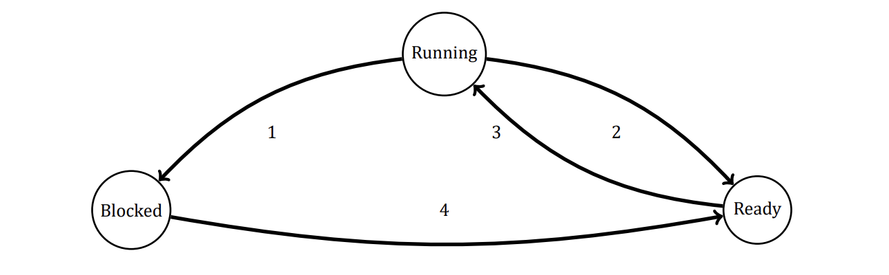

<details>
<summary>Solution</summary>

The transition from the Ready state to the Blocked state is
impossible since in order to be switched to Blocked state a process
has to perform an I/O operation which is possible only if the
process is active, i.e. is in the Running state.

A transition from Blocked to Running state is possible if and only
if an I/O operation that was the reason of blocking is finished and
the CPU is idle at this time.

</details>

### Question 2
Suppose that you were to design an advanced computer architecture that did process switching in hardware, instead of having interrupts. What information would the CPU need? Describe how the hardware process switching might work.

<details>
<summary>Solution</summary>

You could have a register containing a pointer to the current process-table entry. When I/O completes, the CPU
would store the current machine state in the current process-table entry. Then it would go to the interrupt
vector for the interrupting device and fetch a pointer to another process-table entry (the service procedure).
That procedure would then be started up.

</details>

### Question 3
On all current computers, at least part of the interrupt handlers are written in assembly language. Why?

<details>
<summary>Solution</summary>

Generally, high-level languages do not allow the kind of access to CPU hardware that is required. For instance,
an interrupt handler may be required to enable and disable the interrupt servicing a particular device, or to
manipulate data within a process’ stack area. Also, interrupt service routines must execute as rapidly as possible.

</details>

### **Question 4 (Tutorial 4)**
When an interrupt or a system call transfers control to the operating system, a kernel stack area separate from
the stack of the interrupted process is generally used. Why?

<details>
<summary>Solution</summary>

The separate stack area is used for the interrupted processes. The
causes for using the distinct stack for kernel are as given below:

- By using distinct stack, the data is not overwritten on the kernel
- By doing so, the operating system will not crash
- To protect the information of processes from malicious users
- The separate memory space can be used to make system calls

</details>

### Question 5
A computer system has enough room to hold five programs in its main memory. These programs are idle waiting
for I/O half the time. What fraction of the CPU time is wasted?

<details>
<summary>Solution</summary>

The chance that all five processes are idle at once is 0.5⁵ = 1/32, so the CPU is idle 1/32 of the time.

</details>

### **Question 6 (Retake 1 2016)**
A computer has 4 GB of RAM of which the operating system occupies 512 MB. The processes are all 256 MB (for
simplicity) and have the same characteristics. If the goal is 99% CPU utilization, what is the maximum I/O wait
that can be tolerated?

<details>
<summary>Solution</summary>

There is enough room for 14 processes in memory. If each process spends a fraction p of its time waiting for I/O, then the probability that they are
all waiting at once is p¹⁴. By equating this to 0.01, we get the equation p¹⁴ = 0.01. Solving this, we get p = 0.72,
so we can tolerate processes with up to 72% I/O wait.

</details>

### **Question 7 (Retake 2.1 2016, Final 2017)**
Multiple jobs can run in parallel and finish faster than if they had run sequentially. Suppose that two jobs, each
needing 20 minutes of CPU time, start simultaneously. How long will the last one take to complete if they run
sequentially? How long if they run in parallel? Assume 50% I/O wait.

<details>
<summary>Solution</summary>

If each job has 50% I/O wait, then it will take 40 minutes to complete in the absence of competition. If run
sequentially, the second one will finish 80 minutes after the first one starts. With two jobs, the approximate
CPU utilization is 1 − 0.5². Thus, each one gets 0.375 CPU minute per minute of real time. To accumulate 20
minutes of CPU time, a job must run for 20/0.375 minutes, or about 53.33 minutes. Thus running sequentially
the jobs finish after 80 minutes, but running in parallel they finish after 53.33 minutes.

</details>

### **Question 8 (Tutorial 4, 5)**
Consider a multiprogrammed system with degree of 6 (i.e., six programs in memory at the same time). Assume
that each process spends 40% of its time waiting for I/O. What will be the CPU utilization?

<details>
<summary>Solution</summary>

Given that there are 6 programs in memory, n=6
Each process spends 40% of time waiting for I/O, therefore the
fraction of time each process spends waiting for I/O denoted by P
= 0.4
CPU utilization is given as
= 1 − Pⁿ = 1 − (0.4)⁶ = 1 − 0.004096 = 0.9959
Therefore, the CPU utilization is 99%

</details>

### Question 9
Assume that you are trying to download a large 2-GB file from the Internet. The file is available from a set of
mirror servers, each of which can deliver a subset of the file’s bytes; assume that a given request specifies the
starting and ending bytes of the file. Explain how you might use threads to improve the download time.

<details>
<summary>Solution</summary>

The client process can create separate threads, each fetching a different byte range of the file from one of the
mirror servers. The parts download in parallel, cutting the total download time. Of course, there is a single network link being shared by all
threads. This link can become a bottleneck as the number of threads becomes very large.

</details>

### Question 10
In the text it was stated that the model of Figure 2 was not suited to a file server using a cache in memory. Why
not? Could each process have its own cache?

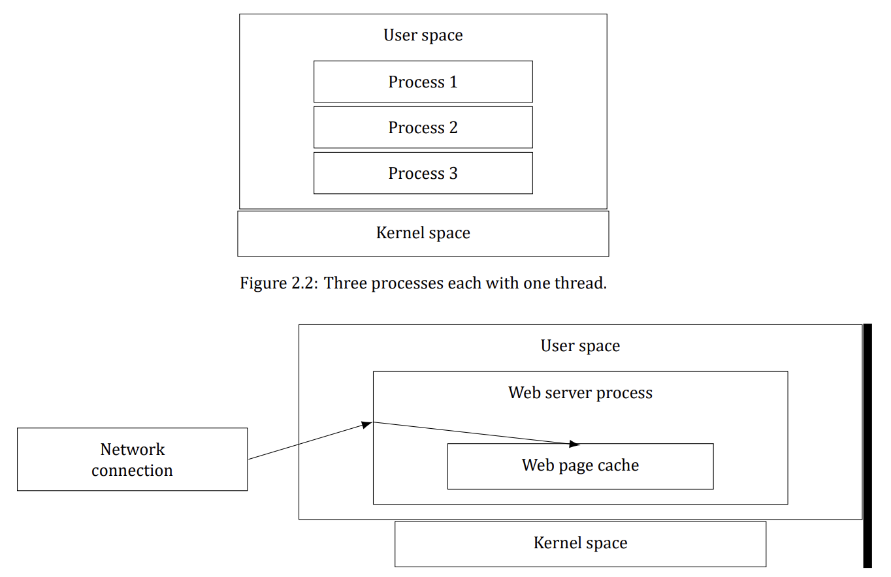

<details>
<summary>Solution</summary>

It would be difficult, if not impossible, to keep the file system consistent. Suppose that a client process sends
a request to server process 1 to update a file. This process updates the cache entry in its memory. Shortly
thereafter, another client process sends a request to server 2 to read that file. Unfortunately, if the file is also
cached there, server 2, in its innocence, will return obsolete data. If the first process writes the file through to
the disk after caching it, and server 2 checks the disk on every read to see if its cached copy is up-to-date, the
system can be made to work, but it is precisely all these disk accesses that the caching system is trying to avoid.

</details>

### **Question 11 (Tutorial 4)**
If a multithreaded process forks, a problem occurs if the child gets copies of all the parent’s threads. Suppose
that one of the original threads was waiting for keyboard input. Now two threads are waiting for keyboard input,
one in each process. Does this problem ever occur in single-threaded processes?

<details>
<summary>Solution</summary>

A single-threaded process cannot fork if it is waiting for a
keyboard input as it would remain in waiting state until it receives
the input from the keyboard.
Once it receives the input, it would resume its execution.

In a multithreaded process, as two processes are waiting for a
keyboard input, only one of them can resume execution once the
keyboard input is received and the other would always stay
suspended
Thus, the problem of two threads waiting for an input will occur
in a multithreaded process

</details>

### Question 12
In Figure 2, a multithreaded Web server is shown. If the only way to read from a file is the normal blocking read
system call, do you think user-level threads or kernel-level threads are being used for the Web server? Why?


<details>
<summary>Solution</summary>

A worker thread will block when it has to read a Web page from the disk. If user-level threads are being used,
this action will block the entire process, destroying the value of multithreading. Thus it is essential that kernel
threads are used to permit some threads to block without affecting the others.

</details>

### Question 13
In the text, we described a multithreaded Web server, showing why it is better than a single-threaded server and
a finite-state machine server. Are there any circumstances in which a single-threaded server might be better?
Give an example.

<details>
<summary>Solution</summary>

Yes. If the server is entirely CPU bound, there is no need to have multiple threads. It just adds unnecessary
complexity. As an example, consider a telephone directory assistance number (like 555-1212) for an area with
1 million people. If each (name, telephone number) record is, say, 64 characters, the entire database takes 64
megabytes and can easily be kept in the server’s memory to provide fast lookup.

</details>

### **Question 14 (Tutorial 4, 5)**
In the table below, the register set is listed as a per-thread rather than a per-process item. Why? After all, the machine
has only one set of registers.

| Per-process items | Per-thread items |
|---|---|
| Address space | Program counter |
| Global variables | Registers |
| Open files | Stack |
| Child processes | State |
| Pending alarms |  |
| Signals and signal handlers |  |
| Accounting information |  |

<details>
<summary>Solution</summary>

The register is called a per-thread item because the context saved
in a register is thread-specific information
The register stores the state of every thread so that it can be used
during context switching – these data are saved and reloaded on
the next execution.

</details>

### Question 15
Why would a thread ever voluntarily give up the CPU by calling thread_yield? After all, since there is no periodic
clock interrupt, it may never get the CPU back.

<details>
<summary>Solution</summary>

Threads in a process cooperate. They are not hostile to one another. If yielding is needed for the good of the
application, then a thread will yield. After all, it is usually the same programmer who writes the code for all of
them.

</details>

### **Question 16 (Tutorial 5)**
Can a thread ever be preempted by a clock interrupt? If so, under what circumstances? If not, why not?

<details>
<summary>Solution</summary>

A user level thread cannot be preempted by the clock in a sense
that a clock preempts processes
A kernel level thread can be preempted since the scheduler knows
of their existence

</details>

### **Question 17 (Pre-Final 2020)**
In this problem you are to compare reading a file using a single-threaded file server and a multithreaded server.
It takes 12 ms to get a request for work, dispatch it, and do the rest of the necessary processing, assuming that
the data needed are in the block cache. If a disk operation is needed, as is the case one-third of the time, an
additional 75 ms is required, during which time the thread sleeps. How many requests per seconds can the
server handle if it is single threaded? If it is multithreaded?

<details>
<summary>Solution</summary>

In the single-threaded case, the cache hits take 12 ms and cache misses take 87 ms. The weighted average is
2/3 × 12 + 1/3 × 87. Thus, the mean request takes 37 ms and the server can do about 27 per second. For a
multithreaded server, all the waiting for the disk is overlapped, so every request takes 12 ms, and the server can
handle 83 1/3 requests per second.

</details>

### **Question 18 (Final 2017)**
What is the biggest advantage of implementing threads in user space? What is the biggest disadvantage?

<details>
<summary>Solution</summary>

The biggest advantage is the efficiency. No traps to the kernel are needed to switch threads. The biggest disadvantage is that if one thread blocks, the entire process blocks.

</details>

### Question 19
In the code below, the thread creations and messages printed by the threads are interleaved at random. Is there a way to
force the order to be strictly thread 1 created, thread 1 prints message, thread 1 exits, thread 2 created, thread
2 prints message, thread 2 exists, and so on? If so, how? If not, why not?

```c
#include <pthread.h>
#include <stdio.h>
#include <stdlib.h>
#define NUMBER_OF_THREADS 10
void *print_hello_world(void *tid)
{
    /* Thread entry point: print our own id, then terminate. */
    /* tid arrives as void*; we print it as an integer id. */
    printf("Hello World. Greetings from thread %d \n", tid);
    pthread_exit(NULL);             /* Terminate only this thread. */
}

int main(int argc, char *argv[])
{
    /* Main program: create 10 threads, then exit. */
    pthread_t threads[NUMBER_OF_THREADS];   /* Handles of the created threads. */
    int status, i;
    for (i = 0; i < NUMBER_OF_THREADS; i++) {
        printf("Main here. Creating thread %d \n", i);
        /* Start a thread running print_hello_world, passing i as its id. */
        status = pthread_create(&threads[i], NULL, print_hello_world, (void *)i);
        if (status != 0) {
            printf("Oops. pthread create returned error code %d \n", status);
            exit(-1);               /* Thread creation failed: abort with an error. */
        }
    }
    exit(NULL);
}
```

<details>
<summary>Solution</summary>

Yes, it can be done. After each call to pthread_create, the main program could do a pthread_join to wait until the
thread just created has exited before creating the next thread.

</details>

### Question 20
In the discussion on global variables in threads, we used a procedure create_global to allocate storage for a
pointer to the variable, rather than the variable itself. Is this essential, or could the procedures work with the
values themselves just as well?

<details>
<summary>Solution</summary>

The pointers are really necessary because the size of the global variable is unknown. It could be anything from
a character to an array of floating-point numbers. If the value were stored, one would have to give the size to
create_global, which is all right, but what type should the second parameter of set_global be, and what type
should the value of read_global be?

</details>

### **Question 21 (Retake 2 2017)**
Consider a system in which threads are implemented entirely in user space, with the run-time system getting
a clock interrupt once a second. Suppose that a clock interrupt occurs while some thread is executing in the
run-time system. What problem might occur? Can you suggest a way to solve it?

<details>
<summary>Solution</summary>

It could happen that the runtime system is precisely at the point of blocking or unblocking a thread, and is
busy manipulating the scheduling queues. This would be a very inopportune moment for the clock interrupt
handler to begin inspecting those queues to see if it was time to do thread switching, since they might be in an
inconsistent state. One solution is to set a flag when the runtime system is entered. The clock handler would see this and set its own flag, then return. When the runtime system finished, it would check the clock flag, see
that a clock interrupt occurred, and now run the clock handler.

</details>

### Question 22
Suppose that an operating system does not have anything like the select system call to see in advance if it is safe
to read from a file, pipe, or device, but it does allow alarm clocks to be set that interrupt blocked system calls. Is
it possible to implement a threads package in user space under these conditions? Discuss.

<details>
<summary>Solution</summary>

Yes it is possible, but inefficient. A thread wanting to do a system call first sets an alarm timer, then does the
call. If the call blocks, the timer returns control to the threads package. Of course, most of the time the call will
not block, and the timer has to be cleared. Thus each system call that might block has to be executed as three
system calls. If timers go off prematurely, all kinds of problems develop. This is not an attractive way to build a
threads package.

</details>

### Question 23
Does the busy waiting solution using the turn variable in the code below work when the two processes are running on a
shared-memory multiprocessor, that is, two CPUs sharing a common memory?

```c
/* Process 0: may enter only while turn == 0. */
while (TRUE) {
    while (turn != 0)
        ;                       /* Busy-wait for our turn. */
    critical_region();          /* Critical section: use the shared resource. */
    turn = 1;                   /* Hand the turn over to process 1. */
    noncritical_region();       /* Noncritical section: everything else. */
}

/* Process 1 mirrors process 0: it may enter only while turn == 1. */
while (TRUE) {
    while (turn != 1)
        ;                       /* Busy-wait for our turn. */
    critical_region();          /* Critical section: use the shared resource. */
    turn = 0;                   /* Hand the turn over to process 0. */
    noncritical_region();       /* Noncritical section: everything else. */
}
```

<details>
<summary>Solution</summary>

Yes, it still works, but it still is busy waiting, of course.

</details>

### Question 24
Does Peterson’s solution to the mutual-exclusion problem shown in the code below work when process scheduling is
preemptive? How about when it is non-preemptive?

```c
#define FALSE 0
#define TRUE 1
#define N 2
/* Number of processes in the system. */
int turn;
/* Shared turn variable: whose turn is it? */
int interested[N];            /* One flag per process: TRUE while that process wants to enter (all FALSE initially). */
void enter_region(int process); /* process is 0 or 1: our own number. */
{
    int other;                  /* Number of the other process. */
    other = 1 - process;        /* The opposite process: 1 - process. */
    interested[process] = TRUE; /* Announce that we want to enter. */
    turn = process;             /* Claim the turn for this process. */
    while (turn == process && interested[other] == TRUE)
        ;                       /* Empty statement: busy-wait while the other process is also interested. */
}

void leave_region(int process)  /* process is the one leaving the section. */
{
    interested[process] = FALSE;    /* Withdraw our request: we are out of the section. */
}
```

<details>
<summary>Solution</summary>

It certainly works with preemptive scheduling. In fact, it was designed for that case. When scheduling is nonpreemptive, it might fail. Consider the case in which turn is initially 0 but process 1 runs first. It will just loop
forever and never release the CPU.

</details>

### Question 25
Can the priority inversion problem discussed in Sec. 2.3.4 happen with user-level threads? Why or why not?

<details>
<summary>Solution</summary>

The priority inversion problem occurs when a low-priority process is in its critical region and suddenly a high priority process becomes ready and is scheduled. If it uses busy waiting, it will run forever. With user-level
threads, it cannot happen that a low-priority thread is suddenly preempted to allow a high-priority thread run.
There is no preemption. With kernel-level threads this problem can arise.

</details>

### Question 26
In Sec. 2.3.4, a situation with a high-priority process, H, and a low-priority process, L, was described, which
led to H looping forever. Does the same problem occur if round-robin scheduling is used instead of priority
scheduling? Discuss.

<details>
<summary>Solution</summary>

With round-robin scheduling it works. Sooner or later L will run, and eventually it will leave its critical region.
The point is, with priority scheduling, L never gets to run at all; with round robin, it gets a normal time slice
periodically, so it has the chance to leave its critical region.

</details>

### Question 27
In a system with threads, is there one stack per thread or one stack per process when user-level threads are
used? What about when kernel-level threads are used? Explain.

<details>
<summary>Solution</summary>

Each thread calls procedures on its own, so it must have its own stack for the local variables, return addresses,
and so on. This is equally true for user-level threads as for kernel-level threads.

</details>

### Question 28
When a computer is being developed, it is usually first simulated by a program that runs one instruction at a
time. Even multiprocessors are simulated strictly sequentially like this. Is it possible for a race condition to
occur when there are no simultaneous events like this?

<details>
<summary>Solution</summary>

Yes. The simulated computer could be multiprogrammed. For example, while process A is running, it reads
out some shared variable. Then a simulated clock tick happens and process B runs. It also reads out the same
variable. Then it adds 1 to the variable. When process A runs, if it also adds 1 to the variable, we have a race
condition.

</details>

### Question 29
The producer-consumer problem can be extended to a system with multiple producers and consumers that
write (or read) to (from) one shared buffer. Assume that each producer and consumer runs in its own thread.
Will the solution below, using semaphores, work for this system?

```c
#define N 100
/* Number of slots in the shared buffer. */
typedef int semaphore;
/* Semaphores are a special kind of int. */
semaphore mutex = 1;
/* Guards access to the critical region. */
semaphore empty = N;
/* Counts currently empty buffer slots. */
semaphore full = 0;
/* Counts currently full buffer slots. */
void producer(void)
{
    int item;
    while (TRUE) {              /* Repeat forever (TRUE is defined as 1). */
        item = produce_item( ); /* Create a new item to put into the buffer. */
        down(&empty);           /* Claim one empty slot (block if the buffer is full). */
        down(&mutex);           /* Enter the critical region (one thread at a time). */
        insert_item(item);      /* Put the item into the shared buffer. */
        up(&mutex);             /* Leave the critical region. */
        up(&full);              /* One more full slot is now available. */
    }
}

void consumer(void)
{
    int item;
    while (TRUE) {              /* Repeat forever. */
        down(&full);            /* Wait for a full slot (block if the buffer is empty). */
        down(&mutex);           /* Enter the critical region (one thread at a time). */
        item = remove_item( );  /* Take one item out of the shared buffer. */
        up(&mutex);             /* Leave the critical region. */
        up(&empty);             /* One more empty slot is now available. */
        consume_item(item);     /* Consume (use) the item outside the critical region. */
    }
}
```

<details>
<summary>Solution</summary>

Yes, it will work as is. At a given time instant, only one producer (consumer) can add (remove) an item to (from)
the buffer.

</details>

### **Question 30 (Tutorial 5, Final 2018)**
Consider the following solution to the mutual-exclusion problem involving two processes P0 and P1. Assume
that the variable turn is initialized to 0. Process P0’s code is presented below:

```c
/* Noncritical section: other work. */
while (turn != 0) { } /* Busy-wait until it is our turn (turn == 0 for P0). */
Critical Section /* ... use the shared resource ... */
turn = 0; /* Hand the turn over (set it back to 0). */
/* Noncritical section: other work. */
```
For process P1, replace 0 by 1 in above code. Determine if the solution meets all the required conditions for a
correct mutual-exclusion solution.

<details>
<summary>Solution</summary>

First, remember four required conditions:

1. No two processes may be simultaneously inside their critical
regions
2. No assumptions may be made about speeds or the number of
CPUs
3. No process running outside its critical region may block other
processes
4. No process should have to wait forever to enter its critical region

Condition 1: no two processes may be simultaneously inside their
critical regions
Variable turn is used to prevent P0 and P1 being inside their
critical regions at the same time so mutual exclusion is
guaranteed. This condition is met.

Condition 2: no assumptions may be made about speeds or the
number of CPUs
Okay, no assumptions have been made. This condition is also met.

Condition 3: no process running outside its critical region may
block other processes
Suppose, process P1 starts first and wants to put something into
buffer. Since it will not enter critical region, buffer will remain
empty causing blocking process P0. Therefore, P1 will block P0
even if it is not in its critical region.

</details>

### Question 31
How could an operating system that can disable interrupts implement semaphores?

<details>
<summary>Solution</summary>

To do a semaphore operation, the operating system first disables interrupts. Then it reads the value of the
semaphore. If it is doing a down and the semaphore is equal to zero, it puts the calling process on a list of
blocked processes associated with the semaphore. If it is doing an up, it must check to see if any processes are
blocked on the semaphore. If one or more processes are blocked, one of them is removed from the list of blocked
processes and made runnable. When all these operations have been completed, interrupts can be enabled again.

</details>

### Question 32
Show how counting semaphores (i.e., semaphores that can hold an arbitrary value) can be implemented using
only binary semaphores and ordinary machine instructions.

<details>
<summary>Solution</summary>

Associated with each counting semaphore are two binary semaphores, M, used for mutual exclusion, and B,
used for blocking. Also associated with each counting semaphore is a counter that holds the number of ups
minus the number of downs, and a list of processes blocked on that semaphore. To implement down, a process
first gains exclusive access to the semaphores, counter, and list by doing a down on M. It then decrements the
counter. If it is zero or more, it just does an up on M and exits. If the counter is negative, the process is put on the list
of blocked processes. Then an up is done on M and a down is done on B to block the process. To implement
up, first M is downed to get mutual exclusion, and then the counter is incremented. If it is more than zero, no
one was blocked, so all that needs to be done is to up M. If, however, the counter is now negative or zero, some
process must be removed from the list. Finally, an up is done on B and M in that order.

</details>

### Question 33
If a system has only two processes, does it make sense to use a barrier to synchronize them? Why or why not?

<details>
<summary>Solution</summary>

If the program operates in phases and neither process may enter the next phase until both are finished with the
current phase, it makes perfect sense to use a barrier.

</details>

### Question 34
Can two threads in the same process synchronize using a kernel semaphore if the threads are implemented by
the kernel? What if they are implemented in user space? Assume that no threads in any other processes have
access to the semaphore. Discuss your answers.

<details>
<summary>Solution</summary>

With kernel threads, a thread can block on a semaphore and the kernel can run some other thread in the same
process. Consequently, there is no problem using semaphores. With user-level threads, when one thread blocks
on a semaphore, the kernel thinks the entire process is blocked and does not run it ever again. Consequently,
the process fails.

</details>

### **Question 35 (Retake 2 2017, Final 2018)**
Synchronization within monitors uses condition variables and two special operations, wait and signal. A more
general form of synchronization would be to have a single primitive, waituntil, that had an arbitrary Boolean
predicate as parameter. Thus, one could say, for example,
waituntil x < 0 or y + z < n
The signal primitive would no longer be needed. This scheme is clearly more general than that of Hoare or
Brinch Hansen, but it is not used. Why not? (Hint: Think about the implementation.)

<details>
<summary>Solution</summary>

It is very expensive to implement. Each time any variable that appears in a predicate on which some process
is waiting changes, the run-time system must re-evaluate the predicate to see if the process can be unblocked.
With the Hoare and Brinch Hansen monitors, processes can only be awakened on a signal primitive.

</details>

### Question 36
A fast-food restaurant has four kinds of employees: (1) order takers, who take customers’ orders; (2) cooks, who
prepare the food; (3) packaging specialists, who stuff the food into bags; and (4) cashiers, who give the bags to
customers and take their money. Each employee can be regarded as a communicating sequential process. What
form of inter-process communication do they use? Relate this model to processes in UNIX.

<details>
<summary>Solution</summary>

The employees communicate by passing messages: orders, food, and bags in this case. In UNIX terms, the four
processes are connected by pipes.

</details>

### **Question 37 (Retake 1 2016)**
Suppose that we have a message-passing system using mailboxes. When sending to a full mailbox or trying to
receive from an empty one, a process does not block. Instead, it gets an error code back. The process responds
to the error code by just trying again, over and over, until it succeeds. Does this scheme lead to race conditions?

<details>
<summary>Solution</summary>

It does not lead to race conditions (nothing is ever lost), but it is effectively busy waiting.

</details>

### Question 38
The CDC 6600 computers could handle up to 10 I/O processes simultaneously using an interesting form of
round-robin scheduling called processor sharing. A process switch occurred after each instruction, so instruction 1 came from process 1, instruction 2 came from process 2, etc. The process switching was done by special
hardware, and the overhead was zero. If a process needed T sec to complete in the absence of competition, how
much time would it need if processor sharing was used with n processes?

<details>
<summary>Solution</summary>

It will take nT sec.

</details>

### Question 39
Consider the following piece of C code:
```c
void main( ) {
    fork( );    /* First fork: 1 process becomes 2 (parent + child). */
    fork( );    /* Both processes fork again: 2 become 4 in total. */
    exit( );    /* All 4 processes exit here; 3 new processes were created overall. */
}
```
How many child processes are created upon execution of this program?

<details>
<summary>Solution</summary>

Three child processes are created. After the initial process forks, there are two processes running, a parent and a
child. Each of them then forks, creating two additional processes. Then all the processes exit.

</details>

### Question 40
Round-robin schedulers normally maintain a list of all runnable processes, with each process occurring exactly
once in the list. What would happen if a process occurred twice in the list? Can you think of any reason for
allowing this?

<details>
<summary>Solution</summary>

If a process occurs multiple times in the list, it will get multiple quanta per cycle. This approach could be used
to give more important processes a larger share of the CPU. But when the process blocks, all entries had better
be removed from the list of runnable processes.

</details>

### Question 41
Can a measure of whether a process is likely to be CPU bound or I/O bound be determined by analyzing source
code? How can this be determined at run time?

<details>
<summary>Solution</summary>

In simple cases it may be possible to see if I/O will be limiting by looking at source code. For instance a program
that reads all its input files into buffers at the start will probably not be I/O bound, but a problem that reads and
writes incrementally to a number of different files (such as a compiler) is likely to be I/O bound. If the operating
system provides a facility such as the UNIX `ps` command that can tell you the amount of CPU time used by a
program, you can compare this with the total time to complete execution of the program. This is, of course,
most meaningful on a system where you are the only user.

</details>

### Question 42
Explain how time quantum value and context switching time affect each other, in a round-robin scheduling algorithm.

<details>
<summary>Solution</summary>

If the context switching time is large, then the time quantum value has to be proportionally large. Otherwise,
the overhead of context switching can be quite high. Choosing large time quantum values can lead to an inefficient system if the typical CPU burst times are less than the time quantum. If context switching is very small or
negligible, then the time quantum value can be chosen with more freedom.

</details>

### **Question 43 (Retake 2.2 2016, Retake 1 2017)**
Measurements of a certain system have shown that the average process runs for a time T before blocking on
I/O. A process switch requires a time S, which is effectively wasted (overhead). For round-robin scheduling with
quantum Q, give a formula for the CPU efficiency for each of the following:

a) Q = ∞
b) Q > T
c) S < Q < T
d) Q = S
e) Q nearly 0

<details>
<summary>Solution</summary>

The CPU efficiency is the useful CPU time divided by the total CPU time. When Q≥T, the basic cycle is for the
process to run for T and undergo a process switch for S. Thus, **(a)** and **(b)** have an efficiency of T/(S + T).
When the quantum is shorter than T, each run of T will require T/Q process switches, wasting a time ST/Q.
The efficiency here is then T/(T + ST/Q),
which reduces to Q/(Q + S), which is the answer to (c). For **(d)**, we just substitute Q for S and find that the
efficiency is 50%. Finally, for (e), as Q→0 the efficiency goes to 0.

</details>

### **Question 44 (Pre-Final 2025)**
Five jobs are waiting to be run. Their expected run times are 9, 6, 3, 5, and X. In what order should they be run
to minimize average response time? (Your answer will depend on X.)

<details>
<summary>Solution</summary>

Shortest job first is the way to minimize average response time.
```text
0 < X≤3 : X, 3, 5, 6, 9.
3 < X≤5 : 3, X, 5, 6, 9.
5 < X≤6 : 3, 5, X, 6, 9.
6 < X≤9 : 3, 5, 6, X, 9.
X > 9 : 3, 5, 6, 9, X.
```

</details>

### **Question 45 (Tutorial 6, Retake 2.1 2016)**
Five batch jobs. A through E, arrive at a computer center at almost the same time. They have estimated running
times of 10, 6, 2, 4, and 8 minutes. Their (externally determined) priorities are 3, 5, 2, 1, and 4, respectively,
with 5 being the highest priority. For each of the following scheduling algorithms, determine the mean process
turnaround time. Ignore process switching overhead.

a) Round robin.
b) Priority scheduling.
c) First-come, first-served (run in order 10, 6, 2, 4, 8).
d) Shortest job first.

For **(a)**, assume that the system is multiprogrammed, and that each job gets its fair share of the CPU. For (b)
through **(d)**, assume that only one job at a time runs, until it finishes. All jobs are completely CPU bound.

<details>
<summary>Solution</summary>

The right answer is highly dependent on order of the jobs and the
time quanta given to each of the jobs.
It will be safe to suppose that in a multiprogrammed system each
job runs for milliseconds, not minutes (as shown on the next slide)

Jobs A, B, C, D, E.


Right answer (cont.): In this case all the five jobs will run
simultaneously for ~10 minutes until job C finishes.
Then remaining four jobs will run for 8 minutes until job D
finishes which makes turnaround time for D equal 18 minutes
Using the same technique we obtain turnaround times for B, E
and A which are 24, 28 and 30 minutes respectively

Right answer (cont.):
TC ≈ 5 · 2min ≈ 10min (each job gets 1/5 of the CPU)
TD ≈ TC + 4 · 2min ≈ 18min (each job gets 1/4 of the CPU)
TB ≈ TC + TD + 3 · 2min ≈ 24min
TE ≈ TC + TD + TB + 2 · 2min ≈ 28min
TA ≈ TC + TD + TB + TE + 2min ≈ 30min
Average turnaround time is
∼ 22 minutes ((10 + 18 + 24 + 28 + 30)/5)

Priority scheduling:
The processes will run in the following order: B(6), E(8), A(10),
C(2), D(4)
TB ≈ 6min
TE ≈ TB + 8min ≈ 14min
TA ≈ TB + TE + 10min ≈ 24min
TC ≈ TB + TE + TA + 2min ≈ 26min
TD ≈ TB + TE + TA + TC + 4min ≈ 30min
Average turnaround time is
∼ 20 minutes ((6 + 14 + 24 + 26 + 30)/5)

FCFS scheduling:
The processes will run in the following order: A(10), B(6), C(2),
D(4), E(8)
TA ≈ 10min
TB ≈ TA + 6min ≈ 16min
TC ≈ TA + TB + 2min ≈ 18min
TD ≈ TA + TB + TC + 4min ≈ 22min
TE ≈ TA + TB + TC + TD + 8min ≈ 30min
Average turnaround time is
∼ 19 minutes ((10 + 16 + 18 + 22 + 30)/5)

SJF (non-preemptive) scheduling:
The processes will run in the following order: C(2), D(4), B(6),
E(8), A(10)
TC ≈ 2min
TD ≈ TC + 4min ≈ 6min
TB ≈ TC + TD + 6min ≈ 12min
TE ≈ TC + TD + TB + 8min ≈ 20min
TA ≈ TC + TD + TB + TE + 10min ≈ 30min
Average turnaround time is
∼ 14 minutes ((2 + 6 + 12 + 20 + 30)/5)
**Ageing for Shortest Process Next (1/2)**

Some processes generally follow a behavioral pattern (e.g. wait for
command, execute command, wait for command, execute
command, ...etc)
If we regard the execution of each command as a separate “job”,
We can minimize overall response time by running the shortest
one first.
Which of the currently runnable processes is the shortest one?
Estimate based on past behavior and run the process with the
shortest estimated running time.

**Ageing for Shortest Process Next (2/2)**

Assume that the estimated time per command for some process A
is T0.
its next run is measured to be T1.
We could update our estimate by taking a weighted sum of these
two numbers, that is,
t_estimated = aT0 + (1 − a)T1
The choice of a decides how quickly the estimation forgets or
remembers old runs for long time.
When a = 1/2, we will get successive estimates of:
```text
t1 = T0
t2 = T1/2 + T0/2
t3 = T2/2 + T1/4 + T0/4
t4 = T3/2 + T2/4 + T1/8 + T0/8
```
After three new runs, the weight of T0 in the new estimate has
dropped to 1/8.
Division can be done by shifting right 1 bit.

</details>

### Question 46
A process running on CTSS needs 30 quanta to complete. How many times must it be swapped in, including the
very first time (before it has run at all)?

<details>
<summary>Solution</summary>

The first time it gets 1 quantum. On succeeding runs it gets 2, 4, 8, and 15, so it must be swapped in 5 times.

</details>

### **Question 47 (Retake 2.2 2016)**
Consider a real-time system with two voice calls of periodicity 5 ms each with CPU time per call of 1 ms, and
one video stream of periodicity 33 ms with CPU time per call of 11 ms. Is this system schedulable?

<details>
<summary>Solution</summary>

Each voice call needs 1 ms out of every 5 ms, i.e. 200 ms per second; together the two voice calls use 400 ms of CPU time per second. The video needs 11 ms out of every 33 ms, i.e. a 11/33 share, for a total of about 333 ms per second. The sum is about 733 ms per second of real time, which is less than 1000 ms, so the system is schedulable.

</details>

### Question 48
For the above problem, can another video stream be added and have the system still be schedulable?

<details>
<summary>Solution</summary>

Another video stream consumes a further 333 ms per second, for a total of about 400 + 333 + 333 = 1066 ms per second of real time, which exceeds the available 1000 ms, so the system is not schedulable.

</details>

### **Question 49 (Tutorial 6)**
The aging algorithm with a = 1/2 is being used to predict run times. The previous four runs, from oldest to most
recent, are 40, 20, 40, and 15 msec. What is the prediction of the next time?

<details>
<summary>Solution</summary>

Let’s denote measured runtime as T and predicted runtime as t:

```text
t1 = T0 [40 msec]
t2 = T1/2 + t1/2 = T1/2 + T0/2 [30 msec]
t3 = T2/2 + t2/2 = T2/2 + T1/4 + T0/4 [35 msec]
t4 = T3/2 + t3/2 = T3/2 + T2/4 + T1/8 + T0/8 [25 msec]
```

The answer is 25 msec.

</details>

### **Question 50 (Tutorial 6)**
A soft real-time system has four periodic events with periods of 50, 100, 200, and 250 ms each. Suppose that
the four events require 35, 20, 10, and x ms of CPU time, respectively. What is the largest value of x for which
the system is schedulable?

<details>
<summary>Solution</summary>

The periodicity of each event is:
Cp1 = 50 msec; Cp2 = 100 msec; Cp3 = 200 msec; Cp4 = 250 msec
The CPU time required by each event is:
Ct1 = 35 msec; Ct2 = 20 msec; Ct3 = 10 msec; Ct4 = x msec
For the system to be schedulable the next inequality must hold:

```text
Ct1/Cp1 + Ct2/Cp2 + Ct3/Cp3 + Ct4/Cp4 ≤ 1, or
35/50 + 20/100 + 10/200 + x/250 ≤ 1, or
0.7 + 0.2 + 0.05 + x/250 ≤ 1, or
x/250 ≤ 0.05, or
x ≤ 12.5 msec
```

</details>

### Question 51
In the dining philosophers problem, let the following protocol be used: An even-numbered philosopher always
picks up his left fork before picking up his right fork; an odd-numbered philosopher always picks up his right
fork before picking up his left fork. Will this protocol guarantee deadlock-free operation?

<details>
<summary>Solution</summary>

Yes. There will always be at least one fork free and at least one philosopher that can obtain both forks simultaneously. Hence, there will be no deadlock. You can try this for N = 2, N = 3 and N = 4 and then generalize.

</details>

### Question 52
A real-time system needs to handle two voice calls that each run every 6 ms and consume 1 ms of CPU time per
burst, plus one video at 25 frames/sec, with each frame requiring 20 ms of CPU time. Is this system schedulable?

<details>
<summary>Solution</summary>

Each voice call runs 166.67 times/second and uses up 1 ms per burst, so each voice call needs 166.67 ms per
second or 333.33 ms for the two of them. The video runs 25 times a second and uses up 20 ms each time, for
a total of 500 ms per second. Together they consume 833.33 ms per second, so there is time left over and the
system is schedulable.

</details>

### Question 53
Consider a system in which it is desired to separate policy and mechanism for the scheduling of kernel threads.
Propose a means of achieving this goal.

<details>
<summary>Solution</summary>

The kernel could schedule processes by any means it wishes, but within each process it runs threads strictly in
priority order. By letting the user process set the priority of its own threads, the user controls the policy but the
kernel handles the mechanism.

</details>

### Question 54
In the dining philosophers code below, why is the state variable set to HUNGRY in the
procedure take_forks?

```c
#define N 5
/* Number of philosophers (and forks). */
#define LEFT (i+N−1)%N
/* Index of philosopher i's left neighbor. */
#define RIGHT (i+1)%N
/* Index of philosopher i's right neighbor. */
#define THINKING 0
/* State: the philosopher is thinking. */
#define HUNGRY 1
/* State: the philosopher is hungry, waiting for forks. */
#define EATING 2
/* State: the philosopher is eating. */
typedef int semaphore;
/* Semaphores are a special kind of int. */
int state[N];
/* Current state of every philosopher. */
semaphore mutex = 1;
/* Binary semaphore: mutual exclusion for the state array. */
semaphore s[N];
/* One semaphore per philosopher: it blocks him while he waits for forks. */
void philosopher(int i)         /* i: philosopher number, from 0 to N-1. */
{
    while (TRUE) {              /* Repeat forever. */
        think( );               /* Think for a while (no forks needed). */
        take_forks(i);          /* Pick up two forks, or block until possible. */
        eat( );                 /* Eat, using both forks. */
        put_forks(i);           /* Put both forks back on the table. */
    }
}

void take_forks(int i)          /* i: philosopher number, from 0 to N-1. */
{
    down(&mutex);               /* Enter the critical region (one thread at a time). */
    state[i] = HUNGRY;          /* Record that philosopher i is hungry. */
    test(i);                    /* Try to acquire both forks (see test() below). */
    up(&mutex);                 /* Leave the critical region. */
    down(&s[i]);                /* Block until both forks are acquired. */
}

void put_forks(i)               /* i: philosopher number, from 0 to N-1. */
{
    down(&mutex);               /* Enter the critical region (one thread at a time). */
    state[i] = THINKING;        /* Philosopher i has finished eating. */
    test(LEFT);                 /* The left neighbor may be able to eat now. */
    test(RIGHT);                /* The right neighbor may be able to eat now. */
    up(&mutex);                 /* Leave the critical region. */
}

void test(i)                    /* i: philosopher number, from 0 to N-1. */
{
    /* Eat only if hungry and neither neighbor is eating. */
    if (state[i] == HUNGRY && state[LEFT] != EATING && state[RIGHT] != EATING) {
        state[i] = EATING;      /* Grant permission to eat. */
        up(&s[i]);              /* Wake the philosopher up if it was blocked. */
    }
}
```

<details>
<summary>Solution</summary>

If a philosopher blocks, neighbors can later see that he is hungry by checking his state, in test, so he can be
awakened when the forks are available.

</details>

### Question 55
Consider the procedure put_forks in the code from Question 54. Suppose that the variable state[i] was set to THINKING after the
two calls to test, rather than before. How would this change affect the solution?

<details>
<summary>Solution</summary>

The change would mean that after a philosopher stopped eating, neither of his neighbors could be chosen next.
In fact, they would never be chosen. Suppose that philosopher 2 finished eating. He would run test for philosophers 1 and 3, and neither would be started, even though both were hungry and both forks were available.
Similarly, if philosopher 4 finished eating, philosopher 3 would not be started. Nothing would start him.

</details>

### **Question 56 (Retake 1 2017, Final 2018)**
The readers and writers problem can be formulated in several ways with regard to which category of processes
can be started when. Carefully describe three different variations of the problem, each one favoring (or not favoring) some category of processes. For each variation, specify what happens when a reader or a writer becomes
ready to access the database, and what happens when a process is finished.

<details>
<summary>Solution</summary>

Variation 1: readers have priority. No writer may start when a reader is active. When a new reader appears, it
may start immediately unless a writer is currently active. When a writer finishes, if readers are waiting, they are
all started, regardless of the presence of waiting writers. Variation 2: Writers have priority. No reader may start
when a writer is waiting. When the last active process finishes, a writer is started, if there is one; otherwise,
all the readers (if any) are started. Variation 3: symmetric version. When a reader is active, new readers may
start immediately. When a writer finishes, a new writer has priority, if one is waiting. In other words, once we
have started reading, we keep reading until there are no readers left. Similarly, once we have started writing, all
pending writers are allowed to run.


</details>

### Question 57
Write a shell script that produces a file of sequential numbers by reading the last number in the file, adding 1 to
it, and then appending it to the file. Run one instance of the script in the background and one in the foreground,
each accessing the same file. How long does it take before a race condition manifests itself? What is the critical
region? Modify the script to prevent the race. (Hint: use

`ln file file.lock`

to lock the data file.)

<details>
<summary>Solution</summary>

A possible shell script might be

```bash
if [ ! -f numbers ]; then echo 0 > numbers; fi  # Create the file holding counter 0 if it is still missing.
count=0
while (test $count != 200 )   # Repeat 200 times.
do
  count=`expr $count + 1`     # Count this iteration.
  n=`tail -1 numbers`         # Read the last number in the file (critical section: unsafe here!).
  expr $n + 1 >>numbers       # Append the next number to the end of the file.
done
```
Run the script twice simultaneously, by starting it once in the background (using &) and again in the foreground.
Then examine the file numbers. It will probably start out looking like an orderly list of numbers, but at some
point it will lose its orderliness, due to the race condition created by running two copies of the script. The race
can be avoided by having each copy of the script test for and set a lock on the file before entering the critical
area, and unlocking it upon leaving the critical area. This can be done like this:

```bash
if ln numbers numbers.lock   # Atomically create a hard link: this grabs the lock.
then
  n=`tail -1 numbers`        # Critical section, now protected by the lock.
  expr $n + 1 >>numbers
  rm numbers.lock            # Release the lock for the other instance.
fi
```
This version will just skip a turn when the file is inaccessible. Variant solutions could put the process to sleep,
do busy waiting, or count only loops in which the operation is successful.

</details>

### Question 58
Assume that you have an operating system that provides semaphores. Implement a message system. Write the
procedures for sending and receiving messages.

<details>
<summary>Solution</summary>

A mailbox is a bounded buffer of messages, so it is implemented exactly like the producer-consumer problem with semaphores: one semaphore counts free slots, one counts queued messages, and a binary semaphore guards the buffer itself.

```c
#define N 100                       /* Maximum messages held in the mailbox. */
typedef struct { int src; int kind; char body[256]; } message;
message mbox[N];                    /* The shared mailbox buffer. */
int in = 0, out = 0;                /* Insertion and removal positions (ring). */
typedef int semaphore;
semaphore mutex = 1;                /* Guards in, out and the buffer. */
semaphore empty = N;                /* Counts free slots in the mailbox. */
semaphore full = 0;                 /* Counts messages waiting in the mailbox. */

void send(message m) {              /* Deposit one message; block if the box is full. */
    down(&empty);                   /* Claim a free slot. */
    down(&mutex);                   /* Enter the critical region. */
    mbox[in] = m; in = (in + 1) % N;
    up(&mutex);                     /* Leave the critical region. */
    up(&full);                      /* One more message is waiting. */
}

message receive(void) {             /* Fetch one message; block if the box is empty. */
    message m;
    down(&full);                    /* Wait for a waiting message. */
    down(&mutex);                   /* Enter the critical region. */
    m = mbox[out]; out = (out + 1) % N;
    up(&mutex);                     /* Leave the critical region. */
    up(&empty);                     /* One more slot is free. */
    return m;
}
```
</details>

### Question 59
Solve the dining philosophers problem using monitors instead of semaphores.

<details>
<summary>Solution</summary>

One monitor procedure at a time is active, so the state array is safe without explicit locks. Each hungry philosopher waits on his own condition variable until both neighbors are done eating:

```c
monitor DiningPhilosophers
    condition self[N];              /* One condition per philosopher. */
    int state[N];                   /* THINKING, HUNGRY or EATING. */

    procedure pickup(int i) {       /* Called before eating. */
        state[i] = HUNGRY;
        test(i);                    /* Try to take both forks. */
        if (state[i] != EATING)
            wait(self[i]);          /* Block until the neighbors signal us. */
    }

    procedure putdown(int i) {      /* Called after eating. */
        state[i] = THINKING;
        test(LEFT);                 /* A neighbor may be able to eat now. */
        test(RIGHT);
    }

    procedure test(int i) {         /* Grant both forks only if possible. */
        if (state[i] == HUNGRY && state[LEFT] != EATING
                && state[RIGHT] != EATING) {
            state[i] = EATING;
            signal(self[i]);        /* Wake the philosopher if he waited. */
        }
    }
    begin
        for (int i = 0; i < N; i++) state[i] = THINKING;
```

</details>

### Question 60
Suppose that a university wants to show off how politically correct it is by applying the U.S. Supreme Court’s
“Separate but equal is inherently unequal’’ doctrine to gender as well as race, ending its long-standing practice of
gender-segregated bathrooms on campus. However, as a concession to tradition, it decrees that when a woman
is in a bathroom, other women may enter, but no men, and vice versa. A sign with a sliding marker on the door
of each bathroom indicates which of three possible states it is currently in:

- Empty
- Women present
- Men present

In some programming language you like, write the following procedures: woman_wants_to_enter, man_wants_to_enter,
woman_leaves, man_leaves. You may use whatever counters and synchronization techniques you like.

<details>
<summary>Solution</summary>

The sign state plus the counters live inside one monitor, so every check-and-update is atomic. Waiting men and women each have their own condition variable:

```c
monitor Bathroom
    condition menQ, womenQ;         /* Waiting men and waiting women. */
    int state = EMPTY;              /* EMPTY, WOMEN_PRESENT or MEN_PRESENT. */
    int count = 0;                  /* People currently inside. */

    procedure woman_wants_to_enter() {
        while (state == MEN_PRESENT)
            wait(womenQ);           /* Wait until no man is inside. */
        state = WOMEN_PRESENT;
        count = count + 1;
    }

    procedure man_wants_to_enter() {
        while (state == WOMEN_PRESENT)
            wait(menQ);             /* Wait until no woman is inside. */
        state = MEN_PRESENT;
        count = count + 1;
    }

    procedure woman_leaves() {
        count = count - 1;
        if (count == 0) {           /* Last woman out: hand over the room. */
            state = EMPTY;
            signal_all(menQ);       /* Wake every waiting man (or one; see below). */
        }
    }

    procedure man_leaves() {
        count = count - 1;
        if (count == 0) {           /* Last man out: hand over the room. */
            state = EMPTY;
            signal_all(womenQ);
        }
    }
```

With plain `signal` (one waiter woken per leave) the room still works but empties slowly; waking all waiters of the opposite sex when the room becomes empty is the usual fair variant. Starvation is prevented because newcomers of the occupying sex queue behind the waiting opposite sex once a handover starts — in the code above this is guaranteed only if newly arriving same-sex users also wait while the other queue is nonempty; adding that check is the standard fairness fix.

</details>

### Question 61
Rewrite the turn-variable program from Question 23 to handle more than two processes.

<details>
<summary>Solution</summary>

Let the turn cycle through all processes instead of alternating between two: process `i` (of `N`) waits until `turn == i`, uses the critical region, then hands the turn to the next process.

```c
int turn = 0;                       /* Whose turn is it: 0 .. N-1. */

void process_P(int i) {             /* i is our number, 0 .. N-1. */
    while (TRUE) {
        while (turn != i)
            ;                       /* Busy-wait for our turn. */
        critical_region();          /* Critical section. */
        turn = (i + 1) % N;         /* Hand the turn to the next process. */
        noncritical_region();       /* Noncritical section. */
    }
}
```

This keeps mutual exclusion (only the process holding the turn enters), but it keeps every weakness of strict alternation: it is still busy waiting, processes are forced to take turns in a fixed order even when some have nothing to do, and a process blocked outside its critical region still blocks everyone behind it in the cycle.

</details>
### Question 62
Write a producer-consumer problem that uses threads and shares a common buffer. However, do not use
semaphores or any other synchronization primitives to guard the shared data structures. Just let each thread
access them when it wants to. Use sleep and wakeup to handle the full and empty conditions. See how long it
takes for a fatal race condition to occur. For example, you might have the producer print a number once in a
while. Do not print more than one number every minute because the I/O could affect the race conditions.

<details>
<summary>Solution</summary>

Expect the race to show itself quickly — typically within seconds or minutes, not hours. You will see duplicated numbers, skipped numbers, or the counter going backwards in the output.

The critical region is the read-modify-write of the shared counter: reading the last number and appending the next one are two separate, unguarded steps, so the two script instances interleave them. The fatal variant is the lost wakeup: the consumer checks the buffer, finds it empty, and is about to sleep — but before it actually sleeps, the producer adds an item and sends the wakeup into the void. The wakeup is lost, the consumer sleeps forever, and the system deadlocks even though work is available. That is exactly why bare `sleep`/`wakeup` cannot be used safely and semaphores (which remember wakeups in a counter) were invented.

</details>

### Question 63
A process can be put into a round-robin queue more than once to give it a higher priority. Running multiple
instances of a program each working on a different part of a data pool can have the same effect. First write
a program that tests a list of numbers for primality. Then devise a method to allow multiple instances of the
program to run at once in such a way that no two instances of the program will work on the same number. Can
you in fact get through the list faster by running multiple copies of the program? Note that your results will
depend upon what else your computer is doing; on a personal computer running only instances of this program
you would not expect an improvement, but on a system with other processes, you should be able to grab a bigger
share of the CPU this way.

<details>
<summary>Solution</summary>

Split the list statically so instances never overlap: with `K` instances, instance `i` (numbered `0 .. K-1`) tests only numbers `n` with `n % K == i`, or simply cut the file into `K` disjoint chunks, one per instance. Static partitioning needs no synchronization at all.

Do not expect a speedup on a machine running only your program: primality testing is CPU-bound, and `K` copies on one CPU just take turns doing the same total work (plus scheduling overhead). With other processes competing, each copy grabs its own share of the CPU, so the pool as a whole gets a bigger slice and finishes the list sooner.

</details>

### Question 64
The objective of this exercise is to implement a multithreaded solution to find if a given number is a perfect
number. N is a perfect number if the sum of all its factors, excluding itself, is N; examples are 6 and 28. The input
is an integer, N. The output is true if the number is a perfect number and false otherwise. The main program
will read the numbers N and P from the command line. The main process will spawn a set of P threads. The
numbers from 1 to N will be partitioned among these threads so that two threads do not work on the same

number. For each number in this set, the thread will determine if the number is a factor of N. If it is, it adds the
number to a shared buffer that stores factors of N. The parent process waits till all the threads complete. Use
the appropriate synchronization primitive here. The parent will then determine if the input number is perfect,
that is, if N is a sum of all its factors and then report accordingly. (Note: You can make the computation faster
by restricting the numbers searched from 1 to the square root of N.)

<details>
<summary>Solution</summary>

Partition `1 .. N/2` (no proper factor exceeds `N/2`) into `P` disjoint strided sets so threads never share work, and protect the single shared sum with a mutex:

```c
#include <pthread.h>
#include <stdio.h>
#include <stdlib.h>

int N;                              /* Number under test. */
int P;                              /* Number of worker threads. */
long total = 0;                     /* Sum of all factors found so far. */
pthread_mutex_t lock;               /* Guards total: one updater at a time. */

void *find_factors(void *arg) {
    long id = (long) arg;           /* Our thread number: 0 .. P-1. */
    long local = 0;                 /* Partial sum: no locking needed. */
    for (long k = id + 1; k <= N / 2; k += P) {  /* Stride P: disjoint sets. */
        if (N % k == 0)
            local += k;             /* k divides N: accumulate locally. */
    }
    pthread_mutex_lock(&lock);      /* Publish the partial sum atomically. */
    total += local;
    pthread_mutex_unlock(&lock);
    return NULL;
}

int main(int argc, char *argv[]) {
    if (argc != 3) { fprintf(stderr, "Usage: %s N P\n", argv[0]); return 1; }
    N = atoi(argv[1]); P = atoi(argv[2]);
    pthread_t *th = malloc(P * sizeof(pthread_t));
    pthread_mutex_init(&lock, NULL);
    for (long i = 0; i < P; i++)    /* Spawn P workers over 1 .. N/2. */
        pthread_create(&th[i], NULL, find_factors, (void *) i);
    for (int i = 0; i < P; i++)     /* Wait until every worker is done. */
        pthread_join(th[i], NULL);
    pthread_mutex_destroy(&lock);
    printf("%d is %sa perfect number (factor sum = %ld).\n",
           N, total == N ? "" : "not ", total);
    free(th);
    return 0;
}
```

Searching only to the square root of `N` is faster but needs care: each divisor `k` found must contribute the pair `k + N/k` (a single `k == sqrt(N)` contributes once).

</details>

### Question 65
Implement a program to count the frequency of words in a text file. The text file is partitioned into N segments.
Each segment is processed by a separate thread that outputs the intermediate frequency count for its segment.
The main process waits until all the threads complete; then it computes the consolidated word-frequency data
based on the individual threads’ output.

<details>
<summary>Solution</summary>

Split the file into `N` disjoint byte ranges cut at word boundaries (each thread starts at the next word start at or after its offset), let every thread build a private word table for its own segment, then join all threads and merge the private tables. Private tables mean no synchronization at all during counting:

```c
#include <pthread.h>
#include <stdio.h>
#include <stdlib.h>
#include <string.h>
#define MAXW 64                     /* Longest word we keep. */

typedef struct { char word[MAXW]; long count; } entry;
typedef struct { entry *tab; int used, cap; } dict;

void dict_add(dict *d, const char *w) {  /* Add one word to a private table. */
    for (int i = 0; i < d->used; i++)
        if (strcmp(d->tab[i].word, w) == 0) { d->tab[i].count++; return; }
    if (d->used == d->cap) {        /* Table full: grow it. */
        d->cap = d->cap ? 2 * d->cap : 256;
        d->tab = realloc(d->tab, d->cap * sizeof(entry));
    }
    strncpy(d->tab[d->used].word, w, MAXW - 1);
    d->tab[d->used].word[MAXW - 1] = '\0';
    d->tab[d->used].count = 1;
    d->used++;
}

typedef struct { FILE *f; long from, to; dict local; } job;

void *count_segment(void *arg) {    /* Count words in [from, to). */
    job *j = arg;
    fseek(j->f, j->from, SEEK_SET);
    if (j->from > 0) {              /* Start at a word boundary: skip a partial word. */
        int c;
        do { c = fgetc(j->f); } while (c != EOF && c != ' ' && c != '\n' && c != '\t');
    }
    char w[MAXW]; int n = 0;        /* Assemble one word at a time. */
    int c;
    while ((c = fgetc(j->f)) != EOF && ftell(j->f) <= j->to) {
        if (c == ' ' || c == '\n' || c == '\t') {
            if (n > 0) { w[n] = '\0'; dict_add(&j->local, w); n = 0; }
        } else if (n < MAXW - 1) {
            w[n++] = c;
        }
    }
    if (n > 0) { w[n] = '\0'; dict_add(&j->local, w); }
    return NULL;
}

/* main: open one FILE per thread (separate file offsets), launch N threads,
   pthread_join them all, then merge: for each word of each private table,
   dict_add it count times into the global table and print the result. */

```

</details>

### Question 66 (5th edition)
Suppose that a program has two threads, each executing the get_account function, shown below. Identify a race condition in this code.

```c
int accounts[LIMIT];
int account_count = 0;

void *get_account(void *tid) {
    char *lineptr = NULL;
    size_t len = 0;

    while (account_count < LIMIT) {
        // Read one line typed by the user; getline() allocates the buffer.
        getline(&lineptr, &len, stdin);
        // Parse the line as an integer (assumes the user typed a valid number).
        int entered_account = atoi(lineptr);
        accounts[account_count] = entered_account;
        account_count++;
    }

    // Free the buffer allocated by getline() and exit the thread.
    free(lineptr);
    return NULL;
}
```

<details>
<summary>Solution</summary>

Both threads share `accounts[]` and `account_count` with no synchronization, so several races are possible:

- The two threads can read the same value of `account_count`, store into the same slot, and both increment — one account number is silently lost.
- `account_count++` itself is not atomic (read-modify-write), so increments can be lost even for different slots.
- Both threads can pass the `account_count < LIMIT` test together and then both store past the end of `accounts[]`, overflowing the buffer.
- Both threads call `getline` on the same `stdin` concurrently, so typed lines can be split unpredictably between them.

</details>

### Question 67 (5th edition)
What is a race condition?

<details>
<summary>Solution</summary>

A race condition is a situation in which two or more processes or threads access shared data concurrently, at least one of them modifies it, and the final result depends on the precise timing — the order in which the executions interleave. Because the interleaving is not controlled, the outcome is unpredictable and can be wrong (e.g. a lost update).

</details>

### Question 68 (5th edition)
Explain how a Web browser can utilize the concept of threads to improve performance.

<details>
<summary>Solution</summary>

Give the browser one thread per activity, all sharing the page in memory: an interface thread that keeps responding to clicks, scrolling and typing; fetcher threads that download images, style sheets and scripts in parallel; and a rendering thread that lays out whatever has arrived. A slow server then stalls only its own fetcher thread instead of freezing the whole browser, and independent resources load concurrently rather than one by one.

</details>

### Question 69 (5th edition)
In the text it was stated that the model of Figure 2 was not suited to a file server using a cache in memory. Why not? Could each process have its own cache?


<details>
<summary>Solution</summary>

It would be difficult, if not impossible, to keep the file system consistent. Suppose a client asks server process 1 to update a file: it updates the cache entry in its own memory. Shortly after, another client asks server process 2 to read that file — and server 2 innocently returns its own stale cached copy. Giving each process its own cache is exactly what causes the problem; making it correct (write-through plus checking the disk on every read) reintroduces all the disk accesses the cache was meant to avoid.

</details>

### Question 70 (5th edition)
In Figure 2, a multithreaded Web server is shown. If the only way to read from a file is the normal blocking read system call, do you think user-level threads or kernel-level threads are being used for the Web server? Why?


<details>
<summary>Solution</summary>

Kernel-level threads. A worker thread blocks when it reads a page from disk; with user-level threads that would block the entire process and destroy the value of multithreading. Kernel threads let some threads block on disk I/O while the others keep serving requests.

</details>

### Question 71 (5th edition)
Can the priority inversion problem discussed in Sec. 2.3.4 happen with user-level threads? Why or why not?

<details>
<summary>Solution</summary>

The priority inversion problem occurs when a low-priority process sits in its critical region and a high-priority process becomes ready and is scheduled; with busy waiting the high-priority one spins forever. With user-level threads this cannot happen the same way: a low-priority thread is never suddenly preempted to run a high-priority thread — there is no preemption between user-level threads. With kernel-level threads it can arise.

</details>

### Question 72 (5th edition)
Can you think of a way to save the CTSS priority system from being fooled by random carriage returns?

<details>
<summary>Solution</summary>

Stop trusting the bare carriage return and verify genuine interactivity instead. For example, promote a process to the top class only if it then actually blocks waiting for terminal input (i.e. it really is interactive), or only if it has used little CPU since its last interaction. A CPU-bound process hammering Enter would then fail the test — it never blocks on the terminal and burns whole quanta — and would sink back down the priority classes as designed.

</details>

### Question 73 (5th edition)
Explain why two-level scheduling is commonly used. What advantages does it have over single-level scheduling?

<details>
<summary>Solution</summary>

Two-level scheduling splits decisions operating on very different timescales. The upper level decides which processes are kept in memory at all (swapping processes in and out, i.e. controlling the degree of multiprogramming); the lower level decides which of the ready, in-memory processes runs next on the CPU.

Advantages over a single level: each level can use criteria suited to its timescale (seconds for swapping, milliseconds for dispatching) instead of one compromise policy; the system can shed load under memory pressure by swapping whole processes out rather than thrashing; and memory management stays out of the fast dispatch path.

</details>

### Question 74 (5th edition)
In the section ‘‘When to Schedule,’’ it was mentioned that sometimes scheduling could be improved if an important process could play a role in selecting the next process to run when it blocks. Give a situation where this could be used and explain how.

<details>
<summary>Solution</summary>

Suppose an important process A blocks because it is waiting for another process B to leave its critical region. The scheduler normally does not know about this dependency — but if A could name B when it blocks, the scheduler could run B next. B would then exit its critical region sooner, unblocking A sooner than any blind choice (e.g. round robin) would.

</details>

# Chapter 3

### Question 1
The IBM 360 had a scheme of locking 2-KB blocks by assigning each one a 4-bit key and having the CPU compare the key on every memory reference to the 4-bit key in the PSW. Name two drawbacks of this scheme not
mentioned in the text.

<details>
<summary>Solution</summary>

First, special hardware is needed to do the comparisons, and it must be fast, since it is used on every memory
reference. Second, with 4-bit keys, only 16 programs can be in memory at once (one of which is the operating
system).

</details>

### Question 2
In Figure 3 the base and limit registers contain the same value, 16,384. Is this just an accident, or are they always
the same? If it is just an accident, why are they the same in this example?

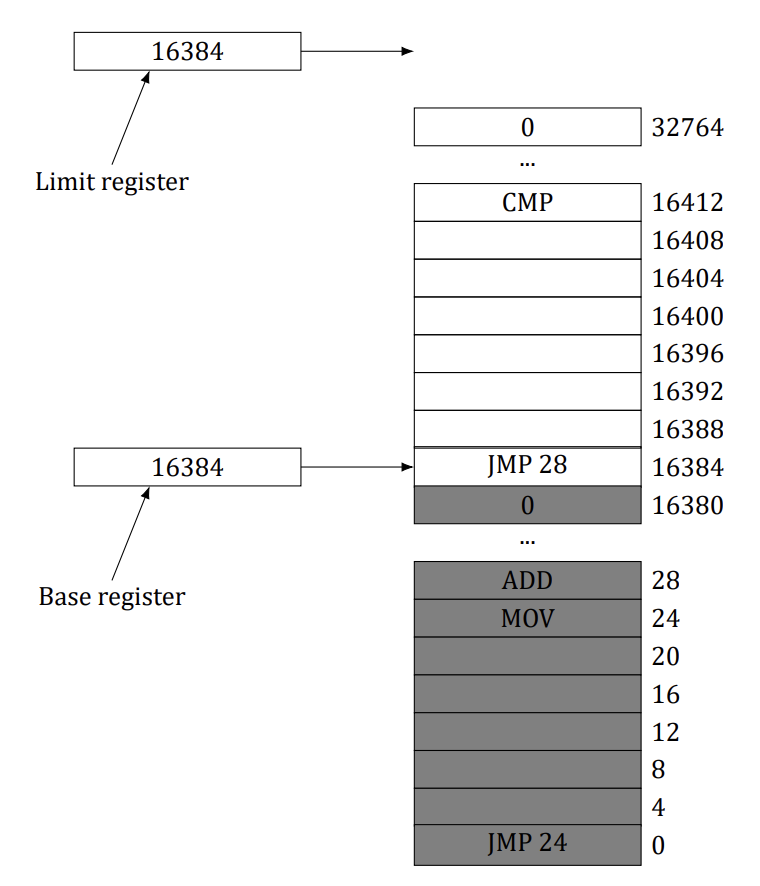

<details>
<summary>Solution</summary>

It is an accident. The base register is 16,384 because the program happened to be loaded at address 16,384. It
could have been loaded anywhere. The limit register is 16,384 because the program contains 16,384 bytes. It
could have been any length. That the load address happens to exactly match the program length is pure coincidence.

</details>

### Question 3
A swapping system eliminates holes by compaction. Assuming a random distribution of many holes and many
data segments and a time to read or write a 32-bit memory word of 4 ns, about how long does it take to compact
4 GB? For simplicity, assume that word 0 is part of a hole and that the highest word in memory contains valid
data.

<details>
<summary>Solution</summary>

Almost the entire memory has to be copied, which requires each word to be read and then rewritten at a different
location. Reading 4 bytes takes 4 ns, so reading 1 byte takes 1 ns and writing it takes another 1 ns, for a total of 2
ns per byte compacted. This is a rate of 500,000,000 bytes/sec. To copy 4 GB (2³² bytes, which is about 4.295 ×
10⁹ bytes), the computer needs 2³²/500,000,000 sec, which is about 8.6 sec. This number is slightly pessimistic
because if the initial hole at the bottom of memory is k bytes, those k bytes do not need to be copied. However,
if there are many holes and many data segments, the holes will be small, so k will be small and the error in the
calculation will also be small.

</details>

### **Question 4 (Final 2019)**
Consider a swapping system in which memory consists of the following hole sizes in memory order: 10 MB, 4
MB, 20 MB, 18 MB, 7 MB, 9 MB, 12 MB, and 15 MB. Which hole is taken for successive segment requests of

a) 12 MB
b) 10 MB
c) 9 MB

for first fit? Now repeat the question for best fit, worst fit, and next fit.

<details>
<summary>Solution</summary>

First fit takes 20 MB, 10 MB, 18 MB. Best fit takes 12 MB, 10 MB, and 9 MB. Worst fit takes 20 MB, 18 MB, and
15 MB. Next fit takes 20 MB, 18 MB, and 9 MB.

</details>

### **Question 5 (Tutorial 7)**
What is the difference between a physical address and a virtual address?

<details>
<summary>Solution</summary>

Long answer:
**Physical addresses:**
The addresses that are available in main memory unit
**Virtual addresses:**
The addresses generated by the CPU while running the application
program¹
¹ See TB, pg. 195

**Physical addresses:**
The physical memory is not enough to accommodate all the
programs that are to be executed, so only the application that is
currently being executed is put to the physical memory
**Virtual addresses:**
As the physical memory is not enough to accommodate all the
programs, CPU generates virtual addresses to all the programs
during compile time. These virtual addresses are mapped to the
physical address during run time or execution time

**Physical addresses:**
Refer to real memory location, they physically exist. These
addresses are loaded into the memory address register
**Virtual addresses:**
Are not real memory location. An illusion is created to the user
that each user program is assigned to a memory location

**Physical addresses:**
User cannot access these addresses. The MMU unit accesses data
from these address locations through memory bus
**Virtual addresses:**
User can access virtual address locations

Short answer:
Real memory uses physical addresses. These are the numbers that
the memory chips react to on the bus. Virtual addresses are the
logical addresses that refer to a process’ address space. Thus a
machine with a 32-bit word can generate virtual addresses up to 4
GiB regardless of whether the machine has more or less memory
than 4 GiB. For 64-bit machines, the theoretical limit is
2⁶⁴ = 16 Exbibytes = 16 ∗ 1024 Pebibytes = 16384 Pebibytes =
16384 ∗ 1024 Tebibytes.

</details>

### **Question 6 (Tutorial 7)**
For each of the following decimal virtual addresses, compute the virtual page number and offset for a 4-KB page
and for an 8 KB page: 20000, 32768, 60000.

<details>
<summary>Solution</summary>

Step 1. Page offset
Let’s take a page size of 4 KiB first. We must be able to access
every single address (every byte, actually) within a page. To do
this, we need 4 KiB (4096 = 2¹²) of offsets.
It means that 12 bits of an address will be given for the offset

Step 2. Virtual address 20000, page size 4 KiB

Step 3. Calculating other values
As it can be derived from the picture, for an 8 KiB page size page
number is 2 and offset is the same (3616).
Now try to solve the rest yourselves

| Virtual address | Page, offset (4 KiB) | Page, offset (8 KiB) |
|---|---|---|
| 20000 | (4, 3616) | (2, 3616) |
| 32768 | (8, 0) | (4, 0) |
| 60000 | (14, 2656) | (7, 2656) |

</details>

### **Question 7 (Tutorial 7)**
Using the page table of Figure 4, give the physical address corresponding to each of the following virtual addresses:

a) 20
b) 4100
c) 8300

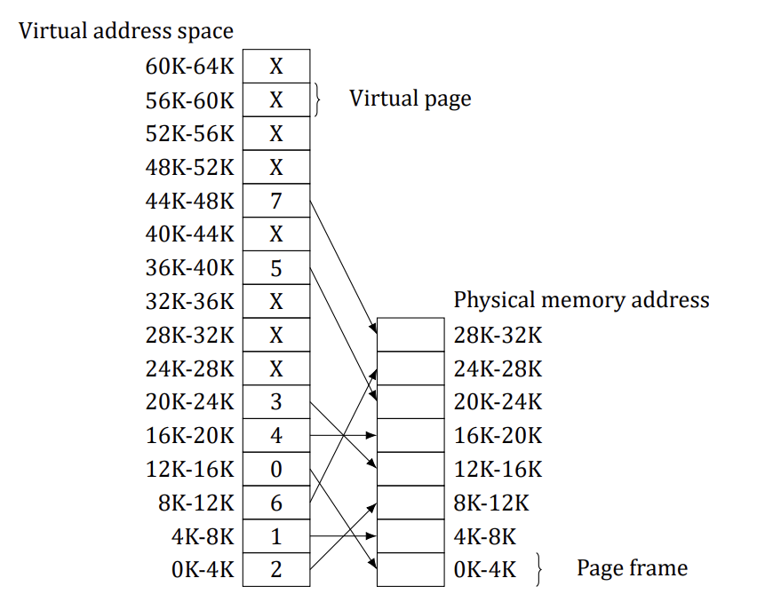

<details>
<summary>Solution</summary>

Virtual address 20 belongs to virtual page 0 which maps to
physical page 2.
It means that physical addresses are starting from 8192
So physical address corresponding to virtual address 20 is 8212.
Now try to find other addresses

Answer:
A. 8212
B. 4100
C. 24684

</details>

### Question 8
The Intel 8086 processor did not have an MMU or support virtual memory. Nevertheless, some companies sold
systems that contained an unmodified 8086 CPU and did paging. Make an educated guess as to how they did it.
(Hint: Think about the logical location of the MMU.)

<details>
<summary>Solution</summary>

They built an MMU and inserted it between the 8086 and the bus. Thus all 8086 physical addresses went into
the MMU as virtual addresses. The MMU then mapped them onto physical addresses, which went to the bus.

</details>

### Question 9
What kind of hardware support is needed for a paged virtual memory to work?

<details>
<summary>Solution</summary>

There needs to be an MMU that can remap virtual pages to physical pages. Also, when a page not currently
mapped is referenced, there needs to be a trap to the operating system so it can fetch the page.

</details>

### Question 10
Copy on write is an interesting idea used on server systems. Does it make any sense on a smartphone?

<details>
<summary>Solution</summary>

If the smartphone supports multiprogramming, which the iPhone, Android, and Windows phones all do, then
multiple processes are supported. If a process forks and pages are shared between parent and child, copy on
write definitely makes sense. A smartphone is smaller than a server, but logically it is not so different.

</details>

### **Question 11 (Tutorial 7, Retake 2.2 2016, Pre-Final 2025)**
Consider the following C program:
```c
int X[N];
int step = M;                       /* M is a given constant: the stride through the array. */
for (int i = 0; i < N; i += step)
    X[i] = X[i] + 1;                /* Touch every step-th element of the array. */
```
a) If this program is run on a machine with a 4-KB page size and 64-entry TLB, what values of M and N will

cause a TLB miss for every execution of the inner loop?

b) Would your answer in part **(a)** be different if the loop were repeated many times? Explain.

<details>
<summary>Solution</summary>

Let’s have a closer look on the memory structure:
X[0] X[. . . ]X[1023] X[1024] X[. . . ] X[2047] X[1024*k + 0] . . .
Page 0 Page 1 Page k
Minimum int size is 4 bytes which gives us 1024 integers per
4-KiB memory page

It means that after X[0] is accessed, accessing any of the
succeeding elements up to X[1023] would not generate TLB fault
However, if we try to access X[0], X[1024], X[2048] and so on, each
time a TLB miss will occur which means that M should be at least
1024

b) M should still be at least 1024 to cause a TLB miss for every
execution of the inner loop
Assuming that such page replacement algorithm as FIFO is used,
we need to fill the whole TLB and make one more reference to an
absent page to make sure that the page 0 is not in the TLB at the
beginning of each outer cycle
It means that we need to have at least 65 pages. In this case N
should be at least 64 * 1024 + 1

</details>

### **Question 12 (Tutorial 7)**
The amount of disk space that must be available for page storage is related to the maximum number of processes,
n, the number of bytes in the virtual address space, v, and the number of bytes of RAM, r. Give an expression for
the worst-case disk-space requirements. How realistic is this amount?

<details>
<summary>Solution</summary>

The total virtual address space for all the processes combined is
n*v, so this much storage is needed for pages
However, an amount r can be in RAM, so the amount of disk
storage required is only n*v - r

This amount is far more than is ever needed in practice because
rarely will there be n processes actually running and even more
rarely will all of them need the maximum allowed virtual memory

</details>

### Question 13
If an instruction takes 1 ns and a page fault takes an additional n ns, give a formula for the effective instruction
time if page faults occur every k instructions.

<details>
<summary>Solution</summary>

A page fault every k instructions adds an extra overhead of n/k ns to the average, so the average instruction
takes 1 + n/k ns.

</details>

### **Question 14 (Final 2017)**
A machine has a 32-bit address space and an 8-KB page. The page table is entirely in hardware, with one 32-bit
word per entry. When a process starts, the page table is copied to the hardware from memory, at one word every
100 ns. If each process runs for 100 ms (including the time to load the page table), what fraction of the CPU time
is devoted to loading the page tables?

<details>
<summary>Solution</summary>

The page table contains 2³²/2¹³ entries, which is 524,288. Loading the page table takes 52 ms. If a process gets
100 ms, this consists of 52 ms for loading the page table and 48 ms for running. Thus 52% of the time is spent
loading page tables.

</details>

### **Question 15 (Retake 1 2016, Final 2017, Pre-Final 2020)**
Suppose that a machine has 48-bit virtual addresses and 32-bit physical addresses.

a) If pages are 4 KB, how many entries are in the page table if it has only a single level? Explain.
b) Suppose this same system has a TLB (Translation Look aside Buffer) with 32 entries. Furthermore, suppose that a program contains instructions that fit into one page and it sequentially reads long integer
elements from an array that spans thousands of pages. How effective will the TLB be for this case?

<details>
<summary>Solution</summary>

Under these circumstances:

a) We need one entry for each virtual page, or 2³⁶ = 64 × 1024 × 1024 × 1024 entries, since there are 36 = 48 − 12 bits in the page number field.

b) Instruction addresses will hit 100% in the TLB. The data pages will have a 100% hit rate until the program

has moved onto the next data page. Since a 4-KB page contains 1,024 long integers, there will be one TLB
miss and one extra memory access for every 1,024 data references.

</details>

### **Question 16 (Retake 2 2017, Pre-Final 2025)**
You are given the following data about a virtual memory system:

a) The TLB can hold 1024 entries and can be accessed in 1 clock cycle (1 ns).
b) A page table entry can be found in 100 clock cycles or 100 ns.
c) The average page replacement time is 6 ms.

If page references are handled by the TLB 99% of the time, and only 0.01% lead to a page fault, what is the
effective address-translation time?

<details>
<summary>Solution</summary>

The chance of a hit is 0.99 for the TLB, 0.0099 for the page table, and 0.0001 for a page fault (i.e., only 1 in 10,000
references will cause a page fault). The effective address translation time in nsec is then:
0.99 × 1 + 0.0099 × 100 + 0.0001 × 6 × 10⁶ ≈ 602 ns.
Note that the effective address translation time is quite high because it is dominated by the page replacement
time even when page faults only occur once in 10,000 references.

</details>

### Question 17
Suppose that a machine has 38-bit virtual addresses and 32-bit physical addresses.

a) What is the main advantage of a multilevel page table over a single-level one?
b) With a two-level page table, 16-KB pages, and 4-byte entries, how many bits should be allocated for the

top-level page table field and how many for the next-level page table field? Explain.

<details>
<summary>Solution</summary>

Consider,

a) A multilevel page table reduces the number of actual pages of the page table that need to be in memory

because of its hierarchic structure. In fact, in a program with lots of instruction and data locality, we only
need the top-level page table (one page), one instruction page, and one data page.

b) Allocate 12 bits for each of the two page fields. The offset field requires 14 bits to address 16 KB. That

leaves 24 bits for the page fields. Since each entry is 4 bytes, one page can hold 2¹² page table entries and
therefore requires 12 bits to index one page. So allocating 12 bits for each of the page fields will address
all 2³⁸ bytes.

</details>

### Question 18
Section 3.3.4 states that the Pentium Pro extended each entry in the page table hierarchy to 64 bits but still could
only address only 4 GB of memory. Explain how this statement can be true when page table entries have 64 bits.

<details>
<summary>Solution</summary>

The virtual address was changed from (PT1, PT2, Offset) to (PT1, PT2, PT3, Offset). But the virtual address still
used only 32 bits. The bit configuration of a virtual address changed from (10, 10, 12) to (2, 9, 9, 12).

</details>

### **Question 19 (Final 2018, Final 2019)**
A computer with a 32-bit address uses a two-level page table. Virtual addresses are split into a 9-bit top-level
page table field, an 11-bit second-level page table field, and an offset. How large are the pages and how many
are there in the address space?

<details>
<summary>Solution</summary>

Twenty bits are used for the virtual page numbers, leaving 12 over for the offset. This yields a 4-KB page. Twenty
bits for the virtual page implies 2²⁰ pages.

</details>

### **Question 20 (Final 2019)**
A computer has 32-bit virtual addresses and 4-KB pages. The program and data together fit in the lowest page
(0–4095) The stack fits in the highest page. How many entries are needed in the page table if traditional (onelevel) paging is used? How many page table entries are needed for two-level paging, with 10 bits in each part?

<details>
<summary>Solution</summary>

For a one-level page table, there are 2³²/2¹² or 1M pages needed. Thus the page table must have 1M entries. For
two-level paging, the main page table has 1K entries, each of which points to a second page table. Only two of
these are used. Thus, in total only three page table entries are needed, one in the top-level table and one in each
of the lower-level tables.

</details>

### Question 21
Below is an execution trace of a program fragment for a computer with 512-byte pages. The program is located
at address 1020, and its stack pointer is at 8192 (the stack grows toward 0). Give the page reference string
generated by this program. Each instruction occupies 4 bytes (1 word) including immediate constants. Both
instruction and data references count in the reference string.

- Load word 6144 into register 0
- Push register 0 onto the stack
- Call a procedure at 5120, stacking the return address
- Subtract the immediate constant 16 from the stack pointer
- Compare the actual parameter to the immediate constant 4
- Jump if equal to 5152

<details>
<summary>Solution</summary>

The code and reference string are as follows:

```text
LOAD 6144,R0   1(I), 12(D)
PUSH R0        2(I), 15(D)
CALL 5120      2(I), 15(D)
JEQ 5152       10(I)
```

The code (I) indicates an instruction reference, whereas (D) indicates a data reference.

</details>

### Question 22
A computer whose processes have 1024 pages in their address spaces keeps its page tables in memory. The
overhead required for reading a word from the page table is 5 ns. To reduce this overhead, the computer has
a TLB, which holds 32 (virtual page, physical page frame) pairs, and can do a lookup in 1 ns. What hit rate is
needed to reduce the mean overhead to 2 ns?

<details>
<summary>Solution</summary>

The effective instruction time is 1h + 5(1 - h), where h is the hit rate. If we equate this formula with 2 and solve
for h, we find that h must be at least 0.75.

</details>

### Question 23
How can the associative memory device needed for a TLB be implemented in hardware, and what are the implications of such a design for expand ability?

<details>
<summary>Solution</summary>

An associative memory essentially compares a key to the contents of multiple registers simultaneously. For
each register there must be a set of comparators that compare each bit in the register contents to the key being
searched for. The number of gates (or transistors) needed to implement such a device is a linear function of the
number of registers, so expanding the design gets expensive linearly.

</details>

### Question 24
A machine has 48-bit virtual addresses and 32-bit physical addresses. Pages are 8 KB. How many entries are
needed for a single-level linear page table?

<details>
<summary>Solution</summary>

With 8-KB pages and a 48-bit virtual address space, the number of virtual pages is 2⁴⁸/2¹³, which is 2³⁵ (about
34 billion).

</details>

### Question 25
A computer with an 8-KB page, a 256-KB main memory, and a 64-GB virtual address space uses an inverted page
table to implement its virtual memory. How big should the hash table be to ensure a mean hash chain length of
less than 1? Assume that the hash-table size is a power of two.

<details>
<summary>Solution</summary>

The main memory has 2²⁸/2¹³ = 32,768 pages. A 32K hash table will have a mean chain length of 1. To get
under 1, we have to go to the next size, 65,536 entries. Spreading 32,768 entries over 65,536 table slots will
give a mean chain length of 0.5, which ensures fast lookup.

</details>

### Question 26
A student in a compiler design course proposes to the professor a project of writing a compiler that will produce
a list of page references that can be used to implement the optimal page replacement algorithm. Is this possible?
Why or why not? Is there anything that could be done to improve paging efficiency at run time?

<details>
<summary>Solution</summary>

This is probably not possible except for the unusual and not very useful case of a program whose course of
execution is completely predictable at compilation time. If a compiler collects information about the locations
in the code of calls to procedures, this information might be used at link time to rearrange the object code so
that procedures were located close to the code that calls them. This would make it more likely that a procedure
would be on the same page as the calling code. Of course this would not help much for procedures called from
many places in the program.

</details>

### **Question 27 (Tutorial 8)**
Suppose that the virtual page reference stream contains repetitions of long sequences of page references followed occasionally by a random page reference. For example, the sequence: 0, 1, …, 511, 431, 0, 1, …, 511, 332,
0, 1, … consists of repetitions of the sequence 0, 1, …, 511 followed by a random reference to pages 431 and 332.

a) Why will the standard replacement algorithms (LRU, FIFO, clock) not be effective in handling this workload

for a page allocation that is less than the sequence length?

b) If this program were allocated 500 page frames, describe a page replacement approach that would perform

much better than the LRU, FIFO, or clock algorithms.

<details>
<summary>Solution</summary>

A. Consider, for example, a page allocation scheme with 510 frames.
First 510 references will generate page faults because none of the pages
are in memory. The next reference will generate page fault too and also
will push page 1 out of memory. Therefore, every reference will page
fault unless the number of page frames is 512, the length of the entire
sequence.

B. If there are only 500 frames, the alternative approach would be to
map pages 0–498 to fixed frames and vary only one frame

</details>

### **Question 28 (Tutorial 8)**
If FIFO page replacement is used with four page frames and eight pages, how many page faults will occur with
the reference string 0172327103 if the four frames are initially empty? Now repeat this problem for LRU.

<details>
<summary>Solution</summary>

The page frames for FIFO are as follows:

```text
x|0|1|7|2|3|3|3|3|0|0
x|x|0|1|7|2|2|2|2|3|3
x|x|x|0|1|7|7|7|7|2|2
x|x|x|x|0|1|1|1|1|7|7
```

Page frames; Reference string: 0172327103.

The page frames for LRU are as follows:

```text
x|0|1|7|2|3|2|7|1|0|3
x|x|0|1|7|2|3|2|7|1|0
x|x|x|0|1|7|7|3|2|7|1
x|x|x|x|0|1|1|1|3|2|7
```

Page frames; Reference string: 0172327103 (updates only the order in the linked list).

</details>

### Question 29
Consider the page sequence of Figure 5. Suppose that the R bits for the pages B through A are 11011011, respectively. Which page will second chance remove?

Page list if a page fault occurs at time 20 and A has its R bit set. The numbers above the pages are their load times.

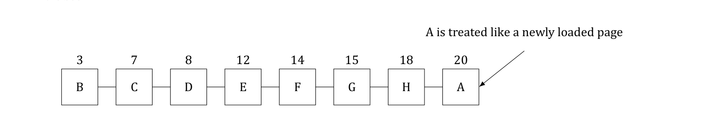

<details>
<summary>Solution</summary>

The first page with a 0 bit will be chosen, in this case D.

</details>

### **Question 30 (Tutorial 8)**
A small computer on a smart card has four page frames. At the first clock tick, the R bits are 0111 (page 0 is 0,
the rest are 1). At subsequent clock ticks, the values are 1011, 1010, 1101, 0010, 1010, 1100, and 0001. If the
aging algorithm is used with an 8-bit counter, give the values of the four counters after the last tick.

<details>
<summary>Solution</summary>

The counters after the first tick are:
Page 0: 0 0 0 0 0 0 0 0
Page 1: 1 0 0 0 0 0 0 0
Page 2: 1 0 0 0 0 0 0 0
Page 3: 1 0 0 0 0 0 0 0

The counters after the second tick are:
Page 0: 1 0 0 0 0 0 0 0
Page 1: 0 1 0 0 0 0 0 0
Page 2: 1 1 0 0 0 0 0 0
Page 3: 1 1 0 0 0 0 0 0

The final counters are:
Page 0: 0 1 1 0 1 1 1 0 = 110₁₀
Page 1: 0 1 0 0 1 0 0 1 = 73₁₀
Page 2: 0 0 1 1 0 1 1 1 = 55₁₀
Page 3: 1 0 0 0 1 0 1 1 = 139₁₀

</details>

### **Question 31 (Tutorial 8)**
Give a simple example of a page reference sequence where the first page selected for replacement will be different for the clock and LRU page replacement algorithms. Assume that a process is allocated 3 = three frames, and
the reference string contains page numbers from the set 0, 1, 2, 3.

<details>
<summary>Solution</summary>

Clock algorithm:
When a page fault occurs, the page the hand is pointing to is
inspected. The action taken depends on the R bit:
R = 0: Evict the page
R = 1: Clear R and advance hand
LRU:
When a page fault occurs, throw out the page that has been unused
for the longest time

Let’s consider a simple reference string 0123:
According to clock algorithm, pages will be organized as a circle
and the hand will point to page 0. If we refer page 3, then R bits of
every page will be cleared and on the second round page 0 will be
evicted from memory
According to LRU, page 0 will be evicted too since it has been
unused for the longest time

Consider the sequence 0 1 2 1 2 0 3
In LRU, page 1 will be replaced by page 3
In clock, page 0 will be replaced, since all pages will be marked
(R=1) and the cursor is at page 0.

</details>

### **Question 32 (Tutorial 8)**
In the WSClock algorithm of Figure 6, the hand points to a page with R = 0. If τ = 400, will this page be removed?
What about if τ = 1000?

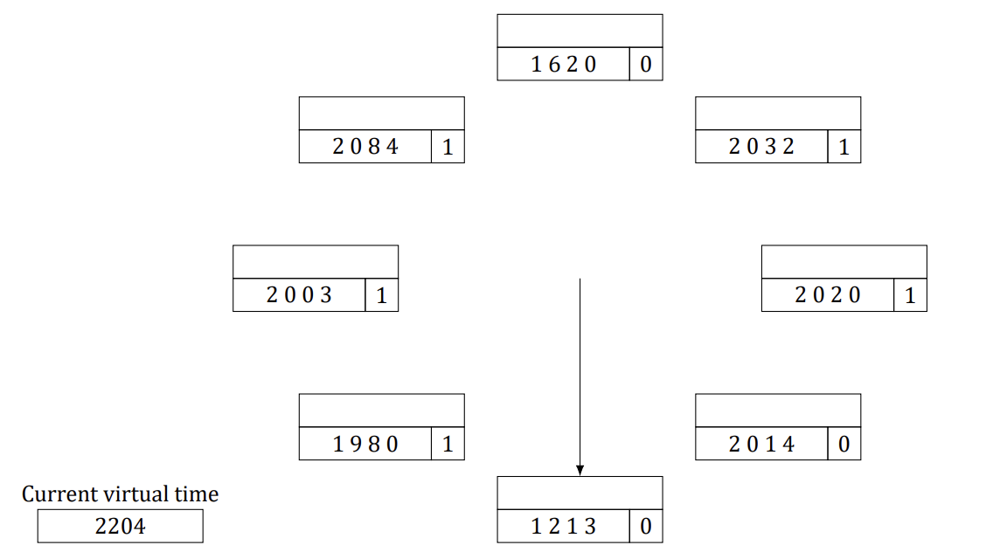

<details>
<summary>Solution</summary>

The age of the page is 2204−1213 = 991
If τ = 400, it is definitely out of the working set and was not
recently referenced so it will be evicted
The τ = 1000 situation is different. Now the page falls within the
working set (barely), so it is not removed

</details>

### **Question 33 (Pre-Final 2020)**
Suppose that the WSClock page replacement algorithm uses a τ of two ticks, and the system state is the following:

| Page | Time stamp | V | R | M |
|---|---|---|---|---|
| 0 | 6 | 1 | 0 | 1 |
| 1 | 9 | 1 | 1 | 0 |
| 2 | 9 | 1 | 1 | 1 |
| 3 | 7 | 1 | 0 | 0 |
| 4 | 4 | 0 | 0 | 1 |

where the three flag bits V, R, and M stand for Valid, Referenced, and Modified, respectively.

a) If a clock interrupt occurs at tick 10, show the contents of the new table entries. Explain. (You can omit entries that are unchanged.)
b) Suppose that instead of a clock interrupt, a page fault occurs at tick 10 due to a read request to page 4.

Show the contents of the new table entries. Explain. (You can omit entries that are unchanged.)

<details>
<summary>Solution</summary>

Consider,

a) For every R bit that is set, set the time-stamp value to 10 and clear all R bits. You could also change the

(0,1) R-M entries to (0,0*). So the entries for pages 1 and 2 will change to:

| Page | Time stamp | V | R | M |
|---|---|---|---|---|
| 0 | 6 | 1 | 0 | 0* |
| 1 | 10 | 1 | 0 | 0 |
| 2 | 10 | 1 | 0 | 1 |

b) Evict page 3 (R = 0 and M = 0) and load page 4:

| Page | Time stamp | V | R | M | Notes |
|---|---|---|---|---|---|
| 0 | 6 | 1 | 0 | 1 |  |
| 1 | 9 | 1 | 0 | 0 |  |
| 2 | 9 | 1 | 1 | 1 |  |
| 3 | 7 | 0 | 0 | 0 | Changed from 7 (1, 0, 0) |
| 4 | 10 | 1 | 1 | 0 | Changed from 4 (0, 0, 0) |

</details>

### Question 34
A student has claimed that “in the abstract, the basic page replacement algorithms (FIFO, LRU, optimal) are
identical except for the attribute used for selecting the page to be replaced.’’

a) What is that attribute for the FIFO algorithm? LRU algorithm? Optimal algorithm?
b) Give the generic algorithm for these page replacement algorithms.

<details>
<summary>Solution</summary>

a) The attributes are: (FIFO) load time; (LRU) latest reference time; and (Optimal) nearest reference time in

the future.

b) There is the labeling algorithm and the replacement algorithm. The labeling algorithm labels each page

with the attribute given in part a. The replacement algorithm evicts the page with the smallest label.

</details>

### Question 35
How long does it take to load a 64-KB program from a disk whose average seek time is 5 msec, whose rotation
time is 5 msec, and whose tracks hold 1 MB

a) for a 2-KB page size?
b) for a 4-KB page size?

The pages are spread randomly around the disk and the number of cylinders is so large that the chance of two
pages being on the same cylinder is negligible.

<details>
<summary>Solution</summary>

The seek plus rotational latency is 10 ms. For 2-KB pages, the transfer time is about 0.009766 ms, for a total of
about 10.009766 ms. Loading 32 of these pages will take about 320.31 ms. For 4-KB pages, the transfer time
is doubled to about 0.01953 ms, so the total time per page is 10.01953 ms. Loading 16 of these pages takes
about 160.3125 ms. With such fast disks, all that matters is reducing the number of transfers (or putting the
pages consecutively on the disk).

</details>

### Question 36
A computer has four page frames. The time of loading, time of last access, and the R and M bits for each page
are as shown below (the times are in clock ticks):

| Page | Loaded | Last ref. | R | M |
|---|---|---|---|---|
| 0 | 126 | 280 | 1 | 0 |
| 1 | 230 | 265 | 0 | 1 |
| 2 | 140 | 270 | 0 | 0 |
| 3 | 110 | 285 | 1 | 1 |

a) Which page will NRU replace?
b) Which page will FIFO replace?
c) Which page will LRU replace?
d) Which page will second chance replace?

<details>
<summary>Solution</summary>

NRU removes page 2. FIFO removes page 3. LRU removes page 1. Second chance removes page 2.

</details>

### **Question 37 (Pre-Final 2020)**
Suppose that two processes A and B share a page that is not in memory. If process A faults on the shared page,
the page table entry for process A must be updated once the page is read into memory.

a) Under what conditions should the page table update for process B be delayed even though the handling

of process A’s page fault will bring the shared page into memory? Explain.

b) What is the potential cost of delaying the page table update?

<details>
<summary>Solution</summary>

Sharing pages brings up all kinds of complications and options:

a) The page table update should be delayed for process B if it will never access the shared page or if it accesses it when the page has been swapped out again. Unfortunately, in the general case, we do not know

what process B will do in the future.

b) The cost is that this lazy page fault handling can incur more page faults. The overhead of each page fault

plays an important role in determining if this strategy is more efficient. (Aside: This cost is similar to that
faced by the copy-on-write strategy for supporting some UNIX fork system call implementations.)

</details>

### **Question 38 (Tutorial 9)**
Consider the following two-dimensional array:

`int X[64][64];`

Suppose that a system has four page frames and each frame is 128 words (an integer occupies one word). Programs that manipulate the X array fit into exactly one page and always occupy page 0. The data are swapped
in and out of the other three frames. The X array is stored in row-major order (i.e., X[0][1] follows X[0][0]
in memory). Which of the two code fragments shown below will generate the lowest number of page faults?
Explain and compute the total number of page faults.

Fragment A:

```c
/* Clear the 64x64 matrix column by column (strided access: cache-unfriendly). */
for (int j = 0; j < 64; j++)
    for (int i = 0; i < 64; i++)
        X[i][j] = 0;
```

Fragment B:

```c
/* Clear the 64x64 matrix row by row (sequential access: cache-friendly). */
for (int i = 0; i < 64; i++)
    for (int j = 0; j < 64; j++)
        X[i][j] = 0;
```

<details>
<summary>Solution</summary>

Step 1:
The fragment B will generate the lowest number of page faults
since the code has more spatial locality than Fragment A

Step 2 (Fragment B):
Clearly fragment B initializes the X array elements row-wise: first
element X[0][0] is initialized, and then X[0][1] followed by X[0][2]
and so on. Thus for each iteration of the outer loop, one page fault
occurs for the inner loop.
Given that one frame is of 128 words and one row has 64 integers
each of which are of one word, the number of rows of the array in
one page is 2 (=128/64)
As there are 64 rows in total, the number of page faults caused by
fragments B would be 32 (=64/2)

Step 3 (Fragment A):
Since a frame is 128 words, one row of the X array occupies half of
a page (i.e., 64 words)
For each alternate element access of X[i][j], a new page fault will
occur as two rows fit in one page
The total number of page faults will be 64 × 64/2 = 2,048

</details>

### Question 39
You have been hired by a cloud computing company that deploys thousands of servers at each of its data centers.
They have recently heard that it would be worthwhile to handle a page fault at server A by reading the page from
the RAM memory of some other server rather than its local disk drive.

a) How could that be done?
b) Under what conditions would the approach be worthwhile? Be feasible?

<details>
<summary>Solution</summary>

It can certainly be done.

a) The approach has similarities to using flash memory as a paging device in smartphones except now the virtual swap area is a RAM located on a remote server. All of the software infrastructure for the virtual
swap area would have to be developed.

b) The approach might be worthwhile by noting that the access time of disk drives is in the millisecond range

while the access time of RAM via a network connection is in the microsecond range if the software overhead is not too high. But the approach might make sense only if there is lots of idle RAM in the server farm.
And then, there is also the issue of reliability. Since RAM is volatile, the virtual swap area would be lost if
the remote server went down.

</details>

### **Question 40 (Final 2018)**
One of the first timesharing machines, the DEC PDP-1, had a (core) memory of 4K 18-bit words. It held one
process at a time in its memory. When the scheduler decided to run another process, the process in memory
was written to a paging drum, with 4K 18-bit words around the circumference of the drum. The drum could
start writing (or reading) at any word, rather than only at word 0. Why do you suppose this drum was chosen?

<details>
<summary>Solution</summary>

The PDP-1 paging drum had the advantage of no rotational latency. This saved half a rotation each time memory
was written to the drum.

</details>

### **Question 41 (Tutorial 9, Retake 2.1 2016)**
A computer provides each process with 65,536 bytes of address space divided into pages of 4096 bytes each. A
particular program has a text size of 32,768 bytes, a data size of 16,386 bytes, and a stack size of 15,870 bytes.
Will this program fit in the machine’s address space? Suppose that instead of 4096 bytes, the page size were
512 bytes, would it then fit? Each page must contain either text, data, or stack, not a mixture of two or three of
them.

<details>
<summary>Solution</summary>

The text is eight pages, the data are five pages, and the stack is
four pages. The program does not fit because it needs 17
4096-byte pages
With a 512-byte page, the situation is different. Here the text is
64 pages, the data are 33 pages, and the stack is 31 pages, for a
total of 128 512-byte pages, which fits. With the small page size it
is OK, but not with the large one.

</details>

### Question 42
It has been observed that the number of instructions executed between page faults is directly proportional to the
number of page frames allocated to a program. If the available memory is doubled, the mean interval between
page faults is also doubled. Suppose that a normal instruction takes 1 µs, but if a page fault occurs, it takes 2001
µsec (i.e., 2 ms) to handle the fault. If a program takes 60 sec to run, during which time it gets 15,000 page faults,
how long would it take to run if twice as much memory were available?

<details>
<summary>Solution</summary>

The program is getting 15,000 page faults, each of which uses 2 ms of extra processing time. Together, the page
fault overhead is 30 sec. This means that of the 60 sec used, half was spent on page fault overhead, and half on
running the program. If we run the program with twice as much memory, we get half as many memory page
faults, and only 15 sec of page fault overhead, so the total run time will be 45 sec.

</details>

### Question 43
A group of operating system designers for the Frugal Computer Company are thinking about ways to reduce the
amount of backing store needed in their new operating system. The head guru has just suggested not bothering
to save the program text in the swap area at all, but just page it in directly from the binary file whenever it is
needed. Under what conditions, if any, does this idea work for the program text? Under what conditions, if any,
does it work for the data?

<details>
<summary>Solution</summary>

It works for the program if the program cannot be modified. It works for the data if the data cannot be modified.
However, it is common that the program cannot be modified and extremely rare that the data cannot be modified.
If the data area on the binary file were overwritten with updated pages, the next time the program was started,
it would not have the original data.

</details>

### Question 44
A machine-language instruction to load a 32-bit word into a register contains the 32-bit address of the word to
be loaded. What is the maximum number of page faults this instruction can cause?

<details>
<summary>Solution</summary>

The instruction could lie astride a page boundary, causing two page faults just to fetch the instruction. The word
fetched could also span a page boundary, generating two more faults, for a total of four. If words must be aligned
in memory, the data word can cause only one fault, but an instruction to load a 32-bit word at address 4094 on
a machine with a 4-KB page is legal on some machines (including the x86).

</details>

### **Question 45 (Tutorial 9)**
Explain the difference between internal fragmentation and external fragmentation. Which one occurs in paging
systems? Which one occurs in systems using pure segmentation?

<details>
<summary>Solution</summary>

Internal fragmentation occurs when the last allocation unit is
not full
External fragmentation occurs when space is wasted between
two allocation units
In a paging system, the wasted space in the last page is lost to
internal fragmentation
In a pure segmentation system, some space is invariably lost
between the segments. This is due to external fragmentation.

| Internal Fragmentation | External Fragmentation |
|---|---|
| When memory is allocated to a process is larger than the memory requested by the process, the amount of memory not used by the process leads to internal fragmentation, this memory cannot be allocated to another process and wasted. | External fragmentation occurs when a process is allocated with memory which is not contiguous; sometimes the memory blocks in between these allocated memory blocks remain unused leading to external fragmentation. |

When they occur, . . .

| Internal Fragmentation | External Fragmentation |
|---|---|
| Occurs in programs or process where the program is divided into same size fixed partitions, in which at least one partition would be smaller than the memory block allocated. | Occurs when programs are allocated exactly the requested amount of memory in multiple variable sized memory blocks. |

And to which programs they occur:

| Internal Fragmentation | External Fragmentation |
|---|---|
| Can be overcome by allocating multiple variable sized memory blocks, and compact all the blocks into one large block. | Can be reduced by compaction that is moving all the free memory blocks to one place and making it into a large memory block which can be allocated to a process. |

How to address:

| Internal Fragmentation | External Fragmentation |
|---|---|
| Is usually observed in paging systems where fixed size pages are allocated for a program and the last partition of the program may not require the entire page. | Is seen in segmentation where memory is not allocated contiguously and in fixed partitions, leading to unused memory blocks. |

Observed when . . .

</details>

### Question 46
When segmentation and paging are both being used, as in MULTICS, first the segment descriptor must be looked
up, then the page descriptor. Does the TLB also work this way, with two levels of lookup?

<details>
<summary>Solution</summary>

No. The search key uses both the segment number and the virtual page number, so the exact page can be

found in a single match.

</details>

### **Question 47 (Retake 1 2017)**
We consider a program which has the two segments shown below consisting of instructions in segment 0, and
read/write data in segment 1. Segment 0 has read/execute protection, and segment 1 has just read/write protection. The memory system is a demand paged virtual memory system with virtual addresses that have a 4-bit
page number, and a 10-bit offset. The page tables and protection are as follows (all numbers in the table are in
decimal):

Segment 0: Read/Execute; Segment 1: Read/Write.

| Segment 0 (Read/Execute) |  | Segment 1 (Read/Write) |  |
|---|---|---|---|
| Virtual Page # | Page frame # | Virtual Page # | Page frame # |
| 0 | 2 | 0 | On Disk |
| 1 | On Disk | 1 | 14 |
| 2 | 11 | 2 | 9 |
| 3 | 5 | 3 | 6 |
| 4 | On Disk | 4 | On Disk |
| 5 | On Disk | 5 | 13 |
| 6 | 4 | 6 | 8 |
| 7 | 3 | 7 | 12 |

For each of the following cases, either give the real (actual) memory address which results from dynamic address
translation or identify the type of fault which occurs (either page or protection fault).

a) Fetch from segment 1, page 1, offset 3
b) Store into segment 0, page 0, offset 16
c) Fetch from segment 1, page 4, offset 28
d) Jump to location in segment 1, page 3, offset 32

<details>
<summary>Solution</summary>

Here are the results:

|  | Address | Fault? |
|---|---|---|
| (a) | (14, 3) | No (or 0xD3 or 1110 0011) |
| (b) | NA | Protection fault: Write to read/execute segment |
| (c) | NA | Page fault |
| (d) | NA | Protection fault: Jump to read/write segment |

</details>

### **Question 48 (Tutorial 9)**
Can you think of any situations where supporting virtual memory would be a bad idea, and what would be gained
by not having to support virtual memory? Explain.

<details>
<summary>Solution</summary>

General virtual memory support is not needed when the memory
requirements of all applications are well known and controlled.
Some examples are:

- Only a single program that is small enough to fit within the
memory is running
- Multiple programs that fit within the memory and their sizes don’t
change
- Smart cards, special-purpose processors (e.g., network processors),
and embedded processors

In these situations, we should always consider the possibility of
using more real memory. If the operating system did not have to
support virtual memory, the code would be much simpler and
smaller
On the other hand, some ideas from virtual memory may still be
profitably exploited, although with different design requirements.
For example, program/thread isolation might be paging to flash
memory

</details>

### Question 49
Virtual memory provides a mechanism for isolating one process from another. What memory management difficulties would be involved in allowing two operating systems to run concurrently? How might these difficulties
be addressed?

<details>
<summary>Solution</summary>

This question addresses one aspect of virtual machine support. Recent attempts include Denali, Xen, and VMware.
The fundamental hurdle is how to achieve near-native performance, that is, as if the executing operating system
had memory to itself. The problem is how to quickly switch to another operating system and therefore how to
deal with the TLB. Typically, you want to give some number of TLB entries to each kernel and ensure that each
kernel operates within its proper virtual memory context. But sometimes the hardware (e.g., some Intel architectures) wants to handle TLB misses without knowledge of what you are trying to do. So, you need to either
handle the TLB miss in software or provide hardware support for tagging TLB entries with a context ID.

</details>

### Question 50
Plot a histogram and calculate the mean and median of the sizes of executable binary files on a computer to which
you have access. On a Windows system, look at all .exe and .dll files; on a UNIX system look at all executable files
in /bin, /usr/bin, and /local/bin that are not scripts (or use the file utility to find all executables). Determine
the optimal page size for this computer just considering the code (not data). Consider internal fragmentation
and page table size, making some reasonable assumption about the size of a page table entry. Assume that all
programs are equally likely to be run and thus should be weighted equally.

<details>
<summary>Solution</summary>

Method (the page-size tradeoff): for each candidate page size, round every measured binary up to a whole number of pages — the leftover in the last page is internal fragmentation (on average half a page per program) — and add the page-table cost (one entry per page times the entry size). The optimal size is the one minimizing fragmentation waste plus table overhead over the whole histogram.

</details>

### Question 51
Write a program that simulates a paging system using the aging algorithm. The number of page frames is a
parameter. The sequence of page references should be read from a file. For a given input file, plot the number
of page faults per 1000 memory references as a function of the number of page frames available.

<details>
<summary>Solution</summary>

Implement the aging algorithm: keep one software counter per page frame; at each clock tick shift every counter right by one bit and OR the current R bit into the leftmost position, then clear R. On a fault evict the page with the smallest counter (closest to least-recently-used). Expected result: page faults per 1000 references fall steeply as frames are added and then flatten out — the classic diminishing-returns curve.

</details>

### Question 52
Write a program that simulates a toy paging system that uses the WSClock algorithm. The system is a toy in
that we will assume there are no write references (not very realistic), and process termination and creation are
ignored (eternal life). The inputs will be:

- The reclamation age threshold
- The clock interrupt interval expressed as number of memory references
- A file containing the sequence of page references
a) Describe the basic data structures and algorithms in your implementation.
b) Show that your simulation behaves as expected for a simple (but nontrivial) input example.
c) Plot the number of page faults and working set size per 1000 memory references.
d) Explain what is needed to extend the program to handle a page reference stream that also includes writes.

<details>
<summary>Solution</summary>


a) There are two main data structures in the program:

Struct Page is the structure of page for WSClock, where id is identifier of page, R is bit R, last time use is
time when page was used last time, and the last two fields are references for next and previous page.
Struct ClockHand has only one field: the page on which the clock hand points.
I used only one algorithm, it is the WSClock algorithm. Description of this algorithm is in paragraph 3.4.9
in the book.

b) For age time is 3, clock interrupt interval 10, and references:

1 2 3 4 5 6 7 8 9 10 11 12 1 2 8 9 9 13 12
Result:
There is a filling of the WS in the first 8 lines
```text
1 2
1 2 3
1 2 3 4
1 2 3 4 5
1 2 3 4 5 6
1 2 3 4 5 6 7
1 2 3 4 5 6 7 8
```

Then we substitute page 1 with 9, because 1 was the oldest page (the same in the next 5 steps)
```text
2 3 4 5 6 7 8 9
3 4 5 6 7 8 9 10
4 5 6 7 8 9 10 11
5 6 7 8 9 10 11 12
6 7 8 9 10 11 12 1
7 8 9 10 11 12 1 2
```
WS isn’t changed, because we reference to the existing page
```text
7 8 9 10 11 12 1 2
7 8 9 10 11 12 1 2
7 8 9 10 11 12 1 2
```
Add page 13 and reference to existing pages
```text
8 9 10 11 12 1 2 13
8 9 10 11 12 1 2 13
```
Correct result:

```text
8 9 10 11 12 1 2 13
```

c) Result for 10000 pages and for 1000 references:

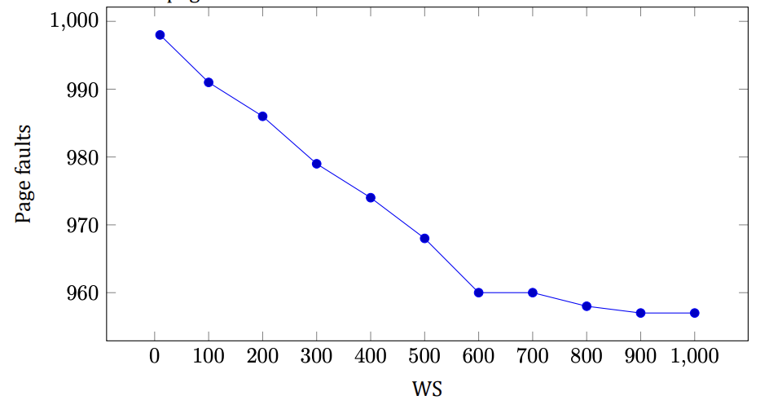

Result: the smaller the working set, the more page faults.

d) First of all, we need to add bit M, that indicate whether page was modified, also queue where will be pages

which are waiting to update page in the disk. And time of updating for each page in the queue.
</details>

### Question 53
Write a program that demonstrates the effect of TLB misses on the effective memory access time by measuring
the per-access time it takes to stride through a large array.

a) Explain the main concepts behind the program, and describe what you expect the output to show for some

practical virtual memory architecture.

b) Run the program on some computer and explain how well the data fit your expectations.
c) Repeat part **(b)** but for an older computer with a different architecture and explain any major differences

in the output.

<details>
<summary>Solution</summary>


a) There exist two arrays. One is so big, which is like Page table in program. Another one is small array, which

is like TLB in program. So, I expect that a page in TLB will be found many times faster than in Page table.

b) I have TLB on 1000 pages, and Page table on 100000000 pages. So, search in TLB is less than 1 ms, at the

same time search in Page table is around 200 ms.
</details>

### Question 54
Write a program that will demonstrate the difference between using a local page replacement policy and a global
one for the simple case of two processes. You will need a routine that can generate a page reference string based
on a statistical model. This model has N states numbered from 0 to N - 1 representing each of the possible page
references and a probability pi associated with each state i representing the chance that the next reference is to
the same page. Otherwise, the next page reference will be one of the other pages with equal probability.

a) Demonstrate that the page reference string-generation routine behaves properly for some small N.
b) Compute the page fault rate for a small example in which there is one process and a fixed number of page

frames. Explain why the behavior is correct.

c) Repeat part **(b)** with two processes with independent page reference sequences and twice as many page

frames as in part (b).

d) Repeat part **(c)** but using a global policy instead of a local one. Also, contrast the per-process page fault

rate with that of the local policy approach.

<details>
<summary>Solution</summary>


a) For probability: 0 0 0 0 0 0 0 0 0 0 0 0 0 0 0 0 0 0 0 0

Result (you will have different result) is 11 12 11 6 14 10 18 17 3 14 16 2 0 1 14 17 3 10 11 9
Result is correct, because no page repeats twice in a row
For probability: 1 1 1 1 1 1 1 1 1 1 1 1 1 1 1 1 1 1 1 1
Result (you will have different result) is 19 19 19 19 19 19 19 19 19 19 19 19 19 19 19 19 19 19 19 19
Result is correct, because all pages are the same
For probability: 0.5 0.4 0.6 0.5 0.6 0.7 0.3 0.4 0.6 0.3 0.2 0.5 0.5 0.5 0.8 0.7 0.3 0.2 0.4 0.7
Result (you will have different result) is 5 17 12 12 16 0 15 15 15 15 15 6 14 14 14 14 11 11 11 5
Result is correct
Function for generation string:

b) For string 5 17 12 12 16 0 15 15 15 15 15 6 14 14 14 14 11 11 11 5

Result number of page faults is 9. Result is correct because at the start in memory we have only page 0-9
and so at least 6 times we should replace a page. And another 3 times when we replaced a needed page and
had to bring this page back.

c) Result string for process 0:

5 17 12 12 16 0 15 15 15 15 15 6 14 14 14 14 11 11 11 5
Result number of page faults is 9 for process 0
Result string for process 1:
2 16 16 3 10 0 0 3 17 12 0 0 19 7 18 16 0 18 18 0
Result number of page faults is 9 for process 1
Total number of page faults: 18

d) Result string:

0 0 19 17 2 18 18 16 9 9 9 9 19 19 19 19 19 19 17 15 15 15 15 15 15 15 15 15 15 15 4 2 2 17 15 15 4 16
10 8
Result number of page faults 10
The total number of page faults for local page replacement is bigger almost in 2 times than for global.
</details>

### Question 55
Write a program that can be used to compare the effectiveness of adding a tag field to TLB entries when control
is toggled between two programs. The tag field is used to effectively label each entry with the process id. Note
that a nontagged TLB can be simulated by requiring that all TLB entries have the same tag at any one time. The
inputs will be:

- The number of TLB entries available
- The clock interrupt interval expressed as number of memory references
- A file containing a sequence of (process, page references) entries
- The cost to update one TLB entry
a) Describe the basic data structures and algorithms in your implementation.
b) Show that your simulation behaves as expected for a simple (but nontrivial) input example.
c) Plot the number of TLB updates per 1000 references.

<details>
<summary>Solution</summary>


a) I used struct Entry as entry of TLB, and two arrays as TLBs. One is main TLB, second for different process

(uses when we use TLB without tag):
Algorithm - update all TLB when we switch the process, if we don’t have tag. And update entry one by one
for process depends on tag.

b) For references: 11 2 4 14 10 21 35 24 23 38 2 5 12 10 10 25 24 32 33 29

Number of TLB entries available: 10
The clock interrupt interval expressed as number of memory references: 5
The cost to update one TLB entry: 2
Result:
Cost without tag: 80

Cost with tag: 30
Result correct, because the minimum cost without is 60, because we have 3 switches, so 3∗2∗10 = 60, and
another 20 is 10 times when page wasn’t in TLB. For case, when TLB has field tag, result also is correct,
because TLB at the start has pages from 0 to 9, so 13 references is greater than 10, we should substitute
at least 13 times, so 2 ∗13 = 26, and 2 times, when page is not in TLB.

c) The result for 1000 references:

The number of TLB entries available: 10
The clock interrupt interval expressed as number of memory references: 5
The cost to update one TLB entry: 2
Result:
Cost without tag: 5776
Cost with tag: 1770
</details>

### Question 56 (5th edition)
What kind of hardware support is needed for a paged virtual memory to work?

<details>
<summary>Solution</summary>

Two things. First, an MMU that remaps virtual pages to physical page frames on every memory reference. Second, a trap into the operating system when a page that is not currently mapped is referenced, so the OS can fetch the missing page from disk.

</details>

### Question 57 (5th edition)
The 32-bit Linux kernel supports a maximum of 32768 processes in the process table, and the kernel is allocated 1,073,741,824 (1 GiB) of the virtual address space. If memory address space is divided evenly across all processes, how much virtual address space would be allocated to each process at a minimum, with the maximum number of processes running?

<details>
<summary>Solution</summary>

A 32-bit address space is 2³² = 4 GiB in total. The kernel takes 1 GiB, leaving 4 − 1 = 3 GiB for user processes. Shared evenly among the maximum 32768 = 2¹⁵ processes, each gets at minimum 3 GiB / 32768 = 3 × 2³⁰ / 2¹⁵ = 3 × 2¹⁵ = 98304 bytes, i.e. 96 KiB.

</details>

### Question 58 (5th edition)
Suppose that a 32-bit virtual address is broken up into four fields, a, b, c, and d. The first three are used for a three-level page table system. The fourth field, d, is the offset. Does the number of pages depend on the sizes of all four fields? If not, which ones matter and which do not?

<details>
<summary>Solution</summary>

No. The number of virtual pages is 2^(a+b+c): only the three page-number fields matter, since each combination of them names one page. The offset field d does not change the page count — it only sets the page size (2^d bytes), i.e. how finely each page is addressed.

</details>

### Question 59 (5th edition)
Can a page be in two working sets at the same time? Explain.

<details>
<summary>Solution</summary>

Yes. A working set is the set of pages a process has used recently, and the same physical page can be mapped into two processes at once — e.g. shared program text or a shared library. If both processes reference it within their windows, it belongs to both working sets simultaneously.

</details>

### Question 60 (5th edition)
In what situations in modern computing might an overlay-style memory system be effective, and why?

<details>
<summary>Solution</summary>

Almost nowhere anymore: virtual memory automated exactly what overlays did by hand, so on any machine with an MMU paging is simpler and strictly better. An overlay style still makes sense only where hardware paging is unavailable or unwanted — tiny microcontrollers without an MMU, early boot code running before paging is enabled — or, for data rather than code, where huge data sets are deliberately streamed through memory in chunks.

</details>

### Question 61 (5th edition)
Some operating systems, Linux in particular, have a single virtual address space, with some set of addresses designated for the kernel, and another set of addresses designated for user-space processes. The 64-bit Linux kernel supports a maximum of 4,194,304 processes in the process table, and the kernel is allocated half the virtual address space. If memory address space is divided evenly across all processes, how much virtual address space would be allocated to each process at a minimum, with the maximum number of processes running?

<details>
<summary>Solution</summary>

A 64-bit address space is 2⁶⁴ bytes in total. The kernel takes half, leaving 2⁶³ bytes for user processes. Shared evenly among the maximum 4194304 = 2²² processes, each gets at minimum 2⁶³ / 2²² = 2⁴¹ bytes, i.e. 2 TiB.

</details>

### Question 62 (5th edition)
If a page is shared between two processes, is it possible that the page is read-only for one process and read-write for the other? Why or why not?

<details>
<summary>Solution</summary>

Yes. Protection bits live in each process's own page-table entry, not in the shared physical frame — both entries point at the same frame, but one entry says read-only and the other says read-write. Each process is then enforced exactly according to its own mapping.

</details>

### Question 63 (5th edition)
In this problem, you are to compare the storage needed to keep track of free memory using a bitmap versus using a linked list. The 8-GB memory is allocated in units of n bytes. For the linked list, assume that memory consists of an alternating sequence of segments and holes, each 1 MB. Also assume that each node in the linked list needs a 32-bit memory address, a 16-bit length, and a 16-bit next-node field. How many bytes of storage is required for each method? Which one is better?

<details>
<summary>Solution</summary>

Bitmap: 8 GiB / n bytes per unit = 2³³/n units, one bit each: 2³³/n bits = 2³⁰/n bytes.

Linked list: 8 GiB of alternating 1-MiB segments and holes holds 8192 chunks, i.e. 4096 holes; each node takes 4 + 2 + 2 = 8 bytes, for 4096 × 8 = 32768 bytes total.

Which is better depends on n: the bitmap wins when 2³⁰/n < 32768, i.e. for units above 32 KiB; for small units (e.g. 4-KiB pages, where the bitmap needs 256 KiB) the list is far more compact.

</details>

### Question 64 (5th edition)
The VAX was the dominant computer at university computer science departments during most of the 1980s. The TLB on the VAX did not contain an R bit. Nevertheless, these supposedly intelligent people kept buying VAXes. Was this just due to their loyalty to the VAX’ predecessor, the PDP-11, or was there some other reason they put up with this for years?

<details>
<summary>Solution</summary>

There was a technical reason: FIFO page replacement does not need a Referenced bit at all — it evicts by load order — so a TLB without an R bit still supports a working replacement algorithm. Clock, NRU and aging do need R and would degrade, but with per-process working-set limits FIFO performed adequately in practice, so the missing bit was a tolerable limitation rather than a loyalty test.

</details>

### Question 65 (5th edition)
Consider the FIFO page replacement algorithm and the following reference string: 1 2 3 4 1 2 5 1 2 3 4 5 When the number of page frames increases from three to four, does the number of page faults go down, stay the same, or go up? Explain your answer.

<details>
<summary>Solution</summary>

It goes up: 9 faults with three frames versus 10 with four. With three frames the faults occur on 1, 2, 3, 4, 1, 2, 5, 3, 4 (the references to 1, 2 and the final 5 hit); with four frames on 1, 2, 3, 4, 5, 1, 2, 3, 4, 5 (only the two middle references hit). This is Belady's anomaly: FIFO has no stack property, so more frames can mean more faults.

</details>

### Question 66 (5th edition)
A computer has four page frames. The time of loading, time of last access, and the R and M bits for each page are as shown below (the times are in clock ticks):

| Page | Loaded | Last ref. | R | M |
|---|---|---|---|---|
| 0 | 126 | 280 | 1 | 0 |
| 1 | 230 | 265 | 0 | 1 |
| 2 | 140 | 270 | 0 | 0 |
| 3 | 110 | 285 | 1 | 1 |

(a) Which page will NRU replace? (b) Which page will FIFO replace? (c) Which page will LRU replace? (d) Which page will second chance replace?

<details>
<summary>Solution</summary>

NRU classes (R, M): page 0 is (1, 0), page 1 is (0, 1), page 2 is (0, 0), page 3 is (1, 1). The lowest nonempty class is class 0, so NRU removes page 2. FIFO removes the earliest-loaded page, page 3 (loaded at 110). LRU removes the least recently referenced page, page 1 (last ref. 265). Second chance, starting from the oldest-loaded page: page 3 has R = 1, so it is spared and its R cleared; page 0 has R = 1, spared as well; page 2 has R = 0 and is evicted.

</details>

### Question 67 (5th edition)
The first overlay managers and overlay sections were written by hand by programmers. In principle, could this be done automatically by the compiler for a system with limited memory? If so, how, and what difficulties would arise?

<details>
<summary>Solution</summary>

In principle yes: the compiler sees the whole call graph, so it could partition procedures into overlays that are loaded on demand and group callers with callees to minimize traffic — exactly what programmers did by hand, since manual splitting was slow, boring and error-prone. In practice it is hard: indirect calls and function pointers hide the true call graph, recursion and shared data resist clean partitioning, and optimal partitioning needs whole-program knowledge at link time. Virtual memory won precisely because it moved this whole job into hardware and the OS.

</details>

# Chapter 4

### Question 1
Give five different path names for the file /etc/passwd. (Hint: Think about the directory entries “.’’ and “..’’.)

<details>
<summary>Solution</summary>

You can go up and down the tree as often as you want using “..”. Some of the many paths are:

```text
/etc/passwd
/./etc/passwd
/././etc/passwd
/./././etc/passwd
/etc/../etc/passwd
/etc/../etc/../etc/passwd
/etc/../etc/../etc/../etc/passwd
/etc/../etc/../etc/../etc/../etc/passwd
```

</details>

### Question 2
In Windows, when a user double clicks on a file listed by Windows Explorer, a program is run and given that file
as a parameter. List two different ways the operating system could know which program to run.

<details>
<summary>Solution</summary>

The Windows way is to use the file extension. Each extension corresponds to a file type and to some program
that handles that type. Another way is to remember which program created the file and run that program. The
Macintosh works this way.

</details>

### **Question 3 (Tutorial 10)**
In early UNIX systems, executable files (a.out files) began with a very specific magic number, not one chosen
at random. These files began with a header, followed by the text and data segments. Why do you think a very
specific number was chosen for executable files, whereas other file types had a more-or-less random magic
number as the first word?

<details>
<summary>Solution</summary>

The reason for using a special magic number in executable file is
that header itself is not executable part of a program
To avoid trying to execute the header as code, the magic number
was a BRANCH instruction with a target address just above the
header
Thus, the binary file could be read into the address space of the
new initiating process without even knowing how big the header
was

</details>

### **Question 4 (Tutorial 10)**
Is the open system call in UNIX absolutely essential? What would the consequences be of not having it?

<details>
<summary>Solution</summary>

If the open() system call didn’t exist, a programmer would have to take
care of all the file related routines:

- Every time when we need to read from a file, it would be necessary
to specify its name
- The system would then need to fetch the i-node for the file
- Then, occasionally, the i-node should be flushed back to disk.
First, we have to choose an appropriate moment. Second, we have
to deal with possible time-outs

Resolution: it is possible to live without open(), however, it is much
more complicated.

</details>

### Question 5
Systems that support sequential files always have an operation to rewind files. Do systems that support random-access files need this, too?

<details>
<summary>Solution</summary>

No. If you want to read the file again, just randomly access byte 0.

</details>

### **Question 6 (Tutorial 10)**
Some operating systems provide a system call rename to give a file a new name. Is there any difference at all
between using this call to rename a file and just copying the file to a new file with the new name, followed by
deleting the old one?

<details>
<summary>Solution</summary>

There are two major differences:

- If disk is almost full, copy might fail
- Copying a file and deleting an old one will result in change of file
attributes, such as creation or last modification time

</details>

### **Question 7 (Pre-Final 2020)**
In some systems it is possible to map part of a file into memory. What restrictions must such systems impose?
How is this partial mapping implemented?

<details>
<summary>Solution</summary>

The mapped portion of the file must start at a page boundary and be an integral number of pages in length. Each
mapped page uses the file itself as backing store. Unmapped memory uses a scratch file or partition as backing
store.

</details>

### **Question 8 (Tutorial 10)**
A simple operating system supports only a single directory but allows it to have arbitrarily many files with
arbitrarily long file names. Can something approximating a hierarchical file system be simulated? How?

<details>
<summary>Solution</summary>

Yes, we can use slashes in file names emulating hierarchical file
paths. For example:
/usr/local/bin/myfile1
/usr/local/bin/myfile2
In this case we could, for instance, list all the files in
/usr/local/bin/ “directory” by typing:
ls /usr/local/bin/*

</details>

### Question 9
In UNIX and Windows, random access is done by having a special system call that moves the “current position’’
pointer associated with a file to a given byte in the file. Propose an alternative way to do random access without
having this system call.

<details>
<summary>Solution</summary>

One way is to add an extra parameter to the read system call that tells what address to read from. In effect,
every read then has a potential for doing a seek within the file. The disadvantages of this scheme are (1) an
extra parameter in every read call, and (2) requiring the user to keep track of where the file pointer is.

</details>

### Question 10
Consider the directory tree of Figure 8. If /usr/jim is the working directory, what is the absolute path name for
the file whose relative path name is ../ast/x?

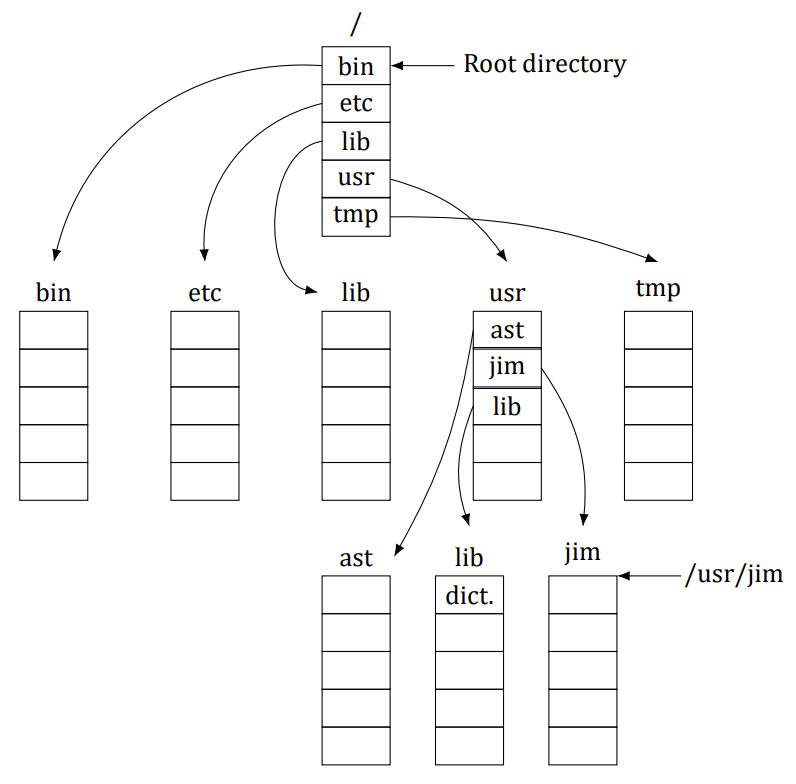

<details>
<summary>Solution</summary>

The dotdot component moves the search to /usr, so ../ast puts it in /usr/ast. Thus ../ast/x is the same as /usr/ast/x.

</details>

### Question 11
Contiguous allocation of files leads to disk fragmentation, as mentioned in the text, because some space in the
last disk block will be wasted in files whose length is not an integral number of blocks. Is this internal fragmentation or external fragmentation? Make an analogy with something discussed in the previous chapter.

<details>
<summary>Solution</summary>

Since the wasted storage is between the allocation units (files), not inside them, this is external fragmentation.
It is precisely analogous to the external fragmentation of main memory that occurs with a swapping system or
a system using pure segmentation.

</details>

### **Question 12 (Tutorial 10)**
Describe the effects of a corrupted data block for a given file for: **(a)** contiguous, **(b)** linked, and **(c)** indexed (or
table based).

<details>
<summary>Solution</summary>

Contiguous: a file is stored as a chain of contiguous blocks. The
operating system stores the address of the first block and the
number of blocks.
If one block is corrupted, the other ones are still usable.

Linked: a file is stored as a linked list of the blocks. Each block’s
address is stored as a pointer in the previous block. The operating
system only stores pointers to the first and the last blocks.
If one block is corrupted, all the blocks following this one become
unusable.

Indexed: to the physical addresses of all the blocks of a file,
operating system uses a table which is stored on a disk too
If a block containing addresses is corrupted, it might be not
possible to read any block belonging to the file
If a block with data is corrupted, other blocks are not affected

</details>

### Question 13
One way to use contiguous allocation of the disk and not suffer from holes is to compact the disk every time a
file is removed. Since all files are contiguous, copying a file requires a seek and rotational delay to read the file,
followed by the transfer at full speed. Writing the file back requires the same work. Assuming a seek time of 5
ms, a rotational delay of 4 ms, a transfer rate of 80 MB/sec, and an average file size of 8 KB, how long does it
take to read a file into main memory and then write it back to the disk at a new location? Using these numbers,
how long would it take to compact half of a 16-GB disk?

<details>
<summary>Solution</summary>

It takes 9 ms to start the transfer. To read 2¹³ bytes at a transfer rate of 80 MB/sec requires 0.0977 ms, for a
total of 9.0977 ms. Writing it back takes another 9.0977 ms. Thus, copying a file takes 18.1954 ms. To compact
half of a 16-GB disk would involve copying 8 GB of storage, which is 2²⁰ files. At 18.1954 ms per file, this takes
19,079.25 sec, which is 5.3 hours. Clearly, compacting the disk after every file removal is not a great idea.

</details>

### Question 14
In light of the answer to the previous question, does compacting the disk ever make any sense?

<details>
<summary>Solution</summary>

If done right, yes. While compacting, each file should be organized so that all of its blocks are consecutive, for
fast access. Windows has a program that defragments and reorganizes the disk. Users are encouraged to run
it periodically to improve system performance. But given how long it takes, running once a month might be a
good frequency.

</details>

### Question 15
Some digital consumer devices need to store data, for example as files. Name a modern device that requires file
storage and for which contiguous allocation would be a fine idea.

<details>
<summary>Solution</summary>

A digital still camera records some number of photographs in sequence on a nonvolatile storage medium (e.g.,
flash memory). When the camera is reset, the medium is emptied. Thereafter, pictures are recorded one at a
time in sequence until the medium is full, at which time they are uploaded to a hard disk. For this application, a
contiguous file system inside the camera (e.g., on the picture storage medium) is ideal.

</details>

### Question 16
Consider the i-node shown in Figure 9. If it contains 10 direct addresses and these were 8 bytes each and all disk
blocks were 1024 KB, what would the largest possible file be?

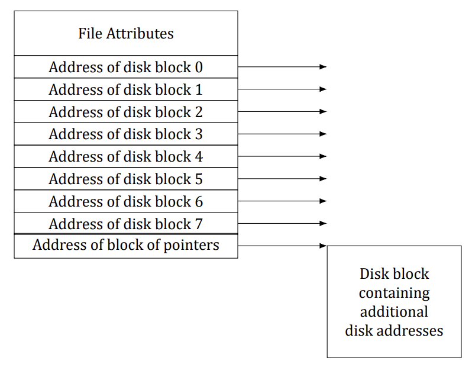

<details>
<summary>Solution</summary>

The indirect block can hold 128 disk addresses. Together with the 10 direct disk addresses, the maximum file
has 138 blocks. Since each block is 1 MB, the largest file is 138 MB.

</details>

### **Question 17 (Tutorial 10)**
For a given class, the student records are stored in a file. The records are randomly accessed and updated.
Assume that each student’s record is of fixed size. Which of the three allocation schemes (contiguous, linked
and table/indexed) will be most appropriate?

<details>
<summary>Solution</summary>

For both operations we need to access a data block containing a
student record
Since records are of fixed size, we can easily calculate a block
number for a given record
Then, for contiguous allocation we can calculate an address of the
block by using formula:

`first block addr + block size * (block num - 1)`

For indexed allocation we just use block number as an index and a
value would be block address
For linked-list allocation, however, it will require multiple disk
reads per operation since it is not possible to get a physical
address of a block without reading all the previous blocks

</details>

### **Question 18 (Retake 1 2017)**
Consider a file whose size varies between 4 KB and 4 MB during its lifetime. Which of the three allocation
schemes (contiguous, linked and table/indexed) will be most appropriate?

<details>
<summary>Solution</summary>

Since the file size changes a lot, contiguous allocation will be inefficient, requiring reallocation of disk space as
the file grows in size and compaction of free blocks as the file shrinks in size. Both linked and table/indexed
allocation will be efficient; between the two, table/indexed allocation will be more efficient for random-access
scenarios.

</details>

### Question 19
It has been suggested that efficiency could be improved and disk space saved by storing the data of a short file
within the i-node. For the i-node of Figure 9, how many bytes of data could be stored inside the i-node?


<details>
<summary>Solution</summary>

There must be a way to signal that the address-block pointers hold data, rather than pointers. If there is a bit
left over somewhere among the attributes, it can be used. This leaves all nine pointers for data. If the pointers
are k bytes each, the stored file could be up to 9k bytes long. If no bit is left over among the attributes, the first
disk address can hold an invalid address to mark the following bytes as data rather than pointers. In that case,
the maximum file is 8k bytes.

</details>

### **Question 20 (Tutorial 10, Final 2018)**
Two computer science students, Carolyn and Elinor, are having a discussion about i-nodes. Carolyn maintains
that memories have gotten so large and so cheap that when a file is opened, it is simpler and faster just to fetch
a new copy of the i-node into the i-node table, rather than search the entire table to see if it is already there.
Elinor disagrees. Who is right?

<details>
<summary>Solution</summary>

Having two copies of the i-node in the table at the same time
introduces all kinds of synchronization related troubles.
In particular, if multiple i-nodes are used for modifying a file and
each i-node updates some part of it, then the i-node which would
be the last one to be written to the disk, would win
The information in others would be lost

</details>

### Question 21
Name one advantage of hard links over symbolic links and one advantage of symbolic links over hard links.

<details>
<summary>Solution</summary>

Hard links do not require any extra disk space, just a counter in the i-node to keep track of how many there are.
Symbolic links need space to store the name of the file pointed to. Symbolic links can point to files on other
machines, even over the Internet. Hard links are restricted to pointing to files within their own partition.

</details>

### **Question 22 (Final 2019)**
Explain how hard links and soft links differ with respective to i-node allocations.

<details>
<summary>Solution</summary>

A single i-node is pointed to by all directory entries of hard links for a given file. In the case of soft-links, a new
i-node is created for the soft link and this i-node essentially points to the original file being linked.

</details>

### **Question 23 (Retake 2.1 2016)**
Consider a 4-TB disk that uses 4-KB blocks and the free-list method. How many block addresses can be stored
in one block?

<details>
<summary>Solution</summary>

The number of blocks on the disk = 4 TB / 4 KB = 2³⁰, so 30-bit addresses would suffice; rounded up to whole bytes, each block address is 4 bytes. Thus, each block can store 4 KB / 4 B = 1024 addresses.

</details>

### **Question 24 (Retake 2 2017)**
Free disk space can be kept track of using a free list or a bitmap. Disk addresses require D bits. For a disk with
B blocks, F of which are free, state the condition under which the free list uses less space than the bitmap. For
D having the value 16 bits, express your answer as a percentage of the disk space that must be free.

<details>
<summary>Solution</summary>

The bitmap requires B bits. The free list requires DF bits. The free list requires fewer bits if DF < B. Alternatively, the free list is shorter if F/B < 1/D, where F/B is the fraction of blocks free. For 16-bit disk addresses,
the free list is shorter if 6% or less of the disk is free.

</details>

### **Question 25 (Tutorial 10, Pre-Final 2025)**
The beginning of a free-space bitmap looks like this after the disk partition is first formatted: 1000 0000 0000
0000 (the first block is used by the root directory). The system always searches for free blocks starting at the
lowest-numbered block, so after writing file A, which uses six blocks, the bitmap looks like this: 1111 1110
0000 0000. Show the bitmap after each of the following additional actions:

a) File B is written, using five blocks.
b) File A is deleted.
c) File C is written, using eight blocks.
d) File B is deleted.

<details>
<summary>Solution</summary>

A. File B is written, using five blocks:
`1111 1111 1111 0000`
B. File A is deleted:
`1000 0001 1111 0000`
C. File C is written, using eight blocks:
`1111 1111 1111 1100`
D. File B is deleted:
`1111 1110 0000 1100`

</details>

### Question 26
What would happen if the bitmap or free list containing the information about free disk blocks was completely
lost due to a crash? Is there any way to recover from this disaster, or is it bye-bye disk? Discuss your answers
for UNIX and the FAT-16 file system separately.

<details>
<summary>Solution</summary>

It is not a serious problem at all. Repair is straightforward; it just takes time. The recovery algorithm is to make
a list of all the blocks in all the files and take the complement as the new free list. In UNIX this can be done by
scanning all the i-nodes. In the FAT file system, the problem cannot occur because there is no free list. But even
if there were, all that would have to be done to recover it is to scan the FAT looking for free entries.

</details>

### **Question 27 (Tutorial 10)**
Oliver Owl’s night job at the university computing center is to change the tapes used for overnight data backups.
While waiting for each tape to complete, he works on writing his thesis that proves Shakespeare’s plays were
written by extraterrestrial visitors. His text processor runs on the system being backed up since that is the only
one they have. Is there a problem with this arrangement?

<details>
<summary>Solution</summary>

Most probably, everything but Oliver’s file will be backed up.
This happens because a backup program may detect that a file is
open for writing and pass over it since the state of file content may
be indeterminate.

</details>

### Question 28
We discussed making incremental dumps in some detail in the text. In Windows it is easy to tell when to dump
a file because every file has an archive bit. This bit is missing in UNIX. How do UNIX backup programs know
which files to dump?

<details>
<summary>Solution</summary>

They must keep track of the time of the last dump in a file on disk. At every dump, an entry is appended to
this file. At dump time, the file is read and the time of the last entry noted. Any file changed since that time is
dumped.

</details>

### **Question 29 (Tutorial 11)**
Suppose that file 21 in Figure 10 was not modified since the last dump. In what way would the four bitmaps of
Figure 11 be different?

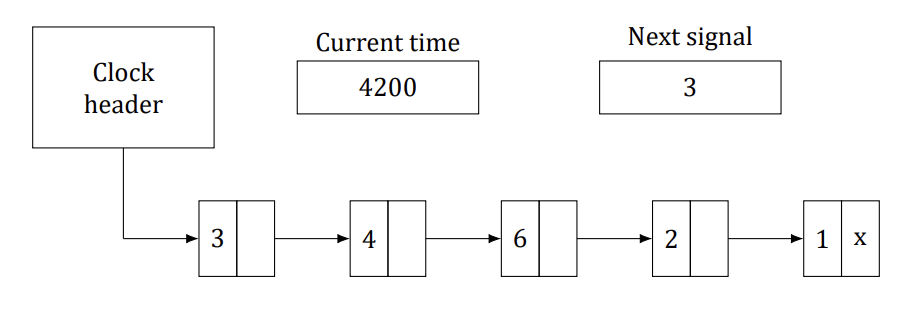


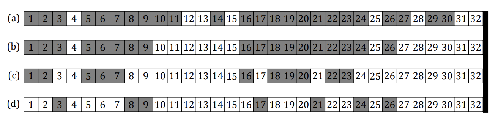

<details>
<summary>Solution</summary>

In (a) and (b), 21 would not be marked. In (c), there would be no
change. In (d), 21 would not be marked.

</details>

### Question 30
It has been suggested that the first part of each UNIX file be kept in the same disk block as its i-node. What good
would this do?

<details>
<summary>Solution</summary>

Many UNIX files are short. If the entire file fits in the same block as the i-node, only one disk access would be
needed to read the file, instead of two, as is presently the case. Even for longer files there would be a gain, since
one fewer disk access would be needed.

</details>

### **Question 31 (Tutorial 11)**
Consider Figure 12. Is it possible that for some particular block number the counters in both lists have the value
2? How should this problem be corrected?

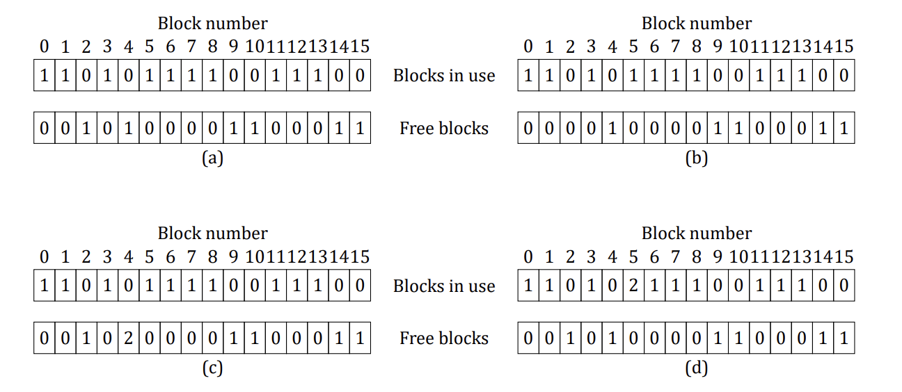

<details>
<summary>Solution</summary>

It is usually not possible, but due to a bug (maybe in block
allocation), it could happen. It means that some block occurs in
two files and also twice in the free list. The first step in fixing the
error is to remove both copies from the free list. Next a free block
has to be acquired and the contents of the block under
investigation will be copied there. Finally, the occurrence of the
block in one of the files should be changed to refer to the newly
acquired copy of the block. At this point the system is once again
consistent.

</details>

### **Question 32 (Tutorial 11, Retake 1 2017)**
The performance of a file system depends upon the cache hit rate (fraction of blocks found in the cache). If
it takes 1 ms to satisfy a request from the cache, but 40 ms to satisfy a request if a disk read is needed, give
a formula for the mean time required to satisfy a request if the hit rate is h. Plot this function for values of h
varying from 0 to 1.0.

<details>
<summary>Solution</summary>

The time needed is h + 40× (1 − h). The plot is just a straight line.

</details>

### Question 33
For an external USB hard drive attached to a computer, which is more suitable: a write through cache or a block
cache?

<details>
<summary>Solution</summary>

In this case, it is better to use a write-through cache since it writes data to the hard drive while also updating
the cache. This will ensure that the updated file is always on the external hard drive even if the user accidentally
removes the hard drive before disk sync is completed.

</details>

### Question 34
Consider an application where students’ records are stored in a file. The application takes a student ID as input
and subsequently reads, updates, and writes the corresponding student record; this is repeated till the application quits. Would the “block readahead” technique be useful here?

<details>
<summary>Solution</summary>

The block read-ahead technique reads blocks sequentially, ahead of their use, in order to improve performance.
In this application, the records will likely not be accessed sequentially since the user can input any student ID
at a given instant. Thus, the read-ahead technique will not be very useful in this scenario.

</details>

### **Question 35 (Tutorial 11)**
Consider a disk that has 10 data blocks starting from block 14 through 23. Let there be 2 files on the disk: f1
and f2. The directory structure lists that the first data blocks of f1 and f2 are respectively 22 and 16. Given the
FAT table entries as below, what are the data blocks allotted to f1 and f2?
(14,18); (15,17); (16,23); (17,21); (18,20); (19,15); (20, −1); (21, −1); (22,19); (23,14).
In the above notation, (x, y) indicates that the value stored in table entry x points to data block y.

<details>
<summary>Solution</summary>

The blocks allotted to f1 are: 22, 19, 15, 17, 21.
The blocks allotted to f2 are: 16, 23, 14, 18, 20.

</details>

### Question 36
Consider the idea behind Figure 13, but now for a disk with a mean seek time of 6 ms, a rotational rate of 15,000
rpm, and 1,048,576 bytes per track. What are the data rates for block sizes of 1 KB, 2 KB, and 4 KB, respectively?

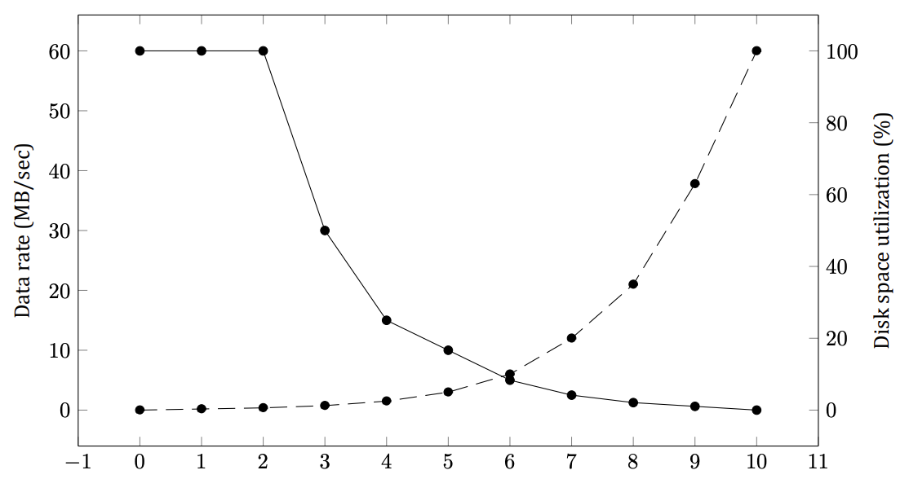

<details>
<summary>Solution</summary>

At 15,000 rpm the disk takes 4 ms to go around once, so the average rotational delay is 2 ms. The average access time (in ms) to read k bytes is then 6 (seek) + 2 (rotation) + (k/1,048,576) × 4 (transfer). For blocks of 1 KB, 2 KB, and 4 KB the access times are about 8.0039 ms, 8.0078 ms, and 8.0156 ms, respectively (hardly any different — the transfer is negligible next to seek + rotation). These give rates of about 1024/8.0039 ≈ 125 KB/sec, 2048/8.0078 ≈ 250 KB/sec, and 4096/8.0156 ≈ 499 KB/sec, respectively.

</details>

### **Question 37 (Retake 2.2 2016)**
A certain file system uses 4-KB disk blocks. The median file size is 1 KB. If all files were exactly 1 KB, what
fraction of the disk space would be wasted? Do you think the wastage for a real file system will be higher than
this number or lower than it? Explain your answer.

<details>
<summary>Solution</summary>

If all files were 1 KB, then each 4-KB block would contain one file and 3 KB of wasted space. Trying to put two
files in a block is not allowed because space is tracked per whole block. This
leads to 75% wasted space. In practice, every file system has large files as well as many small ones, and these
files use the disk much more efficiently. For example, a 32,769-byte file would use 9 disk blocks for storage,
given a space efficiency of 32,769/36,864, which is about 89%.

</details>

### **Question 38 (Tutorial 10, Retake 1 2016)**
Given a disk-block size of 4 KB and block-pointer address value of 4 bytes, what is the largest file size (in bytes)
that can be accessed using 10 direct addresses and one indirect block?

<details>
<summary>Solution</summary>

In total, there are 1034 addresses:

- 10 direct addresses
- 1024 (4 KB / 4 bytes) addresses that one indirect block contains

Each address points to a 4 KB block.
Therefore, the largest file size is:
1034 ∗ 4 KB = 4 235 264 bytes ≈ 4 MB

</details>

### Question 39
Files in MS-DOS have to compete for space in the FAT-16 table in memory. If one file uses k entries, that is
k entries that are not available to any other file, what constraint does this place on the total length of all files
combined?

<details>
<summary>Solution</summary>

It constrains the sum of all the file lengths to being no larger than the disk. This is not a very serious constraint.
If the files were collectively larger than the disk, there would be no place to store all of them on the disk.

</details>

### Question 40
A UNIX file system has 4-KB blocks and 4-byte disk addresses. What is the maximum file size if i-nodes contain
10 direct entries, and one single, double, and triple indirect entry each?

<details>
<summary>Solution</summary>

The i-node holds 10 pointers. The single indirect block holds 1024 pointers. The double indirect block is good
for 1024² pointers. The triple indirect block is good for 1024³ pointers. Adding these up, we get a maximum file
size of 1,074,791,434 blocks, which is about 4 TB.

</details>

### **Question 41 (Tutorial 10)**
How many disk operations are needed to fetch the i-node for a file with the path name /usr/ast/courses/os/handout.t? Assume that the i-node for the root directory is in memory, but nothing else along the path is in memory.
Also assume that all directories fit in one disk block.

<details>
<summary>Solution</summary>

The following disk reads are needed:

- directory for /
- i-node for /usr
- directory for /usr
- i-node for /usr/ast
- directory for /usr/ast
- i-node for /usr/ast/courses
- directory for /usr/ast/courses
- i-node for /usr/ast/courses/os
- directory for /usr/ast/courses/os
- i-node for /usr/ast/courses/os/handout.t

In total, 10 disk reads are required.

</details>

### **Question 42 (Pre-Final 2020)**
In many UNIX systems, the i-nodes are kept at the start of the disk. An alternative design is to allocate an i-node
when a file is created and put the i-node at the start of the first block of the file. Discuss the pros and cons of this
alternative.

<details>
<summary>Solution</summary>

Some pros are as follows. First, no disk space is wasted on unused i-nodes. Second, it is not possible to run
out of i-nodes. Third, less disk movement is needed since the i-node and the initial data can be read in one
operation. Some cons are as follows. First, directory entries will now need a 32-bit disk address instead of
a 16-bit i-node number. Second, an entire disk will be used even for files which contain no data (empty files,
device files). Third, file-system integrity checks will be slower because of the need to read an entire block for
each i-node and because i-nodes will be scattered all over the disk. Fourth, files whose size has been carefully
designed to fit the block size will no longer fit the block size due to the i-node, messing up performance.

</details>

### Question 43
Write a program that reverses the bytes of a file, so that the last byte is now first and the first byte is now last.
It must work with an arbitrarily long file, but try to make it reasonably efficient.

<details>
<summary>Solution</summary>

```c
#include <stdio.h>
#include <stdlib.h>
#include <sys/mman.h>
#include <unistd.h>
#include <sys/stat.h>
#include <sys/types.h>
#include <fcntl.h>
#include <string.h>
#include <err.h>
int main(int argc, char *argv[]) {
    int fd = -1;
    int low_border = 0;         /* Left edge of the not-yet-reversed part of the file. */
    int high_border = 0;        /* Right edge of the not-yet-reversed part. */
    char *source;               /* Pointer to the file mapped into memory. */
    FILE *file = fopen(argv[1], "r");   /* First find out how long the file is. */
    fseek(file, -1, SEEK_END);
    int file_len = ftell(file);
    fclose(file);
    if ((fd = open(argv[1], O_RDWR, 0)) == -1)
        err(1, "File not opened");      /* No such file: print an error and quit. */
    /* Map the whole file into memory for reading and writing. */
    source = (char *)mmap(NULL, file_len, PROT_READ|PROT_WRITE,
                          MAP_FILE|MAP_SHARED, fd, 0);
    high_border = file_len - 1;
    char a;
    while (low_border < high_border) {  /* Walk from both ends toward the middle. */
        a = source[low_border];         /* Swap the two outermost not-yet-swapped bytes. */
        source[low_border] = source[high_border];
        source[high_border] = a;
        high_border--;
        low_border++;
    }
    munmap(source, file_len);   /* Flush the changes to disk and unmap the file. */
    close(fd);
    return 0;
}
```

</details>

### Question 44
Write a program that starts at a given directory and descends the file tree from that point recording the sizes of
all the files it finds. When it is all done, it should print a histogram of the file sizes using a bin width specified as
a parameter (e.g., with 1024, file sizes of 0 to 1023 go in one bin, 1024 to 2047 go in the next bin, etc.).

<details>
<summary>Solution</summary>

The program walks the directory tree from the starting point, records every regular file's size into a histogram array indexed by `size / bin_width`, and prints the bins at the end.

</details>

### Question 45
Write a program that scans all directories in a UNIX file system and finds and locates all i-nodes with a hard link
count of two or more. For each such file, it lists together all file names that point to the file.

<details>
<summary>Solution</summary>

Group every file by its `(device, i-node)` pair — hard links to one file share exactly that pair — and report the groups whose link count is two or more:

```python
import os

def find_hardlinks(root):
    by_id = {}                          # (st_dev, st_ino) -> list of paths
    for dirpath, _dirs, files in os.walk(root):
        for name in files:
            p = os.path.join(dirpath, name)
            try:
                st = os.lstat(p)        # lstat: do not follow symlinks
            except OSError:
                continue                # Vanished or unreadable: skip it.
            if st.st_nlink >= 2:        # Only files with 2+ hard links.
                by_id.setdefault((st.st_dev, st.st_ino), []).append(p)
    for (dev, ino), paths in sorted(by_id.items()):
        if len(paths) >= 2:             # Found from two different names.
            print(f"i-node {ino} on device {dev}:")
            for p in sorted(paths):
                print(f"    {p}")
```

</details>

### Question 46
Write a new version of the UNIX ls program. This version takes as an argument one or more directory names
and for each directory lists all the files in that directory, one line per file. Each field should be formatted in a
reasonable way given its type. List only the first disk address, if any.

<details>
<summary>Solution</summary>

```c
#include <stdio.h>
#include <sys/stat.h>
#include <sys/types.h>
#include <dirent.h>
#include <time.h>

static void list_one(const char *dir, const char *name) {
    char path[4096];                    /* Full path for stat. */
    snprintf(path, sizeof path, "%s/%s", dir, name);
    struct stat st;
    if (lstat(path, &st) < 0) { perror(path); return; }  /* Unreadable: report. */
    char t[32];                         /* Human-readable mtime. */
    strftime(t, sizeof t, "%Y-%m-%d %H:%M", localtime(&st.st_mtime));
    printf("%-20s %8lld bytes  ino=%-8lld  %s\n",   /* One line per file. */
           name, (long long) st.st_size, (long long) st.st_ino, t);
}

int main(int argc, char *argv[]) {
    if (argc < 2) { fprintf(stderr, "Usage: %s dir...\n", argv[0]); return 1; }
    for (int i = 1; i < argc; i++) {    /* One directory after another. */
        DIR *d = opendir(argv[i]);
        if (!d) { perror(argv[i]); continue; }
        printf("%s:\n", argv[i]);
        struct dirent *e;
        while ((e = readdir(d)) != NULL) {
            if (e->d_name[0] == '.' && (e->d_name[1] == '\0' ||
                (e->d_name[1] == '.' && e->d_name[2] == '\0')))
                continue;               /* Skip "." and "..". */
            list_one(argv[i], e->d_name);
        }
        closedir(d);
    }
    return 0;
}
```

</details>

### Question 47
Implement a program to measure the impact of application-level buffer sizes on read time. This involves writing
to and reading from a large file (say, 2 GB). Vary the application buffer size (say, from 64 bytes to 4 KB). Use timing
measurement routines (such as gettimeofday and getitimer on UNIX) to measure the time taken for different
buffer sizes. Analyze the results and report your findings: does buffer size make a difference to the overall write
time and per-write time?

<details>
<summary>Solution</summary>

Each `read`/`write` call pays a fixed system-call and disk-access cost, so tiny buffers spend nearly all their time on overhead: with 64-byte buffers a 2-GB file needs 33 million calls, while 4-KiB buffers need 524 thousand. Expect the per-call time to stay roughly flat but the total time to fall steeply as buffers grow, flattening once the buffer is large enough that transfer time dominates overhead. Time only the I/O loop itself (exclude file creation), repeat each size several times, and plot total time and time-per-call against buffer size.

</details>

### Question 48
Implement a simulated file system that will be fully contained in a single regular file stored on the disk. This
disk file will contain directories, i-nodes, free-block information, file data blocks, etc. Choose appropriate algorithms for maintaining free-block information and for allocating data blocks (contiguous, indexed, linked).
Your program will accept system commands from the user to create/delete directories, create/delete/open files,
read/write from/to a selected file, and to list directory contents.

<details>
<summary>Solution</summary>

Layout inside the single host file: block 0 is the free-block bitmap; the next blocks hold a fixed table of 64 i-nodes (type, size, 8 direct block numbers, 1 single-indirect block); the rest are data blocks. Directories are files whose lines map names to i-node numbers. Limits of this toy: 64 files/directories, ~4 KiB per file in direct blocks plus one indirect block.

```python
import os, struct, sys

BSIZE, NBLOCKS, NINODES = 512, 1024, 64
FMT = '<B3xI8ii20x'                 # type, size, 8 direct, 1 indirect (= 64 B)
ISIZE = struct.calcsize(FMT)
ITAB_BLOCKS = NINODES * ISIZE // BSIZE
DATA_START = 1 + ITAB_BLOCKS
T_FREE, T_FILE, T_DIR = 0, 1, 2

class FS:
    def __init__(self, path):       # Open the container; format it if new.
        new = not os.path.exists(path)
        self.f = open(path, 'w+b' if new else 'r+b')
        if new:
            self.f.truncate(NBLOCKS * BSIZE)
            self.bmap = bytearray((NBLOCKS + 7) // 8)
            for b in range(DATA_START):
                self._set(b, 1)     # Bitmap + i-node table are reserved.
            self._save_bmap()
            assert self._new_inode(T_DIR) == 0  # Root directory is i-node 0.
            self._write_file(0, b'')
        else:
            self.f.seek(0)
            self.bmap = bytearray(self.f.read((NBLOCKS + 7) // 8))
    def _blk(self, b, data=None):   # Raw block read/write.
        self.f.seek(b * BSIZE)
        if data is None:
            return self.f.read(BSIZE)
        self.f.write(data); self.f.flush()
    def _set(self, b, v):           # Mark a block used/free in the bitmap.
        if v: self.bmap[b // 8] |= 1 << b % 8
        else: self.bmap[b // 8] &= ~(1 << b % 8)
    def _save_bmap(self):
        self._blk(0, bytes(self.bmap).ljust(BSIZE, b'\0'))
    def _alloc(self):               # First-fit free data block.
        for b in range(DATA_START, NBLOCKS):
            if not (self.bmap[b // 8] >> b % 8) & 1:
                self._set(b, 1); self._save_bmap()
                self._blk(b, b'\0' * BSIZE)
                return b
        raise RuntimeError('disk full')
    def _free(self, b):
        self._set(b, 0); self._save_bmap()
    def _iget(self, ino):           # Read an i-node into a dict.
        self.f.seek(BSIZE + ino * ISIZE)
        r = struct.unpack(FMT, self.f.read(ISIZE))
        return {'type': r[0], 'size': r[1], 'direct': list(r[2:10]), 'indir': r[10]}
    def _iput(self, ino, n):        # Write an i-node back.
        self.f.seek(BSIZE + ino * ISIZE)
        self.f.write(struct.pack(FMT, n['type'], n['size'], *n['direct'], n['indir']))
        self.f.flush()
    def _new_inode(self, typ):
        for ino in range(NINODES):
            if self._iget(ino)['type'] == T_FREE:
                self._iput(ino, {'type': typ, 'size': 0,
                                 'direct': [0] * 8, 'indir': 0})
                return ino
        raise RuntimeError('no free i-nodes')
    def _data_blocks(self, n):      # All blocks of a file, in order.
        bs = [b for b in n['direct'] if b]
        if n['indir']:
            bs += [b for b in struct.unpack('<128i', self._blk(n['indir'])) if b]
        return bs
    def _read_file(self, ino):
        n = self._iget(ino)
        data = b''.join(self._blk(b) for b in self._data_blocks(n))
        return data[:n['size']]
    def _write_file(self, ino, data):  # Replace content; indexed allocation.
        n = self._iget(ino)
        for b in self._data_blocks(n):  # Free the old blocks first.
            self._free(b)
        need = (len(data) + BSIZE - 1) // BSIZE if data else 0
        direct, rest = data[:8 * BSIZE], data[8 * BSIZE:]
        bs = [self._alloc() for _ in range((len(direct) + BSIZE - 1) // BSIZE if direct else 0)]
        for i, b in enumerate(bs):
            self._blk(b, direct[i * BSIZE:(i + 1) * BSIZE].ljust(BSIZE, b'\0'))
        indir = 0
        if rest:                    # Overflow goes through one indirect block.
            indir = self._alloc()
            ib = [self._alloc() for _ in range((len(rest) + BSIZE - 1) // BSIZE)]
            for i, b in enumerate(ib):
                self._blk(b, rest[i * BSIZE:(i + 1) * BSIZE].ljust(BSIZE, b'\0'))
            self._blk(indir, struct.pack('<128i', *(ib + [0] * (128 - len(ib)))))
        n.update(size=len(data), direct=(bs + [0] * 8)[:8], indir=indir)
        self._iput(ino, n)
    def _entries(self, ino):        # Directory lines -> (name, ino) pairs.
        out = []
        for line in self._read_file(ino).decode().splitlines():
            name, num = line.rsplit(' ', 1)
            out.append((name, int(num)))
        return out
    def _resolve(self, path):       # Absolute path -> i-node number.
        ino = 0
        for comp in [c for c in path.split('/') if c]:
            n = self._iget(ino)
            assert n['type'] == T_DIR, f'not a directory: {comp}'
            hit = [i for name, i in self._entries(ino) if name == comp]
            assert hit, f'no such file: {comp}'
            ino = hit[0]
        return ino
    def _parent(self, path):        # (parent ino, base name) for creation.
        parent = path.rsplit('/', 1)
        pino = self._resolve(parent[0]) if parent[0] else 0
        return pino, parent[-1]
    def _attach(self, pino, name, ino):  # Link a name into a directory.
        assert all(nm != name for nm, _ in self._entries(pino)), 'exists'
        self._write_file(pino, self._read_file(pino) + f'{name} {ino}\n'.encode())
    def _detach(self, pino, name):
        es = [(nm, i) for nm, i in self._entries(pino) if nm != name]
        assert len(es) != len(self._entries(pino)), 'not found'
        self._write_file(pino, ''.join(f'{nm} {i}\n' for nm, i in es).encode())
    def _drop(self, ino):           # Free all blocks; release the i-node.
        n = self._iget(ino)
        for b in self._data_blocks(n):
            self._free(b)
        if n['indir']:
            self._free(n['indir'])
        self._iput(ino, {'type': T_FREE, 'size': 0, 'direct': [0] * 8, 'indir': 0})

def main(path):
    fs, fds, nxt = FS(path), {}, 3   # fds: fd -> [ino, offset]
    while True:
        try:
            cmd = input('simfs> ').split()
        except EOFError:
            break
        if not cmd:
            continue
        op, args = cmd[0], cmd[1:]
        try:
            if op == 'mkdir':
                p, nm = fs._parent(args[0]); fs._attach(p, nm, fs._new_inode(T_DIR))
            elif op == 'rmdir':
                p, nm = fs._parent(args[0]); i = fs._resolve(args[0])
                assert fs._iget(i)['type'] == T_DIR and not fs._read_file(i), 'not empty'
                fs._detach(p, nm); fs._drop(i)
            elif op == 'create':
                p, nm = fs._parent(args[0]); fs._attach(p, nm, fs._new_inode(T_FILE))
            elif op == 'delete':
                p, nm = fs._parent(args[0]); fs._detach(p, nm); fs._drop(fs._resolve(args[0]))
            elif op == 'ls':
                for nm, i in fs._entries(fs._resolve(args[0] if args else '/')):
                    print(f'{nm}  (ino={i}, {fs._iget(i)["size"]} bytes)')
            elif op == 'open':
                fds[nxt] = [fs._resolve(args[0]), 0]; print(f'fd={nxt}'); nxt += 1
            elif op == 'read':
                ino, off = fds[int(args[0])]; data = fs._read_file(ino)
                print(data[off:off + int(args[1])].decode(errors='replace'))
                fds[int(args[0])][1] = off + int(args[1])
            elif op == 'write':
                ino, off = fds[int(args[0])]; data = fs._read_file(ino)
                blob = ' '.join(args[1:]).encode()
                fs._write_file(ino, data[:off] + blob + data[off + len(blob):])
                fds[int(args[0])][1] = off + len(blob)
            elif op == 'close':
                del fds[int(args[0])]
            elif op == 'quit':
                break
            else:
                print('commands: mkdir rmdir create delete ls open read write close quit')
        except (AssertionError, RuntimeError, OSError) as e:
            print('error:', e)

if __name__ == '__main__':
    main(sys.argv[1] if len(sys.argv) > 1 else 'disk.img')
```

</details>

### Question 49 (5th edition)
Suppose a filesystem check reveals that a block has been allocated to two different files, /home/hjb/dadjokes.txt and /etc/motd. Both are text files. The filesystem check duplicates the block’s data and re-assigns /etc/motd to use the new block. Answer the following questions. (i) In what realistic circumstance(s) could the data from both files still remain correct and consistent with their original content? (ii) How might the user investigate whether the files have been corrupted? (iii) If one or both of the files’ data have been corrupted, what mechanisms might allow the user to recover the data?

<details>
<summary>Solution</summary>

(i) If the shared block holds identical data in both files — the realistic case is a block of pure zeros, very common in text files' tails and sparse regions — then each file's private copy is byte-identical to the original and both files stay correct. More generally, both stay correct whenever neither file's copy is subsequently modified before the duplication.

(ii) Compare both files against the last backup or dump; check modification times and sizes for surprises; inspect the duplicated block's surroundings for half-old/half-new mixed content, which betrays a real cross-linking rather than a benign identical block.

(iii) Restore the damaged file from the backup — that is what dumps are for. The checker itself already preserved one side (the copy it duplicated), so only the file whose original content was overwritten needs external recovery.

</details>

### Question 50 (5th edition)
Following on the previous question, in earlier MacOS versions, if the target file is moved and then another file is created with the original path of the target, the alias would still find and use the moved target file (not the new file with the same path/name). However, in versions of MacOS 10.2 or later, if the target file is moved and another is created in the old location, the alias will connect to the new file. Does this address the drawbacks from your answer to the previous question? Does it dampen the benefits you noted?

<details>
<summary>Solution</summary>

Yes to both. Preferring the path fixes the nastiest drawback: an alias can no longer silently open a moved-away (possibly sensitive) file when an unrelated new file has taken its old name — behavior becomes predictable again. But it dampens the core benefit: move-tracking is no longer reliable whenever paths get reused, so the alias is back to being almost as fragile as a plain symbolic link in exactly that situation.

</details>

### Question 51 (5th edition)
Suppose that file 21 in Figure 10 was not modified since the last dump. In what way would the four bitmaps of Figure 11 be different?


<details>
<summary>Solution</summary>

In (a) and (b), 21 would not be marked. In (c), there would be no change. In (d), 21 would not be marked.

</details>

### Question 52 (5th edition)
In Figure 12, one of the attributes is the record length. Why does the operating system ever care about this?


<details>
<summary>Solution</summary>

It matters for record-structured files (as opposed to plain byte streams): with fixed-length records the OS can locate record N directly at offset N × length and support random access by record number. The record length is the metadata that makes that arithmetic possible.

</details>

### Question 53 (5th edition)
MacOS has symbolic links and also aliases. An alias is similar to a symbolic link; however, unlike symbolic links, an alias stores additional metadata about the target file (such as its inode number and file size) so that, if the target file is moved within the same filesystem, accessing the alias will result in accessing the target file, as the filesystem will search for and find the original target. How could this behavior be beneficial compared to symbolic links? How could it cause problems?

<details>
<summary>Solution</summary>

Beneficial: the alias survives renames and moves within the filesystem — a symbolic link breaks the moment its path stops pointing at the target, while the alias re-finds the file by its stored metadata.

Problems: stale metadata can resolve to the wrong file (e.g. the target was deliberately moved away and something else took its place), which is confusing and potentially unsafe; the search itself costs time; and it only works within one filesystem, unlike a symlink, which can point anywhere, including over the network.

</details>

### Question 54 (5th edition)
Discuss the design issues involved in selecting the appropriate block size for a file system.

<details>
<summary>Solution</summary>

It is a tradeoff between waste and speed. Large blocks mean fewer seeks and less per-block overhead, so large transfers run at nearly full disk speed and metadata stays small — but every file wastes on average half a block of internal fragmentation, which hurts with many small files. Small blocks waste little space but cost a seek (and metadata entries) per block, killing throughput on big files. The right choice follows the workload and the media: large media files favor large blocks, and on SSDs, where random access is cheap, the speed argument for large blocks largely disappears.

</details>

### Question 55 (5th edition)
In the text, we discussed two major ways to identify file type: file extensions and investigation of file content (e.g., by using headers and magic numbers). Many modern UNIX filesystems support extended attributes which can store additional metadata for a file, including file type. This data is stored as part of the file’s attribute data (in the same way that file size and permissions are stored). How is the extended attribute approach for storing files better or worse than the file extension approach or identifying file type by content?

<details>
<summary>Solution</summary>

Better: the type travels with the file no matter how it is renamed (unlike extensions, which users can change freely and which may lie), it is maintained by the filesystem rather than guessed, and unlike content sniffing it costs no scan and cannot be fooled by ambiguous magic numbers.

Worse: portability — not every filesystem, copy tool, archiver or backup preserves extended attributes, so the type can silently vanish in transit; attribute space is small; and the information is invisible to users and to programs that only know extensions or content probing.

</details>

### Question 56 (5th edition)
The MS-DOS FAT-16 table contains 64K entries. Suppose that one of the bits had been needed for some other purpose and that the table contained exactly 32,768 entries instead. With no other changes, what would the largest MS-DOS file have been under this condition?

<details>
<summary>Solution</summary>

Each FAT entry maps one allocation unit, so a file could span at most 32768 units — exactly half of the 65536 before. With 512-byte units that is 32768 × 512 = 16,777,216 bytes (16 MiB) instead of 32 MiB.

</details>

### Question 57 (5th edition)
In this chapter, we have seen that SSDs do their best to avoid writing the same memory cells frequently (because of the wear). However, many SSDs offer much more functionality than what we presented so far. For instance, many controllers implement compression. Explain why compression may help with reducing the wear.

<details>
<summary>Solution</summary>

Flash cells wear out per program/erase cycle: a block must be erased as a whole before any of its cells can be rewritten. Compression shrinks the bytes actually programmed to the chips, so each logical write consumes fewer cell programs — and, by packing more logical data per erase block, fewer erasures overall. Less writing per byte stored means proportionally less wear (plus extra effective capacity and less write amplification as a bonus).

</details>

# Chapter 5

### Question 1
Advances in chip technology have made it possible to put an entire controller, including all the bus access logic,
on an inexpensive chip. How does that affect the model of Figure 14?

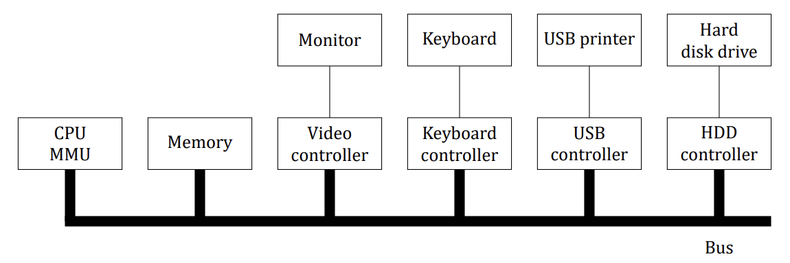

<details>
<summary>Solution</summary>

In the figure, we see controllers and devices as separate units. The reason is to allow a controller to handle
multiple devices, and thus eliminate the need for having a controller per device. If controllers become almost
free, then it will be simpler just to build the controller into the device itself. This design will also allow multiple
transfers in parallel and thus give better performance.

</details>

### Question 2
Given the speeds listed in the table below, is it possible to scan documents from a scanner and transmit them over an
802.11g network at full speed? Defend your answer.

| Device | Data rate |
|---|---|
| Keyboard | 10 bytes/sec |
| Mouse | 100 bytes/sec |
| 56K modem | 7 KB/sec |
| Scanner at 300 dpi | 1 MB/sec |
| Digital camcorder | 3.5 MB/sec |
| Digital video recorder | 3.5 MB/sec |
| 4x Blu-ray disc | 18 MB/sec |
| 802.11n Wireless | 37.5 MB/sec |
| USB 2.0 | 60 MB/sec |
| FireWire 800 | 100 MB/sec |
| Gigabit Ethernet | 125 MB/sec |
| SATA 3 disk drive | 600 MB/sec |
| USB 3.0 | 625 MB/sec |
| SCSI Ultra 5 bus | 640 MB/sec |
| Single-lane PCIe 3.0 bus | 985 MB/sec |
| Thunderbolt 2 bus | 2.5 GB/sec |
| SONET OC-768 network | 5 GB/sec |

<details>
<summary>Solution</summary>

The scanner puts out 1 MB/sec maximum while the wireless network runs at 37.5 MB/sec, so there is no problem at all.

</details>

### Question 3
Figure 15 shows one way of having memory-mapped I/O even in the presence of separate buses for memory
and I/O devices, namely, to first try the memory bus and if that fails try the I/O bus. A clever computer science
student has thought of an improvement on this idea: try both in parallel, to speed up the process of accessing
I/O devices. What do you think of this idea?

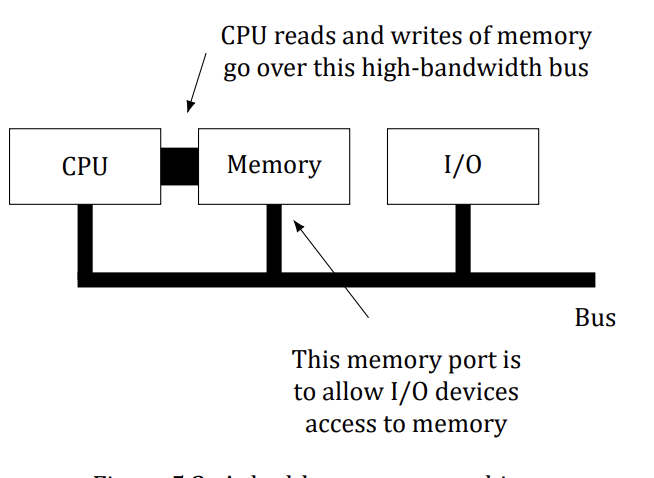

<details>
<summary>Solution</summary>

It is not a good idea. The memory bus is surely faster than the I/O bus, otherwise why bother with it? Consider
what happens with a normal memory request. The memory bus finishes first, but the I/O bus is still busy. If the
CPU waits until the I/O bus finishes, it has reduced memory performance to that of the I/O bus. If it just tries the
memory bus for the second reference, it will fail if this one is an I/O device reference. If there were some way to
instantaneously abort the previous I/O bus reference to try the second one, the improvement might work, but
there is never such an option. All in all, it is a bad idea.

</details>

### Question 4
Explain the tradeoffs between precise and imprecise interrupts on a superscalar machine.

<details>
<summary>Solution</summary>

An advantage of precise interrupts is simplicity of code in the operating system since the machine state is well
defined. On the other hand, in imprecise interrupts, OS writers have to figure out what instructions have been
partially executed and up to what point. However, precise interrupts increase complexity of chip design and
chip area, which may result in slower CPU.

</details>

### Question 5
A DMA controller has five channels. The controller is capable of requesting a 32-bit word every 40 ns. A response
takes equally long. How fast does the bus have to be to avoid being a bottleneck?

<details>
<summary>Solution</summary>

Each bus transaction is a 40-ns request plus a 40-ns response, i.e. 80 ns per transaction. That gives 12.5 million transactions/sec; at 4 bytes each the bus must handle 50 MB/sec. The fact that these transactions may be sprayed over five I/O devices in round-robin fashion is irrelevant: a bus transaction takes 80 ns regardless of whether consecutive requests go to the same device or different ones, so the number of DMA channels does not matter. The bus does not know or care.

</details>

### **Question 6 (Retake 2.1 2016)**
Suppose that a system uses DMA for data transfer from disk controller to main memory. Further assume that it
takes t1 ns on average to acquire the bus and t2 ns to transfer one word over the bus (t1 ≫ t2). After the CPU
has programmed the DMA controller, how long will it take to transfer 1000 words from the disk controller to
main memory, if **(a)** word-at-a-time mode is used, **(b)** burst mode is used? Assume that commanding the disk
controller requires acquiring the bus to send one word and acknowledging a transfer also requires acquiring
the bus to send one word.

<details>
<summary>Solution</summary>

- **(a)** Word-at-a-time mode: 1000 × [(t1 + t2) + (t1 + t2) + (t1 + t2)]

Where the first term is for acquiring the bus and sending the command to the disk controller, the second term
is for transferring the word, and the third term is for the acknowledgement. All in all, a total of 3000 × (t1 + t2)
ns.

- **(b)** Burst mode: (t1 + t2) + t1 + 1000 times t2 + (t1 + t2)

Where the first term is for acquiring the bus and sending the command to the disk controller, the second term
is for the disk controller to acquire the bus, the third term is for the burst transfer, and the fourth term is for
acquiring the bus and doing the acknowledgement. All in all, a total of 3t1 + 1002t2.

</details>

### Question 7
One mode that some DMA controllers use is to have the device controller send the word to the DMA controller,
which then issues a second bus request to write to memory. How can this mode be used to perform memory to
memory copy? Discuss any advantage or disadvantage of using this method instead of using the CPU to perform
memory to memory copy.

<details>
<summary>Solution</summary>

Memory to memory copy can be performed by first issuing a read command that will transfer the word from
memory to DMA controller and then issuing a write to memory to transfer the word from the DMA controller to
a different address in memory. This method has the advantage that the CPU can do other useful work in parallel.
The disadvantage is that this memory to memory copy is likely to be slow since DMA controller is much slower
than CPU and the data transfer takes place over system bus as opposed to the dedicated CPU-memory bus.

</details>

### Question 8
Suppose that a computer can read or write a memory word in 5 ns. Also suppose that when an interrupt occurs, all 32 CPU registers, plus the program counter and PSW are pushed onto the stack. What is the maximum
number of interrupts per second this machine can process?

<details>
<summary>Solution</summary>

An interrupt requires pushing 34 words onto the stack. Returning from the interrupt requires fetching 34 words
from the stack. This overhead alone is 340 ns. Thus the maximum number of interrupts per second is no more
than about 2.94 million, assuming no work for each interrupt.

</details>

### Question 9
CPU architects know that operating system writers hate imprecise interrupts. One way to please the OS folks is
for the CPU to stop issuing new instructions when an interrupt is signaled, but allow all the instructions currently
being executed to finish, then force the interrupt. Does this approach have any disadvantages? Explain your
answer.

<details>
<summary>Solution</summary>

The execution rate of a modern CPU is determined by the number of instructions that finish per second and has
little to do with how long an instruction takes. If a CPU can finish 1 billion instructions/sec it is a 1000 MIPS
machine, even if an instruction takes 30 ns. Thus there is generally little attempt to make instructions finish
quickly. Holding the interrupt until the last instruction currently executing finishes may increase the latency of
interrupts appreciably. Furthermore, some administration is required to get this right.

</details>

### Question 10
In the code below, the interrupt is not acknowledged until after the next character has been output to the printer.
Could it have equally well been acknowledged right at the start of the interrupt service procedure? If so, give
one reason for doing it at the end, as in the text. If not, why not?

```c
if (count == 0) {
    unblock_user( );                /* Nothing left to print: wake the waiting user process. */
} else {
    printer_data_register = p[i];   /* Copy the next character into the printer's data register. */
    count = count - 1;
    i = i + 1;
}
acknowledge_interrupt( );            /* Tell the controller this interrupt is handled. */
return_from_interrupt( );            /* Return from the interrupt, resuming the interrupted code. */
```

<details>
<summary>Solution</summary>

It could have been done at the start. A reason for doing it at the end is that the code of the interrupt service
procedure is very short. By first outputting another character and then acknowledging the interrupt, if another
interrupt happens immediately, the printer will be working during the interrupt, making it print slightly faster.
A disadvantage of this approach is slightly longer dead time when other interrupts may be disabled.


</details>

### Question 11
A computer has a three-stage pipeline as shown in Figure 16. On each clock cycle, one new instruction is fetched
from memory at the address pointed to by the PC and put into the pipeline and the PC advanced. Each instruction
occupies exactly one memory word. The instructions already in the pipeline are each advanced one stage. When
an interrupt occurs, the current PC is pushed onto the stack, and the PC is set to the address of the interrupt
handler. Then the pipeline is shifted right one stage and the first instruction of the interrupt handler is fetched
into the pipeline. Does this machine have precise interrupts? Defend your answer.

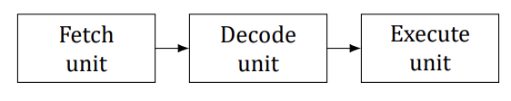

<details>
<summary>Solution</summary>

Yes. The stacked PC points to the first instruction not fetched. All instructions before that have been executed
and the instruction pointed to and its successors have not been executed. This is the condition for precise interrupts. Precise interrupts are not hard to achieve on machine with a single pipeline. The trouble comes in when
instructions are executed out of order, which is not the case here.

</details>

### **Question 12 (Retake 1 2017)**
A typical printed page of text contains 50 lines of 80 characters each. Imagine that a certain printer can print
6 pages per minute and that the time to write a character to the printer’s output register is so short it can be
ignored. Does it make sense to run this printer using interrupt-driven I/O if each character printed requires an
interrupt that takes 50 µs all-in to service?

<details>
<summary>Solution</summary>

The printer prints 50 × 80 × 6 = 24,000 characters/min, which is 400 characters/sec. Each character uses
50 µsec of CPU time for the interrupt, so collectively in each second the interrupt overhead is 20 msec. Using
interrupt-driven I/O, the remaining 980 msec of time is available for other work. In other words, the interrupt
overhead costs only 2% of the CPU, which will hardly affect the running program at all.

</details>

### Question 13
Explain how an OS can facilitate installation of a new device without any need for recompiling the OS.

<details>
<summary>Solution</summary>

UNIX does it as follows. There is a table indexed by device number, with each table entry being a C struct containing pointers to the functions for opening, closing, reading, writing, and a few other device operations.
To install a new device, a new entry has to be made in this table and the pointers filled in, often to the newly
loaded device driver.

</details>

### **Question 14 (Final 2019)**
In which of the four I/O software layers is each of the following done.

a) Computing the track, sector, and head for a disk read.
b) Writing commands to the device registers.
c) Checking to see if the user is permitted to use the device.
d) Converting binary integers to ASCII for printing.

<details>
<summary>Solution</summary>

a) Device driver.
b) Device driver.
c) Device-independent software.
d) User-level software.

</details>

### Question 15
A local area network is used as follows. The user issues a system call to write data packets to the network. The
operating system then copies the data to a kernel buffer. Then it copies the data to the network controller board.
When all the bytes are safely inside the controller, they are sent over the network at a rate of 10 megabits/sec.
The receiving network controller stores each bit a microsecond after it is sent. When the last bit arrives, the
destination CPU is interrupted, and the kernel copies the newly arrived packet to a kernel buffer to inspect it.
Once it has figured out which user the packet is for, the kernel copies the data to the user space. If we assume
that each interrupt and its associated processing takes 1 ms, that packets are 1024 bytes (ignore the headers),
and that copying a byte takes 1 µsec, what is the maximum rate at which one process can pump data to another?
Assume that the sender is blocked until the work is finished at the receiving side and an acknowledgement
comes back. For simplicity, assume that the time to get the acknowledgement back is so small it can be ignored.

<details>
<summary>Solution</summary>

A packet must be copied four times during this process, which takes 4.1 ms. There are also two interrupts,
which account for 2 ms. Finally, the transmission time is 0.83 ms, for a total of 6.93 ms per 1024 bytes. The
maximum data rate is thus 147,763 bytes/sec, or about 12% of the nominal 10 megabit/sec network capacity.
(If we include protocol overhead, the figures get even worse.)

</details>

### **Question 16 (Tutorial 12)**
Why are output files for the printer normally spooled on disk before being printed?

<details>
<summary>Solution</summary>

Imagine that files are printed immediately by a process. In such a
case the following situation might occur:
The process captures printer and prints several symbols
Then for some reason, the process goes to sleep
Thus, printer is blocked until the process is running again and the
other processes that might need to print would wait unnecessarily

</details>

### Question 17
How much cylinder skew is needed for a 7200-RPM disk with a track-to-track seek time of 1 ms? The disk has
200 sectors of 512 bytes each on each track.

<details>
<summary>Solution</summary>

The disk rotates at 120 RPS, so 1 rotation takes 1000/120 ms. With 200 sectors per rotation, the sector time
is 1/200 of this number or 5/120 = 1/24 ms. During the 1-ms seek, 24 sectors pass under the head. Thus the
cylinder skew should be 24.

</details>

### Question 18
A disk rotates at 7200 RPM. It has 500 sectors of 512 bytes around the outer cylinder. How long does it take to
read a sector?

<details>
<summary>Solution</summary>

At 7200 RPM, there are 120 rotations per second, so 1 rotation takes about 8.33 ms. Dividing this by 500 we get
a sector time of about 16.67 µs.

</details>

### Question 19
Calculate the maximum data rate in bytes/sec for the disk described in the previous problem.

<details>
<summary>Solution</summary>

There are 120 rotations in a second. During one of them, 500 times 512 bytes pass under the head. So the disk
can read 256,000 bytes per rotation or 30,720,000 bytes/sec.

</details>

### Question 20
RAID level 3 is able to correct single-bit errors using only one parity drive. What is the point of RAID level 2?
After all, it also can only correct one error and takes more drives to do so.

<details>
<summary>Solution</summary>

RAID level 2 can not only recover from crashed drives, but also from undetected transient errors. If one drive
delivers a single bad bit, RAID level 2 will correct this, but RAID level 3 will not.

</details>

### Question 21
A RAID can fail if two or more of its drives crash within a short time interval. Suppose that the probability of
one drive crashing in a given hour is p. What is the probability of a k-drive RAID failing in a given hour?

<details>
<summary>Solution</summary>

The probability of 0 failures, P₀, is (1 − p)ᵏ. The probability of 1 failure, P₁, is kp(1 − p)ᵏ⁻¹. The probability of
a RAID failure is then 1 − P₀ − P₁. This is 1 − (1 − p)ᵏ − kp(1 − p)ᵏ⁻¹.

</details>

### **Question 22 (Tutorial 12)**
Compare RAID level 0 through 5 with respect to read performance, write performance, space overhead, and
reliability.

<details>
<summary>Solution</summary>

Read performance:

| RAID | Read Performance |
|---|---|
| 0 | Parallel reads for one read request |
| 1 | Two parallel reads for two read requests |
| 2 | Parallel reads for one read request |
| 3 | Parallel reads for one read request |
| 4 | Parallel reads for one read request |
| 5 | Parallel reads for one read request |

Write performance:

| RAID | Write Performance |
|---|---|
| 0 | Normal single disk performance |
| 1 | Normal single disk performance |
| 2 | Reduced performance; cannot serve multiple requests simultaneously; good for writing large files |
| 3 | The worst performance for small files; the good performance for writing large sequential data |
| 4 | Low performance due to usage only one disk for parity |
| 5 | Reduced performance (RAID 0 < RAID 5 < RAID 4) |

Space overhead:

| RAID | Space Overhead |
|---|---|
| 0 | 0 % |
| 1 | 100 % |
| 2 | With 32-bit word and 6 parity bits (as described in TB14) the overhead is ~19% |
| 3 | With 32-bit word and 1 parity bit the overhead is ~3% |
| 4 | Same as in RAID 3 |
| 5 | Same as in RAID 3 |

Reliability:

| RAID | Reliability |
|---|---|
| 0 | No reliability |
| 1 | Can survive one disk crash |
| 2 | Can survive one disk crash; a single random bit error in a word can be detected and corrected |
| 3 | Can survive one disk crash; a single random bit error in a word can be detected |
| 4 | Can survive one disk crash; a single random bit error in a word can be detected |
| 5 | Can survive one disk crash; a single random bit error in a word can be detected |


</details>

### Question 23
How many pebibytes are there in a zebibyte?

<details>
<summary>Solution</summary>

A zebibyte is 2⁷⁰ bytes; a pebibyte is 2⁵⁰. 2²⁰ pebibytes fit in a zebibyte.

</details>

### Question 24
Why are optical storage devices inherently capable of higher data density than magnetic storage devices? Note:
This problem requires some knowledge of high-school physics and how magnetic fields are generated.

<details>
<summary>Solution</summary>

A magnetic field is generated between two poles. Not only is it difficult to make the source of a magnetic field
small, but also the field spreads rapidly, which leads to mechanical problems trying to keep the surface of a
magnetic medium close to a magnetic source or sensor. A semiconductor laser generates light in a very small
place, and the light can be optically manipulated to illuminate a very small spot at a relatively great distance
from the source.

</details>

### Question 25
What are the advantages and disadvantages of optical disks versus magnetic disks?

<details>
<summary>Solution</summary>

The main advantage of optical disks is that they have much higher recording densities than magnetic disks. The
main advantage of magnetic disks is that they are an order of magnitude faster than the optical disks.

</details>

### Question 26
If a disk controller writes the bytes it receives from the disk to memory as fast as it receives them, with no
internal buffering, is interleaving conceivably useful? Discuss your answer.

<details>
<summary>Solution</summary>

Possibly. If most files are stored in logically consecutive sectors, it might be worthwhile interleaving the sectors
to give programs time to process the data just received, so that when the next request is issued, the disk would
be in the right place. Whether this is worth the trouble depends strongly on the kind of programs run and how
uniform their behavior is.

</details>

### Question 27
If a disk has double interleaving, does it also need cylinder skew in order to avoid missing data when making a
track-to-track seek? Discuss your answer.

<details>
<summary>Solution</summary>

Maybe yes and maybe no. Double interleaving is effectively a cylinder skew of two sectors. If the head can make
a track-to-track seek in fewer than two sector times, then no additional cylinder skew is needed. If it cannot,
then additional cylinder skew is needed to avoid missing a sector after a seek.

</details>

### **Question 28 (Retake 2 2017)**
Consider a magnetic disk consisting of 16 heads and 400 cylinders. This disk has four 100-cylinder zones with
the cylinders in different zones containing 160, 200, 240, and 280 sectors, respectively. Assume that each sector
contains 512 bytes, average seek time between adjacent cylinders is 1 ms, and the disk rotates at 7200 RPM.
Calculate the **(a)** disk capacity, **(b)** optimal track skew, and **(c)** maximum data transfer rate.

<details>
<summary>Solution</summary>

a) The capacity of a zone is tracks × cylinders × sectors/cylinder × bytes/sect.
- Capacity of zone 1: 16 × 100 × 160 × 512 = 131072000 bytes
- Capacity of zone 2: 16 × 100 × 200 × 512 = 163840000 bytes
- Capacity of zone 3: 16 × 100 × 240 × 512 = 196608000 bytes
- Capacity of zone 4: 16 × 100 × 280 × 512 = 229376000 bytes

Sum = 131072000 + 163840000 + 196608000 + 229376000 = 720896000

b) A rotation rate of 7200 means there are 120 rotations/sec. In the 1 ms track-to-track seek time, 0.120 of
the sectors are covered. In zone 1, the disk head will pass over 0.120 × 160 sectors in 1 ms, so, optimal
track skew for zone 1 is 19.2 sectors. In zone 2, the disk head will pass over 0.120 × 200 sectors in 1 ms,
so, optimal track skew for zone 2 is 24 sectors. In zone 3, the disk head will pass over 0.120 × 240 sectors
in 1 ms, so, optimal track skew for zone 3 is 28.8 sectors. In zone 4, the disk head will pass over 0.120 ×
280 sectors in 1 msec, so, optimal track skew for zone 4 is 33.6 sectors.

c) The maximum data transfer rate will be when the cylinders in the outermost zone (zone 4) are being
read/written. In that zone, in one second, 280 sectors are read 120 times. Thus the data rate is 280 × 120
× 512 = 17,203,200 bytes/sec.

</details>

### Question 29
A disk manufacturer has two 5.25-inch disks that each have 10,000 cylinders. The newer one has double the
linear recording density of the older one. Which disk properties are better on the newer drive and which are
the same? Are any worse on the newer one?

<details>
<summary>Solution</summary>

The drive capacity and transfer rates are doubled. The seek time and average rotational delay are the same. No
properties are worse.

</details>

### Question 30
A computer manufacturer decides to redesign the partition table of a Pentium hard disk to provide more than
four partitions. What are some consequences of this change?

<details>
<summary>Solution</summary>

One fairly obvious consequence is that no existing operating system will work because they all look there to see
where the disk partitions are. Changing the format of the partition table will cause all the operating systems to
fail. The only way to change the partition table is to simultaneously change all the operating systems to use the
new format.

</details>

### **Question 31 (Tutorial 12)**
Disk requests come in to the disk driver for cylinders 10, 22, 20, 2, 40, 6, and 38, in that order. A seek takes 6 ms
per cylinder. How much seek time is needed for

a) First-come, first served.
b) Closest cylinder next.
c) Elevator algorithm (initially moving upward).

In all cases, the arm is initially at cylinder 20.

<details>
<summary>Solution</summary>

First-come, first served (10, 22, 20, 2, 40, 6, 38):
First request: arm is initially at cylinder 20, moves to cylinder 10:
it travels 10 cylinders
Second request: 10 → 22 = 12 cylinders
Third request: 22 → 20 = 2 cylinders
Fourth request: 20 → 2 = 18 cylinders
Fifth request: 2 → 40 = 38 cylinders
Sixth request: 40 → 6 = 34 cylinders
Seventh request: 6 → 38 = 32 cylinders
Total: 10 + 12 + 2 + 18 + 38 + 34 + 32 = 146 cylinders
146 * 6 msec = 876 msec

Closest cylinder next (10, 22, 20, 2, 40, 6, 38):
20 → 20 = 0 cylinders
20 → 22 = 2 cylinders
22 → 10 = 12 cylinders
10 → 6 = 4 cylinders
6 → 2 = 4 cylinders
2 → 38 = 36 cylinders
38 → 40 = 2 cylinders
Total: 2 + 12 + 4 + 4 + 36 + 2 = 60 cylinders
60 * 6 msec = 360 msec

Elevator algorithm (10, 22, 20, 2, 40, 6, 38):
20 → 20 = 0 cylinders
20 → 22 = 2 cylinders
22 → 38 = 16 cylinders
38 → 40 = 2 cylinders
40 → 10 = 30 cylinders
10 → 6 = 4 cylinders
6 → 2 = 4 cylinders
Total: 2 + 16 + 2 + 30 + 4 + 4 = 58 cylinders
58 * 6 msec = 348 msec

</details>

### Question 32
A slight modification of the elevator algorithm for scheduling disk requests is to always scan in the same direction. In what respect is this modified algorithm better than the elevator algorithm?

<details>
<summary>Solution</summary>

In the worst case, a read/write request is not serviced for almost two full disk scans in the elevator algorithm,
while it is at most one full disk scan in the modified algorithm.

</details>

### Question 33
A personal computer salesman visiting a university in South-West Amsterdam remarked during his sales pitch
that his company had devoted substantial effort to making their version of UNIX very fast. As an example, he
noted that their disk driver used the elevator algorithm and also queued multiple requests within a cylinder in
sector order. A student, Harry Hacker, was impressed and bought one. He took it home and wrote a program
to randomly read 10,000 blocks spread across the disk. To his amazement, the performance that he measured
was identical to what would be expected from first-come, first-served. Was the salesman lying?

<details>
<summary>Solution</summary>

Not necessarily. A UNIX program that reads 10,000 blocks issues the requests one at a time, blocking after each
one is issued until after it is completed. Thus the disk driver sees only one request at a time; it has no opportunity
to do anything but process them in the order of arrival. Harry should have started up many processes at the same
time to see if the elevator algorithm worked.

</details>

### Question 34
In the discussion of stable storage using nonvolatile RAM, the following point was glossed over. What happens
if the stable write completes but a crash occurs before the operating system can write an invalid block number
in the nonvolatile RAM? Does this race condition ruin the abstraction of stable storage? Explain your answer.

<details>
<summary>Solution</summary>

There is a race but it does not matter. Since the stable write itself has already completed, the fact that the
nonvolatile RAM has not been updated just means that the recovery program will know which block was being
written. It will read both copies. Finding them identical, it will change neither, which is the correct action. The
effect of the crash just before the nonvolatile RAM was updated just means the recovery program will have to
make two disk reads more than it should.

</details>

### Question 35
In the discussion on stable storage, it was shown that the disk can be recovered to a consistent state (a write
either completes or does not take place at all) if a CPU crash occurs during a write. Does this property hold if
the CPU crashes again during a recovery procedure. Explain your answer.

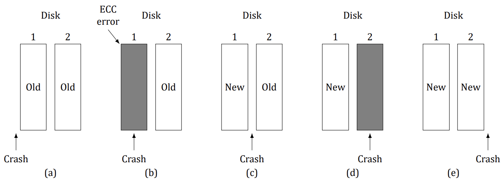

<details>
<summary>Solution</summary>

Yes, the disk remains consistent even if the CPU crashes during a recovery procedure. Consider Figure 17. There is
no recovery involved in **(a)** or (e). Suppose that the CPU crashes during recovery in (b). If CPU crashes before the
block from drive 2 has been completely copied to drive 1, the situation remains same as earlier. The subsequent
recovery procedure will detect an ECC error in drive 1 and again copy the block from drive 2 to drive 1. If CPU
crashes after the block from drive 2 has been copied to drive 1, the situation is same as that in case (e). Suppose
that the CPU crashes during recovery in (c). If CPU crashes before the block from drive 1 has been completely
copied to drive 2, the situation is same as that in case (d). The subsequent recovery procedure will detect an
ECC error in drive 2 and copy the block from drive 1 to drive 2. If CPU crashes after the block from drive 1 has
been copied to drive 2, the situation is same as that in case (e). Finally, suppose the CPU crashes during recovery
in (d). If CPU crashes before the block from drive 1 has been completely copied to drive 2, the situation remains
same as earlier. The subsequent recovery procedure will detect an ECC error in drive 2 and again copy the block
from drive 1 to drive 2. If CPU crashes after the block from drive 1 has been copied to drive 2, the situation is
same as that in case (e).

</details>

### Question 36
In the discussion on stable storage, a key assumption is that a CPU crash that corrupts a sector leads to an incorrect ECC. What problems might arise in the five crash-recovery scenarios shown in Figure 17 if this assumption
does not hold?


<details>
<summary>Solution</summary>

Problems arise in scenarios shown in Figure 17 **(b)** and 17 **(d)**, because they may look like scenario 17
(c), if the ECC of the corrupted block is correct. In this case, it is not possible to detect which disk contains the
valid (old or new) block, and a recovery is not possible.

</details>

### Question 37
The clock interrupt handler on a certain computer requires 2 ms (including process switching overhead) per
clock tick. The clock runs at 60 Hz. What fraction of the CPU is devoted to the clock?

<details>
<summary>Solution</summary>

Two msec 60 times a second is 120 msec/sec, or 12%.

</details>

### Question 38
A computer uses a programmable clock in square-wave mode. If a 500 MHz crystal is used, what should be the
value of the holding register to achieve a clock resolution of

a) a millisecond (a clock tick once every millisecond)?
b) 100 microseconds?

<details>
<summary>Solution</summary>

With these parameters,

a) Using a 500 MHz crystal, the counter can be decremented every 2 nsec. So, for a tick every millisecond,

the register should be 1,000,000/2 = 500,000.

b) To get a clock tick every 100 µsec, holding register value should be 50,000.

</details>

### **Question 39 (Tutorial 12)**
A system simulates multiple clocks by chaining all pending clock requests together as shown in Figure 18. Suppose
the current time is 5000 and there are pending clock requests for time 5008, 5012, 5015, 5029, and 5037.
Show the values of Clock header, Current time, and Next signal at times 5000, 5005, and 5013. Suppose a new
(pending) signal arrives at time 5017 for 5033. Show the values of Clock header, Current time and Next signal
at time 5023.

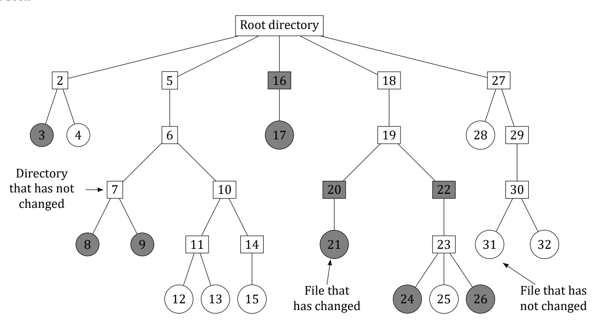

<details>
<summary>Solution</summary>

The first value of the header is the difference between the current
time and pending time. The next values are differences between
following times. For example, at time 5000:
Current time = 5000
Next Signal = 8
Header → 8 → 4 → 3 → 14 → 8

At time 5005 (pending requests at 5008, 5012, 5015, 5029, 5037):
Current time = 5005
Next Signal = 3
Header → 3 → 4 → 3 → 14 → 8

At time 5013 (pending requests at 5015, 5029, 5037):
Current time = 5013
Next Signal = 2
Header → 2 → 14 → 8

At time 5023 (pending requests at 5029, 5033, 5037):
Current time = 5023
Next Signal = 6
Header → 6 → 4 → 4

</details>

### Question 40
Many versions of UNIX use an unsigned 32-bit integer to keep track of the time as the number of seconds since
the origin of time. When will these systems wrap around (year and month)? Do you expect this to actually
happen?

<details>
<summary>Solution</summary>

The number of seconds in a mean year is 365.25 × 24 × 3600. This number is 31,557,600. The counter wraps
around after 2³² seconds from 1 January 1970. The value of 2³²/31,557,600 is 136.1 years, so wrapping will
happen at 2106.1, which is early February 2106. Of course, by then, all computers will be at least 64 bits, so it
will not happen at all.

</details>

### **Question 41 (Retake 1 2016)**
A bitmap terminal contains 1600 by 1200 pixels. To scroll a window, the CPU (or controller) must move all the
lines of text upward by copying their bits from one part of the video RAM to another. If a particular window is
80 lines high by 80 characters wide (6400 characters, total), and a character’s box is 8 pixels wide by 16 pixels
high, how long does it take to scroll the whole window at a copying rate of 50 ns per byte? If all lines are 80
characters long, what is the equivalent baud rate of the terminal? Putting a character on the screen takes 5 µs.
How many lines per second can be displayed?

<details>
<summary>Solution</summary>

Scrolling the window requires copying 79 lines of 80 characters or 6320 characters. Copying 1 character (16
bytes) takes 800 ns, so the whole window takes 5.056 ms. Writing 80 characters to the screen takes 400 µs, so
scrolling and displaying a new line take 5.456 ms. This gives about 183.2 lines/sec.

</details>

### Question 42
After receiving a DEL (SIGINT) character, the display driver discards all output currently queued for that display.
Why?

<details>
<summary>Solution</summary>

Suppose that the user inadvertently asked the editor to print thousands of lines. Then he hits DEL to stop it. If
the driver did not discard output, output might continue for several seconds after the DEL, which would make
the user hit DEL again and again and get frustrated when nothing happened.

</details>

### Question 43
A user at a terminal issues a command to an editor to delete the word on line 5 occupying character positions 7
through and including 12. Assuming the cursor is not on line 5 when the command is given, what ANSI escape
sequence should the editor emit to delete the word?

<details>
<summary>Solution</summary>

It should move the cursor to line 5 position 7 and then delete 6 characters. The sequence is `ESC [ 5 ; 7 H ESC [ 6 P`.

</details>

### **Question 44 (Tutorial 12)**
The designers of a computer system expected that the mouse could be moved at a maximum rate of 20 cm/sec.
If a mickey is 0.1 mm and each mouse message is 3 bytes, what is the maximum data rate of the mouse assuming
that each mickey is reported separately?

<details>
<summary>Solution</summary>

The maximum rate the mouse can move is 200 mm/sec, which is
2000 mickeys/sec.
If each report is 3 bytes, the output rate is 6000 bytes/sec.

</details>

### Question 45
The primary additive colors are red, green, and blue, which means that any color can be constructed from a
linear superposition of these colors. Is it possible that someone could have a color photograph that cannot be
represented using full 24-bit color?

<details>
<summary>Solution</summary>

With a 24-bit color system, only 2²⁴ colors can be represented. This is not all of them. For example, suppose that
a photographer takes pictures of 300 cans of pure blue paint, each with a slightly different amount of pigment.
The first might be represented by the (R, G, B) value (0, 0, 1). The next one might be represented by (0, 0, 2),
and so forth. Since the B coordinate is only 8 bits, there is no way to represent 300 different values of pure blue.
Some of the photographs will have to be rendered as the wrong color. Another example is the color (120.24,
150.47, 135.89). It cannot be represented, only approximated by (120, 150, 136).

</details>

### Question 46
One way to place a character on a bitmapped screen is to use BitBlt from a font table. Assume that a particular
font uses characters that are 16 × 24 pixels in true RGB color.

a) How much font table space does each character take?
b) If copying a byte takes 100 ns, including overhead, what is the output rate to the screen in characters/sec?

<details>
<summary>Solution</summary>

a) Each pixel takes 3 bytes in RGB, so the table space is 16 × 24 × 3 bytes, which is 1152 bytes.
b) At 100 nsec per byte, each character takes 115.2 µsec. This gives an output rate of about 8681 chars/sec.

</details>

### **Question 47 (Tutorial 12)**
Assuming that it takes 2 ns to copy a byte, how much time does it take to completely rewrite the screen of an 80
character × 25 line text mode memory-mapped screen? What about a 1024 × 768 pixel graphics screen with
24-bit color?

<details>
<summary>Solution</summary>

Rewriting the text screen requires copying 2000 bytes, which can
be done in 4 µs. Rewriting the graphics screen requires
copying 1024 × 768 × 3 = 2,359,296 bytes, or about 4.72 msec.

</details>

### Question 48
In the Windows code below there is a call to RegisterClass. In the corresponding X Window code below it, there is no such
call or anything like it. Why not?

```c
#include <windows.h>

int WINAPI WinMain(HINSTANCE h, HINSTANCE, hprev, char *szCmd, int iCmdShow)
{
    WNDCLASS wndclass;      /* Description of our window class: look, cursor, and handler. */
    MSG msg;                /* Each incoming message is stored here in turn. */
    HWND hwnd;              /* Handle (reference) to the created window. */

    /* Fill in the window-class description. */
    wndclass.lpfnWndProc = WndProc;                 /* Our message-handling procedure (WndProc below). */
    wndclass.lpszClassName = "Program name";        /* Text shown in the title bar. */
    wndclass.hIcon = LoadIcon(NULL, IDI_APPLICATION);   /* Load the standard program icon. */
    wndclass.hCursor = LoadCursor(NULL, IDC_ARROW);     /* Load the standard arrow cursor. */
    RegisterClass(&wndclass);                       /* Register this window class with Windows. */
    hwnd = CreateWindow ( ... )                     /* Ask Windows to create (allocate) the window. */
    ShowWindow(hwnd, iCmdShow);                     /* Show the window on the screen. */
    UpdateWindow(hwnd);                             /* Ask the window to paint its contents at once. */

    while (GetMessage(&msg, NULL, 0, 0)) {          /* Pull the next message from our queue (wait if empty). */
        TranslateMessage(&msg);                     /* Translate virtual-key messages. */
        DispatchMessage(&msg);                      /* Deliver the message to our WndProc. */
    }
    return(msg.wParam);
}

long CALLBACK WndProc(HWND hwnd, UINT message, UINT wParam, long lParam)
{
    /* Local declarations go here. */
    switch (message) {
    case WM_CREATE: ... ; return ... ;              /* The window is being created. */
    case WM_PAINT: ... ; return ... ;               /* The window needs repainting. */
    case WM_DESTROY : ... ; return ... ;            /* The window is being destroyed. */
    }
    return(DefWindowProc(hwnd, message, wParam, lParam)); /* Let Windows handle all other messages. */
}
```

```c
#include <X11/Xlib.h>
#include <X11/Xutil.h>
main(int argc, char *argv[])
{
    Display *disp;                  /* Connection to the X server. */
    Window win;                     /* Id of our window. */
    GC gc;                          /* Graphics context (drawing settings). */
    XEvent event;                   /* Room for one incoming event. */
    int running = 1;                /* Main-loop flag: cleared to quit. */
    disp = XOpenDisplay("display_name");    /* Connect to the X server. */
    win = XCreateSimpleWindow(disp, ... );  /* Create the window (details omitted). */
    XSetStandardProperties(disp, ...);      /* Announce the window to the window manager. */
    gc = XCreateGC(disp, win, 0, 0);        /* Create a graphics context for the window. */
    XSelectInput(disp, win, ButtonPressMask | KeyPressMask | ExposureMask);
    XMapRaised(disp, win);          /* Show the window; an Expose event will arrive next. */
while (running) {                 /* Main loop: handle events one by one. */
    XNextEvent(disp, &event);       /* Fetch the next event from the queue. */
    switch (event.type) {
    case Expose:
        ...; break;                 /* Redraw the window. */
    case ButtonPress: ...; break;   /* Mouse button press. */
    case Keypress:
        ...; break;                 /* Keyboard input. */
    }
}
XFreeGC(disp, gc);                  /* Free the graphics context. */
XDestroyWindow(disp, win);          /* Destroy the window. */
XCloseDisplay(disp);                /* Close the connection to the server. */
}
```

<details>
<summary>Solution</summary>

In Windows, the OS calls the handler procedures itself. In X Windows, nothing like this happens. X just gets a
message and processes it internally.

</details>

### Question 49
In the text we gave an example of how to draw a rectangle on the screen using the Windows GDI:
`Rectangle(hdc, xleft, ytop, xright, ybottom);`
Is there any real need for the first parameter (hdc), and if so, what? After all, the coordinates of the rectangle
are explicitly specified as parameters.

<details>
<summary>Solution</summary>

The first parameter is essential. First of all, the coordinates are relative to some window, so hdc is needed to
specify the window and thus the origin. Second, the rectangle will be clipped if it falls outside the window, so
the window coordinates are needed. Third, the color and other properties of the rectangle are taken from the
context specified by hdc. It is quite essential.

</details>

### **Question 50 (Retake 2.2 2016)**
A thin-client terminal is used to display a Web page containing an animated cartoon of size 400 pixels × 160
pixels running at 10 frames/sec. What fraction of a 100-Mbps Fast Ethernet is consumed by displaying the
cartoon?

<details>
<summary>Solution</summary>

The display size is 400 × 160 × 3 bytes, which is 192,000 bytes. At 10 fps this is 1,920,000 bytes/sec or
15,360,000 bits/sec. This consumes 15% of the Fast Ethernet.

</details>

### Question 51
It has been observed that a thin-client system works well with a 1-Mbps network in a test. Are any problems
likely in a multiuser situation? (Hint: Consider a large number of users watching a scheduled TV show and the
same number of users browsing the World Wide Web.)

<details>
<summary>Solution</summary>

The bandwidth on a network segment is shared, so 100 users requesting different data simultaneously on a 1Mbps network will each see a 10-Kbps effective speed. With a shared network, a TV program can be multicast,
so the video packets are only broadcast once, no matter how many users there are and it should work well.
With 100 users browsing the Web, each user will get 1/100 of the bandwidth, so performance may degrade
very quickly.

</details>

### **Question 52 (Tutorial 12)**
Describe two advantages and two disadvantages of thin client computing?

<details>
<summary>Solution</summary>

Advantages:

- Low cost
- No need for complex management for the clients

Disadvantages:

- Lower performance due to network latency
- Potential loss of privacy (the client’s data/information is shared
with the server)

</details>

### **Question 53 (Tutorial 12)**
If a CPU’s maximum voltage, V, is cut to V /n, its power consumption drops to 1/n² of its original value and
its clock speed drops to 1/n of its original value. Suppose that a user is typing at 1 char/sec, but the CPU time
required to process each character is 100 ms. What is the optimal value of n and what is the corresponding
energy saving in percent compared to not cutting the voltage? Assume that an idle CPU consumes no energy at
all.

<details>
<summary>Solution</summary>

If n = 10, the CPU can still get its work done on time, but the
energy used drops considerably.
If the energy consumed in 1 sec at full speed is E, then running at
full speed for 100 msec then going idle for 900 msec uses E/10.
Running at 1/10 speed for a whole second uses E/100, a saving of
9E/100.
The percent savings by cutting the voltage is 90%.

</details>

### Question 54
A notebook computer is set up to take maximum advantage of power saving features including shutting down
the display and the hard disk after periods of inactivity. A user sometimes runs UNIX programs in text mode,
and at other times uses the X Window System. She is surprised to find that battery life is significantly better
when she uses text-only programs. Why?

<details>
<summary>Solution</summary>

The windowing system uses much more memory for its display and uses virtual memory more than the text
mode. This makes it less likely that the hard disk will be inactive for a period long enough to cause it to be
automatically powered down.

</details>

### Question 55
Write a program that simulates stable storage. Use two large fixed-length files on your disk to simulate the two
disks.

<details>
<summary>Solution</summary>

Keep two files of identical length as the two disks and implement the book's stable write/read on top of them: a stable write stores the block on both files; a stable read compares the two copies (with a checksum per block standing in for the ECC) and repairs a bad copy from the good one.

```python
import hashlib

class StableStore:
    def __init__(self, f1, f2, nblocks, bsize=512):
        self.bsize = bsize            # Fixed block size, as on a real disk.
        for f in (f1, f2):            # Both "disks" start zeroed and equal.
            f.seek(nblocks * bsize - 1); f.write(b'\0'); f.flush()
        self.d1, self.d2 = f1, f2
    def _tag(self, blk):
        return hashlib.md5(blk).digest()   # Stands in for the disk ECC.
    def write(self, n, blk, tag):     # Stable write: store on both disks.
        assert len(blk) == self.bsize
        for d in (self.d1, self.d2):
            d.seek(n * (self.bsize + 16))
            d.write(blk + self._tag(blk)); d.flush()
    def read(self, n):                # Stable read: compare, repair, return.
        self.d1.seek(n * (self.bsize + 16)); a = self.d1.read(self.bsize + 16)
        self.d2.seek(n * (self.bsize + 16)); b = self.d2.read(self.bsize + 16)
        oka = a[self.bsize:] == self._tag(a[:self.bsize])
        okb = b[self.bsize:] == self._tag(b[:self.bsize])
        if oka and not okb:           # Drive 2 bad: repair it from drive 1.
            self.d2.seek(n * (self.bsize + 16)); self.d2.write(a); self.d2.flush()
            return a[:self.bsize]
        if okb and not oka:           # Drive 1 bad: repair it from drive 2.
            self.d1.seek(n * (self.bsize + 16)); self.d1.write(b); self.d1.flush()
            return b[:self.bsize]
        return a[:self.bsize]         # Agreeing copies (or both bad: unrecoverable).
```

To demonstrate crash recovery, corrupt one copy mid-write (truncate the file or flip bytes) and show that `read` still returns the intact data and heals the damaged disk.

</details>

### Question 56
Write a program to implement the three disk-arm scheduling algorithms. Write a driver program that generates
a sequence of cylinder numbers (0–999) at random, runs the three algorithms for this sequence and prints out
the total distance (number of cylinders) the arm needs to traverse in the three algorithms.

<details>
<summary>Solution</summary>

Generate the random cylinder sequence once and replay the identical sequence through all three schedulers, summing head movement:

```python
import random

def fcfs(req, start=500):
    pos, dist = start, 0             # FCFS: serve strictly in arrival order.
    for r in req:
        dist += abs(r - pos); pos = r
    return dist

def sstf(req, start=500):
    pending, pos, dist = sorted(req), start, 0   # Repeatedly take the nearest.
    while pending:
        nxt = min(pending, key=lambda r: abs(r - pos))
        pending.remove(nxt)
        dist += abs(nxt - pos); pos = nxt
    return dist

def elevator(req, start=500):
    up = sorted(r for r in req if r >= start)    # Sweep up first...
    down = sorted((r for r in req if r < start), reverse=True)  # ...then back down.
    pos, dist = start, 0
    for r in up + down:
        dist += abs(r - pos); pos = r
    return dist

random.seed(1)
req = [random.randrange(1000) for _ in range(1000)]
print('FCFS:', fcfs(req), ' SSTF:', sstf(req), ' Elevator:', elevator(req))
```

Expect FCFS to travel far more than the other two on random data: SSTF minimizes each step greedily, elevator adds fairness across the disk, FCFS pays a full random seek on every request.

</details>

### Question 57
Write a program to implement multiple timers using a single clock. Input for this program consists of a sequence
of four types of commands (S `<int>`, T, E `<int>`, P): S `<int>` sets the current time to `<int>`; T is a clock tick;
and E `<int>` schedules a signal to occur at time `<int>`; P prints out the values of Current time, Next signal, and
Clock header. Your program should also print out a statement whenever it is time to raise a signal.

<details>
<summary>Solution</summary>

Keep the pending signals in one sorted list of absolute times (the software version of the book's chained clock headers); each tick advances the time and fires everything due:

```python
import bisect

now, pending = 0, []                # pending: sorted list of signal times.
def cmd(line):
    global now
    op, *a = line.split()
    if op == 'S':                   # Set the current time.
        now = int(a[0])
    elif op == 'T':                 # One clock tick.
        now += 1
        while pending and pending[0] <= now:
            print(f'signal at {now} (scheduled for {pending.pop(0)})')
    elif op == 'E':                 # Schedule a signal at absolute time.
        bisect.insort(pending, int(a[0]))
    elif op == 'P':                 # Dump Current time / Next signal / Header.
        nxt = pending[0] if pending else '-'
        gaps = [pending[0] - now] + [b - a for a, b in zip(pending, pending[1:])]
        print(f'Current time: {now}, Next signal: {nxt}, Header: {gaps}')
```

The header gaps are exactly the book's delta chain: first gap = next signal minus now, the rest = differences between consecutive pending times.

</details>

### Question 58 (5th edition)
Given the speeds listed in the table in Question 2, is it possible to record video using a digital video recorder and transmit them over an 802.11n network at full speed? Defend your answer.

<details>
<summary>Solution</summary>

Yes. The table rates the digital video recorder at 3.5 MB/sec and the 802.11n network at 37.5 MB/sec — the network is faster by roughly a factor of ten, so the video stream fits comfortably with plenty of headroom.

</details>

### Question 59 (5th edition)
Explain the difference among interrupts, exceptions/faults, and traps with concrete examples.

<details>
<summary>Solution</summary>

- **Interrupt:** asynchronous, from external hardware. Example: a disk controller signalling that a requested block has arrived, or a clock tick. It can land between any two instructions and is unrelated to what the program is doing.
- **Exception/fault:** synchronous, from the CPU detecting an abnormal condition while executing an instruction. Example: division by 0, or a page fault when the referenced page is not in memory. A fault like a missing page can be fixed (fetch the page) with the instruction then restarted; others kill the program.
- **Trap:** synchronous and deliberate — the program itself executes the trap instruction (e.g. `syscall`) to request a kernel service. Example: calling `read` to fetch file data.

</details>

### Question 60 (5th edition)
Describe two advantages and two disadvantages of thin client computing.

<details>
<summary>Solution</summary>

Advantages:

- Low cost
- No need for complex management for the clients

Disadvantages:

- Lower performance due to network latency
- Potential loss of privacy (the client’s data/information is shared with the server)

</details>

### Question 61 (5th edition)
The I/O time of hard disks mainly consists of three parts. (a) Seek time (b) Boot time (c) Rotational delay (d) Actual data transfer time Which one is the dominant factor in a typical hard disk? What about an SSD?

<details>
<summary>Solution</summary>

On a typical hard disk the seek time dominates: moving the arm takes milliseconds, while the actual transfer of a block takes microseconds. Boot time is a one-time cost, not part of steady I/O. On an SSD there are no moving parts at all — no seeks, no rotation — so the actual data transfer time is what remains and dominates.

</details>

### Question 62 (5th edition)
To improve the I/O performance of hard disks, many scheduling algorithms have been proposed for handling I/O requests, such as FCFS (First-Come, First-Served), SSF (Shortest Seek First), and the elevator algorithm. Which one(s) make the most sense for SSDs? Explain your answer.

<details>
<summary>Solution</summary>

FCFS (with fair queueing) makes the most sense. SSF and the elevator algorithm exist to minimize mechanical arm movement — ordering requests by cylinder position. An SSD has no arm, no seeks and no rotation, so cylinder order is meaningless: reordering buys nothing and only adds overhead and risks starvation. What helps SSDs instead is parallelism — keeping many independent flash requests in flight — which plain FCFS preserves.

</details>

### Question 63 (5th edition)
Compared to hard disks, SSDs are different in some ways. Which of the following statements about SSDs are true? (a) SSDs can handle more I/O requests in parallel. (b) SSDs do not incur rotational delay. (c) SSDs are more resilient to vibration because they contain no moving parts. (d) SSDs do not incur seek time. (e) SSDs are cheaper per megabyte.

<details>
<summary>Solution</summary>

True: (a), (b), (c), (d). SSDs serve requests from many flash chips in parallel, have no platters so no rotational delay, no moving parts so no seek time and high shock resistance. False: (e) — flash storage costs more per megabyte than magnetic disk.

</details>

### Question 64 (5th edition)
The clock interrupt handler on a certain computer requires 2 msec (including process switching overhead) per clock tick. The clock runs at 60 Hz. What fraction of the CPU is devoted to the clock?

<details>
<summary>Solution</summary>

Two msec 60 times a second is 120 msec/sec, or 12%.

</details>

### Question 65 (5th edition)
Consider the performance of a 56-kbps modem of yesteryear (which are still common in rural areas without broadband). The driver outputs one character and then blocks. When the character has been printed, an interrupt occurs and a message is sent to the blocked driver, which outputs the next character and then blocks again. If the time to pass a message, output a character, and block is 100 µ sec, what fraction of the CPU is eaten by the modem handling? Assume that each character has one start bit and one stop bit, for 10 bits in all.

<details>
<summary>Solution</summary>

At 56,000 bits/sec with 10 bits per character, the modem moves 5600 characters/sec. Each character costs 100 µsec of CPU time, so the modem eats 5600 × 100 µsec = 560,000 µsec = 560 msec per second — i.e. 56% of the CPU.

</details>

### Question 66 (5th edition)
A smartphone screen contains 720 × 1280 pixels. To scroll a full screen of text, the CPU (or controller) must move all the lines of text upward by copying their bits from one part of the video RAM to another. A character’s box is 16 pixels wide by 32 pixels high (including intercharacter and interline spacing), Each pixel is 24 bits. How many characters fit on the screen? How long does it take to scroll the whole screen at a copying rate of 5 nsec per byte assuming there is no hardware assistance? What is the scrolling speed in lines/sec?

<details>
<summary>Solution</summary>

Characters on screen: 720/16 = 45 columns by 1280/32 = 40 rows, i.e. 45 × 40 = 1800 characters.

Scrolling the whole screen moves the full framebuffer: 720 × 1280 pixels × 3 bytes = 2,764,800 bytes. At 5 nsec per byte that takes 2,764,800 × 5 nsec ≈ 13.8 msec.

One full scroll advances 40 lines, so the scrolling speed is 40 / 0.0138 ≈ 2900 lines/sec.

</details>

# Chapter 6

### Question 1
Give an example of a deadlock taken from politics.

<details>
<summary>Solution</summary>

In the U.S., consider a presidential election in which three or more candidates are trying for the nomination of
some party. After all the primary elections are finished, when the delegates arrive at the party convention, it
could happen that no candidate has a majority and that no delegate is willing to change his or her vote. This is
a deadlock. Each candidate has some resources (votes) but needs more to get the job done. In countries with
multiple political parties in the parliament, it could happen that each party supports a different version of the
annual budget and that it is impossible to assemble a majority to pass the budget. This is also a deadlock.

</details>

### Question 2
Students working at individual PCs in a computer laboratory send their files to be printed by a server that spools
the files on its hard disk. Under what conditions may a deadlock occur if the disk space for the print spool is
limited? How may the deadlock be avoided?

<details>
<summary>Solution</summary>

Disk space on the spooling partition is a finite resource. Every block that comes in de facto claims a resource
and every new one arriving wants more resources. If the spooling space is, say, 10 MB and the first half of ten
2-MB jobs arrive, the disk will be full and no more blocks can be stored so we have a deadlock. The deadlock
can be avoided by allowing a job to start printing before it is fully spooled and reserving the space thus released
for the rest of that job. In this way, one job will actually print to completion, then the next one can do the same
thing. If jobs cannot start printing until they are fully spooled, deadlock is possible.

</details>

### Question 3
In the preceding question, which resources are preemptable and which are nonpreemptable?

<details>
<summary>Solution</summary>

The printer is nonpreemptable; the system cannot start printing another job until the previous one is complete.
The spool disk is preemptable; you can delete an incomplete file that is growing too large and have the user send
it later, assuming the protocol allows that.

</details>

### Question 4
In the code below the resources are returned in the reverse order of their acquisition. Would giving them back in the
other order be just as good?

```c
/* (a) One resource: take the only semaphore, use the resource, give it back. */
typedef int semaphore;
semaphore resource_1;

void process_A(void) {
    down(&resource_1);      /* Acquire the resource. */
    use_resource_1();       /* Use the resource. */
    up(&resource_1);        /* Give the resource back. */
}

/* ----- (b) Two resources: release them in the reverse order of acquisition ----- */
typedef int semaphore;
semaphore resource_1;
semaphore resource_2;

void process_A(void) {
    down(&resource_1);      /* Acquire the first resource. */
    down(&resource_2);      /* Acquire the second resource. */
    use_both_resources();   /* Use both resources together. */
    up(&resource_2);        /* Give them back in reverse order. */
    up(&resource_1);
}
```

<details>
<summary>Solution</summary>

Yes. It does not make any difference whatsoever.

</details>

### **Question 5 (Pre-Final 2020)**
The four conditions (mutual exclusion, hold and wait, no preemption and circular wait) are necessary for a
resource deadlock to occur. Give an example to show that these conditions are not sufficient for a resource
deadlock to occur. When are these conditions sufficient for a resource deadlock to occur?

<details>
<summary>Solution</summary>

Suppose that there are three processes, A, B and C, and two resource types, R and S. Further assume that there
is one instance of R and two instances of S. Consider the following execution scenario: A requests R and gets
it; B requests S and gets it; C requests S and gets it (there are two instances of S); B requests R and is blocked; A
requests S and is blocked. At this stage all four conditions hold. However, there is no deadlock. When C finishes,
one instance of S is released that is allocated to A. Now A can complete its execution and release R that can be
allocated to B, which can then complete its execution. These four conditions are enough if there is one resource
of each type.

</details>

### Question 6
City streets are vulnerable to a circular blocking condition called gridlock, in which intersections are blocked by
cars that then block cars behind them that then block the cars that are trying to enter the previous intersection,
etc. All intersections around a city block are filled with vehicles that block the oncoming traffic in a circular manner. Gridlock is a resource deadlock and a problem in competition synchronization. New York City’s prevention
algorithm, called ”don’t block the box,” prohibits cars from entering an intersection unless the space following

the intersection is also available. Which prevention algorithm is this? Can you provide any other prevention
algorithms for gridlock?

<details>
<summary>Solution</summary>

“Don’t block the box” is a pre-allocation strategy, negating the hold-and-wait precondition, since we
assume that cars can enter the street space following the intersection, thus freeing the intersection. Another
strategy might allow cars to temporarily pull into garages and release enough space to clear the gridlock. Some
cities have a traffic control policy to shape traffic; as city streets become more congested, traffic supervisors
adjust the settings for red lights in order to throttle traffic entering heavily congested areas. Lighter traffic
ensures less competition over resources and thus lowers the probability of gridlock occurring.

</details>

### Question 7
Suppose four cars each approach an intersection from four different directions simultaneously. Each corner of
the intersection has a stop sign. Assume that traffic regulations require that when two cars approach adjacent
stop signs at the same time, the car on the left must yield to the car on the right. Thus, as four cars each drive
up to their individual stop signs, each waits (indefinitely) for the car on the left to proceed. Is this anomaly a
communication deadlock? Is it a resource deadlock?

<details>
<summary>Solution</summary>

The above anomaly is not a communication deadlock since these cars are independent of each other and would
drive through the intersection with a minimal delay if no competition occurred. It is not a resource deadlock,
since no car is holding a resource that is requested by another car. Nor would the mechanisms of resource
pre-allocation or of resource preemption assist in controlling this anomaly. This anomaly is one of competition
synchronization, however, in which cars are waiting for resources in a circular chain and traffic throttling may
be an effective strategy for control. To distinguish from resource deadlock, this anomaly might be termed a
“scheduling deadlock.” A similar deadlock could occur following a law that required two trains merging onto a
shared railroad track to wait for the other to proceed. Note that a policeman signaling one of the competing cars
or trains to proceed (and not the others) can break this dead state without rollback or any other overhead.

</details>

### Question 8
Is it possible that a resource deadlock involves multiple units of one type and a single unit of another? If so, give
an example.

<details>
<summary>Solution</summary>

It is possible that one process holds some or all of the units of one resource type and requests another resource
type, while another process holds the second resource while requesting the available units of the first resource
type. If no other process can release units of the first resource type and the resource cannot be preempted or
used concurrently, the system is deadlocked. For example, two processes are both allocated memory cells in a
real memory system. (We assume that swapping of pages or processes is not supported, while dynamic requests
for memory are supported.) The first process locks another resource - perhaps a data cell. The second process
requests the locked data and is blocked. The first process needs more memory in order to execute the code
to release the data. Assuming that no other processes in the system can complete and release memory cells, a
deadlock exists in the system.

</details>

### Question 9
Figure 19 shows the concept of a resource graph. Do illegal graphs exist, that is, graphs that structurally violate
the model we have used of resource usage? If so, give an example of one.

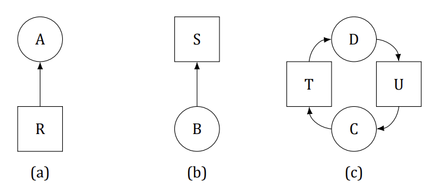

<details>
<summary>Solution</summary>

Yes, illegal graphs exist. We stated that a resource may only be held by a single process. An arc from a resource
square to a process circle indicates that the process owns the resource. Thus, a square with arcs going from it to
two or more processes means that all those processes hold the resource, which violates the rules. Consequently,
any graph in which multiple arcs leave a square and end in different circles violates the rules unless there are
multiple copies of the resources. Arcs from squares to squares or from circles to circles also violate the rules.

</details>

### Question 10
Consider Figure 20. Suppose that in step (o) C requested S instead of requesting R. Would this lead to deadlock?
Suppose that it requested both S and R.

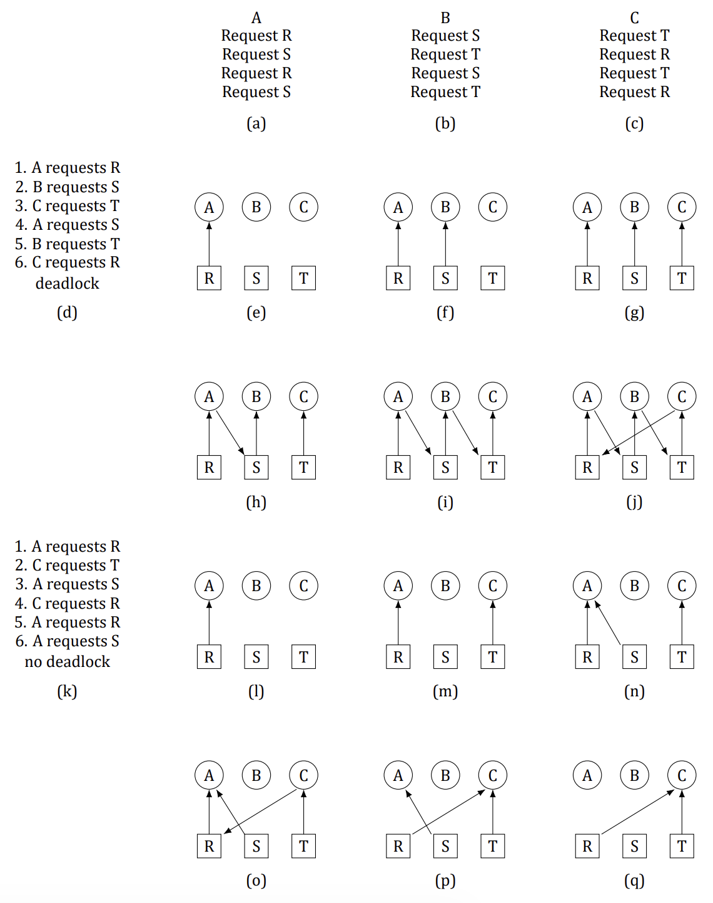

<details>
<summary>Solution</summary>

Neither change leads to deadlock. There is no circular wait in either case.

</details>

### **Question 11 (Final 2017)**
Suppose that there is a resource deadlock in a system. Give an example to show that the set of processes deadlocked can include processes that are not in the circular chain in the corresponding resource allocation graph.

<details>
<summary>Solution</summary>

Consider three processes, A, B and C and two resources R and S. Suppose A is waiting for R that is held by B,
B is waiting for S held by A, and C is waiting for R held by A. All three processes, A, B and C are deadlocked.
However, only A and B belong to the circular chain.

</details>

### **Question 12 (Retake 1 2016)**
In order to control traffic, a network router, A periodically sends a message to its neighbor, B, telling it to increase
or decrease the number of packets that it can handle. At some point in time, Router A is flooded with traffic and
sends B a message telling it to cease sending traffic. It does this by specifying that the number of bytes B may
send (A’s window size) is 0. As traffic surges decrease, A sends a new message, telling B to restart transmission.
It does this by increasing the window size from 0 to a positive number. That message is lost. As described,
neither side will ever transmit. What type of deadlock is this?

<details>
<summary>Solution</summary>

This is clearly a communication deadlock, and can be controlled by having A time out and retransmit its enabling
message (the one that increases the window size) after some period of time (a heuristic). It is possible, however,
that B has received both the original and the duplicate message. No harm will occur if the update on the window
size is given as an absolute value and not as a differential. Sequence numbers on such messages are also effective
to detect duplicates.

</details>

### Question 13
The discussion of the ostrich algorithm mentions the possibility of process-table slots or other system tables
filling up. Can you suggest a way to enable a system administrator to recover from such a situation?

<details>
<summary>Solution</summary>

A portion of all such resources could be reserved for use only by processes owned by the administrator, so he
or she could always run a shell and programs needed to evaluate a deadlock and make decisions about which
processes to kill to make the system usable again.

</details>

### Question 14
Consider the following state of a system with four processes, P1, P2, P3, and P4, and five types of resources,
RS1, RS2, RS3, RS4, and RS5: Using the deadlock detection algorithm described in Section 6.4.2, show that there
is a deadlock in the system. Identify the processes that are deadlocked. E=(24144), A=(01021). Provided:
R1=(01112), R2=(01010), R3=(00001), R4=(21000). Requested: R1=(11021), R2=(01021), R3=(02031), R4=(02110).

<details>
<summary>Solution</summary>

```text
First, the set of unmarked processes, P = (P1 P2 P3 P4)
R1 is not less than or equal to A
R2 is less than A; Mark P2; A = (0 2 0 3 1); P = (P1 P3 P4)
R1 is not less than or equal to A
R3 is equal to A; Mark P3; A = (0 2 0 3 2); P = (P1 P4)
R1 is not less than or equal to A
R4 is not less than or equal to A
So, processes P1 and P4 remain unmarked. They are deadlocked.
```

</details>

### Question 15
Explain how the system can recover from the deadlock in previous problem using

a) recovery through preemption.
b) recovery through rollback.
c) recovery through killing processes.

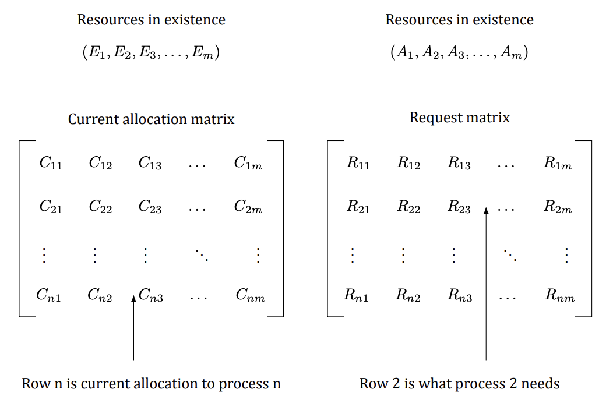

<details>
<summary>Solution</summary>

Recovery through preemption: After processes P2 and P3 complete, process P1 can be forced to preempt 1
unit of RS3. This will make A = (0 2 1 3 2), and allow process P4 to complete. Once P4 completes and release its
resources P1 may complete. Recovery through rollback: Rollback P1 to the state checkpointed before it acquired
RS3. Recovery through killing processes: Kill P1.


</details>

### Question 16
Suppose that in Figure 21 Cij + Rij > Ej for some i. What implications does this have for the system?


<details>
<summary>Solution</summary>

The process is asking for more resources than the system has. There is no conceivable way it can get these
resources, so it can never finish, even if no other processes want any resources at all.

</details>

### Question 17
All the trajectories in Figure 22 are horizontal or vertical. Can you envision any circumstances in which diagonal
trajectories are also possible?

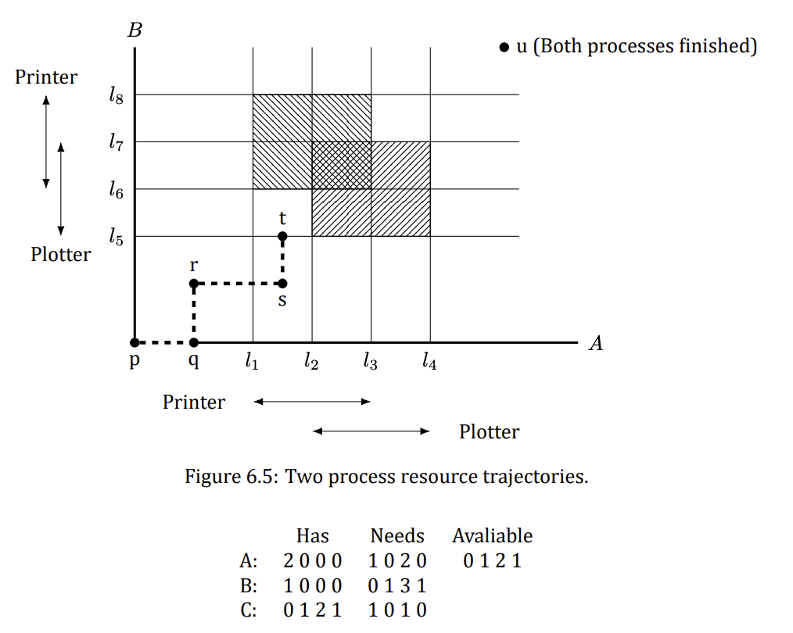

<details>
<summary>Solution</summary>

If the system had two or more CPUs, two or more processes could run in parallel, leading to diagonal trajectories.

</details>

### Question 18
Can the resource trajectory scheme of Figure 22 also be used to illustrate the problem of deadlocks with three
processes and three resources? If so, how can this be done? If not, why not?


<details>
<summary>Solution</summary>

Yes. Do the whole thing in three dimensions. The z-axis measures the number of instructions executed by the
third process.


</details>

### Question 19
In theory, resource trajectory graphs could be used to avoid deadlocks. By clever scheduling, the operating
system could avoid unsafe regions. Is there a practical way of actually doing this?

<details>
<summary>Solution</summary>

The method can only be used to guide the scheduling if the exact instant at which a resource is going to be
claimed is known in advance. In practice, this is rarely the case.

</details>

### Question 20
Can a system be in a state that is neither deadlocked nor safe? If so, give an example. If not, prove that all states
are either deadlocked or safe.

<details>
<summary>Solution</summary>

There are states that are neither safe nor deadlocked, but which lead to deadlocked states. As an example,
suppose we have four resources: tapes, plotters, scanners, and CD-ROMs, as in the text, and three processes
competing for them. We could have the following situation:

Has
Needs
Available
A:
```text
2 0 0 0
1 0 2 0
0 1 2 1
```
B:
```text
1 0 0 0
0 1 3 1
```
C:
```text
0 1 2 1
1 0 1 0
```

</details>

### Question 21
Take a careful look at the state below. If D asks for one more unit, does this lead to a safe state or an unsafe one? What
if the request came from C instead of D?

This state is not deadlocked because many actions can still occur, for example, A can still get two printers. However, if each process asks for its remaining requirements, we have a deadlock.

```text
Has Max: A B C D, Free: 2
```

<details>
<summary>Solution</summary>

A request from D is unsafe: it leaves no order in which every process can still finish. A request from C is safe: a completing order still exists after granting it.

</details>

### Question 22
A system has two processes and three identical resources. Each process needs a maximum of two resources. Is
deadlock possible? Explain your answer.

<details>
<summary>Solution</summary>

The system is deadlock free. Suppose that each process has one resource. There is one resource free. Either
process can ask for it and get it, in which case it can finish and release both resources. Consequently, deadlock
is impossible.

</details>

### Question 23
Consider the previous problem again, but now with p processes each needing a maximum of m resources and a
total of r resources available. What condition must hold to make the system deadlock free?

<details>
<summary>Solution</summary>

If a process has m resources it can finish and cannot be involved in a deadlock. Therefore, the worst case is
where every process has m −1 resources and needs another one. If there is one resource left over, one process
can finish and release all its resources, letting the rest finish too. Therefore the condition for avoiding deadlock
is r ≥p(m −1) + 1.

</details>

### Question 24
Suppose that process A in the tables below requests the last tape drive. Does this action lead to a deadlock?

| Resources assigned | Tape drives | Plotters | Printers | Blu-rays |
|---|---|---|---|---|
| A | 3 | 0 | 1 | 1 |
| B | 0 | 1 | 0 | 0 |
| C | 1 | 1 | 1 | 0 |
| D | 1 | 1 | 0 | 1 |
| E | 0 | 0 | 0 | 0 |

| Resources still needed | Tape drives | Plotters | Printers | Blu-rays |
|---|---|---|---|---|
| A | 1 | 1 | 0 | 0 |
| B | 0 | 1 | 1 | 2 |
| C | 3 | 1 | 0 | 0 |
| D | 0 | 0 | 1 | 0 |
| E | 2 | 1 | 1 | 0 |

E = (6 3 4 2), P = (5 3 2 2), A = (1 0 2 0).

<details>
<summary>Solution</summary>

No. D can still finish. When it finishes, it returns enough resources to allow E (or A) to finish, and so on.

</details>

### **Question 25 (Retake 2.1 2016, Final 2017)**
The banker’s algorithm is being run in a system with m resource classes and n processes. In the limit of large
m and n, the number of operations that must be performed to check a state for safety is proportional to mᵃnᵇ.
What are the values of a and b?

<details>
<summary>Solution</summary>

Comparing a row in the matrix to the vector of available resources takes m operations. This step must be repeated on the order of n times to find a process that can finish and be marked as done. Thus, marking a process
as done takes on the order of mn steps. Repeating the algorithm for all n processes means that the number of
steps is then mn². Thus, a = 1 and b = 2.

</details>

### **Question 26 (Final 2018)**
A system has four processes and five allocatable resources. The current allocation and maximum needs are as
follows:

|  | RS1 | RS2 | RS3 | RS4 | RS5 |
|---|---|---|---|---|---|
| A allocated | 1 | 0 | 2 | 1 | 1 |
| A maximum | 1 | 1 | 2 | 1 | 3 |
| B allocated | 2 | 0 | 1 | 1 | 0 |
| B maximum | 2 | 2 | 2 | 1 | 0 |
| C allocated | 1 | 1 | 0 | 1 | 0 |
| C maximum | 2 | 1 | 3 | 1 | 0 |
| D allocated | 1 | 1 | 1 | 1 | 0 |
| D maximum | 1 | 1 | 2 | 2 | 1 |
| Available | 0 | 0 | x | 1 | 1 |

What is the smallest value of x for which this is a safe state?

<details>
<summary>Solution</summary>

The needs matrix (Maximum − Allocated) is as follows:

|  | RS1 | RS2 | RS3 | RS4 | RS5 |
|---|---|---|---|---|---|
| A | 0 | 1 | 0 | 0 | 2 |
| B | 0 | 2 | 1 | 0 | 0 |
| C | 1 | 0 | 3 | 0 | 0 |
| D | 0 | 0 | 1 | 1 | 1 |

If x is 0, nothing can run (every need exceeds the available vector), so we have a deadlock immediately. If x is 1, only process D can run to completion; when it finishes, the available vector is 1 1 2 2 1, and no remaining need fits it — deadlocked again. If x is 2, D runs, then C, then B, leaving the available vector at 4 2 4 4 1 — but A still needs 2 units of RS5 while only 1 is free.

In fact no value of x makes this state safe: process A holds 1 unit of RS5 and may claim up to 3, yet only 2 units of RS5 exist in the whole system (1 held + 1 free), so A can never collect what its maximum claim allows — the same hopeless situation as a claim exceeding existence. The question as printed is inconsistent (most likely a typo in A's maximum row); ignoring that final check, the intended order D, C, B, A completes at x = 2.

</details>

### Question 27
One way to eliminate circular wait is to have rule saying that a process is entitled only to a single resource at any
moment. Give an example to show that this restriction is unacceptable in many cases.

<details>
<summary>Solution</summary>

Consider a process that needs to copy a huge file from a tape to a printer. Because the amount of memory is limited and the entire file cannot fit in this memory, the process will have to loop through the following statements
until the entire file has been printed:
Acquire tape drive
Copy the next portion of the file in memory (limited memory size)
Release tape drive
Acquire printer
Print file from memory
Release printer
This will lengthen the execution time of the process. Furthermore, since the printer is released after every
print step, there is no guarantee that all portions of the file will get printed on continuous pages.

</details>

### Question 28
Two processes, A and B, each need three records, 1, 2, and 3, in a database. If A asks for them in the order 1,
2, 3, and B asks for them in the same order, deadlock is not possible. However, if B asks for them in the order
3, 2, 1, then deadlock is possible. With three resources, there are 3! or six possible combinations in which each
process can request them. What fraction of all the combinations is guaranteed to be deadlock free?

<details>
<summary>Solution</summary>

Suppose that process A requests the records in the order a, b, c. If process B also asks for a first, one of them will
get it and the other will block. This situation is always deadlock free since the winner can now run to completion
without interference. Of the four other combinations, some may lead to deadlock and some are deadlock free.
The six cases are as follows:

| Order | Result |
|---|---|
| a b c | deadlock free |
| a c b | deadlock free |
| b a c | possible deadlock |
| b c a | possible deadlock |
| c a b | possible deadlock |
| c b a | possible deadlock |

Since four of the six may lead to deadlock, there is a 1/3 chance of avoiding a deadlock and a 2/3 chance of
getting one.

</details>

### **Question 29 (Retake 2.2 2016)**
A distributed system using mailboxes has two IPC primitives, send and receive. The latter primitive specifies
a process to receive from and blocks if no message from that process is available, even though messages may be
waiting from other processes. There are no shared resources, but processes need to communicate frequently
about other matters. Is deadlock possible? Discuss.

<details>
<summary>Solution</summary>

Yes. Suppose that all the mailboxes are empty. Now A sends to B and waits for a reply, B sends to C and waits
for a reply, and C sends to A and waits for a reply. All the conditions for a communications deadlock are now
fulfilled.

</details>

### Question 30
In an electronic funds transfer system, there are hundreds of identical processes that work as follows. Each
process reads an input line specifying an amount of money, the account to be credited, and the account to be
debited. Then it locks both accounts and transfers the money, releasing the locks when done. With many processes running in parallel, there is a very real danger that a process having locked account x will be unable to
lock y because y has been locked by a process now waiting for x. Devise a scheme that avoids deadlocks. Do not
release an account record until you have completed the transactions. (In other words, solutions that lock one
account and then release it immediately if the other is locked are not allowed.)

<details>
<summary>Solution</summary>

To avoid circular wait, number the resources (the accounts) with their account numbers. After reading an input
line, a process locks the lower-numbered account first, then when it gets the lock (which may entail waiting), it
locks the other one. Since no process ever waits for an account lower than what it already has, there is never a
circular wait, hence never a deadlock.

</details>

### Question 31
One way to prevent deadlocks is to eliminate the hold-and-wait condition. In the text it was proposed that before
asking for a new resource, a process must first release whatever resources it already holds (assuming that is
possible). However, doing so introduces the danger that it may get the new resource but lose some of the existing
ones to competing processes. Propose an improvement to this scheme.

<details>
<summary>Solution</summary>

Change the semantics of requesting a new resource as follows. If a process asks for a new resource and it is
available, it gets the resource and keeps what it already has. If the new resource is not available, all existing
resources are released. With this scenario, deadlock is impossible and there is no danger that the new resource
is acquired but existing ones lost. Of course, the process only works if releasing a resource is possible (you can
release a scanner between pages or a CD recorder between CDs).

</details>

### Question 32
A computer science student assigned to work on deadlocks thinks of the following brilliant way to eliminate
deadlocks. When a process requests a resource, it specifies a time limit. If the process blocks because the resource is not available, a timer is started. If the time limit is exceeded, the process is released and allowed to
run again. If you were the professor, what grade would you give this proposal and why?

<details>
<summary>Solution</summary>

I’d give it an F (failing) grade. What does the process do? Since it clearly needs the resource, it just asks again
and blocks again. This is no better than staying blocked. In fact, it may be worse since the system may keep
track of how long competing processes have been waiting and assign a newly freed resource to the process that
has been waiting longest. By periodically timing out and trying again, a process loses its seniority.

</details>

### Question 33
Main memory units are preempted in swapping and virtual memory systems. The processor is preempted in
time-sharing environments. Do you think that these preemption methods were developed to handle resource
deadlock or for other purposes? How high is their overhead?

<details>
<summary>Solution</summary>

Both virtual memory and time-sharing systems were developed mainly to assist system users. Virtualizing hardware shields users from the details of prestating needs, resource allocation, and overlays, in addition to preventing deadlock. The cost of context switching and interrupt handling, however, is considerable. Specialized
registers, caches, and circuitry are required. Probably this cost would not have been incurred for the purpose
of deadlock prevention alone.

</details>

### **Question 34 (Final 2019)**
Explain the differences between deadlock, livelock, and starvation.

<details>
<summary>Solution</summary>

A deadlock occurs when a set of processes are blocked waiting for an event that only some other process in
the set can cause. On the other hand, processes in a livelock are not blocked. Instead, they continue to execute
checking for a condition to become true that will never become true. Thus, in addition to the resources they are
holding, processes in livelock continue to consume precious CPU time. Finally, starvation of a process occurs
because of the presence of other processes as well as a stream of new incoming processes that end up with
higher priority than the process being starved. Unlike deadlock or livelock, starvation can terminate on its own,
e.g. when existing processes with higher priority terminate and no new processes with higher priority arrive.

</details>

### Question 35
Assume two processes are issuing a seek command to reposition the mechanism to access the disk and enable a
read command. Each process is interrupted before executing its read, and discovers that the other has moved the
disk arm. Each then reissues the seek command, but is again interrupted by the other. This sequence continually
repeats. Is this a resource deadlock or a livelock? What methods would you recommend to handle the anomaly?

<details>
<summary>Solution</summary>

This dead state is an anomaly of competition synchronization and can be controlled by resource pre-allocation.
Processes, however, are not blocked from resources. In addition, resources are already requested in a linear
order. This anomaly is not a resource deadlock; it is a livelock. Resource preallocation will prevent this anomaly.
As a heuristic, processes may time-out and release their resources if they do not complete within some interval
of time, then go to sleep for a random period and then try again.

</details>

### Question 36
Local Area Networks utilize a media access method called CSMA/CD, in which stations sharing a bus can sense
the medium and detect transmissions as well as collisions. In the Ethernet protocol, stations requesting the

shared channel do not transmit frames if they sense the medium is busy. When such transmission has terminated, waiting stations each transmit their frames. Two frames that are transmitted at the same time will
collide. If stations immediately and repeatedly retransmit after collision detection, they will continue to collide
indefinitely

a) Is this a resource deadlock or a livelock?
b) Can you suggest a solution to this anomaly?
c) Can starvation occur with this scenario?

<details>
<summary>Solution</summary>

Here are the answers, albeit a bit complicated.

- **(a)** This is a competition synchronization anomaly. It is also a livelock. We might term it a scheduling livelock. It is not a resource livelock or deadlock, since stations are not holding resources that are requested by

others and thus a circular chain of stations holding resources while requesting others does not exist. It is not
a communication deadlock, since stations are executing independently and would complete transmission were
scheduled sequentially

- **(b)** Ethernet and slotted Aloha require that stations that detect a collision of their transmission must wait a random number of time slots before retransmitting. The interval within which the time slot is chosen is doubled

after each successive collision, dynamically adjusting to heavy traffic loads. After sixteen successive retransmissions a frame is dropped.

- **(c)** Because access to the channel is probabilistic, and because newly arriving stations can compete and be allocated the channel before stations that have retransmitted some number of times, starvation is enabled.

</details>

### Question 37
A program contains an error in the order of cooperation and competition mechanisms, resulting in a consumer
process locking a mutex (mutual exclusion semaphore) before it blocks on an empty buffer. The producer process blocks on the mutex before it can place a value in the empty buffer and awaken the consumer. Thus, both
processes are blocked forever, the producer waiting for the mutex to be unlocked and the consumer waiting for
a signal from the producer. Is this a resource deadlock or a communication deadlock? Suggest methods for its
control.

<details>
<summary>Solution</summary>

The anomaly is not a resource deadlock. Although processes are sharing a mutex, i.e., a competition mechanism,
resource pre-allocation and deadlock avoidance methods are all ineffective for this dead state. Linearly ordering
resources is also ineffective. Indeed one could argue that linear orders may be the problem; executing a mutex
should be the last step before entering and the first after leaving a critical section. A circular dead state does exist
in which both processes wait for an event that can only be caused by the other process. This is a communication
deadlock. To make progress, a time-out will work to break this deadlock if it preempts the consumer’s mutex.
Writing careful code or using monitors for mutual exclusion are better solutions.

</details>

### Question 38
Cinderella and the Prince are getting divorced. To divide their property, they have agreed on the following algorithm. Every morning, each one may send a letter to the other’s lawyer requesting one item of property. Since it
takes a day for letters to be delivered, they have agreed that if both discover that they have requested the same
item on the same day, the next day they will send a letter canceling the request. Among their property is their

dog, Woofer, Woofer’s doghouse, their canary, Tweeter, and Tweeter’s cage. The animals love their houses, so it
has been agreed that any division of property separating an animal from its house is invalid, requiring the whole
division to start over from scratch. Both Cinderella and the Prince desperately want Woofer. So that they can
go on (separate) vacations, each spouse has programmed a personal computer to handle the negotiation. When
they come back from vacation, the computers are still negotiating. Why? Is deadlock possible? Is starvation
possible? Discuss your answer.

<details>
<summary>Solution</summary>

If both programs ask for Woofer first, the computers will starve with the endless sequence: request Woofer,
cancel request, request Woofer, cancel request, and so on. If one of them asks for the doghouse and the other
asks for the dog, we have a deadlock, which is detected by both parties and then broken, but it is just repeated
on the next cycle. Either way, if both computers have been programmed to go after the dog or the doghouse
first, either starvation or deadlock ensues. There is not really much difference between the two here. In most
deadlock problems, starvation does not seem serious because introducing random delays will usually make it
very unlikely. That approach does not work here.

</details>

### Question 39
A student majoring in anthropology and minoring in computer science has embarked on a research project to
see if African baboons can be taught about deadlocks. He locates a deep canyon and fastens a rope across it,
so the baboons can cross hand-overhand. Several baboons can cross at the same time, provided that they are
all going in the same direction. If eastward-moving and westward-moving baboons ever get onto the rope at
the same time, a deadlock will result (the baboons will get stuck in the middle) because it is impossible for one
baboon to climb over another one while suspended over the canyon. If a baboon wants to cross the canyon, he
must check to see that no other baboon is currently crossing in the opposite direction. Write a program using
semaphores that avoids deadlock. Do not worry about a series of eastward-moving baboons holding up the
westward-moving baboons indefinitely.

<details>
<summary>Solution</summary>

The rope is held exclusively by one direction at a time; a per-direction queue parks baboons that arrive while the opposite direction owns it. Same-direction newcomers just join the flow (hence possible starvation, as allowed):

```c
semaphore mutex = 1;            /* Guards all counters below. */
semaphore rope = 1;             /* 1 iff the rope is completely empty. */
semaphore eastQ = 0, westQ = 0; /* Parked east- / west-bound baboons. */
int east = 0, west = 0;         /* Baboons currently on the rope. */
int wEast = 0, wWest = 0;       /* Baboons parked in each queue. */

void eastbound(void) {
    down(&mutex);
    while (west > 0) {          /* Opposite direction owns the rope: park. */
        wEast++;
        up(&mutex); down(&eastQ); down(&mutex);
    }
    if (east + west == 0)
        down(&rope);            /* First one on an empty rope locks it. */
    east++;
    up(&mutex);
    cross();                    /* Walk the rope. */
    down(&mutex);
    if (--east == 0) {          /* Last one off: hand the rope over. */
        up(&rope);
        while (wWest-- > 0) up(&westQ);  /* Wake every parked west baboon. */
    }
    up(&mutex);
}
/* westbound() is mirror-symmetric (swap east/west everywhere). */
```

Deadlock is impossible: the rope always belongs to at most one direction, parked baboons are woken exactly when the rope becomes free, and every crossing finishes.

</details>

### Question 40
Repeat the previous problem, but now avoid starvation. When a baboon that wants to cross to the east arrives at
the rope and finds baboons crossing to the west, he waits until the rope is empty, but no more westward-moving
baboons are allowed to start until at least one baboon has crossed the other way.

<details>
<summary>Solution</summary>

Add a `turn` flag recording whose turn it is to own the rope next. A newcomer waits while the opposite direction is crossing, or while it is the opposite side's turn and opposite baboons are parked. When the rope drains, ownership (and wakeups) go to the waiting opposite side if any, so directions strictly alternate under contention and neither side starves:

```c
semaphore mutex = 1;
semaphore rope = 1;             /* 1 iff the rope is completely empty. */
semaphore eastQ = 0, westQ = 0;
int east = 0, west = 0;         /* On the rope per direction. */
int wEast = 0, wWest = 0;       /* Parked per direction. */
int turn = 0;                   /* 0 = none, 1 = east, 2 = west. */

void eastbound(void) {
    down(&mutex);
    wEast++;
    while (west > 0 || (turn == 2 && wWest > 0)) {
        up(&mutex); down(&eastQ); down(&mutex);  /* Wait our turn. */
    }
    wEast--;
    if (east + west == 0)
        down(&rope);            /* First one on an empty rope locks it. */
    east++;
    up(&mutex);
    cross();
    down(&mutex);
    if (--east == 0) {          /* Rope drained: hand it to whoever waits. */
        up(&rope);
        if (wWest > 0) { turn = 2; while (wWest-- > 0) up(&westQ); }
        else if (wEast > 0) { turn = 1; while (wEast-- > 0) up(&eastQ); }
        else turn = 0;
    }
    up(&mutex);
}
/* westbound() is mirror-symmetric: waits while east > 0 or turn == 1 with wEast > 0. */
```

Because a drained rope always goes to the parked opposite side first, an endless eastward stream can no longer lock the west out: as soon as west baboons are parked, the next handover is theirs.

</details>

### Question 41
Program a simulation of the banker’s algorithm. Your program should cycle through each of the bank clients
asking for a request and evaluating whether it is safe or unsafe. Output a log of requests and decisions to a file.

<details>
<summary>Solution</summary>

Read the initial state (Available vector, Max and Allocation matrices) plus a script of `(process, request)` lines from a file; grant a request only if the resulting state passes the safety test, and log every decision:

```python
import sys

def safe(avail, mx, alloc):
    need = [[mx[i][j] - alloc[i][j] for j in range(len(avail))] for i in range(len(mx))]
    work, done = avail[:], [False] * len(mx)   # Try to order all clients.
    while True:
        progressed = False
        for i in range(len(mx)):
            if not done[i] and all(need[i][j] <= work[j] for j in range(len(avail))):
                work = [work[j] + alloc[i][j] for j in range(len(avail))]
                done[i], progressed = True, True   # i could finish: take back its share.
        if not progressed:
            return all(done)

def main(path):
    it = iter(open(path).read().split())
    n, m = int(next(it)), int(next(it))
    avail = [int(next(it)) for _ in range(m)]
    mx = [[int(next(it)) for _ in range(m)] for _ in range(n)]
    alloc = [[int(next(it)) for _ in range(m)] for _ in range(n)]
    log = open('banker.log', 'w')
    for line in open(path + '.req'):
        p, *rq = line.split()
        if not rq:
            continue
        p, rq = int(p), [int(x) for x in rq]
        need = [mx[p][j] - alloc[p][j] for j in range(m)]
        if any(rq[j] > need[j] for j in range(m)):
            log.write(f'P{p} asks {rq}: DENIED (exceeds maximum claim)\n')
        elif any(rq[j] > avail[j] for j in range(m)):
            log.write(f'P{p} asks {rq}: WAIT (not enough free resources)\n')
        else:                               # Tentatively grant, then test safety.
            alloc[p] = [alloc[p][j] + rq[j] for j in range(m)]
            avail = [avail[j] - rq[j] for j in range(m)]
            if safe(avail, mx, alloc):
                log.write(f'P{p} asks {rq}: GRANTED (state stays safe)\n')
            else:                           # Unsafe: roll the grant back.
                alloc[p] = [alloc[p][j] - rq[j] for j in range(m)]
                avail = [avail[j] + rq[j] for j in range(m)]
                log.write(f'P{p} asks {rq}: DENIED (would be unsafe)\n')
    log.close()

if __name__ == '__main__':
    main(sys.argv[1])
```

</details>

### Question 42
Write a program to implement the deadlock detection algorithm with multiple resources of each type. Your
program should read from a file the following inputs: the number of processes, the number of resource types,
the number of resources of each type in existence (vector E), the current allocation matrix C (first row, followed
by the second row, and so on), the request matrix R (first row, followed by the second row, and so on). The output
of your program should indicate whether there is a deadlock in the system. In case there is, the program should
print out the identities of all processes that are deadlocked.

<details>
<summary>Solution</summary>

This is the deadlock detection algorithm with multiple resource types: repeatedly mark every process whose remaining requests all fit into the currently available pool (pretending marked processes finish and return everything), until no more can be marked. Whatever stays unmarked is deadlocked.

```python
import sys

def detect(E, A, C, R):
    avail = A[:]                        # Work copy of the available vector.
    marked = [False] * len(C)
    while True:
        progressed = False
        for i in range(len(C)):
            if not marked[i] and all(R[i][j] <= avail[j] for j in range(len(E))):
                for j in range(len(E)):  # i could finish: take back its share.
                    avail[j] += C[i][j]
                marked[i], progressed = True, True
        if not progressed:
            break
    return [i for i, m in enumerate(marked) if not m]  # Unmarked = deadlocked.

def read_vec(it, m):
    return [int(next(it)) for _ in range(m)]

def main(path):
    it = iter(open(path).read().split())
    n, m = int(next(it)), int(next(it))
    E = read_vec(it, m)
    A = read_vec(it, m)
    C = [read_vec(it, m) for _ in range(n)]
    R = [read_vec(it, m) for _ in range(n)]
    dead = detect(E, A, C, R)
    if dead:
        print('Deadlock among processes:', ' '.join(f'P{i + 1}' for i in dead))
    else:
        print('No deadlock.')

if __name__ == '__main__':
    main(sys.argv[1])
```

</details>

### Question 43
Write a program that detects if there is a deadlock in the system by using a resource allocation graph. Your
program should read from a file the following inputs: the number of processes and the number of resources. For
each process if should read four numbers: the number of resources it is currently holding, the IDs of resources
it is holding, the number of resources it is currently requesting, the IDs of resources it is requesting. The output
of program should indicate if there is a deadlock in the system. In case there is, the program should print out
the identities of all processes that are deadlocked.

<details>
<summary>Solution</summary>

With one instance per resource the allocation graph tells the whole story: a deadlock exists exactly when the directed graph has a cycle (process → resource = request, resource → process = held). A depth-first search finds one, and every process on a cycle is deadlocked.

```python
import sys
from collections import defaultdict

def find_cycle(holds, wants):
    graph = defaultdict(list)       # Process -> resource (request),
    for p, rs in holds.items():     # resource -> process (held).
        for r in rs:
            graph[f'R{r}'].append(f'P{p}')
    for p, rs in wants.items():
        for r in rs:
            graph[f'P{p}'].append(f'R{r}')
    WHITE, GRAY, BLACK = 0, 1, 2
    color, cycles = {}, []
    def visit(start):               # Iterative DFS; a back edge is a cycle.
        work = [(start, iter(sorted(graph[start])))]
        color[start] = GRAY
        while work:
            u, it = work[-1]
            descended = False
            for v in it:
                c = color.get(v, WHITE)
                if c == GRAY:
                    nodes = [w for w, _ in work]
                    cycles.append(nodes[nodes.index(v):] + [v])
                elif c == WHITE:
                    color[v] = GRAY
                    work.append((v, iter(sorted(graph[v]))))
                    descended = True
                    break
            if not descended:
                color[u] = BLACK
                work.pop()
    for u in sorted(graph):
        if color.get(u, WHITE) == WHITE:
            visit(u)
    dead = set()
    for cyc in cycles:              # Processes on any cycle are deadlocked.
        dead.update(n for n in cyc if n.startswith('P'))
    return sorted(dead)

def main(path):
    it = iter(open(path).read().split())
    n, m = int(next(it)), int(next(it))
    holds, wants = {}, {}
    for _ in range(n):
        p = int(next(it)); nh = int(next(it))
        holds[p] = [int(next(it)) for _ in range(nh)]
        nw = int(next(it))
        wants[p] = [int(next(it)) for _ in range(nw)]
    dead = find_cycle(holds, wants)
    if dead:
        print('Deadlock among processes:', ' '.join(dead))
    else:
        print('No deadlock.')

if __name__ == '__main__':
    main(sys.argv[1])
```

</details>

### Question 44
In certain countries, when two people meet they bow to each other. The protocol is that one of them bows first
and stays down until the other one bows. If they bow at the same time, they will both stay bowed forever. Write
a program that does not deadlock.

<details>
<summary>Solution</summary>

Break the symmetry after a simultaneous bow: both straighten up and retry after independent random delays (the same backoff idea as Ethernet collision recovery). The delays differ with probability 1, so one of them is guaranteed to bow strictly first on the retry and the other answers — no deadlock, at the cost of a short random wait. A deterministic alternative is a pre-agreed priority (e.g. the elder always bows first), which removes even the wait.

```c
void meet(void) {
    while (TRUE) {
        bow();                          /* Bow once. */
        if (other_bowed_first())        /* They were already down: done. */
            return;
        if (both_bowed_at_once()) {     /* Collision: back off and retry. */
            straighten();
            sleep(random_delay());      /* Independent delays: tie is broken. */
        } else return;                  /* We bowed first: they will answer. */
    }
}
```

</details>

### Question 45 (5th edition)
In the dining philosophers problem, let the following protocol be used: An even-numbered philosopher always picks up his left fork before picking up his right fork; an odd-numbered philosopher always picks up his right fork before picking up his left fork. Will this protocol guarantee deadlock-free operation?

<details>
<summary>Solution</summary>

Yes. With everyone picking left first, all philosophers could each hold one fork and wait forever — the classic circular wait. Breaking the symmetry (odds go right first) destroys that cycle: there will always be at least one fork free and at least one philosopher able to obtain both forks simultaneously, so the system keeps making progress and never deadlocks. You can verify this for N = 2, N = 3 and N = 4 and then generalize.

</details>

### Question 46 (5th edition)
Consider the procedure put_forks in the code in Chapter 2, Question 54. Suppose that the variable state[i] was set to THINKING after the two calls to test, rather than before. How would this change affect the solution?

<details>
<summary>Solution</summary>

The change would mean that after a philosopher stopped eating, neither of his neighbors could be chosen next. In fact, they would never be chosen: with state[i] still EATING while test runs for the neighbors, the tests see a neighbor eating and refuse to start anyone. Suppose philosopher 2 finished eating — philosophers 1 and 3 would never start even though both were hungry and both forks were available.

</details>

### Question 47 (5th edition)
In the preceding question, which resources are preemptable and which are nonpreemptable?

<details>
<summary>Solution</summary>

The forks are nonpreemptable: forcibly taking a fork away from a philosopher (eating or waiting) breaks the protocol — there is no safe way to suspend and resume fork ownership from outside. The CPU and memory running the philosophers are preemptable: they can be taken away and given back later without invalidating anything.

</details>

### Question 48 (5th edition)
Figure 19 shows the concept of a resource graph. Do illegal graphs exist, that is, graphs that structurally violate the model we have used of resource usage? If so, give an example of one.


<details>
<summary>Solution</summary>

Yes. A resource may only be held by a single process: an arc from a resource square to a process circle means that process owns the resource. So any graph with multiple arcs leaving one square for different circles violates the rules (unless there are multiple copies of the resource), as do arcs from squares to squares or from circles to circles.

</details>

### Question 49 (5th edition)
In Chap. 2, we have studied monitors. Solve the dining philosophers problem using monitors instead of semaphores.

<details>
<summary>Solution</summary>

One monitor procedure at a time is active, so the state array is safe without explicit locks. Each hungry philosopher waits on his own condition variable until both neighbors are done eating:

```c
monitor DiningPhilosophers
    condition self[N];              /* One condition per philosopher. */
    int state[N];                   /* THINKING, HUNGRY or EATING. */

    procedure pickup(int i) {       /* Called before eating. */
        state[i] = HUNGRY;
        test(i);                    /* Try to take both forks. */
        if (state[i] != EATING)
            wait(self[i]);          /* Block until the neighbors signal us. */
    }

    procedure putdown(int i) {      /* Called after eating. */
        state[i] = THINKING;
        test(LEFT);                 /* A neighbor may be able to eat now. */
        test(RIGHT);
    }

    procedure test(int i) {         /* Grant both forks only if possible. */
        if (state[i] == HUNGRY && state[LEFT] != EATING
                && state[RIGHT] != EATING) {
            state[i] = EATING;
            signal(self[i]);        /* Wake the philosopher if he waited. */
        }
    }
    begin
        for (int i = 0; i < N; i++) state[i] = THINKING;
```

</details>

### Question 50 (5th edition)
In the solution to the dining philosophers problem in the code in Chapter 2, Question 54, why is the state variable set to HUNGRY in the procedure take_forks?

<details>
<summary>Solution</summary>

So that a blocked philosopher stays visible to his neighbors: if he blocks, the neighbors can later see in test() that he is hungry and wake him (signal his semaphore) once both forks are available. Without the HUNGRY mark, nobody would know he is waiting.

</details>

### Question 51 (5th edition)
What is the key difference between the resource-graph model of Figure 19 (which records only current holdings and outstanding requests) and the safe and unsafe states described in Sec. 6.5.2. What is the consequence of this difference?


<details>
<summary>Solution</summary>

The resource graph knows only the present: who holds what and who is waiting for what right now. The safe/unsafe-state model additionally knows every process's maximum future claim (the Max matrix), i.e. what each process might still ask for.

The consequence: cycle detection on the graph can only report a deadlock that has already happened (a cycle) or its current absence — it says nothing about the future, so a cycle-free, non-deadlocked graph may still be unsafe and deadlock a moment later. The safety test, using the maximum claims, can guarantee that some order lets every process finish, which is what deadlock avoidance needs.

</details>

### Question 52 (5th edition)
Consider the following state of a system with four processes, P1, P2, P3, and P4, and five types of resources, RS1, RS2, RS3, RS4, and RS5:

E = (2 4 1 4 4), A = (0 1 0 2 1). Current allocations (C) and outstanding requests (R), one row per process:

| C | RS1 | RS2 | RS3 | RS4 | RS5 |
|---|---|---|---|---|---|
| P1 | 0 | 1 | 1 | 1 | 2 |
| P2 | 0 | 1 | 0 | 1 | 0 |
| P3 | 0 | 0 | 0 | 0 | 1 |
| P4 | 2 | 1 | 0 | 0 | 0 |

| R | RS1 | RS2 | RS3 | RS4 | RS5 |
|---|---|---|---|---|---|
| P1 | 1 | 1 | 0 | 2 | 1 |
| P2 | 0 | 1 | 0 | 2 | 1 |
| P3 | 0 | 2 | 0 | 3 | 1 |
| P4 | 0 | 2 | 1 | 1 | 0 |

Using the deadlock detection algorithm described in Section 6.4.2, show that there is a deadlock in the system. Identify the processes that are deadlocked.

<details>
<summary>Solution</summary>

```text
First, the set of unmarked processes, P = (P1 P2 P3 P4)
R1 is not less than or equal to A
R2 is less than A; Mark P2; A = (0 2 0 3 1); P = (P1 P3 P4)
R1 is not less than or equal to A
R3 is equal to A; Mark P3; A = (0 2 0 3 2); P = (P1 P4)
R1 is not less than or equal to A
R4 is not less than or equal to A
So, processes P1 and P4 remain unmarked. They are deadlocked.
```

</details>

### Question 53 (5th edition)
Consider a system that uses the banker’s algorithm to avoid deadlocks. At some time a process P requests a resource R but is denied even though R is currently available. Does it mean that if the system allocated R to P, the system would deadlock?

<details>
<summary>Solution</summary>

No. The banker denies a request when granting it would move the system into an unsafe state — a state from which deadlock is possible, not one in which it has happened. An unsafe state only means no order is guaranteed to let everyone finish; with cooperative timing the processes may still all complete without ever deadlocking. Unsafe and deadlocked are different things.

</details>

### Question 54 (5th edition)
A key limitation of the banker’s algorithm is that it requires knowledge of maximum resource needs of all processes. Is it possible to design a deadlock avoidance algorithm that does not require this information? Explain your answer.

<details>
<summary>Solution</summary>

Not in general. Avoidance means granting a request only when the resulting state is still safe, and the safety test simulates every process running to its maximum claim — without knowing the maxima there is nothing to simulate against, so safety cannot be decided. What you can do instead is give up avoidance for detection plus recovery: let the deadlock happen, find the cycle, and break it by preemption, rollback or killing.

</details>

### Question 55 (5th edition)
A computer has six tape drives, with n processes competing for them. Each process may need two drives. For which values of n is the system deadlock free?

<details>
<summary>Solution</summary>

For n ≤ 5. The worst case is every process holding one drive and asking for one more; one spare drive then lets one process finish and release both of its drives, unblocking the rest in turn. That needs r ≥ n(m−1) + 1, i.e. 6 ≥ n + 1. With 6 or more processes all six drives can be held singly with nobody able to proceed — deadlock.

</details>

# Sudden Quiz

### Question 1
Which command is used to create a folder?
<details>
<summary>Solution</summary>

`mkdir folder_name`

</details>

### Question 2
How do you execute a command as a background process?
<details>
<summary>Solution</summary>

`command_line &`

</details>

### Question 3
How do you redirect the output of a command to a file? What about appending the output?
<details>
<summary>Solution</summary>

`> file_name` (overwriting)

`>> file_name` (appending)

</details>

### Question 4
How do you compile a program in C?
<details>
<summary>Solution</summary>

`gcc ex.c -o ex`

</details>

### Question 5
How do you read a float number "grade" from stdin?
<details>
<summary>Solution</summary>

`scanf ("%f", &grade)` — always check the return value (number of items matched); on non-numeric input it returns 0 and leaves `grade` untouched.

`fscanf (stdin, "%f", &grade)` — same, reading explicitly from `stdin`.

</details>

### Question 6
How do you get command line parameters in a C program?
<details>
<summary>Solution</summary>

```c
int main(int argc, char *args[])
```

</details>

### Question 7
How do you define a string "username" in C (50 characters)?
<details>
<summary>Solution</summary>

```c
char username[50]; // Plain char array: no pointers involved.
```

</details>

### Question 8
How do you read a string "university" from stdin (4 characters)? Which methods are safe and which are unsafe?
<details>
<summary>Solution</summary>

`fgets(university, 5, stdin)` — safe: reads at most 4 characters plus the terminator.

`scanf ("%s", university)`, `fscanf (stdin, "%s", university)` — unsafe without a width (`"%4s"` would bound it).

`gets(university)` — never safe, removed from the language: no length limit at all.

</details>

### Question 9
What is the difference between multiprogramming and multiprocessing?
<details>
<summary>Solution</summary>

Multiprogramming: multiple jobs are kept in memory at once and the single CPU switches between them, so that while one job waits for I/O another one runs. The parallelism is apparent, not real.

Multiprocessing: the machine has two or more CPUs that truly execute processes in parallel at the same instant.

</details>

### Question 10
What is a system call?
<details>
<summary>Solution</summary>

A system call is the controlled entry point through which a user program requests a kernel service (reading files, creating processes, etc.). The library procedure traps into the kernel, which performs the privileged work and returns. Manual pages: `man 2 sys_call_name`.

</details>

### Question 11
What are the three main states of a process?
<details>
<summary>Solution</summary>

- Running — the process is currently executing on the CPU.
- Ready — runnable but waiting for its turn on the CPU.
- Blocked (waiting) — suspended until some event happens (e.g. input arrives).

Other implementations also track New (being created), Terminated (finished, awaiting cleanup) and Suspended/Stopped states, but the three above are the core model.

</details>

### Question 12
What is IPC (Inter-Process Communication)?
<details>
<summary>Solution</summary>

IPC lets processes that live in separate address spaces exchange data and coordinate. Two families: shared memory (processes read/write a common region — fast but needs synchronization against races) and message passing (the kernel carries messages: pipes, FIFOs, message queues, sockets, signals).

</details>

### Question 13
What are POSIX threads?
<details>
<summary>Solution</summary>

A language-independent thread model (although its API is provided in C) developed by IEEE. In C language, it provides functions and macros for:

- Thread management (creation, deletion, cancellation, etc).
- Mutexes
- Condition variables
- Advanced thread synchronization mechanisms.

POSIX semaphores live in a separate realtime extension (`<semaphore.h>`), not in the base threads standard.

</details>

### Question 14
What is a race condition?
<details>
<summary>Solution</summary>

A race condition happens when two or more threads access shared data concurrently, at least one of them modifies it, and the final result depends on the timing of the interleaving — so the outcome is unpredictable and can be wrong (e.g. a lost update).

</details>

### Question 15
What is thread synchronization and how is it achieved?
<details>
<summary>Solution</summary>

- Mutexes (mutual exclusion locks) and condition variables
- Semaphores
- Monitors and barriers (higher-level primitives)
- `pthread_join` to wait for a thread to finish

</details>

### Question 16
How do we create a thread?
<details>
<summary>Solution</summary>

`pthread_create(&thread, NULL, start_routine, arg)` — creates a thread running `start_routine(arg)`; returns 0 on success.

</details>

### Question 17
How can we avoid race conditions?
<details>
<summary>Solution</summary>

By mutual exclusion: wrap every access to the shared data in a critical region guarded by one lock (mutex/semaphore), so only one thread at a time is inside.

</details>

### Question 18
Name a few process scheduling algorithms.
<details>
<summary>Solution</summary>

For example: First-In First-Out (FIFO), Round Robin (RR), Shortest Job Next (SJN)

</details>

### Question 19
How do you declare a pointer to a constant integer in C?
<details>
<summary>Solution</summary>

```c
const int *ptr;
```

</details>

### Question 20
How do you handle integer input via stdin as safely as possible?
<details>
<summary>Solution</summary>

```c
#include <stdio.h>
#include <stdlib.h>

int main(void) {
    char buf[64];

    if (!fgets(buf, sizeof(buf), stdin))
        return 1;

    char *end;
    long val = strtol(buf, &end, 10);

    if (end == buf || *end != '\n') {
        fprintf(stderr, "Invalid input\n");
        return 1;
    }

    printf("Entered number: %ld\n", val);
    return 0;
}
```

</details>

### Question 21
What is a variadic function? What helps you create one?
<details>
<summary>Solution</summary>

A variadic function is a function with a variable number of arguments (e.g., printf). They are created using macros from `<stdarg.h>`:

- `va_list`
- `va_start`
- `va_arg`
- `va_end`

</details>

### Question 22
What is void? What is it for?
<details>
<summary>Solution</summary>

void is a special type meaning the absence of a value or a type. It is used for:

- Functions with no return value → `void func(void);`
- Functions with no parameters → `int main(void);`
- Pointers to any type → `void *ptr;` (generic pointer).

</details>

### Question 23
How much do int and other types occupy?
<details>
<summary>Solution</summary>

- char — 1 byte (usually 8 bits).
- short (short int) — usually 2 bytes (minimum 16 bits).
- int — usually 4 bytes (minimum 16 bits).
- long (long int) — usually 4 bytes on Windows, 8 bytes on Unix-like (minimum 32 bits).
- long long (long long int) — usually 8 bytes (minimum 64 bits).
- float — usually 4 bytes (IEEE-754 single).
- double — usually 8 bytes (IEEE-754 double).
- long double — usually 8-16 bytes depending on the platform/compiler.
- Pointers (e.g., `int *`) — usually 4 bytes on 32-bit systems, 8 bytes on 64-bit ones.

Note: the C standard sets minimums (e.g., int ≥ 16 bits); exact values depend on the architecture and compiler (to find out, use sizeof in your environment).

</details>

### Question 24
How do you create a file via the command line?
<details>
<summary>Solution</summary>

`touch filename.txt`

</details>

### Question 25
Which file is the main one in Linux-based systems?
<details>
<summary>Solution</summary>

There is no single "main file". The closest thing is the init process (PID 1) — `/sbin/init` or `systemd` on modern systems — the first process started at boot, which then launches everything else.

</details>

### Question 26
What are the 4 compilation stages in C? For each stage, name its inputs and outputs and what happens.
<details>
<summary>Solution</summary>

Preprocessor (Preprocessing)

- Input: ex1.c
- Output: ex1.i (text with included headers, replaced macros)
- What happens: processing of #include, #define, conditional compilation.

Compilation

- Input: ex1.i
- Output: ex1.s (assembly code)
- What happens: translating C code into assembly.

Assembling (Assembly)

- Input: ex1.s
- Output: ex1.o (object file, machine code)
- What happens: the assembler turns assembly text into a binary object file.

Linking

- Input: ex1.o + libraries
- Output: ex1.out (executable file)
- What happens: combining object files and libraries into the final executable.

</details>

### Question 27
What is PID?
<details>
<summary>Solution</summary>

PID (Process IDentifier) — a unique numeric identifier of a process in the operating system, used to manage and track the process.

</details>

### Question 28
What is the difference between a process and a thread?
<details>
<summary>Solution</summary>

Process

- Own address space, files and resources; isolated from other processes.
- Expensive to create and switch (needs MMU/TLB work, cache pollution).

Thread

- Lives inside one process: shares its address space, files and code; has only its own stack, registers and program counter.
- Cheap to create and switch — suits parallel work on shared data within a single process.

</details>

### Question 29
List all the ways processes can interact with each other (name 10).
<details>
<summary>Solution</summary>

- Unnamed pipes — one-way byte stream between related processes (created with `pipe()`, inherited across `fork()`).
- Named pipes (FIFOs) — same, but with a filesystem name, so unrelated processes can meet.
- Message queues — discrete messages with types/priorities.
- Shared memory — one physical region mapped into several address spaces (fastest, needs explicit synchronization).
- Memory-mapped files (`mmap`) — a file mapped into memory, shared when mapped `MAP_SHARED`.
- Sockets — bidirectional endpoints, also across machines.
- Signals — asynchronous one-way notifications (`kill`, `SIGTERM`, ...).
- Semaphores — cross-process counters/mutexes for synchronization.
- File locks (`fcntl`/`flock`) — coordinate through regions of a file.
- RPC / D-Bus — procedure calls between processes, even on different machines.

</details>

### Question 30
What is process scheduling?
<details>
<summary>Solution</summary>

Process scheduling is the OS mechanism for managing the execution order of processes on the CPU, so that resources are used efficiently and multitasking is provided. It defines which process runs now and which one waits. Implemented via scheduling algorithms: FCFS, SJF, Round Robin, Priority and others.

</details>

### Question 31
How does preemptive differ from non-preemptive scheduling?
<details>
<summary>Solution</summary>

Preemptive scheduling

- The CPU can be taken away from a process forcibly (e.g., on time-quantum expiry or when a higher-priority process appears).
- Allows fast reaction to events.

Non-preemptive scheduling

- A process runs until completion or blocking, the CPU cannot be taken away.
- Simpler to implement, but can cause long waits for other processes.

</details>

### Question 32
When might you need non-preemptive scheduling?
<details>
<summary>Solution</summary>

1. To guaranteedly finish a critical task without interruptions (e.g., atomic operations).
2. To simplify the scheduler implementation — less switching overhead.
3. For short, predictable tasks where any preemption (saving state, cache/TLB loss) would cost more than just running to completion.

</details>

### Question 33
How does Round Robin scheduling work?
<details>
<summary>Solution</summary>

Round Robin (RR) is a process scheduling algorithm with time quanta (time slice/quantum):

1. All processes are placed into the ready queue.
2. The CPU is given to a process for a fixed time (quantum).
3. If the process does not finish within the quantum, it is placed at the end of the queue, and the CPU goes to the next process.
4. If the process finishes, it is removed from the queue.
5. The cycle repeats, providing fair CPU sharing among all processes.

Notes:

- Suits multitasking interactive systems.
- The quantum size affects responsiveness and switching overhead.

</details>

### Question 34
What are signals (SIGKILL and similar) in Linux? What is their syntax and how do you use them?
<details>
<summary>Solution</summary>

Signals are asynchronous notifications a process receives about events. Main signals:

- SIGKILL — immediate process termination (cannot be ignored).
- SIGTERM — standard termination request (can be handled).
- SIGINT — keyboard interrupt (Ctrl+C).
- SIGSTOP / SIGCONT — suspend / resume the process.

Sending a signal. Via the terminal:

`kill -SIGKILL <pid>` or `kill -9 <pid>` (the same thing)

In C:

```c
#include <signal.h>
#include <unistd.h>

int main() {
    pid_t pid = 1234; // PID of the target process (hard-coded example).
    kill(pid, SIGKILL); // Send SIGKILL: the process is terminated at once.
    return 0;
}
```

Handling signals in a process:

```c
#include <stdio.h>
#include <signal.h>

void handler(int sig) {
    printf("Caught signal %d\n", sig);
}

int main() {
    signal(SIGINT, handler); // Call handler() instead of dying when the user presses Ctrl+C.

    while (1) {} // Spin forever so the process stays alive to catch the signal.
    return 0;
}
```

Signals allow notifying, interrupting, or controlling processes asynchronously.

</details>

### Question 35
How do you list files (including hidden ones) in bash?
<details>
<summary>Solution</summary>

`ls -al`

</details>

### Question 36
How do you create a process in C? Write the code.
<details>
<summary>Solution</summary>

```c
#include <stdio.h>
#include <unistd.h>
#include <sys/types.h>

int main() {
    pid_t pid = fork(); // Split into parent and child; fork() returns 0 to the child.

    if (pid < 0) {
        // fork() failed (e.g. too many processes): report the error.
        perror("fork failed");
        return 1;
    } else if (pid == 0) {
        // Child branch: fork() returned 0 here.
        printf("Hello from child process! PID: %d\n", getpid());
    } else {
        // Parent branch: pid holds the child's PID.
        printf("Hello from parent process! PID: %d, child PID: %d\n", getpid(), pid);
    }

    return 0;
}
```

</details>

### Question 37
How do you create a thread that updates a global variable? Write the program.
<details>
<summary>Solution</summary>

```c
#include <stdio.h>
#include <pthread.h>
#include <unistd.h>

int counter = 0; // Shared counter: every thread updates it, so it needs the mutex.
pthread_mutex_t lock; // Guards shared data: only the lock holder may touch it.

void *update_counter(void *arg) {
    for (int i = 0; i < 5; i++) {
        pthread_mutex_lock(&lock); // Enter the critical section (wait if another thread is inside).
        counter++;
        printf("Thread: counter = %d\n", counter);
        pthread_mutex_unlock(&lock); // Leave the critical section, waking one waiter if any.
        sleep(1);
    }

    return NULL;
}

int main() {
    pthread_t thread;
    pthread_mutex_init(&lock, NULL);

    // Start the worker thread.
    if (pthread_create(&thread, NULL, update_counter, NULL) != 0) {
        perror("pthread_create failed");
        return 1;
    }

    // Block until the worker thread exits.
    pthread_join(thread, NULL);
    pthread_mutex_destroy(&lock);
    printf("Final counter value: %d\n", counter);
    return 0;
}
```

</details>

### Question 38
How do you declare a const pointer to float in C?
<details>
<summary>Solution</summary>

```c
const float *ptr;       /* Pointer to a constant float: *ptr cannot change, ptr can. */
float * const ptr = &x; /* Constant pointer to float: ptr cannot change, *ptr can. */
```

</details>

### Question 39
What are the ways to read a string in C? List as many as possible.
<details>
<summary>Solution</summary>

- `fgets` — safely reads a string with a length limit: `fgets(str, sizeof(str), stdin);`
- `scanf("%s", str)` — reads until a space/newline (unsafe without a length limit).
- `scanf("%Ns", str)` — safer, where N is the max length: `scanf("%99s", str);`
- `gets` — deprecated and unsafe, must not be used.
- `getline` — POSIX, allocates memory dynamically: `getline(&str, &size, stdin);`
- `fgetc` — reading character by character in a loop.
- `getchar` — same as `fgetc(stdin)`.
- `read` — Unix/Linux system call: byte-wise reading.
- `scanf("%[^\n]", str)` — reads until the newline.
- `gets_s` — safe version of gets from C11, if supported.
- `fread` — block reading of data, can be used for fixed-length strings.

</details>

### Question 40
What are the properties of arrays in C? List at least 3.
<details>
<summary>Solution</summary>

- Fixed size — the array length is set at declaration and cannot change during execution.
- Elements of one type — all array elements have the same data type.
- Contiguous memory layout — elements are stored back-to-back, which allows pointer arithmetic.
- Array name as a pointer to the first element — in most operations the array name is interpreted as the address of the first element.
- No built-in bounds checking — going out of array bounds is not controlled by the compiler.

</details>

### Question 41
What is void*? What is it for?
<details>
<summary>Solution</summary>

void* is a pointer to an object of any type, a generic pointer in C/C++. It is used for:

- Storing the address of any data type without specifying a concrete type.
- Generic functions (e.g., dynamic memory allocation malloc returns void*).
- Passing data to threads or callback functions where the data type is unknown in advance.

Example:

```c
int x = 10;
void *ptr = &x; // A void* can hold the address of any type.
```

</details>

### Question 42
How do you open (view) a file via the command line? Give at least 4 ways.
<details>
<summary>Solution</summary>

```text
cat filename.txt
xdg-open filename.txt
nano filename.txt
vim filename.txt
less filename.txt
more filename.txt
```

</details>

### Question 43
How does Shortest Job Next scheduling work?
<details>
<summary>Solution</summary>

Shortest Job Next (SJN) is a process scheduling algorithm in which the process with the shortest execution time (burst time) is selected. How it works:

- All processes ready for execution are placed into the queue.
- The scheduler picks the process with the shortest remaining execution time.
- The process runs until completion (in the classic, non-preemptive version).

Notes:

- Minimizes the average waiting time.
- Can lead to "starvation" of long processes if short ones keep arriving.
- If the algorithm is preemptive, it is called Shortest Remaining Time First (SRTF).

</details>

### Question 44
What is special about real-time systems? When do we use them? How do they differ from common ones?
<details>
<summary>Solution</summary>

A real-time system must react to (usually periodic) external events before hard deadlines — a late answer is a wrong answer. Used in control systems and embedded devices (engine controllers, medical monitors, industrial robots).

- Deterministic, priority-based scheduling — the highest-priority ready task preempts everything else immediately.
- Schedulability analysis — you prove in advance that every deadline is met (e.g. total CPU utilization below the bound).
- Low, bounded interrupt latency — minimal jitter in reaction time.

A general-purpose OS (Linux, Windows) instead maximizes throughput and fairness for interactive/batch loads, but gives no timing guarantees.

</details>

### Question 45
How do you bring a process from background to foreground in bash?
<details>
<summary>Solution</summary>

`fg %<job_number>`

</details>

### Question 46
How do you create 3 threads that store their PIDs in a global array? Write the program.
<details>
<summary>Solution</summary>

```c
#include <stdio.h>
#include <pthread.h>
#include <stdint.h>
#include <sys/types.h>
#include <unistd.h>

#define NUM_THREADS 3

pid_t pid_array[NUM_THREADS]; // Shared result array: slot i is filled in by thread i.
pthread_mutex_t lock; // Guards shared data: only the lock holder may touch it.

void *update_pid(void *arg) {
    int index = (int)(intptr_t)arg;
    pthread_mutex_lock(&lock);
    pid_array[index] = getpid(); // Save our PID into our own slot (all threads share one PID).
    printf("Thread %d: PID = %d\n", index, pid_array[index]);
    pthread_mutex_unlock(&lock);
    return NULL;
}

int main() {
    pthread_t threads[NUM_THREADS];
    int indices[NUM_THREADS];
    pthread_mutex_init(&lock, NULL);

    for (int i = 0; i < NUM_THREADS; i++) {
        indices[i] = i;

        if (pthread_create(&threads[i], NULL, update_pid, &indices[i]) != 0) {
            perror("pthread_create failed");
            return 1;
        }
    }

    for (int i = 0; i < NUM_THREADS; i++) {
        pthread_join(threads[i], NULL);
    }

    pthread_mutex_destroy(&lock);
    printf("Final PID array: ");

    for (int i = 0; i < NUM_THREADS; i++) {
        printf("%d ", pid_array[i]);
    }

    printf("\n");
    return 0;
}
```

</details>

### Question 47
What are the properties of structures in C?
<details>
<summary>Solution</summary>

- Compound data types — a structure can combine variables of different types in one object.
- Named fields (members) — each element is accessed via `.` (for an object) or `->` (for a pointer).
- Predictable layout — fields sit in declaration order; the total size is the fields plus any alignment padding the compiler inserts.
- Nested structures — a structure can contain other structures as fields.
- Pointer support — you can have a pointer to a structure or to its fields.
- Passing to functions — structures can be passed by value (a copy) or by pointer (more efficient).
- Initialization — partial or full initialization via `{}` is allowed.

</details>

### Question 48
What is a critical region?
<details>
<summary>Solution</summary>

A critical region (critical section) is a code area where a process or thread accesses a shared resource (e.g., a global variable, a file, or a data structure), and the access must be synchronized to avoid races (race conditions). Notes:

- At any moment only one thread/process can be inside the critical section.
- Requires synchronization mechanisms, e.g.: mutex, semaphore, monitors.
- Violating the critical section can lead to unpredictable results and bugs.

Example in C with a pthread mutex:

```c
pthread_mutex_lock(&lock); // Wait for the lock, then enter the critical section.
// Only one thread at a time runs this code.
pthread_mutex_unlock(&lock); // Leave the critical section so others may proceed.
```

</details>

### Question 49
What is the relation between a process and a program?
<details>
<summary>Solution</summary>

A program is a static set of instructions (file on disk). A process is a running instance of a program with its own memory, registers, and PID. Relation: a process is created when a program is executed. Multiple processes can run the same program simultaneously.

</details>

### Question 50
What is fork in C on Linux-based systems? What is the difference between the C library call and the Linux system call?
<details>
<summary>Solution</summary>

fork in C/Linux is a system call used to create a new process. How it works:

- The calling process (parent) is duplicated, creating a child process.
- Both processes continue execution from the point of `fork()`.
- Returns 0 in the child process and child PID in the parent process.

Differences between C and Linux context:

- C language: `fork()` is a function you call from your C code. Requires `#include <unistd.h>`.
- Linux/Unix OS: `fork()` is implemented as a system call in the kernel. Responsible for allocating a new process table entry, duplicating memory, file descriptors, etc.

In short: in C you call `fork()`, in Linux the kernel executes the process creation.

</details>

### Question 51
What is the difference between kernel mode and user mode?
<details>
<summary>Solution</summary>

- User mode: limited privileges, cannot access hardware or kernel memory directly. Crashes affect only the process.
- Kernel mode: full privileges, can access hardware and system resources. Crashes can crash the OS.
- Switching: done via system calls or interrupts.

</details>

### Question 52
What is a variadic function in C? How would you declare one?
<details>
<summary>Solution</summary>

A variadic function in C is a function with no explicitly stated number of arguments. The functionality of variadic functions is provided by `<stdarg.h>` standard library. To declare such function, it is sufficient to add ellipsis in the function signature:

```c
return_type function_name(static_arg1, static_arg2, ...);
```

</details>

### Question 53
What is the size of a double in C?
<details>
<summary>Solution</summary>

The size of a double in C is architecture-dependent, but in most cases is 8 bytes.

</details>

### Question 54
What's the difference between multiprocessing and multiprogramming?
<details>
<summary>Solution</summary>

Multiprogramming keeps multiple jobs in memory on one CPU and switches between them ( apparent parallelism; while one waits for I/O, another runs). Multiprocessing runs processes on two or more CPUs truly simultaneously.

</details>

### Question 55
Draw a state diagram for processes in Linux and briefly explain each transition.
<details>
<summary>Solution</summary>

- Ready → Running: the scheduler picks this process.
- Running → Ready: the scheduler picks another process (e.g. its quantum expired).
- Running → Blocked: the process must wait — typically it requested I/O.
- Blocked → Ready: the event it waited for happened (input arrived); it rejoins the queue.

</details>

### Question 56
Define what is a zombie process and an orphan process. Explain the difference between them. How does Linux handle zombie and orphan processes?
<details>
<summary>Solution</summary>

- Zombie: a child that has terminated, but whose parent has not called `wait()` yet — only its process-table entry with the exit status remains; it holds no memory or CPU.
- Orphan: a still-running child whose parent terminated first.

Linux handles both through adoption: an orphan is re-parented to init (PID 1), which periodically calls `wait()` and reaps children. A zombie disappears as soon as its parent collects the status — or, if the parent never does, when the parent itself dies and init adopts and reaps it.

</details>

### Question 57
Netflix server handles multiple streaming requests: Request A: 4K stream (10ms processing per frame), Request B: 1080p stream (2ms processing per frame), Request C: 720p stream (1ms processing per frame). All arrive simultaneously. If the server uses Round Robin (time quantum = 5ms) vs Shortest Job First, which strategy provides better average response time for starting all streams? Why?
<details>
<summary>Solution</summary>

Frame times: A = 10 ms, B = 2 ms, C = 1 ms.

- Round Robin (quantum 5 ms): A runs 0–5, B runs 5–7 and finishes, C runs 7–8 and finishes, A resumes 8–13. First-service times: A = 0, B = 5, C = 7 → average response 4.0 ms. Completion times: 13, 7, 8 → average turnaround ≈ 9.33 ms.
- SJF (order C, B, A): first-service times 0, 1, 3 → average response ≈ 1.33 ms; completion times 1, 3, 13 → average turnaround ≈ 5.67 ms.

So SJF wins on average response and average turnaround here. Round Robin's advantage is fairness: the long 4K stream gets the CPU immediately at t = 0 and progresses every round (worst start bounded by one round ≈ 8 ms) instead of waiting behind the whole queue.

</details>

### Question 58
What is a mutex? When is it used, and how exactly does it operate?
<details>
<summary>Solution</summary>

A mutex (mutual-exclusion lock) is a binary flag guarding one critical region; it is used wherever threads touch shared data. Operation: a thread calls lock (acquire) — if the mutex is free it takes it and enters, otherwise it blocks until the holder calls unlock (release). Only one thread at a time is inside, and only the holder may unlock.

</details>

### Question 59
What is process scheduling?
<details>
<summary>Solution</summary>

Process scheduling is how the OS picks which ready process runs on the CPU next (and for how long). The scheduler weighs factors like arrival time, expected burst length and priority, optimizing for goals such as throughput, turnaround time, response time and fairness.

</details>

### Question 60
You need to run a program in the background, you have access to a terminal running bash. Explain at least 2 distinct ways to achieve it.
<details>
<summary>Solution</summary>

Two distinct ways:

1. Start it in the background right away: `myprog &` (the shell prints its job number, e.g. `[1]`).
2. Start it normally, suspend with Ctrl+Z, then resume in the background with `bg %1`.

Bonus: prefix with `nohup ... &` (plus `disown`) so it survives terminal close.

</details>

### Question 61
What is a pipe in Inter-process communication? How would you use one? How are named and unnamed pipes different? How are files and pipes different?
<details>
<summary>Solution</summary>

A pipe is a unidirectional kernel-buffered byte stream with a read end and a write end.

- Unnamed pipe: created with `pipe(fd)`, inherited across `fork()`; each side closes the end it does not use. Exists only while some process holds it open.
- Named pipe (FIFO): created with `mkfifo`, has a filesystem pathname, so unrelated processes can open it by name; deleted explicitly.

Use: one process `write()`s, the other `read()`s; a read on an empty pipe blocks until data arrives. Unlike regular files, pipes cannot be seeked (`lseek` fails) and hold only a bounded buffer (typically 64 KiB), so writers block when it is full.

</details>

### Question 62
Write a piece of C code that will recreate the following dialog between two processes. Process 1: "Is this a test?" Process 2: "Yes, a test on process synchronization" Process 1: "I wonder if any locks can help"
<details>
<summary>Solution</summary>

Two unnamed pipes plus `fork()`: one pipe carries Process 1 → Process 2, the other Process 2 → Process 1. Blocking `read()` calls enforce the turn order, so no extra locks are needed for this strict alternation (locks such as a mutex or a semaphore would be needed for shared memory instead of pipes).

```c
#include <stdio.h>
#include <string.h>
#include <unistd.h>
#include <sys/wait.h>

int main(void) {
    int p1_to_p2[2], p2_to_p1[2];   /* Two one-way pipes: one for each direction. */
    char buf[128];

    pipe(p1_to_p2);
    pipe(p2_to_p1);

    if (fork() == 0) {              /* The child plays the role of Process 2. */
        close(p1_to_p2[1]);
        close(p2_to_p1[0]);

        read(p1_to_p2[0], buf, sizeof(buf));        /* "Is this a test?" */
        printf("Process 2 got: %s\n", buf);

        const char *answer = "Yes, a test on process synchronization";
        write(p2_to_p1[1], answer, strlen(answer) + 1);

        read(p1_to_p2[0], buf, sizeof(buf));        /* "I wonder ..." */
        printf("Process 2 got: %s\n", buf);

        close(p1_to_p2[0]);
        close(p2_to_p1[1]);
        return 0;
    }

    /* The parent plays the role of Process 1. */
    close(p1_to_p2[0]);
    close(p2_to_p1[1]);

    const char *q1 = "Is this a test?";
    write(p1_to_p2[1], q1, strlen(q1) + 1);

    read(p2_to_p1[0], buf, sizeof(buf));            /* Block until Process 2 answers. */
    printf("Process 1 got: %s\n", buf);

    const char *q2 = "I wonder if any locks can help";
    write(p1_to_p2[1], q2, strlen(q2) + 1);

    close(p1_to_p2[1]);
    close(p2_to_p1[0]);
    wait(NULL);
    return 0;
}
```

</details>

### Question 63
You are sure that your linux system has a process that is consuming much more CPU and RAM than you would consider to be normal. Give at least 3 distinct ways of how to find which one it is, given that you have access to a terminal running Linux.
<details>
<summary>Solution</summary>

- `top` (or `htop`): live per-process %CPU and %MEM ranking — the fastest answer.
- `ps aux --sort=-%cpu | head` (same with `--sort=-%mem` for RAM): one-shot snapshot of the top consumers.
- `/proc/<pid>/status` + `iotop`/`pidstat`: confirm the suspect's exact CPU/RAM/time counters before killing it.

</details>

### Question 64
Your game crashes after 30 minutes of gameplay with "OutOfMemoryError". You read code and find:
```c
void spawn_enemy() {
    Enemy *enemy = (Enemy*)malloc(sizeof(Enemy));
    enemy->health = 100;
    enemies[enemy_count++] = enemy;
}

void kill_enemy(int index) {
    enemies[index] = NULL; // Drop it from the list (the memory itself is not freed here).
    enemy_count--;
}
```
What's the bug, and how do you fix it?
<details>
<summary>Solution</summary>

Two bugs, both in `kill_enemy()`:

1. Memory leak (the OOM cause): the slot is set to `NULL` but the heap block is never released — every kill leaks `sizeof(Enemy)` bytes until the process runs out of memory. Fix: `free(enemies[index]);` before clearing the slot.
2. Broken bookkeeping: the slot is nulled but the array is never compacted while `enemy_count--` shrinks the active range — live enemies past the hole become unreachable/garbled. Fix: move the last live element into the freed slot (`enemies[index] = enemies[--enemy_count];`) instead.

</details>